# 附录 L（资料性）彩色图版

**Annex L (informative) Colour Plates**

## L.1 彩色图版

**L.1 Colour Plates**

=== "中文"

=== "英文"

This annex consists of figures that logically belong in other parts of this specification. They are collected here so that all colour figures appear together as a sequence of colour plates that may be produced separately from the remainder of the specification.

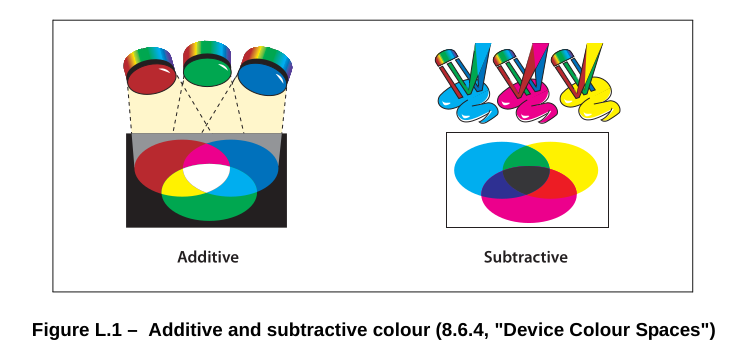

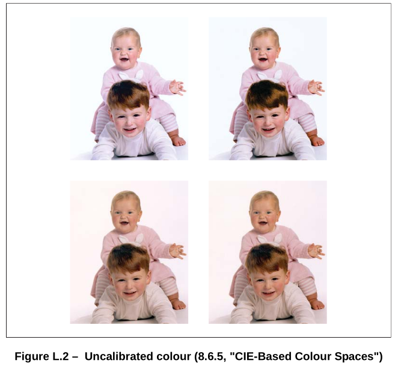

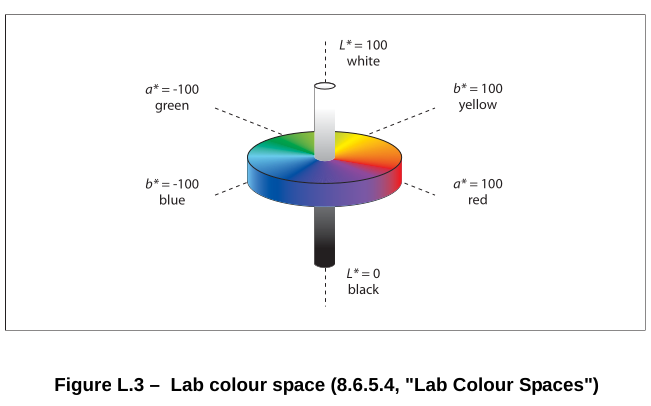

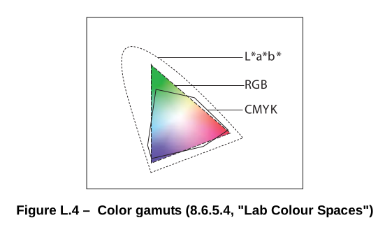

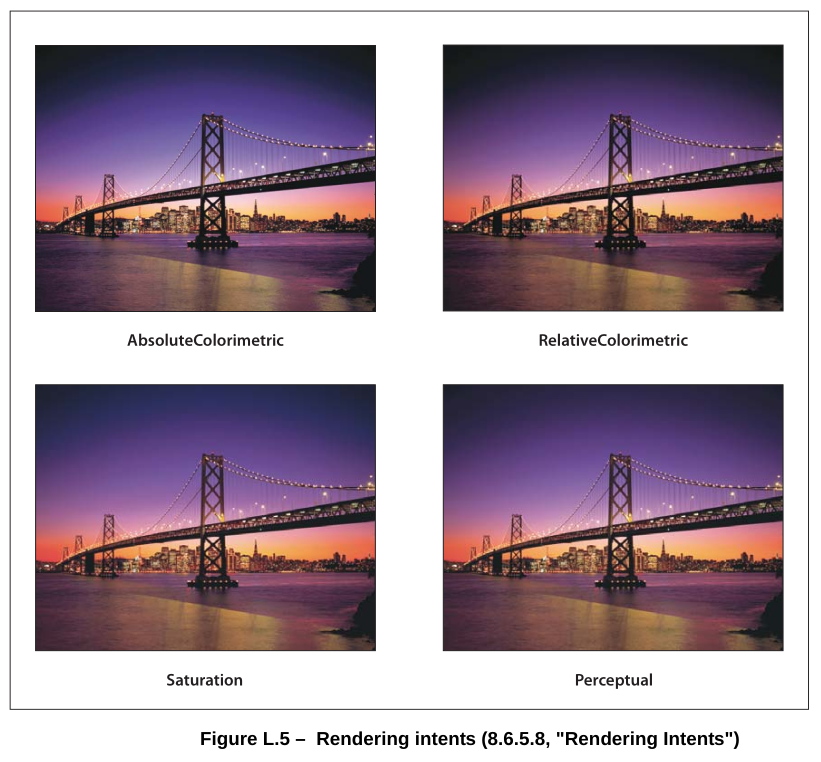

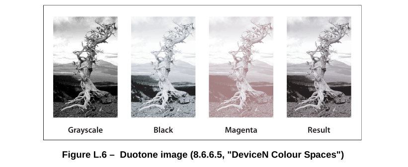

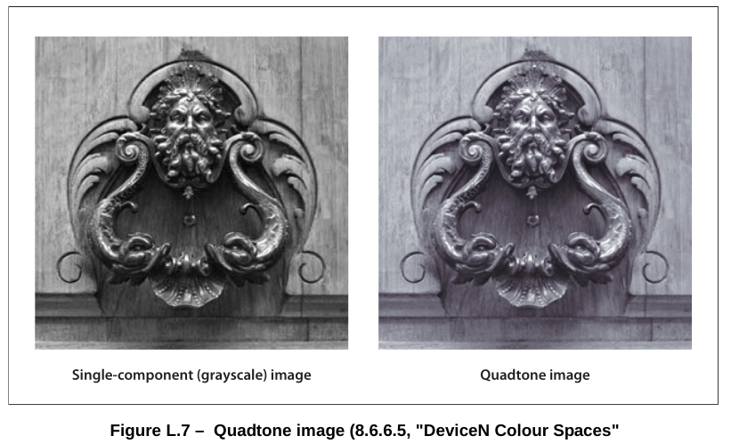

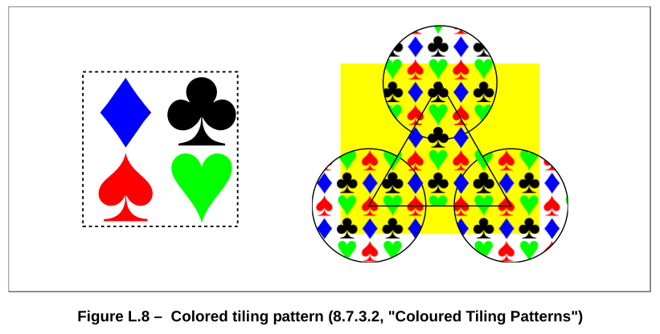

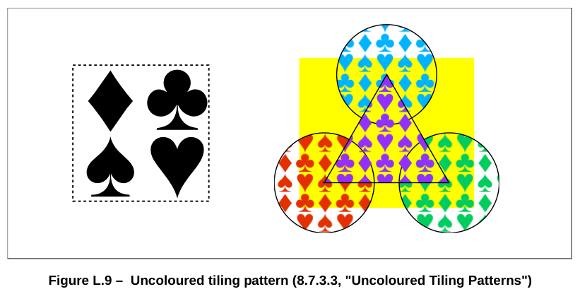

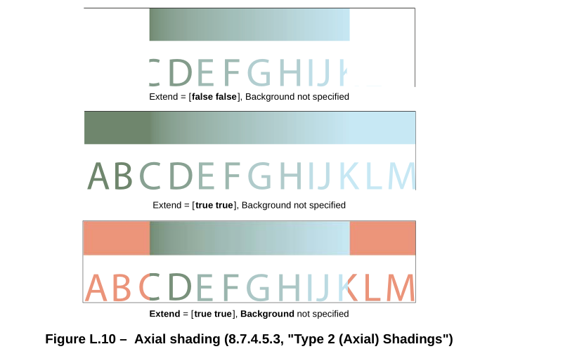

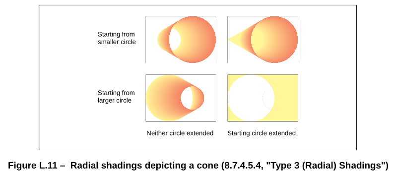

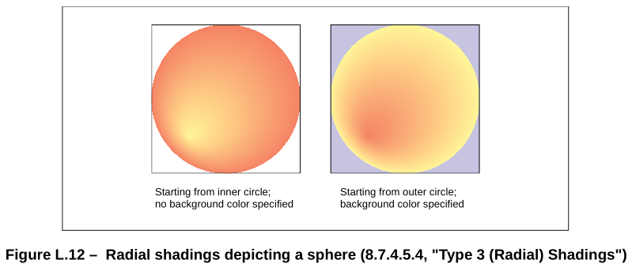

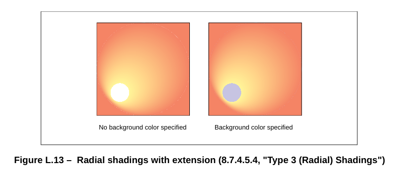

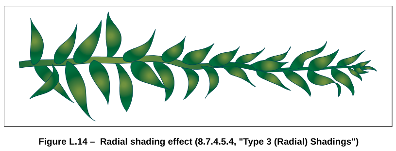

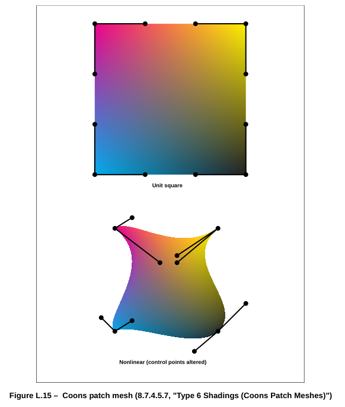

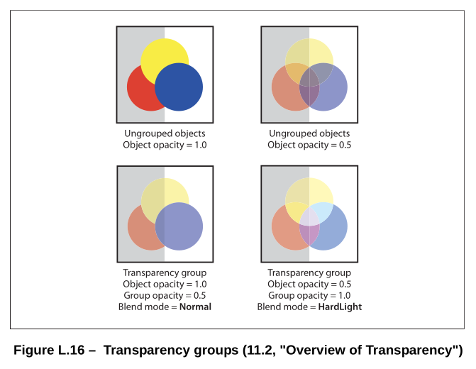

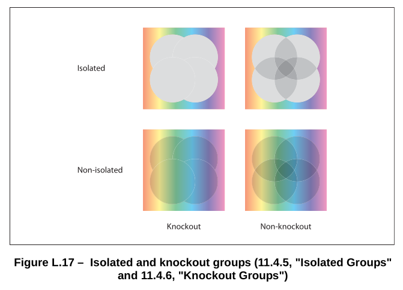

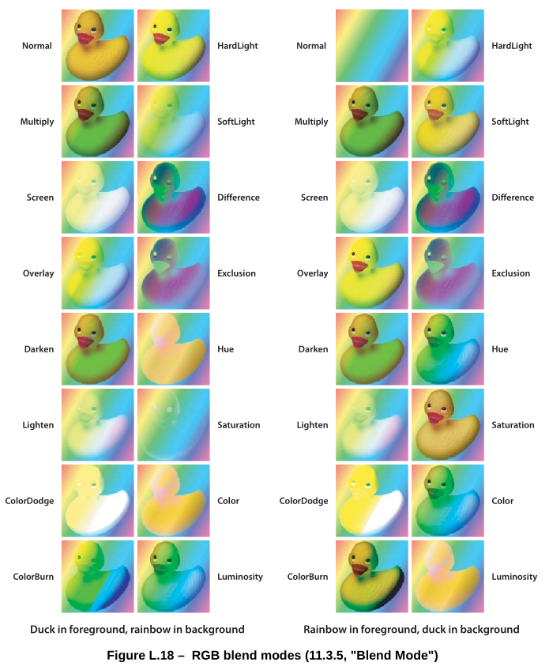

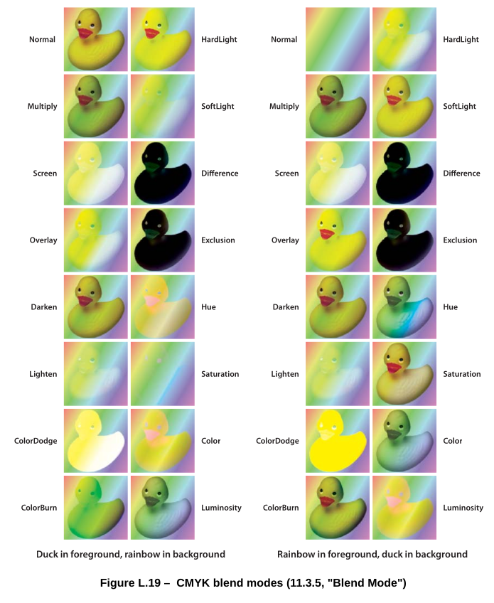

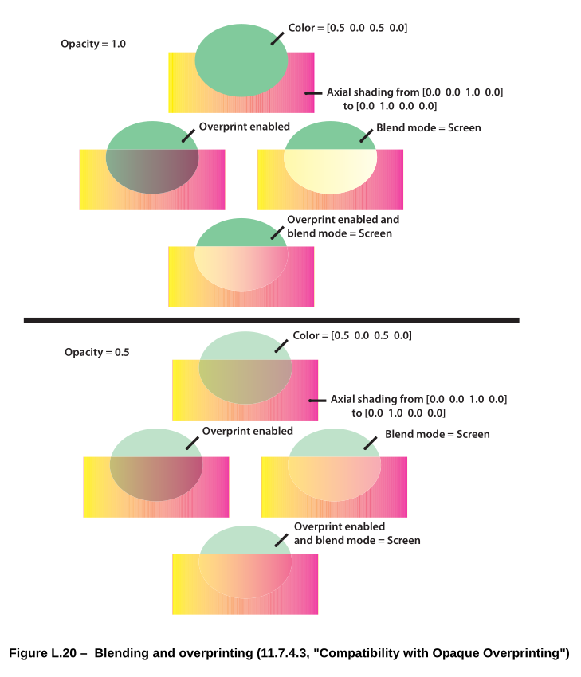
