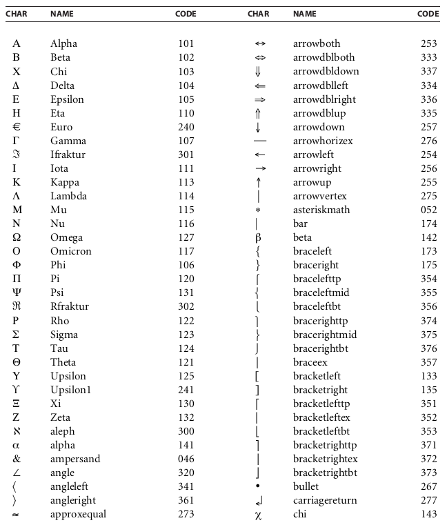
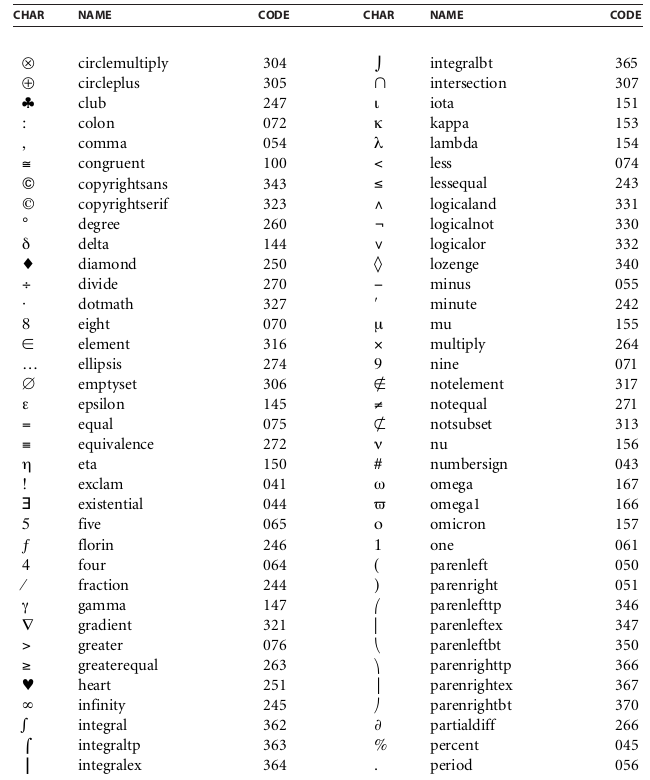
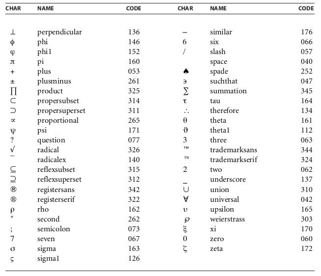
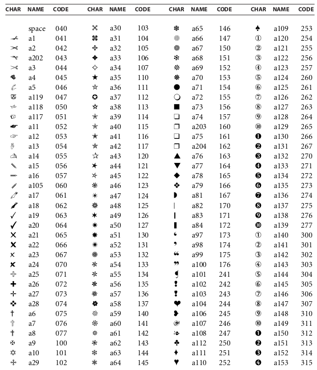
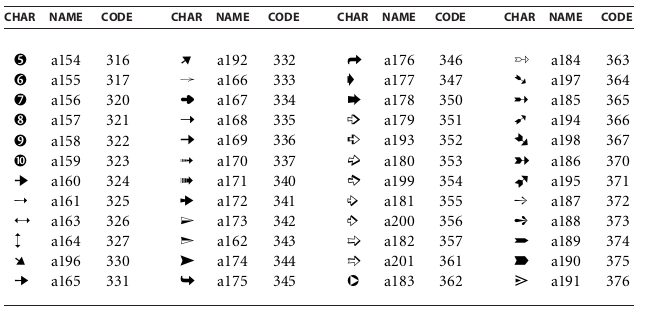

# 附录 D（规范性）字符集和编码

**Annex D (normative) Character Sets and Encodings**

## D.1 概述

**D.1 General**

=== "中文"

    This annex lists the character sets and encodings that shall be predefined in any conforming reader. Simple fonts, encompassing Latin text and some symbols, are described here. See [9.7.5.2], "Predefined CMaps" for a list of predefined CMaps for CID-keyed fonts.
    
    [D.2](#d2-拉丁字符集和编码), "Latin Character Set and Encodings", describes the entire character set for the Adobe standard Latin-text fonts. This character set shall be supported by the Times, Helvetica, and Courier font families, which are among the standard 14 predefined fonts; see [9.6.2.2], "Standard Type 1 Fonts (Standard 14 Fonts)". For each named character, an octal character code is defined for four different encodings: **StandardEncoding**, **MacRomanEncoding**, **WinAnsiEncoding**, and **PDFDocEncoding** (see [Table D.1](#tableD1)). Unencoded characters are indicated by a dash (—).
    
    [D.3](#d3--pdfdocencoding-字符集), "PDFDocEncoding Character Set", describes the entire set of characters that can be represented using PDFDocEncoding. It presents these characters in numerical order and it describes the Unicode representation of each character. This table overlaps the information presented in [D.2](#d2-拉丁字符集和编码), "Latin Character Set and Encodings", with respect to the presented octal character codes.
    
    [D.4](#d4-专家集和-macexpertencoding), "Expert Set and MacExpertEncoding", describes the “expert” character set, which contains additional characters useful for sophisticated typography, such as small capitals, ligatures, and fractions. For each named character, an octal character code is given in **MacExpertEncoding**.
    
    !!! note "NOTE"
    
        The built-in encoding in an expert font program may be different from **MacExpertEncoding**.
    
    [D.5](#d5-符号集和编码), "Symbol Set and Encoding", and [D.6](#d6-zapfdingbats-集和编码), "ZapfDingbats Set and Encoding", describe the character sets and built-in encodings for the Symbol and ZapfDingbats (ITC Zapf Dingbats) font programs, which shall be among the standard 14 predefined fonts. These fonts have built-in encodings that are unique to each font. The characters for ZapfDingbats are ordered by code instead of by name, since the names in that font are meaningless.
                                
    <table id="tableD1" markdown="span">
        <caption>**Table D.1 – Latin-text encodings**</caption>
        <thead>
            <tr>
                <th>**Encoding**</th>
                <th>**Description**</th>
            </tr>
        </thead>
        <tbody>
            <tr>
                <td>**StandardEncoding**</td>
                <td>Adobe standard Latin-text encoding. This is the built-in encoding defined in Type 1 Latin-text font programs (but generally not in TrueType font programs). Conforming readers shall not have a predefined encoding named **StandardEncoding**. However, it is necessary to describe this encoding, since a font’s built-in encoding can be used as the base encoding from which differences may be specified in an encoding dictionary.</td>
            </tr>
            <tr>
                <td>**MacRomanEncoding**</td>
                <td>Mac OS standard encoding for Latin text in Western writing systems. Conforming readers shall have a predefined encoding named **MacRomanEncoding** that may be used with both Type 1 and TrueType fonts.</td>
            </tr>
            <tr>
                <td>**WinAnsiEncoding**</td>
                <td>Windows Code Page 1252, often called the “Windows ANSI” encoding. This is the standard Windows encoding for Latin text in Western writing systems. Conforming readers shall have a predefined encoding named **WinAnsiEncoding** that may be used with both Type 1 and TrueType fonts.</td>
            </tr>
            <tr>
                <td>**PDFDocEncoding**</td>
                <td>Encoding for text strings in a PDF document outside the document’s content streams. This is one of two encodings (the other being Unicode) that may be used to represent text strings; see [7.9.2.2], "Text String Type". PDF does not have a predefined encoding named **PDFDocEncoding**; it is not customary to use this encoding to show text from fonts.</td>
            </tr>
            <tr>
                <td>**MacExpertEncoding**</td>
                <td>An encoding for use with expert fonts—ones containing the expert character set. Conforming readers shall have a predefined encoding named **MacExpertEncoding**. Despite its name, it is not a platform- specific encoding; however, only certain fonts have the appropriate character set for use with this encoding. No such fonts are among the standard 14 predefined fonts.</td>
            </tr>
        </tbody>
    </table>

=== "英文"

    This annex lists the character sets and encodings that shall be predefined in any conforming reader. Simple fonts, encompassing Latin text and some symbols, are described here. See [9.7.5.2], "Predefined CMaps" for a list of predefined CMaps for CID-keyed fonts.
    
    [D.2](#d2-拉丁字符集和编码), "Latin Character Set and Encodings", describes the entire character set for the Adobe standard Latin-text fonts. This character set shall be supported by the Times, Helvetica, and Courier font families, which are among the standard 14 predefined fonts; see [9.6.2.2], "Standard Type 1 Fonts (Standard 14 Fonts)". For each named character, an octal character code is defined for four different encodings: **StandardEncoding**, **MacRomanEncoding**, **WinAnsiEncoding**, and **PDFDocEncoding** (see [Table D.1](#tableD1)). Unencoded characters are indicated by a dash (—).
    
    [D.3](#d3--pdfdocencoding-字符集), "PDFDocEncoding Character Set", describes the entire set of characters that can be represented using PDFDocEncoding. It presents these characters in numerical order and it describes the Unicode representation of each character. This table overlaps the information presented in [D.2](#d2-拉丁字符集和编码), "Latin Character Set and Encodings", with respect to the presented octal character codes.
    
    [D.4](#d4-专家集和-macexpertencoding), "Expert Set and MacExpertEncoding", describes the “expert” character set, which contains additional characters useful for sophisticated typography, such as small capitals, ligatures, and fractions. For each named character, an octal character code is given in **MacExpertEncoding**.
    
    !!! note "NOTE"
    
        The built-in encoding in an expert font program may be different from **MacExpertEncoding**.
    
    [D.5](#d5-符号集和编码), "Symbol Set and Encoding", and [D.6](#d6-zapfdingbats-集和编码), "ZapfDingbats Set and Encoding", describe the character sets and built-in encodings for the Symbol and ZapfDingbats (ITC Zapf Dingbats) font programs, which shall be among the standard 14 predefined fonts. These fonts have built-in encodings that are unique to each font. The characters for ZapfDingbats are ordered by code instead of by name, since the names in that font are meaningless.
                                
    <table id="tableD1" markdown="span">
        <caption>**Table D.1 – Latin-text encodings**</caption>
        <thead>
            <tr>
                <th>**Encoding**</th>
                <th>**Description**</th>
            </tr>
        </thead>
        <tbody>
            <tr>
                <td>**StandardEncoding**</td>
                <td>Adobe standard Latin-text encoding. This is the built-in encoding defined in Type 1 Latin-text font programs (but generally not in TrueType font programs). Conforming readers shall not have a predefined encoding named **StandardEncoding**. However, it is necessary to describe this encoding, since a font’s built-in encoding can be used as the base encoding from which differences may be specified in an encoding dictionary.</td>
            </tr>
            <tr>
                <td>**MacRomanEncoding**</td>
                <td>Mac OS standard encoding for Latin text in Western writing systems. Conforming readers shall have a predefined encoding named **MacRomanEncoding** that may be used with both Type 1 and TrueType fonts.</td>
            </tr>
            <tr>
                <td>**WinAnsiEncoding**</td>
                <td>Windows Code Page 1252, often called the “Windows ANSI” encoding. This is the standard Windows encoding for Latin text in Western writing systems. Conforming readers shall have a predefined encoding named **WinAnsiEncoding** that may be used with both Type 1 and TrueType fonts.</td>
            </tr>
            <tr>
                <td>**PDFDocEncoding**</td>
                <td>Encoding for text strings in a PDF document outside the document’s content streams. This is one of two encodings (the other being Unicode) that may be used to represent text strings; see [7.9.2.2], "Text String Type". PDF does not have a predefined encoding named **PDFDocEncoding**; it is not customary to use this encoding to show text from fonts.</td>
            </tr>
            <tr>
                <td>**MacExpertEncoding**</td>
                <td>An encoding for use with expert fonts—ones containing the expert character set. Conforming readers shall have a predefined encoding named **MacExpertEncoding**. Despite its name, it is not a platform- specific encoding; however, only certain fonts have the appropriate character set for use with this encoding. No such fonts are among the standard 14 predefined fonts.</td>
            </tr>
        </tbody>
    </table>

## D.2 拉丁字符集和编码

**D.2 Latin Character Set and Encodings**
                                
<table markdown="span">
    <thead>
        <tr>
            <th rowspan=2 style=" vertical-align: middle;">**CHAR**</th>
            <th rowspan=2 style=" vertical-align: middle;">**NAME**</th>
            <th colspan=4 style="text-align: center; vertical-align: middle;">**CHAR CODE (OCTAL)**</th>
        </tr>
        <tr>
            <th style=" vertical-align: middle;">**STD**</th>
            <th style=" vertical-align: middle;">**MAC**</th>
            <th style=" vertical-align: middle;">**WIN**</th>
            <th style=" vertical-align: middle;">**PDF**</th>
        </tr>
    </thead>
    <tbody>
        <tr><td>A</td> <td>A</td> <td>101</td> <td>101</td><td>101</td><td>101</td></tr>
        <tr><td>Æ</td> <td>AE</td> <td>341</td> <td>256</td><td>306</td><td>306</td></tr>
        <tr><td>Á</td> <td>Aacute</td> <td>—</td> <td>347</td><td>301</td><td>301</td></tr>
        <tr><td>Â</td> <td>Acircumflex</td> <td>—</td> <td>345</td><td>302</td><td>302</td></tr>
        <tr><td>Ä</td> <td>Adieresis</td> <td>—</td> <td>200</td><td>304</td><td>304</td></tr>
        <tr><td>À</td> <td>Agrave</td> <td>—</td> <td>313</td><td>300</td><td>300</td></tr>
        <tr><td>Å</td> <td>Aring</td> <td>—</td> <td>201</td><td>305</td><td>305</td></tr>
        <tr><td>Ã</td> <td>Atilde</td> <td>—</td> <td>314</td><td>303</td><td>303</td></tr>
        <tr><td>B</td> <td>B</td> <td>102</td> <td>102</td><td>102</td><td>102</td></tr>
        <tr><td>C</td> <td>C</td> <td>103</td> <td>103</td><td>103</td><td>103</td></tr>
        <tr><td>Ç</td> <td>Ccedilla</td> <td>—</td> <td>202</td><td>307</td><td>307</td></tr>
        <tr><td>D</td> <td>D</td> <td>104</td> <td>104</td><td>104</td><td>104</td></tr>
        <tr><td>E</td> <td>E</td> <td>105</td> <td>105</td><td>105</td><td>105</td></tr>
        <tr><td>É</td> <td>Eacute</td> <td>—</td> <td>203</td><td>311</td><td>311</td></tr>
        <tr><td>Ê</td> <td>Ecircumflex</td> <td>—</td> <td>346</td><td>312</td><td>312</td></tr>
        <tr><td>Ë</td> <td>Edieresis</td> <td>—</td> <td>350</td><td>313</td><td>313</td></tr>
        <tr><td>È</td> <td>Egrave</td> <td>—</td> <td>351</td><td>310</td><td>310</td></tr>
        <tr><td>Ð</td> <td>Eth</td> <td>—</td> <td>—</td><td>320</td><td>320</td></tr>
        <tr><td>€</td> <td>Euro 1</td> <td>—</td> <td>—</td><td>200</td><td>240</td></tr>
        <tr><td>F</td> <td>F</td> <td>106</td> <td>106</td><td>106</td><td>106</td></tr>
        <tr><td>G</td> <td>G</td> <td>107</td> <td>107</td><td>107</td><td>107</td></tr>
        <tr><td>H</td> <td>H</td> <td>110</td> <td>110</td><td>110</td><td>110</td></tr>
        <tr><td>I</td> <td>I</td> <td>111</td> <td>111</td><td>111</td><td>111</td></tr>
        <tr><td>Í</td> <td>Iacute</td> <td>—</td> <td>352</td><td>315</td><td>315</td></tr>
        <tr><td>Î</td> <td>Icircumflex</td> <td>—</td> <td>353</td><td>316</td><td>316</td></tr>
        <tr><td>Ï</td> <td>Idieresis</td> <td>—</td> <td>354</td><td>317</td><td>317</td></tr>
        <tr><td>Ì</td> <td>Igrave</td> <td>—</td> <td>355</td><td>314</td><td>314</td></tr>
        <tr><td>J</td> <td>J</td> <td>112</td> <td>112</td><td>112</td><td>112</td></tr>
        <tr><td>K</td> <td>K</td> <td>113</td> <td>113</td><td>113</td><td>113</td></tr>
        <tr><td>L</td> <td>L</td> <td>114</td> <td>114</td><td>114</td><td>114</td></tr>
        <tr><td>Ł</td> <td>Lslash</td> <td>350</td> <td>—</td><td>—</td><td>225</td></tr>
        <tr><td>M</td> <td>M</td> <td>115</td> <td>115</td><td>115</td><td>115</td></tr>
        <tr><td>N</td> <td>N</td> <td>116</td> <td>116</td><td>116</td><td>116</td></tr>
        <tr><td>Ñ</td> <td>Ntilde</td> <td>—</td> <td>204</td><td>321</td><td>321</td></tr>
        <tr><td>O</td> <td>O</td> <td>117</td> <td>117</td><td>117</td><td>117</td></tr>
        <tr><td>Œ</td><td>OE</td><td>352</td><td>316</td><td>214</td><td>226</td></tr>
        <tr><td>Ó</td><td>Oacute</td><td>—</td><td>356</td><td>323</td><td>323</td></tr>
        <tr><td>Ô</td><td>Ocircumflex</td><td>—</td><td>357</td><td>324</td><td>324</td></tr>
        <tr><td>Ö</td><td>Odieresis</td><td>—</td><td>205</td><td>326</td><td>326</td></tr>
        <tr><td>Ò</td><td>Ograve</td><td>—</td><td>361</td><td>322</td><td>322</td></tr>
        <tr><td>Ø</td><td>Oslash</td><td>351</td><td>257</td><td>330</td><td>330</td></tr>
        <tr><td>Õ</td><td>Otilde</td><td>—</td><td>315</td><td>325</td><td>325</td></tr>
        <tr><td>P</td><td>P</td><td>120</td><td>120</td><td>120</td><td>120</td></tr>
        <tr><td>Q</td><td>Q</td><td>121</td><td>121</td><td>121</td><td>121</td></tr>
        <tr><td>R</td><td>R</td><td>122</td><td>122</td><td>122</td><td>122</td></tr>
        <tr><td>S</td><td>S</td><td>123</td><td>123</td><td>123</td><td>123</td></tr>
        <tr><td>Š</td><td>Scaron</td><td>—</td><td>—</td><td>212</td><td>227</td></tr>
        <tr><td>T</td><td>T</td><td>124</td><td>124</td><td>124</td><td>124</td></tr>
        <tr><td>Þ</td><td>Thorn</td><td>—</td><td>—</td><td>336</td><td>336</td></tr>
        <tr><td>U</td><td>U</td><td>125</td><td>125</td><td>125</td><td>125</td></tr>
        <tr><td>Ú</td><td>Uacute</td><td>—</td><td>362</td><td>332</td><td>332</td></tr>
        <tr><td>Û</td><td>Ucircumflex</td><td>—</td><td>363</td><td>333</td><td>333</td></tr>
        <tr><td>Ü</td><td>Udieresis</td><td>—</td><td>206</td><td>334</td><td>334</td></tr>
        <tr><td>Ù</td><td>Ugrave</td><td>—</td><td>364</td><td>331</td><td>331</td></tr>
        <tr><td>V</td><td>V</td><td>126</td><td>126</td><td>126</td><td>126</td></tr>
        <tr><td>W</td><td>W</td><td>127</td><td>127</td><td>127</td><td>127</td></tr>
        <tr><td>X</td><td>X</td><td>130</td><td>130</td><td>130</td><td>130</td></tr>
        <tr><td>Y</td><td>Y</td><td>131</td><td>131</td><td>131</td><td>131</td></tr>
        <tr><td>Ý</td><td>Yacute</td><td>—</td><td>—</td><td>335</td><td>335</td></tr>
        <tr><td>Ÿ</td><td>Ydieresis</td><td>—</td><td>331</td><td>237</td><td>230</td></tr>
        <tr><td>Z</td><td>Z</td><td>132</td><td>132</td><td>132</td><td>132</td></tr>
        <tr><td>Ž</td><td>Zcaron 2</td><td>—</td><td>—</td><td>216</td><td>231</td></tr>
        <tr><td>a</td><td>a</td><td>141</td><td>141</td><td>141</td><td>141</td></tr>
        <tr><td>á</td><td>aacute</td><td>—</td><td>207</td><td>341</td><td>341</td></tr>
        <tr><td>â</td><td>acircumflex</td><td>—</td><td>211</td><td>342</td><td>342</td></tr>
        <tr><td>´</td><td>acute</td><td>302</td><td>253</td><td>264</td><td>264</td></tr>
        <tr><td>ä</td><td>adieresis</td><td>—</td><td>212</td><td>344</td><td>344</td></tr>
        <tr><td>æ</td><td>ae</td><td>361</td><td>276</td><td>346</td><td>346</td></tr>
        <tr><td>à</td><td>agrave</td><td>—</td><td>210</td><td>340</td><td>340</td></tr>
        <tr><td>&</td><td>ampersand</td><td>046</td><td>046</td><td>046</td><td>046</td></tr>
        <tr><td>å</td><td>aring</td><td>—</td><td>214</td><td>345</td><td>345</td></tr>
        <tr><td>^</td><td>asciicircum</td><td>136</td><td>136</td><td>136</td><td>136</td></tr>
        <tr><td>~</td><td>asciitilde</td><td>176</td><td>176</td><td>176</td><td>176</td></tr>
        <tr><td>*</td><td>asterisk</td><td>052</td><td>052</td><td>052</td><td>052</td></tr>
        <tr><td>@</td><td>at</td><td>100</td><td>100</td><td>100</td><td>100</td></tr>
        <tr><td>ã</td><td>atilde</td><td>—</td><td>213</td><td>343</td><td>343</td></tr>
        <tr><td>b</td><td>b</td><td>142</td><td>142</td><td>142</td><td>142</td></tr>
        <tr><td>\</td><td>backslash</td><td>134</td><td>134</td><td>134</td><td>134</td></tr>
        <tr><td>|</td><td>bar</td><td>174</td><td>174</td><td>174</td><td>174</td></tr>
        <tr><td>{</td><td>braceleft</td><td>173</td><td>173</td><td>173</td><td>173</td></tr>
        <tr><td>}</td><td>braceright</td><td>175</td><td>175</td><td>175</td><td>175</td></tr>
        <tr><td>[</td><td>bracketleft</td><td>133</td><td>133</td><td>133</td><td>133</td></tr>
        <tr><td>]</td><td>bracketright</td><td>135</td><td>135</td><td>135</td><td>135</td></tr>
        <tr><td>˘</td><td>breve</td><td>306</td><td>371</td><td>—</td><td>030</td></tr>
        <tr><td>¦</td><td>brokenbar</td><td>—</td><td>—</td><td>246</td><td>246</td></tr>
        <tr><td>•</td><td>bullet 3</td><td>267</td><td>245</td><td>225</td><td>200</td></tr>
        <tr><td>c</td><td>c</td><td>143</td><td>143</td><td>143</td><td>143</td></tr>
        <tr><td>ˇ</td><td>caron</td><td>317</td><td>377</td><td>—</td><td>031</td></tr>
        <tr><td>ç</td><td>ccedilla</td><td>—</td><td>215</td><td>347</td><td>347</td></tr>
        <tr><td>¸</td><td>cedilla</td><td>313</td><td>374</td><td>270</td><td>270</td></tr>
        <tr><td>¢</td><td>cent</td><td>242</td><td>242</td><td>242</td><td>242</td></tr>
        <tr><td>ˆ</td><td>circumflex</td><td>303</td><td>366</td><td>210</td><td>032</td></tr>
        <tr><td>:</td><td>colon</td><td>072</td><td>072</td><td>072</td><td>072</td></tr>
        <tr><td>,</td><td>comma</td><td>054</td><td>054</td><td>054</td><td>054</td></tr>
        <tr><td>©</td><td>copyright</td><td>—</td><td>251</td><td>251</td><td>251</td></tr>
        <tr><td>¤</td><td>currency 1</td><td>250</td><td>333</td><td>244</td><td>244</td></tr>
        <tr><td>d</td><td>d</td><td>144</td><td>144</td><td>144</td><td>144</td></tr>
        <tr><td>†</td><td>dagger</td><td>262</td><td>240</td><td>206</td><td>201</td></tr>
        <tr><td>‡</td><td>daggerdbl</td><td>263</td><td>340</td><td>207</td><td>202</td></tr>
        <tr><td>°</td><td>degree</td><td>—</td><td>241</td><td>260</td><td>260</td></tr>
        <tr><td>¨</td><td>dieresis</td><td>310</td><td>254</td><td>250</td><td>250</td></tr>
        <tr><td>÷</td><td>divide</td><td>—</td><td>326</td><td>367</td><td>367</td></tr>
        <tr><td>$</td><td>dollar</td><td>044</td><td>044</td><td>044</td><td>044</td></tr>
        <tr><td>˙</td><td>dotaccent</td><td>307</td><td>372</td><td>—</td><td>033</td></tr>
        <tr><td>ı</td><td>dotlessi</td><td>365</td><td>365</td><td>—</td><td>232</td></tr>
        <tr><td>e</td><td>e</td><td>145</td><td>145</td><td>145</td><td>145</td></tr>
        <tr><td>é</td><td>eacute</td><td>—</td><td>216</td><td>351</td><td>351</td></tr>
        <tr><td>ê</td><td>ecircumflex</td><td> —</td><td>220</td><td>352</td><td>352</td></tr>
        <tr><td>ë</td><td>edieresis</td><td> —</td><td>221</td><td>353</td><td>353</td></tr>
        <tr><td>è</td><td>egrave</td><td> —</td><td>217</td><td>350</td><td>350</td></tr>
        <tr><td>8</td><td>eight</td><td> 070</td><td>070</td><td>070</td><td>070</td></tr>
        <tr><td>…</td><td>ellipsis</td><td> 274</td><td>311</td><td>205</td><td>203</td></tr>
        <tr><td>—</td><td>emdash</td><td> 320</td><td>321</td><td>227</td><td>204</td></tr>
        <tr><td>–</td><td>endash</td><td> 261</td><td>320</td><td>226</td><td>205</td></tr>
        <tr><td>=</td><td>equal</td><td> 075</td><td>075</td><td>075</td><td>075</td></tr>
        <tr><td>ð</td><td>eth</td><td> —</td><td>—</td><td>360</td><td>360</td></tr>
        <tr><td>!</td><td>exclam</td><td> 041</td><td>041</td><td>041</td><td>041</td></tr>
        <tr><td>¡</td><td>exclamdown</td><td> 241</td><td>301</td><td>241</td><td>241</td></tr>
        <tr><td>f</td><td>f</td><td> 146</td><td>146</td><td>146</td><td>146</td></tr>
        <tr><td>fi</td><td>fi</td><td> 256</td><td>336</td><td>—</td><td>223</td></tr>
        <tr><td>5</td><td>five</td><td> 065</td><td>065</td><td>065</td><td>065</td></tr>
        <tr><td>fl</td><td>fl</td><td> 257</td><td>337</td><td>—</td><td>224</td></tr>
        <tr><td>ƒ</td><td>florin</td><td> 246</td><td>304</td><td>203</td><td>206</td></tr>
        <tr><td>4</td><td>four</td><td> 064</td><td>064</td><td>064</td><td>064</td></tr>
        <tr><td>⁄</td><td>fraction</td><td> 244</td><td>332</td><td>—</td><td>207</td></tr>
        <tr><td>g</td><td>g</td><td> 147</td><td>147</td><td>147</td><td>147</td></tr>
        <tr><td>ß</td><td>germandbls</td><td> 373</td><td>247</td><td>337</td><td>337</td></tr>
        <tr><td>`</td><td>grave</td><td> 301</td><td>140</td><td>140</td><td>140</td></tr>
        <tr><td>></td><td>greater</td><td> 076</td><td>076</td><td>076</td><td>076</td></tr>
        <tr><td>«</td><td>guillemotleft4</td><td> 253</td><td>307</td><td>253</td><td>253</td></tr>
        <tr><td>»</td><td>guillemotright4</td><td> 273</td><td>310</td><td>273</td><td>273</td></tr>
        <tr><td>‹</td><td>guilsinglleft</td><td> 254</td><td>334</td><td>213</td><td>210</td></tr>
        <tr><td>›</td><td>guilsinglright</td><td> 255</td><td>335</td><td>233</td><td>211</td></tr>
        <tr><td>h</td><td>h</td><td> 150</td><td>150</td><td>150</td><td>150</td></tr>
        <tr><td>˝</td><td>hungarumlaut</td><td> 315</td><td>375</td><td>—</td><td>034</td></tr>
        <tr><td>-</td><td>hyphen5</td><td> 055</td><td>055</td><td>055</td><td>055</td></tr>
        <tr><td>i</td><td>i</td><td> 151</td><td>151</td><td>151</td><td>151</td></tr>
        <tr><td>í</td><td>iacute</td><td> —</td><td>222</td><td>355</td><td>355</td></tr>
        <tr><td>î</td><td>icircumflex</td><td> —</td><td>224</td><td>356</td><td>356</td></tr>
        <tr><td>ï</td><td>idieresis</td><td> —</td><td>225</td><td>357</td><td>357</td></tr>
        <tr><td>ì</td><td>igrave</td><td> —</td><td>223</td><td>354</td><td>354</td></tr>
        <tr><td>j</td><td>j</td><td> 152</td><td>152</td><td>152</td><td>152</td></tr>
        <tr><td>k</td><td>k</td><td> 153</td><td>153</td><td>153</td><td>153</td></tr>
        <tr><td>l</td><td>l</td><td> 154</td><td>154</td><td>154</td><td>154</td></tr>
        <tr><td><</td><td>less</td><td>074</td><td>074</td><td>074</td><td>074</td></tr>
        <tr><td>¬</td><td>logicalnot</td><td>—</td><td>302</td><td>254</td><td>254</td></tr>
        <tr><td>ł</td><td>lslash</td><td>370</td><td>—</td><td>—</td><td>233</td></tr>
        <tr><td>m</td><td>m</td><td>155</td><td>155</td><td>155</td><td>155</td></tr>
        <tr><td>¯</td><td>macron</td><td>305</td><td>370</td><td>257</td><td>257</td></tr>
        <tr><td>−</td><td>minus</td><td>—</td><td>—</td><td>—</td><td>212</td></tr>
        <tr><td>μ</td><td>mu</td><td>—</td><td>265</td><td>265</td><td>265</td></tr>
        <tr><td>×</td><td>multiply</td><td>—</td><td>—</td><td>327</td><td>327</td></tr>
        <tr><td>n</td><td>n</td><td>156</td><td>156</td><td>156</td><td>156</td></tr>
        <tr><td>9</td><td>nine</td><td>071</td><td>071</td><td>071</td><td>071</td></tr>
        <tr><td>ñ</td><td>ntilde</td><td>—</td><td>226</td><td>361</td><td>361</td></tr>
        <tr><td>#</td><td>numbersign</td><td>043</td><td>043</td><td>043</td><td>043</td></tr>
        <tr><td>o</td><td>o</td><td>157</td><td>157</td><td>157</td><td>157</td></tr>
        <tr><td>ó</td><td>oacute</td><td>—</td><td>227</td><td>363</td><td>363</td></tr>
        <tr><td>ô</td><td>ocircumflex</td><td>—</td><td>231</td><td>364</td><td>364</td></tr>
        <tr><td>ö</td><td>odieresis</td><td>—</td><td>232</td><td>366</td><td>366</td></tr>
        <tr><td>œ</td><td>oe</td><td>372</td><td>317</td><td>234</td><td>234</td></tr>
        <tr><td>˛</td><td>ogonek</td><td>316</td><td>376</td><td>—</td><td>035</td></tr>
        <tr><td>ò</td><td>ograve</td><td>—</td><td>230</td><td>362</td><td>362</td></tr>
        <tr><td>1</td><td>one</td><td>061</td><td>061</td><td>061</td><td>061</td></tr>
        <tr><td>½</td><td>onehalf</td><td>—</td><td>—</td><td>275</td><td>275</td></tr>
        <tr><td>¼</td><td>onequarter</td><td>—</td><td>—</td><td>274</td><td>274</td></tr>
        <tr><td>¹</td><td>onesuperior</td><td>—</td><td>—</td><td>271</td><td>271</td></tr>
        <tr><td>ª</td><td>ordfeminine</td><td>343</td><td>273</td><td>252</td><td>252</td></tr>
        <tr><td>º</td><td>ordmasculine</td><td>353</td><td>274</td><td>272</td><td>272</td></tr>
        <tr><td>ø</td><td>oslash</td><td>371</td><td>277</td><td>370</td><td>370</td></tr>
        <tr><td>õ</td><td>otilde</td><td>—</td><td>233</td><td>365</td><td>365</td></tr>
        <tr><td>p</td><td>p</td><td>160</td><td>160</td><td>160</td><td>160</td></tr>
        <tr><td>¶</td><td>paragraph</td><td>266</td><td>246</td><td>266</td><td>266</td></tr>
        <tr><td>(</td><td>parenleft</td><td>050</td><td>050</td><td>050</td><td>050</td></tr>
        <tr><td>)</td><td>parenright</td><td>051</td><td>051</td><td>051</td><td>051</td></tr>
        <tr><td>%</td><td>percent</td><td>045</td><td>045</td><td>045</td><td>045</td></tr>
        <tr><td>.</td><td>period</td><td>056</td><td>056</td><td>056</td><td>056</td></tr>
        <tr><td>·</td><td>periodcentered</td><td>264</td><td>341</td><td>267</td><td>267</td></tr>
        <tr><td>‰</td><td>perthousand</td><td>275</td><td>344</td><td>211</td><td>213</td></tr>
        <tr><td>+</td><td>plus</td><td>053</td><td>053</td><td>053</td><td>053</td></tr>
        <tr><td>±</td><td>plusminus</td><td>—</td><td>261</td><td>261</td><td>261</td></tr>
        <tr><td>q</td><td>q</td><td>161</td><td>161</td><td>161</td><td>161</td></tr>
        <tr><td>?</td><td>question</td><td>077</td><td>077</td><td>077</td><td>077</td></tr>
        <tr><td>¿</td><td>questiondown</td><td>277</td><td>300</td><td>277</td><td>277</td></tr>
        <tr><td>"</td><td>quotedbl</td><td>042</td><td>042</td><td>042</td><td>042</td></tr>
        <tr><td>„</td><td>quotedblbase</td><td>271</td><td>343</td><td>204</td><td>214</td></tr>
        <tr><td>“</td><td>quotedblleft</td><td>252</td><td>322</td><td>223</td><td>215</td></tr>
        <tr><td>”</td><td>quotedblright</td><td>272</td><td>323</td><td>224</td><td>216</td></tr>
        <tr><td>‘</td><td>quoteleft</td><td>140</td><td>324</td><td>221</td><td>217</td></tr>
        <tr><td>’</td><td>quoteright</td><td>047</td><td>325</td><td>222</td><td>220</td></tr>
        <tr><td>‚</td><td>quotesinglbase</td><td>270</td><td>342</td><td>202</td><td>221</td></tr>
        <tr><td>'</td><td>quotesingle</td><td>251</td><td>047</td><td>047</td><td>047</td></tr>
        <tr><td>r</td><td>r</td><td>162</td><td>162</td><td>162</td><td>162</td></tr>
        <tr><td>®</td><td>registered</td><td>—</td><td>250</td><td>256</td><td>256</td></tr>
        <tr><td>˚</td><td>ring</td><td>312</td><td>373</td><td>—</td><td>036</td></tr>
        <tr><td>s</td><td>s</td><td>163</td><td>163</td><td>163</td><td>163</td></tr>
        <tr><td>š</td><td>scaron</td><td>—</td><td>—</td><td>232</td><td>235</td></tr>
        <tr><td>§</td><td>section</td><td>247</td><td>244</td><td>247</td><td>247</td></tr>
        <tr><td>;</td><td>semicolon</td><td>073</td><td>073</td><td>073</td><td>073</td></tr>
        <tr><td>7</td><td>seven</td><td>067</td><td>067</td><td>067</td><td>067</td></tr>
        <tr><td>6</td><td>six</td><td>066</td><td>066</td><td>066</td><td>066</td></tr>
        <tr><td>/</td><td>slash</td><td>057</td><td>057</td><td>057</td><td>057</td></tr>
        <tr><td>&nbsp;</td><td>space6</td><td>040</td><td>040</td><td>040</td><td>040</td></tr>
        <tr><td>£</td><td>sterling</td><td>243</td><td>243</td><td>243</td><td>243</td></tr>
        <tr><td>t</td><td>t</td><td>164</td><td>164</td><td>164</td><td>164</td></tr>
        <tr><td>þ</td><td>thorn</td><td>—</td><td>—</td><td>376</td><td>376</td></tr>
        <tr><td>3</td><td>three</td><td>063</td><td>063</td><td>063</td><td>063</td></tr>
        <tr><td>¾</td><td>threequarters</td><td>—</td><td>—</td><td>276</td><td>276</td></tr>
        <tr><td>³</td><td>threesuperior</td><td>—</td><td>—</td><td>263</td><td>263</td></tr>
        <tr><td>˜</td><td>tilde</td><td>304</td><td>367</td><td>230</td><td>037</td></tr>
        <tr><td>™</td><td>trademark</td><td>—</td><td>252</td><td>231</td><td>222</td></tr>
        <tr><td>2</td><td>two</td><td>062</td><td>062</td><td>062</td><td>062</td></tr>
        <tr><td>²</td><td>twosuperior</td><td>—</td><td>—</td><td>262</td><td>262</td></tr>
        <tr><td>u</td><td>u</td><td>165</td><td>165</td><td>165</td><td>165</td></tr>
        <tr><td>ú</td><td>uacute</td><td>—</td><td>234</td><td>372</td><td>372</td></tr>
        <tr><td>û</td><td>ucircumflex</td><td>—</td><td>236</td><td>373</td><td>373</td></tr>
        <tr><td>ü</td><td>udieresis</td><td>—</td><td>237</td><td>374</td><td>374</td></tr>
        <tr><td>ù</td><td>ugrave</td><td>—</td><td>235</td><td>371</td><td>371</td></tr>
        <tr><td>_</td><td>underscore</td><td>137</td><td>137</td><td>137</td><td>137</td></tr>
        <tr><td>v</td><td>v</td><td>166</td><td>166</td><td>166</td><td>166</td></tr>
        <tr><td>w</td><td>w</td><td>167</td><td>167</td><td>167</td><td>167</td></tr>
        <tr><td>x</td><td>x</td><td>170</td><td>170</td><td>170</td><td>170</td></tr>
        <tr><td>y</td><td>y</td><td>171</td><td>171</td><td>171</td><td>171</td></tr>
        <tr><td>ý</td><td>yacute</td><td>—</td><td>—</td><td>375</td><td>375</td></tr>
        <tr><td>ÿ</td><td>ydieresis</td><td>—</td><td>330</td><td>377</td><td>377</td></tr>
        <tr><td>¥</td><td>yen</td><td>245</td><td>264</td><td>245</td><td>245</td></tr>
        <tr><td>z</td><td>z</td><td>172</td><td>172</td><td>172</td><td>172</td></tr>
        <tr><td>ž</td><td>zcaron2</td><td>—</td><td>—</td><td>236</td><td>236</td></tr>
        <tr><td>0</td><td>zero</td><td>060</td><td>060</td><td>060</td><td>060</td></tr>
    </tbody>
</table>

=== "中文"

    1. In PDF 1.3, the euro character was added to the Adobe standard Latin character set. It shall be en- coded as 200 in WinAns**i**Encoding and 240 in **PDFDocEncoding**, assigning codes that were pre- viously unused. Apple changed the Mac OS Latin-text encoding for code 333 from the currency character to the euro character. However, this incompatible change has not been reflected in PDF’s **MacRomanEncoding**, which shall continue to map code 333 to currency. If the euro character is desired, an encoding dictionary may be used to specify this single difference from **MacRomanEn-coding**.
    2. In PDF 1.3, the existing Zcaron and zcaron characters were added to **WinAnsiEncoding** as the previously unused codes 216 and 236.
    3. In **WinAnsiEncoding**, all unused codes greater than 40 map to the bullet character. However, only code 225 shall be specifically assigned to the bullet character; other codes are subject to future re- assignment.
    4. The character names guillemotleft and guillemotright are misspelled. The correct spelling for this punctuation character is guillemet. However, the misspelled names are the ones actually used in the fonts and encodings containing these characters.
    5. The hyphen character is also encoded as 255 in **WinAnsiEncoding**. The meaning of this duplicate code shall be “soft hyphen,” but it shall be typographically the same as hyphen.
    6. The SPACE character shall also be encoded as 312 in **MacRomanEncoding** and as 240 in **WinAnsiEncoding**. This duplicate code shall signify a nonbreaking space; it shall be typographi- cally the same as (U+003A) SPACE.

=== "英文"

    1. In PDF 1.3, the euro character was added to the Adobe standard Latin character set. It shall be en- coded as 200 in WinAns**i**Encoding and 240 in **PDFDocEncoding**, assigning codes that were pre- viously unused. Apple changed the Mac OS Latin-text encoding for code 333 from the currency character to the euro character. However, this incompatible change has not been reflected in PDF’s **MacRomanEncoding**, which shall continue to map code 333 to currency. If the euro character is desired, an encoding dictionary may be used to specify this single difference from **MacRomanEn-coding**.
    2. In PDF 1.3, the existing Zcaron and zcaron characters were added to **WinAnsiEncoding** as the previously unused codes 216 and 236.
    3. In **WinAnsiEncoding**, all unused codes greater than 40 map to the bullet character. However, only code 225 shall be specifically assigned to the bullet character; other codes are subject to future re- assignment.
    4. The character names guillemotleft and guillemotright are misspelled. The correct spelling for this punctuation character is guillemet. However, the misspelled names are the ones actually used in the fonts and encodings containing these characters.
    5. The hyphen character is also encoded as 255 in **WinAnsiEncoding**. The meaning of this duplicate code shall be “soft hyphen,” but it shall be typographically the same as hyphen.
    6. The SPACE character shall also be encoded as 312 in **MacRomanEncoding** and as 240 in **WinAnsiEncoding**. This duplicate code shall signify a nonbreaking space; it shall be typographi- cally the same as (U+003A) SPACE.

## D.3  PDFDocEncoding 字符集

**D.3 PDFDocEncoding Character Set**

=== "中文"
    
    The column titled Notes uses the following abbreviations:
    
    U &emsp; *Undefined* code point in PDFDocEncoding
    
    SR &emsp; Unicode codepoint that may require *special representation* in XML in some contexts.

=== "英文"
    
    The column titled Notes uses the following abbreviations:
    
    U &emsp; *Undefined* code point in PDFDocEncoding
    
    SR &emsp; Unicode codepoint that may require *special representation* in XML in some contexts.
                                
<table id="tableD2" markdown="span">
    <caption>**Table D.2 – PDFDocEncoding Character Set**</caption>
    <thead>
        <tr>
            <th>**Character**</th>
            <th>**Dec**</th>
            <th>**Hex**</th>
            <th>**Octal**</th>
            <th>**Unicode**</th>
            <th>**Unicode character name or  (alternative alias)**</th>
            <th>**Notes**</th>
        </tr>
    </thead>
    <tbody>
        <tr><td>^@</td> <td>0</td> <td>0x00</td> <td>0000</td> <td>U+0000</td> <td>(NULL)</td> <td>U</td></tr>
        <tr><td>^A</td> <td>1</td> <td>0x01</td> <td>0001</td> <td>U+0001</td> <td>(START OF HEADING)</td> <td>U</td></tr>
        <tr><td>^B</td> <td>2</td> <td>0x02</td> <td>0002</td> <td>U+0002</td> <td>(START OF TEXT)</td> <td>U</td></tr>
        <tr><td>^C</td> <td>3</td> <td>0x03</td> <td>0003</td> <td>U+0003</td> <td>(END OF TEXT)</td> <td>U</td></tr>
        <tr><td>^D</td> <td>4</td> <td>0x04</td> <td>0004</td> <td>U+0004</td> <td>(END OF TEXT)</td> <td>U</td></tr>
        <tr><td>^E</td> <td>5</td> <td>0x05</td> <td>0005</td> <td>U+0005</td> <td>(END OF TRANSMISSION)</td> <td>U</td></tr>
        <tr><td>^F</td> <td>6</td> <td>0x06</td> <td>0006</td> <td>U+0006</td> <td>(ACKNOWLEDGE)</td> <td>U</td></tr>
        <tr><td>^G</td> <td>7</td> <td>0x07</td> <td>0007</td> <td>U+0007</td> <td>(BELL)</td> <td>U</td></tr>
        <tr><td>^H</td> <td>8</td> <td>0x08</td> <td>0010</td> <td>U+0008</td> <td>(BACKSPACE)</td> <td>U</td></tr>
        <tr><td>^I</td> <td>9</td> <td>0x09</td> <td>0011</td> <td>U+0009</td> <td>(CHARACTER TABULATION)</td> <td>SR</td></tr>
        <tr><td>^J</td> <td>10</td> <td>0x0a</td> <td>0012</td> <td>U+000A</td> <td>(LINE FEED)</td> <td>SR</td></tr>
        <tr><td>^K</td> <td>11</td> <td>0x0b</td> <td>0013</td> <td>U+000B</td> <td>(LINE TABULATION)</td> <td>U</td></tr>
        <tr><td>^L</td> <td>12</td> <td>0x0c</td> <td>0014</td> <td>U+000C</td> <td>(FORM FEED)</td> <td>U</td></tr>
        <tr><td>^M</td> <td>13</td> <td>0x0d</td> <td>0015</td> <td>U+000D</td> <td>(CARRIAGE RETURN)</td> <td>SR</td></tr>
        <tr><td>^N</td> <td>14</td> <td>0x0e</td> <td>0016</td> <td>U+000E</td> <td>(SHIFT OUT)</td> <td>U</td></tr>
        <tr><td>^O</td> <td>15</td> <td>0x0f</td> <td>0017</td> <td>U+000F</td> <td>(SHIFT IN)</td> <td>U</td></tr>
        <tr><td>^P</td> <td>16</td> <td>0x10</td> <td>0020</td> <td>U+0010</td> <td>(DATA LINK ESCAPE)</td> <td>U</td></tr>
        <tr><td>^Q</td> <td>17</td> <td>0x11</td> <td>0021</td> <td>U+0011</td> <td>(DEVICE CONTROL ONE)</td> <td>U</td></tr>
        <tr><td>^R</td> <td>18</td> <td>0x12</td> <td>0022</td> <td>U+0012</td> <td>(DEVICE CONTROL TWO)</td> <td>U</td></tr>
        <tr><td>^S</td> <td>19</td> <td>0x13</td> <td>0023</td> <td>U+0013</td> <td>(DEVICE CONTROL THREE)</td> <td>U</td></tr>
        <tr><td>^T</td> <td>20</td> <td>0x14</td> <td>0024</td> <td>U+0014</td> <td>(DEVICE CONTROL FOUR)</td> <td>U</td></tr>
        <tr><td>^U</td> <td>21</td> <td>0x15</td> <td>0025</td> <td>U+0015</td> <td>(NEGATIVE ACKNOWLEDGE)</td> <td>U</td></tr>
        <tr><td>^V</td> <td>22</td> <td>0x16</td> <td>0026</td> <td>U+0017</td> <td>(SYNCRONOUS IDLE)</td> <td>U</td></tr>
        <tr><td>^W</td> <td>23</td> <td>0x17</td> <td>0027</td> <td>U+0017</td> <td>(END OF TRANSMISSION BLOCK)</td> <td>U</td></tr>
        <tr><td>u</td> <td>24</td> <td>0x18</td> <td>0030</td> <td>U+02D8</td> <td>BREVE</td> <td></td></tr>
        <tr><td>v</td> <td>25</td> <td>0x19</td> <td>0031</td> <td>U+02C7</td> <td>CARON</td> <td></td></tr>
        <tr><td>^</td> <td>26</td> <td>0x1a</td> <td>0032</td> <td>U+02C6</td> <td>MODIFIER LETTER CIRCUMFLEX ACCENT</td> <td></td></tr>
        <tr><td>·</td> <td>27</td> <td>0x1b</td> <td>0033</td> <td>U+02D9</td> <td>DOT ABOVE</td> <td></td></tr>
        <tr><td>”</td> <td>28</td> <td>0x1c</td> <td>0034</td> <td>U+02DD</td> <td>DOUBLE ACUTE ACCENT</td> <td></td></tr>
        <tr><td>,</td> <td>29</td> <td>0x1d</td> <td>0035</td> <td>U+02DB</td> <td>OGONEK</td> <td></td></tr>
        <tr><td>°</td> <td>30</td> <td>0x1e</td> <td>0036</td> <td>U+02DA</td> <td>RING ABOVE</td> <td></td></tr>
        <tr><td>~</td> <td>31</td> <td>0x1f</td> <td>0037</td> <td>U+02DC</td> <td>SMALL TILDE</td> <td></td></tr>
        <tr><td> </td> <td>32</td> <td>0x20</td> <td>0040</td> <td>U+0020</td> <td>SPACE (`&#32;`)</td> <td></td></tr>
        <tr><td>!</td> <td>33</td> <td>0x21</td> <td>0041</td> <td>U+0021</td> <td>EXCLAMATION MARK</td> <td>SR</td></tr>
        <tr><td>"</td> <td>34</td> <td>0x22</td> <td>0042</td> <td>U+0022</td> <td>QUOTATION MARK (`&quot;`)</td> <td>SR</td></tr>
        <tr><td>#</td> <td>35</td> <td>0x23</td> <td>0043</td> <td>U+0023</td> <td>NUMBER SIGN</td> <td></td></tr>
        <tr><td>$</td> <td>36</td> <td>0x24</td> <td>0044</td> <td>U+0024</td> <td>DOLLAR SIGN</td> <td></td></tr>
        <tr><td>%</td> <td>37</td> <td>0x25</td> <td>0045</td> <td>U+0025</td> <td>PERCENT SIGN</td> <td></td></tr>
        <tr><td>&</td> <td>38</td> <td>0x26</td> <td>0046</td> <td>U+0026</td> <td>AMPERSAND (`&amp;`)</td> <td></td></tr>
        <tr><td>'</td> <td>39</td> <td>0x27</td> <td>0047</td> <td>U+0027</td> <td>APOSTROPHE (`&apos;`)</td> <td></td></tr>
        <tr><td>(</td> <td>40</td> <td>0x28</td> <td>0050</td> <td>U+0028</td> <td>LEFT PARENTHESIS</td> <td></td></tr>
        <tr><td>)</td> <td>41</td> <td>0x29</td> <td>0051</td> <td>U+0029</td> <td>RIGHT PARENTHESIS</td> <td></td></tr>
        <tr><td>*</td> <td>42</td> <td>0x2a</td> <td>0052</td> <td>U+002A</td> <td>ASTERISK</td> <td></td></tr>
        <tr><td>+</td> <td>43</td> <td>0x2b</td> <td>0053</td> <td>U+002B</td> <td>PLUS SIGN</td> <td></td></tr>
        <tr><td>,</td> <td>44</td> <td>0x2c</td> <td>0054</td> <td>U+002C</td> <td>COMMA</td> <td></td></tr>
        <tr><td>-</td> <td>45</td> <td>0x2d</td> <td>0055</td> <td>U+002D</td> <td>HYPHEN-MINUS</td> <td></td></tr>
        <tr><td>.</td> <td>46</td> <td>0x2e</td> <td>0056</td> <td>U+002E</td> <td>FULL STOP (PERIOD)</td> <td></td></tr>
        <tr><td>/</td> <td>47</td> <td>0x2f</td> <td>0057</td> <td>U+002F</td> <td>SOLIDUS (slash)</td> <td></td></tr>
        <tr><td>0</td> <td>48</td> <td>0x30</td> <td>0060</td> <td>U+0030</td> <td>DIGIT ZERO</td> <td></td></tr>
        <tr><td>1</td> <td>49</td> <td>0x31</td> <td>0061</td> <td>U+0031</td> <td>DIGIT ONE</td> <td></td></tr>
        <tr><td>2</td> <td>50</td> <td>0x32</td> <td>0062</td> <td>U+0032</td> <td>DIGIT TWO</td> <td></td></tr>
        <tr><td>3</td> <td>51</td> <td>0x33</td> <td>0063</td> <td>U+0033</td> <td>DIGIT THREE</td> <td></td></tr>
        <tr><td>4</td> <td>52</td> <td>0x34</td> <td>0064</td> <td>U+0034</td> <td>DIGIT FOUR</td> <td></td></tr>
        <tr><td>5</td> <td>53</td> <td>0x35</td> <td>0065</td> <td>U+0035</td> <td>DIGIT FIVE</td> <td></td></tr>
        <tr><td>6</td> <td>54</td> <td>0x36</td> <td>0066</td> <td>U+0036</td> <td>DIGIT SIX</td> <td></td></tr>
        <tr><td>7</td> <td>55</td> <td>0x37</td> <td>0067</td> <td>U+0037</td> <td>DIGIT SEVEN</td> <td></td></tr>
        <tr><td>8</td> <td>56</td> <td>0x38</td> <td>0070</td> <td>U+0038</td> <td>DIGIT EIGJT</td> <td></td></tr>
        <tr><td>9</td> <td>57</td> <td>0x39</td> <td>0071</td> <td>U+0039</td> <td>DIGIT NINE</td> <td></td></tr>
        <tr><td>:</td> <td>58</td> <td>0x3a</td> <td>0072</td> <td>U+003A</td> <td>COLON</td> <td></td></tr>
        <tr><td>;</td> <td>59</td> <td>0x3b</td> <td>0073</td> <td>U+003B</td> <td>SEMICOLON</td> <td></td></tr>
        <tr> <td>&lt;</td> <td>60</td> <td>0x3c</td> <td>0074</td> <td>U+003C</td> <td>LESS THAN SIGN (`&lt;`)</td> <td>SR</td></tr>
        <tr><td>=</td> <td>61</td> <td>0x3d</td> <td>0075</td> <td>U+003D</td> <td>EQUALS SIGN </td> <td></td></tr>
        <tr><td>></td> <td>62</td> <td>0x3e</td> <td>0076</td> <td>U+003E</td> <td>GREATER THAN SIGN (`&gt;`)  </td> <td></td></tr>
        <tr><td>?</td> <td>63</td> <td>0x3f</td> <td>0077</td> <td>U+003F</td> <td>QUESTION MARK </td> <td></td></tr>
        <tr><td>@</td> <td>64</td> <td>0x40</td> <td>0100</td> <td>U+0040</td> <td>COMMERCIAL AT </td> <td></td></tr>
        <tr><td>A</td> <td>65</td> <td>0x41</td> <td>0101</td> <td>U+0041</td> <td></td> <td></td></tr> 
        <tr><td>B</td> <td>66</td> <td>0x42</td> <td>0102</td> <td>U+0042</td> <td></td> <td></td></tr> 
        <tr><td>C</td> <td>67</td> <td>0x43</td> <td>0103</td> <td>U+0043</td> <td></td> <td></td></tr> 
        <tr><td>D</td> <td>68</td> <td>0x44</td> <td>0104</td> <td>U+0044</td> <td></td> <td></td></tr> 
        <tr><td>E</td> <td>69</td> <td>0x45</td> <td>0105</td> <td>U+0045</td> <td></td> <td></td></tr> 
        <tr><td>F</td> <td>70</td> <td>0x46</td> <td>0106</td> <td>U+0046</td> <td></td> <td></td></tr> 
        <tr><td>G</td> <td>71</td> <td>0x47</td> <td>0107</td> <td>U+0047</td> <td></td> <td></td></tr> 
        <tr><td>H</td> <td>72</td> <td>0x48</td> <td>0110</td> <td>U+0048</td> <td></td> <td></td></tr>
        <tr><td>I</td> <td>73</td> <td>0x49</td> <td>0111</td> <td>U+0049</td> <td></td> <td></td></tr>
        <tr><td>J</td> <td>74</td> <td>0x4a</td> <td>0112</td> <td>U+004A</td> <td></td> <td></td></tr>
        <tr><td>K</td> <td>75</td> <td>0x4b</td> <td>0113</td> <td>U+004B</td> <td></td> <td></td></tr>
        <tr><td>L</td> <td>76</td> <td>0x4c</td> <td>0114</td> <td>U+004C</td> <td></td> <td></td></tr>
        <tr><td>M</td> <td>77</td> <td>0x4d</td> <td>0115</td> <td>U+004D</td> <td></td> <td></td></tr>
        <tr><td>N</td> <td>78</td> <td>0x4e</td> <td>0116</td> <td>U+004E</td> <td></td> <td></td></tr>
        <tr><td>O</td> <td>79</td> <td>0x4f</td> <td>0117</td> <td>U+004F</td> <td></td> <td></td></tr>
        <tr><td>P</td> <td>80</td> <td>0x50</td> <td>0120</td> <td>U+0050</td> <td></td> <td></td></tr>
        <tr><td>Q</td> <td>81</td> <td>0x51</td> <td>0121</td> <td>U+0051</td> <td></td> <td></td></tr>
        <tr><td>R</td> <td>82</td> <td>0x52</td> <td>0122</td> <td>U+0052</td> <td></td> <td></td></tr>
        <tr><td>S</td> <td>83</td> <td>0x53</td> <td>0123</td> <td>U+0053</td> <td></td> <td></td></tr>
        <tr><td>T</td> <td>84</td> <td>0x54</td> <td>0124</td> <td>U+0054</td> <td></td> <td></td></tr>
        <tr><td>U</td> <td>85</td> <td>0x55</td> <td>0125</td> <td>U+0055</td> <td></td> <td></td></tr>
        <tr><td>V</td> <td>86</td> <td>0x56</td> <td>0126</td> <td>U+0056</td> <td></td> <td></td></tr>
        <tr><td>W</td> <td>87</td> <td>0x57</td> <td>0127</td> <td>U+0057</td> <td></td> <td></td></tr>
        <tr><td>X</td> <td>88</td> <td>0x58</td> <td>0130</td> <td>U+0058</td> <td></td> <td></td></tr>
        <tr><td>Y</td> <td>89</td> <td>0x59</td> <td>0131</td> <td>U+0059</td> <td></td> <td></td></tr>
        <tr><td>Z</td> <td>90</td> <td>0x5a</td> <td>0132</td> <td>U+005A</td> <td></td> <td></td></tr>
        <tr><td>[</td> <td>91</td> <td>0x5b</td> <td>0133</td> <td>U+005</td> <td>BLEFT SQUARE BRACKET</td> <td></td> </tr>
        <tr><td>\</td> <td>92</td> <td>0x5c</td> <td>0134</td> <td>U+005</td> <td>CREVERSE SOLIDUS (backslash)</td> <td></td></tr>
        <tr><td>]</td> <td>93</td> <td>0x5d</td> <td>0135</td> <td>U+005</td> <td>DRIGHT SQUARE BRACKET</td>  <td></td></tr>
        <tr><td>^</td> <td>94</td> <td>0x5e</td> <td>0136</td> <td>U+005</td> <td>ECIRCUMFLEX ACCENT (hat)</td>  <td></td></tr>
        <tr><td>_</td> <td>95</td> <td>0x5f</td> <td>0137</td> <td>U+005</td> <td>FLOW LINE (SPACING UNDERSCORE)</td>  <td></td></tr>
        <tr><td>`</td> <td>96</td> <td>0x60</td> <td>0140</td> <td>U+006</td> <td>0GRAVE ACCENT</td> <td></td> </tr>
        <tr><td>a</td> <td>97</td> <td>0x61</td> <td>0141</td> <td>U+0061</td> <td></td> <td></td> </tr>
        <tr><td>b</td> <td>98</td> <td>0x62</td> <td>0142</td> <td>U+0062</td> <td></td> <td></td> </tr>
        <tr><td>c</td> <td>99</td> <td>0x63</td> <td>0143</td> <td>U+0063</td> <td></td> <td></td> </tr>
        <tr><td>d</td> <td>100</td> <td>0x64</td> <td>0144</td> <td>U+0064</td> <td></td> <td></td> </tr>
        <tr><td>e</td> <td>101</td> <td>0x65</td> <td>0145</td> <td>U+0065</td> <td></td> <td></td> </tr>
        <tr><td>f</td> <td>102</td> <td>0x66</td> <td>0146</td> <td>U+0066</td> <td></td> <td></td> </tr>
        <tr><td>g</td> <td>103</td> <td>0x67</td> <td>0147</td> <td>U+0067</td> <td></td> <td></td> </tr>
        <tr><td>h</td> <td>104</td> <td>0x68</td> <td>0150</td> <td>U+0068</td> <td></td> <td></td> </tr>
        <tr><td>i</td> <td>105</td> <td>0x69</td> <td>0151</td> <td>U+0069</td> <td></td> <td></td> </tr>
        <tr><td>j</td> <td>106</td> <td>0x6a</td> <td>0152</td> <td>U+006A</td> <td></td> <td></td> </tr>
        <tr><td>k</td> <td>107</td> <td>0x6b</td> <td>0153</td> <td>U+006B</td> <td></td> <td></td> </tr>
        <tr><td>l</td> <td>108</td> <td>0x6c</td> <td>0154</td> <td>U+006C</td> <td></td> <td></td> </tr>
        <tr><td>m</td> <td>109</td> <td>0x6d</td> <td>0155</td> <td>U+006D</td> <td></td> <td></td> </tr>
        <tr><td>n</td> <td>110</td> <td>0x6e</td> <td>0156</td> <td>U+006E</td> <td></td> <td></td> </tr>
        <tr><td>o</td> <td>111</td> <td>0x6f</td> <td>0157</td> <td>U+006F</td> <td></td> <td></td> </tr>
        <tr><td>p</td> <td>112</td> <td>0x70</td> <td>0160</td> <td>U+0070</td> <td></td> <td></td> </tr>
        <tr><td>q</td> <td>113</td> <td>0x71</td> <td>0161</td> <td>U+0071</td> <td></td> <td></td> </tr>
        <tr><td>r</td> <td>114</td> <td>0x72</td> <td>0162</td> <td>U+0072</td> <td></td> <td></td> </tr>
        <tr><td>s</td> <td>115</td> <td>0x73</td> <td>0163</td> <td>U+0073</td> <td></td> <td></td> </tr>
        <tr><td>t</td> <td>116</td> <td>0x74</td> <td>0164</td> <td>U+0074</td> <td></td> <td></td> </tr>
        <tr><td>u</td> <td>117</td> <td>0x75</td> <td>0165</td> <td>U+0075</td> <td></td> <td></td> </tr>
        <tr><td>v</td> <td>118</td> <td>0x76</td> <td>0166</td> <td>U+0076</td> <td></td> <td></td> </tr>
        <tr><td>w</td> <td>119</td> <td>0x77</td> <td>0167</td> <td>U+0077</td> <td></td> <td></td> </tr>
        <tr><td>x</td> <td>120</td> <td>0x78</td> <td>0170</td> <td>U+0078</td> <td></td> <td></td> </tr>
        <tr><td>y</td> <td>121</td> <td>0x79</td> <td>0171</td> <td>U+0079</td> <td></td> <td></td> </tr>
        <tr><td>z</td> <td>122</td> <td>0x7a</td> <td>0172</td> <td>U+007A</td> <td></td> <td></td> </tr>
        <tr><td>{</td> <td>123</td> <td>0x7b</td> <td>0173</td> <td>U+007B</td> <td>LEFT CURLY BRACKET</td> <td></td> </tr>
        <tr><td>|</td> <td>124</td> <td>0x7c</td> <td>0174</td> <td>U+007C</td> <td>VERTICAL LINE</td> <td></td> </tr>
        <tr><td>}</td> <td>125</td> <td>0x7d</td> <td>0175</td> <td>U+007D</td> <td>RIGHT CURLY BRACKET</td> <td></td> </tr>
        <tr><td>~</td> <td>126</td> <td>0x7e</td> <td>0176</td> <td>U+007E</td> <td>TILDE</td> <td></td> </tr>
        <tr><td>  </td> <td>127</td> <td>0x7f</td> <td>0177</td> <td>      </td> <td>Undefined</td> <td>U</td> </tr>
        <tr><td>•</td> <td>128</td> <td>0x80</td> <td>0200</td> <td>U+2022 </td> <td> BULLET</td> <td></td> </tr>
        <tr><td>†</td> <td>129</td> <td>0x81</td> <td>0201</td> <td>U+2020 </td> <td> DAGGER</td> <td></td> </tr>
        <tr><td>‡</td> <td>130</td> <td>0x82</td> <td>0202</td> <td>U+2021 </td> <td> DOUBLE DAGGER</td> <td></td> </tr>
        <tr><td>…</td> <td>131</td> <td>0x83</td> <td>0203</td> <td>U+2026 </td> <td> HORIZONTAL ELLIPSIS</td> <td></td> </tr>
        <tr><td>—</td> <td>132</td> <td>0x84</td> <td>0204</td> <td>U+2014 </td> <td> EM DASH</td> <td></td> </tr>
        <tr><td>–</td> <td>133</td> <td>0x85</td> <td>0205</td> <td>U+2013 </td> <td> EN DASH</td> <td></td> </tr>
        <tr><td>ƒ</td> <td>134</td> <td>0x86</td> <td>0206</td> <td>U+0192 </td> <td></td> <td></td> </tr>
        <tr><td> </td> <td>135</td> <td>0x87</td> <td>0207</td> <td>U+2044 </td> <td> FRACTION SLASH (solidus)</td> <td></td> </tr>
        <tr><td>‹</td> <td>136</td> <td>0x88</td> <td>0210</td> <td>U+2039 </td> <td> SINGLE LEFT-POINTING ANGLE QUOTATION MARK</td> <td></td> </tr>
        <tr><td>›</td> <td>137</td> <td>0x89</td> <td>0211</td> <td>U+203A </td> <td> SINGLE RIGHT-POINTING ANGLE QUOTATION MARK</td> <td></td> </tr>
        <tr><td>Š</td> <td>138</td> <td>0x8a</td> <td>0212</td> <td>U+2212 </td> <td></td> <td></td> </tr>
        <tr><td>‰</td> <td>139</td> <td>0x8b</td> <td>0213</td> <td>U+2030 </td> <td> PER MILLE SIGN</td> <td></td> </tr>
        <tr><td>„</td> <td>140</td> <td>0x8c</td> <td>0214</td> <td>U+201E</td> <td>DOUBLE LOW-9 QUOTATION MARK (quotedblbase)</td> <td></td> </tr>
        <tr><td>“</td> <td>141</td> <td>0x8d</td> <td>0215</td> <td>U+201C</td> <td>LEFT DOUBLE QUOTATION MARK (doublequote left)</td> <td></td> </tr>
        <tr><td>”</td> <td>142</td> <td>0x8e</td> <td>0216</td> <td>U+201D</td> <td>RIGHT DOUBLE QUOTATION MARK (quotedblright)</td> <td></td> </tr>
        <tr><td>‘</td> <td>143</td> <td>0x8f</td> <td>0217</td> <td>U+2018</td> <td>LEFT SINGLE QUOTATION MARK (quoteleft)</td> <td></td> </tr>
        <tr><td>’</td> <td>144</td> <td>0x90</td> <td>0220</td> <td>U+2019</td> <td>RIGHT SINGLE QUOTATION MARK (quoteright)</td> <td></td> </tr>
        <tr><td>‚</td> <td>145</td> <td>0x91</td> <td>0221</td> <td>U+201A</td> <td>SINGLE LOW-9 QUOTATION MARK (quotesinglbase)</td> <td></td> </tr>
        <tr><td>™ </td> <td>146</td> <td>0x92</td> <td>0222</td> <td>U+2122</td> <td>TRADE MARK SIGN</td> <td></td> </tr>
        <tr><td>fi</td> <td>147</td> <td>0x93</td> <td>0223</td> <td>U+FB01</td> <td>LATIN SMALL LIGATURE FI</td> <td></td> </tr>
        <tr><td>fl</td> <td>148</td> <td>0x94</td> <td>0224</td> <td>U+FB02</td> <td>LATIN SMALL LIGATURE FL</td> <td></td> </tr>
        <tr><td>  </td> <td>149</td> <td>0x95</td> <td>0225</td> <td>U+0141</td> <td>LATIN CAPITAL LETTER L WITH STROKE</td> <td></td> </tr>
        <tr><td>OE</td> <td>150</td> <td>0x96</td> <td>0226</td> <td>U+0152</td> <td>LATIN CAPITAL LIGATURE OE</td> <td></td> </tr>
        <tr><td>Š</td> <td>151</td> <td>0x97</td> <td>0227</td> <td>U+0160</td> <td>LATIN CAPITAL LETTER S WITH CARON</td> <td></td> </tr>
        <tr><td>Ÿ</td> <td>152</td> <td>0x98</td> <td>0230</td> <td>U+0178</td> <td>LATIN CAPITAL LETTER Y WITH DIAERESIS</td> <td></td> </tr>
        <tr><td>Z hat</td> <td>153</td> <td>0x99</td> <td>0231</td> <td>U+017</td> <td>DLATIN CAPITAL LETTER Z WITH CARON</td> <td></td> </tr>
        <tr><td>i</td> <td>154</td> <td>0x9a</td> <td>0232</td> <td>U+0131</td> <td>LATIN SMALL LETTER DOTLESS I</td> <td></td> </tr>
        <tr><td>l/</td> <td>155</td> <td>0x9b</td> <td>0233</td> <td>U+0142</td> <td>LATIN SMALL LETTER L WITH STROKE</td> <td></td> </tr>
        <tr><td>œ</td> <td>156</td> <td>0x9c</td> <td>0234</td> <td>U+0153</td> <td>LATIN SMALL LIGATURE OE</td> <td></td> </tr>
        <tr><td>š</td> <td>157</td> <td>0x9d</td> <td>0235</td> <td>U+0161</td> <td>LATIN SMALL LETTER S WITH CARON</td> <td></td> </tr>
        <tr><td>ž</td> <td>158</td> <td>0x9e</td> <td>0236</td> <td>U+017E</td> <td>LATIN SMALL LETTER Z WITH CARON</td> <td></td> </tr>
        <tr><td> </td> <td>159</td> <td>0x9f</td> <td>0237</td> <td>       </td> <td>Undefined</td> <td>U</td> </tr>
        <tr><td>€</td> <td>160</td> <td>0xa0</td> <td>0240</td> <td>U+20AC</td> <td>EURO SIGN</td> <td></td> </tr>
        <tr><td>¡</td> <td>161</td> <td>0xa1</td> <td>0241</td> <td>U+00A1</td> <td>INVERTED EXCLAMATION MARK</td> <td></td> </tr>
        <tr><td>¢</td> <td>162</td> <td>0xa2</td> <td>0242</td> <td>U+00A2</td> <td>CENT SIGN</td> <td></td> </tr>
        <tr><td>£</td> <td>163</td> <td>0xa3</td> <td>0243</td> <td>U+00A3</td> <td>POUND SIGN (sterling)</td> <td></td> </tr>
        <tr><td>¤</td> <td>164</td> <td>0xa4</td> <td>0244</td> <td>U+00A4</td> <td>CURRENCY SIGN</td> <td></td> </tr>
        <tr><td>¥</td> <td>165</td> <td>0xa5</td> <td>0245</td> <td>U+00A5</td> <td>YEN SIGN</td> <td></td> </tr>
        <tr><td>¦</td> <td>166</td> <td>0xa6</td> <td>0246</td> <td>U+00A6</td> <td>BROKEN BAR</td> <td></td> </tr>
        <tr><td>§</td> <td>167</td> <td>0xa7</td> <td>0247</td> <td>U+00A7</td> <td>SECTION SIGN</td> <td></td> </tr>
        <tr><td>¨</td> <td>168</td> <td>0xa8</td> <td>0250</td> <td>U+00A8</td> <td>DIAERESIS</td> <td></td> </tr>
        <tr><td>©</td> <td>169</td> <td>0xa9</td> <td>0251</td> <td>U+00A9</td> <td>COPYRIGHT SIGN</td> <td></td> </tr>
        <tr><td>ª</td> <td>170</td> <td>0xaa</td> <td>0252</td> <td>U+00AA</td> <td>FEMININE ORDINAL INDICATOR</td> <td></td> </tr>
        <tr><td>«</td> <td>171</td> <td>0xab</td> <td>0253</td> <td>U+00AB</td> <td>LEFT-POINTING DOUBLE ANGLE QUOTATION MARK</td> <td></td> </tr>
        <tr><td>¬</td> <td>172</td> <td>0xac</td> <td>0254</td> <td>U+00AC</td> <td>NOT SIGN</td> <td></td> </tr>
        <tr><td> </td> <td>173</td> <td>0xad</td> <td>0255</td> <td>      </td> <td>Undefined</td> <td> U</td> </tr>
        <tr><td>®</td> <td>174</td> <td>0xae</td> <td>0256</td> <td>U+00AE</td> <td>REGISTERED SIGN</td> <td></td> </tr>
        <tr><td>¯</td> <td>175</td> <td>0xaf</td> <td>0257</td> <td>U+00AF</td> <td>MACRON</td> <td></td> </tr>
        <tr><td>°</td> <td>176</td> <td>0xb0</td> <td>0260</td> <td>U+00B0</td> <td>DEGREE SIGN</td> <td></td> </tr>
        <tr><td>±</td> <td>177</td> <td>0xb1</td> <td>0261</td> <td>U+00B1</td> <td>PLUS-MINUS SIGN</td> <td></td> </tr>
        <tr><td>²</td> <td>178</td> <td>0xb2</td> <td>0262</td> <td>U+00B2</td> <td>SUPERSCRIPT TWO</td> <td></td> </tr>
        <tr><td>³</td> <td>179</td> <td>0xb3</td> <td>0263</td> <td>U+00B3</td> <td>SUPERSCRIPT THREE</td> <td></td> </tr>
        <tr><td>´</td> <td>180</td> <td>0xb4</td> <td>0264</td> <td>U+00B4</td> <td>ACUTE ACCENT</td> <td></td> </tr>
        <tr><td>µ</td> <td>181</td> <td>0xb5</td> <td>0265</td> <td>U+00B5</td> <td>MICRO SIGN</td> <td></td> </tr>
        <tr><td>¶</td> <td>182</td> <td>0xb6</td> <td>0266</td> <td>U+00B6</td> <td>PILCROW SIGN</td> <td></td> </tr>
        <tr><td>·</td> <td>183</td> <td>0xb7</td> <td>0267</td> <td>U+00B7</td> <td>MIDDLE DOT</td> <td></td> </tr>
        <tr><td>¸</td> <td>184</td> <td>0xb8</td> <td>0270</td> <td>U+00B8</td> <td>CEDILLA</td> <td></td> </tr>
        <tr><td>¹</td> <td>185</td> <td>0xb9</td> <td>0271</td> <td>U+00B9</td> <td>SUPERSCRIPT ONE</td> <td></td> </tr>
        <tr><td>º</td> <td>186</td> <td>0xba</td> <td>0272</td> <td>U+00BA</td> <td>MASCULINE ORDINAL INDICATOR</td> <td></td> </tr>
        <tr><td>»</td> <td>187</td> <td>0xbb</td> <td>0273</td> <td>U+00BB</td> <td>RIGHT-POINTING DOUBLE ANGLE QUOTATION MARK</td> <td></td> </tr>
        <tr><td>¼</td> <td>188</td> <td>0xbc</td> <td>0274</td> <td>U+00BC</td> <td>VULGAR FRACTION ONE QUARTER</td> <td></td> </tr>
        <tr><td>½</td> <td>189</td> <td>0xbd</td> <td>0275</td> <td>U+00BD</td> <td>VULGAR FRACTION ONE HALF</td> <td></td> </tr>
        <tr><td>¾</td> <td>190</td> <td>0xbe</td> <td>0276</td> <td>U+00BE</td> <td>VULGAR FRACTION THREE QUARTERS</td> <td></td> </tr>
        <tr><td>¿</td> <td>191</td> <td>0xbf</td> <td>0277</td> <td>U+00BF</td> <td>INVERTED QUESTION MARK</td> <td></td> </tr>
        <tr><td>À</td> <td>192</td> <td>0xc0</td> <td>0300</td> <td>U+00C0</td> <td></td> <td></td> </tr>
        <tr><td>Á</td> <td>193</td> <td>0xc1</td> <td>0301</td> <td>U+00C1</td> <td></td> <td></td> </tr>
        <tr><td>Â</td> <td>194</td> <td>0xc2</td> <td>0302</td> <td>U+00C2</td> <td></td> <td></td> </tr>
        <tr><td>Ã</td> <td>195</td> <td>0xc3</td> <td>0303</td> <td>U+00C3</td> <td></td> <td></td> </tr>
        <tr><td>Ä</td> <td>196</td> <td>0xc4</td> <td>0304</td> <td>U+00C4</td> <td></td> <td></td> </tr>
        <tr><td>Å</td> <td>197</td> <td>0xc5</td> <td>0305</td> <td>U+00C5</td> <td></td> <td></td> </tr>
        <tr><td>Æ</td> <td>198</td> <td>0xc6</td> <td>0306</td> <td>U+00C6</td> <td></td> <td></td> </tr>
        <tr><td>Ç</td> <td>199</td> <td>0xc7</td> <td>0307</td> <td>U+00C7</td> <td></td> <td></td> </tr>
        <tr><td>È</td> <td>200</td> <td>0xc8</td> <td>0310</td> <td>U+00C8</td> <td></td> <td></td> </tr>
        <tr><td>É</td> <td>201</td> <td>0xc9</td> <td>0311</td> <td>U+00C9</td> <td></td> <td></td> </tr>
        <tr><td>Ê</td> <td>202</td> <td>0xca</td> <td>0312</td> <td>U+00CA</td> <td></td> <td></td> </tr>
        <tr><td>Ë</td> <td>203</td> <td>0xcb</td> <td>0313</td> <td>U+00CB</td> <td></td> <td></td> </tr>
        <tr><td>Ì</td> <td>204</td> <td>0xcc</td> <td>0314</td> <td>U+00CC</td> <td></td> <td></td> </tr>
        <tr><td>Í</td> <td>205</td> <td>0xcd</td> <td>0315</td> <td>U+00CD</td> <td></td> <td></td> </tr>
        <tr><td>Î</td> <td>206</td> <td>0xce</td> <td>0316</td> <td>U+00CE</td> <td></td> <td></td> </tr>
        <tr><td>Ï</td> <td>207</td> <td>0xcf</td> <td>0317</td> <td>U+00CF</td> <td></td> <td></td> </tr>
        <tr><td>Ð</td> <td>208</td> <td>0xd0</td> <td>0320</td> <td>U+00D0</td> <td></td> <td></td> </tr>
        <tr><td>Ñ</td> <td>209</td> <td>0xd1</td> <td>0321</td> <td>U+00D1</td> <td></td> <td></td> </tr>
        <tr><td>Ò</td> <td>210</td> <td>0xd2</td> <td>0322</td> <td>U+00D2</td> <td></td> <td></td> </tr>
        <tr><td>Ó</td> <td>211</td> <td>0xd3</td> <td>0323</td> <td>U+00D3</td> <td></td> <td></td> </tr>
        <tr><td>Ô</td> <td>212</td> <td>0xd4</td> <td>0324</td> <td>U+00D4</td> <td></td> <td></td> </tr>
        <tr><td>Õ</td> <td>213</td> <td>0xd5</td> <td>0325</td> <td>U+00D5</td> <td></td> <td></td> </tr>
        <tr><td>Ö</td> <td>214</td> <td>0xd6</td> <td>0326</td> <td>U+00D6</td> <td></td> <td></td> </tr>
        <tr><td>×</td> <td>215</td> <td>0xd7</td> <td>0327</td> <td>U+00D7</td> <td></td> <td></td> </tr>
        <tr><td>Ø</td> <td>216</td> <td>0xd8</td> <td>0330</td> <td>U+00D8</td> <td></td> <td></td> </tr>
        <tr><td>Ù</td> <td>217</td> <td>0xd9</td> <td>0331</td> <td>U+00D9</td> <td></td> <td></td> </tr>
        <tr><td>Ú</td> <td>218</td> <td>0xda</td> <td>0332</td> <td>U+00DA</td> <td></td> <td></td> </tr>
        <tr><td>Û</td> <td>219</td> <td>0xdb</td> <td>0333</td> <td>U+00DB</td> <td></td> <td></td> </tr>
        <tr><td>Ü</td> <td>220</td> <td>0xdc</td> <td>0334</td> <td>U+00DC</td> <td></td> <td></td> </tr>
        <tr><td>Ý</td> <td>221</td> <td>0xdd</td> <td>0335</td> <td>U+00DD</td> <td></td> <td></td> </tr>
        <tr><td>Þ</td> <td>222</td> <td>0xde</td> <td>0336</td> <td>U+00DE</td> <td></td> <td></td> </tr>
        <tr><td>ß</td> <td>223</td> <td>0xdf</td> <td>0337</td> <td>U+00DF</td> <td></td> <td></td> </tr>
        <tr><td>à</td> <td>224</td> <td>0xe0</td> <td>0340</td> <td>U+00E0</td> <td></td> <td></td> </tr>
        <tr><td>á</td> <td>225</td> <td>0xe1</td> <td>0341</td> <td>U+00E1</td> <td></td> <td></td> </tr>
        <tr><td>â</td> <td>226</td> <td>0xe2</td> <td>0342</td> <td>U+00E2</td> <td></td> <td></td> </tr>
        <tr><td>ã</td> <td>227</td> <td>0xe3</td> <td>0343</td> <td>U+00E3</td> <td></td> <td></td> </tr>
        <tr><td>ä</td> <td>228</td> <td>0xe4</td> <td>0344</td> <td>U+00E4</td> <td></td> <td></td> </tr>
        <tr><td>å</td> <td>229</td> <td>0xe5</td> <td>0345</td> <td>U+00E5</td> <td></td> <td></td> </tr>
        <tr><td>æ</td> <td>230</td> <td>0xe6</td> <td>0346</td> <td>U+00E6</td> <td></td> <td></td> </tr>
        <tr><td>ç</td> <td>231</td> <td>0xe7</td> <td>0347</td> <td>U+00E7</td> <td></td> <td></td> </tr>
        <tr><td>è</td> <td>232</td> <td>0xe8</td> <td>0350</td> <td>U+00E8</td> <td></td> <td></td> </tr>
        <tr><td>é</td> <td>233</td> <td>0xe9</td> <td>0351</td> <td>U+00E9</td> <td></td> <td></td> </tr>
        <tr><td>ê</td> <td>234</td> <td>0xea</td> <td>0352</td> <td>U+00EA</td> <td></td> <td></td> </tr>
        <tr><td>ë</td> <td>235</td> <td>0xeb</td> <td>0353</td> <td>U+00EB</td> <td></td> <td></td> </tr>
        <tr><td>ì</td> <td>236</td> <td>0xec</td> <td>0354</td> <td>U+00EC</td> <td></td> <td></td> </tr>
        <tr><td>í</td> <td>237</td> <td>0xed</td> <td>0355</td> <td>U+00ED</td> <td></td> <td></td> </tr>
        <tr><td>î</td> <td>238</td> <td>0xee</td> <td>0356</td> <td>U+00EE</td> <td></td> <td></td> </tr>
        <tr><td>ï</td> <td>239</td> <td>0xef</td> <td>0357</td> <td>U+00EF</td> <td></td> <td></td> </tr>
        <tr><td>ð</td> <td>240</td> <td>0xf0</td> <td>0360</td> <td>U+00F0</td> <td></td> <td></td> </tr>
        <tr><td>ñ</td> <td>241</td> <td>0xf1</td> <td>0361</td> <td>U+00F1</td> <td></td> <td></td> </tr>
        <tr><td>ò</td> <td>242</td> <td>0xf2</td> <td>0362</td> <td>U+00F2</td> <td></td> <td></td> </tr>
        <tr><td>ó</td> <td>243</td> <td>0xf3</td> <td>0363</td> <td>U+00F3</td> <td></td> <td></td> </tr>
        <tr><td>ô</td> <td>244</td> <td>0xf4</td> <td>0364</td> <td>U+00F4</td> <td></td> <td></td> </tr>
        <tr><td>õ</td> <td>245</td> <td>0xf5</td> <td>0365</td> <td>U+00F5</td> <td></td> <td></td> </tr>
        <tr><td>ö</td> <td>246</td> <td>0xf6</td> <td>0366</td> <td>U+00F6</td> <td></td> <td></td> </tr>
        <tr><td>÷</td> <td>247</td> <td>0xf7</td> <td>0367</td> <td>U+00F7</td> <td></td> <td></td> </tr>
        <tr><td>ø</td> <td>248</td> <td>0xf8</td> <td>0370</td> <td>U+00F8</td> <td></td> <td></td> </tr>
        <tr><td>ù</td> <td>249</td> <td>0xf9</td> <td>0371</td> <td>U+00F9</td> <td></td> <td></td> </tr>
        <tr><td>ú</td> <td>250</td> <td>0xfa</td> <td>0372</td> <td>U+00FA</td> <td></td> <td></td> </tr>
        <tr><td>û</td> <td>251</td> <td>0xfb</td> <td>0373</td> <td>U+00FB</td> <td></td> <td></td> </tr>
        <tr><td>ü</td> <td>252</td> <td>0xfc</td> <td>0374</td> <td>U+00FC</td> <td></td> <td></td> </tr>
        <tr><td>ý</td> <td>253</td> <td>0xfd</td> <td>0375</td> <td>U+00FD</td> <td></td> <td></td> </tr>
        <tr><td>þ</td> <td>254</td> <td>0xfe</td> <td>0376</td> <td>U+00FE</td> <td></td> <td></td> </tr>
        <tr><td>ÿ</td> <td>255</td> <td>0xff</td> <td>0377</td> <td>U+00FF</td> <td></td> <td></td> </tr>
    </tbody>
</table>

## D.4 专家集和 MacExpertEncoding

**D.4 Expert Set and MacExpertEncoding**
     
<table markdown="span">
    <thead>
        <tr>
            <th>**CHAR**</th>
            <th>**NAME**</th>
            <th>**CODE**</th>
            <th>**CHAR**</th>
            <th>**NAME**</th>
            <th>**CODE**</th>
        </tr>
    </thead>
    <tbody>
        <tr><td>æ</td> <td>AEsmall</td> <td>276</td> <td>j</td> <td>Jsmall</td> <td>152</td> </tr>
        <tr><td>á</td> <td>Aacutesmall</td> <td>207</td> <td>k</td> <td>Ksmall</td> <td>153</td> </tr>
        <tr><td>â</td> <td>Acircumflexsmall</td> <td>211</td> <td>ł</td> <td>Lslashsmall</td> <td>302</td> </tr>
        <tr><td>´</td> <td>Acutesmall</td> <td>047</td> <td>l</td> <td>Lsmall</td> <td>154</td> </tr>
        <tr><td>ä</td> <td>Adieresissmall</td> <td>212</td> <td>¯</td> <td>Macronsmall</td> <td>364</td> </tr>
        <tr><td>à</td> <td>Agravesmall</td> <td>210</td> <td>m</td> <td>Msmall</td> <td>155</td> </tr>
        <tr><td>å</td> <td>Aringsmall</td> <td>214</td> <td>n</td> <td>Nsmall</td> <td>156</td> </tr>
        <tr><td>a</td> <td>Asmall</td> <td>141</td> <td>ñ</td> <td>Ntildesmall</td> <td>226</td> </tr>
        <tr><td>ã</td> <td>Atildesmall</td> <td>213</td> <td>œ</td> <td>OEsmall</td> <td>317</td> </tr>
        <tr><td>˘</td> <td>Brevesmall</td> <td>363</td> <td>ó</td> <td>Oacutesmall</td> <td>227</td> </tr>
        <tr><td>b</td> <td>Bsmall</td> <td>142</td> <td>ô</td> <td>Ocircumflexsmall</td> <td>231</td> </tr>
        <tr><td>ˇ</td> <td>Caronsmall</td> <td>256</td> <td>ö</td> <td>Odieresissmall</td> <td>232</td> </tr>
        <tr><td>ç</td> <td>Ccedillasmall</td> <td>215</td> <td>˛</td> <td>Ogoneksmall</td> <td>362</td> </tr>
        <tr><td>¸</td> <td>Cedillasmall</td> <td>311</td> <td>ò</td> <td>Ogravesmall</td> <td>230</td> </tr>
        <tr><td>ˆ</td> <td>Circumflexsmall</td> <td>136</td> <td>ø</td> <td>Oslashsmall</td> <td>277</td> </tr>
        <tr><td>c</td> <td>Csmall</td> <td>143</td> <td>o</td> <td>Osmall</td> <td>157</td> </tr>
        <tr><td>¨</td> <td>Dieresissmall</td> <td>254</td> <td>õ</td> <td>Otildesmall</td> <td>233</td> </tr>
        <tr><td>˙</td> <td>Dotaccentsmall</td> <td>372</td> <td>p</td> <td>Psmall</td> <td>160</td> </tr>
        <tr><td>d</td> <td>Dsmall</td> <td>144</td> <td>q</td> <td>Qsmall</td> <td>161</td> </tr>
        <tr><td>é</td> <td>Eacutesmall</td> <td>216</td> <td>˚</td> <td>Ringsmall</td> <td>373</td> </tr>
        <tr><td>ê</td> <td>Ecircumflexsmall</td> <td>220</td> <td>r</td> <td>Rsmall</td> <td>162</td> </tr>
        <tr><td>ë</td> <td>Edieresissmall</td> <td>221</td> <td>š</td> <td>Scaronsmall</td> <td>247</td> </tr>
        <tr><td>è</td> <td>Egravesmall</td> <td>217</td> <td>s</td> <td>Ssmall</td> <td>163</td> </tr>
        <tr><td>e</td> <td>Esmall</td> <td>145</td> <td>þ</td> <td>Thornsmall</td> <td>271</td> </tr>
        <tr><td>ð</td> <td>Ethsmall</td> <td>104</td> <td>˜</td> <td>Tildesmall</td> <td>176</td> </tr>
        <tr><td>f</td> <td>Fsmall</td> <td>146</td> <td>t</td> <td>Tsmall</td> <td>164</td> </tr>
        <tr><td>`</td> <td>Gravesmall</td> <td>140</td> <td>ú</td> <td>Uacutesmall</td> <td>234</td> </tr>
        <tr><td>g</td> <td>Gsmall</td> <td>147</td> <td>û</td> <td>Ucircumflexsmall</td> <td>236</td> </tr>
        <tr><td>h</td> <td>Hsmall</td> <td>150</td> <td>ü</td> <td>Udieresissmall</td> <td>237</td> </tr>
        <tr><td>˝</td> <td>Hungarumlautsmall</td> <td>042</td> <td>ù</td> <td>Ugravesmall</td> <td>235</td> </tr>
        <tr><td>í</td> <td>Iacutesmall</td> <td>222</td> <td>u</td> <td>Usmall</td> <td>165</td> </tr>
        <tr><td>î</td> <td>Icircumflexsmall</td> <td>224</td> <td>v</td> <td>Vsmall</td> <td>166</td> </tr>
        <tr><td>ï</td> <td>Idieresissmall</td> <td>225</td> <td>w</td> <td>Wsmall</td> <td>167</td> </tr>
        <tr><td>ì</td> <td>Igravesmall</td> <td>223</td> <td>x</td> <td>Xsmall</td> <td>170</td> </tr>
        <tr><td>i</td> <td>Ismall</td> <td>151</td> <td>ý</td> <td>Yacutesmall</td> <td>264</td> </tr>
        <tr><td>ÿ</td> <td>Ydieresissmall</td> <td> 330</td> <td> 4</td> <td>fouroldstyle</td> <td>064</td> </tr>
        <tr><td>y</td> <td>Ysmall</td> <td> 171</td> <td> ⁴</td> <td>foursuperior</td> <td>335</td> </tr>
        <tr><td>ž</td> <td>Zcaronsmall</td> <td> 275</td> <td> ⁄</td> <td>fraction</td> <td>057</td> </tr>
        <tr><td>z</td> <td>Zsmall</td> <td> 172</td> <td> -</td> <td>hyphen</td> <td>055</td> </tr>
        <tr><td>&</td> <td>ampersandsmall</td> <td> 046</td> <td> -</td> <td>hypheninferior</td> <td>137</td> </tr>
        <tr><td>a</td> <td>asuperior</td> <td> 201</td> <td> -</td> <td>hyphensuperior</td> <td>321</td> </tr>
        <tr><td>b</td> <td>bsuperior</td> <td> 365</td> <td> i</td> <td>isuperior</td> <td>351</td> </tr>
        <tr><td>¢</td> <td>centinferior</td> <td> 251</td> <td> l</td> <td>lsuperior</td> <td>361</td> </tr>
        <tr><td>¢</td> <td>centoldstyle</td> <td> 043</td> <td> m</td> <td>msuperior</td> <td>367</td> </tr>
        <tr><td>¢</td> <td>centsuperior</td> <td> 202</td> <td> ₉</td> <td>nineinferior</td> <td>273</td> </tr>
        <tr><td>:</td> <td>colon</td> <td> 072</td> <td> 9</td> <td>nineoldstyle</td> <td>071</td> </tr>
        <tr><td>₡</td> <td>colonmonetary</td> <td> 173</td> <td> ⁹</td> <td>ninesuperior</td> <td>341</td> </tr>
        <tr><td>,</td> <td>comma</td> <td> 054</td> <td> ⁿ</td> <td>nsuperior</td> <td>366</td> </tr>
        <tr><td>,</td> <td>commainferior</td> <td> 262</td> <td> ․</td> <td>onedotenleader</td> <td>053</td> </tr>
        <tr><td>,</td> <td>commasuperior</td> <td> 370</td> <td> ⅛</td> <td>oneeighth</td> <td>112</td> </tr>
        <tr><td>$</td> <td>dollarinferior</td> <td> 266</td> <td> 1</td> <td>onefitted</td> <td>174</td> </tr>
        <tr><td>$</td> <td>dollaroldstyle</td> <td> 044</td> <td> ½</td> <td>onehalf</td> <td>110</td> </tr>
        <tr><td>$</td> <td>dollarsuperior</td> <td> 045</td> <td> ₁</td> <td>oneinferior</td> <td>301</td> </tr>
        <tr><td>d</td> <td>dsuperior</td> <td> 353</td> <td> 1</td> <td>oneoldstyle</td> <td>061</td> </tr>
        <tr><td>₈</td> <td>eightinferior</td> <td> 245</td> <td> ¼</td> <td>onequarter</td> <td>107</td> </tr>
        <tr><td>8</td> <td>eightoldstyle</td> <td> 070</td> <td> ¹</td> <td>onesuperior</td> <td>332</td> </tr>
        <tr><td>⁸</td> <td>eightsuperior</td> <td> 241</td> <td> ⅓</td> <td>onethird</td> <td>116</td> </tr>
        <tr><td>e</td> <td>esuperior</td> <td> 344</td> <td> o</td> <td>osuperior</td> <td>257</td> </tr>
        <tr><td>¡</td> <td>exclamdownsmall</td> <td> 326</td> <td> ₍</td> <td>parenleftinferior</td> <td>133</td> </tr>
        <tr><td>!</td> <td>exclamsmall</td> <td> 041</td> <td> ⁽</td> <td>parenleftsuperior</td> <td>050</td> </tr>
        <tr><td>ff</td> <td>ff</td> <td> 126</td> <td> ₎</td> <td>parenrightinferior</td> <td>135</td> </tr>
        <tr><td>ffi</td> <td>ffi</td> <td> 131</td> <td> ⁾</td> <td>parenrightsuperior</td> <td>051</td> </tr>
        <tr><td>ffl</td> <td>ffl</td> <td> 132</td> <td> .</td> <td>period</td> <td>056</td> </tr>
        <tr><td>fi</td> <td>fi</td> <td> 127</td> <td> .</td> <td>periodinferior</td> <td>263</td> </tr>
        <tr><td>‒</td> <td>figuredash</td> <td> 320</td> <td> .</td> <td>periodsuperior</td> <td>371</td> </tr>
        <tr><td>⅝</td> <td>fiveeighths</td> <td> 114</td> <td> ¿</td> <td>questiondownsmall</td> <td>300</td> </tr>
        <tr><td>₅</td> <td>fiveinferior</td> <td> 260</td> <td> ?</td> <td>questionsmall</td> <td>077</td> </tr>
        <tr><td>5</td> <td>fiveoldstyle</td> <td> 065</td> <td> r</td> <td>rsuperior</td> <td>345</td> </tr>
        <tr><td>⁵</td> <td>fivesuperior</td> <td> 336</td> <td> Rp</td> <td>rupiah</td> <td>175</td> </tr>
        <tr><td>fl</td> <td>fl</td> <td> 130</td> <td> ;</td> <td>semicolon</td> <td>073</td> </tr>
        <tr><td>₄</td> <td>fourinferior</td> <td> 242</td> <td> ⅞</td> <td>seveneighths</td> <td>115</td> </tr>
        <tr><td>₇</td> <td>seveninferior</td> <td> 246</td> <td>  —</td> <td>threequartersemdash</td> <td>075</td> </tr>
        <tr><td>7</td> <td>sevenoldstyle</td> <td> 067</td> <td>  ³</td> <td>threesuperior</td> <td>334</td> </tr>
        <tr><td>⁷</td> <td>sevensuperior</td> <td> 340</td> <td>  t</td> <td>tsuperior</td> <td>346</td> </tr>
        <tr><td>₆</td> <td>sixinferior</td> <td> 244</td> <td>  ‥</td> <td>twodotenleader</td> <td>052</td> </tr>
        <tr><td>6</td> <td>sixoldstyle</td> <td> 066</td> <td> ₂</td> <td>twoinferior</td> <td>252</td> </tr>
        <tr><td> </td> <td>sixsuperior</td> <td> 337</td> <td> 2</td> <td>twooldstyle</td> <td>062</td> </tr>
        <tr><td>⁶</td> <td>space</td> <td> 040</td> <td>  ²</td> <td>twosuperior</td> <td>333</td> </tr>
        <tr><td>s</td> <td>ssuperior</td> <td> 352</td> <td>  ⅔</td> <td>twothirds</td> <td>117</td> </tr>
        <tr><td>⅜</td> <td>threeeighths</td> <td> 113</td> <td>  ₀</td> <td>zeroinferior</td> <td>274</td> </tr>
        <tr><td>₃</td> <td>threeinferior</td> <td> 243</td> <td>  0</td> <td>zerooldstyle</td> <td>060</td> </tr>
        <tr><td>3</td> <td>threeoldstyle</td> <td> 063</td> <td>  ⁰</td> <td>zerosuperior</td> <td>342</td> </tr>
        <tr><td>¾</td> <td>threequarters</td> <td> 111</td> <td>  </td> <td></td> <td></td> </tr>
    </tbody>
</table>

## D.5 符号集和编码

**D.5 Symbol Set and Encoding**

## D.6 ZapfDingbats 集和编码

**D.6 ZapfDingbats Set and Encoding**

[9.6.2.2]: ./c9/s6.md#9622-标准-type-1-字体-标准-14-字体
[9.7.5.2]: ./c9/s7.md#9752-预定义-cmap
[7.9.2.2]: ./c7/s9.md#7922-文本字符类型