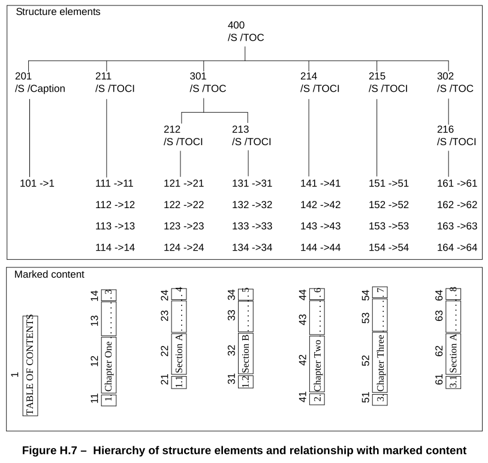

# 附录 H（资料性）示例 PDF 文件

**Annex H (informative) Example PDF Files**

## H.1 概述

**H.1 General**

=== "中文"

    本附件提供了几个示例，展示了实际 PDF 文件的结构：

    - 一个最小文件，可作为创建其他 PDF 文件的起点（也是后面示例的基础）
    - 一个显示文本字符串的简单示例 — 经典的“Hello World” — 以及一个绘制线条和形状的简单图形示例
    - 一个 PDF 文件片段，展示了大型文档的页面树结构，同样，还有两个片段展示了大纲层次结构
    - 一个示例，展示了 PDF 文件多次更新时的结构，展示了多个正文部分、交叉引用部分和尾部

    !!! note "NOTE"

        示例中的流对象的 **Length** 值和交叉引用表中的字节地址不一定准确。

=== "英文"

    This annex presents several examples showing the structure of actual PDF files:

    - A minimal file that can serve as a starting point for creating other PDF files (and that is the basis of later examples)
    - A simple example that shows a text string—the classic “Hello World”—and a simple graphics example that draws lines and shapes
    - A fragment of a PDF file that illustrates the structure of the page tree for a large document and, similarly, two fragments that illustrate the structure of an outline hierarchy
    - An example showing the structure of a PDF file as it is updated several times, illustrating multiple body sections, cross-reference sections, and trailers

    !!! note "NOTE"

        The **Length** values of stream objects in the examples and the byte addresses in cross-reference tables are not necessarily accurate.

## H.2 最小 PDF 文件

**H.2 Minimal PDF File**

=== "中文"

    H.2 中的示例“最小 PDF 文件”是一个不绘制任何内容的 PDF 文件；它几乎是可接受的最小 PDF 文件。它并非严格意义上可接受的最小文件，因为它包含一个轮廓字典（文档目录中的 **Outlines**），其计数为零（在这种情况下，通常会省略此对象）；页面内容流（页面对象中的 **Contents**）；以及包含 **ProcSet** 数组的资源字典（页面对象中的 Resources）。包含这些对象是为了使此文件可用作创建其他更逼真的 PDF 文件的起点。

    表 H.1 列出了此示例中的对象。

    <table id="tableH1" markdown="span">
    <caption>**表 H.1 – 最小示例中的对象**</caption>
    <thead>
    <tr>
    <th>**对象编号**</th>
    <th>**对象类型**</th>
    </tr>
    </thead>
    <tbody>
    <tr><td>1</td> <td>**Catalog** (文档目录)</td></tr>
    <tr><td>2</td> <td>**Outlines** (大纲词典)</td></tr>
    <tr><td>3</td> <td>**Pages** (页面树节点)</td></tr>
    <tr><td>4</td> <td>**Page** (页面对象)</td></tr>
    <tr><td>5</td> <td>内容流</td></tr>
    <tr><td>6</td> <td>过程集数组</td></tr>
    </tbody>
    </table>

    !!! note "NOTE"

        使用 [H.2](#h2-最小-pdf-文件), "最小 PDF 文件" 中的示例作为创建其他文件的起点时，请记住根据需要更新 **ProcSet** 数组（参见 [14.2](./c14/s2.md), "过程集"）。此外，请记住交叉引用表条目可能需要有尾随空格（参见 [7.5.4](./c7/s5.md#754-交叉引用表), "交叉引用表"）。

    !!! info "EXAMPLE"

        ```text
        %PDF-1. 4
        1 0 obj
            << /Type /Catalog
            /Outlines 2 0 R
            /Pages 3 0 R
            >>
        endobj

        2 0 obj
            << /Type Outlines
            /Count 0
            >>
        endobj

        3 0 obj
            << /Type /Pages
            /Kids [ 4 0 R ]
            /Count 1
            >>
        endobj

        4 0 obj
            << /Type /Page
            /Parent 3 0 R
            /MediaBox [ 0 0 612 792 ]
            /Contents 5 0 R
            /Resources << /ProcSet 6 0 R >>
            >>
        endobj

        5 0 obj
            << /Length 35 >>
        stream
        … Page-marking operators …
        endstream
        endobj

        6 0 obj
            [ /PDF ]
        endobj

        xref
        0 7
        0000000000 65535 f
        0000000009 00000 n
        0000000074 00000 n
        0000000120 00000 n
        0000000179 00000 n
        0000000300 00000 n
        0000000384 00000 n

        trailer
            << /Size 7
            /Root 1 0 R
            >>
        startxref
        408
        %%EOF
        ```

=== "英文"

    The example in H.2, "Minimal PDF File" is a PDF file that does not draw anything; it is almost the minimum acceptable PDF file. It is not strictly the minimum acceptable because it contains an outline dictionary (**Outlines** in the document catalog) with a zero count (in which case this object would normally be omitted); a page content stream (**Contents** in the page object); and a resource dictionary (Resources in the page object) containing a **ProcSet** array. These objects were included to make this file useful as a starting point for creating other, more realistic PDF files.

    Table H.1 lists the objects in this example.

    <table id="tableH1" markdown="span">
        <caption>**Table H.1 – Objects in minimal example**</caption>
        <thead>
            <tr>
                <th>**Object number**</th>
                <th>**Object type**</th>
            </tr>
        </thead>
        <tbody>
            <tr><td>1</td> <td>**Catalog** (document catalog)</td></tr>
            <tr><td>2</td> <td>**Outlines** (outline dictionary)</td></tr>
            <tr><td>3</td> <td>**Pages** (page tree node)</td></tr>
            <tr><td>4</td> <td>**Page** (page object)</td></tr>
            <tr><td>5</td> <td>Content stream</td></tr>
            <tr><td>6</td> <td>Procedure set array</td></tr>
        </tbody>
    </table>

    !!! note "NOTE"

        When using the example in [H.2](#h2-最小-pdf-文件), "Minimal PDF File" as a starting point for creating other files, remember to update the **ProcSet** array as needed (see [14.2](./c14/s2.md), "Procedure Sets"). Also, remember that the cross-reference table entries may need to have a trailing SPACE (see [7.5.4](./c7/s5.md#754-交叉引用表), "Cross-Reference Table").

    !!! info "EXAMPLE"

        ```text
        %PDF-1. 4
        1 0 obj
            << /Type /Catalog
            /Outlines 2 0 R
            /Pages 3 0 R
            >>
        endobj

        2 0 obj
            << /Type Outlines
            /Count 0
            >>
        endobj

        3 0 obj
            << /Type /Pages
            /Kids [ 4 0 R ]
            /Count 1
            >>
        endobj

        4 0 obj
            << /Type /Page
            /Parent 3 0 R
            /MediaBox [ 0 0 612 792 ]
            /Contents 5 0 R
            /Resources << /ProcSet 6 0 R >>
            >>
        endobj

        5 0 obj
            << /Length 35 >>
        stream
        … Page-marking operators …
        endstream
        endobj

        6 0 obj
            [ /PDF ]
        endobj

        xref
        0 7
        0000000000 65535 f
        0000000009 00000 n
        0000000074 00000 n
        0000000120 00000 n
        0000000179 00000 n
        0000000300 00000 n
        0000000384 00000 n

        trailer
            << /Size 7
            /Root 1 0 R
            >>
        startxref
        408
        %%EOF
        ```

## H.3 简单文本字符串示例

**H.3 Simple Text String Example**

=== "中文"

    H. 3“简单文本字符串示例”中的示例是从前面的示例构建的经典“Hello World”示例。它显示了一行由字符串 Hello World 组成的文本，说明了字体和几个与文本相关的 PDF 操作符的使用。该字符串以 24 点 Helvetica 显示。由于 Helvetica 是标准 14 种字体之一，因此不需要字体描述符。

    表 H.2 列出了此示例中的对象。

    <table id="tableH2" markdown="span">
    <caption>**表 H.2 – 简单文本字符串示例中的对象**</caption>
    <thead>
    <tr>
    <th>**对象编号**</th>
    <th>**对象类型**</th>
    </tr>
    </thead>
    <tbody>
    <tr><td>1</td> <td>**Catalog** (文档目录)</td></tr>
    <tr><td>2</td> <td>**Outlines** (大纲词典)</td></tr>
    <tr><td>3</td> <td>**Pages** (页面树节点)</td></tr>
    <tr><td>4</td> <td>**Page** (页面对象)</td></tr>
    <tr><td>5</td> <td>内容流</td></tr>
    <tr><td>6</td> <td>程序集数组</td></tr>
    <tr><td>7</td> <td>**Font** (Type 1 字体)</td></tr>
    </tbody>
    </table>

    ```text
    %PDF-1. 4
    1 0 obj
        << /Type /Catalog
        /Outlines 2 0 R
        /Pages 3 0 R
        >>
    endobj

    2 0 obj
        << /Type /Outlines
        /Count 0
        >>
    endobj

    3 0 obj
        << /Type /Pages
        /Kids [ 4 0 R ]
        /Count 1
        >>
    endobj

    4 0 obj
        << /Type /Page
        /Parent 3 0 R
        /MediaBox [ 0 0 612 792 ]
        /Contents 5 0 R
        /Resources << /ProcSet 6 0 R
                        /Font << /F1 7 0 R >>
                    >>
        >>
    endobj

    5 0 obj
        << /Length 73 >>
    stream
        BT
            /F1 24 Tf
            100 100 Td
            ( Hello World ) Tj
        ET
    endstream
    endobj

    6 0 obj
        [ /PDF /Text ]
    endobj

    7 0 obj
        << /Type /Font
        /Subtype /Type1
        /Name /F1
        /BaseFont /Helvetica
        /Encoding /MacRomanEncoding
        >>
    endobj

    xref
    0 8
    0000000000 65535 f
    0000000009 00000 n
    0000000074 00000 n
    0000000120 00000 n
    0000000179 00000 n
    0000000364 00000 n
    0000000466 00000 n
    0000000496 00000 n

    trailer
        << /Size 8
        /Root 1 0 R
        >>
    startxref
    625
    %%EOF
    ```

=== "英文"

    The example in H.3, "Simple Text String Example" is the classic “Hello World” example built from the preceding example. It shows a single line of text consisting of the string Hello World, illustrating the use of fonts and several text-related PDF operators. The string is displayed in 24-point Helvetica. Because Helvetica is one of the standard 14 fonts, no font descriptor is needed.

    Table H.2 lists the objects in this example.

    <table id="tableH2" markdown="span">
        <caption>**Table H.2 – Objects in simple text string example**</caption>
        <thead>
            <tr>
                <th>**Object number**</th>
                <th>**Object type**</th>
            </tr>
        </thead>
        <tbody>
            <tr><td>1</td> <td>**Catalog** (document catalog)</td></tr>
            <tr><td>2</td> <td>**Outlines** (outline dictionary)</td></tr>
            <tr><td>3</td> <td>**Pages** (page tree node)</td></tr>
            <tr><td>4</td> <td>**Page** (page object)</td></tr>
            <tr><td>5</td> <td>Content stream</td></tr>
            <tr><td>6</td> <td>Procedure set array</td></tr>
            <tr><td>7</td> <td>**Font** (Type 1 font)</td></tr>
        </tbody>
    </table>

    ```text
    %PDF-1. 4
    1 0 obj
        << /Type /Catalog
        /Outlines 2 0 R
        /Pages 3 0 R
        >>
    endobj

    2 0 obj
        << /Type /Outlines
        /Count 0
        >>
    endobj

    3 0 obj
        << /Type /Pages
        /Kids [ 4 0 R ]
        /Count 1
        >>
    endobj

    4 0 obj
        << /Type /Page
        /Parent 3 0 R
        /MediaBox [ 0 0 612 792 ]
        /Contents 5 0 R
        /Resources << /ProcSet 6 0 R
                        /Font << /F1 7 0 R >>
                    >>
        >>
    endobj

    5 0 obj
        << /Length 73 >>
    stream
        BT
            /F1 24 Tf
            100 100 Td
            ( Hello World ) Tj
        ET
    endstream
    endobj

    6 0 obj
        [ /PDF /Text ]
    endobj

    7 0 obj
        << /Type /Font
        /Subtype /Type1
        /Name /F1
        /BaseFont /Helvetica
        /Encoding /MacRomanEncoding
        >>
    endobj

    xref
    0 8
    0000000000 65535 f
    0000000009 00000 n
    0000000074 00000 n
    0000000120 00000 n
    0000000179 00000 n
    0000000364 00000 n
    0000000466 00000 n
    0000000496 00000 n

    trailer
        << /Size 8
        /Root 1 0 R
        >>
    startxref
    625
    %%EOF
    ```

## H.4 简单图形示例

**H.4 Simple Graphics Example**

=== "中文"

    H.4“简单图形示例”中的示例绘制了一条细黑线段、一条粗黑虚线段、一个填充并描边的矩形以及一条填充并描边的三次贝塞尔曲线。表 H.3 列出了此示例中的对象，图 H.1 显示了生成的输出。 （每个形状都有红色边框，矩形填充淡蓝色。）

    <table id="tableH3" markdown="span">
    <caption>**表 H.3 – 简单图形示例中的对象**</caption>
    <thead>
    <tr>
    <th>**对象编号**</th>
    <th>**对象类型**</th>
    </tr>
    </thead>
    <tbody>
    <tr><td>1</td> <td>**Catalog**（文档目录）</td></tr>
    <tr><td>2</td> <td>**Outlines**（大纲词典）</td></tr>
    <tr><td>3</td> <td>**Pages**（页面树节点）</td></tr>
    <tr><td>4</td> <td>**Page**（页面对象）</td></tr>
    <tr><td>5</td> <td>内容流</td></tr>
    <tr><td>6</td> <td>过程集数组</td></tr>
    </tbody>
    </table>

    

    !!! info "EXAMPLE"

        ```text
        %PDF-1. 4
        1 0 obj
            << /Type /Catalog
            /Outlines 2 0 R
            /Pages 3 0 R
            >>
        endobj

        2 0 obj
            << /Type /Outlines
            /Count 0
            >>
        endobj

        3 0 obj
            << /Type /Pages
            /Kids [ 4 0 R ]
            /Count 1
            >>
        endobj

        4 0 obj
            << /Type /Page
            /Parent 3 0 R
            /MediaBox [ 0 0 612 792 ]
            /Contents 5 0 R
            /Resources << /ProcSet 6 0 R >>
            >>
        endobj

        5 0 obj
            << /Length 883 >>
        stream
            % Draw a black line segment, using the default line width .
            150 250 m
            150 350 l
            S

            % Draw a thicker, dashed line segment .
            4 w                             % Set line width to 4 points
            [4 6] 0 d                       % Set dash pattern to 4 units on, 6 units off
            150 250 m
            400 250 l
            S
            [] 0 d                          % Reset dash pattern to a solid line
            1 w                             % Reset line width to 1 unit

            % Draw a rectangle with a 1-unit red border, filled with light blue .
            1.0 0.0 0.0 RG                  % Red for stroke color
            0.5 0.75 1.0 rg                 % Light blue for fill color
            200 300 50 75 re
            B

            % Draw a curve filled with gray and with a colored border.
            0.5 0.1 0.2 RG
            0.7 g
            300 300 m
            300 400 400 400 400 300 c
            b
        endstream
        endobj

        6 0 obj
        [ /PDF ]
        endobj

        xref
        0 7
        0000000000 65535 f
        0000000009 00000 n
        0000000074 00000 n
        0000000120 00000 n
        0000000179 00000 n
        0000000300 00000 n
        0000001532 00000 n

        trailer
            << /Size 7
            /Root 1 0 R
            >>
        startxref
        1556
        %%EOF
        ```

=== "英文"

    The example in H.4, "Simple Graphics Example" draws a thin black line segment, a thick black dashed line segment, a filled and stroked rectangle, and a filled and stroked cubic Bézier curve. Table H.3 lists the objects in this example, and Figure H.1 shows the resulting output. (Each shape has a red border, and the rectangle is filled with light blue.)

    <table id="tableH3" markdown="span">
        <caption>**Table H.3 – Objects in simple graphics example**</caption>
        <thead>
            <tr>
                <th>**Object number**</th>
                <th>**Object type**</th>
            </tr>
        </thead>
        <tbody>
            <tr><td>1</td> <td>**Catalog** (document catalog)</td></tr>
            <tr><td>2</td> <td>**Outlines** (outline dictionary)</td></tr>
            <tr><td>3</td> <td>**Pages** (page tree node)</td></tr>
            <tr><td>4</td> <td>**Page** (page object)</td></tr>
            <tr><td>5</td> <td>Content stream</td></tr>
            <tr><td>6</td> <td>Procedure set array</td></tr>
        </tbody>
    </table>

    

    !!! info "EXAMPLE"

        ```text
        %PDF-1. 4
        1 0 obj
            << /Type /Catalog
            /Outlines 2 0 R
            /Pages 3 0 R
            >>
        endobj

        2 0 obj
            << /Type /Outlines
            /Count 0
            >>
        endobj

        3 0 obj
            << /Type /Pages
            /Kids [ 4 0 R ]
            /Count 1
            >>
        endobj

        4 0 obj
            << /Type /Page
            /Parent 3 0 R
            /MediaBox [ 0 0 612 792 ]
            /Contents 5 0 R
            /Resources << /ProcSet 6 0 R >>
            >>
        endobj

        5 0 obj
            << /Length 883 >>
        stream
            % Draw a black line segment, using the default line width .
            150 250 m
            150 350 l
            S

            % Draw a thicker, dashed line segment .
            4 w                             % Set line width to 4 points
            [4 6] 0 d                       % Set dash pattern to 4 units on, 6 units off
            150 250 m
            400 250 l
            S
            [] 0 d                          % Reset dash pattern to a solid line
            1 w                             % Reset line width to 1 unit

            % Draw a rectangle with a 1-unit red border, filled with light blue .
            1.0 0.0 0.0 RG                  % Red for stroke color
            0.5 0.75 1.0 rg                 % Light blue for fill color
            200 300 50 75 re
            B

            % Draw a curve filled with gray and with a colored border.
            0.5 0.1 0.2 RG
            0.7 g
            300 300 m
            300 400 400 400 400 300 c
            b
        endstream
        endobj

        6 0 obj
        [ /PDF ]
        endobj

        xref
        0 7
        0000000000 65535 f
        0000000009 00000 n
        0000000074 00000 n
        0000000120 00000 n
        0000000179 00000 n
        0000000300 00000 n
        0000001532 00000 n

        trailer
            << /Size 7
            /Root 1 0 R
            >>
        startxref
        1556
        %%EOF
        ```

## H.5 页面树示例

**H.5 Page Tree Example**

=== "中文"

    H.5 “页面树示例” 中的示例是 PDF 文件的片段，展示了大型文档的页面树结构。它包含 62 页文档的页面树节点。图 H.2 显示了此页面树的结构。图中的数字是与示例中的对象相对应的对象编号。

=== "英文"

    The example in H.5, "Page Tree Example" is a fragment of a PDF file illustrating the structure of the page tree for a large document. It contains the page tree nodes for a 62-page document. Figure H.2 shows the structure of this page tree. Numbers in the figure are object numbers corresponding to the objects in the example.


!!! info "EXAMPLE"

    ```text
    337 0 obj
        << /Type /Pages
            /Kids [ 335 0 R
                    336 0 R
                ]
            /Count 62
        >>
    endobj

    335 0 obj
        << /Type /Pages
        /Parent 337 0 R
        /Kids [ 4 0 R
                43 0 R
                77 0 R
                108 0 R
                139 0 R
                170 0 R
        ]
        /Count 36
        >>
    endobj

    336 0 obj
        << /Type /Pages
        /Parent 337 0 R
        /Kids [ 201 0 R
                232 0 R
                263 0 R
                294 0 R
                325 0 R
        ]
        /Count 26
        >>
    endobj

    4 0 obj
        << /Type /Pages
        /Parent 335 0 R
        /Kids [ 3 0 R
                16 0 R
                21 0 R
                26 0 R
                31 0 R
                37 0 R
        ]
        /Count 6
        >>
    endobj

    43 0 obj
        << /Type /Pages
        /Parent 335 0 R
        /Kids [ 42 0 R
                48 0 R
                53 0 R
                58 0 R
                63 0 R
                70 0 R
        ]
        /Count 6
    >>
    endobj

    77 0 obj
        << /Type /Pages
        /Parent 335 0 R
        /Kids [ 76 0 R
                82 0 R
                87 0 R
                92 0 R
                97 0 R
                102 0 R
        ]
        /Count 6
        >>
    endobj

    108 0 obj
        << /Type /Pages
        /Parent 335 0 R
        /Kids [ 107 0 R
                113 0 R
                118 0 R
                123 0 R
                128 0 R
                133 0 R
        ]
        /Count 6
        >>
    endobj

    139 0 obj
        << /Type /Pages
        /Parent 335 0 R
        /Kids [ 138 0 R
                144 0 R
                149 0 R
                154 0 R
                159 0 R
                164 0 R
        ]
        /Count 6
        >>
    endobj

    170 0 obj
        << /Type /Pages
        /Parent 335 0 R
        /Kids [ 169 0 R
                175 0 R
                180 0 R
                185 0 R
                190 0 R
                195 0 R
        ]
        /Count 6
        >>
    endobj

    201 0 obj
        << /Type /Pages
        /Parent 336 0 R
        /Kids [ 200 0 R
                206 0 R
                211 0 R
                216 0 R
                221 0 R
                226 0 R
        ]
        /Count 6
        >>
    endobj

    232 0 obj
        << /Type /Pages
        /Parent 336 0 R
        /Kids [ 231 0 R
                237 0 R
                242 0 R
                247 0 R
                252 0 R
                257 0 R
        ]
        /Count 6
        >>
    endobj

    263 0 obj
        << /Type /Pages
        /Parent 336 0 R
        /Kids [ 262 0 R
                268 0 R
                273 0 R
                278 0 R
                283 0 R
                288 0 R
        ]
        /Count 6
        >>
    endobj

    294 0 obj
        << /Type /Pages
        /Parent 336 0 R
        /Kids [ 293 0 R
                299 0 R
                304 0 R
                309 0 R
                314 0 R
                319 0 R
        ]
        /Count 6
        >>
    endobj

    325 0 obj
        << /Type /Pages
        /Parent 336 0 R
        /Kids [ 324 0 R
                330 0 R
        ]
        /Count 2
        >>
    endobj
    ```

## H.6 概要层次结构示例

**H.6 Outline Hierarchy Example**

=== "中文"

    PDF 文件中的此节说明了包含六个项目的大纲层次结构。H.6“大纲层次示例”中的示例 1 显示了所有项目都打开的大纲，如图 H.3 所示。

    

    !!! info "EXAMPLE 1"

        ```text
        21 0 obj
            << /Type /Outlines
            /First 22 0 R
            /Last 29 0 R
            /Count 6
            >>
        endobj

        22 0 obj
            << /Title ( Document )
            /Parent 21 0 R
            /Next 29 0 R
            /First 25 0 R
            /Last 28 0 R
            /Count 4
            /Dest [ 3 0 R /XYZ 0 792 0 ]
            >>
        endobj

        25 0 obj
            << /Title ( Section 1 )
            /Parent 22 0 R
            /Next 26 0 R
            /Dest [ 3 0 R /XYZ null 701 null ]
            >>
        endobj

        26 0 obj
            << /Title ( Section 2 )
            /Parent 22 0 R
            /Prev 25 0 R
            /Next 28 0 R
            /First 27 0 R
            /Last 27 0 R
            /Count 1
            /Dest [ 3 0 R /XYZ null 680 null ]
            >>
        endobj

        27 0 obj
            << /Title ( Subsection 1 )
            /Parent 26 0 R
            /Dest [ 3 0 R /XYZ null 670 null ]
            >>
        endobj

        28 0 obj
            << /Title ( Section 3 )
            /Parent 22 0 R
            /Prev 26 0 R
            /Dest [ 7 0 R /XYZ null 500 null ]
            >>
        endobj

        29 0 obj
            << /Title ( Summary )
            /Parent 21 0 R
            /Prev 22 0 R
            /Dest [ 8 0 R /XYZ null 199 null ]
            >>
        endobj
        ```

    H.6“大纲层次结构示例”中的示例 2 与示例 1 相同，只是其中一个大纲项在显示中已关闭。大纲如图 H.4 所示。

    

    !!! info "EXAMPLE 2"

        ```text
        21 0 obj
            << /Type /Outlines
            /First 22 0 R
            /Last 29 0 R
            /Count 5
            >>
        endobj

        22 0 obj
            << /Title ( Document )
            /Parent 21 0 R
            /Next 29 0 R
            /First 25 0 R
            /Last 28 0 R
            /Count 3
            /Dest [ 3 0 R /XYZ 0 792 0 ]
            >>
        endobj

        25 0 obj
            << /Title ( Section 1 )
            /Parent 22 0 R
            /Next 26 0 R
            /Dest [ 3 0 R /XYZ null 701 null ]
            >>
        endobj

        26 0 obj
            << /Title ( Section 2 )
            /Parent 22 0 R
            /Prev 25 0 R
            /Next 28 0 R
            /First 27 0 R
            /Last 27 0 R
            /Count −1
            /Dest [ 3 0 R /XYZ null 680 null ]
            >>
        endobj

        27 0 obj
            << /Title ( Subsection 1 )
            /Parent 26 0 R
            /Dest [ 3 0 R /XYZ null 670 null ]
            >>
        endobj

        28 0 obj
            << /Title ( Section 3 )
            /Parent 22 0 R
            /Prev 26 0 R
            /Dest [ 7 0 R /XYZ null 500 null ]
            >>
        endobj

        29 0 obj
            << /Title ( Summary )
            /Parent 21 0 R
            /Prev 22 0 R
            /Dest [ 8 0 R /XYZ null 199 null ]
            >>
        endobj
        ```

=== "英文"

    This section from a PDF file illustrates the structure of an outline hierarchy with six items. Example 1 in H.6, "Outline Hierarchy Example" shows the outline with all items open, as illustrated in Figure H.3.

    

    !!! info "EXAMPLE 1"

        ```text
        21 0 obj
            << /Type /Outlines
            /First 22 0 R
            /Last 29 0 R
            /Count 6
            >>
        endobj

        22 0 obj
            << /Title ( Document )
            /Parent 21 0 R
            /Next 29 0 R
            /First 25 0 R
            /Last 28 0 R
            /Count 4
            /Dest [ 3 0 R /XYZ 0 792 0 ]
            >>
        endobj

        25 0 obj
            << /Title ( Section 1 )
            /Parent 22 0 R
            /Next 26 0 R
            /Dest [ 3 0 R /XYZ null 701 null ]
            >>
        endobj

        26 0 obj
            << /Title ( Section 2 )
            /Parent 22 0 R
            /Prev 25 0 R
            /Next 28 0 R
            /First 27 0 R
            /Last 27 0 R
            /Count 1
            /Dest [ 3 0 R /XYZ null 680 null ]
            >>
        endobj

        27 0 obj
            << /Title ( Subsection 1 )
            /Parent 26 0 R
            /Dest [ 3 0 R /XYZ null 670 null ]
            >>
        endobj

        28 0 obj
            << /Title ( Section 3 )
            /Parent 22 0 R
            /Prev 26 0 R
            /Dest [ 7 0 R /XYZ null 500 null ]
            >>
        endobj

        29 0 obj
            << /Title ( Summary )
            /Parent 21 0 R
            /Prev 22 0 R
            /Dest [ 8 0 R /XYZ null 199 null ]
            >>
        endobj
        ```

    Example 2 in H.6, "Outline Hierarchy Example" is the same as Example 1, except that one of the outline items has been closed in the display. The outline appears as shown in Figure H.4.

    

    !!! info "EXAMPLE 2"

        ```text
        21 0 obj
            << /Type /Outlines
            /First 22 0 R
            /Last 29 0 R
            /Count 5
            >>
        endobj

        22 0 obj
            << /Title ( Document )
            /Parent 21 0 R
            /Next 29 0 R
            /First 25 0 R
            /Last 28 0 R
            /Count 3
            /Dest [ 3 0 R /XYZ 0 792 0 ]
            >>
        endobj

        25 0 obj
            << /Title ( Section 1 )
            /Parent 22 0 R
            /Next 26 0 R
            /Dest [ 3 0 R /XYZ null 701 null ]
            >>
        endobj

        26 0 obj
            << /Title ( Section 2 )
            /Parent 22 0 R
            /Prev 25 0 R
            /Next 28 0 R
            /First 27 0 R
            /Last 27 0 R
            /Count −1
            /Dest [ 3 0 R /XYZ null 680 null ]
            >>
        endobj

        27 0 obj
            << /Title ( Subsection 1 )
            /Parent 26 0 R
            /Dest [ 3 0 R /XYZ null 670 null ]
            >>
        endobj

        28 0 obj
            << /Title ( Section 3 )
            /Parent 22 0 R
            /Prev 26 0 R
            /Dest [ 7 0 R /XYZ null 500 null ]
            >>
        endobj

        29 0 obj
            << /Title ( Summary )
            /Parent 21 0 R
            /Prev 22 0 R
            /Dest [ 8 0 R /XYZ null 199 null ]
            >>
        endobj
        ```

## H.7 更新示例

**H.7 Updating Example**

=== "中文"

    此示例显示了 PDF 文件在多次更新时的结构；它说明了多个主体部分、交叉引用部分和尾部。此外，它还表明，一旦为对象分配了对象标识符，即使对象被更改，它也会保留该标识符，直到对象被删除。最后，该示例说明了已删除对象的交叉引用条目的重用，以及对象被删除后生成编号的递增。

    原始文件是 H.2“最小 PDF 文件”中的示例。更新分为四个阶段，每个阶段后都会保存文件：

    a) 添加四个文本注释。

    b) 其中一个注释的文本被更改。

    c) 删除两个文本注释。

    d) 添加三个文本注释。

    以下部分显示了在每个阶段添加到文件中的段。在本例中，对象通过其对象标识符来引用，这些标识符由对象编号和生成编号组成，而不是像前面的例子中那样简单地通过对象编号来引用。这是必要的，因为示例重复使用对象编号；因此，它们表示的对象不是唯一的。

    !!! note "NOTE"

        这些部分中的表格仅显示在更新过程中修改的对象。H.2“最小 PDF 文件”中未在更新过程中更改的对象未显示。

=== "英文"

    This example shows the structure of a PDF file as it is updated several times; it illustrates multiple body sections, cross-reference sections, and trailers. In addition, it shows that once an object has been assigned an object identifier, it keeps that identifier until the object is deleted, even if the object is altered. Finally, the example illustrates the reuse of cross-reference entries for objects that have been deleted, along with the incrementing of the generation number after an object has been deleted.

    The original file is the example in H.2, "Minimal PDF File". The updates are divided into four stages, with the file saved after each stage:

    a) Four text annotations are added.

    b) The text of one of the annotations is altered.

    c) Two of the text annotations are deleted.

    d) Three text annotations are added.

    The following sections show the segments added to the file at each stage. Throughout this example, objects are referred to by their object identifiers, which are made up of the object number and the generation number, rather than simply by their object numbers as in earlier examples. This is necessary because the example reuses object numbers; therefore, the objects they denote are not unique.

    !!! note "NOTE"

        The tables in these sections show only those objects that are modified during the updating process. Objects from H.2, "Minimal PDF File" that are not altered during the update are not shown.

### H.7.1 第一阶段：添加四个文本注释

**H.7.1 Stage 1: Add Four Text Annotations**

=== "中文"

    初始文件中添加了四个文本注释，并保存了文件。表 H.4 列出了本次更新涉及的对象。

    <table id="tableH4" markdown="span">
        <caption>**表 H.4 – 添加四个文本注释后的对象使用情况**</caption>
        <thead>
            <tr>
                <th>**对象标识符**</th>
                <th>**对象类型**</th>
            </tr>
        </thead>
        <tbody>
            <tr><td>4 0</td> <td>Page（页面对象）</td></tr>
            <tr><td>7 0</td> <td>注释数组</td></tr>
            <tr><td>8 0</td> <td>Annot（注释字典）</td></tr>
            <tr><td>9 0</td> <td>Annot（注释字典）</td></tr>
            <tr><td>10 0</td> <td>Annot（注释字典）</td></tr>
            <tr><td>11 0</td> <td>Annot（注释字典）</td></tr>
        </tbody>
    </table>

    H.7.1“第 1 阶段：添加四个文本注释”中的示例显示了此更新添加到文件中的行。页面对象已更新，因为已向其中添加了 **Annots** 条目。请注意，文件的尾部现在包含一个 **Prev** 条目，该条目指向文件中的原始交叉引用部分，而尾部末尾的 **startxref** 值指向更新添加的交叉引用部分。

=== "英文"

    Four text annotations are added to the initial file and the file is saved. Table H.4 lists the objects involved in this update.

    <table id="tableH4" markdown="span">
        <caption>**Table H.4 – Object usage after adding four text annotations**</caption>
        <thead>
            <tr>
                <th>**Object identifier**</th>
                <th>**Object type**</th>
            </tr>
        </thead>
        <tbody>
            <tr><td>4 0</td> <td>Page (page object)</td></tr>
            <tr><td>7 0</td> <td>Annotation array</td></tr>
            <tr><td>8 0</td> <td>Annot (annotation dictionary)</td></tr>
            <tr><td>9 0</td> <td>Annot (annotation dictionary)</td></tr>
            <tr><td>10 0</td> <td>Annot (annotation dictionary)</td></tr>
            <tr><td>11 0</td> <td>Annot (annotation dictionary)</td></tr>
        </tbody>
    </table>

    The example in H.7.1, "Stage 1: Add Four Text Annotations" shows the lines added to the file by this update. The page object is updated because an **Annots** entry has been added to it. Note that the file’s trailer now contains a **Prev** entry, which points to the original cross-reference section in the file, while the **startxref** value at the end of the trailer points to the cross-reference section added by the update.

!!! info "EXAMPLE"

    ```text
    4 0 obj
        << /Type /Page
        /Parent 3 0 R
        /MediaBox [ 0 0 612 792 ]
        /Contents 5 0 R
        /Resources << /ProcSet 6 0 R >>
        /Annots 7 0 R
        >>
    endobj

    7 0 obj
        [ 80R
        90R
        10 0 R
        11 0 R
        ]
    endobj

    8 0 obj
        << /Type /Annot
        /Subtype /Text
        /Rect [ 44 616 162 735 ]
        /Contents ( Text #1 )
        /Open true
        >>
    endobj

    9 0 obj
        << /Type /Annot
        /Subtype /Text
        /Rect [ 224 668 457 735 ]
        /Contents ( Text #2 )
        /Open false
        >>
    endobj

    10 0 obj
        << /Type /Annot
        /Subtype /Text
        /Rect [ 239 393 328 622 ]
        /Contents ( Text #3 )
        /Open true
        >>
    endobj

    11 0 obj
        << /Type /Annot
        /Subtype /Text
        /Rect [ 34 398 225 575 ]
        /Contents ( Text #4 )
        /Open false
        >>
    endobj

    xref
    0 1
    0000000000 65535 f
    4 1
    0000000632 00000 n
    7 5
    0000000810 00000 n
    0000000883 00000 n
    0000001024 00000 n
    0000001167 00000 n
    0000001309 00000 n

    trailer
        << /Size 12
        /Root 1 0 R
        /Prev 408
        >>
    startxref
    1452
    %%EOF
    ```

### H.7.2 第二阶段：修改一个注释的文本

**H.7.2 Stage 2: Modify Text of One Annotation**

=== "中文"

    修改一个文本注释并保存文件。[H.7.2](#h72-第二阶段修改一个注释的文本)“第 2 阶段：修改一个注释的文本”中的示例显示了此更新添加到文件中的行。请注意，该文件现在包含标识符为 10 0 的对象的两个副本（已修改的文本注释），并且添加的交叉引用部分指向该对象的较新版本。此添加的交叉引用部分包含一个子部分，其中仅包含已修改对象的条目。此外，文件尾部的 **Prev** 条目已更新为指向上一阶段添加的交叉引用部分，而尾部末尾的 **startxref** 值指向新添加的交叉引用部分。

    !!! info "EXAMPLE"

        ```text
        10 0 obj
            << /Type /Annot
            /Subtype /Text
            /Rect [ 239 393 328 622 ]
            /Contents ( Modified Text #3 )
            /Open true
            >>
        endobj

        xref
        0 1
        0000000000 65535 f
        10 1
        0000001703 00000 n

        trailer
            << /Size 12
            /Root 1 0 R
            /Prev 1452
            >>
        startxref
        1855
        %%EOF
        ```

=== "英文"

    One text annotation is modified and the file is saved. The example in [H.7.2](#h72-第二阶段修改一个注释的文本), "Stage 2: Modify Text of One Annotation" shows the lines added to the file by this update. Note that the file now contains two copies of the object with identifier 10 0 (the text annotation that was modified) and that the added cross-reference section points to the more recent version of the object. This added cross-reference section contains one subsection, which contains only an entry for the object that was modified. In addition, the **Prev** entry in the file’s trailer has been updated to point to the cross-reference section added in the previous stage, while the **startxref** value at the end of the trailer points to the newly added cross-reference section.

    !!! info "EXAMPLE"

        ```text
        10 0 obj
            << /Type /Annot
            /Subtype /Text
            /Rect [ 239 393 328 622 ]
            /Contents ( Modified Text #3 )
            /Open true
            >>
        endobj

        xref
        0 1
        0000000000 65535 f
        10 1
        0000001703 00000 n

        trailer
            << /Size 12
            /Root 1 0 R
            /Prev 1452
            >>
        startxref
        1855
        %%EOF
        ```

### H.7.3 第三阶段：删除两个注释

**H.7.3 Stage 3: Delete Two Annotations**

=== "中文"

    删除两个文本注释并保存文件。表 H.5 列出了更新的对象。

    <table id="tableH5" markdown="span">
        <caption>**表 H.5 – 删除两个文本注释后的对象使用情况**</caption>
        <thead>
            <tr>
                <th>**对象标识符**</th>
                <th>**对象类型**</th>
            </tr>
        </thead>
        <tbody>
            <tr><td>7 0</td> <td>注释数组</td></tr>
            <tr><td>8 0</td> <td>空闲</td></tr>
            <tr><td>9 0</td> <td>空闲</td></tr>
        </tbody>
    </table>

    **Annots** 数组是本次更新中写入的唯一对象。它之所以更新，是因为它现在包含的注释少了两个。

    [H.7.3](#h73-第三阶段删除两个注释)“第三阶段：删除两个注释”中的示例显示了文件保存时添加的行。请注意，标识符为 8 0 和 9 0 的对象已被删除，这可以从交叉引用部分中它们的条目以关键字 **f** 结尾的事实中看出。

    !!! info "EXAMPLE"

        ```text
        7 0 obj
            [ 10 0 R
            11 0 R
            ]
        endobj

        xref
        0 1
        0000000008 65535 f
        7 3
        0000001978 00000 n
        0000000009 00001 f
        0000000000 00001 f

        trailer
            << /Size 12
            /Root 1 0 R
            /Prev 1855
            >>
        startxref
        2027
        %%EOF
        ```

    在此阶段添加的交叉引用部分包含四个条目，分别代表对象编号 0、**Annots** 数组和两个已删除的文本注释。

    - 对象编号 0 的交叉引用条目已更新，因为它是空闲条目链接列表的头部，并指向新释放的对象编号 8 的条目。对象编号 8 的条目指向对象编号 9 的条目（下一个空闲条目），而对象编号 9 的条目是交叉引用表中的最后一个空闲条目，因为它指向对象编号 0。
    - 两个已删除的文本注释的条目被标记为空闲，且代号为 1，用于任何重用这些交叉引用条目的对象。请记住，虽然这两个对象已被删除，但它们仍存在于文件中。正是交叉引用表记录了它们已被删除的事实。

    尾部中的 **Prev** 条目再次更新，使其指向上一阶段添加的交叉引用部分，而 **startxref** 值指向新添加的交叉引用部分。

=== "英文"

    Two text annotation are deleted and the file is saved. Table H.5 lists the objects updated.

    <table id="tableH5" markdown="span">
        <caption>**Table H.5 – Object usage after deleting two text annotations**</caption>
        <thead>
            <tr>
                <th>**Object identifier**</th>
                <th>**Object type**</th>
            </tr>
        </thead>
        <tbody>
            <tr><td>7 0</td> <td>Annotation array</td></tr>
            <tr><td>8 0</td> <td>Free</td></tr>
            <tr><td>9 0</td> <td>Free</td></tr>
        </tbody>
    </table>

    The **Annots** array is the only object that is written in this update. It is updated because it now contains two annotations fewer.

    The example in [H.7.3](#h73-第三阶段删除两个注释), "Stage 3: Delete Two Annotations" shows the lines added when the file was saved. Note that objects with identifiers 8 0 and 9 0 have been deleted, as can be seen from the fact that their entries in the cross-reference section end with the keyword **f**.

    !!! info "EXAMPLE"

        ```text
        7 0 obj
            [ 10 0 R
            11 0 R
            ]
        endobj

        xref
        0 1
        0000000008 65535 f
        7 3
        0000001978 00000 n
        0000000009 00001 f
        0000000000 00001 f

        trailer
            << /Size 12
            /Root 1 0 R
            /Prev 1855
            >>
        startxref
        2027
        %%EOF
        ```

    The cross-reference section added at this stage contains four entries, representing object number 0, the **Annots** array, and the two deleted text annotations.

    - The cross-reference entry for object number 0 is updated because it is the head of the linked list of free entries and points to the entry for the newly freed object number 8. The entry for object number 8 points to the entry for object number 9 (the next free entry), while the entry for object number 9 is the last free entry in the cross-reference table, indicated by the fact that it points back to object number 0.
    - The entries for the two deleted text annotations are marked as free and as having generation numbers of 1, which are used for any objects that reuse these cross-reference entries. Keep in mind that, although the two objects have been deleted, they are still present in the file. It is the cross-reference table that records the fact that they have been deleted.

    The **Prev** entry in the trailer has again been updated so that it points to the cross-reference section added at the previous stage, and the **startxref** value points to the newly added cross-reference section.

### H.7.4 第四阶段：添加三个注释

**H.7.4 Stage 4: Add Three Annotations**

=== "中文"

    最后，文件中添加了三个新的文本注释。表 H.6 列出了本次更新涉及的对象。

    <table id="tableH6" markdown="span">
        <caption>**表 H.6 – 添加三个文本注释后的对象使用情况**</caption>
        <thead>
            <tr>
                <th>**对象标识符**</th>
                <th>**对象类型**</th>
            </tr>
        </thead>
        <tbody>
            <tr><td>7 0</td> <td>注释数组</td></tr>
            <tr><td>8 1</td> <td>**Annot**（注释字典）</td></tr>
            <tr><td>9 1</td> <td>**Annot**（注释字典）</td></tr>
            <tr><td>12 0</td> <td>**Annot**（注释字典）</td></tr>
        </tbody>
    </table>

    对象编号 8 和 9，用于在中删除的两个注释上一阶段添加的三个注释已被重用；但是，新对象被赋予了代号 1。此外，添加的第三个文本注释已被分配了以前未使用的对象标识符 12 0。

    [H.7.4](#h74-第四阶段添加三个注释)“第四阶段：添加三个注释”中的示例显示了此更新添加到文件中的行。添加的交叉引用部分包含五个条目，分别对应于对象编号 0、**Annots** 数组和添加的三个注释。对象编号 0 的条目已更新，因为对象编号 8 和 9 的先前空闲条目已被重用。对象编号 0 的条目现在显示交叉引用表没有空闲条目。**Annots** 数组已更新以反映三个文本注释的添加。

    !!! info "EXAMPLE"

        ```text
        7 0 obj
            [ 10 0 R
            11 0 R
            81R
            91R
            12 0 R
            ]
            endobj

        8 1 obj
        << /Type /Annot
        /Subtype /Text
        /Rect [ 58 657 172 742 ]
        /Contents ( New Text #1 )
        /Open true
        >>
        endobj

        9 1 obj
            << /Type /Annot
            /Subtype /Text
            /Rect [ 389 459 570 537 ]
            /Contents ( New Text #2 )
            /Open false
            >>
        endobj

        12 0 obj
            << /Type /Annot
            /Subtype /Text
            /Rect [ 44 253 473 337 ]
            /Contents ( New Text #3\203a longer text annotation which we will continue onto a second line )
            /Open true
            >>
        endobj

        xref
        0 1
        0000000000 65535 f
        7 3
        0000002216 00000 n
        0000002302 00001 n
        0000002447 00001 n
        12 1
        0000002594 00000 n

        trailer
            << /Size 13
            /Root 1 0 R
            /Prev 2027
            >>
        startxref
        2814
        %%EOF
        ```

    对象标识符为 12 0 的注释说明了如何将长文本字符串拆分为多行，以及在字符串中包含非标准字符的技术。在本例中，字符是省略号 (…)，即 **PDFDocEncoding** 中的字符代码 203（八进制），该编码用于文本注释。

    与之前的更新一样，预告片的 **Prev** 条目和 **startxref** 值也已更新。

=== "英文"

    Finally, three new text annotations are added to the file. Table H.6 lists the objects involved in this update.

    <table id="tableH6" markdown="span">
        <caption>**Table H.6 – Object usage after adding three text annotations**</caption>
        <thead>
            <tr>
                <th>**Object identifier**</th>
                <th>**Object type**</th>
            </tr>
        </thead>
        <tbody>
            <tr><td>7 0</td> <td>Annotation array</td></tr>
            <tr><td>8 1</td> <td>**Annot** (annotation dictionary)</td></tr>
            <tr><td>9 1</td> <td>**Annot** (annotation dictionary)</td></tr>
            <tr><td>12 0</td> <td>**Annot** (annotation dictionary)</td></tr>
        </tbody>
    </table>

    Object numbers 8 and 9, which were used for the two annotations deleted in the previous stage, have been reused; however, the new objects have been given a generation number of 1. In addition, the third text annotation added has been assigned the previously unused object identifier of 12 0.

    The example in [H.7.4](#h74-第四阶段添加三个注释), "Stage 4: Add Three Annotations" shows the lines added to the file by this update. The added cross-reference section contains five entries, corresponding to object number 0, the **Annots** array, and the three annotations added. The entry for object number 0 is updated because the previously free entries for object numbers 8 and 9 have been reused. The entry for object number 0 now shows that the cross-reference table has no free entries. The **Annots** array is updated to reflect the addition of the three text annotations.

    !!! info "EXAMPLE"

        ```text
        7 0 obj
            [ 10 0 R
            11 0 R
            81R
            91R
            12 0 R
            ]
            endobj

        8 1 obj
        << /Type /Annot
        /Subtype /Text
        /Rect [ 58 657 172 742 ]
        /Contents ( New Text #1 )
        /Open true
        >>
        endobj

        9 1 obj
            << /Type /Annot
            /Subtype /Text
            /Rect [ 389 459 570 537 ]
            /Contents ( New Text #2 )
            /Open false
            >>
        endobj

        12 0 obj
            << /Type /Annot
            /Subtype /Text
            /Rect [ 44 253 473 337 ]
            /Contents ( New Text #3\203a longer text annotation which we will continue onto a second line )
            /Open true
            >>
        endobj

        xref
        0 1
        0000000000 65535 f
        7 3
        0000002216 00000 n
        0000002302 00001 n
        0000002447 00001 n
        12 1
        0000002594 00000 n

        trailer
            << /Size 13
            /Root 1 0 R
            /Prev 2027
            >>
        startxref
        2814
        %%EOF
        ```

    The annotation with object identifier 12 0 illustrates splitting a long text string across multiple lines, as well as the technique for including nonstandard characters in a string. In this case, the character is an ellipsis (…), which is character code 203 (octal) in **PDFDocEncoding**, the encoding used for text annotations.

    As in previous updates, the trailer’s **Prev** entry and **startxref** value have been updated.

## H.8 描述分层列表的结构化元素

**H.8 Structured Elements That Describe Hierarchical Lists**

=== "中文"

    H.8 “描述分层列表的结构化元素”提供了一些示例，说明如何使用结构化元素来描述分层列表，例如目录或索引。

=== "英文"

    H.8, "Structured Elements That Describe Hierarchical Lists" presents examples that illustrate how structured elements are used to describe hierarchical lists, such as a table of contents or an index.

### H.8.1 目录

**H.8.1 Table of Contents**

=== "中文"

    结构化元素的结构类型条目 (**S**) 可能具有建立内容表中条目之间的层次关系的值。TOCI 值指定内容表中的单个成员。TOC 值指定由其他内容表项组成的列表，这些内容表项是内容表的单个成员和/或内容表项列表。（**TOCI** 中的尾随字符是大写“I”。）

    图 H.5 显示了 H.8.1“内容表”中的示例描述的内容表。

    

    图 H.6 说明了标记内容标识符 (**MCID**) 与内容之间的关联。此图包括流对象的一部分，因此您可以看到 MCID 条目如何与内容表中的内容相关联。

    

    图 H.7 显示了结构元素之间的关系及其对 TOC 和 TOCI 结构类型的使用如何表示目录的结构。该图还显示了结构化内容元素与流中的标记内容之间的关系。灰色文本表示标记内容标识符 (MCID)。

    

=== "英文"

    The structured element’s structure type entry (**S**) may have values that establish hierarchical relationships between entries in a table of content. The TOCI value specifies an individual member of a table of contents. The TOC value specifies a list made up of other table of contents items that are individual members of the table of contents and/or lists of table of contents items. (The trailing character in **TOCI** is an upper case “I”.)

    Figure H.5 shows the table of contents described by the example in H.8.1, "Table of Contents".

    

    Figure H.6 illustrates the association between marked content identifiers (**MCID**) and content. This illustration includes part of the stream object so you can see how the MCID entries are associated with the content in the table of contents.

    

    Figure H.7 shows how the relationships of the structure elements and their use of the TOC and TOCI structure types represent the structure of a table of contents. This figure also shows the relationship between the structured content elements and the marked content in the stream. Gray text indicates marked content identifiers (MCID).

    

!!! info "EXAMPLE"

    ```text
    4 0 obj
        << /Type /Page
        /Contents 5 0 R
        >>

    5 0 obj
        << /Length 6 0 R >>
        stream
            /P <</MCID 1>> BDC
            BT T* (TABLE OF CONTENTS) Tj ET EMC

            /Lbl <</MCID 11>> BDC
            BT T* (1. ) Tj ET EMC
            /Reference <</MCID 12>> BDC
            BT (Chapter One ) Tj ET EMC
            /NonStruct <</MCID 13>> BDC
            BT (. . . . . . . . . ) Tj ET EMC
            /Reference <</MCID 14>> /BDC
            BT (3 ) Tj ET EMC

            /Lbl <</MCID 21>> BDC
            BT T* (1.1 ) Tj ET EMC
            /Reference <</MCID 22>> BDC
            BT (Section A ) Tj ET EMC
            /NonStruct <</MCID 23>> BDC
            BT (. . . . . . . . ) Tj ET EMC
            /Reference <</MCID 24>> /BDC
            BT (4 ) Tj ET EMC

            /Lbl <</MCID 31>> BDC
            BT T* (1.2 ) Tj ET EMC
            /Reference <</MCID 32>> BDC
            BT (Section B ) Tj ET EMC
            /NonStruct <</MCID 33>> BDC
            BT (. . . . . . . . ) Tj ET EMC
            /Reference <</MCID 34>> /BDC
            BT (5 ) Tj ET EMC

            /Lbl <</MCID 41>> BDC
            BT T* (2. ) Tj ET EMC
            /Reference <</MCID 42>> BDC
            BT (Chapter Two ) Tj ET EMC
            /NonStruct <</MCID 43>> BDC
            BT (. . . . . . . . . ) Tj ET EMC
            /Reference <</MCID 44>> /BDC
            BT (6 ) Tj ET EMC

            /Lbl <</MCID 51>> BDC
            BT T* (3. ) Tj ET EMC
            /Reference <</MCID 52>> BDC
            BT (Chapter Three ) Tj ET EMC
            /NonStruct <</MCID 53>> BDC
            BT (. . . . . . . . ) Tj ET EMC
            /Reference <</MCID 54>> /BDC
            BT (7 ) Tj ET EMC

            /Lbl <</MCID 61>> BDC
            BT T* (3.1 ) Tj ET EM
            /Reference <</MCID 62>> BDC
            BT (Section A ) Tj ET EM
            /NonStruct <</MCID 63>> BDC
            BT (. . . . . . . . ) Tj ET EM
            /Reference <</MCID 64>> /BDC
            BT (8 ) Tj ET EMC
    endstream
    endobj

    101 0 obj
        << /Type /StructElem
        /S /P
        /P 201 0 R
        /Pg 4 0 R
        /K 1
        >>
    endobj

    111 0 obj
        << /Type /StructElem
        /S /Lbl
        /P 211 0 R
        /Pg 4 0 R
        /K 11
        >>
    endobj

    112 0 obj
        << /Type /StructElem
        /S /Reference
        /P 211 0 R
        /Pg 4 0 R
        /K 12
        >>
        endobj

    113 0 obj
        << /Type /StructElem
        /S /NonStruct
        /P 211 0 R
        /Pg 4 0 R
        /K 13
        >>
    endobj

    114 0 obj
        << /Type /StructElem
        /S /Reference
        /P 211 0 R
        /Pg 4 0 R
        /K 14
        >>
    endobj

    objects 121-124, 131-134, 141-144, 151-154 and 161-164 referencing MCIDs 21-24, 31-34, 41-44, 51-54, and 61-64 are omitted in the interest of space.

    201 0 obj
        << /Type /StructElem
        /S /Caption
        /P 400 0 R
        /K [101 0 R]
        >>
    endobj

    211 0 obj
        << /Type /StructElem
        /S /TOCI
        /P 400 0 R
        /K [111 0 R 112 0 R 113 0 R 114 0 R]
        >>
    endobj

    212 0 obj
        << /Type /StructElem
        /S /TOCI
        /P 301 0 R
        /K [121 0 R 122 0 R 123 0 R 124 0 R]
        >>
    endobj

    213 0 obj
        << /Type /StructElem
        /S /TOCI
        /P 301 0 R
        /K [131 0 R 132 0 R 133 0 R 134 0 R]
        >>
    endobj

    214 0 obj
        << /Type /StructElem
        /S /TOCI
        /P 400 0 R
        /K [141 0 R 142 0 R 143 0 R 144 0 R]
        >>
    endobj

    215 0 obj
        << /Type /StructElem
        /S /TOCI
        /P 400 0 R
        /K [151 0 R 152 0 R 153 0 R 154 0 R]
        >>
    endobj

    216 0 obj
        << /Type /StructElem
        /S /TOCI
        /P 302 0 R
        /K [161 0 R 162 0 R 163 0 R 164 0 R]
        >>
    endobj

    301 0 obj
        << /Type /StructElem
        /S /TOC
        /P 400 0 R
        /K [212 0 R 213 0 R]
        >>
    endobj

    302 0 obj
        << /Type /StructElem
        /S /TOC
        /P 400 0 R
        /K [216 0 R]
        >>
    endobj

    400 0 obj
        << /Type /StructElem
        /S TOC
        /K [201 0 R 211 0 R 301 0 R 214 0 R 215 0 R 302 0 R]
        >>
    endobj
    ```

### H.8.2 嵌套列表

**H.8.2 Nested Lists**

=== "中文"

    结构化元素的结构类型条目 (S) 可能具有建立索引中条目之间的层次关系的值。 LI 值指定单个索引条目。 L 值指定由单个索引条目和/或索引条目列表组成的列表。 （ LI 中的尾随字符是大写“I”。）

    图 H.8 显示了 H.8.2“嵌套列表”中的示例描述的索引。

    

    图 H.9 显示了结构元素的关系及其对 L 和 LI 结构类型的使用如何定义索引的结构。 该图还显示了结构化内容元素与流中的标记内容之间的关系。 灰色文本表示标记内容标识符 (**MCID**)。

    

=== "英文"

    The structured element’s structure type entry (S) may have values that establish hierarchical relationships between entries in an index. The LI value specifies an individual index entry. The L value specifies a list made up of individual index entries and/or lists of index entries. (The trailing character in LI is an upper case “I”.)

    Figure H.8 shows the index described by the example in H.8.2, "Nested Lists".

    

    Figure H.9 shows how the relationships of the structure elements and their use of the L and LI structure types defines the structure of an index. This figure also shows the relationship between the structured content elements and the marked content in the stream. Gray text indicates marked content identifiers (**MCID**).

    

!!! info "EXAMPLE"

    ```text
    4 0 obj
        << /Type /Page
        /Contents 5 0 R
        >>
    endobj

    5 0 obj
        << /Length 6 0 R >>
        stream
            /P <</MCID 1>> BDC
            BT T* (INDEX) Tj ET EMC

            /Lbl <</MCID 11>> BDC
            BT T* (1. ) Tj ET EMC
            /LBody <</MCID 12>> /BDC
            BT (Cats ) Tj ET EMC

            /Lbl <</MCID 21>> BDC
            BT T* (a. ) Tj ET EMC
            /LBody <</MCID 22>> /BDC
            BT (Lions ) Tj ET EMC

            /Lbl <</MCID 31>> BDC
            BT T* (b. ) Tj ET EMC
            /LBody <</MCID 32>> /BDC
            BT (Tigers ) Tj ET EMC

            /Lbl <</MCID 41>> BDC
            BT T* (2. ) Tj ET EMC
            /LBody <</MCID 42>> /BDC
            BT (Bears ) Tj ET EMC

            /Lbl <</MCID 51>> BDC
            BT T* (3. ) Tj ET EM
            /LBody <</MCID 52>> /BDC
            BT (Canines ) Tj ET EMC

            /Lbl <</MCID 61>> BDC
            BT T* (a. ) Tj ET EM
            /LBody <</MCID 62>> /BDC
            BT (Wolves ) Tj ET EMC

        endstream
    endobj

    101 0 obj
        << /Type /StructElem
        /S /P
        /P 201 0 R
        /Pg 4 0 R
        /K 1
        >>
    endobj

    111 0 obj
        << /Type /StructElem
        /S /Lbl
        /P 211 0 R
        /Pg 4 0 R
        /K 11
        >>
    endobj

    112 0 obj
        << /Type /StructElem
        /S /LBody
        /P 211 0 R
        /Pg 4 0 R
        /K 12
        >>
    endobj

    objects 121-122, 131-132, 141-142, 151-152 and 161-162 referencing MCIDs 21-22, 31-32, 41-42, 51-52, and 61-62 are omitted in the interest of space.

    201 0 obj
        << /Type /StructElem
        /S /Caption
        /P 400 0 R
        /K [101 0 R]
        >>
    endobj

    211 0 obj
        << /Type /StructElem
        /S /LI
        /P 400 0 R
        /K [111 0 R 112 0 R]
        >>
    endobj

    212 0 obj
        << /Type /StructElem
        /S /LI
        /P 301 0 R
        /K [121 0 R 122 0 R]
        >>
    endobj

    213 0 obj
        << /Type /StructElem
        /S /LI
        /P 301 0 R
        /K [131 0 R 132 0 R]
        >>
    endobj

    214 0 obj
        << /Type /StructElem
        /S /LI
        /P 400 0 R
        /K [141 0 R 142 0 R]
        >>
    endobj

    215 0 obj
        << /Type /StructElem
        /S /LI
        /P 400 0 R
        /K [151 0 R 152 0 R]
        >>
    endobj

    216 0 obj
        << /Type /StructElem
        /S /LI
        /P 302 0 R
        /K [161 0 R 162 0 R]
        >>
    endobj

    301 0 obj
        << /Type /StructElem
        /S /L
        /P 400 0 R
        /K [212 0 R 213 0 R]
        >>

    302 0 obj
        << /Type /StructElem
        /S /L
        /P 400 0 R
        /K [216 0 R]
        >>
    endobj

    400 0 obj
        << /Type /StructElem
        /S /L
        /K [201 0 R 211 0 R 301 0 R 214 0 R 215 0 R 302 0 R]
        >>
    endobj
    ```
