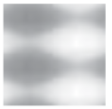
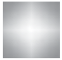
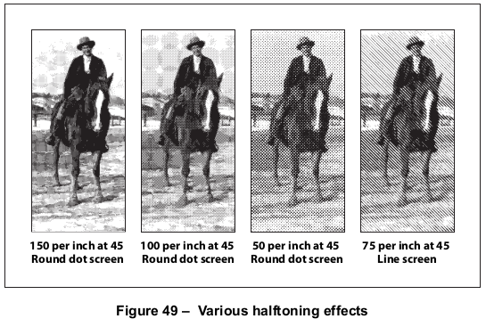
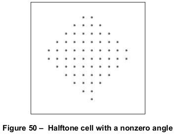
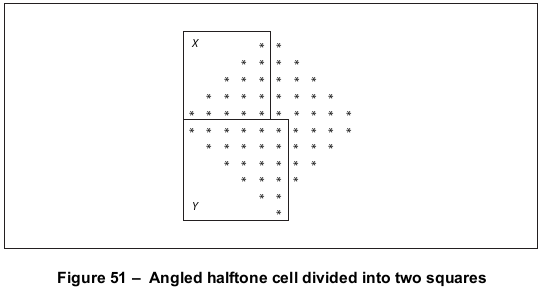
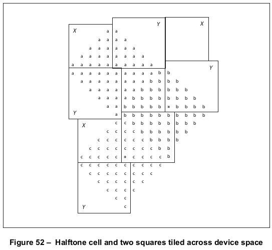
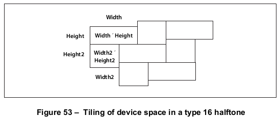

# 10.5 半色调

**Halftones**

## 10.5.1 概述

**General**

=== "中文"

    *Halftoning* is a process by which continuous-tone colours are approximated on an output device that can achieve only a limited number of discrete colours. Colours that the device cannot produce directly are simulated by using patterns of pixels in the colours available.
    
    !!! note "NOTE 1"
    
        Perhaps the most familiar example is the rendering of gray tones with black and white pixels, as in a newspaper photograph.
    
    Some output devices can reproduce continuous-tone colours directly. Halftoning is not required for such devices; after gamma correction by the transfer functions, the colour components shall be transmitted directly to the device. On devices that do require halftoning, it shall occur after all colour components have been transformed by the applicable transfer functions. The input to the halftone function shall consist of continuous- tone, gamma-corrected colour components in the device’s native colour space. Its output shall consist of pixels in colours the device can reproduce.
    
    PDF provides a high degree of control over details of the halftoning process.
    
    !!! note "NOTE 2"
    
        When rendering on low-resolution displays, fine control over halftone patterns is needed to achieve the best approximations of gray levels or colours and to minimize visual artifacts.
    
    !!! note "NOTE 3"
    
        In colour printing, independent halftone screens can be specified for each of several colorants.
    
    !!! note "NOTE 4"
    
        Remember that everything pertaining to halftones is, by definition, device-dependent. In general, when a PDF file provides its own halftone specifications, it sacrifices portability. Associated with every output device is a default halftone definition that is appropriate for most purposes. Only relatively sophisticated files need to define their own halftones to achieve special effects. For correct results, a PDF file that defines a new halftone depends on certain assumptions about the resolution and orientation of device space. The best choice of halftone parameters often depends on specific physical properties of the output device, such as pixel shape, overlap between pixels, and the effects of electronic or mechanical noise.
    
    All halftones are defined in device space, and shall be unaffected by the current transformation matrix.

=== "英文"

    *Halftoning* is a process by which continuous-tone colours are approximated on an output device that can achieve only a limited number of discrete colours. Colours that the device cannot produce directly are simulated by using patterns of pixels in the colours available.
    
    !!! note "NOTE 1"
    
        Perhaps the most familiar example is the rendering of gray tones with black and white pixels, as in a newspaper photograph.
    
    Some output devices can reproduce continuous-tone colours directly. Halftoning is not required for such devices; after gamma correction by the transfer functions, the colour components shall be transmitted directly to the device. On devices that do require halftoning, it shall occur after all colour components have been transformed by the applicable transfer functions. The input to the halftone function shall consist of continuous- tone, gamma-corrected colour components in the device’s native colour space. Its output shall consist of pixels in colours the device can reproduce.
    
    PDF provides a high degree of control over details of the halftoning process.
    
    !!! note "NOTE 2"
    
        When rendering on low-resolution displays, fine control over halftone patterns is needed to achieve the best approximations of gray levels or colours and to minimize visual artifacts.
    
    !!! note "NOTE 3"
    
        In colour printing, independent halftone screens can be specified for each of several colorants.
    
    !!! note "NOTE 4"
    
        Remember that everything pertaining to halftones is, by definition, device-dependent. In general, when a PDF file provides its own halftone specifications, it sacrifices portability. Associated with every output device is a default halftone definition that is appropriate for most purposes. Only relatively sophisticated files need to define their own halftones to achieve special effects. For correct results, a PDF file that defines a new halftone depends on certain assumptions about the resolution and orientation of device space. The best choice of halftone parameters often depends on specific physical properties of the output device, such as pixel shape, overlap between pixels, and the effects of electronic or mechanical noise.
    
    All halftones are defined in device space, and shall be unaffected by the current transformation matrix.

## 10.5.2 半色调屏幕

**Halftone Screens**

=== "中文"

    In general, halftoning methods are based on the notion of a *halftone screen*, which divides the array of device pixels into *cells* that may be modified to produce the desired halftone effects. A screen is defined by conceptually laying a uniform rectangular grid over the device pixel array. Each pixel belongs to one cell of the grid; a single cell typically contains many pixels. The screen grid shall be defined entirely in device space and shall be unaffected by modifications to the current transformation matrix.
    
    !!! note "NOTE"
    
        This property is essential to ensure that adjacent areas coloured by halftones are properly stitched together without visible seams.
    
    On a bilevel (black-and-white) device, each cell of a screen may be made to approximate a shade of gray by painting some of the cell’s pixels black and some white. Numerically, the gray level produced within a cell shall be the ratio of white pixels to the total number of pixels in the cell. A cell containing n pixels can render *n + 1* different gray levels, ranging from all pixels black to all pixels white. A gray value g in the range 0.0 to 1.0 shall be produced by making i pixels white, where *i = floor (g × n)*.
    
    The foregoing description also applies to colour output devices whose pixels consist of primary colours that are either completely on or completely off. Most colour printers, but not colour displays, work this way. Halftoning shall be applied to each colour component independently, producing shades of that colour.
    
    Colour components shall be presented to the halftoning machinery in additive form, regardless of whether they were originally specified additively (*RGB* or *gray*) or subtractively (*CMYK* or tint). Larger values of a colour component represent lighter colours—greater intensity in an additive device such as a display or less ink in a subtractive device such as a printer. Transfer functions produce colour values in additive form; see [10.4](./s4.md), "Transfer Functions".

=== "英文"

    In general, halftoning methods are based on the notion of a *halftone screen*, which divides the array of device pixels into *cells* that may be modified to produce the desired halftone effects. A screen is defined by conceptually laying a uniform rectangular grid over the device pixel array. Each pixel belongs to one cell of the grid; a single cell typically contains many pixels. The screen grid shall be defined entirely in device space and shall be unaffected by modifications to the current transformation matrix.
    
    !!! note "NOTE"
    
        This property is essential to ensure that adjacent areas coloured by halftones are properly stitched together without visible seams.
    
    On a bilevel (black-and-white) device, each cell of a screen may be made to approximate a shade of gray by painting some of the cell’s pixels black and some white. Numerically, the gray level produced within a cell shall be the ratio of white pixels to the total number of pixels in the cell. A cell containing n pixels can render *n + 1* different gray levels, ranging from all pixels black to all pixels white. A gray value g in the range 0.0 to 1.0 shall be produced by making i pixels white, where *i = floor (g × n)*.
    
    The foregoing description also applies to colour output devices whose pixels consist of primary colours that are either completely on or completely off. Most colour printers, but not colour displays, work this way. Halftoning shall be applied to each colour component independently, producing shades of that colour.
    
    Colour components shall be presented to the halftoning machinery in additive form, regardless of whether they were originally specified additively (*RGB* or *gray*) or subtractively (*CMYK* or tint). Larger values of a colour component represent lighter colours—greater intensity in an additive device such as a display or less ink in a subtractive device such as a printer. Transfer functions produce colour values in additive form; see [10.4](./s4.md), "Transfer Functions".


## 10.5.3 Spot 函数

**Spot Functions**

=== "中文"

    A common way of defining a halftone screen is by specifying a *frequency*, angle, and spot function. The frequency indicates the number of halftone cells per inch; the angle indicates the orientation of the grid lines relative to the device coordinate system. As a cell’s desired gray level varies from black to white, individual pixels within the cell change from black to white in a well-defined sequence: if a particular gray level includes certain white pixels, lighter grays will include the same white pixels along with some additional ones. The order in which pixels change from black to white for increasing gray levels shall be determined by a spot function, which specifies that order in an indirect way that minimizes interactions with the screen frequency and angle.
    
    Consider a halftone cell to have its own coordinate system: the centre of the cell is the origin and the corners are at coordinates ±1.0 horizontally and vertically. Each pixel in the cell is centred at horizontal and vertical coordinates that both lie in the range −1.0 to +1.0. For each pixel, the spot function shall be invoked with the pixel’s coordinates as input and shall return a single number in the range −1.0 to +1.0, defining the pixel’s position in the whitening order.
    
    The specific values the spot function returns are not significant; all that matters are the relative values returned for different pixels. As a cell’s gray level varies from black to white, the first pixel whitened shall be the one for which the spot function returns the lowest value, the next pixel shall be the one with the next higher spot function value, and so on. If two pixels have the same spot function value, their relative order shall be chosen arbitrarily.
    
    PDF provides built-in definitions for many of the most commonly used spot functions that a conforming reader shall implement. A halftone may simply specify any of these predefined spot functions by name instead of giving an explicit function definition.
    
    !!! info "EXAMPLE"
    
        The name **SimpleDot** designates a spot function whose value is inversely related to a pixel’s distance from the center of the halftone cell. This produces a “dot screen” in which the black pixels are clustered within a circle whose area is inversely proportional to the gray level. The name **Line** designates a spot function whose value is the distance from a given pixel to a line through the center of the cell, producing a “line screen” in which the white pixels grow away from that line.
    
    Table 128 shows the predefined spot functions. The table gives the mathematical definition of each function along with the corresponding PostScript language code as it would be defined in a PostScript calculator function (see [7.10.5], "Type 4 (PostScript Calculator) Functions"). The image accompanying each function shows how the relative values of the function are distributed over the halftone cell, indicating the approximate order in which pixels are whitened. Pixels corresponding to darker points in the image are whitened later than those corresponding to lighter points.

    <table id="table128" markdown="span">
        <caption>**Table 128 – Predefined spot functions**</caption>
        <thead>
            <tr>
                <th>**Name**</th>
                <th>**Appearance**</th>
                <th>**Definition**</th>
            </tr>
        </thead>
        <tbody>
            <tr>
                <td>**SimpleDot**</td>
                <td></td>
                <td>
                $1-(x^2 + y^2)$<br/>
                \{ dup mul exch dup mul add 1 exch sub \}
                </td>
            </tr>
            <tr>
                <td>**InvertedSimpleDot**</td>
                <td></td>
                <td>
                $x^2 + y^2 - 1$<br/>
                \{ dup mul exch dup mul add 1 sub \}
                </td>
            </tr>
            <tr>
                <td>**DoubleDot**</td>
                <td></td>
                <td>
                $\frac{sin(360 \times x)}{2} + \frac{sin(360 \times y)}{2}$<br/>
                \{ 360 mul sin 2 div exch 360 mul sin 2 div add \}
                </td>
            </tr>
            <tr>
                <td>**InvertedDoubleDot**</td>
                <td></td>
                <td>
                $- \left ( \frac{sin(360 \times x)}{2} + \frac{sin(360 \times y)}{2} \right )$<br/>
                \{ 360 mul sin 2 div exch 360 mul sin 2 div add neg \}
                </td>
            </tr>
            <tr>
                <td>**CosineDot**</td>
                <td></td>
                <td>
                $\frac{cos(180 \times x)}{2} + \frac{cos(180 \times y)}{2}$<br/>
                \{ 180 mul cos exch 180 mul cos add 2 div \}
                </td>
            </tr>
            <tr>
                <td>**Double**</td>
                <td></td>
                <td>
                $\frac{sin(360 \times \frac{x}{2})}{2} + \frac{sin(360 \times y)}{2}$<br/>
                \{ 360 mul sin 2 div exch 2 div 360 mul sin 2 div add \}
                </td>
            </tr>
            <tr>
                <td>**InvertedDouble**</td>
                <td></td>
                <td>
                $- \left ( \frac{sin(360 \times \frac{x}{2})}{2} + \frac{sin(360 \times y)}{2} \right )$<br/>
                \{ 360 mul sin 2 div exch 2 div 360 mul sin 2 div add neg \}
                </td>
            </tr>
            <tr>
                <td>**Line**</td>
                <td></td>
                <td>
                $\left | y \right |$<br/>
                \{ exch pop abs neg \}
                </td>
            </tr>
            <tr>
                <td>**LineX**</td>
                <td></td>
                <td>
                $x$<br/>
                \{ pop \}
                </td>
            </tr>
            <tr>
                <td>**LineY**</td>
                <td></td>
                <td>
                $y$<br/>
                \{ exch pop \}
                </td>
            </tr>
            <tr>
                <td>**Round**</td>
                <td></td>
                <td>
                $\begin{align}    &if \space  \left| x \right| + \left| y \right| \le 1 \space then 1 - (x^2 + y^2) \\   &else \space (\left| x \right| - 1)^2 + (\left| y \right| - 1) ^ 2 - 1 \end{align}$<br/>
                \{ abs exch abs <br/>
                   2 copy add 1 le <br/>
                   &emsp;\{ dup mul exch dup mul add 1 exch sub \}<br/>
                   &emsp;\{ 1 sub dup mul exch 1 sub dup mul add 1 sub \}<br/>
                   ifelse \}
                </td>
            </tr>
            <tr>
                <td>**Ellipse**</td>
                <td></td>
                <td>
                $\begin{align}    &let \space w = (3 \times |x|) + (x \times |y|) - 3 \\ \\   &if \space w \lt 0 \space then \space 1 - \frac{x^2 + \left (\frac{|y|}{0.75} \right )^2 }{4} \\\\   &else \space if \gt 1 \space then \space \frac{\left ( 1 - |x| \right )^2 + \left ( \frac{1-|y|}{0.75} \right )^2}{4} - 1  \\\\   &else \space 0.5 - w \end{align}$<br/>
                \{ abs exch abs 2 copy 3 mul exch 4 mul add 3 sub dup 0 lt<br/>
                    &emsp; \{ pop dup mul exch 0.75 div dup mul add 4 div 1 exch sub \} <br/>
                    &emsp; \{ dup 1 gt 
                    &emsp;&emsp; \{  pop 1 exch sub dup mul <br/> 
                    &emsp;&emsp;     exch 1 exch sub 0.75 div dup mul add <br/>
                    &emsp;&emsp;     4 div 1 sub \} <br/>
                    &emsp;&emsp; \{ 0.5 exch sub exch pop exch pop \} <br/>
                    &emsp;  ifelse \} <br/>
                ifelse \}
                </td>
            </tr>
            <tr>
                <td>**aaaaa**</td>
                <td></td>
                <td>
                $1 - (x^2 + 0.9 \times y^2)$<br/>
                \{ dup mul 0.9 mul exch dup mul add 1 exch sub \}
                </td>
            </tr>
            <tr>
                <td>**aaaaa**</td>
                <td></td>
                <td>
                $x^2 + 0.9 \times y^2 - 1$<br/>
                \{ dup mul 0.9 mul exch dup mul add 1 sub \}
                </td>
            </tr>
            <tr>
                <td>**EllipseB**</td>
                <td></td>
                <td>
                $1 - \sqrt{x^2 + \frac{5}{8} \times y^2 }$<br/>
                \{ dup 5 mul 8 div mul exch dup mul exch add sqrt 1 exch sub \}
                </td>
            </tr>
            <tr>
                <td>**EllipseC**</td>
                <td></td>
                <td>
                $1-(0.9 \times x^2 + y^2)$<br/>
                \{ dup mul exch dup mul 0.9 mul add 1 exch sub \}
                </td>
            </tr>
            <tr>
                <td>**InvertedEllipseC**</td>
                <td></td>
                <td>
                $0.9 \times x^2 + y^2 - 1$<br/>
                \{ dup mul exch dup mul 0.9 mul add 1 sub \}
                </td>
            </tr>
            <tr>
                <td>**Square**</td>
                <td></td>
                <td>
                $−max ( | x | , | y | )$<br/>
                \{ abs exch abs 2 copy lt <br/> 
                  \{ exch \} <br/>
                  if <br/>
                &nbsp; pop neg\}
                </td>
            </tr>
            <tr>
                <td>**Cross**</td>
                <td></td>
                <td>
                $−min ( | x | , | y | )$<br/>
                \{ abs exch abs 2 copy gt <br/>
                  \{ exch \} <br/>
                  if <br/>
                &nbsp; pop neg\}
                </td>
            </tr>
            <tr>
                <td>**Rhomboid**</td>
                <td></td>
                <td>
                $\frac{0.9 \times |x| + |y|}{2}$<br/>
                \{ abs exch abs 0.9 mul add 2 div \}
                </td>
            </tr>
            <tr>
                <td>**Diamond**</td>
                <td></td>
                <td>
                $\begin{align}    &if \space |x| + |y| \le 0.75 \space then \space  1 - (x^2 + y^2) \\   &else \space if \space |x| + |y| \le 1.23 \space  then \space 1 - (0.85 \times |x| + |y|) \\   &else \space (|x| - 1)^2 + (|y| - 1)^2 - 1    \end{align}$<br/>
                \{ abs exch abs 2 copy add 0.75 le  <br/>
                   &emsp; \{ dup mul exch dup mul add 1 exch sub \} <br/>
                   &emsp; \{ 2 copy add 1.23 le<br/>
                       &emsp; &emsp; \{ 0.85 mul add 1 exch sub \}<br/>
                       &emsp; &emsp; \{ 1 sub dup mul exch 1 sub du mul add 1 sub \}<br/>
                   ifelse \}<br/>
                ifelse \}
                </td>
            </tr>
        </tbody>
    </table>
    
    Figure 49 illustrates the effects of some of the predefined spot functions.
    
    

=== "英文"

    A common way of defining a halftone screen is by specifying a *frequency*, angle, and spot function. The frequency indicates the number of halftone cells per inch; the angle indicates the orientation of the grid lines relative to the device coordinate system. As a cell’s desired gray level varies from black to white, individual pixels within the cell change from black to white in a well-defined sequence: if a particular gray level includes certain white pixels, lighter grays will include the same white pixels along with some additional ones. The order in which pixels change from black to white for increasing gray levels shall be determined by a spot function, which specifies that order in an indirect way that minimizes interactions with the screen frequency and angle.
    
    Consider a halftone cell to have its own coordinate system: the centre of the cell is the origin and the corners are at coordinates ±1.0 horizontally and vertically. Each pixel in the cell is centred at horizontal and vertical coordinates that both lie in the range −1.0 to +1.0. For each pixel, the spot function shall be invoked with the pixel’s coordinates as input and shall return a single number in the range −1.0 to +1.0, defining the pixel’s position in the whitening order.
    
    The specific values the spot function returns are not significant; all that matters are the relative values returned for different pixels. As a cell’s gray level varies from black to white, the first pixel whitened shall be the one for which the spot function returns the lowest value, the next pixel shall be the one with the next higher spot function value, and so on. If two pixels have the same spot function value, their relative order shall be chosen arbitrarily.
    
    PDF provides built-in definitions for many of the most commonly used spot functions that a conforming reader shall implement. A halftone may simply specify any of these predefined spot functions by name instead of giving an explicit function definition.
    
    !!! info "EXAMPLE"
    
        The name **SimpleDot** designates a spot function whose value is inversely related to a pixel’s distance from the center of the halftone cell. This produces a “dot screen” in which the black pixels are clustered within a circle whose area is inversely proportional to the gray level. The name **Line** designates a spot function whose value is the distance from a given pixel to a line through the center of the cell, producing a “line screen” in which the white pixels grow away from that line.
    
    Table 128 shows the predefined spot functions. The table gives the mathematical definition of each function along with the corresponding PostScript language code as it would be defined in a PostScript calculator function (see [7.10.5], "Type 4 (PostScript Calculator) Functions"). The image accompanying each function shows how the relative values of the function are distributed over the halftone cell, indicating the approximate order in which pixels are whitened. Pixels corresponding to darker points in the image are whitened later than those corresponding to lighter points.
 
    <table id="table128" markdown="span">
        <caption>**Table 128 – Predefined spot functions**</caption>
        <thead>
            <tr>
                <th>**Name**</th>
                <th>**Appearance**</th>
                <th>**Definition**</th>
            </tr>
        </thead>
        <tbody>
            <tr>
                <td>**SimpleDot**</td>
                <td></td>
                <td>
                $1-(x^2 + y^2)$<br/>
                \{ dup mul exch dup mul add 1 exch sub \}
                </td>
            </tr>
            <tr>
                <td>**InvertedSimpleDot**</td>
                <td></td>
                <td>
                $x^2 + y^2 - 1$<br/>
                \{ dup mul exch dup mul add 1 sub \}
                </td>
            </tr>
            <tr>
                <td>**DoubleDot**</td>
                <td></td>
                <td>
                $\frac{sin(360 \times x)}{2} + \frac{sin(360 \times y)}{2}$<br/>
                \{ 360 mul sin 2 div exch 360 mul sin 2 div add \}
                </td>
            </tr>
            <tr>
                <td>**InvertedDoubleDot**</td>
                <td></td>
                <td>
                $- \left ( \frac{sin(360 \times x)}{2} + \frac{sin(360 \times y)}{2} \right )$<br/>
                \{ 360 mul sin 2 div exch 360 mul sin 2 div add neg \}
                </td>
            </tr>
            <tr>
                <td>**CosineDot**</td>
                <td></td>
                <td>
                $\frac{cos(180 \times x)}{2} + \frac{cos(180 \times y)}{2}$<br/>
                \{ 180 mul cos exch 180 mul cos add 2 div \}
                </td>
            </tr>
            <tr>
                <td>**Double**</td>
                <td></td>
                <td>
                $\frac{sin(360 \times \frac{x}{2})}{2} + \frac{sin(360 \times y)}{2}$<br/>
                \{ 360 mul sin 2 div exch 2 div 360 mul sin 2 div add \}
                </td>
            </tr>
            <tr>
                <td>**InvertedDouble**</td>
                <td></td>
                <td>
                $- \left ( \frac{sin(360 \times \frac{x}{2})}{2} + \frac{sin(360 \times y)}{2} \right )$<br/>
                \{ 360 mul sin 2 div exch 2 div 360 mul sin 2 div add neg \}
                </td>
            </tr>
            <tr>
                <td>**Line**</td>
                <td></td>
                <td>
                $\left | y \right |$<br/>
                \{ exch pop abs neg \}
                </td>
            </tr>
            <tr>
                <td>**LineX**</td>
                <td></td>
                <td>
                $x$<br/>
                \{ pop \}
                </td>
            </tr>
            <tr>
                <td>**LineY**</td>
                <td></td>
                <td>
                $y$<br/>
                \{ exch pop \}
                </td>
            </tr>
            <tr>
                <td>**Round**</td>
                <td></td>
                <td>
                $\begin{align}    &if \space  \left| x \right| + \left| y \right| \le 1 \space then 1 - (x^2 + y^2) \\   &else \space (\left| x \right| - 1)^2 + (\left| y \right| - 1) ^ 2 - 1 \end{align}$<br/>
                \{ abs exch abs <br/>
                   2 copy add 1 le <br/>
                   &emsp;\{ dup mul exch dup mul add 1 exch sub \}<br/>
                   &emsp;\{ 1 sub dup mul exch 1 sub dup mul add 1 sub \}<br/>
                   ifelse \}
                </td>
            </tr>
            <tr>
                <td>**Ellipse**</td>
                <td></td>
                <td>
                $\begin{align}    &let \space w = (3 \times |x|) + (x \times |y|) - 3 \\ \\   &if \space w \lt 0 \space then \space 1 - \frac{x^2 + \left (\frac{|y|}{0.75} \right )^2 }{4} \\\\   &else \space if \gt 1 \space then \space \frac{\left ( 1 - |x| \right )^2 + \left ( \frac{1-|y|}{0.75} \right )^2}{4} - 1  \\\\   &else \space 0.5 - w \end{align}$<br/>
                \{ abs exch abs 2 copy 3 mul exch 4 mul add 3 sub dup 0 lt<br/>
                    &emsp; \{ pop dup mul exch 0.75 div dup mul add 4 div 1 exch sub \} <br/>
                    &emsp; \{ dup 1 gt 
                    &emsp;&emsp; \{  pop 1 exch sub dup mul <br/> 
                    &emsp;&emsp;     exch 1 exch sub 0.75 div dup mul add <br/>
                    &emsp;&emsp;     4 div 1 sub \} <br/>
                    &emsp;&emsp; \{ 0.5 exch sub exch pop exch pop \} <br/>
                    &emsp;  ifelse \} <br/>
                ifelse \}
                </td>
            </tr>
            <tr>
                <td>**aaaaa**</td>
                <td></td>
                <td>
                $1 - (x^2 + 0.9 \times y^2)$<br/>
                \{ dup mul 0.9 mul exch dup mul add 1 exch sub \}
                </td>
            </tr>
            <tr>
                <td>**aaaaa**</td>
                <td></td>
                <td>
                $x^2 + 0.9 \times y^2 - 1$<br/>
                \{ dup mul 0.9 mul exch dup mul add 1 sub \}
                </td>
            </tr>
            <tr>
                <td>**EllipseB**</td>
                <td></td>
                <td>
                $1 - \sqrt{x^2 + \frac{5}{8} \times y^2 }$<br/>
                \{ dup 5 mul 8 div mul exch dup mul exch add sqrt 1 exch sub \}
                </td>
            </tr>
            <tr>
                <td>**EllipseC**</td>
                <td></td>
                <td>
                $1-(0.9 \times x^2 + y^2)$<br/>
                \{ dup mul exch dup mul 0.9 mul add 1 exch sub \}
                </td>
            </tr>
            <tr>
                <td>**InvertedEllipseC**</td>
                <td></td>
                <td>
                $0.9 \times x^2 + y^2 - 1$<br/>
                \{ dup mul exch dup mul 0.9 mul add 1 sub \}
                </td>
            </tr>
            <tr>
                <td>**Square**</td>
                <td></td>
                <td>
                $−max ( | x | , | y | )$<br/>
                \{ abs exch abs 2 copy lt <br/> 
                  \{ exch \} <br/>
                  if <br/>
                &nbsp; pop neg\}
                </td>
            </tr>
            <tr>
                <td>**Cross**</td>
                <td></td>
                <td>
                $−min ( | x | , | y | )$<br/>
                \{ abs exch abs 2 copy gt <br/>
                  \{ exch \} <br/>
                  if <br/>
                &nbsp; pop neg\}
                </td>
            </tr>
            <tr>
                <td>**Rhomboid**</td>
                <td></td>
                <td>
                $\frac{0.9 \times |x| + |y|}{2}$<br/>
                \{ abs exch abs 0.9 mul add 2 div \}
                </td>
            </tr>
            <tr>
                <td>**Diamond**</td>
                <td></td>
                <td>
                $\begin{align}    &if \space |x| + |y| \le 0.75 \space then \space  1 - (x^2 + y^2) \\   &else \space if \space |x| + |y| \le 1.23 \space  then \space 1 - (0.85 \times |x| + |y|) \\   &else \space (|x| - 1)^2 + (|y| - 1)^2 - 1    \end{align}$<br/>
                \{ abs exch abs 2 copy add 0.75 le  <br/>
                   &emsp; \{ dup mul exch dup mul add 1 exch sub \} <br/>
                   &emsp; \{ 2 copy add 1.23 le<br/>
                       &emsp; &emsp; \{ 0.85 mul add 1 exch sub \}<br/>
                       &emsp; &emsp; \{ 1 sub dup mul exch 1 sub du mul add 1 sub \}<br/>
                   ifelse \}<br/>
                ifelse \}
                </td>
            </tr>
        </tbody>
    </table>
    
    Figure 49 illustrates the effects of some of the predefined spot functions.
    
    

## 10.5.4 阈值数组

**Threshold Arrays**

=== "中文"

    Another way to define a halftone screen is with a *threshold array* that directly controls individual device pixels in a halftone cell. This technique provides a high degree of control over halftone rendering. It also permits halftone cells to be arbitrary rectangles, whereas those controlled by a spot function are always square.
    
    A threshold array is much like a sampled image—a rectangular array of pixel values—but shall be defined entirely in device space. Depending on the halftone type, the threshold values occupy 8 or 16 bits each. Threshold values nominally represent gray levels in the usual way, from 0 for black up to the maximum (255 or 65,535) for white. The threshold array shall be replicated to tile the entire device space: each pixel in device space shall be mapped to a particular sample in the threshold array. On a bilevel device, where each pixel is either black or white, halftoning with a threshold array shall proceed as follows:
    
    a) For each device pixel that is to be painted with some gray level, consult the corresponding threshold value from the threshold array.
    
    b) If the requested gray level is less than the threshold value, paint the device pixel black; otherwise, paint it white. Gray levels in the range 0.0 to 1.0 correspond to threshold values from 0 to the maximum available (255 or 65,535).
    
    A threshold value of 0 shall be treated as if it were 1; therefore, a gray level of 0.0 paints all pixels black, regardless of the values in the threshold array.
    
    This scheme easily generalizes to monochrome devices with multiple bits per pixel, where each pixel can directly represent intermediate gray levels in addition to black and white. For any device pixel that is specified with some in-between gray level, the halftoning algorithm shall consult the corresponding value in the threshold array to determine whether to use the next-lower or next-higher representable gray level. In this situation, the threshold values do not represent absolute gray levels, but rather gradations between any two adjacent representable gray levels.
    
    !!! info "EXAMPLE"
    
        If there are 2 bits per pixel, each pixel can directly represent one of four different gray levels: black, dark gray, light gray, or white, encoded as 0, 1, 2, and 3, respectively.
    
    !!! note "NOTE"
    
        A halftone defined in this way can also be used with colour displays that have a limited number of values for each colour component. The red, green, and blue components are simply treated independently as gray levels, applying the appropriate threshold array to each. (This technique also works for a screen defined as a spot function, since the spot function is used to compute a threshold array internally.)

=== "英文"

    Another way to define a halftone screen is with a *threshold array* that directly controls individual device pixels in a halftone cell. This technique provides a high degree of control over halftone rendering. It also permits halftone cells to be arbitrary rectangles, whereas those controlled by a spot function are always square.
    
    A threshold array is much like a sampled image—a rectangular array of pixel values—but shall be defined entirely in device space. Depending on the halftone type, the threshold values occupy 8 or 16 bits each. Threshold values nominally represent gray levels in the usual way, from 0 for black up to the maximum (255 or 65,535) for white. The threshold array shall be replicated to tile the entire device space: each pixel in device space shall be mapped to a particular sample in the threshold array. On a bilevel device, where each pixel is either black or white, halftoning with a threshold array shall proceed as follows:
    
    a) For each device pixel that is to be painted with some gray level, consult the corresponding threshold value from the threshold array.
    
    b) If the requested gray level is less than the threshold value, paint the device pixel black; otherwise, paint it white. Gray levels in the range 0.0 to 1.0 correspond to threshold values from 0 to the maximum available (255 or 65,535).
    
    A threshold value of 0 shall be treated as if it were 1; therefore, a gray level of 0.0 paints all pixels black, regardless of the values in the threshold array.
    
    This scheme easily generalizes to monochrome devices with multiple bits per pixel, where each pixel can directly represent intermediate gray levels in addition to black and white. For any device pixel that is specified with some in-between gray level, the halftoning algorithm shall consult the corresponding value in the threshold array to determine whether to use the next-lower or next-higher representable gray level. In this situation, the threshold values do not represent absolute gray levels, but rather gradations between any two adjacent representable gray levels.
    
    !!! info "EXAMPLE"
    
        If there are 2 bits per pixel, each pixel can directly represent one of four different gray levels: black, dark gray, light gray, or white, encoded as 0, 1, 2, and 3, respectively.
    
    !!! note "NOTE"
    
        A halftone defined in this way can also be used with colour displays that have a limited number of values for each colour component. The red, green, and blue components are simply treated independently as gray levels, applying the appropriate threshold array to each. (This technique also works for a screen defined as a spot function, since the spot function is used to compute a threshold array internally.)

## 10.5.5 半色调词典

**Halftone Dictionaries**

### 10.5.5.1 概述

**General**

=== "中文"

    In PDF 1.2, the graphics state includes a current halftone parameter, which determines the halftoning process that a conforming reader shall use to perform painting operations. The current halftone may be specified as the value of the **HT** entry in a graphics state parameter dictionary; see [Table 58]. It may be defined by either a dictionary or a stream, depending on the type of halftone; the term halftone dictionary is used generically throughout this clause to refer to either a dictionary object or the dictionary portion of a stream object. (The halftones that are defined by streams are specifically identified as such in the descriptions of particular halftone types; unless otherwise stated, they are understood to be defined by simple dictionaries instead.)
    
    Every halftone dictionary shall have a **HalftoneType** entry whose value shall be an integer specifying the overall type of halftone definition. The remaining entries in the dictionary are interpreted according to this type. PDF supports the halftone types listed in Table 129.
    
    <table id="table129" markdown="span">
        <caption>**Table 129 – PDF halftone types**</caption>
        <thead>
            <tr>
                <th>**Type**</th>
                <th>**Meaning**</th>
            </tr>
        </thead>
        <tbody>
            <tr>
                <td>1</td>
                <td>Defines a single halftone screen by a *frequency*, *angle*, and *spot function*.</td>
            </tr>
            <tr>
                <td>5</td>
                <td>Defines an arbitrary number of halftone screens, one for each colorant or colour component (including both primary and spot colorants). The keys in this dictionary are names of colorants; the values are halftone dictionaries of other types, each defining the halftone screen for a single colorant.</td>
            </tr>
            <tr>
                <td>6</td>
                <td>Defines a single halftone screen by a threshold array containing 8-bit sample values.</td>
            </tr>
            <tr>
                <td>10</td>
                <td>Defines a single halftone screen by a threshold array containing 8-bit sample values, representing a halftone cell that may have a nonzero screen angle.</td>
            </tr>
            <tr>
                <td>16</td>
                <td>(PDF 1.3) Defines a single halftone screen by a threshold array containing 16-bit sample values, representing a halftone cell that may have a nonzero screen angle.</td>
            </tr>
        </tbody>
    </table>
    
    !!! note "NOTE 1"
    
        The dictionaries representing these halftone types contain the same entries as the corresponding PostScript language halftone dictionaries (as described in Section 7.4 of the PostScript Language Reference, Third Edition), with the following exceptions:
    
        The PDF dictionaries may contain a **Type** entry with the value Halftone, identifying the type of PDF object that the dictionary describes.
        
        Spot functions and transfer functions are represented by function objects instead of PostScript procedures.
        
        Threshold arrays are specified as streams instead of files.
        
        In type 5 halftone dictionaries, the keys for colorants shall be name objects; they may not be strings as they may in PostScript.
    
    Halftone dictionaries have an optional entry, **HalftoneName**, that identifies the halftone by name. In PDF 1.3, if this entry is present, all other entries, including **HalftoneType**, are optional. At rendering time, if the output device has a halftone with the specified name, that halftone shall be used, overriding any other halftone parameters specified in the dictionary.
    
    !!! note "NOTE 2"
    
        This provides a way for PDF files to select the proprietary halftones supplied by some device manufacturers, which would not otherwise be accessible because they are not explicitly defined in PDF.
        
        If there is no HalftoneName entry, or if the requested halftone name does not exist on the device, the halftone’s parameters shall be defined by the other entries in the dictionary, if any. If no other entries are present, the default halftone shall be used.
    
    !!! note "NOTE 3"
    
        See [11.7.5], "Rendering Parameters and Transparency" and, in particular, “Halftone and Transfer Function” in [11.7.5.2] for further discussion of the role of halftones in the transparent imaging model.

=== "英文"

    In PDF 1.2, the graphics state includes a current halftone parameter, which determines the halftoning process that a conforming reader shall use to perform painting operations. The current halftone may be specified as the value of the **HT** entry in a graphics state parameter dictionary; see [Table 58]. It may be defined by either a dictionary or a stream, depending on the type of halftone; the term halftone dictionary is used generically throughout this clause to refer to either a dictionary object or the dictionary portion of a stream object. (The halftones that are defined by streams are specifically identified as such in the descriptions of particular halftone types; unless otherwise stated, they are understood to be defined by simple dictionaries instead.)
    
    Every halftone dictionary shall have a **HalftoneType** entry whose value shall be an integer specifying the overall type of halftone definition. The remaining entries in the dictionary are interpreted according to this type. PDF supports the halftone types listed in Table 129.
    
    <table id="table129" markdown="span">
        <caption>**Table 129 – PDF halftone types**</caption>
        <thead>
            <tr>
                <th>**Type**</th>
                <th>**Meaning**</th>
            </tr>
        </thead>
        <tbody>
            <tr>
                <td>1</td>
                <td>Defines a single halftone screen by a *frequency*, *angle*, and *spot function*.</td>
            </tr>
            <tr>
                <td>5</td>
                <td>Defines an arbitrary number of halftone screens, one for each colorant or colour component (including both primary and spot colorants). The keys in this dictionary are names of colorants; the values are halftone dictionaries of other types, each defining the halftone screen for a single colorant.</td>
            </tr>
            <tr>
                <td>6</td>
                <td>Defines a single halftone screen by a threshold array containing 8-bit sample values.</td>
            </tr>
            <tr>
                <td>10</td>
                <td>Defines a single halftone screen by a threshold array containing 8-bit sample values, representing a halftone cell that may have a nonzero screen angle.</td>
            </tr>
            <tr>
                <td>16</td>
                <td>(PDF 1.3) Defines a single halftone screen by a threshold array containing 16-bit sample values, representing a halftone cell that may have a nonzero screen angle.</td>
            </tr>
        </tbody>
    </table>
    
    !!! note "NOTE 1"
    
        The dictionaries representing these halftone types contain the same entries as the corresponding PostScript language halftone dictionaries (as described in Section 7.4 of the PostScript Language Reference, Third Edition), with the following exceptions:
    
        The PDF dictionaries may contain a **Type** entry with the value Halftone, identifying the type of PDF object that the dictionary describes.
        
        Spot functions and transfer functions are represented by function objects instead of PostScript procedures.
        
        Threshold arrays are specified as streams instead of files.
        
        In type 5 halftone dictionaries, the keys for colorants shall be name objects; they may not be strings as they may in PostScript.
    
    Halftone dictionaries have an optional entry, **HalftoneName**, that identifies the halftone by name. In PDF 1.3, if this entry is present, all other entries, including **HalftoneType**, are optional. At rendering time, if the output device has a halftone with the specified name, that halftone shall be used, overriding any other halftone parameters specified in the dictionary.
    
    !!! note "NOTE 2"
    
        This provides a way for PDF files to select the proprietary halftones supplied by some device manufacturers, which would not otherwise be accessible because they are not explicitly defined in PDF.
        
        If there is no HalftoneName entry, or if the requested halftone name does not exist on the device, the halftone’s parameters shall be defined by the other entries in the dictionary, if any. If no other entries are present, the default halftone shall be used.
    
    !!! note "NOTE 3"
    
        See [11.7.5], "Rendering Parameters and Transparency" and, in particular, “Halftone and Transfer Function” in [11.7.5.2] for further discussion of the role of halftones in the transparent imaging model.

### 10.5.5.2 Type 1 半色调

**Type 1 Halftones**

=== "中文"

    Table 130 describes the contents of a halftone dictionary of type 1, which defines a halftone screen in terms of its frequency, angle, and spot function.
    
    <table id="table130" markdown="span">
        <caption>**Table 130 – Entries in a type 1 halftone dictionary**</caption>
        <thead>
            <tr>
                <th>**Key**</th>
                <th>**Type**</th>
                <th>**Value**</th>
            </tr>
        </thead>
        <tbody>
            <tr>
                <td>**Type**</td>
                <td>name</td>
                <td>(*Optional*) The type of PDF object that this dictionary describes; if present, shall be **Halftone** for a halftone dictionary.</td>
            </tr>
            <tr>
                <td>**HalftoneType**</td>
                <td>integer</td>
                <td>(*Required*) A code identifying the halftone type that this dictionary describes; shall be 1 for this type of halftone.</td>
            </tr>
            <tr>
                <td>**HalftoneName**</td>
                <td>byte string</td>
                <td>(*Optional*) The name of the halftone dictionary.</td>
            </tr>
            <tr>
                <td>**Frequency**</td>
                <td>number</td>
                <td>(*Required*) The screen frequency, measured in halftone cells per inch in device space.</td>
            </tr>
            <tr>
                <td>**Angle**</td>
                <td>number</td>
                <td>(*Required*) The screen angle, in degrees of rotation counterclockwise with respect to the device coordinate system.
    
    !!! note "NOTE"
    
        Most output devices have left-handed device spaces. On such devices, a counterclockwise angle in device space corresponds to a clockwise angle in default user space and on the physical medium.
        </td>
            </tr>
            <tr>
                <td>**SpotFunction**</td>
                <td>function or name</td>
                <td>(*Required*) A function object defining the order in which device pixels within a screen cell shall be adjusted for different gray levels, or the name of one of the predefined spot functions (see [Table 128](#table128)).</td>
            </tr>
            <tr>
                <td>**AccurateScreens**</td>
                <td>boolean</td>
                <td>(*Optional*) A flag specifying whether to invoke a special halftone algorithm that is extremely precise but computationally expensive; see Note 1 for further discussion. Default value: **false**.</td>
            </tr>
            <tr>
                <td>**TransferFunction**</td>
                <td>function or name</td>
                <td>(Optional) A transfer function, which overrides the current transfer function in the graphics state for the same component. This entry shall be present if the dictionary is a component of a type 5 halftone (see “Type 5 Halftones” in [10.5.5.6]) and represents either a nonprimary or nonstandard primary colour component (see [10.4], "Transfer Functions"). The name **Identity** may be used to specify the identity function.    
                </td>
            </tr>
        </tbody>
    </table>
    
    If the AccurateScreens entry has a value of true, a highly precise halftoning algorithm shall be substituted in place of the standard one. If AccurateScreens is false or not present, ordinary halftoning shall be used.
    
    !!! note "NOTE 1"
    
        Accurate halftoning achieves the requested screen frequency and angle with very high accuracy, whereas ordinary halftoning adjusts them so that a single screen cell is quantized to device pixels. High accuracy is important mainly for making colour separations on high-resolution devices. However, it may be computationally expensive and therefore is ordinarily disabled.
    
    !!! note "NOTE 2"
    
        In principle, PDF permits the use of halftone screens with arbitrarily large cells—in other words, arbitrarily low frequencies. However, cells that are very large relative to the device resolution or that are oriented at unfavorable angles may exceed the capacity of available memory. If this happens, an error occurs. The **AccurateScreens** feature often requires very large amounts of memory to achieve the highest accuracy.
    
    !!! note "EXAMPLE"
    
        The following shows a halftone dictionary for a type 1 halftone.
    
        ```tex
        28 0 obj
            << /Type /Halftone
               /HalftoneType 1
               /Frequency 120
               /Angle 30
               /SpotFunction /CosineDot
               /TransferFunction /Identity
            >>
        endobj
        ```
    

=== "英文"

    Table 130 describes the contents of a halftone dictionary of type 1, which defines a halftone screen in terms of its frequency, angle, and spot function.
    
    <table id="table130" markdown="span">
        <caption>**Table 130 – Entries in a type 1 halftone dictionary**</caption>
        <thead>
            <tr>
                <th>**Key**</th>
                <th>**Type**</th>
                <th>**Value**</th>
            </tr>
        </thead>
        <tbody>
            <tr>
                <td>**Type**</td>
                <td>name</td>
                <td>(*Optional*) The type of PDF object that this dictionary describes; if present, shall be **Halftone** for a halftone dictionary.</td>
            </tr>
            <tr>
                <td>**HalftoneType**</td>
                <td>integer</td>
                <td>(*Required*) A code identifying the halftone type that this dictionary describes; shall be 1 for this type of halftone.</td>
            </tr>
            <tr>
                <td>**HalftoneName**</td>
                <td>byte string</td>
                <td>(*Optional*) The name of the halftone dictionary.</td>
            </tr>
            <tr>
                <td>**Frequency**</td>
                <td>number</td>
                <td>(*Required*) The screen frequency, measured in halftone cells per inch in device space.</td>
            </tr>
            <tr>
                <td>**Angle**</td>
                <td>number</td>
                <td>(*Required*) The screen angle, in degrees of rotation counterclockwise with respect to the device coordinate system.
    
    !!! note "NOTE"
    
        Most output devices have left-handed device spaces. On such devices, a counterclockwise angle in device space corresponds to a clockwise angle in default user space and on the physical medium.
        </td>
            </tr>
            <tr>
                <td>**SpotFunction**</td>
                <td>function or name</td>
                <td>(*Required*) A function object defining the order in which device pixels within a screen cell shall be adjusted for different gray levels, or the name of one of the predefined spot functions (see [Table 128](#table128)).</td>
            </tr>
            <tr>
                <td>**AccurateScreens**</td>
                <td>boolean</td>
                <td>(*Optional*) A flag specifying whether to invoke a special halftone algorithm that is extremely precise but computationally expensive; see Note 1 for further discussion. Default value: **false**.</td>
            </tr>
            <tr>
                <td>**TransferFunction**</td>
                <td>function or name</td>
                <td>(Optional) A transfer function, which overrides the current transfer function in the graphics state for the same component. This entry shall be present if the dictionary is a component of a type 5 halftone (see “Type 5 Halftones” in [10.5.5.6]) and represents either a nonprimary or nonstandard primary colour component (see [10.4], "Transfer Functions"). The name **Identity** may be used to specify the identity function.    
                </td>
            </tr>
        </tbody>
    </table>
    
    If the AccurateScreens entry has a value of true, a highly precise halftoning algorithm shall be substituted in place of the standard one. If AccurateScreens is false or not present, ordinary halftoning shall be used.
    
    !!! note "NOTE 1"
    
        Accurate halftoning achieves the requested screen frequency and angle with very high accuracy, whereas ordinary halftoning adjusts them so that a single screen cell is quantized to device pixels. High accuracy is important mainly for making colour separations on high-resolution devices. However, it may be computationally expensive and therefore is ordinarily disabled.
    
    !!! note "NOTE 2"
    
        In principle, PDF permits the use of halftone screens with arbitrarily large cells—in other words, arbitrarily low frequencies. However, cells that are very large relative to the device resolution or that are oriented at unfavorable angles may exceed the capacity of available memory. If this happens, an error occurs. The **AccurateScreens** feature often requires very large amounts of memory to achieve the highest accuracy.
    
    !!! note "EXAMPLE"
    
        The following shows a halftone dictionary for a type 1 halftone.
    
        ```tex
        28 0 obj
            << /Type /Halftone
               /HalftoneType 1
               /Frequency 120
               /Angle 30
               /SpotFunction /CosineDot
               /TransferFunction /Identity
            >>
        endobj
        ```

### 10.5.5.3 Type 6 半色调

**Type 6 Halftones**

=== "中文"

    A type 6 halftone defines a halftone screen with a threshold array. The halftone shall be represented as a stream containing the threshold values; the parameters defining the halftone shall be specified by entries in the stream dictionary. This dictionary may contain the entries shown in [Table 131](#table131) in addition to the usual entries common to all streams (see [Table 5](../c7/s3.md#table5)). The **Width** and **Height** entries shall specify the dimensions of the threshold array in device pixels; the stream shall contain **Width** × **Height** bytes, each representing a single threshold value. Threshold values are defined in device space in the same order as image samples in image space (see [Figure 34](../c8/s9.md)), with the first value at device coordinates (0, 0) and horizontal coordinates changing faster than vertical coordinates.
        
    <table id="table131" markdown="span">
        <caption>**Table 131 – Additional entries specific to a type 6 halftone dictionary**</caption>
        <thead>
            <tr>
                <th>**Key**</th>
                <th>**Type**</th>
                <th>**Value**</th>
            </tr>
        </thead>
        <tbody>
            <tr>
                <td>**Type**</td>
                <td>name</td>
                <td>(*Optional*) The type of PDF object that this dictionary describes; if present, shall be **Halftone** for a halftone dictionary.</td>
            </tr>
            <tr>
                <td>**HalftoneType**</td>
                <td>integer</td>
                <td>(*Required*) A code identifying the halftone type that this dictionary describes; shall be 6 for this type of halftone.</td>
            </tr>
            <tr>
                <td>**HalftoneName**</td>
                <td>byte string</td>
                <td>(*Optional*) The name of the halftone dictionary.</td>
            </tr>
            <tr>
                <td>**Width**</td>
                <td>integer</td>
                <td>(*Required*) The width of the threshold array, in device pixels.</td>
            </tr>
            <tr>
                <td>**Height**</td>
                <td>integer</td>
                <td>(*Required*) The height of the threshold array, in device pixels.</td>
            </tr>
            <tr>
                <td>**TransferFunction**</td>
                <td>function or name</td>
                <td>(Optional) A transfer function, which shall override the current transfer function in the graphics state for the same component. This entry shall be present if the dictionary is a component of a type 5 halftone (see “Type 5 Halftones” in [10.5.5.6]) and represents either a nonprimary or nonstandard primary colour component (see [10.4], "Transfer Functions"). The name **Identity** may be used to specify the identity function.   
                </td>
            </tr>
        </tbody>
    </table>

=== "英文"

    A type 6 halftone defines a halftone screen with a threshold array. The halftone shall be represented as a stream containing the threshold values; the parameters defining the halftone shall be specified by entries in the stream dictionary. This dictionary may contain the entries shown in [Table 131](#table131) in addition to the usual entries common to all streams (see [Table 5](../c7/s3.md#table5)). The **Width** and **Height** entries shall specify the dimensions of the threshold array in device pixels; the stream shall contain **Width** × **Height** bytes, each representing a single threshold value. Threshold values are defined in device space in the same order as image samples in image space (see [Figure 34](../c8/s9.md)), with the first value at device coordinates (0, 0) and horizontal coordinates changing faster than vertical coordinates.
        
    <table id="table131" markdown="span">
        <caption>**Table 131 – Additional entries specific to a type 6 halftone dictionary**</caption>
        <thead>
            <tr>
                <th>**Key**</th>
                <th>**Type**</th>
                <th>**Value**</th>
            </tr>
        </thead>
        <tbody>
            <tr>
                <td>**Type**</td>
                <td>name</td>
                <td>(*Optional*) The type of PDF object that this dictionary describes; if present, shall be **Halftone** for a halftone dictionary.</td>
            </tr>
            <tr>
                <td>**HalftoneType**</td>
                <td>integer</td>
                <td>(*Required*) A code identifying the halftone type that this dictionary describes; shall be 6 for this type of halftone.</td>
            </tr>
            <tr>
                <td>**HalftoneName**</td>
                <td>byte string</td>
                <td>(*Optional*) The name of the halftone dictionary.</td>
            </tr>
            <tr>
                <td>**Width**</td>
                <td>integer</td>
                <td>(*Required*) The width of the threshold array, in device pixels.</td>
            </tr>
            <tr>
                <td>**Height**</td>
                <td>integer</td>
                <td>(*Required*) The height of the threshold array, in device pixels.</td>
            </tr>
            <tr>
                <td>**TransferFunction**</td>
                <td>function or name</td>
                <td>(Optional) A transfer function, which shall override the current transfer function in the graphics state for the same component. This entry shall be present if the dictionary is a component of a type 5 halftone (see “Type 5 Halftones” in [10.5.5.6]) and represents either a nonprimary or nonstandard primary colour component (see [10.4], "Transfer Functions"). The name **Identity** may be used to specify the identity function.   
                </td>
            </tr>
        </tbody>
    </table>

### 10.5.5.4 Type 10 半色调

**Type 10 Halftones**

=== "中文"

    Type 6 halftones specify a threshold array with a zero screen angle; they make no provision for other angles. The type 10 halftone removes this restriction and allows the use of threshold arrays for halftones with nonzero screen angles as well.
    
    Halftone cells at nonzero angles can be difficult to specify because they may not line up well with scan lines and because it may be difficult to determine where a given sampled point goes. The type 10 halftone addresses these difficulties by dividing the halftone cell into a pair of squares that line up at zero angles with the output device’s pixel grid. The squares contain the same information as the original cell but are much easier to store and manipulate. In addition, they can be mapped easily into the internal representation used for all rendering.
    
    !!! note "NOTE 1"
    
        Figure 50 shows a halftone cell with a frequency of 38.4 cells per inch and an angle of 50.2 degrees, represented graphically in device space at a resolution of 300 dots per inch. Each asterisk in the figure represents a location in device space that is mapped to a specific location in the threshold array.
    
        
    
    !!! note "NOTE 2"
    
        Figure 51 shows how the halftone cell can be divided into two squares. If the squares and the original cell are tiled across device space, the area to the right of the upper square maps exactly into the empty area of the lower square, and vice versa (see Figure 52). The last row in the first square is immediately adjacent to the first row in the second square and starts in the same column.
    
        
    
        
    
    !!! note "NOTE 3"
    
        Any halftone cell can be divided in this way. The side of the upper square (X) is equal to the horizontal displacement from a point in one halftone cell to the corresponding point in the adjacent cell, such as those marked by asterisks in Figure 52. The side of the lower square (Y) is the vertical displacement between the same two points. The frequency of a halftone screen constructed from squares with sides X and Y is thus given by
    
        $$
        \textit{frequency} = \frac{\textit{resolution} }{\sqrt{x^2 + y^2} }  
        $$
    
        and the angle by
    
        $angle = atan \left (\frac{y}{x} \right )$
        
    Like a type 6 halftone, a type 10 halftone shall be represented as a stream containing the threshold values, with the parameters defining the halftone specified by entries in the stream dictionary. This dictionary may contain the entries shown in Table 132 in addition to the usual entries common to all streams (see [Table 5](../c7/s3.md#table5)). The **Xsquare** and **Ysquare** entries replace the type 6 halftone’s **Width** and **Height** entries.
            
    <table id="table132" markdown="span">
        <caption>**Table 132 – Additional entries specific to a type 10 halftone dictionary**</caption>
        <thead>
            <tr>
                <th>**Key**</th>
                <th>**Type**</th>
                <th>**Value**</th>
            </tr>
        </thead>
        <tbody>
            <tr>
                <td>**Type**</td>
                <td>name</td>
                <td>(*Optional*) The type of PDF object that this dictionary describes; if present, shall be **Halftone** for a halftone dictionary.</td>
            </tr>
            <tr>
                <td>**HalftoneType**</td>
                <td>integer</td>
                <td>(*Required*) A code identifying the halftone type that this dictionary describes; shall be 10 for this type of halftone.</td>
            </tr>
            <tr>
                <td>**HalftoneName**</td>
                <td>byte string</td>
                <td>(*Optional*) The name of the halftone dictionary.</td>
            </tr>
            <tr>
                <td>**Xsquare**</td>
                <td>integer</td>
                <td>(*Required*) The side of square X, in device pixels; see below.</td>
            </tr>
            <tr>
                <td>**Ysquare**</td>
                <td>integer</td>
                <td>(*Required*) The side of square Y, in device pixels; see below.</td>
            </tr>
            <tr>
                <td>**TransferFunction**</td>
                <td>function or name</td>
                <td>(Optional) A transfer function, which shall override the current transfer function in the graphics state for the same component. This entry shall be present if the dictionary is a component of a type 5 halftone (see “Type 5 Halftones” in [10.5.5.6]) and represents either a nonprimary or nonstandard primary colour component (see [10.4], "Transfer Functions"). The name **Identity** may be used to specify the identity function. 
                </td>
            </tr>
        </tbody>
    </table>
    
    The **Xsquare** and **Ysquare** entries shall specify the dimensions of the two squares in device pixels. The stream shall contain **Xsquare 2** + **Ysquare 2** bytes, each representing a single threshold value. The contents of square X shall be specified first, followed by those of square Y. Threshold values within each square shall be defined in device space in the same order as image samples in image space (see [Figure 34](../c8/s9.md)), with the first value at device coordinates (0, 0) and horizontal coordinates changing faster than vertical coordinates.

=== "英文"

    Type 6 halftones specify a threshold array with a zero screen angle; they make no provision for other angles. The type 10 halftone removes this restriction and allows the use of threshold arrays for halftones with nonzero screen angles as well.
    
    Halftone cells at nonzero angles can be difficult to specify because they may not line up well with scan lines and because it may be difficult to determine where a given sampled point goes. The type 10 halftone addresses these difficulties by dividing the halftone cell into a pair of squares that line up at zero angles with the output device’s pixel grid. The squares contain the same information as the original cell but are much easier to store and manipulate. In addition, they can be mapped easily into the internal representation used for all rendering.
    
    !!! note "NOTE 1"
    
        Figure 50 shows a halftone cell with a frequency of 38.4 cells per inch and an angle of 50.2 degrees, represented graphically in device space at a resolution of 300 dots per inch. Each asterisk in the figure represents a location in device space that is mapped to a specific location in the threshold array.
    
        
    
    !!! note "NOTE 2"
    
        Figure 51 shows how the halftone cell can be divided into two squares. If the squares and the original cell are tiled across device space, the area to the right of the upper square maps exactly into the empty area of the lower square, and vice versa (see Figure 52). The last row in the first square is immediately adjacent to the first row in the second square and starts in the same column.
    
        
    
        
    
    !!! note "NOTE 3"
    
        Any halftone cell can be divided in this way. The side of the upper square (X) is equal to the horizontal displacement from a point in one halftone cell to the corresponding point in the adjacent cell, such as those marked by asterisks in Figure 52. The side of the lower square (Y) is the vertical displacement between the same two points. The frequency of a halftone screen constructed from squares with sides X and Y is thus given by
    
        $$
        \textit{frequency} = \frac{\textit{resolution} }{\sqrt{x^2 + y^2} }  
        $$
    
        and the angle by
    
        $angle = atan \left (\frac{y}{x} \right )$
        
    Like a type 6 halftone, a type 10 halftone shall be represented as a stream containing the threshold values, with the parameters defining the halftone specified by entries in the stream dictionary. This dictionary may contain the entries shown in Table 132 in addition to the usual entries common to all streams (see [Table 5](../c7/s3.md#table5)). The **Xsquare** and **Ysquare** entries replace the type 6 halftone’s **Width** and **Height** entries.
            
    <table id="table132" markdown="span">
        <caption>**Table 132 – Additional entries specific to a type 10 halftone dictionary**</caption>
        <thead>
            <tr>
                <th>**Key**</th>
                <th>**Type**</th>
                <th>**Value**</th>
            </tr>
        </thead>
        <tbody>
            <tr>
                <td>**Type**</td>
                <td>name</td>
                <td>(*Optional*) The type of PDF object that this dictionary describes; if present, shall be **Halftone** for a halftone dictionary.</td>
            </tr>
            <tr>
                <td>**HalftoneType**</td>
                <td>integer</td>
                <td>(*Required*) A code identifying the halftone type that this dictionary describes; shall be 10 for this type of halftone.</td>
            </tr>
            <tr>
                <td>**HalftoneName**</td>
                <td>byte string</td>
                <td>(*Optional*) The name of the halftone dictionary.</td>
            </tr>
            <tr>
                <td>**Xsquare**</td>
                <td>integer</td>
                <td>(*Required*) The side of square X, in device pixels; see below.</td>
            </tr>
            <tr>
                <td>**Ysquare**</td>
                <td>integer</td>
                <td>(*Required*) The side of square Y, in device pixels; see below.</td>
            </tr>
            <tr>
                <td>**TransferFunction**</td>
                <td>function or name</td>
                <td>(Optional) A transfer function, which shall override the current transfer function in the graphics state for the same component. This entry shall be present if the dictionary is a component of a type 5 halftone (see “Type 5 Halftones” in [10.5.5.6]) and represents either a nonprimary or nonstandard primary colour component (see [10.4], "Transfer Functions"). The name **Identity** may be used to specify the identity function. 
                </td>
            </tr>
        </tbody>
    </table>
    
    The **Xsquare** and **Ysquare** entries shall specify the dimensions of the two squares in device pixels. The stream shall contain **Xsquare 2** + **Ysquare 2** bytes, each representing a single threshold value. The contents of square X shall be specified first, followed by those of square Y. Threshold values within each square shall be defined in device space in the same order as image samples in image space (see [Figure 34](../c8/s9.md)), with the first value at device coordinates (0, 0) and horizontal coordinates changing faster than vertical coordinates.

### 10.5.5.5 Type 16 半色调

**Type 16 Halftones**

=== "中文"

    Like type 10, a type 16 halftone (PDF 1.3) defines a halftone screen with a threshold array and allows nonzero screen angles. In type 16, however, each element of the threshold array shall be 16 bits wide instead of 8. This allows the threshold array to distinguish 65,536 levels of colour rather than only 256 levels. The threshold array may consist of either one rectangle or two rectangles. If two rectangles are specified, they shall tile the device space as shown in Figure 53. The last row in the first rectangle shall be immediately adjacent to the first row in the second and shall start in the same column.
    
    
    
    A type 16 halftone, like type 6 and type 10, shall be represented as a stream containing the threshold values, with the parameters defining the halftone specified by entries in the stream dictionary. This dictionary may contain the entries shown in Table 133 in addition to the usual entries common to all streams (see [Table 5](../c7/s3.md#table5)). The dictionary’s **Width** and **Height** entries define the dimensions of the first (or only) rectangle. The dimensions of the second, optional rectangle are defined by the optional entries **Width2** and **Height2**. Each threshold value shall be represented as 2 bytes, with the high-order byte first. The stream shall contain 2 × **Width** × **Height** bytes if there is only one rectangle or 2 × (**Width** × **Height** + **Width2** × **Height2**) bytes if there are two rectangles. The contents of the first rectangle are specified first, followed by those of the second rectangle. Threshold values within each rectangle shall be defined in device space in the same order as image samples in image space (see [Figure 34](../c8/s9.md)), with the first value at device coordinates (0, 0) and horizontal coordinates changing faster than vertical coordinates.
                
    <table id="table133" markdown="span">
        <caption>**Table 133 – Additional entries specific to a type 16 halftone dictionary**</caption>
        <thead>
            <tr>
                <th>**Key**</th>
                <th>**Type**</th>
                <th>**Value**</th>
            </tr>
        </thead>
        <tbody>
            <tr>
                <td>**Type**</td>
                <td>name</td>
                <td>(*Optional*) The type of PDF object that this dictionary describes; if present, shall be **Halftone** for a halftone dictionary..</td>
            </tr>
            <tr>
                <td>**HalftoneType**</td>
                <td>integer</td>
                <td>(*Required*) A code identifying the halftone type that this dictionary describes; shall be 16 for this type of halftone.</td>
            </tr>
            <tr>
                <td>**HalftoneName**</td>
                <td>byte string</td>
                <td>(*Optional*) The name of the halftone dictionary.</td>
            </tr>
            <tr>
                <td>**Width**</td>
                <td>integer</td>
                <td>(*Required*) The width of the first (or only) rectangle in the threshold array, in device pixels.</td>
            </tr>
            <tr>
                <td>**Height**</td>
                <td>integer</td>
                <td>(*Required*) The height of the first (or only) rectangle in the threshold array, in device pixels.</td>
            </tr>
            <tr>
                <td>**Width2**</td>
                <td>integer</td>
                <td>(Optional) The width of the optional second rectangle in the threshold array, in device pixels. If this entry is present, the **Height2** entry shall be present as well. If this entry is absent, the **Height2** entry shall also be absent, and the threshold array has only one rectangle.</td>
            </tr>
            <tr>
                <td>**Height2**</td>
                <td>integer</td>
                <td>(*Optional*) The height of the optional second rectangle in the threshold array, in device pixels.</td>
            </tr>
            <tr>
                <td>**TransferFunction**</td>
                <td>function or name</td>
                <td>(Optional) A transfer function, which shall override the current transfer function in the graphics state for the same component. This entry shall be present if the dictionary is a component of a type 5 halftone (see [10.5.5.6], "Type 5 Halftones") and represents either a nonprimary or nonstandard primary colour component (see [10.4], "Transfer Functions"). The name **Identity** may be used to specify the identity function.
                </td>
            </tr>
        </tbody>
    </table>

=== "英文"

    Like type 10, a type 16 halftone (PDF 1.3) defines a halftone screen with a threshold array and allows nonzero screen angles. In type 16, however, each element of the threshold array shall be 16 bits wide instead of 8. This allows the threshold array to distinguish 65,536 levels of colour rather than only 256 levels. The threshold array may consist of either one rectangle or two rectangles. If two rectangles are specified, they shall tile the device space as shown in Figure 53. The last row in the first rectangle shall be immediately adjacent to the first row in the second and shall start in the same column.
    
    
    
    A type 16 halftone, like type 6 and type 10, shall be represented as a stream containing the threshold values, with the parameters defining the halftone specified by entries in the stream dictionary. This dictionary may contain the entries shown in Table 133 in addition to the usual entries common to all streams (see [Table 5](../c7/s3.md#table5)). The dictionary’s **Width** and **Height** entries define the dimensions of the first (or only) rectangle. The dimensions of the second, optional rectangle are defined by the optional entries **Width2** and **Height2**. Each threshold value shall be represented as 2 bytes, with the high-order byte first. The stream shall contain 2 × **Width** × **Height** bytes if there is only one rectangle or 2 × (**Width** × **Height** + **Width2** × **Height2**) bytes if there are two rectangles. The contents of the first rectangle are specified first, followed by those of the second rectangle. Threshold values within each rectangle shall be defined in device space in the same order as image samples in image space (see [Figure 34](../c8/s9.md)), with the first value at device coordinates (0, 0) and horizontal coordinates changing faster than vertical coordinates.
                
    <table id="table133" markdown="span">
        <caption>**Table 133 – Additional entries specific to a type 16 halftone dictionary**</caption>
        <thead>
            <tr>
                <th>**Key**</th>
                <th>**Type**</th>
                <th>**Value**</th>
            </tr>
        </thead>
        <tbody>
            <tr>
                <td>**Type**</td>
                <td>name</td>
                <td>(*Optional*) The type of PDF object that this dictionary describes; if present, shall be **Halftone** for a halftone dictionary..</td>
            </tr>
            <tr>
                <td>**HalftoneType**</td>
                <td>integer</td>
                <td>(*Required*) A code identifying the halftone type that this dictionary describes; shall be 16 for this type of halftone.</td>
            </tr>
            <tr>
                <td>**HalftoneName**</td>
                <td>byte string</td>
                <td>(*Optional*) The name of the halftone dictionary.</td>
            </tr>
            <tr>
                <td>**Width**</td>
                <td>integer</td>
                <td>(*Required*) The width of the first (or only) rectangle in the threshold array, in device pixels.</td>
            </tr>
            <tr>
                <td>**Height**</td>
                <td>integer</td>
                <td>(*Required*) The height of the first (or only) rectangle in the threshold array, in device pixels.</td>
            </tr>
            <tr>
                <td>**Width2**</td>
                <td>integer</td>
                <td>(Optional) The width of the optional second rectangle in the threshold array, in device pixels. If this entry is present, the **Height2** entry shall be present as well. If this entry is absent, the **Height2** entry shall also be absent, and the threshold array has only one rectangle.</td>
            </tr>
            <tr>
                <td>**Height2**</td>
                <td>integer</td>
                <td>(*Optional*) The height of the optional second rectangle in the threshold array, in device pixels.</td>
            </tr>
            <tr>
                <td>**TransferFunction**</td>
                <td>function or name</td>
                <td>(Optional) A transfer function, which shall override the current transfer function in the graphics state for the same component. This entry shall be present if the dictionary is a component of a type 5 halftone (see [10.5.5.6], "Type 5 Halftones") and represents either a nonprimary or nonstandard primary colour component (see [10.4], "Transfer Functions"). The name **Identity** may be used to specify the identity function.
                </td>
            </tr>
        </tbody>
    </table>


### 10.5.5.6 Type 5 半色调

**Type 5 Halftones**

=== "中文"

    Some devices, particularly colour printers, require separate halftones for each individual colorant. Also, devices that can produce named separations may require individual halftones for each separation. Halftone dictionaries of type 5 allow individual halftones to be specified for an arbitrary number of colorants or colour components.
    
    A type 5 halftone dictionary (Table 134) is a composite dictionary containing independent halftone definitions for multiple colorants. Its keys shall be name objects representing the names of individual colorants or colour components. The values associated with these keys shall be other halftone dictionaries, each defining the halftone screen and transfer function for a single colorant or colour component. The component halftone dictionaries shall not be of halftone type 5.
                
    <table id="table132" markdown="span">
        <caption>**Table 132 – Additional entries specific to a type 10 halftone dictionary**</caption>
        <thead>
            <tr>
                <th>**Key**</th>
                <th>**Type**</th>
                <th>**Value**</th>
            </tr>
        </thead>
        <tbody>
            <tr>
                <td>**Type**</td>
                <td>name</td>
                <td>(*Optional*) The type of PDF object that this dictionary describes; if present, shall be **Halftone** for a halftone dictionary.</td>
            </tr>
            <tr>
                <td>**HalftoneType**</td>
                <td>integer</td>
                <td>(Required) A code identifying the halftone type that this dictionary describes; shall be 5 for this type of halftone.</td>
            </tr>
            <tr>
                <td>**HalftoneName**</td>
                <td>byte string</td>
                <td>(*Optional*) The name of the halftone dictionary.</td>
            </tr>
            <tr>
                <td>*any colorant name*</td>
                <td>dictionary or stream</td>
                <td>(*Required, one per colorant*) The halftone corresponding to the colorant or colour component named by the key. The halftone may be of any type other than 5.</td>
            </tr>
            <tr>
                <td>**Default**</td>
                <td>dictionary or stream</td>
                <td>(*Required*) A halftone to be used for any colorant or colour component that does not have an entry of its own. The value shall not be 5. If there are any nonprimary colorants, the default halftone shall have a transfer function.</td>
            </tr>
        </tbody>
    </table>
    
    The colorants or colour components represented in a type 5 halftone dictionary (aside from the Default entry) fall into two categories:
    
    - Primary colour components for the standard native device colour spaces (Gray for **DeviceGray**; **Red**, **Green**, and **Blue** for **DeviceRGB**; **Cyan**, **Magenta**, **Yellow**, and **Black** for **DeviceCMYK**;).
    - Nonstandard colour components for use as spot colorants in **Separation** and **DeviceN** colour spaces. Some of these may also be used as process colorants if the native colour space is nonstandard.
    
    When a halftone dictionary of some other type appears as the value of an entry in a type 5 halftone dictionary, it shall apply only to the single colorant or colour component named by that entry’s key. This is in contrast to such a dictionary’s being used as the current halftone parameter in the graphics state, which shall apply to all colour components. If nonprimary colorants are requested when the current halftone is defined by any means other than a type 5 halftone dictionary, the gray halftone screen and transfer function shall be used for all such colorants.
    
    !!! info "EXAMPLE"
    
        In this example, the halftone dictionaries for the colour components and for the default all use the same spot function. In this example, the halftone dictionaries for the colour components and for the default all use the same spot function.
    
        ```tex
        27 0 obj
            <<  /Type /Halftone
                /HalftoneType 5
                /Cyan 31 0 R
                /Magenta 32 0 R
                /Yellow 33 0 R
                /Black 34 0 R
                /Default 35 0 R
            >>
        endobj
    
        31 0 obj
            << /Type /Halftone
               /HalftoneType 1
               /Frequency 89.827
               /Angle 15
               /SpotFunction /Round
               /AccurateScreens true
            >>
        endobj
    
        32 0 obj
            << /Type /Halftone
               /HalftoneType 1
               /Frequency 89.827
               /Angle 75
               /SpotFunction /Round
               /AccurateScreens true
            >>
        endobj
    
        33 0 obj
            << /Type /Halftone
               /HalftoneType 1
               /Frequency 90.714
               /Angle 0
               /SpotFunction /Round
               /AccurateScreens true
            >>
        endobj
        
        34 0 obj
            << /Type /Halftone
               /HalftoneType 1
               /Frequency 89.803
               /Angle 45
               /SpotFunction /Round
               /AccurateScreens true
            >>
        endobj
        
        35 0 obj
            << /Type /Halftone
               /HalftoneType 1
               /Frequency 90.000
               /Angle 45
               /SpotFunction /Round
               /AccurateScreens true
            >>
        endobj
        ```

=== "英文"

    Some devices, particularly colour printers, require separate halftones for each individual colorant. Also, devices that can produce named separations may require individual halftones for each separation. Halftone dictionaries of type 5 allow individual halftones to be specified for an arbitrary number of colorants or colour components.
    
    A type 5 halftone dictionary (Table 134) is a composite dictionary containing independent halftone definitions for multiple colorants. Its keys shall be name objects representing the names of individual colorants or colour components. The values associated with these keys shall be other halftone dictionaries, each defining the halftone screen and transfer function for a single colorant or colour component. The component halftone dictionaries shall not be of halftone type 5.
                
    <table id="table132" markdown="span">
        <caption>**Table 132 – Additional entries specific to a type 10 halftone dictionary**</caption>
        <thead>
            <tr>
                <th>**Key**</th>
                <th>**Type**</th>
                <th>**Value**</th>
            </tr>
        </thead>
        <tbody>
            <tr>
                <td>**Type**</td>
                <td>name</td>
                <td>(*Optional*) The type of PDF object that this dictionary describes; if present, shall be **Halftone** for a halftone dictionary.</td>
            </tr>
            <tr>
                <td>**HalftoneType**</td>
                <td>integer</td>
                <td>(Required) A code identifying the halftone type that this dictionary describes; shall be 5 for this type of halftone.</td>
            </tr>
            <tr>
                <td>**HalftoneName**</td>
                <td>byte string</td>
                <td>(*Optional*) The name of the halftone dictionary.</td>
            </tr>
            <tr>
                <td>*any colorant name*</td>
                <td>dictionary or stream</td>
                <td>(*Required, one per colorant*) The halftone corresponding to the colorant or colour component named by the key. The halftone may be of any type other than 5.</td>
            </tr>
            <tr>
                <td>**Default**</td>
                <td>dictionary or stream</td>
                <td>(*Required*) A halftone to be used for any colorant or colour component that does not have an entry of its own. The value shall not be 5. If there are any nonprimary colorants, the default halftone shall have a transfer function.</td>
            </tr>
        </tbody>
    </table>
    
    The colorants or colour components represented in a type 5 halftone dictionary (aside from the Default entry) fall into two categories:
    
    - Primary colour components for the standard native device colour spaces (Gray for **DeviceGray**; **Red**, **Green**, and **Blue** for **DeviceRGB**; **Cyan**, **Magenta**, **Yellow**, and **Black** for **DeviceCMYK**;).
    - Nonstandard colour components for use as spot colorants in **Separation** and **DeviceN** colour spaces. Some of these may also be used as process colorants if the native colour space is nonstandard.
    
    When a halftone dictionary of some other type appears as the value of an entry in a type 5 halftone dictionary, it shall apply only to the single colorant or colour component named by that entry’s key. This is in contrast to such a dictionary’s being used as the current halftone parameter in the graphics state, which shall apply to all colour components. If nonprimary colorants are requested when the current halftone is defined by any means other than a type 5 halftone dictionary, the gray halftone screen and transfer function shall be used for all such colorants.
    
    !!! info "EXAMPLE"
    
        In this example, the halftone dictionaries for the colour components and for the default all use the same spot function. In this example, the halftone dictionaries for the colour components and for the default all use the same spot function.
    
        ```tex
        27 0 obj
            <<  /Type /Halftone
                /HalftoneType 5
                /Cyan 31 0 R
                /Magenta 32 0 R
                /Yellow 33 0 R
                /Black 34 0 R
                /Default 35 0 R
            >>
        endobj
    
        31 0 obj
            << /Type /Halftone
               /HalftoneType 1
               /Frequency 89.827
               /Angle 15
               /SpotFunction /Round
               /AccurateScreens true
            >>
        endobj
    
        32 0 obj
            << /Type /Halftone
               /HalftoneType 1
               /Frequency 89.827
               /Angle 75
               /SpotFunction /Round
               /AccurateScreens true
            >>
        endobj
    
        33 0 obj
            << /Type /Halftone
               /HalftoneType 1
               /Frequency 90.714
               /Angle 0
               /SpotFunction /Round
               /AccurateScreens true
            >>
        endobj
        
        34 0 obj
            << /Type /Halftone
               /HalftoneType 1
               /Frequency 89.803
               /Angle 45
               /SpotFunction /Round
               /AccurateScreens true
            >>
        endobj
        
        35 0 obj
            << /Type /Halftone
               /HalftoneType 1
               /Frequency 90.000
               /Angle 45
               /SpotFunction /Round
               /AccurateScreens true
            >>
        endobj
        ```

[10.4]: ./s4.md

[7.10.5]: ../c7/s10.md#7105-type-4-postscript-计算器-函数
[11.7.5]: ../c11/s7.md#1175-渲染参数和透明度

[10.5.5.6]: ../c10/s5.md#10556-type-5-半色调
[11.7.5.2]: ../c11/s7.md#11752-半色调和传递函数

[Table 58]: ../c8/s4.md#table58