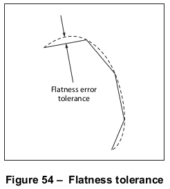
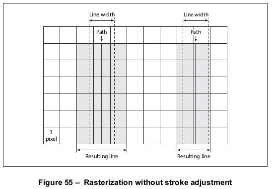

# 10.6 扫描转换详细信息

**Scan Conversion Details**

## 10.6.1 概述

**General**

=== "中文"

    The final step of rendering shall be *scan conversion*. The conforming reader executes a scan conversion algorithm to paint graphics, text, and images in the raster memory of the output device.
    
    !!! note "NOTE"
    
        The specifics of the scan conversion algorithm are not defined as part of PDF. Different implementations may perform scan conversion in different ways; techniques that are appropriate for one device may be inappropriate for another. Still, it is useful to have a general understanding of how scan conversion works, particularly when creating PDF files intended for viewing on a display. At the low resolutions typical of displays, variations of even one pixel’s width can have a noticeable effect on the appearance of painted shapes.
    
    Most scan conversion details are not under program control, but a few are; the parameters for controlling them are described here.

=== "英文"

    The final step of rendering shall be *scan conversion*. The conforming reader executes a scan conversion algorithm to paint graphics, text, and images in the raster memory of the output device.
    
    !!! note "NOTE"
    
        The specifics of the scan conversion algorithm are not defined as part of PDF. Different implementations may perform scan conversion in different ways; techniques that are appropriate for one device may be inappropriate for another. Still, it is useful to have a general understanding of how scan conversion works, particularly when creating PDF files intended for viewing on a display. At the low resolutions typical of displays, variations of even one pixel’s width can have a noticeable effect on the appearance of painted shapes.
    
    Most scan conversion details are not under program control, but a few are; the parameters for controlling them are described here.

## 10.6.2 平整度公差

**Flatness Tolerance**

=== "中文"

    The *flatness tolerance* controls the maximum permitted distance in device pixels between the mathematically correct path and an approximation constructed from straight line segments, as shown in Figure 54. Flatness may be specified as the operand of the i operator (see Table 57) or as the value of the **FL** entry in a graphics state parameter dictionary (see [Table 58]). It shall be a positive number.
    
    !!! note "NOTE 1"
    
        Smaller values yield greater precision at the cost of more computation.
    
    !!! note "NOTE 2"
    
        Although the figure exaggerates the difference between the curved and flattened paths for the sake of clarity, the purpose of the flatness tolerance is to control the precision of curve rendering, not to draw inscribed polygons. If the parameter’s value is large enough to cause visible straight line segments to appear, the result is unpredictable.
    
    

=== "英文"

    The *flatness tolerance* controls the maximum permitted distance in device pixels between the mathematically correct path and an approximation constructed from straight line segments, as shown in Figure 54. Flatness may be specified as the operand of the i operator (see Table 57) or as the value of the **FL** entry in a graphics state parameter dictionary (see [Table 58]). It shall be a positive number.
    
    !!! note "NOTE 1"
    
        Smaller values yield greater precision at the cost of more computation.
    
    !!! note "NOTE 2"
    
        Although the figure exaggerates the difference between the curved and flattened paths for the sake of clarity, the purpose of the flatness tolerance is to control the precision of curve rendering, not to draw inscribed polygons. If the parameter’s value is large enough to cause visible straight line segments to appear, the result is unpredictable.
    
    

## 10.6.3 平滑度公差

**Smoothness Tolerance**

=== "中文"

    The *smoothness tolerance* (PDF 1.3) controls the quality of smooth shading (type 2 patterns and the **sh** operator) and thus indirectly controls the rendering performance. Smoothness is the allowable colour error between a shading approximated by piecewise linear interpolation and the true value of a (possibly nonlinear) shading function. The error shall be measured for each colour component, and the maximum independent error shall be used. The allowable error (or tolerance) shall be expressed as a fraction of the range of the colour component, from 0.0 to 1.0. Thus, a smoothness tolerance of 0.1 represents a tolerance of 10 percent in each colour component. Smoothness may be specified as the value of the **SM** entry in a graphics state parameter dictionary (see [Table 58]).
    
    !!! info "EXAMPLE"
    
        Each output device may have internal limits on the maximum and minimum tolerances attainable. setting smoothness to 1.0 may result in an internal smoothness of 0.5 on a high-quality colour device, while setting it to 0.0 on the same device may result in an internal smoothness of 0.01 if an error of that magnitude is imperceptible on the device.
    
    !!! note "NOTE 1"
    
        The smoothness tolerance may also interact with the accuracy of colour conversion. In the case of a colour conversion defined by a sampled function, the conversion function is unknown. Thus the error may be sampled at too low a frequency, in which case the accuracy defined by the smoothness tolerance cannot be guaranteed. In most cases, however, where the conversion function is smooth and continuous, the accuracy should be within the specified tolerance.
    
    !!! note "NOTE 2"
    
        The effect of the smoothness tolerance is similar to that of the flatness tolerance. However, that flatness is measured in device-dependent units of pixel width, whereas smoothness is measured as a fraction of colour component range.

=== "英文"

    The *smoothness tolerance* (PDF 1.3) controls the quality of smooth shading (type 2 patterns and the **sh** operator) and thus indirectly controls the rendering performance. Smoothness is the allowable colour error between a shading approximated by piecewise linear interpolation and the true value of a (possibly nonlinear) shading function. The error shall be measured for each colour component, and the maximum independent error shall be used. The allowable error (or tolerance) shall be expressed as a fraction of the range of the colour component, from 0.0 to 1.0. Thus, a smoothness tolerance of 0.1 represents a tolerance of 10 percent in each colour component. Smoothness may be specified as the value of the **SM** entry in a graphics state parameter dictionary (see [Table 58]).
    
    !!! info "EXAMPLE"
    
        Each output device may have internal limits on the maximum and minimum tolerances attainable. setting smoothness to 1.0 may result in an internal smoothness of 0.5 on a high-quality colour device, while setting it to 0.0 on the same device may result in an internal smoothness of 0.01 if an error of that magnitude is imperceptible on the device.
    
    !!! note "NOTE 1"
    
        The smoothness tolerance may also interact with the accuracy of colour conversion. In the case of a colour conversion defined by a sampled function, the conversion function is unknown. Thus the error may be sampled at too low a frequency, in which case the accuracy defined by the smoothness tolerance cannot be guaranteed. In most cases, however, where the conversion function is smooth and continuous, the accuracy should be within the specified tolerance.
    
    !!! note "NOTE 2"
    
        The effect of the smoothness tolerance is similar to that of the flatness tolerance. However, that flatness is measured in device-dependent units of pixel width, whereas smoothness is measured as a fraction of colour component range.

## 10.6.4 扫描转换规则

**Scan Conversion Rules**

=== "中文"

    The following rules determine which device pixels a painting operation affects. All references to coordinates and pixels are in device space. A shape is a path to be painted with the current colour or with an image. Its coordinates are mapped into device space but not rounded to device pixel boundaries. At this level, curves have been flattened to sequences of straight lines, and all “insideness” computations have been performed.
    
    Pixel boundaries always fall on integer coordinates in device space. A pixel is a square region identified by the location of its corner with minimum horizontal and vertical coordinates. The region is *half-open*, meaning that it includes its lower but not its upper boundaries. More precisely, for any point whose real-number coordinates\ are *(x, y)*, let *i = floor(x)* and *j = floor(y)*. The pixel that contains this point is the one identified as *(i, j)*. The region belonging to that pixel is defined to be the set of points *(x', y')* such that *i ≤ x' < i + 1* and *j ≤ y' < j + 1*. Like pixels, shapes to be painted by filling and stroking operations are also treated as half-open regions that include the boundaries along their “floor” sides, but not along their “ceiling” sides.
    
    A shape shall be scan-converted by painting any pixel whose square region intersects the shape, no matter how small the intersection is. This ensures that no shape ever disappears as a result of unfavourable placement relative to the device pixel grid, as might happen with other possible scan conversion rules. The area covered by painted pixels shall always be at least as large as the area of the original shape. This rule applies both to fill operations and to strokes with nonzero width. Zero-width strokes may be done in an implementation-defined manner that may include fewer pixels than the rule implies.
    
    !!! note "NOTE 1"
    
        Normally, the intersection of two regions is defined as the intersection of their interiors. However, for purposes of scan conversion, a filling region is considered to intersect every pixel through which its boundary passes, even if the interior of the filling region is empty.
    
    !!! info "EXAMPLE"
    
        A zero-width or zero-height rectangle paints a line 1 pixel wide.
    
    The region of device space to be painted by a sampled image is determined similarly to that of a filled shape, though not identically. The conforming reader transforms the image’s source rectangle into device space and defines a half-open region, just as for fill operations. However, only those pixels whose centres lie within the region shall be painted. The position of the centre of such a pixel—in other words, the point whose coordinate values have fractional parts of one-half—shall be mapped back into source space to determine how to colour the pixel. There shall not be averaging over the pixel area;
    
    !!! note "NOTE 2"
    
        If the resolution of the source image is higher than that of device space, some source samples may not be used.
    
    For clipping, the clipping region consists of the set of pixels that would be included by a fill operation. Subsequent painting operations shall affect a region that is the intersection of the set of pixels defined by the clipping region with the set of pixels for the region to be painted.
    
    Scan conversion of character glyphs may be performed by a different algorithm from the preceding one.
    
    !!! note "NOTE 3"
    
        That font rendering algorithm uses hints in the glyph descriptions and techniques that are specialized to glyph rasterization.

=== "英文"

    The following rules determine which device pixels a painting operation affects. All references to coordinates and pixels are in device space. A shape is a path to be painted with the current colour or with an image. Its coordinates are mapped into device space but not rounded to device pixel boundaries. At this level, curves have been flattened to sequences of straight lines, and all “insideness” computations have been performed.
    
    Pixel boundaries always fall on integer coordinates in device space. A pixel is a square region identified by the location of its corner with minimum horizontal and vertical coordinates. The region is *half-open*, meaning that it includes its lower but not its upper boundaries. More precisely, for any point whose real-number coordinates\ are *(x, y)*, let *i = floor(x)* and *j = floor(y)*. The pixel that contains this point is the one identified as *(i, j)*. The region belonging to that pixel is defined to be the set of points *(x', y')* such that *i ≤ x' < i + 1* and *j ≤ y' < j + 1*. Like pixels, shapes to be painted by filling and stroking operations are also treated as half-open regions that include the boundaries along their “floor” sides, but not along their “ceiling” sides.
    
    A shape shall be scan-converted by painting any pixel whose square region intersects the shape, no matter how small the intersection is. This ensures that no shape ever disappears as a result of unfavourable placement relative to the device pixel grid, as might happen with other possible scan conversion rules. The area covered by painted pixels shall always be at least as large as the area of the original shape. This rule applies both to fill operations and to strokes with nonzero width. Zero-width strokes may be done in an implementation-defined manner that may include fewer pixels than the rule implies.
    
    !!! note "NOTE 1"
    
        Normally, the intersection of two regions is defined as the intersection of their interiors. However, for purposes of scan conversion, a filling region is considered to intersect every pixel through which its boundary passes, even if the interior of the filling region is empty.
    
    !!! info "EXAMPLE"
    
        A zero-width or zero-height rectangle paints a line 1 pixel wide.
    
    The region of device space to be painted by a sampled image is determined similarly to that of a filled shape, though not identically. The conforming reader transforms the image’s source rectangle into device space and defines a half-open region, just as for fill operations. However, only those pixels whose centres lie within the region shall be painted. The position of the centre of such a pixel—in other words, the point whose coordinate values have fractional parts of one-half—shall be mapped back into source space to determine how to colour the pixel. There shall not be averaging over the pixel area;
    
    !!! note "NOTE 2"
    
        If the resolution of the source image is higher than that of device space, some source samples may not be used.
    
    For clipping, the clipping region consists of the set of pixels that would be included by a fill operation. Subsequent painting operations shall affect a region that is the intersection of the set of pixels defined by the clipping region with the set of pixels for the region to be painted.
    
    Scan conversion of character glyphs may be performed by a different algorithm from the preceding one.
    
    !!! note "NOTE 3"
    
        That font rendering algorithm uses hints in the glyph descriptions and techniques that are specialized to glyph rasterization.

## 10.6.5 自动描边调整

**Automatic Stroke Adjustment**

=== "中文"

    When a stroke is drawn along a path, the scan conversion algorithm may produce lines of nonuniform thickness because of rasterization effects. In general, the line width and the coordinates of the endpoints, transformed into device space, are arbitrary real numbers not quantized to device pixels. A line of a given width can intersect with different numbers of device pixels, depending on where it is positioned. Figure 55 illustrates this effect.
    
    For best results, it is important to compensate for the rasterization effects to produce strokes of uniform thickness. This is especially important in low-resolution display applications. To meet this need, PDF 1.2 provides an optional *automatic stroke adjustment* feature. When stroke adjustment is enabled, the line width and the coordinates of a stroke shall automatically be adjusted as necessary to produce lines of uniform thickness. The thickness shall be as near as possible to the requested line width—no more than half a pixel different.
    
    
    
    If stroke adjustment is enabled and the requested line width, transformed into device space, is less than half a pixel, the stroke shall be rendered as a single-pixel line.
    
    !!! note "NOTE"
    
        This is the thinnest line that can be rendered at device resolution. It is equivalent to the effect produced by setting the line width to 0 (see [10.6.4], "Scan Conversion Rules").
    
    Because automatic stroke adjustment can have a substantial effect on the appearance of lines, PDF provides means to control whether the adjustment shall be performed. This may be specified with the stroke adjustment parameter in the graphics state, set by means of the **SA** entry in a graphics state parameter dictionary (see [8.4.5], "Graphics State Parameter Dictionaries").

=== "英文"

    When a stroke is drawn along a path, the scan conversion algorithm may produce lines of nonuniform thickness because of rasterization effects. In general, the line width and the coordinates of the endpoints, transformed into device space, are arbitrary real numbers not quantized to device pixels. A line of a given width can intersect with different numbers of device pixels, depending on where it is positioned. Figure 55 illustrates this effect.
    
    For best results, it is important to compensate for the rasterization effects to produce strokes of uniform thickness. This is especially important in low-resolution display applications. To meet this need, PDF 1.2 provides an optional *automatic stroke adjustment* feature. When stroke adjustment is enabled, the line width and the coordinates of a stroke shall automatically be adjusted as necessary to produce lines of uniform thickness. The thickness shall be as near as possible to the requested line width—no more than half a pixel different.
    
    
    
    If stroke adjustment is enabled and the requested line width, transformed into device space, is less than half a pixel, the stroke shall be rendered as a single-pixel line.
    
    !!! note "NOTE"
    
        This is the thinnest line that can be rendered at device resolution. It is equivalent to the effect produced by setting the line width to 0 (see [10.6.4], "Scan Conversion Rules").
    
    Because automatic stroke adjustment can have a substantial effect on the appearance of lines, PDF provides means to control whether the adjustment shall be performed. This may be specified with the stroke adjustment parameter in the graphics state, set by means of the **SA** entry in a graphics state parameter dictionary (see [8.4.5], "Graphics State Parameter Dictionaries").

[8.4.5]: ../c8/s4.md#845-图形状态参数字典
[10.6.4]: ../c10/s6.md#1064-扫描转换规则

[Table 57]: ../c8/s4.md#table57
[Table 58]: ../c8/s4.md#table58