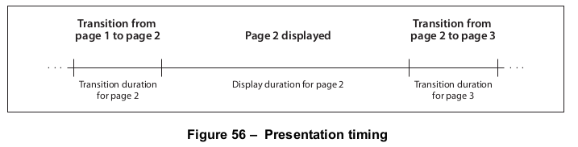

# 12.4 页面级导航

**12.4 Page-Level Navigation**

## 12.4.1 概述

**12.4.1 General**

=== "中文"

    本小节介绍了一些PDF功能，这些功能使用户能够在文档内逐页导航：

    - 页面标签，用于对单个页面进行编号或其他方式的标识（见[12.4.2]，“页面标签”）。
    - 文章线索，将文档中逻辑相关但物理顺序上不连续的内容项链接在一起（见[12.4.3]，“文章”）。
    - 演示文稿，以幻灯片放映的形式显示文档，可以自动或由用户控制从一页切换到下一页（见[12.4.4]，“演示文稿”）。

    有关另一种重要的页面级导航形式，请参见[12.5.6.5]，“链接注释”。

=== "英文"

    This sub-clause describes PDF facilities that enable the user to navigate from page to page within a document:
    
    - Page labels for numbering or otherwise identifying individual pages (see [12.4.2], “Page Labels”).
    - Article threads, which chain together items of content within the document that are logically connected but not physically sequential (see [12.4.3], “Articles”).
    - Presentations that display the document in the form of a slide show, advancing from one page to the next either automatically or under user control (see [12.4.4], “Presentations”).
    
    For another important form of page-level navigation, see [12.5.6.5], “Link Annotations.”


## 12.4.2 页面标签

**12.4.2 Page Labels**

=== "中文"

    PDF文档中的每一页都应通过一个整数*页码索引*来标识，该索引表示页面在文档中的相对位置。此外，文档可以选择性地定义页面标签（PDF 1.3），以便在屏幕上或打印时直观地标识每一页。页面标签和页码索引不必一致：索引是固定的，从第一页的0开始在文档中连续编号，但标签可以用适合特定文档的任何方式指定。

    !!! note "注1"

        如果文档的前12页使用罗马数字编号的前言部分，其余部分使用阿拉伯数字编号，则第一页的页码索引为0，页面标签为i；第十二页的索引为11，标签为xii；第十三页的索引为12，标签为1。

    为了进行页面标记，文档应被划分为标记范围，每个范围是一系列使用相同编号系统的连续页面。范围内的页面应按升序依次编号。页面的标签由其在其标记范围内的位置决定的数字部分组成，前面可选择性地加上*表示该范围的标签前缀*。

    !!! note "注2"

        附录中的页面可能用字符串A-作为前缀的十进制数字部分标记，生成的页面标签将是A-1、A-2等。

    文档的标记范围应由文档目录中的**PageLabels**条目定义（见[7.7.2]，“文档目录”）。此条目的值应为一个数字树（[7.9.7]，“数字树”），其每个键都是标记范围内第一页的页码索引。相应的值应为*页面标签字典*，定义该范围内页面的标记特性。树中应包含页码索引0的值。表159显示了页面标签字典的内容。

    <table id="table159" markdown="span">
        <caption>**表159 – 页面标签字典中的条目**</caption>
        <thead>
            <tr>
                <th>**键**</th>
                <th>**类型**</th>
                <th>**值**</th>
            </tr>
        </thead>
        <tbody>
            <tr>
                <td>**Type**</td>
                <td>名称</td>
                <td>（可选）此字典描述的PDF对象的类型；如果存在，应为**PageLabel**。</td>
            </tr>
            <tr>
                <td>**S**</td>
                <td>名称或数组</td>
                <td>（可选）每页标签数字部分应使用的编号样式：<br/>
                <dl>
                    <dt>D</dt>
                    <dd>十进制阿拉伯数字</dd>
                    <dt>R</dt>
                    <dd>大写罗马数字</dd>
                    <dt>r</dt>
                    <dd>小写罗马数字</dd>
                    <dt>A</dt>
                    <dd>大写字母（前26页为A到Z，接下来的26页为AA到ZZ，依此类推）</dd>
                    <dt>a</dt>
                    <dd>小写字母（前26页为a到z，接下来的26页为aa到zz，依此类推）</dd>
                </dl>
                没有默认的编号样式；如果没有**S**条目，页面标签将仅由标签前缀组成，没有数字部分。<br/>
                注意 &emsp; 如果下一个P条目指定标签前缀为Contents，则每页仅标记为Contents，没有页码。（如果**P**条目也缺失或为空，则页面标签为空字符串。）
                </td>
            </tr>
            <tr>
                <td>**P**</td>
                <td>文本字符串</td>
                <td>（可选）此范围内页面标签的标签前缀。</td>
            </tr>
            <tr>
                <td>**St**</td>
                <td>整数</td>
                <td>（可选）范围内第一页标签的数字部分的值。后续页面应从此值开始依次编号，该值应大于或等于1。默认值：1。</td>
            </tr>
        </tbody>
    </table>

    !!! info "示例"

        以下示例显示了一个文档，其页面标记为

        i, ii, iii, iv, 1, 2, 3, A-8, A-9, …
    
    ```text
    1 0 obj
        << /Type /Catalog
            /PageLabels << /Nums [  0 << /S /r >>   % A number tree containing
                                    4 << /S /D >>   % three page label dictionaries
                                    7 << /S /D
                                         /P ( A- )
                                         /St 8
                                    >>
                                 ]
                        >> 
            …
        >>
    endobj
    ```

=== "英文"

    Each page in a PDF document shall be identified by an integer *page index* that expresses the page’s relative position within the document. In addition, a document may optionally define page labels (PDF 1.3) to identify each page visually on the screen or in print. Page labels and page indices need not coincide: the indices shall be fixed, running consecutively through the document starting from 0 for the first page, but the labels may be specified in any way that is appropriate for the particular document.
    
    !!! note "NOTE 1"
    
        If the document begins with 12 pages of front matter numbered in roman numerals and the remainder of the document is numbered in arabic, the first page would have a page index of 0 and a page label of i, the twelfth page would have index 11 and label xii, and the thirteenth page would have index 12 and label 1.
    
    For purposes of page labelling, a document shall be divided into labelling ranges, each of which is a series of consecutive pages using the same numbering system. Pages within a range shall be numbered sequentially in ascending order. A page’s label consists of a numeric portion based on its position within its labelling range, optionally preceded by a *label prefix denoting the range itself*.
    
    !!! note "NOTE 2"
    
        The pages in an appendix might be labeled with decimal numeric portions prefixed with the string A-; the resulting page labels would be A-1, A-2, and so on.
    
    A document’s labelling ranges shall be defined by the **PageLabels** entry in the document catalogue (see [7.7.2], “Document Catalog”). The value of this entry shall be a number tree ([7.9.7], “Number Trees”), each of whose keys is the page index of the first page in a labelling range. The corresponding value shall be a *page label dictionary* defining the labelling characteristics for the pages in that range. The tree shall include a value for page index 0. Table 159 shows the contents of a page label dictionary.
    
    <table id="table159" markdown="span">
        <caption>**Table 159 – Entries in a page label dictionary**</caption>
        <thead>
            <tr>
                <th>**Key**</th>
                <th>**Type**</th>
                <th>**Value**</th>
            </tr>
        </thead>
        <tbody>
            <tr>
                <td>**Type**</td>
                <td>name</td>
                <td>(Optional) The type of PDF object that this dictionary describes; if present, shall be **PageLabel** for a page label dictionary.</td>
            </tr>
            <tr>
                <td>**S**</td>
                <td>name or array</td>
                <td>(Optional) The numbering style that shall be used for the numeric portion of each page label:<br/>
                <dl>
                    <dt>D</dt>
                    <dd>Decimal arabic numerals</dd>
                    <dt>R</dt>
                    <dd>Uppercase roman numerals</dd>
                    <dt>r</dt>
                    <dd>Lowercase roman numerals</dd>
                    <dt>A</dt>
                    <dd>Uppercase letters (A to Z for the first 26 pages, AA to ZZ for the next 26, and so on)</dd>
                    <dt>a</dt>
                    <dd>Lowercase letters (a to z for the first 26 pages, aa to zz for the next 26, and so on)</dd>
                </dl>
                There is no default numbering style; if no **S** entry is present, page labels shall consist solely of a label prefix with no numeric portion. <br/>
                NOTE &emsp; If the P entry (next) specifies the label prefix Contents, each page is simply labeled Contents with no page number. (If the **P** entry is also missing or empty, the page label is an empty string.)
                </td>
            </tr>
            <tr>
                <td>**P**</td>
                <td>text string</td>
                <td>(Optional) The label prefix for page labels in this range.</td>
            </tr>
            <tr>
                <td>**St**</td>
                <td>integer</td>
                <td>(Optional) The value of the numeric portion for the first page label in the range. Subsequent pages shall be numbered sequentially from this value, which shall be greater than or equal to 1. Default value: 1.</td>
            </tr>
        </tbody>
    </table>
    
    !!! info "EXAMPLE"
    
        The following example shows a document with pages labeled
    
        i, ii, iii, iv, 1, 2, 3, A-8, A-9, …
    
    ```text
    1 0 obj
        << /Type /Catalog
            /PageLabels << /Nums [  0 << /S /r >>   % A number tree containing
                                    4 << /S /D >>   % three page label dictionaries
                                    7 << /S /D
                                         /P ( A- )
                                         /St 8
                                    >>
                                 ]
                        >> 
            …
        >>
    endobj
    ```

## 12.4.3 文章

**12.4.3 Articles**

=== "中文"

    某些类型的文档可能包含逻辑上相关但物理上不连续的内容项序列。

    !!! info "示例1"

        一则新闻报道可能从新闻通讯的第一页开始，然后延续到一个或多个不相邻的内页上。

    为了表示这种物理上不连续但逻辑上相关的项序列，PDF文档可以定义一个或多个文章（PDF 1.1）。文章的顺序流由文章线索定义；组成文章的单个内容项称为线索上的珠子。符合规范的阅读器可以提供导航功能，允许用户从一个珠子沿着线索到下一个珠子。

    文档目录中的可选**Threads**条目（见[7.7.2]，“文档目录”）包含一个线程字典数组（[表160](#table160)），用于定义文档的文章。线索中的每个单独珠子都应由一个珠子字典表示（[表161](#table161)）。线程字典的**F**条目应指向线索中的第一个珠子；珠子应通过它们的**N**（下一个）和**V**（上一个）条目在双向链表中依次链接在一起。此外，对于出现文章珠子的每一页，页面对象（见[7.7.3]，“页面树”）应包含一个**B**条目，其值是该页上珠子的间接引用的数组，按绘制顺序排列。

    <table id="table160" markdown="span">
        <caption>**表160 – 线程字典中的条目**</caption>
        <thead>
            <tr>
                <th>**键**</th>
                <th>**类型**</th>
                <th>**值**</th>
            </tr>
        </thead>
        <tbody>
            <tr>
                <td>**Type**</td>
                <td>名称</td>
                <td>（可选）此字典描述的PDF对象的类型；如果存在，对于线程字典应为**Thread**。</td>
            </tr>
            <tr>
                <td>**F**</td>
                <td>字典</td>
                <td>（必需；应为间接引用）线索中的第一个珠子。</td>
            </tr>
            <tr>
                <td>**I**</td>
                <td>字典</td>
                <td>（可选）包含有关线索的信息（如其标题、作者和创建日期）的线程信息字典。此字典的内容应符合文档信息字典的语法（见[14.3.3]，“文档信息字典”）。</td>
            </tr>
        </tbody>
    </table>

    <table id="table161" markdown="span">
        <caption>**表161 – 珠子字典中的条目**</caption>
        <thead>
            <tr>
                <th>**键**</th>
                <th>**类型**</th>
                <th>**值**</th>
            </tr>
        </thead>
        <tbody>
            <tr>
                <td>**Type**</td>
                <td>名称</td>
                <td>（可选）此字典描述的PDF对象的类型；如果存在，对于珠子字典应为**Bead**。</td>
            </tr>
            <tr>
                <td>**T**</td>
                <td>字典</td>
                <td>（对于线索的第一个珠子必需；对于其他珠子可选；应为间接引用）此珠子所属的线索。<br/>（PDF 1.1）此条目仅允许用于线索的第一个珠子。<br/>（PDF 1.2）任何珠子都可以使用，但只有第一个需要。</td>
            </tr>
            <tr>
                <td>**N**</td>
                <td>字典</td>
                <td>（必需；应为间接引用）线索中的下一个珠子。在最后一个珠子中，此条目应指向第一个珠子。</td>
            </tr>
            <tr>
                <td>**V**</td>
                <td>字典</td>
                <td>（必需；应为间接引用）线索中的上一个珠子。在第一个珠子中，此条目应指向最后一个珠子。</td>
            </tr>
            <tr>
                <td>**P**</td>
                <td>字典</td>
                <td>（必需；应为间接引用）代表此珠子出现的页面的页面对象。</td>
            </tr>
            <tr>
                <td>**R**</td>
                <td>字典</td>
                <td>（必需）一个矩形，指定此珠子在页面上的位置。</td>
            </tr>
        </tbody>
    </table>

    !!! info "EXAMPLE 2"

        下面的例子显示了一根带有三颗珠子的线。
    
        ```text
        22 0 obj
            << /F 23 0 R
               /I << /Title ( Man Bites Dog ) >>
            >>
        endobj
        
        23 0 obj
            << /T 22 0 R
               /N 24 0 R
               /V 25 0 R
               /P 8 0 R
               /R [ 158 247 318 905 ]
            >>
        endobj
        
        24 0 obj
            << /T 22 0 R
               /N 25 0 R
               /V 23 0 R
               /P 8 0 R
               /R [ 322 246 486 904 ]
            >>
        endobj
        
        25 0 obj
            << /T 22 0 R
               /N 23 0 R
               /V 24 0 R
               /P 10 0 R
               /R [ 157 254 319 903 ]
            >>
        endobj
        ```

=== "英文"

    Some types of documents may contain sequences of content items that are logically connected but not physically sequential.
    
    !!! info "EXAMPLE 1"
    
        A news story may begin on the first page of a newsletter and run over onto one or more nonconsecutive interior pages.
    
    To represent such sequences of physically discontiguous but logically related items, a PDF document may define one or more articles (PDF 1.1). The sequential flow of an article shall be defined by an article thread; the individual content items that make up the article are called beads on the thread. Conforming readers may provide navigation facilities to allow the user to follow a thread from one bead to the next.
    
    The optional **Threads** entry in the document catalogue (see [7.7.2], “Document Catalog”) holds an array of thread dictionaries ([Table 160](#table160)) defining the document’s articles. Each individual bead within a thread shall be represented by a bead dictionary ([Table 161](#table161)). The thread dictionary’s **F** entry shall refer to the first bead in the thread; the beads shall be chained together sequentially in a doubly linked list through their **N** (next) and **V** (previous) entries. In addition, for each page on which article beads appear, the page object (see [7.7.3], “Page Tree”) shall contain a **B** entry whose value is an array of indirect references to the beads on the page, in drawing order.
        
    <table id="table160" markdown="span">
        <caption>**Table 160 – Entries in a thread dictionary**</caption>
        <thead>
            <tr>
                <th>**Key**</th>
                <th>**Type**</th>
                <th>**Value**</th>
            </tr>
        </thead>
        <tbody>
            <tr>
                <td>**Type**</td>
                <td>name</td>
                <td>(Optional) The type of PDF object that this dictionary describes; if present, shall be **Thread** for a thread dictionary.</td>
            </tr>
            <tr>
                <td>**F**</td>
                <td>dictionary</td>
                <td>(Required; shall be an indirect reference) The first bead in the thread.</td>
            </tr>
            <tr>
                <td>**I**</td>
                <td>dictionary</td>
                <td>(Optional) A thread information dictionary containing information about the thread, such as its title, author, and creation date. The contents of this dictionary shall conform to the syntax for the document information dictionary (see [14.3.3], “Document Information Dictionary”).</td>
            </tr>
        </tbody>
    </table>
    
    <table id="table161" markdown="span">
        <caption>**Table 161 – Entries in a bead dictionary**</caption>
        <thead>
            <tr>
                <th>**Key**</th>
                <th>**Type**</th>
                <th>**Value**</th>
            </tr>
        </thead>
        <tbody>
            <tr>
                <td>**Type**</td>
                <td>name</td>
                <td>(Optional) The type of PDF object that this dictionary describes; if present, shall be **Bead** for a bead dictionary.</td>
            </tr>
            <tr>
                <td>**T**</td>
                <td>dictionary</td>
                <td>(Required for the first bead of a thread; optional for all others; shall be an indirect reference) The thread to which this bead belongs.<br/> (PDF 1.1) This entry shall be permitted only for the first bead of a thread. <br/> (PDF 1.2) It shall be permitted for any bead but required only for the first.</td>
            </tr>
            <tr>
                <td>**N**</td>
                <td>dictionary</td>
                <td>(Required; shall be an indirect reference) The next bead in the thread. In the last bead, this entry shall refer to the first bead.</td>
            </tr>
            <tr>
                <td>**V**</td>
                <td>dictionary</td>
                <td>(Required; shall be an indirect reference) The previous bead in the thread. In the first bead, this entry shall refer to the last bead.</td>
            </tr>
            <tr>
                <td>**P**</td>
                <td>dictionary</td>
                <td>(Required; shall be an indirect reference) The page object representing the page on which this bead appears.</td>
            </tr>
            <tr>
                <td>**R**</td>
                <td>dictionary</td>
                <td>(Required) A rectangle specifying the location of this bead on the page.</td>
            </tr>
        </tbody>
    </table>
    
    !!! info "EXAMPLE 2"
    
        The following example shows a thread with three beads.
    
        ```text
        22 0 obj
            << /F 23 0 R
               /I << /Title ( Man Bites Dog ) >>
            >>
        endobj
        
        23 0 obj
            << /T 22 0 R
               /N 24 0 R
               /V 25 0 R
               /P 8 0 R
               /R [ 158 247 318 905 ]
            >>
        endobj
        
        24 0 obj
            << /T 22 0 R
               /N 25 0 R
               /V 23 0 R
               /P 8 0 R
               /R [ 322 246 486 904 ]
            >>
        endobj
        
        25 0 obj
            << /T 22 0 R
               /N 23 0 R
               /V 24 0 R
               /P 10 0 R
               /R [ 157 254 319 903 ]
            >>
        endobj
        ```

## 12.4.4 演示文稿

**12.4.4 Presentations**

### 12.4.4.1 概述

**12.4.4.1 General**

=== "中文"

    一些符合标准的阅读器可能允许以演示文稿或幻灯片的形式显示文档，自动或在用户控制下从一页前进到下一页。此外，PDF 1.5 引入了在同一页的不同状态之间前进的功能（参见 [12.4.4.2]，“子页面导航”）。
    
    !!! note "NOTE 1"
    
        PDF 1.4 引入了一种不同的机制，称为替代演示，用于幻灯片显示，如[13.5]“替代演示”中所述。
    
    页面对象（参见 [7.7.3]，“页面树”）可能包含两个可选条目，**Dur** 和 **Trans** (PDF 1.1)，用于指定如何在演示模式下显示该页面。**Trans** 条目应包含一个过渡字典，描述在演示过程中从另一个页面移动到给定页面时使用的视觉过渡的样式和持续时间。[表 162](#table162) 显示了过渡字典的内容。（如表中所示，显示的某些条目仅对某些过渡样式有用。）
    
    页面对象中的 **Dur** 条目指定页面的*显示持续时间*（也称为其前进时间）：演示文稿自动前进到下一页之前页面显示的最大时间长度（以秒为单位）。
    
    !!! note "NOTE 2"
    
        用户可以在指定时间到期之前手动推进页面。
    
    如果页面对象中没有指定**Dur**条目，则页面将不会自动前进。
    
    <table id="table162" markdown="span">
        <caption>**表162 – 过渡字典中的条目**</caption>
        <thead>
            <tr>
                <th>**键**</th>
                <th>**类型**</th>
                <th>**值**</th>
            </tr>
        </thead>
        <tbody>
            <tr>
                <td>**Type**</td>
                <td>名称</td>
                <td>（可选）此字典描述的PDF对象的类型；如果存在，对于过渡字典应为**Trans**。</td>
            </tr>
            <tr>
                <td>**S**</td>
                <td>名称</td>
                <td>（必需；应为间接引用）线索中的第一个珠子。（注：此处原文档描述可能有误，根据上下文推测可能是关于过渡效果相关内容的错误表述）</td>
            </tr>
            <tr>
                <td>**I**</td>
                <td>字典</td>
                <td>（可选）在演示过程中从另一页转到此页时应使用的过渡样式。默认值：R。<br/>
                <dl>
                    <dt>Split（分离）</dt>
                    <dd>两条线扫过屏幕，显示新页面。线条可以是水平的或垂直的，并且可以根据**Dm**和**M**条目的指定，从页面边缘向内移动或从中心向外移动。</dd>
                    <dt>Blinds（百叶窗）</dt>
                    <dd>多条线均匀分布在屏幕上，同步向同一方向扫动以显示新页面。线条可以是水平的或垂直的，根据**Dm**条目指定。水平线条向下移动；垂直线条向右移动。</dd>
                    <dt>Box（盒状）</dt>
                    <dd>一个矩形框根据**M**条目的指定，从页面边缘向内扫动或从中心向外扫动，显示新页面。</dd>
                    <dt>Wipe（擦除）</dt>
                    <dd>一条线按照**Di**条目指定的方向，从屏幕的一边扫到另一边，显示新页面。</dd>
                    <dt>Dissolve（溶解）</dt>
                    <dd>旧页面逐渐溶解以显示新页面。</dd>
                    <dt>Glitter（闪烁）</dt>
                    <dd>类似于溶解效果，但效果是以宽条带的形式从屏幕的一侧移动到另一侧，方向由**Di**条目指定。</dd>
                    <dt>R</dt>
                    <dd>新页面简单地替换旧页面，没有特殊的过渡效果；**D**条目将被忽略。</dd>
                    <dt>Fly（飞入飞出）</dt>
                    <dd>（PDF 1.5）更改内容根据**M**指定的方向飞入或飞出（在**Di**指定的方向上），从一个屏幕外的位置开始（当**Di**为None时除外）。</dd>
                    <dt>Push（推入推出）</dt>
                    <dd>（PDF 1.5）旧页面沿着**Di**指定的方向滑出屏幕，同时新页面滑入，将旧页面推开。</dd>
                    <dt>Cover（覆盖）</dt>
                    <dd>（PDF 1.5）新页面沿着**Di**指定的方向滑入屏幕，覆盖旧页面。</dd>
                    <dt>Uncover（揭开）</dt>
                    <dd>（PDF 1.5）旧页面沿着**Di**指定的方向滑出屏幕，从而在相同方向上显示新页面。</dd>
                    <dt>Fade（淡入）</dt>
                    <dd>（PDF 1.5）新页面逐渐透过旧页面变得可见。</dd>
                </dl>
                </td>
            </tr>
            <tr>
                <td>**D**</td>
                <td>数字</td>
                <td>（可选）过渡效果的持续时间，以秒为单位。默认值：1。</td>
            </tr>
            <tr>
                <td>**Dm**</td>
                <td>名称</td>
                <td>（可选；仅适用于Split和Blinds过渡样式）指定过渡效果发生的维度：<br/>
                H &emsp; 水平 <br/>
                V &emsp; 垂直 <br/>
                默认值：H。</td>
            </tr>
            <tr>
                <td>**M**</td>
                <td>名称</td>
                <td>（可选；仅适用于Split、Box和Fly过渡样式）指定过渡效果的运动方向：<br/> I &emsp; 从页面边缘向内 <br/> O &emsp; 从页面中心向外 <br/> 默认值：I。</td>
            </tr>
            <tr>
                <td>**Di**</td>
                <td>数字或名称</td>
                <td>（可选；仅适用于Wipe、Glitter、Fly、Cover、Uncover和Push过渡样式）指定过渡效果移动的方向，以从左到右方向开始逆时针度量。（这与页面对象的**Rotate**条目不同，后者是从顶部开始顺时针度量的。）如果值是数字，则应为以下之一：<br/>
                <dl>
                    <dt>0</dt>
                    <dd>从左到右</dd>
                    <dt>90</dt>
                    <dd>从下到上（仅适用于Wipe）</dd>
                    <dt>180</dt>
                    <dd>从右到左（仅适用于Wipe）</dd>
                    <dt>270</dt>
                    <dd>从上到下</dd>
                    <dt>315</dt>
                    <dd>从左上到右下（仅适用于Glitter）</dd>
                </dl>
                如果值是名称，则应为None，这仅在Fly过渡且SS的值不为1.0时相关。<br/>
                默认值：0。</td>
            </tr>
            <tr>
                <td>**SS**</td>
                <td>数字</td>
                <td>（可选；PDF 1.5；仅适用于Fly过渡样式）绘制更改内容时的起始或结束缩放比例。如果**M**指定向内过渡，则在过渡过程中绘制的更改内容的缩放比例将从SS过渡到1.0。如果**M**指定向外过渡，则在过渡过程中绘制的更改内容的缩放比例将从1.0过渡到**SS**<br/> 默认值：1.0。</td>
            </tr>
            <tr>
                <td>**B**</td>
                <td>布尔值</td>
                <td>（可选；PDF 1.5；仅适用于Fly过渡样式）如果为**true**，则飞入的区域将是矩形且不透明的。默认值：**false**。</td>
            </tr>
        </tbody>
    </table>
    
    !!! note "NOTE 3"
    
        图 56 说明了过渡持续时间（过渡字典中的 **D**）和显示持续时间（页面对象中的 **Dur**）之间的关系。请注意，为页面（图中的页面 2）指定的过渡持续时间控制从另一页面到该页面的过渡；从该页面的过渡由下一页的过渡持续时间控制。
    
    
    
    !!! info "EXAMPLE"
    
        以下示例显示了显示 5 秒的页面的呈现参数。在显示页面之前，有一个 3.5 秒的过渡，其中两条垂直线从页面中心向外扫过到页面边缘。
    
    ```text
    10 0 obj
        << /Type /Page
           /Parent 4 0 R
           /Contents 16 0 R
           /Dur 5
           /Trans << /Type /Trans
                     /D 3.5
                     /S /Split
                     /Dm /V
                     /M /O
                  >>
        >>
    endobj
    ```

=== "英文"

    Some conforming readers may allow a document to be displayed in the form of a presentation or slide show, advancing from one page to the next either automatically or under user control. In addition, PDF 1.5 introduces the ability to advance between different states of the same page (see [12.4.4.2], “Sub-page Navigation”).
    
    !!! note "NOTE 1"
    
        PDF 1.4 introduces a different mechanism, known as alternate presentations, for slide show displays, described in [13.5], “Alternate Presentations.”
    
    A page object (see [7.7.3], “Page Tree”) may contain two optional entries, **Dur** and **Trans** (PDF 1.1), to specify how to display that page in presentation mode. The **Trans** entry shall contain a transition dictionary describing the style and duration of the visual transition to use when moving from another page to the given page during a presentation. [Table 162](#table162) shows the contents of the transition dictionary. (Some of the entries shown are needed only for certain transition styles, as indicated in the table.)
    
    The **Dur** entry in the page object specifies the page’s *display duration* (also called its advance timing): the maximum length of time, in seconds, that the page shall be displayed before the presentation automatically advances to the next page.
    
    !!! note "NOTE 2"
    
        The user can advance the page manually before the specified time has expired.
    
    If no **Dur** entry is specified in the page object, the page shall not advance automatically.
    
    <table id="table162" markdown="span">
        <caption>**Table 162 – Entries in a transition dictionary**</caption>
        <thead>
            <tr>
                <th>**Key**</th>
                <th>**Type**</th>
                <th>**Value**</th>
            </tr>
        </thead>
        <tbody>
            <tr>
                <td>**Type**</td>
                <td>name</td>
                <td>(Optional) The type of PDF object that this dictionary describes; if present, shall be **Trans** for a transition dictionary.</td>
            </tr>
            <tr>
                <td>**S**</td>
                <td>name</td>
                <td>(Required; shall be an indirect reference) The first bead in the thread.</td>
            </tr>
            <tr>
                <td>**I**</td>
                <td>dictionary</td>
                <td>(Optional) The transition style that shall be used when moving to this page from another during a presentation. Default value: R. <br/>
                <dl>
                    <dt>Split</dt>
                    <dd>Two lines sweep across the screen, revealing the new page. The lines may be either horizontal or vertical and may move inward from the edges of the page or outward from the center, as specified by the **Dm** and **M** entries, respectively.</dd>
                    <dt>Blinds</dt>
                    <dd>Multiple lines, evenly spaced across the screen, synchronously sweep in the same direction to reveal the new page. The lines may be either horizontal or vertical, as specified by the **Dm** entry. Horizontal lines move downward; vertical lines move to the right.</dd>
                    <dt>Box</dt>
                    <dd>A rectangular box sweeps inward from the edges of the page or outward from the center, as specified by the **M** entry, revealing the new page.</dd>
                    <dt>Wipe</dt>
                    <dd>A single line sweeps across the screen from one edge to the other in the direction specified by the **Di** entry, revealing the new page.</dd>
                    <dt>Dissolve</dt>
                    <dd>The old page dissolves gradually to reveal the new one.</dd>
                    <dt>Glitter</dt>
                    <dd>Similar to Dissolve, except that the effect sweeps across the page in a wide band moving from one side of the screen to the other in the direction specified by the **Di** entry.</dd>
                    <dt>R</dt>
                    <dd>The new page simply replaces the old one with no special transition effect; the **D** entry shall be ignored.</dd>
                    <dt>Fly</dt>
                    <dd>(PDF 1.5) Changes are flown out or in (as specified by **M**), in the direction specified by **Di**, to or from a location that is offscreen except when **Di** is None.</dd>
                    <dt>Push</dt>
                    <dd>(PDF 1.5) The old page slides off the screen while the new page slides in, pushing the old page out in the direction specified by **Di**.</dd>
                    <dt>Cover</dt>
                    <dd>(PDF 1.5) The new page slides on to the screen in the direction specified by **Di**, covering the old page.</dd>
                    <dt>Uncover</dt>
                    <dd>(PDF 1.5) The old page slides off the screen in the direction specified by **Di**, uncovering the new page in the direction specified by **Di**.</dd>
                    <dt>Fade</dt>
                    <dd>(PDF 1.5) The new page gradually becomes visible through the old one.</dd>
                </dl>
                </td>
            </tr>
            <tr>
                <td>**D**</td>
                <td>number</td>
                <td>(Optional) The duration of the transition effect, in seconds. Default value: 1.</td>
            </tr>
            <tr>
                <td>**Dm**</td>
                <td>name</td>
                <td>(Optional; **Split** and **Blinds** transition styles only) The dimension in which the specified transition effect shall occur:<br/>
                H &emsp; Horizontal <br/>
                V &emsp; Vertical <br/>
                Default value : H.
                </td>
            </tr>
            <tr>
                <td>**M**</td>
                <td>name</td>
                <td>(Optional; Split, Box and Fly transition styles only) The direction of motion for the specified transition effect: <br/> I &emsp; Inward from the edges of the page <br/> O &emsp; Outward from the center of the page <br/> Default value: I.</td>
            </tr>
            <tr>
                <td>**Di**</td>
                <td>number or name</td>
                <td>(Optional; Wipe, Glitter, **Fly**, **Cover**, **Uncover** and **Push** transition styles only) The direction in which the specified transition effect shall moves, expressed in degrees counterclockwise starting from a left-to-right direction. (This differs from the page object’s **Rotate** entry, which is measured clockwise from the top.) If the value is a number, it shall be one of: <br/>
                <dl>
                    <dt>0</dt>
                    <dd>Left to right</dd>
                    <dt>90</dt>
                    <dd>Bottom to top (Wipe only)</dd>
                    <dt>180</dt>
                    <dd>Right to left (Wipe only)</dd>
                    <dt>270</dt>
                    <dd>Top to bottom</dd>
                    <dt>315</dt>
                    <dd>Top-left to bottom-right (Glitter only)</dd>
                </dl>
                If the value is a name, it shall be None, which is relevant only for the Fly transition when the value of SS is not 1.0.  <br/>
                Default value: 0.
                </td>
            </tr>
            <tr>
                <td>**SS**</td>
                <td>number</td>
                <td>(Optional; PDF 1.5; Fly transition style only) The starting or ending scale at which the changes shall be drawn. If **M** specifies an inward transition, the scale of the changes drawn shall progress from SS to 1.0 over the course of the transition. If **M** specifies an outward transition, the scale of the changes drawn shall progress from 1.0 to **SS** over the course of the transition <br/> Default: 1.0.</td>
            </tr>
            <tr>
                <td>**B**</td>
                <td>boolean</td>
                <td>(Optional; PDF 1.5; **Fly** transition style only) If **true**, the area that shall be flown in is rectangular and opaque. Default: **false**.</td>
            </tr>
        </tbody>
    </table>
    
    !!! note "NOTE 3"
    
        Figure 56 illustrates the relationship between transition duration (**D** in the transition dictionary) and display duration (**Dur** in the page object). Note that the transition duration specified for a page (page 2 in the figure) governs the transition to that page from another page; the transition from the page is governed by the next page’s transition duration.
    
    
    
    !!! info "EXAMPLE"
    
        The following example shows the presentation parameters for a page to be displayed for 5 seconds. Before the page is displayed, there is a 3.5-second transition in which two vertical lines sweep outward from the center to the edges of the page.
    
    ```text
    10 0 obj
        << /Type /Page
           /Parent 4 0 R
           /Contents 16 0 R
           /Dur 5
           /Trans << /Type /Trans
                     /D 3.5
                     /S /Split
                     /Dm /V
                     /M /O
                  >>
        >>
    endobj
    ```

### 12.4.4.2 子页面导航

**12.4.4.2 Sub-page Navigation**

=== "中文"

    子页面导航（PDF 1.5）不仅能够在页面之间进行导航，还能在同一页面的不同状态之间进行导航。

    !!! note "注1"

        在PDF演示文稿中，单页上可能有一系列可单独开启和关闭的项目符号点。在此示例中，这些项目符号将由可选内容表示（见8.11.2，“可选内容组”），页面的每种状态都将表示为一个导航节点。

    !!! note "注2"

        符合规范的阅读器应在用户进入演示模式时保存可选内容组的状态，并在演示模式结束时恢复该状态。例如，这可确保对项目符号所做的临时更改不会影响文档的打印。

    导航节点字典（见表163）指定当用户发出导航请求时要执行的操作。

    !!! info "示例"

        按下箭头键。

    页面上的导航节点通过其Next（下一个）和Prev（上一个）条目形成一个双向链表。页面的主要节点由页面字典中的可选PresSteps条目确定（见表30）。

    !!! note "注3"

        符合规范的阅读器应仅在演示模式（见[12.4.4]，“演示文稿”）下尊重导航节点 。
    
    <table id="table163" markdown="span">
        <caption>**表163 – 导航节点字典中的条目**</caption>
        <thead>
            <tr>
                <th>**键**</th>
                <th>**类型**</th>
                <th>**值**</th>
            </tr>
        </thead>
        <tbody>
            <tr>
                <td>**Type**</td>
                <td>名称</td>
                <td>（可选）此字典描述的PDF对象的类型；对于导航节点字典，应为**NavNode**。</td>
            </tr>
            <tr>
                <td>**NA**</td>
                <td>字典</td>
                <td>（可选）当用户向前导航时要执行的操作（可能是操作序列中的第一个）。 </td>
            </tr>
            <tr>
                <td>**PA**</td>
                <td>字典</td>
                <td>（可选）当用户向后导航时要执行的操作（可能是操作序列中的第一个）。 </td>
            </tr>
            <tr>
                <td>**Next**</td>
                <td>字典</td>
                <td>（可选）下一个导航节点（如果有）。 </td>
            </tr>
            <tr>
                <td>**Prev**</td>
                <td>字典</td>
                <td>（可选）上一个导航节点（如果有）。 </td>
            </tr>
            <tr>
                <td>**Dur**</td>
                <td>数字</td>
                <td>（可选）符合规范的阅读器应自动前进到下一个导航节点之前的最长时间（以秒为单位）。如果未指定此条目，则不会发生自动前进。 </td>
            </tr>
        </tbody>
    </table>

    符合规范的阅读器应维护一个当前导航节点。当用户导航到某页时，如果该页面字典有**PresSteps**条目，则该条目指定的节点应成为当前节点。（否则，没有当前节点。）如果用户请求向前导航（例如按下箭头键）且存在当前导航节点，则会发生以下情况：

    <ol type="a" markdown="span">
        <li>
            <p>如果存在，将执行**NA**指定的操作序列。</p>
            <p>如果**NA**指定了导航到另一页的操作，那么将执行导航到另一页的相关操作，并且不应存在**Next**。</p>
        </li>
        <li>
            <p>如果存在，由**Next**指定的节点应成为新的当前导航节点。 </p>
        </li>
    </ol>

    类似地，如果用户请求向后导航且存在当前导航节点，则会发生以下情况：

    <ol type="a" markdown="span">
        <li>
            <p>如果存在，将执行**PA**指定的操作序列。</p>
            <p>如果**PA**指定了导航到另一页的操作，那么将执行导航到另一页的相关操作，并且不应存在**Prev**。</p>
        </li>
        <li>
            <p>如果存在，由**Prev**指定的节点应成为新的当前导航节点。 </p>
        </li>
    </ol>

    可以指定与前面描述的页面过渡类似的过渡效果作为NA或PA序列一部分的过渡操作；见[12.6.4.14]，“过渡操作”。

    如果用户请求导航到另一页（无论是否存在当前节点），并且该页面的字典包含**PresSteps**条目，则会发生以下情况：

    <ol type="a" markdown="span">
        <li>
            <p>由PresSteps表示的导航节点应成为当前节点。 </p>
        </li>
        <li>
            <p>如果导航请求是向前的，或者是随机访问（例如点击链接），则将执行**NA**指定的操作，并且如前所述，由Next指定的节点将成为新的当前节点。</p>
            <p>如果导航请求是向后的，则将执行**PA**指定的操作，并且如前所述，由Prev指定的节点将成为新的当前节点。</p>
        </li>
        <li>
            <p>符合规范的阅读器应将新页面设为当前页面并显示它。应执行页面字典的**Trans**条目指定的任何页面过渡效果。 </p>
        </li>
    </ol>

=== "英文"

    Sub-page navigation (PDF 1.5) provides the ability to navigate not only between pages but also between different states of the same page.
    
    !!! note "NOTE 1"
    
        A single page in a PDF presentation could have a series of bullet points that could be individually turned on and off. In such an example, the bullets would be represented by optional content (see 8.11.2, “Optional Content Groups”), and each state of the page would be represented as a navigation node.
    
    !!! note "NOTE 2"
    
        Conforming readers should save the state of optional content groups when a user enters presentation mode and restore it when presentation mode ends. This ensures, for example, that transient changes to bullets do not affect the printing of the document.
    
    A navigation node dictionary (see Table 163) specifies actions to execute when the user makes a navigation request.
    
    !!! info "EXAMPLE"
    
        Pressing an arrow key.
    
    The navigation nodes on a page form a doubly linked list by means of their Next and Prev entries. The primary node on a page shall be determined by the optional PresSteps entry in a page dictionary (see Table 30).
    
    !!! note "NOTE 3"
    
        A conforming reader should respect navigation nodes only when in presentation mode (see [12.4.4], “Presentations”).
    
    <table id="table163" markdown="span">
        <caption>**Table 163 – Entries in a navigation node dictionary**</caption>
        <thead>
            <tr>
                <th>**Key**</th>
                <th>**Type**</th>
                <th>**Value**</th>
            </tr>
        </thead>
        <tbody>
            <tr>
                <td>**Type**</td>
                <td>name</td>
                <td>(Optional) The type of PDF object that this dictionary describes; shall be **NavNode** for a navigation node dictionary.</td>
            </tr>
            <tr>
                <td>**NA**</td>
                <td>dictionary</td>
                <td>(Optional) An action (which may be the first in a sequence of actions) that shall be executed when a user navigates forward.</td>
            </tr>
            <tr>
                <td>**PA**</td>
                <td>dictionary</td>
                <td>(Optional) An action (which may be the first in a sequence of actions) that shall be executed when a user navigates backward.</td>
            </tr>
            <tr>
                <td>**Next**</td>
                <td>dictionary</td>
                <td>(Optional) The next navigation node, if any.</td>
            </tr>
            <tr>
                <td>**Prev**</td>
                <td>dictionary</td>
                <td>(Optional) The previous navigation node, if any.</td>
            </tr>
            <tr>
                <td>**Dur**</td>
                <td>number</td>
                <td>(Optional) The maximum number of seconds before the conforming reader shall automatically advance forward to the next navigation node. If this entry is not specified, no automatic advance shall occur.</td>
            </tr>
        </tbody>
    </table>
    
    A conforming reader shall maintain a current navigation node. When a user navigates to a page, if the page dictionary has a **PresSteps** entry, the node specified by that entry shall become the current node. (Otherwise, there is no current node.) If the user requests to navigate forward (such as an arrow key press) and there is a current navigation node, the following shall occur:
    
    <ol type="a" markdown="span">
        <li>
            <p>The sequence of actions specified by **NA** (if present) shall be executed.</p>
            <p>If **NA** specifies an action that navigates to another page, the following actions for navigating to another page take place, and **Next** should not be present.</p>
        </li>
        <li>
            <p>The node specified by Next (if present) shall become the new current navigation node. </p>
        </li>
    </ol>
    
    Similarly, if the user requests to navigate backward and there is a current navigation node, the following shall occur:
    
    <ol type="a" markdown="span">
        <li>
            <p>The sequence of actions specified by **PA** (if present) shall be executed.</p>
            <p>If **PA** specifies an action that navigates to another page, the following actions for navigating to another page take place, and **Prev** should not be present.</p>
        </li>
        <li>
            <p>The node specified by **Prev** (if present) shall become the new current navigation node. </p>
        </li>
    </ol>
    
    Transition effects, similar to the page transitions described earlier, may be specified as transition actions that are part of the NA or PA sequence; see [12.6.4.14], “Transition Actions.”
    
    If the user requests to navigate to another page (regardless of whether there is a current node) and that page’s
    dictionary contains a **PresSteps** entry, the following shall occur:
    
    <ol type="a" markdown="span">
        <li>
            <p>The navigation node represented by PresSteps shall become the current node. </p>
        </li>
        <li>
            <p>If the navigation request was forward, or if the navigation request was for random access (such as by clicking on a link), the actions specified by **NA** shall be executed and the node specified by Next shall become the new current node, as described previously.</p>
            <p>If the navigation request was backward, the actions specified by **PA** shall be executed and the node specified by Prev shall become the new current node, as described previously.</p>
        </li>
        <li>
            <p>The conforming reader shall make the new page the current page and shall display it. Any page transitions specified by the **Trans** entry of the page dictionary shall be performed. </p>
        </li>
    </ol>

[13.5]: ../c13/s5.md

[7.7.2]: ../c7/s7.md#772-文档目录
[7.7.3]: ../c7/s7.md#773-page树
[14.3.3]: ../c14/s3.md#1433-文档信息字典
[12.4.2]: ../c12/s4.md#1242-页面标签
[12.4.3]: ../c12/s4.md#1243-文章
[12.4.4]: ../c12/s4.md#1244-演示文稿
[12.4.4.2]: ../c12/s4.md#12442-子页面导航
[12.5.6.5]: ../c12/s5.md#12565-链接注解
[12.6.4.14]: ../c12/s6.md#126414-过渡行动