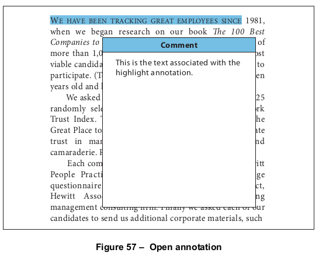
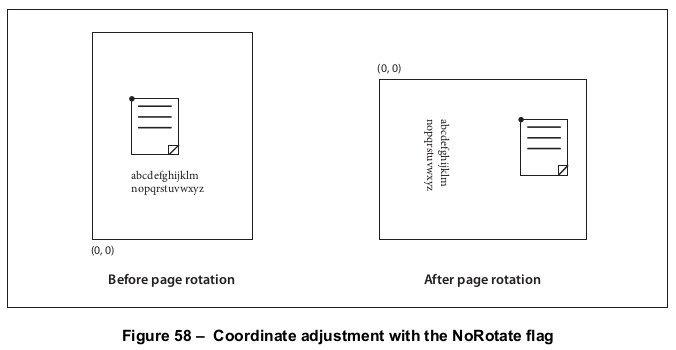
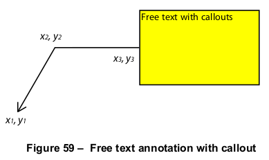
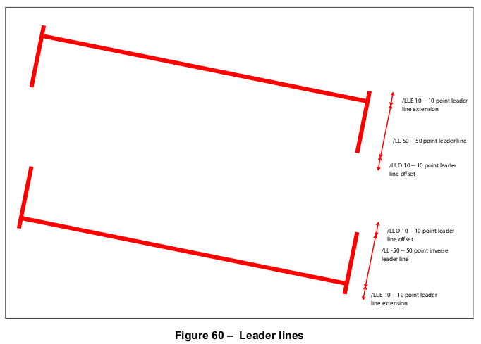
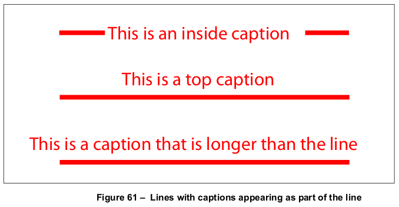
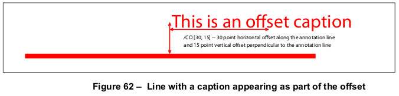
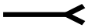
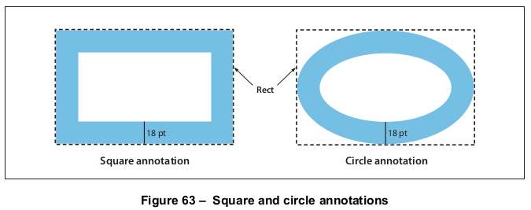
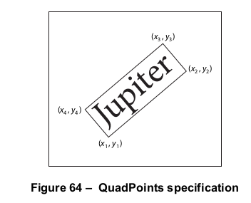

# 12.5 注解

**Annotations**

## 12.5.1 概述

**General**

=== "中文"

    *注释(annotation)*将诸如笔记、声音或电影之类的对象与PDF文档页面上的位置关联起来，或通过鼠标和键盘的使用为用户提供一种交互方式。PDF包括了各种标准注释类型，详细描述在[12.5.6]中，“注释类型”。
    
    许多标准注释类型可以以打开或关闭的状态显示。当关闭时，它们以一些独特的形式出现在页面上，例如图标、框或橡皮图章，具体取决于特定的注释类型。当用户通过点击它来*激活*注释时，它会展示其关联的对象，例如通过打开一个弹出窗口显示文本笔记（图57）或播放声音或电影。
    
    
    
    符合标准的阅读器可能允许用户使用键盘（特别是Tab键）在页面上的注释之间导航。从PDF 1.5开始，PDF制作者可以使用页面对象中的可选**Tabs**条目明确导航顺序（见[表30](../c7/s7.md#table30)）。以下是此条目的可能值：
    
    - R（行顺序）：注释应按页面水平横向的行访问。行内的方向应由查看器首选项字典中的**Direction**条目确定（见[12.2]，“查看器首选项”）。首先访问的注释是顶部行中的第一个注释。当遇到一行的末端时，将访问下一行的第一个注释。
    - C（列顺序）：注释应按页面垂直上下的列访问。列应按查看器首选项字典中的**Direction**条目排序（见[12.2]，“查看器首选项”）。首先访问的注释是第一列顶部的注释。当遇到一列的末端时，将访问下一列的第一个注释。
    - S（结构顺序）：注释应按它们在结构树中出现的顺序访问（见[14.7]，“逻辑结构”）。未包含在结构树中的注释的顺序应由符合标准的阅读器选择确定。
    
    这些描述假设页面正在以**Rotate**条目指定的方向查看。
    
    概念上，每种注释类型的行为可能由一个称为*注释处理器*的软件模块实现。符合标准的阅读器应为所有符合标准的注释类型提供注释处理器。注释类型的集合是可扩展的。符合标准的阅读器应为其不认识的所有注释类型提供某些预期的行为，如在[12.5.2]中记录的“注释字典”。

=== "英文"

    An *annotation* associates an object such as a note, sound, or movie with a location on a page of a PDF document, or provides a way to interact with the user by means of the mouse and keyboard. PDF includes a wide variety of standard annotation types, described in detail in [12.5.6], “Annotation Types.”
    
    Many of the standard annotation types may be displayed in either the open or the closed state. When closed, they appear on the page in some distinctive form, such as an icon, a box, or a rubber stamp, depending on the specific annotation type. When the user *activates* the annotation by clicking it, it exhibits its associated object, such as by opening a pop-up window displaying a text note (Figure 57) or by playing a sound or a movie.
    
    
    
    Conforming readers may permit the user to navigate through the annotations on a page by using the keyboard (in particular, the tab key). Beginning with PDF 1.5, PDF producers may make the navigation order explicit with the optional **Tabs** entry in a page object (see [Table 30](../c7/s7.md#table30)). The following are the possible values for this entry:
    
    - R (row order): Annotations shall be visited in rows running horizontally across the page. The direction within a row shall be determined by the **Direction** entry in the viewer preferences dictionary (see [12.2], “Viewer Preferences”). The first annotation that shall be visited is the first annotation in the topmost row. When the end of a row is encountered, the first annotation in the next row shall be visited.
    - C (column order): Annotations shall be visited in columns running vertically up and down the page. Columns shall be ordered by the **Direction** entry in the viewer preferences dictionary (see [12.2], “Viewer Preferences”). The first annotation that shall be visited is the one at the top of the first column. When the end of a column is encountered, the first annotation in the next column shall be visited.
    - S (structure order): Annotations shall be visited in the order in which they appear in the structure tree (see [14.7], “Logical Structure”). The order for annotations that are not included in the structure tree shall be determined in a manner of the conforming reader's choosing.
    
    These descriptions assume the page is being viewed in the orientation specified by the **Rotate** entry.
    
    Conceptually, the behaviour of each annotation type may be implemented by a software module called an *annotation handler*. A conforming reader shall provide annotation handlers for all of the conforming annotation types. The set of annotation types is extensible. A conforming reader shall provide certain expected behaviour for all annotation types that it does not recognize, as documented in [12.5.2], “Annotation Dictionaries.”

## 12.5.2 注解字典

**Annotation Dictionaries**

=== "中文"

    可选的 **Annots** 条目在页面对象中（参见 [7.7.3]，“页面树”）包含一个注释字典数组，每个字典表示与给定页面关联的一个注释。表 164 显示了所有注释字典中共有的必需和可选条目。字典可能包含特定注释类型的附加条目；有关详细信息，请参见 [12.5.6]，“注释类型”中的各个注释类型的描述。每个注释字典只能在 **Annots** 数组中引用一次。这一要求仅适用于注释字典本身，而不适用于附属对象，这些附属对象可以在多个注释之间共享。

    <table id="table164" markdown="span">
        <caption>**Table 164 – 所有注释字典共有的条目**</caption>
        <thead>
            <tr>
                <th>**Key**</th>
                <th>**Type**</th>
                <th>**Description**</th>
            </tr>
        </thead>
        <tbody>
            <tr>
                <td>**Type**</td>
                <td>name</td>
                <td>(*可选*) 该字典描述的 PDF 对象类型；如果存在，应该为 **Annot**，表示注释字典。
                </td>
            </tr>
            <tr>
                <td>**Subtype**</td>
                <td>name</td>
                <td>(*必需*) 该字典描述的注释类型；具体值见[表 169](#table169)。
                </td>
            </tr>
            <tr>
                <td>**Rect**</td>
                <td>rectangle</td>
                <td>(*必需*) *注释矩形*，定义注释在页面上的位置，单位为默认用户空间单位。
                </td>
            </tr>
            <tr>
                <td>**Contents**</td>
                <td>text string</td>
                <td>(*可选*) 显示给注释的文本，或如果该类型的注释不显示文本，则是对注释内容的可读描述。无论哪种情况，这段文本对于提取文档内容以支持无障碍功能或其他目的（参见 [14.9.3]，“替代描述”）都很有用。有关各注释类型的详细信息，请参见 [12.5.6]，“注释类型”。
                </td>
            </tr>
            <tr>
                <td>**P**</td>
                <td>dictionary</td>
                <td>(*可选，除非另有说明；PDF 1.3；不用于 FDF 文件*) 指向与该注释相关联的页面对象的间接引用。<br/>
                该条目应出现在与演示动作相关的屏幕注释中（PDF 1.5；参见 [12.5.6.18]，“屏幕注释”和 [12.6.4.13]，“演示动作”）。
                </td>
            </tr>
            <tr>
                <td>**NM**</td>
                <td>text string</td>
                <td>(*可选；PDF 1.4*) *注释名称*，一个文本字符串，唯一标识页面上所有注释中的该注释。
                </td>
            </tr>
            <tr>
                <td>**M**</td>
                <td>date or text string</td>
                <td>(*可选；PDF 1.1*) 注释最后修改的日期和时间。格式应为 [7.9.4]，“日期”中描述的日期字符串，但符合标准的阅读器应接受并显示任何格式的字符串。
                </td>
            </tr>
            <tr>
                <td>**F**</td>
                <td>integer</td>
                <td>(*可选；PDF 1.1*) 一组标志，指定注释的各种特性（参见 [12.5.3]，“注释标志”）。默认值：0。
                </td>
            </tr>
            <tr>
                <td>**AP**</td>
                <td>dictionary</td>
                <td>(*可选；PDF 1.2*) 外观字典，指定注释在页面上的视觉呈现方式（参见 [12.5.5]，“外观流”）。个别注释处理程序可能忽略此条目并提供自己的外观。
                </td>
            </tr>
            <tr>
                <td>**AS**</td>
                <td>name</td>
                <td>(*如果外观字典 **AP** 包含一个或多个子字典则必需；PDF 1.2*) 注释的外观状态，从外观子字典中选择适用的外观流（参见第 [12.5.5] 节，“外观流”）。
                </td>
            </tr>
            <tr>
                <td>**Border**</td>
                <td>array</td>
                <td>(*可选*) 一个数组，指定注释边框的特征，该边框应绘制为圆角矩形。<br/>
                    （PDF 1.0）数组由三个数字定义水平角半径、垂直角半径和边框宽度，单位为默认用户空间单位。如果角半径为 0，则边框具有直角（而不是圆角）；如果边框宽度为 0，则不绘制边框。<br/>
                    （PDF 1.1）数组可以有第四个元素，一个可选的虚线数组，定义绘制边框时使用的虚线和间隙模式。虚线数组的格式与图形状态中的线条虚线模式参数相同（参见 8.4.3.6，“线条虚线模式”）。<br/>
    
    !!! info "EXAMPLE"
    
        一个 **Border** 值为 [0 0 1 [3 2]] 的示例表示一个宽度为 1 单位的边框，角为方形，绘制时使用 3 单位长的虚线和 2 单位长的间隙。
    
    !!! note "NOTE"
    
        （PDF 1.2）某些注释类型（如自由文本和多边形注释）的字典可以包括 **BS** 条目。该条目指定了比 **Border** 条目所指定的数组更多设置的边框样式字典。如果注释字典包括 **BS** 条目，则 **Border** 条目会被忽略。
    
    默认值: [ 0 0 1 ].
                </td>
            </tr>
            <tr>
                <td>**C**</td>
                <td>array</td>
                <td>(可选；PDF 1.1) 一个范围在 0.0 到 1.0 之间的数字数组，表示用于以下目的的颜色：<br/>
                    注释图标关闭时的背景<br/>
                    注释弹出窗口的标题栏<br/>
                    链接注释的边框<br/>
                    数组元素的数量决定颜色空间的定义方式：<br/>
                    0 &nbsp;无颜色；透明 <br/>
                    1 &nbsp;**DeviceGray** <br/>
                    3 &nbsp;**DeviceRGB** <br/>
                    4 &nbsp;**DeviceCMYK** <br/>
                </td>
            </tr>
            <tr>
                <td>**StructParent**</td>
                <td>integer</td>
                <td>(*如果注释是结构内容项则必需；PDF 1.3*) 注释在结构父树中的整数键（参见 [14.7.4.4]，“从内容项查找结构元素”）。
                </td>
            </tr>
            <tr>
                <td>**OC**</td>
                <td>dictionary</td>
                <td>(*可选；PDF 1.5*) 一个可选内容组或可选内容成员字典（参见 [8.11]，“可选内容”），指定注释的可选内容属性。在绘制注释之前，其可见性应根据此条目以及 **F** 条目中指定的注释标志（参见 [12.5.3]，“注释标志”）来确定。如果确定为不可见，则应跳过该注释，好像它不存在于文档中一样。
                </td>
            </tr>
        </tbody>
    </table>

=== "英文"

    The optional **Annots** entry in a page object (see [7.7.3], “Page Tree”) holds an array of annotation dictionaries, each representing an annotation associated with the given page. Table 164 shows the required and optional entries that are common to all annotation dictionaries. The dictionary may contain additional entries specific to a particular annotation type; see the descriptions of individual annotation types in [12.5.6], “Annotation Types,” for details. A given annotation dictionary shall be referenced from the **Annots** array of only one page. This requirement applies only to the annotation dictionary itself, not to subsidiary objects, which may be shared among multiple annotations.
       
    <table id="table164" markdown="span">
        <caption>**Table 164 – Entries common to all annotation dictionaries**</caption>
        <thead>
            <tr>
                <th>**Key**</th>
                <th>**Type**</th>
                <th>**Description**</th>
            </tr>
        </thead>
        <tbody>
            <tr>
                <td>**Type**</td>
                <td>name</td>
                <td>(*Optional*) The type of PDF object that this dictionary describes; if present, shall be **Annot** for an annotation dictionary.
                </td>
            </tr>
            <tr>
                <td>**Subtype**</td>
                <td>name</td>
                <td>(*Required*) The type of annotation that this dictionary describes; see Table 169 for specific values.
                </td>
            </tr>
            <tr>
                <td>**Rect**</td>
                <td>rectangle</td>
                <td>(Required) The *annotation rectangle*, defining the location of the annotation on the page in default user space units.
                </td>
            </tr>
            <tr>
                <td>**Contents**</td>
                <td>text string</td>
                <td>(*Optional*) Text that shall be displayed for the annotation or, if this type of annotation does not display text, an alternate description of the annotation’s contents in human-readable form. In either case, this text is useful when extracting the document’s contents in support of accessibility to users with disabilities or for other purposes (see [14.9.3], “Alternate Descriptions”). See [12.5.6], “Annotation Types” for more details on the meaning of this entry for each annotation type.
                </td>
            </tr>
            <tr>
                <td>**P**</td>
                <td>dictionary</td>
                <td>(*Optional except as noted below; PDF 1.3; not used in FDF files*) An indirect reference to the page object with which this annotation is associated.<br/>
                This entry shall be present in screen annotations associated with rendition actions (PDF 1.5; see [12.5.6.18], “Screen Annotations” and [12.6.4.13], “Rendition Actions”).
                </td>
            </tr>
            <tr>
                <td>**NM**</td>
                <td>text string</td>
                <td>(*Optional; PDF 1.4*) The *annotation name*, a text string uniquely identifying it among all the annotations on its page.
                </td>
            </tr>
            <tr>
                <td>**M**</td>
                <td>date or text string</td>
                <td>(Optional; PDF 1.1) The date and time when the annotation was most recently modified. The format should be a date string as described in [7.9.4], “Dates,” but conforming readers shall accept and display a string in any format.
                </td>
            </tr>
            <tr>
                <td>**F**</td>
                <td>integer</td>
                <td>(*Optional; PDF 1.1*) A set of flags specifying various characteristics of the annotation (see [12.5.3], “Annotation Flags”). Default value: 0.
                </td>
            </tr>
            <tr>
                <td>**AP**</td>
                <td>dictionary</td>
                <td>(*Optional; PDF 1.2*) An appearance dictionary specifying how the annotation shall be presented visually on the page (see [12.5.5], “Appearance Streams”). Individual annotation handlers may ignore this entry and provide their own appearances.
                </td>
            </tr>
            <tr>
                <td>**AS**</td>
                <td>name</td>
                <td>(*Required if the appearance dictionary **AP** contains one or more subdictionaries; PDF 1.2*) The annotation’s appearance state, which selects the applicable appearance stream from an appearance subdictionary (see Section [12.5.5], “Appearance Streams”).
                </td>
            </tr>
            <tr>
                <td>**Border**</td>
                <td>array</td>
                <td>(*Optional*) An array specifying the characteristics of the annotation’s border, which shall be drawn as a rounded rectangle. <br/>
                    (PDF 1.0) The array consists of three numbers defining the horizontal corner radius, vertical corner radius, and border width, all in default user space units. If the corner radii are 0, the border has square (not rounded) corners; if the border width is 0, no border is drawn.<br/>
                    (PDF 1.1) The array may have a fourth element, an optional dash array defining a pattern of dashes and gaps that shall be used in drawing the border. The dash array shall be specified in the same format as in the line dash pattern parameter of the graphics state (see 8.4.3.6, “Line Dash Pattern”).<br/>

    !!! info "EXAMPLE"
    
        A **Border** value of [0 0 1 [3 2]] specifies a border 1 unit wide, with square corners, drawn with 3-unit dashes alternating with 2-unit gaps.
    
    !!! note "NOTE"
    
        (PDF 1.2) The dictionaries for some annotation types (such as free text and polygon annotations) can include the **BS** entry. That entry specifies a border style dictionary that has more settings than the array specified for the **Border** entry. If an annotation dictionary includes the **BS** entry, then the **Border** entry is ignored.
    
    Default value: [ 0 0 1 ].
                </td>
            </tr>
            <tr>
                <td>**C**</td>
                <td>array</td>
                <td>(*Optional; PDF 1.1*) An array of numbers in the range 0.0 to 1.0, representing a colour used for the following purposes:<br/>
                    The background of the annotation’s icon when closed<br/>
                    The title bar of the annotation’s pop-up window<br/>
                    The border of a link annotation<br/>
                    The number of array elements determines the colour space in which the colour shall be defined: <br/>
                    0 &nbsp;No colour; transparent
                    1 &nbsp;**DeviceGray**
                    3 &nbsp;**DeviceRGB**
                    4 &nbsp;**DeviceCMYK**
                </td>
            </tr>
            <tr>
                <td>**StructParent**</td>
                <td>integer</td>
                <td>(*Required if the annotation is a structural content item; PDF 1.3*) The integer key of the annotation’s entry in the structural parent tree (see [14.7.4.4], “Finding Structure Elements from Content Items”).
                </td>
            </tr>
            <tr>
                <td>**OC**</td>
                <td>dictionary</td>
                <td>(*Optional; PDF 1.5*) An optional content group or optional content membership dictionary (see [8.11], “Optional Content”) specifying the optional content properties for the annotation. Before the annotation is drawn, its visibility shall be determined based on this entry as well as the annotation flags specified in the **F** entry (see [12.5.3], “Annotation Flags”). If it is determined to be invisible, the annotation shall be skipped, as if it were not in the document.
                </td>
            </tr>
        </tbody>
    </table>

## 12.5.3 注解标志

**Annotation Flags**

=== "中文"

    注释字典的 **F** 项的值是一个整数，解释为一个比特标志，指定注释的各种特征。标志字中的比特位置从低位到高位编号，最低位的比特编号为 1。[表 165](#table165) 显示了这些标志的含义；整数中的所有其他比特应设置为 0。
    
    <table id="table165" markdown="span">
        <caption>**表 165 – 注释标志**</caption>
        <thead>
            <tr>
                <th>**比特位置**</th>
                <th>**名称**</th>
                <th>**含义**</th>
            </tr>
        </thead>
        <tbody>
            <tr>
                <td>1</td>
                <td>Invisible</td>
                <td>如果设置，则不显示注释（如果它不属于标准注释类型且没有可用的注释处理程序）。如果清除，则使用其外观字典中指定的外观流显示该未知注释（如有）（参见 [12.5.5]，“外观流”）。
                </td>
            </tr>
            <tr>
                <td>2</td>
                <td>Hidden</td>
                <td>(*PDF 1.2*) 如果设置，则不显示或打印注释，也不允许它与用户交互，无论其注释类型如何或是否有注释处理程序可用。
    
    !!! note "注意 1"
    
        在屏幕空间有限的情况下，可以结合使用外观流（参见 [12.5.5]，“外观流”）来选择性地隐藏和显示注释，以显示类似于在线帮助系统的辅助弹出信息。
                </td>
            </tr>
            <tr>
                <td>3</td>
                <td>Print</td>
                <td>(*PDF 1.2*) 如果设置，则在打印页面时打印注释。如果清除，则无论注释是否在屏幕上显示，都不会打印注释。
    
    !!! note "注意 2"
    
        这对于表示交互式按钮的注释很有用，因为这些按钮在打印页面上没有实际意义。
                </td>
            </tr>
            <tr>
                <td>4</td>
                <td>NoZoom</td>
                <td>(*PDF 1.3*) 如果设置，则不将注释的外观缩放以匹配页面的放大倍数。注释在页面上的位置（由其注释矩形的左上角定义）将保持固定，无论页面的放大倍数如何。进一步讨论见表格后面。
                </td>
            </tr>
            <tr>
                <td>5</td>
                <td>NoRotate</td>
                <td>(*PDF 1.3*) 如果设置，则不旋转注释的外观以匹配页面的旋转。注释矩形的左上角将在页面上保持固定位置，无论页面如何旋转。进一步讨论见表格后面。
                </td>
            </tr>
            <tr>
                <td>6</td>
                <td>NoView</td>
                <td>(*PDF 1.3*) 如果设置，则不在屏幕上显示注释，也不允许其与用户交互。注释可能被打印（取决于 Print 标志的设置），但应被视为对屏幕显示和用户交互隐藏。
                </td>
            </tr>
            <tr>
                <td>7</td>
                <td>ReadOnly</td>
                <td>(*PDF 1.3*) 如果设置，则不允许注释与用户交互。注释可能会被显示或打印（取决于 NoView 和 Print 标志的设置），但不应响应鼠标点击或根据鼠标移动改变外观。<br/>
                此标志应忽略小部件注释；其功能被关联表单字段的 ReadOnly 标志所涵盖（参见 [表 221](./s7.md#table221)）。
                </td>
            </tr>
            <tr>
                <td>8</td>
                <td>Locked</td>
                <td>(*PDF 1.4*) 如果设置，则不允许用户删除注释或修改其属性（包括位置和大小）。但是，该标志不限制对注释内容的更改，例如表单字段的值。
                </td>
            </tr>
            <tr>
                <td>9</td>
                <td>ToggleNoView</td>
                <td>(*PDF 1.5*) 如果设置，则在某些事件中反转 NoView 标志的解释。
    
    !!! note "注意 3"
    
        一个典型的用法是使注释仅在鼠标光标悬停在其上时出现。
                </td>
            </tr>
            <tr>
                <td>10</td>
                <td>LockedContents</td>
                <td>(*PDF 1.7*) 如果设置，则不允许用户修改注释的内容。该标志不限制注释的删除或对其他注释属性（如位置和大小）的更改。
                </td>
            </tr>
        </tbody>
    </table>

    如果设置了 **NoZoom** 标志，则注释在屏幕上的大小始终保持固定，不受页面显示的放大级别影响。同样，如果设置了 **NoRotate** 标志，则注释在页面旋转时（通过更改页面对象中的 **Rotate** 项；参见 [7.7.3]，“页面树”）将保持其原始方向。
    
    在这两种情况下，注释的位置应由其注释矩形左上角的坐标确定，这些坐标由注释字典中的 **Rect** 项定义，并在页面的默认用户空间中解释。当默认用户空间被缩放或旋转时，注释矩形的其他三个角的位置在修改后的用户空间中与原始用户空间中的位置不同。符合规范的阅读器应自动执行这种变更。然而，它不应实际更改注释的 **Rect** 项，该项继续描述注释与未缩放、未旋转的用户空间的关系。
    
    !!! note "NOTE"
    
        图 58 显示了一个设置了 **NoRotate** 标志的注释如何在页面顺时针旋转 90 度时保持直立。注释的左上角保持在默认用户空间中的同一点；注释绕该点旋转。
    
    

=== "英文"

    The value of the annotation dictionary’s **F** entry is an integer interpreted as one-bit flags specifying various characteristics of the annotation. Bit positions within the flag word shall be numbered from low-order to high-order, with the lowest-order bit numbered 1. [Table 165](#table165) shows the meanings of the flags; all other bits of the integer shall be set to 0.
    
    <table id="table165" markdown="span">
        <caption>**Table 165 – Annotation flags**</caption>
        <thead>
            <tr>
                <th>**Bit position**</th>
                <th>**Name**</th>
                <th>**Meaning**</th>
            </tr>
        </thead>
        <tbody>
            <tr>
                <td>1</td>
                <td>Invisible</td>
                <td>If set, do not display the annotation if it does not belong to one of the standard annotation types and no annotation handler is available. If clear, display such an unknown annotation using an appearance stream specified by its appearance dictionary, if any (see [12.5.5], “Appearance Streams”).
                </td>
            </tr>
            <tr>
                <td>2</td>
                <td>Hidden</td>
                <td>(*PDF 1.2*) If set, do not display or print the annotation or allow it to interact with the user, regardless of its annotation type or whether an annotation handler is available.
    
    !!! note "NOTE 1"
    
        In cases where screen space is limited, the ability to hide and show annotations selectively can be used in combination with appearance streams (see [12.5.5], “Appearance Streams”) to display auxiliary pop-up information similar in function to online help systems.
                </td>
            </tr>
            <tr>
                <td>3</td>
                <td>Print</td>
                <td>(PDF 1.2) If set, print the annotation when the page is printed. If clear, never print the annotation, regardless of whether it is displayed on the screen.
    
    !!! note "NOTE 2"
    
        This can be useful for annotations representing interactive pushbuttons, which would serve no meaningful purpose on the printed page.
                </td>
            </tr>
            <tr>
                <td>4</td>
                <td>NoZoom</td>
                <td>(PDF 1.3) If set, do not scale the annotation’s appearance to match the magnification of the page. The location of the annotation on the page (defined by the upper-left corner of its annotation rectangle) shall remain fixed, regardless of the page magnification. See further discussion following this Table.
                </td>
            </tr>
            <tr>
                <td>5</td>
                <td>NoRotate</td>
                <td>(PDF 1.3) If set, do not rotate the annotation’s appearance to match the rotation of the page. The upper-left corner of the annotation rectangle shall remain in a fixed location on the page, regardless of the page rotation. See further discussion following this Table.
                </td>
            </tr>
            <tr>
                <td>6</td>
                <td>NoView</td>
                <td>(PDF 1.3) If set, do not display the annotation on the screen or allow it to interact with the user. The annotation may be printed (depending on the setting of the Print flag) but should be considered hidden for purposes of on-screen display and user interaction.
                </td>
            </tr>
            <tr>
                <td>7</td>
                <td>ReadOnly</td>
                <td>(PDF 1.3) If set, do not allow the annotation to interact with the user. The annotation may be displayed or printed (depending on the settings of the NoView and Print flags) but should not respond to mouse clicks or change its appearance in response to mouse motions.<br/>
                This flag shall be ignored for widget annotations; its function is subsumed by the ReadOnly flag of the associated form field (see [Table 221](./s7.md#table221)).
                </td>
            </tr>
            <tr>
                <td>8</td>
                <td>Locked</td>
                <td>(PDF 1.4) If set, do not allow the annotation to be deleted or its properties (including position and size) to be modified by the user. However, this flag does not restrict changes to the annotation’s contents, such as the value of a form field.
                </td>
            </tr>
            <tr>
                <td>9</td>
                <td>ToggleNoView</td>
                <td>(PDF 1.5) If set, invert the interpretation of the NoView flag for certain events.
    
    !!! note "NOTE 3"
    
        A typical use is to have an annotation that appears only when a mouse cursor is held over it.
                </td>
            </tr>
            <tr>
                <td>10</td>
                <td>LockedContents</td>
                <td>(PDF 1.7) If set, do not allow the contents of the annotation to be modified by the user. This flag does not restrict deletion of the annotation or changes to other annotation properties, such as position and size.
                </td>
            </tr>
        </tbody>
    </table>
    
    If the NoZoom flag is set, the annotation shall always maintain the same fixed size on the screen and shall be unaffected by the magnification level at which the page itself is displayed. Similarly, if the NoRotate flag is set, the annotation shall retain its original orientation on the screen when the page is rotated (by changing the Rotate entry in the page object; see [7.7.3], “Page Tree”).
    
    In either case, the annotation’s position shall be determined by the coordinates of the upper-left corner of its annotation rectangle, as defined by the **Rect** entry in the annotation dictionary and interpreted in the default user space of the page. When the default user space is scaled or rotated, the positions of the other three corners of the annotation rectangle are different in the altered user space than they were in the original user space. The conforming reader shall perform this alteration automatically. However, it shall not actually change the annotation’s **Rect** entry, which continues to describe the annotation’s relationship with the unscaled, unrotated user space.
    
    !!! note "NOTE"
    
        Figure 58 shows how an annotation whose NoRotate flag is set remains upright when the page it is on is rotated 90 degrees clockwise. The upper-left corner of the annotation remains at the same point in default user space; the annotation pivots around that point.
    
    

## 12.5.4 边框样式

**Border Styles**

=== "中文"

    注释在显示或打印时可以选择性地围绕一个边框。如果存在，边框应完全绘制在注释矩形内部。在 PDF 1.1 中，边框的特征应由注释字典中的 **Border** 项指定（参见 [表 164](#table164)）。从 PDF 1.2 开始，某些类型的注释的边框特征可以改为由注释的 **BS** 项指定的 *边框样式字典* 来指定。这些字典也可用于指定线条、方形、圆形和墨迹注释所绘制线条的宽度和虚线模式。表 166 总结了边框样式字典的内容。如果 **Border** 或 **BS** 项都不存在，边框将被绘制为宽度为 1 点的实线。
    
    <table id="table166" markdown="span">
        <caption>**Table 166 – Entries in a border style dictionary**</caption>
        <thead>
            <tr>
                <th>**Key**</th>
                <th>**Type**</th>
                <th>**Value**</th>
            </tr>
        </thead>
        <tbody>
            <tr>
                <td>**Type**</td>
                <td>name</td>
                <td>(*可选*) 该字典描述的 PDF 对象类型；如果存在，应为 **Border**，表示边框样式字典。
                </td>
            </tr>
            <tr>
                <td>**W**</td>
                <td>number</td>
                <td>(*可选*) 边框宽度，以点为单位。如果此值为 0，则不绘制边框。默认值：1。
                </td>
            </tr>
            <tr>
                <td>**S**</td>
                <td>name</td>
                <td>(*可选*) 边框样式：
                    S &nbsp; &nbsp; &nbsp; &nbsp; (Solid) 实心矩形包围注释。
                    D &nbsp; &nbsp; &nbsp; &nbsp; (Dashed) 虚线矩形包围注释。虚线模式可由 **D** 项指定。
                    B &nbsp; &nbsp; &nbsp; &nbsp; (Beveled) 模拟的凸起矩形，看起来高于页面表面。
                    I &nbsp; &nbsp; &nbsp; &nbsp; (Inset) 模拟的凹陷矩形，看起来低于页面表面。
                    U &nbsp; &nbsp; &nbsp; &nbsp; (Underline) 位于注释矩形底部的单线。
                    A &nbsp; &nbsp; &nbsp; &nbsp; 符合规范的阅读器应容忍未识别的其他边框样式，并使用默认值。
                </td>
            </tr>
            <tr>
                <td>**D**</td>
                <td>array</td>
                <td>(*可选*) 描述虚线边框的虚线数组（**S** 项为 D 的边框样式）。虚线数组的格式应与图形状态中的线条虚线模式参数相同（参见 8.4.3.6，“线条虚线模式”）。虚线相位未指定，默认为 0。<br/>
    
    !!! info "EXAMPLE"
    
        **D** 项的值为 [3 2] 表示边框用 3 点的虚线和 2 点的间隔交替绘制。
    
    默认值: `[3]`.
                </td>
            </tr>
        </tbody>
    </table>

    从 PDF 1.5 开始，某些注释（如方形、圆形和多边形注释）可以具有 **BE** 项，这是一个 *边框效果字典*，用于指定应用于注释边框的效果。从 PDF 1.6 开始，自由文本注释也可以具有 **BE** 项。表 167 描述了边框效果字典中的条目。
    
    <table id="table167" markdown="span">
        <caption>**表 167 – 边框效果字典中的条目**</caption>
        <thead>
            <tr>
                <th>**键**</th>
                <th>**类型**</th>
                <th>**值**</th>
            </tr>
        </thead>
        <tbody>
            <tr>
                <td>**S**</td>
                <td>name</td>
                <td>(可选) 表示要应用的边框效果的名称。可能的值包括：<br/>
                    S &nbsp; &nbsp; &nbsp; &nbsp; 无效果：边框应按注释字典的 **BS** 条目所描述的方式绘制。<br/>
                    C &nbsp; &nbsp; &nbsp; &nbsp; 边框应呈现“模糊”效果。**BS** 中指定的宽度和虚线数组应予以遵守。<br/>
                    默认值：S。
                </td>
            </tr>
            <tr>
                <td>**I**</td>
                <td>number</td>
                <td>(*可选；仅在 **S** 的值为 C 时有效*) 描述效果强度的数字，范围为 0 到 2。默认值：0。
                </td>
            </tr>
        </tbody>
    </table>

=== "英文"

    An annotation may optionally be surrounded by a border when displayed or printed. If present, the border shall be drawn completely inside the annotation rectangle. In PDF 1.1, the characteristics of the border shall be specified by the **Border** entry in the annotation dictionary (see [Table 164](#table164)). Beginning with PDF 1.2, the border characteristics for some types of annotations may instead be specified in a *border style dictionary* designated by the annotation’s **BS** entry. Such dictionaries may also be used to specify the width and dash pattern for the lines drawn by line, square, circle, and ink annotations. Table 166 summarizes the contents of the border style dictionary. If neither the **Border** nor the **BS** entry is present, the border shall be drawn as a solid line with a width of 1 point.
    
    <table id="table166" markdown="span">
        <caption>**Table 166 – Entries in a border style dictionary**</caption>
        <thead>
            <tr>
                <th>**Key**</th>
                <th>**Type**</th>
                <th>**Value**</th>
            </tr>
        </thead>
        <tbody>
            <tr>
                <td>**Type**</td>
                <td>name</td>
                <td>(*Optional*) The type of PDF object that this dictionary describes; if present, shall be **Border** for a border style dictionary.
                </td>
            </tr>
            <tr>
                <td>**W**</td>
                <td>number</td>
                <td>(Optional) The border width in points. If this value is 0, no border shall drawn. Default value: 1.
                </td>
            </tr>
            <tr>
                <td>**S**</td>
                <td>name</td>
                <td>(*Optional*) The border style:
                    S &nbsp; &nbsp; &nbsp; &nbsp; (Solid) A solid rectangle surrounding the annotation.
                    D &nbsp; &nbsp; &nbsp; &nbsp; (Dashed) A dashed rectangle surrounding the annotation. The dash pattern may be specified by the **D** entry.
                    B &nbsp; &nbsp; &nbsp; &nbsp; (Beveled) A simulated embossed rectangle that appears to be raised above the surface of the page.
                    I &nbsp; &nbsp; &nbsp; &nbsp; (Inset) A simulated engraved rectangle that appears to be recessed below the surface of the page.
                    U &nbsp; &nbsp; &nbsp; &nbsp; (Underline) A single line along the bottom of the annotation rectangle.
                    A &nbsp; &nbsp; &nbsp; &nbsp; conforming reader shall tolerate other border styles that it does not recognize and shall use the default value.
                </td>
            </tr>
            <tr>
                <td>**D**</td>
                <td>array</td>
                <td>(Optional) A dash array defining a pattern of dashes and gaps that shall be used in drawing a dashed border (border style D in the S entry). The dash array shall be specified in the same format as in the line dash pattern parameter of the graphics state (see 8.4.3.6, “Line Dash Pattern”). The dash phase is not specified and shall be assumed to be 0.<br/>
    
    !!! info "EXAMPLE"
    
        A **D** entry of [3 2] specifies a border drawn with 3-point dashes alternating with 2-point gaps.
    
    Default value: `[3]`.
                </td>
            </tr>
        </tbody>
    </table>
    
    Beginning with PDF 1.5, some annotations (square, circle, and polygon) may have a **BE** entry, which is a *border effect dictionary* that specifies an effect that shall be applied to the border of the annotations. Beginning with PDF 1.6, the free text annotation may also have a **BE** entry. Table 167 describes the entries in a border effect dictionary.
    
    <table id="table167" markdown="span">
        <caption>**Table 167 – Entries in a border effect dictionary**</caption>
        <thead>
            <tr>
                <th>**Key**</th>
                <th>**Type**</th>
                <th>**Value**</th>
            </tr>
        </thead>
        <tbody>
            <tr>
                <td>**S**</td>
                <td>name</td>
                <td>(Optional) A name representing the border effect to apply. Possible values are: <br/>
                    S &nbsp; &nbsp; No effect: the border shall be as described by the annotation dictionary’s **BS** entry. <br/>
                    C &nbsp; &nbsp; The border should appear “cloudy”. The width and dash array specified by **BS** shall be honored. <br/>
                    Default value: S.
                </td>
            </tr>
            <tr>
                <td>**I**</td>
                <td>number</td>
                <td>(*Optional; valid only if the value of **S** is C*) A number describing the intensity of the effect, in the range 0 to 2. Default value: 0.
                </td>
            </tr>
        </tbody>
    </table>

## 12.5.5 外观流

**Appearance Streams**

=== "中文"

    从 PDF 1.2 开始，注释可以指定一个或多个 *外观流*，作为对早期版本中提供的简单边框和颜色特征的替代。外观流使注释能够以不同的视觉方式展示，以反映其与用户的交互。每个外观流都是一个表单 XObject（参见 [8.10]，“表单 XObjects”）：一个自包含的内容流，将在注释矩形内进行渲染。
    
    本小节概述的算法用于将外观 XObject 的坐标系统（由其 **Matrix** 条目定义；参见 [表 97](../c8/s10.md#table97)）映射到注释在默认用户空间中的矩形：
    
    **算法：外观流**
    
    <ol markdown="span" style="list-style-type:lowercase">
    
    <li>) &nbsp; 外观的边界框（由其 **BBox** 条目指定）应使用 **Matrix** 进行变换，以产生一个具有任意方向的四边形。*变换后的*外观框是包围此四边形的最小竖直矩形。 </li>
    
    <li>) &nbsp; 计算一个矩阵 A，使得变换后的外观框与注释的矩形（由 **Rect** 条目指定）的边缘对齐。A 将变换后的外观框的左下角（具有最小 *x* 和 *y* 坐标的角）和右上角（具有最大 *x* 和 *y* 坐标的角）映射到注释矩形的对应角。 </li>
    
    <li>) &nbsp; &nbsp; &nbsp; **Matrix** 应与 A 连接以形成矩阵 AA，该矩阵将从外观的坐标系统映射到默认用户空间中的注释矩形：<br/> *AA = **Matrix** ¥ A* </li>
    </ol>
    
    如果设置了 NoZoom 或 NoRotate 标志，则注释可能会进一步缩放和旋转（参见 [12.5.3]，“注释标志”）。对整个注释应用的任何变换也应应用于其内部的外观。
    
    从 PDF 1.4 开始，注释外观可能包括透明度。如果外观的流字典中不包含 **Group** 条目，则应视为非隔离、非剔除的透明度组。否则，应使用组字典中指定的隔离和剔除值（参见 [11.6.6]，“透明度组 XObjects”）。
    
    透明度组应与背景（包括页面内容及任何之前绘制的注释）进行合成，使用的混合模式为 **Normal**，alpha 常量为 1.0，软掩模为 **None**。
    
    !!! note "NOTE 1"
    
        如果透明注释外观被绘制在未使用外观流绘制的注释上，其效果依赖于具体实现。这是因为这些注释有时是通过不符合 PDF 成像模型的方式绘制的。此外，突出显示透明注释外观的效果也依赖于具体实现。
    
    注释可以定义多达三种不同的外观：
    
    - *正常外观* 应在注释未与用户交互时使用。此外观也用于打印注释。
    - *悬停外观* 应在用户将光标移入注释的活动区域而未按下鼠标按钮时使用。
    - *按下外观* 应在鼠标按钮在注释的活动区域内被按下或按住时使用。
    
    !!! note "NOTE 2"
    
        在此处使用的术语鼠标指代一种通用指点设备，它控制屏幕上光标的位置，并具有至少一个可以按下、按住和释放的按钮。有关进一步讨论，请参见 [12.6.3]，“触发事件”。
    
    正常、悬停和按下外观应在外观字典中定义，该字典是注释字典中 **AP** 条目的值（参见 [表 164](#table164)）。[表 168](#table168) 显示了外观字典的内容。

    <table id="table168" markdown="span">
        <caption>**表 168 – 外观词典中的条目**</caption>
        <thead>
            <tr>
                <th>**键**</th>
                <th>**类型**</th>
                <th>**值**</th>
            </tr>
        </thead>
        <tbody>
            <tr>
                <td>**N**</td>
                <td>stream or dictionary</td>
                <td>(*必需*) 注释的正常外观。
                </td>
            </tr>
            <tr>
                <td>**R**</td>
                <td>stream or dictionary</td>
                <td>(*可选*) 注释的悬停外观。默认值：**N** 条目的值。
                </td>
            </tr>
            <tr>
                <td>**D**</td>
                <td>stream or dictionary</td>
                <td>(*可选*) 注释的按下外观。默认值：**N** 条目的值。
                </td>
            </tr>
        </tbody>
    </table>
    
    外观字典中的每个条目可以包含单个外观流或一个 *外观子字典*。在后一种情况下，子字典应定义多个外观流，对应于注释的不同 *外观* 状态。

    !!! info "EXAMPLE"
    
        一个表示交互式复选框的注释可能有两个外观状态，分别命名为“选中”（On）和“未选中”（Off）。它的外观字典可能定义为：
        
        ```tex
        /AP << /N << /On formXObject1
                        /Off formXObject2
                    >>
            /D << /On formXObject3
                    /Off formXObject4
                >>
            >>
        ```
    
        其中，*formXObject<sub>1</sub>* 和 *formXObject<sub>2</sub>* 定义了复选框在选中和未选中状态下的正常外观，而 *formXObject<sub>3</sub>* 和 *formXObject<sub>4</sub>* 提供视觉反馈，例如点击时加粗其轮廓。（未定义 **R** 条目，因为在用户将光标移动到复选框上而不按下鼠标按钮时，不需要特殊外观。）选中和未选中外观状态的选择由注释字典中的 **AS** 条目确定（见 [表 164](#table164)）。
    
    !!! note "NOTE 3"
    
        如果符合规范的阅读器不原生支持某种特定的注释类型，符合规范的阅读器应显示注释的正常 (**N**) 外观。如果注释的 **AS** 条目指定了一个在外观字典中未定义的外观状态，符合规范的阅读器也应尝试提供合理的行为（例如不显示任何内容）。
    
    为了方便管理重复使用的外观流，PDF 文档的名称字典中的 **AP** 条目（见 [7.7.4](../c7/s7.md#774-名称字典)，“名称字典”）可以包含一个名称树，将名称字符串映射到外观流。名称字符串没有标准含义；没有 PDF 对象可以通过名称引用外观流。

=== "英文"

    Beginning with PDF 1.2, an annotation may specify one or more *appearance streams* as an alternative to the simple border and colour characteristics available in earlier versions. Appearance streams enable the annotation to be presented visually in different ways to reflect its interactions with the user. Each appearance stream is a form XObject (see [8.10], “Form XObjects”): a self-contained content stream that shall be rendered inside the annotation rectangle.
    
    The algorithm outlined in this sub-clause shall be used to map from the coordinate system of the appearance XObject (as defined by its **Matrix** entry; see [Table 97](../c8/s10.md#table97)) to the annotation’s rectangle in default user space:
    
    **Algorithm: Appearance streams**
    
    <ol markdown="span" style="list-style-type:lowercase">
    
    <li>) &nbsp;The appearance’s bounding box (specified by its **BBox** entry) shall be transformed, using **Matrix**, to produce a quadrilateral with arbitrary orientation. The *transformed* appearance box is the smallest upright rectangle that encompasses this quadrilateral. </li>
    
    <li>) &nbsp;A matrix A shall be computed that scales and translates the transformed appearance box to align with the edges of the annotation’s rectangle (specified by the **Rect** entry). A maps the lower-left corner (the corner with the smallest *x* and *y* coordinates) and the upper-right corner (the corner with the greatest *x* and *y* coordinates) of the transformed appearance box to the corresponding corners of the annotation’s rectangle. </li>
    
    <li>) &nbsp; &nbsp; &nbsp;Matrix shall be concatenated with A to form a matrix AA that maps from the appearance’s coordinate system to the annotation’s rectangle in default user space:<br/> *AA = **Matrix** ¥ A* </li>
    </ol>
    
    The annotation may be further scaled and rotated if either the NoZoom or NoRotate flag is set (see [12.5.3], “Annotation Flags”). Any transformation applied to the annotation as a whole shall also applied to the appearance within it.
    
    Starting with PDF 1.4, an annotation appearance may include transparency. If the appearance’s stream dictionary does not contain a **Group** entry, it shall be treated as a non-isolated, non-knockout transparency group. Otherwise, the isolated and knockout values specified in the group dictionary (see [11.6.6], “Transparency Group XObjects”) shall be used.
    
    The transparency group shall be composited with a backdrop consisting of the page content along with any previously painted annotations, using a blend mode of **Normal**, an alpha constant of 1.0, and a soft mask of **None**.
    
    !!! note "NOTE 1"
    
        If a transparent annotation appearance is painted over an annotation that is drawn without using an appearance stream, the effect is implementation-dependent. This is because such annotations are sometimes drawn by means that do not conform to the PDF imaging model. Also, the effect of highlighting a transparent annotation appearance is implementation-dependent.
    
    An annotation may define as many as three separate appearances:
    
    •The *normal appearance* shall be used when the annotation is not interacting with the user. This appearance is also used for printing the annotation.
    •The *rollover appearance* shall be used when the user moves the cursor into the annotation’s active area without pressing the mouse button.
    •The *down appearance* shall be used when the mouse button is pressed or held down within the annotation’s active area.
    
    !!! note "NOTE 2"
    
        As used here, the term mouse denotes a generic pointing device that controls the location of a cursor on the screen and has at least one button that can be pressed, held down, and released. See [12.6.3], “Trigger Events,” for further discussion.
    
    The normal, rollover, and down appearances shall be defined in an appearance dictionary, which in turn is the value of the AP entry in the annotation dictionary (see [Table 164](#table164)). [Table 168](#table168) shows the contents of the appearance dictionary.
        
    <table id="table168" markdown="span">
        <caption>**Table 168 – Entries in an appearance dictionary**</caption>
        <thead>
            <tr>
                <th>**Key**</th>
                <th>**Type**</th>
                <th>**Value**</th>
            </tr>
        </thead>
        <tbody>
            <tr>
                <td>**N**</td>
                <td>stream or dictionary</td>
                <td>(*Required*) The annotation’s normal appearance.
                </td>
            </tr>
            <tr>
                <td>**R**</td>
                <td>stream or dictionary</td>
                <td>(*Optional*) The annotation’s rollover appearance. Default value: the value of the **N** entry.
                </td>
            </tr>
            <tr>
                <td>**D**</td>
                <td>stream or dictionary</td>
                <td>(*Optional*) The annotation’s down appearance. Default value: the value of the **N** entry.
                </td>
            </tr>
        </tbody>
    </table>
    
    Each entry in the appearance dictionary may contain either a single appearance stream or an *appearance subdictionary*. In the latter case, the subdictionary shall define multiple appearance streams corresponding to different *appearance* states of the annotation.
    
    !!! info "EXAMPLE"
    
        An annotation representing an interactive check box may have two appearance states named On and Off. Its appearance dictionary may be defined as
    
        ```tex
        /AP << /N << /On formXObject1
                     /Off formXObject2
                 >>
            /D << /On formXObject3
                  /Off formXObject4
               >>
            >>
        ```
    
        where *formXObject<sub>1</sub>* and *formXObject<sub>2</sub>* define the check box’s normal appearance in its checked and unchecked states, and *formXObject<sub>3</sub>* and *formXObject<sub>4</sub>* provide visual feedback, such as emboldening its outline, when the user clicks it. (No **R** entry is defined because no special appearance is needed when the user moves the cursor over the check box without pressing the mouse button.) The choice between the checked and unchecked appearance states is determined by the **AS** entry in the annotation dictionary (see [Table 164](#table164)).
    
    !!! note "NOTE 3"
    
        If a conforming reader does not have native support for a particular annotation type conforming readers shall display the annotation with its normal (**N**) appearance. Conforming readers shall also attempt to provide reasonable behavior (such as displaying nothing) if an annotation’s **AS** entry designates an appearance state for which no appearance is defined in the appearance dictionary.
    
    For convenience in managing appearance streams that are used repeatedly, the **AP** entry in a PDF document’s name dictionary (see [7.7.4], “Name Dictionary”) may contain a name tree mapping name strings to appearance streams. The name strings have no standard meanings; no PDF objects may refer to appearance streams by name.

## 12.5.6 注解类型

**Annotation Types**

### 12.5.6.1 概述

**General**

=== "中文"

    PDF 支持[表 169](#table169)中列出的标准注释类型。以下子条款详细描述了每种类型。
    
    表 169 中第一列的值代表了注释字典中的 **Subtype** 条目的值。第三列指示注释是否为*标记注释*（如 [12.5.6.2](../c12/s5.md#12562-标记注解)，“标记注释”）所述。该子条款还提供了有关不同注释类型 **Contents** 条目值的更多信息。
        
    <table id="table169" markdown="span">
        <caption>**Table 169 – 注释类型**</caption>
        <thead>
            <tr>
                <th>**Annotation type**</th>
                <th>**Description**</th>
                <th>**Markup**</th>
                <th>**Discussed in sub-clause**</th>
            </tr>
        </thead>
        <tbody>
            <tr>
                <td>**Text**</td>
                <td>Text annotation</td>
                <td>Yes</td>
                <td>[12.5.6.4], “Text Annotations”</td>
            </tr>
            <tr>
                <td>**Link**</td>
                <td>Link annotation</td>
                <td>No</td>
                <td>[12.5.6.5], “Link Annotations”</td>
            </tr>
            <tr>
                <td>**FreeText**</td>
                <td>(PDF 1.3) Free text annotation</td>
                <td>Yes</td>
                <td>[12.5.6.6], “Free Text Annotations”</td>
            </tr>
            <tr>
                <td>**Line**</td>
                <td>(PDF 1.3) Line annotation</td>
                <td>Yes</td>
                <td>[12.5.6.7], “Line Annotations”</td>
            </tr>
            <tr>
                <td>**Square**</td>
                <td>(PDF 1.3) Square annotation</td>
                <td>Yes</td>
                <td>[12.5.6.8], “Square and Circle Annotations”</td>
            </tr>
            <tr>
                <td>**Circle**</td>
                <td>(PDF 1.3)Circle annotation</td>
                <td>Yes</td>
                <td>[12.5.6.8], “Square and Circle Annotations”</td>
            </tr>
            <tr>
                <td>**Polygon**</td>
                <td>(PDF 1.5)Polygon annotation</td>
                <td>Yes</td>
                <td>[12.5.6.9], “Polygon and Polyline Annotations”</td>
            </tr>
            <tr>
                <td>PolyLine(PDF 1.5)</td>
                <td>Polyline annotation</td>
                <td>Yes</td>
                <td>[12.5.6.9], “Polygon and Polyline Annotations”</td>
            </tr>
            <tr>
                <td>Highlight(PDF 1.3)</td>
                <td>Highlight annotation</td>
                <td>Yes</td>
                <td>[12.5.6.10], “Text Markup Annotations”</td>
            </tr>
            <tr>
                <td>Underline(PDF 1.3)</td>
                <td>Underline annotation</td>
                <td>Yes</td>
                <td>[12.5.6.10], “Text Markup Annotations”</td>
            </tr>
            <tr>
                <td>Squiggly(PDF 1.4)</td>
                <td>Squiggly-underline annotation</td>
                <td>Yes</td>
                <td>[12.5.6.10], “Text Markup Annotations”</td>
            </tr>
            <tr>
                <td>StrikeOut(PDF 1.3)</td>
                <td>Strikeout annotation</td>
                <td>Yes</td>
                <td>[12.5.6.10], “Text Markup Annotations”</td>
            </tr>
            <tr>
                <td>Stamp(PDF 1.3)</td>
                <td>Rubber stamp annotation</td>
                <td>Yes</td>
                <td>[12.5.6.12], “Rubber Stamp Annotations”</td>
            </tr>
            <tr>
                <td>Caret(PDF 1.5)</td>
                <td>Caret annotation</td>
                <td>Yes</td>
                <td>[12.5.6.11], “Caret Annotations”</td>
            </tr>
            <tr>
                <td>Ink(PDF 1.3)</td>
                <td>Ink annotation</td>
                <td>Yes</td>
                <td>[12.5.6.13], “Ink Annotations”</td>
            </tr>
            <tr>
                <td>Popup(PDF 1.3)</td>
                <td>Pop-up annotation</td>
                <td>No</td>
                <td>[12.5.6.14], “Pop-up Annotations”</td>
            </tr>
            <tr>
                <td>FileAttachment(PDF 1.3)</td>
                <td>File attachment annotation</td>
                <td>Yes</td>
                <td>[12.5.6.15], “File Attachment Annotations”</td>
            </tr>
            <tr>
                <td>Sound(PDF 1.2)</td>
                <td>Sound annotation</td>
                <td>Yes</td>
                <td>[12.5.6.16], “Sound Annotations”</td>
            </tr>
            <tr>
                <td>Movie(PDF 1.2)</td>
                <td>Movie annotation</td>
                <td>No</td>
                <td>[12.5.6.17], “Movie Annotations”</td>
            </tr>
            <tr>
                <td>Widget(PDF 1.2)</td>
                <td>Widget annotation</td>
                <td>No</td>
                <td>[12.5.6.19], “Widget Annotations”</td>
            </tr>
            <tr>
                <td>Screen(PDF 1.5)</td>
                <td>Screen annotation</td>
                <td>No</td>
                <td>[12.5.6.18], “Screen Annotations”</td>
            </tr>
            <tr>
                <td>PrinterMark(PDF 1.4)</td>
                <td>Printer’s mark annotation</td>
                <td>No</td>
                <td>[12.5.6.20], “Printer’s Mark Annotations”</td>
            </tr>
            <tr>
                <td>TrapNet(PDF 1.3)</td>
                <td>Trap network annotation</td>
                <td>No</td>
                <td>[12.5.6.21], “Trap Network Annotations”</td>
            </tr>
            <tr>
                <td>Watermark(PDF 1.6)</td>
                <td>Watermark annotation</td>
                <td>No</td>
                <td>[12.5.6.22], “Watermark Annotations”</td>
            </tr>
            <tr>
                <td>3D(PDF 1.6)</td>
                <td>3D annotation</td>
                <td>No</td>
                <td>[13.6.2], “3D Annotations”</td>
            </tr>
            <tr>
                <td>Redact(PDF 1.7)</td>
                <td>Redact annotation</td>
                <td>Yes</td>
                <td>[12.5.6.23], “Redaction Annotations”</td>
            </tr>
        </tbody>
    </table>

=== "英文"

    PDF supports the standard annotation types listed in Table 169. The following sub-clauses describe each of these types in detail.
    
    The values in the first column of Table 169 represent the value of the annotation dictionary’s **Subtype** entry. The third column indicates whether the annotation is a *markup annotation*, as described in [12.5.6.2], “Markup Annotations.” The sub-clause also provides more information about the value of the **Contents** entry for different annotation types.
        
    <table id="table169" markdown="span">
        <caption>**Table 169 – Annotation types**</caption>
        <thead>
            <tr>
                <th>**Annotation type**</th>
                <th>**Description**</th>
                <th>**Markup**</th>
                <th>**Discussed in sub-clause**</th>
            </tr>
        </thead>
        <tbody>
            <tr>
                <td>**Text**</td>
                <td>Text annotation</td>
                <td>Yes</td>
                <td>[12.5.6.4], “Text Annotations”</td>
            </tr>
            <tr>
                <td>**Link**</td>
                <td>Link annotation</td>
                <td>No</td>
                <td>[12.5.6.5], “Link Annotations”</td>
            </tr>
            <tr>
                <td>**FreeText**</td>
                <td>(PDF 1.3) Free text annotation</td>
                <td>Yes</td>
                <td>[12.5.6.6], “Free Text Annotations”</td>
            </tr>
            <tr>
                <td>**Line**</td>
                <td>(PDF 1.3) Line annotation</td>
                <td>Yes</td>
                <td>[12.5.6.7], “Line Annotations”</td>
            </tr>
            <tr>
                <td>**Square**</td>
                <td>(PDF 1.3) Square annotation</td>
                <td>Yes</td>
                <td>[12.5.6.8], “Square and Circle Annotations”</td>
            </tr>
            <tr>
                <td>**Circle**</td>
                <td>(PDF 1.3)Circle annotation</td>
                <td>Yes</td>
                <td>[12.5.6.8], “Square and Circle Annotations”</td>
            </tr>
            <tr>
                <td>**Polygon**</td>
                <td>(PDF 1.5)Polygon annotation</td>
                <td>Yes</td>
                <td>[12.5.6.9], “Polygon and Polyline Annotations”</td>
            </tr>
            <tr>
                <td>PolyLine(PDF 1.5)</td>
                <td>Polyline annotation</td>
                <td>Yes</td>
                <td>[12.5.6.9], “Polygon and Polyline Annotations”</td>
            </tr>
            <tr>
                <td>Highlight(PDF 1.3)</td>
                <td>Highlight annotation</td>
                <td>Yes</td>
                <td>[12.5.6.10], “Text Markup Annotations”</td>
            </tr>
            <tr>
                <td>Underline(PDF 1.3)</td>
                <td>Underline annotation</td>
                <td>Yes</td>
                <td>[12.5.6.10], “Text Markup Annotations”</td>
            </tr>
            <tr>
                <td>Squiggly(PDF 1.4)</td>
                <td>Squiggly-underline annotation</td>
                <td>Yes</td>
                <td>[12.5.6.10], “Text Markup Annotations”</td>
            </tr>
            <tr>
                <td>StrikeOut(PDF 1.3)</td>
                <td>Strikeout annotation</td>
                <td>Yes</td>
                <td>[12.5.6.10], “Text Markup Annotations”</td>
            </tr>
            <tr>
                <td>Stamp(PDF 1.3)</td>
                <td>Rubber stamp annotation</td>
                <td>Yes</td>
                <td>[12.5.6.12], “Rubber Stamp Annotations”</td>
            </tr>
            <tr>
                <td>Caret(PDF 1.5)</td>
                <td>Caret annotation</td>
                <td>Yes</td>
                <td>[12.5.6.11], “Caret Annotations”</td>
            </tr>
            <tr>
                <td>Ink(PDF 1.3)</td>
                <td>Ink annotation</td>
                <td>Yes</td>
                <td>[12.5.6.13], “Ink Annotations”</td>
            </tr>
            <tr>
                <td>Popup(PDF 1.3)</td>
                <td>Pop-up annotation</td>
                <td>No</td>
                <td>[12.5.6.14], “Pop-up Annotations”</td>
            </tr>
            <tr>
                <td>FileAttachment(PDF 1.3)</td>
                <td>File attachment annotation</td>
                <td>Yes</td>
                <td>[12.5.6.15], “File Attachment Annotations”</td>
            </tr>
            <tr>
                <td>Sound(PDF 1.2)</td>
                <td>Sound annotation</td>
                <td>Yes</td>
                <td>[12.5.6.16], “Sound Annotations”</td>
            </tr>
            <tr>
                <td>Movie(PDF 1.2)</td>
                <td>Movie annotation</td>
                <td>No</td>
                <td>[12.5.6.17], “Movie Annotations”</td>
            </tr>
            <tr>
                <td>Widget(PDF 1.2)</td>
                <td>Widget annotation</td>
                <td>No</td>
                <td>[12.5.6.19], “Widget Annotations”</td>
            </tr>
            <tr>
                <td>Screen(PDF 1.5)</td>
                <td>Screen annotation</td>
                <td>No</td>
                <td>[12.5.6.18], “Screen Annotations”</td>
            </tr>
            <tr>
                <td>PrinterMark(PDF 1.4)</td>
                <td>Printer’s mark annotation</td>
                <td>No</td>
                <td>[12.5.6.20], “Printer’s Mark Annotations”</td>
            </tr>
            <tr>
                <td>TrapNet(PDF 1.3)</td>
                <td>Trap network annotation</td>
                <td>No</td>
                <td>[12.5.6.21], “Trap Network Annotations”</td>
            </tr>
            <tr>
                <td>Watermark(PDF 1.6)</td>
                <td>Watermark annotation</td>
                <td>No</td>
                <td>[12.5.6.22], “Watermark Annotations”</td>
            </tr>
            <tr>
                <td>3D(PDF 1.6)</td>
                <td>3D annotation</td>
                <td>No</td>
                <td>[13.6.2], “3D Annotations”</td>
            </tr>
            <tr>
                <td>Redact(PDF 1.7)</td>
                <td>Redact annotation</td>
                <td>Yes</td>
                <td>[12.5.6.23], “Redaction Annotations”</td>
            </tr>
        </tbody>
    </table>

### 12.5.6.2 标记注解

**Markup Annotations**

=== "中文"

    正如在 [12.5.2] 中提到的“注释字典”，注释的 **Contents** 条目的含义因注释类型而异。通常，它是应该为注释显示的文本，或者如果注释不显示文本，则是人类可读形式的注释内容的替代描述。无论哪种情况，**Contents** 条目在提取文档内容以支持残障用户的可访问性或其他目的时都很有用（见 [14.9.3]，“替代描述”）。
    
    许多注释类型被定义为 *标记注释*，因为它们主要用于标记PDF文档（见表 170）。这些注释有作为注释一部分出现的文本，并且可能以其他方式由符合规范的阅读器显示，例如在评论窗格中。
    
    标记注释可以分为以下几组：
    
    - 自由文本注释直接在页面上显示文本。注释的 **Contents** 条目指定显示的文本。
    - 大多数其他标记注释有一个关联的弹出窗口，其中可能包含文本。注释的 **Contents** 条目指定弹出窗口打开时应该显示的文本。这些包括文本、线条、正方形、圆形、多边形、折线、突出显示、下划线、波浪下划线、删除线、橡皮图章、插入符号、墨迹和文件附件注释。
    - 声音注释没有弹出窗口，但也可能通过 **Contents** 条目指定相关文本。
    
    在将文本分隔成段落时，应使用 **回车符**（0Dh），而不是例如 **换行符** 字符（0Ah）。
    
    !!! note "NOTE 1"
    
        标记注释的一个子集被称为文本标记注释（见 [12.5.6.10]，“文本标记注释”）。
    
    其余的注释类型不被视为标记注释：
    
    - 弹出注释类型不应单独出现；它应与使用它来显示文本的标记注释关联。
    
    !!! note "NOTE 2"
    
        如果注释没有父级，则 **Contents** 条目应代表注释的文本，否则应由符合规范的阅读器忽略。
    
    - 对于所有其他注释类型（**Link**、**Movie**、**Widget**、**PrinterMark** 和 **TrapNet**），**Contents** 条目应以人类可读形式提供注释内容的替代表示，这在提取文档内容以支持残障用户的可访问性或其他目的时很有用（见 [14.9.3]，“替代描述”）。
    
    [表 170](#table170) 列出了适用于所有标记注释的条目。
    
    <table id="table170" markdown="span">
        <caption>**Table 170 – 特定于标记注释的附加条目**</caption>
        <thead>
            <tr>
                <th>**Key**</th>
                <th>**Type**</th>
                <th>**Value**</th>
            </tr>
        </thead>
        <tbody>
            <tr>
                <td>**T**</td>
                <td>text string</td>
                <td>(可选; PDF 1.1) 显示在注释弹出窗口的标题栏中的文本标签。当窗口打开并处于活动状态时，该文本标签应标识添加注释的用户。</td>
            </tr>
            <tr>
                <td>**Popup**</td>
                <td>dictionary</td>
                <td>(可选; PDF 1.3) 指向用于输入或编辑与该注释相关的文本的弹出注释的间接引用。</td>
            </tr>
            <tr>
                <td>**CA**</td>
                <td>number</td>
                <td>(可选; PDF 1.4) 用于绘制注释的常量透明度值（参见 [11.2]，“透明度概述”和 [11.3.7]，“形状和透明度计算”）。此值适用于注释的所有可见元素（包括背景和边框），但不适用于注释打开时出现的弹出窗口。指定的值在注释具有外观流时不会使用（参见 [12.5.5]，“外观流”）；在这种情况下，外观流应指定任何透明度。（然而，如果符合规范的查看器重新生成注释的外观流，它可能会将 CA 值合并到流的内容中。）<br/>
                隐式混合模式（参见 [11.3.5]，“混合模式”）是 Normal。默认值：1.0。<br/>
                若未定义明确的外观流，注释可能由实现依赖的方法绘制，这些方法不一定符合 PDF 成像模型；在这种情况下，此条目的效果也取决于实现。
                </td>
            </tr>
            <tr>
                <td>**RC**</td>
                <td>text string or text stream</td>
                <td>(可选; PDF 1.5) 一个富文本字符串（参见 [12.7.3.4]，“富文本字符串”），在注释打开时应显示在弹出窗口中。</td>
            </tr>
            <tr>
                <td>**CreationDate**</td>
                <td>date</td>
                <td>(可选; PDF 1.5) 注释创建的日期和时间（参见 [7.9.4]，“日期”）。</td>
            </tr>
            <tr>
                <td>**IRT**</td>
                <td>dictionary</td>
                <td>(*如果存在 RT 条目则为必需，否则可选; PDF 1.5*) 指向该注释是“回复于”的注释的引用。两个注释应位于文档的同一页上。两者之间的关系应由 **RT** 条目指定。<br/> 
                    如果此条目存在于 FDF 文件中（参见 [12.7.7]，“表单数据格式”），其类型应为文本字符串，包含被回复注释的 **NM** 条目的内容，以允许被回复注释不在同一 FDF 文件中的情况。</td>
            </tr>
            <tr>
                <td>**Subj**</td>
                <td>text string</td>
                <td> (可选; PDF 1.5) 代表注释所涉及主题的简短描述文本。</td>
            </tr>
            <tr>
                <td>**RT**</td>
                <td>name</td>
                <td>(*可选; 仅在 IRT 存在时有意义; PDF 1.6*) 一个名称，指定此注释与 **IRT** 指定的注释之间的关系（“回复类型”）。有效值为：<br/> 
                    **R**<br/> 
                    &nbsp;&nbsp;&nbsp;&nbsp; 注释应视为对 **IRT** 指定的注释的回复。符合规范的阅读器不应单独显示对注释的回复，而应将其以线程评论的形式一起显示。<br/>
                     **Group**<br/> 
                         注释应与 **IRT** 指定的注释分组；参见本表后面的讨论。<br/> 
                    默认值：R。
                </td>
            </tr>
            <tr>
                <td>**IT**</td>
                <td>name</td>
                <td>(可选; PDF 1.6) 描述标记注释意图的名称。意图允许符合规范的阅读器区分单个标记注释类型的不同用途和行为。如果此条目不存在或其值与注释类型相同，则注释应没有明确的意图，并且应在符合规范的阅读器中以通用方式表现。<br/> 
                    自由文本注释（[表 174](#table174)），线注释（[表 175](#table175)），多边形注释（[表 178](#table178)）和（PDF 1.7）折线注释（[表 178](#table178)）具有定义的意图，其值在相应的表中列出。</td>
            </tr>
            <tr>
                <td>**ExData**</td>
                <td>dictionary</td>
                <td>(可选; PDF 1.7) 指定与注释关联的数据的外部数据字典。此字典包含以下条目：<br/> 
                    **Type**<br/> &nbsp;&nbsp;（可选）如果存在，应为 **ExData**。<br/> 
                    **Subtype**<br/> (*必需*) 指定标记注释应与之关联的数据类型的名称。唯一定义的值是 **Markup3D**。 [表 298](../c13/s6.md#table298) 列出了与 **Markup3D** 子类型对应的值。
                </td>
            </tr>
        </tbody>
    </table>

    在 PDF 1.6 中，一组注释可以被分组，以便在用户与它们交互时作为一个单独的单元运行。该组由一个 *主注释* 组成，它不应当有 **IRT** 条目，以及一个或多个 *从属注释*，这些从属注释应有一个指向主注释的 **IRT** 条目，并且有一个值为 **Group** 的 **RT** 条目。
    
    在主注释中的一些条目被视为“组属性”，这些属性应当应用于整个组；从属注释中相应的条目将被忽略。这些条目包括 **Contents**（或 **RC** 和 **DS**）、**M**、**C**、**T**、**Popup**、**CreationDate**、**Subj** 和 **Open**。符合规范的阅读器应当将对组内任何注释的操作（例如移动、剪切和复制）视为对整个组的操作。
    
    !!! note "NOTE 3"
    
        主注释可能有回复，但这些回复不是从属注释；也就是说，它们没有 **RT** 值为 **Group**。

=== "英文"

    As mentioned in [12.5.2], “Annotation Dictionaries,” the meaning of an annotation’s **Contents** entry varies by annotation type. Typically, it is the text that shall be displayed for the annotation or, if the annotation does not display text, an alternate description of the annotation’s contents in human-readable form. In either case, the **Contents** entry is useful when extracting the document’s contents in support of accessibility to users with disabilities or for other purposes (see [14.9.3], “Alternate Descriptions”).
    
    Many annotation types are defined as *markup annotations* because they are used primarily to mark up PDF documents (see Table 170). These annotations have text that appears as part of the annotation and may be displayed in other ways by a conforming reader, such as in a Comments pane.
    
    Markup annotations may be divided into the following groups:
    
    - Free text annotations display text directly on the page. The annotation’s Contents entry specifies the displayed text.
    - Most other markup annotations have an associated pop-up window that may contain text. The annotation’s **Contents** entry specifies the text that shall be displayed when the pop-up window is opened. These include text, line, square, circle, polygon, polyline, highlight, underline, squiggly-underline, strikeout, rubber stamp, caret, ink, and file attachment annotations.
    - Sound annotations do not have a pop-up window but may also have associated text specified by the **Contents** entry.
    
    When separating text into paragraphs, a CARRIAGE RETURN (0Dh) shall be used and not, for example, a LINE FEED character (0Ah).
    
    !!! note "NOTE 1"
    
        A subset of markup annotations is called text markup annotations (see [12.5.6.10], “Text Markup Annotations”).
    
    The remaining annotation types are not considered markup annotations:
    
    - The pop-up annotation type shall not appear by itself; it shall be associated with a markup annotation that uses it to display text.
    
    !!! note "NOTE 2"
    
        If an annotation has no parent, the **Contents** entry shall represent the text of the annotation, otherwise it shall be ignored by a conforming reader.
    
    - For all other annotation types (**Link**, **Movie**, **Widget**, **PrinterMark**, and **TrapNet**), the **Contents** entry shall provide an alternate representation of the annotation’s contents in human-readable form, which is useful when extracting the document’s contents in support of accessibility to users with disabilities or for other purposes (see [14.9.3], “Alternate Descriptions”).
    
    [Table 170](#table170) lists entries that apply to all markup annotations.
    
    <table id="table170" markdown="span">
        <caption>**Table 170 – Additional entries specific to markup annotations**</caption>
        <thead>
            <tr>
                <th>**Key**</th>
                <th>**Type**</th>
                <th>**Value**</th>
            </tr>
        </thead>
        <tbody>
            <tr>
                <td>**T**</td>
                <td>text string</td>
                <td>(Optional; PDF 1.1) The text label that shall be displayed in the title bar of the annotation’s pop-up window when open and active. This entry shall identify the user who added the annotation.</td>
            </tr>
            <tr>
                <td>**Popup**</td>
                <td>dictionary</td>
                <td>(Optional; PDF 1.3) An indirect reference to a pop-up annotation for entering or editing the text associated with this annotation.</td>
            </tr>
            <tr>
                <td>**CA**</td>
                <td>number</td>
                <td>(Optional; PDF 1.4) The constant opacity value that shall be used in painting the annotation (see Sections [11.2], “Overview of Transparency,” and [11.3.7], “Shape and Opacity Computations”). This value shall apply to all visible elements of the annotation in its closed state (including its background and border) but not to the pop-up window that appears when the annotation is opened.<br/>
                The specified value shall not used if the annotation has an appearance stream (see [12.5.5], “Appearance Streams”); in that case, the appearance stream shall specify any transparency. (However, if the compliant viewer regenerates the annotation’s appearance stream, it may incorporate the CA value into the stream’s content.)<br/>
                The implicit blend mode (see [11.3.5], “Blend Mode””) is **Normal**. Default value: 1.0.<br/>
                If no explicit appearance stream is defined for the annotation, it may be painted by implementation-dependent means that do not necessarily conform to the PDF imaging model; in this case, the effect of this entry is implementation-dependent as well.
                </td>
            </tr>
            <tr>
                <td>**RC**</td>
                <td>text string or text stream</td>
                <td>(Optional; PDF 1.5) A rich text string (see [12.7.3.4], “Rich Text Strings”) that shall be displayed in the pop-up window when the annotation is opened.</td>
            </tr>
            <tr>
                <td>**CreationDate**</td>
                <td>date</td>
                <td>(Optional; PDF 1.5) The date and time ([7.9.4], “Dates”) when the annotation was created.</td>
            </tr>
            <tr>
                <td>**IRT**</td>
                <td>dictionary</td>
                <td>(*Required if an RT entry is present, otherwise optional; PDF 1.5*) A reference to the annotation that this annotation is “in reply to.” Both annotations shall be on the same page of the document. The relationship between the two annotations shall be specified by the **RT** entry. <br/>
                If this entry is present in an FDF file (see [12.7.7], “Forms Data Format”), its type shall not be a dictionary but a text string containing the contents of the **NM** entry of the annotation being replied to, to allow for a situation where the annotation being replied to is not in the same FDF file.</td>
            </tr>
            <tr>
                <td>**Subj**</td>
                <td>text string</td>
                <td>(Optional; PDF 1.5) Text representing a short description of the subject being addressed by the annotation.</td>
            </tr>
            <tr>
                <td>**RT**</td>
                <td>name</td>
                <td>(*Optional; meaningful only if IRT is present; PDF 1.6*) A name specifying the relationship (the “reply type”) between this annotation and one specified by **IRT**. Valid values are: <br/>
                **R** <br/>
                &nbsp;&nbsp;&nbsp;&nbsp;The annotation shall be considered a reply to the annotation specified by **IRT**. Conforming readers shall not display replies to an annotation individually but together in the form of threaded comments.<br/>
                **Group** <br/>
                The annotation shall be grouped with the annotation specified by **IRT**; see the discussion following this Table.<br/>
                Default value: R.</td>
            </tr>
            <tr>
                <td>**IT**</td>
                <td>name</td>
                <td>(Optional; PDF 1.6) A name describing the intent of the markup annotation. Intents allow conforming readers to distinguish between different uses and behaviors of a single markup annotation type. If this entry is not present or its value is the same as the annotation type, the annotation shall have no explicit intent and should behave in a generic manner in a conforming reader.<br/>
                Free text annotations ([Table 174](#table174)), line annotations ([Table 175](#table175)), polygon annotations ([Table 178](#table178)), and (PDF 1.7) polyline annotations ([Table 178](#table178)) have defined intents, whose values are enumerated in the corresponding tables.</td>
            </tr>
            <tr>
                <td>**ExData**</td>
                <td>dictionary</td>
                <td>(Optional; PDF 1.7) An external data dictionary specifying data that shall be associated with the annotation. This dictionary contains the following entries: <br/>
                **Type**<br/>
                &nbsp;&nbsp;(*optional*) If present, shall be **ExData**.
                **Subtype**<br/> 
                (*required*) a name specifying the type of data that the markup annotation shall be associated with. The only defined value is **Markup3D**. [Table 298](../c13/s6.md#table298) lists the values that correspond to a subtype of **Markup3D**.</td>
            </tr>
        </tbody>
    </table>
    
    In PDF 1.6, a set of annotations may be grouped so that they function as a single unit when a user interacts with them. The group consists of a *primary annotation*, which shall not have an **IRT** entry, and one or more *subordinate annotations*, which shall have an **IRT** entry that refers to the primary annotation and an **RT** entry whose value is **Group**.
    
    Some entries in the primary annotation are treated as “group attributes” that shall apply to the group as a whole; the corresponding entries in the subordinate annotations shall be ignored. These entries are **Contents** (or **RC** and **DS**), **M**, **C**, **T**, **Popup**, **CreationDate**, **Subj**, and **Open**. Operations that manipulate any annotation in a group, such as movement, cut, and copy, shall be treated by conforming readers as acting on the entire group.
    
    !!! note "NOTE 3"
    
        A primary annotation may have replies that are not subordinate annotations; that is, that do not have an *RT* value of **Group**.

### 12.5.6.3 注解状态

**Annotation States**

=== "中文"

    从PDF 1.5开始，注释可以有一个与作者相关的特定状态与之关联。这个状态不是在注释本身中指定的，而是在一个单独的文本注释中指定的，该文本注释通过其 **IRT**（“回复”）条目引用原始注释（见 [表 173](#table173)）。状态应被分组到多个 *状态模型* 中，如 [表 171](#table171) 所示。
    
    <table id="table171" markdown="span">
        <caption>**Table 171 – Annotation states**</caption>
        <thead>
            <tr>
                <th>**State model**</th>
                <th>**State**</th>
                <th>**Description**</th>
            </tr>
        </thead>
        <tbody>
            <tr>
                <td>**Marked**</td>
                <td>Marked</td>
                <td>用户已标记注释。</td>
            </tr>
            <tr>
                <td>&nbsp;</td>
                <td>Unmarked</td>
                <td>用户未标记注释（默认状态）。</td>
            </tr>
            <tr>
                <td>**Review**</td>
                <td>Accepted</td>
                <td>用户同意更改。</td>
            </tr>
            <tr>
                <td>&nbsp;</td>
                <td>Rejected</td>
                <td>用户不同意更改。</td>
            </tr>
            <tr>
                <td>&nbsp;</td>
                <td>Cancelled</td>
                <td>更改已被取消。</td>
            </tr>
            <tr>
                <td>&nbsp;</td>
                <td>Completed</td>
                <td>更改已完成。</td>
            </tr>
            <tr>
                <td>&nbsp;</td>
                <td>None</td>
                <td>用户对更改未表示任何意见（默认状态）。</td>
            </tr>
        </tbody>
    </table>
    
    注释应被视为每个状态模型的初始默认状态。用户所做的状态更改应在文本注释中用以下条目指示：
    
    - **T** 条目（见 [表 170](#table170)）应指定用户。
    - **IRT** 条目（见 [表 173](#table173)）应引用原始注释。
    - **State** 和 **StateModel**（见 [表 172](#table172)）应为指定用户更新原始注释的状态。
    
    额外的状态更改应通过添加文本注释来完成，这些注释是针对给定用户的先前回复的回复。

=== "英文"

    Beginning with PDF 1.5, annotations may have an author-specific state associated with them. The state is not specified in the annotation itself but in a separate text annotation that refers to the original annotation by means of its **IRT** (“in reply to”) entry (see [Table 173](#table173)). States shall be grouped into a number of *state models*, as shown in [Table 171](#table171).
            
    <table id="table171" markdown="span">
        <caption>**Table 171 – Annotation states**</caption>
        <thead>
            <tr>
                <th>**State model**</th>
                <th>**State**</th>
                <th>**Description**</th>
            </tr>
        </thead>
        <tbody>
            <tr>
                <td>**Marked**</td>
                <td>Marked</td>
                <td>The annotation has been marked by the user.</td>
            </tr>
            <tr>
                <td>&nbsp;</td>
                <td>Unmarked</td>
                <td>The annotation has not been marked by the user (the default).</td>
            </tr>
            <tr>
                <td>**Review**</td>
                <td>Accepted</td>
                <td>The user agrees with the change.</td>
            </tr>
            <tr>
                <td>&nbsp;</td>
                <td>Rejected</td>
                <td>The user disagrees with the change.</td>
            </tr>
            <tr>
                <td>&nbsp;</td>
                <td>Cancelled</td>
                <td>The change has been cancelled.</td>
            </tr>
            <tr>
                <td>&nbsp;</td>
                <td>Completed</td>
                <td>The change has been completed.</td>
            </tr>
            <tr>
                <td>&nbsp;</td>
                <td>None</td>
                <td>The user has indicated nothing about the change (the default).</td>
            </tr>
        </tbody>
    </table>
    
    Annotations shall be thought of as initially being in the default state for each state model. State changes made by a user shall be indicated in a text annotation with the following entries:
    
    - The **T** entry (see [Table 170](#table170)) shall specify the user.
    - The **IRT** entry (see [Table 173](#table173)) shall refer to the original annotation.
    - **State** and **StateModel** (see [Table 172](#table172)) shall update the state of the original annotation for the specified user.
    
    Additional state changes shall be made by adding text annotations in reply to the previous reply for a given user.

### 12.5.6.4 文本注解

**Text Annotations**

=== "中文"

    文本注释代表附加在PDF文档中某一点的“便利贴”。当关闭时，注释应显示为图标；当打开时，它应显示一个弹出窗口，其中包含由符合规范的阅读器选择的字体和大小的笔记文本。文本注释不应与页面一起缩放和旋转；它们的行为应仿佛始终设置了NoZoom和NoRotate注释标志（见表165）。[表 172](#table172) 显示了特定于这种注释类型的注释字典条目。
            
    <table id="table172" markdown="span">
        <caption>**Table 172 – 特定于文本注释的附加条目**</caption>
        <thead>
            <tr>
                <th>**Key**</th>
                <th>**Type**</th>
                <th>**Value**</th>
            </tr>
        </thead>
        <tbody>
            <tr>
                <td>**Subtype**</td>
                <td>name</td>
                <td>(*必需*) 此字典描述的注释类型；对于文本注释应为 **Text**。</td>
            </tr>
            <tr>
                <td>**Open**</td>
                <td>boolean</td>
                <td>(*可选*) 一个标志，指定注释是否最初显示为打开状态。默认值：**false**（关闭）。</td>
            </tr>
            <tr>
                <td>**Name**</td>
                <td>name</td>
                <td>(*可选*) 用于显示注释的图标的名称。符合规范的阅读器至少应为以下标准名称提供预定义的图标外观：<br/>
                Comment, Key, Note, Help, NewParagraph, Paragraph, Insert<br/>
                也可能支持其他名称。默认值：Note。<br/>
                如果存在，注释字典的 ***AP*** 条目将优先于 **Name** 条目；见 [表 168](#table168) 和 [12.5.5]，“外观流”。</td>
            </tr>
            <tr>
                <td>**State**</td>
                <td>text string</td>
                <td>文本字符串 | (*可选；PDF 1.5*) 对应于原始注释应设置的状态；见 [12.5.6.3]，"注释状态"。<br/>
                    默认值：如果 **StateModel** 是 "Marked"，则为 "Unmarked"；如果 **StateModel** 是 "Review"，则为 "None"。</td>
            </tr>
            <tr>
                <td>**StateModel**</td>
                <td>text string</td>
                <td>(*如果存在 **State**，则必需，否则可选；PDF 1.5*) 对应于 **State** 的状态模型；见 [12.5.6.3]，"注释状态"。</td>
            </tr>
        </tbody>
    </table>

    !!! info "EXAMPLE"

        下面的示例展示了一个文本注释的定义：

        ```tex
        22 0 obj
            << /Type /Annot
               /Subtype /Text
               /Rect [ 266 116 430 204 ]
               /Contents ( The quick brown fox ate the lazy mouse . )
            >>
        endobj
        ```

=== "英文"

    A *text annotation* represents a “sticky note” attached to a point in the PDF document. When closed, the annotation shall appear as an icon; when open, it shall display a pop-up window containing the text of the note in a font and size chosen by the conforming reader. Text annotations shall not scale and rotate with the page; they shall behave as if the NoZoom and NoRotate annotation flags (see Table 165) were always set. [Table 172](#table172) shows the annotation dictionary entries specific to this type of annotation.
            
    <table id="table172" markdown="span">
        <caption>**Table 172 – Additional entries specific to a text annotation**</caption>
        <thead>
            <tr>
                <th>**Key**</th>
                <th>**Type**</th>
                <th>**Value**</th>
            </tr>
        </thead>
        <tbody>
            <tr>
                <td>**Subtype**</td>
                <td>name</td>
                <td>(*Required*) The type of annotation that this dictionary describes; shall be **Text** for a text annotation.</td>
            </tr>
            <tr>
                <td>**Open**</td>
                <td>boolean</td>
                <td>(*Optional*) A flag specifying whether the annotation shall initially be displayed open. Default value: **false** (closed).</td>
            </tr>
            <tr>
                <td>**Name**</td>
                <td>name</td>
                <td>(Optional) The name of an icon that shall be used in displaying the annotation. Conforming readers shall provide predefined icon appearances for at least the following standard names:<br/>
                Comment, Key, Note, Help, NewParagraph, Paragraph, Insert<br/>
                Additional names may be supported as well. Default value: Note.<br/>
                The annotation dictionary’s ***AP*** entry, if present, shall take precedence over the **Name** entry; see [Table 168](#table168) and [12.5.5], “Appearance Streams.”</td>
            </tr>
            <tr>
                <td>**State**</td>
                <td>text string</td>
                <td>(Optional; PDF 1.5) The state to which the original annotation shall be set; see [12.5.6.3], “Annotation States.”
                    Default: “Unmarked” if **StateModel** is “Marked”; “None” if **StateModel** is “Review”.</td>
            </tr>
            <tr>
                <td>**StateModel**</td>
                <td>text string</td>
                <td>(*Required if **State** is present, otherwise optional; PDF 1.5*) The state model corresponding to **State**; see [12.5.6.3], “Annotation States.”</td>
            </tr>
        </tbody>
    </table>
    
    !!! info "EXAMPLE"

        The following example shows the definition of a text annotation.

        ```tex
        22 0 obj
            << /Type /Annot
               /Subtype /Text
               /Rect [ 266 116 430 204 ]
               /Contents ( The quick brown fox ate the lazy mouse . )
            >>
        endobj
        ```

### 12.5.6.5 链接注解

**Link Annotations**

=== "中文"

    链接注释表示文档中其他地方的超文本链接（见 [12.3.2]，“目标”）或要执行的操作（见 [12.6]，“操作”）。[表 173](#table173) 显示了特定于这种注释类型的注释字典条目。
                
    <table id="table173" markdown="span">
        <caption>**Table 173 – 特定于链接注释的附加条目**</caption>
        <thead>
            <tr>
                <th>**Key**</th>
                <th>**Type**</th>
                <th>**Value**</th>
            </tr>
        </thead>
        <tbody>
            <tr>
                <td>**Subtype**</td>
                <td>name</td>
                <td>(*必需*) 此字典描述的注释类型；对于链接注释应为 **Link**。</td>
            </tr>
            <tr>
                <td>**A**</td>
                <td>dictionary</td>
                <td>(*可选；PDF 1.1*) 激活链接注释时将执行的动作（见 [12.6]，“动作”）。</td>
            </tr>
            <tr>
                <td>**Dest**</td>
                <td>array, name or byte string</td>
                <td>(*可选；如果存在 **A** 条目则不允许*) 激活注释时将显示的目标（见 [12.3.2]，“目标”）。</td>
            </tr>
            <tr>
                <td>**H**</td>
                <td>name</td>
                <td>((*可选；PDF 1.2*) 鼠标按钮在注释活动区域内按下或按住时使用的注释高亮模式，视觉效果：<br/>
                    N(None) 无高亮。<br/>
                    I(Invert) 反转注释矩形的内容。<br/>
                    O(Outline) 反转注释的边框。<br/>
                    P(Push) 显示注释，就像它被推到了页面的下面。<br/>
                    默认值：I。
                </td>
            </tr>
            <tr>
                <td>**PA**</td>
                <td>dictionary</td>
                <td> (*可选；PDF 1.3*) 以前与此注释相关联的 URI 动作（见 [12.6.4.7]，“URI 动作”）。当 Web 捕获（[14.10]，“Web 捕获”）将注释从 URI 改为 go-to 动作（[12.6.4.2]，“Go-To 动作”）时，它使用此条目来保存原始 URI 动作的数据，以便在 go-to 动作的目标页面随后被删除时可以更改回来。</td>
            </tr>
            <tr>
                <td>**QuadPoints**</td>
                <td>array</td>
                <td>(*可选；PDF 1.6*) 一个 8×n 数组，指定了 n 个四边形在默认用户空间中的坐标，这些四边形组成了应该激活链接的区域。每个四边形的坐标按顺序给出，为 <br/>
                $x_1 \space y_1 \space x_2 \space y_2 \space x_3 \space y_3 \space x_4 \space y_4$<br/>
                按逆时针顺序指定四边形的四个顶点。对于定向目的，例如应用下划线边框样式时，四边形的底部是由 $(x_1 , y_1)$ 和 $(x_2 , y_2)$ 形成的线。<br/>
                如果此条目不存在或符合规范的阅读器无法识别它，则应使用 **Rect** 条目指定的区域。如果数组中的任何坐标在 **Rect** 指定的区域之外，则应忽略 **QuadPoints**。
                </td>
            </tr>
            <tr>
                <td>**BS**</td>
                <td>dictionary</td>
                <td>(*可选；PDF 1.6*) 边框样式字典（见表 166），指定绘制注释边框时使用的线宽和虚线模式。<br/>
                    如果存在注释字典的 **AP** 条目，它将优先于 **BS** 条目；见表 164 和 [12.5.5]，“外观流”。</td>
            </tr>
        </tbody>
    </table>
    
    !!! info "EXAMPLE"
    
        下面的示例展示了一个链接注释，它跳转到文档中的另一个目标位置：
    
        ```tex
        93 0 obj
            << /Type /Annot
               /Subtype /Link
               /Rect [ 71 717 190 734 ]
               /Border [ 16 16 1 ]
               /Dest [ 3 0 R /FitR –4 399 199 533 ]
            >>
        endobj
        ```

=== "英文"

    A *link annotation* represents either a hypertext link to a destination elsewhere in the document (see [12.3.2], “Destinations”) or an action to be performed ([12.6], “Actions”). [Table 173](#table173) shows the annotation dictionary entries specific to this type of annotation.
                
    <table id="table173" markdown="span">
        <caption>**Table 173 – Additional entries specific to a link annotation**</caption>
        <thead>
            <tr>
                <th>**Key**</th>
                <th>**Type**</th>
                <th>**Value**</th>
            </tr>
        </thead>
        <tbody>
            <tr>
                <td>**Subtype**</td>
                <td>name</td>
                <td>(*Required*) The type of annotation that this dictionary describes; shall be **Link** for a link annotation.</td>
            </tr>
            <tr>
                <td>**A**</td>
                <td>dictionary</td>
                <td>(*Optional; PDF 1.1*) An action that shall be performed when the link annotation is activated (see [12.6], “Actions”).</td>
            </tr>
            <tr>
                <td>**Dest**</td>
                <td>array, name or byte string</td>
                <td>(Optional; not permitted if an **A** entry is present) A destination that shall be displayed when the annotation is activated (see [12.3.2], “Destinations”).</td>
            </tr>
            <tr>
                <td>**H**</td>
                <td>name</td>
                <td>(Optional; PDF 1.2) The annotation’s highlighting mode, the visual effect that shall be used when the mouse button is pressed or held down inside its active area: <br/>
                    N &nbsp;&nbsp;&nbsp;&nbsp;(None) No highlighting. <br/>
                    I &nbsp;&nbsp;&nbsp;&nbsp;(Invert) Invert the contents of the annotation rectangle. <br/>
                    O &nbsp;&nbsp;&nbsp;&nbsp;I(Outline) Invert the annotation’s border. <br/>
                    P &nbsp;&nbsp;&nbsp;&nbsp;(Push) Display the annotation as if it were being pushed below the surface of the page. <br/>
                    Default value: I.</td>
            </tr>
            <tr>
                <td>**PA**</td>
                <td>dictionary</td>
                <td>(*Optional; PDF 1.3*) A URI action (see [12.6.4.7], “URI Actions”) formerly associated with this annotation. When Web Capture ([14.10], “ Web Capture”) changes an annotation from a URI to a go-to action ([12.6.4.2], “Go-To Actions”), it uses this entry to save the data from the original URI action so that it can be changed back in case the target page for the go- to action is subsequently deleted.</td>
            </tr>
            <tr>
                <td>**QuadPoints**</td>
                <td>array</td>
                <td>(Optional; PDF 1.6) An array of 8 × n numbers specifying the coordinates of n quadrilaterals in default user space that comprise the region in which the link should be activated. The coordinates for each quadrilateral are given in the order <br/>
                $x_1 \space y_1 \space x_2 \space y_2 \space x_3 \space y_3 \space x_4 \space y_4$
                specifying the four vertices of the quadrilateral in counterclockwise order. For orientation purposes, such as when applying an underline border style, the bottom of a quadrilateral is the line formed by $(x_1 , y_1)$ and $(x_2 , y_2)$. <br/>
                If this entry is not present or the conforming reader does not recognize it, the region specified by the **Rect** entry should be used. **QuadPoints** shall be ignored if any coordinate in the array lies outside the region specified by **Rect**.
                </td>
            </tr>
            <tr>
                <td>**BS**</td>
                <td>dictionary</td>
                <td>(Optional; PDF 1.6) A border style dictionary (see Table 166) specifying the line width and dash pattern to be used in drawing the annotation’s border.<br/>
                The annotation dictionary’s **AP** entry, if present, takes precedence over the **BS** entry; see Table 164 and [12.5.5], “Appearance Streams”.</td>
            </tr>
        </tbody>
    </table>
    
    !!! info "EXAMPLE"
    
        The following example shows a link annotation that jumps to a destination elsewhere in the document.
    
        ```tex
        93 0 obj
            << /Type /Annot
               /Subtype /Link
               /Rect [ 71 717 190 734 ]
               /Border [ 16 16 1 ]
               /Dest [ 3 0 R /FitR –4 399 199 533 ]
            >>
        endobj
        ```

### 12.5.6.6 自由文本注释

**Free Text Annotations**

=== "中文"

    自由文本注释（PDF 1.3）直接在页面上显示文本。与普通文本注释（见 [12.5.6.4]，“文本注释”）不同，自由文本注释没有打开或关闭状态；文本不是在弹出窗口中显示，而是始终可见。[表 174](#table174) 显示了特定于这种注释类型的注释字典条目。[12.7.3.3]，“可变文本”描述了使用这些条目生成这些注释中文本外观的过程。
                
    <table id="table174" markdown="span">
        <caption>**Table 174 – Additional entries specific to a free text annotation**</caption>
        <thead>
            <tr>
                <th>**Key**</th>
                <th>**Type**</th>
                <th>**Value**</th>
            </tr>
        </thead>
        <tbody>
            <tr>
                <td>**Subtype**</td>
                <td>name</td>
                <td>(必需) 此字典描述的注释类型；对于自由文本注释应为 **FreeText**。</td>
            </tr>
            <tr>
                <td>**DA**</td>
                <td>string</td>
                <td>(必需) 用于格式化文本的默认外观字符串（见 [12.7.3.3]，“可变文本”）。<br/>
                    如果存在注释字典的 ***AP*** 条目，它将优先于 ***DA*** 条目；见 [表 168](#table168) 和 [12.5.5]，“外观流”。</td>
            </tr>
            <tr>
                <td>**Q**</td>
                <td>integer</td>
                <td>(可选；PDF 1.4) 指定在显示注释文本时使用的对齐方式的代码：<br/>
                    0 &nbsp;&nbsp;左对齐<br/>
                    1 &nbsp;&nbsp;居中<br/>
                    2 &nbsp;&nbsp;右对齐<br/>
                    默认值：0（左对齐）。</td>
            </tr>
            <tr>
                <td>**RC**</td>
                <td>text string or text stream</td>
                <td>(可选；PDF 1.5) 一个富文本字符串（见 [12.7.3.4]，“富文本字符串”），用于生成注释的外观。</td>
            </tr>
            <tr>
                <td>**DS**</td>
                <td>text string</td>
                <td>(可选；PDF 1.5) 一个默认样式字符串，如 [12.7.3.4]，“富文本字符串”中所述。</td>
            </tr>
            <tr>
                <td>**CL**</td>
                <td>array</td>
                <td>(*可选；仅当 **IT** 是 **FreeTextCallout** 时有意义；PDF 1.6*) 一个四或六个数字的数组，指定附加到自由文本注释的呼出线。六个数字 $[x_1 \space y_1 \space x_2 \space y_2 \space x_3 \space y_3]$ 表示默认用户空间中线条的起始点、拐点和终止点的坐标，如图 8.4 所示。四个数字 $[x_1 \space y_1 \space x_2 \space y_2]$ 表示线条的起始和终止坐标。</td>
            </tr>
            <tr>
                <td>**IT**</td>
                <td>name</td>
                <td>(可选；PDF 1.6) 描述自由文本注释意图的名称（另见表 170中的 **IT** 条目）。以下值应有效：<br/>
                    **FreeText** &nbsp;&nbsp;注释旨在作为普通的自由文本注释。普通的自由文本注释也称为文本框注释。<br/>
                    **FreeTextCallout** &nbsp;&nbsp;注释旨在作为呼出注释。通过在 **CL** 中指定的呼出线与页面上的区域关联。<br/>
                    **FreeTextTypeWriter** &nbsp;&nbsp;注释旨在作为点击输入或打字机对象，不绘制呼出线。<br/>
                    默认值：**FreeText**
                </td>
            </tr>
            <tr>
                <td>**BE**</td>
                <td>dictionary</td>
                <td>(可选；PDF 1.6) 边框效果字典（见 [表 167](#table167)），与 **BS** 条目指定的边框样式字典一起使用。</td>
            </tr>
            <tr>
                <td>**RD**</td>
                <td>rectangle</td>
                <td>(可选；PDF 1.6) 描述两个矩形之间数值差异的四个数字：注释的 **Rect** 条目和包含在该矩形内的矩形。内部矩形是应显示注释文本的区域。分别由 **BS** 和 **BE** 条目指定的任何边框样式和/或边框效果应用于内部矩形的边框。<br/>
                    四个数字对应于默认用户空间中 **Rect** 和内部矩形的左、上、右和下坐标之间的差异。每个值应大于或等于 0。顶部和底部差异之和应小于 **Rect** 的高度，左侧和右侧差异之和应小于 **Rect** 的宽度。
                </td>
            </tr>
            <tr>
                <td>**BS**</td>
                <td>dictionary</td>
                <td>(可选；PDF 1.6) 边框样式字典（见 [表 166](#table166)），指定用于绘制注释边框的线宽和虚线模式。<br/>
                    如果存在注释字典的 **AP** 条目，它将优先于 **BS** 条目；见 [表 164](#table164) 和 [12.5.5]，“外观流”。
                </td>
            </tr>
            <tr>
                <td>**LE**</td>
                <td>name</td>
                <td>(可选；仅当 **CL** 存在时有意义；PDF 1.6) 指定用于绘制 **CL** 中指定的呼出线的线尾样式的名称。名称应指定由坐标对 $(x_1, y_1)$ 定义的端点的线尾样式。表 176 显示可能的线尾样式。<br/>
                    默认值：**None**。
                </td>
            </tr>
        </tbody>
    </table>
    
    

=== "英文"

    A *free text annotation* (PDF 1.3) displays text directly on the page. Unlike an ordinary text annotation (see [12.5.6.4], “Text Annotations”), a free text annotation has no open or closed state; instead of being displayed in a pop-up window, the text shall be always visible. [Table 174](#table174) shows the annotation dictionary entries specific to this type of annotation. [12.7.3.3], “Variable Text” describes the process of using these entries to generate the appearance of the text in these annotations.
                
    <table id="table174" markdown="span">
        <caption>**Table 174 – Additional entries specific to a free text annotation**</caption>
        <thead>
            <tr>
                <th>**Key**</th>
                <th>**Type**</th>
                <th>**Value**</th>
            </tr>
        </thead>
        <tbody>
            <tr>
                <td>**Subtype**</td>
                <td>name</td>
                <td>(Required) The type of annotation that this dictionary describes; shall be **FreeText** for a free text annotation.</td>
            </tr>
            <tr>
                <td>**DA**</td>
                <td>string</td>
                <td>(Required) The default appearance string that shall be used in formatting the text (see [12.7.3.3], “Variable Text”). <br/>
                    The annotation dictionary’s ***AP*** entry, if present, shall take precedence over the ***DA*** entry; see [Table 168](#table168) and [12.5.5], “Appearance Streams.”</td>
            </tr>
            <tr>
                <td>**Q**</td>
                <td>integer</td>
                <td>(Optional; PDF 1.4) A code specifying the form of quadding (justification) that shall be used in displaying the annotation’s text:<br/>
                    0 &nbsp;&nbsp;Left-justified<br/>
                    1 &nbsp;&nbsp;Centered<br/>
                    2 &nbsp;&nbsp;Right-justified<br/>
                    Default value: 0 (left-justified).</td>
            </tr>
            <tr>
                <td>**RC**</td>
                <td>text string or text stream</td>
                <td>(Optional; PDF 1.5) A rich text string (see [12.7.3.4], “Rich Text Strings”) that shall be used to generate the appearance of the annotation.</td>
            </tr>
            <tr>
                <td>**DS**</td>
                <td>text string</td>
                <td>(Optional; PDF 1.5) A default style string, as described in [12.7.3.4], “Rich Text Strings.”</td>
            </tr>
            <tr>
                <td>**CL**</td>
                <td>array</td>
                <td>(*Optional; meaningful only if **IT** is **FreeTextCallout**; PDF 1.6*) An array of four or six numbers specifying a callout line attached to the free text annotation. Six numbers $[x_1 \space y_1 \space x_2 \space y_2 \space x_3 \space y_3]$ represent the starting, knee point, and ending coordinates of the line in default user space, as shown in Figure 8.4. Four numbers $[x_1 \space y_1 \space x_2 \space y_2]$ represent the starting and ending coordinates of the line.</td>
            </tr>
            <tr>
                <td>**IT**</td>
                <td>name</td>
                <td>(Optional; PDF 1.6) A name describing the intent of the free text annotation (see also the **IT** entry in Table 170). The following values shall be valid: <br/>
                **FreeText** &nbsp;&nbsp;
                The annotation is intended to function as a plain free-text annotation. A plain free-text annotation is also known as a text box comment. <br/>
                **FreeTextCallout** &nbsp;&nbsp;
                The annotation is intended to function as a callout. The callout is associated with an area on the page through the callout line specified in CL. <br/>
                **FreeTextTypeWriter** &nbsp;&nbsp;
                The annotation is intended to function as a click-to-type or typewriter object and no callout line is drawn. <br/>
                Default value: **FreeText**</td>
            </tr>
            <tr>
                <td>**BE**</td>
                <td>dictionary</td>
                <td>(Optional; PDF 1.6) A border effect dictionary (see [Table 167](#table167)) used in conjunction with the border style dictionary specified by the **BS** entry.</td>
            </tr>
            <tr>
                <td>**RD**</td>
                <td>rectangle</td>
                <td>(Optional; PDF 1.6) A set of four numbers describing the numerical differences between two rectangles: the **Rect** entry of the annotation and a rectangle contained within that rectangle. The inner rectangle is where the annotation’s text should be displayed. Any border styles and/or border effects specified by **BS** and **BE** entries, respectively, shall be applied to the border of the inner rectangle.<br/>
                The four numbers correspond to the differences in default user space between the left, top, right, and bottom coordinates of **Rect** and those of the inner rectangle, respectively. Each value shall be greater than or equal to 0. The sum of the top and bottom differences shall be less than the height of **Rect**, and the sum of the left and right differences shall be less than the width of **Rect**.</td>
            </tr>
            <tr>
                <td>**BS**</td>
                <td>dictionary</td>
                <td>(Optional; PDF 1.6) A border style dictionary (see [Table 166](#table166)) specifying the line width and dash pattern that shall be used in drawing the annotation’s border.<br/>
                    The annotation dictionary’s **AP** entry, if present, takes precedence over the **BS** entry; see [Table 164](#table164) and [12.5.5], “Appearance Streams”.</td>
            </tr>
            <tr>
                <td>**LE**</td>
                <td>name</td>
                <td>(Optional; meaningful only if **CL** is present; PDF 1.6) A name specifying the line ending style that shall be used in drawing the callout line specified in **CL**. The name shall specify the line ending style for the endpoint defined by the pairs of coordinates $(x_1, y_1)$. Table 176 shows the possible line ending styles. <br/>
                    Default value: **None**.</td>
            </tr>
        </tbody>
    </table>
    
    

### 12.5.6.7 线条注解

**Line Annotations**

=== "中文"

    线注释（PDF 1.3）的目的是在线页面上显示一条直线。当打开时，它应显示一个包含相关注释文本的弹出窗口。[表 175](#table175) 显示了特定于这种注释类型的注释字典条目。
                    
    <table id="table175" markdown="span">
        <caption>**表 175 – 特定于线注释的附加条目**</caption>
        <thead>
            <tr>
                <th>**键**</th>
                <th>**类型**</th>
                <th>**值**</th>
            </tr>
        </thead>
        <tbody>
            <tr>
                <td>**Subtype**</td>
                <td>name</td>
                <td>（必需）该字典描述的注释类型；对于线注释，应为 **Line**。</td>
            </tr>
            <tr>
                <td>**L**</td>
                <td>array</td>
                <td>（必需）一个包含四个数字的数组，$[x_1 \space y_1 \space x_2 \space y_2]$，指定线在默认用户空间中的起始和结束坐标。<br/>
                    如果存在 ***LL*** 条目，则该值应表示引导线的端点，而不是线本身的端点；参见图60。</td>
            </tr>
            <tr>
                <td>**BS**</td>
                <td>dictionary</td>
                <td>（可选）边框样式字典（见 [表 166](#table166)），指定绘制线条时使用的宽度和虚线图案。<br/>
                    如果存在注释字典的 ***AP*** 条目，则应优先于 ***L*** 和 ***BS*** 条目；参见表168和 [12.5.5]，“外观流”。</td>
            </tr>
            <tr>
                <td>**LE**</td>
                <td>array</td>
                <td>（可选；PDF 1.4）一个包含两个名称的数组，指定绘制线条时使用的线条结尾样式。数组的第一个和第二个元素应分别为 **L** 数组中由第一和第二对坐标 $(x_1 , y_1)$ 和 $(x_2 , y_2)$ 定义的端点的线条结尾样式。表176显示了可能的值。默认值：[/None /None]。</td>
            </tr>
            <tr>
                <td>**IC**</td>
                <td>array</td>
                <td>（可选；PDF 1.4）一个范围为 0.0 到 1.0 的数字数组，指定用来填充注释线条结尾的*内部颜色*（见 [表 176](#table176)）。数组元素的数量决定定义颜色的色彩空间：<br/>
                    0 &nbsp;&nbsp;无色；透明 <br/>
                    1 &nbsp;&nbsp;DeviceGray <br/>
                    3 &nbsp;&nbsp;DeviceRGB <br/>
                    4 &nbsp;&nbsp;DeviceCMYK</td>
            </tr>
            <tr>
                <td>**LL**</td>
                <td>number</td>
                <td>（如果存在 **LLE** 则必需，否则可选；PDF 1.6）在默认用户空间中从线条的每个端点延伸出的引导线的长度，垂直于线条本身，如图60所示。正值表示引导线在从起点到终点（由 **L** 指定）顺时针方向出现；负值表示相反方向。<br/>
                    默认值：0（无引导线）。</td>
            </tr>
            <tr>
                <td>**LLE**</td>
                <td>number</td>
                <td>（可选；PDF 1.6）一个非负数，表示从线条本身沿180度方向延伸的引导线扩展的长度，如图60所示。<br/>
                    默认值：0（无引导线扩展）。</td>
            </tr>
            <tr>
                <td>**Cap**</td>
                <td>boolean</td>
                <td>（可选；PDF 1.6）如果为 **true**，则由 **Contents** 或 **RC** 条目指定的文本将在线条外观中作为标题复制，如图61和图62所示。文本应以适合内容的方式呈现，考虑书写方向等因素。<br/>
                    默认值：**false**。</td>
            </tr>
            <tr>
                <td>**IT**</td>
                <td>name</td>
                <td>（可选；PDF 1.6）描述线注释意图的名称（参见 [表 170](#table170)）。有效值为 **LineArrow**，表示注释意图作为箭头，和 **LineDimension**，表示注释意图作为尺寸线。</td>
            </tr>
            <tr>
                <td>**LLO**</td>
                <td>number</td>
                <td>（可选；PDF 1.7）一个非负数，表示引导线偏移的长度，即注释端点与引导线起点之间的空白距离。</td>
            </tr>
            <tr>
                <td>**CP**</td>
                <td>name</td>
                <td>（可选；仅当 **Cap** 为 **true** 时有意义；PDF 1.7）描述注释标题定位的名称。有效值为 **Inline**，表示标题应居中在线条内部，和 **Top**，表示标题应在线条上方。<br/> 默认值：**Inline**</td>
            </tr>
            <tr>
                <td>**Measure**</td>
                <td>dictionary</td>
                <td>（可选；PDF 1.7）一个测量字典（见 [表 261](./s9.md#table261)），指定应用于线注释的比例和单位。</td>
            </tr>
            <tr>
                <td>**CO**</td>
                <td>array</td>
                <td>（可选；仅当 **Cap** 为 **true** 时有意义；PDF 1.7）一个包含两个数字的数组，指定标题文本相对于其正常位置的偏移量。第一个值是沿注释线从其中点水平偏移的量，正值表示向右偏移，负值表示向左偏移。第二个值是垂直于注释线的偏移量，正值表示向上偏移，负值表示向下偏移。<br/>
                    默认值：[0, 0]（无偏移）</td>
            </tr>
        </tbody>
    </table>
    
    
    
    图 61 展示了包含对线注释的标题的效果，这通过设置 **Cap** 为 **true** 来指定。
    
    
    
    图 62 展示了对具有引导偏移的线注释应用标题的效果。
    
    
                    
    <table id="table176" markdown="span">
        <caption>**表 176 – 线条结尾样式**</caption>
        <thead>
            <tr>
                <th>**名称**</th>
                <th>**外观**</th>
                <th>**描述**</th>
            </tr>
        </thead>
        <tbody>
            <tr>
                <td>**Square**</td>
                <td></td>
                <td>用注释的内部颜色填充的正方形（如果有的话）</td>
            </tr>
            <tr>
                <td>**Circle**</td>
                <td></td>
                <td>用注释的内部颜色填充的圆形（如果有的话）</td>
            </tr>
            <tr>
                <td>**Diamond**</td>
                <td></td>
                <td>用注释的内部颜色填充的菱形（如果有的话）</td>
            </tr>
            <tr>
                <td>**OpenArrow**</td>
                <td></td>
                <td>两条短线相交形成一个锐角，形成一个开放的箭头</td>
            </tr>
            <tr>
                <td>**ClosedArrow**</td>
                <td></td>
                <td>两条短线相交形成一个锐角，并由第三条线连接形成一个三角形封闭的箭头，用注释的*内部颜色*填充（如果有的话）</td>
            </tr>
            <tr>
                <td>**None**</td>
                <td></td>
                <td>没有线条结尾</td>
            </tr>
            <tr>
                <td>**Butt**</td>
                <td></td>
                <td>（PDF 1.5）在端点处垂直于线条本身的一条短线</td>
            </tr>
            <tr>
                <td>**ROpenArrow**</td>
                <td></td>
                <td>（PDF 1.5）与 OpenArrow 方向相反的两条短线</td>
            </tr>
            <tr>
                <td>**RClosedArrow**</td>
                <td></td>
                <td>（PDF 1.5）与 ClosedArrow 方向相反的三角形封闭箭头</td>
            </tr>
            <tr>
                <td>**Slash**</td>
                <td></td>
                <td>（PDF 1.6）在端点处顺时针方向约30度的一条短线，与线条本身垂直</td>
            </tr>
        </tbody>
    </table>

=== "英文"

    The purpose of a *line annotation* (PDF 1.3) is to display a single straight line on the page. When opened, it shall display a pop-up window containing the text of the associated note. [Table 175](#table175) shows the annotation dictionary entries specific to this type of annotation.
                    
    <table id="table175" markdown="span">
        <caption>**Table 175 – Additional entries specific to a line annotation**</caption>
        <thead>
            <tr>
                <th>**Key**</th>
                <th>**Type**</th>
                <th>**Value**</th>
            </tr>
        </thead>
        <tbody>
            <tr>
                <td>**Subtype**</td>
                <td>name</td>
                <td>(Required) The type of annotation that this dictionary describes; shall be **Line** for a line annotation.</td>
            </tr>
            <tr>
                <td>**L**</td>
                <td>array</td>
                <td>(Required) An array of four numbers, $[x_1 \space y_1 \space x_2 \space y_2]$, specifying the starting and ending coordinates of the line in default user space.<br/>
                    If the ***LL*** entry is present, this value shall represent the endpoints of the leader lines rather than the endpoints of the line itself; see Figure 60.</td>
            </tr>
            <tr>
                <td>**BS**</td>
                <td>dictionary</td>
                <td>(*Optional*) A border style dictionary (see [Table 166](#table166)) specifying the width and dash pattern that shall be used in drawing the line.<br/>
                    The annotation dictionary’s ***AP*** entry, if present, shall take precedence over the ***L*** and ***BS*** entries; see Table 168 and [12.5.5], “Appearance Streams.”</td>
            </tr>
            <tr>
                <td>**LE**</td>
                <td>array</td>
                <td>(Optional; PDF 1.4) An array of two names specifying the line ending styles that shall be used in drawing the line. The first and second elements of the array shall specify the line ending styles for the endpoints defined, respectively, by the first and second pairs of coordinates, $(x_1 , y_1)$ and $(x_2 , y_2)$, in the **L** array. Table 176 shows the possible values. Default value: [/None /None].</td>
            </tr>
            <tr>
                <td>**IC**</td>
                <td>array</td>
                <td>(Optional; PDF 1.4) An array of numbers in the range 0.0 to 1.0 specifying the *interior color* that shall be used to fill the annotation’s line endings (see [Table 176](#table176)). The number of array elements shall determine the colour space in which the colour is defined: <br/>
                    0 &nbsp;&nbsp;No colour; transparent <br/>
                    1 &nbsp;&nbsp;DeviceGray <br/>
                    3 &nbsp;&nbsp;DeviceRGB <br/>
                    4 &nbsp;&nbsp;DeviceCMYK</td>
            </tr>
            <tr>
                <td>**LL**</td>
                <td>number</td>
                <td>(*Required if **LLE** is present, otherwise optional; PDF 1.6*) The length of leader lines in default user space that extend from each endpoint of the line perpendicular to the line itself, as shown in Figure 60. A positive value shall mean that the leader lines appear in the direction that is clockwise when traversing the line from its starting point to its ending point (as specified by **L**); a negative value shall indicate the opposite direction.<br/>
                    Default value: 0 (no leader lines).</td>
            </tr>
            <tr>
                <td>**LLE**</td>
                <td>number</td>
                <td>(*Optional; PDF 1.6*) A non-negative number that shall represents the length of leader line extensions that extend from the line proper 180 degrees from the leader lines, as shown in Figure 60. <br/>
                    Default value: 0 (no leader line extensions).</td>
            </tr>
            <tr>
                <td>**Cap**</td>
                <td>boolean</td>
                <td>(Optional; PDF 1.6) If **true**, the text specified by the **Contents** or **RC** entries shall be replicated as a caption in the appearance of the line, as shown in Figure 61 and Figure 62. The text shall be rendered in a manner appropriate to the content, taking into account factors such as writing direction. <br/>
                    Default value: **false**.</td>
            </tr>
            <tr>
                <td>**IT**</td>
                <td>name</td>
                <td>(Optional; PDF 1.6) A name describing the intent of the line annotation (see also [Table 170](#table170)). Valid values shall be **LineArrow**, which means that the annotation is intended to function as an arrow, and **LineDimension**, which means that the annotation is intended to function as a dimension line.</td>
            </tr>
            <tr>
                <td>**LLO**</td>
                <td>number</td>
                <td>(Optional; PDF 1.7) A non-negative number that shall represent the length of the leader line offset, which is the amount of empty space between the endpoints of the annotation and the beginning of the leader lines.</td>
            </tr>
            <tr>
                <td>**CP**</td>
                <td>name</td>
                <td>(*Optional; meaningful only if **Cap** is **true**; PDF 1.7*) A name describing the annotation’s caption positioning. Valid values are **Inline**, meaning the caption shall be centered inside the line, and **Top**, meaning the caption shall be on top of the line.<br/> Default value: **Inline**</td>
            </tr>
            <tr>
                <td>**Measure**</td>
                <td>dictionary</td>
                <td>(Optional; PDF 1.7) A measure dictionary (see [Table 261](./s9.md#table261)) that shall specify the scale and units that apply to the line annotation.</td>
            </tr>
            <tr>
                <td>**CO**</td>
                <td>array</td>
                <td>(*Optional; meaningful only if **Cap** is **true**; PDF 1.7*) An array of two numbers that shall specify the offset of the caption text from its normal position. The first value shall be the horizontal offset along the annotation line from its midpoint, with a positive value indicating offset to the right and a negative value indicating offset to the left. The second value shall be the vertical offset perpendicular to the annotation line, with a positive value indicating a shift up and a negative value indicating a shift down.<br/>
                    Default value: [0, 0] (no offset from normal positioning)</td>
            </tr>
        </tbody>
    </table>
    
    
    
    Figure 61 illustrates the effect of including a caption to a line annotation, which is specified by setting **Cap** to **true**.
    
    
    
    Figure 62 illustrates the effect of applying a caption to a line annotation that has a leader offset.
    
    
                    
    <table id="table176" markdown="span">
        <caption>**Table 176 – Line ending styles**</caption>
        <thead>
            <tr>
                <th>**Name**</th>
                <th>**Appearance**</th>
                <th>**Description**</th>
            </tr>
        </thead>
        <tbody>
            <tr>
                <td>**Square**</td>
                <td></td>
                <td>A square filled with the annotation’s interior color, if any</td>
            </tr>
            <tr>
                <td>**Circle**</td>
                <td></td>
                <td>A circle filled with the annotation’s interior color, if any</td>
            </tr>
            <tr>
                <td>**Diamond**</td>
                <td></td>
                <td>A diamond shape filled with the annotation’s interior color, if any</td>
            </tr>
            <tr>
                <td>**OpenArrow**</td>
                <td></td>
                <td>Two short lines meeting in an acute angle to form an open arrowhead</td>
            </tr>
            <tr>
                <td>**ClosedArrow**</td>
                <td></td>
                <td>Two short lines meeting in an acute angle as in the OpenArrow style and connected by a third line to form a triangular closed arrowhead filled with the annotation’s *interior color*, if any</td>
            </tr>
            <tr>
                <td>**None**</td>
                <td></td>
                <td>No line ending</td>
            </tr>
            <tr>
                <td>**Butt**</td>
                <td></td>
                <td>(PDF 1.5) A short line at the endpoint perpendicular to the line itself</td>
            </tr>
            <tr>
                <td>**ROpenArrow**</td>
                <td></td>
                <td>(PDF 1.5) Two short lines in the reverse direction from OpenArrow</td>
            </tr>
            <tr>
                <td>**RClosedArrow**</td>
                <td></td>
                <td>(PDF 1.5) A triangular closed arrowhead in the reverse direction from ClosedArrow</td>
            </tr>
            <tr>
                <td>**Slash**</td>
                <td></td>
                <td>(PDF 1.6) A short line at the endpoint approximately 30 degrees clockwise from perpendicular to the line itself</td>
            </tr>
        </tbody>
    </table>

### 12.5.6.8 方形和圆形注解

**Square and Circle Annotations**

=== "中文"

    正方形和圆形注释（PDF 1.3）分别在线页面上显示一个矩形或椭圆。当打开时，它们应显示一个包含相关注释文本的弹出窗口。矩形或椭圆应嵌入在注释字典的 **Rect** 条目定义的注释矩形内（见 [表 168](#table168)）。
    
    图 63 显示了两个注释，每个注释的边框宽度为 18 点。尽管名称为正方形和圆形，注释矩形的宽度和高度不必相等。[表 177](#table177) 显示了特定于这些注释类型的注释字典条目。
    
    
                        
    <table id="table177" markdown="span">
        <caption>**表 177 – 特定于正方形或圆形注释的附加条目**</caption>
        <thead>
            <tr>
                <th>**键**</th>
                <th>**类型**</th>
                <th>**值**</th>
            </tr>
        </thead>
        <tbody>
            <tr>
                <td>**Subtype**</td>
                <td>name</td>
                <td>（必需）该字典描述的注释类型；对于正方形或圆形注释，应分别为 **Square** 或 **Circle**。</td>
            </tr>
            <tr>
                <td>**BS**</td>
                <td>dictionary</td>
                <td>（可选）边框样式字典（见表 166），指定绘制矩形或椭圆时使用的线宽和虚线图案。<br/>
                    如果存在注释字典的 **AP** 条目，则应优先于 **Rect** 和 **BS** 条目；参见 [表 168](#table168) 和 [12.5.5]，“外观流”。</td>
            </tr>
            <tr>
                <td>**IC**</td>
                <td>array</td>
                <td>（可选；PDF 1.4）一个范围为 0.0 到 1.0 的数字数组，指定用来填充注释的矩形或椭圆的*内部颜色*。数组元素的数量决定定义颜色的色彩空间：<br/>
                    0 &nbsp;&nbsp;无色；透明 <br/>
                    1 &nbsp;&nbsp;**DeviceGray** <br/>
                    3 &nbsp;&nbsp;**DeviceRGB** <br/>
                    4 &nbsp;&nbsp;**DeviceCMYK**</td>
            </tr>
            <tr>
                <td>**BE**</td>
                <td>dictionary</td>
                <td>（可选；PDF 1.5）边框效果字典，描述应用于 **BS** 条目所描述的边框的效果（见 [表 167](#table167)）。</td>
            </tr>
            <tr>
                <td>**RD**</td>
                <td>rectangle</td>
                <td>（可选；PDF 1.5）一组四个数字，描述注释的 **Rect** 条目和基础正方形或圆形的实际边界之间的数值差异。在某些情况下，当边框效果（由 **BE** 描述）导致 **Rect** 的尺寸超过正方形或圆形的尺寸时，可能会出现这种差异。<br/>
                    这四个数字应对应默认用户空间中 **Rect** 的左、上、右和下坐标与正方形或圆形的坐标之间的差异。每个值应大于或等于 0。顶部和底部差异的总和应小于 **Rect** 的高度，左右差异的总和应小于 **Rect** 的宽度。</td>
            </tr>
        </tbody>
    </table>

=== "英文"

    Square and circle annotations (PDF 1.3) shall display, respectively, a rectangle or an ellipse on the page. When opened, they shall display a pop-up window containing the text of the associated note. The rectangle or ellipse shall be inscribed within the annotation rectangle defined by the annotation dictionary’s **Rect** entry (see [Table 168](#table168)).
    
    Figure 63 shows two annotations, each with a border width of 18 points. Despite the names square and circle, the width and height of the annotation rectangle need not be equal. [Table 177](#table177) shows the annotation dictionary entries specific to these types of annotations.
    
    
                        
    <table id="table177" markdown="span">
        <caption>**Table 177 – Additional entries specific to a square or circle annotation**</caption>
        <thead>
            <tr>
                <th>**Key**</th>
                <th>**Type**</th>
                <th>**Value**</th>
            </tr>
        </thead>
        <tbody>
            <tr>
                <td>**Subtype**</td>
                <td>name</td>
                <td>(*Required*) The type of annotation that this dictionary describes; shall be **Square** or **Circle** for a square or circle annotation, respectively.</td>
            </tr>
            <tr>
                <td>**BS**</td>
                <td>dictionary</td>
                <td>(*Optional*) A border style dictionary (see Table 166) specifying the line width and dash pattern that shall be used in drawing the rectangle or ellipse.<br/>
                    The annotation dictionary’s **AP** entry, if present, shall take precedence over the **Rect** and **BS** entries; see [Table 168](#table168) and [12.5.5], “Appearance Streams.”</td>
            </tr>
            <tr>
                <td>**IC**</td>
                <td>array</td>
                <td>(*Optional; PDF 1.4*) An array of numbers that shall be in the range 0.0 to 1.0 and shall specify the *interior color* with which to fill the annotation’s rectangle or ellipse. The number of array elements determines the colour space in which the colour shall be defined: <br/>
                    0 &nbsp;&nbsp;No colour; transparent <br/>
                    1 &nbsp;&nbsp;**DeviceGray** <br/>
                    3 &nbsp;&nbsp;**DeviceRGB** <br/>
                    4 &nbsp;&nbsp;**DeviceCMYK**</td>
            </tr>
            <tr>
                <td>**BE**</td>
                <td>dictionary</td>
                <td>(*Optional; PDF 1.5*) A border effect dictionary describing an effect applied to the border described by the **BS** entry (see [Table 167](#table167)).</td>
            </tr>
            <tr>
                <td>**RD**</td>
                <td>rectangle</td>
                <td>(Optional; PDF 1.5) A set of four numbers that shall describe the numerical differences between two rectangles: the **Rect** entry of the annotation and the actual boundaries of the underlying square or circle. Such a difference may occur in situations where a border effect (described by **BE**) causes the size of the **Rect** to increase beyond that of the square or circle.<br/>
                    The four numbers shall correspond to the differences in default user space between the left, top, right, and bottom coordinates of **Rect** and those of the square or circle, respectively. Each value shall be greater than or equal to 0. The sum of the top and bottom differences shall be less than the height of **Rect**, and the sum of the left and right differences shall be less than the width of **Rect**.</td>
            </tr>
        </tbody>
    </table>

### 12.5.6.9 多边形和折线注解

**Polygon and Polyline Annotations**

=== "中文"

    多边形注释（PDF 1.5）在线页面上显示闭合的多边形。这样的多边形可以有任何数量的顶点，由直线相连。折线注释（PDF 1.5）与多边形类似，只是第一个和最后一个顶点没有隐式连接。
                    
    <table id="table178" markdown="span">
        <caption>**表 178 – 特定于多边形或折线注释的附加条目**</caption>
        <thead>
            <tr>
                <th>**键**</th>
                <th>**类型**</th>
                <th>**值**</th>
            </tr>
        </thead>
        <tbody>
            <tr>
                <td>**Subtype**</td>
                <td>name</td>
                <td>（必需）该字典描述的注释类型；对于多边形或折线注释，应分别为 **Polygon** 或 **PolyLine**。</td>
            </tr>
            <tr>
                <td>**Vertices**</td>
                <td>array</td>
                <td>（必需）一个数字数组（见 [表 174](#table174)），指定在默认用户空间中，每个顶点的横坐标和纵坐标。</td>
            </tr>
            <tr>
                <td>**LE**</td>
                <td>array</td>
                <td>（可选；仅对折线注释有意义）一个包含两个名称的数组，指定线条的端点样式。数组的第一个和第二个元素分别指定 **Vertices** 数组中第一个和最后一对坐标所定义的端点样式。表 176 显示了可能的值。默认值：[/None /None]。</td>
            </tr>
            <tr>
                <td>**BS**</td>
                <td>dictionary</td>
                <td>（可选）边框样式字典（见 [表 166](#table166)），指定绘制线条时使用的线宽和虚线图案。<br/> 
                    如果存在注释字典的 **AP** 条目，则应优先于 **Vertices** 和 **BS** 条目；参见表 168 和 [12.5.5]，“外观流”。</td>
            </tr>
            <tr>
                <td>**RD**</td>
                <td>rectangle</td>
                <td>（可选；PDF 1.5）一组四个数字，描述注释的 **Rect** 条目和基础正方形或圆形的实际边界之间的数值差异。在某些情况下，当边框效果（由 **BE** 描述）导致 **Rect** 的尺寸超过正方形或圆形的尺寸时，可能会出现这种差异。<br/>
                    这四个数字应对应默认用户空间中 **Rect** 的左、上、右和下坐标与正方形或圆形的坐标之间的差异。每个值应大于或等于 0。顶部和底部差异的总和应小于 **Rect** 的高度，左右差异的总和应小于 **Rect** 的宽度。</td>
            </tr>
            <tr>
                <td>**IC**</td>
                <td>array</td>
                <td>（可选；PDF 1.4）一个范围为 0.0 到 1.0 的数字数组，指定用来填充注释线条端点的内部颜色（见 [表 176](#table176)）。数组元素的数量决定定义颜色的色彩空间：<br/>
                    0 &nbsp;&nbsp;无色；透明 <br/>
                    1 &nbsp;&nbsp;**DeviceGray** <br/>
                    3 &nbsp;&nbsp;**DeviceRGB** <br/>
                    4 &nbsp;&nbsp;**DeviceCMYK**</td>
            </tr>
            <tr>
                <td>**BE**</td>
                <td>dictionary</td>
                <td>（可选；仅对多边形注释有意义）边框效果字典，描述应用于 **BS** 条目所描述的边框的效果（见 [表 167](#table167)）。</td>
            </tr>
            <tr>
                <td>**IT**</td>
                <td>name</td>
                <td>（可选；PDF 1.6）一个名称，描述多边形或折线注释的意图（另见表 170）。以下值为有效值：<br/>
                    **PolygonCloud** &nbsp; &nbsp; &nbsp; 注释的意图是作为一个云对象。<br/>
                    **PolyLineDimension** &nbsp; &nbsp; &nbsp;（PDF 1.7）折线注释的意图是作为一个尺寸线。<br/>
                    **PolygonDimension** &nbsp; &nbsp; &nbsp;（PDF 1.7）多边形注释的意图是作为一个尺寸线。</td>
            </tr>
            <tr>
                <td>**Measure**</td>
                <td>dictionary</td>
                <td>（可选；PDF 1.7）一个测量字典（见 [表 261](./s9.md#table261)），指定适用于注释的比例和单位。</td>
            </tr>
        </tbody>
    </table>

=== "英文"

    *Polygon annotations* (PDF 1.5) display closed polygons on the page. Such polygons may have any number of vertices connected by straight lines. *Polyline annotations* (PDF 1.5) are similar to polygons, except that the first and last vertex are not implicitly connected.
                    
    <table id="table178" markdown="span">
        <caption>**Table 178 – Additional entries specific to a polygon or polyline annotation</caption>
        <thead>
            <tr>
                <th>**Key**</th>
                <th>**Type**</th>
                <th>**Value**</th>
            </tr>
        </thead>
        <tbody>
            <tr>
                <td>**Subtype**</td>
                <td>name</td>
                <td>(Required) The type of annotation that this dictionary describes; shall be **Polygon** or **PolyLine** for a polygon or polyline annotation, respectively.</td>
            </tr>
            <tr>
                <td>**Vertices**</td>
                <td>array</td>
                <td>(Required) An array of numbers (see [Table 174](#table174)) specifying the width and dash pattern that shall represent the alternating horizontal and vertical coordinates, respectively, of each vertex, in default user space.</td>
            </tr>
            <tr>
                <td>**LE**</td>
                <td>array</td>
                <td>(*Optional; meaningful only for polyline annotations*) An array of two names that shall specify the line ending styles. The first and second elements of the array shall specify the line ending styles for the endpoints defined, respectively, by the first and last pairs of coordinates in the **Vertices** array. Table 176 shows the possible values. Default value: [/None /None].</td>
            </tr>
            <tr>
                <td>**BS**</td>
                <td>dictionary</td>
                <td>(Optional) A border style dictionary (see [Table 166](#table166)) specifying the width and dash pattern that shall be used in drawing the line.<br/> 
                    The annotation dictionary’s **AP** entry, if present, shall take precedence over the **Vertices** and **BS** entries; see Table 168 and [12.5.5], “Appearance Streams.”</td>
            </tr>
            <tr>
                <td>**RD**</td>
                <td>rectangle</td>
                <td>(Optional; PDF 1.5) A set of four numbers that shall describe the numerical differences between two rectangles: the **Rect** entry of the annotation and the actual boundaries of the underlying square or circle. Such a difference may occur in situations where a border effect (described by **BE**) causes the size of the **Rect** to increase beyond that of the square or circle.<br/>
                    The four numbers shall correspond to the differences in default user space between the left, top, right, and bottom coordinates of **Rect** and those of the square or circle, respectively. Each value shall be greater than or equal to 0. The sum of the top and bottom differences shall be less than the height of **Rect**, and the sum of the left and right differences shall be less than the width of **Rect**.</td>
            </tr>
            <tr>
                <td>**IC**</td>
                <td>array</td>
                <td>(*Optional; PDF 1.4*) An array of numbers that shall be in the range 0.0 to 1.0 and shall specify the interior color with which to fill the annotation’s line endings (see [Table 176](#table176)). The number of array elements determines the colour space in which the colour shall be defined: <br/>
                    0 &nbsp;&nbsp;No colour; transparent <br/>
                    1 &nbsp;&nbsp;**DeviceGray** <br/>
                    3 &nbsp;&nbsp;**DeviceRGB** <br/>
                    4 &nbsp;&nbsp;**DeviceCMYK**</td>
            </tr>
            <tr>
                <td>**BE**</td>
                <td>dictionary</td>
                <td>(*Optional; meaningful only for polygon annotations*) A border effect dictionary that shall describe an effect applied to the border described by the **BS** entry (see [Table 167](#table167)).</td>
            </tr>
            <tr>
                <td>**IT**</td>
                <td>name</td>
                <td>(*Optional; PDF 1.6*) A name that shall describe the intent of the polygon or polyline annotation (see also Table 170). The following values shall be valid: <br/>
                    **PolygonCloud** &nbsp; &nbsp; &nbsp; The annotation is intended to function as a cloud object. <br/>
                    **PolyLineDimension** &nbsp; &nbsp; &nbsp; (PDF 1.7) The polyline annotation is intended to function as a dimension. <br/>
                    **PolygonDimension** &nbsp; &nbsp; &nbsp; (PDF 1.7) The polygon annotation is intended to function as a dimension.</td>
            </tr>
            <tr>
                <td>**Measure**</td>
                <td>dictionary</td>
                <td>(*Optional; PDF 1.7*) A measure dictionary (see [Table 261](./s9.md#table261)) that shall specify the scale and units that apply to the annotation.</td>
            </tr>
        </tbody>
    </table>

### 12.5.6.10 文本标记注解

**Text Markup Annotations**

=== "中文"

    Text markup annotations shall appear as highlights, underlines, strikeouts (all PDF 1.3), or jagged (“squiggly”) underlines (PDF 1.4) in the text of a document. When opened, they shall display a pop-up window containing the text of the associated note. [Table 179](#table179) shows the annotation dictionary entries specific to these types of annotations.


    <table id="table179" markdown="span">
        <caption>**Table 179 – Additional entries specific to text markup annotations**</caption>
        <thead>
            <tr>
                <th>**Key**</th>
                <th>**Type**</th>
                <th>**Value**</th>
            </tr>
        </thead>
        <tbody>
            <tr>
                <td>**Subtype**</td>
                <td>name</td>
                <td>(Required) The type of annotation that this dictionary describes; shall be **Highlight**, **Underline**, **Squiggly**, or **StrikeOut** for a highlight, underline, squiggly-underline, or strikeout annotation, respectively.</td>
            </tr>
            <tr>
                <td>**QuadPoints**</td>
                <td>array</td>
                <td>(Required) An array of 8 × n numbers specifying the coordinates of n quadrilaterals in default user space. Each quadrilateral shall encompasses a word or group of contiguous words in the text underlying the annotation. The coordinates for each quadrilateral shall be given in the order <br/> $x_1 y_1 x_2 y_2 x_3 y_3 x_4 y_4$ <br/>
                specifying the quadrilateral’s four vertices in counterclockwise order (see Figure 64). The text shall be oriented with respect to the edge connecting points $(x_1 , y_1)$ and $(x_2 , y_2)$. <br/>
                The annotation dictionary’s AP entry, if present, shall take precedence over QuadPoints; see [Table 168](#table168) and [12.5.5], “Appearance Streams.”
                </td>
            </tr>
        </tbody>
    </table>
    
    

=== "英文"

    Text markup annotations shall appear as highlights, underlines, strikeouts (all PDF 1.3), or jagged (“squiggly”) underlines (PDF 1.4) in the text of a document. When opened, they shall display a pop-up window containing the text of the associated note. [Table 179](#table179) shows the annotation dictionary entries specific to these types of annotations.


    <table id="table179" markdown="span">
        <caption>**Table 179 – Additional entries specific to text markup annotations**</caption>
        <thead>
            <tr>
                <th>**Key**</th>
                <th>**Type**</th>
                <th>**Value**</th>
            </tr>
        </thead>
        <tbody>
            <tr>
                <td>**Subtype**</td>
                <td>name</td>
                <td>(Required) The type of annotation that this dictionary describes; shall be **Highlight**, **Underline**, **Squiggly**, or **StrikeOut** for a highlight, underline, squiggly-underline, or strikeout annotation, respectively.
                </td>
            </tr>
            <tr>
                <td>**QuadPoints**</td>
                <td>array</td>
                <td>(Required) An array of 8 × n numbers specifying the coordinates of n quadrilaterals in default user space. Each quadrilateral shall encompasses a word or group of contiguous words in the text underlying the annotation. The coordinates for each quadrilateral shall be given in the order <br/> $x_1 y_1 x_2 y_2 x_3 y_3 x_4 y_4$ <br/>
                specifying the quadrilateral’s four vertices in counterclockwise order (see Figure 64). The text shall be oriented with respect to the edge connecting points $(x_1 , y_1)$ and $(x_2 , y_2)$. <br/>
                The annotation dictionary’s AP entry, if present, shall take precedence over QuadPoints; see [Table 168](#table168) and [12.5.5], “Appearance Streams.”
                </td>
            </tr>
        </tbody>
    </table>
    
    

### 12.5.6.11 插入符号注解

**Caret Annotations**

=== "中文"

    A caret annotation (PDF 1.5) is a visual symbol that indicates the presence of text edits. [Table 180](#table180) lists the entries specific to caret annotations.
    
    
    <table id="table180" markdown="span">
        <caption>**Table 180 – Additional entries specific to a caret annotation**</caption>
        <thead>
            <tr>
                <th>**Key**</th>
                <th>**Type**</th>
                <th>**Value**</th>
            </tr>
        </thead>
        <tbody>
            <tr>
                <td>**Subtype**</td>
                <td>name</td>
                <td>(Required) The type of annotation that this dictionary describes; shall be Caret for a caret annotation.</td>
            </tr>
            <tr>
                <td>**RD**</td>
                <td>rectangle</td>
                <td>(Optional; PDF 1.5) A set of four numbers that shall describe the numerical differences between two rectangles: the **Rect** entry of the annotation and the actual boundaries of the underlying caret. Such a difference can occur. When a paragraph symbol specified by **Sy** is displayed along with the caret. <br/>
                The four numbers shall correspond to the differences in default user space between the left, top, right, and bottom coordinates of **Rect** and those of the caret, respectively. Each value shall be greater than or equal to 0. The sum of the top and bottom differences shall be less than the height of Re**c**t, and the sum of the left and right differences shall be less than the width of **Rect**.
                </td>
            </tr>
            <tr>
                <td>**Sy**</td>
                <td>name</td>
                <td>(Optional) A name specifying a symbol that shall be associated with the caret: <br/>
                P &emsp; A new paragraph symbol (¶) should be associated with the caret. <br/>
                None &emsp;  No symbol should be associated with the caret. <br/>
                Default value: None.
                </td>
            </tr>
        </tbody>
    </table>

=== "英文"

    A caret annotation (PDF 1.5) is a visual symbol that indicates the presence of text edits. [Table 180](#table180) lists the entries specific to caret annotations.
    
    
    <table id="table180" markdown="span">
        <caption>**Table 180 – Additional entries specific to a caret annotation**</caption>
        <thead>
            <tr>
                <th>**Key**</th>
                <th>**Type**</th>
                <th>**Value**</th>
            </tr>
        </thead>
        <tbody>
            <tr>
                <td>**Subtype**</td>
                <td>name</td>
                <td>(Required) The type of annotation that this dictionary describes; shall be Caret for a caret annotation.</td>
            </tr>
            <tr>
                <td>**RD**</td>
                <td>rectangle</td>
                <td>(Optional; PDF 1.5) A set of four numbers that shall describe the numerical differences between two rectangles: the **Rect** entry of the annotation and the actual boundaries of the underlying caret. Such a difference can occur. When a paragraph symbol specified by **Sy** is displayed along with the caret. <br/>
                The four numbers shall correspond to the differences in default user space between the left, top, right, and bottom coordinates of **Rect** and those of the caret, respectively. Each value shall be greater than or equal to 0. The sum of the top and bottom differences shall be less than the height of Re**c**t, and the sum of the left and right differences shall be less than the width of **Rect**.
                </td>
            </tr>
            <tr>
                <td>**Sy**</td>
                <td>name</td>
                <td>(Optional) A name specifying a symbol that shall be associated with the caret: <br/>
                P &emsp; A new paragraph symbol (¶) should be associated with the caret. <br/>
                None &emsp;  No symbol should be associated with the caret. <br/>
                Default value: None.
                </td>
            </tr>
        </tbody>
    </table>

### 12.5.6.12 橡皮图章注解

**Rubber Stamp Annotations**

=== "中文"

    A *rubber stamp annotation* (PDF 1.3) displays text or graphics intended to look as if they were stamped on the page with a rubber stamp. When opened, it shall display a pop-up window containing the text of the associated note. Table 181 shows the annotation dictionary entries specific to this type of annotation.
        
        
    <table id="table181" markdown="span">
        <caption>**Table 181 – Additional entries specific to a rubber stamp annotation**</caption>
        <thead>
            <tr>
                <th>**Key**</th>
                <th>**Type**</th>
                <th>**Value**</th>
            </tr>
        </thead>
        <tbody>
            <tr>
                <td>**Subtype**</td>
                <td>name</td>
                <td>(Required) The type of annotation that this dictionary describes; shall be Stamp for a rubber stamp annotation.</td>
            </tr>
            <tr>
                <td>**Name**</td>
                <td>name</td>
                <td>(Optional) The name of an icon that shall be used in displaying the annotation. Conforming readers shall provide predefined icon appearances for at least the following standard names: <br/>
                Approved, <br/>
                Experimental, <br/>
                NotApproved, <br/>
                AsIs, <br/>
                Expired , <br/>
                Sold, <br/>
                Departmental, <br/>
                NotForPublicRelease, Confidential, Final, <br/>
                ForComment, TopSecret, Draft, ForPublicRelease <br/>
                Additional names may be supported as well. Default value: Draft. <br/>
                The annotation dictionary’s AP entry, if present, shall take precedence over the Name entry; see Table 168 and [12.5.5], “Appearance Streams.”
                </td>
            </tr>
        </tbody>
    </table>

=== "英文"

    A *rubber stamp annotation* (PDF 1.3) displays text or graphics intended to look as if they were stamped on the page with a rubber stamp. When opened, it shall display a pop-up window containing the text of the associated note. Table 181 shows the annotation dictionary entries specific to this type of annotation.
        
        
    <table id="table181" markdown="span">
        <caption>**Table 181 – Additional entries specific to a rubber stamp annotation**</caption>
        <thead>
            <tr>
                <th>**Key**</th>
                <th>**Type**</th>
                <th>**Value**</th>
            </tr>
        </thead>
        <tbody>
            <tr>
                <td>**Subtype**</td>
                <td>name</td>
                <td>(Required) The type of annotation that this dictionary describes; shall be Stamp for a rubber stamp annotation.</td>
            </tr>
            <tr>
                <td>**Name**</td>
                <td>name</td>
                <td>(Optional) The name of an icon that shall be used in displaying the annotation. Conforming readers shall provide predefined icon appearances for at least the following standard names: <br/>
                Approved, <br/>
                Experimental, <br/>
                NotApproved, <br/>
                AsIs, <br/>
                Expired , <br/>
                Sold, <br/>
                Departmental, <br/>
                NotForPublicRelease, Confidential, Final, <br/>
                ForComment, TopSecret, Draft, ForPublicRelease <br/>
                Additional names may be supported as well. Default value: Draft. <br/>
                The annotation dictionary’s AP entry, if present, shall take precedence over the Name entry; see Table 168 and [12.5.5], “Appearance Streams.”
                </td>
            </tr>
        </tbody>
    </table>

### 12.5.6.13 墨迹注解

**Ink Annotations**

=== "中文"

    An ink annotation (PDF 1.3) represents a freehand “scribble” composed of one or more disjoint paths. When opened, it shall display a pop-up window containing the text of the associated note. Table 182 shows the annotation dictionary entries specific to this type of annotation.
    
    
    <table id="table182" markdown="span">
        <caption>**Table 182 – Additional entries specific to an ink annotation**</caption>
        <thead>
            <tr>
                <th>**Key**</th>
                <th>**Type**</th>
                <th>**Value**</th>
            </tr>
        </thead>
        <tbody>
            <tr>
                <td>**Subtype**</td>
                <td>name</td>
                <td>(Required) The type of annotation that this dictionary describes; shall be **Ink** for an ink annotation.</td>
            </tr>
            <tr>
                <td>**InkList**</td>
                <td>array</td>
                <td>(Required) An array of n arrays, each representing a stroked path. Each array shall be a series of alternating horizontal and vertical coordinates in default user space, specifying points along the path. When drawn, the points shall be connected by straight lines or curves in an implementation-dependent way.
                </td>
            </tr>
            <tr>
                <td>**BS**</td>
                <td>dictionary</td>
                <td>(Optional) A border style dictionary (see [Table 166](#table166)) specifying the line width and dash pattern that shall be used in drawing the paths. <br/> The annotation dictionary’s AP entry, if present, shall take precedence over the InkList and BS entries; see Table 168 and [12.5.5], “Appearance Streams.”
                </td>
            </tr>
        </tbody>
    </table>

=== "英文"

    An ink annotation (PDF 1.3) represents a freehand “scribble” composed of one or more disjoint paths. When opened, it shall display a pop-up window containing the text of the associated note. Table 182 shows the annotation dictionary entries specific to this type of annotation.
    
    
    <table id="table182" markdown="span">
        <caption>**Table 182 – Additional entries specific to an ink annotation**</caption>
        <thead>
            <tr>
                <th>**Key**</th>
                <th>**Type**</th>
                <th>**Value**</th>
            </tr>
        </thead>
        <tbody>
            <tr>
                <td>**Subtype**</td>
                <td>name</td>
                <td>(Required) The type of annotation that this dictionary describes; shall be **Ink** for an ink annotation.</td>
            </tr>
            <tr>
                <td>**InkList**</td>
                <td>array</td>
                <td>(Required) An array of n arrays, each representing a stroked path. Each array shall be a series of alternating horizontal and vertical coordinates in default user space, specifying points along the path. When drawn, the points shall be connected by straight lines or curves in an implementation-dependent way.
                </td>
            </tr>
            <tr>
                <td>**BS**</td>
                <td>dictionary</td>
                <td>(Optional) A border style dictionary (see [Table 166](#table166)) specifying the line width and dash pattern that shall be used in drawing the paths. <br/> The annotation dictionary’s AP entry, if present, shall take precedence over the InkList and BS entries; see Table 168 and [12.5.5], “Appearance Streams.”
                </td>
            </tr>
        </tbody>
    </table>

### 12.5.6.14 弹出注解

**Pop-up Annotations**

=== "中文"

    A pop-up annotation (PDF 1.3) displays text in a pop-up window for entry and editing. It shall not appear alone but is associated with a markup annotation, its parent annotation, and shall be used for editing the parent’s text. It shall have no appearance stream or associated actions of its own and shall be identified by the Popup entry in the parent’s annotation dictionary (see [Table 174](#table174)). Table 183 shows the annotation dictionary entries specific to this type of annotation.
    
    
    <table id="table183" markdown="span">
        <caption>**Table 183 – Additional entries specific to a pop-up annotation**</caption>
        <thead>
            <tr>
                <th>**Key**</th>
                <th>**Type**</th>
                <th>**Value**</th>
            </tr>
        </thead>
        <tbody>
            <tr>
                <td>**Subtype**</td>
                <td>name</td>
                <td>(Required) The type of annotation that this dictionary describes; shall be **Popup** for a pop-up annotation.</td>
            </tr>
            <tr>
                <td>**Parent**</td>
                <td>dictionary</td>
                <td>(Optional; shall be an indirect reference) The parent annotation with which this pop-up annotation shall be associated. <br/> If this entry is present, the parent annotation’s **Contents**, **M**, **C**, and **T** entries (see Table 168) shall override those of the pop-up annotation itself.
                </td>
            </tr>
            <tr>
                <td>**Open**</td>
                <td>boolean</td>
                <td>(Optional) A flag specifying whether the pop-up annotation shall initially be displayed open. Default value: **false** (closed).
                </td>
            </tr>
        </tbody>
    </table>

=== "英文"

    A pop-up annotation (PDF 1.3) displays text in a pop-up window for entry and editing. It shall not appear alone but is associated with a markup annotation, its parent annotation, and shall be used for editing the parent’s text. It shall have no appearance stream or associated actions of its own and shall be identified by the Popup entry in the parent’s annotation dictionary (see [Table 174](#table174)). Table 183 shows the annotation dictionary entries specific to this type of annotation.
    
    
    <table id="table183" markdown="span">
        <caption>**Table 183 – Additional entries specific to a pop-up annotation**</caption>
        <thead>
            <tr>
                <th>**Key**</th>
                <th>**Type**</th>
                <th>**Value**</th>
            </tr>
        </thead>
        <tbody>
            <tr>
                <td>**Subtype**</td>
                <td>name</td>
                <td>(Required) The type of annotation that this dictionary describes; shall be **Popup** for a pop-up annotation.</td>
            </tr>
            <tr>
                <td>**Parent**</td>
                <td>dictionary</td>
                <td>(Optional; shall be an indirect reference) The parent annotation with which this pop-up annotation shall be associated. <br/> If this entry is present, the parent annotation’s **Contents**, **M**, **C**, and **T** entries (see Table 168) shall override those of the pop-up annotation itself.
                </td>
            </tr>
            <tr>
                <td>**Open**</td>
                <td>boolean</td>
                <td>(Optional) A flag specifying whether the pop-up annotation shall initially be displayed open. Default value: **false** (closed).
                </td>
            </tr>
        </tbody>
    </table>

### 12.5.6.15 文件附件注解

**File Attachment Annotations**

=== "中文"

    A file attachment annotation (PDF 1.3) contains a reference to a file, which typically shall be embedded in the PDF file (see [7.11.4], “Embedded File Streams”).
    
    !!! note "NOTE"
    
        A table of data might use a file attachment annotation to link to a spreadsheet file based on that data; activating the annotation extracts the embedded file and gives the user an opportunity to view it or store it in the file system. Table 184 shows the annotation dictionary entries specific to this type of annotation.
    
    The **Contents** entry of the annotation dictionary may specify descriptive text relating to the attached file. Conforming readers shall use this entry rather than the optional **Desc** entry (PDF 1.6) in the file specification dictionary (see [Table 44]) identified by the annotation’s **FS** entry.
        
        
    <table id="table184" markdown="span">
        <caption>**Table 184 – Additional entries specific to a file attachment annotation**</caption>
        <thead>
            <tr>
                <th>**Key**</th>
                <th>**Type**</th>
                <th>**Value**</th>
            </tr>
        </thead>
        <tbody>
            <tr>
                <td>**Subtype**</td>
                <td>name</td>
                <td>(Required) The type of annotation that this dictionary describes; shall be **FileAttachment** for a file attachment annotation.</td>
            </tr>
            <tr>
                <td>**FS**</td>
                <td>file specification</td>
                <td>(Required) The file associated with this annotation.</td>
            </tr>
            <tr>
                <td>**Name**</td>
                <td>name</td>
                <td>(Optional) The name of an icon that shall be used in displaying the annotation. Conforming readers shall provide predefined icon appearances for at least the following standard names: <br/>
                GraphPushPin <br/>
                PaperclipTag <br/>
                Additional names may be supported as well. Default value: PushPin. <br/> The annotation dictionary’s **AP** entry, if present, shall take precedence over the **Name** entry; see [Table 168](#table168) and [12.5.5], “Appearance Streams.” 
                </td>
            </tr>
        </tbody>
    </table>

=== "英文"

    A file attachment annotation (PDF 1.3) contains a reference to a file, which typically shall be embedded in the PDF file (see [7.11.4], “Embedded File Streams”).
    
    !!! note "NOTE"
    
        A table of data might use a file attachment annotation to link to a spreadsheet file based on that data; activating the annotation extracts the embedded file and gives the user an opportunity to view it or store it in the file system. Table 184 shows the annotation dictionary entries specific to this type of annotation.
    
    The **Contents** entry of the annotation dictionary may specify descriptive text relating to the attached file. Conforming readers shall use this entry rather than the optional **Desc** entry (PDF 1.6) in the file specification dictionary (see [Table 44]) identified by the annotation’s **FS** entry.
        
        
    <table id="table184" markdown="span">
        <caption>**Table 184 – Additional entries specific to a file attachment annotation**</caption>
        <thead>
            <tr>
                <th>**Key**</th>
                <th>**Type**</th>
                <th>**Value**</th>
            </tr>
        </thead>
        <tbody>
            <tr>
                <td>**Subtype**</td>
                <td>name</td>
                <td>(Required) The type of annotation that this dictionary describes; shall be **FileAttachment** for a file attachment annotation.</td>
            </tr>
            <tr>
                <td>**FS**</td>
                <td>file specification</td>
                <td>(Required) The file associated with this annotation.</td>
            </tr>
            <tr>
                <td>**Name**</td>
                <td>name</td>
                <td>(Optional) The name of an icon that shall be used in displaying the annotation. Conforming readers shall provide predefined icon appearances for at least the following standard names: <br/>
                GraphPushPin <br/>
                PaperclipTag <br/>
                Additional names may be supported as well. Default value: PushPin. <br/> The annotation dictionary’s **AP** entry, if present, shall take precedence over the **Name** entry; see [Table 168](#table168) and [12.5.5], “Appearance Streams.” 
                </td>
            </tr>
        </tbody>
    </table>

### 12.5.6.16 声音注解

**Sound Annotations**

=== "中文"

    A *sound annotation* (PDF 1.2) shall analogous to a text annotation except that instead of a text note, it contains
    sound recorded from the computer’s microphone or imported from a file. When the annotation is activated, the
    sound shall be played. The annotation shall behave like a text annotation in most ways, with a different icon (by
    default, a speaker) to indicate that it represents a sound. Table 185 shows the annotation dictionary entries
    specific to this type of annotation. Sound objects are discussed in [13.3], “Sounds.”
            
            
    <table id="table185" markdown="span">
        <caption>**Table 185 – Additional entries specific to a sound annotation**</caption>
        <thead>
            <tr>
                <th>**Key**</th>
                <th>**Type**</th>
                <th>**Value**</th>
            </tr>
        </thead>
        <tbody>
            <tr>
                <td>**Subtype**</td>
                <td>name</td>
                <td>(Required) The type of annotation that this dictionary describes; shall be Sound for a sound annotation.</td>
            </tr>
            <tr>
                <td>**Sound**</td>
                <td>stream</td>
                <td>(Required) A sound object defining the sound that shall be played when the annotation is activated (see [13.3], “Sounds”).</td>
            </tr>
            <tr>
                <td>**Name**</td>
                <td>name</td>
                <td>(Optional) The name of an icon that shall be used in displaying the annotation. Conforming readers shall provide predefined icon appearances for at least the standard names Speaker and Mic. Additional names may be supported as well. Default value: Speaker. <br/> The annotation dictionary’s **AP** entry, if present, shall take precedence over the **Name** entry; see Table 168 and [12.5.5], “Appearance Streams.”
                </td>
            </tr>
        </tbody>
    </table>

=== "英文"

    A *sound annotation* (PDF 1.2) shall analogous to a text annotation except that instead of a text note, it contains
    sound recorded from the computer’s microphone or imported from a file. When the annotation is activated, the
    sound shall be played. The annotation shall behave like a text annotation in most ways, with a different icon (by
    default, a speaker) to indicate that it represents a sound. Table 185 shows the annotation dictionary entries
    specific to this type of annotation. Sound objects are discussed in [13.3], “Sounds.”
            
            
    <table id="table185" markdown="span">
        <caption>**Table 185 – Additional entries specific to a sound annotation**</caption>
        <thead>
            <tr>
                <th>**Key**</th>
                <th>**Type**</th>
                <th>**Value**</th>
            </tr>
        </thead>
        <tbody>
            <tr>
                <td>**Subtype**</td>
                <td>name</td>
                <td>(Required) The type of annotation that this dictionary describes; shall be Sound for a sound annotation.</td>
            </tr>
            <tr>
                <td>**Sound**</td>
                <td>stream</td>
                <td>(Required) A sound object defining the sound that shall be played when the annotation is activated (see [13.3], “Sounds”).</td>
            </tr>
            <tr>
                <td>**Name**</td>
                <td>name</td>
                <td>(Optional) The name of an icon that shall be used in displaying the annotation. Conforming readers shall provide predefined icon appearances for at least the standard names Speaker and Mic. Additional names may be supported as well. Default value: Speaker. <br/> The annotation dictionary’s **AP** entry, if present, shall take precedence over the **Name** entry; see Table 168 and [12.5.5], “Appearance Streams.”
                </td>
            </tr>
        </tbody>
    </table>

### 12.5.6.17 视频注解

**Movie Annotations**

=== "中文"

    A movie annotation (PDF 1.2) contains animated graphics and sound to be presented on the computer screen and through the speakers. When the annotation is activated, the movie shall be played. Table 186 shows the annotation dictionary entries specific to this type of annotation. Movies are discussed in [13.4], “Movies.”
            
            
    <table id="table186" markdown="span">
        <caption>**Table 186 – Additional entries specific to a movie annotation**</caption>
        <thead>
            <tr>
                <th>**Key**</th>
                <th>**Type**</th>
                <th>**Value**</th>
            </tr>
        </thead>
        <tbody>
            <tr>
                <td>**Subtype**</td>
                <td>name</td>
                <td>(Required) The type of annotation that this dictionary describes; shall be **Movie** for a movie annotation.</td>
            </tr>
            <tr>
                <td>**T**</td>
                <td>text string</td>
                <td>(Optional) The title of the movie annotation. Movie actions ([12.6.4.9], “Movie Actions”) may use this title to reference the movie annotation.</td>
            </tr>
            <tr>
                <td>**Movie**</td>
                <td>dictionary</td>
                <td>(Required) A movie dictionary that shall describe the movie’s static characteristics (see [13.4], “Movies”).
                </td>
            </tr>
            <tr>
                <td>**A**</td>
                <td>boolean or dictionary</td>
                <td>(Optional) A flag or dictionary specifying whether and how to play the movie when the annotation is activated. If this value is a dictionary, it shall be a movie activation dictionary (see [13.4], “Movies”) specifying how to play the movie. If the value is the boolean **true**, the movie shall be played using default activation parameters. If the value is **false**, the movie shall not be played. Default value: **true**.
                </td>
            </tr>
        </tbody>
    </table>

=== "英文"

    A movie annotation (PDF 1.2) contains animated graphics and sound to be presented on the computer screen and through the speakers. When the annotation is activated, the movie shall be played. Table 186 shows the annotation dictionary entries specific to this type of annotation. Movies are discussed in [13.4], “Movies.”
            
            
    <table id="table186" markdown="span">
        <caption>**Table 186 – Additional entries specific to a movie annotation**</caption>
        <thead>
            <tr>
                <th>**Key**</th>
                <th>**Type**</th>
                <th>**Value**</th>
            </tr>
        </thead>
        <tbody>
            <tr>
                <td>**Subtype**</td>
                <td>name</td>
                <td>(Required) The type of annotation that this dictionary describes; shall be **Movie** for a movie annotation.</td>
            </tr>
            <tr>
                <td>**T**</td>
                <td>text string</td>
                <td>(Optional) The title of the movie annotation. Movie actions ([12.6.4.9], “Movie Actions”) may use this title to reference the movie annotation.</td>
            </tr>
            <tr>
                <td>**Movie**</td>
                <td>dictionary</td>
                <td>(Required) A movie dictionary that shall describe the movie’s static characteristics (see [13.4], “Movies”).
                </td>
            </tr>
            <tr>
                <td>**A**</td>
                <td>boolean or dictionary</td>
                <td>(Optional) A flag or dictionary specifying whether and how to play the movie when the annotation is activated. If this value is a dictionary, it shall be a movie activation dictionary (see [13.4], “Movies”) specifying how to play the movie. If the value is the boolean **true**, the movie shall be played using default activation parameters. If the value is **false**, the movie shall not be played. Default value: **true**.
                </td>
            </tr>
        </tbody>
    </table>

### 12.5.6.18 屏幕注解

**Screen Annotations**

=== "中文"

    A screen annotation (PDF 1.5) specifies a region of a page upon which media clips may be played. It also serves as an object from which actions can be triggered. [12.6.4.13], “Rendition Actions” discusses the relationship between screen annotations and rendition actions. Table 187 shows the annotation dictionary entries specific to this type of annotation.
            
            
    <table id="table187" markdown="span">
        <caption>**Table 187 – Additional entries specific to a screen annotation**</caption>
        <thead>
            <tr>
                <th>**Key**</th>
                <th>**Type**</th>
                <th>**Value**</th>
            </tr>
        </thead>
        <tbody>
            <tr>
                <td>**Subtype**</td>
                <td>name</td>
                <td>(Required) The type of annotation that this dictionary describes; shall be **Screen** for a screen annotation.</td>
            </tr>
            <tr>
                <td>**T**</td>
                <td>text string</td>
                <td>(Optional) The title of the screen annotation.</td>
            </tr>
            <tr>
                <td>**MK**</td>
                <td>dictionary</td>
                <td>(Optional) An appearance characteristics dictionary (see Table 189). The **I** entry of this dictionary provides the icon used in generating the appearance referred to by the screen annotation’s **AP** entry.
                </td>
            </tr>
            <tr>
                <td>**A**</td>
                <td>dictionary</td>
                <td>(Optional; PDF 1.1) An action that shall be performed when the annotation is activated (see [12.6], “Actions”).
                </td>
            </tr>
            <tr>
                <td>**AA**</td>
                <td>dictionary</td>
                <td>(Optional; PDF 1.2) An additional-actions dictionary defining the screen annotation’s behaviour in response to various trigger events (see [12.6.3], “Trigger Events”).
                </td>
            </tr>
        </tbody>
    </table>
    
    In addition to the entries in Table 187, screen annotations may use the common entries in the annotation dictionary (see [Table 164](#table164)) in the following ways:
    
    - The **P** entry shall be used for a screen annotation referenced by a rendition action. It shall reference a valid page object, and the annotation shall be present in the page’s **Annots** array for the action to be valid.
    - The **AP** entry refers to an appearance dictionary (see [Table 168](#table168)) whose normal appearance provides the visual appearance for a screen annotation that shall be used for printing and default display when a media clip is not being played. If **AP** is not present, the screen annotation shall not have a default visual appearance and shall not be printed.

=== "英文"

    A screen annotation (PDF 1.5) specifies a region of a page upon which media clips may be played. It also serves as an object from which actions can be triggered. [12.6.4.13], “Rendition Actions” discusses the relationship between screen annotations and rendition actions. Table 187 shows the annotation dictionary entries specific to this type of annotation.
            
            
    <table id="table187" markdown="span">
        <caption>**Table 187 – Additional entries specific to a screen annotation**</caption>
        <thead>
            <tr>
                <th>**Key**</th>
                <th>**Type**</th>
                <th>**Value**</th>
            </tr>
        </thead>
        <tbody>
            <tr>
                <td>**Subtype**</td>
                <td>name</td>
                <td>(Required) The type of annotation that this dictionary describes; shall be **Screen** for a screen annotation.</td>
            </tr>
            <tr>
                <td>**T**</td>
                <td>text string</td>
                <td>(Optional) The title of the screen annotation.</td>
            </tr>
            <tr>
                <td>**MK**</td>
                <td>dictionary</td>
                <td>(Optional) An appearance characteristics dictionary (see Table 189). The **I** entry of this dictionary provides the icon used in generating the appearance referred to by the screen annotation’s **AP** entry.
                </td>
            </tr>
            <tr>
                <td>**A**</td>
                <td>dictionary</td>
                <td>(Optional; PDF 1.1) An action that shall be performed when the annotation is activated (see [12.6], “Actions”).
                </td>
            </tr>
            <tr>
                <td>**AA**</td>
                <td>dictionary</td>
                <td>(Optional; PDF 1.2) An additional-actions dictionary defining the screen annotation’s behaviour in response to various trigger events (see [12.6.3], “Trigger Events”).
                </td>
            </tr>
        </tbody>
    </table>
    
    In addition to the entries in Table 187, screen annotations may use the common entries in the annotation dictionary (see [Table 164](#table164)) in the following ways:
    
    - The **P** entry shall be used for a screen annotation referenced by a rendition action. It shall reference a valid page object, and the annotation shall be present in the page’s **Annots** array for the action to be valid.
    - The **AP** entry refers to an appearance dictionary (see [Table 168](#table168)) whose normal appearance provides the visual appearance for a screen annotation that shall be used for printing and default display when a media clip is not being played. If **AP** is not present, the screen annotation shall not have a default visual appearance and shall not be printed.

### 12.5.6.19 小组件注解

**Widget Annotations**

=== "中文"

    Interactive forms (see [12.7], “Interactive Forms”) use widget annotations (PDF 1.2) to represent the appearance of fields and to manage user interactions. As a convenience, when a field has only a single associated widget annotation, the contents of the field dictionary ([12.7.3], “Field Dictionaries”) and the annotation dictionary may be merged into a single dictionary containing entries that pertain to both a field and an annotation.
    
    !!! note "NOTE"
    
        This presents no ambiguity, since the contents of the two kinds of dictionaries do not conflict.
    
    Table 188 shows the annotation dictionary entries specific to this type of annotation; interactive forms and fields are discussed at length in [12.7], “Interactive Forms.”
            
            
    <table id="table188" markdown="span">
        <caption>**Table 188 – Additional entries specific to a widget annotation**</caption>
        <thead>
            <tr>
                <th>**Key**</th>
                <th>**Type**</th>
                <th>**Value**</th>
            </tr>
        </thead>
        <tbody>
            <tr>
                <td>**Subtype**</td>
                <td>name</td>
                <td>(Required) The type of annotation that this dictionary describes; shall be **Widget** for a widget annotation.</td>
            </tr>
            <tr>
                <td>**H**</td>
                <td>name</td>
                <td>(Optional) The annotation’s *highlighting mode*, the visual effect that shall be used when the mouse button is pressed or held down inside its active area: <br/>
                N &emsp; (None) No highlighting. <br/>
                I &emsp; (Invert) Invert the contents of the annotation rectangle. <br/>
                O &emsp; (Outline) Invert the annotation’s border. <br/>
                P &emsp; (Push) Display the annotation’s down appearance, if any (see  [12.5.5], “Appearance Streams”). If no down appearance is defined, the contents of the annotation rectangle shall be offset to appear as if it were being pushed below the surface of the page. <br/>
                T &emsp; (Toggle) Same as P (which is preferred). <br/>
                A highlighting mode other than P shall override any down appearance defined for the annotation. Default value: I.
                </td>
            </tr>
            <tr>
                <td>**MK**</td>
                <td>dictionary</td>
                <td>(Optional) An appearance characteristics dictionary (see [Table 189](#table189)) that shall be used in constructing a dynamic appearance stream specifying the annotation’s visual presentation on the page. <br/>
                The name **MK** for this entry is of historical significance only and has no direct meaning.
                </td>
            </tr>
            <tr>
                <td>**A**</td>
                <td>dictionary</td>
                <td>(Optional; PDF 1.1) An action that shall be performed when the annotation is activated (see [12.6], “Actions”).
                </td>
            </tr>
            <tr>
                <td>**AA**</td>
                <td>dictionary</td>
                <td>(Optional; PDF 1.2) An additional-actions dictionary defining the screen annotation’s behaviour in response to various trigger events (see [12.6.3], “Trigger Events”).
                </td>
            </tr>
            <tr>
                <td>**BS**</td>
                <td>dictionary</td>
                <td>(Optional; PDF 1.2) A border style dictionary (see [Table 166](#table166)) specifying the width and dash pattern that shall be used in drawing the annotation’s border. <br/>
                The annotation dictionary’s **AP** entry, if present, shall take precedence over the **L** and **BS** entries; see [Table 168](#table168) and [12.5.5], “Appearance Streams.”
                </td>
            </tr>
            <tr>
                <td>**Parent**</td>
                <td>dictionary</td>
                <td>(Required if this widget annotation is one of multiple children in a field; absent otherwise) An indirect reference to the widget annotation’s parent field. A widget annotation may have at most one parent; that is, it can be included in the **Kids** array of at most one field
                </td>
            </tr>
        </tbody>
    </table>
    
    The **MK** entry may be used to provide an *appearance characteristics dictionary* containing additional information for constructing the annotation’s appearance stream. Table 189 shows the contents of this dictionary.
    
            
    <table id="table189" markdown="span">
        <caption>**Table 189 – Entries in an appearance characteristics dictionary**</caption>
        <thead>
            <tr>
                <th>**Key**</th>
                <th>**Type**</th>
                <th>**Value**</th>
            </tr>
        </thead>
        <tbody>
            <tr>
                <td>**R**</td>
                <td>integer</td>
                <td>(Optional) The number of degrees by which the widget annotation shall be rotated counterclockwise relative to the page. The value shall be a multiple of 90. Default value: 0.
                </td>
            </tr>
            <tr>
                <td>**BC**</td>
                <td>array</td>
                <td>(Optional) An array of numbers that shall be in the range 0.0 to 1.0 specifying the colour of the widget annotation’s border. The number of array elements determines the colour space in which the colour shall be defined: <br/>
                0 &emsp;  No colour; transparent <br/>
                1 &emsp;  **DeviceGray** <br/>
                3 &emsp;  **DeviceRGB** <br/>
                4 &emsp;  **DeviceCMYK**
                </td>
            </tr>
            <tr>
                <td>**BG**</td>
                <td>array</td>
                <td>(Optional) An array of numbers that shall be in the range 0.0 to 1.0 specifying the colour of the widget annotation’s background. The number of array elements shall determine the colour space, as described for **BC**.
                </td>
            </tr>
            <tr>
                <td>**CA**</td>
                <td>text string</td>
                <td>(Optional; button fields only) The widget annotation’s *normal caption*, which shall be displayed when it is not interacting with the user. <br/> 
                Unlike the remaining entries listed in this Table, which apply only to widget annotations associated with pushbutton fields (see Pushbuttons in [12.7.4.2], “Button Fields”), the **CA** entry may be used with any type of button field, including check boxes (see Check Boxes in [12.7.4.2], “Button Fields”) and radio buttons (Radio Buttons in [12.7.4.2], “Button Fields”).
                </td>
            </tr>
            <tr>
                <td>**RC**</td>
                <td>text string</td>
                <td>(Optional; pushbutton fields only) The widget annotation’s rollover caption, which shall be displayed when the user rolls the cursor into its active area without pressing the mouse button.
                </td>
            </tr>
            <tr>
                <td>**aaaa**</td>
                <td>text string</td>
                <td>(Optional; pushbutton fields only) The widget annotation’s alternate (down) caption, which shall be displayed when the mouse button is pressed within its active area.
                </td>
            </tr>
            <tr>
                <td>**I**</td>
                <td>stream</td>
                <td>(Optional; pushbutton fields only; shall be an indirect reference) A form XObject defining the widget annotation’s *normal icon*, which shall be displayed when it is not interacting with the user.
                </td>
            </tr>
            <tr>
                <td>**RI**</td>
                <td>stream</td>
                <td>(Optional; pushbutton fields only; shall be an indirect reference) A form XObject defining the widget annotation’s *rollover icon*, which shall be displayed when the user rolls the cursor into its active area without pressing the mouse button.
                </td>
            </tr>
            <tr>
                <td>**IX**</td>
                <td>stream</td>
                <td>(Optional; pushbutton fields only; shall be an indirect reference) A form XObject defining the widget annotation’s *alternate (down) icon*, which shall be displayed when the mouse button is pressed within its active area.
                </td>
            </tr>
            <tr>
                <td>**IF**</td>
                <td>dictionary</td>
                <td>(Optional; pushbutton fields only) An icon fit dictionary (see [Table 247](../c12/s7.md#table247)) specifying how the widget annotation’s icon shall be displayed within its annotation rectangle. If present, the icon fit dictionary shall apply to all of the annotation’s icons (normal, rollover, and alternate).
                </td>
            </tr>
            <tr>
                <td>**TP**</td>
                <td>integer</td>
                <td>(Optional; pushbutton fields only) A code indicating where to position the text of the widget annotation’s caption relative to its icon: <br/>
                0 &emsp; No icon; caption only <br/>
                1 &emsp; No caption; icon only <br/>
                2 &emsp; Caption below the icon <br/>
                3 &emsp; Caption above the icon <br/>
                4 &emsp; Caption to the right of the icon <br/>
                5 &emsp; Caption to the left of the icon <br/>
                6 &emsp; Caption overlaid directly on the icon <br/>
                Default value: 0. 
                </td>
            </tr>
        </tbody>
    </table>

=== "英文"

    Interactive forms (see [12.7], “Interactive Forms”) use widget annotations (PDF 1.2) to represent the appearance of fields and to manage user interactions. As a convenience, when a field has only a single associated widget annotation, the contents of the field dictionary ([12.7.3], “Field Dictionaries”) and the annotation dictionary may be merged into a single dictionary containing entries that pertain to both a field and an annotation.
    
    !!! note "NOTE"
    
        This presents no ambiguity, since the contents of the two kinds of dictionaries do not conflict.
    
    Table 188 shows the annotation dictionary entries specific to this type of annotation; interactive forms and fields are discussed at length in [12.7], “Interactive Forms.”
            
            
    <table id="table188" markdown="span">
        <caption>**Table 188 – Additional entries specific to a widget annotation**</caption>
        <thead>
            <tr>
                <th>**Key**</th>
                <th>**Type**</th>
                <th>**Value**</th>
            </tr>
        </thead>
        <tbody>
            <tr>
                <td>**Subtype**</td>
                <td>name</td>
                <td>(Required) The type of annotation that this dictionary describes; shall be **Widget** for a widget annotation.</td>
            </tr>
            <tr>
                <td>**H**</td>
                <td>name</td>
                <td>(Optional) The annotation’s *highlighting mode*, the visual effect that shall be used when the mouse button is pressed or held down inside its active area: <br/>
                N &emsp; (None) No highlighting. <br/>
                I &emsp; (Invert) Invert the contents of the annotation rectangle. <br/>
                O &emsp; (Outline) Invert the annotation’s border. <br/>
                P &emsp; (Push) Display the annotation’s down appearance, if any (see  [12.5.5], “Appearance Streams”). If no down appearance is defined, the contents of the annotation rectangle shall be offset to appear as if it were being pushed below the surface of the page. <br/>
                T &emsp; (Toggle) Same as P (which is preferred). <br/>
                A highlighting mode other than P shall override any down appearance defined for the annotation. Default value: I.
                </td>
            </tr>
            <tr>
                <td>**MK**</td>
                <td>dictionary</td>
                <td>(Optional) An appearance characteristics dictionary (see [Table 189](#table189)) that shall be used in constructing a dynamic appearance stream specifying the annotation’s visual presentation on the page. <br/>
                The name **MK** for this entry is of historical significance only and has no direct meaning.
                </td>
            </tr>
            <tr>
                <td>**A**</td>
                <td>dictionary</td>
                <td>(Optional; PDF 1.1) An action that shall be performed when the annotation is activated (see [12.6], “Actions”).
                </td>
            </tr>
            <tr>
                <td>**AA**</td>
                <td>dictionary</td>
                <td>(Optional; PDF 1.2) An additional-actions dictionary defining the screen annotation’s behaviour in response to various trigger events (see [12.6.3], “Trigger Events”).
                </td>
            </tr>
            <tr>
                <td>**BS**</td>
                <td>dictionary</td>
                <td>(Optional; PDF 1.2) A border style dictionary (see [Table 166](#table166)) specifying the width and dash pattern that shall be used in drawing the annotation’s border. <br/>
                The annotation dictionary’s **AP** entry, if present, shall take precedence over the **L** and **BS** entries; see [Table 168](#table168) and [12.5.5], “Appearance Streams.”
                </td>
            </tr>
            <tr>
                <td>**Parent**</td>
                <td>dictionary</td>
                <td>(Required if this widget annotation is one of multiple children in a field; absent otherwise) An indirect reference to the widget annotation’s parent field. A widget annotation may have at most one parent; that is, it can be included in the **Kids** array of at most one field
                </td>
            </tr>
        </tbody>
    </table>
    
    The **MK** entry may be used to provide an *appearance characteristics dictionary* containing additional information for constructing the annotation’s appearance stream. Table 189 shows the contents of this dictionary.
    
            
    <table id="table189" markdown="span">
        <caption>**Table 189 – Entries in an appearance characteristics dictionary**</caption>
        <thead>
            <tr>
                <th>**Key**</th>
                <th>**Type**</th>
                <th>**Value**</th>
            </tr>
        </thead>
        <tbody>
            <tr>
                <td>**R**</td>
                <td>integer</td>
                <td>(Optional) The number of degrees by which the widget annotation shall be rotated counterclockwise relative to the page. The value shall be a multiple of 90. Default value: 0.
                </td>
            </tr>
            <tr>
                <td>**BC**</td>
                <td>array</td>
                <td>(Optional) An array of numbers that shall be in the range 0.0 to 1.0 specifying the colour of the widget annotation’s border. The number of array elements determines the colour space in which the colour shall be defined: <br/>
                0 &emsp;  No colour; transparent <br/>
                1 &emsp;  **DeviceGray** <br/>
                3 &emsp;  **DeviceRGB** <br/>
                4 &emsp;  **DeviceCMYK**
                </td>
            </tr>
            <tr>
                <td>**BG**</td>
                <td>array</td>
                <td>(Optional) An array of numbers that shall be in the range 0.0 to 1.0 specifying the colour of the widget annotation’s background. The number of array elements shall determine the colour space, as described for **BC**.
                </td>
            </tr>
            <tr>
                <td>**CA**</td>
                <td>text string</td>
                <td>(Optional; button fields only) The widget annotation’s *normal caption*, which shall be displayed when it is not interacting with the user. <br/> 
                Unlike the remaining entries listed in this Table, which apply only to widget annotations associated with pushbutton fields (see Pushbuttons in [12.7.4.2], “Button Fields”), the **CA** entry may be used with any type of button field, including check boxes (see Check Boxes in [12.7.4.2], “Button Fields”) and radio buttons (Radio Buttons in [12.7.4.2], “Button Fields”).
                </td>
            </tr>
            <tr>
                <td>**RC**</td>
                <td>text string</td>
                <td>(Optional; pushbutton fields only) The widget annotation’s rollover caption, which shall be displayed when the user rolls the cursor into its active area without pressing the mouse button.
                </td>
            </tr>
            <tr>
                <td>**aaaa**</td>
                <td>text string</td>
                <td>(Optional; pushbutton fields only) The widget annotation’s alternate (down) caption, which shall be displayed when the mouse button is pressed within its active area.
                </td>
            </tr>
            <tr>
                <td>**I**</td>
                <td>stream</td>
                <td>(Optional; pushbutton fields only; shall be an indirect reference) A form XObject defining the widget annotation’s *normal icon*, which shall be displayed when it is not interacting with the user.
                </td>
            </tr>
            <tr>
                <td>**RI**</td>
                <td>stream</td>
                <td>(Optional; pushbutton fields only; shall be an indirect reference) A form XObject defining the widget annotation’s *rollover icon*, which shall be displayed when the user rolls the cursor into its active area without pressing the mouse button.
                </td>
            </tr>
            <tr>
                <td>**IX**</td>
                <td>stream</td>
                <td>(Optional; pushbutton fields only; shall be an indirect reference) A form XObject defining the widget annotation’s *alternate (down) icon*, which shall be displayed when the mouse button is pressed within its active area.
                </td>
            </tr>
            <tr>
                <td>**IF**</td>
                <td>dictionary</td>
                <td>(Optional; pushbutton fields only) An icon fit dictionary (see [Table 247](../c12/s7.md#table247)) specifying how the widget annotation’s icon shall be displayed within its annotation rectangle. If present, the icon fit dictionary shall apply to all of the annotation’s icons (normal, rollover, and alternate).
                </td>
            </tr>
            <tr>
                <td>**TP**</td>
                <td>integer</td>
                <td>(Optional; pushbutton fields only) A code indicating where to position the text of the widget annotation’s caption relative to its icon: <br/>
                0 &emsp; No icon; caption only <br/>
                1 &emsp; No caption; icon only <br/>
                2 &emsp; Caption below the icon <br/>
                3 &emsp; Caption above the icon <br/>
                4 &emsp; Caption to the right of the icon <br/>
                5 &emsp; Caption to the left of the icon <br/>
                6 &emsp; Caption overlaid directly on the icon <br/>
                Default value: 0. 
                </td>
            </tr>
        </tbody>
    </table>

### 12.5.6.20 印刷标记注解

**Printer’s Mark Annotations**

=== "中文"

    A *printer’s mark annotation* (PDF 1.4) represents a graphic symbol, such as a registration target, colour bar, or cut mark, that may be added to a page to assist production personnel in identifying components of a multiple- plate job and maintaining consistent output during production. See [14.11.3], “Printer’s Marks,” for further discussion.

=== "英文"

    A *printer’s mark annotation* (PDF 1.4) represents a graphic symbol, such as a registration target, colour bar, or cut mark, that may be added to a page to assist production personnel in identifying components of a multiple- plate job and maintaining consistent output during production. See [14.11.3], “Printer’s Marks,” for further discussion.

### 12.5.6.21 陷阱网络注解

**Trap Network Annotations**

=== "中文"

    A trap network annotation (PDF 1.3) may be used to define the trapping characteristics for a page of a PDF document.
    
    !!! note "NOTE"
    
        Trapping is the process of adding marks to a page along colour boundaries to avoid unwanted visual artifacts resulting from misregistration of colorants when the page is printed.
    
    A page shall have no more than one trap network annotation, whose Subtype entry has the value TrapNet and which shall always be the last element in the page object’s Annots array (see [7.7.3.3], “Page Objects”). See [14.11.6], “Trapping Support,” for further discussion.

=== "英文"

    A trap network annotation (PDF 1.3) may be used to define the trapping characteristics for a page of a PDF document.
    
    !!! note "NOTE"
    
        Trapping is the process of adding marks to a page along colour boundaries to avoid unwanted visual artifacts resulting from misregistration of colorants when the page is printed.
    
    A page shall have no more than one trap network annotation, whose Subtype entry has the value TrapNet and which shall always be the last element in the page object’s Annots array (see [7.7.3.3], “Page Objects”). See [14.11.6], “Trapping Support,” for further discussion.

### 12.5.6.22 水印注解

**Watermark Annotations**

=== "中文"

    A watermark annotation (PDF 1.6) shall be used to represent graphics that shall be printed at a fixed size and position on a page, regardless of the dimensions of the printed page. The FixedPrint entry of a watermark annotation dictionary (see [Table 190](#table190)) shall be a dictionary that contains values for specifying the size and position of the annotation (see [Table 191](#table191)).
    
    Watermark annotations shall have no pop-up window or other interactive elements. When displaying a watermark annotation on-screen, conforming readers shall use the dimensions of the media box as the page size so that the scroll and zoom behaviour is the same as for other annotations.
    
    !!! note "NOTE"
    
        Since many printing devices have non printable margins, such margins should be taken into consideration when positioning watermark annotations near the edge of a page.
        
                
    <table id="table190" markdown="span">
        <caption>**Table 190 – Additional entries specific to a watermark annotation**</caption>
        <thead>
            <tr>
                <th>**Key**</th>
                <th>**Type**</th>
                <th>**Value**</th>
            </tr>
        </thead>
        <tbody>
            <tr>
                <td>**Subtype**</td>
                <td>name</td>
                <td>(Required) The type of annotation that this dictionary describes; shall be **Watermark** for a watermark annotation.
                </td>
            </tr>
            <tr>
                <td>**BC**</td>
                <td>array</td>
                <td>(Optional) A fixed print dictionary (see [Table 191](#table191)) that specifies how this annotation shall be drawn relative to the dimensions of the target media. If this entry is not present, the annotation shall be drawn without any special consideration for the dimensions of the target media.<br/>
                If the dimensions of the target media are not known at the time of drawing, drawing shall be done relative to the dimensions specified by the page’s **MediaBox** entry (see [Table 30](../c7/s7.md#table30)).
                </td>
            </tr>
        </tbody>
    </table>
    
    <table id="table191" markdown="span">
        <caption>**Table 191 – Entries in a fixed print dictionary**</caption>
        <thead>
            <tr>
                <th>**Key**</th>
                <th>**Type**</th>
                <th>**Value**</th>
            </tr>
        </thead>
        <tbody>
            <tr>
                <td>**Type**</td>
                <td>name</td>
                <td>(Required) Shall be **FixedPrint**.
                </td>
            </tr>
            <tr>
                <td>**Matrix**</td>
                <td>array</td>
                <td>(Optional) The matrix used to transform the annotation’s rectangle before rendering. <br/>
                Default value: the identity matrix [ 1 0 0 1 0 0 ]. <br/>
                When positioning content near the edge of a page, this entry should be used to provide a reasonable offset to allow for nonburnable margins.
                </td>
            </tr>
            <tr>
                <td>**H**</td>
                <td>number</td>
                <td>(Optional) The amount to translate the associated content horizontally, as a percentage of the width of the target media (or if unknown, the width of the page’s **MediaBox**). 1.0 represents 100% and 0.0 represents 0%. Negative values should not be used, since they may cause content to be drawn off the page. <br/>
                Default value: 0.
                </td>
            </tr>
            <tr>
                <td>**V**</td>
                <td>number</td>
                <td>(Optional) The amount to translate the associated content vertically, as a percentage of the height of the target media (or if unknown, the height of the page’s MediaBox). 1.0 represents 100% and 0.0 represents 0%. Negative values should not be used, since they may cause content to be drawn off the page. <br/>
                Default value: 0.
                </td>
            </tr>
        </tbody>
    </table>
    
    When rendering a watermark annotation with a **FixedPrint** entry, the following behaviour shall occur:
    
    - The annotation’s rectangle (as specified by its **Rect** entry) shall be translated to the origin and transformed by the **Matrix** entry of its **FixedPrint** dictionary to produce a quadrilateral with arbitrary orientation.
    - The transformed annotation rectangle shall be defined as the smallest upright rectangle that encompasses this quadrilateral; it shall be used in place of the annotation rectangle referred to in steps 2 and 3 of "[Algorithm: Appearance streams](#1255-外观流)".
    
    In addition, given a matrix B that maps a scaled and rotated page into the default user space, a new matrix shall be computed that cancels out B and translates the origin of the printed page to the origin of the default user space. This transformation shall be applied to ensure the correct scaling and alignment.
    
    !!! info "EXAMPLE"
    
        The following example shows a watermark annotation that prints a text string one inch from the left and one inch from the top of the printed page.
    
    ```text
    8 0 obj                % Watermark appearance
        <<
            /Length ...
            /Subtype /Form
            /Resources ...
            /BBox ...
        >>
        stream
        ...
            BT
            /F1 1 Tf
            36 0 0 36 0 -36 Tm
            (Do Not Build) Tx
            ET
        ...
        endstream
    endobj
    
    9 0 obj            % Watermark annotation
        <<
            /Rect ...
            /Type /Annot
            /Subtype /Watermark
            /FixedPrint 10 0 R
            /AP <</N 8 0 R>>
        >>
    
        % in the page dictionary
          /Annots [9 0 R]
    
        10 0 obj        % Fixed print dictionary
        <<
            /Type /FixedPrint
            /Matrix [1 0 0 1 72 -72]      % Translate one inch right and one inch down
            /H 0
            /V 1.0                        % Translate the full height of the page vertically
        >>
    endobj
    ```
    
    In situations other than the usual case where the PDF page size equals the printed page size, watermark annotations with a **FixedPrint** entry shall be printed in the following manner:
    
    - When page tiling is selected in a conforming reader (that is, a single PDF page is printed on multiple pages), the annotations shall be printed at the specified size and position on each page to ensure that any enclosed content is present and legible on each printed page.
    - When n-up printing is selected (that is, multiple PDF pages are printed on a single page), the annotations shall be printed at the specified size and shall be positioned as if the dimensions of the printed page were limited to a single portion of the page. This ensures that any enclosed content does not overlap content from other pages, thus rendering it illegible.

=== "英文"

    A watermark annotation (PDF 1.6) shall be used to represent graphics that shall be printed at a fixed size and position on a page, regardless of the dimensions of the printed page. The FixedPrint entry of a watermark annotation dictionary (see [Table 190](#table190)) shall be a dictionary that contains values for specifying the size and position of the annotation (see [Table 191](#table191)).
    
    Watermark annotations shall have no pop-up window or other interactive elements. When displaying a watermark annotation on-screen, conforming readers shall use the dimensions of the media box as the page size so that the scroll and zoom behaviour is the same as for other annotations.
    
    !!! note "NOTE"
    
        Since many printing devices have non printable margins, such margins should be taken into consideration when positioning watermark annotations near the edge of a page.
        
                
    <table id="table190" markdown="span">
        <caption>**Table 190 – Additional entries specific to a watermark annotation**</caption>
        <thead>
            <tr>
                <th>**Key**</th>
                <th>**Type**</th>
                <th>**Value**</th>
            </tr>
        </thead>
        <tbody>
            <tr>
                <td>**Subtype**</td>
                <td>name</td>
                <td>(Required) The type of annotation that this dictionary describes; shall be **Watermark** for a watermark annotation.
                </td>
            </tr>
            <tr>
                <td>**BC**</td>
                <td>array</td>
                <td>(Optional) A fixed print dictionary (see [Table 191](#table191)) that specifies how this annotation shall be drawn relative to the dimensions of the target media. If this entry is not present, the annotation shall be drawn without any special consideration for the dimensions of the target media.<br/>
                If the dimensions of the target media are not known at the time of drawing, drawing shall be done relative to the dimensions specified by the page’s **MediaBox** entry (see [Table 30](../c7/s7.md#table30)).
                </td>
            </tr>
        </tbody>
    </table>
    
    <table id="table191" markdown="span">
        <caption>**Table 191 – Entries in a fixed print dictionary**</caption>
        <thead>
            <tr>
                <th>**Key**</th>
                <th>**Type**</th>
                <th>**Value**</th>
            </tr>
        </thead>
        <tbody>
            <tr>
                <td>**Type**</td>
                <td>name</td>
                <td>(Required) Shall be **FixedPrint**.
                </td>
            </tr>
            <tr>
                <td>**Matrix**</td>
                <td>array</td>
                <td>(Optional) The matrix used to transform the annotation’s rectangle before rendering. <br/>
                Default value: the identity matrix [ 1 0 0 1 0 0 ]. <br/>
                When positioning content near the edge of a page, this entry should be used to provide a reasonable offset to allow for nonburnable margins.
                </td>
            </tr>
            <tr>
                <td>**H**</td>
                <td>number</td>
                <td>(Optional) The amount to translate the associated content horizontally, as a percentage of the width of the target media (or if unknown, the width of the page’s **MediaBox**). 1.0 represents 100% and 0.0 represents 0%. Negative values should not be used, since they may cause content to be drawn off the page. <br/>
                Default value: 0.
                </td>
            </tr>
            <tr>
                <td>**V**</td>
                <td>number</td>
                <td>(Optional) The amount to translate the associated content vertically, as a percentage of the height of the target media (or if unknown, the height of the page’s MediaBox). 1.0 represents 100% and 0.0 represents 0%. Negative values should not be used, since they may cause content to be drawn off the page. <br/>
                Default value: 0.
                </td>
            </tr>
        </tbody>
    </table>
    
    When rendering a watermark annotation with a **FixedPrint** entry, the following behaviour shall occur:
    
    - The annotation’s rectangle (as specified by its **Rect** entry) shall be translated to the origin and transformed by the **Matrix** entry of its **FixedPrint** dictionary to produce a quadrilateral with arbitrary orientation.
    - The transformed annotation rectangle shall be defined as the smallest upright rectangle that encompasses this quadrilateral; it shall be used in place of the annotation rectangle referred to in steps 2 and 3 of "[Algorithm: Appearance streams](#1255-外观流)".
    
    In addition, given a matrix B that maps a scaled and rotated page into the default user space, a new matrix shall be computed that cancels out B and translates the origin of the printed page to the origin of the default user space. This transformation shall be applied to ensure the correct scaling and alignment.
    
    !!! info "EXAMPLE"
    
        The following example shows a watermark annotation that prints a text string one inch from the left and one inch from the top of the printed page.
    
    ```text
    8 0 obj                % Watermark appearance
        <<
            /Length ...
            /Subtype /Form
            /Resources ...
            /BBox ...
        >>
        stream
        ...
            BT
            /F1 1 Tf
            36 0 0 36 0 -36 Tm
            (Do Not Build) Tx
            ET
        ...
        endstream
    endobj
    
    9 0 obj            % Watermark annotation
        <<
            /Rect ...
            /Type /Annot
            /Subtype /Watermark
            /FixedPrint 10 0 R
            /AP <</N 8 0 R>>
        >>
    
        % in the page dictionary
          /Annots [9 0 R]
    
        10 0 obj        % Fixed print dictionary
        <<
            /Type /FixedPrint
            /Matrix [1 0 0 1 72 -72]      % Translate one inch right and one inch down
            /H 0
            /V 1.0                        % Translate the full height of the page vertically
        >>
    endobj
    ```
    
    In situations other than the usual case where the PDF page size equals the printed page size, watermark annotations with a **FixedPrint** entry shall be printed in the following manner:
    
    - When page tiling is selected in a conforming reader (that is, a single PDF page is printed on multiple pages), the annotations shall be printed at the specified size and position on each page to ensure that any enclosed content is present and legible on each printed page.
    - When n-up printing is selected (that is, multiple PDF pages are printed on a single page), the annotations shall be printed at the specified size and shall be positioned as if the dimensions of the printed page were limited to a single portion of the page. This ensures that any enclosed content does not overlap content from other pages, thus rendering it illegible.

### 12.5.6.23 修订注解

**Redaction Annotations**

=== "中文"

    A redaction annotation (PDF 1.7) identifies content that is intended to be removed from the document. The intent of redaction annotations is to enable the following process:
    
    a) *Content identification*. A user applies redact annotations that specify the pieces or regions of content that should be removed. Up until the next step is performed, the user can see, move and redefine these annotations.
    
    b) *Content removal*. The user instructs the viewer application to apply the redact annotations, after which the content in the area specified by the redact annotations is removed. In the removed content’s place, some marking appears to indicate the area has been redacted. Also, the redact annotations are removed from the PDF document.
    
    Redaction annotations provide a mechanism for the first step in the redaction process (content identification). This allows content to be marked for redaction in a non-destructive way, thus enabling a review process for evaluating potential redactions prior to removing the specified content.
    
    Redaction annotations shall provide enough information to be used in the second phase of the redaction process (content removal). This phase is application-specific and requires the conforming reader to remove all content identified by the redaction annotation, as well as the annotation itself.
    
    Conforming readers that support redaction annotations shall provide a mechanism for applying content removal, and they shall remove all traces of the specified content. If a portion of an image is contained in a redaction region, that portion of the image data shall be destroyed; clipping or image masks shall not be used to hide that data. Such conforming readers shall also be diligent in their consideration of all content that can exist in a PDF document, including XML Forms Architecture (XFA) content and Extensible Metadata Platform (XMP) content.
    
    <table id="table192" markdown="span">
        <caption>**Table 192 – Additional entries specific to a redaction annotation**</caption>
        <thead>
            <tr>
                <th>**Key**</th>
                <th>**Type**</th>
                <th>**Value**</th>
            </tr>
        </thead>
        <tbody>
            <tr>
                <td>**Subtype**</td>
                <td>name</td>
                <td>(Required) The type of annotation that this dictionary describes; shall be **Redact** for a redaction annotation.
                </td>
            </tr>
            <tr>
                <td>**QuadPoints**</td>
                <td>array</td>
                <td>(Optional) An array of 8 x n numbers specifying the coordinates of n quadrilaterals in default user space, as described in Table 175 for text markup annotations. If present, these quadrilaterals denote the content region that is intended to be removed. If this entry is not present, the **Rect** entry denotes the content region that is intended to be removed.
                </td>
            </tr>
            <tr>
                <td>**IC**</td>
                <td>array</td>
                <td>(Optional) An array of three numbers in the range 0.0 to 1.0 specifying the components, in the **DeviceRGB** colour space, of the interior colour with which to fill the redacted region after the affected content has been removed. If this entry is absent, the interior of the redaction region is left transparent. This entry is ignored if the **RO** entry is present.
                </td>
            </tr>
            <tr>
                <td>**RO**</td>
                <td>stream</td>
                <td>(Optional) A form XObject specifying the overlay appearance for this redaction annotation. After this redaction is applied and the affected content has been removed, the overlay appearance should be drawn such that its origin lines up with the lower-left corner of the annotation rectangle. This form XObject is not necessarily related to other annotation appearances, and may or may not be present in the **AP** dictionary. This entry takes precedence over the **IC**, **OverlayText**, **DA**, and **Q** entries.
                </td>
            </tr>
            <tr>
                <td>**OverlayText**</td>
                <td>text string</td>
                <td>(Optional) A text string specifying the overlay text that should be drawn over the redacted region after the affected content has been removed. This entry is ignored if the **RO** entry is present.
                </td>
            </tr>
            <tr>
                <td>**Repeat**</td>
                <td>boolean</td>
                <td>(Optional) If **true**, then the text specified by **OverlayText** should be repeated to fill the redacted region after the affected content has been removed. This entry is ignored if the **RO** entry is present. Default value: **false**.
                </td>
            </tr>
            <tr>
                <td>**DA**</td>
                <td>byte string</td>
                <td>(Required if **OverlayText** is present, ignored otherwise) The appearance string to be used in formatting the overlay text when it is drawn after the affected content has been removed (see [12.7.3.3], “Variable Text”). This entry is ignored if the **RO** entry is present.
                </td>
            </tr>
            <tr>
                <td>**Q**</td>
                <td>integer</td>
                <td>(Optional) A code specifying the form of quadding (justification) to be used in laying out the overlay text: <br/>
                0 &emsp; Left-justified <br/>
                1 &emsp; Centered <br/>
                2 &emsp; Right-justified <br/>
                This entry is ignored if the **RO** entry is present. Default value: 0 (left-justified).
                </td>
            </tr>
        </tbody>
    </table>

=== "英文"

    A redaction annotation (PDF 1.7) identifies content that is intended to be removed from the document. The intent of redaction annotations is to enable the following process:
    
    a) *Content identification*. A user applies redact annotations that specify the pieces or regions of content that should be removed. Up until the next step is performed, the user can see, move and redefine these annotations.
    
    b) *Content removal*. The user instructs the viewer application to apply the redact annotations, after which the content in the area specified by the redact annotations is removed. In the removed content’s place, some marking appears to indicate the area has been redacted. Also, the redact annotations are removed from the PDF document.
    
    Redaction annotations provide a mechanism for the first step in the redaction process (content identification). This allows content to be marked for redaction in a non-destructive way, thus enabling a review process for evaluating potential redactions prior to removing the specified content.
    
    Redaction annotations shall provide enough information to be used in the second phase of the redaction process (content removal). This phase is application-specific and requires the conforming reader to remove all content identified by the redaction annotation, as well as the annotation itself.
    
    Conforming readers that support redaction annotations shall provide a mechanism for applying content removal, and they shall remove all traces of the specified content. If a portion of an image is contained in a redaction region, that portion of the image data shall be destroyed; clipping or image masks shall not be used to hide that data. Such conforming readers shall also be diligent in their consideration of all content that can exist in a PDF document, including XML Forms Architecture (XFA) content and Extensible Metadata Platform (XMP) content.
    
    <table id="table192" markdown="span">
        <caption>**Table 192 – Additional entries specific to a redaction annotation**</caption>
        <thead>
            <tr>
                <th>**Key**</th>
                <th>**Type**</th>
                <th>**Value**</th>
            </tr>
        </thead>
        <tbody>
            <tr>
                <td>**Subtype**</td>
                <td>name</td>
                <td>(Required) The type of annotation that this dictionary describes; shall be **Redact** for a redaction annotation.
                </td>
            </tr>
            <tr>
                <td>**QuadPoints**</td>
                <td>array</td>
                <td>(Optional) An array of 8 x n numbers specifying the coordinates of n quadrilaterals in default user space, as described in Table 175 for text markup annotations. If present, these quadrilaterals denote the content region that is intended to be removed. If this entry is not present, the **Rect** entry denotes the content region that is intended to be removed.
                </td>
            </tr>
            <tr>
                <td>**IC**</td>
                <td>array</td>
                <td>(Optional) An array of three numbers in the range 0.0 to 1.0 specifying the components, in the **DeviceRGB** colour space, of the interior colour with which to fill the redacted region after the affected content has been removed. If this entry is absent, the interior of the redaction region is left transparent. This entry is ignored if the **RO** entry is present.
                </td>
            </tr>
            <tr>
                <td>**RO**</td>
                <td>stream</td>
                <td>(Optional) A form XObject specifying the overlay appearance for this redaction annotation. After this redaction is applied and the affected content has been removed, the overlay appearance should be drawn such that its origin lines up with the lower-left corner of the annotation rectangle. This form XObject is not necessarily related to other annotation appearances, and may or may not be present in the **AP** dictionary. This entry takes precedence over the **IC**, **OverlayText**, **DA**, and **Q** entries.
                </td>
            </tr>
            <tr>
                <td>**OverlayText**</td>
                <td>text string</td>
                <td>(Optional) A text string specifying the overlay text that should be drawn over the redacted region after the affected content has been removed. This entry is ignored if the **RO** entry is present.
                </td>
            </tr>
            <tr>
                <td>**Repeat**</td>
                <td>boolean</td>
                <td>(Optional) If **true**, then the text specified by **OverlayText** should be repeated to fill the redacted region after the affected content has been removed. This entry is ignored if the **RO** entry is present. Default value: **false**.
                </td>
            </tr>
            <tr>
                <td>**DA**</td>
                <td>byte string</td>
                <td>(Required if **OverlayText** is present, ignored otherwise) The appearance string to be used in formatting the overlay text when it is drawn after the affected content has been removed (see [12.7.3.3], “Variable Text”). This entry is ignored if the **RO** entry is present.
                </td>
            </tr>
            <tr>
                <td>**Q**</td>
                <td>integer</td>
                <td>(Optional) A code specifying the form of quadding (justification) to be used in laying out the overlay text: <br/>
                0 &emsp; Left-justified <br/>
                1 &emsp; Centered <br/>
                2 &emsp; Right-justified <br/>
                This entry is ignored if the **RO** entry is present. Default value: 0 (left-justified).
                </td>
            </tr>
        </tbody>
    </table>

[11.2]: ../c11/s2.md
[8.10]: ../c8/s10.md
[8.11]: ../c8/s11.md
[12.2]: ../c12/s2.md
[12.6]: ../c12/s6.md
[12.7]: ../c12/s7.md
[13.3]: ../c13/s3.md
[14.7]: ../c14/s7.md
[14.10]: ../c14/s10.md

[7.9.4]: ../c7/s9.md#794-日期
[7.7.3]: ../c7/s7.md#773-page树
[7.7.4]: ../c7/s7.md#774-名称字典
[7.11.4]: ../c7/s11.md#7114-嵌入式文件流
[11.3.5]: ../c11/s3.md#1135-混合模式
[11.6.6]: ../c11/s6.md#1166-透明度组-xobjects
[11.3.7]: ../c11/s3.md#1137-形状和不透明度计算
[12.3.2]: ../c12/s3.md#1232-目的地
[12.5.2]: ../c12/s5.md#1252-注解字典
[12.5.5]: ../c12/s5.md#1255-外观流
[12.5.6]: ../c12/s5.md#1256-注解类型
[12.5.3]: ../c12/s5.md#1253-注解标志
[12.6.3]: ../c12/s6.md#1263-触发事件
[13.6.2]: ../c13/s6.md#1362-3d-注释
[12.7.7]: ../c12/s7.md#1277-表单数据格式
[14.9.3]: ../c14/s9.md#1493-替代描述
[14.11.3]: ../c14/s11.md#14113-印刷标记
[14.11.6]: ../c14/s11.md#14116-陷印支持

[7.7.3.3]: ../c7/s7.md#7733-page对象
[12.6.4.9]: ../c12/s6.md#12649-影片动作
[12.5.6.18]: ../c12/s5.md#125618-屏幕注解
[12.6.4.13]: ../c12/s6.md#126413-演绎行动
[14.7.4.4]: ../c14/s7.md#14744-从内容项中查找结构元素
[12.5.6.2]: ../c12/s5.md#12562-标记注解
[12.5.6.3]: ../c12/s5.md#12563-注解状态
[12.5.6.4]: ../c12/s5.md#12564-文本注解
[12.5.6.5]: ../c12/s5.md#12565-链接注解
[12.5.6.6]: ../c12/s5.md#12566-自由文本注释
[12.5.6.7]: ../c12/s5.md#12567-线条注解
[12.5.6.8]: ../c12/s5.md#12568-方形和圆形注解
[12.5.6.9]: ../c12/s5.md#12569-多边形和折线注解
[12.5.6.10]: ../c12/s5.md#125610-文本标记注解
[12.5.6.12]: ../c12/s5.md#125612-橡皮图章注解
[12.5.6.11]: ../c12/s5.md#125611-插入符号注解
[12.5.6.13]: ../c12/s5.md#125613-墨迹注解
[12.5.6.14]: ../c12/s5.md#125614-弹出注解
[12.5.6.15]: ../c12/s5.md#125615-文件附件注解
[12.5.6.16]: ../c12/s5.md#125616-声音注解
[12.5.6.17]: ../c12/s5.md#125617-视频注解
[12.5.6.18]: ../c12/s5.md#125618-屏幕注解
[12.5.6.19]: ../c12/s5.md#125619-小组件注解
[12.5.6.20]: ../c12/s5.md#125620-印刷标记注解
[12.5.6.21]: ../c12/s5.md#125621-陷阱网络注解
[12.5.6.22]: ../c12/s5.md#125622-水印注解
[12.5.6.23]: ../c12/s5.md#125623-修订注解
[12.6.4.7]: ../c12/s6.md#12647-uri-操作
[12.6.4.2]: ../c12/s6.md#12642-操作指南
[12.7.3.3]: ../c12/s7.md#12733-变量文本
[12.7.3.4]: ../c12/s7.md#12734-富文本字符串
[12.7.4.2]: ../c12/s7.md#12742-按钮字段
