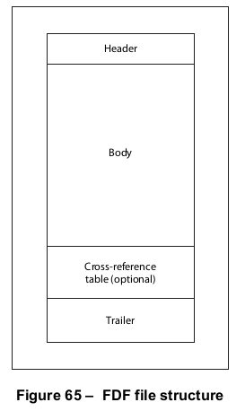

# 12.7 交互式表格

**12.7 Interactive Forms**

## 12.7.1 概述

**12.7.1 General**

=== "中文"

    一个*交互式表单*（PDF 1.2）——有时被称为*AcroForm*——是一组用于从用户交互式地收集信息的字段。一个PDF文档可以包含任意数量的字段，这些字段可以出现在任意组合的页面上，所有这些字段共同构成一个跨越整个文档的单一全局交互式表单。这些字段的任意子集可以从文档中导入或导出；参见[12.7.5]，“表单动作”。

    !!! note "注1"

        交互式表单不应与表单XObjects混淆（参见[8.10]，“表单XObjects”）。尽管名称相似，但两者是不同且无关的对象类型。

    文档中的每个交互式表单字段都应由一个字段字典定义（参见[12.7.3]，“字段字典”）。为了定义和命名的目的，字段可以层次化地组织，并且可以从字段层次结构中的祖先继承属性。层次结构中字段的子项还可以包括定义其在页面上外观的小部件注释（参见[12.5.6.19]，“小部件注释”）。具有字段子项的字段称为非终端字段。没有字段子项的字段称为终端字段。

    终端字段可能有定义其在页面上外观的小部件注释子项（参见[12.5.6.19]，“小部件注释”）。为方便起见，当一个字段只有一个关联的小部件注释时，字段字典和注释字典（[12.5.2]，“注释字典”）的内容可以合并成一个包含与字段和注释都相关的条目的单一字典。（这不会产生歧义，因为这两种字典的内容不会冲突。）如果这样的对象定义了一个外观流，该外观应与字段的当前值一致。

    !!! note "注2"

        包含事先不知道内容的文本的字段可能需要动态构建其外观流，而不是在外观字典中静态定义；参见[12.7.3.3]，“可变文本”。

=== "英文"

    An *interactive form* (PDF 1.2)—sometimes referred to as an *AcroForm*—is a collection of fields for gathering information interactively from the user. A PDF document may contain any number of fields appearing on any combination of pages, all of which make up a single, global interactive form spanning the entire document. Arbitrary subsets of these fields can be imported or exported from the document; see [12.7.5], “Form Actions.”
    
    !!! note "NOTE 1"
    
        Interactive forms should not be confused with form XObjects (see [8.10], “Form XObjects”). Despite the similarity of names, the two are different, unrelated types of objects.
    
    Each field in a document’s interactive form shall be defined by a field dictionary (see [12.7.3], “Field Dictionaries”). For purposes of definition and naming, the fields can be organized hierarchically and can inherit attributes from their ancestors in the field hierarchy. A field’s children in the hierarchy may also include widget annotations (see [12.5.6.19], “Widget Annotations”) that define its appearance on the page. A field that has children that are fields is called a non-terminal field. A field that does not have children that are fields is called a terminal field.
    
    A terminal field may have children that are widget annotations (see [12.5.6.19], “Widget Annotations“) that define its appearance on the page. As a convenience, when a field has only a single associated widget annotation, the contents of the field dictionary and the annotation dictionary ([12.5.2], “Annotation Dictionaries”) may be merged into a single dictionary containing entries that pertain to both a field and an annotation. (This presents no ambiguity, since the contents of the two kinds of dictionaries do not conflict.) If such an object defines an appearance stream, the appearance shall be consistent with the object’s current value as a field.
    
    !!! note "NOTE 2"
    
        Fields containing text whose contents are not known in advance may need to construct their appearance streams dynamically instead of defining them statically in an appearance dictionary; see [12.7.3.3], “Variable Text.”

## 12.7.2 交互式表格词典

**12.7.2 Interactive Form Dictionary**

=== "中文"

    文档交互式表单的内容和属性由交互式表单字典定义，该字典应从文档目录中的**AcroForm**条目引用（参见[7.7.2]“文档目录”）。表218展示了该字典的内容。

    <table id="table218" markdown="span">
        <caption>**表218 – 交互式表单字典中的条目**</caption>
        <thead>
            <tr>
                <th>**键**</th>
                <th>**类型**</th>
                <th>**值**</th>
            </tr>
        </thead>
        <tbody>
            <tr>
                <td>**Fields**</td>
                <td>数组</td>
                <td>（必填）指向文档根字段（在字段层次结构中没有祖先的字段）的引用数组。</td>
            </tr>
            <tr>
                <td>**NeedAppearances**</td>
                <td>布尔值</td>
                <td>（可选）一个标志，用于指定是否为文档中的所有小部件注释构建外观流和外观字典（参见[12.7.3.3]“可变文本”）。默认值：**false**。</td>
            </tr>
            <tr>
                <td>**SigFlags**</td>
                <td>整数</td>
                <td>（可选；PDF 1.3）一组标志，用于指定与签名字段相关的各种文档级特性（参见[表219](#table219)和[12.7.4.5]“签名字段”）。默认值：0。</td>
            </tr>
            <tr>
                <td>**CO**</td>
                <td>数组</td>
                <td>（如果文档中的任何字段具有包含**C**条目的附加动作字典，则必填；PDF 1.3）指向具有计算动作的字段字典的间接引用数组，定义当任何字段的值发生变化时其值的重新计算顺序（参见[12.6.3]“触发事件”）。</td>
            </tr>
            <tr>
                <td>**DR**</td>
                <td>字典</td>
                <td>（可选）资源字典（参见[7.8.3]“资源字典”），包含表单字段外观流应使用的默认资源（如字体、图案或颜色空间）。该字典至少应包含一个**Font**条目，指定显示文本的默认字体的资源名称和字体字典。</td>
            </tr>
            <tr>
                <td>**DA**</td>
                <td>字符串</td>
                <td>（可选）可变文本字段DA属性的文档级默认值（参见[12.7.3.3]“可变文本”）。</td>
            </tr>
            <tr>
                <td>**Q**</td>
                <td>整数</td>
                <td>（可选）可变文本字段Q属性的文档级默认值（参见[12.7.3.3]“可变文本”）。</td>
            </tr>
            <tr>
                <td>**XFA**</td>
                <td>流或数组</td>
                <td>（可选；PDF 1.5）包含XFA资源的流或数组，其格式应由数据包（XDP）规范描述（参见[Bibliography](../bibliography.md)）。<br/>此条目的值可以是一个表示XML数据包全部内容的流，也可以是一个由表示组成XML数据包的单个数据包的文本字符串和流对组成的数组。<br/>有关更多信息，请参见[12.7.8]“XFA表单”。</td>
            </tr>
        </tbody>
    </table>

    交互式表单字典的**SigFlags**条目的值是一个无符号32位整数，包含指定与签名字段相关的各种文档级特性的标志（参见[12.7.4.5]“签名字段”）。标志字中的位位置应从1（低位）到32（高位）编号。表219展示了这些标志的含义；所有未定义的标志位应保留并设置为0。

    <table id="table219" markdown="span">
        <caption>**表219 – 签名标志**</caption>
        <thead>
            <tr>
                <th>**位位置**</th>
                <th>**名称**</th>
                <th>**含义**</th>
            </tr>
        </thead>
        <tbody>
            <tr>
                <td>**1**</td>
                <td>SignaturesExist</td>
                <td>如果设置了此标志，则表示文档至少包含一个签名字段。此标志允许兼容的阅读器启用与签名处理相关的用户界面项（如菜单项或按钮），而无需扫描整个文档以查找签名字段的存在。</td>
            </tr>
            <tr>
                <td>**2**</td>
                <td>AppendOnly</td>
                <td>如果设置了此标志，则表示文档包含的签名在以更改其先前内容的方式保存（写入）文件时可能会失效，与增量更新相反。仅通过将新信息附加到前一个版本的末尾来更新文件是安全的（参见[H.7](../a8.md#h7-更新示例)“更新示例”）。兼容的阅读器可以使用此标志通知请求完整保存的用户，签名将会失效，并且在进行操作之前需要明确确认。</td>
            </tr>
        </tbody>
    </table>

=== "英文"

    The contents and properties of a document’s interactive form shall be defined by an interactive form dictionary that shall be referenced from the **AcroForm** entry in the document catalogue (see [7.7.2], “Document Catalog”). Table 218 shows the contents of this dictionary.
    
    
    <table id="table218" markdown="span">
        <caption>**Table 218 – Entries in the interactive form dictionary**</caption>
        <thead>
            <tr>
                <th>**Key**</th>
                <th>**Type**</th>
                <th>**Value**</th>
            </tr>
        </thead>
        <tbody>
            <tr>
                <td>**Fields**</td>
                <td>array</td>
                <td>(Required) An array of references to the document’s root fields (those with no ancestors in the field hierarchy).
                </td>
            </tr>
            <tr>
                <td>**NeedAppearances**</td>
                <td>boolean</td>
                <td>(Optional) A flag specifying whether to construct appearance streams and appearance dictionaries for all widget annotations in the document (see [12.7.3.3], “Variable Text”). Default value: **false**.
                </td>
            </tr>
            <tr>
                <td>**SigFlags**</td>
                <td>integer</td>
                <td>(Optional; PDF 1.3) A set of flags specifying various document-level characteristics related to signature fields (see [Table 219](#table219), and [12.7.4.5], “Signature Fields”). Default value: 0.
                </td>
            </tr>
            <tr>
                <td>**CO**</td>
                <td>array</td>
                <td>(Required if any fields in the document have additional-actions dictionaries containing a **C** entry; PDF 1.3) An array of indirect references to field dictionaries with calculation actions, defining the calculation order in which their values will be recalculated when the value of any field changes (see [12.6.3], “Trigger Events”).
                </td>
            </tr>
            <tr>
                <td>**DR**</td>
                <td>dictionary</td>
                <td>(Optional) A resource dictionary (see [7.8.3], “Resource Dictionaries”) containing default resources (such as fonts, patterns, or colour spaces) that shall be used by form field appearance streams. At a minimum, this dictionary shall contain a **Font** entry specifying the resource name and font dictionary of the default font for displaying text.
                </td>
            </tr>
            <tr>
                <td>**DA**</td>
                <td>string</td>
                <td>(Optional) A document-wide default value for the DA attribute of variable text fields (see [12.7.3.3], “Variable Text”).
                </td>
            </tr>
            <tr>
                <td>**Q**</td>
                <td>integer</td>
                <td>(Optional) A document-wide default value for the Q attribute of variable text fields (see [12.7.3.3], “Variable Text”).
                </td>
            </tr>
            <tr>
                <td>**XFA**</td>
                <td>stream or array</td>
                <td>(Optional; PDF 1.5) A stream or array containing an XFA resource, whose format shall be described by the Data Package (XDP) Specification. (see the [Bibliography](../bibliography.md)). <br/> The value of this entry shall be either a stream representing the entire contents of the XML Data Package or an array of text string and stream pairs representing the individual packets comprising the XML Data Package. <br/> See [12.7.8], “XFA Forms,” for more information.
                </td>
            </tr>
        </tbody>
    </table>
    
    The value of the interactive form dictionary’s **SigFlags** entry is an unsigned 32-bit integer containing flags specifying various document-level characteristics related to signature fields (see [12.7.4.5], “Signature Fields”). Bit positions within the flag word shall be numbered from 1 (low-order) to 32 (high-order). Table 219 shows the meanings of the flags; all undefined flag bits shall be reserved and shall be set to 0.

    <table id="table219" markdown="span">
        <caption>**Table 219 – Signature flags**</caption>
        <thead>
            <tr>
                <th>**Bit position**</th>
                <th>**Name**</th>
                <th>**Meaning**</th>
            </tr>
        </thead>
        <tbody>
            <tr>
                <td>**1**</td>
                <td>SignaturesExist</td>
                <td>If set, the document contains at least one signature field. This flag allows a conforming reader to enable user interface items (such as menu items or pushbuttons) related to signature processing without having to scan the entire document for the presence of signature fields.
                </td>
            </tr>
            <tr>
                <td>**2**</td>
                <td>AppendOnly</td>
                <td>If set, the document contains signatures that may be invalidated if the file is saved (written) in a way that alters its previous contents, as opposed to an incremental update. Merely updating the file by appending new information to the end of the previous version is safe (see [H.7](../a8.md#h7-更新示例), “Updating Example”). Conforming readers may use this flag to inform a user requesting a full save that signatures will be invalidated and require explicit confirmation before continuing with the operation.
                </td>
            </tr>
        </tbody>
    </table>

## 12.7.3 领域词典

**12.7.3 Field Dictionaries**

### 12.7.3.1 概述

**12.7.3.1 General**

=== "中文"

    文档交互式表单中的每个字段都应由一个字段字典定义，该字段字典应为间接对象。字段字典可以层次化地组织成一个或多个树状结构。许多字段属性是*可继承的*，这意味着如果某个字段没有明确指定这些属性的值，那么将采用其在字段层次结构中父字段的值。这些可继承的属性应在表220和表221中注明。标注为（必填；可继承）表示每个字段都必须定义该属性，无论是在其自身的字段字典中明确指定，还是从层次结构中的祖先处继承而来。表220列出了所有字段字典通用的条目，无论字段类型如何。仅适用于特定类型字段的条目将在表220的相关子条款中描述。

    <table id="table220" markdown="span">
        <caption>**表220 – 所有字段字典通用的条目**</caption>
        <thead>
            <tr>
                <th>**键**</th>
                <th>**类型**</th>
                <th>**值**</th>
            </tr>
        </thead>
        <tbody>
            <tr>
                <td>**FT**</td>
                <td>名称</td>
                <td>（终端字段必填；可继承）此字典描述的字段类型：<br/>
                Btn 按钮（参见[12.7.4.2]“按钮字段”）<br/>
                Tx 文本（参见[12.7.4.3]“文本字段”）<br/>
                Ch 选择（参见[12.7.4.4]“选择字段”）<br/>
                Sig （PDF 1.3）签名（参见[12.7.4.5]“签名字段”）<br/>
                此条目可出现在非终端字段（其子项为字段的字段）中，以提供可继承的FT值。然而，非终端字段本身逻辑上并没有自己的类型；它只是一个容器，用于存放适用于任何类型后代终端字段的可继承属性。</td>
            </tr>
            <tr>
                <td>**Parent**</td>
                <td>字典</td>
                <td>（如果此字段是字段层次结构中另一个字段的子项，则必填；否则不出现）此字段的直接父字段（如果存在，其**Kids**数组包含此字段的字段）。一个字段最多只能有一个父字段；也就是说，它最多只能被包含在另一个字段的**Kids**数组中一次。</td>
            </tr>
            <tr>
                <td>**Kids**</td>
                <td>数组</td>
                <td>（有时必填，如下所述）此字段直接子项的间接引用数组。<br/> 在非终端字段中，**Kids**数组应引用此字段的直接后代字段字典。在终端字段中，**Kids**数组通常应引用一个或多个与此字段关联的单独小部件注释。但是，如果只有一个关联的小部件注释，并且其内容已合并到字段字典中，则应省略**Kids**。</td>
            </tr>
            <tr>
                <td>**T**</td>
                <td>文本字符串</td>
                <td>（可选）部分字段名称（参见[12.7.3.2]“字段名称”）。</td>
            </tr>
            <tr>
                <td>**TU**</td>
                <td>文本字符串</td>
                <td>（可选；PDF 1.3）替代字段名称，在用户界面中标识字段时应使用此名称（例如，在提及字段的错误或状态消息中）。在支持残障用户访问文档内容或其他目的时，此文本也很有用（参见[14.9.3]“替代描述”）。</td>
            </tr>
            <tr>
                <td>**TM**</td>
                <td>文本字符串</td>
                <td>（可选；PDF 1.3）从文档中导出交互式表单字段数据时应使用的映射名称。</td>
            </tr>
            <tr>
                <td>**Ff**</td>
                <td>整数</td>
                <td>（可选；可继承）一组标志，用于指定字段的各种特性（参见[表221](#table221)）。默认值：0。</td>
            </tr>
            <tr>
                <td>**V**</td>
                <td>（各种类型）</td>
                <td>（可选；可继承）字段的值，其格式因字段类型而异。有关更多信息，请参见各个字段类型的描述。</td>
            </tr>
            <tr>
                <td>**DV**</td>
                <td>（各种类型）</td>
                <td>（可选；可继承）执行重置表单动作时字段恢复的默认值（参见[12.7.5.3]“重置表单动作”）。此值的格式与V相同。</td>
            </tr>
            <tr>
                <td>**AA**</td>
                <td>字典</td>
                <td>（可选；PDF 1.2）附加动作字典，定义字段对各种触发事件的响应行为（参见[12.6.3]“触发事件”）。此条目的含义与注释字典中的AA条目完全相同（参见[12.5.2]“注释字典”）。</td>
            </tr>
        </tbody>
    </table>

    字段字典的**Ff**条目的值是一个无符号32位整数，包含指定字段各种特性的标志。标志字中的位位置应从1（低位）到32（高位）编号。表221中显示的标志适用于所有类型的字段。仅适用于特定字段类型的标志将在描述这些类型的子条款中讨论。所有未定义的标志位应保留并设置为0。
    
    
    <table id="table221" markdown="span">
        <caption>**Table 221 – 所有字段类型共有的字段标志**</caption>
        <thead>
            <tr>
                <th>**位位置**</th>
                <th>**名称**</th>
                <th>**意义**</th>
            </tr>
        </thead>
        <tbody>
            <tr>
                <td>**1**</td>
                <td>只读</td>
                <td>如果设置，用户将无法更改字段的值。任何关联的小部件注释都不会与用户交互；也就是说，它们不会响应鼠标点击或响应鼠标移动而改变其外观。此标志对于其值是从数据库计算或导入的字段很有用。
                </td>
            </tr>
            <tr>
                <td>**2**</td>
                <td>必须</td>
                <td>如果设置，该字段在通过提交表单操作导出时应具有一个值（参见[12.7.5.2]，“提交表单操作”）。
                </td>
            </tr>
            <tr>
                <td>**3**</td>
                <td>NoExport</td>
                <td>如果设置，则该字段不得通过提交表单操作导出（参见[12.7.5.2]，“提交表单操作”）。
                </td>
            </tr>
        </tbody>
    </table>

=== "英文"

    Each field in a document’s interactive form shall be defined by a field dictionary, which shall be an indirect object. The field dictionaries may be organized hierarchically into one or more tree structures. Many field attributes are *inheritable*, meaning that if they are not explicitly specified for a given field, their values are taken from those of its parent in the field hierarchy. Such inheritable attributes shall be designated as such in the Tables 220 and 221. The designation (Required; inheritable) means that an attribute shall be defined for every field, whether explicitly in its own field dictionary or by inheritance from an ancestor in the hierarchy. Table 220 shows those entries that are common to all field dictionaries, regardless of type. Entries that pertain only to a particular type of field are described in the relevant sub-clauses in Table 220.
    
    
    <table id="table220" markdown="span">
        <caption>**Table 220 – Entries common to all field dictionaries**</caption>
        <thead>
            <tr>
                <th>**Key**</th>
                <th>**Type**</th>
                <th>**Value**</th>
            </tr>
        </thead>
        <tbody>
            <tr>
                <td>**FT**</td>
                <td>name</td>
                <td>(Required for terminal fields; inheritable) The type of field that this dictionary describes: <br/>
                Btn &emsp; Button (see [12.7.4.2], “Button Fields”) <br/>
                Tx &emsp; Text (see [12.7.4.3], “Text Fields”) <br/>
                Ch &emsp; Choice (see [12.7.4.4], “Choice Fields”) <br/>
                Sig &emsp; (PDF 1.3) Signature (see [12.7.4.5], “Signature Fields”) <br/>
                This entry may be present in a non-terminal field (one whose descendants are fields) to provide an inheritable FT value. However, a non-terminal field does not logically have a type of its own; it is merely a container for inheritable attributes that are intended for descendant terminal fields of any type.
                </td>
            </tr>
            <tr>
                <td>**Parent**</td>
                <td>dictionary</td>
                <td>(Required if this field is the child of another in the field hierarchy; absent otherwise) The field that is the immediate parent of this one (the field, if any, whose **Kids** array includes this field). A field can have at most one parent; that is, it can be included in the **Kids** array of at most one other field.
                </td>
            </tr>
            <tr>
                <td>**Kids**</td>
                <td>array</td>
                <td>(Sometimes required, as described below) An array of indirect references to the immediate children of this field. <br/> In a non-terminal field, the **Kids** array shall refer to field dictionaries that are immediate descendants of this field. In a terminal field, the **Kids** array ordinarily shall refer to one or more separate widget annotations that are associated with this field. However, if there is only one associated widget annotation, and its contents have been merged into the field dictionary, **Kids** shall be omitted.
                </td>
            </tr>
            <tr>
                <td>**T**</td>
                <td>text string</td>
                <td>(Optional) The partial field name (see [12.7.3.2], “Field Names”).
                </td>
            </tr>
            <tr>
                <td>**TU**</td>
                <td>text string</td>
                <td>(Optional; PDF 1.3) An alternate field name that shall be used in place of the actual field name wherever the field shall be identified in the user interface (such as in error or status messages referring to the field). This text is also useful when extracting the document’s contents in support of accessibility to users with disabilities or for other purposes (see [14.9.3], “Alternate Descriptions”).
                </td>
            </tr>
            <tr>
                <td>**TM**</td>
                <td>text string</td>
                <td>(Optional; PDF 1.3) The mapping name that shall be used when exporting interactive form field data from the document.
                </td>
            </tr>
            <tr>
                <td>**Ff**</td>
                <td>integer</td>
                <td>(Optional; inheritable) A set of flags specifying various characteristics of the field (see [Table 221](#table221)). Default value: 0.
                </td>
            </tr>
            <tr>
                <td>**V**</td>
                <td>(various)</td>
                <td>(Optional; inheritable) The field’s value, whose format varies depending on the field type. See the descriptions of individual field types for further information.
                </td>
            </tr>
            <tr>
                <td>**DV**</td>
                <td>(various)</td>
                <td>(Optional; inheritable) The default value to which the field reverts when a reset-form action is executed (see [12.7.5.3], “Reset-Form Action”). The format of this value is the same as that of V.
                </td>
            </tr>
            <tr>
                <td>**AA**</td>
                <td>dictionary</td>
                <td>(Optional; PDF 1.2) An additional-actions dictionary defining the field’s behaviour in response to various trigger events (see [12.6.3], “Trigger Events”). This entry has exactly the same meaning as the AA entry in an annotation dictionary (see [12.5.2], “Annotation Dictionaries”).
                </td>
            </tr>
        </tbody>
    </table>
    
    The value of the field dictionary’s **Ff** entry is an unsigned 32-bit integer containing flags specifying various characteristics of the field. Bit positions within the flag word shall be numbered from 1 (low-order) to 32 (high- order). The flags shown in Table 221 are common to all types of fields. Flags that apply only to specific field types are discussed in the sub-clauses describing those types. All undefined flag bits shall be reserved and shall be set to 0.
    
    
    <table id="table221" markdown="span">
        <caption>**Table 221 – Field flags common to all field types**</caption>
        <thead>
            <tr>
                <th>**Bit position**</th>
                <th>**Name**</th>
                <th>**Meaning**</th>
            </tr>
        </thead>
        <tbody>
            <tr>
                <td>**1**</td>
                <td>ReadOnly</td>
                <td>If set, the user may not change the value of the field. Any associated widget annotations will not interact with the user; that is, they will not respond to mouse clicks or change their appearance in response to mouse motions. This flag is useful for fields whose values are computed or imported from a database.
                </td>
            </tr>
            <tr>
                <td>**2**</td>
                <td>Required</td>
                <td>If set, the field shall have a value at the time it is exported by a submit-form action (see [12.7.5.2], “Submit-Form Action”).
                </td>
            </tr>
            <tr>
                <td>**3**</td>
                <td>NoExport</td>
                <td>If set, the field shall not be exported by a submit-form action (see [12.7.5.2], “Submit-Form Action”).
                </td>
            </tr>
        </tbody>
    </table>

### 12.7.3.2 字段名称

**12.7.3.2 Field Names**

=== "中文"

    字段字典中的**T**条目（参见[表220](#table220)）包含一个定义字段*部分字段名称*的文本字符串。*完全限定字段名称*并未明确地定义，但应根据字段及其所有祖先的部分字段名称构建。对于没有父字段的字段，其部分名称和完全限定名称相同。对于作为另一个字段子项的字段，其完全限定名称应通过将子字段的部分名称附加到父字段的完全限定名称之后，并用句点（2Eh）分隔来形成，如下所示：

        父字段的完全限定名称 . 子字段的部分名称

    !!! info "示例"

        如果一个部分字段名称为PersonalData的字段有一个部分名称为Address的子字段，而该子字段又有一个部分名称为ZipCode的子字段，则最后一个字段的完全限定名称为
        
        PersonalData . Address . ZipCode

    由于句点用作完全限定名称的分隔符，因此部分名称不应包含句点字符。因此，所有源自同一共同祖先的字段在其完全限定名称中共享该祖先的完全限定字段名称作为公共前缀。

    如果不同的字段字典是具有相同名称的共同祖先的后代，并且它们自身没有部分字段名称（**T**条目），则这些字段字典可以具有相同的完全限定字段名称。这样的字段字典是同一底层字段的不同表示形式；它们应仅在指定其视觉外观的属性上有所不同。特别是，具有相同完全限定字段名称的字段字典应具有相同的字段类型（**FT**）、值（**V**）和默认值（**DV**）。

=== "英文"

    The T entry in the field dictionary (see [Table 220](#table220)) holds a text string defining the field’s *partial field name*. The *fully qualified field name* is not explicitly defined but shall be constructed from the partial field names of the field and all of its ancestors. For a field with no parent, the partial and fully qualified names are the same. For a field that is the child of another field, the fully qualified name shall be formed by appending the child field’s partial name to the parent’s fully qualified name, separated by a PERIOD (2Eh) as shown:
    
        parent’s_full_name . child’s_partial_name
    
    !!! info "EXAMPLE"
    
        If a field with the partial field name PersonalData has a child whose partial name is Address, which in turn has a child with the partial name ZipCode, the fully qualified name of this last field is
        
        PersonalData . Address . ZipCode
    
    Because the PERIOD is used as a separator for fully qualified names, a partial name shall not contain a PERIOD character. Thus, all fields descended from a common ancestor share the ancestor’s fully qualified field name as a common prefix in their own fully qualified names.
    
    It is possible for different field dictionaries to have the same fully qualified field name if they are descendants of a common ancestor with that name and have no partial field names (**T** entries) of their own. Such field dictionaries are different representations of the same underlying field; they should differ only in properties that specify their visual appearance. In particular, field dictionaries with the same fully qualified field name shall have the same field type (**FT**), value (**V**), and default value (**DV**).

### 12.7.3.3 变量文本

**12.7.3.3 Variable Text**

=== "中文"

    当字段的内容和属性已知时，其视觉外观可以通过PDF文件中定义的外观流来指定（参见[12.5.5]“外观流”和[12.5.6.19]“小部件注释”）。然而，在某些情况下，字段可能包含直到查看时才知晓其值的文本。

    !!! note "注"

        示例包括需要用户从键盘输入文本的文本字段、在显示文档时交互式确定内容的可滚动列表框，以及包含当前日期或由JavaScript计算得出的值的字段。

    在这种情况下，PDF文档无法为显示字段提供静态定义的外观流。相反，兼容的阅读器应在查看时动态构建外观流。表222中显示的字典条目提供了有关字段外观的一般信息，这些信息可以与字段包含的具体文本结合起来构建外观流。

    <table id="table222" markdown="span">
        <caption>**表222 – 包含可变文本的所有字段共有的附加条目**</caption>
        <thead>
            <tr>
                <th>**键**</th>
                <th>**类型**</th>
                <th>**值**</th>
            </tr>
        </thead>
        <tbody>
            <tr>
                <td>**DA**</td>
                <td>字符串</td>
                <td>（必填；可继承）默认外观字符串，包含一系列有效的页面内容图形或文本状态操作符，用于定义字段的文本大小和颜色等属性。</td>
            </tr>
            <tr>
                <td>**Q**</td>
                <td>整数</td>
                <td>（可选；可继承）指定显示文本时使用的对齐方式的代码：<br/>
                    0 左对齐<br/>
                    1 居中对齐<br/>
                    2 右对齐<br/>
                    默认值：0（左对齐）。</td>
            </tr>
            <tr>
                <td>**DS**</td>
                <td>文本字符串</td>
                <td>（可选；PDF 1.5）默认样式字符串，如[12.7.3.4]“富文本字符串”所述。</td>
            </tr>
            <tr>
                <td>**RV**</td>
                <td>文本字符串或文本流</td>
                <td>（可选；PDF 1.5）富文本字符串，如[12.7.3.4]“富文本字符串”所述。</td>
            </tr>
        </tbody>
    </table>

    新的外观流成为与字段小部件注释关联的外观字典中的正常外观（**N**）（参见[表168](./s5.md#table168)）。（如果小部件注释没有外观字典，兼容的阅读器应创建一个并将其存储在注释字典的**AP**条目中。）

    在PDF 1.5中，设置了RichText标志的表单字段（参见表226）按照[12.7.3.4]“富文本字符串”中描述的方式指定格式信息。对于这些字段，不使用以下约定，并且每次更改值时都应重新生成整个注释外观。

    对于非富文本字段，外观流（与所有外观流一样，是一种表单XObject）的表单字典内容按如下方式初始化：

    • 资源字典（**Resources**）应使用交互式表单字典的**DR**条目中的资源创建（参见[表218](#table218)）。
    • 边界框（**BBox**）的左下角坐标在表单坐标系中设置为(0, 0)。框的顶部和右侧坐标取自注释矩形的尺寸（小部件注释字典中的**Rect**条目）。
    • 外观流表单字典中的所有其他条目设置为其默认值（参见[8.10]“表单XObject”）。

    !!! info "示例"

        外观流包括以下标记内容部分，该部分表示绘制文本的流部分：

        ```text
        /Tx BMC                                  % 开始带有Tx标签的标记内容
        q                                        % 保存图形状态
        … 任何必需的图形状态更改，如裁剪 …
        BT                                     % 开始文本对象
        … 默认外观字符串（DA）…
        … 显示可变文本的文本定位和文本显示操作符 …
        ET                                     % 结束文本对象
        Q                                     % 恢复图形状态
        EMC                                     % 结束标记内容
        ```

        **BMC**（开始标记内容）和**EMC**（结束标记内容）操作符在[14.6]“标记内容”中讨论。**q**（保存图形状态）和**Q**（恢复图形状态）在[8.4.4]“图形状态操作符”中讨论。**BT**（开始文本对象）和**ET**（结束文本对象）在[9.4]“文本对象”中讨论。有关示例，请参见[12.7.8]“XFA表单”中的示例1 。

    默认外观字符串（**DA**）包含建立显示字段可变文本的图形状态参数（如文本大小和颜色）所需的任何图形状态或文本状态操作符。此字符串中仅允许出现文本对象内允许的操作符（参见[图9](../c8/s2.md)）。至少，该字符串应包含一个**Tf**（文本字体）操作符及其两个操作数：字体和大小。指定的字体值应与交互式表单字典的**DR**条目引用的默认资源字典（参见[表218](#table218)）中的**Font**条目的资源名称相匹配。大小值为零表示字体应自动调整大小：其大小应根据注释矩形的高度计算得出。

    默认外观字符串最多只能包含一个**Tm**（文本矩阵）操作符。如果存在此操作符，兼容的阅读器应根据字段值、对齐方式（**Q**）属性以及所使用的任何布局规则，用它认为合适的定位值替换水平和垂直平移分量。如果默认外观字符串不包含**Tm**操作符，查看器应在默认外观字符串之后、可变文本的文本定位和文本显示操作符之前，在外观流中插入一个（带有适当的水平和垂直平移分量）。

    为了更新现有的外观流以反映新的字段值，兼容的阅读器应首先将文档的**DR**字典（参见表218）中的任何所需资源复制到流的**Resources**字典中。（如果**DR**和**Resources**字典包含同名的资源，则**Resources**字典中已有的资源应保持不变，不替换为DR字典中的相应值。）然后，兼容的阅读器应将外观流中从/Tx BMC到匹配的EMC之间的现有内容替换为“复选框”[12.7.4]“字段类型”中示例1所示的相应新内容。（如果现有外观流中没有标记为Tx的标记内容，则新内容应附加到原始流的末尾。）

=== "英文"

    When the contents and properties of a field are known in advance, its visual appearance can be specified by an appearance stream defined in the PDF file (see [12.5.5], “Appearance Streams,” and [12.5.6.19], “Widget Annotations”). In some cases, however, the field may contain text whose value is not known until viewing time.
    
    !!! note "NOTE"
    
        Examples include text fields to be filled in with text typed by the user from the keyboard, scrollable list boxes whose contents are determined interactively at the time the document is displayed and fields containing current dates or values calculated by a JavaScript.
    
    In such cases, the PDF document cannot provide a statically defined appearance stream for displaying the field. Instead, the conforming reader shall construct an appearance stream dynamically at viewing time. The dictionary entries shown in Table 222 provide general information about the field’s appearance that can be combined with the specific text it contains to construct an appearance stream.
    
    <table id="table222" markdown="span">
        <caption>**Table 222 – Additional entries common to all fields containing variable text**</caption>
        <thead>
            <tr>
                <th>**Key**</th>
                <th>**Type**</th>
                <th>**Value**</th>
            </tr>
        </thead>
        <tbody>
            <tr>
                <td>**DA**</td>
                <td>string</td>
                <td>(Required; inheritable) The default appearance string containing a sequence of valid page-content graphics or text state operators that define such properties as the field’s text size and colour.
                </td>
            </tr>
            <tr>
                <td>**Q**</td>
                <td>integer</td>
                <td>(Optional; inheritable) A code specifying the form of quadding (justification) that shall be used in displaying the text: <br/>
                    0 &emsp; Left-justified <br/>
                    1 &emsp; Centered <br/>
                    2 &emsp; Right-justified <br/>
                    Default value: 0 (left-justified).
                </td>
            </tr>
            <tr>
                <td>**DS**</td>
                <td>text string</td>
                <td>(Optional; PDF 1.5) A default style string, as described in [12.7.3.4], “Rich Text Strings.”
                </td>
            </tr>
            <tr>
                <td>**RV**</td>
                <td>text string or text stream</td>
                <td>(Optional; PDF 1.5) A rich text string, as described in [12.7.3.4], “Rich Text Strings.”
                </td>
            </tr>
        </tbody>
    </table>
    
    The new appearance stream becomes the normal appearance (**N**) in the appearance dictionary associated with the field’s widget annotation (see [Table 168](./s5.md#table168)). (If the widget annotation has no appearance dictionary, the conforming reader shall create one and store it in the annotation dictionary’s **AP** entry.)
    
    In PDF 1.5, form fields that have the RichText flag set (see Table 226) specify formatting information as described in [12.7.3.4], “Rich Text Strings.” For these fields, the following conventions are not used, and the entire annotation appearance shall be regenerated each time the value is changed.
    
    For non-rich text fields, the appearance stream—which, like all appearance streams, is a form XObject—has the contents of its form dictionary initialized as follows:
    
    - The resource dictionary (**Resources**) shall be created using resources from the interactive form dictionary’s **DR** entry (see [Table 218](#table218)).
    - The lower-left corner of the bounding box (**BBox**) is set to coordinates (0, 0) in the form coordinate system. The box’s top and right coordinates are taken from the dimensions of the annotation rectangle (the **Rect** entry in the widget annotation dictionary).
    - All other entries in the appearance stream’s form dictionary are set to their default values (see [8.10], “Form XObjects”).
    
    !!! info "EXAMPLE"
    
        The appearance stream includes the following section of marked content, which represents the portion of the stream that draws the text:
    
        ```text
        /Tx BMC                                  % Begin marked content with tag Tx
        q                                        % Save graphics state
        … Any required graphics state changes, such as clipping …
        BT                                     % Begin text object
        … Default appearance string ( DA ) …
        … Text-positioning and text-showing operators to show the variable text …
        ET                                     % End text object
        Q                                     % Restore graphics state
        EMC                                     % End marked content
        ```
    
        The BMC (begin marked content) and **EMC** (end marked content) operators are discussed in [14.6], “Marked Content.” **q** (save graphics state) and **Q** (restore graphics state) are discussed in [8.4.4], “Graphics State Operators.” **BT** (begin text object) and **ET** (end text object) are discussed in [9.4], “Text Objects.” See Example 1 in [12.7.8], “XFA Forms” for an example.
    
    The default appearance string (**DA**) contains any graphics state or text state operators needed to establish the graphics state parameters, such as text size and colour, for displaying the field’s variable text. Only operators that are allowed within text objects shall occur in this string (see [Figure 9](../c8/s2.md)). At a minimum, the string shall include a **Tf** (text font) operator along with its two operands, font and size. The specified font value shall match a resource name in the **Font** entry of the default resource dictionary (referenced from the **DR** entry of the interactive form dictionary; see [Table 218](#table218)). A zero value for size means that the font shall be auto-sized: its size shall be computed as a function of the height of the annotation rectangle.
    
    The default appearance string shall contain at most one **Tm** (text matrix) operator. If this operator is present, the conforming reader shall replace the horizontal and vertical translation components with positioning values it determines to be appropriate, based on the field value, the quadding (**Q**) attribute, and any layout rules it employs. If the default appearance string contains no **Tm** operator, the viewer shall insert one in the appearance stream (with appropriate horizontal and vertical translation components) after the default appearance string and before the text-positioning and text-showing operators for the variable text.
    
    To update an existing appearance stream to reflect a new field value, the conforming reader shall first copy any needed resources from the document’s **DR** dictionary (see Table 218) into the stream’s **Resources** dictionary. (If the **DR** and **Resources** dictionaries contain resources with the same name, the one already in the **Resources** dictionary shall be left intact, not replaced with the corresponding value from the DR dictionary.) The conforming reader shall then replace the existing contents of the appearance stream from /Tx BMC to the matching EMC with the corresponding new contents as shown in Example 1 in "Check Boxes," [12.7.4], “Field Types.” (If the existing appearance stream contains no marked content with tag Tx, the new contents shall be appended to the end of the original stream.)

### 12.7.3.4 富文本字符串

**12.7.3.4 Rich Text Strings**

=== "中文"

    从PDF 1.5开始，可变文本表单字段以及标记注释的文本内容可以包含格式（样式）信息。这些*富文本字符串*是完全形成的XML文档，符合为XML表单架构（XFA）规范指定的富文本约定；XFA规范本身是XHTML 1.0规范的一个子集，并增加了有限的CSS2样式属性集（有关所有这些标准的参考资料，请参见参考文献）。

    [表223](#table223)列出了富文本字符串中可能出现的XHTML元素。&lt;body&gt;元素是根元素；其必需属性列在表224中。其他元素（&lt;p&gt;和&lt;span&gt;）包含可应用样式属性的封闭文本，这些样式属性列在表225中。这些样式属性是CSS内联样式属性声明，形式为***name:value***，每个声明之间用分号（3Bh）分隔，如“[单选按钮](#127424-单选按钮)”[12.7.4]“字段类型”中的示例所示。

    在PDF 1.6中，PDF支持*XML表单架构（XFA）规范*2.2版（参见[参考文献](../bibliography.md)）中指定的富文本元素和属性。这些富文本元素和属性是[表223](#table223)、[表224](#table224)和[表225](#table225)中所描述内容的超集。在PDF 1.7中，PDF支持*XML表单架构（XFA）规范*2.4版（参见[参考文献](../bibliography.md)）中指定的富文本元素和属性。

    <table id="table223" markdown="span">
        <caption>**表223 – 富文本字符串中使用的XHTML元素**</caption>
        <thead>
            <tr>
                <th>**元素**</th>
                <th>**描述**</th>
            </tr>
        </thead>
        <tbody>
            <tr>
                <td>**&lt;body&gt;**</td>
                <td>XML文档的根元素。表224列出了此元素的必需属性。</td>
            </tr>
            <tr>
                <td>**&lt;p&gt;**</td>
                <td>封闭应解释为段落的文本。它可以采用[表225](#table225)中列出的样式属性。</td>
            </tr>
            <tr>
                <td>**&lt;i&gt;**</td>
                <td>封闭应以斜体字体显示的文本。</td>
            </tr>
            <tr>
                <td>**&lt;b&gt;**</td>
                <td>封闭应以粗体字体显示的文本。</td>
            </tr>
            <tr>
                <td>**&lt;span&gt;**</td>
                <td>仅出于应用样式（使用[表225](#table225)中的属性）的目的对文本进行分组。</td>
            </tr>
        </tbody>
    </table>

    <table id="table224" markdown="span">
        <caption>**表224 – &lt;body&gt;元素的属性**</caption>
        <thead>
            <tr>
                <th>**属性**</th>
                <th>**描述**</th>
            </tr>
        </thead>
        <tbody>
            <tr>
                <td>**xmlns**</td>
                <td>富文本字符串中元素的默认命名空间。应为xmlns="http://www.w3.org/1999/xhtml" xmlns:xfa="http://www.xfa.org/schema/xfa-data/1.0"。</td>
            </tr>
            <tr>
                <td>**xfa:contentType**</td>
                <td>应为"text/html"。</td>
            </tr>
            <tr>
                <td>**xfa:APIVersion**</td>
                <td>标识用于生成富文本字符串的软件的字符串。其形式为software_name:software_version，其中software_name按名称标识软件。不得包含空格。<br/>
                software_version标识软件的版本。它由一系列用小数点分隔的整数组成。每个整数都是一个版本号，最左边的值是主版本号，右边的值越来越次要。比较字符串时，应按顺序比较版本号。

    !!! info "注"

        “5.2”小于“5.13”，因为2小于13；该字符串不作为十进制数处理。比较具有不同部分数量的字符串时，部分数量较少的字符串在右侧隐式填充包含“0”的部分，以使部分数量相等。
                </td>
            </tr>
            <tr>
                <td>**xfa:spec**</td>
                <td>富文本字符串所符合的*XML表单架构*（XFA）规范的版本。如果正在编写的文件符合PDF 1.5，则富文本字符串应符合XFA 2.0，并且此属性应为XFA 2.0；如果正在编写的文件符合PDF 1.6，则富文本字符串应符合XFA 2.2，并且此属性应为XFA 2.2；如果正在编写的文件符合PDF 1.7，则富文本字符串应符合XFA 2.4，并且此属性应为XFA 2.4。</td>
            </tr>
        </tbody>
    </table>

    <table id="table225" markdown="span">
        <caption>**表225 – 富文本字符串中使用的CSS2样式属性**</caption>
        <thead>
            <tr>
                <th>**属性**</th>
                <th>**值**</th>
                <th>**描述**</th>
            </tr>
        </thead>
        <tbody>
            <tr>
                <td>**text-align**</td>
                <td>关键字</td>
                <td>水平对齐方式。可能的值：left（左对齐）、right（右对齐）和center（居中对齐）。</td>
            </tr>
            <tr>
                <td>**vertical-align**</td>
                <td>十进制数</td>
                <td>用于调整封闭文本基线的量。正值表示上标；负值表示下标。该值的形式为&lt;十进制数&gt;pt，可选地前面带有符号，后面跟“pt”。<br/>示例： -3pt, 4pt。</td>
            </tr>
            <tr>
                <td>**font-size**</td>
                <td>十进制数</td>
                <td>封闭文本的字体大小。该值的形式为&lt;十进制数&gt;pt。</td>
            </tr>
            <tr>
                <td>**font-style**</td>
                <td>关键字</td>
                <td>指定封闭文本的字体样式。可能的值：normal（正常）、italic（斜体）。</td>
            </tr>
            <tr>
                <td>**font-weight**</td>
                <td>关键字</td>
                <td>封闭文本的字体粗细。可能的值：normal（正常）、bold（加粗）、100、200、300、400、500、600、700、800、900。<br/>normal等同于400，bold等同于700。</td>
            </tr>
            <tr>
                <td>**font-family**</td>
                <td>列表</td>
                <td>用于显示封闭文本的字体名称或字体名称列表。（如果提供了列表，则使用第一个包含指定文本字形（glyphs）的字体。）</td>
            </tr>
            <tr>
                <td>**font**</td>
                <td>列表</td>
                <td>一种简写的CSS字体属性，形式为font:&lt;font-style&gt; &lt;font-weight&gt; &lt;font-size&gt; &lt;font-family&gt;。</td>
            </tr>
            <tr>
                <td>**color**</td>
                <td>RGB值</td>
                <td>封闭文本的颜色。它可以是以下两种形式之一：#rrggbb（每个rgb分量用两位十六进制值表示）或rgb(rrr,ggg,bbb)（每个分量用十进制值表示）。<br/>虽然color属性指定的值被解释为sRGB值，但在用于生成注释的外观时，应将其转换为非ICC基础颜色空间中的值。</td>
            </tr>
            <tr>
                <td>**text-decoration**</td>
                <td>关键字</td>
                <td>以下关键字之一：<br/>
                    underline（下划线）：封闭文本应带有下划线。<br/>
                    line-through（删除线）：封闭文本应带有贯穿线。</td>
            </tr>
            <tr>
                <td>**font-stretch**</td>
                <td>关键字</td>
                <td>指定字体家族中的正常、紧缩或扩展字体样式。从最窄到最宽支持的值有ultra-condensed（超紧缩）、extra-condensed（超紧缩）、condensed（紧缩）、semi-condensed（半紧缩）、normal（正常）、semi-expanded（半扩展）、expanded（扩展）、extra-expanded（超扩展）和ultra-expanded（超扩展）。</td>
            </tr>
        </tbody>
    </table>

    富文本字符串应由可变文本表单字段字典的**RV**条目（参见[表222](#table222)）和标记注释字典的**RC**条目（参见[表170](./s5.md#table170)）指定。富文本字符串可以作为文本流打包（参见[7.9.3]“文本流”）。使用富文本流的表单字段还应设置RichText标志（参见[表228](#table228)）。

    自由文本注释（参见[表174](./s5.md#table174)）或可变文本表单字段（参见[表222](#table222)）应通过**DS**条目指定默认样式字符串。该字符串指定样式属性的默认值，对于注释或字段未明确指定的任何样式属性，应使用这些默认值。[表225](#table225)中列出的所有属性在默认样式字符串中都是合法的。除了**RV**或**RC**条目之外，还应使用此字符串来生成外观。

    !!! note "注1"

        除自由文本注释之外的标记注释（参见[12.5.6.2]“标记注释”）不使用默认样式字符串，因为它们的外观是通过要求兼容的阅读器选择适当系统字体进行显示的平台控件实现的。

    当表单字段或注释包含富文本字符串时，字符串的*纯文本*（字符数据）也应被保留（对于表单字段是在**V**条目中，对于注释是在**Contents**条目中）。这使得较旧的阅读器能够读取和编辑数据（尽管会丢失格式信息）。保存文件时，也应写出**DA**条目。

    当富文本字符串指定字体属性时，兼容的阅读器应按照CSS2规范第15.3节（参见参考文献）中描述的方式进行字体名称选择。应优先考虑[表218](#table218)中**DR**条目指定的默认资源字典中的字体。

    !!! info "示例"

        以下示例展示了富文本的窗口小部件注释字典中的条目。**DS**条目指定了默认字体。**RV**条目包含两个段落的富文本：第一段指定默认字体中的粗体和斜体文本；第二段更改了字体大小。

        ```text
        /DS (font: 18pt Arial)          % 使用缩写字体描述符的默认样式字符串，指定18pt的Arial字体
        
        /RV (<?xml version="1.0"?><body xmlns="http://www.w3.org/1999/xhtml"
                xmlns:xfa="http://www.xfa.org/schema/xfa-data/1.0/"
                xfa:contentType="text/html" xfa:APIVersion="Acrobat:8.0.0" xfa:spec="2.4">
                <p style="text-align:left">
                    <b>
                        <i>
                            这里是一些粗斜体文本
                        </i>
                    </b>
                </p>
                <p style= "font-size:16pt">
                此文本使用默认文本状态参数，但将字体大小更改为16。
            </p>
        </body> ) 
        ```

=== "英文"

    Beginning with PDF 1.5, the text contents of variable text form fields, as well as markup annotations, may include formatting (style) information. These *rich text strings* are fully-formed XML documents that conform to the rich text conventions specified for the XML Forms Architecture (XFA) specification, which is itself a subset of the XHTML 1.0 specification, augmented with a restricted set of CSS2 style attributes (see the Bibliography for references to all these standards).
    
    [Table 223](#table223) lists the XHTML elements that may appear in rich text strings. The &lt;body&gt; element is the root element; its required attributes are listed in Table 224. Other elements (&lt;p&gt; and &lt;span&gt;) contain enclosed text that may take style attributes, which are listed in Table 225. These style attributes are CSS inline style property declarations of the form ***name:value***, with each declaration separated by a SEMICOLON (3Bh), as illustrated in the Example in "[Radio Buttons](#127424-单选按钮)," [12.7.4], “Field Types.”
    
    In PDF 1.6, PDF supports the rich text elements and attributes specified in the *XML Forms Architecture (XFA) Specification*, 2.2 (see [Bibliography](../bibliography.md)). These rich text elements and attributes are a superset of those described in [Table 223](#table223), [Table 224](#table224) and [Table 225](#table225). In PDF 1.7, PDF supports the rich text elements and attributes specified in the *XML Forms Architecture (XFA) Specification*, 2.4 (see [Bibliography](../bibliography.md)).
        
    <table id="table223" markdown="span">
        <caption>**Table 223 – XHTML elements used in rich text strings**</caption>
        <thead>
            <tr>
                <th>**element**</th>
                <th>**Description**</th>
            </tr>
        </thead>
        <tbody>
            <tr>
                <td>**&lt;body&gt;**</td>
                <td>The element at the root of the XML document. Table 224 lists the required attributes for this element.</td>
            </tr>
            <tr>
                <td>**&lt;p&gt;**</td>
                <td>Encloses text that shall be interpreted as a paragraph. It may take the style attributes listed in [Table 225](#table225).</td>
            </tr>
            <tr>
                <td>**&lt;i&gt;**</td>
                <td>Encloses text that shall be displayed in an italic font.</td>
            </tr>
            <tr>
                <td>**&lt;b&gt;**</td>
                <td>Encloses text that shall be displayed in a bold font.</td>
            </tr>
            <tr>
                <td>**&lt;span&gt;**</td>
                <td>Groups text solely for the purpose of applying styles (using the attributes in [Table 225](#table225)).</td>
            </tr>
        </tbody>
    </table>
        
    <table id="table224" markdown="span">
        <caption>**Table 224 – Attributes of the &lt;body&gt; element**</caption>
        <thead>
            <tr>
                <th>**Attribute**</th>
                <th>**Description**</th>
            </tr>
        </thead>
        <tbody>
            <tr>
                <td>**xmlns**</td>
                <td>The default namespaces for elements within the rich text string. Shall be xmlns="http://www.w3.org/1999/xhtml" xmlns:xfa="http://www.xfa.org/schema/xfa-data/1.0".</td>
            </tr>
            <tr>
                <td>**xfa:contentType**</td>
                <td>Shall be "text/html".</td>
            </tr>
            <tr>
                <td>**xfa:APIVersion**</td>
                <td>A string that identifies the software used to generate the rich text string. It shall be of the form software_name:software_version, where software_name identifies the software by name. It shall not contain spaces. <br/>
                software_version identifies the version of the software. It consists of a series of integers separated by decimal points. Each integer is a version number, the leftmost value being a major version number, with values to the right increasingly minor. When comparing strings, the versions shall be compared in order.
    
    !!! info "NOTE"
    
        “5.2” is less than “5.13” because 2 is less than 13; the string is not treated as a decimal number. When comparing strings with different numbers of sections, the string with fewer sections is implicitly padded on the right with sections containing “0” to make the number of sections equivalent.
                </td>
            </tr>
            <tr>
                <td>**xfa:spec**</td>
                <td>The version of the *XML Forms Architecture* (XFA) specification to which the rich text string complies. If the file being written conforms to PDF 1.5, then the rich text string shall conform to XFA 2.0, and this attribute shall be XFA 2.0; if the file being written conforms to PDF 1.6, then the rich text string shall conform to XFA 2.2, and this attribute shall be XFA 2.2; and if the file being written conforms to PDF 1.7, then the rich text string shall conform to XFA 2.4, and this attribute shall be XFA 2.4.</td>
            </tr>
        </tbody>
    </table>
        
    <table id="table225" markdown="span">
        <caption>**Table 225 – CSS2 style attributes used in rich text strings**</caption>
        <thead>
            <tr>
                <th>**Attribute**</th>
                <th>**Value**</th>
                <th>**Description**</th>
            </tr>
        </thead>
        <tbody>
            <tr>
                <td>**text-align**</td>
                <td>keyword</td>
                <td>Horizontal alignment. Possible values: left, right, and center.</td>
            </tr>
            <tr>
                <td>**vertical-align**</td>
                <td>decimal</td>
                <td>An amount by which to adjust the baseline of the enclosed text. A positive value indicates a superscript; a negative value indicates a subscript. The value is of the form &lt;decimal number&gt;pt, optionally preceded by a sign, and followed by “pt”. <br/>
                EXAMPLE &emsp;-3pt, 4pt.</td>
            </tr>
            <tr>
                <td>**font-size**</td>
                <td>decimal</td>
                <td>The font size of the enclosed text. The value is of the form &lt;decimal number&gt;pt.</td>
            </tr>
            <tr>
                <td>**font-style**</td>
                <td>keyword</td>
                <td>Specifies the font style of the enclosed text. Possible values: normal, italic.</td>
            </tr>
            <tr>
                <td>**font-weight**</td>
                <td>keyword</td>
                <td>The weight of the font for the enclosed text. Possible values: normal, bold, 100, 200, 300, 400, 500, 600, 700, 800, 900. <br/>
                normal is equivalent to 400, and bold is equivalent to 700.</td>
            </tr>
            <tr>
                <td>**font-family**</td>
                <td>list</td>
                <td>A font name or list of font names that shall be used to display the enclosed text. (If a list is provided, the first one containing glyphs for the specified text shall be used.)</td>
            </tr>
            <tr>
                <td>**font**</td>
                <td>list</td>
                <td>A shorthand CSS font property of the form font:&lt;font-style&gt; &lt;font-weight&gt; &lt;font-size&gt; &lt;font-family&gt;</td>
            </tr>
            <tr>
                <td>**color**</td>
                <td>RGB value</td>
                <td>The colour of the enclosed text. It can be in one of two forms: #rrggbb with a 2-digit hexadecimal value for each component rgb(rrr,ggg,bbb) with a decimal value for each component.<br/>
                Although the values specified by the color property are interpreted as sRGB values, they shall be transformed into values in a non-ICC based colour space when used to generate the annotation’s appearance.</td>
            </tr>
            <tr>
                <td>**text-decoration**</td>
                <td>keyword</td>
                <td>One of the following keywords: <br/>
                    underline: The enclosed text shall be underlined. <br/>
                    line-through: The enclosed text shall have a line drawn through it.<br/></td>
            </tr>
            <tr>
                <td>**font-stretch**</td>
                <td>keyword</td>
                <td>Specifies a normal, condensed or extended face from a font family. Supported values from narrowest to widest are ultra-condensed, extra-condensed, condensed, semi-condensed, normal, semi-expanded, expanded, extra-expanded, and ultra-expanded.</td>
            </tr>
        </tbody>
    </table>
    
    Rich text strings shall be specified by the **RV** entry of variable text form field dictionaries (see [Table 222](#table222)) and the **RC** entry of markup annotation dictionaries (see [Table 170](./s5.md#table170)). Rich text strings may be packaged as text streams (see [7.9.3], “Text Streams”). Form fields using rich text streams should also have the RichText flag set (see [Table 228](#table228)).
    
    A default style string shall be specified by the **DS** entry for free text annotations (see [Table 174](./s5.md#table174)) or variable text form fields (see [Table 222](#table222)). This string specifies the default values for style attributes, which shall be used for any style attributes that are not explicitly specified for the annotation or field. All attributes listed in [Table 225](#table225) are legal in the default style string. This string, in addition to the **RV** or **RC** entry, shall be used to generate the appearance.
    
    !!! note "NOTE 1"
    
        Markup annotations other than free text annotations (see [12.5.6.2], “Markup Annotations”) do not use a default style string because their appearances are implemented using platform controls requiring the conforming reader to pick an appropriate system font for display.
    
    When a form field or annotation contains rich text strings, the *flat text* (character data) of the string should also be preserved (in the **V** entry for form fields and the **Contents** entry for annotations). This enables older readers to read and edit the data (although with loss of formatting information). The **DA** entry should be written out as well when the file is saved.
    
    When a rich text string specifies font attributes, the conforming reader shall use font name selection as described in Section 15.3 of the CSS2 specification (see the Bibliography). Precedence should be given to the fonts in the default resources dictionary, as specified by the **DR** entry in [Table 218](#table218).
    
    !!! info "EXAMPLE"
    
        The following example illustrates the entries in a widget annotation dictionary for rich text. The DS entry specifies the default font. The RV entry contains two paragraphs of rich text: the first paragraph specifies bold and italic text in the default font; the second paragraph changes the font size.
    
        ```text
        /DS (font: 18pt Arial)          % Default style string using an abbreviated font
                                        % descriptor to specify 18pt text using an Arial font
        
        /RV (<?xml version="1.0"?><body xmlns="http://www.w3.org/1999/xtml"
               xmlns:xfa="http://www.xfa.org/schema/xfa-data/1.0/"
               xfa:contentType="text/html" xfa:APIVersion="Acrobat:8.0.0" xfa:spec="2.4">
               <p style="text-align:left">
                   <b>
                       <i>
                           Here is some bold italic text
                       </i>
                   </b>
               </p>
               <p style= "font-size:16pt">
               This text uses default text state parameters but changes the font size to 16.
            </p>
        </body> ) 
        ```

## 12.7.4 字段类型

**12.7.4 Field Types**

### 12.7.4.1 概述

**12.7.4.1 General**

=== "中文"

    交互式表单支持以下字段类型：

    - *按钮字段*：表示屏幕上的交互式控件，用户可以使用鼠标对其进行操作。它们包括普通按钮、复选框和单选按钮。
    - *文本字段*：是用户可以从键盘输入文本的框或空间。
    - *选择字段*：包含多个文本项，最多只有一个文本项可以被选作字段值。它们包括*可滚动列表框*和*组合框*。
    - *签名字段*：表示数字签名以及用于验证签名者姓名和文档内容的可选数据。

    以下子条款将详细描述每种字段类型。未来可能会添加更多类型 。

=== "英文"

    Interactive forms support the following field types:
    
    - *Button fields* represent interactive controls on the screen that the user can manipulate with the mouse. They include pushbuttons, check boxes, and radio buttons.
    - *Text fields* are boxes or spaces in which the user can enter text from the keyboard.
    - *Choice fields* contain several text items, at most one of which may be selected as the field value. They include *scrollable list boxes* and *combo boxes*.
    - *Signature fields* represent digital signatures and optional data for authenticating the name of the signer and the document’s contents.
    
    The following sub-clauses describe each of these field types in detail. Further types may be added in the future.

### 12.7.4.2 按钮字段

**12.7.4.2 Button Fields**

#### 12.7.4.2.1 概述

**12.7.4.2.1 General**

=== "中文"

    按钮字段（字段类型Btn）表示屏幕上的交互式控件，用户可以使用鼠标对其进行操作。按钮字段有以下三种类型：

    - *普通按钮*：是一种纯交互式控件，它会立即响应用户输入，并且不保留永久值（参见[12.7.4.2.2]“普通按钮”）。
    - *复选框*：可在两种状态（开和关）之间切换（参见[12.7.4.2.3]“复选框”）。
    - *单选按钮字段*：包含一组相关按钮，每个按钮都可以处于开启或关闭状态。通常，在任何给定时间，一组单选按钮中最多只有一个按钮可以处于开启状态，并且选择其中任何一个按钮都会自动取消选择其他所有按钮。（如"[单选按钮](#127422-按钮)"中所述，对此规则存在例外情况。）

    对于按钮字段，第15、16、17和26位应当指示按钮字段的预期行为。兼容的阅读器应遵循[表226](#table226)以及[12.7.4.2.2]“普通按钮”、[12.7.4.2.3]“复选框”和[12.7.4.2.4]“单选按钮”各条款中定义的预期行为。

    <table id="table226" markdown="span">
        <caption>**表226 – 专属于按钮字段的字段标志**</caption>
        <thead>
            <tr>
                <th>**位位置**</th>
                <th>**名称**</th>
                <th>**含义**</th>
            </tr>
        </thead>
        <tbody>
            <tr>
                <td>**15**</td>
                <td>NoToggleToOff</td>
                <td>（仅适用于单选按钮）如果设置了此标志，则任何时候都应恰好有一个单选按钮被选中；选择当前已选中的按钮不会产生任何效果。如果未设置此标志，则点击已选中的按钮会取消选中它，使没有任何按钮处于选中状态。</td>
            </tr>
            <tr>
                <td>**16**</td>
                <td>Radio</td>
                <td>如果设置了此标志，则该字段是一组单选按钮；如果未设置此标志，则该字段是一个复选框。只有当普通按钮标志未设置时，才可设置此标志。</td>
            </tr>
            <tr>
                <td>**17**</td>
                <td>Pushbutton</td>
                <td>如果设置了此标志，则该字段是一个不保留永久值的普通按钮。</td>
            </tr>
            <tr>
                <td>**26**</td>
                <td>RadiosInUnison</td>
                <td>（PDF 1.5）如果设置了此标志，则单选按钮字段内一组使用相同开启状态值的单选按钮将同步开启和关闭；也就是说，如果其中一个被选中，则所有按钮都被选中。如果未设置此标志，则这些按钮相互排斥（与HTML单选按钮的行为相同）。</td>
            </tr>
        </tbody>
    </table>

=== "英文"

    A button field (field type Btn) represents an interactive control on the screen that the user can manipulate with the mouse. There are three types of button fields:
    
    - A *pushbutton* is a purely interactive control that responds immediately to user input without retaining a permanent value (see [12.7.4.2.2], “Pushbuttons”).
    - A *check box toggles* between two states, on and off (see [12.7.4.2.3], “Check Boxes”).
    - *Radio button fields* contain a set of related buttons that can each be on or off. Typically, at most one radio button in a set may be on at any given time, and selecting any one of the buttons automatically deselects all the others. (There are exceptions to this rule, as noted in "[Radio Buttons](#127422-按钮).")
    
    For button fields, bits 15, 16, 17, and 26 shall indicate the intended behaviour of the button field. A conforming reader shall follow the intended behaviour, as defined in [Table 226](#table226) and clauses [12.7.4.2.2], "Pushbuttons", [12.7.4.2.3], "Check Boxes" and [12.7.4.2.4], "Radio Buttons".
        
    <table id="table226" markdown="span">
        <caption>**Table 226 – Field flags specific to button fields**</caption>
        <thead>
            <tr>
                <th>**Bit position**</th>
                <th>**Name**</th>
                <th>**Meaning**</th>
            </tr>
        </thead>
        <tbody>
            <tr>
                <td>**15**</td>
                <td>NoToggleToOff</td>
                <td>(Radio buttons only) If set, exactly one radio button shall be selected at all times; selecting the currently selected button has no effect. If clear, clicking the selected button deselects it, leaving no button selected.
                </td>
            </tr>
            <tr>
                <td>**16**</td>
                <td>Radio</td>
                <td>If set, the field is a set of radio buttons; if clear, the field is a check box. This flag may be set only if the Pushbutton flag is clear.</td>
            </tr>
            <tr>
                <td>**17**</td>
                <td>Pushbutton</td>
                <td>If set, the field is a pushbutton that does not retain a permanent value.</td>
            </tr>
            <tr>
                <td>**26**</td>
                <td>RadiosInUnison</td>
                <td>(PDF 1.5) If set, a group of radio buttons within a radio button field that use the same value for the on state will turn on and off in unison; that is if one is checked, they are all checked. If clear, the buttons are mutually exclusive (the same behavior as HTML radio buttons).</td>
            </tr>
        </tbody>
    </table>

#### 12.7.4.2.2 按钮

**12.7.4.2.2 Pushbuttons**

=== "中文"

    按钮字段应具有 **Btn** 字段类型，且按钮标志（参见 [表 226](#table226)）设置为 1。由于此类型的按钮不保留永久值，因此它不应使用字段字典中的 **V** 和 **DV** 条目（参见 [表 220](#table220)）。

=== "英文"

    A pushbutton field shall have a field type of **Btn** and the Pushbutton flag (see [Table 226](#table226)) set to one. Because this type of button retains no permanent value, it shall not use the **V** and **DV** entries in the field dictionary (see [Table 220](#table220)).

#### 12.7.4.2.3 复选框

**12.7.4.2.3 Check Boxes**

=== "中文"

    复选框字段表示一个或多个复选框，当用户使用鼠标或键盘操作时，这些复选框可在两种状态（开和关）之间切换。其字段类型应为 **Btn**，且其按钮和单选按钮标志（参见 [表 226](#table226)）应均清晰可见。每个状态可以具有单独的外观，该外观应由字段窗口小部件注释的外观字典中的外观流定义（参见 [12.5.5]，“外观流”）。关闭状态的外观是可选的，但如果存在，则应以 **Off** 的名称存储在外观字典中。开启状态的名称应为 **Yes**。
    
    字段字典中的 **V** 条目（参见 [表 220](#table220)）包含一个表示复选框外观状态的名称对象，该对象将用于从外观字典中选择适当的外观。

    !!! info "EXAMPLE1"
    
        此示例显示了典型的复选框定义。
    
        ```text
        1 0 obj
            << /FT /Btn
            /T ( Urgent )
            /V /Yes
            /AS /Yes
            /AP << /N << /Yes 2 0 R /Off 3 0 R>>
            >>
        endobj
        
        2 0 obj
            << /Resources 20 0 R
            /Length 104
            >>
        
        stream
            q
                0 0 1 rg
                BT
                    /ZaDb 12 Tf
                    0 0 Td
                    ( 8 ) Tj
                ET
            Q
        endstream
        endobj
        
        3 0 obj
            << /Resources 20 0 R
            /Length 104
            >>
        
        stream
            q
                0 0 1 rg
                BT
                    /ZaDb 12 Tf
                    0 0 Td
                    ( 8 ) Tj
                ET
            Q
        endstream
        endobj
        ```

    从PDF 1.4开始，复选框和单选按钮的字段字典可以包含一个可选的**Opt**条目（参见[表227](#table227)）。如果存在此条目，**Opt**条目应是一个文本字符串数组，表示该字段中每个注释的导出值。它可以用于以下目的：

    - 表示非拉丁文字系统中的复选框和单选按钮字段的导出值。因为外观字典中的名称对象受限于**PDFDocEncoding**，无法表示非拉丁文本。
    - 即使复选框或单选按钮具有相同的导出值，也能允许它们独立地被选中。

    !!! info "示例2"

        一组复选框可能会在多个页面上重复出现，期望的行为是当用户选中某一页上的一个复选框时，其他页面上对应的复选框也会被选中。在这种情况下，每个对应的复选框都是复选框字段的**Kids**数组中的一个窗口小部件。

    !!! note "注"

        对于单选按钮，只有在设置了*RadiosInUnison*标志时才会出现相同的行为。如果未设置该标志，则一个字段中一次最多只能设置一个单选按钮。

    <table id="table227" markdown="span">
        <caption>**表227 – 复选框和单选按钮字段特有的附加条目**</caption>
        <thead>
            <tr>
                <th>**键**</th>
                <th>**类型**</th>
                <th>**值**</th>
            </tr>
        </thead>
        <tbody>
            <tr>
                <td>**Opt**</td>
                <td>文本字符串数组</td>
                <td>（可选；可继承；PDF 1.4）一个数组，包含复选框或单选按钮字段的**Kids**数组中每个窗口小部件注释的一个条目。每个条目应是一个文本字符串，表示相应窗口小部件注释的开启状态。 <br/>
                    当存在此条目时，用于在每个注释的**AP**字典中表示开启状态的名称（例如，/1、/2等）是该注释在**Kids**数组中的数字位置（从**0**开始），编码为名称对象。这样即使两个或多个注释在**Opt**数组中有相同的值，也能将它们区分开来。
                </td>
            </tr>
        </tbody>
    </table>

=== "英文"

    A check box field represents one or more check boxes that toggle between two states, on and off, when manipulated by the user with the mouse or keyboard. Its field type shall be **Btn** and its Pushbutton and Radio flags (see [Table 226](#table226)) shall both be clear. Each state can have a separate appearance, which shall be defined by an appearance stream in the appearance dictionary of the field’s widget annotation (see [12.5.5], “Appearance Streams”). The appearance for the off state is optional but, if present, shall be stored in the appearance dictionary under the name **Off**. **Yes** should be used as the name for the on state.
    
    The **V** entry in the field dictionary (see [Table 220](#table220)) holds a name object representing the check box’s appearance state, which shall be used to select the appropriate appearance from the appearance dictionary.
    
    
    !!! info "EXAMPLE1"
    
        This example shows a typical check box definition.
    
    ```text
    1 0 obj
        << /FT /Btn
           /T ( Urgent )
           /V /Yes
           /AS /Yes
           /AP << /N << /Yes 2 0 R /Off 3 0 R>>
        >>
    endobj
    
    2 0 obj
        << /Resources 20 0 R
           /Length 104
        >>
    
    stream
        q
            0 0 1 rg
            BT
                /ZaDb 12 Tf
                0 0 Td
                ( 8 ) Tj
            ET
        Q
    endstream
    endobj
    
    3 0 obj
        << /Resources 20 0 R
           /Length 104
        >>
    
    stream
        q
            0 0 1 rg
            BT
                /ZaDb 12 Tf
                0 0 Td
                ( 8 ) Tj
            ET
        Q
    endstream
    endobj
    ```
    
    Beginning with PDF 1.4, the field dictionary for check boxes and radio buttons may contain an optional **Opt** entry (see [Table 227](#table227)). If present, the **Opt** entry shall be an array of text strings representing the export value of each annotation in the field. It may be used for the following purposes:
    
    - To represent the export values of check box and radio button fields in non-Latin writing systems. Because name objects in the appearance dictionary are limited to **PDFDocEncoding**, they cannot represent non- Latin text.
    - To allow radio buttons or check boxes to be checked independently, even if they have the same export value.
    
    !!! info "EXAMPLE 2"
    
        A group of check boxes may be duplicated on more than one page such that the desired behavior is that when a user checks a box, the corresponding boxes on each of the other pages are also checked. In this case, each of the corresponding check boxes is a widget in the **Kids** array of a check box field.
    
    !!! note "NOTE"
    
        For radio buttons, the same behavior shall occur only if the *RadiosInUnison* flag is set. If it is not set, at most one radio button in a field shall be set at a time.
            
    <table id="table227" markdown="span">
        <caption>**Table 227 – Additional entry specific to check box and radio button fields**</caption>
        <thead>
            <tr>
                <th>**Key**</th>
                <th>**Type**</th>
                <th>**Value**</th>
            </tr>
        </thead>
        <tbody>
            <tr>
                <td>**Opt**</td>
                <td>array of text strings</td>
                <td>(Optional; inheritable; PDF 1.4) An array containing one entry for each widget annotation in the **Kids** array of the radio button or check box field. Each entry shall be a text string representing the on state of the corresponding widget annotation. <br/>
                    When this entry is present, the names used to represent the on state in the **AP** dictionary of each annotation (for example, /1, /2) numerical position (starting with **0**) of the annotation in the **Kids** array, encoded as a name object. This allows distinguishing between the annotations even if two or more of them have the same value in the **Opt** array.
                </td>
            </tr>
        </tbody>
    </table>

#### 12.7.4.2.4 单选按钮

**12.7.4.2.4 Radio Buttons**

=== "中文"

    单选按钮字段是一组相关联的按钮。与复选框类似，单个单选按钮也有两种状态：开启和关闭。单个单选按钮不能直接被关闭，只有在另一个按钮被打开时它才会关闭。通常，在任何给定时间，一组单选按钮（作为单个单选按钮字段子项的注释）最多只有一个按钮处于开启状态；选择其中任何一个按钮都会自动取消选择其他所有按钮。

    !!! note "注"

        当字段中的多个单选按钮具有相同的开启状态且设置了RadiosInUnison标志时，会出现例外情况。在这种情况下，打开其中一个按钮会将所有按钮都打开。

    单选按钮字段的字段类型为**Btn**，普通按钮标志（参见[表226](#table226)）未设置，而单选按钮标志已设置。这种类型的按钮字段还有一个额外的标志NoToggleToOff，如果设置了该标志，则任何时候都应恰好有一个单选按钮被选中。在这种情况下，点击当前已选中的按钮不会产生任何效果；如果NoToggleToOff标志未设置，则点击已选中的按钮会取消选中它，使没有任何按钮处于选中状态。

    单选按钮字段的字段字典中的**Kids**条目（参见[表220](#table220)）包含一个窗口小部件注释数组，这些注释代表该组中的各个按钮。父字段的**V**条目包含一个名称对象，该对象对应于当前处于开启状态的子字段的外观状态；此条目的默认值为Off 。
    
    !!! info "EXAMPLE"
    
        此示例显示一组单选按钮的对象定义。
    
        ```text
        10 0 obj                        % Radio button field
            << /FT /Btn
            /Ff …                    % … Radio flag = 1, Pushbutton = 0 …
            /T ( Credit card )
            /V /cardbrand1
            /Kids [ 11 0 R
            12 0 R
            ]
            >>
        endobj
        
        11 0 obj                        % First radio button
            << /Parent 10 0 R
            /AS /cardbrand1
            /AP << /N << /cardbrand1 8 0 R
                            /Off 9 0 R
                        >>
                >>
            >>
        endobj
        
        12 0 obj                        % Second radio button
            << /Parent 10 0 R
            /AS /Off
            /AP << /N << /cardbrand2 8 0 R
                            /Off 9 0 R
                        >>
                >>
            >>
        endobj
        
        8 0 obj                        % Appearance stream for “on” state
            << /Resources 20 0 R
            /Length 104
            >>
        
        stream
            q
                0 0 1 rg
                BT
                    /ZaDb 12 Tf
                    0 0 Td
                    ( 8 ) Tj
                ET
            Q
        endstream
        endobj
        
        9 0 obj                        % Appearance stream for “off” state
            << /Resources 20 0 R
            /Length 104
            >>
        
        stream
            q
                0 0 1 rg
                BT
                    /ZaDb 12 Tf
                    0 0 Td
                    ( 4 ) Tj
                ET
            Q
        endstream
        endobj
        ```
    
    与复选框字段类似，单选按钮字段可以使用字段字典 (PDF 1.4) 中的可选 **Opt** 条目来定义其组成单选按钮的导出值，并使用 Unicode (UTF-16BE) 编码来表示非拉丁字符（参见 [表 227](#table227)）。

=== "英文"

    A radio button field is a set of related buttons. Like check boxes, individual radio buttons have two states, on and off. A single radio button may not be turned off directly but only as a result of another button being turned on. Typically, a set of radio buttons (annotations that are children of a single radio button field) have at most one button in the on state at any given time; selecting any of the buttons automatically deselects all the others.
    
    !!! note "NOTE"
    
        An exception occurs when multiple radio buttons in a field have the same on state and the RadiosInUnison flag is set. In that case, turning on one of the buttons turns on all of them.
    
    The field type is **Btn**, the Pushbutton flag (see [Table 226](#table226)) is clear, and the Radio flag is set. This type of button field has an additional flag, NoToggleToOff, which specifies, if set, that exactly one of the radio buttons shall be selected at all times. In this case, clicking the currently selected button has no effect; if the NoToggleToOff flag is clear, clicking the selected button deselects it, leaving no button selected.
    
    The **Kids** entry in the radio button field’s field dictionary (see [Table 220](#table220)) holds an array of widget annotations representing the individual buttons in the set. The parent field’s **V** entry holds a name object corresponding to the appearance state of whichever child field is currently in the on state; the default value for this entry is Off.
    
    !!! info "EXAMPLE"
    
        This example shows the object definitions for a set of radio buttons.
    
        ```text
        10 0 obj                        % Radio button field
            << /FT /Btn
            /Ff …                    % … Radio flag = 1, Pushbutton = 0 …
            /T ( Credit card )
            /V /cardbrand1
            /Kids [ 11 0 R
            12 0 R
            ]
            >>
        endobj
        
        11 0 obj                        % First radio button
            << /Parent 10 0 R
            /AS /cardbrand1
            /AP << /N << /cardbrand1 8 0 R
                            /Off 9 0 R
                        >>
                >>
            >>
        endobj
        
        12 0 obj                        % Second radio button
            << /Parent 10 0 R
            /AS /Off
            /AP << /N << /cardbrand2 8 0 R
                            /Off 9 0 R
                        >>
                >>
            >>
        endobj
        
        8 0 obj                        % Appearance stream for “on” state
            << /Resources 20 0 R
            /Length 104
            >>
        
        stream
            q
                0 0 1 rg
                BT
                    /ZaDb 12 Tf
                    0 0 Td
                    ( 8 ) Tj
                ET
            Q
        endstream
        endobj
        
        9 0 obj                        % Appearance stream for “off” state
            << /Resources 20 0 R
            /Length 104
            >>
        
        stream
            q
                0 0 1 rg
                BT
                    /ZaDb 12 Tf
                    0 0 Td
                    ( 4 ) Tj
                ET
            Q
        endstream
        endobj
        ```
    
    Like a check box field, a radio button field may use the optional **Opt** entry in the field dictionary (PDF 1.4) to define export values for its constituent radio buttons, using Unicode (UTF-16BE) encoding for non-Latin characters (see [Table 227](#table227)).

### 12.7.4.3 文本字段

**12.7.4.3 Text Fields**

=== "中文"

    *文本字段*（字段类型 **Tx**）是用于文本填充数据的框或空间，通常通过键盘输入。文本可能被限制为一行，也可能被允许跨越多行，具体取决于字段字典的 **Ff** 条目中的多行标志的设置。表 228 显示了与此类字段相关的标志。文本字段的字段类型应为 **Tx**。符合要求的 PDF 文件和符合要求的处理器应遵守表 228 中的使用指南。

    <table id="table228" markdown="span">
        <caption>**Table 228 – 特定于文本字段的字段标志**</caption>
        <thead>
            <tr>
                <th>**位位置**</th>
                <th>**名称**</th>
                <th>**含义**</th>
            </tr>
        </thead>
        <tbody>
            <tr>
                <td>13</td>
                <td>多行（Multiline）</td>
                <td>如果设置，该字段可以包含多行文本；如果未设置，该字段的文本应限制为单行。</td>
            </tr>
            <tr>
                <td>14</td>
                <td>密码（Password）</td>
                <td>如果设置，该字段用于输入安全密码，密码不应以可见形式显示在屏幕上。键盘输入的字符应以不可读形式回显，例如星号或圆点字符。

        !!! note "注意"

            为了保护密码的机密性，如果此标志被设置，阅读器不应在 PDF 文件中存储该文本字段的值。
            </td>
            </tr>
            <tr>
                <td>21</td>
                <td>文件选择（FileSelect）</td>
                <td>(PDF 1.4) 如果设置，该字段输入的文本表示一个文件的路径，该文件的内容应作为字段的值提交。</td>
            </tr>
            <tr>
                <td>23</td>
                <td>禁止滚动（DoNotScroll）</td>
                <td>(PDF 1.4) 如果设置，输入到该字段的文本不应进行拼写检查。</td>
            </tr>
            <tr>
                <td>24</td>
                <td>多行（Multiline）</td>
                <td>(PDF 1.4) 如果设置，该字段在文本超出其注释矩形范围时不应滚动（单行字段为水平滚动，多行字段为垂直滚动）。字段填满后，不应再接受更多文本进行交互式表单填写；对于非交互式表单填写，填写者应确保不添加超出可见区域的字符。</td>
            </tr>
            <tr>
                <td>25</td>
                <td>格式化输入框（Comb）</td>
                <td>(PDF 1.5) 仅当文本字段字典中存在 **MaxLen** 条目（参见[表 229](#table229)），且 **Multiline**、**Password** 和 **FileSelect** 标志均未设置时，才能设置此标志。<br>如果设置，该字段将自动分成 **MaxLen** 指定数量的等宽单元格，文本将被填充到这些单元格中。</td>
            </tr>
            <tr>
                <td>26</td>
                <td>富文本（RichText）</td>
                <td>(PDF 1.5) 如果设置，该字段的值应为富文本字符串（参见[12.7.3.4]，“富文本字符串”）。如果字段有值，则字段字典的 **RV** 条目（[表 222](#table222)）应指定该富文本字符串。</td>
            </tr>
        </tbody>
    </table>

    该字段的文本应存储在字段字典的 **V**（值）条目中，以文本字符串的形式存储（从 PDF 1.5 开始，也可以是流）。此文本字符串或流的内容应用于构建显示字段的外观流，如 [12.7.3.3]“可变文本”中所述。文本应采用单一样式（字体、大小、颜色等），由 **DA**（默认外观）字符串指定。

    如果 **FileSelect** 标志（PDF 1.4）被设置，该字段应作为 *文件选择控件* 运行。在这种情况下，该字段的文本表示文件的路径，该文件的内容应作为字段的值提交：

    - 对于以 HTML 表单格式提交的字段，应使用 MIME 内容类型 `multipart/form-data` 进行提交，如 Internet RFC 2045 *多用途互联网邮件扩展（MIME），第一部分：互联网消息体的格式* 中所述（参见 [参考文献](../bibliography.md)）。
    - 对于以 FDF（表单数据格式）提交的字段，FDF 字段字典中 **V** 条目的值（参见 [12.7.7.3]“FDF 目录”）应为一个文件规范（参见[7.11]“文件规范”），用于标识所选文件。
    - XML 格式不支持文件选择控件，因此在此情况下不应提交任何值。

    除了适用于所有字段的常规条目（参见[表 220](#table220)）以及适用于包含可变文本字段的条目（参见[表 222](#table222)）之外，文本字段的字段字典还可以包含 [表 229](#table229) 中显示的额外条目。


    <table id="table229" markdown="span">
        <caption>**Table 229 – 特定于文本字段的附加条目**</caption>
        <thead>
            <tr>
                <th>**Key**</th>
                <th>**Type**</th>
                <th>**Value**</th>
            </tr>
        </thead>
        <tbody>
            <tr>
                <td>MaxLen</td>
                <td> 整数（integer）</td>
                <td>（可选；可继承）字段文本的最大长度（以字符数计算）。</td>
            </tr>
        </tbody>
    </table>

        !!! info "示例"  

            以下示例展示了一个典型文本字段的对象定义。
    
        ```text
        6 0 obj
            << /FT /Tx
               /Ff …                                            % Set Multiline flag
               /T ( Silly prose )
               /DA ( 0 0 1 rg /Ti 12 Tf )
               /V ( The quick brown fox ate the lazy mouse )
               /AP << /N 5 0 R >>
            >>
        endobj
        
        5 0 obj
            << /Resources 21 0 R
               /Length 172
            >>    
        
        stream
            /Tx BMC
                q
                    BT
                        0 0 1 rg
                        /Ti 12 Tf
                        1 0 0 1 100 100 Tm
                        0 0 Td
                        ( The quick brown fox ) Tj
                        0 -13 Td
                        ( ate the lazy mouse. ) Tj
                    ET
                Q
            EMC
        endstream
        endobj
        ```

=== "英文"

    A *text field* (field type **Tx**) is a box or space for text fill-in data typically entered from a keyboard. The text may be restricted to a single line or may be permitted to span multiple lines, depending on the setting of the Multiline flag in the field dictionary’s **Ff** entry. Table 228 shows the flags pertaining to this type of field. A text field shall have a field type of **Tx**. A conforming PDF file, and a conforming processor shall obey the usage guidelines in Table 228.
    
    <table id="table228" markdown="span">
        <caption>**Table 228 – Field flags specific to text fields**</caption>
        <thead>
            <tr>
                <th>**Bit position**</th>
                <th>**Name**</th>
                <th>**Meaning**</th>
            </tr>
        </thead>
        <tbody>
            <tr>
                <td>13</td>
                <td>Multiline</td>
                <td>If set, the field may contain multiple lines of text; if clear, the field’s text shall be restricted to a single line.</td>
            </tr>
            <tr>
                <td>14</td>
                <td>Password</td>
                <td>If set, the field is intended for entering a secure password that should not be echoed visibly to the screen. Characters typed from the keyboard shall instead be echoed in some unreadable form, such as asterisks or bullet characters.
        
        !!! note "NOTE"
        
            To protect password confidentiality, readers should never store the value of the text field in the PDF file if this flag is set.</td>
            </tr>
            <tr>
                <td>21</td>
                <td>FileSelect</td>
                <td>(PDF 1.4) If set, the text entered in the field represents the pathname of a file whose contents shall be submitted as the value of the field.</td>
            </tr>
            <tr>
                <td>23</td>
                <td>DoNotScroll</td>
                <td>(PDF 1.4) If set, text entered in the field shall not be spell-checked.</td>
            </tr>
            <tr>
                <td>24</td>
                <td>Multiline</td>
                <td>(PDF 1.4) If set, the field shall not scroll (horizontally for single-line fields, vertically for multiple-line fields) to accommodate more text than fits within its annotation rectangle. Once the field is full, no further text shall be accepted for interactive form filling; for non- interactive form filling, the filler should take care not to add more character than will visibly fit in the defined area.</td>
            </tr>
            <tr>
                <td>25</td>
                <td>Comb</td>
                <td>(PDF 1.5) May be set only if the **MaxLen** entry is present in the text field dictionary (see [Table 229](#table229)) and if the Multiline, Password, and FileSelect flags are clear. If set, the field shall be automatically divided into as many equally spaced positions, or combs, as the value of **MaxLen**, and the text is laid out into those combs.</td>
            </tr>
            <tr>
                <td>26</td>
                <td>RichText</td>
                <td>(PDF 1.5) If set, the value of this field shall be a rich text string (see [12.7.3.4], “Rich Text Strings”). If the field has a value, the RV entry of the field dictionary ([Table 222](#table222)) shall specify the rich text string.</td>
            </tr>
        </tbody>
    </table>
    
    The field’s text shall be held in a text string (or, beginning with PDF 1.5, a stream) in the **V** (value) entry of the field dictionary. The contents of this text string or stream shall be used to construct an appearance stream for displaying the field, as described under [12.7.3.3], “Variable Text.” The text shall be presented in a single style (font, size, colour, and so forth), as specified by the **DA** (default appearance) string.
    
    If the FileSelect flag (PDF 1.4) is set, the field shall function as a *file-select control*. In this case, the field’s text represents the pathname of a file whose contents shall be submitted as the field’s value:
    
    - For fields submitted in HTML Form format, the submission shall use the MIME content type multipart/form-data, as described in Internet RFC 2045, Multipurpose Internet Mail Extensions (MIME), Part One: Format of Internet Message Bodies (see the [Bibliography](../bibliography.md)).
    - For Forms Data Format (FDF) submission, the value of the V entry in the FDF field dictionary (see FDF Fields in [12.7.7.3], “FDF Catalog”) shall be a file specification ([7.11], “File Specifications”) identifying the selected file. 
    - XML format is not supported for file-select controls; therefore, no value shall be submitted in this case.
    
    Besides the usual entries common to all fields (see [Table 220](#table220)) and to fields containing variable text (see [Table 222](#table222)), the field dictionary for a text field may contain the additional entry shown in [Table 229](#table229).
    
    
    <table id="table229" markdown="span">
        <caption>**Table 229 – Additional entry specific to a text field**</caption>
        <thead>
            <tr>
                <th>**Key**</th>
                <th>**Type**</th>
                <th>**Value**</th>
            </tr>
        </thead>
        <tbody>
            <tr>
                <td>MaxLen</td>
                <td>integer</td>
                <td>(Optional; inheritable) The maximum length of the field’s text, in characters.</td>
            </tr>
        </tbody>
    </table>
    
    !!! info "EXAMPLE"
    
        The following example shows the object definitions for a typical text field.
    
        ```text
        6 0 obj
            << /FT /Tx
               /Ff …                                            % Set Multiline flag
               /T ( Silly prose )
               /DA ( 0 0 1 rg /Ti 12 Tf )
               /V ( The quick brown fox ate the lazy mouse )
               /AP << /N 5 0 R >>
            >>
        endobj
        
        5 0 obj
            << /Resources 21 0 R
               /Length 172
            >>    
        
        stream
            /Tx BMC
                q
                    BT
                        0 0 1 rg
                        /Ti 12 Tf
                        1 0 0 1 100 100 Tm
                        0 0 Td
                        ( The quick brown fox ) Tj
                        0 -13 Td
                        ( ate the lazy mouse. ) Tj
                    ET
                Q
            EMC
        endstream
        endobj
        ```

### 12.7.4.4 选择字段

**12.7.4.4 Choice Fields**

=== "中文"

    一个 *选择字段* 其字段类型应为 **Ch**，包含多个文本项，其中一个或多个应被选作字段值。可通过以下两种形式向用户呈现这些选项：

    - 可滚动的 *列表框*（list box）
    - 组合框（combo box），由一个下拉列表组成。根据 **Ff** 条目中的 Edit 位值，该组合框可附带一个可编辑的文本框，允许用户输入预定义选项之外的值。

    <table id="table230" markdown="span">
        <caption>**表 226 – 特定于按钮字段的字段标志**</caption>
        <thead>
            <tr>
                <th>**位位置**</th>
                <th>**名称**</th>
                <th>**含义**</th>
            </tr>
        </thead>
        <tbody>
            <tr>
                <td>**18**</td>
                <td>组合框（Combo）</td>
                <td>如果设置，该字段为组合框；如果未设置，该字段为列表框。</td>
            </tr>
            <tr>
                <td>**19**</td>
                <td>可编辑（Edit）</td>
                <td>如果设置，组合框应包含一个可编辑文本框和一个下拉列表；如果未设置，则仅包含下拉列表。该标志仅在 Combo 标志设置时使用。</td>
            </tr>
            <tr>
                <td>**20**</td>
                <td>排序（Sort）</td>
                <td>如果设置，字段的选项项应按字母顺序排序。该标志供编写者使用，而非阅读器。符合规范的阅读器应按照 **Opt** 数组（参见 [表 231](#table231)）中的顺序显示选项。</td>
            </tr>
            <tr>
                <td>**22**</td>
                <td>多选（MultiSelect）</td>
                <td>(PDF 1.4) 如果设置，该字段的多个选项可同时被选中；如果未设置，最多只能选择一个选项。</td>
            </tr>
            <tr>
                <td>**23**</td>
                <td>禁止拼写检查（DoNotSpellCheck）</td>
                <td>(PDF 1.4) 如果设置，输入到字段中的文本不应进行拼写检查。仅当 Combo 和 Edit 标志都已设置时，才可使用该标志。</td>
            </tr>
            <tr>
                <td>**27**</td>
                <td>选项更改即提交（CommitOnSelChange）</td>
                <td>(PDF 1.5) 如果设置，则在选择某个选项后立即提交新值（通常通过指针设备选择）。在此情况下，填写字段的流程包括三个操作：<br/>
                1. 选中字段以进行填写；<br/>
                2. 选择一个值作为填写项；<br/>
                3. 离开该字段，以最终确定（或“提交”）所选数据，并触发与数据输入或更改相关的任何操作。<br/>
                如果该标志被设置，则处理不会等待“离开字段”操作，而是立即执行第三步。<br/>
                此选项允许应用程序在用户选择某个选项后立即执行操作，而无需用户离开该字段。如果未设置，该值在用户离开字段前不会被提交。</td>
            </tr>
        </tbody>
    </table>

    各种类型的选择字段通过 **Ff** 条目中的标志加以区分，如 **表 230** 所示。**表 231** 显示了特定于选择字段的字段字典条目。

    <table id="table231" markdown="span">
        <caption>**表 231 – 选择字段的附加条目**</caption>
        <thead>
            <tr>
                <th>**键（Key）**</th>
                <th>**类型（Type）**</th>
                <th>**值（Value）**</th>
            </tr>
        </thead>
        <tbody>
            <tr>
                <td>**Opt**</td>
                <td>数组（array）</td>
                <td>（可选）提供给用户的选项数组。数组的每个元素可以是一个表示可用选项的文本字符串，或者是包含两个文本字符串的数组：第一个字符串表示选项的导出值（export value），第二个字符串是该选项在界面上显示的名称。<br/>
                    如果此条目不存在，则不应向用户提供任何选项。
                </td>
            </tr>
            <tr>
                <td>**TI**</td>
                <td>整数（integer）</td>
                <td>（可选）对于可滚动列表框，该值表示顶部索引，即 **Opt** 数组中当前列表中可见的第一个选项的索引。默认值：0。</td>
            </tr>
            <tr>
                <td>**I**</td>
                <td>数组（array）</td>
                <td>（有时必需，否则可选；PDF 1.4）对于允许多选的选择字段（MultiSelect 标志已设置），该条目为一个按升序排列的整数数组，表示当前选中的选项在 **Opt** 数组中的从零开始的索引。<br/>
                    当 **Opt** 数组中的多个元素具有不同的名称但相同的导出值，或者选择字段的值是数组时，应使用此条目。<br/>
                    对于不支持多选的选择字段，不应使用此条目。<br/>
                    如果此条目标识的选项与字段字典 **V** 条目（见本表后的讨论）中的选项不一致，则应以 **V** 条目为准。
                </td>
            </tr>
        </tbody>
    </table>

    **Opt** 数组指定了选择字段的选项列表，每个选项都应由一个将在屏幕上显示的文本字符串表示。**Opt** 数组的每个元素可以是单独的文本字符串，或者是一个包含两个元素的数组，其中：

    - 第一个元素是用于导出的文本字符串（export value）。
    - 第二个元素是用于显示的文本字符串（name）。

    字段字典的 **V**（值）条目（参见 [表 220](#table220)）用于标识当前在选择字段中选中的一个或多个项目。如果字段不允许多选（即 MultiSelect 标志（PDF 1.4）未设置），或者虽然支持多选但当前仅选中了一个项目，则 **V** 是一个文本字符串，对应于 **Opt** 数组中所选项目的名称。<br/>
    如果选中了多个项目，则 **V** 是一个包含这些名称字符串的数组。（对于 **Opt** 数组中由两个元素组成的选项数组，名称字符串是第二个元素。）**V** 的默认值为 `null`，表示当前没有选中的项目。

    !!! info "示例"

        下面的示例展示了一个典型的选择字段定义。

    
        ```text
        << /FT /Ch
           /Ff …
           /T ( Body Color )
           /V ( Blue )
           /Opt [ ( Red )
                ( My favorite color )
                ( Blue )
                ]
        >>
        ```

=== "英文"

    A *choice field* shall have a field type of **Ch** that contains several text items, one or more of which shall be selected as the field value. The items may be presented to the user in one of the following two forms:
    
    - A scrollable *list box*
    - A combo box consisting of a drop-down list. The combo box may be accompanied by an editable text box in which the user can type a value other than the predefined choices, as directed by the value of the Edit bit in the **Ff** entry.
    
    <table id="table230" markdown="span">
        <caption>**Table 226 – Field flags specific to button fields**</caption>
        <thead>
            <tr>
                <th>**Bit position**</th>
                <th>**Name**</th>
                <th>**Meaning**</th>
            </tr>
        </thead>
        <tbody>
            <tr>
                <td>**18**</td>
                <td>Combo</td>
                <td>If set, the field is a combo box; if clear, the field is a list box.
                </td>
            </tr>
            <tr>
                <td>**19**</td>
                <td>Radio</td>
                <td>If set, the combo box shall include an editable text box as well as a drop-down list; if clear, it shall include only a drop-down list. This flag shall be used only if the Combo flag is set.</td>
            </tr>
            <tr>
                <td>**20**</td>
                <td>Sort</td>
                <td>If set, the field’s option items shall be sorted alphabetically. This flag is intended for use by writers, not by readers. Conforming readers shall display the options in the order in which they occur in the **Opt** array (see [Table 231](#table231)).</td>
            </tr>
            <tr>
                <td>**22**</td>
                <td>MultiSelect</td>
                <td>(PDF 1.4) If set, more than one of the field’s option items may be selected simultaneously; if clear, at most one item shall be selected.</td>
            </tr>
            <tr>
                <td>**23**</td>
                <td>DoNotSpellCheck</td>
                <td>(PDF 1.4) If set, text entered in the field shall not be spell-checked. This flag shall not be used unless the Combo and Edit flags are both set.</td>
            </tr>
            <tr>
                <td>**27**</td>
                <td>CommitOnSelChange</td>
                <td>(PDF 1.5) If set, the new value shall be committed as soon as a selection is made (commonly with the pointing device). In this case, supplying a value for a field involves three actions: selecting the field for fill-in, selecting a choice for the fill-in value, and leaving that field, which finalizes or “commits” the data choice and triggers any actions associated with the entry or changing of this data. If this flag is on, then processing does not wait for leaving the field action to occur, but immediately proceeds to the third step. <br/>
                This option enables applications to perform an action once a selection is made, without requiring the user to exit the field. If clear, the new value is not committed until the user exits the field.</td>
            </tr>
        </tbody>
    </table>
    
    The various types of choice fields are distinguished by flags in the Ff entry, as shown in Table 230. Table 231 shows the field dictionary entries specific to choice fields.
    
    <table id="table231" markdown="span">
        <caption>**Table 231 – Additional entries specific to a choice field**</caption>
        <thead>
            <tr>
                <th>**Key**</th>
                <th>**Type**</th>
                <th>**Value**</th>
            </tr>
        </thead>
        <tbody>
            <tr>
                <td>**Opt**</td>
                <td>array</td>
                <td>(Optional) An array of options that shall be presented to the user. Each element of the array is either a text string representing one of the available options or an array consisting of two text strings: the option’s export value and the text that shall be displayed as the name of the option. <br/>
                    If this entry is not present, no choices should be presented to the user.
                </td>
            </tr>
            <tr>
                <td>**TI**</td>
                <td>integer</td>
                <td>(Optional) For scrollable list boxes, the top index (the index in the **Opt** array of the first option visible in the list). Default value: 0.</td>
            </tr>
            <tr>
                <td>**I**</td>
                <td>array</td>
                <td>(Sometimes required, otherwise optional; PDF 1.4) For choice fields that allow multiple selection (MultiSelect flag set), an array of integers, sorted in ascending order, representing the zero-based indices in the **Opt** array of the currently selected option items. This entry shall be used when two or more elements in the **Opt** array have different names but the same export value or when the value of the choice field is an array. This entry should not be used for choice fields that do not allow multiple selection. If the items identified by this entry differ from those in the **V** entry of the field dictionary (see discussion following this Table), the **V** entry shall be used.</td>
            </tr>
        </tbody>
    </table>
    
    The **Opt** array specifies the list of options in the choice field, each of which shall be represented by a text string that shall be displayed on the screen. Each element of the **Opt** array contains either this text string by itself or a two-element array, whose second element is the text string and whose first element is a text string representing the export value that shall be used when exporting interactive form field data from the document.
    
    The field dictionary’s **V** (value) entry (see [Table 220](#table220)) identifies the item or items currently selected in the choice field. If the field does not allow multiple selection—that is, if the MultiSelect flag (PDF 1.4) is not set—or if multiple selection is supported but only one item is currently selected, **V** is a text string representing the name of the selected item, as given in the field dictionary’s **Opt** array. If multiple items are selected, **V** is an array of such strings. (For items represented in the **Opt** array by a two-element array, the name string is the second of the two array elements.) The default value of **V** is null, indicating that no item is currently selected.
    
    !!! info "EXAMPLE"
    
        The following example shows a typical choice field definition.
    
        ```text
        << /FT /Ch
           /Ff …
           /T ( Body Color )
           /V ( Blue )
           /Opt [ ( Red )
                ( My favorite color )
                ( Blue )
                ]
        >>
        ```

### 12.7.4.5 签名字段

**12.7.4.5 Signature Fields**

=== "中文"

    *签名字段*（signature field）（PDF 1.3）是一种包含数字签名的表单字段（参见 [12.8]，“数字签名”）。表示签名字段的字段字典除了包含 [表 220](#table220) 中描述的标准条目外，还可以包含 [表 232](#table232) 中列出的附加条目。字段类型（**FT**）应为 **Sig**，字段值（**V**）（如果存在）应为包含签名的 *签名字典*，并指定签名字段的各种属性（参见 [表 252](./s8.md#table252)）。

    !!! note "注意 1"

        该签名表单字段有两个主要目的。首先，它用于定义表单字段，以提供用于显示的视觉签名属性。同时，它还可以保存实际签名时可能需要的信息，例如要使用的签名技术。这些信息由文档作者提供，并传递给后续执行签名的软件。

    !!! note "注意 2"

        填充（签署）签名字段涉及至少更新 **V** 条目，通常还需要更新关联小部件注释（widget annotation）的 **AP** 条目。导出签名字段时，通常会导出 **T**、**V** 和 **AP** 条目。

    与任何其他字段一样，签名字段可以由小部件注释字典（widget annotation dictionary）描述，该字典包含与注释及字段相关的条目（参见 [12.5.6.19]，“小部件注释”）。在此字典中，注释矩形（**Rect**）定义了字段在页面上的位置。对于不打算可见的签名字段，其注释矩形的高度和宽度应为零。符合规范的阅读器应将此类签名视为不可见。如果 **F** 条目中的 **Hidden** 位或 **NoView** 位为 **true**，符合规范的阅读器也应将该签名视为不可见。**F** 条目在 [表 164](./s5.md#table164) 中有描述，注释标志在 [表 165](./s5.md#table165) 中有描述。

    签名字段的小部件注释的外观字典（**AP**）定义了该字段在页面上的视觉外观（参见 [12.5.5]，“外观流”）。

    <table id="table232" markdown="span">
        <caption>**表 232 – 签名字段的附加条目**</caption>
        <thead>
            <tr>
                <th>**键（Key）**</th>
                <th>**类型（Type）**</th>
                <th>**值（Value）**</th>
            </tr>
        </thead>
        <tbody>
            <tr>
                <td>**Lock**</td>
                <td>字典（dictionary）</td>
                <td>（可选；必须是间接引用；PDF 1.5）签名字段锁定字典，指定在此签名字段签署后应被锁定的一组表单字段。[表 233] 列出了该字典的条目。</td>
            </tr>
            <tr>
                <td>**SV**</td>
                <td>字典（dictionary）</td>
                <td>（可选；必须是间接引用；PDF 1.5）种子值字典（参见 [表 234](#table234)），其中包含约束应用于此字段的签名属性的信息。</td>
            </tr>
        </tbody>
    </table>

    签名字段锁定字典（signature field lock dictionary）（参见 [表 233](#table233)）包含来自签名种子值字典（signature seed value dictionary）（参见 [表 234](#table234)）的字段名称，这些字段名称在符合规范的阅读器的用户界面中不可更改。

    <table id="table233" markdown="span">
        <caption>**表 233 – 签名字段锁定字典中的条目**</caption>
        <thead>
            <tr>
                <th>**键（Key）**</th>
                <th>**类型（Type）**</th>
                <th>**值（Value）**</th>
            </tr>
        </thead>
        <tbody>
            <tr>
                <td>**Type**</td>
                <td>名称（name）</td>
                <td>（可选）该字典描述的 PDF 对象类型；如果存在，则对于签名字段锁定字典，该值应为 **SigFieldLock**。</td>
            </tr>
            <tr>
                <td>**Action**</td>
                <td>名称（name）</td>
                <td>（必需）与 **Fields** 结合使用，指示应锁定的字段集合。其值应为以下之一：<br/>
                All &emsp; 文档中的所有字段 <br/>
                Include &emsp; **Fields** 中指定的所有字段 <br/>
                Exclude &emsp; 除 **Fields** 指定的字段外的所有字段</td>
            </tr>
            <tr>
                <td>**Fields**</td>
                <td>数组（array）</td>
                <td>（当 **Action** 的值为 Include 或 Exclude 时必需）包含字段名称的文本字符串数组。</td>
            </tr>
        </tbody>
    </table>

    字段字典中的 **SV** 条目的值是一个种子值字典（seed value dictionary），其条目（参见 [表 234](#table234)）提供了在应用签名时应使用的约束信息。其 **Ff** 条目指定了字典中的其他条目是否必须遵守，或者它们是否仅作为建议。

    种子值字典可以包含属于多个处理程序的私有条目的种子值。特定的处理程序应仅使用与其自身相关的条目，并忽略其他条目。
  
    <table id="table234" markdown="span">
        <caption>**表 234 – 签名字段种子值字典中的条目**</caption>
        <thead>
            <tr>
                <th>**键（Key）**</th>
                <th>**类型（Type）**</th>
                <th>**值（Value）**</th>
            </tr>
        </thead>
        <tbody>
            <tr>
                <td>**Type**</td>
                <td>名称（name）</td>
                <td>（可选）该字典描述的 PDF 对象类型；如果存在，则对于种子值字典，该值应为 **SV**。</td>
            </tr>
            <tr>
                <td>**Ff**</td>
                <td>整数（integer）</td>
                <td>（可选）一组位标志（bit flags），指定对该字典中特定条目的解释。标志值为 1 表示相关条目是必需的约束条件，值为 0 表示相关条目是可选的约束条件。位位置如下：1（**Filter**）；2（**SubFilter**）；3（**V**）；4（**Reasons**）；5（**LegalAttestation**）；6（**AddRevInfo**）；7（**DigestMethod**）。默认值：0。</td>
            </tr>
            <tr>
                <td>**Filter**</td>
                <td>名称（name）</td>
                <td>（可选）签名字段应使用的签名处理程序。从 PDF 1.7 开始，如果指定了 **Filter**，且 **Ff** 条目指示该条目是必需的约束条件，则签名时必须使用此条目指定的签名处理程序，否则无法进行签名。如果 **Ff** 指示该条目是可选的约束条件，则如果该处理程序可用，则可以使用它，否则可以使用其他处理程序。</td>
            </tr>
            <tr>
                <td>**SubFilter**</td>
                <td>数组（array）</td>
                <td>（可选）一个名称数组，指示签名时要使用的编码。数组中第一个与签名处理程序支持的编码匹配的名称应作为实际用于签名的编码。如果指定了 **SubFilter**，且 **Ff** 条目指示该条目是必需的约束条件，则必须使用第一个匹配的编码，否则无法进行签名。如果 **Ff** 指示该条目是可选的约束条件，则如果匹配的编码可用，则必须使用第一个匹配的编码，否则可以使用其他编码。</td>
            </tr>
            <tr>
                <td>**DigestMethod**</td>
                <td>数组（array）</td>
                <td>（可选；PDF 1.7）一个名称数组，指示签名时可接受的摘要算法。值可以是 **SHA1**、**SHA256**、**SHA384**、**SHA512** 和 **RIPEMD160**。默认值由实现决定。<br/>
                    仅当数字凭据签名包含 RSA 公钥/私钥时，此属性才适用。如果包含 DSA 公钥/私钥，则摘要算法始终为 **SHA1**，且此属性应被忽略。
                </td>
            </tr>
            <tr>
                <td>**V**</td>
                <td>实数（real）</td>
                <td>（可选）签名字段种子值字典解析器的最低必需能力。值为 1 表示解析器应能够识别 PDF 1.5 文件中的所有种子值字典条目；值为 2 表示应能够识别所有指定的种子值字典条目。<br/>
                    **Ff** 条目指示是否应将此值视为必需的约束条件。
                </td>
            </tr>
            <tr>
                <td>**Cert**</td>
                <td>字典（dictionary）</td>
                <td>（可选）一个证书种子值字典（参见 [表 235](#table235)），包含用于签名时应使用的证书特性的信息。</td>
            </tr>
            <tr>
                <td>**Reasons**</td>
                <td>数组（array）</td>
                <td>（可选）一个文本字符串数组，指定签署文档的可能原因。如果指定了该条目，则该条目提供的原因将替换符合规范的产品所使用的原因。<br/>
                    如果提供了 **Reasons** 数组，且 **Ff** 条目指示 **Reasons** 是必需的约束条件，则必须从数组中选择一个原因作为签名字典的 **Reason** 条目，否则无法进行签名。如果 **Ff** 条目指示 **Reasons** 是可选的约束条件，则可以选择数组中的一个原因，或者提供自定义原因。<br/>
                    如果省略 **Reasons** 数组或其包含一个值为 **"."**（句点，2Eh）的单个条目，且 **Ff** 条目指示 **Reasons** 是必需的约束条件，则 **Reason** 条目应从签名字典中省略（参见 [表 252](./s8.md#table252)）。
                </td>
            </tr>
            <tr>
                <td>**MDP**</td>
                <td>字典（dictionary）</td>
                <td>（可选；PDF 1.6）包含一个键 **P**，其值为 0 到 3 之间的整数。值为 0 表示签名为作者签名（参见 [12.8]，“数字签名”）。值 1 到 3 用于认证签名，并对应于 **DocMDP** 变换参数字典中的 **P** 值（参见 [表 254](./s8.md#table254)）。<br/>
                    如果 **MDP** 键不存在，或者 **MDP** 字典未包含 **P** 条目，则不定义关于签名类型或权限的规则。
                </td>
            </tr>
            <tr>
                <td>**TimeStamp**</td>
                <td>字典（dictionary）</td>
                <td>（可选；PDF 1.6）包含两个条目的时间戳字典：<br/>
                    **URL** &emsp; 指定时间戳服务器 URL 的 ASCII 字符串，该服务器提供符合 RFC 3161（Internet X.509 公钥基础设施时间戳协议）的时间戳。<br/>
                    **Ff** &emsp; 一个整数，值为 1（签名必须包含时间戳）或 0（签名可以不包含时间戳）。默认值：0。<br/>
                    **注意** &emsp; 请参阅 [12.8.3.3]，“ISO 32000 中使用的 PKCS#7 签名”以了解有关哈希的更多信息。
                </td>
            </tr>
            <tr>
                <td>**LegalAttestation**</td>
                <td>数组（array）</td>
                <td>（可选；PDF 1.6）一个文本字符串数组，指定可能的法律声明（参见 [12.8.5]，“法律内容声明”）。**Ff** 条目中的相应标志值指示该条目是否为必需的约束条件。</td>
            </tr>
            <tr>
                <td>**AddRevInfo**</td>
                <td>布尔值（boolean）</td>
                <td>（可选；PDF 1.7）一个标志，指示是否应执行撤销检查。如果 **AddRevInfo** 为 **true**，符合规范的处理器在签名时应执行以下附加任务：<br/>
                    - 检查用于签名的证书（及其颁发证书）的撤销状态。<br/>
                    - 在签名值内包含撤销信息。<br/>
                    **注意 1**<br/>
                    &emsp; 撤销信息作为 PCKS#7 规范的一部分包含在签名数据中。详见 [12.8.3.3]，“ISO 32000 中使用的 PKCS#7 签名”。<br/>
                    **注意 2**<br/>
                    &emsp; 用于创建和验证的信任锚由签名处理程序决定。<br/>
                    默认值：false。
                </td>
            </tr>
        </tbody>
    </table>

    对于未提供的可选键，在签名时不应对该属性的签名处理程序施加任何约束。

    <table id="table235" markdown="span">
        <caption>**表 235 – 证书种子值字典中的条目**</caption>
        <thead>
            <tr>
                <th>**键**</th>
                <th>**类型**</th>
                <th>**值**</th>
            </tr>
        </thead>
        <tbody>
            <tr>
                <td>**Type**</td>
                <td>name</td>
                <td>（可选）该字典描述的 PDF 对象类型；如果存在，应为 **SVCert**，表示证书种子值字典。</td>
            </tr>
            <tr>
                <td>**Ff**</td>
                <td>integer</td>
                <td>（可选）一组位标志，用于指定该字典中特定条目的解释方式。标志值为 1 表示签名者必须仅使用该条目指定的值；值为 0 表示允许使用其他值。位位置如下：1（**Subject**）；2（**Issuer**）；3（**OID**）；4（**SubjectDN**）；5（**Reserved**）；6（**KeyUsage**）；7（**URL**）。<br/> 默认值：0。</td>
            </tr>
            <tr>
                <td>**Subject**</td>
                <td>array</td>
                <td>（可选）一个包含 DER 编码的 X.509v3 证书的字节字符串数组，这些证书可用于签名。X.509v3 证书的描述见 RFC 3280《互联网 X.509 公钥基础设施，证书和证书撤销列表（CRL）配置文件》（参见参考文献）。**Ff** 条目中对应标志的值表示该条目是否为必需约束。</td>
            </tr>
            <tr>
                <td>**SubjectDN**</td>
                <td>字典数组</td>
                <td>（可选；PDF 1.7）一个字典数组，每个字典指定签名证书中必须包含的主题可分辨名称（DN）。最终用于数字签名的证书必须包含该数组中每个字典指定的所有属性（PDF 键和值映射到证书属性和值）。证书不限于仅包含这些属性，还可以包含额外的属性。<br/> 主题可分辨名称的描述见 RFC 3280（参见参考文献）。键可以是任何合法的属性标识符（OID）。属性名称应包含 a-z、A-Z、0-9 和 **PERIOD** 组成的字符集。<br/> 证书属性名称作为数组中字典的键名，属性值作为键的值。值应为文本字符串。<br/> **Ff** 条目中对应标志的值表示该条目是否为必需约束。</td>
            </tr>
            <tr>
                <td>**KeyUsage**</td>
                <td>ASCII 字符串数组</td>
                <td>（可选；PDF 1.7）一个 ASCII 字符串数组，每个字符串指定签名证书中必须包含的可接受密钥用途扩展。多个字符串可指定一系列可接受的密钥用途扩展。密钥用途扩展的描述见 RFC 3280。<br/>
                字符串中的每个字符表示一种密钥用途类型，字符顺序对应以下密钥用途扩展的顺序：<br/>
                <ol>
                <li>1 digitalSignature</li>
                <li>2 non-Repudiation</li>
                <li>3 keyEncipherment</li>
                <li>4 dataEncipherment</li>
                <li>5 keyAgreement</li>
                <li>6 keyCertSign</li>
                <li>7 cRLSign</li>
                <li>8 encipherOnly</li>
                <li>9 decipherOnly</li>
                </ol>            
                额外字符将被忽略。缺失的字符或非以下值的字符应被视为 ‘X’。支持的字符值如下：<br/>
                <ol>
                <li> 0 对应的密钥用途不得设置。</li>
                <li> 1 对应的密钥用途必须设置。</li>
                <li> X 对应的密钥用途状态无关紧要。</li>
                </ol>            
                **示例 1**<br/>            
                &emsp; 字符串值 ‘1’ 和 ‘1XXXXXXXX’ 表示 digitalSignature 密钥用途被设置，其他密钥用途的状态无关紧要。<br/>
                **Ff** 条目中对应标志的值表示该条目是否为必需约束。</td>
            </tr>
            <tr>
                <td>**Issuer**</td>
                <td>array</td>
                <td>（可选）一个包含 DER 编码的 X.509v3 证书字节字符串数组，表示可接受的颁发者。如果签名者的证书直接或间接引用了这些颁发者之一，则该证书可用于签名。**Ff** 条目中对应标志的值表示该条目是否为必需约束。<br/>
                    此数组可能包含自签名证书。</td>
            </tr>
            <tr>
                <td>**OID**</td>
                <td>array</td>
                <td>（可选）一个包含对象标识符（OID）字节字符串的数组，这些 OID 对应于签名证书中必须包含的证书策略扩展。<br/>
                **示例 2**<br/>
                &emsp; 例如：`(2.16.840.1.113733.1.7.1.1)`。<br/>
                仅当 **Issuer** 值不为空时，此字段才应使用。证书策略扩展的描述见 RFC 3280（参见参考文献）。**Ff** 条目中对应标志的值表示该条目是否为必需约束。</td>
            </tr>
            <tr>
                <td>**URL**</td>
                <td>ASCII 字符串</td>
                <td>（可选）一个 URL，其用途由 **URLType** 条目定义。</td>
            </tr>
            <tr>
                <td>**URLType**</td>
                <td>Name</td>
                <td>（可选；PDF 1.7）一个名称，指示 **URL** 条目的用途。该 URL 既可以用于标准用途，也可以用于特定实现的用途。以下值表示一个有效的标准用途：<br/>
                    **Browser** – 该 URL 指向的内容应在 Web 浏览器中显示，以便在未找到匹配的凭据时允许用户注册新凭据。对于此用途，应忽略 **Ff** 属性的 URL 位。<br/>
                    第三方可扩展该属性的用途，并使用符合 [附录 E](../a5.md) 指南的自定义属性值。<br/>
                    默认值：**Browser**。</td>
            </tr>
        </tbody>
    </table>

=== "英文"

    A *signature field* (PDF 1.3) is a form field that contains a digital signature (see [12.8], “Digital Signatures”). The field dictionary representing a signature field may contain the additional entries listed in [Table 232](#table232), as well as the standard entries described in [Table 220](#table220). The field type (**FT**) shall be **Sig**, and the field value (**V**), if present, shall be a *signature dictionary* containing the signature and specifying various attributes of the signature field (see [Table 252](./s8.md#table252)).
    
    !!! note "NOTE 1"
    
        This signature form field serves two primary purposes. The first is to define the form field that will provide the visual signing properties for display but it also may hold information needed later when the actual signing takes place, such as the signature technology to use. This carries information from the author of the document to the software that later does the signing.
    
    !!! note "NOTE 2"
    
        Filling in (signing) the signature field entails updating at least the **V** entry and usually also the **AP** entry of the associated widget annotation. Exporting a signature field typically exports the **T**, **V**, and **AP** entries.
    
    Like any other field, a signature field may be described by a widget annotation dictionary containing entries pertaining to an annotation as well as a field (see [12.5.6.19], “Widget Annotations”). The annotation rectangle (**Rect**) in such a dictionary shall give the position of the field on its page. Signature fields that are not intended to be visible shall have an annotation rectangle that has zero height and width. Conforming readers shall treat such signatures as not visible. Conforming readers shall also treat signatures as not visible if either the **Hidden** bit or the **NoView** bit of the **F** entry is **true**. The **F** entry is described in [Table 164](./s5.md#table164), and annotation flags are described in [Table 165](./s5.md#table165).
    
    The appearance dictionary (AP) of a signature field’s widget annotation defines the field’s visual appearance on the page (see [12.5.5], “Appearance Streams”).
        
    <table id="table232" markdown="span">
        <caption>**Table 232 – Additional entries specific to a signature field**</caption>
        <thead>
            <tr>
                <th>**Key**</th>
                <th>**Type**</th>
                <th>**Value**</th>
            </tr>
        </thead>
        <tbody>
            <tr>
                <td>**Lock**</td>
                <td>dictionary</td>
                <td>(Optional; shall be an indirect reference; PDF 1.5) A signature field lock dictionary that specifies a set of form fields that shall be locked when this signature field is signed. Table 233 lists the entries in this dictionary.
                </td>
            </tr>
            <tr>
                <td>**SV**</td>
                <td>dictionary</td>
                <td>(Optional; shall be an indirect reference; PDF 1.5) A seed value dictionary (see [Table 234](#table234)) containing information that constrains the properties of a signature that is applied to this field.</td>
            </tr>
        </tbody>
    </table>
    
    The signature field lock dictionary (described in [Table 233](#table233)) contains field names from the signature seed value dictionary (described in [Table 234](#table234)) that cannot be changed through the user interface of a conforming reader.
        
    <table id="table233" markdown="span">
        <caption>**Table 233 – Entries in a signature field lock dictionary**</caption>
        <thead>
            <tr>
                <th>**Key**</th>
                <th>**Type**</th>
                <th>**Value**</th>
            </tr>
        </thead>
        <tbody>
            <tr>
                <td>**Type**</td>
                <td>name</td>
                <td>(Optional) The type of PDF object that this dictionary describes; if present, shall be **SigFieldLock** for a signature field lock dictionary.
                </td>
            </tr>
            <tr>
                <td>**Action**</td>
                <td>name</td>
                <td>(Required) A name which, in conjunction with **Fields**, indicates the set of fields that should be locked. The value shall be one of the following: <br/>
                All &emsp; All fields in the document <br/>
                Include &emsp; All fields specified in Fields <br/>
                Exclude &emsp; All fields except those specified in Fields</td>
            </tr>
            <tr>
                <td>**Fields**</td>
                <td>array</td>
                <td>(Required if the value of **Action** is Include or Exclude) An array of text strings containing field names.</td>
            </tr>
        </tbody>
    </table>
    
    The value of the **SV** entry in the field dictionary is a seed value dictionary whose entries (see [Table 234](#table234)) provide constraining information that shall be used at the time the signature is applied. Its **Ff** entry specifies whether the other entries in the dictionary shall be honoured or whether they are merely recommendations.
    
    The seed value dictionary may include seed values for private entries belonging to multiple handlers. A given handler shall use only those entries that are pertinent to itself and ignore the others.
        
    <table id="table234" markdown="span">
        <caption>**Table 234 – Entries in a signature field seed value dictionary**</caption>
        <thead>
            <tr>
                <th>**Key**</th>
                <th>**Type**</th>
                <th>**Value**</th>
            </tr>
        </thead>
        <tbody>
            <tr>
                <td>**Type**</td>
                <td>name</td>
                <td>(Optional) The type of PDF object that this dictionary describes; if present, shall be **SV** for a seed value dictionary.
                </td>
            </tr>
            <tr>
                <td>**Ff**</td>
                <td>integer</td>
                <td>(Optional) A set of bit flags specifying the interpretation of specific entries in this dictionary. A value of 1 for the flag indicates that the associated entry is a required constraint. A value of 0 indicates that the associated entry is an optional constraint. Bit positions are 1 (**Filter**); 2 (**SubFilter**); 3 (**V**); 4 (**Reasons**); 5 (**LegalAttestation**); 6 (**AddRevInfo**); and 7 (**DigestMethod**). Default value: 0.
                </td>
            </tr>
            <tr>
                <td>**Filter**</td>
                <td>name</td>
                <td>(Optional) The signature handler that shall be used to sign the signature field. Beginning with PDF 1.7, if **Filter** is specified and the **Ff** entry indicates this entry is a required constraint, then the signature handler specified by this entry shall be used when signing; otherwise, signing shall not take place. **If** Ff indicates that this is an optional constraint, this handler may be used if it is available. If it is not available, a different handler may be used instead.
                </td>
            </tr>
            <tr>
                <td>**SubFilter**</td>
                <td>array</td>
                <td>(Optional) An array of names indicating encodings to use when signing. The first name in the array that matches an encoding supported by the signature handler shall be the encoding that is actually used for signing. If **SubFilter** is specified and the **Ff** entry indicates that this entry is a required constraint, then the first matching encodings shall be used when signing; otherwise, signing shall not take place. If **Ff** indicates that this is an optional constraint, then the first matching encoding shall be used if it is available. If none is available, a different encoding may be used.
                </td>
            </tr>
            <tr>
                <td>**DigestMethod**</td>
                <td>array</td>
                <td>(Optional; PDF 1.7) An array of names indicating acceptable digest algorithms to use while signing. The value shall be one of **SHA1**, **SHA256**, **SHA384**, **SHA512** and **RIPEMD160**. The default value is implementation-specific. <br/>
                    This property is only applicable if the digital credential signing contains RSA public/private keys. If it contains DSA public/ private keys, the digest algorithm is always **SHA1** and this attribute shall be ignored.
                </td>
            </tr>
            <tr>
                <td>**V**</td>
                <td>real</td>
                <td>(Optional) The minimum required capability of the signature field seed value dictionary parser. A value of 1 specifies that the parser shall be able to recognize all seed value dictionary entries in a PDF 1.5 file. A value of 2 specifies that it shall be able to recognize all seed value dictionary entries specified. <br/>
                    The **Ff** entry indicates whether this shall be treated as a required constraint.
                </td>
            </tr>
            <tr>
                <td>**Cert**</td>
                <td>dictionary</td>
                <td>(Optional) A certificate seed value dictionary (see [Table 235](#table235)) containing information about the characteristics of the certificate that shall be used when signing.
                </td>
            </tr>
            <tr>
                <td>**Reasons**</td>
                <td>array</td>
                <td>(Optional) An array of text strings that specifying possible reasons for signing a document. If specified, the reasons supplied in this entry replace those used by conforming products. <br/>
                    If the **Reasons** array is provided and the **Ff** entry indicates that **Reasons** is a required constraint, one of the reasons in the array shall be used for the signature dictionary; otherwise, signing shall not take place. If the **Ff** entry indicates **Reasons** is an optional constraint, one of the reasons in the array may be chosen or a custom reason can be provided. <br/>
                    If the **Reasons** array is omitted or contains a single entry with the value PERIOD (2Eh) and the Ff entry indicates that **Reasons** is a required constraint, the Reason entry shall be omitted from the signature dictionary (see [Table 252](./s8.md#table252)).
                </td>
            </tr>
            <tr>
                <td>**MDP**</td>
                <td>dictionary</td>
                <td>(Optional; PDF 1.6) A dictionary containing a single entry whose key is **P** and whose value is an integer between 0 and 3. A value of 0 defines the signature as an author signature (see [12.8], “Digital Signatures”). The values 1 through 3 shall be used for certification signatures and correspond to the value of **P** in a **DocMDP** transform parameters dictionary (see [Table 254](./s8.md#table254)). <br/>
                    If this **MDP** key is not present or the **MDP** dictionary does not contain a **P** entry, no rules shall be defined regarding the type of signature or its permissions.
                </td>
            </tr>
            <tr>
                <td>**TimeStamp**</td>
                <td>dictionary</td>
                <td>(Optional; PDF 1.6) A time stamp dictionary containing two entries:
                    URL  &emsp;  An ASCII string specifying the URL of a time-stamping server, providing a time stamp that is compliant with RFC 3161, Internet X.509 Public Key Infrastructure Time-Stamp Protocol (see the Bibliography). <br/>
                    Ff &emsp; An integer whose value is 1 (the signature shall have a time stamp) or 0 (the signature need not have a time stamp). Default value: 0. <br/>
                    NOTE &emsp; Please see [12.8.3.3], "PKCS#7 Signatures as used in ISO 32000" for more details about hashing.
                </td>
            </tr>
            <tr>
                <td>**LegalAttestation**</td>
                <td>array</td>
                <td>(Optional; PDF 1.6) An array of text strings specifying possible legal attestations (see [12.8.5], “Legal Content Attestations”). The value of the corresponding flag in the **Ff** entry indicates whether this is a required constraint.
                </td>
            </tr>
            <tr>
                <td>**AddRevInfo**</td>
                <td>boolean</td>
                <td>(Optional; PDF 1.7) A flag indicating whether revocation checking shall be carried out. If **AddRevInfo** is **true**, the conforming processor shall perform the following additional tasks when signing the signature field: <br/> 
                    Perform revocation checking of the certificate (and the corresponding issuing certificates) used to sign. <br/>
                    Include the revocation information within the signature value. <br/>
                    Three SubFilter values have been defined for ISO 32000. For those values the AddRevInfo value shall be true only if SubFilter is adbe.pkcs7.detached or adbe.pkcs7.sha1. If SubFilter is x509.rsa_sha1, this entry shall be omitted or set to false. Additional SubFilters may be defined that also use AddRevInfo values. <br/>
                    If AddRevInfo is true and the Ff entry indicates this is a required constraint, then the preceding tasks shall be performed. If they cannot be performed, then signing shall fail. <br/>
                    Default value: false <br/>
                    NOTE 1 <br/>
                    &emsp; Revocation information is carried in the signature data as specified by PCKS#7. See [12.8.3.3], "PKCS#7 Signatures as used in ISO 32000". <br/>
                    NOTE 2 <br/>
                    &emsp; The trust anchors used are determined by the signature handlers for both creation and validation.
                </td>
            </tr>
        </tbody>
    </table>
    
    For optional keys that are not present, no constraint shall be placed upon the signature handler for that property when signing.
        
    <table id="table235" markdown="span">
        <caption>**Table 235 – Entries in a certificate seed value dictionary**</caption>
        <thead>
            <tr>
                <th>**Key**</th>
                <th>**Type**</th>
                <th>**Value**</th>
            </tr>
        </thead>
        <tbody>
            <tr>
                <td>**Type**</td>
                <td>name</td>
                <td>(Optional) The type of PDF object that this dictionary describes; if present, shall be **SVCert** for a certificate seed value dictionary.
                </td>
            </tr>
            <tr>
                <td>**Ff**</td>
                <td>integer</td>
                <td>(Optional) A set of bit flags specifying the interpretation of specific entries in this dictionary. A value of 1 for the flag means that a signer shall be required to use only the specified values for the entry. A value of 0 means that other values are permissible. Bit positions are 1 (**Subject**); 2 (**Issuer**); 3 (**OID**); 4 (**SubjectDN**); 5 (**Reserved**); 6 (**KeyUsage**); 7 (**URL**). <br/> Default value: 0.</td>
            </tr>
            <tr>
                <td>**Subject**</td>
                <td>array</td>
                <td>(Optional) An array of byte strings containing DER-encoded X.509v3 certificates that are acceptable for signing. X.509v3 certificates are described in RFC 3280, Internet X.509 Public Key Infrastructure, Certificate and Certificate Revocation List (CRL) Profile (see the Bibliography). The value of the corresponding flag in the **Ff** entry indicates whether this is a required constraint.</td>
            </tr>
            <tr>
                <td>**SubjectDN**</td>
                <td>array of dictionaries</td>
                <td>(Optional; PDF 1.7) An array of dictionaries, each specifying a Subject Distinguished Name (DN) that shall be present within the certificate for it to be acceptable for signing. The certificate ultimately used for the digital signature shall contain all the attributes specified in each of the dictionaries in this array. (PDF keys and values are mapped to certificate attributes and values.) The certificate is not constrained to use only attribute entries from these dictionaries but may contain additional attributes.The Subject Distinguished Name is described in RFC 3280 (see the Bibliography). The key can be any legal attribute identifier (OID). Attribute names shall contain characters in the set a-z A-Z 0-9 and PERIOD. <br/> Certificate attribute names are used as key names in the dictionaries in this array. Values of the attributes are used as values of the keys. Values shall be text strings. <br/> The value of the corresponding flag in the **Ff** entry indicates whether this entry is a required constraint.</td>
            </tr>
            <tr>
                <td>**KeyUsage**</td>
                <td>array of ASCII strings</td>
                <td>(Optional; PDF 1.7) An array of ASCII strings, where each string specifies an acceptable key-usage extension that shall be present in the signing certificate. Multiple strings specify a range of acceptable key- usage extensions. The key-usage extension is described in RFC 3280. <br/>
                Each character in a string represents a key-usage type, where the order of the characters indicates the key-usage extension it represents. The first through ninth characters in the string, from left to right, represent the required value for the following key-usage extensions: <br/>
                <ol>
                <li>1 digitalSignature</li>
                <li>2 non-Repudiation</li>
                <li>3 keyEncipherment</li>
                <li>4 dataEncipherment</li>
                <li>5 keyAgreement</li>
                <li>6 keyCertSign</li>
                <li>7 cRLSign</li>
                <li>8 encipherOnly</li>
                <li>9 decipherOnly</li>
                </ol>            
                Any additional characters shall be ignored. Any missing characters or characters that are not one of the following values, shall be treated as ‘X’. The following character values shall be supported: <br/>
                <ol>
                <li> 0 Corresponding key-usage shall not be set. </li>
                <li> 1 Corresponding key-usage shall be set. </li>
                <li> X State of the corresponding key-usage does not matter. </li>
                </ol>            
                EXAMPLE 1 <br/>            
                &emsp; The string values ‘1’ and ‘1XXXXXXXX’ represent settings where the key-usage type digitalSignature is set and the state of all other key-usage types do not matter. <br/>
                The value of the corresponding flag in the **Ff** entry indicates whether this is a required constraint.</td>
            </tr>
            <tr>
                <td>**Issuer**</td>
                <td>array</td>
                <td>(Optional) An array of byte strings containing DER-encoded X.509v3 certificates of acceptable issuers. If the signer’s certificate refers to any of the specified issuers (either directly or indirectly), the certificate shall be considered acceptable for signing. The value of the corresponding flag in the **Ff** entry indicates whether this is a required constraint. <br/>
                    This array may contain self-signed certificates.</td>
            </tr>
            <tr>
                <td>**OID**</td>
                <td>array</td>
                <td>(Optional) An array of byte strings that contain Object Identifiers (OIDs) of the certificate policies that shall be present in the signing certificate. <br/>
                EXAMPLE 2 <br/>
                &emsp; An example of such a string is: (2.16.840.1.113733.1.7.1.1). <br/>
                This field shall only be used if the value of **Issuer** is not empty. The certificate policies extension is described in RFC 3280 (see the Bibliography). The value of the corresponding flag in the **Ff** entry indicates whether this is a required constraint.</td>
            </tr>
            <tr>
                <td>**URL**</td>
                <td>ASCII string</td>
                <td>(Optional) A URL, the use for which shall be defined by the **URLType** entry.</td>
            </tr>
            <tr>
                <td>**URLType**</td>
                <td>Name</td>
                <td>(Optional; PDF 1.7) A name indicating the usage of the **URL** entry. There are standard uses and there can be implementation-specific uses for this URL. The following value specifies a valid standard usage: <br/>
                    **Browser** – The URL references content that shall be displayed in a web browser to allow enrolling for a new credential if a matching credential is not found. The **Ff** attribute’s URL bit shall be ignored for this usage. <br/>
                    Third parties may extend the use of this attribute with their own attribute values, which shall conform to the guidelines described in [Annex E](../a5.md). <br/>
                    The default value is Browser.</td>
            </tr>
        </tbody>
    </table>

## 12.7.5 表单操作

**12.7.5 Form Actions**

### 12.7.5.1 概述

**12.7.5.1 General**

=== "中文"

    除了 [12.6.4]“操作类型”中描述的操作外，交互式表单还支持特殊类型的操作：

    - 提交表单操作
    - 重置表单操作
    - 导入数据操作

=== "英文"

    Interactive forms also support special types of actions in addition to those described in [12.6.4], “Action Types”:
    
    - submit-form action
    - reset-form action
    - import-data action

### 12.7.5.2 提交表单操作

**12.7.5.2 Submit-Form Action**

=== "中文"

    在调用 *submit-form 操作* 时，符合规范的处理器应将所选交互式表单字段的名称和值传输到指定的统一资源定位符 (URL)，

    !!! note "注意"

        假设该 URL 是一个 Web 服务器的地址，该服务器将处理这些字段并返回响应。

    动作字典的 **Flags** 条目的值应为一个非负整数，包含指定操作各种特征的标志。标志字中的位位置应从 1（低位）开始编号。[表 237](#table237) 显示了这些标志的含义；所有未定义的标志位应保留并设置为 0。

    <table id="table236" markdown="span">
        <caption>**表 236 – 提交表单操作的附加条目**</caption>
        <thead>
            <tr>
                <th>**键**</th>
                <th>**类型**</th>
                <th>**值**</th>
            </tr>
        </thead>
        <tbody>
            <tr>
                <td>**S**</td>
                <td>name</td>
                <td>（必需）该字典描述的操作类型；对于提交表单操作，应为 **SubmitForm**。</td>
            </tr>
            <tr>
                <td>**F**</td>
                <td>file specification</td>
                <td>（必需）一个 URL 文件规范（见 [7.11.5]，“URL 规范”），给出处理提交的 Web 服务器上脚本的统一资源定位符 (URL)。</td>
            </tr>
            <tr>
                <td>**Fields**</td>
                <td>array</td>
                <td>（可选）一个数组，用于标识要包含在提交中的字段或要排除的字段，取决于 **Flags** 条目中 Include/Exclude 标志的设置（见 [表 237](#table237)）。数组的每个元素应是字段字典的间接引用，或者（PDF 1.3）是表示字段完全限定名称的文本字符串。两种类型的元素可以混合在同一数组中。<br/>
                如果省略此条目，则应忽略 Include/Exclude 标志，提交文档的所有交互式表单字段，除非其 NoExport 标志（见 [表 221](#table221)）被设置。根据 IncludeNoValueFields 标志的值，也可以排除没有值的字段；见 [表 237](#table237)。</td>
            </tr>
            <tr>
                <td>**Flags**</td>
                <td>integer</td>
                <td>（可选；可继承）一组标志，用于指定操作的各种特征（见 [表 237](#table237)）。默认值：0。</td>
            </tr>
        </tbody>
    </table>
        
    <table id="table237" markdown="span">
        <caption>**表 237 – 提交表单操作的标志**</caption>
        <thead>
            <tr>
                <th>**位位置**</th>
                <th>**名称**</th>
                <th>**含义**</th>
            </tr>
        </thead>
        <tbody>
            <tr>
                <td>**1**</td>
                <td>Include/Exclude</td>
                <td>如果清除，**Fields** 数组（见表 236）指定要包含在提交中的字段。（指定字段的所有后代字段也应提交。）<br/>
                如果设置，**Fields** 数组指定要排除的字段。文档的所有交互式表单字段应提交，除非它们列在 **Fields** 数组中，或者其 NoExport 标志（见 [表 221](#table221)）已设置，以及没有值的字段，如果 IncludeNoValueFields 标志未设置，则应排除。</td>
            </tr>
            <tr>
                <td>**2**</td>
                <td>IncludeNoValueFields</td>
                <td>如果设置，**Fields** 数组指定的所有字段以及 Include/Exclude 标志应提交，无论它们是否有值（字段字典中的 **V** 条目）。对于没有值的字段，仅应传输字段名称。<br/>
                    如果清除，没有值的字段将不提交。</td>
            </tr>
            <tr>
                <td>**3**</td>
                <td>ExportFormat</td>
                <td>仅当 SubmitPDF 和 XFDF 标志未设置时有意义。如果设置，字段名称和值应以 HTML 表单格式提交。如果清除，它们应以表单数据格式（FDF）提交；见 [12.7.7]，“表单数据格式”。</td>
            </tr>
            <tr>
                <td>**4**</td>
                <td>GetMethod</td>
                <td>如果设置，字段名称和值应使用 HTTP GET 请求提交。如果清除，应该使用 POST 请求提交。此标志仅在设置了 ExportFormat 标志时才有意义；如果 ExportFormat 清除，则此标志也应清除。</td>
            </tr>
            <tr>
                <td>**5**</td>
                <td>SubmitCoordinates</td>
                <td>如果设置，导致提交表单操作的鼠标点击的坐标将作为表单数据的一部分传输。坐标值相对于字段小部件注释矩形的左上角。它们应以如下格式表示：<br/>
                    name . x = xval & name . y = yval <br/> 其中 name 是字段的映射名称（字段字典中的 **TM**），如果存在；否则，name 是字段名称。如果 **TM** 条目的值是单个 ASCII 空格字符 (20h)，则名称和后面的 ASCII 句点 (2Eh) 应被省略，格式应为：<br/>
                    x = xval & y = yval <br/>
                    仅在设置了 ExportFormat 标志时应使用此标志。如果 ExportFormat 清除，则此标志也应清除。</td>
            </tr>
            <tr>
                <td>**6**</td>
                <td>XFDF</td>
                <td>（PDF 1.4）仅在 SubmitPDF 标志未设置时使用。如果设置，字段名称和值应以 XFDF 格式提交。</td>
            </tr>
            <tr>
                <td>**7**</td>
                <td>IncludeAppendSaves</td>
                <td>（PDF 1.4）仅在以表单数据格式提交表单时使用（即，当 XFDF 和 ExportFormat 标志都未设置时）。如果设置，提交的 FDF 文件应包含所有增量更新的内容，这些内容包含在 FDF 字典中的 **Differences** 条目中（见 [表 243](#table243)）。如果清除，增量更新不应包含。</td>
            </tr>
            <tr>
                <td>**8**</td>
                <td>IncludeAnnotations</td>
                <td>（PDF 1.4）仅在以表单数据格式提交表单时使用（即，当 XFDF 和 ExportFormat 标志都未设置时）。如果设置，提交的 FDF 文件应包含底层 PDF 文档中的所有标记注释（见 [12.5.6.2]，“标记注释”）。如果清除，标记注释不应包含。</td>
            </tr>
            <tr>
                <td>**9**</td>
                <td>SubmitPDF</td>
                <td>（PDF 1.4）如果设置，文档应以 PDF 格式提交，使用 MIME 内容类型 application/pdf（在互联网 RFC 2045 中描述，*多用途互联网邮件扩展*（MIME），第一部分：互联网消息体的格式；见参考文献）。如果设置，除 GetMethod 外的所有其他标志将被忽略。</td>
            </tr>
            <tr>
                <td>**10**</td>
                <td>CanonicalFormat</td>
                <td>（PDF 1.4）如果设置，任何提交的表示日期的字段值应转换为 [7.9.4] 中描述的标准格式，“日期”。<br/>
                    注意 1 <br/>
                        &emsp; 日期字段的解释不是在字段本身中明确指定的，而仅在处理它的 JavaScript 代码中指定。</td>
            </tr>
            <tr>
                <td>**11**</td>
                <td>ExclNonUserAnnots</td>
                <td>（PDF 1.4）仅在以表单数据格式提交表单时使用（即，当 XFDF 和 ExportFormat 标志都未设置时）并且 IncludeAnnotations 标志已设置。如果设置，只应包括那些 **T** 条目（见 [表 170](./s5.md#table170)）与当前用户的名称匹配的标记注释，该名称由表单提交的远程服务器确定。<br/>
                    注意 2 <br/>
                    &emsp; 标记注释的 T 条目指定显示在注释弹出窗口标题栏中的文本标签，并假定代表作者注释的用户名称。<br/>
                    注意 3 <br/>
                    &emsp; 这允许多个用户协同注释单个远程 PDF 文档，而不会互相影响彼此的注释。</td>
            </tr>
            <tr>
                <td>**12**</td>
                <td>ExclFKey</td>
                <td>（PDF 1.4）仅在以表单数据格式提交表单时使用（即，当 XFDF 和 ExportFormat 标志都未设置时）。如果设置，提交的 FDF 应排除 **F** 条目。</td>
            </tr>
            <tr>
                <td>**14**</td>
                <td>EmbedForm</td>
                <td>（PDF 1.5）仅在以表单数据格式提交表单时使用（即，当 XFDF 和 ExportFormat 标志都未设置时）。如果设置，提交的 FDF 的 **F** 条目应为文件规范，包含表示提交 FDF 的 PDF 文件的嵌入文件流。</td>
            </tr>
        </tbody>
    </table>
    
    要提交的字段名称和值的集合应由操作字典中的 **Fields** 数组（见 [表 236](#table236)）以及 **Flags** 条目中的 Include/Exclude 和 IncludeNoValueFields 标志（见 [表 237](#table237)）定义。**Fields** 数组中的每个元素应标识一个交互式表单字段，可以通过其字段字典的间接引用或（PDF 1.3）通过其完全限定的字段名称来标识（见 [12.7.3.2]，“字段名称”）。如果清除 Include/Exclude 标志，提交应包含 **Fields** 数组中列出的所有字段及其在字段层次结构中的所有后代字段。如果设置 Include/Exclude 标志，提交应包含文档中交互式表单的所有字段，除了 **Fields** 数组中列出的字段。

    字段字典中 **Ff** 条目的 NoExport 标志（见 [表 220](#table220) 和 [表 221](#table221)）优先于操作的 **Fields** 数组和 Include/Exclude 标志。那些 NoExport 标志已设置的字段不得包含在提交表单操作中。

    根据操作的 ExportFormat、SubmitPDF 和 XFDF 标志的设置（见 [参考文献](../bibliography.md)），字段名称和值可以采用以下任一格式提交：

    - HTML 表单格式（在 HTML 4.01 规范中描述）
    - 表单数据格式（FDF），在 [12.7.7]，“表单数据格式”中描述。
    - XFDF，基于 XML 的 FDF 版本。XFDF 在 Adobe 技术说明 XML 表单数据格式规范，第 2.0 版中描述。XML 在 W3C 文档《可扩展标记语言（XML）1.1》中描述。
    - PDF（在这种情况下，应提交整个文档，而不是单个字段和其值）。

    为每个字段提交的名称应为其完全限定的名称（见 [12.7.3.2]，“字段名称”），其值应由字段字典中的 V 条目指定。

    对于以 FDF 提交的按钮字段，提交的值应为字段小部件注释字典中 **AP** 条目的值。如果提交表单操作字典中没有 **Fields** 条目，则这些按钮字段将不会被提交。

    没有值的字段（即其字段字典中不包含 **V** 条目的字段）通常不会包含在提交中。提交表单操作的 IncludeNoValueFields 标志可以覆盖这一行为。如果设置此标志，此类无值字段将仅按名称包含在提交中，而不附带值。

=== "英文"

    Upon invocation of a *submit-form action*, a conforming processor shall transmit the names and values of selected interactive form fields to a specified uniform resource locator (URL),
    
    !!! note "NOTE"
    
        Presumably, the URL is the address of a Web server that will process them and send back a response.
    
    The value of the action dictionary’s **Flags** entry shall be an non-negative integer containing flags specifying various characteristics of the action. Bit positions within the flag word shall be numbered starting with 1 (low-order). [Table 237](#table237) shows the meanings of the flags; all undefined flag bits shall be reserved and shall be set to 0.
        
    <table id="table236" markdown="span">
        <caption>**Table 236 – Additional entries specific to a submit-form action**</caption>
        <thead>
            <tr>
                <th>**Key**</th>
                <th>**Type**</th>
                <th>**Value**</th>
            </tr>
        </thead>
        <tbody>
            <tr>
                <td>**S**</td>
                <td>name</td>
                <td>(Required) The type of action that this dictionary describes; shall be **SubmitForm** for a submit-form action.
                </td>
            </tr>
            <tr>
                <td>**F**</td>
                <td>file specification</td>
                <td>(Required) A URL file specification (see [7.11.5], “URL Specifications”) giving the uniform resource locator (URL) of the script at the Web server that will process the submission.</td>
            </tr>
            <tr>
                <td>**Fields**</td>
                <td>array</td>
                <td>(Optional) An array identifying which fields to include in the submission or which to exclude, depending on the setting of the Include/Exclude flag in the **Flags** entry (see [Table 237](#table237)). Each element of the array shall be either an indirect reference to a field dictionary or (PDF 1.3) a text string representing the fully qualified name of a field. Elements of both kinds may be mixed in the same array. <br/>
                If this entry is omitted, the Include/Exclude flag shall be ignored, and all fields in the document’s interactive form shall be submitted except those whose NoExport flag (see [Table 221](#table221)) is set. Fields with no values may also be excluded, as dictated by the value of the IncludeNoValueFields flag; see [Table 237](#table237).</td>
            </tr>
            <tr>
                <td>**Flags**</td>
                <td>integer</td>
                <td>(Optional; inheritable) A set of flags specifying various characteristics of the action (see [Table 237](#table237)). Default value: 0.</td>
            </tr>
        </tbody>
    </table>
        
    <table id="table237" markdown="span">
        <caption>**Table 237 – Flags for submit-form actions**</caption>
        <thead>
            <tr>
                <th>**Bit position**</th>
                <th>**Name**</th>
                <th>**Meaning**</th>
            </tr>
        </thead>
        <tbody>
            <tr>
                <td>**1**</td>
                <td>Include/Exclude</td>
                <td>If clear, the **Fields** array (see Table 236) specifies which fields to include in the submission. (All descendants of the specified fields in the field hierarchy shall be submitted as well.) <br/>
                If set, the **Fields** array tells which fields to exclude. All fields in the document’s interactive form shall be submitted except those listed in the **Fields** array and those whose NoExport flag (see [Table 221](#table221)) is set and fields with no values if the IncludeNoValueFields flag is clear.
                </td>
            </tr>
            <tr>
                <td>**2**</td>
                <td>IncludeNoValueFields</td>
                <td>If set, all fields designated by the **Fields** array and the Include/Exclude flag shall be submitted, regardless of whether they have a value (**V** entry in the field dictionary). For fields without a value, only the field name shall be transmitted. <br/>
                    If clear, fields without a value shall not be submitted.</td>
            </tr>
            <tr>
                <td>**3**</td>
                <td>ExportFormat</td>
                <td>Meaningful only if the SubmitPDF and XFDF flags are clear. If set, field names and values shall be submitted in HTML Form format. If clear, they shall be submitted in Forms Data Format (FDF); see [12.7.7], “Forms Data Format.”</td>
            </tr>
            <tr>
                <td>**4**</td>
                <td>GetMethod</td>
                <td>If set, field names and values shall be submitted using an HTTP GET request. If clear, they shall be submitted using a POST request. This flag is meaningful only when the ExportFormat flag is set; if ExportFormat is clear, this flag shall also be clear.</td>
            </tr>
            <tr>
                <td>**5**</td>
                <td>SubmitCoordinates</td>
                <td>If set, the coordinates of the mouse click that caused the submit-form action shall be transmitted as part of the form data. The coordinate values are relative to the upper-left corner of the field’s widget annotation rectangle. They shall be represented in the data in the format <br/>
                    name . x = xval & name . y = yval <br/> where name is the field’s mapping name (**TM** in the field dictionary) if present; otherwise, name is the field name. If the value of the **TM** entry is a single ASCII SPACE (20h) character, both the name and the ASCII PERIOD (2Eh) following it shall be suppressed, resulting in the format <br/>
                    x = xval & y = yval <br/>
                    This flag shall be used only when the ExportFormat flag is set. If ExportFormat is clear, this flag shall also be clear.</td>
            </tr>
            <tr>
                <td>**6**</td>
                <td>XFDF</td>
                <td>(PDF 1.4) shall be used only if the SubmitPDF flags are clear. If set, field names and values shall be submitted as XFDF.</td>
            </tr>
            <tr>
                <td>**7**</td>
                <td>IncludeAppendSaves</td>
                <td>(PDF 1.4) shall be used only when the form is being submitted in Forms Data Format (that is, when both the XFDF and ExportFormat flags are clear). If set, the submitted FDF file shall include the contents of all incremental updates to the underlying PDF document, as contained in the **Differences** entry in the FDF dictionary (see [Table 243](#table243)). If clear, the incremental updates shall not be included.</td>
            </tr>
            <tr>
                <td>**8**</td>
                <td>IncludeAnnotations</td>
                <td>(PDF 1.4) shall be used only when the form is being submitted in Forms Data Format (that is, when both the XFDF and ExportFormat flags are clear). If set, the submitted FDF file shall include includes all markup annotations in the underlying PDF document (see [12.5.6.2], “Markup Annotations”). If clear, markup annotations shall not be included.</td>
            </tr>
            <tr>
                <td>**9**</td>
                <td>SubmitPDF</td>
                <td>(PDF 1.4) If set, the document shall be submitted as PDF, using the MIME content type application / pdf (described in Internet RFC 2045, *Multipurpose Internet Mail Extensions* (MIME), Part One: Format of Internet Message Bodies; see the Bibliography). If set, all other flags shall be ignored except GetMethod.</td>
            </tr>
            <tr>
                <td>**10**</td>
                <td>CanonicalFormat</td>
                <td>(PDF 1.4) If set, any submitted field values representing dates shall be converted to the standard format described in [7.9.4], “Dates.” <br/>
                    NOTE 1 <br/>
                     &emsp; The interpretation of a form field as a date is not specified explicitly in the field itself but only in the JavaScript code that processes it.
                </td>
            </tr>
            <tr>
                <td>**11**</td>
                <td>ExclNonUserAnnots</td>
                <td>(PDF 1.4) shall be used only when the form is being submitted in Forms Data Format (that is, when both the XFDF and ExportFormat flags are clear) and the IncludeAnnotations flag is set. If set, it shall include only those markup annotations whose **T** entry (see [Table 170](./s5.md#table170)) matches the name of the current user, as determined by the remote server to which the form is being submitted. <br/>
                    NOTE 2 <br/>
                    &emsp; The T entry for markup annotations specifies the text label that is displayed in the title bar of the annotation’s pop-up window and is assumed to represent the name of the user authoring the annotation. <br/>
                    NOTE 3 <br/>
                    &emsp; This allows multiple users to collaborate in annotating a single remote PDF document without affecting one another’s annotations.</td>
            </tr>
            <tr>
                <td>**12**</td>
                <td>ExclFKey</td>
                <td>(PDF 1.4) shall be used only when the form is being submitted in Forms Data Format (that is, when both the XFDF and ExportFormat flags are clear). If set, the submitted FDF shall exclude the **F** entry.</td>
            </tr>
            <tr>
                <td>**14**</td>
                <td>EmbedForm</td>
                <td>(PDF 1.5) shall be used only when the form is being submitted in Forms Data Format (that is, when both the XFDF and ExportFormat flags are clear). If set, the **F** entry of the submitted FDF shall be a file specification containing an embedded file stream representing the PDF file from which the FDF is being submitted.</td>
            </tr>
        </tbody>
    </table>
    
    The set of fields whose names and values are to be submitted shall be defined by the **Fields** array in the action
    dictionary ([Table 236](#table236)) together with the Include/Exclude and IncludeNoValueFields flags in the **Flags** entry
    ([Table 237](#table237)). Each element of the **Fields** array shall identify an interactive form field, either by an indirect
    reference to its field dictionary or (PDF 1.3) by its fully qualified field name (see [12.7.3.2], “Field Names”). If the
    Include/Exclude flag is clear, the submission consists of all fields listed in the **Fields** array, along with any
    descendants of those fields in the field hierarchy. If the Include/Exclude flag is set, the submission shall consist
    of all fields in the document’s interactive form except those listed in the **Fields** array.
    
    The NoExport flag in the field dictionary’s **Ff** entry (see [Table 220](#table220) and [Table 221](#table221)) takes precedence over the
    action’s **Fields** array and Include/Exclude flag. Fields whose NoExport flag is set shall not be included in a
    submit-form action.
    
    Field names and values may be submitted in any of the following formats, depending on the settings of the
    action’s ExportFormat, SubmitPDF, and XFDF flags (see the [Bibliography](../bibliography.md) for references):
    
    - HTML Form format (described in the HTML 4.01 Specification)
    - Forms Data Format (FDF), which is described in [12.7.7], “Forms Data Format.”
    - XFDF, a version of FDF based on XML. XFDF is described in the Adobe technical note XML Forms Data Format Specification, Version 2.0. XML is described in the W3C document Extensible Markup Language (XML) 1.1)
    - PDF (in this case, the entire document shall be submitted rather than individual fields and values).
    
    The name submitted for each field shall be its fully qualified name (see [12.7.3.2], “Field Names”), and the value shall be specified by the V entry in its field dictionary.
    
    For pushbutton fields submitted in FDF, the value submitted shall be that of the **AP** entry in the field’s widget annotation dictionary. If the submit-form action dictionary contains no **Fields** entry, such pushbutton fields shall not be submitted.
    
    Fields with no value (that is, whose field dictionary does not contain a **V** entry) are ordinarily not included in the submission. The submit-form action’s IncludeNoValueFields flag may override this behaviour. If this flag is set, such valueless fields shall be included in the submission by name only, with no associated value.

### 12.7.5.3 重置表单操作

**12.7.5.3 Reset-Form Action**

=== "中文"

    在调用重置表单操作时，符合要求的处理程序应将选定的交互式表单字段重置为其默认值；即，它应将字段字典中的 **V** 条目的值设置为 **DV** 条目的值（见 [表 220](#table220)）。如果字段未定义默认值，则应删除其 **V** 条目。对于不能有值的字段（如按钮），该操作无效。[表 238](#table238) 显示了特定于此类操作的操作字典条目。

    操作字典中的 **Flags** 条目的值是一个非负整数，包含指定操作各种特征的标志。标志字中的位位置从 1（低位）开始编号。对于此类操作，仅定义了一个标志。所有未定义的标志位应保留并设置为 0。

    <table id="table238" markdown="span">
        <caption>**表 238 – 特定于重置表单操作的附加条目**</caption>
        <thead>
            <tr>
                <th>**键**</th>
                <th>**类型**</th>
                <th>**值**</th>
            </tr>
        </thead>
        <tbody>
            <tr>
                <td>**S**</td>
                <td>名称</td>
                <td>(必需) 该字典描述的操作类型；重置表单操作应为 **ResetForm**。</td>
            </tr>
            <tr>
                <td>**Fields**</td>
                <td>数组</td>
                <td>(可选) 一个数组，指定要重置的字段或要排除在重置之外的字段，具体取决于 **Flags** 条目中的 Include/Exclude 标志的设置（见 [表 239](#table239)）。数组中的每个元素应是字段字典的间接引用，或（PDF 1.3）表示字段的完全限定名称的文本字符串。两种类型的元素可以混合在同一个数组中。<br/>
                    如果省略此条目，则忽略 Include/Exclude 标志；将重置文档中所有交互式表单字段。
                </td>
            </tr>
            <tr>
                <td>**Flags**</td>
                <td>整数</td>
                <td>(可选；可继承) 一组指定操作各种特征的标志（见 [表 239](#table239)）。默认值：0。</td>
            </tr>
        </tbody>
    </table>

    <table id="table239" markdown="span">
        <caption>**表 239 – 重置表单操作的标志**</caption>
        <thead>
            <tr>
                <th>**位位置**</th>
                <th>**名称**</th>
                <th>**含义**</th>
            </tr>
        </thead>
        <tbody>
            <tr>
                <td>**1**</td>
                <td>Include/Exclude</td>
                <td>如果清除，**Fields** 数组（见表 238）指定要重置的字段。（所有指定字段在字段层次结构中的后代字段也会被重置。）如果设置，**Fields** 数组指示要排除在重置之外的字段；即，文档中交互式表单的所有字段都将被重置，除了 **Fields** 数组中列出的字段。</td>
            </tr>
        </tbody>
    </table>

=== "英文"

    Upon invocation of a reset-form action, a conforming processor shall reset selected interactive form fields to their default values; that is, it shall set the value of the **V** entry in the field dictionary to that of the **DV** entry (see [Table 220](#table220)). If no default value is defined for a field, its **V** entry shall be removed. For fields that can have no value (such as pushbuttons), the action has no effect. Table 238 shows the action dictionary entries specific to this type of action.
    
    The value of the action dictionary’s **Flags** entry is a non-negative containing flags specifying various characteristics of the action. Bit positions within the flag word shall be numbered starting from 1 (low-order). Only one flag is defined for this type of action. All undefined flag bits shall be reserved and shall be set to 0.
        
    <table id="table238" markdown="span">
        <caption>**Table 238 – Additional entries specific to a reset-form action**</caption>
        <thead>
            <tr>
                <th>**Key**</th>
                <th>**Type**</th>
                <th>**Value**</th>
            </tr>
        </thead>
        <tbody>
            <tr>
                <td>**S**</td>
                <td>name</td>
                <td>(Required) The type of action that this dictionary describes; shall be **ResetForm** for a reset-form action.
                </td>
            </tr>
            <tr>
                <td>**Fields**</td>
                <td>array</td>
                <td>(Optional) An array identifying which fields to reset or which to exclude from resetting, depending on the setting of the Include/ Exclude flag in the **Flags** entry (see [Table 239](#table239)). Each element of the array shall be either an indirect reference to a field dictionary or (PDF 1.3) a text string representing the fully qualified name of a field. Elements of both kinds may be mixed in the same array. <br/>
                    If this entry is omitted, the Include/Exclude flag shall be ignored; all fields in the document’s interactive form are reset.
                </td>
            </tr>
            <tr>
                <td>**Flags**</td>
                <td>integer</td>
                <td>(Optional; inheritable) A set of flags specifying various characteristics of the action (see [Table 239](#table239)). Default value: 0.
                </td>
            </tr>
        </tbody>
    </table>
        
    <table id="table239" markdown="span">
        <caption>**Table 239 – Flag for reset-form actions**</caption>
        <thead>
            <tr>
                <th>**Bit position**</th>
                <th>**Name**</th>
                <th>**Meaning**</th>
            </tr>
        </thead>
        <tbody>
            <tr>
                <td>**1**</td>
                <td>Include/Exclude</td>
                <td>If clear, the **Fields** array (see Table 238) specifies which fields to reset. (All descendants of the specified fields in the field hierarchy are reset as well.) If set, the **Fields** array indicates which fields to exclude from resetting; that is, all fields in the document’s interactive form shall be reset except those listed in the **Fields** array.
                </td>
            </tr>
        </tbody>
    </table>

### 12.7.5.4 导入数据操作

**12.7.5.4 Import-Data Action**

=== "中文"

    在调用 *导入数据操作* 时，符合要求的处理程序应从指定文件中将表单数据格式（FDF）数据导入到文档的交互式表单中。

    <table id="table240" markdown="span">
        <caption>**表 240 – 特定于导入数据操作的附加条目**</caption>
        <thead>
            <tr>
                <th>**键**</th>
                <th>**类型**</th>
                <th>**值**</th>
            </tr>
        </thead>
        <tbody>
            <tr>
                <td>**S**</td>
                <td>名称</td>
                <td>(必需) 该字典描述的操作类型；导入数据操作应为 **ImportData**。</td>
            </tr>
            <tr>
                <td>**F**</td>
                <td>文件规范</td>
                <td>(必需) 要导入数据的 FDF 文件。</td>
            </tr>
        </tbody>
    </table>

=== "英文"

    Upon invocation of an *import-data action*, a conforming processor shall import Forms Data Format (FDF) data into the document’s interactive form from a specified file.
        
    <table id="table240" markdown="span">
        <caption>**Table 240 – Additional entries specific to an import-data action**</caption>
        <thead>
            <tr>
                <th>**Key**</th>
                <th>**Type**</th>
                <th>**Value**</th>
            </tr>
        </thead>
        <tbody>
            <tr>
                <td>**S**</td>
                <td>name</td>
                <td>(Required) The type of action that this dictionary describes; shall be **ImportData** for an import-data action.
                </td>
            </tr>
            <tr>
                <td>**F**</td>
                <td>file specification</td>
                <td>(Required) The FDF file from which to import the data.
                </td>
            </tr>
        </tbody>
    </table>

## 12.7.6 命名页面

**12.7.6 Named Pages**

=== "中文"

    文档名称字典中的可选 **Pages** 条目（PDF 1.3）（参见 [7.7.4]，“名称字典”）包含一个名称树，该树将名称字符串映射到文档中的各个页面。命名页面允许以两种不同的方式进行引用：

    - 导入数据操作可以将命名页面添加到正在导入 FDF 的文档中，作为页面或按钮外观。
    - 由 JavaScript 操作执行的脚本可以将命名页面作为常规页面添加到当前文档中。

    旨在对用户可见的命名页面应保留在页面树中（参见 [7.7.3]，“页面树”），并且应在名称字典的 **Pages** 树的适当叶节点中引用它。如果该页面不打算由阅读器显示，则应从名称字典的 **Templates** 树中引用它。此类不可见页面应具有 **Template** 的对象类型，而不是 **Page**，并且应没有 **Parent** 或 **B** 条目（参见 [表 30](../c7/s7.md)）。

=== "英文"

    The optional **Pages** entry (PDF 1.3) in a document’s name dictionary (see [7.7.4], “Name Dictionary”) contains a name tree that maps name strings to individual pages within the document. Naming a page allows it to be referenced in two different ways:
    
    
    - An import-data action can add the named page to the document into which FDF is being imported, either as a page or as a button appearance.
    - A script executed by a JavaScript action can add the named page to the current document as a regular page.
    
    A named page that is intended to be visible to a user shall be left in the page tree (see [7.7.3], “Page Tree”), and there shall be a reference to it in the appropriate leaf node of the name dictionary’s **Pages** tree. If the page is not intended to be displayed by the reader, it shall be referenced from the name dictionary’s **Templates** tree instead. Such invisible pages shall have an object type of **Template** rather than **Page** and shall have no **Parent** or **B** entry (see [Table 30](../c7/s7.md)).

## 12.7.7 表单数据格式

**12.7.7 Forms Data Format**

### 12.7.7.1 概述

**12.7.7.1 General**

=== "中文"

    本小节描述了表单数据格式（FDF），该文件格式用于交互式表单数据（PDF 1.2）。当提交表单数据到服务器、接收响应并将其融入到交互式表单中时，可以使用 FDF。它还可以用于将表单数据导出到独立的文件中，这些文件可以存储、电子传输，并重新导入到相应的 PDF 交互式表单中。此外，从 PDF 1.3 开始，FDF 可以用于定义与其应用的 PDF 文档分离的注释容器。

    FDF 基于 PDF；它使用相同的语法，并且文件结构基本相同（参见 [7.5]，“文件结构”）。然而，它与 PDF 在以下几个方面有所不同：

    - 交叉引用表（参见 [7.5.4]，“交叉引用表”）是可选的。
    - FDF 文件不得更新（参见 [7.5.6]，“增量更新”）。对象只能是第 0 代，并且 FDF 文件中的两个对象不得具有相同的对象编号。
    - 文档结构比 PDF 简单得多，因为 FDF 文档的主体仅包含一个必需的对象。
    - 流的长度不得通过间接对象来指定。

    FDF 使用 MIME 内容类型 application/vnd.fdf。在 Windows 和 UNIX 平台上，FDF 文件的扩展名为 .fdf；在 Mac OS 上，它们的文件类型为 'FDF'。

=== "英文"

    This sub-clause describes Forms Data Format (FDF), the file format used for interactive form data (PDF 1.2). FDF can be used when submitting form data to a server, receiving the response, and incorporating it into the interactive form. It can also be used to export form data to stand-alone files that can be stored, transmitted electronically, and imported back into the corresponding PDF interactive form. In addition, beginning in PDF 1.3, FDF can be used to define a container for annotations that are separate from the PDF document to which they apply.
    
    FDF is based on PDF; it uses the same syntax and has essentially the same file structure ([7.5], “File Structure”). However, it differs from PDF in the following ways:
    
    - The cross-reference table ([7.5.4], “Cross-Reference Table”) is optional.
    - FDF files shall not be updated (see [7.5.6], “Incremental Updates”). Objects shall only be of generation 0, and no two objects within an FDF file shall have the same object number.
    - The document structure is much simpler than PDF, since the body of an FDF document consists of only one required object.
    - The length of a stream shall not be specified by an indirect object.
    
    FDF uses the MIME content type application / vnd . fdf. On the Windows and UNIX platforms, FDF files have the extension . fdf; on Mac OS, they have file type ' FDF '.

### 12.7.7.2 FDF文件结构

**12.7.7.2 FDF File Structure**

#### 12.7.7.2.1 概述

**12.7.7.2.1 General**

=== "中文"

    FDF 文件的结构基本上与 PDF 文件相同，但仅包含导出和导入交互式表单及注释数据所需的元素。它由三个必需元素和一个可选元素组成（参见 [图 65](#f65)）：

    - 一行标题，标识文件符合的 PDF 规范的版本号
    - 一个包含构成文件内容的对象的主体
    - 一个可选的交叉引用表，包含关于文件中间接对象的信息
    - 一个可选的尾部，给出交叉引用表的位置以及文件主体中某些特殊对象的位置
    
    <span id="f65"></span>
    
    

=== "英文"

    An FDF file shall be structured in essentially the same way as a PDF file but contains only those elements required for the export and import of interactive form and annotation data. It consists of three required elements and one optional element (see [Figure 65](#f65-1)):
    
    - A one-line header identifying the version number of the PDF specification to which the file conforms
    - A body containing the objects that make up the content of the file
    - An optional cross-reference table containing information about the indirect objects in the file
    - An optional trailer giving the location of the cross-reference table and of certain special objects within the body of the file
    
    <span id="f65-1"></span>
    
    

#### 12.7.7.2.2 FDF标头

**12.7.7.2.2 FDF Header**

=== "中文"

    FDF 文件的第一行应为标题，其中应包含
    
        %FDF-1.2
    
    版本号由 FDF 目录字典中的 **Version** 条目给出（参见[12.7.7.3]，“FDF 目录”）。

=== "英文"

    The first line of an FDF file shall be a header, which shall contain
    
        %FDF-1.2
    
    The version number is given by the **Version** entry in the FDF catalogue dictionary (see [12.7.7.3], “FDF Catalog”).

#### 12.7.7.2.3 FDF正文

**12.7.7.2.3 FDF Body**

=== "中文"

    FDF 文件的主体应由一系列间接对象组成，这些对象代表文件的目录（参见 [12.7.7.3]，“FDF 目录”）以及目录引用的任何其他对象。这些对象与 [7.5]，“文件结构”中描述的基本类型相同（[7.5]，“文件结构”中描述的 %PDF–n.m 和 %%EOF 注释除外），没有语义。它们不一定由编辑 PDF 文件的应用程序保留。”与 PDF 一样，FDF 中的对象可以是直接的，也可以是间接的。

=== "英文"

    The body of an FDF file shall consist of a sequence of indirect objects representing the file’s catalogue (see [12.7.7.3], “FDF Catalog”) and any additional objects that the catalogue references. The objects are of the same basic types described in [7.5], “File Structure” (other than the %PDF–n.m and %%EOF comments described in [7.5], “File Structure”) have no semantics. They are not necessarily preserved by applications that edit PDF files.” Just as in PDF, objects in FDF can be direct or indirect.

#### 12.7.7.2.4 FDF尾部

**12.7.7.2.4 FDF Trailer**

=== "中文"

    FDF 文件的尾部使读者能够在文件主体中快速找到重要对象。文件的最后一行仅包含文件结束标记 %%EOF。此标记前面应有 *FDF 尾部字典*，由关键字 **trailer** 后跟一系列用双尖括号 (<< … >>) 括起来的一个或多个键值对组成（使用小于号 (3Ch) 和大于号 (3Eh)）。唯一必需的键是 **Root**，其值是对文件目录字典的间接引用（参见 [表 242](#table242)）。尾部可以选择性地包含从目录中引用的对象的其他条目。
          
    <table id="table241" markdown="span">
        <caption>**表 241 – FDF 尾部字典中的条目**</caption>
        <thead>
            <tr>
                <th>**键**</th>
                <th>**类型**</th>
                <th>**值**</th>
            </tr>
        </thead>
        <tbody>
            <tr>
                <td>**Root**</td>
                <td>字典</td>
                <td>（必需；应为间接引用）此 FDF 文件的 **Catalog** 对象（参见 [12.7.7.3]，“FDF Catalog”）。</td>
            </tr>
        </tbody>
    </table>

    因此，尾部具有以下整体结构：

        trailer
            << /Root c 0 R
                key<sub>2</sub> value<sub>2</sub>
                …
                key<sub>n</sub> value<sub>n</sub>
            >>
        %%EOF

    其中 c 是文件目录字典的对象编号。

=== "英文"

    The trailer of an FDF file enables a reader to find significant objects quickly within the body of the file. The last line of the file contains only the end-of-file marker, %%EOF. This marker shall be preceded by the *FDF trailer dictionary*, consisting of the keyword **trailer** followed by a series of one or more key-value pairs enclosed in double angle brackets (<< … >>) (using LESS-THAN SIGNs (3Ch) and GREATER-THAN SIGNs (3Eh)). The only required key is **Root**, whose value is an indirect reference to the file’s catalogue dictionary (see [Table 242](#table242)). The trailer may optionally contain additional entries for objects that are referenced from within the catalogue.
    
            
    <table id="table241" markdown="span">
        <caption>**Table 241 – Entry in the FDF trailer dictionary**</caption>
        <thead>
            <tr>
                <th>**Key**</th>
                <th>**Type**</th>
                <th>**Value**</th>
            </tr>
        </thead>
        <tbody>
            <tr>
                <td>**Root**</td>
                <td>dictionary</td>
                <td>(Required; shall be an indirect reference) The **Catalog** object for this FDF file (see [12.7.7.3], “FDF Catalog”).
                </td>
            </tr>
        </tbody>
    </table>
    
    Thus, the trailer has the overall structure
        
        trailer
            << /Root c 0 R
               key<sub>2</sub> value<sub>2</sub>
               …
               key<sub>n</sub> value<sub>n</sub>
            >>
        %%EOF
    
    where c is the object number of the file’s catalogue dictionary.

### 12.7.7.3 FDF目录

**12.7.7.3 FDF Catalog**

#### 12.7.7.3.1 概述

**12.7.7.3.1 General**

=== "中文"

    FDF 文件的对象层次结构的根节点是 **Catalog** 字典，通过文件尾部字典中的 **Root** 条目定位（参见 FDF 尾部字典，[12.7.7.2]，“FDF 文件结构”）。如图所示，目录中唯一必需的条目是 **FDF**；其值应为一个 FDF 字典（[表 243](#table243)），该字典依次包含描述文件内容的其他对象的引用。目录还可以包含一个可选的 **Version** 条目，标识此 FDF 文件所符合的 PDF 规范版本。

            
    <table id="table242" markdown="span">
        <caption>**表 242 – FDF 目录字典中的条目**</caption>
        <thead>
            <tr>
                <th>**键**</th>
                <th>**类型**</th>
                <th>**值**</th>
            </tr>
        </thead>
        <tbody>
            <tr>
                <td>**Version**</td>
                <td>名称</td>
                <td>（可选；PDF 1.4）此 FDF 文件符合的 FDF 规范版本（例如，1.4），如果该版本比文件头中指定的版本更新（参见文件头中的 FDF 头，[12.7.7.2]，“FDF 文件结构”）。如果文件头指定了更高版本，或者此条目缺失，则文档符合文件头中指定的版本。<br/>
                此条目的值是一个名称对象，而不是数字，因此在 FDF 文件中书写时应以斜杠字符（/）为前缀（例如，/1.4）。
                </td>
            </tr>
            <tr>
                <td>**FDF**</td>
                <td>字典</td>
                <td>（必需）此文件的 FDF 字典（参见 [表 243](#table243)）。</td>
            </tr>
        </tbody>
    </table>
            
    <table id="table243" markdown="span">
        <caption>**表 243 – FDF 字典中的条目**</caption>
        <thead>
            <tr>
                <th>**键**</th>
                <th>**类型**</th>
                <th>**值**</th>
            </tr>
        </thead>
        <tbody>
            <tr>
                <td>**F**</td>
                <td>文件规范</td>
                <td>（可选）源文件或目标文件：该 FDF 文件导出的 PDF 文档文件，或该 FDF 文件旨在导入的文件。</td>
            </tr>
            <tr>
                <td>**ID**</td>
                <td>数组</td>
                <td>（可选）由两个字节字符串构成的数组，表示文件标识符（参见 [14.4]，“文件标识符”），用于标识 **F** 指定的源文件或目标文件，来自文件尾部字典中的 **ID** 条目（参见 [7.5.5]，“文件尾部”）。</td>
            </tr>
            <tr>
                <td>**Fields**</td>
                <td>数组</td>
                <td>（可选）一个 FDF 字段字典的数组（参见 FDF 字段，[12.7.7.3]，“FDF 目录”），描述需要导出或导入的根字段（即没有父级字段的字段）。此条目和 **Pages** 条目不能同时存在。</td>
            </tr>
            <tr>
                <td>**Status**</td>
                <td>PDFDocEncoded 字符串</td>
                <td>（可选）一个状态字符串，用于显示表示操作结果的字符串，通常是提交表单操作的结果（参见 [12.7.5.2]，“提交表单操作”）。该字符串应使用 **PDFDocEncoding** 编码。此条目和 **Pages** 条目不能同时存在。</td>
            </tr>
            <tr>
                <td>**Pages**</td>
                <td>数组</td>
                <td>（可选；PDF 1.3）一个 FDF 页面字典的数组（参见 FDF 页面，[12.7.7.3]，“FDF 目录”），描述应添加到 PDF 目标文档的页面。此条目与 **Fields** 和 **Status** 条目不能同时存在。</td>
            </tr>
            <tr>
                <td>**Encoding**</td>
                <td>名称</td>
                <td>（可选；PDF 1.3）用于任何 FDF 字段值或选项（字段字典中的 **V** 或 **Opt**；参见表 246）或字段名称的编码，该字段名称是字符串并且不以 Unicode 前缀 U+FEFF 开头。
                    默认值：**PDFDocEncoding**。<br/>
                    其他允许的值包括 **Shift_JIS**、**BigFive**、**GBK**、**UHC**、**utf_8**、**utf_16**。
                </td>
            </tr>
            <tr>
                <td>**Annots**</td>
                <td>数组</td>
                <td>（可选；PDF 1.3）一个 FDF 注释字典的数组（参见 FDF 注释字典，[12.7.7.3]，“FDF 目录”）。该数组可以包括表 169 中列出的任何标准类型的注释，但不包括 **Link**、**Movie**、**Widget**、**PrinterMark**、**Screen** 和 **TrapNet**。</td>
            </tr>
            <tr>
                <td>**Differences**</td>
                <td>流</td>
                <td>（可选；PDF 1.4）一个流，包含自文件打开以来对底层 PDF 文档所做的所有增量更新的字节（参见 [7.5.6]，“增量更新”）。如果提交表单操作将文档作为 FDF 提交到远程服务器，并且其 **IncludeAppendSaves** 标志被设置（参见 [12.7.5.2]，“提交表单操作”），则此流的内容应包含在提交中。这允许任何数字签名（参见 [12.8]，“数字签名”）被传输到服务器。增量更新将在提交之前自动执行，以捕获所有对文档所做的更改。<br/>
                    提交应包括自文档首次打开以来的所有增量更新，即使其中一些已在中间提交中包含。<br/>
                    尽管可以与 **Differences** 一起存在 **Fields** 或 **Annots** 条目（或两者），但不要求它们的内容彼此一致。特别是，如果 **Differences** 包含数字签名，则仅应考虑 **Differences** 流中给出的表单字段值在该签名下是可信的。
                </td>
            </tr>
            <tr>
                <td>**Target**</td>
                <td>字符串</td>
                <td>（可选；PDF 1.4）一个浏览器框架的名称，在该框架中应打开底层的 PDF 文档。此行为模仿 HTML &lt;href&gt; 标签中的 target 属性。</td>
            </tr>
            <tr>
                <td>**EmbeddedFDFs**</td>
                <td>数组</td>
                <td>（可选；PDF 1.4）一个文件规范的数组（参见 [7.11]，“文件规范”），表示嵌入在此文件中的其他 FDF 文件（参见 [7.11.4]，“嵌入文件流”）。</td>
            </tr>
            <tr>
                <td>**JavaScript**</td>
                <td>字典</td>
                <td>（可选；PDF 1.4）一个 JavaScript 字典（参见 [表 245](#table245)），定义文档级 JavaScript 脚本。</td>
            </tr>
        </tbody>
    </table>
    
    嵌入在 FDF 字典的 **EmbeddedFDFs** 条目中的嵌入式 FDF 文件可以是加密的。除了嵌入文件流的常见条目外，表示此加密 FDF 文件的流字典应包含额外的条目，如 [表 244](#table244) 所示，以标识用于加密文件的 FDF 加密算法的修订号。尽管 FDF 加密机制与 [7.6] 节中描述的 PDF 文件加密机制是独立的，但修订版 1（唯一定义的版本）使用类似的 RC4 加密算法，基于 40 位加密密钥。密钥应通过 MD5 哈希计算，使用用户提供的带填充的密码作为输入。计算过程应与 [7.6.3.3] 节中的“算法 2：计算加密密钥”中的步骤 (a) 和 (b) 相同；结果的前 5 个字节将作为嵌入 FDF 文件的加密密钥。

    <table id="table244" markdown="span">
        <caption>**表 244 – 加密 FDF 文件的嵌入文件流字典中的额外条目**</caption>
        <thead>
            <tr>
                <th>**键**</th>
                <th>**类型**</th>
                <th>**值**</th>
            </tr>
        </thead>
        <tbody>
            <tr>
                <td>**EncryptionRevision**</td>
                <td>整数</td>
                <td>（如果 FDF 文件是加密的，必选；PDF 1.4）用于加密文件的 FDF 加密算法的修订号。此值在发布时定义为 1。</td>
            </tr>
        </tbody>
    </table>

    FDF 字典中的 **JavaScript** 条目包含一个 JavaScript 字典，定义了应在文档级别全局定义的 JavaScript 脚本，而不是与单个字段关联。该字典可以包含为文档中其他脚本使用的 JavaScript 函数，也可以包含在 FDF 文件导入前后立即执行的脚本。[表 245](#table245) 显示了此字典的内容。

    <table id="table245" markdown="span">
        <caption>**表 245 – JavaScript 字典中的条目**</caption>
        <thead>
            <tr>
                <th>**键**</th>
                <th>**类型**</th>
                <th>**值**</th>
            </tr>
        </thead>
        <tbody>
            <tr>
                <td>**Before**</td>
                <td>文本字符串或文本流</td>
                <td>（可选）包含将在 FDF 文件导入之前执行的 JavaScript 脚本的文本字符串或文本流。</td>
            </tr>
            <tr>
                <td>**After**</td>
                <td>文本字符串或文本流</td>
                <td>（可选）包含将在 FDF 文件导入之后执行的 JavaScript 脚本的文本字符串或文本流。</td>
            </tr>
            <tr>
                <td>**AfterPermsReady**</td>
                <td>文本字符串或文本流</td>
                <td>（可选；PDF 1.6）包含将在 FDF 文件导入后并且 PDF 文档中的使用权限已确定后执行的 JavaScript 脚本的文本字符串或文本流（参见 [12.8.2.3]，“UR”）。<br/>
                    使用权限验证需要文件的完整性，因此该脚本的执行将推迟，直到满足此要求。
                </td>
            </tr>
            <tr>
                <td>**Doc**</td>
                <td>数组</td>
                <td>（可选）一个数组，定义应添加到文档名称字典中的 **JavaScript** 条目中定义的其他 JavaScript 脚本（参见 [7.7.4]，“名称字典”）。该数组应包含偶数个元素，按对组织。每对的第一个元素应为名称，第二个元素应为定义与该名称对应的脚本的文本字符串或文本流。每个定义的脚本将添加到名称字典中已有的脚本中，并在执行 **Before** 条目中定义的脚本之前执行。<br/>
                    注 <br/> &emsp;
                    如 [12.6.4.16] 节中所述，“JavaScript 动作”，这些脚本用于定义供文档中其他脚本使用的 JavaScript 函数。
                </td>
            </tr>
        </tbody>
    </table>

=== "英文"

    The root node of an FDF file’s object hierarchy is the **Catalog** dictionary, located by means of the **Root** entry in the file’s trailer dictionary (see FDF Trailer in [12.7.7.2], “FDF File Structure”). As shown in , the only required entry in the catalogue is **FDF**; its value shall be an FDF dictionary ([Table 243](#table243)), which in turn shall contain references to other objects describing the file’s contents. The catalogue may also contain an optional Version entry identifying the version of the PDF specification to which this FDF file conforms.
        
            
    <table id="table242" markdown="span">
        <caption>**Table 242 – Entries in the FDF catalog dictionary**</caption>
        <thead>
            <tr>
                <th>**Key**</th>
                <th>**Type**</th>
                <th>**Value**</th>
            </tr>
        </thead>
        <tbody>
            <tr>
                <td>**Version**</td>
                <td>name</td>
                <td>(Optional; PDF 1.4) The version of the FDF specification to which this FDF file conforms (for example, 1.4) if later than the version specified in the file’s header (see FDF Header in [12.7.7.2], “FDF File Structure”). If the header specifies a later version, or if this entry is absent, the document conforms to the version specified in the header. <br/>
                The value of this entry is a name object, not a number, and therefore shall be preceded by a slash character (/) when written in the FDF file (for example, /1.4).
                </td>
            </tr>
            <tr>
                <td>**FDF**</td>
                <td>dictionary</td>
                <td>(Required) The FDF dictionary for this file (see [Table 243](#table243)).
                </td>
            </tr>
        </tbody>
    </table>
            
    <table id="table243" markdown="span">
        <caption>**Table 243 – Entries in the FDF dictionary**</caption>
        <thead>
            <tr>
                <th>**Key**</th>
                <th>**Type**</th>
                <th>**Value**</th>
            </tr>
        </thead>
            <tr>
                <td>**F**</td>
                <td>file specification</td>
                <td>(Optional) The source file or target file: the PDF document file that this FDF file was exported from or is intended to be imported into.
                </td>
            </tr>
            <tr>
                <td>**ID**</td>
                <td>array</td>
                <td>(Optional) An array of two byte strings constituting a file identifier (see [14.4], “File Identifiers”) for the source or target file designated by **F**, taken from the **ID** entry in the file’s trailer dictionary (see [7.5.5], “File Trailer”).
                </td>
            </tr>
            <tr>
                <td>**Fields**</td>
                <td>array</td>
                <td>(Optional) An array of FDF field dictionaries (see FDF Fields in [12.7.7.3], “FDF Catalog”) describing the root fields (those with no ancestors in the field hierarchy) that shall be exported or imported. This entry and the **Pages** entry shall not both be present.
                </td>
            </tr>
            <tr>
                <td>**Status**</td>
                <td>PDFDocEncoded string</td>
                <td>(Optional) A status string that shall be displayed indicating the result of an action, typically a submit-form action (see [12.7.5.2], “Submit-Form Action”). The string shall be encoded with **PDFDocEncoding**. This entry and the **Pages** entry shall not both be present.
                </td>
            </tr>
            <tr>
                <td>**Pages**</td>
                <td>array</td>
                <td>(Optional; PDF 1.3) An array of FDF page dictionaries (see FDF Pages in [12.7.7.3], “FDF Catalog”) describing pages that shall be added to a PDF target document. The **Fields** and **Status** entries shall not be present together with this entry.
                </td>
            </tr>
            <tr>
                <td>**Encoding**</td>
                <td>name</td>
                <td>(Optional; PDF 1.3) The encoding that shall be used for any FDF field value or option (**V** or **Opt** in the field dictionary; see Table 246) or field name that is a string and does not begin with the Unicode prefix U+FEFF.
                    Default value: **PDFDocEncoding**. <br/>
                    Other allowed values include **Shift_JIS**, **BigFive**, **GBK**, **UHC**, **utf_8**, **utf_16**
                </td>
            </tr>
            <tr>
                <td>**Annots**</td>
                <td>array</td>
                <td>(Optional; PDF 1.3) An array of FDF annotation dictionaries (see FDF Annotation Dictionaries in [12.7.7.3], “FDF Catalog”). The array may include annotations of any of the standard types listed in Table 169 except **Link**, **Movie**, **Widget**, **PrinterMark**, **Screen**, and **TrapNet**.
                </td>
            </tr>
            <tr>
                <td>**Differences**</td>
                <td>stream</td>
                <td>(Optional; PDF 1.4) A stream containing all the bytes in all incremental updates made to the underlying PDF document since it was opened (see [7.5.6], “Incremental Updates”). If a submit-form action submitting the document to a remote server as FDF has its IncludeAppendSaves flag set (see [12.7.5.2], “Submit-Form Action”), the contents of this stream shall be included in the submission. This allows any digital signatures (see [12.8], “Digital Signatures”) to be transmitted to the server. An incremental update shall be automatically performed just before the submission takes place, in order to capture all changes made to the document. <br/> 
                    The submission shall include the full set of incremental updates back to the time the document was first opened, even if some of them may already have been included in intervening submissions. <br/>
                    Although a **Fields** or **Annots** entry (or both) may be present along with **Differences**, there is no requirement that their contents will be consistent with each other. In particular, if **Differences** contains a digital signature, only the values of the form fields given in the **Differences** stream shall be considered trustworthy under that signature.
                </td>
            </tr>
            <tr>
                <td>**Target**</td>
                <td>string</td>
                <td>(Optional; PDF 1.4) The name of a browser frame in which the underlying PDF document shall be opened. This mimics the behaviour of the target attribute in HTML &lt;href&gt; tags.
                </td>
            </tr>
            <tr>
                <td>**EmbeddedFDFs**</td>
                <td>array</td>
                <td>(Optional; PDF 1.4) An array of file specifications (see [7.11], “File Specifications”) representing other FDF files embedded within this one ([7.11.4], “Embedded File Streams”).
                </td>
            </tr>
            <tr>
                <td>**JavaScript**</td>
                <td>dictionary</td>
                <td>(Optional; PDF 1.4) A JavaScript dictionary (see [Table 245](#table245)) defining document-level JavaScript scripts.
                </td>
            </tr>
        </tbody>
    </table>
    
    Embedded FDF files specified in the FDF dictionary’s **EmbeddedFDFs** entry may be encrypted. Besides the usual entries for an embedded file stream, the stream dictionary representing such an encrypted FDF file shall contain the additional entry shown in [Table 244](#table244) to identify the revision number of the FDF encryption algorithm used to encrypt the file. Although the FDF encryption mechanism is separate from the one for PDF file encryption described in [7.6], “Encryption,” revision 1 (the only one defined) uses a similar RC4 encryption algorithm based on a 40-bit encryption key. The key shall be computed by means of an MD5 hash, using a padded user-supplied password as input. The computation shall be identical to steps (a) and (b) of the "Algorithm 2: Computing an encryption key" in [7.6.3.3], "Encryption Key Algorithm"; the first 5 bytes of the result shall be the encryption key for the embedded FDF file.
    
    <table id="table244" markdown="span">
        <caption>**Table 244 – Additional entry in an embedded file stream dictionary for an encrypted FDF file**</caption>
        <thead>
            <tr>
                <th>**Key**</th>
                <th>**Type**</th>
                <th>**Value**</th>
            </tr>
        </thead>
        <tbody>
            <tr>
                <td>**EncryptionRevision**</td>
                <td>integer</td>
                <td>(Required if the FDF file is encrypted; PDF 1.4) The revision number of the FDF encryption algorithm used to encrypt the file. This value shall be defined at the time of publication is 1.
                </td>
            </tr>
        </tbody>
    </table>
    
    The **JavaScript** entry in the FDF dictionary holds a JavaScript dictionary containing JavaScript scripts that shall be defined globally at the document level, rather than associated with individual fields. The dictionary may contain scripts defining JavaScript functions for use by other scripts in the document, as well as scripts that shall be executed immediately before and after the FDF file is imported. [Table 245](#table245) shows the contents of this dictionary.
    
    <table id="table245" markdown="span">
        <caption>**Table 245 – Entries in the JavaScript dictionary**</caption>
        <thead>
            <tr>
                <th>**Key**</th>
                <th>**Type**</th>
                <th>**Value**</th>
            </tr>
        </thead>
        <tbody>
            <tr>
                <td>**Before**</td>
                <td>text string or text stream</td>
                <td>(Optional) A text string or text stream containing a JavaScript script that shall be executed just before the FDF file is imported.
                </td>
            </tr>
            <tr>
                <td>**After**</td>
                <td>text string or text stream</td>
                <td>(Optional) A text string or text stream containing a JavaScript script that shall be executed just after the FDF file is imported.
                </td>
            </tr>
            <tr>
                <td>**AfterPermsReady**</td>
                <td>text string or text stream</td>
                <td>(Optional; PDF 1.6) A text string or text stream containing a JavaScript script that shall be executed after the FDF file is imported and the usage rights in the PDF document have been determined (see [12.8.2.3], “UR”). <br/>
                    Verification of usage rights requires the entire file to be present, in which case execution of this script shall be deferred until that requirement is met.
                </td>
            </tr>
            <tr>
                <td>**Doc**</td>
                <td>array</td>
                <td>(Optional) An array defining additional JavaScript scripts that shall be added to those defined in the **JavaScript** entry of the document’s name dictionary (see [7.7.4], “Name Dictionary”). The array shall contain an even number of elements, organized in pairs. The first element of each pair shall be a name and the second shall be a text string or text stream defining the script corresponding to that name. Each of the defined scripts shall be added to those already defined in the name dictionary and shall then be executed before the script defined in the **Before** entry is executed. <br/>
                    NOTE <br/> &emsp;
                    As described in [12.6.4.16], “JavaScript Actions,” these scripts are used to define JavaScript functions for use by other scripts in the document.
                </td>
            </tr>
        </tbody>
    </table>

#### 12.7.7.3.2 FDF字段

**12.7.7.3.2 FDF Fields**

=== "中文"

    每个 FDF 文件中的字段应由一个 FDF 字段字典描述。[表 246](#table246) 显示了这种类型字典的内容。大多数条目与字段字典中的相应条目（[表 220](#table220)，[表 222](#table222)，[表 229](#table229) 和 [表 231](#table231)）或小部件注释字典中的条目（[表 168](./s5.md#table168) 和 [表 188](./s5.md#table188)）具有相同的形式和含义。除非表中另有说明，否则导入字段会导致 FDF 字段字典中条目的值替换目标文档中具有相同完全限定名称的字段的相应条目的值。

    <table id="table246" markdown="span">
        <caption>**表 246 – FDF 字段字典中的条目**</caption>
        <thead>
            <tr>
                <th>**键**</th>
                <th>**类型**</th>
                <th>**值**</th>
            </tr>
        </thead>
        <tbody>
            <tr>
                <td>**Kids**</td>
                <td>数组</td>
                <td>（可选）包含此字段的直接子项的数组。<br/>
                    与 PDF 文件中字段的子项不同，后者应指定为间接对象引用，FDF 字段的子项可以是直接或间接对象。
                </td>
            </tr>
            <tr>
                <td>**T**</td>
                <td>文本字符串</td>
                <td>（必选）部分字段名（参见 [12.7.3.2]，“字段名”）。</td>
            </tr>
            <tr>
                <td>**V**</td>
                <td>（各种）</td>
                <td>（可选）字段的值，格式根据字段类型而有所不同；有关详细信息，请参见 [12.7.4]，“字段类型”中的各个字段类型描述。</td>
            </tr>
            <tr>
                <td>**Ff**</td>
                <td>整数</td>
                <td>（可选）指定字段各种特征的标志集（参见 [表 221](#table221)，[表 226](#table226)，[表 228](#table228)，和 [表 230](#table230)）。导入到交互式表单时，该条目的值应替换表单相应字段字典中的 **Ff** 条目的值。如果此字段存在，则 **SetFf** 和 **ClrFf** 条目（如果有）将被忽略。</td>
            </tr>
            <tr>
                <td>**SetFf**</td>
                <td>整数</td>
                <td>（可选）要在表单相应字段字典的 **Ff** 条目中设置（开启）的标志集。**SetFf** 中等于 1 的位将导致 **Ff** 中相应的位设置为 1。如果 FDF 字段字典中存在 **Ff** 条目，则应忽略此条目。</td>
            </tr>
            <tr>
                <td>**ClrFf**</td>
                <td>整数</td>
                <td>（可选）要在表单相应字段字典的 **Ff** 条目中清除（关闭）的标志集。**ClrFf** 中等于 1 的位将导致 **Ff** 中相应的位设置为 0。如果 FDF 字段字典中还存在 **SetFf** 条目，则应在此条目之前应用 **SetFf** 条目。如果 FDF 字段字典中存在 **Ff** 条目，则应忽略此条目。</td>
            </tr>
            <tr>
                <td>**F**</td>
                <td>整数</td>
                <td>（可选）指定字段小部件注释各种特征的标志集（参见 [12.5.3]，“注释标志”）。导入到交互式表单时，该条目的值应替换表单相应注释字典中的 **F** 条目的值。如果此字段存在，则 **SetF** 和 **ClrF** 条目（如果有）将被忽略。</td>
            </tr>
            <tr>
                <td>**SetF**</td>
                <td>整数</td>
                <td>（可选）要在表单相应小部件注释字典的 **F** 条目中设置（开启）的标志集。**SetF** 中等于 1 的位将导致 **F** 中相应的位设置为 1。如果 FDF 字段字典中存在 **F** 条目，则应忽略此条目。</td>
            </tr>
            <tr>
                <td>**ClrF**</td>
                <td>整数</td>
                <td>（可选）要在表单相应小部件注释字典的 **F** 条目中清除（关闭）的标志集。**ClrF** 中等于 1 的位将导致 **F** 中相应的位设置为 0。如果 FDF 字段字典中还存在 **SetF** 条目，则应在此条目之前应用 **SetF** 条目。如果 FDF 字段字典中存在 **F** 条目，则应忽略此条目。</td>
            </tr>
            <tr>
                <td>**AP**</td>
                <td>字典</td>
                <td>（可选）指定推按钮字段外观的外观字典（参见 [12.7.4.2]，“按钮字段”）。外观字典的内容如 [表 168](./s5.md#table168) 所示，不同之处在于 **N**、**R** 和 **D** 条目的值都应为流。</td>
            </tr>
            <tr>
                <td>**APRef**</td>
                <td>字典</td>
                <td>（可选；PDF 1.3）包含指向包含用于推按钮字段外观的页面的外部 PDF 文件的字典。此字典类似于外观字典（参见 [表 168](./s5.md#table168)），但 **N**、**R** 和 **D** 条目的值都应为命名页面引用字典（[表 250](#table250)）。如果存在 **AP** 条目，则应忽略此条目。</td>
            </tr>
            <tr>
                <td>**IF**</td>
                <td>字典</td>
                <td>（可选；PDF 1.3；仅限按钮字段）图标适配字典（参见 [表 247](#table247)），指定如何在小部件注释的注释矩形内显示按钮字段的图标。</td>
            </tr>
            <tr>
                <td>**Opt**</td>
                <td>数组</td>
                <td>（必选；仅限选择字段）应呈现给用户的选项数组。数组的每个元素应采用以下两种形式之一：<br/>
                    代表可用选项之一的文本字符串 <br/>
                    由代表可用选项之一的文本字符串和一个默认外观字符串组成的二元素数组，用于在查看时动态构建项的外观（参见 [12.7.3.3]，“可变文本”）。
                </td>
            </tr>
            <tr>
                <td>**A**</td>
                <td>字典</td>
                <td>（可选）当激活此字段的小部件注释时执行的动作（参见 [12.6]，“动作”）。</td>
            </tr>
            <tr>
                <td>**AA**</td>
                <td>字典</td>
                <td>（可选）定义字段响应不同触发事件的行为的附加动作字典（参见 [12.6.3]，“触发事件”）。</td>
            </tr>
            <tr>
                <td>**RV**</td>
                <td>文本字符串或文本流</td>
                <td>（可选；PDF 1.5）一个富文本字符串，如 [12.7.3.4] 节中所述，“富文本字符串”。</td>
            </tr>
        </tbody>
    </table>
        
    在表示按钮字段的 FDF 字段字典中，可选的 **IF** 条目包含一个图标适配字典（PDF 1.3），该字典指定如何在小部件注释的注释矩形内显示按钮的图标。表 247 显示了这种类型字典的内容。

    <table id="table247" markdown="span">
        <caption>**表 247 – 图标适配字典中的条目**</caption>
        <thead>
            <tr>
                <th>**键**</th>
                <th>**类型**</th>
                <th>**值**</th>
            </tr>
        </thead>
        <tbody>
            <tr>
                <td>**SW**</td>
                <td>名称</td>
                <td>（可选）在以下情况下，图标应在注释矩形内缩放：
                    A &emsp; 始终缩放。 <br/>
                    B &emsp; 仅在图标大于注释矩形时缩放。 <br/>
                    S &emsp; 仅在图标小于注释矩形时缩放。 <br/>
                    N &emsp; 永不缩放。 <br/>
                    默认值：A。
                </td>
            </tr>
            <tr>
                <td>**S**</td>
                <td>名称</td>
                <td>（可选）应使用的缩放类型：<br/>
                    A *变形缩放*：缩放图标以完全填充注释矩形，而不考虑其原始纵横比（宽度与高度的比例）。<br/>
                    P *比例缩放*：缩放图标以适应注释矩形的宽度或高度，同时保持图标的原始纵横比。如果所需的水平和垂直缩放因子不同，则使用其中较小的一个，并在另一个维度上将图标居中。<br/>
                    默认值：P。
                </td>
            </tr>
            <tr>
                <td>**A**</td>
                <td>数组</td>
                <td>（可选）一个包含两个数值的数组，范围应在 0.0 到 1.0 之间，表示分配给图标左侧和底部剩余空间的比例。值为 [ 0.0 0.0 ] 将把图标放置在注释矩形的左下角。值为 [ 0.5 0.5 ] 将使图标居中于矩形内。仅在图标按比例缩放时使用此条目。默认值：[ 0.5 0.5 ]。
                </td>
            </tr>
            <tr>
                <td>**FB**</td>
                <td>布尔值</td>
                <td>（可选；PDF 1.5）如果为 **true**，表示按钮外观应缩放以完全适应注释的边界，而不考虑边框的线宽。默认值：**false**。</td>
            </tr>
        </tbody>
    </table>

=== "英文"

    Each field in an FDF file shall be described by an FDF field dictionary. [Table 246](#table246) shows the contents of this type of dictionary. Most of the entries have the same form and meaning as the corresponding entries in a field dictionary ([Table 220](#table220), [Table 222](#table222), [Table 229](#table229), and [Table 231](#table231)) or a widget annotation dictionary ([Table 168](./s5.md#table168) and [Table 188](./s5.md#table188)). Unless otherwise indicated in the table, importing a field causes the values of the entries in the FDF field dictionary to replace those of the corresponding entries in the field with the same fully qualified name in the target document.
                
    <table id="table246" markdown="span">
        <caption>**Table 246 – Entries in an FDF field dictionary**</caption>
        <thead>
            <tr>
                <th>**Key**</th>
                <th>**Type**</th>
                <th>**Value**</th>
            </tr>
        </thead>
        <tbody>
            <tr>
                <td>**Kids**</td>
                <td>array</td>
                <td>(Optional) An array containing the immediate children of this field. <br/>
                    Unlike the children of fields in a PDF file, which shall be specified as indirect object references, those of an FDF field may be either direct or indirect objects.
                </td>
            </tr>
            <tr>
                <td>**T**</td>
                <td>text string</td>
                <td>(Required) The partial field name (see [12.7.3.2], “Field Names”).
                </td>
            </tr>
            <tr>
                <td>**V**</td>
                <td>(various)</td>
                <td>(Optional) The field’s value, whose format varies depending on the field type; see the descriptions of individual field types in [12.7.4], “Field Types” for further information.
                </td>
            </tr>
            <tr>
                <td>**Ff**</td>
                <td>integer</td>
                <td>(Optional) A set of flags specifying various characteristics of the field (see [Table 221](#table221), [Table 226](#table226), [Table 228](#table228), and [Table 230](#table230)). When imported into an interactive form, the value of this entry shall replace that of the **Ff** entry in the form’s corresponding field dictionary. If this field is present, the **SetFf** and **ClrFf** entries, if any, shall be ignored.
                </td>
            </tr>
            <tr>
                <td>**SetFf**</td>
                <td>integer</td>
                <td>(Optional) A set of flags to be set (turned on) in the **Ff** entry of the form’s corresponding field dictionary. Bits equal to 1 in **SetFf** shall cause the corresponding bits in **Ff** to be set to 1. This entry shall be ignored if an **Ff** entry is present in the FDF field dictionary.
                </td>
            </tr>
            <tr>
                <td>**ClrFf**</td>
                <td>integer</td>
                <td>(Optional) A set of flags to be cleared (turned off) in the **Ff** entry of the form’s corresponding field dictionary. Bits equal to 1 in **ClrFf** shall cause the corresponding bits in **Ff** to be set to 0. If a **SetFf** entry is also present in the FDF field dictionary, it shall be applied before this entry. This entry shall be ignored if an **Ff** entry is present in the FDF field dictionary.
                </td>
            </tr>
            <tr>
                <td>**F**</td>
                <td>integer</td>
                <td>(Optional) A set of flags specifying various characteristics of the field’s widget annotation (see [12.5.3], “Annotation Flags”). When imported into an interactive form, the value of this entry shall replace that of the **F** entry in the form’s corresponding annotation dictionary. If this field is present, the **SetF** and **ClrF** entries, if any, shall be ignored.
                </td>
            </tr>
            <tr>
                <td>**SetF**</td>
                <td>integer</td>
                <td>(Optional) A set of flags to be set (turned on) in the **F** entry of the form’s corresponding widget annotation dictionary. Bits equal to 1 in **SetF** shall cause the corresponding bits in **F** to be set to 1. This entry shall be ignored if an **F** entry is present in the FDF field dictionary.
                </td>
            </tr>
            <tr>
                <td>**ClrF**</td>
                <td>integer</td>
                <td>(Optional) A set of flags to be cleared (turned off) in the **F** entry of the form’s corresponding widget annotation dictionary. Bits equal to 1 in **ClrF** shall cause the corresponding bits in **F** to be set to 0. If a **SetF** entry is also present in the FDF field dictionary, it shall be applied before this entry. This entry shall be ignored if an **F** entry is present in the FDF field dictionary.
                </td>
            </tr>
            <tr>
                <td>**AP**</td>
                <td>dictionary</td>
                <td>(Optional) An appearance dictionary specifying the appearance of a pushbutton field (see Pushbuttons in [12.7.4.2], “Button Fields”). The appearance dictionary’s contents are as shown in Table 168, except that the values of the **N**, **R**, and **D** entries shall all be streams.
                </td>
            </tr>
            <tr>
                <td>**APRef**</td>
                <td>dictionary</td>
                <td>(Optional; PDF 1.3) A dictionary holding references to external PDF files containing the pages to use for the appearances of a pushbutton field. This dictionary is similar to an appearance dictionary (see [Table 168](./s5.md#table168)), except that the values of the **N**, **R**, and **D** entries shall all be named page reference dictionaries ([Table 250](#table250)). This entry shall be ignored if an **AP** entry is present.
                </td>
            </tr>
            <tr>
                <td>**IF**</td>
                <td>dictionary</td>
                <td>(Optional; PDF 1.3; button fields only) An icon fit dictionary (see [Table 247](#table247)) specifying how to display a button field’s icon within the annotation rectangle of its widget annotation.
                </td>
            </tr>
            <tr>
                <td>**Opt**</td>
                <td>array</td>
                <td>(Required; choice fields only) An array of options that shall be presented to the user. Each element of the array shall take one of two forms: <br/>
                    A text string representing one of the available options <br/>
                    A two-element array consisting of a text string representing one of the available options and a default appearance string for constructing the item’s appearance dynamically at viewing time (see [12.7.3.3], “Variable Text”).
                </td>
            </tr>
            <tr>
                <td>**A**</td>
                <td>dictionary</td>
                <td>(Optional) An action that shall be performed when this field’s widget annotation is activated (see [12.6], “Actions”).
                </td>
            </tr>
            <tr>
                <td>**AA**</td>
                <td>dictionary</td>
                <td>(Optional) An additional-actions dictionary defining the field’s behaviour in response to various trigger events (see [12.6.3], “Trigger Events”).
                </td>
            </tr>
            <tr>
                <td>**RV**</td>
                <td>text string or text stream</td>
                <td>(Optional; PDF 1.5) A rich text string, as described in [12.7.3.4], “Rich Text Strings.”
                </td>
            </tr>
        </tbody>
    </table>
    
    In an FDF field dictionary representing a button field, the optional **IF** entry holds an icon fit dictionary (PDF 1.3) specifying how to display the button’s icon within the annotation rectangle of its widget annotation. Table 247 shows the contents of this type of dictionary.
    
    <table id="table247" markdown="span">
        <caption>**Table 247 – Entries in an icon fit dictionary**</caption>
        <thead>
            <tr>
                <th>**Key**</th>
                <th>**Type**</th>
                <th>**Value**</th>
            </tr>
        </thead>
        <tbody>
            <tr>
                <td>**SW**</td>
                <td>name</td>
                <td>(Optional) The circumstances under which the icon shall be scaled inside the annotation rectangle:
                    A &emsp; Always scale. <br/>
                    B &emsp; Scale only when the icon is bigger than the annotation rectangle. <br/>
                    S &emsp; Scale only when the icon is smaller than the annotation rectangle. <br/>
                    N &emsp; Never scale. <br/>
                    Default value: A.
                </td>
            </tr>
            <tr>
                <td>**S**</td>
                <td>name</td>
                <td>(Optional) The type of scaling that shall be used: <br/>
                    A *Anamorphic scaling*: Scale the icon to fill the annotation rectangle exactly, without regard to its original aspect ratio (ratio of width to height). <br/>
                    P *Proportional scaling*: Scale the icon to fit the width or height of the annotation rectangle while maintaining the icon’s original aspect ratio. If the required horizontal and vertical scaling factors are different, use the smaller of the two, centering the icon within the annotation rectangle in the other dimension. <br/>
                    Default value: P.
                </td>
            </tr>
            <tr>
                <td>**A**</td>
                <td>array</td>
                <td>(Optional) An array of two numbers that shall be between 0.0 and 1.0 indicating the fraction of leftover space to allocate at the left and bottom of the icon. A value of [ 0.0 0.0 ] shall position the icon at the bottom-left corner of the annotation rectangle. A value of [ 0.5 0.5 ] shall center it within the rectangle. This entry shall be used only if the icon is scaled proportionally. Default value: [ 0.5 0.5 ].
                </td>
            </tr>
            <tr>
                <td>**FB**</td>
                <td>boolean</td>
                <td>(Optional; PDF 1.5) If **true**, indicates that the button appearance shall be scaled to fit fully within the bounds of the annotation without taking into consideration the line width of the border. Default value: **false**.
                </td>
            </tr>
        </tbody>
    </table>

#### 12.7.7.3.3 FDF页面

**12.7.7.3.3 FDF Pages**

=== "中文"

    FDF 字典中的可选 **Pages** 字段（见 [表 243](#table243)）应包含一个 FDF 页面字典数组（PDF 1.3），描述将要添加到目标文档中的新页面。表 248 显示了这种类型字典的内容。

    <table id="table248" markdown="span">
        <caption>**表 248 – FDF 页面字典中的条目**</caption>
        <thead>
            <tr>
                <th>**键**</th>
                <th>**类型**</th>
                <th>**值**</th>
            </tr>
        </thead>
        <tbody>
            <tr>
                <td>**Templates**</td>
                <td>数组</td>
                <td>（必需）一个 FDF *模板字典* 数组（见 [表 249](#table249)），应描述作为模板的命名页面。
                </td>
            </tr>
            <tr>
                <td>**Info**</td>
                <td>字典</td>
                <td>（可选）一个 FDF *页面信息字典*，应包含关于页面的附加信息。
                </td>
            </tr>
        </tbody>
    </table>

    一个 *FDF 模板字典* 应包含描述作为模板的命名页面的信息。[表 249](#table249) 显示了这种类型字典的内容。

    <table id="table249" markdown="span">
        <caption>**表 249 – FDF 模板字典中的条目**</caption>
        <thead>
            <tr>
                <th>**键**</th>
                <th>**类型**</th>
                <th>**值**</th>
            </tr>
        </thead>
        <tbody>
            <tr>
                <td>**TRef**</td>
                <td>字典</td>
                <td>（必需）一个命名页面引用字典（见 [表 250](#table250)），应指定模板的位置。
                </td>
            </tr>
            <tr>
                <td>**Fields**</td>
                <td>数组</td>
                <td>（可选）一个 FDF 字段字典的引用数组（见 [表 246](#table246)），描述应导入的根字段（那些在字段层次结构中没有祖先的字段）。
                </td>
            </tr>
            <tr>
                <td>**Rename**</td>
                <td>布尔值</td>
                <td>（可选）一个标志，指定在与现有字段名称冲突时，是否应重命名从模板导入的字段；有关详细讨论，请参见本子条款中的注释。默认值：**true**。
                </td>
            </tr>
        </tbody>
    </table>
    
    !!! note "注意"

        从模板导入的字段名称有时可能与目标文档中现有字段的名称冲突。例如，如果同一个模板页面被多次导入，或者两个不同的模板包含具有相同名称的字段，就可能发生这种情况。

    **Rename** 标志并不定义重命名算法（见 [附录 J](../a10.md)）。

    FDF 模板字典中的 **TRef** 条目应包含一个 *命名页面引用* 字典，描述外部模板或页面元素的位置。[表 250](#table250) 显示了这种类型字典的内容。

    <table id="table249" markdown="span">
        <caption>**表 249 – FDF 模板字典中的条目**</caption>
        <thead>
            <tr>
                <th>**键**</th>
                <th>**类型**</th>
                <th>**值**</th>
            </tr>
        </thead>
        <tbody>
            <tr>
                <td>**Name**</td>
                <td>字符串</td>
                <td>（必需）引用页面的名称。
                </td>
            </tr>
            <tr>
                <td>**F**</td>
                <td>文件规范</td>
                <td>（可选）包含命名页面的文件。如果此条目不存在，则假定该页面位于关联的 PDF 文件中。
                </td>
            </tr>
        </tbody>
    </table>

=== "英文"

    The optional **Pages** field in an FDF dictionary (see [Table 243](#table243)) shall contain an array of FDF page dictionaries (PDF 1.3) describing new pages that shall be added to the target document. Table 248 shows the contents of this type of dictionary.
                
    <table id="table248" markdown="span">
        <caption>**Table 248 – Entries in an FDF page dictionary**</caption>
        <thead>
            <tr>
                <th>**Key**</th>
                <th>**Type**</th>
                <th>**Value**</th>
            </tr>
        </thead>
        <tbody>
            <tr>
                <td>**Templates**</td>
                <td>array</td>
                <td>(Required) An array of FDF *template dictionaries* (see [Table 249](#table249)) that shall describe the named pages that serve as templates on the page.
                </td>
            </tr>
            <tr>
                <td>**Info**</td>
                <td>dictionary</td>
                <td>(Optional) An FDF *page information dictionary* that shall contain additional information about the page.
                </td>
            </tr>
        </tbody>
    </table>
    
    An *FDF template dictionary* shall contain information describing a named page that serves as a template. [Table 249](#table249) shows the contents of this type of dictionary.
                
    <table id="table249" markdown="span">
        <caption>**Table 249 – Entries in an FDF template dictionary**</caption>
        <thead>
            <tr>
                <th>**Key**</th>
                <th>**Type**</th>
                <th>**Value**</th>
            </tr>
        </thead>
        <tbody>
            <tr>
                <td>**TRef**</td>
                <td>dictionary</td>
                <td>(Required) A named page reference dictionary (see [Table 250](#table250)) that shall specify the location of the template.
                </td>
            </tr>
            <tr>
                <td>**Fields**</td>
                <td>array</td>
                <td>(Optional) An array of references to FDF field dictionaries (see [Table 246](#table246)) describing the root fields that shall be imported (those with no ancestors in the field hierarchy).
                </td>
            </tr>
            <tr>
                <td>**Rename**</td>
                <td>boolean</td>
                <td>(Optional) A flag that shall specify whether fields imported from the template shall be renamed in the event of name conflicts with existing fields; see the Note in this sub-clause for further discussion. Default value: **true**.
                </td>
            </tr>
        </tbody>
    </table>
    
    !!! note "NOTE"
    
        The names of fields imported from a template can sometimes conflict with those of existing fields in the target document. This can occur, for example, if the same template page is imported more than once or if two different templates have fields with the same names.
    
    The **Rename** flag does not define a renaming algorithm (see [Annex J](../a10.md)).
    
    The **TRef** entry in an FDF template dictionary shall hold a *named page reference* dictionary that shall describe the location of external templates or page elements. [Table 250](#table250) shows the contents of this type of dictionary.
                
    <table id="table250" markdown="span">
        <caption>**Table 250 – Entries in an FDF named page reference dictionary**</caption>
        <thead>
            <tr>
                <th>**Key**</th>
                <th>**Type**</th>
                <th>**Value**</th>
            </tr>
        </thead>
        <tbody>
            <tr>
                <td>**Name**</td>
                <td>string</td>
                <td>(Required) The name of the referenced page.
                </td>
            </tr>
            <tr>
                <td>**F**</td>
                <td>file specification</td>
                <td>(Optional) The file containing the named page. If this entry is absent, it shall be assumed that the page resides in the associated PDF file.
                </td>
            </tr>
        </tbody>
    </table>

#### 12.7.7.3.4 FDF注解字典

**12.7.7.3.4 FDF Annotation Dictionaries**

=== "中文"

    在 FDF 文件中的每个注释字典中，必须包含一个 **Page** 条目（见 [表 251](#table251)），该条目指示源文档中与注释相关联的页面。

    <table id="table251" markdown="span">
        <caption>**表 251 – FDF 文件中注释字典的附加条目**</caption>
        <thead>
            <tr>
                <th>**键**</th>
                <th>**类型**</th>
                <th>**值**</th>
            </tr>
        </thead>
        <tbody>
            <tr>
                <td>**Page**</td>
                <td>整数</td>
                <td>（对于 FDF 文件中的注释是必需的）此注释出现的页面的序号，其中页面 0 是第一页。
                </td>
            </tr>
        </tbody>
    </table>

=== "英文"

    Each annotation dictionary in an FDF file shall have a **Page** entry (see [Table 251](#table251)) that shall indicate the page of the source document to which the annotation is attached.
                
    <table id="table251" markdown="span">
        <caption>**Table 251 – Additional entry for annotation dictionaries in an FDF file**</caption>
        <thead>
            <tr>
                <th>**Key**</th>
                <th>**Type**</th>
                <th>**Value**</th>
            </tr>
        </thead>
        <tbody>
            <tr>
                <td>**Page**</td>
                <td>integer</td>
                <td>(Required for annotations in FDF files) The ordinal page number on which this annotation shall appear, where page 0 is the first page.
                </td>
            </tr>
        </tbody>
    </table>

## 12.7.8 XFA表单

**12.7.8 XFA Forms**

=== "中文"

    PDF 1.5 引入了对基于 Adobe XML Forms Architecture (XFA) 的交互式表单的支持。交互式表单字典中的 **XFA** 条目（见 [表 218](#table218)）指定了一个 XFA 资源，该资源应为包含表单信息的 XML 流。XFA 资源的格式在 XML 数据包（XDP）规范中进行了描述（见 [参考文献](../bibliography.md)）。

    **XFA** 条目应是包含整个 XFA 资源的流，或是一个指定构成 XFA 资源的单独数据包的数组。该资源包括但不限于以下信息：

    - 表单模板（在模板数据包中指定），描述表单的特征，包括字段、计算、验证和格式化。XML 模板规范描述了表单模板的架构（见 [参考文献](../bibliography.md)）。
    - *数据*（在数据集数据包中指定），表示表单的状态。
    - *配置信息*（在配置数据包中指定），用于正确处理表单模板和相关数据。配置信息应按照 XML *配置规范* 格式（见 [参考文献](../bibliography.md)）。

    *数据包* 是由字符串和流组成的对。字符串包含 XML 元素的名称，流包含该 XML 元素的完整文本。每个数据包表示一个完整的 XML 元素，除了第一个和最后一个数据包，它们指定了 xdp:xdp 元素的开始和结束标签（见本小节中的示例 1）。

    !!! info "示例 1"

        本示例显示了作为数据包数组组成的 XFA 条目。
        
        ```text
        1 0 obj        交互式表单字典中的 XFA 条目
            << /XFA [(xdp:xdp) 10 0 R    XFA 资源指定为单独数据包
                    (template) 11 0 R
                    (datasets) 12 0 R
                    (config) 13 0 R
                    (/xdp:xdp) 14 0 R ]
            >>
        endobj
        10 0 obj
            stream
                <xdp:xdp xmlns:xdp="http://ns.adobe.com/xdp/">
            endstream
        
        11 0 obj
            stream
                <template xmlns="http://www.xfa.org/schema/xfa-template/2.4/">
                ...模板数据包的其余内容...
                </template>
            endstream
        
        12 0 obj
            stream
                <xfa:datasets xmlns:xfa="http://www.xfa.org/schema/xfa-data/1.0/">
                ...数据集数据包的内容...
                </xfa:datasets>
            endstream
        
        13 0 obj
            stream
                <config xmlns="http://www.xfa.org/schema/xci/1.0/">
                ...XFA 数据包的配置节点内容...
                <config>
            endstream
        
        14 0 obj
            stream
            </xdp:xdp>
            endstream
        ```

    !!! info "示例 2"

        以下示例显示了作为一个流指定的相同条目。

        ```text
        1 0 obj            交互式表单字典中的 XFA 条目
            << /XFA 10 0 R >>
        endobj
        
        10 0 obj
            stream
                <xdp:xdp xmlns:xdp="http://ns.adobe.com/xdp/">
                <template xmlns="http://www.xfa.org/schema/xfa-template/2.4/">
                ...模板数据包的其余内容...
                </template>
                <xfa:datasets xmlns:xfa="http://www.xfa.org/schema/xfa-data/1.0/">
                ...数据集数据包的内容...
                </xfa:datasets>
                <config xmlns="http://www.xfa.org/schema/xci/1.0/">
                ...XFA 数据包的配置节点内容...
                <config>
                </xdp:xdp>
            endstream
        endobj
        ```

    当交互式表单字典中存在 **XFA** 条目时，XFA 资源提供有关表单的信息；特别是，所有与表单相关的事件，如计算和验证。交互式表单字典中的其他条目应与 XFA 资源中的信息一致。创建或修改带有 XFA 资源的 PDF 文件时，符合标准的编写者应遵循以下规则：

    - 每个在 XFA 资源中指定的字段都应有对应的 PDF 交互式表单字段对象。XFA 字段值应与 PDF 字段对象的相应 V 条目一致。
    - XFA 脚本对象模型（SOM）指定了一个命名约定，用于将交互式表单字段名称与 XFA 资源中的字段名称连接。关于此模型的信息可在 XFA 规范 2.5 版中找到（见参考文献）。
    - 任何具有由 XFA 资源指定的操作的字段注释字典中不应包含 A 或 AA 条目（见表 164）。

=== "英文"

    PDF 1.5 introduces support for interactive forms based on the Adobe XML Forms Architecture (XFA). The **XFA** entry in the interactive forms dictionary (see [Table 218](#table218)) specifies an XFA resource, which shall be an XML stream that contains the form information. The format of an XFA resource is described in the XML Data Package (XDP) Specification (see the [Bibliography](../bibliography.md)).
    
    The **XFA** entry shall be either a stream containing the entire XFA resource or an array specifying individual packets that together make up the XFA resource. The resource includes but is not limited to the following information:
    
    - The form template (specified in the template packet), which describes the characteristics of the form, including its fields, calculations, validations, and formatting. The XML Template Specification describes the architecture of a form template (see [Bibliography](../bibliography.md)).
    - The *data* (specified in the datasets packet), which represents the state of the form
    - The *configuration information* (specified in the config packet), which shall be used to properly process the
    form template and associated data. Configuration information shall be formatted as described in the XML
    *Configuration Specification* (see [Bibliography](../bibliography.md)).
    
    A *packet* is a pair of a string and stream. The string contains the name of the XML element and the stream contains the complete text of this XML element. Each packet represents a complete XML element, with the exception of the first and last packet, which specify begin and end tags for the xdp:xdp element (see EXAMPLE 1 in this sub-clause).
    
    !!! info "EXAMPLE 1"
    
        This example shows the XFA entry consisting of an array of packets.
        
        ```text
        1 0 obj        XFA entry in interactive form dictionary
            << /XFA [(xdp:xdp) 10 0 R    XFA resource specified as individual packets
                    (template) 11 0 R
                    (datasets) 12 0 R
                    (config) 13 0 R
                    (/xdp:xdp) 14 0 R ]
            >>
        endobj
        10 0 obj
            stream
                <xdp:xdp xmlns:xdp="http://ns.adobe.com/xdp/">
            endstream
        
        11 0 obj
            stream
                <template xmlns="http://www.xfa.org/schema/xfa-template/2.4/">
                ...remaining contents of template packet...
                </template>
            endstream
        
        12 0 obj
            stream
                <xfa:datasets xmlns:xfa="http://www.xfa.org/schema/xfa-data/1.0/">
                ...contents of datasets packet...
                </xfa:datasets>
            endstream
        
        13 0 obj
            stream
                <config xmlns="http://www.xfa.org/schema/xci/1.0/">
                ...contents of config node of XFA Data Package...
                <config>
            endstream
        
        14 0 obj
            stream
            </xdp:xdp>
            endstream
        ```
    
    !!! info "EXAMPLE 2"
    
        The following example shows the same entry specified as a stream.
    
        ```text
        1 0 obj            XFA entry in interactive form dictionary
            << /XFA 10 0 R >>
        endobj
        
        10 0 obj
            stream
                <xdp:xdp xmlns:xdp="http://ns.adobe.com/xdp/">
                <template xmlns="http://www.xfa.org/schema/xfa-template/2.4/">
                ...remaining contents of template packet...
                </template>
                <xfa:datasets xmlns:xfa="http://www.xfa.org/schema/xfa-data/1.0/">
                ...contents of datasets packet...
                </xfa:datasets>
                <config xmlns="http://www.xfa.org/schema/xci/1.0/">
                ...contents of config node of XFA Data Package...
                <config>
                </xdp:xdp>
            endstream
        endobj
        ```
    
    When an **XFA** entry is present in an interactive form dictionary, the XFA resource provides information about the form; in particular, all form-related events such as calculations and validations. The other entries in the interactive form dictionary shall be consistent with the information in the XFA resource. When creating or modifying a PDF file with an XFA resource, a conforming writer shall follow these rules:
    
    - PDF interactive form field objects shall be present for each field specified in the XFA resource. The XFA field values shall be consistent with the corresponding V entries of the PDF field objects.
    - The XFA Scripting Object Model (SOM) specifies a naming convention that shall be used to connect interactive form field names with field names in the XFA resource. Information about this model is available in the XFA Specification, version 2.5 (see the Bibliography).
    - No A or AA entries (see Table 164) shall be present in the annotation dictionaries of fields that also have actions specified by the XFA resource.

[7.5]: ../c7/s5.md
[7.6]: ../c7/s6.md
[7.11]: ../c7/s11.md
[8.10]: ../c8/s10.md
[9.4]: ../c9/s4.md
[12.6]: ../c12/s6.md
[12.8]: ../c12/s8.md
[14.6]: ../c14/s6.md

[7.5.4]: ../c7/s5.md#754-交叉引用表
[7.5.5]: ../c7/s5.md#755-文件尾部
[7.5.6]: ../c7/s5.md#756-增量更新
[7.7.2]: ../c7/s7.md#772-文档目录
[7.7.4]: ../c7/s7.md#774-名称字典
[7.8.3]: ../c7/s8.md#783-资源字典
[7.9.3]: ../c7/s9.md#793-文本流
[7.9.4]: ../c7/s9.md#794-日期
[8.4.4]: ../c8/s4.md#844-图形状态操作符
[12.5.2]: ../c12/s5.md#1252-注解字典
[12.5.3]: ../c12/s5.md#1253-注解标志
[12.5.5]: ../c12/s5.md#1255-外观流
[12.6.3]: ../c12/s6.md#1263-触发事件
[12.7.3]: ../c12/s7.md#1273-领域词典
[12.7.4]: ../c12/s7.md#1274-字段类型
[12.7.5]: ../c12/s7.md#1275-表单操作
[12.7.7]: ../c12/s7.md#1277-表单数据格式
[12.7.8]: ../c12/s7.md#1278-xfa表单
[12.8.5]: ../c12/s8.md#1285-合法内容认证
[14.9.3]: ../c14/s9.md#1493-替代描述

[7.6.3.3]: ../c7/s6.md#7633-加密密钥算法
[12.5.6.2]: ./s5.md#12562-标记注解
[12.5.6.19]: ./s5.md#125619-小组件注解
[12.6.4.16]: ./s6.md#126416-javascript-动作
[12.7.3.2]: ./s7.md#12732-字段名称
[12.7.3.3]: ./s7.md#12733-变量文本
[12.7.3.4]: ./s7.md#12734-富文本字符串
[12.7.4.2]: ./s7.md#12742-按钮字段
[12.7.4.4]: ./s7.md#12744-选择字段
[12.7.4.5]: ./s7.md#12745-签名字段
[12.7.5.2]: ./s7.md#12752-提交表单操作
[12.7.5.3]: ./s7.md#12753-重置表单操作
[12.7.7.2]: ./s7.md#12772-fdf文件结构
[12.7.7.3]: ./s7.md#12773-fdf目录
[12.8.2.3]: ./s8.md#12823-ur
[12.8.3.3]: ./s8.md#12833-pkcs7-iso-32000-中使用的签名

[12.7.4.2.2]: ./s7.md#127422-按钮
[12.7.4.2.3]: ./s7.md#127423-复选框
[12.7.4.2.4]: ./s7.md#127424-单选按钮
