# 13.6 3D 艺术品

**13.6 3D Artwork**

## 13.6.1 概述

**13.6.1 General**

=== "中文"

    从 PDF 1.6 开始，三维对象的集合（例如 CAD 软件使用的对象）可以嵌入到 PDF 文件中。这些集合通常被称为 3D 模型；在 PDF 语境下，它们应称为 **3D 艺术作品（3D artwork）**。PDF 对 3D 艺术作品的支持包括以下特性：

    - 3D 艺术作品可以直接在页面内渲染，而不是作为单独的窗口或用户界面元素。
    - 一个页面或文档中可以出现多个 3D 艺术作品实例。
    - 可以指定 3D 艺术作品的特定视图，包括一个默认视图（该视图应在初始显示时呈现）以及其他可选视图。这些视图可以有名称，并可在用户界面中显示。
    - （PDF 1.7）符合标准的阅读器可以指定 3D 艺术作品的渲染方式、颜色、光照及剖切，而无需嵌入 JavaScript。此外，还可以为 3D 艺术作品中的各个节点（3D 图形对象或对象集合）指定状态信息，例如可见性、不透明度、位置或方向。
    - 含有 3D 艺术作品的页面可以打印。
    - 用户可以旋转和移动 3D 艺术作品，使其能够从任意角度或方向观察复杂对象。
    - （PDF 1.7）3D 艺术作品中包含的关键帧动画可以按照特定的样式和时间尺度播放，而无需编程干预。
    - JavaScript 和其他软件可以通过编程方式操作 3D 艺术作品中的对象，从而创建动态演示，使对象能够移动、旋转、显示和隐藏。
    - （PDF 1.7）3D 艺术作品的激活可以触发符合标准的阅读器显示额外的用户界面元素，例如模型树和工具栏。
    - 可以在 3D 艺术作品上叠加二维（2D）内容，例如标签。该功能不同于应用 2D 标注注释的能力。
    - （PDF 1.7）可以在 3D 艺术作品的特定视图上应用 2D 标注注释，使用 **ExData** 条目来标识 3D 注释及其视图。

    以下小节描述了与 3D 艺术作品相关的主要 PDF 对象，并提供了 3D 图形的背景信息：

    - **3D 注释** 提供了一个虚拟摄像机，用户通过该摄像机查看 3D 艺术作品。（参见 [13.6.2]，“3D 注释”）。
    - **3D 流（3D streams）** 应包含 3D 艺术作品的实际规范。（参见 [13.6.3]，“3D 流”）。  
    该规范支持 **ECMA-363 标准**，即由 3D Industry Forum 开发的 **通用 3D 文件格式（Universal 3D file format）**。（参见 [参考文献](../bibliography.md)）。
    - **3D 视图** 应指定摄像机与 3D 艺术作品之间的关系信息。（参见 [13.6.4]，“3D 视图”）。  
    从 PDF 1.7 开始，视图还可以描述其他参数，例如渲染模式、光照、剖切以及节点。节点应为 3D 图形对象或对象集合。
    - **3D 坐标系统** 详见 [13.6.5]，“3D 坐标系统”。
    - **应用于 3D 艺术作品视图的 2D 标注注释** 详见 [13.6.6]，“3D 标注”。

    !!! note "注意"

        3D 渲染的许多概念和术语超出了本参考的范围。希望了解更多信息的读者可查阅相关的外部资料。

=== "英文"

    Starting with PDF 1.6, collections of three-dimensional objects, such as those used by CAD software, may be embedded in PDF files. Such collections are often called 3D models; in the context of PDF, they shall be referred to as 3D artwork. The PDF constructs for 3D artwork support the following features:
    
    - 3D artwork may be rendered within a page; that is, not as a separate window or user interface element.
    - Multiple instances of 3D artwork may appear within a page or document.
    - Specific views of 3D artwork may be specified, including a default view that shall be displayed initially and
    - ther views that may be selected. Views may have names that can be presented in a user interface.
    - (PDF 1.7) Conforming readers may specify how 3D artwork shall be rendered, coloured, lit, and cross-sectioned, without the use of embedded JavaScript. They may also specify state information that shall be applied to individual nodes (3D graphic objects or collections thereof) in the 3D artwork, such as visibility, opacity, position, or orientation.
    - Pages containing 3D artwork may be printed.
    - Users may rotate and move the artwork, enabling them to examine complex objects from any angle or orientation.
    - (PDF 1.7) Keyframe animations contained in 3D artwork may be played in specific styles and timescales, without programatic intervention.
    - JavaScripts and other software may programmatically manipulate objects in the artwork, creating dynamic presentations in which objects move, spin, appear, and disappear.
    - (PDF 1.7) The activation of 3D artwork can trigger the display of additional user interface items in the conforming reader. Such items may include model trees and toolbars.
    - Two-dimensional (2D) content such as labels may be overlaid on 3D artwork. This feature is not the same as the ability to apply 2D markup annotations.
    - (PDF 1.7) 2D markup annotations may be applied to specific views of the 3D artwork, using the **ExData** entry to identify the 3D annotation and the 3D view in that annotation.
    
    The following sub-clauses describe the major PDF objects that relate to 3D artwork, as well as providing background information on 3D graphics:
    
    - 3D annotations provide a virtual camera through which the artwork shall be viewed. (see [13.6.2], “3D Annotations”).
    - 3D streams shall contain the actual specification of a piece of 3D artwork (see [13.6.3], “3D Streams””). This
    - pecification supports the Standard ECMA-363, Universal 3D file format developed by the 3D Industry Forum (see [Bibliography](../bibliography.md)).
    - 3D views shall specify information about the relationship between the camera and the 3D artwork (see [13.6.4], “3D Views”). Beginning with PDF 1.7, views may also describe additional parameters such as render mode, lighting, cross sections, and nodes. Nodes shall be 3D graphic objects or collections thereof.
    - 3D coordinate systems are described in [13.6.5], “Coordinate Systems for 3D.”
    - 2D markup annotations applied to 3D artwork views are described in [13.6.6], “3D Markup.”
    
    !!! note "NOTE"
    
        Many of the concepts and terminology of 3D rendering are beyond the scope of this reference. Readers interested in further information are encouraged to consult outside references.

## 13.6.2 3D 注释

**13.6.2 3D Annotations**

=== "中文"

    **3D 注释**（PDF 1.6）是 PDF 文档中表示 3D 艺术作品的方式。[表 298](#table298) 显示了 3D 注释字典的特定条目。[表 164](../c12/s5.md#table164) 描述了所有注释字典的通用条目。

    除了这些条目外，3D 注释应在其 **AP** 条目中提供一个外观流（appearance stream）（参见 [表 164](../c12/s5.md#table164)），该流具有正常外观（即 [表 168](../c12/s5.md#table168) 中的 **N** 条目）。  
    该外观可供不支持 3D 注释的应用程序使用，也可供所有应用程序用于注释的初始显示。

    <table id="table298" markdown="span">
        <caption>**表 298 – 3D 注释的附加条目**</caption>
        <thead>
            <tr>
                <th>**键（Key）**</th>
                <th>**类型（Type）**</th>
                <th>**值（Value）**</th>
            </tr>
        </thead>
        <tbody>
            <tr>
                <td>**Subtype**</td> 
                <td>名称（name）</td>
                <td>（必需）此字典描述的注释类型；对于 3D 注释，该值应为 **3D**。
                </td>
            </tr>
            <tr>
                <td>**3DD**</td> 
                <td>流（stream）或字典（dictionary）</td>
                <td>（必需）一个 3D 流（参见 [13.6.3]，“3D 流”）或 3D 参考字典（参见 [13.6.3.3]，“3D 参考字典”），用于指定要显示的 3D 艺术作品。
                </td>
            </tr>
            <tr>
                <td>**3DV**</td> 
                <td>（多种类型）</td>
                <td>（可选）指定注释激活时应使用的 3D 艺术作品默认初始视图的对象。它可以是一个 3D 视图字典（参见 [13.6.4]，“3D 视图”），或以下类型之一，用于指定 **VA** 数组中的元素（参见 [表 300](#table300)）：
                <ul>
                    <li>一个整数，表示 **VA** 数组中的索引。</li>
                    <li>一个文本字符串，匹配 **VA** 数组中某个视图的 **IN** 条目。</li>
                    <li>一个名称，指示 **VA** 数组中的首个（**F**）、最后一个（**L**）或默认（**D**）条目。</li> 
                </ul>
                默认值：由 **3DD** 指定的 3D 流对象中的默认视图。
                </td>
            </tr>
            <tr>
                <td>**3DA**</td> 
                <td>字典（dictionary）</td>
                <td>（可选）一个激活字典（参见 [表 299](#table299)），定义了注释应何时激活和停用，以及 3D 艺术作品实例在这些时间点的状态。<br/>
                    默认值：包含所有条目默认值的激活字典。
                </td>
            </tr>
            <tr>
                <td>**3DI**</td> 
                <td>布尔值（boolean）</td>
                <td>（可选）指示 3D 注释的主要用途的标志。若为 **true**，则表示该注释是交互式的；若为 **false**，则表示应通过编程方式（如 JavaScript 动画）进行操作。符合标准的阅读器可针对交互式 3D 注释（例如旋转、平移或缩放 3D 艺术作品）提供不同的用户界面控件，而对于脚本或其他机制管理的注释则可能采用不同的控件。<br/>
                    默认值：**true**。
                </td>
            </tr>
            <tr>
                <td>**3DB**</td> 
                <td>矩形（rectangle）</td>
                <td>（可选）3D 视图框（view box），即 3D 艺术作品的绘制区域矩形。该矩形应位于注释的 **Rect** 条目指定的矩形内，并应以注释的目标坐标系统表示（参见本表后的讨论）。<br/>
                    默认值：注释的 **Rect** 条目，采用目标坐标系统表示。该值为 *[ -w/2 -h/2 w/2 h/2 ]*，其中 *w* 和 *h* 分别为 **Rect** 的宽度和高度。
                </td>
            </tr>
        </tbody>
    </table>

    **3DB** 条目指定 3D 视图框，即 3D 艺术作品显示的矩形区域。  
    视图框应适配于注释的矩形区域（由 **Rect** 条目指定）。它可以与 **Rect** 的尺寸相同，或在必要时缩小，以提供额外的绘图区域用于在注释内绘制额外的 2D 图形。

    !!! note "注意 1"

        虽然 3D 艺术作品可以在内部指定视口（viewport）大小，但符合标准的阅读器会忽略该信息，而采用 **3DB** 条目提供的信息。
    
    视图框应在注释的*目标坐标系统*中指定，该坐标系统的原点位于注释矩形的中心。在此坐标系统中，单位与默认用户空间单位相同。因此，注释矩形在目标坐标系统中的坐标为：

    [ *-w/2 -h/2 w/2 h/2* ]

    其中 *w* 和 *h* 分别表示矩形的宽度和高度。

    **3DD** 条目应指定一个包含要在注释中显示的 3D 艺术作品的 3D 流（3D stream）；3D 流在 [13.6.3] 节中有所描述。**3DD** 条目可以直接指定 3D 流，也可以通过 3D 参考字典（参见 [13.6.3.3]，“3D 参考字典”）间接指定 3D 流。这些选项决定了多个注释是否应共享相同的运行时艺术作品实例。

    **3DV** 条目应指定注释被激活时显示的 3D 艺术作品的视图（如下一段所述）。3D 视图在 [13.6.4] 节中有所描述，表示虚拟相机的设置，例如位置、方向和投影样式。**3DV** 指定的视图应是 3D 流中 **VA** 条目列出的 3D 视图字典之一（参见 [表 300](#table300)）。

    **3DA** 条目应为激活字典（参见 [表 299](#table299)），用于确定注释及其相关艺术作品的状态如何变化。

    !!! note "注意 2"

        这些状态用于延迟 3D 艺术作品的处理或显示，直到用户选择与其交互。延迟激活 3D 艺术作品有助于提升性能。

    在任意时刻，3D 注释应处于以下两种状态之一：

    - *非活动*（默认初始状态）：注释显示其正常外观。

    !!! note "注意 3"

        通常情况下（但不是强制要求），正常外观是 3D 艺术作品默认视图的预渲染位图。符合标准的编写器应提供适用于文档所有预期用途的适当分辨率位图。例如，高分辨率位图用于高质量打印，屏幕分辨率位图用于屏幕查看。可选内容（参见 [8.11]，“可选内容”）可用于为不同情况选择适当的位图。

    - *活动*：注释显示 3D 艺术作品的渲染图像。该渲染由注释的 **3DV** 条目指定。

    <table id="table299" markdown="span">
        <caption>**表 299 – 3D 激活字典中的条目**</caption>
        <thead>
            <tr>
                <th>**键**</th>
                <th>**类型**</th>
                <th>**值**</th>
            </tr>
        </thead>
        <tbody>
            <tr>
                <td>**A**</td> 
                <td>name</td>
                <td>（可选）一个名称，指定注释应在何种情况下被激活。有效值包括：<br/><br/>
                    **PO** &emsp; 当包含该注释的页面被打开时，注释应立即被激活。<br/>
                    **PV** &emsp; 当包含该注释的页面的任何部分变得可见时，注释应被激活。<br/>
                    **XA** &emsp; 注释应保持非活动状态，直到通过脚本或用户操作显式激活。<br/><br/>
                    注意 1 &emsp; 在符合标准的阅读器中，任何时候只有一个页面被视为打开，即使页面布局可能显示多个页面。<br/>
                    默认值：**XA**。<br/><br/>
                    注意 2 &emsp; 出于性能考虑，旨在在 Web 浏览器中查看的文档应使用显式激活（**XA**）。在非交互式应用程序（如打印系统或聚合型阅读器）中，**PO** 和 **PV** 表示页面被打印或放置时应激活注释；**XA** 表示注释永远不会被激活，而是使用正常外观。
                </td>
            </tr>
            <tr>
                <td>**AIS**</td> 
                <td>name</td>
                <td>（可选）一个名称，指定激活注释时艺术作品实例的状态。有效值包括：<br/><br/>
                    **I** &emsp; 艺术作品应被实例化，但实时脚本驱动的动画应被禁用。<br/>
                    **L** &emsp; 如果存在实时脚本驱动的动画，则应启用；否则，应实例化艺术作品。<br/>
                    默认值：**L**。<br/><br/>
                    注意 3 &emsp; 在非交互式符合标准的阅读器中，艺术作品应被实例化，但脚本应被禁用。
                </td>
            </tr>
            <tr>
                <td>**D**</td> 
                <td>name</td>
                <td>（可选）一个名称，指定注释应在何种情况下被停用。有效值包括：<br/><br/>
                    **PC** &emsp; 当页面关闭时，注释应被停用。<br/>
                    **PI** &emsp; 当包含该注释的页面变得不可见时，注释应被停用。<br/>
                    **XD** &emsp; 注释应保持活动状态，直到通过脚本或用户操作显式停用。<br/><br/>
                    注意 4 &emsp; 在符合标准的阅读器中，任何时候只有一个页面被视为打开，即使页面布局可能显示多个页面。<br/>
                    默认值：**PI**。
                </td>
            </tr>
            <tr>
                <td>**DIS**</td> 
                <td>name</td>
                <td>（可选）一个名称，指定停用注释时艺术作品实例的状态。有效值包括 **U**（未实例化）、**I**（已实例化）和 **L**（实时）。默认值：**U**。<br/><br/>
                    注意 5 &emsp; 如果该条目的值为 **L**，则除非已修改，否则必须取消实例化已实例化的艺术作品。在非交互式符合标准的阅读器中，不需要取消实例化。
                </td>
            </tr>
            <tr>
                <td>**TB**</td> 
                <td>boolean</td>
                <td>（可选；PDF 1.7）一个标志，指示与该注释关联的交互式工具栏的默认行为。如果 **true**，则在激活注释并获得焦点时，应默认显示工具栏。如果 **false**，则默认不显示工具栏。<br/><br/>
                    注意 6 &emsp; 通常，工具栏会被放置在 3D 注释附近。<br/>
                    默认值：**true**。
                </td>
            </tr>
            <tr>
                <td>**NP**</td> 
                <td>boolean</td>
                <td>（可选；PDF 1.7）一个标志，指示查看或管理 3D 艺术作品信息的用户界面的默认行为。此类用户界面可以启用不同视图的导航，也可以显示艺术作品中对象的层次结构（模型树）。如果 **true**，则在激活注释时应显示用户界面。如果 **false**，则默认不显示用户界面。<br/><br/>
                    默认值：**false**。
                </td>
            </tr>
        </tbody>
    </table>
    
    激活字典的 **A** 和 **D** 条目决定了 3D 注释何时可以变为活动或非活动状态。**AIS** 和 **DIS** 条目决定了激活或停用注释时，关联的艺术作品应处于何种状态。3D 艺术作品可以处于以下三种状态之一：

    - *未实例化*：艺术作品在任何使用之前的初始状态。
    - *已实例化*：艺术作品已被读取，并创建了运行时实例。在此状态下，它可以被渲染，但脚本驱动的实时修改（即动画）应被禁用。
    - *实时*：艺术作品已被实例化，并且正在实时修改以实现某种动画效果。在关键帧动画的情况下，艺术作品在播放时应处于实时状态，播放完成或停止后应恢复为已实例化状态。

    !!! note "注意 4"

        实时状态仅适用于关键帧动画或支持 JavaScript 的交互式符合标准的阅读器。

    如果 3D 艺术作品在实例化后变为未实例化，则后续使用该艺术作品时需要重新实例化（动画效果将丢失，艺术作品将恢复到初始状态）。

    !!! note "注意 5"

        因此，除非艺术作品已被修改，否则不需要取消实例化；消费者可能会选择保持未更改的艺术作品处于实例化状态，以提高性能。

    !!! note "注意 6"

        在诸如打印系统之类的非交互式系统中，艺术作品无法更改。因此，应用程序可以根据内存使用情况、实例化艺术作品所需的时间等因素，选择不同的方式停用注释和取消实例化艺术作品，并且可能会忽略 **TB**、**NP**、**D** 和 **DIS** 条目。

    多个 3D 注释可以共享同一个 3D 艺术作品实例，如 [13.6.3.3]“3D 参考字典”所述。在这种情况下，艺术作品实例的状态应按以下方式确定：

    - 如果任何活动的注释（通过其激活字典）指示艺术作品应处于实时状态，则它应处于实时状态。
    - 否则，如果任何活动的注释指示艺术作品应被实例化，则它应被实例化。
    - 否则（即所有活动的注释均指示艺术作品应为未实例化状态），则艺术作品应为未实例化状态。

    [13.6.2]“3D 注释”中描述的规则仅适用于活动的注释。如果所有引用该艺术作品的注释均为非活动状态，则艺术作品仍可以是未实例化、已实例化或实时的 3D 流。

=== "英文"

    3D annotations (PDF 1.6) are the means by which 3D artwork shall be represented in a PDF document. [Table 298](#table298) shows the entries specific to a 3D annotation dictionary. [Table 164](../c12/s5.md#table164) describes the entries common to all annotation dictionaries.
    
    In addition to these entries, a 3D annotation shall provide an appearance stream in its **AP** entry (see [Table 164](../c12/s5.md#table164)) that has a normal appearance (the **N** entry in [Table 168](../c12/s5.md#table168)). This appearance may be used by applications that do not support 3D annotations and by all applications for the initial display of the annotation.
    
    <table id="table298" markdown="span">
        <caption>**Table 298 – Additional entries specific to a 3D annotation**</caption>
        <thead>
            <tr>
                <th>**Key**</th>
                <th>**Type**</th>
                <th>**Value**</th>
            </tr>
        </thead>
        <tbody>
            <tr>
                <td>**Subtype**</td> 
                <td>name</td>
                <td>(Required) The type of annotation that this dictionary describes; shall be **3D** for a 3D annotation.
                </td>
            </tr>
            <tr>
                <td>**3DD**</td> 
                <td>stream or dictionary</td>
                <td>(Required) A 3D stream (see [13.6.3], “3D Streams”) or 3D reference dictionary (see [13.6.3.3], “3D Reference Dictionaries”) that specifies the 3D artwork to be shown.
                </td>
            </tr>
            <tr>
                <td>**3DV**</td> 
                <td>(various)</td>
                <td>(Optional) An object that specifies the default initial view of the 3D artwork that shall be used when the annotation is activated. It may be either a 3D view dictionary (see [13.6.4], “3D Views”) or one of the following types specifying an element in the **VA** array in the 3D stream (see [Table 300](#table300)):
                <ul>
                    <li>An integer specifying an index into the **VA** array. </li>
                    <li>A text string matching the **IN** entry in one of the views in the **VA** array. </li>
                    <li>A name that indicates the first (**F**), last (**L**), or default (**D**) entries in the **VA** array. </li> 
                </ul>
                Default value: the default view in the 3D stream object specified by 3DD.
                </td>
            </tr>
            <tr>
                <td>**3DA**</td> 
                <td>dictionary</td>
                <td>(Optional) An activation dictionary (see [Table 299](#table299)) that defines the times at which the annotation shall be activated and deactivated and the state of the 3D artwork instance at those times. Default value: an activation dictionary containing default values for all its entries.
                </td>
            </tr>
            <tr>
                <td>**3DI**</td> 
                <td>boolean</td>
                <td>(Optional) A flag indicating the primary use of the 3D annotation. If **true**, it is intended to be interactive; if **false**, it is intended to be manipulated programmatically, as with a JavaScript animation. Conforming readers may present different user interface controls for interactive 3D annotations (for example, to rotate, pan, or zoom the artwork) than for those managed by a script or other mechanism. <br/>
                    Default value: **true**.
                </td>
            </tr>
            <tr>
                <td>**3DB**</td> 
                <td>rectangle</td>
                <td>(Optional) The 3D view box, which is the rectangular area in which the 3D artwork shall be drawn. It shall be within the rectangle specified by the annotation’s **Rect** entry and shall be expressed in the annotation’s target coordinate system (see discussion following this Table). <br/>
                    Default value: the annotation’s **Rect** entry, expressed in the target coordinate system. This value is *[ -w/2 -h/2 w/2 h/2 ]*, where w and h are the width and height, respectively, of **Rect**.
                </td>
            </tr>
        </tbody>
    </table>
    
    The **3DB** entry specifies the 3D view box, a rectangle in which the 3D artwork appears. The view box shall fit within the annotation’s rectangle (specified by its **Rect** entry). It may be the same size, or it may be smaller if necessary to provide extra drawing area for additional 2D graphics within the annotation.
    
    !!! note "NOTE 1"
    
        Although 3D artwork can internally specify viewport size, conforming readers ignore it in favour of information provided by the **3DB** entry.
    
    The view box shall be specified in the annotation’s *target coordinate system*, whose origin is at the center of the annotation’s rectangle. Units in this coordinate system are the same as default user space units. Therefore, the coordinates of the annotation’s rectangle in the target coordinate system are
    
    [ *-w/2 -h/2 w/2 h/2* ]
    
    given w and h as the rectangle’s width and height.
    
    The **3DD** entry shall specify a 3D stream that contains the 3D artwork to be shown in the annotation; 3D
    streams are described in Section [13.6.3]. The 3DD entry may specify a 3D stream directly; it may also specify a
    3D stream indirectly by means of a 3D reference dictionary (see [13.6.3.3], "3D Reference Dictionaries"). These
    options control whether annotations shall share the same run-time instance of the artwork.
    
    The **3DV** entry shall specify the view of the 3D artwork that is displayed when the annotation is activated (as
    described in the next paragraph). 3D views, which are described in Section [13.6.4], represent settings for the
    virtual camera, such as position, orientation, and projection style. The view specified by **3DV** shall be one of the
    3D view dictionaries listed in the **VA** entry in a 3D stream (see [Table 300](#table300)).
    
    The **3DA** entry shall be an activation dictionary (see [Table 299](#table299)) that determines how the state of the annotation and its associated artwork may change.
    
    !!! note "NOTE 2"
    
        These states serve to delay the processing or display of 3D artwork until a user chooses to interact with it. Such delays in activating 3D artwork can be advantageous to performance.
    
    At any given moment, a 3D annotation shall be in one of two states:
    
    - *Inactive* (the default initial state): the annotation displays the annotation’s normal appearance.
    
    !!! note "NOTE 3"
    
        It is typical, though not required, for the normal appearance to be a pre-rendered bitmap of the default view of the 3D artwork. Conforming writers should provide bitmaps of appropriate resolution for all intended uses of the document; for example, a high-resolution bitmap for high-quality printing and a screen-resolution bitmap for on-screen viewing. Optional content (see [8.11], “Optional Content”) may be used to select the appropriate bitmap for each situation.
    
    - Active: the annotation displays a rendering of the 3D artwork. This rendering shall be specified by the annotation’s **3DV** entry.
    
    <table id="table299" markdown="span">
        <caption>**Table 299 – Entries in a 3D activation dictionary**</caption>
        <thead>
            <tr>
                <th>**Key**</th>
                <th>**Type**</th>
                <th>**Value**</th>
            </tr>
        </thead>
        <tbody>
            <tr>
                <td>**A**</td> 
                <td>name</td>
                <td>(Optional) A name specifying the circumstances under which the annotation shall be activated. Valid values are: <br/><br/>
                    **PO** &emsp; The annotation shall be activated as soon as the page containing the annotation is opened. <br/>
                    **PV** &emsp; The annotation shall be activated as soon as any part of the page  containing the annotation becomes visible. <br/>
                    **XA** &emsp; The annotation shall remain inactive until explicitly activated by a  script or user action. <br/><br/>
                    NOTE 1 &emsp; At any one time, only a single page shall be considered open in a conforming reader, even though more than one page may be visible, depending on the page layout. <br/>
                    Default value: **XA**. <br/><br/>
                    NOTE 2 &emsp; For performance reasons, documents intended for viewing in a web browser should use explicit activation (**XA**). In non-interactive applications, such as printing systems or aggregating conforming reader, **PO** and **PV** indicate that the annotation shall be activated when the page is printed or placed; **XA** indicates that the annotation shall never be activated and the normal appearance shall be used.
                </td>
            </tr>
            <tr>
                <td>**AIS**</td> 
                <td>name</td>
                <td>(Optional) A name specifying the state of the artwork instance upon activation of the annotation. Valid values are: <br/><br/>
                    I &emsp; The artwork shall be instantiated, but real-time script-driven animations shall be disabled. <br/>
                    L &emsp; Real-time script-driven animations shall be enabled if present; if not, the artwork shall be instantiated. <br/><br/>
                    Default value: **L**. <br/><br/>
                    NOTE 3 &emsp;  In non-interactive conforming readers, the artwork shall be instantiated and scripts shall be disabled.
                </td>
            </tr>
            <tr>
                <td>**D**</td> 
                <td>name</td>
                <td>(Optional) A name specifying the circumstances under which the annotation shall be deactivated. Valid values are: <br/><br/>
                    **PC** &emsp; The annotation shall be deactivated as soon as the page is closed. <br/>
                    **PI** &emsp; The annotation shall be deactivated as soon as the page containing the annotation becomes invisible. <br/>
                    **XD** &emsp; The annotation shall remain active until explicitly deactivated by a
                    script or user action. <br/><br/>
                    NOTE 4 &emsp;  At any one time, only a single page shall be considered open in the conforming reader, even though more than one page may be visible, depending on the page layout. <br/> Default value: **PI**.
                </td>
            </tr>
            <tr>
                <td>**DIS**</td> 
                <td>name</td>
                <td>(Optional) A name specifying the state of the artwork instance upon deactivation of the annotation. Valid values are **U** (uninstantiated), **I** (instantiated), and **L** (live). Default value: **U**. <br/><br/>
                    NOTE 5 &emsp; If the value of this entry is L, uninstantiation of instantiated artwork is necessary unless it has been modified. Uninstantiation is never required in non-interactive conforming readers.
                </td>
            </tr>
            <tr>
                <td>**TB**</td> 
                <td>boolean</td>
                <td>(Optional; PDF 1.7) A flag indicating the default behavior of an interactive toolbar associated with this annotation. If **true**, a toolbar shall be displayed by default when the annotation is activated and given focus. If false, a toolbar shall not be displayed by default. <br/><br/>
                    NOTE 6 &emsp; Typically, a toolbar is positioned in proximity to the 3D annotation. <br/>
                    Default value: true.
                </td>
            </tr>
            <tr>
                <td>**NP**</td> 
                <td>boolean</td>
                <td>(Optional; PDF 1.7) A flag indicating the default behavior of the user interface for viewing or managing information about the 3D artwork. Such user interfaces can enable navigation to different views or can depict the hierarchy of the objects in the artwork (the model tree). If **true**, the user interface should be made visible when the annotation is activated. If **false**, the user interface should not be made visible by default. <br/><br/>
                    Default value: **false**
                </td>
            </tr>
        </tbody>
    </table>
    
    The **A** and **D** entries of the activation dictionary determine when a 3D annotation may become active and inactive. The **AIS** and **DIS** entries determine what state the associated artwork shall be in when the annotation is activated or deactivated. 3D artwork may be in one of three states:
    
    - *Uninstantiated*: the initial state of the artwork before it has been used in any way.
    - *Instantiated*: the state in which the artwork has been read and a run-time instance of the artwork has been created. In this state, it may be rendered but script-driven real-time modifications (that is, animations) shall be disabled.
    - *Live*: the artwork has been instantiated, and it is being modified in real time to achieve some animation effect. In the case of keyframe animation, the artwork shall be live while it is playing and then shall revert to an instantiated state when playing completes or is stopped.
    
    !!! note "NOTE 4"
    
        The live state is valid only for keyframe animations or in interactive conforming readers that have JavaScript support.
    
    If 3D artwork becomes uninstantiated after having been instantiated, later use of the artwork requires re-instantiation (animations are lost, and the artwork appears in its initial form).
    
    !!! note "NOTE 5"
    
        For this reason, uninstantiation is not necessary unless the artwork has been modified in some way; consumers may choose to keep unchanged artwork instantiated for performance reasons.
    
    !!! note "NOTE 6"
    
        In non-interactive systems such as printing systems, the artwork cannot be changed. Therefore, applications may choose to deactivate annotations and uninstantiate artwork differently, based on factors such as memory usage and the time needed to instantiate artwork, and the **TB**, **NP**, **D** and **DIS** entries may be ignored.
    
    Multiple 3D annotations may share an instance of 3D artwork, as described in [13.6.3.3], "3D Reference Dictionaries". In such a case, the state of the artwork instance shall be determined in the following way:
    
    - If any active annotation dictates (through its activation dictionary) that the artwork shall be live, it shall be live.
    - Otherwise, if any active annotation dictates that the artwork shall be instantiated, it shall be instantiated.
    - Otherwise (that is, all active annotations dictate that the artwork shall be uninstantiated), the artwork shall be uninstantiated.
    
    The rules described in [13.6.2], “3D Annotations”, apply only to active annotations. If all annotations referring to the artwork are inactive, the artwork nevertheless may be uninstantiated, instantiated, or live 3D Streams.

## 13.6.3 3D 流

**13.6.3 3D Streams**

### 13.6.3.1 概述

**13.6.3.1 General**

=== "中文"

    3D 艺术作品的规范应包含在 3D 流中。3D 流字典（除了常规流字典的条目；参见 [7.3.7]，“字典对象”）的条目如 [表 300](#table300) 所示，可以提供一组预定义的艺术作品视图，以及默认视图。它们还可以提供脚本和资源，以支持自定义行为或展示方式。

    <table id="table300" markdown="span">
        <caption>**表 300 – 3D 流字典中的条目**</caption>
        <thead>
            <tr>
                <th>**键**</th>
                <th>**类型**</th>
                <th>**值**</th>
            </tr>
        </thead>
        <tbody>
            <tr>
                <td>**Type**</td> 
                <td>name</td>
                <td>(可选) 此字典描述的 PDF 对象类型；如果存在，则应为 **3D**，表示一个 3D 流。
                </td>
            </tr>
            <tr>
                <td>**Subtype**</td> 
                <td>name</td>
                <td>(必需) 指定流中包含的 3D 数据格式的名称。唯一有效的值是 **U3D**。
                </td>
            </tr>
            <tr>
                <td>**VA**</td> 
                <td>array</td>
                <td>(可选) 一个 3D 视图字典数组，每个字典指定此 3D 艺术作品的一个命名预设视图（参见 [13.6.4]，“3D 视图”）。
                </td>
            </tr>
            <tr>
                <td>**DV**</td> 
                <td>(多种类型)</td>
                <td>(可选) 指定 3D 艺术作品的默认（初始）视图的对象。它可以是一个 3D 视图字典（参见 [13.6.4]，“3D 视图”），或以下类型之一：<br/>
                    <ul><li> 一个整数，表示 **VA** 数组中的索引。 </li>
                    <li> 一个文本字符串，与 **VA** 数组中某个视图的 **IN** 条目匹配。 </li>
                    <li> 一个名称，表示 **VA** 数组中的第一个 (**F**) 或最后一个 (**L**) 条目。 </li> </ul>
                    默认值：如果 **VA** 存在，则为 0（**VA** 数组中的第一个条目）；如果 **VA** 不存在，则默认视图应在 3D 流本身中指定。
                </td>
            </tr>
            <tr>
                <td>**Resources**</td> 
                <td>name tree</td>
                <td>(可选) 一个名称树，将名称字符串映射到可以被应用程序或脚本用于修改 3D 艺术作品默认视图的对象。<br/>
                    此名称树中的名称应为文本字符串，以便可以通过 JavaScript 访问。
                </td>
            </tr>
            <tr>
                <td>**OnInstantiate**</td> 
                <td>stream</td>
                <td>(可选) 一个 JavaScript 脚本，在 3D 流被实例化时执行。
                </td>
            </tr>
            <tr>
                <td>**AN**</td> 
                <td>dictionary</td>
                <td>(可选；PDF 1.7) 一个动画样式字典，指示符合标准的阅读器应如何驱动此艺术作品中的关键帧动画（参见 [13.6.3.2]，“3D 动画样式字典”）。<br/>
                    默认值：**Subtype** 条目值为 **None** 的动画样式字典。
                </td>
            </tr>
        </tbody>
    </table>

    **Subtype** 条目指定 3D 流数据的格式。唯一有效的值是 **U3D**，表示流数据符合 *通用 3D 文件格式* 规范（参见 [参考文献](../bibliography.md)）。符合标准的阅读器应准备好处理未知的 **Subtype** 值，并适当恢复，通常意味着保持注释处于非活动状态，并显示其正常外观。

    !!! note "注意"

        符合标准的阅读器应遵循回退到正常外观的策略，以应对其他可能采用不同类型或值的字典条目。

    如果 **VA** 条目存在，它应为一个数组，其中包含 3D 艺术作品的命名预设视图列表。数组中的每个条目应为一个 3D 视图字典（参见 [13.6.4]，“3D 视图”），其中包含视图名称以及显示该视图所需的信息。数组元素的顺序决定了视图在用户界面中的呈现顺序。**DV** 条目指定 3D 艺术作品的初始视图。

    默认视图的确定顺序如下：优先在注释字典中查找，然后在 3D 流字典中查找，最后在 3D 流中包含的 3D 艺术作品中查找。

    3D 流包含的信息可用于符合标准的阅读器和脚本，以执行动画或其他程序化定义的行为，例如更改视图方向或移动艺术作品的各个组件。如果 **OnInstantiate** 条目存在，它应包含一个 JavaScript 脚本，该脚本将在支持 JavaScript 的应用程序读取 3D 流并创建 3D 艺术作品实例时执行。**Resources** 条目应为一个名称树，其中包含可用于修改 3D 艺术作品初始外观的对象。

=== "英文"

    The specification of 3D artwork shall be contained in a 3D stream. 3D stream dictionaries, whose entries (in addition to the regular stream dictionary's entries; see [7.3.7], “Dictionary Objects”) are shown in [Table 300](#table300), may provide a set of predefined views of the artwork, as well as a default view. They may also provide scripts and resources for providing customized behaviours or presentations.
        
    <table id="table300" markdown="span">
        <caption>**Table 300 – Entries in a 3D stream dictionary**</caption>
        <thead>
            <tr>
                <th>**Key**</th>
                <th>**Type**</th>
                <th>**Value**</th>
            </tr>
        </thead>
        <tbody>
            <tr>
                <td>**Type**</td> 
                <td>name</td>
                <td>(Optional) The type of PDF object that this dictionary describes; if present, shall be **3D** for a 3D stream.
                </td>
            </tr>
            <tr>
                <td>**Subtype**</td> 
                <td>name</td>
                <td>(Required) A name specifying the format of the 3D data contained in the stream. The only valid value is **U3D**.
                </td>
            </tr>
            <tr>
                <td>**VA**</td> 
                <td>array</td>
                <td>(Optional) An array of 3D view dictionaries, each of which specifies a named preset view of this 3D artwork (see Section [13.6.4], “3D Views”).
                </td>
            </tr>
            <tr>
                <td>**DV**</td> 
                <td>(various)</td>
                <td>(Optional) An object that specifies the default (initial) view of the 3D artwork. It may be a 3D view dictionary (see Section [13.6.4], “3D Views”) or one of the following types:<br/>
                    <ul><li> An integer specifying an index into the **VA** array. </li>
                    <li> A text string matching the **IN** entry in one of the views in the **VA** array. </li>
                    <li> A name that indicates the first (**F**) or last (**L**) entries in the **VA** array. </li> </ul>
                    Default value: 0 (the first entry in the **VA** array) if **VA** is present; if **VA** is not present, the default view shall be specified within the 3D stream itself.
                </td>
            </tr>
            <tr>
                <td>**Resources**</td> 
                <td>name tree</td>
                <td>(Optional) A name tree that maps name strings to objects that may be used by applications or scripts to modify the default view of the 3D artwork. <br/>
                    The names in this name tree shall be text strings so as to be encoded in a way that will be accessible from JavaScript.
                </td>
            </tr>
            <tr>
                <td>**OnInstantiate**</td> 
                <td>stream</td>
                <td>(Optional) A JavaScript script that shall be executed when the 3D stream is instantiated.
                </td>
            </tr>
            <tr>
                <td>**AN**</td> 
                <td>dictionary</td>
                <td>(Optional; PDF 1.7) An animation style dictionary indicating the method that conforming readers should use to drive keyframe animations present in this artwork (see [13.6.3.2], "3D Animation Style Dictionaries"). <br/>
                    Default value: an animation style dictionary whose **Subtype** entry has a value of **None**.
                </td>
            </tr>
        </tbody>
    </table>
    
    The **Subtype** entry specifies the format of the 3D stream data. The only valid value is **U3D**, which indicates that the stream data conforms to the *Universal 3D File Format* specification (see [Bibliography](../bibliography.md)). Conforming readers shall be prepared to encounter unknown values for **Subtype** and recover appropriately, which usually means leaving the annotation in its inactive state, displaying its normal appearance.
    
    !!! note "NOTE"
    
        Conforming readers should follow the approach of falling back to the normal appearance with regard to entries in other dictionaries that may take different types or values than the ones specified here.
    
    If present, the **VA** entry shall be an array containing a list of named present views of the 3D artwork. Each entry in the array shall be a 3D view dictionary (see [13.6.4], “3D Views”) that shall contain the name of the view and the information needed to display the view. The order of array elements determines the order in which the views shall be presented in a user interface. The **DV** entry specifies the view that shall be used as the initial view of the 3D artwork.
    
    Default views shall be determined in the following order of precedence: in the annotation dictionary, in the 3D stream dictionary, or in the 3D artwork contained in the 3D stream.
    
    3D streams contain information that may be used by conforming readers and by scripts to perform animations and other programmatically-defined behaviours, such as changing the viewing orientation or moving individual components of the artwork. If present, the **OnInstantiate** entry shall contain a JavaScript script that shall be executed by applications that support JavaScript whenever a 3D stream is read to create an instance of the 3D artwork. The **Resources** entry shall be a name tree that contains objects that may be used to modify the initial appearance of the 3D artwork.

### 13.6.3.2 3D 动画样式字典

**13.6.3.2 3D Animation Style Dictionaries**

=== "中文"

    3D 动画样式字典（PDF 1.7）指定了符合标准的阅读器应如何应用时间轴缩放到关键帧动画。它还可以指定关键帧动画是否应重复播放。3D 流的 **AN** 条目应指定一个 3D 动画样式字典。

    关键帧动画可以作为 3D 流字典的内容提供。关键帧动画提供关键帧，并指定几何体在一段时间内的位置映射（动画时间轴）。关键帧动画是一种交互式特性，强烈依赖于符合标准的阅读器所提供的行为和控制。

    表 301 显示了动画样式字典中的条目。

    <table id="table301" markdown="span">
        <caption>**表 301 – 3D 动画样式字典中的条目**</caption>
        <thead>
            <tr>
                <th>**键**</th>
                <th>**类型**</th>
                <th>**值**</th>
            </tr>
        </thead>
        <tbody>
            <tr>
                <td>**Type**</td> 
                <td>name</td>
                <td>(可选) 此字典描述的 PDF 对象类型；如果存在，应为 **3DAnimationStyle**。
                </td>
            </tr>
            <tr>
                <td>**Subtype**</td> 
                <td>name</td>
                <td>(可选) 此字典描述的动画样式；参见 [表 302](#table302) 了解有效值。如果遇到除表 302 所描述的动画样式之外的动画样式，则应使用 **None** 动画样式。<br/> 默认值：**None**
                </td>
            </tr>
            <tr>
                <td>**PC**</td> 
                <td>integer</td>
                <td>(可选) 一个整数，指定此动画样式的播放次数。非负整数表示动画应播放的次数。负整数表示动画应无限重复播放。对于 **None** 类型的动画样式，应忽略此值。<br/>
                    默认值：0
                </td>
            </tr>
            <tr>
                <td>**TM**</td> 
                <td>number</td>
                <td>(可选) 一个正数，指定在播放动画时使用的时间乘数。大于一的值会缩短播放动画的时间，或者有效地加快动画速度。<br/><br/>
                    注意 &emsp; 这允许作者调整动画的期望速度，而无需重新编写 3D 艺术作品。<br/><br/>
                    对于 **None** 类型的动画样式，应忽略此值。<br/>
                    默认值：1
                </td>
            </tr>
        </tbody>
    </table>

    动画样式的描述（参见 [表 302](#table302)）使用以下变量来表示 3D 艺术作品中指定的应用时间或关键帧设置：

    - t 是动画时间轴上的一个点。此值应与关键帧动画数据一起使用，以确定 3D 艺术作品的状态。
    - [r0, r1] 是关键帧动画时间轴。
    - ta 是符合标准的阅读器的当前时间。
    - t0 是符合标准的阅读器开始动画的时间。
    - p 是播放关键帧动画一个周期所需的时间。对于 **Linear** 动画样式，一个周期由从头到尾播放一次动画组成。对于 **Oscillating** 动画样式，一个周期包括从头到尾播放动画，然后再从尾到头播放。
    - m 是动画样式字典中 **TM** 条目指定的正乘数。

    <table id="table302" markdown="span">
        <caption>**表 302 – 动画样式**</caption>
        <tbody>
            <tr>
                <td>**None**</td> 
                <td>关键帧动画不应直接由符合标准的阅读器驱动。此值应由通过其他方式（如 JavaScript）驱动动画的文档使用。<br/> 动画样式字典中的其他条目应被忽略。
                </td>
            </tr>
            <tr>
                <td>**Linear**</td> 
                <td>关键帧动画应线性驱动，从开始到结束。这种动画样式会导致动画重复播放，例如行走动作。<br/><br/>
                $t = (m(t_a - t_0) + r_0) \% (r_1 - r_0)$ <br/>
                $p = (r_1 - r_0) / m$ <br/><br/>
                “%”符号表示取模操作符。
                </td>
            </tr>
            <tr>
                <td>**Oscillating**</td> 
                <td>关键帧动画应在其时间范围内振荡。这种动画样式会导致动画来回播放，例如爆炸或收缩部件。<br/><br/>
                    $t = (0.5)(r_1 - r_0)(1 - \cos(m(t_a - t_0))) + r_0$ <br/>
                    $p = 2 * \pi / m$
                </td>
            </tr>
        </tbody>
    </table>

=== "英文"

    A 3D animation style dictionary (PDF 1.7) specifies the method that conforming readers should use to apply timeline scaling to keyframe animations. It may also specify that keyframe animations be played repeatedly. The **AN** entry of the 3D stream shall specify a 3D animation style dictionary.
    
    A keyframe animation may be provided as the content of a 3D stream dictionary. A keyframe animation provides key frames and specifies the mapping for the position of geometry over a set period of time (animation timeline). Keyframe animation is an interactive feature that is highly dependent on the behaviour and controls provided by the conforming reader.
    
    Table 301 shows the entries in an animation style dictionary.
            
    <table id="table301" markdown="span">
        <caption>**Table 301 – Entries in an 3D animation style dictionary**</caption>
        <thead>
            <tr>
                <th>**Key**</th>
                <th>**Type**</th>
                <th>**Value**</th>
            </tr>
        </thead>
        <tbody>
            <tr>
                <td>**Type**</td> 
                <td>name</td>
                <td>(Optional). The type of PDF object that this dictionary describes; if present, shall be **3DAnimationStyle**.
                </td>
            </tr>
            <tr>
                <td>**Subtype**</td> 
                <td>name</td>
                <td>(Optional) The animation style described by this dictionary; see [Table 302](#table302) for valid values. If an animation style is encountered other than those described in Table 302, an animation style of **None** shall be used. <br/> Default value: **None**
                </td>
            </tr>
            <tr>
                <td>**PC**</td> 
                <td>integer</td>
                <td>(Optional) An integer specifying the play count for this animation style. A non-negative integer represents the number of times the animation shall be played. A negative integer indicates that the animation shall be infinitely repeated. This value shall be ignored for animation styles of type **None**. <br/>
                    Default value: 0
                </td>
            </tr>
            <tr>
                <td>**TM**</td> 
                <td>number</td>
                <td>(Optional) A positive number specifying the time multiplier to be used when running the animation. A value greater than one shortens the time it takes to play the animation, or effectively speeds up the animation. <br/><br/>
                    NOTE &emsp; This allows authors to adjust the desired speed of animations, without having to re-author the 3D artwork.<br/><br/>
                    This value shall be ignored for animation styles of type None.<br/>
                    Default value: 1
                </td>
            </tr>
        </tbody>
    </table>
    
    The descriptions of the animation styles (see [Table 302](#table302)) use the following variables to represent application time or keyframe settings specified in the 3D artwork.
    
    - t is a point on the animation time line. This value shall be used in conjunction with the keyframe animation data to determine the state of the 3D artwork.
    - [r0, r1] is the keyframe animation time line.
    - ta is the current time of the conforming reader.
    - t0 is the time when the conforming reader starts the animation.
    - p is the time it takes to play the keyframe animation through one cycle. In the case of the **Linear** animation style, one cycle consists of playing the animation through once from beginning to end. In the case of the **Oscillating** animation style, one cycle consists of playing the animation from beginning to end and then from end to beginning.
    - m is the positive multiplier specified by the **TM** entry in the animation style dictionary.
            
    <table id="table302" markdown="span">
        <caption>**Table 302 – Animation styles**</caption>
        <tbody>
            <tr>
                <td>**None**</td> 
                <td>Keyframe animations shall not be driven directly by the conforming reader. This value shall be used by documents that are intended to drive animations through an alternate means, such as JavaScript. <br/> The remaining entries in the animation style dictionary shall be ignored.
                </td>
            </tr>
            <tr>
                <td>**Linear**</td> 
                <td>Keyframe animations shall be driven linearly from beginning to end. This animation style results in a repetitive playthrough of the animation, such as in a walking motion. <br/><br/>
                $t = (m(t_a - t_0) + r_0) % (r_1 - r_0)$ <br/>
                $p = (r_1 - r_0) / m$ <br/><br/>
                The “%” symbol indicates the modulus operator.
                </td>
            </tr>
            <tr>
                <td>**Oscillating**</td> 
                <td>Keyframe animations shall oscillate along their time range. This animation style results in a back-and-forth playing of the animation, such as exploding or collapsing parts. <br/><br/>
                    $t = (0.5)(r_1 - r_0)(1 - cos(m(t_a - t_0))) + r_0$ <br/>
                    $p = 2 * pi / m$
                </td>
            </tr>
        </tbody>
    </table>


### 13.6.3.3 3D 引用字典

**13.6.3.3 3D Reference Dictionaries**

=== "中文"

    多个 3D 注释可以与相同的 3D 艺术作品相关联。此关联的方式有两种，具体取决于注释的 **3DD** 条目（参见 [表 298](#table298)）：

    - 如果 **3DD** 条目指定了一个 3D 流，则注释应具有其自己的 3D 艺术作品的运行时实例。对艺术作品的任何更改仅应反映在此注释中。其他引用相同流的注释应具有各自的运行时实例。
    - 如果 **3DD** 条目指定了一个 3D 引用字典（其条目如 [表 303](#table303) 所示），则注释应与所有指定相同引用字典的其他注释共享 3D 艺术作品的运行时实例。对艺术作品的任何更改应反映在所有这些注释中。

    <table id="table303" markdown="span">
        <caption>**表 303 – 3D 引用字典中的条目**</caption>
        <thead>
            <tr>
                <th>**键**</th>
                <th>**类型**</th>
                <th>**值**</th>
            </tr>
        </thead>
        <tbody>
            <tr>
                <td>**Type**</td> 
                <td>name</td>
                <td>(可选) 此字典描述的 PDF 对象类型；如果存在，应为 **3DRef**，表示 3D 引用字典。
                </td>
            </tr>
            <tr>
                <td>**3DD**</td> 
                <td>stream</td>
                <td>(必需) 包含 3D 艺术作品规范的 3D 流（参见 [13.6.3]，“3D 流”）。
                </td>
            </tr>
        </tbody>
    </table>

    !!! info "示例"

        以下示例以及图 66 至图 68 显示了使用相同 3D 艺术作品的三个注释。对象 100（注释 1）具有其自己的 3D 流（对象 200）的运行时实例；对象 101（注释 2）和对象 102（注释 3）通过 3D 引用字典（对象 201）共享运行时实例。

        ```text
        100 0 obj                % 3D 注释 1
            << /Type /Annot
                /Subtype /3D
                /3DD 200 0 R    % 引用包含 3D 艺术作品的 3D 流
            >
        endobj
        
        101 0 obj                % 3D 注释 2
            << /Type /Annot
                /Subtype /3D
                /3DD 201 0 R    % 引用 3D 引用字典
            >>
        endobj
        
        102 0 obj                % 3D 注释 3
            << /Type /Annot
                /Subtype /3D
                /3DD 201 0 R     % 引用相同的 3D 引用字典
            >>
        endobj
        
        200 0 obj                 % 3D 流
            << /Type /3D
                /Subtype /U3D
                ... 其他与流相关的键，例如 /Length
            >>
            stream
                ... U3D 数据...
            endstream
        endobj
        
        201 0 obj                % 3D 引用字典
            << /Type /3DRef
                /3DD 200 0 R     % 引用实际的 3D 艺术作品。
            >>
        endobj
        ```

        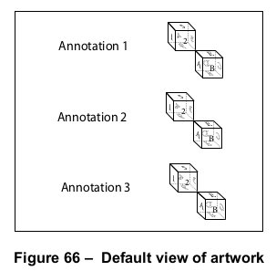

        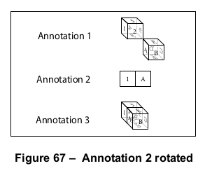

        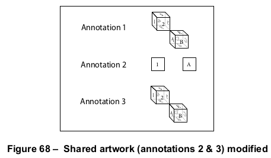
        
        这些图示展示了在 [13.5]“替代展示”中的示例如何使用。图 66 显示了所有三个注释中的相同初始艺术作品视图。图 67 显示了旋转注释 2 中艺术作品视图的结果。图 68 显示了操作由注释 2 和注释 3 共享的艺术作品的结果：它们都反映了艺术作品的更改，因为它们共享相同的运行时实例。注释 1 保持不变，因为它有自己的运行时实例。

    !!! note "注意"

        当多个注释引用相同的 3D 艺术作品实例时，该实例的状态按照 [13.6.2]“3D 注释”中描述的方式确定。

=== "英文"

    More than one 3D annotation may be associated with the same 3D artwork. There are two ways in which this association may occur, as determined by the annotation’s 3DD entry (see [Table 298](#table298)):
    
    - If the **3DD** entry specifies a 3D stream, the annotation shall have its own run-time instance of the 3D artwork. Any changes to the artwork shall be reflected only in this annotation. Other annotations that refer to the same stream shall have separate run-time instances.
    - If the **3DD** entry specifies a 3D reference dictionary (whose entries are shown in [Table 303](#table303)), the annotation shall have a run-time instance of the 3D artwork with all other annotations that specify the same reference dictionary. Any changes to the artwork shall be reflected in all such annotations.
            
    <table id="table303" markdown="span">
        <caption>**Table 303 – Entries in a 3D reference dictionary**</caption>
        <thead>
            <tr>
                <th>**Key**</th>
                <th>**Type**</th>
                <th>**Value**</th>
            </tr>
        </thead>
        <tbody>
            <tr>
                <td>**Type**</td> 
                <td>name</td>
                <td>(Optional) The type of PDF object that this dictionary describes; if present, shall be **3DRef** for a 3D reference dictionary.
                </td>
            </tr>
            <tr>
                <td>**3DD**</td> 
                <td>stream</td>
                <td>(Required) The 3D stream (see [13.6.3], “3D Streams”) containing the specification of the 3D artwork.
                </td>
            </tr>
        </tbody>
    </table>
    
    !!! info "EXAMPLE"
    
        The following example and Figure 66 through Figure 68 show three annotations that use the same 3D artwork. Object 100 (Annotation 1) has its own run-time instance of the 3D stream (object 200); object 101(Annotation 2) and object 102 (Annotation 3) share a run-time instance through the 3D reference dictionary (object 201).
    
        ```text
        100 0 obj                % 3D annotation 1
            << /Type /Annot
                /Subtype /3D
                /3DD 200 0 R    % Reference to the 3D stream containing the 3D artwork
            >
        endobj
        
        101 0 obj                % 3D annotation 2
            << /Type /Annot
                /Subtype /3D
                /3DD 201 0 R    % Reference to a 3D reference dictionary
            >>
        endobj
        
        102 0 obj                % 3D annotation 3
            << /Type /Annot
                /Subtype /3D
                /3DD 201 0 R     % Reference to the same 3D reference dictionary
            >>
        endobj
        
        200 0 obj                 % The 3D stream
            << /Type /3D
                /Subtype /U3D
                ... other keys related to a stream, such as /Length
            >>
            stream
                ... U3D data...
            endstream
        endobj
        
        201 0 obj                % 3D reference dictionary
            << /Type /3DRef
                /3DD 200 0 R     % Reference to the actual 3D artwork.
            >>
        endobj
        ```
    
        
    
        
    
        
        
        The figures show how the objects in the Example in [13.5], “Alternate Presentations,” might be used. Figure 66 shows the same initial view of the artwork in all three annotations. Figure 67 shows the results of rotating the view of the artwork within Annotation 2. Figure 68 shows the results of manipulating the artwork shared by Annotation 2 and Annotation 3: they both reflect the change in the artwork because they share the same run-time instance. Annotation 1 remains unchanged because it has its own run-time instance.
    
    !!! note "NOTE"
    
        When multiple annotations refer to the same instance of 3D artwork, the state of the instance is determined as described in [13.6.2], “3D Annotations.”

## 13.6.4 3D 视图

**13.6.4 3D Views**

### 13.6.4.1 概述

**13.6.4.1 General**

=== "中文"

    *3D 视图*（简称视图）指定应应用于与 3D 注释关联的虚拟相机的参数。这些参数可能包括相机的方向和位置、有关相机坐标投影到注释目标坐标系统的详细信息，以及描述艺术作品绘制背景的内容。从 PDF 1.7 开始，视图可以指定 3D 艺术作品的渲染、着色、光照和截面方式，而无需使用嵌入的 JavaScript。视图还可以指定哪些节点（3D 区域）应包含在视图中，以及这些节点是透明的还是不可见的。

    !!! note "注意 1"

        用户可以通过执行交互操作（例如自由旋转和平移）来操控视图。此外，3D 艺术作品可以包含一组预定义的视图，作者认为这些视图特别重要。例如，机械零件的图纸可能包含显示对象的顶部、底部、左侧、右侧、前面和背面的特定视图。

    一个 3D 流可以包含一组指定 3D 艺术作品的命名预设视图，如 **VA** 条目所示，该条目应为 3D 视图字典的数组。3D 视图字典中的条目如 [表 304](#table304) 所示。

    <table id="table304" markdown="span">
        <caption>**表 304 – 3D 视图字典中的条目**</caption>
        <thead>
            <tr>
                <th>**键**</th>
                <th>**类型**</th>
                <th>**值**</th>
            </tr>
        </thead>
        <tbody>
            <tr>
                <td>**Type**</td> 
                <td>name</td>
                <td>(可选) 此字典描述的 PDF 对象类型；如果存在，应为 **3DView**，表示 3D 视图字典。
                </td>
            </tr>
            <tr>
                <td>**XN**</td> 
                <td>text string</td>
                <td>(必需) 视图的外部名称，适用于用户界面的展示。
                </td>
            </tr>
            <tr>
                <td>**IN**</td> 
                <td>text string</td>
                <td>(可选) 视图的内部名称，用于从其他对象引用视图，例如“转到 3D 视图”操作（参见 [12.6.4.15]，“转到 3D 视图操作”）。
                </td>
            </tr>
            <tr>
                <td>**MS**</td> 
                <td>name</td>
                <td>(可选) 指定如何确定 3D 相机到世界变换矩阵的名称。有效值如下： <br/>
                    **M** 表示 **C2W** 条目应指定矩阵 **U3D** 表示由 **U3DPath** 条目选择的视图节点应指定矩阵。<br/>
                    如果省略，则使用 3D 艺术作品中指定的视图。
                </td>
            </tr>
            <tr>
                <td>**C2W**</td> 
                <td>array</td>
                <td>(如果 **MS** 的值为 **M**，则必需，否则忽略) 一个包含 12 个元素的 3D 变换矩阵，指定相机在世界坐标中的位置和方向。
                </td>
            </tr>
            <tr>
                <td>**U3DPath**</td> 
                <td>text string 或 array</td>
                <td>(如果 **MS** 的值为 **U3D**，则必需，否则忽略) 用于访问 3D 艺术作品中视图节点的一系列一个或多个文本字符串。数组中的第一个字符串是根视图节点的节点 ID，每个后续字符串是先前字符串指定的视图节点的子节点 ID。每个视图节点指定一个 3D 变换矩阵（参见 [13.6.5]，“3D 坐标系统”）；所有矩阵的拼接形成相机到世界的矩阵。符合要求的写入者应仅为此条目指定一个文本字符串，而非数组。<br/> <br/>
                    注意 &emsp; 不要将视图节点与节点混淆。视图节点是 3D 艺术作品中的一个参数，指定一个视图，而节点是指定 3D 图形对象或其集合的 PDF 字典。
                </td>
            </tr>
            <tr>
                <td>**CO**</td> 
                <td>number</td>
                <td>(可选；仅当 **MS** 存在时使用) 一个非负数，表示在相机坐标系统中沿 z 轴到该视图的轨道中心的距离；请参见此表后的讨论。如果此条目不存在，符合要求的读取者应确定轨道的中心。
                </td>
            </tr>
            <tr>
                <td>**P**</td> 
                <td>dictionary</td>
                <td>(可选) 一个投影字典（参见 [13.6.4.2]，“投影字典”），定义将 3D 艺术作品中的坐标（已经转换为相机坐标）投影到注释的目标坐标系统上的方式。<br/>
                    默认值：一个投影字典，其中 **Subtype** 的值为 **Perspective**，**FOV** 的值为 90，所有其他条目取默认值。
                </td>
            </tr>
            <tr>
                <td>**O**</td> 
                <td>stream</td>
                <td>(可选；仅当 **MS** 和 **P** 存在时有意义) 一个表单 XObject，用于在渲染的 3D 艺术作品上叠加 2D 图形（参见 [13.6.6]，“3D 标注”）。
                </td>
            </tr>
            <tr>
                <td>**BG**</td> 
                <td>dictionary</td>
                <td>(可选) 一个背景字典，定义将在其上绘制 3D 艺术作品的背景（参见 [13.6.4.3]，“3D 背景字典”）。默认值：一个背景字典，其条目取默认值。
                </td>
            </tr>
            <tr>
                <td>**RM**</td> 
                <td>dictionary</td>
                <td>(可选；PDF 1.7) 一个渲染模式字典，指定在使用此视图渲染 3D 艺术作品时使用的渲染模式（参见 [13.6.4.4]，“3D 渲染模式字典”）。如果省略，则使用 3D 艺术作品中指定的渲染模式。
                </td>
            </tr>
            <tr>
                <td>**LS**</td> 
                <td>dictionary</td>
                <td>(可选；PDF 1.7) 一个照明方案字典，指定在使用此视图渲染 3D 艺术作品时使用的照明方案（参见 [13.6.4.5]，“3D 照明方案字典”）。如果省略，则使用 3D 艺术作品中指定的照明方案。
                </td>
            </tr>
            <tr>
                <td>**SA**</td> 
                <td>array</td>
                <td>(可选；PDF 1.7) 一个数组，包含截面字典（参见 [13.6.4.6]，“3D 截面字典”）。每个截面字典为在使用此视图时将截面应用于 3D 艺术作品提供参数。空数组表示不显示任何截面。
                </td>
            </tr>
            <tr>
                <td>**NA**</td> 
                <td>array</td>
                <td>(可选；PDF 1.7；仅当 **NR** 存在时有意义) 一个数组，包含 3D 节点字典（参见 [13.6.4.7]，“3D 节点字典”）。每个节点字典可能包含更改节点状态的条目，包括其不透明度和在世界空间中的位置。此条目和 **NR** 条目指定如何更改每个节点的状态。<br/>
                    如果一个节点字典出现多次，则仅使用最后一个（使用深度优先遍历）。
                </td>
            </tr>
            <tr>
                <td>**NR**</td> 
                <td>boolean</td>
                <td>(可选；PDF 1.7) 指定是否在应用节点字典中指定的变换矩阵和不透明度设置之前，将 **NA** 数组中指定的节点恢复到其原始状态（如 3D 艺术作品中所指定）。如果为 **true**，则将恢复艺术作品的 3D 节点参数到原始状态，然后应用 **NA** 数组中指定的字典。如果为 **false**，则应用 **NA** 数组中指定的字典到节点的当前状态。<br/>
                    除了 3D 节点字典中指定的参数外，此标志还应应用于符合要求的读取器使用的任何运行时参数。<br/>
                    默认值：**false**
                </td>
            </tr>
        </tbody>
    </table>
    
    对于任何视图，符合规范的写入者可以提供特定于视图的 2D 内容，以覆盖在 3D 艺术作品上。**O** 条目指定了一个表单 XObject，该对象应覆盖在渲染的 3D 艺术作品上。表单 XObject 的坐标系应定义为与相机坐标系中的 (x, y, 0) 平面相同（参见 [13.6.5]，“3D 坐标系统”）。

    使用 **O** 条目时，需要遵守以下限制。

    !!! note "NOTE 2"

        未遵守这些限制可能导致覆盖图层与渲染的 3D 图形错位：

        - 只能在同时具有相机到世界变换矩阵（**MS** 及相关条目）和投影字典（**P** 条目）的 3D 视图字典中指定。
        - 表单 XObject 应与特定视图相关联（而不是与 3D 视图字典定义的相机位置相关联）。符合规范的读者应该仅在用户通过 3D 视图进行导航时绘制它，而不是在用户通过手动方式导航到相同的方向时绘制它。
        - 符合规范的读者应仅在用户未调用任何改变艺术作品到世界变换矩阵的操作时绘制它。

    **CO** 条目指定了从相机到 3D 视图轨道中心的距离，即在执行轨道样式导航时，相机将围绕此点旋转。图 69 说明了绕轨道中心旋转时的相机定位。

    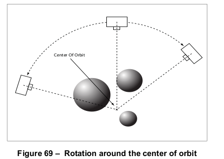

    !!! note "NOTE 3"

        **LS** 条目允许在不更改艺术作品本身的情况下改变 3D 艺术作品的光照。这使得消费者可以在不需要多个仅在光照上不同的 3D 艺术作品流的情况下，以多种光照选项查看某一特定的 3D 艺术作品。它还使得在原始内容无法重新编写的情况下，可以修正光照差的艺术作品。参见 [13.6.4.5]，“3D 光照方案字典”。
        
        **SA** 条目提供了交叉截面信息，用于在关联的视图激活时裁剪 3D 艺术作品。这使得视图作者在指出特定视图的关注区域时更加清晰，这些区域可能在其他情况下被完全遮蔽。参见 [13.6.4.6]，“3D 截面字典”。
        
        **NR** 和 **NA** 条目旨在提供给定状态下 3D 艺术作品的更准确表示。这些键为视图作者提供了更细粒度的控制，能够以特定方式操控呈现的艺术作品。它们还提供了一种在交互功能（如关键帧动画和 JavaScript）可能引起的变化后，将节点参数恢复到已知状态的方式。参见 [13.6.4.7]，“3D 节点字典”。

=== "英文"

    A *3D view* (or simply view) specifies parameters that shall be applied to the virtual camera associated with a 3D annotation. These parameters may include orientation and position of the camera, details regarding the projection of camera coordinates into the annotation’s target coordinate system, and a description of the background on which the artwork shall be drawn. Starting with PDF 1.7, views may specify how 3D artwork is rendered, coloured, lit, and cross-sectioned, without the use of embedded JavaScript. Views may also specify which nodes (three-dimensional areas) of 3D artwork shall be included in a view and whether those nodes are opaque or invisible.
    
    !!! note "NOTE 1"
    
        Users can manipulate views by performing interactive operations such as free rotation and translation. In addition, 3D artwork can contain a set of predefined views that the author deems to be of particular interest. For example, a mechanical drawing of a part may have specific views showing the top, bottom, left, right, front, and back of an object.
    
    A 3D stream may contain a list of named preset views of the 3D artwork, as specified by the **VA** entry, which shall be an array of 3D view dictionaries. The entries in a 3D view dictionary are shown in [Table 304](#table304).
                
    <table id="table304" markdown="span">
        <caption>**Table 304 – Entries in a 3D view dictionary**</caption>
        <thead>
            <tr>
                <th>**Key**</th>
                <th>**Type**</th>
                <th>**Value**</th>
            </tr>
        </thead>
        <tbody>
            <tr>
                <td>**Type**</td> 
                <td>name</td>
                <td>(Optional) The type of PDF object that this dictionary describes; if present, shall be **3DView** for a 3D view dictionary.
                </td>
            </tr>
            <tr>
                <td>**XN**</td> 
                <td>text string</td>
                <td>(Required) The external name of the view, suitable for presentation in a user interface.
                </td>
            </tr>
            <tr>
                <td>**IN**</td> 
                <td>text string</td>
                <td>(Optional) The internal name of the view, used to refer to the view from other objects, such as the go-to-3D-view action (see [12.6.4.15], “Go-To- 3D-View Actions”).
                </td>
            </tr>
            <tr>
                <td>**MS**</td> 
                <td>name</td>
                <td>(Optional) A name specifying how the 3D camera-to-world transformation matrix shall be determined. The following values are valid: <br/>
                    **M** Indicates that the **C2W** entry shall specify the matrix **U3D** Indicates that the view node selected by the **U3DPath** entry shall specify the matrix.<br/>
                    If omitted, the view specified in the 3D artwork shall be used.
                </td>
            </tr>
            <tr>
                <td>**C2W**</td> 
                <td>array</td>
                <td>(Required if the value of **MS** is **M**, ignored otherwise) A 12-element 3D transformation matrix that specifies a position and orientation of the camera in world coordinates.
                </td>
            </tr>
            <tr>
                <td>**U3DPath**</td> 
                <td>text string or array</td>
                <td>(Required if the value of **MS** is **U3D**, ignored otherwise) A sequence of one or more text strings used to access a view node within the 3D artwork. The first string in the array is a node ID for the root view node, and each subsequent string is the node ID for a child of the view node specified by the prior string. Each view node specifies a 3D transformation matrix (see [13.6.5], “Coordinate Systems for 3D”); the concatenation of all the matrices forms the camera-to-world matrix. Conforming writers should specify only a single text string, not an array, for this entry. <br/> <br/>
                    NOTE &emsp; Do not confuse View Nodes with nodes. A View Node is a parameter in the 3D artwork that specifies a view, while a node is a PDF dictionary that specifies 3D graphic objects or collections thereof.
                </td>
            </tr>
            <tr>
                <td>**CO**</td> 
                <td>number</td>
                <td>(Optional; used only if **MS** is present) A non-negative number indicating a distance in the camera coordinate system along the z axis to the center of orbit for this view; see discussion following this Table. If this entry is not present, the conforming reader shall determine the center of orbit.
                </td>
            </tr>
            <tr>
                <td>**P**</td> 
                <td>dictionary</td>
                <td>(Optional) A projection dictionary (see [13.6.4.2], “Projection Dictionaries”) that defines the projection of coordinates in the 3D artwork (already transformed into camera coordinates) onto the target coordinate system of the annotation. <br/>
                    Default value: a projection dictionary where the value of **Subtype** is **Perspective**, the value of **FOV** is 90, and all other entries take their default values.
                </td>
            </tr>
            <tr>
                <td>**O**</td> 
                <td>stream</td>
                <td>(Optional; meaningful only if **MS** and **P** are present) A form XObject that shall be used to overlay 2D graphics on top of the rendered 3D artwork (see [13.6.6], “3D Markup”).
                </td>
            </tr>
            <tr>
                <td>**BG**</td> 
                <td>dictionary</td>
                <td>(Optional) A background dictionary that defines the background over which the 3D artwork shall be drawn (see [13.6.4.3], “3D Background Dictionaries”). Default value: a background dictionary whose entries take their default values.
                </td>
            </tr>
            <tr>
                <td>**RM**</td> 
                <td>dictionary</td>
                <td>(Optional; PDF 1.7) A render mode dictionary that specifies the render mode to use when rendering 3D artwork with this view (see [13.6.4.4], “3D Render Mode Dictionaries”). If omitted, the render mode specified in the 3D artwork shall be used.
                </td>
            </tr>
            <tr>
                <td>**LS**</td> 
                <td>dictionary</td>
                <td>(Optional; PDF 1.7) A lighting scheme dictionary that specifies the lighting scheme to be used when rendering 3D artwork with this view (see [13.6.4.5], “3D Lighting Scheme Dictionaries”). If omitted, the lighting scheme specified in the 3D artwork shall be used.
                </td>
            </tr>
            <tr>
                <td>**SA**</td> 
                <td>array</td>
                <td>(Optional; PDF 1.7) An array that contains cross section dictionaries (see [13.6.4.6], “3D Cross Section Dictionaries”). Each cross section dictionary provides parameters for applying a cross section to the 3D artwork when using this view. An empty array signifies that no cross sections shall be displayed.
                </td>
            </tr>
            <tr>
                <td>**NA**</td> 
                <td>array</td>
                <td>(Optional; PDF 1.7; meaningful only if **NR** is present) An array that contains 3D node dictionaries (see [13.6.4.7], “3D Node Dictionaries”). Each node dictionary may contain entries that change the node’s state, including its opacity and its position in world space. This entry and the **NR** entry specify how the state of each node shall be changed. <br/>
                    If a node dictionary is present more than once, only the last such dictionary (using a depth-first traversal) shall be used.
                </td>
            </tr>
            <tr>
                <td>**NR**</td> 
                <td>boolean</td>
                <td>(Optional; PDF 1.7) Specifies whether nodes specified in the **NA** array shall be returned to their original states (as specified in the 3D artwork) before applying transformation matrices and opacity settings specified in the node dictionaries. If **true**, the artwork’s 3D node parameters shall be restored to their original states and then the dictionaries specified by the **NA** array shall be applied. If **false**, the dictionaries specified by the **NA** array shall be applied to the current states of the nodes. <br/>
                    In addition to the parameters specified by a 3D node dictionary, this flag should also apply to any runtime parameters used by a conforming reader.<br/>
                    Default value: **false**
                </td>
            </tr>
        </tbody>
    </table>
    
    For any view, the conforming writer may provide 2D content specific to the view, to be drawn on top of the 3D artwork. The **O** entry specifies a form XObject that shall be overlaid on the rendered 3D artwork. The coordinate system of the form XObject shall be defined to be the same as the (x, y, 0) plane in the camera coordinate system (see [13.6.5], “Coordinate Systems for 3D”).
    
    Use of the O entry is subject to the following restrictions.
    
    !!! note "NOTE 2"
    
        Failure to abide by them could result in misalignment of the overlay with the rendered 3D graphics:
    
        - It may be specified only in 3D view dictionaries in which both a camera-to-world matrix (**MS** and associated entries) and a projection dictionary (the **P** entry) are present.
        - The form XObject shall be associated with a specific view (not with the camera position de- fined by the 3D view dictionary). The conforming reader should draw it only when the user navigates using the 3D view, not when the user happens to navigate to the same orientation by manual means.
        - The confirming reader should draw it only if the user has not invoked any actions that alter the artwork-to-world matrix.
    
    The **CO** entry specifies the distance from the camera to the center of orbit for the 3D view, which is the point around which the camera shall rotate when performing an orbit-style navigation. Figure 69 illustrates camera positioning when orbiting around the center of orbit.
    
    
    
    !!! note "NOTE 3"
    
        The **LS** entry allows the lighting of the 3D artwork to be changed without changing the artwork itself. This enables consumers to view a given piece of 3D artwork with a variety of lighting options without requiring multiple copies of the 3D artwork stream that differ only in lighting. It also enables artwork with poor lighting to be corrected in cases where the original content cannot be re-authored. See [13.6.4.5], “3D Lighting Scheme Dictionaries.”
        
        The **SA** entry provides cross section information for clipping 3D artwork while its associated view is active. This allows view authors to be more clear in calling out the intended areas of interest for a particular view, some of which might otherwise be completely obscured. See [13.6.4.6], “3D Cross Section Dictionaries.”
        
        The **NR** and **NA** entries are meant to give a more accurate representation of the 3D artwork at a given state. These keys give view authors finer granularity in manipulating the artwork to be presented in a particular way. They also provide a means for returning node parameters to a known state after potential changes by interactive features such as keyframe animations and JavaScript. See [13.6.4.7], “3D Node Dictionaries.”

### 13.6.4.2 投影字典

**13.6.4.2 Projection Dictionaries**

=== "中文"

    *投影字典*（参见 [表 305](#table305)）定义了 3D 相机坐标到注释目标坐标系统的映射。每个 3D 视图可以通过其 **P** 条目指定一个投影字典。

    !!! note "NOTE"

        尽管视图节点可以指定投影信息，但 PDF 消费者会忽略它，而优先使用投影字典中的信息。

    PDF 1.6 引入了 *近/远裁剪*。这种裁剪类型定义了一个近平面和一个远平面（如图 70 所示）。超出远平面或比近平面更靠近相机的对象或对象部分将不被绘制。3D 对象应投影到近平面上，然后在注释的目标坐标系统内缩放和定位，如 [表 305](#table305) 所述。

    <table id="table305" markdown="span">
        <caption>**表 305 – 投影字典中的条目**</caption>
        <thead>
            <tr>
                <th>**键**</th>
                <th>**类型**</th>
                <th>**值**</th>
            </tr>
        </thead>
        <tbody>
            <tr>
                <td>**Subtype**</td> 
                <td>名称</td>
                <td>（必需）投影的类型。有效值应为 **O**（正射投影）或 **P**（透视投影）。
                </td>
            </tr>
            <tr>
                <td>**CS**</td> 
                <td>名称</td>
                <td>（可选）裁剪样式。有效值应为 **XNF**（显式近/远裁剪）或 **ANF**（自动近/远裁剪）。默认值：**ANF**。
                </td>
            </tr>
            <tr>
                <td>**F**</td> 
                <td>数字</td>
                <td>（可选；仅在 **CS** 为 **XNF** 时有意义）远裁剪距离，以相机坐标系统表示。z 坐标大于此条目值的对象部分将不被绘制。如果此条目缺失，则不进行远裁剪。
                </td>
            </tr>
            <tr>
                <td>**N**</td> 
                <td>数字</td>
                <td>（仅在 **CS** 为 **XNF** 时有意义；如果 **Subtype** 为 **P**，则必需）近裁剪距离，以相机坐标系统表示。z 坐标小于此条目值的对象部分将不被绘制。如果 **Subtype** 为 **P**，该值应为正数；如果 **Subtype** 为 **O**，该值应为非负数，默认值为 0。
                </td>
            </tr>
            <tr>
                <td>**FOV**</td> 
                <td>数字</td>
                <td>（如果 **Subtype** 为 **P**，则必需；否则忽略）一个介于 0 和 180 之间的数字（包括 0 和 180），指定虚拟相机的视场角，单位为度。它定义了一个围绕 z 轴的 3D 空间中的锥形区域，锥形与近裁剪平面的交点形成一个圆。该圆与 **PS** 的值一起，指定了投影艺术作品在注释的 2D 平面中渲染时的缩放比例。
                </td>
            </tr>
            <tr>
                <td>**PS**</td> 
                <td>数字或名称</td>
                <td>（可选；仅在 **Subtype** 为 **P** 时有意义）一个对象，指定将 3D 艺术作品投影到注释目标坐标系统时使用的缩放比例。它定义了近平面与锥形交点所形成的圆的直径。该值可以是以下之一：<br/> <br/>
                • 一个正数，明确指定该直径作为注释目标坐标系统中的距离。<br/>
                • 一个名称，指定直径应设置为注释 3D 视图框的宽度 (**W**)、高度 (**H**)、宽度和高度的最小值 (**Min**) 或最大值 (**Max**)。<br/><br/>
                默认值：**W**。
                </td>
            </tr>
            <tr>
                <td>**OS**</td> 
                <td>数字</td>
                <td>（可选；仅在 **Subtype** 为 **O** 时有意义）一个正数，指定在将 3D 艺术作品投影到注释目标坐标系统时，应用于 x 和 y 坐标的缩放因子（z 坐标被丢弃）。默认值：1。
                </td>
            </tr>
            <tr>
                <td>**OB**</td> 
                <td>名称</td>
                <td>（可选；PDF 1.7；仅在 **Subtype** 为 **O** 时有意义）一个名称，指定绑定（缩放适应）近平面 x 和 y 坐标到注释目标坐标系统的策略。此条目指定的缩放将加在 **OS** 条目指定的缩放因子之上。该值可以是以下之一：<br/> <br/>
                    **W** &emsp; 缩放以适应注释的宽度 <br/>
                    **H** &emsp; 缩放以适应注释的高度 <br/>
                    **Min** &emsp; 缩放以适应注释的宽度或高度的较小值 <br/>
                    **Max** &emsp; 缩放以适应注释的宽度或高度的较大值 <br/>
                    **Absolute** &emsp; 不应进行缩放。<br/><br/>
                    默认值：**Absolute**。
                </td>
            </tr>
        </tbody>
    </table>

    **CS** 条目定义了近远平面如何确定。**XNF** 的值表示 **N** 和 **F** 条目明确指定了近平面和远平面的 z 坐标。**ANF** 的值表示近远平面应根据艺术作品中的对象自动确定。

    **Subtype** 条目指定了投影类型，决定了对象如何投影到近平面并进行缩放。有效值为 **O**（正射投影）和 **P**（透视投影）。

    对于正射投影，对象应通过简单地丢弃它们的 z 值投影到近平面。它们应根据 **OS** 条目和 **OB** 条目指定的缩放因子，从近平面坐标系统的单位缩放到注释目标坐标系统的单位。

    对于透视投影，给定坐标 (x, y, z) 应投影到近平面上，使用以下公式定义一个 2D 坐标 (x1, y1)：

    $x_1 = x \times \frac{n}{z}$

    $x_1 = x \times \frac{n}{z}$

    其中 *n* 是近平面的 z 坐标。

    透视投影的缩放比正射投影更复杂。**FOV** 条目指定了一个角度，定义了相机坐标系统中围绕 z 轴的锥形区域（参见图 70）。锥形与近平面相交，形成近平面上的一个圆。图 71 显示了这个圆和从相机位置看到的图形。

    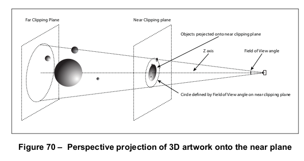

    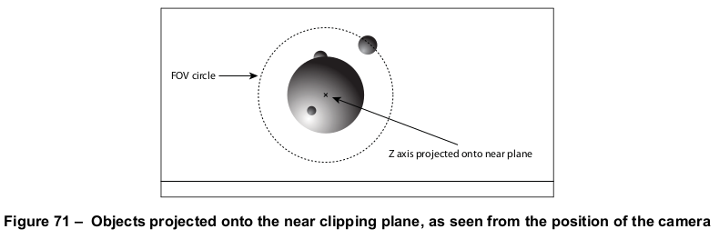

    **PS** 条目指定了当投影到近平面上的图形在注释的 3D 视图框中渲染时，这个圆的直径（参见图 72）。尽管圆的直径决定了缩放因子，但圆外的图形也应显示，只要它们适合在视图框内，如图所示。

    图 73 显示了整个 3D 注释。在这种情况下，3D 视图框比注释的矩形要小，矩形内还包含视图框外的 2D 内容。
    
    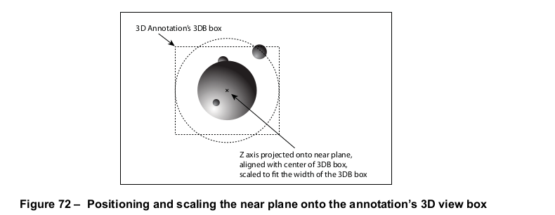
    
    
    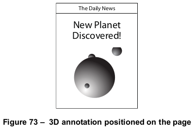

=== "英文"

    A *projection dictionary* (see [Table 305](#table305)) defines the mapping of 3D camera coordinates onto the target
    coordinate system of the annotation. Each 3D view may specify a projection dictionary by means of its **P** entry.
    
    !!! note "NOTE"
    
        Although view nodes can specify projection information, PDF consumers ignore it in favour of information in the projection dictionary.
    
    PDF 1.6 introduces *near/far clipping*. This type of clipping defines a near plane and a far plane (as shown in Figure 70). Objects, or parts of objects, that are beyond the far plane or closer to the camera than the near plane are not drawn. 3D objects shall be projected onto the near plane and then scaled and positioned within the annotation’s target coordinate system, as described [Table 305](#table305).
                    
    <table id="table305" markdown="span">
        <caption>**Table 305 – Entries in a projection dictionary**</caption>
        <thead>
            <tr>
                <th>**Key**</th>
                <th>**Type**</th>
                <th>**Value**</th>
            </tr>
        </thead>
        <tbody>
            <tr>
                <td>**Subtype**</td> 
                <td>name</td>
                <td>(Required) The type of projection. Valid values shall be **O** (orthographic) or **P** (perspective).
                </td>
            </tr>
            <tr>
                <td>**CS**</td> 
                <td>name</td>
                <td>(Optional) The clipping style. Valid values shall be **XNF** (explicit near/far) or **ANF** (automatic near/far). Default value: **ANF**.
                </td>
            </tr>
            <tr>
                <td>**F**</td> 
                <td>number</td>
                <td>(Optional; meaningful only if the value of **CS** is **XNF**) The far clipping distance, expressed in the camera coordinate system. No parts of objects whose z coordinates are greater than the value of this entry are drawn. If this entry is absent, no far clipping occurs.
                </td>
            </tr>
            <tr>
                <td>**N**</td> 
                <td>number</td>
                <td>(Meaningful only if the value of **CS** is **XNF**; required if the value of **Subtype** is **P**) The near clipping distance, expressed in the camera coordinate system. No parts of objects whose z coordinates are less than the value of this entry are drawn. If **Subtype** is **P**, the value shall be positive; if **Subtype** is **O**, the value shall be non-negative, and the default value is 0.
                </td>
            </tr>
            <tr>
                <td>**FOV**</td> 
                <td>number</td>
                <td>(Required if **Subtype** is **P**, ignored otherwise) A number between 0 and 180, inclusive, specifying the field of view of the virtual camera, in degrees. It defines a cone in 3D space centered around the z axis and a circle where the cone intersects the near clipping plane. The circle, along with the value of **PS**, specify the scaling of the projected artwork when rendered in the 2D plane of the annotation.
                </td>
            </tr>
            <tr>
                <td>**PS**</td> 
                <td>number or name</td>
                <td>(Optional; meaningful only if **Subtype** is **P**) An object that specifies the scaling used when projecting the 3D artwork onto the annotation’s target coordinate system. It defines the diameter of the circle formed by the intersection of the near plane and the cone specified by **FOV**. The value may be one of the following: <br/> <br/>
                • A positive number that explicitly specifies the diameter as a distance in the annotation’s target coordinate system. <br/>
                • A name specifying that the diameter shall be set to the width (**W**), height (**H**), minimum of width and height (**Min**), or maximum of width and height (**Max**) of the annotation’s 3D view box. <br/><br/>
                Default value: **W**.
                </td>
            </tr>
            <tr>
                <td>**OS**</td> 
                <td>number</td>
                <td>(Optional; meaningful only if **Subtype** is **O**) A positive number that specifies the scale factor to be applied to both the x and y coordinates when projecting onto the annotation’s target coordinate system (the z coordinate is discarded). Default value: 1.
                </td>
            </tr>
            <tr>
                <td>**OB**</td> 
                <td>name</td>
                <td>(Optional; PDF 1.7; meaningful only if Subtype is **O**) A name that specifies a strategy for binding (scaling to fit) the near plane’s x and y coordinates onto the annotation’s target coordinate system. The scaling specified in this entry shall be applied in addition to the scaling factor specified by the **OS** entry. The value may be one of the following: <br/> <br/>
                    **W** &emsp; Scale to fit the width of the annotation <br/>
                    **H** &emsp; Scale to fit the height of the annotation <br/>
                    **Min** &emsp; Scale to fit the lesser of width or height of the annotation <br/>
                    **Max** &emsp; Scale to fit the greater of width or height of the annotation <br/>
                    **Absolute** &emsp; No scaling should occur due to binding. <br/><br/>
                    Default value: **Absolute**.
                </td>
            </tr>
        </tbody>
    </table>
    
    The **CS** entry defines how the near and far planes are determined. A value of **XNF** means that the **N** and **F** entries explicitly specify the z coordinate of the near and far planes, respectively. A value of **ANF** for **CS** means that the near and far planes shall be determined automatically based on the objects in the artwork.
    
    The **Subtype** entry specifies the type of projection, which determines how objects are projected onto the near plane and scaled. The possible values are **O** for orthographic projection and **P** for perspective projection.
    
    For orthographic projection, objects shall be projected onto the near plane by simply discarding their z value. They shall be scaled from units of the near plane’s coordinate system to those of the annotation’s target coordinate system by the combined factors specified by the **OS** entry and the **OB** entry.
    
    For perspective projection, a given coordinate (x, y, z) shall be projected onto the near plane, defining a 2D coordinate (x1, y1) using the following formulas:
    
    $x_1 = x \times \frac{n}{z}$
    
    $x_1 = x \times \frac{n}{z}$
    
    where *n* is the z coordinate of the near plane.
    
    Scaling with perspective projection is more complicated than for orthographic projection. The **FOV** entry specifies an angle that defines a cone centered along the z axis in the camera coordinate system (see Figure 70). The cone intersects with the near plane, forming a circular area on the near plane. Figure 71 shows this circle and graphics from the position of the camera.
    
    
    
    
    
    
    The **PS** entry specifies the diameter that this circle will have when the graphics projected onto the near plane are rendered in the annotation’s 3D view box (see Figure 72). Although the diameter of the circle determines the scaling factor, graphics outside the circle shall also be displayed, providing they fit within the view box, as seen in the figure.
    
    Figure 73 shows the entire 3D annotation. In this case, the 3D view box is smaller than the annotation’s rectangle, which also contains 2D content outside the 3D view box.
    
    
    
    
    

### 13.6.4.3 3D 背景字典

**13.6.4.3 3D Background Dictionaries**

=== "中文"

    *3D 背景字典*定义了 3D 视图应绘制的背景。表 306 显示了背景字典中的条目。目前，仅支持单一的不透明颜色，颜色应在 **DeviceRGB** 颜色空间中定义。3D 艺术作品可能包括透明对象；然而，这些对象与注释下方绘制的对象之间没有交互。实际上，3D 艺术作品及其背景形成了一个透明度组，其合成结果具有不透明度为 1（参见 [11](../c11/index.md)， "透明度"）。

    !!! note "NOTE"

        注释的正常外观在表示 3D 艺术作品时应具有相同的透明度行为。这不适用于外观用于其他目的时，例如兼容性警告信息。

    <table id="table306" markdown="span">
        <caption>**表 306 – 3D 背景字典中的条目**</caption>
        <thead>
            <tr>
                <th>**键**</th>
                <th>**类型**</th>
                <th>**值**</th>
            </tr>
        </thead>
        <tbody>
            <tr>
                <td>**Type**</td> 
                <td>名称</td>
                <td>（可选）此字典描述的 PDF 对象类型；如果存在，应为 3DBG，表示 3D 背景字典。
                </td>
            </tr>
            <tr>
                <td>**Subtype**</td> 
                <td>名称</td>
                <td>（可选）背景的类型。唯一有效的值应为 SC（纯色），表示单一的不透明颜色。默认值：SC。
                </td>
            </tr>
            <tr>
                <td>**CS**</td> 
                <td>名称或数组</td>
                <td>（可选）背景的颜色空间。唯一有效的值应为 **DeviceRGB**。默认值：**DeviceRGB**。<br/>
                    PDF 消费者应准备好遇到未来版本的 PDF 可能支持的其他值。
                </td>
            </tr>
            <tr>
                <td>**C**</td> 
                <td>（各种类型）</td>
                <td>（可选）背景的颜色，采用由 **CS** 定义的颜色空间表示。默认值：数组 [1 1 1]，表示当 **CS** 为 **DeviceRGB** 时的白色。
                </td>
            </tr>
            <tr>
                <td>**EA**</td> 
                <td>布尔值</td>
                <td>（可选）如果为 **true**，背景将应用于整个注释；如果为 **false**，背景将仅应用于注释的 3D 视图框所指定的矩形（表 298 中的 **3DB** 条目）。默认值：**false**。
                </td>
            </tr>
        </tbody>
    </table>

=== "英文"

    A *3D background dictionary* defines the background over which a 3D view shall be drawn.Table 306 shows the entries in a background dictionary. Currently, only a single opaque colour is supported, where the colour shall be defined in the **DeviceRGB** colour space. 3D artwork may include transparent objects; however, there is no interaction between such objects and objects drawn below the annotation. In effect, the 3D artwork and its background form a transparency group whose flattened results have an opacity of 1 (see [11](../c11/index.md), “Transparency”).
    
    !!! note "NOTE"
    
        An annotation’s normal appearance should have the same behaviour with respect to transparency when the appearance is intended to depict the 3D artwork. This does not apply when the appearance is used for another purpose, such as a compatibility warning message.
    
    <table id="table306" markdown="span">
        <caption>**Table 306 – Entries in a 3D background dictionary**</caption>
        <thead>
            <tr>
                <th>**Key**</th>
                <th>**Type**</th>
                <th>**Value**</th>
            </tr>
        </thead>
        <tbody>
            <tr>
                <td>**Type**</td> 
                <td>name</td>
                <td>(Optional) The type of PDF object that this dictionary describes; if present, shall be 3DBG for a 3D background dictionary.
                </td>
            </tr>
            <tr>
                <td>**Subtype**</td> 
                <td>name</td>
                <td>(Optional) The type of background. The only valid value shall be SC (solid colour), which indicates a single opaque colour. Default value: SC.
                </td>
            </tr>
            <tr>
                <td>**CS**</td> 
                <td>name or array</td>
                <td>(Optional) The colour space of the background. The only valid value shall be the name **DeviceRGB**. Default value: **DeviceRGB**. <br/>
                    PDF consumers shall be prepared to encounter other values that may be supported in future versions of PDF.
                </td>
            </tr>
            <tr>
                <td>**C**</td> 
                <td>(various)</td>
                <td>(Optional) The colour of the background, in the colour space defined by **CS**. Default value: an array [1 1 1] representing the colour white when the value of **CS** is **DeviceRGB**.
                </td>
            </tr>
            <tr>
                <td>**EA**</td> 
                <td>boolean</td>
                <td>(Optional) If **true**, the background shall apply to the entire annotation; if **false**, the background shall apply only to the rectangle specified by the annotation’s 3D view box (the **3DB** entry in Table 298). Default value: **false**.
                </td>
            </tr>
        </tbody>
    </table>

### 13.6.4.4 3D 渲染模型字典

**13.6.4.4 3D Render Mode Dictionaries**

=== "中文"

    3D *渲染模式字典*（PDF 1.7）指定了 3D 艺术作品应如何渲染。

    !!! note "NOTE 1"

        表面可以填充不透明颜色，也可以按“线框”方式描边，或者使用特殊的光照效果来渲染艺术作品。

    !!! note "NOTE 2"

        渲染模式字典使文档作者能够自定义 3D 艺术作品的渲染外观，以满足预期消费者的需求，而无需重新创作艺术作品。对于严格关注几何形状的符合要求的读者，使用 **线框** 或 **点** 风格渲染的复杂艺术作品可能在没有纹理和光照效果的额外开销下具有更好的性能。用于打印文档中的艺术作品，在使用 **插图** 渲染模式风格时，可能会有更集成的感觉。

    **RM** 条目在 3D 视图字典中可以指定一个 3D 渲染模式字典。

    [表 307](#table307) 显示了渲染模式字典中的条目。

    <table id="table307" markdown="span">
        <caption>**表 307 – 渲染模式字典中的条目**</caption>
        <thead>
            <tr>
                <th>**键**</th>
                <th>**类型**</th>
                <th>**值**</th>
            </tr>
        </thead>
        <tbody>
            <tr>
                <td>**Type**</td> 
                <td>名称</td>
                <td>（可选）此字典描述的 PDF 对象类型；如果存在，应为 **3DRenderMode**。
                </td>
            </tr>
            <tr>
                <td>**Subtype**</td> 
                <td>名称</td>
                <td>（必选）此字典描述的渲染模式类型；具体值请参见 [表 308](#table308)。如果遇到无法识别的值，则该渲染模式字典应被忽略。
                </td>
            </tr>
            <tr>
                <td>**AC**</td> 
                <td>数组</td>
                <td>（可选）指定渲染 3D 图像时应使用的辅助颜色的数组。数组中的第一个条目应为颜色空间，后续条目应为在该颜色空间中指定的颜色值。此条目的解释取决于 **Subtype** 条目指定的渲染模式，但通常用于指定绘制点或边缘的颜色。<br/>
                    唯一有效的颜色空间应为 **DeviceRGB**。如果指定的颜色空间不是 **DeviceRGB**，则该条目将被忽略，并使用默认值。<br/>
                    默认值：**[/DeviceRGB 0 0 0]**，表示黑色。
                </td>
            </tr>
            <tr>
                <td>**FC**</td> 
                <td>名称或数组</td>
                <td>（可选）指定渲染 3D 图像时应使用的面颜色的名称或数组。此条目仅在 **Subtype** 值为 **插图** 时相关。<br/><br/>
                    如果 **FC** 的值是数组，数组中的第一个条目应为颜色空间，后续条目应为在该颜色空间中指定的颜色值。唯一有效的颜色空间是 **DeviceRGB**。任何非 **DeviceRGB** 的颜色空间将被忽略，使用默认值。<br/><br/>
                    如果 **FC** 的值是名称，则应描述颜色。唯一有效的名称值应为 **BG**，表示当前用于显示艺术作品的背景颜色。如果遇到除 **BG** 以外的名称，则该条目将被忽略，并使用主机注释的背景颜色（参见 [表 189](../c12/s5.md#table189)）。<br/><br/>
                    默认值：**BG**
                </td>
            </tr>
            <tr>
                <td>**O**</td> 
                <td>数字</td>
                <td>（可选）指定某些渲染模式应用的附加透明度，使用标准加法混合。<br/>
                    默认值：0.5
                </td>
            </tr>
            <tr>
                <td>**CV**</td> 
                <td>数字</td>
                <td>（可选）指定在确定轮廓边缘时使用的角度（单位：度）。如果两个前向面共享一条边，并且这些面的法线之间的角度大于或等于折痕值，则该共享边应被视为轮廓边缘。<br/>
                    默认值：45
                </td>
            </tr>
        </tbody>
    </table>

    对于添加透明度的渲染模式，**O** 条目指定应使用的附加透明度。所有这些透明度效果都使用标准加法混合模式。<br/>

    **CV** 条目设置在确定轮廓边缘时使用的折痕值，可用于调整插图渲染模式的外观。如果两个面共享一条边，则如果满足以下条件之一，该边应被视为轮廓边缘：

    - 一面为前向面，另一面为后向面。
    - 两个面的角度大于或等于折痕值。

    表 308 描述了可以在渲染模式字典中指定的渲染模式。
        
    <table id="table308" markdown="span">
        <caption>**表 308 – 渲染模式**</caption>
        <thead>
            <tr>
                <th>**模式**</th>
                <th>**描述**</th>
            </tr>
        </thead>
        <tbody>
            <tr><td>**Solid**</td> <td>显示有纹理和光照的几何形状。对于符合 *Universal 3D File Format* 规范的艺术作品，这些形状为三角形。**AC** 条目将被忽略。</td></tr>
            <tr><td>**SolidWireframe**</td> <td>显示有纹理和光照的几何形状（三角形），并在其上显示单一颜色的边缘。边缘的颜色由 **AC** 条目决定。</td></tr>
            <tr><td>**Transparent**</td> <td>显示有纹理和光照的几何形状（三角形），并增加透明度。**AC** 条目将被忽略。</td></tr>
            <tr><td>**TransparentWireframe**</td> <td>显示有纹理和光照的几何形状（三角形），并增加透明度，在其上显示单一颜色的不透明边缘。边缘的颜色由 **AC** 条目决定。</td></tr>
            <tr><td>**BoundingBox**</td> <td>显示每个节点的边界框边缘，与该节点的局部坐标空间的轴对齐。边界框的颜色由 **AC** 条目决定。</td></tr>
            <tr><td>**TransparentBoundingBox**</td> <td>显示每个节点的边界框面，与该节点的局部坐标空间的轴对齐，并增加透明度。边界框面的颜色由 **FC** 条目决定。</td></tr>
            <tr><td>**TransparentBoundingBoxOutline**</td> <td>显示每个节点的边界框边缘和面，与该节点的局部坐标空间的轴对齐，并增加透明度。边界框边缘的颜色由 **AC** 条目决定。边界框面的颜色由 **FC** 条目决定。</td></tr> 
            <tr><td>**Wireframe**</td> <td>仅显示单一颜色的边缘。边缘的颜色由 **AC** 条目决定。</td></tr>
            <tr><td>**ShadedWireframe**</td> <td>仅显示边缘，但在其两个顶点之间插值其颜色并应用光照。**AC** 条目将被忽略。</td></tr>
            <tr><td>**HiddenWireframe**</td> <td>显示单一颜色的边缘，但去除后向和遮挡的边缘。边缘的颜色由 **AC** 条目决定。</td></tr>
            <tr><td>**Vertices**</td> <td>仅显示单一颜色的顶点。点的颜色由 **AC** 条目决定。</td></tr>
            <tr><td>**ShadedVertices**</td> <td>仅显示顶点，但使用顶点颜色并应用光照。**AC** 条目将被忽略。</td></tr>
            <tr><td>**Illustration**</td> <td>显示轮廓边缘和表面，去除遮挡的线条。边缘的颜色由 **AC** 条目决定，表面的颜色由 **FC** 条目决定。</td></tr>
            <tr><td>**SolidOutline**</td> <td>显示轮廓边缘和有光照和纹理的表面，去除遮挡的线条。边缘的颜色由 **AC** 条目决定。</td></tr>
            <tr><td>**ShadedIllustration**</td> <td>显示轮廓边缘和有光照和纹理的表面，并增加发射项以去除艺术作品中光照不足的区域。边缘的颜色由 **AC** 条目决定。</td></tr>
        </tbody>
    </table>

    如果遇到的渲染模式类型不同于 [表 308](#table308) 中描述的渲染模式，则包含该条目的渲染模式字典应被其消费者忽略。这允许未来使用新渲染模式的文档与使用新 3D 视图构造的文档一致，而这些新构造将被旧版查看器忽略。

=== "英文"

    A 3D *render mode dictionary* (PDF 1.7) specifies the style in which the 3D artwork shall be rendered.
    
    !!! note "NOTE 1"
    
        Surfaces may be filled with opaque colours, they may be stroked as a “wireframe,” or the artwork may be rendered with special lighting effects.
    
    !!! note "NOTE 2"
    
        A render mode dictionary enables document authors to customize the rendered appearance of 3D artwork to suit the needs of the intended consumer, without reauthoring the artwork. For conforming readers concerned strictly with geometry, complex artwork rendered using the **Wireframe** or **Points** style may have much better performance without the added overhead of texturing and lighting effects. Artwork in a document intended for print may have a much more integrated feel when using the **Illustration** render mode style.
    
    The **RM** entry in the 3D views dictionary may specify a 3D render mode dictionary.
    
    [Table 307](#table307) shows the entries in a render mode dictionary.
        
    <table id="table307" markdown="span">
        <caption>**Table 307 – Entries in a render mode dictionary**</caption>
        <thead>
            <tr>
                <th>**Key**</th>
                <th>**Type**</th>
                <th>**Value**</th>
            </tr>
        </thead>
        <tbody>
            <tr>
                <td>**Type**</td> 
                <td>name</td>
                <td>(Optional) The type of PDF object that this dictionary describes; if present, shall be **3DRenderMode**.
                </td>
            </tr>
            <tr>
                <td>**Subtype**</td> 
                <td>name</td>
                <td>(Required) The type of render mode described by this dictionary; see [Table 308](#table308) for specific values. If an unrecognized value is encountered, then this render mode dictionary shall be ignored.
                </td>
            </tr>
            <tr>
                <td>**AC**</td> 
                <td>array</td>
                <td>(Optional) An array that specifies the auxiliary colour that shall be used when rendering the 3D image. The first entry in the array shall be a colour space; the subsequent entries shall be values specifying colour values in that colour space. The interpretation of this entry depends on the render mode specified by the **Subtype** entry, but it is often used to specify a colour for drawing points or edges. <br/>
                    The only valid colour space shall be **DeviceRGB**. If a colour space other than **DeviceRGB** is specified, this entry shall be ignored and the default value shall be used. <br/>
                    Default value: **[/DeviceRGB 0 0 0]** representing the colour black.
                                </td>
            </tr>
            <tr>
                <td>**FC**</td> 
                <td>name or array</td>
                <td>(Optional) A name or array that specifies the face color to be used when rendering the 3D image. This entry shall be relevant only when **Subtype** has a value of **Illustration**. <br/><br/>
                    If the value of **FC** is an array, the first entry in the array shall be a colour space and the subsequent entries shall be values specifying values in that colour space. The only valid colour space is **DeviceRGB**. Any colour space other than **DeviceRGB** shall be ignored and the default value shall be used. <br/><br/>
                    If the value of **FC** is a name, it shall describe a colour. The only valid name value shall **BG**, specifying the current background colour in use for displaying the artwork. If a name other than **BG** is encountered, this entry shall be ignored and the background colour for the host annotation shall be used (see [Table 189](../c12/s5.md#table189)). <br/><br/>
                    Default value: **BG**
                </td>
            </tr>
            <tr>
                <td>**O**</td> 
                <td>number</td>
                <td>(Optional) A number specifying the opacity of the added transparency applied by some render modes, using a standard additive blend. <br/>
                    Default value: 0.5
                </td>
            </tr>
            <tr>
                <td>**CV**</td> 
                <td>number</td>
                <td>(Optional) A number specifying the angle, in degrees, that shall be used as the crease value when determining silhouette edges. If two front-facing faces share an edge and the angle between the normals of those faces is greater than or equal to the crease value, then that shared edge shall be considered a silhouette edge. <br/>
                    Default value: 45
                </td>
            </tr>
        </tbody>
    </table>
    
    For render modes that add a level of transparency to the rendering, the **O** entry specifies the additional opacity that shall be used. All such transparency effects use a standard additive blend mode. <br/>
    
    The **CV** entry sets the crease value that shall be used when determining silhouette edges, which may be used to adjust the appearance of illustrated render modes. An edge shared by two faces shall be considered a silhouette edge if either of the following conditions is met:
    
    - One face is front-facing and the other is back-facing.
    - The angle between the two faces is greater than or equal to the crease value.
    
    Table 308 describes the render modes that may be specified in a render mode dictionary.
        
    <table id="table308" markdown="span">
        <caption>**Table 308 – Render modes**</caption>
        <thead>
            <tr>
                <th>**Mode**</th>
                <th>**Description**</th>
            </tr>
        </thead>
        <tbody>
            <tr><td>**Solid**</td> <td>Displays textured and lit geometric shapes. In the case of artwork that conforms to the *Universal 3D File Format* specification, these shapes are triangles. The **AC** entry shall be ignored. </td></tr>
            <tr><td>**SolidWireframe**</td> <td>Displays textured and lit geometric shapes (triangles) with single colour edges on top of them. The colour of these edges shall be determined by the **AC** entry. </td></tr>
            <tr><td>**Transparent**</td> <td>Displays textured and lit geometric shapes (triangles) with an added level of transparency. The AC entry shall be ignored. </td></tr>
            <tr><td>**TransparentWireframe**</td> <td>Displays textured and lit geometric shapes (triangles) with an added level of transparency, with single colour opaque edges on top of it. The colour of these edges shall be determined by the **AC** entry. </td></tr>
            <tr><td>**BoundingBox**</td> <td>Displays the bounding box edges of each node, aligned with the axes of the local coordinate space for that node. The colour of the bounding box edges shall be determined by the **AC** entry. </td></tr>
            <tr><td>**TransparentBoundingBox**</td> <td>Displays bounding boxes faces of each node, aligned with the axes of the local coordinate space for that node, with an added level of transparency. The colour of the bounding box faces shall be determined by the **FC** entry. </td></tr>
            <tr><td>**TransparentBoundingBoxOutline**</td> <td>Displays bounding boxes edges and faces of each node, aligned with the axes of the local coordinate space for that node, with an added level of transparency. The colour of the bounding box edges shall be determined by the **AC** entry. The colour of the bounding boxes faces shall be determined by the **FC** entry. </td></tr> 
            <tr><td>**Wireframe**</td> <td>Displays only edges in a single colour. The colour of these edges shall be determined by the **AC** entry. </td></tr>
            <tr><td>**ShadedWireframe**</td> <td>Displays only edges, though interpolates their colour between their two vertices and applies lighting. The **AC** entry shall be ignored. </td></tr>
            <tr><td>**HiddenWireframe**</td> <td>Displays edges in a single colour, though removes back-facing and obscured edges. The colour of these edges shall be determined by the **AC** entry. </td></tr>
            <tr><td>**Vertices**</td> <td>Displays only vertices in a single colour. The colour of these points shall be determined by the **AC** entry. </td></tr>
            <tr><td>**ShadedVertices**</td> <td>Displays only vertices, though uses their vertex colour and applies lighting. The **AC** entry shall be ignored. </td></tr>
            <tr><td>**Illustration**</td> <td>Displays silhouette edges with surfaces, removes obscured lines. The colour of these edges shall be determined by the **AC** entry, and the colour of the surfaces shall be determined by the **FC** entry. </td></tr>
            <tr><td>**SolidOutline**</td> <td>Displays silhouette edges with lit and textured surfaces, removes obscured lines. The colour of these edges shall be determined by the **AC** entry. </td></tr>
            <tr><td>**ShadedIllustration**</td> <td>Displays silhouette edges with lit and textured surfaces and an additional emissive term to remove poorly lit areas of the artwork. The colour of these edges shall be determined by the **AC** entry. </td></tr>
        </tbody>
    </table>
    
    If a render mode type is encountered other than those described in [Table 308](#table308), the render mode dictionary containing that entry shall be ignored by its consumers. This allows future documents using new render modes to behave consistently with future documents using new 3D view constructs that are ignored by older viewers.

### 13.6.4.5 3D光照模式字典

**13.6.4.5 3D Lighting Scheme Dictionaries**

=== "中文"

    一个 *3D 光照方案字典*（PDF 1.7）指定了应用于 3D 艺术作品的光照。3D 视图中的 LS 条目可以包含一个 3D 光照方案字典。

    表 301 显示了 3D 光照方案字典中的条目。

    <table id="table309" markdown="span">
        <caption>**表 309 – 3D 光照方案字典中的条目**</caption>
        <thead>
            <tr>
                <th>**键**</th>
                <th>**类型**</th>
                <th>**值**</th>
            </tr>
        </thead>
        <tbody>
            <tr>
                <td>**Type**</td> 
                <td>name</td>
                <td>(可选) 该字典描述的 PDF 对象的类型；如果存在，应为 **3DLightingScheme**。
                </td>
            </tr>
            <tr>
                <td>**Subtype**</td> 
                <td>name</td>
                <td>(必需) 该字典描述的光照方案的类型（参见 [表 310](#table310)）。
                </td>
            </tr>
        </tbody>
    </table>

    [表 310](#table310) 描述了支持的光照方案。除了 **Artwork** 光照样式外，表 310 中指定的所有光源都是无限光源（也称为远距离光源）。与点光源的光源不同，所有来自无限光源的光线都沿着一个单一的方向向量发射。对于指定了环境光分量的光源，该分量应加到物体材质的漫反射颜色上。所有颜色应使用 **DeviceRGB** 颜色空间指定。

    当使用 **Artwork** 之外的样式时，仅应存在描述的光源；艺术作品中描述的任何光照都不应使用。

    <table id="table310" markdown="span">
        <caption>**表 310 – 3D 光照方案样式**</caption>
        <thead>
            <tr>
                <th>**方案**</th>
                <th>**描述**</th>
            </tr>
        </thead>
        <tbody>
            <tr>
                <td>**Artwork**</td> 
                <td>如 3D 艺术作品中指定的光照。这与省略 3D 光照方案字典的效果相同。</td>
            </tr>
            <tr>
                <td>**None**</td> 
                <td>不使用光源。即，忽略 3D 艺术作品中指定的光照。</td>
            </tr>
            <tr>
                <td>**White**</td> 
                <td>三个蓝灰色的无限光源，无环境光分量 <br/>
                    光源 1 颜色：&lt; 0.38, 0.38, 0.45 &gt; 方向：&lt; -2.0, -1.5, -0.5 &gt;<br/>
                    光源 2 颜色：&lt; 0.6, 0.6, 0.67 &gt; 方向：&lt; 2.0, 1.1, -2.5 &gt;<br/>
                    光源 3 颜色：&lt; 0.5, 0.5, 0.57 &gt; 方向：&lt; -0.5, 0.0, 2.0 &gt;
                </td>
            </tr>
            <tr>
                <td>**Day**</td> 
                <td>
                    三个浅灰色的无限光源，无环境光分量 <br/>
                    光源 1 颜色：&lt; 0.5, 0.5, 0.5 &gt; 方向：&lt; -2.0, -1.5, -0.5 &gt; <br/>
                    光源 2 颜色：&lt; 0.8, 0.8, 0.9 &gt; 方向：&lt; 2.0, 1.1, -2.5 &gt; <br/>
                    光源 3 颜色：&lt; 0.9, 0.9, 0.9 &gt; 方向：&lt; 0.02, 0.01, 2.0 &gt; <br/>
                </td>
            </tr>
            <tr>
                <td>**Night**</td> 
                <td>
                一个黄色、一个青色和一个蓝色的无限光源，无环境光分量 <br/>
                光源 1 颜色：&lt; 1, .75, .39 &gt; 方向：&lt; -2.0, -1.5, -0.5 &gt; <br/>
                光源 2 颜色：&lt; 0.31, 0.47, 0.55 &gt; 方向：&lt; 2.0, 1.1, -2.5 &gt; <br/>
                光源 3 颜色：&lt; .5, .5, 1.0 &gt; 方向：&lt; 0.0, 0.0, 2.0 &gt;
                </td>
            </tr>
            <tr>
                <td>**Hard**</td> 
                <td>三个灰色的无限光源，适中的环境光分量 <br/>
                光源颜色：&lt; 0.5, 0.5, 0.5 &gt; 方向：&lt; -1.5, -1.5, -1.5 &gt; <br/>
                光源 2 颜色：&lt; 0.8, 0.8, 0.9 &gt; 方向：&lt; 1.5, 1.5, -1.5 &gt; <br/>
                光源 3 颜色：&lt; 0.9, 0.9, 0.9 &gt; 方向：&lt; -0.5, 0, 2.0 &gt; <br/>
                环境光颜色：&lt; 0.5, 0.5, 0.5 &gt;
                </td>
            </tr>
            <tr>
                <td>**Primary**</td> 
                <td>一个红色、一个绿色和一个蓝色的无限光源，无环境光分量 <br/>
                    光源 1 颜色：&lt; 1, 0.2, 0.5 &gt; 方向：&lt; -2, -1.5, -0.5 &gt; <br/>
                    光源 2 颜色：&lt; 0.2, 1.0, 0.5 &gt; 方向：&lt; 2.0, 1.1, -2.5 &gt; <br/>
                    光源 3 颜色：&lt; 0, 0, 1 &gt; 方向：&lt; 0.0, 0.0, 2.0 &gt; <br/>
                </td>
            </tr>
            <tr>
                <td>**Blue**</td> 
                <td>三个蓝色的无限光源，无环境光分量 <br/>
                    光源 1 颜色：&lt; 0.4, 0.4, 0.7 &gt; 方向：&lt; -2.0, -1.5, -0.5 &gt; <br/>
                    光源 2 颜色：&lt; 0.75, 0.75, 0.95 &gt; 方向：&lt; 2.0, 1.1, -2.5 &gt; <br/>
                    光源 3 颜色：&lt; 0.7, 0.7, 0.95 &gt; 方向：&lt; 0.0, 0.0, 2.0 &gt;
                </td>
            </tr>
            <tr>
                <td>**Red**</td> 
                <td>三个红色的无限光源，无环境光分量 <br/>
                光源 1 颜色：&lt; 0.8, 0.3, 0.4 &gt; 方向：&lt; -2.0, -1.5, -0.5 &gt; <br/>
                光源 2 颜色：&lt; 0.95, 0.5, 0.7 &gt; 方向：&lt; 2.0, 1.1, -2.5 &gt; <br/>
                光源 3 颜色：&lt; 0.95, 0.4, 0.5 &gt; 方向：&lt; 0.0, 0.0, 2.0 &gt; <br/>
                </td>
            </tr>
            <tr>
                <td>**Cube**</td> 
                <td>六个灰色的无限光源，与主轴对齐，无环境光分量 <br/>
                光源 1 颜色：&lt; .4, .4, .4 &gt; 方向：&lt; 1.0, 0.01, 0.01 &gt; <br/>
                光源 2 颜色：&lt; .4, .4, .4 &gt; 方向：&lt; 0.01, 1.0, 0.01 &gt; <br/>
                光源 3 颜色：&lt; .4, .4, .4 &gt; 方向：&lt; 0.01, 0.01, 1.0 &gt; <br/>
                光源 4 颜色：&lt; .4, .4, .4 &gt; 方向：&lt; -1.0, 0.01, 0.01 &gt; <br/>
                光源 5 颜色：&lt; .4, .4, .4 &gt; 方向：&lt; 0.01, -1.0, 0.01 &gt; <br/>
                光源 6 颜色：&lt; .4, .4, .4 &gt; 方向：&lt; 0.01, 0.01, -1.0 &gt; <br/>
                </td>
            </tr>
            <tr>
                <td>**CAD**</td> 
                <td>三个灰色的无限光源和一个附加到摄像机上的光源，无环境光分量<br/>
                    光源 1 颜色：&lt; 0.72, 0.72, 0.81 &gt; 方向：&lt; 0.0, 0.0, 0.0 &gt; <br/>
                    光源 2 颜色：&lt; 0.2, 0.2, 0.2 &gt; 方向：&lt; -2.0, -1.5, -0.5 &gt; <br/>
                    光源 3 颜色：&lt; 0.32, 0.32, 0.32 &gt; 方向：&lt; 2.0, 1.1, -2.5 &gt; <br/>
                    光源 4 颜色：&lt; 0.36, 0.36, 0.36 &gt; 方向：&lt; 0.04, 0.01, 2.0 &gt; <br/>
                </td>
            </tr>
            <tr>
                <td>**Headlamp**</td> 
                <td>附加到摄像机上的单个无限光源，低环境光分量 <br/>
                    光源 1 颜色：&lt; 0.8, 0.8, 0.9 &gt; 方向：&gt; 0.0, 0.0, 0.0 &gt;
                    环境光颜色：&lt; 0.1, 0.1, 0.1 &gt;
                </td>
            </tr>
        </tbody>
    </table>

    !!! note "注意"

        如果遇到与 [表 310](#table310) 中描述的光照方案样式不同的光照方案样式，包含该条目的光照方案字典应被忽略。这允许使用新光照方案的未来文档与使用新 3D 视图构造的文档一致。也就是说，符合规范的阅读器应忽略无法识别的光照样式和 3D 视图构造。

=== "英文"

    A *3D lighting scheme dictionary* (PDF 1.7) specifies the lighting to apply to 3D artwork. The LS entry in the 3D view may include a 3D lighting scheme dictionary.
    
    Table 301 shows the entries in a 3D lighting scheme dictionary.
            
    <table id="table309" markdown="span">
        <caption>**Table 309 – Entries in a 3D lighting scheme dictionary**</caption>
        <thead>
            <tr>
                <th>**Key**</th>
                <th>**Type**</th>
                <th>**Value**</th>
            </tr>
        </thead>
        <tbody>
            <tr>
                <td>**Type**</td> 
                <td>name</td>
                <td>(Optional) The type of PDF object that this dictionary describes; if present, shall be **3DLightingScheme**.
                </td>
            </tr>
            <tr>
                <td>**Subtype**</td> 
                <td>name</td>
                <td>(Required) The style of lighting scheme described by this dictionary (see [Table 310](#table310)).
                </td>
            </tr>
        </tbody>
    </table>
    
    [Table 310](#table310) describes the supported lighting schemes. With the exception of the **Artwork** lighting style, all the lights specified in [Table 310](#table310) are infinite lights (also known as distant lights). Unlike lights from a point source, all rays from an infinite light source are emitted along a single direction vector. For lights specifying an ambient term, this term shall be added to the diffuse colour of an object’s material. All colours shall be specified in the **DeviceRGB** colour space.
    
    When a style other than **Artwork** is used, only those lights described shall be present; any lighting described in the artwork shall not be used.
            
    <table id="table310" markdown="span">
        <caption>**Table 310 – 3D lighting scheme styles **</caption>
        <thead>
            <tr>
                <th>**Scheme**</th>
                <th>**Description**</th>
            </tr>
        </thead>
        <tbody>
            <tr>
                <td>**Artwork**</td> 
                <td>Lights as specified in the 3D artwork. This has the same effect as if the 3D lighting scheme dictionary were omitted.</td>
            </tr>
            <tr>
                <td>**None**</td> 
                <td>No lights shall be used. That is, lighting specified in the 3D artwork shall be ignored.</td>
            </tr>
            <tr>
                <td>**White**</td> 
                <td>Three blue-grey infinite lights, no ambient term <br/>
                    Light 1 Colour: &lt; 0.38, 0.38, 0.45 &gt; Direction: &lt; -2.0, -1.5, -0.5 &gt;<br/>
                    Light 2 Colour: &lt; 0.6, 0.6, 0.67 &gt; Direction: &lt; 2.0, 1.1, -2.5 &gt;<br/>
                    Light 3 Colour: &lt; 0.5, 0.5, 0.57 &gt; Direction: &lt; -0.5, 0.0, 2.0 &gt;
                </td>
            </tr>
            <tr>
                <td>**Day**</td> 
                <td>
                    Three light-grey infinite lights, no ambient term <br/>
                    Light 1 Colour: &lt; 0.5, 0.5, 0.5 &gt; Direction: &lt; -2.0, -1.5, -.5 &gt; <br/>
                    Light 2 Colour: &lt; 0.8, 0.8, 0.9 &gt; Direction: &lt; 2.0, 1.1, -2.5 &gt; <br/>
                    Light 3 Colour: &lt; 0.9, 0.9, 0.9 &gt; Direction: &lt; 0.02, 0.01, 2.0 &gt; <br/>
                </td>
            </tr>
            <tr>
                <td>**Night**</td> 
                <td>
                One yellow, one aqua, and one blue infinite light, no ambient term <br/>
                Light 1 Colour: &lt; 1, .75, .39 &gt; Direction: &lt; -2.0, -1.5, -0.5 &gt; <br/>
                Light 2 Colour: &lt; 0.31, 0.47, 0.55 &gt; Direction: &lt; 2.0, 1.1, -2.5 &gt; <br/>
                Light 3 Colour: &lt; .5, .5, 1.0 &gt; Direction: &lt; 0.0, 0.0, 2.0 &gt;
                </td>
            </tr>
            <tr>
                <td>**Hard**</td> 
                <td>Three grey infinite lights, moderate ambient term <br/>
                Light Colour: &lt; 0.5, 0.5, 0.5 \&gt; Direction: &lt; -1.5, -1.5, -1.5 &gt; <br/>
                Light 2 Colour: &lt; 0.8, 0.8, 0.9 &gt; Direction: &lt; 1.5, 1.5, -1.5 &gt; <br/>
                Light 3 Colour: &lt; 0.9, 0.9, 0.9 &gt; Direction: &lt; -0.5, 0, 2.0 &gt; <br/>
                Ambient Colour: &lt; 0.5, 0.5, 0.5 &gt;
                </td>
            </tr>
            <tr>
                <td>**Primary**</td> 
                <td>One red, one green, and one blue infinite light, no ambient term <br/>
                    Light 1 Colour: &lt; 1, 0.2, 0.5 &gt; Direction: &lt; -2, -1.5, -0.5 &gt; <br/>
                    Light 2 Colour: &lt; 0.2, 1.0, 0.5 &gt; Direction: &lt; 2.0, 1.1, -2.5 &gt; <br/>
                    Light 3 Colour: &lt; 0, 0, 1 &gt; Direction: &lt; 0.0, 0.0, 2.0 &gt; <br/>
                </td>
            </tr>
            <tr>
                <td>**Blue**</td> 
                <td>Three blue infinite lights, no ambient term <br/>
                    Light 1 Colour: &lt; 0.4, 0.4, 0.7 &gt; Direction: &lt; -2.0, -1.5, -0.5 &gt; <br/>
                    Light 2 Colour: &lt; 0.75, 0.75, 0.95 &gt; Direction: &lt; 2.0, 1.1, -2.5 &gt; <br/>
                    Light 3 Colour: &lt; 0.7, 0.7, 0.95 &gt; Direction: &lt; 0.0, 0.0, 2.0 &gt;
                </td>
            </tr>
            <tr>
                <td>**Red**</td> 
                <td>Three red infinite lights, no ambient term <br/>
                Light 1 Colour: &lt; 0.8, 0.3, 0.4 &gt; Direction: &lt; -2.0, -1.5, -0.5 &gt; <br/>
                Light 2 Colour: &lt; 0.95, 0.5, 0.7 &gt; Direction: &lt; 2.0, 1.1, -2.5 &gt; <br/>
                Light 3 Colour: &lt; 0.95, 0.4, 0.5 &gt; Direction: &lt; 0.0, 0.0, 2.0 &gt; <br/>
                </td>
            </tr>
            <tr>
                <td>**Cube**</td> 
                <td>Six grey infinite lights aligned with the major axes, no ambient term <br/>
                Light 1 Colour: &lt; .4, .4, .4 &gt; Direction: &lt; 1.0, 0.01, 0.01 &gt; <br/>
                Light 2 Colour: &lt; .4, .4, .4 &gt; Direction: &lt; 0.01, 1.0, 0.01 &gt; <br/>
                Light 3 Colour: &lt; .4, .4, .4 &gt; Direction: &lt; 0.01, 0.01, 1.0 &gt; <br/>
                Light 4 Colour: &lt; .4, .4, .4 &gt; Direction: &lt; -1.0, 0.01, 0.01 &gt; <br/>
                Light 5 Colour: &lt; .4, .4, .4 &gt; Direction: &lt; 0.01, -1.0, 0.01 &gt; <br/>
                Light 6 Colour: &lt; .4, .4, .4 &gt; Direction: &lt; 0.01, 0.01, -1.0 &gt; <br/>
                </td>
            </tr>
            <tr>
                <td>**CAD**</td> 
                <td>Three grey infinite lights and one light attached to the camera, no ambient term<br/>
                    Light 1 Colour: &lt; 0.72, 0.72, 0.81 &gt; Direction: &lt; 0.0, 0.0, 0.0 &gt; <br/>
                    Light 2 Colour: &lt; 0.2, 0.2, 0.2 &gt; Direction: &lt; -2.0, -1.5, -0.5 &gt; <br/>
                    Light 3 Colour: &lt; 0.32, 0.32, 0.32 &gt; Direction: &lt; 2.0, 1.1, -2.5 &gt; <br/>
                    Light 4 Colour: &lt; 0.36, 0.36, 0.36 &gt; Direction: &lt; 0.04, 0.01, 2.0 &gt; <br/>
                </td>
            </tr>
            <tr>
                <td>**Headlamp**</td> 
                <td>Single infinite light attached to the camera, low ambient term <br/>
                    Light 1 Colour: &lt; 0.8, 0.8, 0.9 &gt; Direction: &gt; 0.0, 0.0, 0.0 &gt;
                    Ambient Colour: &lt; 0.1, 0.1, 0.1 &gt;
                </td>
            </tr>
        </tbody>
    </table>
    
    !!! note "NOTE"
    
        If a lighting scheme style is encountered other than those described in [Table 310](#table310), the lighting scheme dictionary containing that entry shall be ignored. This allows future documents using new lighting schemes to behave consistently with future documents using new 3D view constructs. That is, the expected behaviour is for the conforming reader to ignore unrecognized lighting styles and 3D view constructs.

### 13.6.4.6 3D截面字典

**13.6.4.6 3D Cross Section Dictionaries**

=== "中文"

    一个 *3D 截面字典*（PDF 1.7）指定了如何裁剪 3D 艺术作品的一部分，以显示艺术作品的截面。3D 视图中的 **SA** 条目可能指定多个 3D 截面字典。

    !!! note "注意"

        截面使符合规范的阅读器能够显示艺术作品中其他隐藏的部分。它们还允许用户对截面进行评论，使用标记注释。例如，标记注释可以用于对截面应用标记注释或测量截面中的距离。如果为视图指定了多个截面，视图中的标记注释将应用于该视图中的所有截面。

    [表 311](#table311) 显示了 3D 截面字典中的条目。

    <table id="table311" markdown="span">
        <caption>**表 311 – 3D 截面字典中的条目**</caption>
        <thead>
            <tr>
                <th>**键**</th>
                <th>**类型**</th>
                <th>**值**</th>
            </tr>
        </thead>
        <tbody>
            <tr>
                <td>**Type**</td> 
                <td>name</td>
                <td>(可选) 本字典描述的 PDF 对象类型；如果存在，应该是 **3DCrossSection**，表示 3D 截面字典。</td>
            </tr>
            <tr>
                <td>**C**</td> 
                <td>array</td>
                <td>(可选) 一个三元素数组，指定切割平面在世界坐标系中的旋转中心（参见 [13.6.5]，“3D 坐标系”）。<br/>
                默认值：[0 0 0]，表示切割平面围绕世界空间的原点旋转。
                </td>
            </tr>
            <tr>
                <td>**O**</td> 
                <td>array</td>
                <td>(必需) 一个三元素数组，指定切割平面在世界空间中的方向，其中每个值表示相对于 X、Y 和 Z 轴的方向（参见 [13.6.5]，“3D 坐标系”）。数组中恰好有一个值为 **null**，表示切割平面的初始状态，平面垂直于对应轴并裁剪该轴正侧的所有几何体。其他两个值应为数字，表示平面围绕对应轴旋转的角度（单位：度）。这些旋转的应用顺序应与数组中值出现的顺序一致。<br/>
                默认值：[null 0 0]，表示一个垂直于 X 轴且与 Y 和 Z 轴共面的切割平面。
                </td>
            </tr>
            <tr>
                <td>**PO**</td> 
                <td>number</td>
                <td>(可选) 一个范围为 [0, 1] 的数字，表示切割平面的不透明度，使用标准的加法混合模式。<br/>
                默认值：0.5
                </td>
            </tr>
            <tr>
                <td>**PC**</td> 
                <td>array</td>
                <td>(可选) 一个数组，指定切割平面的颜色。数组中的第一个条目是颜色空间，剩余条目是该颜色空间中的值。唯一有效的颜色空间是 **DeviceRGB**。如果指定了除 **DeviceRGB** 以外的颜色空间，该条目将被忽略并使用默认值。<br/>
                默认值：[/DeviceRGB 1 1 1]，表示白色。
                </td>
            </tr>
            <tr>
                <td>**IV**</td> 
                <td>boolean</td>
                <td>(可选) 一个标志，指示是否显示切割平面与任何 3D 几何体的交点。如果为 **true**，则交点可见。如果为 **false**，则交点不可见。<br/>
                默认值：**false**
                </td>
            </tr>
            <tr>
                <td>**IC**</td> 
                <td>array</td>
                <td>(可选) 一个数组，指定切割平面与 3D 艺术作品交点的颜色。数组中的第一个条目是颜色空间，剩余条目是该颜色空间中的值。唯一有效的颜色空间是 **DeviceRGB**。如果指定了除 **DeviceRGB** 以外的颜色空间，该条目将被忽略并使用默认值。此条目仅在 **IV** 为 **true** 时有效。<br/>
                默认值：[/DeviceRGB 0 1 0]，表示绿色。
                </td>
            </tr>
        </tbody>
    </table>

    **C** 条目指定了切割平面的中心。这意味着平面通过中心点，但它也是确定平面方向时的参考点。

    **O** 数组指示切割平面的方向，考虑到它的中心。方向可以通过两步过程来确定：

    - 平面应放置在通过点 **C**，并且方向应垂直于数组中值为 null 所指定的轴。
    - 对于其他两个轴，平面应围绕各自的轴旋转指定的度数，同时保持 **C** 作为平面上的固定点。由于这两个轴是垂直的，因此旋转的顺序无关紧要。

    **PO** 条目指定了平面在渲染时的透明度，而 **PC** 条目提供了它的颜色。当 **PO** 条目大于 0 时，切割平面的视觉表示应与 3D 艺术作品一起渲染。该表示是一个边长等于最大包围框对角线长度的正方形，考虑到所有关键帧动画的存在。当 **PO** 条目为 0 时，不应渲染切割平面的可视表示。

    **IV** 条目是一个布尔值，决定是否绘制切割平面与 3D 艺术作品的交点的可视指示。如果绘制了这样的指示，**IC** 条目应指定其颜色。

    !!! info "示例"

        以下示例描述了一组视图和相应的截面，展示了方向的各种效果。
    
        ```text
        3 0 obj             %CrossSection1
            <<
                /Type /3DCrossSection
                /C [0 0 0]
                /O [null 0 0]
                /PO 0.35
                /PC [/DeviceRGB 0.75 0.86 1]
                /IV true
                /IC [/DeviceRGB 0 1 0]
            >>
        endobj 
        
        4 0 obj             %CrossSection2
            <<
                /Type /3DCrossSection
                /C [0 0 0]
                /O [null -30 0]
                /PO 0.35
                /PC [/DeviceRGB 0.75 0.86 1]
                /IV true
                /IC [/DeviceRGB 0 1 0]
            >>
        endobj
        
        5 0 obj            %CrossSection3
            <<
                /Type /3DCrossSection
                /C [0 0 0]
                /O [null 0 30]
                /PO 0.35
                /PC [/DeviceRGB 0.75 0.86 1]
                /IV true
                /IC [/DeviceRGB 0 1 0]
            >>
        endobj
        
        6 0 obj            %CrossSection4
            <<
                /Type /3DCrossSection
                /C [0 0 0]
                /O [null -30 30]
                /PO 0.35
                /PC [/DeviceRGB 0.75 0.86 1]
                /IV true
                /IC [/DeviceRGB 0 1 0]
            >>
        endobj
        
        7 0 obj            %View0
            <<
                /Type /3DView
                /XN (NoCrossSection)
                /SA []
                ...
            >>
        endobj
        
        8 0 obj            %View1
            <<
                /Type /3DView
                /XN (CrossSection1)
                /SA [3 0 R]
                ...
            >>
        endobj
        
        9 0 obj            %View2
            <<
                /Type /3DView
                /XN (CrossSection2)
                /SA [4 0 R]
                ...
            >>
        endobj
        
        10 0 obj            %View3
            <<
                /Type /3DView
                /XN (CrossSection3)
                /SA [5 0 R]
                ...
            >>
        endobj
        
        11 0 obj            %View4
            <<
                /Type /3DView
                /XN (CrossSection4)
                /SA [6 0 R]
                ...
            >>
        endobj
        ```
    
    以下插图展示了前一个示例中描述的视图，其中一些视图包括截面。

    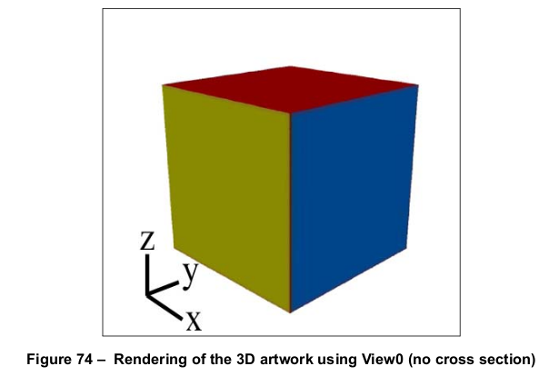

    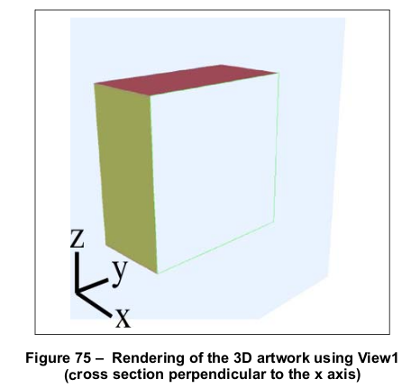

    图 75 展示了为引用 CrossSection1 的 **3DView** 指定的截面。插图显示了切割平面的边缘在注释矩形的边缘处结束。此截面指定了具有以下特征的平面：

    - 包含世界艺术原点：/C [0 0 0]
    - 垂直于 X 轴，平行于 Y 和 Z 轴：/O [ null 0 0]
    - 切割平面的不透明度为 35%：/PO 0.35
    - 切割平面的颜色为浅蓝色：/PC [/DeviceRGB 0.75 0.86 1]
    - 切割平面与物体的交点可见：/IV true
    - 切割平面与物体的交点颜色为绿色：/IC [/DeviceRGB 0 1 0]

    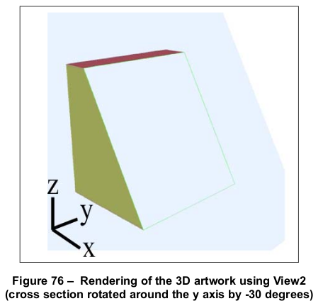

    图 76 展示了为引用 CrossSection2 的 **3DView** 指定的截面。此截面指定的平面与图 75 中 CrossSection1 指定的平面不同，具体表现如下：

    - 垂直于 X 轴，围绕 Y 轴旋转 -30 度，平行于 Z 轴：/O [ null -30 0]

    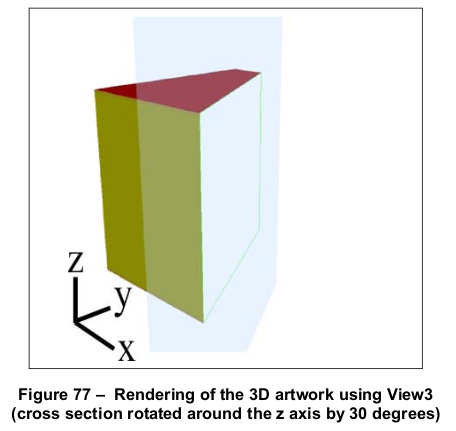

    图 77 展示了为引用 CrossSection3 的 **3DView** 指定的截面。此截面指定的平面与图 75 中 CrossSection1 指定的平面不同，具体表现如下：

    - 垂直于 X 轴，平行于 Y 轴，围绕 Z 轴旋转 30 度：/O [ null 0 30]

    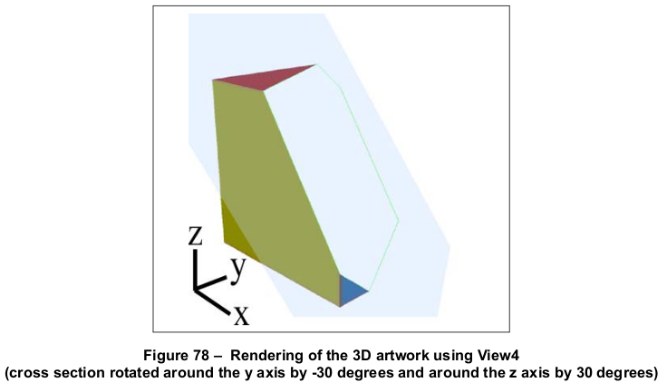

    图 78 展示了为引用 CrossSection4 的 **3DView** 指定的截面。此截面指定的平面与图 75 中 CrossSection1 指定的平面不同，具体表现如下：

    - 垂直于 X 轴，围绕 Y 轴旋转 -30 度，围绕 Z 轴旋转 30 度：/O [ null -30 30]

=== "英文"

    A *3D cross section dictionary* (PDF 1.7) specifies how a portion of the 3D artwork shall be clipped for the purpose of showing artwork cross sections. The **SA** entry of a 3D view may specify multiple 3D cross section dictionaries.
    
    !!! note "NOTE"
    
        Cross sections enable conforming readers to display otherwise hidden parts of the artwork. They also allow users to comment on cross sections, using markup annotations. For example, markup annotations can be used to apply markup annotations to a cross section or to measure distances in a cross section. If multiple cross sections are specified for a view, the markup annotations in the view apply to all cross sections in the view.
    
    [Table 311](#table311) shows the entries in a 3D cross section dictionary.
                
    <table id="table311" markdown="span">
        <caption>**Table 311 – Entries in a 3D cross section dictionary**</caption>
        <thead>
            <tr>
                <th>**Key**</th>
                <th>**Type**</th>
                <th>**Value**</th>
            </tr>
        </thead>
        <tbody>
            <tr>
                <td>**Type**</td> 
                <td>name</td>
                <td>(Optional) The type of PDF object that this dictionary describes; if present, shall be **3DCrossSection** for a 3D cross section dictionary.
                </td>
            </tr>
            <tr>
                <td>**C**</td> 
                <td>array</td>
                <td>(Optional) A three element array specifying the center of rotation on the cutting plane in world space coordinates (see [13.6.5], “Coordinate Systems for 3D”). <br/>
                Default value: [0 0 0] specifying a cutting plane rotating about the origin of the world space.
                </td>
            </tr>
            <tr>
                <td>**O**</td> 
                <td>array</td>
                <td>(Required) A three-element array specifying the orientation of the cutting plane in world space, where each value represents the orientation in relation to the X, Y, and Z axes, respectively (see [13.6.5], “Coordinate Systems for 3D”). Exactly one of the values shall be **null**, indicating an initial state of the cutting plane that is perpendicular to the corresponding axis and clipping all geometry on the positive side of that axis. The other two values shall be numbers indicating the rotation of the plane, in degrees, around their corresponding axes. The order in which these rotations are applied shall match the order in which the values appear in the array. <br/>
                    Default value: [null 0 0] specifying a cutting plane that is perpendicular to the X axis and coplanar with the Y and Z axes.
                </td>
            </tr>
            <tr>
                <td>**PO**</td> 
                <td>number</td>
                <td>(Optional) A number in the range [0, 1] indicating the opacity of the cutting plane using a standard additive blend mode. <br/>
                    Default value: 0.5
                </td>
            </tr>
            <tr>
                <td>**PC**</td> 
                <td>array</td>
                <td>(Optional) An array that specifies the colour for the cutting plane. The first entry in the array is a colour space, and the remaining entries are values in that colour space. The only valid colour space is **DeviceRGB**. If a colour space other than **DeviceRGB** is specified, this entry shall be ignored and the default value shall be used. <br/>
                    Default value: [/DeviceRGB 1 1 1] representing the colour white.
                </td>
            </tr>
            <tr>
                <td>**IV**</td> 
                <td>boolean</td>
                <td>(Optional) A flag indicating the visibility of the intersection of the cutting plane with any 3D geometry. If **true**, then the intersection shall be visible. If **false**, then the intersection shall not be visible. <br/>
                    Default value: **false**
                </td>
            </tr>
            <tr>
                <td>**IC**</td> 
                <td>array</td>
                <td>(Optional) An array that specifies the colour for the cutting plane’s intersection with the 3D artwork. The first entry in the array is a colour space, and the remaining entries are values in that colour space. The only valid colour space is **DeviceRGB**. If a colour space other than **DeviceRGB** is specified, this entry shall be ignored and the default value shall be used. This entry is meaningful only if **IV** is **true**. <br/>
                    Default value: [/DeviceRGB 0 1 0] representing the colour green.
                </td>
            </tr>
        </tbody>
    </table>
    
    The **C** entry specifies the center of the cutting plane. This implies that the plane passes through the center point, but it is also the point of reference when determining the orientation of the plane.
    
    The **O** array indicates the orientation of the cutting plane, taking into account its center. The orientation may be determined by a two-step process:
    
    - The plane shall be situated such that it passes through point **C**, and oriented such that it is perpendicular to the axis specified by the array entry whose value is null.
    - For each of the other two axes, the plane shall be rotated the specified number of degrees around the associated axis, while maintaining **C** as a fixed point on the plane. Since the two axes are perpendicular, the order in which the rotations are performed is irrelevant.
    
    The **PO** entry specifies the opacity of the plane itself when rendered, while the **PC** entry provides its colour. When the **PO** entry is greater than 0, a visual representation of the cutting plane shall be rendered with the 3D artwork. This representation is a square with a side length equal to the length of the diagonal of the maximum bounding box for the 3D artwork, taking into account any keyframe animations present. When the **PO** entry is 0, no visible representation of the cutting plane shall be rendered.
    
    The **IV** entry shall be a boolean value that determines whether a visual indication shall be drawn of the plane’s intersection with the 3D artwork. If such an indication is drawn, the **IC** entry shall specify its colour.
    
    !!! info "EXAMPLE"
    
        The following example describes a set of views and corresponding cross sections that illustrate the various effects of orientation.
    
        ```text
        3 0 obj             %CrossSection1
            <<
                /Type /3DCrossSection
                /C [0 0 0]
                /O [null 0 0]
                /PO 0.35
                /PC [/DeviceRGB 0.75 0.86 1]
                /IV true
                /IC [/DeviceRGB 0 1 0]
            >>
        endobj 
        
        4 0 obj             %CrossSection2
            <<
                /Type /3DCrossSection
                /C [0 0 0]
                /O [null -30 0]
                /PO 0.35
                /PC [/DeviceRGB 0.75 0.86 1]
                /IV true
                /IC [/DeviceRGB 0 1 0]
            >>
        endobj
        
        5 0 obj            %CrossSection3
            <<
                /Type /3DCrossSection
                /C [0 0 0]
                /O [null 0 30]
                /PO 0.35
                /PC [/DeviceRGB 0.75 0.86 1]
                /IV true
                /IC [/DeviceRGB 0 1 0]
            >>
        endobj
        
        6 0 obj            %CrossSection4
            <<
                /Type /3DCrossSection
                /C [0 0 0]
                /O [null -30 30]
                /PO 0.35
                /PC [/DeviceRGB 0.75 0.86 1]
                /IV true
                /IC [/DeviceRGB 0 1 0]
            >>
        endobj
        
        7 0 obj            %View0
            <<
                /Type /3DView
                /XN (NoCrossSection)
                /SA []
                ...
            >>
        endobj
        
        8 0 obj            %View1
            <<
                /Type /3DView
                /XN (CrossSection1)
                /SA [3 0 R]
                ...
            >>
        endobj
        
        9 0 obj            %View2
            <<
                /Type /3DView
                /XN (CrossSection2)
                /SA [4 0 R]
                ...
            >>
        endobj
        
        10 0 obj            %View3
            <<
                /Type /3DView
                /XN (CrossSection3)
                /SA [5 0 R]
                ...
            >>
        endobj
        
        11 0 obj            %View4
            <<
                /Type /3DView
                /XN (CrossSection4)
                /SA [6 0 R]
                ...
            >>
        endobj
        ```
    
    The following illustrations show the views described in the previous example, some of which include cross sections.
    
    
    
    
    
    Figure 75 shows the cross section specified for the **3DView** that references CrossSection1. The illustration shows the edges of the cutting plane ending at the edges of the annotation’s rectangle. This cross section specifies a plane with the following characteristics:
    
    - Includes the world art origin: /C [0 0 0]
    - Perpendicular to the X axis and parallel to the Y and Z axes: /O [ null 0 0]
    - Opacity of the cutting plane is 35%: /PO 0.35
    - Colour of the cutting plane is light blue: /PC [/DeviceRGB 0.75 0.86 1]
    - Intersection of the cutting plane with the object is visible: /IV true
    - Colour of the intersection of the cutting plane and the object is green: /IC [/DeviceRGB 0 1 0]
    
    
    
    Figure 76 shows the cross section specified for the **3DView** that references CrossSection2. This cross section specifies a plane that differs from the one specified in CrossSection1 (Figure 75) in the following way:
    
    - Perpendicular to the X axis, rotated -30 degrees around the Y axis, and parallel to the Z axis: /O [ null -30 0]
    
    
    
    Figure 77 shows the cross section specified for the **3DView** that references CrossSection3. This cross section specifies a plane that differs from the one specified in CrossSection1 (Figure 75) in the following way:
    
    - Perpendicular to the X axis, parallel to the Y axis, and rotated 30 degrees around the Z axis: /O [ null 0 30]
    
    
    
    Figure 78 shows the cross section specified for the **3DView** that references CrossSection4. This cross section specifies a plane that differs from the one specified in CrossSection1 (Figure 75) in the following way:
    
    - Perpendicular to the X axis, rotated -30 degrees around the Y axis, and rotated 30 degrees around the Z axis: /O [ null -30 30]

### 13.6.4.7 3D节点字典

**13.6.4.7 3D Node Dictionaries**

=== "中文"

    一个 3D 视图可以指定一个 3D 节点字典（PDF 1.7），该字典指定 3D 艺术作品的特定区域以及单个节点的透明度和可见性。3D 艺术作品应包含在父 3D 流对象中。3D 视图字典中的 **NA** 条目可以为特定视图指定多个 3D 节点字典。

    !!! note "NOTE 1"

        尽管许多 PDF 字典引用了整个 3D 艺术作品，但通常会在更细粒度的层次上引用 3D 艺术作品。这使得可以将可见性、透明度和方向等属性应用于 3D 艺术作品的子集。这些控制使得可以通过使覆盖的节点透明或将其移开，从而揭示底层节点。

    !!! note "NOTE 2"

        不要将节点与视图节点混淆。节点是指定 3D 艺术作品区域的 PDF 字典，而视图节点是 3D 艺术作品中的一个参数，用于指定视图。

    [Table 312](#table312) 显示了 3D 节点字典中的条目。

    <table id="table312" markdown="span">
        <caption>**Table 312 – 3D 节点字典中的条目**</caption>
        <thead>
            <tr>
                <th>**键**</th>
                <th>**类型**</th>
                <th>**值**</th>
            </tr>
        </thead>
        <tbody>
            <tr>
                <td>**Type**</td> 
                <td>name</td>
                <td>(可选) 该字典描述的 PDF 对象类型；如果存在，应为 **3DNode**，表示 3D 节点字典。
                </td>
            </tr>
            <tr>
                <td>**N**</td> 
                <td>text string</td>
                <td>(必需) 该节点字典描述的节点名称。如果对应的 3D 流的 **Subtype** 为 **U3D**，该条目对应于 Universal 3D 文件格式规范中描述的节点块名称字段（见参考文献）。将来，节点可能使用其他 3D 规范描述。 <br/><br/>
                    注 &emsp; 在将此条目与特定规范（如 Universal 3D）的节点名称进行比较时，符合规范的阅读器应在 PDF 使用的文本编码与 3D 流中指定的字符编码之间进行转换。
                </td>
            </tr>
            <tr>
                <td>**O**</td> 
                <td>number</td>
                <td>(可选) 一个范围为 [0, 1] 的数字，表示使用标准加法混合模式渲染此节点的几何体时的透明度。 <br/>
                    如果此条目缺失，查看器应使用父节点或 3D 艺术作品中指定的透明度（按顺序）。
                </td>
            </tr>
            <tr>
                <td>**V**</td> 
                <td>boolean</td>
                <td>(可选) 一个标志，指示此节点的可见性。如果为 **true**，则节点可见；如果为 **false**，则节点不可见。 <br/>
                    如果此条目缺失，查看器应使用父节点或 3D 艺术作品中指定的可见性（按顺序）。
                </td>
            </tr>
            <tr>
                <td>**M**</td> 
                <td>array</td>
                <td>(可选) 一个包含 12 个元素的 3D 变换矩阵，指定此节点相对于其父节点的位置和方向，使用世界坐标（参见 [13.6.5]，“3D 坐标系统”）。
                </td>
            </tr>
        </tbody>
    </table>

    **N** 条目指定了 3D 流中与此节点字典对应的节点。

    **O** 条目描述了渲染此节点时应使用的透明度，**V** 条目则确定是否渲染该节点。如果节点的透明度为 0，则与不可见节点的渲染方式相同，但为节点的可见性设置单独的值，允许交互式符合规范的阅读器显示/隐藏部分透明的节点，而不覆盖这些节点的预期透明度。

    **M** 条目指定节点相对于其父节点的矩阵，使用世界坐标。如果需要重新定位节点层级而保持其内部结构，则只需调整层级根节点。

    !!! info "EXAMPLE"

        以下示例展示了一个 3D 视图，指定了一个节点参数数组。

        ```text
        3 0 obj                % 默认节点参数，所有形状可见且不透明
        [ << /Type /3DNode
                /N (Sphere)
                /O 1
                /V true
                /M [...]>>
            << /Type /3DNode
                /N (Cone)
                /O 1
                /V true >>
            << /Type /3DNode
                /N (Cube)
                /O 1
                /V true >>
            ]
        
        4 0 obj                % 参数，隐藏圆锥，球体半透明
            [ << /Type /3DNode
                    /N (Sphere)
                    /O 0.5
                    /V true >>
                << /Type /3DNode
                    /N (Cone)
                    /O 1
                    /V false >>
                << /Type /3DNode
                    /N (Cube)
                    /O 1
                    /V true >>
            ]
        endobj
        
        5 0 obj                % View1，使用默认节点参数
            <<
                /Type /3DView
                /XN (View1)
                /NA 3 0 R
                ...
            >>
        endobj
        
        6 0 obj                % View2，使用备用节点参数
            <<
                /Type /3DView
                /XN (View2)
                /NA 4 0 R
                ...
            >>
        endobj
        ```

    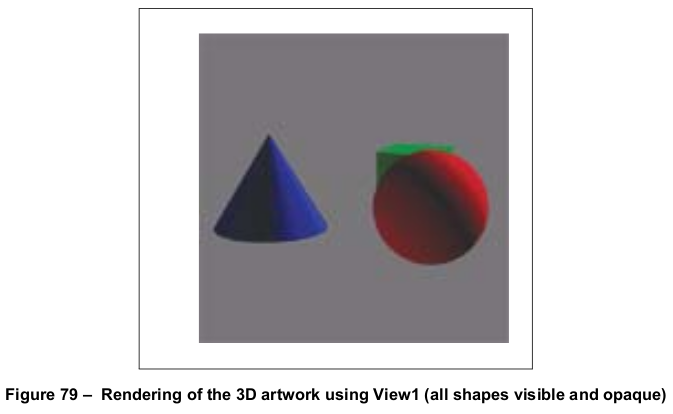

    图 79 显示了一个视图，其节点数组包括三个节点，这些节点都将以不透明（/O 1）和可见（/V true）的外观进行渲染。

    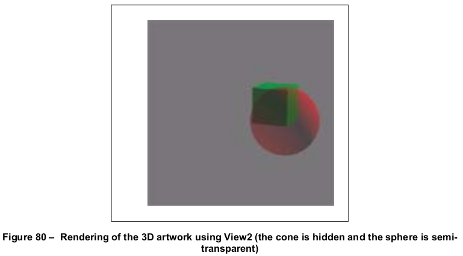

    图 80 显示了一个视图，其节点数组指定了图 79 中使用的相同三个节点。这些节点具有以下显示特征：

    - 名为 Sphere 的节点是半透明的（/O 0.5）且可见（/V true）
    - 名为 Cone 的节点是透明的（/O 1）且不可见（/V false）
    - 名为 Cube 的节点是透明的（/O 1）且可见（/V true）

=== "英文"

    A 3D view may specify a 3D node dictionary (PDF 1.7), which specifies particular areas of 3D artwork and the opacity and visibility with which individual nodes shall be displayed. The 3D artwork shall be contained in the parent 3D stream object. The **NA** entry of the 3D views dictionary may specify multiple 3D node dictionaries for a particular view.
    
    !!! note "NOTE 1"
    
        While many PDF dictionaries reference 3D artwork in its entirety, it is often useful to reference 3D artwork at a more granular level. This enables properties such as visibility, opacity, and orientation to be applied to subsets of the 3D artwork. These controls enable underlying nodes to be revealed, by making the overlying nodes transparent or by moving them out of the way.
    
    !!! note "NOTE 2"
    
        Do not confuse nodes with view nodes. A node is a PDF dictionary that specifies an area in 3D artwork, while a view node is a parameter in the 3D artwork that specifies a view.
    
    [Table 312](#table312) shows the entries in a 3D node dictionary.
            
    <table id="table312" markdown="span">
        <caption>**Table 312 – Entries in a 3D node dictionary**</caption>
        <thead>
            <tr>
                <th>**Key**</th>
                <th>**Type**</th>
                <th>**Value**</th>
            </tr>
        </thead>
        <tbody>
            <tr>
                <td>**Type**</td> 
                <td>name</td>
                <td>(Optional) The type of PDF object that this dictionary describes; if present, shall be **3DNode** for a 3D node dictionary.
                </td>
            </tr>
            <tr>
                <td>**N**</td> 
                <td>text string</td>
                <td>(Required) The name of the node being described by the node dictionary. If the **Subtype** of the corresponding 3D Stream is **U3D**, this entry corresponds to the field Node block name, as described in the Universal 3D file format specification (see Bibliography). In the future, nodes may be described using other 3D conventions. <br/><br/>
                    NOTE &emsp; When comparing this entry to node names for a particular convention (such as Universal 3D), conforming readers shall translate between the PDF text encoding used by PDF and the character encoding specified in the 3D stream.
                </td>
            </tr>
            <tr>
                <td>**O**</td> 
                <td>number</td>
                <td>(Optional) A number in the range [0, 1] indicating the opacity of the geometry supplied by this node using a standard additive blend mode. <br/>
                    If this entry is absent, the viewer shall use the opacity specified for the parent node or for the 3D artwork (in ascending order).
                                </td>
            </tr>
            <tr>
                <td>**V**</td> 
                <td>boolean</td>
                <td>(Optional) A flag indicating the visibility of this node. If **true**, then the node is visible. If **false**, then the node shall not be visible. <br/>
                    If this entry shall be absent, the viewer shall use the visibility specified for the parent node or for the 3D artwork (in ascending order).
                </td>
            </tr>
            <tr>
                <td>**M**</td> 
                <td>array</td>
                <td>(Optional) A 12-element 3D transformation matrix that specifies the position and orientation of this node, relative to its parent, in world coordinates (see [13.6.5], “Coordinate Systems for 3D”).
                </td>
            </tr>
        </tbody>
    </table>
    
    The **N** entry specifies which node in the 3D stream corresponds to this node dictionary.
    
    The **O** entry describes the opacity that shall be used when rendering this node, and the **V** entry shall determine whether or not the node is rendered at all. While a node with an opacity of 0 shall be rendered in the same way as a non-visible node, having a separate value for the visibility of a node allows interactive conforming readers to show/hide partially transparent nodes, without overwriting the intended opacity of those nodes.
    
    The **M** entry specifies the node’s matrix relative to its parent, in world coordinates. If an hierarchy of nodes is intended to be repositioned while still maintaining its internal structure, then only the node at the root of the hierarchy needs to be adjusted.
    
    !!! info "EXAMPLE"
    
        The following example shows a 3D view specifying an array of node parameters.
    
        ```text
        3 0 obj                % Default node params with all shapes visible and opaque
        [ << /Type /3DNode
             /N (Sphere)
             /O 1
             /V true
             /M [...]>>
          << /Type /3DNode
             /N (Cone)
             /O 1
             /V true >>
          << /Type /3DNode
             /N (Cube)
             /O 1
             /V true >>
          ]
        
        4 0 obj                % Params with the cone hidden and the sphere semi-transparent
            [ << /Type /3DNode
                 /N (Sphere)
                 /O 0.5
                 /V true >>
              << /Type /3DNode
                 /N (Cone)
                 /O 1
                 /V false >>
              << /Type /3DNode
                 /N (Cube)
                 /O 1
                 /V true >>
            ]
        endobj
        
        5 0 obj                %View1, using the default set of node params
            <<
               /Type /3DView
               /XN (View1)
               /NA 3 0 R
               ...
            >>
        endobj
        
        6 0 obj                %View2, using the alternate set of node params
            <<
               /Type /3DView
               /XN (View2)
               /NA 4 0 R
               ...
            >>
        endobj
        ```
    
    
    
    Figure 79 shows a view whose node array includes three nodes, all of which shall be rendered with the appearance opaque (/O 1) and visible (/V true).
    
    
    
    Figure 80 shows a view with a node array that specifies the same three nodes used in Figure 79. These nodes have the following display characteristics:
    
    - The node named Sphere is partially transparent (/O 0.5) and visible (/V true)
    - The node named Cone is opaque (/O 1) and invisible (/V false)
    - The node named Cube is opaque (/O 1) and visible (/V true)

## 13.6.5 3D坐标系统

**13.6.5 Coordinate Systems for 3D**

=== "中文"

    3D 艺术作品是一组对象，其位置和几何形状应使用三维坐标来指定。[8.3]，“坐标系统”讨论了二维坐标系统的概念、其几何形状和变换。本小节扩展了这些概念，包括第三维度。

    如 [8.3]，“坐标系统”中所述，位置应通过在笛卡尔平面上的 x 和 y 坐标对来定义。平面的原点指定位置 (0, 0)；x 值向右增加，y 值向上增加。对于三维图形，应该使用第三个轴，即 z 轴。原点应为 (0, 0, 0)；正 z 值沿页面进入方向增加。

    在二维图形中，变换矩阵变换对象在平面中的位置、大小和方向。它是一个 3x3 矩阵，其中只有六个元素可以改变；因此，矩阵应在 PDF 中表示为一个包含六个数字的数组：

    $\begin{bmatrix}  a & b & 0\\  c & d & 0\\  tx & ty & 1 \end{bmatrix} = \begin{bmatrix}  a & b & c & d & tx & ty \end{bmatrix}$

    在 3D 图形中，应该使用一个 4x4 矩阵来变换对象在三维坐标系统中的位置、大小和方向。矩阵的前三列可以更改；因此，矩阵应在 PDF 中表示为一个包含 12 个数字的数组：

    $\begin{bmatrix}  a & b & c & 0\\  d & e & f & 0\\  g & h & i & 0\\  tx & ty & tz & 1 \end{bmatrix} = \begin{bmatrix}  a & b & c & d & e & f & g & h & i & tx & ty & tz \end{bmatrix}$

    3D 坐标变换应表示为矩阵变换：

    $\begin{bmatrix} x' & y' & z' & 1 \end{bmatrix} = \begin{bmatrix} x & y & z & 1 \end{bmatrix} \times  \begin{bmatrix}  a & b & c & 0\\  d & e & f & 0\\  g & h & i & 0\\  tx & ty & tz & 1 \end{bmatrix}$

    执行乘法操作会得到以下结果：

    $x' = a \times x + d \times y + g \times z + tx$

    $y' = b \times x + e \times y + h \times z + ty$

    $z' = c \times x + f \times y + i \times z + tz$

    3D 艺术作品的位置和方向通常涉及沿任意轴的平移（移动）和旋转。虚拟相机代表艺术作品的视图。相机与艺术作品之间的关系可以从两种方式考虑：

    - 3D 艺术作品处于固定位置和方向，相机移动到不同的位置和方向。
    - 相机处于固定位置，3D 艺术作品被平移和旋转。

    这两种方法可能实现相同的视觉效果；实际上，3D 系统通常结合使用这两者。从概念上讲，有三个不同的坐标系统：

    - 艺术作品坐标系统。
    - 相机坐标系统，其中相机应位于 (0, 0, 0)，面朝正 z 轴，正 x 轴在右侧，正 y 轴向上。
    - 一个称为世界坐标系统的中间系统。

    在坐标转换中将使用两个 3D 变换矩阵：

    - 艺术作品到世界矩阵指定艺术作品在世界坐标系统中的位置和方向。此矩阵应包含在 3D 流中。
    - 相机到世界矩阵指定相机在世界坐标系统中的位置和方向。此矩阵应由 3D 视图字典中的 **C2W** 或 **U3DPath** 条目指定。

    在 3D 注释的目标坐标系统中绘制 3D 艺术作品时，将进行以下变换：

    a) 艺术作品坐标应转换为世界坐标：

    $\begin{bmatrix}  x_w & y_w & z_w & 1 \end{bmatrix} = \begin{bmatrix} x_a & y_a & z_a & 1 \end{bmatrix} \times aw$

    b) 世界坐标应转换为相机坐标：

    $\begin{bmatrix}  x_c & y_c & z_c & 1 \end{bmatrix} = \begin{bmatrix}  x_w & y_w & z_w & 1 \end{bmatrix} \times (cw^{-1})$

    c) 前两步可以表示为一个单一的方程，如下所示：

    $\begin{bmatrix}  x_c & y_c & z_c & 1 \end{bmatrix} = \begin{bmatrix}  x_a & y_a & z_a & 1 \end{bmatrix} \times (aw \times cw^{-1})$

    d) 最后，相机坐标应投影到二维空间，消除 z 坐标，然后在注释的目标坐标系统中缩放并定位。

=== "英文"

    3D artwork is a collection of objects whose positions and geometry shall be specified using three-dimensional coordinates. [8.3], “Coordinate Systems,” discusses the concepts of two-dimensional coordinate systems, their geometry and transformations. This sub-clause extends those concepts to include the third dimension.
    
    As described in [8.3], “Coordinate Systems,” positions shall be defined in terms of pairs of x and y coordinates on the Cartesian plane. The origin of the plane specifies the location (0, 0); x values increase to the right and y values increase upward. For three-dimensional graphics, a third axis, the z axis, shall be used. The origin shall be at (0, 0, 0); positive z values increase going into the page.
    
    In two-dimensional graphics, the transformation matrix transforms the position, size, and orientation of objects in a plane. It is a 3-by-3 matrix, where only six of the elements may be changed; therefore, the matrix shall be expressed in PDF as an array of six numbers:
    
    $\begin{bmatrix}  a & b & 0\\  c & d & 0\\  tx & ty & 1 \end{bmatrix} = \begin{bmatrix}  a & b & c & d & tx & ty \end{bmatrix}$
    
    In 3D graphics, a 4-by-4 matrix shall be used to transform the position, size, and orientations of objects in a three-dimensional coordinate system. Only the first three columns of the matrix may be changed; therefore, the matrix shall be expressed in PDF as an array of 12 numbers:
    
    $\begin{bmatrix}  a & b & c & 0\\  d & e & f & 0\\  g & h & i & 0\\  tx & ty & tz & 1 \end{bmatrix} = \begin{bmatrix}  a & b & c & d & e & f & g & h & i & tx & ty & tz \end{bmatrix}$
    
    3D coordinate transformations shall be expressed as matrix transformations:
    
    $\begin{bmatrix} x' & y' & z' & 1 \end{bmatrix} = \begin{bmatrix} x & y & z & 1 \end{bmatrix} \times  \begin{bmatrix}  a & b & c & 0\\  d & e & f & 0\\  g & h & i & 0\\  tx & ty & tz & 1 \end{bmatrix}$
    
    Carrying out the multiplication has the following results:
    
    $x' = a \times x + d \times y + g\times z + tx$
    
    $y' = b \times x + e \times y + h\times z + ty$
    
    $z' = c \times x + f \times y + i\times z + tz$
    
    Position and orientation of 3D artwork typically involves translation (movement) and rotation along any axis.
    The virtual camera represents the view of the artwork. The relationship between camera and artwork may be
    thought of in two ways:
    
    - The 3D artwork is in a fixed position and orientation, and the camera moves to different positions and orientations.
    - The camera is in a fixed location, and the 3D artwork is translated and rotated.
    
    Both approaches may achieve the same visual effects; in practice, 3D systems typically use a combination of both. Conceptually, there are three distinct coordinate systems:
    
    - The artwork coordinate system.
    - The camera coordinate system, in which the camera shall be positioned at (0, 0, 0) facing out along the positive z axis, with the positive x axis to the right and the positive y axis going straight up.
    - An intermediate system called the world coordinate system.
    
    Two 3D transformation matrices shall be used in coordinate conversions:
    
    - The artwork-to-world matrix specifies the position and orientation of the artwork in the world coordinate system. This matrix shall be contained in the 3D stream.
    - The camera-to-world matrix specifies the position and orientation of the camera in the world coordinate system. This matrix shall be specified by either the **C2W** or **U3DPath** entries of the 3D view dictionary.
    
    When drawing 3D artwork in a 3D annotation’s target coordinate system, the following transformations take place:
    
    a&#41; Artwork coordinates shall be transformed to world coordinates:
    
    $\begin{bmatrix}  x_w & y_w & z_w & 1 \end{bmatrix} = \begin{bmatrix} x_a & y_a & z_a & 1 \end{bmatrix} \times aw$
    
    b&#41; World coordinates shall be transformed to camera coordinates:
    
    $\begin{bmatrix}  x_c & y_c & z_c & 1 \end{bmatrix} = \begin{bmatrix}  x_w & y_w & z_w & 1 \end{bmatrix} \times (cw^{-1})$
    
    c&#41; The first two steps can be expressed as a single equation, as follows:
    
    $\begin{bmatrix}  x_c & y_c & z_c & 1 \end{bmatrix} = \begin{bmatrix}  x_a & y_a & z_a & 1 \end{bmatrix} \times (aw \times cw^{-1})$
    
    d&#41; Finally, the camera coordinates shall be projected into two dimensions, eliminating the z coordinate, then scaled and positioned within the annotation’s target coordinate system.

## 13.6.6 3D标记

**13.6.6 3D Markup**

=== "中文"

    从 PDF 1.7 开始，用户可以通过使用标记注释（参见 [12.5.6.2]，“标记注释”）对 3D 艺术作品的特定视图进行评论。标记注释（如其他注释）通常与页面上的位置相关联。为了将标记与 3D 注释的特定视图关联，标记注释的注释字典包含一个 **ExData** 条目（参见 [表 174](../c12/s5.md#table174)），该条目指定了 3D 注释和视图。

    [表 313](#table313) 描述了用于标记 3D 注释的外部数据字典中的条目。

    <table id="table313" markdown="span">
        <caption>**表 313 – 用于标记 3D 注释的外部数据字典中的条目**</caption>
        <thead>
            <tr>
                <th>**键**</th>
                <th>**类型**</th>
                <th>**值**</th>
            </tr>
        </thead>
        <tbody>
            <tr>
                <td>**Type**</td> 
                <td>name</td>
                <td>(必需) 此字典所描述的 PDF 对象类型；如果存在，应为 **ExData**，用于外部数据字典。
                </td>
            </tr>
            <tr>
                <td>**SubType**</td> 
                <td>name</td>
                <td>(必需) 此字典所描述的外部数据类型；应为 **Markup3D**，表示 3D 评论。唯一定义的值是 **Markup3D**。
                </td>
            </tr>
            <tr>
                <td>**3DA**</td> 
                <td>dictionary 或 text string</td>
                <td>(必需) 此标记注释应用的 3D 注释。3D 注释可以作为子字典或作为 3D 注释的名称进行指定，具体由其 **NM** 条目指定。后一种情况下，3D 注释和标记注释必须位于文档的同一页面上。
                </td>
            </tr>
            <tr>
                <td>**3DV**</td> 
                <td>dictionary</td>
                <td>(必需) 此标记注释所关联的 3D 视图。除非此视图当前用于由 **3DA** 指定的 3D 注释，否则注释将被隐藏。
                </td>
            </tr>
            <tr>
                <td>**MD5**</td> 
                <td>byte string</td>
                <td>(可选) 一个 16 字节的字符串，包含与此 3D 评论相关的 3D 流数据的校验和。该校验和应通过应用标准的 MD5 消息摘要算法（描述见互联网 RFC 1321，《MD5 消息摘要算法》；参见参考文献）计算流数据的字节。此值用于确定自从创建此 3D 评论以来，艺术作品数据是否发生变化。
                </td>
            </tr>
        </tbody>
    </table>

    在 **Markup3D ExData** 字典中，**3DA** 条目标识了标记应关联的 3D 注释。即使标记注释与关联的注释在页面的 Annots 数组中并存，标记也可以视为 **3DA** 注释的子注释。

    **3DV** 条目指定了标记所关联的 3D 视图。只有当指定的视图是其父 3D 注释的当前视图时，标记才会被打印和显示。这确保了在显示标记时正确的上下文被保留。

    !!! note "注"
        等效视图是不够的；如果多个标记指定了由不同对象表示的等效视图，则这些标记不会同时显示。

    **MD5** 条目为符合标准的阅读器提供了一种检测指定的 **3DA** 3D 注释的 3D 流是否发生变化的方法。如果 3D 流发生了变化，则 **3DV** 条目提供的上下文可能不再适用，标记也可能不再有用。对此类情况采取的任何措施取决于符合标准的阅读器，但应向用户发出警告。

    !!! info "示例"
        以下示例展示了如何将标记注释与特定视图关联。

        ```text
        2 0 obj             % 包含两个命名视图的 3D 流数据
            <<
                /Type /3D
                /Subtype /U3D
                /VA [4 0 R 5 0 R]
                ...
            >>
        stream
        ...
        endstream
        endobj
        
        3 0 obj            % 3D 注释
            <<
                /Type /Annot
                /Subtype /3D
                /3DD 2 0 R
                ...
            >>
        endobj
        
        4 0 obj            % CommentView1
            <<
                /Type /3DView
                /XN (CommentView1)
                ...
            >>
        endobj
        
        5 0 obj            % CommentView2
            <<
                /Type /3DView
                /XN (CommentView2)
                ...
            >>
        endobj
        
        6 0 obj            % 没有 ExData 的云注释
            <<
                /Type /Annot
                /Subtype /Polygon
                /IT /PolygonCloud
                ...
            >>
        endobj
        
        7 0 obj            % 在 CommentView1 上的注释
            <<
                /Type /Annot
                /Subtype /FreeText
                /IT /FreeTextCallout
                /ExData <<
                    /Type /Markup3D
                    /3DA 3 0 R
                    /3DV 4 0 R
                >>
                ...
            >>
        endobj
        
        8 0 obj            % 在 CommentView2 上的尺寸注释
            <<
                /Type /Annot
                /Subtype /Line
                /IT /LineDimension
                /ExData <<
                        /Type /Markup3D
                        /3DA 3 0 R
                        /3DV 5 0 R
                >>
            ...
        >>
        endobj
        
        9 0 obj             % 在 CommentView2 上的盖章注释
            <<
                /Type /Annot
                /Subtype /Stamp
                /ExData <<
                    /Type /Markup3D
                    /3DA 3 0 R
                    /3DV 5 0 R
                >>
                ...
            >>
        endobj
        ```

    以下插图展示了在不同视图上的注释标记位置：

    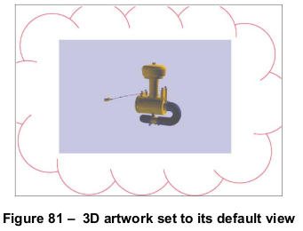

    图 81 显示了默认视图，未应用标记注释。

    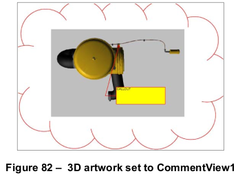

    图 82 显示了应用标记注释的另一个视图。

    

    图 83 显示了由两个标记注释引用的视图：

    - 一条线注释（/Subtype /Line）带有线尺寸意图（/IT/ LineDimension）
    - 一个盖章注释（/Subtype /Stamp）

=== "英文"

    Beginning with PDF 1.7, users may comment on specific views of 3D artwork by using markup annotations (see [12.5.6.2], “Markup Annotations”). Markup annotations (as other annotations) are normally associated with a location on a page. To associate the markup with a specific view of a 3D annotation, the annotation dictionary for the markup annotation contains an **ExData** entry (see [Table 174](../c12/s5.md#table174)) that specifies the 3D annotation and view.
    
    [Table 313](#table313) describes the entries in an external data dictionary used to markup 3D annotations.
                
    <table id="table313" markdown="span">
        <caption>**Table 313 – Entries in an external data dictionary used to markup 3D annotations**</caption>
        <thead>
            <tr>
                <th>**Key**</th>
                <th>**Type**</th>
                <th>**Value**</th>
            </tr>
        </thead>
        <tbody>
            <tr>
                <td>**Type**</td> 
                <td>name</td>
                <td>(Required) The type of PDF object that this dictionary describes; if present, shall be **ExData** for an external data dictionary.
                </td>
            </tr>
            <tr>
                <td>**SubType**</td> 
                <td>name</td>
                <td>(Required) The type of external data that this dictionary describes; shall be **Markup3D** for a 3D comment. The only defined value is **Markup3D**.
                </td>
            </tr>
            <tr>
                <td>**3DA**</td> 
                <td>dictionary or text string</td>
                <td>(Required) The 3D annotation to which this markup annotation applies. The 3D annotation may be specified as a child dictionary or as the name of a 3D annotation, as specified by its **NM** entry. In the latter case, the 3D annotation and the markup annotation shall be on the same page of the document.
                                </td>
            </tr>
            <tr>
                <td>**3DV**</td> 
                <td>dictionary</td>
                <td>(Required) The 3D view that this markup annotation is associated with. The annotation will be hidden unless this view is currently being used for the 3D annotation specified by **3DA**.
                </td>
            </tr>
            <tr>
                <td>**MD5**</td> 
                <td>byte string</td>
                <td>(Optional) A 16-byte string that contains the checksum of the bytes of the 3D stream data that this 3D comment shall be associated with. The checksum shall be calculated by applying the standard MD5 message-digest algorithm (described in Internet RFC 1321, *The MD5 Message-Digest Algorithm*; see the Bibliography) to the bytes of the stream data. This value shall be used to determine if artwork data has changed since this 3D comment was created.
                </td>
            </tr>
        </tbody>
    </table>
    
    In a **Markup3D ExData** dictionary, the **3DA** entry identifies the 3D annotation to which the markup shall be associated. Even though the markup annotation exists alongside the associated annotation in the page’s Annots array, the markup may be thought of as a child of the **3DA** annotation.
    
    The **3DV** entry specifies the markup’s associated 3D view. The markup shall only be printed and displayed when the specified view is the current view of its parent 3D annotation. This ensures that the proper context is preserved when the markup is displayed.
    
    !!! note "NOTE"
    
        An equivalent view is not sufficient; if more than one markup specify equivalent views represented by different objects, the markups will not display simultaneously.
    
    The **MD5** entry gives conforming readers a means to detect whether or not the 3D stream of the 3D annotation specified by **3DA** has changed. If the 3D stream has changed, the context provided by the **3DV** entry may no longer apply, and the markup may no longer be useful. Any action taken as a response to such a situation is dependent on the conforming reader, but a warning shall be issued to the user.
    
    !!! info "EXAMPLE"
    
        The following example shows how markup annotations can be associated with particular views.
    
        ```text
        2 0 obj             % 3D stream data with two named views
            <<
                /Type /3D
                /Subtype /U3D
                /VA [4 0 R 5 0 R]
                ...
            >>
        stream
        ...
        endstream
        endobj
        
        3 0 obj            % 3D annotation
            <<
                /Type /Annot
                /Subtype /3D
                /3DD 2 0 R
                ...
            >>
        endobj
        
        4 0 obj            % CommentView1
            <<
                /Type /3DView
                /XN (CommentView1)
                ...
            >>
        endobj
        
        5 0 obj            % CommentView2
            <<
                /Type /3DView
                /XN (CommentView2)
                ...
            >>
        endobj
        
        6 0 obj            % Cloud comment with no ExData
            <<
                /Type /Annot
                /Subtype /Polygon
                /IT /PolygonCloud
                ...
            >>
        endobj
        
        7 0 obj            % Callout comment on CommentView1
            <<
                /Type /Annot
                /Subtype /FreeText
                /IT /FreeTextCallout
                /ExData <<
                    /Type /Markup3D
                    /3DA 3 0 R
                    /3DV 4 0 R
                >>
                ...
            >>
        endobj
        
        8 0 obj            % Dimension comment on CommentView2
            <<
                /Type /Annot
                /Subtype /Line
                /IT /LineDimension
                /ExData <<
                        /Type /Markup3D
                        /3DA 3 0 R
                        /3DV 5 0 R
                >>
            ...
        >>
        endobj
        
        9 0 obj             % Stamp comment on CommentView2
            <<
                /Type /Annot
                /Subtype /Stamp
                /ExData <<
                    /Type /Markup3D
                    /3DA 3 0 R
                    /3DV 5 0 R
                >>
                ...
            >>
        endobj
        ```
    
    The following illustrations show the placement of markup on annotations on different views of the same 3D artwork.
    
    
    
    Figure 81 shows the default view, which has no markup annotations.
    
    
    
    Figure 82 shows another view to which a markup annotation is applied.
    
    
    
    Figure 83 shows a view referenced by two markup annotations:
    
    - A line annotation (/Subtype /Line) with a line dimension intent (/IT/ LineDimension)
    - A stamp annotation (/Subtype /Stamp)

[8.3]: ../c8/s3.md
[8.11]: ../c8/s11.md
[13.5]: ../c13/s5.md

[7.3.7]: ../c7/s3.md#737-字典对象

[13.6.2]: ../c13/s6.md#1362-3d-注释
[13.6.3]: ../c13/s6.md#1363-3d-流
[13.6.4]: ../c13/s6.md#1364-3d-视图
[13.6.5]: ../c13/s6.md#1365-3d坐标系统

[12.5.6.2]: ../c12/s5.md#12562-标记注解
[12.6.4.15]: ../c12/s6.md#126415-进入-3d-视图操作
[13.6.3.3]: ../c13/s6.md#13633-3d-引用字典
[13.6.4.2]: ../c13/s6.md#13642-投影字典
[13.6.4.3]: ../c13/s6.md#13643-3d-背景字典
[13.6.4.4]: ../c13/s6.md#13644-3d-渲染模型字典
[13.6.4.5]: ../c13/s6.md#13645-3d光照模式字典
[13.6.4.6]: ../c13/s6.md#13646-3d截面字典
[13.6.4.7]: ../c13/s6.md#13647-3d节点字典
