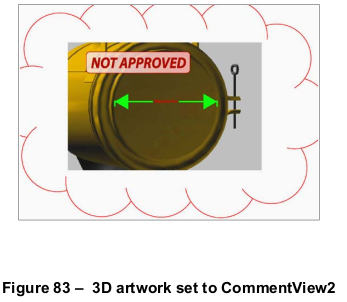

# 13.6 3D 艺术品

**13.6 3D Artwork**

## 13.6.1 概述

**13.6.1 General**

=== "中文"

    Starting with PDF 1.6, collections of three-dimensional objects, such as those used by CAD software, may be embedded in PDF files. Such collections are often called 3D models; in the context of PDF, they shall be referred to as 3D artwork. The PDF constructs for 3D artwork support the following features:
    
    - 3D artwork may be rendered within a page; that is, not as a separate window or user interface element.
    - Multiple instances of 3D artwork may appear within a page or document.
    - Specific views of 3D artwork may be specified, including a default view that shall be displayed initially and
    - ther views that may be selected. Views may have names that can be presented in a user interface.
    - (PDF 1.7) Conforming readers may specify how 3D artwork shall be rendered, coloured, lit, and cross-sectioned, without the use of embedded JavaScript. They may also specify state information that shall be applied to individual nodes (3D graphic objects or collections thereof) in the 3D artwork, such as visibility, opacity, position, or orientation.
    - Pages containing 3D artwork may be printed.
    - Users may rotate and move the artwork, enabling them to examine complex objects from any angle or orientation.
    - (PDF 1.7) Keyframe animations contained in 3D artwork may be played in specific styles and timescales, without programatic intervention.
    - JavaScripts and other software may programmatically manipulate objects in the artwork, creating dynamic presentations in which objects move, spin, appear, and disappear.
    - (PDF 1.7) The activation of 3D artwork can trigger the display of additional user interface items in the conforming reader. Such items may include model trees and toolbars.
    - Two-dimensional (2D) content such as labels may be overlaid on 3D artwork. This feature is not the same as the ability to apply 2D markup annotations.
    - (PDF 1.7) 2D markup annotations may be applied to specific views of the 3D artwork, using the **ExData** entry to identify the 3D annotation and the 3D view in that annotation.
    
    The following sub-clauses describe the major PDF objects that relate to 3D artwork, as well as providing background information on 3D graphics:
    
    - 3D annotations provide a virtual camera through which the artwork shall be viewed. (see [13.6.2], “3D Annotations”).
    - 3D streams shall contain the actual specification of a piece of 3D artwork (see [13.6.3], “3D Streams””). This
    - pecification supports the Standard ECMA-363, Universal 3D file format developed by the 3D Industry Forum (see [Bibliography](../bibliography.md)).
    - 3D views shall specify information about the relationship between the camera and the 3D artwork (see [13.6.4], “3D Views”). Beginning with PDF 1.7, views may also describe additional parameters such as render mode, lighting, cross sections, and nodes. Nodes shall be 3D graphic objects or collections thereof.
    - 3D coordinate systems are described in [13.6.5], “Coordinate Systems for 3D.”
    - 2D markup annotations applied to 3D artwork views are described in [13.6.6], “3D Markup.”
    
    !!! note "NOTE"
    
        Many of the concepts and terminology of 3D rendering are beyond the scope of this reference. Readers interested in further information are encouraged to consult outside references.

=== "英文"

    Starting with PDF 1.6, collections of three-dimensional objects, such as those used by CAD software, may be embedded in PDF files. Such collections are often called 3D models; in the context of PDF, they shall be referred to as 3D artwork. The PDF constructs for 3D artwork support the following features:
    
    - 3D artwork may be rendered within a page; that is, not as a separate window or user interface element.
    - Multiple instances of 3D artwork may appear within a page or document.
    - Specific views of 3D artwork may be specified, including a default view that shall be displayed initially and
    - ther views that may be selected. Views may have names that can be presented in a user interface.
    - (PDF 1.7) Conforming readers may specify how 3D artwork shall be rendered, coloured, lit, and cross-sectioned, without the use of embedded JavaScript. They may also specify state information that shall be applied to individual nodes (3D graphic objects or collections thereof) in the 3D artwork, such as visibility, opacity, position, or orientation.
    - Pages containing 3D artwork may be printed.
    - Users may rotate and move the artwork, enabling them to examine complex objects from any angle or orientation.
    - (PDF 1.7) Keyframe animations contained in 3D artwork may be played in specific styles and timescales, without programatic intervention.
    - JavaScripts and other software may programmatically manipulate objects in the artwork, creating dynamic presentations in which objects move, spin, appear, and disappear.
    - (PDF 1.7) The activation of 3D artwork can trigger the display of additional user interface items in the conforming reader. Such items may include model trees and toolbars.
    - Two-dimensional (2D) content such as labels may be overlaid on 3D artwork. This feature is not the same as the ability to apply 2D markup annotations.
    - (PDF 1.7) 2D markup annotations may be applied to specific views of the 3D artwork, using the **ExData** entry to identify the 3D annotation and the 3D view in that annotation.
    
    The following sub-clauses describe the major PDF objects that relate to 3D artwork, as well as providing background information on 3D graphics:
    
    - 3D annotations provide a virtual camera through which the artwork shall be viewed. (see [13.6.2], “3D Annotations”).
    - 3D streams shall contain the actual specification of a piece of 3D artwork (see [13.6.3], “3D Streams””). This
    - pecification supports the Standard ECMA-363, Universal 3D file format developed by the 3D Industry Forum (see [Bibliography](../bibliography.md)).
    - 3D views shall specify information about the relationship between the camera and the 3D artwork (see [13.6.4], “3D Views”). Beginning with PDF 1.7, views may also describe additional parameters such as render mode, lighting, cross sections, and nodes. Nodes shall be 3D graphic objects or collections thereof.
    - 3D coordinate systems are described in [13.6.5], “Coordinate Systems for 3D.”
    - 2D markup annotations applied to 3D artwork views are described in [13.6.6], “3D Markup.”
    
    !!! note "NOTE"
    
        Many of the concepts and terminology of 3D rendering are beyond the scope of this reference. Readers interested in further information are encouraged to consult outside references.

## 13.6.2 3D 注释

**13.6.2 3D Annotations**

=== "中文"

    3D annotations (PDF 1.6) are the means by which 3D artwork shall be represented in a PDF document. [Table 298](#table298) shows the entries specific to a 3D annotation dictionary. [Table 164](../c12/s5.md#table164) describes the entries common to all annotation dictionaries.
    
    In addition to these entries, a 3D annotation shall provide an appearance stream in its **AP** entry (see [Table 164](../c12/s5.md#table164)) that has a normal appearance (the **N** entry in [Table 168](../c12/s5.md#table168)). This appearance may be used by applications that do not support 3D annotations and by all applications for the initial display of the annotation.
    
    <table id="table298" markdown="span">
        <caption>**Table 298 – Additional entries specific to a 3D annotation**</caption>
        <thead>
            <tr>
                <th>**Key**</th>
                <th>**Type**</th>
                <th>**Value**</th>
            </tr>
        </thead>
        <tbody>
            <tr>
                <td>**Subtype**</td> 
                <td>name</td>
                <td>(Required) The type of annotation that this dictionary describes; shall be **3D** for a 3D annotation.
                </td>
            </tr>
            <tr>
                <td>**3DD**</td> 
                <td>stream or dictionary</td>
                <td>(Required) A 3D stream (see [13.6.3], “3D Streams”) or 3D reference dictionary (see [13.6.3.3], “3D Reference Dictionaries”) that specifies the 3D artwork to be shown.
                </td>
            </tr>
            <tr>
                <td>**3DV**</td> 
                <td>(various)</td>
                <td>(Optional) An object that specifies the default initial view of the 3D artwork that shall be used when the annotation is activated. It may be either a 3D view dictionary (see [13.6.4], “3D Views”) or one of the following types specifying an element in the **VA** array in the 3D stream (see [Table 300](#table300)):
                <ul>
                    <li>An integer specifying an index into the **VA** array. </li>
                    <li>A text string matching the **IN** entry in one of the views in the **VA** array. </li>
                    <li>A name that indicates the first (**F**), last (**L**), or default (**D**) entries in the **VA** array. </li> 
                </ul>
                Default value: the default view in the 3D stream object specified by 3DD.
                </td>
            </tr>
            <tr>
                <td>**3DA**</td> 
                <td>dictionary</td>
                <td>(Optional) An activation dictionary (see [Table 299](#table299)) that defines the times at which the annotation shall be activated and deactivated and the state of the 3D artwork instance at those times. Default value: an activation dictionary containing default values for all its entries.
                </td>
            </tr>
            <tr>
                <td>**3DI**</td> 
                <td>boolean</td>
                <td>(Optional) A flag indicating the primary use of the 3D annotation. If **true**, it is intended to be interactive; if **false**, it is intended to be manipulated programmatically, as with a JavaScript animation. Conforming readers may present different user interface controls for interactive 3D annotations (for example, to rotate, pan, or zoom the artwork) than for those managed by a script or other mechanism. <br/>
                    Default value: **true**.
                </td>
            </tr>
            <tr>
                <td>**3DB**</td> 
                <td>rectangle</td>
                <td>(Optional) The 3D view box, which is the rectangular area in which the 3D artwork shall be drawn. It shall be within the rectangle specified by the annotation’s **Rect** entry and shall be expressed in the annotation’s target coordinate system (see discussion following this Table). <br/>
                    Default value: the annotation’s **Rect** entry, expressed in the target coordinate system. This value is *[ -w/2 -h/2 w/2 h/2 ]*, where w and h are the width and height, respectively, of **Rect**.
                </td>
            </tr>
        </tbody>
    </table>
    
    The **3DB** entry specifies the 3D view box, a rectangle in which the 3D artwork appears. The view box shall fit within the annotation’s rectangle (specified by its **Rect** entry). It may be the same size, or it may be smaller if necessary to provide extra drawing area for additional 2D graphics within the annotation.
    
    !!! note "NOTE 1"
    
        Although 3D artwork can internally specify viewport size, conforming readers ignore it in favour of information provided by the **3DB** entry.
    
    The view box shall be specified in the annotation’s *target coordinate system*, whose origin is at the center of the annotation’s rectangle. Units in this coordinate system are the same as default user space units. Therefore, the coordinates of the annotation’s rectangle in the target coordinate system are
    
    [ *-w/2 -h/2 w/2 h/2* ]
    
    given w and h as the rectangle’s width and height.
    
    The **3DD** entry shall specify a 3D stream that contains the 3D artwork to be shown in the annotation; 3D
    streams are described in Section [13.6.3]. The 3DD entry may specify a 3D stream directly; it may also specify a
    3D stream indirectly by means of a 3D reference dictionary (see [13.6.3.3], "3D Reference Dictionaries"). These
    options control whether annotations shall share the same run-time instance of the artwork.
    
    The **3DV** entry shall specify the view of the 3D artwork that is displayed when the annotation is activated (as
    described in the next paragraph). 3D views, which are described in Section [13.6.4], represent settings for the
    virtual camera, such as position, orientation, and projection style. The view specified by **3DV** shall be one of the
    3D view dictionaries listed in the **VA** entry in a 3D stream (see [Table 300](#table300)).
    
    The **3DA** entry shall be an activation dictionary (see [Table 299](#table299)) that determines how the state of the annotation and its associated artwork may change.
    
    !!! note "NOTE 2"
    
        These states serve to delay the processing or display of 3D artwork until a user chooses to interact with it. Such delays in activating 3D artwork can be advantageous to performance.
    
    At any given moment, a 3D annotation shall be in one of two states:
    
    - *Inactive* (the default initial state): the annotation displays the annotation’s normal appearance.
    
    !!! note "NOTE 3"
    
        It is typical, though not required, for the normal appearance to be a pre-rendered bitmap of the default view of the 3D artwork. Conforming writers should provide bitmaps of appropriate resolution for all intended uses of the document; for example, a high-resolution bitmap for high-quality printing and a screen-resolution bitmap for on-screen viewing. Optional content (see [8.11], “Optional Content”) may be used to select the appropriate bitmap for each situation.
    
    - Active: the annotation displays a rendering of the 3D artwork. This rendering shall be specified by the annotation’s **3DV** entry.
    
    <table id="table299" markdown="span">
        <caption>**Table 299 – Entries in a 3D activation dictionary**</caption>
        <thead>
            <tr>
                <th>**Key**</th>
                <th>**Type**</th>
                <th>**Value**</th>
            </tr>
        </thead>
        <tbody>
            <tr>
                <td>**A**</td> 
                <td>name</td>
                <td>(Optional) A name specifying the circumstances under which the annotation shall be activated. Valid values are: <br/><br/>
                    **PO** &emsp; The annotation shall be activated as soon as the page containing the annotation is opened. <br/>
                    **PV** &emsp; The annotation shall be activated as soon as any part of the page  containing the annotation becomes visible. <br/>
                    **XA** &emsp; The annotation shall remain inactive until explicitly activated by a  script or user action. <br/><br/>
                    NOTE 1 &emsp; At any one time, only a single page shall be considered open in a conforming reader, even though more than one page may be visible, depending on the page layout. <br/>
                    Default value: **XA**. <br/><br/>
                    NOTE 2 &emsp; For performance reasons, documents intended for viewing in a web browser should use explicit activation (**XA**). In non-interactive applications, such as printing systems or aggregating conforming reader, **PO** and **PV** indicate that the annotation shall be activated when the page is printed or placed; **XA** indicates that the annotation shall never be activated and the normal appearance shall be used.
                </td>
            </tr>
            <tr>
                <td>**AIS**</td> 
                <td>name</td>
                <td>(Optional) A name specifying the state of the artwork instance upon activation of the annotation. Valid values are: <br/><br/>
                    I &emsp; The artwork shall be instantiated, but real-time script-driven animations shall be disabled. <br/>
                    L &emsp; Real-time script-driven animations shall be enabled if present; if not, the artwork shall be instantiated. <br/>
                    Default value: **L**. <br/><br/>
                    NOTE 3 &emsp;  In non-interactive conforming readers, the artwork shall be instantiated and scripts shall be disabled.
                </td>
            </tr>
            <tr>
                <td>**D**</td> 
                <td>name</td>
                <td>(Optional) A name specifying the circumstances under which the annotation shall be deactivated. Valid values are: <br/><br/>
                    **PC** &emsp; The annotation shall be deactivated as soon as the page is closed. <br/>
                    **PI** &emsp; The annotation shall be deactivated as soon as the page containing the annotation becomes invisible. <br/>
                    **XD** &emsp; The annotation shall remain active until explicitly deactivated by a
                    script or user action. <br/><br/>
                    NOTE 4 &emsp;  At any one time, only a single page shall be considered open in the conforming reader, even though more than one page may be visible, depending on the page layout. <br/> Default value: **PI**.
                </td>
            </tr>
            <tr>
                <td>**DIS**</td> 
                <td>name</td>
                <td>(Optional) A name specifying the state of the artwork instance upon deactivation of the annotation. Valid values are **U** (uninstantiated), **I** (instantiated), and **L** (live). Default value: **U**. <br/><br/>
                    NOTE 5 &emsp; If the value of this entry is L, uninstantiation of instantiated artwork is necessary unless it has been modified. Uninstantiation is never required in non-interactive conforming readers.
                </td>
            </tr>
            <tr>
                <td>**TB**</td> 
                <td>boolean</td>
                <td>(Optional; PDF 1.7) A flag indicating the default behavior of an interactive toolbar associated with this annotation. If **true**, a toolbar shall be displayed by default when the annotation is activated and given focus. If false, a toolbar shall not be displayed by default. <br/><br/>
                    NOTE 6 &emsp; Typically, a toolbar is positioned in proximity to the 3D annotation. <br/>
                    Default value: true.
                </td>
            </tr>
            <tr>
                <td>**NP**</td> 
                <td>boolean</td>
                <td>(Optional; PDF 1.7) A flag indicating the default behavior of the user interface for viewing or managing information about the 3D artwork. Such user interfaces can enable navigation to different views or can depict the hierarchy of the objects in the artwork (the model tree). If **true**, the user interface should be made visible when the annotation is activated. If **false**, the user interface should not be made visible by default. <br/><br/>
                    Default value: **false**
                </td>
            </tr>
        </tbody>
    </table>
    
    The **A** and **D** entries of the activation dictionary determine when a 3D annotation may become active and inactive. The **AIS** and **DIS** entries determine what state the associated artwork shall be in when the annotation is activated or deactivated. 3D artwork may be in one of three states:
    
    - *Uninstantiated*: the initial state of the artwork before it has been used in any way.
    - *Instantiated*: the state in which the artwork has been read and a run-time instance of the artwork has been created. In this state, it may be rendered but script-driven real-time modifications (that is, animations) shall be disabled.
    - *Live*: the artwork has been instantiated, and it is being modified in real time to achieve some animation effect. In the case of keyframe animation, the artwork shall be live while it is playing and then shall revert to an instantiated state when playing completes or is stopped.
    
    !!! note "NOTE 4"
    
        The live state is valid only for keyframe animations or in interactive conforming readers that have JavaScript support.
    
    If 3D artwork becomes uninstantiated after having been instantiated, later use of the artwork requires re-instantiation (animations are lost, and the artwork appears in its initial form).
    
    !!! note "NOTE 5"
    
        For this reason, uninstantiation is not necessary unless the artwork has been modified in some way; consumers may choose to keep unchanged artwork instantiated for performance reasons.
    
    !!! note "NOTE 6"
    
        In non-interactive systems such as printing systems, the artwork cannot be changed. Therefore, applications may choose to deactivate annotations and uninstantiate artwork differently, based on factors such as memory usage and the time needed to instantiate artwork, and the **TB**, **NP**, **D** and **DIS** entries may be ignored.
    
    Multiple 3D annotations may share an instance of 3D artwork, as described in [13.6.3.3], "3D Reference Dictionaries". In such a case, the state of the artwork instance shall be determined in the following way:
    
    - If any active annotation dictates (through its activation dictionary) that the artwork shall be live, it shall be live.
    - Otherwise, if any active annotation dictates that the artwork shall be instantiated, it shall be instantiated.
    - Otherwise (that is, all active annotations dictate that the artwork shall be uninstantiated), the artwork shall be uninstantiated.
    
    The rules described in [13.6.2], “3D Annotations”, apply only to active annotations. If all annotations referring to the artwork are inactive, the artwork nevertheless may be uninstantiated, instantiated, or live 3D Streams.

=== "英文"

    3D annotations (PDF 1.6) are the means by which 3D artwork shall be represented in a PDF document. [Table 298](#table298) shows the entries specific to a 3D annotation dictionary. [Table 164](../c12/s5.md#table164) describes the entries common to all annotation dictionaries.
    
    In addition to these entries, a 3D annotation shall provide an appearance stream in its **AP** entry (see [Table 164](../c12/s5.md#table164)) that has a normal appearance (the **N** entry in [Table 168](../c12/s5.md#table168)). This appearance may be used by applications that do not support 3D annotations and by all applications for the initial display of the annotation.
    
    <table id="table298" markdown="span">
        <caption>**Table 298 – Additional entries specific to a 3D annotation**</caption>
        <thead>
            <tr>
                <th>**Key**</th>
                <th>**Type**</th>
                <th>**Value**</th>
            </tr>
        </thead>
        <tbody>
            <tr>
                <td>**Subtype**</td> 
                <td>name</td>
                <td>(Required) The type of annotation that this dictionary describes; shall be **3D** for a 3D annotation.
                </td>
            </tr>
            <tr>
                <td>**3DD**</td> 
                <td>stream or dictionary</td>
                <td>(Required) A 3D stream (see [13.6.3], “3D Streams”) or 3D reference dictionary (see [13.6.3.3], “3D Reference Dictionaries”) that specifies the 3D artwork to be shown.
                </td>
            </tr>
            <tr>
                <td>**3DV**</td> 
                <td>(various)</td>
                <td>(Optional) An object that specifies the default initial view of the 3D artwork that shall be used when the annotation is activated. It may be either a 3D view dictionary (see [13.6.4], “3D Views”) or one of the following types specifying an element in the **VA** array in the 3D stream (see [Table 300](#table300)):
                <ul>
                    <li>An integer specifying an index into the **VA** array. </li>
                    <li>A text string matching the **IN** entry in one of the views in the **VA** array. </li>
                    <li>A name that indicates the first (**F**), last (**L**), or default (**D**) entries in the **VA** array. </li> 
                </ul>
                Default value: the default view in the 3D stream object specified by 3DD.
                </td>
            </tr>
            <tr>
                <td>**3DA**</td> 
                <td>dictionary</td>
                <td>(Optional) An activation dictionary (see [Table 299](#table299)) that defines the times at which the annotation shall be activated and deactivated and the state of the 3D artwork instance at those times. Default value: an activation dictionary containing default values for all its entries.
                </td>
            </tr>
            <tr>
                <td>**3DI**</td> 
                <td>boolean</td>
                <td>(Optional) A flag indicating the primary use of the 3D annotation. If **true**, it is intended to be interactive; if **false**, it is intended to be manipulated programmatically, as with a JavaScript animation. Conforming readers may present different user interface controls for interactive 3D annotations (for example, to rotate, pan, or zoom the artwork) than for those managed by a script or other mechanism. <br/>
                    Default value: **true**.
                </td>
            </tr>
            <tr>
                <td>**3DB**</td> 
                <td>rectangle</td>
                <td>(Optional) The 3D view box, which is the rectangular area in which the 3D artwork shall be drawn. It shall be within the rectangle specified by the annotation’s **Rect** entry and shall be expressed in the annotation’s target coordinate system (see discussion following this Table). <br/>
                    Default value: the annotation’s **Rect** entry, expressed in the target coordinate system. This value is *[ -w/2 -h/2 w/2 h/2 ]*, where w and h are the width and height, respectively, of **Rect**.
                </td>
            </tr>
        </tbody>
    </table>
    
    The **3DB** entry specifies the 3D view box, a rectangle in which the 3D artwork appears. The view box shall fit within the annotation’s rectangle (specified by its **Rect** entry). It may be the same size, or it may be smaller if necessary to provide extra drawing area for additional 2D graphics within the annotation.
    
    !!! note "NOTE 1"
    
        Although 3D artwork can internally specify viewport size, conforming readers ignore it in favour of information provided by the **3DB** entry.
    
    The view box shall be specified in the annotation’s *target coordinate system*, whose origin is at the center of the annotation’s rectangle. Units in this coordinate system are the same as default user space units. Therefore, the coordinates of the annotation’s rectangle in the target coordinate system are
    
    [ *-w/2 -h/2 w/2 h/2* ]
    
    given w and h as the rectangle’s width and height.
    
    The **3DD** entry shall specify a 3D stream that contains the 3D artwork to be shown in the annotation; 3D
    streams are described in Section [13.6.3]. The 3DD entry may specify a 3D stream directly; it may also specify a
    3D stream indirectly by means of a 3D reference dictionary (see [13.6.3.3], "3D Reference Dictionaries"). These
    options control whether annotations shall share the same run-time instance of the artwork.
    
    The **3DV** entry shall specify the view of the 3D artwork that is displayed when the annotation is activated (as
    described in the next paragraph). 3D views, which are described in Section [13.6.4], represent settings for the
    virtual camera, such as position, orientation, and projection style. The view specified by **3DV** shall be one of the
    3D view dictionaries listed in the **VA** entry in a 3D stream (see [Table 300](#table300)).
    
    The **3DA** entry shall be an activation dictionary (see [Table 299](#table299)) that determines how the state of the annotation and its associated artwork may change.
    
    !!! note "NOTE 2"
    
        These states serve to delay the processing or display of 3D artwork until a user chooses to interact with it. Such delays in activating 3D artwork can be advantageous to performance.
    
    At any given moment, a 3D annotation shall be in one of two states:
    
    - *Inactive* (the default initial state): the annotation displays the annotation’s normal appearance.
    
    !!! note "NOTE 3"
    
        It is typical, though not required, for the normal appearance to be a pre-rendered bitmap of the default view of the 3D artwork. Conforming writers should provide bitmaps of appropriate resolution for all intended uses of the document; for example, a high-resolution bitmap for high-quality printing and a screen-resolution bitmap for on-screen viewing. Optional content (see [8.11], “Optional Content”) may be used to select the appropriate bitmap for each situation.
    
    - Active: the annotation displays a rendering of the 3D artwork. This rendering shall be specified by the annotation’s **3DV** entry.
    
    <table id="table299" markdown="span">
        <caption>**Table 299 – Entries in a 3D activation dictionary**</caption>
        <thead>
            <tr>
                <th>**Key**</th>
                <th>**Type**</th>
                <th>**Value**</th>
            </tr>
        </thead>
        <tbody>
            <tr>
                <td>**A**</td> 
                <td>name</td>
                <td>(Optional) A name specifying the circumstances under which the annotation shall be activated. Valid values are: <br/><br/>
                    **PO** &emsp; The annotation shall be activated as soon as the page containing the annotation is opened. <br/>
                    **PV** &emsp; The annotation shall be activated as soon as any part of the page  containing the annotation becomes visible. <br/>
                    **XA** &emsp; The annotation shall remain inactive until explicitly activated by a  script or user action. <br/><br/>
                    NOTE 1 &emsp; At any one time, only a single page shall be considered open in a conforming reader, even though more than one page may be visible, depending on the page layout. <br/>
                    Default value: **XA**. <br/><br/>
                    NOTE 2 &emsp; For performance reasons, documents intended for viewing in a web browser should use explicit activation (**XA**). In non-interactive applications, such as printing systems or aggregating conforming reader, **PO** and **PV** indicate that the annotation shall be activated when the page is printed or placed; **XA** indicates that the annotation shall never be activated and the normal appearance shall be used.
                </td>
            </tr>
            <tr>
                <td>**AIS**</td> 
                <td>name</td>
                <td>(Optional) A name specifying the state of the artwork instance upon activation of the annotation. Valid values are: <br/><br/>
                    I &emsp; The artwork shall be instantiated, but real-time script-driven animations shall be disabled. <br/>
                    L &emsp; Real-time script-driven animations shall be enabled if present; if not, the artwork shall be instantiated. <br/><br/>
                    Default value: **L**. <br/><br/>
                    NOTE 3 &emsp;  In non-interactive conforming readers, the artwork shall be instantiated and scripts shall be disabled.
                </td>
            </tr>
            <tr>
                <td>**D**</td> 
                <td>name</td>
                <td>(Optional) A name specifying the circumstances under which the annotation shall be deactivated. Valid values are: <br/><br/>
                    **PC** &emsp; The annotation shall be deactivated as soon as the page is closed. <br/>
                    **PI** &emsp; The annotation shall be deactivated as soon as the page containing the annotation becomes invisible. <br/>
                    **XD** &emsp; The annotation shall remain active until explicitly deactivated by a
                    script or user action. <br/><br/>
                    NOTE 4 &emsp;  At any one time, only a single page shall be considered open in the conforming reader, even though more than one page may be visible, depending on the page layout. <br/> Default value: **PI**.
                </td>
            </tr>
            <tr>
                <td>**DIS**</td> 
                <td>name</td>
                <td>(Optional) A name specifying the state of the artwork instance upon deactivation of the annotation. Valid values are **U** (uninstantiated), **I** (instantiated), and **L** (live). Default value: **U**. <br/><br/>
                    NOTE 5 &emsp; If the value of this entry is L, uninstantiation of instantiated artwork is necessary unless it has been modified. Uninstantiation is never required in non-interactive conforming readers.
                </td>
            </tr>
            <tr>
                <td>**TB**</td> 
                <td>boolean</td>
                <td>(Optional; PDF 1.7) A flag indicating the default behavior of an interactive toolbar associated with this annotation. If **true**, a toolbar shall be displayed by default when the annotation is activated and given focus. If false, a toolbar shall not be displayed by default. <br/><br/>
                    NOTE 6 &emsp; Typically, a toolbar is positioned in proximity to the 3D annotation. <br/>
                    Default value: true.
                </td>
            </tr>
            <tr>
                <td>**NP**</td> 
                <td>boolean</td>
                <td>(Optional; PDF 1.7) A flag indicating the default behavior of the user interface for viewing or managing information about the 3D artwork. Such user interfaces can enable navigation to different views or can depict the hierarchy of the objects in the artwork (the model tree). If **true**, the user interface should be made visible when the annotation is activated. If **false**, the user interface should not be made visible by default. <br/><br/>
                    Default value: **false**
                </td>
            </tr>
        </tbody>
    </table>
    
    The **A** and **D** entries of the activation dictionary determine when a 3D annotation may become active and inactive. The **AIS** and **DIS** entries determine what state the associated artwork shall be in when the annotation is activated or deactivated. 3D artwork may be in one of three states:
    
    - *Uninstantiated*: the initial state of the artwork before it has been used in any way.
    - *Instantiated*: the state in which the artwork has been read and a run-time instance of the artwork has been created. In this state, it may be rendered but script-driven real-time modifications (that is, animations) shall be disabled.
    - *Live*: the artwork has been instantiated, and it is being modified in real time to achieve some animation effect. In the case of keyframe animation, the artwork shall be live while it is playing and then shall revert to an instantiated state when playing completes or is stopped.
    
    !!! note "NOTE 4"
    
        The live state is valid only for keyframe animations or in interactive conforming readers that have JavaScript support.
    
    If 3D artwork becomes uninstantiated after having been instantiated, later use of the artwork requires re-instantiation (animations are lost, and the artwork appears in its initial form).
    
    !!! note "NOTE 5"
    
        For this reason, uninstantiation is not necessary unless the artwork has been modified in some way; consumers may choose to keep unchanged artwork instantiated for performance reasons.
    
    !!! note "NOTE 6"
    
        In non-interactive systems such as printing systems, the artwork cannot be changed. Therefore, applications may choose to deactivate annotations and uninstantiate artwork differently, based on factors such as memory usage and the time needed to instantiate artwork, and the **TB**, **NP**, **D** and **DIS** entries may be ignored.
    
    Multiple 3D annotations may share an instance of 3D artwork, as described in [13.6.3.3], "3D Reference Dictionaries". In such a case, the state of the artwork instance shall be determined in the following way:
    
    - If any active annotation dictates (through its activation dictionary) that the artwork shall be live, it shall be live.
    - Otherwise, if any active annotation dictates that the artwork shall be instantiated, it shall be instantiated.
    - Otherwise (that is, all active annotations dictate that the artwork shall be uninstantiated), the artwork shall be uninstantiated.
    
    The rules described in [13.6.2], “3D Annotations”, apply only to active annotations. If all annotations referring to the artwork are inactive, the artwork nevertheless may be uninstantiated, instantiated, or live 3D Streams.

## 13.6.3 3D 流

**13.6.3 3D Streams**

### 13.6.3.1 概述

**13.6.3.1 General**

=== "中文"

    The specification of 3D artwork shall be contained in a 3D stream. 3D stream dictionaries, whose entries (in addition to the regular stream dictionary's entries; see [7.3.7], “Dictionary Objects”) are shown in [Table 300](#table300), may provide a set of predefined views of the artwork, as well as a default view. They may also provide scripts and resources for providing customized behaviours or presentations.
        
    <table id="table300" markdown="span">
        <caption>**Table 300 – Entries in a 3D stream dictionary**</caption>
        <thead>
            <tr>
                <th>**Key**</th>
                <th>**Type**</th>
                <th>**Value**</th>
            </tr>
        </thead>
        <tbody>
            <tr>
                <td>**Type**</td> 
                <td>name</td>
                <td>(Optional) The type of PDF object that this dictionary describes; if present, shall be **3D** for a 3D stream.
                </td>
            </tr>
            <tr>
                <td>**Subtype**</td> 
                <td>name</td>
                <td>(Required) A name specifying the format of the 3D data contained in the stream. The only valid value is **U3D**.
                </td>
            </tr>
            <tr>
                <td>**VA**</td> 
                <td>array</td>
                <td>(Optional) An array of 3D view dictionaries, each of which specifies a named preset view of this 3D artwork (see Section [13.6.4], “3D Views”).
                </td>
            </tr>
            <tr>
                <td>**DV**</td> 
                <td>(various)</td>
                <td>(Optional) An object that specifies the default (initial) view of the 3D artwork. It may be a 3D view dictionary (see Section [13.6.4], “3D Views”) or one of the following types:<br/>
                    <ul><li> An integer specifying an index into the **VA** array. </li>
                    <li> A text string matching the **IN** entry in one of the views in the **VA** array. </li>
                    <li> A name that indicates the first (**F**) or last (**L**) entries in the **VA** array. </li> </ul>
                    Default value: 0 (the first entry in the **VA** array) if **VA** is present; if **VA** is not present, the default view shall be specified within the 3D stream itself.
                </td>
            </tr>
            <tr>
                <td>**Resources**</td> 
                <td>name tree</td>
                <td>(Optional) A name tree that maps name strings to objects that may be used by applications or scripts to modify the default view of the 3D artwork. <br/>
                    The names in this name tree shall be text strings so as to be encoded in a way that will be accessible from JavaScript.
                </td>
            </tr>
            <tr>
                <td>**OnInstantiate**</td> 
                <td>stream</td>
                <td>(Optional) A JavaScript script that shall be executed when the 3D stream is instantiated.
                </td>
            </tr>
            <tr>
                <td>**AN**</td> 
                <td>dictionary</td>
                <td>(Optional; PDF 1.7) An animation style dictionary indicating the method that conforming readers should use to drive keyframe animations present in this artwork (see [13.6.3.2], "3D Animation Style Dictionaries"). <br/>
                    Default value: an animation style dictionary whose **Subtype** entry has a value of **None**.
                </td>
            </tr>
        </tbody>
    </table>
    
    The **Subtype** entry specifies the format of the 3D stream data. The only valid value is **U3D**, which indicates that the stream data conforms to the *Universal 3D File Format* specification (see [Bibliography](../bibliography.md)). Conforming readers shall be prepared to encounter unknown values for **Subtype** and recover appropriately, which usually means leaving the annotation in its inactive state, displaying its normal appearance.
    
    !!! note "NOTE"
    
        Conforming readers should follow the approach of falling back to the normal appearance with regard to entries in other dictionaries that may take different types or values than the ones specified here.
    
    If present, the **VA** entry shall be an array containing a list of named present views of the 3D artwork. Each entry in the array shall be a 3D view dictionary (see [13.6.4], “3D Views”) that shall contain the name of the view and the information needed to display the view. The order of array elements determines the order in which the views shall be presented in a user interface. The **DV** entry specifies the view that shall be used as the initial view of the 3D artwork.
    
    Default views shall be determined in the following order of precedence: in the annotation dictionary, in the 3D stream dictionary, or in the 3D artwork contained in the 3D stream.
    
    3D streams contain information that may be used by conforming readers and by scripts to perform animations and other programmatically-defined behaviours, such as changing the viewing orientation or moving individual components of the artwork. If present, the **OnInstantiate** entry shall contain a JavaScript script that shall be executed by applications that support JavaScript whenever a 3D stream is read to create an instance of the 3D artwork. The **Resources** entry shall be a name tree that contains objects that may be used to modify the initial appearance of the 3D artwork.

=== "英文"

    The specification of 3D artwork shall be contained in a 3D stream. 3D stream dictionaries, whose entries (in addition to the regular stream dictionary's entries; see [7.3.7], “Dictionary Objects”) are shown in [Table 300](#table300), may provide a set of predefined views of the artwork, as well as a default view. They may also provide scripts and resources for providing customized behaviours or presentations.
        
    <table id="table300" markdown="span">
        <caption>**Table 300 – Entries in a 3D stream dictionary**</caption>
        <thead>
            <tr>
                <th>**Key**</th>
                <th>**Type**</th>
                <th>**Value**</th>
            </tr>
        </thead>
        <tbody>
            <tr>
                <td>**Type**</td> 
                <td>name</td>
                <td>(Optional) The type of PDF object that this dictionary describes; if present, shall be **3D** for a 3D stream.
                </td>
            </tr>
            <tr>
                <td>**Subtype**</td> 
                <td>name</td>
                <td>(Required) A name specifying the format of the 3D data contained in the stream. The only valid value is **U3D**.
                </td>
            </tr>
            <tr>
                <td>**VA**</td> 
                <td>array</td>
                <td>(Optional) An array of 3D view dictionaries, each of which specifies a named preset view of this 3D artwork (see Section [13.6.4], “3D Views”).
                </td>
            </tr>
            <tr>
                <td>**DV**</td> 
                <td>(various)</td>
                <td>(Optional) An object that specifies the default (initial) view of the 3D artwork. It may be a 3D view dictionary (see Section [13.6.4], “3D Views”) or one of the following types:<br/>
                    <ul><li> An integer specifying an index into the **VA** array. </li>
                    <li> A text string matching the **IN** entry in one of the views in the **VA** array. </li>
                    <li> A name that indicates the first (**F**) or last (**L**) entries in the **VA** array. </li> </ul>
                    Default value: 0 (the first entry in the **VA** array) if **VA** is present; if **VA** is not present, the default view shall be specified within the 3D stream itself.
                </td>
            </tr>
            <tr>
                <td>**Resources**</td> 
                <td>name tree</td>
                <td>(Optional) A name tree that maps name strings to objects that may be used by applications or scripts to modify the default view of the 3D artwork. <br/>
                    The names in this name tree shall be text strings so as to be encoded in a way that will be accessible from JavaScript.
                </td>
            </tr>
            <tr>
                <td>**OnInstantiate**</td> 
                <td>stream</td>
                <td>(Optional) A JavaScript script that shall be executed when the 3D stream is instantiated.
                </td>
            </tr>
            <tr>
                <td>**AN**</td> 
                <td>dictionary</td>
                <td>(Optional; PDF 1.7) An animation style dictionary indicating the method that conforming readers should use to drive keyframe animations present in this artwork (see [13.6.3.2], "3D Animation Style Dictionaries"). <br/>
                    Default value: an animation style dictionary whose **Subtype** entry has a value of **None**.
                </td>
            </tr>
        </tbody>
    </table>
    
    The **Subtype** entry specifies the format of the 3D stream data. The only valid value is **U3D**, which indicates that the stream data conforms to the *Universal 3D File Format* specification (see [Bibliography](../bibliography.md)). Conforming readers shall be prepared to encounter unknown values for **Subtype** and recover appropriately, which usually means leaving the annotation in its inactive state, displaying its normal appearance.
    
    !!! note "NOTE"
    
        Conforming readers should follow the approach of falling back to the normal appearance with regard to entries in other dictionaries that may take different types or values than the ones specified here.
    
    If present, the **VA** entry shall be an array containing a list of named present views of the 3D artwork. Each entry in the array shall be a 3D view dictionary (see [13.6.4], “3D Views”) that shall contain the name of the view and the information needed to display the view. The order of array elements determines the order in which the views shall be presented in a user interface. The **DV** entry specifies the view that shall be used as the initial view of the 3D artwork.
    
    Default views shall be determined in the following order of precedence: in the annotation dictionary, in the 3D stream dictionary, or in the 3D artwork contained in the 3D stream.
    
    3D streams contain information that may be used by conforming readers and by scripts to perform animations and other programmatically-defined behaviours, such as changing the viewing orientation or moving individual components of the artwork. If present, the **OnInstantiate** entry shall contain a JavaScript script that shall be executed by applications that support JavaScript whenever a 3D stream is read to create an instance of the 3D artwork. The **Resources** entry shall be a name tree that contains objects that may be used to modify the initial appearance of the 3D artwork.

### 13.6.3.2 3D 动画样式字典

**13.6.3.2 3D Animation Style Dictionaries**

=== "中文"

    A 3D animation style dictionary (PDF 1.7) specifies the method that conforming readers should use to apply timeline scaling to keyframe animations. It may also specify that keyframe animations be played repeatedly. The **AN** entry of the 3D stream shall specify a 3D animation style dictionary.
    
    A keyframe animation may be provided as the content of a 3D stream dictionary. A keyframe animation provides key frames and specifies the mapping for the position of geometry over a set period of time (animation timeline). Keyframe animation is an interactive feature that is highly dependent on the behaviour and controls provided by the conforming reader.
    
    Table 301 shows the entries in an animation style dictionary.
            
    <table id="table301" markdown="span">
        <caption>**Table 301 – Entries in an 3D animation style dictionary**</caption>
        <thead>
            <tr>
                <th>**Key**</th>
                <th>**Type**</th>
                <th>**Value**</th>
            </tr>
        </thead>
        <tbody>
            <tr>
                <td>**Type**</td> 
                <td>name</td>
                <td>(Optional). The type of PDF object that this dictionary describes; if present, shall be **3DAnimationStyle**.
                </td>
            </tr>
            <tr>
                <td>**Subtype**</td> 
                <td>name</td>
                <td>(Optional) The animation style described by this dictionary; see [Table 302](#table302) for valid values. If an animation style is encountered other than those described in Table 302, an animation style of **None** shall be used. <br/> Default value: **None**
                </td>
            </tr>
            <tr>
                <td>**PC**</td> 
                <td>integer</td>
                <td>(Optional) An integer specifying the play count for this animation style. A non-negative integer represents the number of times the animation shall be played. A negative integer indicates that the animation shall be infinitely repeated. This value shall be ignored for animation styles of type **None**. <br/>
                    Default value: 0
                </td>
            </tr>
            <tr>
                <td>**TM**</td> 
                <td>number</td>
                <td>(Optional) A positive number specifying the time multiplier to be used when running the animation. A value greater than one shortens the time it takes to play the animation, or effectively speeds up the animation. <br/><br/>
                    NOTE &emsp; This allows authors to adjust the desired speed of animations, without having to re-author the 3D artwork.<br/><br/>
                    This value shall be ignored for animation styles of type None.<br/>
                    Default value: 1
                </td>
            </tr>
        </tbody>
    </table>
    
    The descriptions of the animation styles (see [Table 302](#table302)) use the following variables to represent application time or keyframe settings specified in the 3D artwork.
    
    - t is a point on the animation time line. This value shall be used in conjunction with the keyframe animation data to determine the state of the 3D artwork.
    - [r0, r1] is the keyframe animation time line.
    - ta is the current time of the conforming reader.
    - t0 is the time when the conforming reader starts the animation.
    - p is the time it takes to play the keyframe animation through one cycle. In the case of the **Linear** animation style, one cycle consists of playing the animation through once from beginning to end. In the case of the **Oscillating** animation style, one cycle consists of playing the animation from beginning to end and then from end to beginning.
    - m is the positive multiplier specified by the **TM** entry in the animation style dictionary.
            
    <table id="table302" markdown="span">
        <caption>**Table 302 – Animation styles**</caption>
        <tbody>
            <tr>
                <td>**None**</td> 
                <td>Keyframe animations shall not be driven directly by the conforming reader. This value shall be used by documents that are intended to drive animations through an alternate means, such as JavaScript. <br/> The remaining entries in the animation style dictionary shall be ignored.
                </td>
            </tr>
            <tr>
                <td>**Linear**</td> 
                <td>Keyframe animations shall be driven linearly from beginning to end. This animation style results in a repetitive playthrough of the animation, such as in a walking motion. <br/><br/>
                $t = (m(t_a - t_0) + r_0) % (r_1 - r_0)$ <br/>
                $p = (r_1 - r_0) / m$ <br/><br/>
                The “%” symbol indicates the modulus operator.
                </td>
            </tr>
            <tr>
                <td>**Oscillating**</td> 
                <td>Keyframe animations shall oscillate along their time range. This animation style results in a back-and-forth playing of the animation, such as exploding or collapsing parts. <br/><br/>
                    $t = (0.5)(r_1 - r_0)(1 - cos(m(t_a - t_0))) + r_0$ <br/>
                    $p = 2 * pi / m$
                </td>
            </tr>
        </tbody>
    </table>

=== "英文"

    A 3D animation style dictionary (PDF 1.7) specifies the method that conforming readers should use to apply timeline scaling to keyframe animations. It may also specify that keyframe animations be played repeatedly. The **AN** entry of the 3D stream shall specify a 3D animation style dictionary.
    
    A keyframe animation may be provided as the content of a 3D stream dictionary. A keyframe animation provides key frames and specifies the mapping for the position of geometry over a set period of time (animation timeline). Keyframe animation is an interactive feature that is highly dependent on the behaviour and controls provided by the conforming reader.
    
    Table 301 shows the entries in an animation style dictionary.
            
    <table id="table301" markdown="span">
        <caption>**Table 301 – Entries in an 3D animation style dictionary**</caption>
        <thead>
            <tr>
                <th>**Key**</th>
                <th>**Type**</th>
                <th>**Value**</th>
            </tr>
        </thead>
        <tbody>
            <tr>
                <td>**Type**</td> 
                <td>name</td>
                <td>(Optional). The type of PDF object that this dictionary describes; if present, shall be **3DAnimationStyle**.
                </td>
            </tr>
            <tr>
                <td>**Subtype**</td> 
                <td>name</td>
                <td>(Optional) The animation style described by this dictionary; see [Table 302](#table302) for valid values. If an animation style is encountered other than those described in Table 302, an animation style of **None** shall be used. <br/> Default value: **None**
                </td>
            </tr>
            <tr>
                <td>**PC**</td> 
                <td>integer</td>
                <td>(Optional) An integer specifying the play count for this animation style. A non-negative integer represents the number of times the animation shall be played. A negative integer indicates that the animation shall be infinitely repeated. This value shall be ignored for animation styles of type **None**. <br/>
                    Default value: 0
                </td>
            </tr>
            <tr>
                <td>**TM**</td> 
                <td>number</td>
                <td>(Optional) A positive number specifying the time multiplier to be used when running the animation. A value greater than one shortens the time it takes to play the animation, or effectively speeds up the animation. <br/><br/>
                    NOTE &emsp; This allows authors to adjust the desired speed of animations, without having to re-author the 3D artwork.<br/><br/>
                    This value shall be ignored for animation styles of type None.<br/>
                    Default value: 1
                </td>
            </tr>
        </tbody>
    </table>
    
    The descriptions of the animation styles (see [Table 302](#table302)) use the following variables to represent application time or keyframe settings specified in the 3D artwork.
    
    - t is a point on the animation time line. This value shall be used in conjunction with the keyframe animation data to determine the state of the 3D artwork.
    - [r0, r1] is the keyframe animation time line.
    - ta is the current time of the conforming reader.
    - t0 is the time when the conforming reader starts the animation.
    - p is the time it takes to play the keyframe animation through one cycle. In the case of the **Linear** animation style, one cycle consists of playing the animation through once from beginning to end. In the case of the **Oscillating** animation style, one cycle consists of playing the animation from beginning to end and then from end to beginning.
    - m is the positive multiplier specified by the **TM** entry in the animation style dictionary.
            
    <table id="table302" markdown="span">
        <caption>**Table 302 – Animation styles**</caption>
        <tbody>
            <tr>
                <td>**None**</td> 
                <td>Keyframe animations shall not be driven directly by the conforming reader. This value shall be used by documents that are intended to drive animations through an alternate means, such as JavaScript. <br/> The remaining entries in the animation style dictionary shall be ignored.
                </td>
            </tr>
            <tr>
                <td>**Linear**</td> 
                <td>Keyframe animations shall be driven linearly from beginning to end. This animation style results in a repetitive playthrough of the animation, such as in a walking motion. <br/><br/>
                $t = (m(t_a - t_0) + r_0) % (r_1 - r_0)$ <br/>
                $p = (r_1 - r_0) / m$ <br/><br/>
                The “%” symbol indicates the modulus operator.
                </td>
            </tr>
            <tr>
                <td>**Oscillating**</td> 
                <td>Keyframe animations shall oscillate along their time range. This animation style results in a back-and-forth playing of the animation, such as exploding or collapsing parts. <br/><br/>
                    $t = (0.5)(r_1 - r_0)(1 - cos(m(t_a - t_0))) + r_0$ <br/>
                    $p = 2 * pi / m$
                </td>
            </tr>
        </tbody>
    </table>


### 13.6.3.3 3D 引用字典

**13.6.3.3 3D Reference Dictionaries**

=== "中文"

    More than one 3D annotation may be associated with the same 3D artwork. There are two ways in which this association may occur, as determined by the annotation’s 3DD entry (see [Table 298](#table298)):
    
    - If the **3DD** entry specifies a 3D stream, the annotation shall have its own run-time instance of the 3D artwork. Any changes to the artwork shall be reflected only in this annotation. Other annotations that refer to the same stream shall have separate run-time instances.
    - If the **3DD** entry specifies a 3D reference dictionary (whose entries are shown in [Table 303](#table303)), the annotation shall have a run-time instance of the 3D artwork with all other annotations that specify the same reference dictionary. Any changes to the artwork shall be reflected in all such annotations.
            
    <table id="table303" markdown="span">
        <caption>**Table 303 – Entries in a 3D reference dictionary**</caption>
        <thead>
            <tr>
                <th>**Key**</th>
                <th>**Type**</th>
                <th>**Value**</th>
            </tr>
        </thead>
        <tbody>
            <tr>
                <td>**Type**</td> 
                <td>name</td>
                <td>(Optional) The type of PDF object that this dictionary describes; if present, shall be **3DRef** for a 3D reference dictionary.
                </td>
            </tr>
            <tr>
                <td>**3DD**</td> 
                <td>stream</td>
                <td>(Required) The 3D stream (see [13.6.3], “3D Streams”) containing the specification of the 3D artwork.
                </td>
            </tr>
        </tbody>
    </table>
    
    !!! info "EXAMPLE"
    
        The following example and Figure 66 through Figure 68 show three annotations that use the same 3D artwork. Object 100 (Annotation 1) has its own run-time instance of the 3D stream (object 200); object 101(Annotation 2) and object 102 (Annotation 3) share a run-time instance through the 3D reference dictionary (object 201).
    
        ```text
        100 0 obj                % 3D annotation 1
            << /Type /Annot
                /Subtype /3D
                /3DD 200 0 R    % Reference to the 3D stream containing the 3D artwork
            >
        endobj
        
        101 0 obj                % 3D annotation 2
            << /Type /Annot
                /Subtype /3D
                /3DD 201 0 R    % Reference to a 3D reference dictionary
            >>
        endobj
        
        102 0 obj                % 3D annotation 3
            << /Type /Annot
                /Subtype /3D
                /3DD 201 0 R     % Reference to the same 3D reference dictionary
            >>
        endobj
        
        200 0 obj                 % The 3D stream
            << /Type /3D
                /Subtype /U3D
                ... other keys related to a stream, such as /Length
            >>
            stream
                ... U3D data...
            endstream
        endobj
        
        201 0 obj                % 3D reference dictionary
            << /Type /3DRef
                /3DD 200 0 R     % Reference to the actual 3D artwork.
            >>
        endobj
        ```
    
        
    
        
    
        
        
        The figures show how the objects in the Example in [13.5], “Alternate Presentations,” might be used. Figure 66 shows the same initial view of the artwork in all three annotations. Figure 67 shows the results of rotating the view of the artwork within Annotation 2. Figure 68 shows the results of manipulating the artwork shared by Annotation 2 and Annotation 3: they both reflect the change in the artwork because they share the same run-time instance. Annotation 1 remains unchanged because it has its own run-time instance.
    
    !!! note "NOTE"
    
        When multiple annotations refer to the same instance of 3D artwork, the state of the instance is determined as described in [13.6.2], “3D Annotations.”

=== "英文"

    More than one 3D annotation may be associated with the same 3D artwork. There are two ways in which this association may occur, as determined by the annotation’s 3DD entry (see [Table 298](#table298)):
    
    - If the **3DD** entry specifies a 3D stream, the annotation shall have its own run-time instance of the 3D artwork. Any changes to the artwork shall be reflected only in this annotation. Other annotations that refer to the same stream shall have separate run-time instances.
    - If the **3DD** entry specifies a 3D reference dictionary (whose entries are shown in [Table 303](#table303)), the annotation shall have a run-time instance of the 3D artwork with all other annotations that specify the same reference dictionary. Any changes to the artwork shall be reflected in all such annotations.
            
    <table id="table303" markdown="span">
        <caption>**Table 303 – Entries in a 3D reference dictionary**</caption>
        <thead>
            <tr>
                <th>**Key**</th>
                <th>**Type**</th>
                <th>**Value**</th>
            </tr>
        </thead>
        <tbody>
            <tr>
                <td>**Type**</td> 
                <td>name</td>
                <td>(Optional) The type of PDF object that this dictionary describes; if present, shall be **3DRef** for a 3D reference dictionary.
                </td>
            </tr>
            <tr>
                <td>**3DD**</td> 
                <td>stream</td>
                <td>(Required) The 3D stream (see [13.6.3], “3D Streams”) containing the specification of the 3D artwork.
                </td>
            </tr>
        </tbody>
    </table>
    
    !!! info "EXAMPLE"
    
        The following example and Figure 66 through Figure 68 show three annotations that use the same 3D artwork. Object 100 (Annotation 1) has its own run-time instance of the 3D stream (object 200); object 101(Annotation 2) and object 102 (Annotation 3) share a run-time instance through the 3D reference dictionary (object 201).
    
        ```text
        100 0 obj                % 3D annotation 1
            << /Type /Annot
                /Subtype /3D
                /3DD 200 0 R    % Reference to the 3D stream containing the 3D artwork
            >
        endobj
        
        101 0 obj                % 3D annotation 2
            << /Type /Annot
                /Subtype /3D
                /3DD 201 0 R    % Reference to a 3D reference dictionary
            >>
        endobj
        
        102 0 obj                % 3D annotation 3
            << /Type /Annot
                /Subtype /3D
                /3DD 201 0 R     % Reference to the same 3D reference dictionary
            >>
        endobj
        
        200 0 obj                 % The 3D stream
            << /Type /3D
                /Subtype /U3D
                ... other keys related to a stream, such as /Length
            >>
            stream
                ... U3D data...
            endstream
        endobj
        
        201 0 obj                % 3D reference dictionary
            << /Type /3DRef
                /3DD 200 0 R     % Reference to the actual 3D artwork.
            >>
        endobj
        ```
    
        
    
        
    
        
        
        The figures show how the objects in the Example in [13.5], “Alternate Presentations,” might be used. Figure 66 shows the same initial view of the artwork in all three annotations. Figure 67 shows the results of rotating the view of the artwork within Annotation 2. Figure 68 shows the results of manipulating the artwork shared by Annotation 2 and Annotation 3: they both reflect the change in the artwork because they share the same run-time instance. Annotation 1 remains unchanged because it has its own run-time instance.
    
    !!! note "NOTE"
    
        When multiple annotations refer to the same instance of 3D artwork, the state of the instance is determined as described in [13.6.2], “3D Annotations.”

## 13.6.4 3D 视图

**13.6.4 3D Views**

### 13.6.4.1 概述

**13.6.4.1 General**

=== "中文"

    A *3D view* (or simply view) specifies parameters that shall be applied to the virtual camera associated with a 3D annotation. These parameters may include orientation and position of the camera, details regarding the projection of camera coordinates into the annotation’s target coordinate system, and a description of the background on which the artwork shall be drawn. Starting with PDF 1.7, views may specify how 3D artwork is rendered, coloured, lit, and cross-sectioned, without the use of embedded JavaScript. Views may also specify which nodes (three-dimensional areas) of 3D artwork shall be included in a view and whether those nodes are opaque or invisible.
    
    !!! note "NOTE 1"
    
        Users can manipulate views by performing interactive operations such as free rotation and translation. In addition, 3D artwork can contain a set of predefined views that the author deems to be of particular interest. For example, a mechanical drawing of a part may have specific views showing the top, bottom, left, right, front, and back of an object.
    
    A 3D stream may contain a list of named preset views of the 3D artwork, as specified by the **VA** entry, which shall be an array of 3D view dictionaries. The entries in a 3D view dictionary are shown in [Table 304](#table304).
                
    <table id="table304" markdown="span">
        <caption>**Table 304 – Entries in a 3D view dictionary**</caption>
        <thead>
            <tr>
                <th>**Key**</th>
                <th>**Type**</th>
                <th>**Value**</th>
            </tr>
        </thead>
        <tbody>
            <tr>
                <td>**Type**</td> 
                <td>name</td>
                <td>(Optional) The type of PDF object that this dictionary describes; if present, shall be **3DView** for a 3D view dictionary.
                </td>
            </tr>
            <tr>
                <td>**XN**</td> 
                <td>text string</td>
                <td>(Required) The external name of the view, suitable for presentation in a user interface.
                </td>
            </tr>
            <tr>
                <td>**IN**</td> 
                <td>text string</td>
                <td>(Optional) The internal name of the view, used to refer to the view from other objects, such as the go-to-3D-view action (see [12.6.4.15], “Go-To- 3D-View Actions”).
                </td>
            </tr>
            <tr>
                <td>**MS**</td> 
                <td>name</td>
                <td>(Optional) A name specifying how the 3D camera-to-world transformation matrix shall be determined. The following values are valid: <br/>
                    **M** Indicates that the **C2W** entry shall specify the matrix **U3D** Indicates that the view node selected by the **U3DPath** entry shall specify the matrix.<br/>
                    If omitted, the view specified in the 3D artwork shall be used.
                </td>
            </tr>
            <tr>
                <td>**C2W**</td> 
                <td>array</td>
                <td>(Required if the value of **MS** is **M**, ignored otherwise) A 12-element 3D transformation matrix that specifies a position and orientation of the camera in world coordinates.
                </td>
            </tr>
            <tr>
                <td>**U3DPath**</td> 
                <td>text string or array</td>
                <td>(Required if the value of **MS** is **U3D**, ignored otherwise) A sequence of one or more text strings used to access a view node within the 3D artwork. The first string in the array is a node ID for the root view node, and each subsequent string is the node ID for a child of the view node specified by the prior string. Each view node specifies a 3D transformation matrix (see [13.6.5], “Coordinate Systems for 3D”); the concatenation of all the matrices forms the camera-to-world matrix. Conforming writers should specify only a single text string, not an array, for this entry. <br/> <br/>
                    NOTE &emsp; Do not confuse View Nodes with nodes. A View Node is a parameter in the 3D artwork that specifies a view, while a node is a PDF dictionary that specifies 3D graphic objects or collections thereof.
                </td>
            </tr>
            <tr>
                <td>**CO**</td> 
                <td>number</td>
                <td>(Optional; used only if **MS** is present) A non-negative number indicating a distance in the camera coordinate system along the z axis to the center of orbit for this view; see discussion following this Table. If this entry is not present, the conforming reader shall determine the center of orbit.
                </td>
            </tr>
            <tr>
                <td>**P**</td> 
                <td>dictionary</td>
                <td>(Optional) A projection dictionary (see [13.6.4.2], “Projection Dictionaries”) that defines the projection of coordinates in the 3D artwork (already transformed into camera coordinates) onto the target coordinate system of the annotation. <br/>
                    Default value: a projection dictionary where the value of **Subtype** is **Perspective**, the value of **FOV** is 90, and all other entries take their default values.
                </td>
            </tr>
            <tr>
                <td>**O**</td> 
                <td>stream</td>
                <td>(Optional; meaningful only if **MS** and **P** are present) A form XObject that shall be used to overlay 2D graphics on top of the rendered 3D artwork (see [13.6.6], “3D Markup”).
                </td>
            </tr>
            <tr>
                <td>**BG**</td> 
                <td>dictionary</td>
                <td>(Optional) A background dictionary that defines the background over which the 3D artwork shall be drawn (see [13.6.4.3], “3D Background Dictionaries”). Default value: a background dictionary whose entries take their default values.
                </td>
            </tr>
            <tr>
                <td>**RM**</td> 
                <td>dictionary</td>
                <td>(Optional; PDF 1.7) A render mode dictionary that specifies the render mode to use when rendering 3D artwork with this view (see [13.6.4.4], “3D Render Mode Dictionaries”). If omitted, the render mode specified in the 3D artwork shall be used.
                </td>
            </tr>
            <tr>
                <td>**LS**</td> 
                <td>dictionary</td>
                <td>(Optional; PDF 1.7) A lighting scheme dictionary that specifies the lighting scheme to be used when rendering 3D artwork with this view (see [13.6.4.5], “3D Lighting Scheme Dictionaries”). If omitted, the lighting scheme specified in the 3D artwork shall be used.
                </td>
            </tr>
            <tr>
                <td>**SA**</td> 
                <td>array</td>
                <td>(Optional; PDF 1.7) An array that contains cross section dictionaries (see [13.6.4.6], “3D Cross Section Dictionaries”). Each cross section dictionary provides parameters for applying a cross section to the 3D artwork when using this view. An empty array signifies that no cross sections shall be displayed.
                </td>
            </tr>
            <tr>
                <td>**NA**</td> 
                <td>array</td>
                <td>(Optional; PDF 1.7; meaningful only if **NR** is present) An array that contains 3D node dictionaries (see [13.6.4.7], “3D Node Dictionaries”). Each node dictionary may contain entries that change the node’s state, including its opacity and its position in world space. This entry and the **NR** entry specify how the state of each node shall be changed. <br/>
                    If a node dictionary is present more than once, only the last such dictionary (using a depth-first traversal) shall be used.
                </td>
            </tr>
            <tr>
                <td>**NR**</td> 
                <td>boolean</td>
                <td>(Optional; PDF 1.7) Specifies whether nodes specified in the **NA** array shall be returned to their original states (as specified in the 3D artwork) before applying transformation matrices and opacity settings specified in the node dictionaries. If **true**, the artwork’s 3D node parameters shall be restored to their original states and then the dictionaries specified by the **NA** array shall be applied. If **false**, the dictionaries specified by the **NA** array shall be applied to the current states of the nodes. <br/>
                    In addition to the parameters specified by a 3D node dictionary, this flag should also apply to any runtime parameters used by a conforming reader.<br/>
                    Default value: **false**
                </td>
            </tr>
        </tbody>
    </table>
    
    For any view, the conforming writer may provide 2D content specific to the view, to be drawn on top of the 3D artwork. The **O** entry specifies a form XObject that shall be overlaid on the rendered 3D artwork. The coordinate system of the form XObject shall be defined to be the same as the (x, y, 0) plane in the camera coordinate system (see [13.6.5], “Coordinate Systems for 3D”).
    
    Use of the O entry is subject to the following restrictions.
    
    !!! note "NOTE 2"
    
        Failure to abide by them could result in misalignment of the overlay with the rendered 3D graphics:
    
        - It may be specified only in 3D view dictionaries in which both a camera-to-world matrix (**MS** and associated entries) and a projection dictionary (the **P** entry) are present.
        - The form XObject shall be associated with a specific view (not with the camera position de- fined by the 3D view dictionary). The conforming reader should draw it only when the user navigates using the 3D view, not when the user happens to navigate to the same orientation by manual means.
        - The confirming reader should draw it only if the user has not invoked any actions that alter the artwork-to-world matrix.
    
    The **CO** entry specifies the distance from the camera to the center of orbit for the 3D view, which is the point around which the camera shall rotate when performing an orbit-style navigation. Figure 69 illustrates camera positioning when orbiting around the center of orbit.
    
    
    
    !!! note "NOTE 3"
    
        The **LS** entry allows the lighting of the 3D artwork to be changed without changing the artwork itself. This enables consumers to view a given piece of 3D artwork with a variety of lighting options without requiring multiple copies of the 3D artwork stream that differ only in lighting. It also enables artwork with poor lighting to be corrected in cases where the original content cannot be re-authored. See [13.6.4.5], “3D Lighting Scheme Dictionaries.”
        
        The **SA** entry provides cross section information for clipping 3D artwork while its associated view is active. This allows view authors to be more clear in calling out the intended areas of interest for a particular view, some of which might otherwise be completely obscured. See [13.6.4.6], “3D Cross Section Dictionaries.”
        
        The **NR** and **NA** entries are meant to give a more accurate representation of the 3D artwork at a given state. These keys give view authors finer granularity in manipulating the artwork to be presented in a particular way. They also provide a means for returning node parameters to a known state after potential changes by interactive features such as keyframe animations and JavaScript. See [13.6.4.7], “3D Node Dictionaries.”

=== "英文"

    A *3D view* (or simply view) specifies parameters that shall be applied to the virtual camera associated with a 3D annotation. These parameters may include orientation and position of the camera, details regarding the projection of camera coordinates into the annotation’s target coordinate system, and a description of the background on which the artwork shall be drawn. Starting with PDF 1.7, views may specify how 3D artwork is rendered, coloured, lit, and cross-sectioned, without the use of embedded JavaScript. Views may also specify which nodes (three-dimensional areas) of 3D artwork shall be included in a view and whether those nodes are opaque or invisible.
    
    !!! note "NOTE 1"
    
        Users can manipulate views by performing interactive operations such as free rotation and translation. In addition, 3D artwork can contain a set of predefined views that the author deems to be of particular interest. For example, a mechanical drawing of a part may have specific views showing the top, bottom, left, right, front, and back of an object.
    
    A 3D stream may contain a list of named preset views of the 3D artwork, as specified by the **VA** entry, which shall be an array of 3D view dictionaries. The entries in a 3D view dictionary are shown in [Table 304](#table304).
                
    <table id="table304" markdown="span">
        <caption>**Table 304 – Entries in a 3D view dictionary**</caption>
        <thead>
            <tr>
                <th>**Key**</th>
                <th>**Type**</th>
                <th>**Value**</th>
            </tr>
        </thead>
        <tbody>
            <tr>
                <td>**Type**</td> 
                <td>name</td>
                <td>(Optional) The type of PDF object that this dictionary describes; if present, shall be **3DView** for a 3D view dictionary.
                </td>
            </tr>
            <tr>
                <td>**XN**</td> 
                <td>text string</td>
                <td>(Required) The external name of the view, suitable for presentation in a user interface.
                </td>
            </tr>
            <tr>
                <td>**IN**</td> 
                <td>text string</td>
                <td>(Optional) The internal name of the view, used to refer to the view from other objects, such as the go-to-3D-view action (see [12.6.4.15], “Go-To- 3D-View Actions”).
                </td>
            </tr>
            <tr>
                <td>**MS**</td> 
                <td>name</td>
                <td>(Optional) A name specifying how the 3D camera-to-world transformation matrix shall be determined. The following values are valid: <br/>
                    **M** Indicates that the **C2W** entry shall specify the matrix **U3D** Indicates that the view node selected by the **U3DPath** entry shall specify the matrix.<br/>
                    If omitted, the view specified in the 3D artwork shall be used.
                </td>
            </tr>
            <tr>
                <td>**C2W**</td> 
                <td>array</td>
                <td>(Required if the value of **MS** is **M**, ignored otherwise) A 12-element 3D transformation matrix that specifies a position and orientation of the camera in world coordinates.
                </td>
            </tr>
            <tr>
                <td>**U3DPath**</td> 
                <td>text string or array</td>
                <td>(Required if the value of **MS** is **U3D**, ignored otherwise) A sequence of one or more text strings used to access a view node within the 3D artwork. The first string in the array is a node ID for the root view node, and each subsequent string is the node ID for a child of the view node specified by the prior string. Each view node specifies a 3D transformation matrix (see [13.6.5], “Coordinate Systems for 3D”); the concatenation of all the matrices forms the camera-to-world matrix. Conforming writers should specify only a single text string, not an array, for this entry. <br/> <br/>
                    NOTE &emsp; Do not confuse View Nodes with nodes. A View Node is a parameter in the 3D artwork that specifies a view, while a node is a PDF dictionary that specifies 3D graphic objects or collections thereof.
                </td>
            </tr>
            <tr>
                <td>**CO**</td> 
                <td>number</td>
                <td>(Optional; used only if **MS** is present) A non-negative number indicating a distance in the camera coordinate system along the z axis to the center of orbit for this view; see discussion following this Table. If this entry is not present, the conforming reader shall determine the center of orbit.
                </td>
            </tr>
            <tr>
                <td>**P**</td> 
                <td>dictionary</td>
                <td>(Optional) A projection dictionary (see [13.6.4.2], “Projection Dictionaries”) that defines the projection of coordinates in the 3D artwork (already transformed into camera coordinates) onto the target coordinate system of the annotation. <br/>
                    Default value: a projection dictionary where the value of **Subtype** is **Perspective**, the value of **FOV** is 90, and all other entries take their default values.
                </td>
            </tr>
            <tr>
                <td>**O**</td> 
                <td>stream</td>
                <td>(Optional; meaningful only if **MS** and **P** are present) A form XObject that shall be used to overlay 2D graphics on top of the rendered 3D artwork (see [13.6.6], “3D Markup”).
                </td>
            </tr>
            <tr>
                <td>**BG**</td> 
                <td>dictionary</td>
                <td>(Optional) A background dictionary that defines the background over which the 3D artwork shall be drawn (see [13.6.4.3], “3D Background Dictionaries”). Default value: a background dictionary whose entries take their default values.
                </td>
            </tr>
            <tr>
                <td>**RM**</td> 
                <td>dictionary</td>
                <td>(Optional; PDF 1.7) A render mode dictionary that specifies the render mode to use when rendering 3D artwork with this view (see [13.6.4.4], “3D Render Mode Dictionaries”). If omitted, the render mode specified in the 3D artwork shall be used.
                </td>
            </tr>
            <tr>
                <td>**LS**</td> 
                <td>dictionary</td>
                <td>(Optional; PDF 1.7) A lighting scheme dictionary that specifies the lighting scheme to be used when rendering 3D artwork with this view (see [13.6.4.5], “3D Lighting Scheme Dictionaries”). If omitted, the lighting scheme specified in the 3D artwork shall be used.
                </td>
            </tr>
            <tr>
                <td>**SA**</td> 
                <td>array</td>
                <td>(Optional; PDF 1.7) An array that contains cross section dictionaries (see [13.6.4.6], “3D Cross Section Dictionaries”). Each cross section dictionary provides parameters for applying a cross section to the 3D artwork when using this view. An empty array signifies that no cross sections shall be displayed.
                </td>
            </tr>
            <tr>
                <td>**NA**</td> 
                <td>array</td>
                <td>(Optional; PDF 1.7; meaningful only if **NR** is present) An array that contains 3D node dictionaries (see [13.6.4.7], “3D Node Dictionaries”). Each node dictionary may contain entries that change the node’s state, including its opacity and its position in world space. This entry and the **NR** entry specify how the state of each node shall be changed. <br/>
                    If a node dictionary is present more than once, only the last such dictionary (using a depth-first traversal) shall be used.
                </td>
            </tr>
            <tr>
                <td>**NR**</td> 
                <td>boolean</td>
                <td>(Optional; PDF 1.7) Specifies whether nodes specified in the **NA** array shall be returned to their original states (as specified in the 3D artwork) before applying transformation matrices and opacity settings specified in the node dictionaries. If **true**, the artwork’s 3D node parameters shall be restored to their original states and then the dictionaries specified by the **NA** array shall be applied. If **false**, the dictionaries specified by the **NA** array shall be applied to the current states of the nodes. <br/>
                    In addition to the parameters specified by a 3D node dictionary, this flag should also apply to any runtime parameters used by a conforming reader.<br/>
                    Default value: **false**
                </td>
            </tr>
        </tbody>
    </table>
    
    For any view, the conforming writer may provide 2D content specific to the view, to be drawn on top of the 3D artwork. The **O** entry specifies a form XObject that shall be overlaid on the rendered 3D artwork. The coordinate system of the form XObject shall be defined to be the same as the (x, y, 0) plane in the camera coordinate system (see [13.6.5], “Coordinate Systems for 3D”).
    
    Use of the O entry is subject to the following restrictions.
    
    !!! note "NOTE 2"
    
        Failure to abide by them could result in misalignment of the overlay with the rendered 3D graphics:
    
        - It may be specified only in 3D view dictionaries in which both a camera-to-world matrix (**MS** and associated entries) and a projection dictionary (the **P** entry) are present.
        - The form XObject shall be associated with a specific view (not with the camera position de- fined by the 3D view dictionary). The conforming reader should draw it only when the user navigates using the 3D view, not when the user happens to navigate to the same orientation by manual means.
        - The confirming reader should draw it only if the user has not invoked any actions that alter the artwork-to-world matrix.
    
    The **CO** entry specifies the distance from the camera to the center of orbit for the 3D view, which is the point around which the camera shall rotate when performing an orbit-style navigation. Figure 69 illustrates camera positioning when orbiting around the center of orbit.
    
    
    
    !!! note "NOTE 3"
    
        The **LS** entry allows the lighting of the 3D artwork to be changed without changing the artwork itself. This enables consumers to view a given piece of 3D artwork with a variety of lighting options without requiring multiple copies of the 3D artwork stream that differ only in lighting. It also enables artwork with poor lighting to be corrected in cases where the original content cannot be re-authored. See [13.6.4.5], “3D Lighting Scheme Dictionaries.”
        
        The **SA** entry provides cross section information for clipping 3D artwork while its associated view is active. This allows view authors to be more clear in calling out the intended areas of interest for a particular view, some of which might otherwise be completely obscured. See [13.6.4.6], “3D Cross Section Dictionaries.”
        
        The **NR** and **NA** entries are meant to give a more accurate representation of the 3D artwork at a given state. These keys give view authors finer granularity in manipulating the artwork to be presented in a particular way. They also provide a means for returning node parameters to a known state after potential changes by interactive features such as keyframe animations and JavaScript. See [13.6.4.7], “3D Node Dictionaries.”

### 13.6.4.2 投影字典

**13.6.4.2 Projection Dictionaries**

=== "中文"

    A *projection dictionary* (see [Table 305](#table305)) defines the mapping of 3D camera coordinates onto the target
    coordinate system of the annotation. Each 3D view may specify a projection dictionary by means of its **P** entry.
    
    !!! note "NOTE"
    
        Although view nodes can specify projection information, PDF consumers ignore it in favour of information in the projection dictionary.
    
    PDF 1.6 introduces *near/far clipping*. This type of clipping defines a near plane and a far plane (as shown in Figure 70). Objects, or parts of objects, that are beyond the far plane or closer to the camera than the near plane are not drawn. 3D objects shall be projected onto the near plane and then scaled and positioned within the annotation’s target coordinate system, as described [Table 305](#table305).
                    
    <table id="table305" markdown="span">
        <caption>**Table 305 – Entries in a projection dictionary**</caption>
        <thead>
            <tr>
                <th>**Key**</th>
                <th>**Type**</th>
                <th>**Value**</th>
            </tr>
        </thead>
        <tbody>
            <tr>
                <td>**Subtype**</td> 
                <td>name</td>
                <td>(Required) The type of projection. Valid values shall be **O** (orthographic) or **P** (perspective).
                </td>
            </tr>
            <tr>
                <td>**CS**</td> 
                <td>name</td>
                <td>(Optional) The clipping style. Valid values shall be **XNF** (explicit near/far) or **ANF** (automatic near/far). Default value: **ANF**.
                </td>
            </tr>
            <tr>
                <td>**F**</td> 
                <td>number</td>
                <td>(Optional; meaningful only if the value of **CS** is **XNF**) The far clipping distance, expressed in the camera coordinate system. No parts of objects whose z coordinates are greater than the value of this entry are drawn. If this entry is absent, no far clipping occurs.
                </td>
            </tr>
            <tr>
                <td>**N**</td> 
                <td>number</td>
                <td>(Meaningful only if the value of **CS** is **XNF**; required if the value of **Subtype** is **P**) The near clipping distance, expressed in the camera coordinate system. No parts of objects whose z coordinates are less than the value of this entry are drawn. If **Subtype** is **P**, the value shall be positive; if **Subtype** is **O**, the value shall be non-negative, and the default value is 0.
                </td>
            </tr>
            <tr>
                <td>**FOV**</td> 
                <td>number</td>
                <td>(Required if **Subtype** is **P**, ignored otherwise) A number between 0 and 180, inclusive, specifying the field of view of the virtual camera, in degrees. It defines a cone in 3D space centered around the z axis and a circle where the cone intersects the near clipping plane. The circle, along with the value of **PS**, specify the scaling of the projected artwork when rendered in the 2D plane of the annotation.
                </td>
            </tr>
            <tr>
                <td>**PS**</td> 
                <td>number or name</td>
                <td>(Optional; meaningful only if **Subtype** is **P**) An object that specifies the scaling used when projecting the 3D artwork onto the annotation’s target coordinate system. It defines the diameter of the circle formed by the intersection of the near plane and the cone specified by **FOV**. The value may be one of the following: <br/> <br/>
                • A positive number that explicitly specifies the diameter as a distance in the annotation’s target coordinate system. <br/>
                • A name specifying that the diameter shall be set to the width (**W**), height (**H**), minimum of width and height (**Min**), or maximum of width and height (**Max**) of the annotation’s 3D view box. <br/><br/>
                Default value: **W**.
                </td>
            </tr>
            <tr>
                <td>**OS**</td> 
                <td>number</td>
                <td>(Optional; meaningful only if **Subtype** is **O**) A positive number that specifies the scale factor to be applied to both the x and y coordinates when projecting onto the annotation’s target coordinate system (the z coordinate is discarded). Default value: 1.
                </td>
            </tr>
            <tr>
                <td>**OB**</td> 
                <td>name</td>
                <td>(Optional; PDF 1.7; meaningful only if Subtype is **O**) A name that specifies a strategy for binding (scaling to fit) the near plane’s x and y coordinates onto the annotation’s target coordinate system. The scaling specified in this entry shall be applied in addition to the scaling factor specified by the **OS** entry. The value may be one of the following: <br/> <br/>
                    **W** &emsp; Scale to fit the width of the annotation <br/>
                    **H** &emsp; Scale to fit the height of the annotation <br/>
                    **Min** &emsp; Scale to fit the lesser of width or height of the annotation <br/>
                    **Max** &emsp; Scale to fit the greater of width or height of the annotation <br/>
                    **Absolute** &emsp; No scaling should occur due to binding. <br/><br/>
                    Default value: **Absolute**.
                </td>
            </tr>
        </tbody>
    </table>
    
    The **CS** entry defines how the near and far planes are determined. A value of **XNF** means that the **N** and **F** entries explicitly specify the z coordinate of the near and far planes, respectively. A value of **ANF** for **CS** means that the near and far planes shall be determined automatically based on the objects in the artwork.
    
    The **Subtype** entry specifies the type of projection, which determines how objects are projected onto the near plane and scaled. The possible values are **O** for orthographic projection and **P** for perspective projection.
    
    For orthographic projection, objects shall be projected onto the near plane by simply discarding their z value. They shall be scaled from units of the near plane’s coordinate system to those of the annotation’s target coordinate system by the combined factors specified by the **OS** entry and the **OB** entry.
    
    For perspective projection, a given coordinate (x, y, z) shall be projected onto the near plane, defining a 2D coordinate (x1, y1) using the following formulas:
    
    $x_1 = x \times \frac{n}{z}$
    
    $x_1 = x \times \frac{n}{z}$
    
    where *n* is the z coordinate of the near plane.
    
    Scaling with perspective projection is more complicated than for orthographic projection. The **FOV** entry specifies an angle that defines a cone centered along the z axis in the camera coordinate system (see Figure 70). The cone intersects with the near plane, forming a circular area on the near plane. Figure 71 shows this circle and graphics from the position of the camera.
    
    
    
    
    
    
    The **PS** entry specifies the diameter that this circle will have when the graphics projected onto the near plane are rendered in the annotation’s 3D view box (see Figure 72). Although the diameter of the circle determines the scaling factor, graphics outside the circle shall also be displayed, providing they fit within the view box, as seen in the figure.
    
    Figure 73 shows the entire 3D annotation. In this case, the 3D view box is smaller than the annotation’s rectangle, which also contains 2D content outside the 3D view box.
    
    
    
    
    

=== "英文"

    A *projection dictionary* (see [Table 305](#table305)) defines the mapping of 3D camera coordinates onto the target
    coordinate system of the annotation. Each 3D view may specify a projection dictionary by means of its **P** entry.
    
    !!! note "NOTE"
    
        Although view nodes can specify projection information, PDF consumers ignore it in favour of information in the projection dictionary.
    
    PDF 1.6 introduces *near/far clipping*. This type of clipping defines a near plane and a far plane (as shown in Figure 70). Objects, or parts of objects, that are beyond the far plane or closer to the camera than the near plane are not drawn. 3D objects shall be projected onto the near plane and then scaled and positioned within the annotation’s target coordinate system, as described [Table 305](#table305).
                    
    <table id="table305" markdown="span">
        <caption>**Table 305 – Entries in a projection dictionary**</caption>
        <thead>
            <tr>
                <th>**Key**</th>
                <th>**Type**</th>
                <th>**Value**</th>
            </tr>
        </thead>
        <tbody>
            <tr>
                <td>**Subtype**</td> 
                <td>name</td>
                <td>(Required) The type of projection. Valid values shall be **O** (orthographic) or **P** (perspective).
                </td>
            </tr>
            <tr>
                <td>**CS**</td> 
                <td>name</td>
                <td>(Optional) The clipping style. Valid values shall be **XNF** (explicit near/far) or **ANF** (automatic near/far). Default value: **ANF**.
                </td>
            </tr>
            <tr>
                <td>**F**</td> 
                <td>number</td>
                <td>(Optional; meaningful only if the value of **CS** is **XNF**) The far clipping distance, expressed in the camera coordinate system. No parts of objects whose z coordinates are greater than the value of this entry are drawn. If this entry is absent, no far clipping occurs.
                </td>
            </tr>
            <tr>
                <td>**N**</td> 
                <td>number</td>
                <td>(Meaningful only if the value of **CS** is **XNF**; required if the value of **Subtype** is **P**) The near clipping distance, expressed in the camera coordinate system. No parts of objects whose z coordinates are less than the value of this entry are drawn. If **Subtype** is **P**, the value shall be positive; if **Subtype** is **O**, the value shall be non-negative, and the default value is 0.
                </td>
            </tr>
            <tr>
                <td>**FOV**</td> 
                <td>number</td>
                <td>(Required if **Subtype** is **P**, ignored otherwise) A number between 0 and 180, inclusive, specifying the field of view of the virtual camera, in degrees. It defines a cone in 3D space centered around the z axis and a circle where the cone intersects the near clipping plane. The circle, along with the value of **PS**, specify the scaling of the projected artwork when rendered in the 2D plane of the annotation.
                </td>
            </tr>
            <tr>
                <td>**PS**</td> 
                <td>number or name</td>
                <td>(Optional; meaningful only if **Subtype** is **P**) An object that specifies the scaling used when projecting the 3D artwork onto the annotation’s target coordinate system. It defines the diameter of the circle formed by the intersection of the near plane and the cone specified by **FOV**. The value may be one of the following: <br/> <br/>
                • A positive number that explicitly specifies the diameter as a distance in the annotation’s target coordinate system. <br/>
                • A name specifying that the diameter shall be set to the width (**W**), height (**H**), minimum of width and height (**Min**), or maximum of width and height (**Max**) of the annotation’s 3D view box. <br/><br/>
                Default value: **W**.
                </td>
            </tr>
            <tr>
                <td>**OS**</td> 
                <td>number</td>
                <td>(Optional; meaningful only if **Subtype** is **O**) A positive number that specifies the scale factor to be applied to both the x and y coordinates when projecting onto the annotation’s target coordinate system (the z coordinate is discarded). Default value: 1.
                </td>
            </tr>
            <tr>
                <td>**OB**</td> 
                <td>name</td>
                <td>(Optional; PDF 1.7; meaningful only if Subtype is **O**) A name that specifies a strategy for binding (scaling to fit) the near plane’s x and y coordinates onto the annotation’s target coordinate system. The scaling specified in this entry shall be applied in addition to the scaling factor specified by the **OS** entry. The value may be one of the following: <br/> <br/>
                    **W** &emsp; Scale to fit the width of the annotation <br/>
                    **H** &emsp; Scale to fit the height of the annotation <br/>
                    **Min** &emsp; Scale to fit the lesser of width or height of the annotation <br/>
                    **Max** &emsp; Scale to fit the greater of width or height of the annotation <br/>
                    **Absolute** &emsp; No scaling should occur due to binding. <br/><br/>
                    Default value: **Absolute**.
                </td>
            </tr>
        </tbody>
    </table>
    
    The **CS** entry defines how the near and far planes are determined. A value of **XNF** means that the **N** and **F** entries explicitly specify the z coordinate of the near and far planes, respectively. A value of **ANF** for **CS** means that the near and far planes shall be determined automatically based on the objects in the artwork.
    
    The **Subtype** entry specifies the type of projection, which determines how objects are projected onto the near plane and scaled. The possible values are **O** for orthographic projection and **P** for perspective projection.
    
    For orthographic projection, objects shall be projected onto the near plane by simply discarding their z value. They shall be scaled from units of the near plane’s coordinate system to those of the annotation’s target coordinate system by the combined factors specified by the **OS** entry and the **OB** entry.
    
    For perspective projection, a given coordinate (x, y, z) shall be projected onto the near plane, defining a 2D coordinate (x1, y1) using the following formulas:
    
    $x_1 = x \times \frac{n}{z}$
    
    $x_1 = x \times \frac{n}{z}$
    
    where *n* is the z coordinate of the near plane.
    
    Scaling with perspective projection is more complicated than for orthographic projection. The **FOV** entry specifies an angle that defines a cone centered along the z axis in the camera coordinate system (see Figure 70). The cone intersects with the near plane, forming a circular area on the near plane. Figure 71 shows this circle and graphics from the position of the camera.
    
    
    
    
    
    
    The **PS** entry specifies the diameter that this circle will have when the graphics projected onto the near plane are rendered in the annotation’s 3D view box (see Figure 72). Although the diameter of the circle determines the scaling factor, graphics outside the circle shall also be displayed, providing they fit within the view box, as seen in the figure.
    
    Figure 73 shows the entire 3D annotation. In this case, the 3D view box is smaller than the annotation’s rectangle, which also contains 2D content outside the 3D view box.
    
    
    
    
    

### 13.6.4.3 3D 背景字典

**13.6.4.3 3D Background Dictionaries**

=== "中文"

    A *3D background dictionary* defines the background over which a 3D view shall be drawn.Table 306 shows the entries in a background dictionary. Currently, only a single opaque colour is supported, where the colour shall be defined in the **DeviceRGB** colour space. 3D artwork may include transparent objects; however, there is no interaction between such objects and objects drawn below the annotation. In effect, the 3D artwork and its background form a transparency group whose flattened results have an opacity of 1 (see [11](../c11/index.md), “Transparency”).
    
    !!! note "NOTE"
    
        An annotation’s normal appearance should have the same behaviour with respect to transparency when the appearance is intended to depict the 3D artwork. This does not apply when the appearance is used for another purpose, such as a compatibility warning message.
    
    <table id="table306" markdown="span">
        <caption>**Table 306 – Entries in a 3D background dictionary**</caption>
        <thead>
            <tr>
                <th>**Key**</th>
                <th>**Type**</th>
                <th>**Value**</th>
            </tr>
        </thead>
        <tbody>
            <tr>
                <td>**Type**</td> 
                <td>name</td>
                <td>(Optional) The type of PDF object that this dictionary describes; if present, shall be 3DBG for a 3D background dictionary.
                </td>
            </tr>
            <tr>
                <td>**Subtype**</td> 
                <td>name</td>
                <td>(Optional) The type of background. The only valid value shall be SC (solid colour), which indicates a single opaque colour. Default value: SC.
                </td>
            </tr>
            <tr>
                <td>**CS**</td> 
                <td>name or array</td>
                <td>(Optional) The colour space of the background. The only valid value shall be the name **DeviceRGB**. Default value: **DeviceRGB**. <br/>
                    PDF consumers shall be prepared to encounter other values that may be supported in future versions of PDF.
                </td>
            </tr>
            <tr>
                <td>**C**</td> 
                <td>(various)</td>
                <td>(Optional) The colour of the background, in the colour space defined by **CS**. Default value: an array [1 1 1] representing the colour white when the value of **CS** is **DeviceRGB**.
                </td>
            </tr>
            <tr>
                <td>**EA**</td> 
                <td>boolean</td>
                <td>(Optional) If **true**, the background shall apply to the entire annotation; if **false**, the background shall apply only to the rectangle specified by the annotation’s 3D view box (the **3DB** entry in Table 298). Default value: **false**.
                </td>
            </tr>
        </tbody>
    </table>

=== "英文"

    A *3D background dictionary* defines the background over which a 3D view shall be drawn.Table 306 shows the entries in a background dictionary. Currently, only a single opaque colour is supported, where the colour shall be defined in the **DeviceRGB** colour space. 3D artwork may include transparent objects; however, there is no interaction between such objects and objects drawn below the annotation. In effect, the 3D artwork and its background form a transparency group whose flattened results have an opacity of 1 (see [11](../c11/index.md), “Transparency”).
    
    !!! note "NOTE"
    
        An annotation’s normal appearance should have the same behaviour with respect to transparency when the appearance is intended to depict the 3D artwork. This does not apply when the appearance is used for another purpose, such as a compatibility warning message.
    
    <table id="table306" markdown="span">
        <caption>**Table 306 – Entries in a 3D background dictionary**</caption>
        <thead>
            <tr>
                <th>**Key**</th>
                <th>**Type**</th>
                <th>**Value**</th>
            </tr>
        </thead>
        <tbody>
            <tr>
                <td>**Type**</td> 
                <td>name</td>
                <td>(Optional) The type of PDF object that this dictionary describes; if present, shall be 3DBG for a 3D background dictionary.
                </td>
            </tr>
            <tr>
                <td>**Subtype**</td> 
                <td>name</td>
                <td>(Optional) The type of background. The only valid value shall be SC (solid colour), which indicates a single opaque colour. Default value: SC.
                </td>
            </tr>
            <tr>
                <td>**CS**</td> 
                <td>name or array</td>
                <td>(Optional) The colour space of the background. The only valid value shall be the name **DeviceRGB**. Default value: **DeviceRGB**. <br/>
                    PDF consumers shall be prepared to encounter other values that may be supported in future versions of PDF.
                </td>
            </tr>
            <tr>
                <td>**C**</td> 
                <td>(various)</td>
                <td>(Optional) The colour of the background, in the colour space defined by **CS**. Default value: an array [1 1 1] representing the colour white when the value of **CS** is **DeviceRGB**.
                </td>
            </tr>
            <tr>
                <td>**EA**</td> 
                <td>boolean</td>
                <td>(Optional) If **true**, the background shall apply to the entire annotation; if **false**, the background shall apply only to the rectangle specified by the annotation’s 3D view box (the **3DB** entry in Table 298). Default value: **false**.
                </td>
            </tr>
        </tbody>
    </table>

### 13.6.4.4 3D 渲染模型字典

**13.6.4.4 3D Render Mode Dictionaries**

=== "中文"

    A 3D *render mode dictionary* (PDF 1.7) specifies the style in which the 3D artwork shall be rendered.
    
    !!! note "NOTE 1"
    
        Surfaces may be filled with opaque colours, they may be stroked as a “wireframe,” or the artwork may be rendered with special lighting effects.
    
    !!! note "NOTE 2"
    
        A render mode dictionary enables document authors to customize the rendered appearance of 3D artwork to suit the needs of the intended consumer, without reauthoring the artwork. For conforming readers concerned strictly with geometry, complex artwork rendered using the **Wireframe** or **Points** style may have much better performance without the added overhead of texturing and lighting effects. Artwork in a document intended for print may have a much more integrated feel when using the **Illustration** render mode style.
    
    The **RM** entry in the 3D views dictionary may specify a 3D render mode dictionary.
    
    [Table 307](#table307) shows the entries in a render mode dictionary.
        
    <table id="table307" markdown="span">
        <caption>**Table 307 – Entries in a render mode dictionary**</caption>
        <thead>
            <tr>
                <th>**Key**</th>
                <th>**Type**</th>
                <th>**Value**</th>
            </tr>
        </thead>
        <tbody>
            <tr>
                <td>**Type**</td> 
                <td>name</td>
                <td>(Optional) The type of PDF object that this dictionary describes; if present, shall be **3DRenderMode**.
                </td>
            </tr>
            <tr>
                <td>**Subtype**</td> 
                <td>name</td>
                <td>(Required) The type of render mode described by this dictionary; see [Table 308](#table308) for specific values. If an unrecognized value is encountered, then this render mode dictionary shall be ignored.
                </td>
            </tr>
            <tr>
                <td>**AC**</td> 
                <td>array</td>
                <td>(Optional) An array that specifies the auxiliary colour that shall be used when rendering the 3D image. The first entry in the array shall be a colour space; the subsequent entries shall be values specifying colour values in that colour space. The interpretation of this entry depends on the render mode specified by the **Subtype** entry, but it is often used to specify a colour for drawing points or edges. <br/>
                    The only valid colour space shall be **DeviceRGB**. If a colour space other than **DeviceRGB** is specified, this entry shall be ignored and the default value shall be used. <br/>
                    Default value: **[/DeviceRGB 0 0 0]** representing the colour black.
                                </td>
            </tr>
            <tr>
                <td>**FC**</td> 
                <td>name or array</td>
                <td>(Optional) A name or array that specifies the face color to be used when rendering the 3D image. This entry shall be relevant only when **Subtype** has a value of **Illustration**. <br/><br/>
                    If the value of **FC** is an array, the first entry in the array shall be a colour space and the subsequent entries shall be values specifying values in that colour space. The only valid colour space is **DeviceRGB**. Any colour space other than **DeviceRGB** shall be ignored and the default value shall be used. <br/><br/>
                    If the value of **FC** is a name, it shall describe a colour. The only valid name value shall **BG**, specifying the current background colour in use for displaying the artwork. If a name other than **BG** is encountered, this entry shall be ignored and the background colour for the host annotation shall be used (see [Table 189](../c12/s5.md#table189)). <br/><br/>
                    Default value: **BG**
                </td>
            </tr>
            <tr>
                <td>**O**</td> 
                <td>number</td>
                <td>(Optional) A number specifying the opacity of the added transparency applied by some render modes, using a standard additive blend. <br/>
                    Default value: 0.5
                </td>
            </tr>
            <tr>
                <td>**CV**</td> 
                <td>number</td>
                <td>(Optional) A number specifying the angle, in degrees, that shall be used as the crease value when determining silhouette edges. If two front-facing faces share an edge and the angle between the normals of those faces is greater than or equal to the crease value, then that shared edge shall be considered a silhouette edge. <br/>
                    Default value: 45
                </td>
            </tr>
        </tbody>
    </table>
    
    For render modes that add a level of transparency to the rendering, the **O** entry specifies the additional opacity that shall be used. All such transparency effects use a standard additive blend mode. <br/>
    
    The **CV** entry sets the crease value that shall be used when determining silhouette edges, which may be used to adjust the appearance of illustrated render modes. An edge shared by two faces shall be considered a silhouette edge if either of the following conditions is met:
    
    - One face is front-facing and the other is back-facing.
    - The angle between the two faces is greater than or equal to the crease value.
    
    Table 308 describes the render modes that may be specified in a render mode dictionary.
        
    <table id="table308" markdown="span">
        <caption>**Table 308 – Render modes**</caption>
        <thead>
            <tr>
                <th>**Mode**</th>
                <th>**Description**</th>
            </tr>
        </thead>
        <tbody>
            <tr><td>**Solid**</td> <td>Displays textured and lit geometric shapes. In the case of artwork that conforms to the *Universal 3D File Format* specification, these shapes are triangles. The **AC** entry shall be ignored. </td></tr>
            <tr><td>**SolidWireframe**</td> <td>Displays textured and lit geometric shapes (triangles) with single colour edges on top of them. The colour of these edges shall be determined by the **AC** entry. </td></tr>
            <tr><td>**Transparent**</td> <td>Displays textured and lit geometric shapes (triangles) with an added level of transparency. The AC entry shall be ignored. </td></tr>
            <tr><td>**TransparentWireframe**</td> <td>Displays textured and lit geometric shapes (triangles) with an added level of transparency, with single colour opaque edges on top of it. The colour of these edges shall be determined by the **AC** entry. </td></tr>
            <tr><td>**BoundingBox**</td> <td>Displays the bounding box edges of each node, aligned with the axes of the local coordinate space for that node. The colour of the bounding box edges shall be determined by the **AC** entry. </td></tr>
            <tr><td>**TransparentBoundingBox**</td> <td>Displays bounding boxes faces of each node, aligned with the axes of the local coordinate space for that node, with an added level of transparency. The colour of the bounding box faces shall be determined by the **FC** entry. </td></tr>
            <tr><td>**TransparentBoundingBoxOutline**</td> <td>Displays bounding boxes edges and faces of each node, aligned with the axes of the local coordinate space for that node, with an added level of transparency. The colour of the bounding box edges shall be determined by the **AC** entry. The colour of the bounding boxes faces shall be determined by the **FC** entry. </td></tr> 
            <tr><td>**Wireframe**</td> <td>Displays only edges in a single colour. The colour of these edges shall be determined by the **AC** entry. </td></tr>
            <tr><td>**ShadedWireframe**</td> <td>Displays only edges, though interpolates their colour between their two vertices and applies lighting. The **AC** entry shall be ignored. </td></tr>
            <tr><td>**HiddenWireframe**</td> <td>Displays edges in a single colour, though removes back-facing and obscured edges. The colour of these edges shall be determined by the **AC** entry. </td></tr>
            <tr><td>**Vertices**</td> <td>Displays only vertices in a single colour. The colour of these points shall be determined by the **AC** entry. </td></tr>
            <tr><td>**ShadedVertices**</td> <td>Displays only vertices, though uses their vertex colour and applies lighting. The **AC** entry shall be ignored. </td></tr>
            <tr><td>**Illustration**</td> <td>Displays silhouette edges with surfaces, removes obscured lines. The colour of these edges shall be determined by the **AC** entry, and the colour of the surfaces shall be determined by the **FC** entry. </td></tr>
            <tr><td>**SolidOutline**</td> <td>Displays silhouette edges with lit and textured surfaces, removes obscured lines. The colour of these edges shall be determined by the **AC** entry. </td></tr>
            <tr><td>**ShadedIllustration**</td> <td>Displays silhouette edges with lit and textured surfaces and an additional emissive term to remove poorly lit areas of the artwork. The colour of these edges shall be determined by the **AC** entry. </td></tr>
        </tbody>
    </table>
    
    If a render mode type is encountered other than those described in [Table 308](#table308), the render mode dictionary containing that entry shall be ignored by its consumers. This allows future documents using new render modes to behave consistently with future documents using new 3D view constructs that are ignored by older viewers.

=== "英文"

    A 3D *render mode dictionary* (PDF 1.7) specifies the style in which the 3D artwork shall be rendered.
    
    !!! note "NOTE 1"
    
        Surfaces may be filled with opaque colours, they may be stroked as a “wireframe,” or the artwork may be rendered with special lighting effects.
    
    !!! note "NOTE 2"
    
        A render mode dictionary enables document authors to customize the rendered appearance of 3D artwork to suit the needs of the intended consumer, without reauthoring the artwork. For conforming readers concerned strictly with geometry, complex artwork rendered using the **Wireframe** or **Points** style may have much better performance without the added overhead of texturing and lighting effects. Artwork in a document intended for print may have a much more integrated feel when using the **Illustration** render mode style.
    
    The **RM** entry in the 3D views dictionary may specify a 3D render mode dictionary.
    
    [Table 307](#table307) shows the entries in a render mode dictionary.
        
    <table id="table307" markdown="span">
        <caption>**Table 307 – Entries in a render mode dictionary**</caption>
        <thead>
            <tr>
                <th>**Key**</th>
                <th>**Type**</th>
                <th>**Value**</th>
            </tr>
        </thead>
        <tbody>
            <tr>
                <td>**Type**</td> 
                <td>name</td>
                <td>(Optional) The type of PDF object that this dictionary describes; if present, shall be **3DRenderMode**.
                </td>
            </tr>
            <tr>
                <td>**Subtype**</td> 
                <td>name</td>
                <td>(Required) The type of render mode described by this dictionary; see [Table 308](#table308) for specific values. If an unrecognized value is encountered, then this render mode dictionary shall be ignored.
                </td>
            </tr>
            <tr>
                <td>**AC**</td> 
                <td>array</td>
                <td>(Optional) An array that specifies the auxiliary colour that shall be used when rendering the 3D image. The first entry in the array shall be a colour space; the subsequent entries shall be values specifying colour values in that colour space. The interpretation of this entry depends on the render mode specified by the **Subtype** entry, but it is often used to specify a colour for drawing points or edges. <br/>
                    The only valid colour space shall be **DeviceRGB**. If a colour space other than **DeviceRGB** is specified, this entry shall be ignored and the default value shall be used. <br/>
                    Default value: **[/DeviceRGB 0 0 0]** representing the colour black.
                                </td>
            </tr>
            <tr>
                <td>**FC**</td> 
                <td>name or array</td>
                <td>(Optional) A name or array that specifies the face color to be used when rendering the 3D image. This entry shall be relevant only when **Subtype** has a value of **Illustration**. <br/><br/>
                    If the value of **FC** is an array, the first entry in the array shall be a colour space and the subsequent entries shall be values specifying values in that colour space. The only valid colour space is **DeviceRGB**. Any colour space other than **DeviceRGB** shall be ignored and the default value shall be used. <br/><br/>
                    If the value of **FC** is a name, it shall describe a colour. The only valid name value shall **BG**, specifying the current background colour in use for displaying the artwork. If a name other than **BG** is encountered, this entry shall be ignored and the background colour for the host annotation shall be used (see [Table 189](../c12/s5.md#table189)). <br/><br/>
                    Default value: **BG**
                </td>
            </tr>
            <tr>
                <td>**O**</td> 
                <td>number</td>
                <td>(Optional) A number specifying the opacity of the added transparency applied by some render modes, using a standard additive blend. <br/>
                    Default value: 0.5
                </td>
            </tr>
            <tr>
                <td>**CV**</td> 
                <td>number</td>
                <td>(Optional) A number specifying the angle, in degrees, that shall be used as the crease value when determining silhouette edges. If two front-facing faces share an edge and the angle between the normals of those faces is greater than or equal to the crease value, then that shared edge shall be considered a silhouette edge. <br/>
                    Default value: 45
                </td>
            </tr>
        </tbody>
    </table>
    
    For render modes that add a level of transparency to the rendering, the **O** entry specifies the additional opacity that shall be used. All such transparency effects use a standard additive blend mode. <br/>
    
    The **CV** entry sets the crease value that shall be used when determining silhouette edges, which may be used to adjust the appearance of illustrated render modes. An edge shared by two faces shall be considered a silhouette edge if either of the following conditions is met:
    
    - One face is front-facing and the other is back-facing.
    - The angle between the two faces is greater than or equal to the crease value.
    
    Table 308 describes the render modes that may be specified in a render mode dictionary.
        
    <table id="table308" markdown="span">
        <caption>**Table 308 – Render modes**</caption>
        <thead>
            <tr>
                <th>**Mode**</th>
                <th>**Description**</th>
            </tr>
        </thead>
        <tbody>
            <tr><td>**Solid**</td> <td>Displays textured and lit geometric shapes. In the case of artwork that conforms to the *Universal 3D File Format* specification, these shapes are triangles. The **AC** entry shall be ignored. </td></tr>
            <tr><td>**SolidWireframe**</td> <td>Displays textured and lit geometric shapes (triangles) with single colour edges on top of them. The colour of these edges shall be determined by the **AC** entry. </td></tr>
            <tr><td>**Transparent**</td> <td>Displays textured and lit geometric shapes (triangles) with an added level of transparency. The AC entry shall be ignored. </td></tr>
            <tr><td>**TransparentWireframe**</td> <td>Displays textured and lit geometric shapes (triangles) with an added level of transparency, with single colour opaque edges on top of it. The colour of these edges shall be determined by the **AC** entry. </td></tr>
            <tr><td>**BoundingBox**</td> <td>Displays the bounding box edges of each node, aligned with the axes of the local coordinate space for that node. The colour of the bounding box edges shall be determined by the **AC** entry. </td></tr>
            <tr><td>**TransparentBoundingBox**</td> <td>Displays bounding boxes faces of each node, aligned with the axes of the local coordinate space for that node, with an added level of transparency. The colour of the bounding box faces shall be determined by the **FC** entry. </td></tr>
            <tr><td>**TransparentBoundingBoxOutline**</td> <td>Displays bounding boxes edges and faces of each node, aligned with the axes of the local coordinate space for that node, with an added level of transparency. The colour of the bounding box edges shall be determined by the **AC** entry. The colour of the bounding boxes faces shall be determined by the **FC** entry. </td></tr> 
            <tr><td>**Wireframe**</td> <td>Displays only edges in a single colour. The colour of these edges shall be determined by the **AC** entry. </td></tr>
            <tr><td>**ShadedWireframe**</td> <td>Displays only edges, though interpolates their colour between their two vertices and applies lighting. The **AC** entry shall be ignored. </td></tr>
            <tr><td>**HiddenWireframe**</td> <td>Displays edges in a single colour, though removes back-facing and obscured edges. The colour of these edges shall be determined by the **AC** entry. </td></tr>
            <tr><td>**Vertices**</td> <td>Displays only vertices in a single colour. The colour of these points shall be determined by the **AC** entry. </td></tr>
            <tr><td>**ShadedVertices**</td> <td>Displays only vertices, though uses their vertex colour and applies lighting. The **AC** entry shall be ignored. </td></tr>
            <tr><td>**Illustration**</td> <td>Displays silhouette edges with surfaces, removes obscured lines. The colour of these edges shall be determined by the **AC** entry, and the colour of the surfaces shall be determined by the **FC** entry. </td></tr>
            <tr><td>**SolidOutline**</td> <td>Displays silhouette edges with lit and textured surfaces, removes obscured lines. The colour of these edges shall be determined by the **AC** entry. </td></tr>
            <tr><td>**ShadedIllustration**</td> <td>Displays silhouette edges with lit and textured surfaces and an additional emissive term to remove poorly lit areas of the artwork. The colour of these edges shall be determined by the **AC** entry. </td></tr>
        </tbody>
    </table>
    
    If a render mode type is encountered other than those described in [Table 308](#table308), the render mode dictionary containing that entry shall be ignored by its consumers. This allows future documents using new render modes to behave consistently with future documents using new 3D view constructs that are ignored by older viewers.

### 13.6.4.5 3D光照模式字典

**13.6.4.5 3D Lighting Scheme Dictionaries**

=== "中文"

    A *3D lighting scheme dictionary* (PDF 1.7) specifies the lighting to apply to 3D artwork. The LS entry in the 3D view may include a 3D lighting scheme dictionary.
    
    Table 301 shows the entries in a 3D lighting scheme dictionary.
            
    <table id="table309" markdown="span">
        <caption>**Table 309 – Entries in a 3D lighting scheme dictionary**</caption>
        <thead>
            <tr>
                <th>**Key**</th>
                <th>**Type**</th>
                <th>**Value**</th>
            </tr>
        </thead>
        <tbody>
            <tr>
                <td>**Type**</td> 
                <td>name</td>
                <td>(Optional) The type of PDF object that this dictionary describes; if present, shall be **3DLightingScheme**.
                </td>
            </tr>
            <tr>
                <td>**Subtype**</td> 
                <td>name</td>
                <td>(Required) The style of lighting scheme described by this dictionary (see [Table 310](#table310)).
                </td>
            </tr>
        </tbody>
    </table>
    
    [Table 310](#table310) describes the supported lighting schemes. With the exception of the **Artwork** lighting style, all the lights specified in [Table 310](#table310) are infinite lights (also known as distant lights). Unlike lights from a point source, all rays from an infinite light source are emitted along a single direction vector. For lights specifying an ambient term, this term shall be added to the diffuse colour of an object’s material. All colours shall be specified in the **DeviceRGB** colour space.
    
    When a style other than **Artwork** is used, only those lights described shall be present; any lighting described in the artwork shall not be used.
            
    <table id="table310" markdown="span">
        <caption>**Table 310 – 3D lighting scheme styles **</caption>
        <thead>
            <tr>
                <th>**Scheme**</th>
                <th>**Description**</th>
            </tr>
        </thead>
        <tbody>
            <tr>
                <td>**Artwork**</td> 
                <td>Lights as specified in the 3D artwork. This has the same effect as if the 3D lighting scheme dictionary were omitted.</td>
            </tr>
            <tr>
                <td>**None**</td> 
                <td>No lights shall be used. That is, lighting specified in the 3D artwork shall be ignored.</td>
            </tr>
            <tr>
                <td>**White**</td> 
                <td>Three blue-grey infinite lights, no ambient term <br/>
                    Light 1 Colour: &lt; 0.38, 0.38, 0.45 &gt; Direction: &lt; -2.0, -1.5, -0.5 &gt;<br/>
                    Light 2 Colour: &lt; 0.6, 0.6, 0.67 &gt; Direction: &lt; 2.0, 1.1, -2.5 &gt;<br/>
                    Light 3 Colour: &lt; 0.5, 0.5, 0.57 &gt; Direction: &lt; -0.5, 0.0, 2.0 &gt;
                </td>
            </tr>
            <tr>
                <td>**Day**</td> 
                <td>
                    Three light-grey infinite lights, no ambient term <br/>
                    Light 1 Colour: &lt; 0.5, 0.5, 0.5 &gt; Direction: &lt; -2.0, -1.5, -.5 &gt; <br/>
                    Light 2 Colour: &lt; 0.8, 0.8, 0.9 &gt; Direction: &lt; 2.0, 1.1, -2.5 &gt; <br/>
                    Light 3 Colour: &lt; 0.9, 0.9, 0.9 &gt; Direction: &lt; 0.02, 0.01, 2.0 &gt; <br/>
                </td>
            </tr>
            <tr>
                <td>**Night**</td> 
                <td>
                One yellow, one aqua, and one blue infinite light, no ambient term <br/>
                Light 1 Colour: &lt; 1, .75, .39 &gt; Direction: &lt; -2.0, -1.5, -0.5 &gt; <br/>
                Light 2 Colour: &lt; 0.31, 0.47, 0.55 &gt; Direction: &lt; 2.0, 1.1, -2.5 &gt; <br/>
                Light 3 Colour: &lt; .5, .5, 1.0 &gt; Direction: &lt; 0.0, 0.0, 2.0 &gt;
                </td>
            </tr>
            <tr>
                <td>**Hard**</td> 
                <td>Three grey infinite lights, moderate ambient term <br/>
                Light Colour: &lt; 0.5, 0.5, 0.5 \&gt; Direction: &lt; -1.5, -1.5, -1.5 &gt; <br/>
                Light 2 Colour: &lt; 0.8, 0.8, 0.9 &gt; Direction: &lt; 1.5, 1.5, -1.5 &gt; <br/>
                Light 3 Colour: &lt; 0.9, 0.9, 0.9 &gt; Direction: &lt; -0.5, 0, 2.0 &gt; <br/>
                Ambient Colour: &lt; 0.5, 0.5, 0.5 &gt;
                </td>
            </tr>
            <tr>
                <td>**Primary**</td> 
                <td>One red, one green, and one blue infinite light, no ambient term <br/>
                    Light 1 Colour: &lt; 1, 0.2, 0.5 &gt; Direction: &lt; -2, -1.5, -0.5 &gt; <br/>
                    Light 2 Colour: &lt; 0.2, 1.0, 0.5 &gt; Direction: &lt; 2.0, 1.1, -2.5 &gt; <br/>
                    Light 3 Colour: &lt; 0, 0, 1 &gt; Direction: &lt; 0.0, 0.0, 2.0 &gt; <br/>
                </td>
            </tr>
            <tr>
                <td>**Blue**</td> 
                <td>Three blue infinite lights, no ambient term <br/>
                    Light 1 Colour: &lt; 0.4, 0.4, 0.7 &gt; Direction: &lt; -2.0, -1.5, -0.5 &gt; <br/>
                    Light 2 Colour: &lt; 0.75, 0.75, 0.95 &gt; Direction: &lt; 2.0, 1.1, -2.5 &gt; <br/>
                    Light 3 Colour: &lt; 0.7, 0.7, 0.95 &gt; Direction: &lt; 0.0, 0.0, 2.0 &gt;
                </td>
            </tr>
            <tr>
                <td>**Red**</td> 
                <td>Three red infinite lights, no ambient term <br/>
                Light 1 Colour: &lt; 0.8, 0.3, 0.4 &gt; Direction: &lt; -2.0, -1.5, -0.5 &gt; <br/>
                Light 2 Colour: &lt; 0.95, 0.5, 0.7 &gt; Direction: &lt; 2.0, 1.1, -2.5 &gt; <br/>
                Light 3 Colour: &lt; 0.95, 0.4, 0.5 &gt; Direction: &lt; 0.0, 0.0, 2.0 &gt; <br/>
                </td>
            </tr>
            <tr>
                <td>**Cube**</td> 
                <td>Six grey infinite lights aligned with the major axes, no ambient term <br/>
                Light 1 Colour: &lt; .4, .4, .4 &gt; Direction: &lt; 1.0, 0.01, 0.01 &gt; <br/>
                Light 2 Colour: &lt; .4, .4, .4 &gt; Direction: &lt; 0.01, 1.0, 0.01 &gt; <br/>
                Light 3 Colour: &lt; .4, .4, .4 &gt; Direction: &lt; 0.01, 0.01, 1.0 &gt; <br/>
                Light 4 Colour: &lt; .4, .4, .4 &gt; Direction: &lt; -1.0, 0.01, 0.01 &gt; <br/>
                Light 5 Colour: &lt; .4, .4, .4 &gt; Direction: &lt; 0.01, -1.0, 0.01 &gt; <br/>
                Light 6 Colour: &lt; .4, .4, .4 &gt; Direction: &lt; 0.01, 0.01, -1.0 &gt; <br/>
                </td>
            </tr>
            <tr>
                <td>**CAD**</td> 
                <td>Three grey infinite lights and one light attached to the camera, no ambient term<br/>
                    Light 1 Colour: &lt; 0.72, 0.72, 0.81 &gt; Direction: &lt; 0.0, 0.0, 0.0 &gt; <br/>
                    Light 2 Colour: &lt; 0.2, 0.2, 0.2 &gt; Direction: &lt; -2.0, -1.5, -0.5 &gt; <br/>
                    Light 3 Colour: &lt; 0.32, 0.32, 0.32 &gt; Direction: &lt; 2.0, 1.1, -2.5 &gt; <br/>
                    Light 4 Colour: &lt; 0.36, 0.36, 0.36 &gt; Direction: &lt; 0.04, 0.01, 2.0 &gt; <br/>
                </td>
            </tr>
            <tr>
                <td>**Headlamp**</td> 
                <td>Single infinite light attached to the camera, low ambient term <br/>
                    Light 1 Colour: &lt; 0.8, 0.8, 0.9 &gt; Direction: &gt; 0.0, 0.0, 0.0 &gt;
                    Ambient Colour: &lt; 0.1, 0.1, 0.1 &gt;
                </td>
            </tr>
        </tbody>
    </table>
    
    !!! note "NOTE"
    
        If a lighting scheme style is encountered other than those described in [Table 310](#table310), the lighting scheme dictionary containing that entry shall be ignored. This allows future documents using new lighting schemes to behave consistently with future documents using new 3D view constructs. That is, the expected behaviour is for the conforming reader to ignore unrecognized lighting styles and 3D view constructs.

=== "英文"

    A *3D lighting scheme dictionary* (PDF 1.7) specifies the lighting to apply to 3D artwork. The LS entry in the 3D view may include a 3D lighting scheme dictionary.
    
    Table 301 shows the entries in a 3D lighting scheme dictionary.
            
    <table id="table309" markdown="span">
        <caption>**Table 309 – Entries in a 3D lighting scheme dictionary**</caption>
        <thead>
            <tr>
                <th>**Key**</th>
                <th>**Type**</th>
                <th>**Value**</th>
            </tr>
        </thead>
        <tbody>
            <tr>
                <td>**Type**</td> 
                <td>name</td>
                <td>(Optional) The type of PDF object that this dictionary describes; if present, shall be **3DLightingScheme**.
                </td>
            </tr>
            <tr>
                <td>**Subtype**</td> 
                <td>name</td>
                <td>(Required) The style of lighting scheme described by this dictionary (see [Table 310](#table310)).
                </td>
            </tr>
        </tbody>
    </table>
    
    [Table 310](#table310) describes the supported lighting schemes. With the exception of the **Artwork** lighting style, all the lights specified in [Table 310](#table310) are infinite lights (also known as distant lights). Unlike lights from a point source, all rays from an infinite light source are emitted along a single direction vector. For lights specifying an ambient term, this term shall be added to the diffuse colour of an object’s material. All colours shall be specified in the **DeviceRGB** colour space.
    
    When a style other than **Artwork** is used, only those lights described shall be present; any lighting described in the artwork shall not be used.
            
    <table id="table310" markdown="span">
        <caption>**Table 310 – 3D lighting scheme styles **</caption>
        <thead>
            <tr>
                <th>**Scheme**</th>
                <th>**Description**</th>
            </tr>
        </thead>
        <tbody>
            <tr>
                <td>**Artwork**</td> 
                <td>Lights as specified in the 3D artwork. This has the same effect as if the 3D lighting scheme dictionary were omitted.</td>
            </tr>
            <tr>
                <td>**None**</td> 
                <td>No lights shall be used. That is, lighting specified in the 3D artwork shall be ignored.</td>
            </tr>
            <tr>
                <td>**White**</td> 
                <td>Three blue-grey infinite lights, no ambient term <br/>
                    Light 1 Colour: &lt; 0.38, 0.38, 0.45 &gt; Direction: &lt; -2.0, -1.5, -0.5 &gt;<br/>
                    Light 2 Colour: &lt; 0.6, 0.6, 0.67 &gt; Direction: &lt; 2.0, 1.1, -2.5 &gt;<br/>
                    Light 3 Colour: &lt; 0.5, 0.5, 0.57 &gt; Direction: &lt; -0.5, 0.0, 2.0 &gt;
                </td>
            </tr>
            <tr>
                <td>**Day**</td> 
                <td>
                    Three light-grey infinite lights, no ambient term <br/>
                    Light 1 Colour: &lt; 0.5, 0.5, 0.5 &gt; Direction: &lt; -2.0, -1.5, -.5 &gt; <br/>
                    Light 2 Colour: &lt; 0.8, 0.8, 0.9 &gt; Direction: &lt; 2.0, 1.1, -2.5 &gt; <br/>
                    Light 3 Colour: &lt; 0.9, 0.9, 0.9 &gt; Direction: &lt; 0.02, 0.01, 2.0 &gt; <br/>
                </td>
            </tr>
            <tr>
                <td>**Night**</td> 
                <td>
                One yellow, one aqua, and one blue infinite light, no ambient term <br/>
                Light 1 Colour: &lt; 1, .75, .39 &gt; Direction: &lt; -2.0, -1.5, -0.5 &gt; <br/>
                Light 2 Colour: &lt; 0.31, 0.47, 0.55 &gt; Direction: &lt; 2.0, 1.1, -2.5 &gt; <br/>
                Light 3 Colour: &lt; .5, .5, 1.0 &gt; Direction: &lt; 0.0, 0.0, 2.0 &gt;
                </td>
            </tr>
            <tr>
                <td>**Hard**</td> 
                <td>Three grey infinite lights, moderate ambient term <br/>
                Light Colour: &lt; 0.5, 0.5, 0.5 \&gt; Direction: &lt; -1.5, -1.5, -1.5 &gt; <br/>
                Light 2 Colour: &lt; 0.8, 0.8, 0.9 &gt; Direction: &lt; 1.5, 1.5, -1.5 &gt; <br/>
                Light 3 Colour: &lt; 0.9, 0.9, 0.9 &gt; Direction: &lt; -0.5, 0, 2.0 &gt; <br/>
                Ambient Colour: &lt; 0.5, 0.5, 0.5 &gt;
                </td>
            </tr>
            <tr>
                <td>**Primary**</td> 
                <td>One red, one green, and one blue infinite light, no ambient term <br/>
                    Light 1 Colour: &lt; 1, 0.2, 0.5 &gt; Direction: &lt; -2, -1.5, -0.5 &gt; <br/>
                    Light 2 Colour: &lt; 0.2, 1.0, 0.5 &gt; Direction: &lt; 2.0, 1.1, -2.5 &gt; <br/>
                    Light 3 Colour: &lt; 0, 0, 1 &gt; Direction: &lt; 0.0, 0.0, 2.0 &gt; <br/>
                </td>
            </tr>
            <tr>
                <td>**Blue**</td> 
                <td>Three blue infinite lights, no ambient term <br/>
                    Light 1 Colour: &lt; 0.4, 0.4, 0.7 &gt; Direction: &lt; -2.0, -1.5, -0.5 &gt; <br/>
                    Light 2 Colour: &lt; 0.75, 0.75, 0.95 &gt; Direction: &lt; 2.0, 1.1, -2.5 &gt; <br/>
                    Light 3 Colour: &lt; 0.7, 0.7, 0.95 &gt; Direction: &lt; 0.0, 0.0, 2.0 &gt;
                </td>
            </tr>
            <tr>
                <td>**Red**</td> 
                <td>Three red infinite lights, no ambient term <br/>
                Light 1 Colour: &lt; 0.8, 0.3, 0.4 &gt; Direction: &lt; -2.0, -1.5, -0.5 &gt; <br/>
                Light 2 Colour: &lt; 0.95, 0.5, 0.7 &gt; Direction: &lt; 2.0, 1.1, -2.5 &gt; <br/>
                Light 3 Colour: &lt; 0.95, 0.4, 0.5 &gt; Direction: &lt; 0.0, 0.0, 2.0 &gt; <br/>
                </td>
            </tr>
            <tr>
                <td>**Cube**</td> 
                <td>Six grey infinite lights aligned with the major axes, no ambient term <br/>
                Light 1 Colour: &lt; .4, .4, .4 &gt; Direction: &lt; 1.0, 0.01, 0.01 &gt; <br/>
                Light 2 Colour: &lt; .4, .4, .4 &gt; Direction: &lt; 0.01, 1.0, 0.01 &gt; <br/>
                Light 3 Colour: &lt; .4, .4, .4 &gt; Direction: &lt; 0.01, 0.01, 1.0 &gt; <br/>
                Light 4 Colour: &lt; .4, .4, .4 &gt; Direction: &lt; -1.0, 0.01, 0.01 &gt; <br/>
                Light 5 Colour: &lt; .4, .4, .4 &gt; Direction: &lt; 0.01, -1.0, 0.01 &gt; <br/>
                Light 6 Colour: &lt; .4, .4, .4 &gt; Direction: &lt; 0.01, 0.01, -1.0 &gt; <br/>
                </td>
            </tr>
            <tr>
                <td>**CAD**</td> 
                <td>Three grey infinite lights and one light attached to the camera, no ambient term<br/>
                    Light 1 Colour: &lt; 0.72, 0.72, 0.81 &gt; Direction: &lt; 0.0, 0.0, 0.0 &gt; <br/>
                    Light 2 Colour: &lt; 0.2, 0.2, 0.2 &gt; Direction: &lt; -2.0, -1.5, -0.5 &gt; <br/>
                    Light 3 Colour: &lt; 0.32, 0.32, 0.32 &gt; Direction: &lt; 2.0, 1.1, -2.5 &gt; <br/>
                    Light 4 Colour: &lt; 0.36, 0.36, 0.36 &gt; Direction: &lt; 0.04, 0.01, 2.0 &gt; <br/>
                </td>
            </tr>
            <tr>
                <td>**Headlamp**</td> 
                <td>Single infinite light attached to the camera, low ambient term <br/>
                    Light 1 Colour: &lt; 0.8, 0.8, 0.9 &gt; Direction: &gt; 0.0, 0.0, 0.0 &gt;
                    Ambient Colour: &lt; 0.1, 0.1, 0.1 &gt;
                </td>
            </tr>
        </tbody>
    </table>
    
    !!! note "NOTE"
    
        If a lighting scheme style is encountered other than those described in [Table 310](#table310), the lighting scheme dictionary containing that entry shall be ignored. This allows future documents using new lighting schemes to behave consistently with future documents using new 3D view constructs. That is, the expected behaviour is for the conforming reader to ignore unrecognized lighting styles and 3D view constructs.

### 13.6.4.6 3D截面字典

**13.6.4.6 3D Cross Section Dictionaries**

=== "中文"

    A *3D cross section dictionary* (PDF 1.7) specifies how a portion of the 3D artwork shall be clipped for the purpose of showing artwork cross sections. The **SA** entry of a 3D view may specify multiple 3D cross section dictionaries.
    
    !!! note "NOTE"
    
        Cross sections enable conforming readers to display otherwise hidden parts of the artwork. They also allow users to comment on cross sections, using markup annotations. For example, markup annotations can be used to apply markup annotations to a cross section or to measure distances in a cross section. If multiple cross sections are specified for a view, the markup annotations in the view apply to all cross sections in the view.
    
    [Table 311](#table311) shows the entries in a 3D cross section dictionary.
                
    <table id="table311" markdown="span">
        <caption>**Table 311 – Entries in a 3D cross section dictionary**</caption>
        <thead>
            <tr>
                <th>**Key**</th>
                <th>**Type**</th>
                <th>**Value**</th>
            </tr>
        </thead>
        <tbody>
            <tr>
                <td>**Type**</td> 
                <td>name</td>
                <td>(Optional) The type of PDF object that this dictionary describes; if present, shall be **3DCrossSection** for a 3D cross section dictionary.
                </td>
            </tr>
            <tr>
                <td>**C**</td> 
                <td>array</td>
                <td>(Optional) A three element array specifying the center of rotation on the cutting plane in world space coordinates (see [13.6.5], “Coordinate Systems for 3D”). <br/>
                Default value: [0 0 0] specifying a cutting plane rotating about the origin of the world space.
                </td>
            </tr>
            <tr>
                <td>**O**</td> 
                <td>array</td>
                <td>(Required) A three-element array specifying the orientation of the cutting plane in world space, where each value represents the orientation in relation to the X, Y, and Z axes, respectively (see [13.6.5], “Coordinate Systems for 3D”). Exactly one of the values shall be **null**, indicating an initial state of the cutting plane that is perpendicular to the corresponding axis and clipping all geometry on the positive side of that axis. The other two values shall be numbers indicating the rotation of the plane, in degrees, around their corresponding axes. The order in which these rotations are applied shall match the order in which the values appear in the array. <br/>
                    Default value: [null 0 0] specifying a cutting plane that is perpendicular to the X axis and coplanar with the Y and Z axes.
                </td>
            </tr>
            <tr>
                <td>**PO**</td> 
                <td>number</td>
                <td>(Optional) A number in the range [0, 1] indicating the opacity of the cutting plane using a standard additive blend mode. <br/>
                    Default value: 0.5
                </td>
            </tr>
            <tr>
                <td>**PC**</td> 
                <td>array</td>
                <td>(Optional) An array that specifies the colour for the cutting plane. The first entry in the array is a colour space, and the remaining entries are values in that colour space. The only valid colour space is **DeviceRGB**. If a colour space other than **DeviceRGB** is specified, this entry shall be ignored and the default value shall be used. <br/>
                    Default value: [/DeviceRGB 1 1 1] representing the colour white.
                </td>
            </tr>
            <tr>
                <td>**IV**</td> 
                <td>boolean</td>
                <td>(Optional) A flag indicating the visibility of the intersection of the cutting plane with any 3D geometry. If **true**, then the intersection shall be visible. If **false**, then the intersection shall not be visible. <br/>
                    Default value: **false**
                </td>
            </tr>
            <tr>
                <td>**IC**</td> 
                <td>array</td>
                <td>(Optional) An array that specifies the colour for the cutting plane’s intersection with the 3D artwork. The first entry in the array is a colour space, and the remaining entries are values in that colour space. The only valid colour space is **DeviceRGB**. If a colour space other than **DeviceRGB** is specified, this entry shall be ignored and the default value shall be used. This entry is meaningful only if **IV** is **true**. <br/>
                    Default value: [/DeviceRGB 0 1 0] representing the colour green.
                </td>
            </tr>
        </tbody>
    </table>
    
    The **C** entry specifies the center of the cutting plane. This implies that the plane passes through the center point, but it is also the point of reference when determining the orientation of the plane.
    
    The **O** array indicates the orientation of the cutting plane, taking into account its center. The orientation may be determined by a two-step process:
    
    - The plane shall be situated such that it passes through point **C**, and oriented such that it is perpendicular to the axis specified by the array entry whose value is null.
    - For each of the other two axes, the plane shall be rotated the specified number of degrees around the associated axis, while maintaining **C** as a fixed point on the plane. Since the two axes are perpendicular, the order in which the rotations are performed is irrelevant.
    
    The **PO** entry specifies the opacity of the plane itself when rendered, while the **PC** entry provides its colour. When the **PO** entry is greater than 0, a visual representation of the cutting plane shall be rendered with the 3D artwork. This representation is a square with a side length equal to the length of the diagonal of the maximum bounding box for the 3D artwork, taking into account any keyframe animations present. When the **PO** entry is 0, no visible representation of the cutting plane shall be rendered.
    
    The **IV** entry shall be a boolean value that determines whether a visual indication shall be drawn of the plane’s intersection with the 3D artwork. If such an indication is drawn, the **IC** entry shall specify its colour.
    
    !!! info "EXAMPLE"
    
        The following example describes a set of views and corresponding cross sections that illustrate the various effects of orientation.
    
        ```text
        3 0 obj             %CrossSection1
            <<
                /Type /3DCrossSection
                /C [0 0 0]
                /O [null 0 0]
                /PO 0.35
                /PC [/DeviceRGB 0.75 0.86 1]
                /IV true
                /IC [/DeviceRGB 0 1 0]
            >>
        endobj 
        
        4 0 obj             %CrossSection2
            <<
                /Type /3DCrossSection
                /C [0 0 0]
                /O [null -30 0]
                /PO 0.35
                /PC [/DeviceRGB 0.75 0.86 1]
                /IV true
                /IC [/DeviceRGB 0 1 0]
            >>
        endobj
        
        5 0 obj            %CrossSection3
            <<
                /Type /3DCrossSection
                /C [0 0 0]
                /O [null 0 30]
                /PO 0.35
                /PC [/DeviceRGB 0.75 0.86 1]
                /IV true
                /IC [/DeviceRGB 0 1 0]
            >>
        endobj
        
        6 0 obj            %CrossSection4
            <<
                /Type /3DCrossSection
                /C [0 0 0]
                /O [null -30 30]
                /PO 0.35
                /PC [/DeviceRGB 0.75 0.86 1]
                /IV true
                /IC [/DeviceRGB 0 1 0]
            >>
        endobj
        
        7 0 obj            %View0
            <<
                /Type /3DView
                /XN (NoCrossSection)
                /SA []
                ...
            >>
        endobj
        
        8 0 obj            %View1
            <<
                /Type /3DView
                /XN (CrossSection1)
                /SA [3 0 R]
                ...
            >>
        endobj
        
        9 0 obj            %View2
            <<
                /Type /3DView
                /XN (CrossSection2)
                /SA [4 0 R]
                ...
            >>
        endobj
        
        10 0 obj            %View3
            <<
                /Type /3DView
                /XN (CrossSection3)
                /SA [5 0 R]
                ...
            >>
        endobj
        
        11 0 obj            %View4
            <<
                /Type /3DView
                /XN (CrossSection4)
                /SA [6 0 R]
                ...
            >>
        endobj
        ```
    
    The following illustrations show the views described in the previous example, some of which include cross sections.
    
    
    
    
    
    Figure 75 shows the cross section specified for the **3DView** that references CrossSection1. The illustration shows the edges of the cutting plane ending at the edges of the annotation’s rectangle. This cross section specifies a plane with the following characteristics:
    
    - Includes the world art origin: /C [0 0 0]
    - Perpendicular to the X axis and parallel to the Y and Z axes: /O [ null 0 0]
    - Opacity of the cutting plane is 35%: /PO 0.35
    - Colour of the cutting plane is light blue: /PC [/DeviceRGB 0.75 0.86 1]
    - Intersection of the cutting plane with the object is visible: /IV true
    - Colour of the intersection of the cutting plane and the object is green: /IC [/DeviceRGB 0 1 0]
    
    
    
    Figure 76 shows the cross section specified for the **3DView** that references CrossSection2. This cross section specifies a plane that differs from the one specified in CrossSection1 (Figure 75) in the following way:
    
    - Perpendicular to the X axis, rotated -30 degrees around the Y axis, and parallel to the Z axis: /O [ null -30 0]
    
    
    
    Figure 77 shows the cross section specified for the **3DView** that references CrossSection3. This cross section specifies a plane that differs from the one specified in CrossSection1 (Figure 75) in the following way:
    
    - Perpendicular to the X axis, parallel to the Y axis, and rotated 30 degrees around the Z axis: /O [ null 0 30]
    
    
    
    Figure 78 shows the cross section specified for the **3DView** that references CrossSection4. This cross section specifies a plane that differs from the one specified in CrossSection1 (Figure 75) in the following way:
    
    - Perpendicular to the X axis, rotated -30 degrees around the Y axis, and rotated 30 degrees around the Z axis: /O [ null -30 30]

=== "英文"

    A *3D cross section dictionary* (PDF 1.7) specifies how a portion of the 3D artwork shall be clipped for the purpose of showing artwork cross sections. The **SA** entry of a 3D view may specify multiple 3D cross section dictionaries.
    
    !!! note "NOTE"
    
        Cross sections enable conforming readers to display otherwise hidden parts of the artwork. They also allow users to comment on cross sections, using markup annotations. For example, markup annotations can be used to apply markup annotations to a cross section or to measure distances in a cross section. If multiple cross sections are specified for a view, the markup annotations in the view apply to all cross sections in the view.
    
    [Table 311](#table311) shows the entries in a 3D cross section dictionary.
                
    <table id="table311" markdown="span">
        <caption>**Table 311 – Entries in a 3D cross section dictionary**</caption>
        <thead>
            <tr>
                <th>**Key**</th>
                <th>**Type**</th>
                <th>**Value**</th>
            </tr>
        </thead>
        <tbody>
            <tr>
                <td>**Type**</td> 
                <td>name</td>
                <td>(Optional) The type of PDF object that this dictionary describes; if present, shall be **3DCrossSection** for a 3D cross section dictionary.
                </td>
            </tr>
            <tr>
                <td>**C**</td> 
                <td>array</td>
                <td>(Optional) A three element array specifying the center of rotation on the cutting plane in world space coordinates (see [13.6.5], “Coordinate Systems for 3D”). <br/>
                Default value: [0 0 0] specifying a cutting plane rotating about the origin of the world space.
                </td>
            </tr>
            <tr>
                <td>**O**</td> 
                <td>array</td>
                <td>(Required) A three-element array specifying the orientation of the cutting plane in world space, where each value represents the orientation in relation to the X, Y, and Z axes, respectively (see [13.6.5], “Coordinate Systems for 3D”). Exactly one of the values shall be **null**, indicating an initial state of the cutting plane that is perpendicular to the corresponding axis and clipping all geometry on the positive side of that axis. The other two values shall be numbers indicating the rotation of the plane, in degrees, around their corresponding axes. The order in which these rotations are applied shall match the order in which the values appear in the array. <br/>
                    Default value: [null 0 0] specifying a cutting plane that is perpendicular to the X axis and coplanar with the Y and Z axes.
                </td>
            </tr>
            <tr>
                <td>**PO**</td> 
                <td>number</td>
                <td>(Optional) A number in the range [0, 1] indicating the opacity of the cutting plane using a standard additive blend mode. <br/>
                    Default value: 0.5
                </td>
            </tr>
            <tr>
                <td>**PC**</td> 
                <td>array</td>
                <td>(Optional) An array that specifies the colour for the cutting plane. The first entry in the array is a colour space, and the remaining entries are values in that colour space. The only valid colour space is **DeviceRGB**. If a colour space other than **DeviceRGB** is specified, this entry shall be ignored and the default value shall be used. <br/>
                    Default value: [/DeviceRGB 1 1 1] representing the colour white.
                </td>
            </tr>
            <tr>
                <td>**IV**</td> 
                <td>boolean</td>
                <td>(Optional) A flag indicating the visibility of the intersection of the cutting plane with any 3D geometry. If **true**, then the intersection shall be visible. If **false**, then the intersection shall not be visible. <br/>
                    Default value: **false**
                </td>
            </tr>
            <tr>
                <td>**IC**</td> 
                <td>array</td>
                <td>(Optional) An array that specifies the colour for the cutting plane’s intersection with the 3D artwork. The first entry in the array is a colour space, and the remaining entries are values in that colour space. The only valid colour space is **DeviceRGB**. If a colour space other than **DeviceRGB** is specified, this entry shall be ignored and the default value shall be used. This entry is meaningful only if **IV** is **true**. <br/>
                    Default value: [/DeviceRGB 0 1 0] representing the colour green.
                </td>
            </tr>
        </tbody>
    </table>
    
    The **C** entry specifies the center of the cutting plane. This implies that the plane passes through the center point, but it is also the point of reference when determining the orientation of the plane.
    
    The **O** array indicates the orientation of the cutting plane, taking into account its center. The orientation may be determined by a two-step process:
    
    - The plane shall be situated such that it passes through point **C**, and oriented such that it is perpendicular to the axis specified by the array entry whose value is null.
    - For each of the other two axes, the plane shall be rotated the specified number of degrees around the associated axis, while maintaining **C** as a fixed point on the plane. Since the two axes are perpendicular, the order in which the rotations are performed is irrelevant.
    
    The **PO** entry specifies the opacity of the plane itself when rendered, while the **PC** entry provides its colour. When the **PO** entry is greater than 0, a visual representation of the cutting plane shall be rendered with the 3D artwork. This representation is a square with a side length equal to the length of the diagonal of the maximum bounding box for the 3D artwork, taking into account any keyframe animations present. When the **PO** entry is 0, no visible representation of the cutting plane shall be rendered.
    
    The **IV** entry shall be a boolean value that determines whether a visual indication shall be drawn of the plane’s intersection with the 3D artwork. If such an indication is drawn, the **IC** entry shall specify its colour.
    
    !!! info "EXAMPLE"
    
        The following example describes a set of views and corresponding cross sections that illustrate the various effects of orientation.
    
        ```text
        3 0 obj             %CrossSection1
            <<
                /Type /3DCrossSection
                /C [0 0 0]
                /O [null 0 0]
                /PO 0.35
                /PC [/DeviceRGB 0.75 0.86 1]
                /IV true
                /IC [/DeviceRGB 0 1 0]
            >>
        endobj 
        
        4 0 obj             %CrossSection2
            <<
                /Type /3DCrossSection
                /C [0 0 0]
                /O [null -30 0]
                /PO 0.35
                /PC [/DeviceRGB 0.75 0.86 1]
                /IV true
                /IC [/DeviceRGB 0 1 0]
            >>
        endobj
        
        5 0 obj            %CrossSection3
            <<
                /Type /3DCrossSection
                /C [0 0 0]
                /O [null 0 30]
                /PO 0.35
                /PC [/DeviceRGB 0.75 0.86 1]
                /IV true
                /IC [/DeviceRGB 0 1 0]
            >>
        endobj
        
        6 0 obj            %CrossSection4
            <<
                /Type /3DCrossSection
                /C [0 0 0]
                /O [null -30 30]
                /PO 0.35
                /PC [/DeviceRGB 0.75 0.86 1]
                /IV true
                /IC [/DeviceRGB 0 1 0]
            >>
        endobj
        
        7 0 obj            %View0
            <<
                /Type /3DView
                /XN (NoCrossSection)
                /SA []
                ...
            >>
        endobj
        
        8 0 obj            %View1
            <<
                /Type /3DView
                /XN (CrossSection1)
                /SA [3 0 R]
                ...
            >>
        endobj
        
        9 0 obj            %View2
            <<
                /Type /3DView
                /XN (CrossSection2)
                /SA [4 0 R]
                ...
            >>
        endobj
        
        10 0 obj            %View3
            <<
                /Type /3DView
                /XN (CrossSection3)
                /SA [5 0 R]
                ...
            >>
        endobj
        
        11 0 obj            %View4
            <<
                /Type /3DView
                /XN (CrossSection4)
                /SA [6 0 R]
                ...
            >>
        endobj
        ```
    
    The following illustrations show the views described in the previous example, some of which include cross sections.
    
    
    
    
    
    Figure 75 shows the cross section specified for the **3DView** that references CrossSection1. The illustration shows the edges of the cutting plane ending at the edges of the annotation’s rectangle. This cross section specifies a plane with the following characteristics:
    
    - Includes the world art origin: /C [0 0 0]
    - Perpendicular to the X axis and parallel to the Y and Z axes: /O [ null 0 0]
    - Opacity of the cutting plane is 35%: /PO 0.35
    - Colour of the cutting plane is light blue: /PC [/DeviceRGB 0.75 0.86 1]
    - Intersection of the cutting plane with the object is visible: /IV true
    - Colour of the intersection of the cutting plane and the object is green: /IC [/DeviceRGB 0 1 0]
    
    
    
    Figure 76 shows the cross section specified for the **3DView** that references CrossSection2. This cross section specifies a plane that differs from the one specified in CrossSection1 (Figure 75) in the following way:
    
    - Perpendicular to the X axis, rotated -30 degrees around the Y axis, and parallel to the Z axis: /O [ null -30 0]
    
    
    
    Figure 77 shows the cross section specified for the **3DView** that references CrossSection3. This cross section specifies a plane that differs from the one specified in CrossSection1 (Figure 75) in the following way:
    
    - Perpendicular to the X axis, parallel to the Y axis, and rotated 30 degrees around the Z axis: /O [ null 0 30]
    
    
    
    Figure 78 shows the cross section specified for the **3DView** that references CrossSection4. This cross section specifies a plane that differs from the one specified in CrossSection1 (Figure 75) in the following way:
    
    - Perpendicular to the X axis, rotated -30 degrees around the Y axis, and rotated 30 degrees around the Z axis: /O [ null -30 30]

### 13.6.4.7 3D节点字典

**13.6.4.7 3D Node Dictionaries**

=== "中文"

    A 3D view may specify a 3D node dictionary (PDF 1.7), which specifies particular areas of 3D artwork and the opacity and visibility with which individual nodes shall be displayed. The 3D artwork shall be contained in the parent 3D stream object. The **NA** entry of the 3D views dictionary may specify multiple 3D node dictionaries for a particular view.
    
    !!! note "NOTE 1"
    
        While many PDF dictionaries reference 3D artwork in its entirety, it is often useful to reference 3D artwork at a more granular level. This enables properties such as visibility, opacity, and orientation to be applied to subsets of the 3D artwork. These controls enable underlying nodes to be revealed, by making the overlying nodes transparent or by moving them out of the way.
    
    !!! note "NOTE 2"
    
        Do not confuse nodes with view nodes. A node is a PDF dictionary that specifies an area in 3D artwork, while a view node is a parameter in the 3D artwork that specifies a view.
    
    [Table 312](#table312) shows the entries in a 3D node dictionary.
            
    <table id="table312" markdown="span">
        <caption>**Table 312 – Entries in a 3D node dictionary**</caption>
        <thead>
            <tr>
                <th>**Key**</th>
                <th>**Type**</th>
                <th>**Value**</th>
            </tr>
        </thead>
        <tbody>
            <tr>
                <td>**Type**</td> 
                <td>name</td>
                <td>(Optional) The type of PDF object that this dictionary describes; if present, shall be **3DNode** for a 3D node dictionary.
                </td>
            </tr>
            <tr>
                <td>**N**</td> 
                <td>text string</td>
                <td>(Required) The name of the node being described by the node dictionary. If the **Subtype** of the corresponding 3D Stream is **U3D**, this entry corresponds to the field Node block name, as described in the Universal 3D file format specification (see Bibliography). In the future, nodes may be described using other 3D conventions. <br/><br/>
                    NOTE &emsp; When comparing this entry to node names for a particular convention (such as Universal 3D), conforming readers shall translate between the PDF text encoding used by PDF and the character encoding specified in the 3D stream.
                </td>
            </tr>
            <tr>
                <td>**O**</td> 
                <td>number</td>
                <td>(Optional) A number in the range [0, 1] indicating the opacity of the geometry supplied by this node using a standard additive blend mode. <br/>
                    If this entry is absent, the viewer shall use the opacity specified for the parent node or for the 3D artwork (in ascending order).
                                </td>
            </tr>
            <tr>
                <td>**V**</td> 
                <td>boolean</td>
                <td>(Optional) A flag indicating the visibility of this node. If **true**, then the node is visible. If **false**, then the node shall not be visible. <br/>
                    If this entry shall be absent, the viewer shall use the visibility specified for the parent node or for the 3D artwork (in ascending order).
                </td>
            </tr>
            <tr>
                <td>**M**</td> 
                <td>array</td>
                <td>(Optional) A 12-element 3D transformation matrix that specifies the position and orientation of this node, relative to its parent, in world coordinates (see [13.6.5], “Coordinate Systems for 3D”).
                </td>
            </tr>
        </tbody>
    </table>
    
    The **N** entry specifies which node in the 3D stream corresponds to this node dictionary.
    
    The **O** entry describes the opacity that shall be used when rendering this node, and the **V** entry shall determine whether or not the node is rendered at all. While a node with an opacity of 0 shall be rendered in the same way as a non-visible node, having a separate value for the visibility of a node allows interactive conforming readers to show/hide partially transparent nodes, without overwriting the intended opacity of those nodes.
    
    The **M** entry specifies the node’s matrix relative to its parent, in world coordinates. If an hierarchy of nodes is intended to be repositioned while still maintaining its internal structure, then only the node at the root of the hierarchy needs to be adjusted.
    
    !!! info "EXAMPLE"
    
        The following example shows a 3D view specifying an array of node parameters.
    
        ```text
        3 0 obj                % Default node params with all shapes visible and opaque
        [ << /Type /3DNode
             /N (Sphere)
             /O 1
             /V true
             /M [...]>>
          << /Type /3DNode
             /N (Cone)
             /O 1
             /V true >>
          << /Type /3DNode
             /N (Cube)
             /O 1
             /V true >>
          ]
        
        4 0 obj                % Params with the cone hidden and the sphere semi-transparent
            [ << /Type /3DNode
                 /N (Sphere)
                 /O 0.5
                 /V true >>
              << /Type /3DNode
                 /N (Cone)
                 /O 1
                 /V false >>
              << /Type /3DNode
                 /N (Cube)
                 /O 1
                 /V true >>
            ]
        endobj
        
        5 0 obj                %View1, using the default set of node params
            <<
               /Type /3DView
               /XN (View1)
               /NA 3 0 R
               ...
            >>
        endobj
        
        6 0 obj                %View2, using the alternate set of node params
            <<
               /Type /3DView
               /XN (View2)
               /NA 4 0 R
               ...
            >>
        endobj
        ```
    
    
    
    Figure 79 shows a view whose node array includes three nodes, all of which shall be rendered with the appearance opaque (/O 1) and visible (/V true).
    
    
    
    Figure 80 shows a view with a node array that specifies the same three nodes used in Figure 79. These nodes have the following display characteristics:
    
    - The node named Sphere is partially transparent (/O 0.5) and visible (/V true)
    - The node named Cone is opaque (/O 1) and invisible (/V false)
    - The node named Cube is opaque (/O 1) and visible (/V true)

=== "英文"

    A 3D view may specify a 3D node dictionary (PDF 1.7), which specifies particular areas of 3D artwork and the opacity and visibility with which individual nodes shall be displayed. The 3D artwork shall be contained in the parent 3D stream object. The **NA** entry of the 3D views dictionary may specify multiple 3D node dictionaries for a particular view.
    
    !!! note "NOTE 1"
    
        While many PDF dictionaries reference 3D artwork in its entirety, it is often useful to reference 3D artwork at a more granular level. This enables properties such as visibility, opacity, and orientation to be applied to subsets of the 3D artwork. These controls enable underlying nodes to be revealed, by making the overlying nodes transparent or by moving them out of the way.
    
    !!! note "NOTE 2"
    
        Do not confuse nodes with view nodes. A node is a PDF dictionary that specifies an area in 3D artwork, while a view node is a parameter in the 3D artwork that specifies a view.
    
    [Table 312](#table312) shows the entries in a 3D node dictionary.
            
    <table id="table312" markdown="span">
        <caption>**Table 312 – Entries in a 3D node dictionary**</caption>
        <thead>
            <tr>
                <th>**Key**</th>
                <th>**Type**</th>
                <th>**Value**</th>
            </tr>
        </thead>
        <tbody>
            <tr>
                <td>**Type**</td> 
                <td>name</td>
                <td>(Optional) The type of PDF object that this dictionary describes; if present, shall be **3DNode** for a 3D node dictionary.
                </td>
            </tr>
            <tr>
                <td>**N**</td> 
                <td>text string</td>
                <td>(Required) The name of the node being described by the node dictionary. If the **Subtype** of the corresponding 3D Stream is **U3D**, this entry corresponds to the field Node block name, as described in the Universal 3D file format specification (see Bibliography). In the future, nodes may be described using other 3D conventions. <br/><br/>
                    NOTE &emsp; When comparing this entry to node names for a particular convention (such as Universal 3D), conforming readers shall translate between the PDF text encoding used by PDF and the character encoding specified in the 3D stream.
                </td>
            </tr>
            <tr>
                <td>**O**</td> 
                <td>number</td>
                <td>(Optional) A number in the range [0, 1] indicating the opacity of the geometry supplied by this node using a standard additive blend mode. <br/>
                    If this entry is absent, the viewer shall use the opacity specified for the parent node or for the 3D artwork (in ascending order).
                                </td>
            </tr>
            <tr>
                <td>**V**</td> 
                <td>boolean</td>
                <td>(Optional) A flag indicating the visibility of this node. If **true**, then the node is visible. If **false**, then the node shall not be visible. <br/>
                    If this entry shall be absent, the viewer shall use the visibility specified for the parent node or for the 3D artwork (in ascending order).
                </td>
            </tr>
            <tr>
                <td>**M**</td> 
                <td>array</td>
                <td>(Optional) A 12-element 3D transformation matrix that specifies the position and orientation of this node, relative to its parent, in world coordinates (see [13.6.5], “Coordinate Systems for 3D”).
                </td>
            </tr>
        </tbody>
    </table>
    
    The **N** entry specifies which node in the 3D stream corresponds to this node dictionary.
    
    The **O** entry describes the opacity that shall be used when rendering this node, and the **V** entry shall determine whether or not the node is rendered at all. While a node with an opacity of 0 shall be rendered in the same way as a non-visible node, having a separate value for the visibility of a node allows interactive conforming readers to show/hide partially transparent nodes, without overwriting the intended opacity of those nodes.
    
    The **M** entry specifies the node’s matrix relative to its parent, in world coordinates. If an hierarchy of nodes is intended to be repositioned while still maintaining its internal structure, then only the node at the root of the hierarchy needs to be adjusted.
    
    !!! info "EXAMPLE"
    
        The following example shows a 3D view specifying an array of node parameters.
    
        ```text
        3 0 obj                % Default node params with all shapes visible and opaque
        [ << /Type /3DNode
             /N (Sphere)
             /O 1
             /V true
             /M [...]>>
          << /Type /3DNode
             /N (Cone)
             /O 1
             /V true >>
          << /Type /3DNode
             /N (Cube)
             /O 1
             /V true >>
          ]
        
        4 0 obj                % Params with the cone hidden and the sphere semi-transparent
            [ << /Type /3DNode
                 /N (Sphere)
                 /O 0.5
                 /V true >>
              << /Type /3DNode
                 /N (Cone)
                 /O 1
                 /V false >>
              << /Type /3DNode
                 /N (Cube)
                 /O 1
                 /V true >>
            ]
        endobj
        
        5 0 obj                %View1, using the default set of node params
            <<
               /Type /3DView
               /XN (View1)
               /NA 3 0 R
               ...
            >>
        endobj
        
        6 0 obj                %View2, using the alternate set of node params
            <<
               /Type /3DView
               /XN (View2)
               /NA 4 0 R
               ...
            >>
        endobj
        ```
    
    
    
    Figure 79 shows a view whose node array includes three nodes, all of which shall be rendered with the appearance opaque (/O 1) and visible (/V true).
    
    
    
    Figure 80 shows a view with a node array that specifies the same three nodes used in Figure 79. These nodes have the following display characteristics:
    
    - The node named Sphere is partially transparent (/O 0.5) and visible (/V true)
    - The node named Cone is opaque (/O 1) and invisible (/V false)
    - The node named Cube is opaque (/O 1) and visible (/V true)

## 13.6.5 3D坐标系统

**13.6.5 Coordinate Systems for 3D**

=== "中文"

    3D artwork is a collection of objects whose positions and geometry shall be specified using three-dimensional coordinates. [8.3], “Coordinate Systems,” discusses the concepts of two-dimensional coordinate systems, their geometry and transformations. This sub-clause extends those concepts to include the third dimension.
    
    As described in [8.3], “Coordinate Systems,” positions shall be defined in terms of pairs of x and y coordinates on the Cartesian plane. The origin of the plane specifies the location (0, 0); x values increase to the right and y values increase upward. For three-dimensional graphics, a third axis, the z axis, shall be used. The origin shall be at (0, 0, 0); positive z values increase going into the page.
    
    In two-dimensional graphics, the transformation matrix transforms the position, size, and orientation of objects in a plane. It is a 3-by-3 matrix, where only six of the elements may be changed; therefore, the matrix shall be expressed in PDF as an array of six numbers:
    
    $\begin{bmatrix}  a & b & 0\\  c & d & 0\\  tx & ty & 1 \end{bmatrix} = \begin{bmatrix}  a & b & c & d & tx & ty \end{bmatrix}$
    
    In 3D graphics, a 4-by-4 matrix shall be used to transform the position, size, and orientations of objects in a three-dimensional coordinate system. Only the first three columns of the matrix may be changed; therefore, the matrix shall be expressed in PDF as an array of 12 numbers:
    
    $\begin{bmatrix}  a & b & c & 0\\  d & e & f & 0\\  g & h & i & 0\\  tx & ty & tz & 1 \end{bmatrix} = \begin{bmatrix}  a & b & c & d & e & f & g & h & i & tx & ty & tz \end{bmatrix}$
    
    3D coordinate transformations shall be expressed as matrix transformations:
    
    $\begin{bmatrix} x' & y' & z' & 1 \end{bmatrix} = \begin{bmatrix} x & y & z & 1 \end{bmatrix} \times  \begin{bmatrix}  a & b & c & 0\\  d & e & f & 0\\  g & h & i & 0\\  tx & ty & tz & 1 \end{bmatrix}$
    
    Carrying out the multiplication has the following results:
    
    $x' = a \times x + d \times y + g\times z + tx$
    
    $y' = b \times x + e \times y + h\times z + ty$
    
    $z' = c \times x + f \times y + i\times z + tz$
    
    Position and orientation of 3D artwork typically involves translation (movement) and rotation along any axis.
    The virtual camera represents the view of the artwork. The relationship between camera and artwork may be
    thought of in two ways:
    
    - The 3D artwork is in a fixed position and orientation, and the camera moves to different positions and orientations.
    - The camera is in a fixed location, and the 3D artwork is translated and rotated.
    
    Both approaches may achieve the same visual effects; in practice, 3D systems typically use a combination of both. Conceptually, there are three distinct coordinate systems:
    
    - The artwork coordinate system.
    - The camera coordinate system, in which the camera shall be positioned at (0, 0, 0) facing out along the positive z axis, with the positive x axis to the right and the positive y axis going straight up.
    - An intermediate system called the world coordinate system.
    
    Two 3D transformation matrices shall be used in coordinate conversions:
    
    - The artwork-to-world matrix specifies the position and orientation of the artwork in the world coordinate system. This matrix shall be contained in the 3D stream.
    - The camera-to-world matrix specifies the position and orientation of the camera in the world coordinate system. This matrix shall be specified by either the **C2W** or **U3DPath** entries of the 3D view dictionary.
    
    When drawing 3D artwork in a 3D annotation’s target coordinate system, the following transformations take place:
    
    a&#41; Artwork coordinates shall be transformed to world coordinates:
    
    $\begin{bmatrix}  x_w & y_w & z_w & 1 \end{bmatrix} = \begin{bmatrix} x_a & y_a & z_a & 1 \end{bmatrix} \times aw$
    
    b&#41; World coordinates shall be transformed to camera coordinates:
    
    $\begin{bmatrix}  x_c & y_c & z_c & 1 \end{bmatrix} = \begin{bmatrix}  x_w & y_w & z_w & 1 \end{bmatrix} \times (cw^{-1})$
    
    c&#41; The first two steps can be expressed as a single equation, as follows:
    
    $\begin{bmatrix}  x_c & y_c & z_c & 1 \end{bmatrix} = \begin{bmatrix}  x_a & y_a & z_a & 1 \end{bmatrix} \times (aw \times cw^{-1})$
    
    d&#41; Finally, the camera coordinates shall be projected into two dimensions, eliminating the z coordinate, then scaled and positioned within the annotation’s target coordinate system.

=== "英文"

    3D artwork is a collection of objects whose positions and geometry shall be specified using three-dimensional coordinates. [8.3], “Coordinate Systems,” discusses the concepts of two-dimensional coordinate systems, their geometry and transformations. This sub-clause extends those concepts to include the third dimension.
    
    As described in [8.3], “Coordinate Systems,” positions shall be defined in terms of pairs of x and y coordinates on the Cartesian plane. The origin of the plane specifies the location (0, 0); x values increase to the right and y values increase upward. For three-dimensional graphics, a third axis, the z axis, shall be used. The origin shall be at (0, 0, 0); positive z values increase going into the page.
    
    In two-dimensional graphics, the transformation matrix transforms the position, size, and orientation of objects in a plane. It is a 3-by-3 matrix, where only six of the elements may be changed; therefore, the matrix shall be expressed in PDF as an array of six numbers:
    
    $\begin{bmatrix}  a & b & 0\\  c & d & 0\\  tx & ty & 1 \end{bmatrix} = \begin{bmatrix}  a & b & c & d & tx & ty \end{bmatrix}$
    
    In 3D graphics, a 4-by-4 matrix shall be used to transform the position, size, and orientations of objects in a three-dimensional coordinate system. Only the first three columns of the matrix may be changed; therefore, the matrix shall be expressed in PDF as an array of 12 numbers:
    
    $\begin{bmatrix}  a & b & c & 0\\  d & e & f & 0\\  g & h & i & 0\\  tx & ty & tz & 1 \end{bmatrix} = \begin{bmatrix}  a & b & c & d & e & f & g & h & i & tx & ty & tz \end{bmatrix}$
    
    3D coordinate transformations shall be expressed as matrix transformations:
    
    $\begin{bmatrix} x' & y' & z' & 1 \end{bmatrix} = \begin{bmatrix} x & y & z & 1 \end{bmatrix} \times  \begin{bmatrix}  a & b & c & 0\\  d & e & f & 0\\  g & h & i & 0\\  tx & ty & tz & 1 \end{bmatrix}$
    
    Carrying out the multiplication has the following results:
    
    $x' = a \times x + d \times y + g\times z + tx$
    
    $y' = b \times x + e \times y + h\times z + ty$
    
    $z' = c \times x + f \times y + i\times z + tz$
    
    Position and orientation of 3D artwork typically involves translation (movement) and rotation along any axis.
    The virtual camera represents the view of the artwork. The relationship between camera and artwork may be
    thought of in two ways:
    
    - The 3D artwork is in a fixed position and orientation, and the camera moves to different positions and orientations.
    - The camera is in a fixed location, and the 3D artwork is translated and rotated.
    
    Both approaches may achieve the same visual effects; in practice, 3D systems typically use a combination of both. Conceptually, there are three distinct coordinate systems:
    
    - The artwork coordinate system.
    - The camera coordinate system, in which the camera shall be positioned at (0, 0, 0) facing out along the positive z axis, with the positive x axis to the right and the positive y axis going straight up.
    - An intermediate system called the world coordinate system.
    
    Two 3D transformation matrices shall be used in coordinate conversions:
    
    - The artwork-to-world matrix specifies the position and orientation of the artwork in the world coordinate system. This matrix shall be contained in the 3D stream.
    - The camera-to-world matrix specifies the position and orientation of the camera in the world coordinate system. This matrix shall be specified by either the **C2W** or **U3DPath** entries of the 3D view dictionary.
    
    When drawing 3D artwork in a 3D annotation’s target coordinate system, the following transformations take place:
    
    a&#41; Artwork coordinates shall be transformed to world coordinates:
    
    $\begin{bmatrix}  x_w & y_w & z_w & 1 \end{bmatrix} = \begin{bmatrix} x_a & y_a & z_a & 1 \end{bmatrix} \times aw$
    
    b&#41; World coordinates shall be transformed to camera coordinates:
    
    $\begin{bmatrix}  x_c & y_c & z_c & 1 \end{bmatrix} = \begin{bmatrix}  x_w & y_w & z_w & 1 \end{bmatrix} \times (cw^{-1})$
    
    c&#41; The first two steps can be expressed as a single equation, as follows:
    
    $\begin{bmatrix}  x_c & y_c & z_c & 1 \end{bmatrix} = \begin{bmatrix}  x_a & y_a & z_a & 1 \end{bmatrix} \times (aw \times cw^{-1})$
    
    d&#41; Finally, the camera coordinates shall be projected into two dimensions, eliminating the z coordinate, then scaled and positioned within the annotation’s target coordinate system.

## 13.6.6 3D标记

**13.6.6 3D Markup**

=== "中文"

    Beginning with PDF 1.7, users may comment on specific views of 3D artwork by using markup annotations (see [12.5.6.2], “Markup Annotations”). Markup annotations (as other annotations) are normally associated with a location on a page. To associate the markup with a specific view of a 3D annotation, the annotation dictionary for the markup annotation contains an **ExData** entry (see [Table 174](../c12/s5.md#table174)) that specifies the 3D annotation and view.
    
    [Table 313](#table313) describes the entries in an external data dictionary used to markup 3D annotations.
                
    <table id="table313" markdown="span">
        <caption>**Table 313 – Entries in an external data dictionary used to markup 3D annotations**</caption>
        <thead>
            <tr>
                <th>**Key**</th>
                <th>**Type**</th>
                <th>**Value**</th>
            </tr>
        </thead>
        <tbody>
            <tr>
                <td>**Type**</td> 
                <td>name</td>
                <td>(Required) The type of PDF object that this dictionary describes; if present, shall be **ExData** for an external data dictionary.
                </td>
            </tr>
            <tr>
                <td>**SubType**</td> 
                <td>name</td>
                <td>(Required) The type of external data that this dictionary describes; shall be **Markup3D** for a 3D comment. The only defined value is **Markup3D**.
                </td>
            </tr>
            <tr>
                <td>**3DA**</td> 
                <td>dictionary or text string</td>
                <td>(Required) The 3D annotation to which this markup annotation applies. The 3D annotation may be specified as a child dictionary or as the name of a 3D annotation, as specified by its **NM** entry. In the latter case, the 3D annotation and the markup annotation shall be on the same page of the document.
                                </td>
            </tr>
            <tr>
                <td>**3DV**</td> 
                <td>dictionary</td>
                <td>(Required) The 3D view that this markup annotation is associated with. The annotation will be hidden unless this view is currently being used for the 3D annotation specified by **3DA**.
                </td>
            </tr>
            <tr>
                <td>**MD5**</td> 
                <td>byte string</td>
                <td>(Optional) A 16-byte string that contains the checksum of the bytes of the 3D stream data that this 3D comment shall be associated with. The checksum shall be calculated by applying the standard MD5 message-digest algorithm (described in Internet RFC 1321, *The MD5 Message-Digest Algorithm*; see the Bibliography) to the bytes of the stream data. This value shall be used to determine if artwork data has changed since this 3D comment was created.
                </td>
            </tr>
        </tbody>
    </table>
    
    In a **Markup3D ExData** dictionary, the **3DA** entry identifies the 3D annotation to which the markup shall be associated. Even though the markup annotation exists alongside the associated annotation in the page’s Annots array, the markup may be thought of as a child of the **3DA** annotation.
    
    The **3DV** entry specifies the markup’s associated 3D view. The markup shall only be printed and displayed when the specified view is the current view of its parent 3D annotation. This ensures that the proper context is preserved when the markup is displayed.
    
    !!! note "NOTE"
    
        An equivalent view is not sufficient; if more than one markup specify equivalent views represented by different objects, the markups will not display simultaneously.
    
    The **MD5** entry gives conforming readers a means to detect whether or not the 3D stream of the 3D annotation specified by **3DA** has changed. If the 3D stream has changed, the context provided by the **3DV** entry may no longer apply, and the markup may no longer be useful. Any action taken as a response to such a situation is dependent on the conforming reader, but a warning shall be issued to the user.
    
    !!! info "EXAMPLE"
    
        The following example shows how markup annotations can be associated with particular views.
    
        ```text
        2 0 obj             % 3D stream data with two named views
            <<
                /Type /3D
                /Subtype /U3D
                /VA [4 0 R 5 0 R]
                ...
            >>
        stream
        ...
        endstream
        endobj
        
        3 0 obj            % 3D annotation
            <<
                /Type /Annot
                /Subtype /3D
                /3DD 2 0 R
                ...
            >>
        endobj
        
        4 0 obj            % CommentView1
            <<
                /Type /3DView
                /XN (CommentView1)
                ...
            >>
        endobj
        
        5 0 obj            % CommentView2
            <<
                /Type /3DView
                /XN (CommentView2)
                ...
            >>
        endobj
        
        6 0 obj            % Cloud comment with no ExData
            <<
                /Type /Annot
                /Subtype /Polygon
                /IT /PolygonCloud
                ...
            >>
        endobj
        
        7 0 obj            % Callout comment on CommentView1
            <<
                /Type /Annot
                /Subtype /FreeText
                /IT /FreeTextCallout
                /ExData <<
                    /Type /Markup3D
                    /3DA 3 0 R
                    /3DV 4 0 R
                >>
                ...
            >>
        endobj
        
        8 0 obj            % Dimension comment on CommentView2
            <<
                /Type /Annot
                /Subtype /Line
                /IT /LineDimension
                /ExData <<
                        /Type /Markup3D
                        /3DA 3 0 R
                        /3DV 5 0 R
                >>
            ...
        >>
        endobj
        
        9 0 obj             % Stamp comment on CommentView2
            <<
                /Type /Annot
                /Subtype /Stamp
                /ExData <<
                    /Type /Markup3D
                    /3DA 3 0 R
                    /3DV 5 0 R
                >>
                ...
            >>
        endobj
        ```
    
    The following illustrations show the placement of markup on annotations on different views of the same 3D artwork.
    
    
    
    Figure 81 shows the default view, which has no markup annotations.
    
    
    
    Figure 82 shows another view to which a markup annotation is applied.
    
    
    
    Figure 83 shows a view referenced by two markup annotations:
    
    - A line annotation (/Subtype /Line) with a line dimension intent (/IT/ LineDimension)
    - A stamp annotation (/Subtype /Stamp)

=== "英文"

    Beginning with PDF 1.7, users may comment on specific views of 3D artwork by using markup annotations (see [12.5.6.2], “Markup Annotations”). Markup annotations (as other annotations) are normally associated with a location on a page. To associate the markup with a specific view of a 3D annotation, the annotation dictionary for the markup annotation contains an **ExData** entry (see [Table 174](../c12/s5.md#table174)) that specifies the 3D annotation and view.
    
    [Table 313](#table313) describes the entries in an external data dictionary used to markup 3D annotations.
                
    <table id="table313" markdown="span">
        <caption>**Table 313 – Entries in an external data dictionary used to markup 3D annotations**</caption>
        <thead>
            <tr>
                <th>**Key**</th>
                <th>**Type**</th>
                <th>**Value**</th>
            </tr>
        </thead>
        <tbody>
            <tr>
                <td>**Type**</td> 
                <td>name</td>
                <td>(Required) The type of PDF object that this dictionary describes; if present, shall be **ExData** for an external data dictionary.
                </td>
            </tr>
            <tr>
                <td>**SubType**</td> 
                <td>name</td>
                <td>(Required) The type of external data that this dictionary describes; shall be **Markup3D** for a 3D comment. The only defined value is **Markup3D**.
                </td>
            </tr>
            <tr>
                <td>**3DA**</td> 
                <td>dictionary or text string</td>
                <td>(Required) The 3D annotation to which this markup annotation applies. The 3D annotation may be specified as a child dictionary or as the name of a 3D annotation, as specified by its **NM** entry. In the latter case, the 3D annotation and the markup annotation shall be on the same page of the document.
                                </td>
            </tr>
            <tr>
                <td>**3DV**</td> 
                <td>dictionary</td>
                <td>(Required) The 3D view that this markup annotation is associated with. The annotation will be hidden unless this view is currently being used for the 3D annotation specified by **3DA**.
                </td>
            </tr>
            <tr>
                <td>**MD5**</td> 
                <td>byte string</td>
                <td>(Optional) A 16-byte string that contains the checksum of the bytes of the 3D stream data that this 3D comment shall be associated with. The checksum shall be calculated by applying the standard MD5 message-digest algorithm (described in Internet RFC 1321, *The MD5 Message-Digest Algorithm*; see the Bibliography) to the bytes of the stream data. This value shall be used to determine if artwork data has changed since this 3D comment was created.
                </td>
            </tr>
        </tbody>
    </table>
    
    In a **Markup3D ExData** dictionary, the **3DA** entry identifies the 3D annotation to which the markup shall be associated. Even though the markup annotation exists alongside the associated annotation in the page’s Annots array, the markup may be thought of as a child of the **3DA** annotation.
    
    The **3DV** entry specifies the markup’s associated 3D view. The markup shall only be printed and displayed when the specified view is the current view of its parent 3D annotation. This ensures that the proper context is preserved when the markup is displayed.
    
    !!! note "NOTE"
    
        An equivalent view is not sufficient; if more than one markup specify equivalent views represented by different objects, the markups will not display simultaneously.
    
    The **MD5** entry gives conforming readers a means to detect whether or not the 3D stream of the 3D annotation specified by **3DA** has changed. If the 3D stream has changed, the context provided by the **3DV** entry may no longer apply, and the markup may no longer be useful. Any action taken as a response to such a situation is dependent on the conforming reader, but a warning shall be issued to the user.
    
    !!! info "EXAMPLE"
    
        The following example shows how markup annotations can be associated with particular views.
    
        ```text
        2 0 obj             % 3D stream data with two named views
            <<
                /Type /3D
                /Subtype /U3D
                /VA [4 0 R 5 0 R]
                ...
            >>
        stream
        ...
        endstream
        endobj
        
        3 0 obj            % 3D annotation
            <<
                /Type /Annot
                /Subtype /3D
                /3DD 2 0 R
                ...
            >>
        endobj
        
        4 0 obj            % CommentView1
            <<
                /Type /3DView
                /XN (CommentView1)
                ...
            >>
        endobj
        
        5 0 obj            % CommentView2
            <<
                /Type /3DView
                /XN (CommentView2)
                ...
            >>
        endobj
        
        6 0 obj            % Cloud comment with no ExData
            <<
                /Type /Annot
                /Subtype /Polygon
                /IT /PolygonCloud
                ...
            >>
        endobj
        
        7 0 obj            % Callout comment on CommentView1
            <<
                /Type /Annot
                /Subtype /FreeText
                /IT /FreeTextCallout
                /ExData <<
                    /Type /Markup3D
                    /3DA 3 0 R
                    /3DV 4 0 R
                >>
                ...
            >>
        endobj
        
        8 0 obj            % Dimension comment on CommentView2
            <<
                /Type /Annot
                /Subtype /Line
                /IT /LineDimension
                /ExData <<
                        /Type /Markup3D
                        /3DA 3 0 R
                        /3DV 5 0 R
                >>
            ...
        >>
        endobj
        
        9 0 obj             % Stamp comment on CommentView2
            <<
                /Type /Annot
                /Subtype /Stamp
                /ExData <<
                    /Type /Markup3D
                    /3DA 3 0 R
                    /3DV 5 0 R
                >>
                ...
            >>
        endobj
        ```
    
    The following illustrations show the placement of markup on annotations on different views of the same 3D artwork.
    
    
    
    Figure 81 shows the default view, which has no markup annotations.
    
    
    
    Figure 82 shows another view to which a markup annotation is applied.
    
    
    
    Figure 83 shows a view referenced by two markup annotations:
    
    - A line annotation (/Subtype /Line) with a line dimension intent (/IT/ LineDimension)
    - A stamp annotation (/Subtype /Stamp)

[8.3]: ../c8/s3.md
[8.11]: ../c8/s11.md
[13.5]: ../c13/s5.md

[7.3.7]: ../c7/s3.md#737-字典对象

[13.6.2]: ../c13/s6.md#1362-3d-注释
[13.6.3]: ../c13/s6.md#1363-3d-流
[13.6.4]: ../c13/s6.md#1364-3d-视图
[13.6.5]: ../c13/s6.md#1365-3d坐标系统

[12.5.6.2]: ../c12/s5.md#12562-标记注解
[12.6.4.15]: ../c12/s6.md#126415-进入-3d-视图操作
[13.6.3.3]: ../c13/s6.md#13633-3d-引用字典
[13.6.4.2]: ../c13/s6.md#13642-投影字典
[13.6.4.3]: ../c13/s6.md#13643-3d-背景字典
[13.6.4.4]: ../c13/s6.md#13644-3d-渲染模型字典
[13.6.4.5]: ../c13/s6.md#13645-3d光照模式字典
[13.6.4.6]: ../c13/s6.md#13646-3d截面字典
[13.6.4.7]: ../c13/s6.md#13647-3d节点字典
