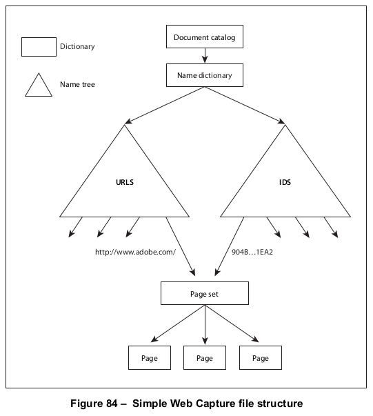
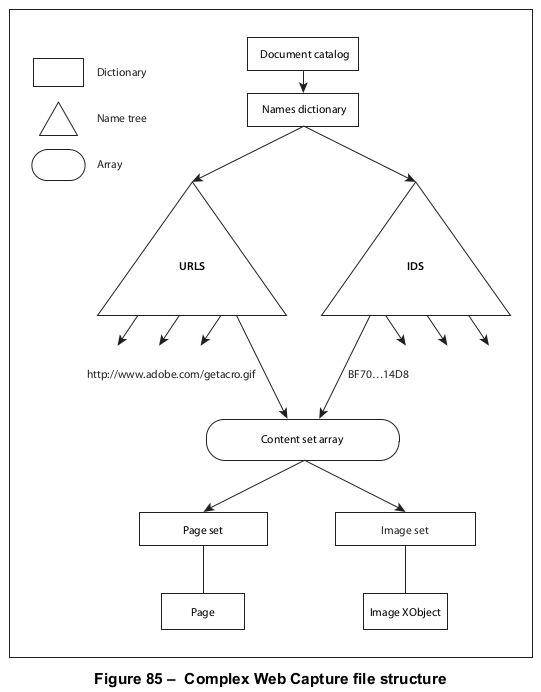

# 14.10 网页捕获

**14.10 Web Capture**

## 14.10.1 概述

**14.10.1 General**

=== "中文"

    The information in the Web Capture data structures enables conforming products to perform the following operations:
    
    - Save locally and preserve the visual appearance of material from the Web
    - Retrieve additional material from the Web and add it to an existing PDF file
    - Update or modify existing material previously captured from the Web
    - Find source information for material captured from the Web, such as the URL (if any) from which it was captured
    - Find all material in a PDF file that was generated from a given URL
    - Find all material in a PDF file that matches a given digital identifier (MD5 hash)
    
    The information needed to perform these operations shall be recorded in two data structures in the PDF file:
    
    - The *Web Capture information dictionary*, which shall hold document-level information related to Web Capture.
    - The *Web Capture content database*, which shall hold a complete registry of the source content resources retrieved by Web Capture and where it came from.
    
    !!! note "NOTE 3"
    
        The *Web Capture content database* enables the capturing process to avoid downloading material that is already present in the file.

=== "英文"

    The information in the Web Capture data structures enables conforming products to perform the following operations:
    
    - Save locally and preserve the visual appearance of material from the Web
    - Retrieve additional material from the Web and add it to an existing PDF file
    - Update or modify existing material previously captured from the Web
    - Find source information for material captured from the Web, such as the URL (if any) from which it was captured
    - Find all material in a PDF file that was generated from a given URL
    - Find all material in a PDF file that matches a given digital identifier (MD5 hash)
    
    The information needed to perform these operations shall be recorded in two data structures in the PDF file:
    
    - The *Web Capture information dictionary*, which shall hold document-level information related to Web Capture.
    - The *Web Capture content database*, which shall hold a complete registry of the source content resources retrieved by Web Capture and where it came from.
    
    !!! note "NOTE 3"
    
        The *Web Capture content database* enables the capturing process to avoid downloading material that is already present in the file.

## 14.10.2 网页捕获信息字典

**14.10.2 Web Capture Information Dictionary**

=== "中文"

    The optional SpiderInfo entry in the document catalogue (see [7.7.2], “Document Catalog”), if present, shall hold Web Capture information dictionary.
    
    <table id="table350" markdown="span">
        <caption>**Table 350 – Entries in the Web Capture information dictionary**</caption>
        <thead>
            <tr>
                <th>**Key**</th>
                <th>**Type**</th>
                <th>**Value**</th>
            </tr>
        </thead>
        <tbody>
            <tr>
                <td>**V**</td> 
                <td>number</td>
                <td>
                    (Required) The Web Capture version number. The version number shall be 1.0 in a conforming file.   
                    This value shall be a single real number, not a major and minor version number.   
                    EXAMPLE &emsp; A version number of 1.2 would be considered greater than 1.15.
                </td>
            </tr>
            <tr>
                <td>**C**</td> 
                <td>array</td>
                <td>
                (Optional) An array of indirect references to Web Capture command dictionaries (see [14.10.5.3], “Command Dictionaries”) describing commands that were used in building the PDF file. The commands shall appear in the array in the order in which they were executed in building the file.
                </td>
            </tr>
        </tbody>
    </table>

=== "英文"

    The optional SpiderInfo entry in the document catalogue (see [7.7.2], “Document Catalog”), if present, shall hold Web Capture information dictionary.
    
    <table id="table350" markdown="span">
        <caption>**Table 350 – Entries in the Web Capture information dictionary**</caption>
        <thead>
            <tr>
                <th>**Key**</th>
                <th>**Type**</th>
                <th>**Value**</th>
            </tr>
        </thead>
        <tbody>
            <tr>
                <td>**V**</td> 
                <td>number</td>
                <td>
                    (Required) The Web Capture version number. The version number shall be 1.0 in a conforming file.   
                    This value shall be a single real number, not a major and minor version number.   
                    EXAMPLE &emsp; A version number of 1.2 would be considered greater than 1.15.
                </td>
            </tr>
            <tr>
                <td>**C**</td> 
                <td>array</td>
                <td>
                (Optional) An array of indirect references to Web Capture command dictionaries (see [14.10.5.3], “Command Dictionaries”) describing commands that were used in building the PDF file. The commands shall appear in the array in the order in which they were executed in building the file.
                </td>
            </tr>
        </tbody>
    </table>

## 14.10.3 内容数据库

**14.10.3 Content Database**

### 14.10.3.1 概述

**14.10.3.1 General**

=== "中文"

    When a PDF file, or part of a PDF file, is built from a content resource stored in another format, such as an HTML page, the resulting PDF file (or portion thereof) may contain content from more than the single content resources. Conversely, since many content formats do not have static pagination, a single content resource may give rise to multiple PDF pages.
    
    To keep track of the correspondence between PDF content and the resources from which the content was derived, a PDF file may contain a *content database* that maps URLs and digital identifiers to PDF objects such as pages and XObjects.
    
    !!! note "NOTE 4"
    
        By looking up digital identifiers in the database, Web Capture can determine whether newly downloaded content is identical to content already retrieved from a different URL. Thus, it can perform optimizations such as storing only one copy of an image that is referenced by multiple HTML pages.
    
    Web Capture’s content database shall be organized into *content sets*. Each content set shall be a dictionary holding information about a group of related PDF objects generated from the same source data. A content set shall have for the value of its **S** (subtype) entry either the value SPS, for a page set, or SIS, for an image set.
    
    The mapping from a source content resource to a content set in a PDF document may be saved in the PDF file. The mapping may be an association from the resource's URL to the content set, stored in the PDF document's URLS name tree. The mapping may also be an association from a digital identifier ([14.10.3.3], “Digital Identifiers”) generated from resource's data to the content set, stored in the PDF document's IDS name tree. Both associations may be present in the PDF file.
    
    
    
    Entries in the **URLS** and **IDS** name trees may refer to an array of content sets or a single content set. If the entry is an array, the content sets need not have the same subtype; the array may include both page sets and image sets.
    
    

=== "英文"

    When a PDF file, or part of a PDF file, is built from a content resource stored in another format, such as an HTML page, the resulting PDF file (or portion thereof) may contain content from more than the single content resources. Conversely, since many content formats do not have static pagination, a single content resource may give rise to multiple PDF pages.
    
    To keep track of the correspondence between PDF content and the resources from which the content was derived, a PDF file may contain a *content database* that maps URLs and digital identifiers to PDF objects such as pages and XObjects.
    
    !!! note "NOTE 4"
    
        By looking up digital identifiers in the database, Web Capture can determine whether newly downloaded content is identical to content already retrieved from a different URL. Thus, it can perform optimizations such as storing only one copy of an image that is referenced by multiple HTML pages.
    
    Web Capture’s content database shall be organized into *content sets*. Each content set shall be a dictionary holding information about a group of related PDF objects generated from the same source data. A content set shall have for the value of its **S** (subtype) entry either the value SPS, for a page set, or SIS, for an image set.
    
    The mapping from a source content resource to a content set in a PDF document may be saved in the PDF file. The mapping may be an association from the resource's URL to the content set, stored in the PDF document's URLS name tree. The mapping may also be an association from a digital identifier ([14.10.3.3], “Digital Identifiers”) generated from resource's data to the content set, stored in the PDF document's IDS name tree. Both associations may be present in the PDF file.
    
    
    
    Entries in the **URLS** and **IDS** name trees may refer to an array of content sets or a single content set. If the entry is an array, the content sets need not have the same subtype; the array may include both page sets and image sets.
    
    

### 14.10.3.2 URL 字符串

**14.10.3.2 URL Strings**

=== "中文"

    URLs associated with Web Capture content sets shall be reduced to a predictable, canonical form before being used as keys in the **URLS** name tree. The following steps describe how to perform this reduction, using terminology from Internet RFCs 1738, *Uniform Resource Locators*, and 1808, *Relative Uniform Resource Locators* (see the [Bibliography](../bibliography.md)). This algorithm shall be applied for HTTP, FTP, and file URLs:
    
    **Algorithm: URL strings**
    
    a) If the URL is relative, it shall be converted into an absolute URL.
    b) If the URL contains one or more NUMBER SIGN (02h3) characters, it shall be truncated before the first NUMBER SIGN.
    c) Any uppercase ASCII characters within the scheme section of the URL shall be replaced with the corresponding lowercase ASCII characters.
    d) If there is a host section, any uppercase ASCII characters therein shall be converted to lowercase ASCII.
    e) If the scheme is file and the host is localhost, the host section shall be removed.
    f) If there is a port section and the port is the default port for the given protocol (80 for HTTP or 21 for FTP), the port section shall be removed.
    g) If the path section contains PERIOD (2Eh) ( . ) or DOUBLE PERIOD ( . . ) subsequences, transform the path as described in section 4 of RFC 1808.
    
    !!! note "NOTE"
    
        Because the PERCENT SIGN (25h) is unsafe according to RFC 1738 and is also the escape character for encoded characters, it is not possible in general to distinguish a URL with unencoded characters from one with encoded characters. For example, it is impossible to decide whether the sequence %00 represents a single encoded null character or a sequence of three unencoded characters. Hence, no number of encoding or decoding passes on a URL can ever cause it to reach a stable state. Empirically, URLs embedded in HTML files have unsafe characters encoded with one encoding pass, and Web servers perform one decoding pass on received paths (though CGI scripts can make their own decisions).
    
    Canonical URLs are thus assumed to have undergone one and only one encoding pass. A URL whose initial encoding state is known can be safely transformed into a URL that has undergone only one encoding pass.

=== "英文"

    URLs associated with Web Capture content sets shall be reduced to a predictable, canonical form before being used as keys in the **URLS** name tree. The following steps describe how to perform this reduction, using terminology from Internet RFCs 1738, *Uniform Resource Locators*, and 1808, *Relative Uniform Resource Locators* (see the [Bibliography](../bibliography.md)). This algorithm shall be applied for HTTP, FTP, and file URLs:
    
    **Algorithm: URL strings**
    
    a) If the URL is relative, it shall be converted into an absolute URL.
    b) If the URL contains one or more NUMBER SIGN (02h3) characters, it shall be truncated before the first NUMBER SIGN.
    c) Any uppercase ASCII characters within the scheme section of the URL shall be replaced with the corresponding lowercase ASCII characters.
    d) If there is a host section, any uppercase ASCII characters therein shall be converted to lowercase ASCII.
    e) If the scheme is file and the host is localhost, the host section shall be removed.
    f) If there is a port section and the port is the default port for the given protocol (80 for HTTP or 21 for FTP), the port section shall be removed.
    g) If the path section contains PERIOD (2Eh) ( . ) or DOUBLE PERIOD ( . . ) subsequences, transform the path as described in section 4 of RFC 1808.
    
    !!! note "NOTE"
    
        Because the PERCENT SIGN (25h) is unsafe according to RFC 1738 and is also the escape character for encoded characters, it is not possible in general to distinguish a URL with unencoded characters from one with encoded characters. For example, it is impossible to decide whether the sequence %00 represents a single encoded null character or a sequence of three unencoded characters. Hence, no number of encoding or decoding passes on a URL can ever cause it to reach a stable state. Empirically, URLs embedded in HTML files have unsafe characters encoded with one encoding pass, and Web servers perform one decoding pass on received paths (though CGI scripts can make their own decisions).
    
    Canonical URLs are thus assumed to have undergone one and only one encoding pass. A URL whose initial encoding state is known can be safely transformed into a URL that has undergone only one encoding pass.

### 14.10.3.3 数字标识符

**14.10.3.3 Digital Identifiers**

=== "中文"

    Digital identifiers, used to associate source content resources with content sets by the **IDS** name tree, shall be generated using the MD5 message-digest algorithm (Internet RFC 1321).
    
    !!! note "NOTE 1"
    
        The exact data passed to the algorithm depends on the type of content set and the nature of the identifier being calculated.
    
    For a page set, the source data shall be passed to the MD5 algorithm first, followed by strings representing the digital identifiers of any auxiliary data files (such as images) referenced in the source data, in the order in which they are first referenced. If an auxiliary file is referenced more than once, its identifier shall be passed only the first time. The resulting string shall be used as the digital identifier for the source content resource.
    
    !!! note "NOTE 2"
    
        This sequence produces a composite identifier representing the visual appearance of the pages in the page set.
    
    !!! note "NOTE 3"
    
        Two HTML source files that are identical, but for which the referenced images contain different data—for example, if they have been generated by a script or are pointed to by relative URLs—do not produce the same identifier.
    
    When the source data is a PDF file, the identifier shall be generated solely from the contents of that file; there shall be no auxiliary data.
    
    A page set may also have a text identifier, calculated by applying the MD5 algorithm to just the text present in the source data.
    
    !!! info "EXAMPLE 1"
    
        For an HTML file the text identifier is based solely on the text between markup tags; no images are used
    in the calculation.
    
    For an image set, the digital identifier shall be calculated by passing the source data for the original image to
    the MD5 algorithm.
    
    !!! info "EXAMPLE 2"
    
        The identifier for an image set created from a GIF image is calculated from the contents of the GIF.

=== "英文"

    Digital identifiers, used to associate source content resources with content sets by the **IDS** name tree, shall be generated using the MD5 message-digest algorithm (Internet RFC 1321).
    
    !!! note "NOTE 1"
    
        The exact data passed to the algorithm depends on the type of content set and the nature of the identifier being calculated.
    
    For a page set, the source data shall be passed to the MD5 algorithm first, followed by strings representing the digital identifiers of any auxiliary data files (such as images) referenced in the source data, in the order in which they are first referenced. If an auxiliary file is referenced more than once, its identifier shall be passed only the first time. The resulting string shall be used as the digital identifier for the source content resource.
    
    !!! note "NOTE 2"
    
        This sequence produces a composite identifier representing the visual appearance of the pages in the page set.
    
    !!! note "NOTE 3"
    
        Two HTML source files that are identical, but for which the referenced images contain different data—for example, if they have been generated by a script or are pointed to by relative URLs—do not produce the same identifier.
    
    When the source data is a PDF file, the identifier shall be generated solely from the contents of that file; there shall be no auxiliary data.
    
    A page set may also have a text identifier, calculated by applying the MD5 algorithm to just the text present in the source data.
    
    !!! info "EXAMPLE 1"
    
        For an HTML file the text identifier is based solely on the text between markup tags; no images are used
    in the calculation.
    
    For an image set, the digital identifier shall be calculated by passing the source data for the original image to
    the MD5 algorithm.
    
    !!! info "EXAMPLE 2"
    
        The identifier for an image set created from a GIF image is calculated from the contents of the GIF.

### 14.10.3.4 唯一名称生成

**14.10.3.4 Unique Name Generation**

=== "中文"

    In generating PDF pages from a data source, items such as hypertext links and HTML form fields are converted into corresponding named destinations and interactive form fields. These items shall be given names that do not conflict with those of other such items in the file.
    
    !!! note "NOTE"
    
        As used here, the term name refers to a string, not a name object.
    
    Furthermore, when updating an existing file, a conforming processor shall ensure that each destination or field is given a unique name that shall be derived from its original name but constructed so that it avoids conflicts with similarly named items elsewhere.
    
    The unique name shall be formed by appending an encoded form of the page set’s digital identifier string to the original name of the destination or field. The identifier string shall be encoded to remove characters that have special meaning in destinations and fields. The characters listed in the first column of [Table 351](#table351) have special meaning and shall be encoded using the corresponding byte values from second column of [Table 351](#table351).
    
    <table id="table351" markdown="span">
        <caption>**Table 351 – Characters with special meaning in destinations and fields and their byte values**</caption>
        <thead>
            <tr>
                <th>**Character**</th>
                <th>**Byte value**</th>
                <th>**Escape sequence**</th>
            </tr>
        </thead>
        <tbody>
            <tr>
                <td>(nul)</td> 
                <td>0x00</td>
                <td>\0 (0x5c 0x30)</td>
            </tr>
            <tr>
                <td>. (PERIOD)</td> 
                <td>0x2e</td>
                <td>\p (0x5c 0x70)</td>
            </tr>
            <tr>
                <td>\ (backslash)</td> 
                <td>0x5c</td>
                <td>\\ (0x5c 0x5c)</td>
            </tr>
        </tbody>
    </table>
    
    !!! info "EXAMPLE"
    
        Since the PERIOD character (2Eh) is used as the field separator in interactive form field names, it does not appear in the identifier portion of the unique name.
    
    If the name is used for an interactive form field, there is an additional encoding to ensure uniqueness and compatibility with interactive forms. Each byte in the source string, encoded as described previously, shall be replaced by two bytes in the destination string. The first byte in each pair is 65 (corresponding to the ASCII character A) plus the high-order 4 bits of the source byte; the second byte is 65 plus the low-order 4 bits of the source byte.

=== "英文"

    In generating PDF pages from a data source, items such as hypertext links and HTML form fields are converted into corresponding named destinations and interactive form fields. These items shall be given names that do not conflict with those of other such items in the file.
    
    !!! note "NOTE"
    
        As used here, the term name refers to a string, not a name object.
    
    Furthermore, when updating an existing file, a conforming processor shall ensure that each destination or field is given a unique name that shall be derived from its original name but constructed so that it avoids conflicts with similarly named items elsewhere.
    
    The unique name shall be formed by appending an encoded form of the page set’s digital identifier string to the original name of the destination or field. The identifier string shall be encoded to remove characters that have special meaning in destinations and fields. The characters listed in the first column of [Table 351](#table351) have special meaning and shall be encoded using the corresponding byte values from second column of [Table 351](#table351).
    
    <table id="table351" markdown="span">
        <caption>**Table 351 – Characters with special meaning in destinations and fields and their byte values**</caption>
        <thead>
            <tr>
                <th>**Character**</th>
                <th>**Byte value**</th>
                <th>**Escape sequence**</th>
            </tr>
        </thead>
        <tbody>
            <tr>
                <td>(nul)</td> 
                <td>0x00</td>
                <td>\0 (0x5c 0x30)</td>
            </tr>
            <tr>
                <td>. (PERIOD)</td> 
                <td>0x2e</td>
                <td>\p (0x5c 0x70)</td>
            </tr>
            <tr>
                <td>\ (backslash)</td> 
                <td>0x5c</td>
                <td>\\ (0x5c 0x5c)</td>
            </tr>
        </tbody>
    </table>
    
    !!! info "EXAMPLE"
    
        Since the PERIOD character (2Eh) is used as the field separator in interactive form field names, it does not appear in the identifier portion of the unique name.
    
    If the name is used for an interactive form field, there is an additional encoding to ensure uniqueness and compatibility with interactive forms. Each byte in the source string, encoded as described previously, shall be replaced by two bytes in the destination string. The first byte in each pair is 65 (corresponding to the ASCII character A) plus the high-order 4 bits of the source byte; the second byte is 65 plus the low-order 4 bits of the source byte.

## 14.10.4 内容集

**14.10.4 Content Sets**

### 14.10.4.1 概述

**14.10.4.1 General**

=== "中文"

    A Web Capture *content set* is a dictionary describing a set of PDF objects generated from the same source data. It may include information common to all the objects in the set as well as about the set itself. [Table 352](#table352) defines the contents of this type of dictionary.

=== "英文"

    A Web Capture *content set* is a dictionary describing a set of PDF objects generated from the same source data. It may include information common to all the objects in the set as well as about the set itself. [Table 352](#table352) defines the contents of this type of dictionary.

### 14.10.4.2 页面集

**14.10.4.2 Page Sets**

=== "中文"
    
    A page set is a content set containing a group of PDF page objects generated from a common source, such as an HTML file. The pages shall be listed in the **O** array of the page set dictionary (see [Table 352](#table352)) in the same order in which they were initially added to the file. A single page object shall not belong to more than one page set. [Table 353](#table353) defines the content set dictionary entries specific to Page Sets.
    
    The TID (text identifier) entry may be used to store an identifier generated from the text of the pages belonging to the page set (see [14.10.3.3], “Digital Identifiers”). A text identifier may not be appropriate for some page sets (such as those with no text) and may be omitted in these cases.
    
    !!! info "EXAMPLE"
    
        This identifier may be used to determine whether the text of a document has changed.
    
    <table id="table352" markdown="span">
        <caption>**Table 352 – Entries common to all Web Capture content sets**</caption>
        <thead>
            <tr>
                <th>**Key**</th>
                <th>**Type**</th>
                <th>**Value**</th>
            </tr>
        </thead>
        <tbody>
            <tr>
                <td>**Type**</td> 
                <td>name</td>
                <td>(Optional) The type of PDF object that this dictionary describes; if present, shall be **SpiderContentSet** for a Web Capture content set.</td>
            </tr>
            <tr>
                <td>**S**</td> 
                <td>name</td>
                <td>
                (Required) The subtype of content set that this dictionary describes. The value shall be one of:   
                **SPS** &emsp; (“Spider page set”) A page set    
                **SIS** &emsp; (“Spider image set”) An image set    
                </td>
            </tr>
            <tr><td>ID</td> <td>byte string</td> <td>(Required) The digital identifier of the content set (see [14.10.3.3], “DigitalIdentifiers”).</td></tr>
            <tr><td>O</td> <td> array </td> <td>(Required) An array of indirect references to the objects belonging to the content set. The order of objects in the array is restricted when the content set subtype (**S** entry) is SPS (see [14.10.4.2], “Page Sets”).</td></tr>
            <tr><td>SI</td> <td> dictionary or array </td> <td>(Required) A source information dictionary (see [14.10.5], “Source Information”) or an array of such dictionaries, describing the sources from which the objects belonging to the content set were created.</td></tr>
            <tr><td>CT</td> <td> ASCII string</td> <td>(Optional) The content type, an ASCII string characterizing the source from which the objects belonging to the content set were created. The string shall conform to the content type specification described in Internet RFC 2045, Multipurpose Internet Mail Extensions (MIME) Part One: Format of Internet Message Bodies (see the Bibliography).   
            EXAMPLE &emsp; for a page set consisting of a group of PDF pages created from an HTML file, the content type would be text / html.</td></tr>
            <tr><td>TS</td> <td> date</td> <td> (Optional) A time stamp giving the date and time at which the content set was created.</td></tr>
        </tbody>
    </table>
    
    <table id="table353" markdown="span">
        <caption>**Table 353 – Additional entries specific to a Web Capture page set**</caption>
        <thead>
            <tr>
                <th>**Key**</th>
                <th>**Type**</th>
                <th>**Value**</th>
            </tr>
        </thead>
        <tbody>
            <tr>
                <td>**S**</td> 
                <td>name</td>
                <td>(Required) The subtype of content set that this dictionary describes; shall be **SPS**.</td>
            </tr>
            <tr>
                <td>**T**</td> 
                <td>text string</td>
                <td>
                (Optional) The title of the page set, a human-readable text string.
                </td>
            </tr>
            <tr>
                <td>**TID**</td> 
                <td>byte string</td>
                <td>
                (Optional) A text identifier generated from the text of the page set, as described in [14.10.3.3], “Digital Identifiers.”
                </td>
            </tr>
        </tbody>
    </table>

=== "英文"
    
    A page set is a content set containing a group of PDF page objects generated from a common source, such as an HTML file. The pages shall be listed in the **O** array of the page set dictionary (see [Table 352](#table352)) in the same order in which they were initially added to the file. A single page object shall not belong to more than one page set. [Table 353](#table353) defines the content set dictionary entries specific to Page Sets.
    
    The TID (text identifier) entry may be used to store an identifier generated from the text of the pages belonging to the page set (see [14.10.3.3], “Digital Identifiers”). A text identifier may not be appropriate for some page sets (such as those with no text) and may be omitted in these cases.
    
    !!! info "EXAMPLE"
    
        This identifier may be used to determine whether the text of a document has changed.
    
    <table id="table352" markdown="span">
        <caption>**Table 352 – Entries common to all Web Capture content sets**</caption>
        <thead>
            <tr>
                <th>**Key**</th>
                <th>**Type**</th>
                <th>**Value**</th>
            </tr>
        </thead>
        <tbody>
            <tr>
                <td>**Type**</td> 
                <td>name</td>
                <td>(Optional) The type of PDF object that this dictionary describes; if present, shall be **SpiderContentSet** for a Web Capture content set.</td>
            </tr>
            <tr>
                <td>**S**</td> 
                <td>name</td>
                <td>
                (Required) The subtype of content set that this dictionary describes. The value shall be one of:   
                **SPS** &emsp; (“Spider page set”) A page set    
                **SIS** &emsp; (“Spider image set”) An image set    
                </td>
            </tr>
            <tr><td>ID</td> <td>byte string</td> <td>(Required) The digital identifier of the content set (see [14.10.3.3], “DigitalIdentifiers”).</td></tr>
            <tr><td>O</td> <td> array </td> <td>(Required) An array of indirect references to the objects belonging to the content set. The order of objects in the array is restricted when the content set subtype (**S** entry) is SPS (see [14.10.4.2], “Page Sets”).</td></tr>
            <tr><td>SI</td> <td> dictionary or array </td> <td>(Required) A source information dictionary (see [14.10.5], “Source Information”) or an array of such dictionaries, describing the sources from which the objects belonging to the content set were created.</td></tr>
            <tr><td>CT</td> <td> ASCII string</td> <td>(Optional) The content type, an ASCII string characterizing the source from which the objects belonging to the content set were created. The string shall conform to the content type specification described in Internet RFC 2045, Multipurpose Internet Mail Extensions (MIME) Part One: Format of Internet Message Bodies (see the Bibliography).   
            EXAMPLE &emsp; for a page set consisting of a group of PDF pages created from an HTML file, the content type would be text / html.</td></tr>
            <tr><td>TS</td> <td> date</td> <td> (Optional) A time stamp giving the date and time at which the content set was created.</td></tr>
        </tbody>
    </table>
    
    <table id="table353" markdown="span">
        <caption>**Table 353 – Additional entries specific to a Web Capture page set**</caption>
        <thead>
            <tr>
                <th>**Key**</th>
                <th>**Type**</th>
                <th>**Value**</th>
            </tr>
        </thead>
        <tbody>
            <tr>
                <td>**S**</td> 
                <td>name</td>
                <td>(Required) The subtype of content set that this dictionary describes; shall be **SPS**.</td>
            </tr>
            <tr>
                <td>**T**</td> 
                <td>text string</td>
                <td>
                (Optional) The title of the page set, a human-readable text string.
                </td>
            </tr>
            <tr>
                <td>**TID**</td> 
                <td>byte string</td>
                <td>
                (Optional) A text identifier generated from the text of the page set, as described in [14.10.3.3], “Digital Identifiers.”
                </td>
            </tr>
        </tbody>
    </table>

### 14.10.4.3 图像集

**14.10.4.3 Image Sets**

=== "中文"

=== "英文"

## 14.10.5 源信息

**14.10.5 Source Information**

=== "中文"

=== "英文"

### 14.10.5.1 概述

**14.10.5.1 General**

=== "中文"

=== "英文"

### 14.10.5.2 URL 别名字典

**14.10.5.2 URL Alias Dictionaries**

=== "中文"

=== "英文"

### 14.10.5.3 命令字典

**14.10.5.3 Command Dictionaries**

=== "中文"

=== "英文"

### 14.10.5.4 命令设置

**14.10.5.4 Command Settings**

=== "中文"

=== "英文"

## 14.10.6 与网页捕获相关的对象属性

**14.10.6 Object Attributes Related to Web Capture**

=== "中文"

=== "英文"

[7.7.2]

[14.10.5]
[14.10.3.3]