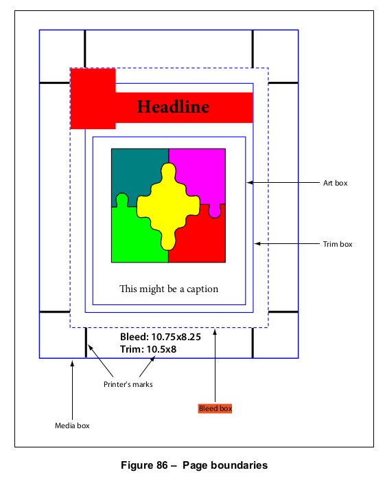
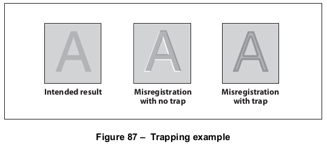

# 14.11 印前支持

**14.11 Prepress Support**

## 14.11.1 概述

**14.11.1 General**

=== "中文"

    本子条款描述了支持印前生产工作流程的 PDF 特性：

    - 页面 *边界* 的指定，涉及印前过程中的各个方面，如裁剪、出血和修剪（[14.11.2]，"页面边界"）
    - 包含 *打印标记* 的设施，如注册目标、灰度渐变、色条和切割标记，帮助生产过程（[14.11.3]，"打印标记"）
    - 为文档中的页面生成 *颜色* 分色信息（[14.11.4]，"分色字典"）
    - 用于匹配文档的颜色特征与目标输出设备或生产环境的 *输出意图*（[14.11.5]，"输出意图"）
    - 支持生成 *色彩陷阱*，以最小化多个色彩之间错位的视觉效果（[14.11.6]，"色彩陷阱支持"）
    - 开放印前接口（OPI），用于为高分辨率图像创建低分辨率代理（[14.11.7]，"开放印前接口（OPI）"）

=== "英文"

    This sub-clause describes features of PDF that support prepress production workflows:
    
    - The specification of page *boundaries* governing various aspects of the prepress process, such as cropping, bleed, and trimming ([14.11.2], “Page Boundaries”)
    - Facilities for including *printer’s marks*, such as registration targets, gray ramps, colour bars, and cut marks to assist in the production process ([14.11.3], “Printer’s Marks”)
    - Information for generating *colour* separations for pages in a document ([14.11.4], “Separation Dictionaries”)
    - *Output intents* for matching the colour characteristics of a document with those of a target output device or production environment in which it will be printed ([14.11.5], “Output Intents”)
    - Support for the generation of traps to minimize the visual effects of misregistration between multiple colorants ([14.11.6], “Trapping Support”)
    - The Open Prepress Interface (OPI) for creating low-resolution proxies for high-resolution images ([14.11.7], “Open Prepress Interface (OPI)”)

## 14.11.2 页面边界

**14.11.2 Page Boundaries**

### 14.11.2.1 概述

**14.11.2.1 General**

=== "中文"

    PDF 页面可以为成品介质（如纸张）或作为印前过程的一部分进行准备，其中页面的内容被放置在中介介质上（如胶片或加版复制板）。在后一种情况下，区分中介页面和成品页面非常重要。中介页面通常包含额外的与生产相关的内容，如出血或打印标记，这些内容超出了成品页面的边界。为处理此类情况，PDF 页面可以定义多达五个独立的边界，以控制成像过程的各个方面：

    - *媒体框* 定义了页面要打印的物理介质的边界。它可能包括围绕成品页面的任何扩展区域，如出血、打印标记或其他类似的用途。它还可能包括接近介质边缘的区域，这些区域由于输出设备的物理限制不能被标记。落在此边界之外的内容可以安全地丢弃，而不影响 PDF 文件的含义。
    - *裁剪框* 定义了页面内容在显示或打印时应被裁剪的区域。与其他框不同，裁剪框没有定义的物理页面几何形状或预期用途；它仅仅对页面内容进行裁剪。然而，在没有附加信息（如 JDF 或 PJTF 作业票证中指定的排版指令）的情况下，裁剪框决定了页面内容如何在输出介质上定位。默认值为页面的媒体框。
    - *出血框*（PDF 1.3）定义了页面内容在生产环境中输出时应被裁剪的区域。这可能包括为适应切割、折叠和修剪设备的物理限制而需要的额外出血区域。实际打印的页面可能包括落在出血框之外的打印标记。默认值为页面的裁剪框。
    - *修剪框*（PDF 1.3）定义了成品页面修剪后的预期尺寸。它可能比媒体框小，以便容纳与生产相关的内容，如打印指令、切割标记或色条。默认值为页面的裁剪框。
    - *艺术框*（PDF 1.3）定义了页面的有意义内容的范围（包括潜在的空白区域），这是页面创建者预期的。默认值为页面的裁剪框。

    页面对象字典在 **MediaBox**、**CropBox**、**BleedBox**、**TrimBox** 和 **ArtBox** 条目中分别指定这些边界（见 [Table 30](../c7/s7.md#table30)）。它们都是以默认用户空间单位表示的矩形。裁剪框、出血框、修剪框和艺术框通常不应超出媒体框的边界。如果它们超出，实际上它们将被缩减到与媒体框的交集。图 86 说明了这些边界之间的关系。（图中未显示裁剪框，因为它与其他边界没有定义的关系。）

    !!! note "注意 1"

        各种边界的使用方式取决于页面的用途。以下是典型的用途：

    *将页面内容放置在另一个应用程序中*：艺术框决定了要放置在应用程序中的内容边界。根据适用的使用惯例，放置的内容可能会被裁剪到艺术框或出血框。例如，要放置在杂志页面上的四分之一页面广告，可能会在广告面对页面中间的两侧裁剪到艺术框，而在两侧超出页面边缘的部分裁剪到出血框。媒体框和修剪框被忽略。

    *打印成品页面*：这种情况典型地适用于桌面或共享页面打印机，其中页面内容直接定位在最终的输出介质上。艺术框和出血框被忽略。媒体框可用作选择适当尺寸介质的建议。裁剪框和修剪框（如果存在）应与媒体框相同。

    *打印用于印前过程的中介页面*：艺术框被忽略。出血框定义了要成像的内容边界。修剪框指定了内容在介质上的定位；它也可以用于生成出血框之外的切割或折叠标记。位于媒体框内但超出出血框的内容，可能会或可能不会被成像，具体取决于所使用的生产过程。

    *在印刷版纸上构建多页面排版*：艺术框被忽略。出血框定义了要成像的内容的裁剪边界；超出出血框的内容被忽略。修剪框指定了页面内容在排版中的定位。通常会为整个排版生成切割和折叠标记。

    !!! note "注意 2"

        在上述场景中，解释出血框、修剪框和艺术框的应用程序通常会修改裁剪框，以强加这些框规定的裁剪。

=== "英文"

    A PDF page may be prepared either for a finished medium, such as a sheet of paper, or as part of a prepress process in which the content of the page is placed on an intermediate medium, such as film or an imposed reproduction plate. In the latter case, it is important to distinguish between the intermediate page and the finished page. The intermediate page may often include additional production-related content, such as bleeds or printer marks, that falls outside the boundaries of the finished page. To handle such cases, a PDF page may define as many as five separate boundaries to control various aspects of the imaging process:
    
    - The *media box* defines the boundaries of the physical medium on which the page is to be printed. It may include any extended area surrounding the finished page for bleed, printing marks, or other such purposes. It may also include areas close to the edges of the medium that cannot be marked because of physical limitations of the output device. Content falling outside this boundary may safely be discarded without affecting the meaning of the PDF file.
    - The *crop box* defines the region to which the contents of the page shall be clipped (cropped) when displayed or printed. Unlike the other boxes, the crop box has no defined meaning in terms of physical page geometry or intended use; it merely imposes clipping on the page contents. However, in the absence of additional information (such as imposition instructions specified in a JDF or PJTF job ticket), the crop box determines how the page’s contents shall be positioned on the output medium. The default value is the page’s media box.
    - The *bleed box* (PDF 1.3) defines the region to which the contents of the page shall be clipped when output in a production environment. This may include any extra bleed area needed to accommodate the physical limitations of cutting, folding, and trimming equipment. The actual printed page may include printing marks that fall outside the bleed box. The default value is the page’s crop box.
    - The *trim box* (PDF 1.3) defines the intended dimensions of the finished page after trimming. It may be smaller than the media box to allow for production-related content, such as printing instructions, cut marks, or colour bars. The default value is the page’s crop box.
    - The *art box* (PDF 1.3) defines the extent of the page’s meaningful content (including potential white space) as intended by the page’s creator. The default value is the page’s crop box.
    
    The page object dictionary specifies these boundaries in the **MediaBox**, **CropBox**, **BleedBox**, **TrimBox**, and **ArtBox** entries, respectively (see [Table 30](../c7/s7.md#table30)). All of them are rectangles expressed in default user space units. The crop, bleed, trim, and art boxes shall not ordinarily extend beyond the boundaries of the media box. If they do, they are effectively reduced to their intersection with the media box. Figure 86 illustrates the relationships among these boundaries. (The crop box is not shown in the figure because it has no defined relationship with any of the other boundaries.)
    
    
    
    !!! note "NOTE 1"
    
        How the various boundaries are used depends on the purpose to which the page is being put. The following are typical purposes:
    
    *Placing the content of a page in another application*. The art box determines the boundary of the content that is to be placed in the application. Depending on the applicable usage conventions, the placed content may be clipped to either the art box or the bleed box. For example, a quarter-page advertisement to be placed on a magazine page might be clipped to the art box on the two sides of the ad that face into the middle of the page and to the bleed box on the two sides that bleed over the edge of the page. The media box and trim box are ignored.
    
    *Printing a finished page*. This case is typical of desktop or shared page printers, in which the page content is positioned directly on the final output medium. The art box and bleed box are ignored. The media box may be used as advice for selecting media of the appropriate size. The crop box and trim box, if present, should be the same as the media box.
    
    *Printing an intermediate page for use in a prepress process*. The art box is ignored. The bleed box defines the boundary of the content to be imaged. The trim box specifies the positioning of the content on the medium; it may also be used to generate cut or fold marks outside the bleed box. Content falling within the media box but outside the bleed box may or may not be imaged, depending on the specific production process being used.
    
    *Building an imposition of multiple pages on a press sheet*. The art box is ignored. The bleed box defines the clipping boundary of the content to be imaged; content outside the bleed box is ignored. The trim box specifies the positioning of the page’s content within the imposition. Cut and fold marks are typically generated for the imposition as a whole.
    
    !!! note "NOTE 2"
    
        In the preceding scenarios, an application that interprets the bleed, trim, and art boxes for some purpose typically alters the crop box so as to impose the clipping that those boxes prescribe.

### 14.11.2.2 页面边界的显示

**14.11.2.2 Display of Page Boundaries**

=== "中文"

    符合规范的阅读器可能提供在屏幕上显示各种页面边界的指南的功能。页面对象中的可选 **BoxColorInfo** 条目（见 [7.7.3.3]，"页面对象"）包含一个 *框颜色信息字典*（PDF 1.4），该字典指定用于显示这些边界的颜色和其他视觉特性。符合规范的阅读器通常提供用户界面，允许用户交互式地设置这些特性。

    !!! note "注意"

        这些信息是页面特定的，可能在不同的页面之间有所不同。

    如[表 360](#table360)所示，框颜色信息字典包含除媒体框外的每个可能页面边界的可选条目。每个条目的值是一个框样式字典，其内容如[表 361](#table361)所示。如果某个条目缺失，符合规范的阅读器应使用其当前的默认设置。

=== "英文"

    Conforming readers may offer the ability to display guidelines on the screen for the various page boundaries. The optional **BoxColorInfo** entry in a page object (see [7.7.3.3], “Page Objects”) holds a *box colour information dictionary* (PDF 1.4) specifying the colours and other visual characteristics to be used for such display. Conforming readers typically provide a user interface to allow the user to set these characteristics interactively.
    
    !!! note "NOTE"
    
        This information is page-specific and may vary from one page to another.
    
    As shown in [Table 360](#table360), the box colour information dictionary contains an optional entry for each of the possible page boundaries other than the media box. The value of each entry is a box style dictionary, whose contents are shown in [Table 361](#table361). If a given entry is absent, the conforming reader shall use its own current default settings instead.

## 14.11.3 印刷标记

**14.11.3 Printer’s Marks**

=== "中文"

    *打印标记* 是添加到页面上的图形符号或文本，帮助生产人员识别多板作业的组成部分，并保持生产过程中输出的一致性。印刷行业常用的示例如下：

    - 用于对准版面的注册目标
    - 用于测量颜色和油墨密度的灰度渐变和色条
    - 显示输出介质修剪位置的切割标记

    尽管符合标准的写作人员传统上将这些标记包含在文档的内容流中，但它们在逻辑上与页面的实际内容是分开的，通常出现在定义页面内容范围的边界（裁剪框、修剪框和艺术框）之外（见[14.11.2]，“页面边界”）。

    *打印标记注释*（PDF 1.4）提供了一种将打印标记合并到PDF页面表示中的机制，同时将它们与实际页面内容分开。在PDF文档的每一页中，可以包含任意数量的此类注释，每个注释代表一个单独的打印标记。

    !!! note "注意 1"

        由于打印标记通常位于页面内容边界之外，因此每个标记都表示为单独的注释。否则——例如，如果页面四个角的切割标记在单个注释中定义——注释矩形将涵盖页面的全部内容，并可能干扰用户选择内容或与页面上的其他注释交互。将打印标记定义为单独的注释还便于实现一个拖放用户界面来指定它们。
                        
    <table id="table360" markdown="span">
        <caption>**表 360 – 框颜色信息字典中的条目**</caption>
        <thead>
            <tr>
                <th>**键**</th>
                <th>**类型**</th>
                <th>**值**</th>
            </tr>
        </thead>
        <tbody>
            <tr><td>CropBox</td> <td>字典 </td> <td>（可选）框样式字典（见[表 361](#table361)），指定显示页面裁剪框的指南线的视觉特征。如果页面对象未定义裁剪框，则忽略此条目。</td></tr>
            <tr><td>BleedBox</td> <td>字典 </td> <td>（可选）框样式字典（见[表 361](#table361)），指定显示页面出血框的指南线的视觉特征。如果页面对象未定义出血框，则忽略此条目。</td></tr>
            <tr><td>TrimBox</td> <td>字典 </td> <td>（可选）框样式字典（见[表 361](#table361)），指定显示页面修剪框的指南线的视觉特征。如果页面对象未定义修剪框，则忽略此条目。</td></tr>
            <tr><td>ArtBox</td> <td>字典 </td> <td>（可选）框样式字典（见[表 361](#table361)），指定显示页面艺术框的指南线的视觉特征。如果页面对象未定义艺术框，则忽略此条目。</td></tr>
        </tbody>
    </table>

    <table id="table361" markdown="span">
        <caption>**表 361 – 框样式字典中的条目**</caption>
        <thead>
            <tr>
                <th>**键**</th>
                <th>**类型**</th>
                <th>**值**</th>
            </tr>
        </thead>
        <tbody>
            <tr><td>C</td> <td>数组 </td> <td>（可选）一个由三个数字组成的数组，范围为0.0到1.0，表示用于显示指南线的颜色，采用**DeviceRGB**颜色空间。默认值：[0.0 0.0 0.0]。</td></tr>
            <tr><td>W</td> <td>数字 </td> <td>（可选）指南线的宽度，单位为默认用户空间单位。默认值：1。</td></tr>
            <tr><td>S</td> <td>名称 </td> <td>（可选）指南线样式：<br/><br/>
                S &emsp;（实线）一个实心矩形。 <br/>
                D &emsp;（虚线）一个虚线矩形，虚线模式由**D**条目指定。 <br/>
                其他指南线样式可能将来会被定义。默认值：S。</td></tr>
            <tr><td>D</td> <td>数组 </td> <td>（可选）一个虚线数组，定义虚线指南线的虚线和空隙模式（虚线样式D）。虚线数组应采用默认用户空间单位，格式与图形状态中的线段虚线模式参数相同（见[8.4.3.6]，“线段虚线模式”）。虚线的阶段不应指定，默认为0。<br/> <br/>
            示例 &emsp; D条目为[ 3 2 ]指定了带有3点虚线和2点间隙的指南线。<br/>
            默认值：[ 3 ]。</td></tr>
        </tbody>
    </table>

    打印标记的视觉呈现应通过一个表单XObject定义，该对象指定为打印标记注释的外观字典中的**N**（正常）条目（见[12.5.5]，“外观流”）。同一个打印标记可以定义多个外观，以满足不同区域或生产设施的要求。在这种情况下，外观字典的**N**条目包含一个子字典，其中包含备用外观，每个外观都有一个任意的键。注释字典中的**AS**（外观状态）条目指定一个外观进行显示或打印。

    !!! note "注意 2"

        打印标记注释的外观字典可能包含**R**（悬停）或**D**（点击）条目，但在这些条目中定义的外观永远不会显示或打印。

    像所有注释一样，打印标记注释应通过注释字典定义（见[12.5.2]，“注释字典”）；其注释类型为**PrinterMark**。如果外观字典**AP**包含多个外观流，则**AP**（外观）和**F**（标志）条目（通常是可选的）必须存在，并且如果有多个外观流，**AS**（外观状态）条目也必须存在。**F**条目中的打印和只读标志应被设置，其他标志应清除（见[12.5.3]，“注释标志”）。表362显示了此类注释特有的附加条目。
                        
    <table id="table362" markdown="span">
        <caption>**表 362 – 打印标记注释特有的附加条目**</caption>
        <thead>
            <tr>
                <th>**键**</th>
                <th>**类型**</th>
                <th>**值**</th>
            </tr>
        </thead>
        <tbody>
            <tr><td>Subtype</td> <td>名称 </td> <td>（必需）此字典描述的注释类型；对于打印标记注释，应为**PrinterMark**。</td></tr>
            <tr><td>MN</td> <td>名称 </td> <td>（可选）标识打印标记类型的任意名称，如ColorBar或RegistrationTarget。</td></tr>
        </tbody>
    </table>

    定义打印标记的表单字典可能包含[表 363]中显示的可选条目，以及所有表单字典通用的标准条目（见[8.10.2]，“表单字典”）。
                        
    <table id="table363" markdown="span">
        <caption>**表 363 – 打印标记表单字典特有的附加条目**</caption>
        <thead>
            <tr>
                <th>**键**</th>
                <th>**类型**</th>
                <th>**值**</th>
            </tr>
        </thead>
        <tbody>
            <tr><td>MarkStyle</td> <td>文本字符串 </td> <td>（可选；PDF 1.4）表示打印标记的文本字符串，适合向用户呈现。</td></tr>
            <tr><td>Colorants</td> <td>字典 </td> <td>（可选；PDF 1.4）一个字典，标识与打印标记相关联的各个颜色剂，如色条。字典中的每个条目的键是颜色剂名称，值是一个数组，定义该颜色剂的**Separation**颜色空间（见[8.6.6.4]，“Separation颜色空间”）。键应与该颜色空间中给出的颜色剂名称匹配。</td></tr>
        </tbody>
    </table>

=== "英文"

    *Printer’s marks* are graphic symbols or text added to a page to assist production personnel in identifying components of a multiple-plate job and maintaining consistent output during production. Examples commonly used in the printing industry include:
    
    - Registration targets for aligning plates
    - Gray ramps and colour bars for measuring colours and ink densities
    - Cut marks showing where the output medium is to be trimmed
    
    Although conforming writers traditionally include such marks in the content stream of a document, they are logically separate from the content of the page itself and typically appear outside the boundaries (the crop box, trim box, and art box) defining the extent of that content (see [14.11.2], “Page Boundaries”).
    
    *Printer’s mark annotations* (PDF 1.4) provide a mechanism for incorporating printer’s marks into the PDF representation of a page, while keeping them separate from the actual page content. Each page in a PDF document may contain any number of such annotations, each of which represents a single printer’s mark.
    
    !!! note "NOTE 1"
    
        Because printer’s marks typically fall outside the page’s content boundaries, each mark is represented as a separate annotation. Otherwise—if, for example, the cut marks at the four corners of the page were defined in a single annotation—the annotation rectangle would encompass the entire contents of the page and could interfere with the user’s ability to select content or interact with other annotations on the page. Defining printer’s marks in separate annotations also facilitates the implementation of a drag-and-drop user interface for specifying them.
                        
    <table id="table360" markdown="span">
        <caption>**Table 360 – Entries in a box colour information dictionary**</caption>
        <thead>
            <tr>
                <th>**Key**</th>
                <th>**Type**</th>
                <th>**Value**</th>
            </tr>
        </thead>
        <tbody>
            <tr><td>CropBox</td> <td>dictionary </td> <td>(Optional) A box style dictionary (see [Table 361](#table361)) specifying the visual characteristics for displaying guidelines for the page’s crop box. This entry shall be ignored if no crop box is defined in the page object.</td></tr>
            <tr><td>BleedBox</td> <td>dictionary </td> <td>(Optional) A box style dictionary (see [Table 361](#table361)) specifying the visual characteristics for displaying guidelines for the page’s bleed box. This entry shall be ignored if no bleed box is defined in the page object.</td></tr>
            <tr><td>TrimBox</td> <td>dictionary </td> <td>(Optional) A box style dictionary (see [Table 361](#table361)) specifying the visual characteristics for displaying guidelines for the page’s trim box. This entry shall be ignored if no trim box is defined in the page object.</td></tr>
            <tr><td>ArtBox</td> <td>dictionary </td> <td>(Optional) A box style dictionary (see [Table 361](#table361)) specifying the visual characteristics for displaying guidelines for the page’s art box. This entry shall be ignored if no art box is defined in the page object.</td></tr>
        </tbody>
    </table>
                        
    <table id="table361" markdown="span">
        <caption>**Table 361 – Entries in a box style dictionary**</caption>
        <thead>
            <tr>
                <th>**Key**</th>
                <th>**Type**</th>
                <th>**Value**</th>
            </tr>
        </thead>
        <tbody>
            <tr><td>C</td> <td>array </td> <td>(Optional) An array of three numbers in the range 0.0 to 1.0, representing the components in the **DeviceRGB** colour space of the colour to be used for displaying the guidelines. Default value: [0.0 0.0 0.0].</td></tr>
            <tr><td>W</td> <td>number </td> <td>(Optional) The guideline width in default user space units. Default value: 1.</td></tr>
            <tr><td>S</td> <td>name </td> <td>(Optional) The guideline style: <br/><br/>
                S &emsp; (Solid) A solid rectangle. <br/>
                D &emsp; (Dashed) A dashed rectangle. The dash pattern shall be specified by the **D** entry. <br/>
                Other guideline styles may be defined in the future. Default value: S.</td></tr>
            <tr><td>D</td> <td>array </td> <td>(Optional) A dash array defining a pattern of dashes and gaps to be used in drawing dashed guidelines (guideline style D). The dash array shall be specified in default user space units, in the same format as in the line dash pattern parameter of the graphics state (see [8.4.3.6], “Line Dash Pattern”). The dash phase shall not be specified and shall be assumed to be 0. <br/> <br/>
            EXAMPLE &emsp; A D entry of [ 3 2 ] specifies guidelines drawn with 3-point dashes alternating with 2-point gaps. <br/>
            Default value: [ 3 ].</td></tr>
        </tbody>
    </table>
    
    The visual presentation of a printer’s mark shall be defined by a form XObject specified as an appearance stream in the **N** (normal) entry of the printer’s mark annotation’s appearance dictionary (see [12.5.5], “Appearance Streams”). More than one appearance may be defined for the same printer’s mark to meet the requirements of different regions or production facilities. In this case, the appearance dictionary’s **N** entry holds a subdictionary containing the alternate appearances, each identified by an arbitrary key. The **AS** (appearance state) entry in the annotation dictionary designates one of them to be displayed or printed.
    
    !!! note "NOTE 2"
    
        The printer’s mark annotation’s appearance dictionary may include **R** (rollover) or **D** (down) entries, but appearances defined in either of these entries are never displayed or printed.
    
    Like all annotations, a printer’s mark annotation shall be defined by an annotation dictionary (see [12.5.2], “Annotation Dictionaries”); its annotation type is **PrinterMark**. The **AP** (appearances) and **F** (flags) entries (which ordinarily are optional) shall be present, as shall the **AS** (appearance state) entry if the appearance dictionary **AP** contains more than one appearance stream. The Print and ReadOnly flags in the **F** entry shall be set and all others clear (see [12.5.3], “Annotation Flags”). Table 362 shows an additional annotation dictionary entry specific to this type of annotation.
                        
    <table id="table362" markdown="span">
        <caption>**Table 362 – Additional entries specific to a printer’s mark annotation**</caption>
        <thead>
            <tr>
                <th>**Key**</th>
                <th>**Type**</th>
                <th>**Value**</th>
            </tr>
        </thead>
        <tbody>
            <tr><td>Subtype</td> <td>name </td> <td>(Required) The type of annotation that this dictionary describes; shall be **PrinterMark** for a printer’s mark annotation.</td></tr>
            <tr><td>MN</td> <td>name </td> <td>(Optional) An arbitrary name identifying the type of printer’s mark, such as ColorBar or RegistrationTarget.</td></tr>
        </tbody>
    </table>
    
    The form dictionary defining a printer’s mark may contain the optional entries shown in Table 363 in addition to the standard ones common to all form dictionaries (see [8.10.2], “Form Dictionaries”).
                        
    <table id="table363" markdown="span">
        <caption>**Table 363 – Additional entries specific to a printer’s mark form dictionary**</caption>
        <thead>
            <tr>
                <th>**Key**</th>
                <th>**Type**</th>
                <th>**Value**</th>
            </tr>
        </thead>
        <tbody>
            <tr><td>MarkStyle</td> <td>text string </td> <td>(Optional; PDF 1.4) A text string representing the printer’s mark in human-readable form and suitable for presentation to the user.</td></tr>
            <tr><td>Colorants</td> <td>dictionary </td> <td>(Optional; PDF 1.4) A dictionary identifying the individual colorants associated with a printer’s mark, such as a colour bar. For each entry in this dictionary, the key is a colorant name and the value is an array defining a **Separation** colour space for that colorant (see [8.6.6.4], “Separation Colour Spaces”). The key shall match the colorant name given in that colour space.</td></tr>
        </tbody>
    </table>

## 14.11.4 分色字典

**14.11.4 Separation Dictionaries**

=== "中文"

    在高端印刷工作流中，页面最终会作为一组分色进行生产，每个分色对应一个颜色成分（参见 [8.6.6.4]，“分色颜色空间”）。通常，PDF 文件中的每一页都应作为复合页面来处理，页面上绘制的图形对象使用所有的过程颜色成分，可能还包括一些专色。换句话说，页面的所有分色都应从该页的单一 PDF 描述中生成。

    然而，在某些工作流中，页面在生成 PDF 文件之前就已预先分色。在预分色的 PDF 文件中，页面的分色应作为单独的页面对象进行描述，每个页面对象仅绘制一个颜色成分（通常指定在 **DeviceGray** 颜色空间中）。在这种情况下，需要额外的信息来识别与每个分色相关的实际颜色成分，并将表示给定页面的所有分色的页面对象分组在一起。这些信息应包含在每个页面对象的分色字典（PDF 1.3）中的 **SeparationInfo** 条目里（参见 [7.7.3.3]，“页面对象”）。表格 364 显示了这种类型字典的内容。

    <table id="table364" markdown="span">
        <caption>**表格 364 – 分色字典中的条目**</caption>
        <thead>
            <tr>
                <th>**键**</th>
                <th>**类型**</th>
                <th>**值**</th>
            </tr>
        </thead>
        <tbody>
            <tr><td>Pages</td> <td>数组 </td> <td>(必需) 一个数组，包含表示相同文档页面分色的页面对象的间接引用。数组中的一个页面对象应与该分色字典相关联，所有页面对象的分色字典（**SeparationInfo** 条目）都应包含相同的 **Pages** 数组。</td></tr>
            <tr><td>DeviceColorant</td> <td>名称或字符串 </td> <td>(必需) 用于渲染此分色的设备颜色成分的名称，如青色或 PANTONE 35 CV。</td></tr>
            <tr><td>ColorSpace</td> <td>数组 </td> <td>(可选) 一个数组，定义一个 **Separation** 或 **DeviceN** 颜色空间（参见 [8.6.6.4]，“分色颜色空间”和 [8.6.6.5]，“DeviceN 颜色空间”）。它提供了有关 **DeviceColorant** 所指定颜色的额外信息——特别是，用于将颜色成分表示为过程颜色的替代颜色空间和色调变换函数。这些信息使符合标准的阅读器能够预览近似设备颜色成分的分色。<br/><br/> **DeviceColorant** 的值应与颜色空间中的颜色成分名称匹配（如果是 **Separation** 空间），或是该颜色空间中颜色成分名称之一（如果是 **DeviceN** 空间）。</td></tr>
        </tbody>
    </table>

=== "英文"

    In high-end printing workflows, pages are ultimately produced as sets of separations, one per colorant (see [8.6.6.4], “Separation Colour Spaces”). Ordinarily, each page in a PDF file shall be treated as a composite page that paints graphics objects using all the process colorants and perhaps some spot colorants as well. In other words, all separations for a page shall be generated from a single PDF description of that page.
    
    In some workflows, however, pages are preseparated before generating the PDF file. In a preseparated PDF file, the separations for a page shall be described as separate page objects, each painting only a single colorant (usually specified in the **DeviceGray** colour space). In this case, additional information is needed to identify the actual colorant associated with each separation and to group together the page objects representing all the separations for a given page. This information shall be contained in a separation dictionary (PDF 1.3) in the **SeparationInfo** entry of each page object (see [7.7.3.3], “Page Objects”). Table 364 shows the contents of this type of dictionary.
                            
    <table id="table364" markdown="span">
        <caption>**Table 364 – Entries in a separation dictionary**</caption>
        <thead>
            <tr>
                <th>**Key**</th>
                <th>**Type**</th>
                <th>**Value**</th>
            </tr>
        </thead>
        <tbody>
            <tr><td>Pages</td> <td>array </td> <td>(Required) An array of indirect references to page objects representing separations of the same document page. One of the page objects in the array shall be the one with which this separation dictionary is associated, and all of them shall have separation dictionaries (**SeparationInfo** entries) containing **Pages** arrays identical to this one.</td></tr>
            <tr><td>DeviceColorant</td> <td>name or string </td> <td>(Required) The name of the device colorant to be used in rendering this separation, such as Cyan or PANTONE 35 CV.</td></tr>
            <tr><td>ColorSpace</td> <td>array </td> <td>(Optional) An array defining a **Separation** or **DeviceN** colour space (see [8.6.6.4], “Separation Colour Spaces” and [8.6.6.5], “DeviceN Colour Spaces”). It provides additional information about the colour specified by **DeviceColorant**—in particular, the alternate colour space and tint transformation function that shall be used to represent the colorant as a process colour. This information enables a conforming reader to preview the separation in a colour that approximates the device colorant.<br/><br/> The value of **DeviceColorant** shall match the space’s colorant name (if it is a **Separation** space) or be one of the space’s colorant names (if it is a **DeviceN** space).</td></tr>
        </tbody>
    </table>

## 14.11.5 输出意图

**14.11.5 Output Intents**

=== "中文"

    *输出目标*（PDF 1.4）提供了一种将 PDF 文档的颜色特性与目标输出设备或生产环境（即文档将被打印的环境）匹配的方法。文档目录中的可选 **OutputIntents** 条目（参见 [7.7.2]，“文档目录”）包含一个 *输出目标* 字典数组，每个字典描述了一个可能的输出设备或生产条件的颜色再现特性。这些字典的内容可能因设备和条件的不同而有所变化。字典中的 S 条目指定了一个 *输出目标子类型*，它决定了剩余条目的格式和含义。

    !!! note "注意 1"

        使用多个输出目标允许生产过程根据预期工作流和可用的具体工具进行定制。例如，一个生产设施可能会处理符合已识别标准（如 PDF/X-1）的文件，而另一个则使用 PDF/A 标准来生成用于文档在 Web 上分发的 RGB 输出。这些工作流中的每个都需要不同的输出目标信息集。多个输出目标还允许同一个 PDF 文件在不修改的情况下分发到多个生产设施。选择在给定生产环境中使用哪个输出目标是购买方与生产服务提供方之间的协议问题。PDF 有意不包括从 PDF 文件中选择特定输出目标的选择器。

    发布时，已定义了三种输出目标子类型：**GTS_PDFX**，对应于 ISO 15930 中指定的 PDF/X 格式标准；**GTS_PDFA1**，对应于 ISO 19005 定义的 PDF/A 标准；**ISO_PDFE1**，对应于 ISO 24517 定义的 PDF/E 标准。表格 365 显示了这种类型的输出目标字典的内容。将来可能会添加其他子类型；任何此类附加子类型的名称应符合 [附录 E](../a5.md) 中描述的命名指南。

    <table id="table365" markdown="span">
        <caption>**表格 365 – 输出目标字典中的条目**</caption>
        <thead>
            <tr>
                <th>**键**</th>
                <th>**类型**</th>
                <th>**值**</th>
            </tr>
        </thead>
        <tbody>
            <tr><td>**Type**</td> <td>名称</td> <td>(可选) 该字典描述的 PDF 对象类型；如果存在，应为 **OutputIntent**，表示输出目标字典。</td></tr>
            <tr><td>**S**</td> <td>名称</td> <td>(必需) 输出目标子类型；应为 GTS_PDFX、GTS_PDFA1、ISO_PDFE1 或由 ISO 32000 扩展定义的键之一。</td></tr>
            <tr><td>**OutputCondition**</td> <td>文本字符串</td> <td>(可选) 简洁地标识预期输出设备或生产条件的人类可读的文本字符串。这是定义该字符串并呈现给用户的首选方法。</td></tr>
            <tr><td>**OutputConditionIdentifier**</td> <td>文本字符串 </td> <td>(必需) 以人类或机器可读的形式标识预期输出设备或生产条件的文本字符串。如果为人类可读，这个字符串可用于代替 **OutputCondition** 字符串呈现给用户。<br/><br/> 该条目的典型值可能是行业标准注册表（如 ICC Characterization Data Registry）中维护的生产条件的名称（参见参考文献）。如果指定的条件与生产时生效的条件匹配，生产软件应负责提供注册表中定义的相应 ICC 配置文件。<br/><br/> 如果预期的生产条件不是公认的标准，则此条目的值可以是 Custom 或应用程序特定的机器可读名称。**DestOutputProfile** 条目定义了 ICC 配置文件，**Info** 条目则用于进一步的人类可读标识。</td></tr>
            <tr><td>**RegistryName**</td> <td>文本字符串 </td> <td>(可选) 标识定义 **OutputConditionIdentifier** 中条件的注册表的文本字符串（通常是统一资源标识符 URI）。</td></tr>
            <tr><td>**Info**</td> <td>文本字符串 </td> <td>(如果 **OutputConditionIdentifier** 未指定标准生产条件，则必需；否则可选) 包含有关预期目标设备或生产条件的附加信息或注释的人类可读文本字符串。</td></tr>
            <tr><td>**DestOutputProfile**</td> <td>流</td> <td>(如果 **OutputConditionIdentifier** 未指定标准生产条件，则必需；否则可选) 定义从 PDF 文档的源颜色到输出设备颜色成分的变换的 ICC 配置文件流。<br/><br/> 配置文件流的格式与指定 **ICCBased** 颜色空间时使用的格式相同（参见 [8.6.5.5]，“ICCBased 颜色空间”）。输出变换使用配置文件的“从 CIE”（BToA，在 ICC 术语中）信息；可以选择性地使用“到 CIE”（AToB）信息来将源颜色值重新映射到另一个目标颜色空间，例如用于屏幕预览或硬拷贝校样。</td></tr>
        </tbody>
    </table>

    !!! note "注意 2"

        PDF/X 实际上是一系列代表不同符合级别的标准。给定符合级别的标准可能会对输出目标字典中的条目的使用和含义施加进一步的限制。任何此类限制优先于 [表格 364](#table364) 中给出的描述。

    输出目标字典中的 ICC 配置文件信息是补充而非替代 **ICCBased** 或默认颜色空间中的信息（参见 [8.6.5.5]，“ICCBased 颜色空间”和 [8.6.5.6]，“默认颜色空间”）。这些机制专门用于描述源颜色组件值的特性。输出目标可以与它们一起使用，将源颜色转换为特定生产条件所需的颜色，或启用预览或校样所需的目标输出。

    输出目标字典中的数据仅供参考，符合标准的阅读器可以自由忽略它。特别地，PDF 生产工具不会自动将表达在相同源颜色空间中的颜色转换为指定的目标空间后再生成输出。（在某些工作流中，这种转换实际上可能是不希望的）。

    !!! note "注意"

        当使用仅用于特征描述的源 ICC 配置文件标记 CMYK 源颜色时，将这些颜色从四个成分转换为三个并再转换回去是没有必要的，这会导致黑色成分值的精度损失；请参见 8.6.5.7，“基于 CIE 的颜色空间的隐式转换”以获取进一步讨论。）另一方面，当源颜色表示为不同的基本颜色空间时——例如，当将分别生成的图像组合到同一 PDF 页面时——可以（但不要求）使用输出目标字典中指定的目标配置文件将源颜色转换为相同的目标颜色空间。

    !!! note "示例 1"

        此示例显示了一个基于行业标准生产条件（*ICC Characterization Data Registry* 中的 CGATS TR 001）的 PDF/X 输出目标字典。示例 2 显示了一个自定义生产条件的字典。

        ```text
        << /Type /OutputIntent        % 输出目标字典
            /S /GTS_PDFX
            /OutputCondition ( CGATS TR 001 ( SWOP ) )
            /OutputConditionIdentifier ( CGATS TR 001 )
            /RegistryName ( http : / / www . color . org )
            /DestOutputProfile 100 0 R
        >>
        
        100 0 obj            % ICC 配置文件流
        << /N 4
            /Length 1605
            /Filter /ASCIIHexDecode
        >>
        
        stream
        00 00 02 0C 61 70 … >
        endstream
        endobj
        ```

    !!! info "示例 2"

        ```text
        <<  /Type /OutputIntent                        % 输出目标字典
            /S /GTS_PDFX
            /OutputCondition ( Coated )
            /OutputConditionIdentifier ( Custom )
            /Info ( Coated 150lpi )
            /DestOutputProfile 100 0 R
        >>
        
        100 0 obj                % ICC 配置文件流
        <<  /N 4
            /Length 1605
            /Filter /ASCIIHexDecode
        >>
        
        stream
        00 00 02 0C 61 70 … >
        endstream
        endobj
        ```

=== "英文"

    *Output intents* (PDF 1.4) provide a means for matching the colour characteristics of a PDF document with those of a target output device or production environment in which the document will be printed. The optional **OutputIntents** entry in the document catalogue (see [7.7.2], “Document Catalog”) holds an array of *output intent* *dictionaries*, each describing the colour reproduction characteristics of a possible output device or production condition. The contents of these dictionaries may vary for different devices and conditions. The dictionary’s S entry specifies an *output intent subtype* that determines the format and meaning of the remaining entries.
    
    !!! note "NOTE 1"
    
        This use of multiple output intents allows the production process to be customized to the expected workflow and the specific tools available. For example, one production facility might process files conforming to a recognized standard such as PDF/X-1, while another uses the PDF/A standard to produce RGB output for document distribution on the Web. Each of these workflows would require different sets of output intent information. Multiple output intents also allow the same PDF file to be distributed unmodified to multiple production facilities. The choice of which output intent to use in a given production environment is a matter for agreement between the purchaser and provider of production services. PDF intentionally does not include a selector for choosing a particular output intent from within the PDF file.
    
    At the time of publication, three output intent subtypes have been defined: **GTS_PDFX** corresponding to the PDF/X format standard specified in ISO 15930, **GTS_PDFA1** corresponding to the PDF/A standard as defined by ISO 19005, and ISO_PDFE1 corresponding to the PDF/E standard as defined by ISO 24517. Table 365 shows the contents of this type of output intent dictionary. Other subtypes may be added in the future; the names of any such additional subtypes shall conform to the naming guidelines described in [Annex E](../a5.md).
                                
    <table id="table365" markdown="span">
        <caption>**Table 365 – Entries in an output intent dictionary**</caption>
        <thead>
            <tr>
                <th>**Key**</th>
                <th>**Type**</th>
                <th>**Value**</th>
            </tr>
        </thead>
        <tbody>
            <tr><td>**Type**</td> <td>name</td> <td>(Optional) The type of PDF object that this dictionary describes; if present, shall be **OutputIntent** for an output intent dictionary.</td></tr>
            <tr><td>**S**</td> <td>name</td> <td>(Required) The output intent subtype; shall be either one
            of GTS_PDFX, GTS_PDFA1, ISO_PDFE1 or a key
            defined by an ISO 32000 extension.</td></tr>
            <tr><td>**OutputCondition**</td> <td>text string</td> <td> (Optional) A text string concisely identifying the intended output device or production condition in human-readable form. This is the preferred method of defining such a string for presentation to the user.</td></tr>
            <tr><td>**OutputConditionIdentifier**</td> <td>text string </td> <td>(Required) A text string identifying the intended output device or production condition in human- or machine- readable form. If human-readable, this string may be used in lieu of an **OutputCondition** string for presentation to the user. <br/><br/> A typical value for this entry may be the name of a production condition maintained in an industry-standard registry such as the ICC Characterization Data Registry (see the Bibliography). If the designated condition matches that in effect at production time, the production software is responsible for providing the corresponding ICC profile as defined in the registry.<br/><br/> If the intended production condition is not a recognized standard, the value of this entry may be Custom or an application-specific, machine-readable name. The **DestOutputProfile** entry defines the ICC profile, and the **Info** entry shall be used for further human-readable identification.</td></tr>
            <tr><td>**RegistryName**</td> <td>textstring </td> <td>(Optional) An text string (conventionally a uniform resource identifier, or URI) identifying the registry in which the condition designated by **OutputConditionIdentifier** is defined.</td></tr>
            <tr><td>**Info**</td> <td>text string </td> <td>(Required if **OutputConditionIdentifier** does not specify a standard production condition; optional otherwise) A human-readable text string containing additional information or comments about the intended target device or production condition.</td></tr>
            <tr><td>**DestOutputProfile**</td> <td>stream</td> <td>(Required if OutputConditionIdentifier does not specify a standard production condition; optional otherwise) An ICC profile stream defining the transformation from the PDF document’s source colours to output device colorants.<br/><br/> The format of the profile stream is the same as that used in specifying an **ICCBased** colour space (see [8.6.5.5], “ICCBased Colour Spaces”). The output transformation uses the profile’s “from CIE” information (BToA in ICC terminology); the “to CIE” (AToB) information may optionally be used to remap source colour values to some other destination colour space, such as for screen preview or hardcopy proofing.</td></tr>
        </tbody>
    </table>
    
    !!! note "NOTE 2"
    
        PDF/X is actually a family of standards representing varying levels of conformance. The standard for a given conformance level may prescribe further restrictions on the usage and meaning of entries in the output intent dictionary. Any such restrictions take precedence over the descriptions given in [Table 364](#table364).
    
    The ICC profile information in an output intent dictionary supplements rather than replaces that in an ICCBased or default colour space (see [8.6.5.5], “ICCBased Colour Spaces,” and [8.6.5.6], “Default Colour Spaces”). Those mechanisms are specifically intended for describing the characteristics of source colour component values. An output intent can be used in conjunction with them to convert source colours to those required for a specific production condition or to enable the display or proofing of the intended output.
    
    The data in an output intent dictionary shall be provided for informational purposes only, and conforming readers are free to disregard it. In particular, there is no expectation that PDF production tools automatically convert colours expressed in the same source colour space to the specified target space before generating output. (In some workflows, such conversion may, in fact, be undesirable).
    
    !!! note "NOTE"
    
        When working with CMYK source colours tagged with a source ICC profile solely for purposes of characterization, converting such colours from four components to three and back is unnecessary and will result in a loss of fidelity in the values of the black component; see 8.6.5.7, “Implicit Conversion of CIE-Based Colour Spaces” for further discussion.) On the other hand, when source colours are expressed in different base colour spaces—for example, when combining separately generated images on the same PDF page—it is possible (though not required) to use the destination profile specified in the output intent dictionary to convert source colours to the same target colour space.
    
    !!! note "EXAMPLE 1"
    
        This Example shows a PDF/X output intent dictionary based on an industry-standard production condition (CGATS TR 001) from the *ICC Characterization Data Registry*. Example 2 shows one for a custom production condition.
    
        ```text
        << /Type /OutputIntent        % Output intent dictionary
            /S /GTS_PDFX
            /OutputCondition ( CGATS TR 001 ( SWOP ) )
            /OutputConditionIdentifier ( CGATS TR 001 )
            /RegistryName ( http : / / www . color . org )
            /DestOutputProfile 100 0 R
        >>
        
        100 0 obj            % ICC profile stream
        << /N 4
            /Length 1605
            /Filter /ASCIIHexDecode
        >>
        
        stream
        00 00 02 0C 61 70 … >
        endstream
        endobj
        ```
    
    !!! info "EXAMPLE 2"
    
        ```text
        <<  /Type /OutputIntent                        % Output intent dictionary
            /S /GTS_PDFX
            /OutputCondition ( Coated )
            /OutputConditionIdentifier ( Custom )
            /Info ( Coated 150lpi )
            /DestOutputProfile 100 0 R
        >>
        
        100 0 obj                % ICC profile stream
        <<  /N 4
            /Length 1605
            /Filter /ASCIIHexDecode
        >>
        
        stream
        00 00 02 0C 61 70 … >
        endstream
        endobj
        ```

## 14.11.6 陷印支持

**14.11.6 Trapping Support**

### 14.11.6.1 概述

**14.11.6.1 General**

=== "中文"

    在像胶印机这样的设备上，这些设备会在单张物理介质上标记多个色料，由于设备的机械限制，色料之间可能会出现不精确的对齐，或称为色彩错位（misregistration）。这种错位可能会产生不希望看到的视觉伪影，如印刷物体边缘处的明亮间隙或条纹。在高质量的彩色文档复制中，通常通过在相邻颜色区域之间创建重叠，称为 *陷印*（trap），来避免这些伪影。

    !!! note "注意"

        图 87 显示了陷印的一个例子。浅灰色和中灰色代表两种不同的色料，它们用于绘制背景和表示字母 A 的字形。第一幅图显示了预期的结果，两个色料正确对齐。第二幅图显示了色料错位时的情况。在第三幅图中，沿边界处进行了陷印，遮盖了由于错位造成的伪影。（为了强调，陷印在此图中显示为深灰色；在实际应用中，它们的颜色将与相邻颜色相似。）

    

    陷印可以由生成 PDF 文件的应用程序、某些中间应用程序（添加陷印到 PDF 文档中）或产生最终输出的光栅图像处理器（RIP）来实现。在后两种情况下，陷印过程由一组陷印指令控制，这些指令定义了两类信息：

    - *陷印区域*，即应该创建陷印的区域
    - *陷印参数*，即在每个区域内定义的陷印性质

    陷印区域和陷印参数分别在《PostScript 语言参考》第三版的 6.3.2 和 6.3.3 节中进行了详细讨论。陷印指令不会直接在 PDF 文件中指定（就像在 PostScript 文件中那样）。相反，它们应在伴随 PDF 文件的工作票中指定，或者嵌入其中。关于工作票格式的标准有很多；其中两个标准，JDF（作业定义格式）和 PJTF（便携式作业票格式），分别在 CIP4 文件《JDF 规范》和 Adobe 技术说明 #5620《便携式作业票格式》中描述（参见 [参考文献](../bibliography.md)）。

    当在最终输出之前执行陷印时，生成的陷印应被放入 PDF 文件中，以供后续使用。陷印本身应作为陷印网络注释中的内容流进行描述（参见 [14.11.6.2]，“陷印网络注释”）。流字典可能包括额外条目，描述用于生成陷印的方法以及有关它们外观的其他信息。

=== "英文"

    On devices such as offset printing presses, which mark multiple colorants on a single sheet of physical medium, mechanical limitations of the device can cause imprecise alignment, or misregistration, between colorants. This can produce unwanted visual artifacts such as brightly coloured gaps or bands around the edges of printed objects. In high-quality reproduction of colour documents, such artifacts are commonly avoided by creating an overlap, called a *trap*, between areas of adjacent colour.
    
    !!! note "NOTE"
    
        Figure 87 shows an example of trapping. The light and medium grays represent two different colorants, which are used to paint the background and the glyph denoting the letter A. The first figure shows the intended result, with the two colorants properly registered. The second figure shows what happens when the colorants are misregistered. In the third figure, traps have been overprinted along the boundaries, obscuring the artifacts caused by the misregistration. (For emphasis, the traps are shown here in dark gray; in actual practice, their colour will be similar to one of the adjoining colours.)
    
    
    
    Trapping may be implemented by the application generating a PDF file, by some intermediate application that adds traps to a PDF document, or by the raster image processor (RIP) that produces final output. In the last two cases, the trapping process is controlled by a set of trapping instructions, which define two kinds of information:
    
    - *Trapping zones* within which traps should be created
    - *Trapping parameters* specifying the nature of the traps within each zone
    
    Trapping zones and trapping parameters are discussed fully in Sections 6.3.2 and 6.3.3, respectively, of the PostScript Language Reference, Third Edition. Trapping instructions are not directly specified in a PDF file (as they are in a PostScript file). Instead, they shall be specified in a job ticket that accompanies the PDF file or is embedded within it. Various standards exist for the format of job tickets; two of them, JDF (Job Definition Format) and PJTF (Portable Job Ticket Format), are described in the CIP4 document JDF Specification and in Adobe Technical Note #5620, Portable Job Ticket Format (see the [Bibliography](../bibliography.md)).
    
    When trapping is performed before the production of final output, the resulting traps shall be placed in the PDF file for subsequent use. The traps themselves shall be described as a content stream in a trap network annotation (see [14.11.6.2], “Trap Network Annotations”). The stream dictionary may include additional entries describing the method that was used to produce the traps and other information about their appearance.

### 14.11.6.2 陷印网络注释

**14.11.6.2 Trap Network Annotations**

=== "中文"

    为给定页面根据指定的陷印指令生成的完整陷印集称为 *陷印网络*（PDF 1.3）。它是一个形式 XObject，包含绘制所需陷印的图形对象。一个页面可以有多个陷印网络，基于不同的陷印指令，通常是为不同的输出设备设计的。给定页面的所有陷印网络应包含在单个 *陷印网络注释* 中（参见 [12.5]，“注释”）。每个页面最多只能有一个陷印网络注释，并且它应是页面 **Annots** 数组中的最后一个元素（参见 [7.7.3.3]，“页面对象”）。这确保陷印网络将在页面的其他内容之后打印。

    定义陷印网络的形式 XObject 应该作为陷印网络注释外观字典中的 **N**（正常）条目中的外观流（参见 [12.5.5]，“外观流”）。如果为同一页面定义了多个陷印网络，**N** 条目包含一个子字典，里面包含备用的陷印网络，每个都由一个任意的键标识。注释字典中的 **AS**（外观状态）条目指定其中一个为 *当前陷印网络*，以供显示或打印。

    !!! note "注意 1"

        陷印网络注释的外观字典可能包括 **R**（鼠标悬停）或 **D**（按下）条目，但这两个条目中定义的外观永远不会打印。

    像所有注释一样，陷印网络注释应由注释字典定义（参见 [12.5.2]，“注释字典”）；其注释类型为 **TrapNet**。**AP**（外观）、**AS**（外观状态）和 **F**（标志）条目（通常是可选的）应当存在，并且设置为 Print 和 ReadOnly 标志，其他标志应清除（参见 [12.5.3]，“注释标志”）。[表 366] 显示了这个类型的注释特有的附加注释字典条目。

    **Version** 和 **AnnotStates** 条目（如果存在）应用于检测页面内容的变化，这些变化可能需要重新生成其陷印网络。**Version** 数组标识在生成陷印网络时页面描述中可能会被编辑应用程序更改的元素，从而使其陷印网络失效。因为每个陷印网络注释最多只有一个 **Version** 数组（因此每个页面只有一个），任何符合规范的写入程序在生成新陷印网络时，应通过枚举数组中标识的对象，并验证这些对象的当前内容是否与数组的内容完全匹配，来验证现有陷印网络的有效性。任何被发现无效的陷印网络应当重新生成。

    **LastModified** 条目可用于替代 **Version** 数组来跟踪页面的陷印网络更改。（陷印网络注释应包含 **LastModified** 条目或 **Version** 和 **AnnotStates** 的组合，但不能同时包含这三者。）如果页面对象中的 **LastModified** 条目（参见 [7.7.3.3]，“页面对象”）的修改日期比陷印网络注释字典中的修改日期更新，则页面的陷印网络无效，应重新生成。

    !!! note "注意 2"

        不是所有编辑应用程序都能正确维护这些修改日期。

    这种跟踪陷印网络修改的方法只有在修改日期的完整性得到保证的受控工作流环境中才能可靠使用。

    <table id="table366" markdown="span">
        <caption>**表 366 – 陷印网络注释特有的附加条目**</caption>
        <thead>
            <tr>
                <th>**键**</th>
                <th>**类型**</th>
                <th>**值**</th>
            </tr>
        </thead>
        <tbody>
            <tr><td>**Subtype**</td> <td> name</td> <td> (必需) 描述此字典的注释类型；对于陷印网络注释，应为 **TrapNet**。</td></tr>
            <tr><td>**LastModified**</td> <td>date</td> <td>(如果 **Version** 和 **AnnotStates** 不存在，则为必需；如果 **Version** 和 **AnnotStates** 存在，则为不可用；PDF 1.4) 陷印网络最近修改的日期和时间（参见 [7.9.4]，“日期”）。</td></tr>
            <tr><td>**Version**</td> <td>array</td> <td>(如果 **AnnotStates** 存在，则为必需；如果 **LastModified** 存在，则为不可用) 一个无序的数组，包含生成陷印网络时页面描述中存在的所有对象，并且如果这些对象发生更改，可能会影响页面的外观。如果存在，该数组应包括以下对象： <br/><br/>
            • &emsp; 页面对象的 **Contents** 条目中标识的所有内容流（参见 [7.7.3.3]，“页面对象”） <br/>
            • &emsp; 页面资源字典中所有资源对象（不包括过程集）（参见 [7.8.3]，“资源字典”） <br/>
            • &emsp; 页面上任何形式 XObject 的资源字典中的所有资源对象（不包括过程集）（参见 8.10，“形式 XObject”）<br/>
            • &emsp; 与页面上 XObject 相关的所有 OPI 字典（参见 [14.11.7]，“开放前处理接口（OPI）”）<br/></td></tr>
            <tr><td>**AnnotStates**</td> <td>array</td> <td>(如果 **Version** 存在，则为必需；如果 **LastModified** 存在，则为不可用) 一个名称对象的数组，表示与页面相关的注释的外观状态（**AS** 条目的值）。外观状态应按页面的 **Annots** 数组中的注释顺序列出（参见 [7.7.3.3]，“页面对象”）。对于没有 **AS** 条目的注释，相应的数组元素应为 **null**。不应为陷印网络注释本身包含外观状态。</td></tr>
            <tr><td>**FontFauxing**</td> <td>array</td> <td>(可选) 一个字体字典的数组，表示在生成页面的陷印网络时，哪些字体被模拟（被替换为替代字体）。</td></tr>
        </tbody>
    </table>

=== "英文"

    A complete set of traps generated for a given page under a specified set of trapping instructions is called a *trap network* (PDF 1.3). It is a form XObject containing graphics objects for painting the required traps on the page. A page may have more than one trap network based on different trapping instructions, presumably intended for different output devices. All of the trap networks for a given page shall be contained in a single *trap network annotation* (see [12.5], “Annotations”). There may be at most one trap network annotation per page, which shall be the last element in the page’s **Annots** array (see [7.7.3.3], “Page Objects”). This ensures that the trap network shall be printed after all of the page’s other contents.
    
    The form XObject defining a trap network shall be specified as an appearance stream in the **N** (normal) entry of the trap network annotation’s appearance dictionary (see [12.5.5], “Appearance Streams”). If more than one trap network is defined for the same page, the **N** entry holds a subdictionary containing the alternate trap networks, each identified by an arbitrary key. The **AS** (appearance state) entry in the annotation dictionary designates one of them as the *current trap network* to be displayed or printed.
    
    !!! note "NOTE 1"
    
        The trap network annotation’s appearance dictionary may include **R** (rollover) or **D** (down) entries, but appearances defined in either of these entries are never printed.
    
    Like all annotations, a trap network annotation shall be defined by an annotation dictionary (see [12.5.2], “Annotation Dictionaries”); its annotation type is **TrapNet**. The **AP** (appearances), **AS** (appearance state), and **F** (flags) entries (which ordinarily are optional) shall be present, with the Print and ReadOnly flags set and all others clear (see [12.5.3], “Annotation Flags”). [Table 366] shows the additional annotation dictionary entries specific to this type of annotation.
    
    The **Version** and **AnnotStates** entries, if present, shall be used to detect changes in the content of a page that might require regenerating its trap networks. The **Version** array identifies elements of the page’s content that might be changed by an editing application and thus invalidate its trap networks. Because there is at most one **Version** array per trap network annotation (and thus per page), any conforming writer that generates a new trap network shall also verify the validity of existing trap networks by enumerating the objects identified in the array and verifying that the results exactly match the array’s current contents. Any trap networks found to be invalid shall be regenerated.
    
    The **LastModified** entry may be used in place of the **Version** array to track changes to a page’s trap network. (The trap network annotation shall include either a **LastModified** entry or the combination of **Version** and AnnotStates, but not all three.) If the modification date in the **LastModified** entry of the page object (see [7.7.3.3], “Page Objects”) is more recent than the one in the trap network annotation dictionary, the page’s trap networks are invalid and shall be regenerated.
    
    !!! note "NOTE 2"
    
        Not all editing applications correctly maintain these modification dates.
    
    This method of tracking trap network modifications may be used reliably only in a controlled workflow environment where the integrity of the modification dates is assured.
                                    
    <table id="table366" markdown="span">
        <caption>**Table 366 – Additional entries specific to a trap network annotation**</caption>
        <thead>
            <tr>
                <th>**Key**</th>
                <th>**Type**</th>
                <th>**Value**</th>
            </tr>
        </thead>
        <tbody>
            <tr><td>**Subtype**</td> <td> name</td> <td> (Required) The type of annotation that this dictionary describes; shall be **TrapNet** for a trap network annotation.</td></tr>
            <tr><td>**LastModified**</td> <td>date</td> <td>(Required if **Version** and **AnnotStates** are absent; shall be absent if **Version** and **AnnotStates** are present; PDF 1.4) The date and time (see [7.9.4], “Dates”) when the trap network was most recently modified.</td></tr>
            <tr><td>**Version**</td> <td>array</td> <td>(Required if **AnnotStates** is present; shall be absent if **LastModified** is present) An unordered array of all objects present in the page description at the time the trap networks were generated and that, if changed, could affect the appearance of the page. If present, the array shall include the following objects: <br/><br/>
            • &emsp; All content streams identified in the page object’s **Contents** entry (see [7.7.3.3], “Page Objects”) <br/>
            • &emsp; All resource objects (other than procedure sets) in the page’s resource dictionary (see [7.8.3], “Resource Dictionaries”) <br/>
            • &emsp; All resource objects (other than procedure sets) in the resource dictionaries of any form XObjects on the page (see 8.10, “Form XObjects”)<br/>
            • &emsp; All OPI dictionaries associated with XObjects on the page (see [14.11.7], “Open Prepress Interface (OPI)”)<br/></td></tr>
            <tr><td>**AnnotStates**</td> <td>array</td> <td>(Required if **Version** is present; shall be absent if **LastModified** is present) An array of name objects representing the appearance states (value of the **AS** entry) for annotations associated with the page. The appearance states shall be listed in the same order as the annotations in the page’s **Annots** array (see [7.7.3.3], “Page Objects”). For an annotation with no **AS** entry, the corresponding array element should be **null**. No appearance state shall be included for the trap network annotation itself.</td></tr>
            <tr><td>**FontFauxing**</td> <td>array</td> <td>(Optional) An array of font dictionaries representing fonts that were fauxed (replaced by substitute fonts) during the generation of trap networks for the page.</td></tr>
        </tbody>
    </table>

### 14.11.6.3 陷印网络外观

**14.11.6.3 Trap Network Appearances**

=== "中文"

    陷印网络注释外观字典中的 **N**（正常）子字典的每个条目都包含一个外观流，定义了与给定页面相关联的陷印网络。像所有外观一样，陷印网络是一个流对象，定义了一个形式 XObject（参见 [8.10]，“形式 XObject”）。流的主体包含绘制构成陷印网络的陷印所需的图形对象。除了形式字典的标准条目外，其字典条目还包括 [表 367](#table367) 中显示的附加条目。

    <table id="table367" markdown="span">
        <caption>**表 367 – 陷印网络外观流特有的附加条目**</caption>
        <thead>
            <tr>
                <th>**键**</th>
                <th>**类型**</th>
                <th>**值**</th>
            </tr>
        </thead>
        <tbody>
            <tr><td>PCM</td> <td>name </td> <td>(必需) 创建此陷印网络时假定的过程颜色模型的名称；等同于 PostScript 页面设备参数 **ProcessColorModel**（参见 PostScript 语言参考手册第三版的第 6.2.5 节）。有效值为 **DeviceGray**、**DeviceRGB**、**DeviceCMYK**、**DeviceCMY**、**DeviceRGBK** 和 **DeviceN**。</td></tr>
            <tr><td>SeparationColorNames</td> <td>array </td> <td>(可选) 一个名称数组，标识创建此网络时假定的色彩原料；等同于 PostScript 页面设备参数同名的条目（参见 PostScript 语言参考手册第三版的第 6.2.5 节）。由过程颜色模型 **PCM** 隐含的色彩原料自动可用，无需显式声明。如果此条目不存在，则假定使用 **PCM** 隐含的色彩原料。</td></tr>
            <tr><td>TrapRegions</td> <td>array </td> <td>(可选) 一个间接引用的 **TrapRegion** 对象数组，定义页面的陷印区域和关联的陷印参数，如 Adobe 技术说明 #5620 中所述的便携式作业票格式。这些引用指向构成 PJTF 作业票部分的对象，这些部分应嵌入在 PDF 文件中。当陷印区域和参数由外部作业票（或其他方式，如 JDF）定义时，此条目应缺省。</td></tr>
            <tr><td>TrapStyles</td> <td>text string </td> <td>(可选) 应用程序可以用来描述此陷印网络给用户的易读文本字符串。<br/><br/> 示例 &emsp; 用于在陷印网络之间切换。</td></tr>
        </tbody>
    </table>

    !!! note "注意"

        预分色 PDF 文件（参见 [14.11.4]，“分色字典”）可能无法进行陷印，因为陷印是在不同颜色之间的边界上定义的，而预分色文件只使用一种颜色。因此，预分色应在陷印之后进行，而不是之前进行。符合规范的写入程序在对陷印 PDF 文件进行预分色时，负责为分色后的陷印网络计算新的 **Version** 数组。

=== "英文"

    Each entry in the **N** (normal) subdictionary of a trap network annotation’s appearance dictionary holds an appearance stream defining a trap network associated with the given page. Like all appearances, a trap network is a stream object defining a form XObject (see [8.10], “Form XObjects”). The body of the stream contains the graphics objects needed to paint the traps making up the trap network. Its dictionary entries include, besides the standard entries for a form dictionary, the additional entries shown in [Table 367](#table367).
    
    <table id="table367" markdown="span">
        <caption>**Table 367 – Additional entries specific to a trap network appearance stream**</caption>
        <thead>
            <tr>
                <th>**Key**</th>
                <th>**Type**</th>
                <th>**Value**</th>
            </tr>
        </thead>
        <tbody>
            <tr><td>PCM</td> <td>name </td> <td>(Required) The name of the process colour model that was assumed when this trap network was created; equivalent to the PostScript page device parameter **ProcessColorModel** (see Section 6.2.5 of the PostScript Language Reference, Third Edition). Valid values are **DeviceGray**, **DeviceRGB**, **DeviceCMYK**, **DeviceCMY**, **DeviceRGBK**, and **DeviceN**.</td></tr>
            <tr><td>SeparationColorNames</td> <td>array </td> <td>(Optional) An array of names identifying the colorants that were assumed when this network was created; equivalent to the PostScript page device parameter of the same name (see Section 6.2.5 of the PostScript Language Reference, Third Edition). Colourants implied by the process colour model **PCM** are available automatically and need not be explicitly declared. If this entry is absent, the colorants implied by **PCM** shall be assumed.</td></tr>
            <tr><td>TrapRegions</td> <td>array </td> <td>(Optional) An array of indirect references to **TrapRegion** objects defining the page’s trapping zones and the associated trapping parameters, as described in Adobe Technical Note #5620, Portable Job Ticket Format. These references refer to objects comprising portions of a PJTF job ticket that shall be embedded in the PDF file. When the trapping zones and parameters are defined by an external job ticket (or by some other means, such as JDF), this entry shall be absent.</td></tr>
            <tr><td>TrapStyles</td> <td>text string </td> <td>(Optional) A human-readable text string that applications may use to describe this trap network to the user.<br/><br/> EXAMPLE &emsp; To allow switching between trap networks).</td></tr>
        </tbody>
    </table>
    
    !!! note "NOTE"
    
        Preseparated PDF files (see [14.11.4], “Separation Dictionaries”) may not be trapped because traps are defined along the borders between different colours and a preseparated file uses only one colour. Therefore, preseparation shall occur after trapping, not before. An conforming writer that preseparates a trapped PDF file is responsible for calculating new **Version** arrays for the separated trap networks.

## 14.11.7 开放印前接口 (OPI)

**14.11.7 Open Prepress Interface (OPI)**

=== "中文"

    在印前环境中的工作流程通常涉及多个应用程序，涵盖了图形设计、页面排版、文字处理、照片处理和文档构建等领域。当文档的各个部分从一个应用程序传输到另一个应用程序时，将高分辨率图像的数据与文档本身的数据分开是非常有用的，因为这些图像可能非常大——在某些情况下，可能是文档其余部分大小的多倍。*开放印前接口*（OPI）是一种机制，最初由 Aldus 公司开发，用于为此类高分辨率图像创建低分辨率的占位符或代理。代理通常由一个下采样版本的完整分辨率图像组成，用于屏幕显示和校样。在文档打印之前，它会经过一个称为 OPI 服务器的过滤器，该过滤器将代理替换为原始的完整分辨率图像。

    !!! note "注意 1"

        在 PostScript 程序中，OPI 代理通过 PostScript 代码定义，这些代码被特殊的 OPI 注释包围，指定了图像的放置、裁剪、大小、旋转、颜色和其他属性的调整信息。

    在 PDF 中，代理应作为图像或形式 XObject 嵌入文档，并附有一个 OPI 字典（PDF 1.2）。该字典包含与 PostScript 中的 OPI 注释传递相同的信息。OPI 支持两个版本，分别为版本 1.3 和 2.0。在 OPI 1.3 中，由单个图像构成的代理（没有图形状态的更改）可以表示为图像 XObject；否则，它应表示为形式 XObject。在 OPI 2.0 中，代理总是涉及图形状态的更改，因此应表示为形式 XObject。

    表示 OPI 代理的 XObject 应在其图像或形式字典中包含一个 **OPI** 条目（参见表 89 和表 95）。此条目的值是一个 OPI 版本字典（表 368），该字典标识代理所对应的 OPI 版本。该字典由一个条目组成，该条目的键为 **1.3** 或 **2.0**，其值为定义代理 OPI 属性的 OPI 字典。

    <table id="table368" markdown="span">
        <caption>**表 368 – OPI 版本字典中的条目**</caption>
        <thead>
            <tr>
                <th>**键**</th>
                <th>**类型**</th>
                <th>**值**</th>
            </tr>
        </thead>
        <tbody>
            <tr><td>版本号</td> <td>字典 </td> <td>(必需；PDF 1.2) 一个 OPI 字典，指定此代理的属性（参见 [表 369](#table369) 和 [表 370](#table370)）。此条目的键应为 **1.3** 或 **2.0**，标识代理所对应的 OPI 版本。</td></tr>
        </tbody>
    </table>

    !!! note "注意 2"

        与其他任何 PDF 字典一样，OPI 版本字典中的键是一个名称对象。因此，OPI 版本字典将在 PDF 文件中写成如下形式：

        `<< /1.3 d 0 R >>% OPI 1.3 字典`

        或者

        `<< /2.0 d 0 R >>% OPI 2.0 字典`

        其中 *d* 是对应 OPI 字典的对象编号。

    [表 369](#table369) 和 [表 370](#table370) 分别描述了 OPI 1.3 和 OPI 2.0 的 OPI 字典的内容，以及相应的 PostScript OPI 注释。字典条目应按照相应 PostScript 程序中 OPI 注释出现的顺序列出。有关这些条目的含义及其对 OPI 服务器的影响的完整详细信息，请参见《OPI：开放印前接口规范 1.3》和 Adobe 技术说明 #5660，《开放印前接口（OPI）规范，第 2.0 版》。
        
    <table id="table369" markdown="span">
        <caption>**表 369 – 版本 1.3 OPI 字典中的条目**</caption>
        <thead>
            <tr>
                <th>**键**</th>
                <th>**类型**</th>
                <th>**OPI 注释**</th>
                <th>**值**</th>
            </tr>
        </thead>
        <tbody>
            <tr><td>Type</td> <td>name </td> <td></td> <td>(可选) 该字典所描述的 PDF 对象的类型；如果存在，应为 **OPI**，表示 OPI 字典。</td></tr>
            <tr><td>Version</td> <td>number </td> <td></td> <td>(必需) 该字典所指的 OPI 版本；应为数字 1.3（而非名称 1.3，如在 OPI 版本字典中）。</td></tr>
            <tr><td>F</td> <td>file specification </td> <td>%ALDImageFilename</td> <td>(必需) 包含与此代理对应的图像的外部文件。</td></tr>
            <tr>
                <td>ID</td> 
                <td>byte string </td> 
                <td>%ALDImageID</td> 
                <td>(可选) 标识图像的字符串。</td>
            </tr>
            <tr>
                <td>Comments</td> 
                <td>text string </td> 
                <td>%ALDObjectComments</td> 
                <td>(可选) 可供人类阅读的注释，通常包含对 OPI 服务器操作员的说明或建议，关于如何处理图像。</td>
            </tr>
            <tr>
                <td>Size</td> 
                <td>array </td> 
                <td>%ALDImageDimensions</td> 
                <td>(必需) 一个包含两个整数的数组，形式为 [像素宽度 像素高度]，指定图像的像素尺寸。</td>
            </tr>
            <tr>
                <td>CropRect</td> 
                <td>rectangle </td> 
                <td>%ALDImageCropRect</td> 
                <td>(必需) 一个包含四个整数的数组，形式为 [左 上 右 下]，指定将使用的图像部分。</td>
            </tr>
            <tr>
                <td>CropFixed</td> 
                <td>array </td> 
                <td>%ALDImageCropFixed</td> 
                <td>(可选) 一个与 **CropRect** 具有相同形式和含义的数组，但用实数表示而非整数。默认值：**CropRect** 的值。</td>
            </tr>
            <tr>
                <td>Position</td> 
                <td>array </td> 
                <td>%ALDImagePosition</td> 
                <td>(必需) 一个包含八个数字的数组，形式为 $[ll_x ll_y ul_x ul_y ur_x ur_y lr_x lr_y]$，指定裁剪后图像在页面上的位置，其中 $(ll_x, ll_y)$ 是左下角的用户空间坐标，$(ul_x, ul_y)$ 是左上角的坐标，$(ur_x , ur_y)$ 是右上角的坐标，$(lr_x , lr_y)$ 是右下角的坐标。指定的坐标应定义一个平行四边形；即，它们应满足条件 $ul_x - ll_x = ur_x - lr_x$ 和 $ul_y - ll_y = ur_y - lr_y$。**Position** 和 **CropRect** 的组合决定了图像的缩放、旋转、反射和倾斜。</td>
            </tr>
            <tr>
                <td>Resolution</td> 
                <td>array </td> 
                <td>%ALDImageResolution</td> 
                <td>(可选) 一个包含两个数字的数组，形式为 [ 水平分辨率 垂直分辨率 ]，指定图像的分辨率，以每英寸采样数表示。</td>
            </tr>
            <tr>
                <td>ColorType</td> 
                <td>name </td> 
                <td>%ALDImageColorType</td> 
                <td>(可选) **Color** 条目指定的颜色类型。有效值为 Process、Spot 和 Separation。默认值：Spot。</td>
            </tr>
            <tr>
                <td>Color</td> 
                <td>array </td> 
                <td>%ALDImageColor</td> 
                <td>(可选) 一个包含四个数字和一个字节字符串的数组，形式为 [ C M Y K 颜色名称 ]，指定图像呈现时使用的颜色的值和名称。C、M、Y 和 K 的值应在 0.0 到 1.0 范围内。默认值：[ 0.0 0.0 0.0 1.0 (黑色) ]。</td>
            </tr>
            <tr>
                <td>Tint</td> 
                <td>number </td> 
                <td>%ALDImageTint</td> 
                <td>(可选) 一个在 0.0 到 1.0 范围内的数字，指定图像呈现时 **Color** 中颜色的浓度。默认值：1.0。</td>
            </tr>
            <tr>
                <td>Overprint</td> 
                <td>boolean </td> 
                <td>%ALDImageOverprint</td> 
                <td>(可选) 一个标志，指定图像是否应覆盖（**true**）或去除（**false**）其他分色上的底层标记。默认值：**false**。</td>
            </tr>
            <tr>
                <td>ImageType</td> 
                <td>array </td> 
                <td>%ALDImageType</td> 
                <td>(可选) 一个包含两个整数的数组，形式为 [ 每像素样本数 每样本位数 ]，指定图像的每像素样本数和每样本的位数。</td>
            </tr>
            <tr>
                <td>GrayMap</td> 
                <td>array </td> 
                <td>%ALDImageGrayMap</td> 
                <td>(可选) 一个包含 2n 个整数的数组，范围为 0 到 65,535（其中 n 是每样本的位数），记录对图像亮度或对比度所做的更改。</td>
            </tr>
            <tr>
                <td>Transparency</td> 
                <td>boolean </td> 
                <td>%ALDImageTransparency</td> 
                <td>(可选) 一个标志，指定图像中的白色像素是否应视为透明。默认值：**true**。</td>
            </tr>
            <tr>
                <td>Tags</td> 
                <td>array </td> 
                <td>%ALDImageAsciiTag< NNN ></td> 
                <td>(可选) 一个数组，包含形式为 [ tagNum1 tagText1 … tagNumn tagTextn ] 的对，其中每个 tagNum 是一个整数，表示 TIFF 标签号，每个 tagText 是一个 ASCII 字符串，表示对应的 ASCII 标签值。</td>
            </tr>
        </tbody>
    </table>
        
    <table id="table370" markdown="span">
        <caption>**表 370 – 版本 2.0 OPI 字典中的条目**</caption>
        <thead>
            <tr>
                <th>**键**</th>
                <th>**类型**</th>
                <th>**OPI 注释**</th>
                <th>**值**</th>
            </tr>
        </thead>
        <tbody>
            <tr>
                <td>**Type**</td> 
                <td>name </td> 
                <td></td> 
                <td>(可选) 该字典所描述的 PDF 对象的类型；如果存在，应为 **OPI**，表示 OPI 字典。</td>
            </tr>
            <tr>
                <td>**Version**</td> 
                <td>number </td> 
                <td></td> 
                <td>(必需) 该字典所指的 OPI 版本；应为数字 2 或 2.0（而非名称 2.0，如在 OPI 版本字典中）。</td>
            </tr>
            <tr>
                <td>**F**</td> 
                <td>file specification </td> 
                <td>%%ImageFilename</td> 
                <td>(必需) 包含低分辨率代理图像的外部文件。</td>
            </tr>
            <tr>
                <td>**MainImage**</td> 
                <td>byte string </td> 
                <td>%%MainImage</td> 
                <td>(可选) 包含对应此代理的高分辨率图像的文件路径，或任何其他唯一标识高分辨率图像的字符串。</td>
            </tr>
            <tr>
                <td>**Tags**</td> 
                <td>array </td> 
                <td>%%TIFFASCIITag</td> 
                <td>(可选) 形式为 [ tagNum1 tagText1 … tagNumn tagTextn ] 的数组，其中每个 tagNum 是一个整数，表示 TIFF 标签号，每个 tagText 是一个 ASCII 字符串或 ASCII 字符串数组，表示相应的 ASCII 标签值。</td>
            </tr>
            <tr>
                <td>**Size**</td> 
                <td>array </td> 
                <td>%%ImageDimensions</td> 
                <td>(可选) 形式为 [ 宽度 高度 ] 的数组，指定图像的像素尺寸。</td>
            </tr>
            <tr>
                <td>**CropRect**</td> 
                <td>rectangle </td> 
                <td>%%ImageCropRect</td> 
                <td>(可选) 形式为 [ 左 上 右 下 ] 的四个数字的数组，指定将使用的图像部分。**Size** 和 **CropRect** 条目要么都存在，要么都不存在。如果存在，它们应满足条件 0 ≤ left < right ≤ width 和 0 ≤ top < bottom ≤ height。在此坐标空间中，正的 y 轴垂直向下延伸；因此，要求 top < bottom。</td>
            </tr>
            <tr>
                <td>**Overprint**</td> 
                <td>boolean </td> 
                <td>%%ImageOverprint</td> 
                <td>(可选) 一个标志，指定图像是否应覆盖（**true**）或去除（**false**）其他分色上的底层标记。默认值：**false**。</td>
            </tr>
            <tr>
                <td>**Inks**</td> 
                <td>name or array </td> 
                <td>%%ImageInks</td> 
                <td>(可选) 一个名称对象或数组，指定应用于图像的颜料。该值可以是名称 full_color 或 registration，或者是形式为 [ /monochrome name1 tint1 … namen tintn ] 的数组，其中每个 name 是表示颜料名称的字符串，每个 tint 是一个实数，范围为 0.0 到 1.0，指定应用该颜料的浓度。</td>
            </tr>
            <tr>
                <td>**IncludedImageDimensions**</td> 
                <td>array </td> 
                <td>%%IncludedImageDimensions</td> 
                <td>(可选) 形式为 [ pixelsWide pixelsHigh ] 的两个整数的数组，指定包含图像的像素尺寸。</td>
            </tr>
            <tr>
                <td>**IncludedImageQuality**</td> 
                <td>number </td> 
                <td>%%IncludedImageQuality</td> 
                <td>(可选) 一个数字，指示包含图像的质量。有效值为 1、2 和 3。</td>
            </tr>
        </tbody>
    </table>

=== "英文"

    The workflow in a prepress environment often involves multiple applications in areas such as graphic design, page layout, word processing, photo manipulation, and document construction. As pieces of the final document are moved from one application to another, it is useful to separate the data of high-resolution images, which can be quite large—in some cases, many times the size of the rest of the document combined—from that of the document itself. The *Open Prepress Interface* (OPI) is a mechanism, originally developed by Aldus Corporation, for creating low-resolution placeholders, or proxies, for such high-resolution images. The proxy typically consists of a downsampled version of the full-resolution image, to be used for screen display and proofing. Before the document is printed, it passes through a filter known as an OPI server, which replaces the proxies with the original full-resolution images.
    
    !!! note "NOTE 1"
    
        In PostScript programs, OPI proxies are defined by PostScript code surrounded by special OPI comments,
    which specify such information as the placement and cropping of the image and adjustments to its size,
    rotation, colour, and other attributes.
    
    In PDF, proxies shall be embedded in a document as image or form XObjects with an associated OPI dictionary
    (PDF 1.2). This dictionary contains the same information that the OPI comments convey in PostScript. Two
    versions of OPI shall be supported, versions 1.3 and 2.0. In OPI 1.3, a proxy consisting of a single image, with
    no changes in the graphics state, may be represented as an image XObject; otherwise it shall be a form
    XObject. In OPI 2.0, the proxy always entails changes in the graphics state and hence shall be represented as
    a form XObject.
    
    An XObject representing an OPI proxy shall contain an **OPI** entry in its image or form dictionary (see Table 89
    and Table 95). The value of this entry is an OPI version dictionary (Table 368) identifying the version of OPI to
    which the proxy corresponds. This dictionary consists of a single entry, whose key is the name **1.3** or **2.0** and
    whose value is the OPI dictionary defining the proxy’s OPI attributes.
        
    <table id="table368" markdown="span">
        <caption>**Table 368 – Entry in an OPI version dictionary**</caption>
        <thead>
            <tr>
                <th>**Key**</th>
                <th>**Type**</th>
                <th>**Value**</th>
            </tr>
        </thead>
        <tbody>
            <tr><td>version number</td> <td>dictionary </td> <td>(Required; PDF 1.2) An OPI dictionary specifying the attributes of this proxy (see [Tables 369](#table369) and [370](#table370)). The key for this entry shall be the name **1.3** or **2.0**, identifying the version of OPI to which the proxy corresponds.</td></tr>
        </tbody>
    </table>
    
    !!! note "NOTE 2"
    
        As in any other PDF dictionary, the key in an OPI version dictionary is a name object. The OPI version dictionary would thus be written in the PDF file in either the form
    
        `<< /1.3 d 0 R >>% OPI 1.3 dictionary`
    
        or 
    
        `<< /2.0 d 0 R >>% OPI 2.0 dictionary`
    
        where *d* is the object number of the corresponding OPI dictionary.
    
    [Table 369](#table369) and [Table 370](#table370) describe the contents of the OPI dictionaries for OPI 1.3 and OPI 2.0, respectively, along with the corresponding PostScript OPI comments. The dictionary entries shall be listed in the order in which the corresponding OPI comments appear in a PostScript program. Complete details on the meanings of these entries and their effects on OPI servers can be found in OPI: Open Prepress Interface Specification 1.3 and Adobe Technical Note #5660, Open Prepress Interface (OPI) Specification, Version 2.0.
        
    <table id="table369" markdown="span">
        <caption>**Table 369 – Entries in a version 1.3 OPI dictionary**</caption>
        <thead>
            <tr>
                <th>**Key**</th>
                <th>**Type**</th>
                <th>**OPI Comment**</th>
                <th>**Value**</th>
            </tr>
        </thead>
        <tbody>
            <tr><td>Type</td> <td>name </td> <td></td> <td>(Optional) The type of PDF object that this dictionary describes; if present, shall be **OPI** for an OPI dictionary.</td></tr>
            <tr><td>Version</td> <td>number </td> <td></td> <td>(Required) The version of OPI to which this dictionary refers; shall be the number 1.3 (not the name 1.3, as in an OPI version dictionary).</td></tr>
            <tr><td>F</td> <td>file specification </td> <td>%ALDImageFilename</td> <td>(Required) The external file containing the image corresponding to this proxy.</td></tr>
            <tr>
                <td>ID</td> 
                <td>byte string </td> 
                <td>%ALDImageID</td> 
                <td>(Optional) An identifying string denoting the image.</td>
            </tr>
            <tr>
                <td>Comments</td> 
                <td>text string </td> 
                <td>%ALDObjectComments</td> 
                <td>(Optional) A human-readable comment, typically containing instructions or suggestions to the operator of the OPI server on how to handle the image.</td>
            </tr>
            <tr>
                <td>Size</td> 
                <td>array </td> 
                <td>%ALDImageDimensions</td> 
                <td>(Required) An array of two integers of the form [pixelsWide pixelsHigh] specifying the dimensions of the image in pixels.</td>
            </tr>
            <tr>
                <td>CropRect</td> 
                <td>rectangle </td> 
                <td>%ALDImageCropRect</td> 
                <td>(Required) An array of four integers of the form [left top right bottom] specifying the portion of the image to be used.</td>
            </tr>
            <tr>
                <td>CropFixed</td> 
                <td>array </td> 
                <td>%ALDImageCropFixed</td> 
                <td>(Optional) An array with the same form and meaning as **CropRect**, but expressed in real numbers instead of integers. Default value: the value of **CropRect**.</td>
            </tr>
            <tr>
                <td>Position</td> 
                <td>array </td> 
                <td>%ALDImagePosition</td> 
                <td>(Required) An array of eight numbers of the form $[ll_x ll_y ul_x ul_y ur_x ur_y lr_x lr_y]$ specifying the location on the page of the cropped image, where $(ll_x, ll_y)$ are the user space coordinates of the lower-left corner, $(ul_x, ul_y)$ are those of the upper-left corner, $(ur_x , ur_y)$ are those of the upper-right corner, and $(lr_x , lr_y)$ are those of the lower-right corner. The specified coordinates shall define a parallelogram; that is, they shall satisfy the conditions $ul_x - ll_x = ur_x - lr_x$ and $ul_y - ll_y = ur_y - lr_y$ The combination of **Position** and **CropRect** determines the image’s scaling, rotation, reflection, and skew.</td>
            </tr>
            <tr>
                <td>Resolution</td> 
                <td>array </td> 
                <td>%ALDImageResolution</td> 
                <td>(Optional) An array of two numbers of the form [ horizRes vertRes ] specifying the resolution of the image in samples per inch.</td>
            </tr>
            <tr>
                <td>ColorType</td> 
                <td>name </td> 
                <td>%ALDImageColorType</td> 
                <td>(Optional) The type of colour specified by the **Color** entry. Valid values are Process, Spot, and Separation. Default value: Spot.</td>
            </tr>
            <tr>
                <td>Color</td> 
                <td>array </td> 
                <td>%ALDImageColor</td> 
                <td>(Optional) An array of four numbers and a byte string of the form [ C M Y K colorName ] specifying the value and name of the colour in which the image is to be rendered. The values of C, M, Y, and K shall all be in the range 0.0 to 1.0. Default value: [ 0.0 0.0 0.0 1.0 ( Black )].</td>
            </tr>
            <tr>
                <td>Tint</td> 
                <td>number </td> 
                <td>%ALDImageTint</td> 
                <td>(Optional) A number in the range 0.0 to 1.0 specifying the concentration of the colour specified by **Color** in which the image is to be rendered. Default value: 1.0.</td>
            </tr>
            <tr>
                <td>Overprint</td> 
                <td>boolean </td> 
                <td>%ALDImageOverprint</td> 
                <td>(Optional) A flag specifying whether the image is to overprint (**true**) or knock out (**false**) underlying marks on other separations. Default value: **false**.</td>
            </tr>
            <tr>
                <td>ImageType</td> 
                <td>array </td> 
                <td>%ALDImageType</td> 
                <td>(Optional) An array of two integers of the form [ samples bits ] specifying the number of samples per pixel and bits per sample in the image.</td>
            </tr>
            <tr>
                <td>GrayMap</td> 
                <td>array </td> 
                <td>%ALDImageGrayMap</td> 
                <td>(Optional) An array of 2n integers in the range 0 to 65,535 (where n is the number of bits per sample) recording changes made to the brightness or contrast of the image.</td>
            </tr>
            <tr>
                <td>Transparency</td> 
                <td>boolean </td> 
                <td>%ALDImageTransparency</td> 
                <td>(Optional) A flag specifying whether white pixels in the image shall be treated as transparent. Default value: **true**.</td>
            </tr>
            <tr>
                <td>Tags</td> 
                <td>array </td> 
                <td>%ALDImageAsciiTag< NNN ></td> 
                <td>(Optional) An array of pairs of the form [ tagNum1 tagText1 … tagNumn tagTextn ] where each tagNum is an integer representing a TIFF tag number and each tagText is an ASCII string representing the corresponding ASCII tag value.</td>
            </tr>
        </tbody>
    </table>
        
    <table id="table368" markdown="span">
        <caption>**Table 368 – Entry in an OPI version dictionary**</caption>
        <thead>
            <tr>
                <th>**Key**</th>
                <th>**Type**</th>
                <th>**OPI Comment**</th>
                <th>**Value**</th>
            </tr>
        </thead>
        <tbody>
            <tr>
                <td>**Type**</td> 
                <td>name </td> 
                <td></td> 
                <td>(Optional) The type of PDF object that this dictionary describes; if present, shall be **OPI** for an OPI dictionary.</td>
            </tr>
            <tr>
                <td>**Version**</td> 
                <td>number </td> 
                <td></td> 
                <td>(Required) The version of OPI to which this dictionary refers; shall be the number 2 or 2.0 (not the name 2.0, as in an OPI version dictionary).</td>
            </tr>
            <tr>
                <td>**F**</td> 
                <td>file specification </td> 
                <td>%%ImageFilename</td> 
                <td>(Required) The external file containing the low-resolution proxy image.</td>
            </tr>
            <tr>
                <td>**MainImage**</td> 
                <td>byte string </td> 
                <td>%%MainImage</td> 
                <td>(Optional) The pathname of the file containing the full-resolution image corresponding to this proxy, or any other identifying string that uniquely identifies the full-resolution image.</td>
            </tr>
            <tr>
                <td>**Tags**</td> 
                <td>array </td> 
                <td>%%TIFFASCIITag</td> 
                <td>(Optional) An array of pairs of the form [ tagNum1 tagText1 … tagNumn tagTextn ] where each tagNum is an integer representing a TIFF tag number and each tagText is an ASCII string or an array of ASCII strings representing the corresponding ASCII tag value.</td>
            </tr>
            <tr>
                <td>**Size**</td> 
                <td>array </td> 
                <td>%%ImageDimensions</td> 
                <td>(Optional) An array of two numbers of the form [ width height ] specifying the dimensions of the image in pixels.</td>
            </tr>
            <tr>
                <td>**CropRect**</td> 
                <td>rectangle </td> 
                <td>%%ImageCropRect</td> 
                <td>(Optional) An array of four numbers of the form [ left top right bottom ] specifying the portion of the image to be used. The **Size** and **CropRect** entries shall either both be present or both be absent. If present, they shall satisfy the conditions 0 ≤ left < right ≤ width and 0 ≤ top < bottom ≤ height In this coordinate space, the positive y axis extends vertically downward; hence, the requirement that top < bottom.</td>
            </tr>
            <tr>
                <td>**Overprint**</td> 
                <td>boolean </td> 
                <td>%%ImageOverprint</td> 
                <td>(Optional) A flag specifying whether the image is to overprint (**true**) or knock out (**false**) underlying marks on other separations. Default value: **false**.</td>
            </tr>
            <tr>
                <td>**Inks**</td> 
                <td>name or array </td> 
                <td>%%ImageInks</td> 
                <td>(Optional) A name object or array specifying the colorants to be applied to the image. The value may be the name full_color or registration or an array of the form [ /monochrome name1 tint1 … namen tintn ] where each name is a string representing the name of a colorant and each tint is a real number in the range 0.0 to 1.0 specifying the concentration of that colorant to be applied.</td>
            </tr>
            <tr>
                <td>**IncludedImageDimensions**</td> 
                <td>array </td> 
                <td>%%IncludedImageDimensions</td> 
                <td>(Optional) An array of two integers of the form [ pixelsWide pixelsHigh ] specifying the dimensions of the included image in pixels.</td>
            </tr>
            <tr>
                <td>**IncludedImageQuality**</td> 
                <td>number </td> 
                <td>%%IncludedImageQuality</td> 
                <td>(Optional) A number indicating the quality of the included image. Valid values are 1, 2, and 3.</td>
            </tr>
        </tbody>
    </table>

[8.10]: ../c8/s10.md
[12.5]: ../c12/s5.md

[8.4.3.6]: ../c8/s4.md#8436-虚线样式
[8.6.6.4]: ../c8/s6.md#8664-分离色彩空间
[8.6.6.5]: ../c8/s6.md#8665-devicen-色彩空间
[8.6.5.5]: ../c8/s6.md#8655-基于-icc-的色彩空间
[8.6.5.6]: ../c8/s6.md#8656-默认颜色空间

[7.7.2]: ../c7/s7.md#772-文档目录
[7.8.3]: ../c7/s8.md#783-资源字典
[7.9.4]: ../c7/s9.md#794-日期
[8.10.2]: ../c8/s10.md#8102-表单字典
[12.5.2]: ../c12/s5.md#1252-注解字典
[12.5.3]: ../c12/s5.md#1253-注解标志
[12.5.5]: ../c12/s5.md#1255-外观流
[14.11.4]: ../c14/s11.md#14114-分色字典
[14.11.7]: ../c14/s11.md#14117-开放印前接口-opi

[7.7.3.3]: ../c7/s7.md#7733-page对象
[14.11.2]: #14112-页面边界
[14.11.3]: #14113-印刷标记
[14.11.4]: #14114-分色字典
[14.11.5]: #14115-输出意图
[14.11.6]: #14116-陷印支持
[14.11.7]: #14117-开放印前接口-opi

[14.11.6.2]: #141162-陷印网络注释
