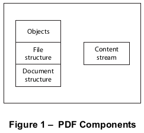

# 7.1 概述

**General**

=== "中文"

    本条款涵盖了 PDF 在对象、文件和文档层面的语法的所有内容。它为后续条款奠定了基础，这些条款描述了如何将 PDF 文件的内容解释为页面描述、交互式导航辅助工具和应用程序级别的逻辑结构。
    
    PDF 语法最好通过考虑它作为四个部分来理解，如图 1 所示：
    
    - 对象(Objects)。一个 PDF 文档是由一组基本类型的数据对象组成的数据结构。子条款 [7.2](./s2.md#72-词汇惯例)，“词汇约定”，描述了用于编写对象和其他语法元素的字符集。子条款 [7.3](./s3.md)，“对象”，描述了对象的语法和基本属性。子条款 [7.3.8](./s3.md#738-流对象)，“流对象”，提供了最复杂数据类型的完整详细信息，即流对象。
    - 文件结构(File structure)。PDF 文件结构决定了对象如何在 PDF 文件中存储、如何访问以及如何更新。这种结构独立于对象的语义。子条款 [7.5](./s5.md)，“文件结构”，描述了文件结构。子条款 [7.6](./s6.md)，“加密”，描述了保护文档内容免受未授权访问的文件级机制。
    - 文档结构(Document structure)。PDF 文档结构指定了基本对象类型如何用于表示 PDF 文档的组件：页面、字体、注释等。子条款 [7.7](./s7.md)，“文档结构”，描述了整体文档结构；后续条款将讨论组件的详细语义。
    - 内容流()。PDF 内容流包含一系列描述页面或其他图形实体外观的指令。这些指令虽然也以对象的形式表示，但在概念上与表示文档结构的对象不同，并分别进行了描述。子条款 [7.8](./s8.md)，“内容流和资源”，讨论了 PDF 内容流及其相关资源。
    
    <figure markdown="span">
      { width="300" }
      <figcaption>Figure 1 – PDF Components</figcaption>
    </figure>

    此外，本条款还描述了一些由基本对象构建的数据结构，它们被如此广泛地使用，几乎可以被视为基本对象类型。这些对象涵盖在：[7.9](./s9.md)，“公共数据结构”；[7.10](./s10.md)，“函数”；以及[7.11](./s11.md)，“文件规范”。
    
    !!! info "Note"
        
        PDF的对象和文件语法的变体也被用作其他文件格式的基础。这些包括表单数据格式（FDF），在[12.7.7](../c12/s7.md#1277-表单数据格式)，“表单数据格式”中有描述，以及便携作业票格式（PJTF），在Adobe技术说明#5620，*便携作业票格式*中有描述。
    

=== "英文"

    This clause covers everything about the syntax of PDF at the object, file, and document level. It sets the stage for subsequent clauses, which describe how the contents of a PDF file are interpreted as page descriptions, interactive navigational aids, and application-level logical structure.
    
    PDF syntax is best understood by considering it as four parts, as shown in Figure 1:
    
    - Objects. A PDF document is a data structure composed from a small set of basic types of data objects. Sub-clause [7.2](./s2.md#72-词汇惯例), "Lexical Conventions," describes the character set used to write objects and other syntactic elements. Sub-clause [7.3](./s3.md), "Objects," describes the syntax and essential properties of the objects. Sub-clause [7.3.8](./s3.md#738-流对象), "Stream Objects," provides complete details of the most complex data type, the stream object.
    - File structure. The PDF file structure determines how objects are stored in a PDF file, how they are accessed, and how they are updated. This structure is independent of the semantics of the objects. Sub- clause [7.5](./s5.md), "File Structure," describes the file structure. Sub-clause [7.6](./s6.md), "Encryption," describes a file-level mechanism for protecting a document’s contents from unauthorized access.
    - Document structure. The PDF document structure specifies how the basic object types are used to represent components of a PDF document: pages, fonts, annotations, and so forth. Sub-clause [7.7](./s7.md), "Document Structure," describes the overall document structure; later clauses address the detailed semantics of the components.
    - Content streams. A PDF content stream contains a sequence of instructions describing the appearance of a page or other graphical entity. These instructions, while also represented as objects, are conceptually distinct from the objects that represent the document structure and are described separately. Sub-clause [7.8](./s8.md), "Content Streams and Resources," discusses PDF content streams and their associated resources.
    
    <figure markdown="span">
      { width="300" }
      <figcaption>Figure 1 – PDF Components</figcaption>
    </figure>

    In addition, this clause describes some data structures, built from basic objects, that are so widely used that they can almost be considered basic object types in their own right. These objects are covered in: [7.9](./s9.md), "Common Data Structures"; [7.10](./s10.md), "Functions"; and [7.11](./s11.md), "File Specifications."

    !!! info "Note"

        Variants of PDF’s object and file syntax are also used as the basis for other file formats. These include the Forms Data Format (FDF), described in [12.7.7](../c12/s7.md#1277-表单数据格式), "Forms Data Format", and the Portable Job Ticket Format (PJTF), described in Adobe Technical Note #5620, *Portable Job Ticket Format*.