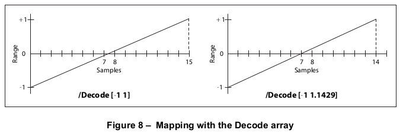

# 7.10 函数

**Functions**

## 7.10.1 概述

**General**

=== "中文"

    PDF 不是一种编程语言，PDF 文件也不是程序。然而，PDF 提供了几种类型的 *函数对象(function objects)*（PDF 1.2），它们代表参数化的函数类别，包括数学公式和具有任意分辨率的采样表示。
    
    !!! note "NOTE 1"
    
        函数在 PDF 中有多种用途，包括用于高质量打印的设备依赖光栅化信息（半色调点函数和传输函数）、特定颜色空间的颜色转换函数，以及将颜色指定为位置的函数以实现平滑着色。
    
    PDF 中的函数表示静态的、自包含的数值转换。
    
    !!! note "NOTE 2"
    
        一个用于加两个数字的函数有两个输入值和一个输出值：
    
        $$f(x_0,x_1) = x_0 + x_1$$
    
        类似地，一个计算两个数字的算术平均数和几何平均数的函数可以被视为有两个输入值和两个输出值的函数：
        
        $$f(x_0,x_1) = \frac{x_0 + x_1}{2}, \sqrt{x_0\times x_1}$$
    
    一般来说，一个函数可以取任意数量（*m*）的输入值，并产生任意数量（*n*）的输出值：
    
    $$f(x_0,\dots, x_{m-1}) = y_0, \dots,y_{n-1}$$
    
    在 PDF 函数中，所有的输入值和所有的输出值都应该是数字，并且函数不应当有副作用。
    
    每个函数定义都包括一个定义域，即输入的合法值集合。某些类型的函数还定义了一个值域，即输出的合法值集合。传递给函数的输入值应该被剪切到定义域内，函数产生的输出值应该被剪切到值域内。
    
    !!! info "EXAMPLE"

        假设以下函数定义了定义域为 [-1 1]。如果函数被调用时输入值为 6，那么这个值将被替换为定义域中最接近的值 1，然后才计算函数；因此，产生的输出值为 3。
        
        $$f(x)=x+2$$
        
        类似地，如果以下函数定义了值域为 [0 100]，并且输入值 -6 和 4 被传递给函数（并且在其定义域内），那么函数产生的输出值 -14 将被替换为 0，这是定义域中最接近的值。
    
        $$f(x_0, x_1) = 3 \times x_0 + x_1$$

    函数对象可能是字典或流，具体取决于函数类型。在本子句中，*函数字典(function dictionary)*一词通常用于指代字典对象或流对象的字典部分。函数字典指定了函数的表示形式、参数化该表示形式的属性集以及该表示形式所需的附加数据。根据字典的 **FunctionType** 条目，有四种类型的函数可用：
    
    - （PDF 1.2）采样函数(sampled function)（类型 0）使用一组样本值来定义函数。使用各种技术在样本值之间插值；见 [7.10.2](#7102-type-0-样例-函数)，“类型 0（采样）函数。”
    - （PDF 1.3）指数插值函数(exponential interpolation function)（类型 2）定义了一个指数函数的系数集；见 [7.10.3](#7103-type-2-指数插值-函数)，“类型 2（指数插值）函数。”
    - （PDF 1.3）缝合函数(stitching function)（类型 3）是其他函数的组合，分布在一个定义域上；见 [7.10.4](#7104-type-3-缝合-函数)，“类型 3（缝合）函数。”
    - （PDF 1.3）PostScript 计算器函数(calculator function)（类型 4）使用 PostScript 语言中的运算符来描述一个算术表达式；见 [7.10.5](#7105-type-4-postscript-计算器-函数)，“类型 4（PostScript 计算器）函数。”
    
    所有函数字典都应共享 [表 38](#table38) 中列出的条目。    
        
    <table id="table38">
        <caption>**表38 – 所有函数字典通用条目**</caption>
        <thead>
            <tr>
                <th><strong>键</strong></th>
                <th><strong>类型</strong></th>
                <th><strong>值</strong></th>
            </tr>
        </thead>
        <tbody>
            <tr>
                <td>**FunctionType**</td>
                <td>整数</td>
                <td>(*必需*) 函数类型：<br/>
                    0 采样函数<br/>
                    2 指数插值函数<br/>
                    3 拼接函数<br/>
                    4 PostScript 计算器函数</td>
            </tr>
            <tr>
                <td>**Domain**</td>
                <td>数组</td>
                <td>(必需) 一个 *2 × m* 数组，其中 m 应为输入值的数量。对于每个 i 从 0 到 *m* − 1，**Domain**<sub>2i</sub> 应小于或等于 **Domain**<sub>2i+1</sub> ，且第 i 个输入值 x<sub>i</sub> 应位于区间 Domain<sub>2i</sub> ≤ x<sub>i</sub> ≤ Domain<sub>2i+1</sub> 内。超出声明域的输入值将被剪切到最近的边界值。
                </td>
            </tr>
            <tr>
                <td>**Range**</td>
                <td>数组</td>
                <td>(*对于类型 0 和类型 4 函数必需，否则可选；见下文*) 一个 *2 × n* 数组，其中 n 应为输出值的数量。对于每个 j 从 0 到 *n − 1*，**Range**<sub>2j</sub> 应小于或等于 **Range**<sub>2j+1</sub> ，且第 j 个输出值 y<sub>j</sub> 应位于区间 **Range**<sub>2j</sub> ≤ y<sub>j</sub> ≤ **Range**<sub>2j+1</sub> 内。超出声明范围的输出值将被剪切到最近的边界值。如果此条目不存在，则不进行剪切。
                </td>
            </tr>
        </tbody>
    </table>
        
    此外，每种类型的函数字典都应包含适合特定函数类型的条目。输出值的数量通常可以从函数的其他属性中推断出来；如果没有（对于类型 0 和类型 4 函数总是这样），则需要 **Range** 条目。由 **Domain** 和 **Range** 条目暗示的函数的维度应与函数其他属性暗示的维度一致。

=== "英文"

    PDF is not a programming language, and a PDF file is not a program. However, PDF provides several types of *function objects* (PDF 1.2) that represent parameterized classes of functions, including mathematical formulas and sampled representations with arbitrary resolution.
    
    !!! note "NOTE 1"
    
        Functions may be used in various ways in PDF, including device-dependent rasterization information for high-quality printing (halftone spot functions and transfer functions), colour transform functions for certain colour spaces, and specification of colours as a function of position for smooth shadings.
    
    Functions in PDF represent static, self-contained numerical transformations.
    
    !!! note "NOTE 2"
    
        A function to add two numbers has two input values and one output value:
    
        $$f(x_0,x_1) = x_0 + x_1$$
    
        Similarly, a function that computes the arithmetic and geometric mean of two numbers can be viewed as a function of two input values and two output values:
        
        $$f(x_0,x_1) = \frac{x_0 + x_1}{2}, \sqrt{x_0\times x_1}$$
    
    In general, a function can take any number (*m*) of input values and produce any number (n) of output values:
    
    $$f(x_0,\dots, x_{m-1}) = y_0, \dots,y_{n-1}$$
    
    In PDF functions, all the input values and all the output values shall be numbers, and functions shall have no side effects.
    
    Each function definition includes a domain, the set of legal values for the input. Some types of functions also define a range, the set of legal values for the output. Input values passed to the function shall be clipped to the domain, and output values produced by the function shall be clipped to the range.
    
    !!! info "EXAMPLE"
    
        Suppose the following function is defined with a domain of [-1 1]. If the function is called with the input value 6, that value is replaced with the nearest value in the defined domain, 1, before the function is evaluated; the resulting output value is therefore 3.
    
        $$f(x)=x+2$$
    
        Similarly, if the following function is defined with a range of [0 100], and if the input values -6 and 4 are passed to the function (and are within its domain), then the output value produced by the function, -14, is replaced with 0, the nearest value in the defined range.
    
        $$f(x_0, x_1) = 3 \times x_0 + x_1$$
    
    A function object may be a dictionary or a stream, depending on the type of function. The term *function dictionary* is used generically in this sub-clause to refer to either a dictionary object or the dictionary portion of a stream object. A function dictionary specifies the function’s representation, the set of attributes that parameterize that representation, and the additional data needed by that representation. Four types of functions are available, as indicated by the dictionary’s **FunctionType** entry:
    
    - (PDF 1.2) A sampled function (type 0) uses a table of sample values to define the function. Various techniques are used to interpolate values between the sample values; see [7.10.2](#7102-type-0-样例-函数), "Type 0 (Sampled) Functions."
    - (PDF 1.3) An exponential interpolation function (type 2) defines a set of coefficients for an exponential function; see [7.10.3](#7103-type-2-指数插值-函数), "Type 2 (Exponential Interpolation) Functions."
    - (PDF 1.3) A stitching function (type 3) is a combination of other functions, partitioned across a domain; see [7.10.4](#7104-type-3-缝合-函数), "Type 3 (Stitching) Functions."
    - (PDF 1.3) A PostScript calculator function (type 4) uses operators from the PostScript language to describe an arithmetic expression; see [7.10.5](#7105-type-4-postscript-计算器-函数), "Type 4 (PostScript Calculator) Functions."
    
    All function dictionaries shall share the entries listed in [Table 38](#table38).
    
    <table id="table38" markdown="span">
        <caption>**Table 38 – Entries common to all function dictionaries**</caption>
        <thead>
            <tr>
                <th><strong>Key</strong></th>
                <th><strong>Type</strong></th>
                <th><strong>Value</strong></th>
            </tr>
        </thead>
        <tbody>
            <tr>
                <td>**FunctionType**</td>
                <td>integer</td>
                <td>(*Required*) The function type:<br/>
                    0 Sampled function<br/>
                    2 Exponential interpolation function<br/>
                    3 Stitching function<br/>
                    4 PostScript calculator function</td>
            </tr>
            <tr>
                <td>**Domain**</td>
                <td>array</td>
                <td>(Required) An array of *2 × m numbers*, where m shall be the number of input values. For each i from 0 to *m* − 1, **Domain**<sub>2i</sub> shall be less than or equal to **Domain**<sub>2i+1</sub> , and the *i*th input value, x<sub>i</sub> , shall lie in the interval Domain<sub>2i</sub> ≤ x<sub>i</sub> ≤ Domain<sub>2i+1</sub> . Input values outside the declared domain shall be clipped to the nearest boundary value.
                </td>
            </tr>
            <tr>
                <td>**Range**</td>
                <td>array</td>
                <td>(*Required for type 0 and type 4 functions, optional otherwise; see below*) An array of *2 × n numbers*, where n shall be the number of output values. For each *j* from 0 to *n − 1*, **Range**<sub>2j</sub> shall be less than or equal to **Range**<sub>2j+1</sub> , and the jth output value, y<sub>j</sub> , shall lie in the interval **Range**<sub>2j</sub> ≤ y<sub>j</sub> ≤ **Range**<sub>2j+1</sub>. Output values outside the declared range shall be clipped to the nearest boundary value. If this entry is absent, no clipping shall be done.</td>
            </tr>
        </tbody>
    </table>
    
    In addition, each type of function dictionary shall include entries appropriate to the particular function type. The number of output values can usually be inferred from other attributes of the function; if not (as is always the case for type 0 and type 4 functions), the **Range** entry is required. The dimensionality of the function implied by the **Domain** and **Range** entries shall be consistent with that implied by other attributes of the function.

## 7.10.2 Type 0 (采样) 函数

**Type 0 (Sampled) Functions**

=== "中文"

    Type 0 函数利用包含在流中的一系列 *样本值* 来为其定义域和值域有界的函数提供近似。这些样本被组织为一个 m 维表格，其中每个条目有 n 个组件。
    
    !!! note "NOTE 1"
    
        采样函数非常通用，并以较低的成本提供任意解析函数的相当精确表示。例如，一个一维正弦函数可以在范围 [ 0 180 ] 内用仅十个样本和线性插值平均误差仅为 1% 表示。两个输入的函数需要更多的样本，但通常数量不会是禁止性的，如果函数没有高频变化。
    
    对于采样函数，除了可能的实现限制外，没有维度限制。
    
    !!! note "NOTE 2"
    
        为了表示具有高维度的函数，所需的样本数量会迅速增加，除非采样分辨率非常低。此外，如果输入数量 *m* 大于2，则多线性插值的过程会变得计算密集。多维样条插值更加计算密集。
    
    除了 [表38](#table38) 中的条目外，类型 0 函数字典还包括 [表39](#table39) 中显示的条目。
    
    **Domain**、**Encode** 和 **Size** 条目确定了如何将函数的输入变量值映射到样本表中。例如，如果 **Size** 是 [21 31]，则默认的 **Encode** 数组应为 [ 0 20 0 30 ]，将整个域映射到完整的样本表条目集合中。也可以使用其他 **Encode** 的值。
    
    为了解释 **Domain**、**Encode**、**Size**、**Decode** 和 **Range** 之间的关系，我们使用以下符号：
    
    $$y = Interpolate(x, x_{min}, x_{min}, y_{max}) \\  = y_{min} + \left ( (x - x_{min}) \times \frac{y_{max} - y_{min}}{x_{max} - x_{min}}  \right ) $$
    
    对于给定的 *x* 值，Interpolate 函数计算由两个点 $(x_{min} , y_{min})$ 和 $(x_{max} , y_{max})$ 所定义的直线上的 *y* 值。
    
    <table id="table39">
        <caption>**表39 – 类型 0 函数字典特定的额外条目**</caption>
        <thead>
            <tr>
                <th><strong>键</strong></th>
                <th><strong>类型</strong></th>
                <th><strong>值</strong></th>
            </tr>
        </thead>
        <tbody>
            <tr>
                <td>**Size**</td>
                <td>数组</td>
                <td>(*必需*) 一个包含 m 个正整数的数组，指定样本表中每个输入维度的样本数量。</td>
            </tr>
            <tr>
                <td>**BitsPerSample**</td>
                <td>整数</td>
                <td>(必需) 每个样本值所需的位数。如果函数有多个输出值，则每个值应占据 **BitsPerSample** 位。有效值为 1、2、4、8、12、16、24 和 32。
                </td>
            </tr>
            <tr>
                <td>**Order**</td>
                <td>整数</td>
                <td>(*可选*) 样本之间插值的顺序。有效值为 1 和 3，分别指定线性和三次样条插值。默认值为：1。</td>
            </tr>
            <tr>
                <td>**Encode**</td>
                <td>数组</td>
                <td>(*可选*) 一个包含 2 × m 个数字的数组，指定将输入值线性映射到函数样本表的域中。默认值为 [ 0 (**Size0** − 1) 0 (**Size1** − 1) … ]。</td>
            </tr>
            <tr>
                <td>**Decode**</td>
                <td>数组</td>
                <td>(*可选*) 一个包含 *2 × n* 个数字的数组，指定将样本值线性映射到适合函数输出值的范围中。默认值与 **Range** 的值相同。</td>
            </tr>
            <tr>
                <td>其他流属性</td>
                <td>(各种)</td>
                <td>(*可选*) 流的其他属性，适当时提供样本值（参见 [表5](./s3.md#table5)）。</td>
            </tr>
        </tbody>
    </table>
    
    当调用采样函数时，每个输入值 xi，对于 0 ≤ i < m，应被剪切到域内：
    
    $$x_i' = min(max(x_i, Domain_{2i}), Domain_{2i+1})$$
    
    该值应被编码：
    
    $$e_i = Interpolate(x_i', Domain_{2i}, Domain_{2i + 1}, Encode_{2i}, Encode_{2i+1})$$
    
    该值应被剪切到该维度的样本表的大小：
    
    $$e_i' = min(max(e_i, 0), Size_{i} - 1)$$
    
    编码后的输入值应为实数，不限于整数。插值应用于从样本表中最接近的周围值确定输出值。然后，每个输出值 $r_j$，对于 0 ≤ j < n，应被解码：
    
    $$r_j' = Interpolate(r_j, 0, 2^{BitsPerSample} - 1, Decode_{2j}, Decode_{2j + 1})$$
    
    最后，每个解码后的值应被剪切到范围内：
    
    $$y_j = min(max(r_j', Range_{2j}), Range_{2j+1})$$
    
    样本数据应表示为字节流。字节应构成连续的位流，每个字节的高位先行。每个样本值应表示为一系列 **BitsPerSample** 位。连续的值应相邻在位流中；不应在字节边界填充。

    对于具有多维输入的函数（多于一个输入变量），第一维的样本值变化最快，最后一维的变化最慢。
    
    !!! info "EXAMPLE 1"
    
        对于函数 *f(a, b, c)*，其中 *a*、*b* 和 *c* 变化范围为 0 到 9，步长为 1，样本值的顺序如下：`f(0, 0, 0), f(1, 0, 0), … , f(9, 0, 0), f(0, 1, 0), f(1, 1, 0), … , f(9, 1, 0), f(0, 2, 0), f(1, 2, 0), … , f(9, 9, 0), f(0, 0, 1), f(1, 0, 1)`，依此类推。
    
    对于具有多维输出的函数（多于一个输出值），值应按照 **Range** 中的顺序存储。
    
    流数据应足够长以包含整个样本数组，如 **Size**、**Range** 和 **BitsPerSample** 所示；参见 [7.3.8.2], "Stream Extent."
    
    示例 2 展示了一个具有 4 位样本值的采样函数，包含 21 列和 31 行（651 个值）的数组。该函数以域 [-1.0 1.0] 中的两个参数 x 和 y 为输入，并在相同范围内返回一个值 z。x 参数通过编码线性转换到域 [ 0 20 ]，y 参数到域 [ 0 30 ]。使用双线性插值计算 z 的值，因为 **BitsPerSample** 为 4，所以 z 的范围为 [ 0 15 ]，解码将 z 转换为范围 [-1.0 1.0] 的数值。样本数组应存储在一个长度为 326 字节的字符串中，计算如下（向上取整）：
    
    $$326 字节 = 31 行 × 21 每行的样本数 × 4 每个样本的位数 ÷ 8 每字节的位数$$
    
    第一个字节包含点 (-1.0, -1.0) 的高位 4 位的样本和点 (-0.9, -1.0) 的低位 4 位的样本。
    
    !!! info "EXAMPLE 2"
    
        ```tex
        14 0 obj
            << /FunctionType 0
                /Domain [-1.0 1.0 -1.0 1.0 ]
                /Size [ 21 31 ]
                /Encode [ 0 20 0 30 ]
                /BitsPerSample 4
                /Range [ -1.0 1.0 ]
                /Decode [ -1.0 1.0 ]
                /Length …
                /Filter …
            >>
        stream
        … 651 个样本值 …
        endstream
        endobj
        ```
    
    !!! note "NOTE 3"
    
        **Decode** 条目可以创造性地用于提高与范围中特定值对应的编码样本的精度。
    
    !!! info "EXAMPLE 3"
    
        如果函数的范围是 [-1.0 1.0]，且 **BitsPerSample** 为 4，则通常 **Decode** 的值应为 [-1.0 1.0]，样本值应为 [ 0 15 ] 中的整数（如图 8 所示）。但如果使用这些值，范围的中点 0.0 将不会由任何样本值准确表示，因为它位于 7 和 8 之间。然而，如果 **Decode** 数组是 [-1.0 +1.1429]（其中 1.1429 大约等于 16<sup>3</sup> 14），并且提供的样本值位于 [0 14] 的区间内，则可以实现有效的 [-1.0 1.0] 范围，并且范围值 0.0 由样本值 7 表示。
    
    对于输入维度的 **Size** 值可以为 1，此时该维度中的所有输入值应映射到单个允许的值。如果 **Size** 小于 4，则不可能进行三次样条插值，并且如果指定了 **Order** 3，则应忽略。
    
    

=== "英文"

    Type 0 functions use a sequence of *sample values* (contained in a stream) to provide an approximation for functions whose domains and ranges are bounded. The samples are organized as an m-dimensional table in which each entry has *n* components.
    
    !!! note "NOTE 1"
    
        Sampled functions are highly general and offer reasonably accurate representations of arbitrary analytic functions at low expense. For example, a 1-input sinusoidal function can be represented over the range [ 0 180 ] with an average error of only 1 percent, using just ten samples and linear interpolation. Two-input functions require significantly more samples but usually not a prohibitive number if the function does not have high frequency variations.
    
    There shall be no dimensionality limit of a sampled function except for possible implementation limits.
    
    !!! note "NOTE 2"
    
        The number of samples required to represent functions with high dimensionality multiplies rapidly unless the sampling resolution is very low. Also, the process of multilinear interpolation becomes computationally intensive if the number of inputs *m* is greater than 2. The multidimensional spline interpolation is even more computationally intensive.
    
    In addition to the entries in [Table 38](#table38), a type 0 function dictionary includes those shown in [Table 39](#table39).
    
    The **Domain**, **Encode**, and **Size** entries determine how the function’s input variable values are mapped into the sample table. For example, if **Size** is [21 31], the default **Encode** array shall be [ 0 20 0 30 ], which maps the entire domain into the full set of sample table entries. Other values of **Encode** may be used.
    
    To explain the relationship between **Domain**, **Encode**, **Size**, **Decode**, and **Range**, we use the following notation:
    
    $$y = Interpolate(x, x_{min}, x_{min}, y_{max}) \\  = y_{min} + \left ( (x - x_{min}) \times \frac{y_{max} - y_{min}}{x_{max} - x_{min}}  \right ) $$
    
    For a given value of *x*, Interpolate calculates the *y* value on the line defined by the two points $(x_{min} , y_{min})$ and $(x_{max} , y_{max})$.
    
    <table id="table39" markdown="span">
        <caption>**Table 39 – Additional entries specific to a type 0 function dictionary**</caption>
        <thead>
            <tr>
                <th><strong>Key</strong></th>
                <th><strong>Type</strong></th>
                <th><strong>Value</strong></th>
            </tr>
        </thead>
        <tbody>
            <tr>
                <td>**Size**</td>
                <td>array</td>
                <td>(*Required*) An array of m positive integers that shall specify the number of samples in each input dimension of the sample table.</td>
            </tr>
            <tr>
                <td>**BitsPerSample**</td>
                <td>integer</td>
                <td>(Required) The number of bits that shall represent each sample. (If the function has multiple output values, each one shall occupy **BitsPerSample** bits.) Valid values shall be 1, 2, 4, 8, 12, 16, 24, and 32.
                </td>
            </tr>
            <tr>
                <td>**Order**</td>
                <td>integer</td>
                <td>(*Optional*) The order of interpolation between samples. Valid values shall be 1 and 3, specifying linear and cubic spline interpolation, respectively. Default value: 1.</td>
            </tr>
            <tr>
                <td>**Encode**</td>
                <td>array</td>
                <td>(*Optional*) An array of 2 × m numbers specifying the linear mapping of input values into the domain of the function’s sample table. Default value: [ 0 (**Size0** − 1) 0 (**Size1** − 1) … ].</td>
            </tr>
            <tr>
                <td>**Decode**</td>
                <td>array</td>
                <td>(*Optional*) An array of *2 × n* numbers specifying the linear mapping of sample values into the range appropriate for the function’s output values. Default value: same as the value of **Range**.</td>
            </tr>
            <tr>
                <td>other stream attributes</td>
                <td>(various)</td>
                <td>(Optional) Other attributes of the stream that shall provide the sample values, as appropriate (see [Table 5](./s3.md#table5)).</td>
            </tr>
        </tbody>
    </table>
    
    When a sampled function is called, each input value xi , for 0 £ i < m, shall be clipped to the domain:
    
    $$x_i' = min(max(x_i, Domain_{2i}), Domain_{2i+1})$$
    
    That value shall be encoded:
    
    $$e_i = Interpolate(x_i', Domain_{2i}, Domain_{2i + 1}, Encode_{2i}, Encode_{2i+1})$$
    
    That value shall be clipped to the size of the sample table in that dimension:
    
    $$e_i' = min(max(e_i, 0), Size_{i} - 1)$$
    
    The encoded input values shall be real numbers, not restricted to integers. Interpolation shall be used to determine output values from the nearest surrounding values in the sample table. Each output value $r_j$ , for 0 £ j < n, shall then be decoded:
    
    $$r_j' = Interpolate(r_j, 0, 2^{BitsPerSample} - 1, Decode_{2j}, Decode_{2j + 1})$$
    
    Finally, each decoded value shall be clipped to the range:
    
    $$y_j = min(max(r_j', Range_{2j}), Range_{2j+1})$$
    
    Sample data shall be represented as a stream of bytes. The bytes shall constitute a continuous bit stream, with the high-order bit of each byte first. Each sample value shall be represented as a sequence of **BitsPerSample** bits. Successive values shall be adjacent in the bit stream; there shall be no padding at byte boundaries.
    
    For a function with multidimensional input (more than one input variable), the sample values in the first
    dimension vary fastest, and the values in the last dimension vary slowest.
    
    !!! info "EXAMPLE 1"
    
        For a function *f(a, b, c)*, where *a*, *b*, and *c* vary from 0 to 9 in steps of 1, the sample values would appear in this order: `f(0, 0, 0), f(1, 0, 0), … , f(9, 0, 0), f(0, 1, 0), f(1, 1, 0), … , f(9, 1, 0), f(0, 2, 0), f(1, 2, 0), … , f(9, 9, 0), f(0, 0, 1), f(1, 0, 1)`, and so on.
    
    For a function with multidimensional output (more than one output value), the values shall be stored in the same order as **Range**.
    
    The stream data shall be long enough to contain the entire sample array, as indicated by **Size**, **Range**, an **BitsPerSample**; see [7.3.8.2], "Stream Extent."
    
    Example 2 illustrates a sampled function with 4-bit samples in an array containing 21 columns and 31 rows (651 values). The function takes two arguments, x and y, in the domain [-1.0 1.0 ], and returns one value, z, in that same range. The x argument shall be linearly transformed by the encoding to the domain [ 0 20 ] and the y argument to the domain [ 0 30 ]. Using bilinear interpolation between sample points, the function computes a value for z, which (because **BitsPerSample** is 4) will be in the range [ 0 15 ], and the decoding transforms z to a number in the range [ -1.0 1.0 ] for the result. The sample array shall be stored in a string of 326 bytes, calculated as follows (rounded up):
    
    $$326 bytes = 31 rows ¥ 21 samples / row ¥ 4 bits / sample^3 8 bits / byte$$
    
    The first byte contains the sample for the point (-1.0, -1.0) in the high-order 4 bits and the sample for the point (-0.9, -1.0) in the low-order 4 bits.
    
    !!! info "EXAMPLE 2"
    
        ```tex
        14 0 obj
            << /FunctionType 0
               /Domain [-1.0 1.0 -1.0 1.0 ]
               /Size [ 21 31 ]
               /Encode [ 0 20 0 30 ]
               /BitsPerSample 4
               /Range [ -1.0 1.0 ]
               /Decode [ -1.0 1.0 ]
               /Length …
               /Filter …
            >>
        stream
        … 651 sample values …
        endstream
        endobj
        ```
    
    !!! note "NOTE 3"
    
        The **Decode** entry can be used creatively to increase the accuracy of encoded samples corresponding to certain values in the range.
    
    !!! info "EXAMPLE 3"
    
        If the range of the function is [ -1.0 1.0 ] and **BitsPerSample** is 4, the usual value of **Decode** would be [ -1.0 1.0 ] and the sample values would be integers in the interval [ 0 15 ] (as shown in Figure 8). But if these values are used, the midpoint of the range, 0.0, is not represented exactly by any sample value, since it falls halfway between 7 and 8. However, if the **Decode** array is [ -1.0 +1.1429 ] (1.1429 being approximately equal to 16<sup>3</sup> 14) and the sample values supplied are in the interval [0 14], the effective range of [-1.0 1.0] is achieved, and the range value 0.0 is represented by the sample value 7.
    
    The **Size** value for an input dimension can be 1, in which case all input values in that dimension shall be mapped to the single allowed value. If **Size** is less than 4, cubic spline interpolation is not possible and **Order** 3 shall be ignored if specified.
    
    

## 7.10.3 Type 2 (指数插值) 函数

**Type 2 (Exponential Interpolation) Functions**

=== "中文"

    类型 2 函数（PDF 1.3）包括一组参数，定义了一个输入值和 n 个输出值的指数插值：
    
    $$f(x) = y_0, ..., y_{n-1}$$
    
    除了 [表38](#table38) 中的条目外，类型 2 函数字典还应包括 [表40](#table40) 中列出的条目。
    
    <table id="table40">
        <caption>**表40 – 类型 2 函数字典特定的额外条目**</caption>
        <thead>
            <tr>
                <th><strong>键</strong></th>
                <th><strong>类型</strong></th>
                <th><strong>值</strong></th>
            </tr>
        </thead>
        <tbody>
            <tr>
                <td>**C0**</td>
                <td>数组</td>
                <td>(*可选*) 一个包含 *n* 个数字的数组，定义当 x = 0.0 时的函数结果。默认值为 [ 0.0 ]。</td>
            </tr>
            <tr>
                <td>**C1**</td>
                <td>数组</td>
                <td>(*可选*) 一个包含 *n* 个数字的数组，定义当 x = 1.0 时的函数结果。默认值为 [ 1.0 ]。</td>
            </tr>
            <tr>
                <td>**N**</td>
                <td>数值</td>
                <td>(*必需*) 插值指数。每个输入值 x 应返回由 $y_j = \textbf{C0}_j + x^N × (\textbf{C1}_j − \textbf{C0}_j )$ 给出的 *n* 个值，其中 $0 ≤ j < n$。</td>
            </tr>
        </tbody>
    </table>
    
    **Domain** 的值应限制 x 的范围，以确保当 **N** 不是整数时，所有 x 的值均为非负数；当 **N** 为负数时，x 的值不应为零。通常情况下，**Domain** 声明为 [ 0.0 1.0 ]，而 **N** 是正数。为了将输出裁剪到指定的范围，应使用 **Range** 属性。
    
    !!! note "NOTE"
    
        当 **N** 为 1 时，函数执行 **C0** 和 **C1** 之间的线性插值；因此，该函数也可以表示为一个采样函数（类型 0）。

=== "英文"

    Type 2 functions (PDF 1.3) include a set of parameters that define an *exponential interpolation* of one input value and n output values:
    
    $$f(x) = y_0, ..., y_{n-1}$$
    
    In addition to the entries in [Table 38](#table38), a type 2 function dictionary shall include those listed in [Table 40](#table40).
        
            
    <table id="table40" markdown="span">
        <caption>**Table 40 – Additional entries specific to a type 2 function dictionary**</caption>
        <thead>
            <tr>
                <th><strong>Key</strong></th>
                <th><strong>Type</strong></th>
                <th><strong>Value</strong></th>
            </tr>
        </thead>
        <tbody>
            <tr>
                <td>**C0**</td>
                <td>array</td>
                <td>(*Optional*) An array of *n* numbers that shall define the function result when x = 0.0. Default value: [ 0.0 ].</td>
            </tr>
            <tr>
                <td>**C1**</td>
                <td>array</td>
                <td>(*Optional*) An array of *n* numbers that shall define the function result when x = 1.0. Default value: [ 1.0 ].
                </td>
            </tr>
            <tr>
                <td>**N**</td>
                <td>number</td>
                <td>(*Required*) The interpolation exponent. Each input value x shall return *n* values, given by $y_j = \textbf{C0}_j + x^N × (\textbf{C1}_j − \textbf{C0}_j )$, for $0 ≤ j < n$. </td>
            </tr>
        </tbody>
    </table>
    
    Values of **Domain** shall constrain x in such a way that if **N** is not an integer, all values of x shall be non-
    negative, and if **N** is negative, no value of x shall be zero. Typically, **Domain** is declared as [ 0.0 1.0 ], and **N** is
    a positive number. To clip the output to a specified range The **Range** attribute shall be used.
    
    !!! note "NOTE"
    
        When **N** is 1, the function performs a linear interpolation between **C0** and **C1**; therefore, the function can also be expressed as a sampled function (type 0).

## 7.10.4 Type 3 (缝合) 函数

**Type 3 (Stitching) Functions**

=== "中文"

    
    类型 3 函数（*PDF 1.3*）定义了几个单输入函数的子域的拼接，以生成一个新的单输入函数。由于生成的拼接函数是一个单输入函数，其域由一个两元素数组 $[\textbf{Domain}_0 \space \textbf{Domain}_1]$ 给出。
    
    除了 [表38](#table38) 中的条目外，类型 3 函数字典还应包括 [表41](#table41) 中列出的条目。
    
    <table id="table41">
        <caption>**表41 – 类型 3 函数字典特定的额外条目**</caption>
        <thead>
            <tr>
                <th><strong>键</strong></th>
                <th><strong>类型</strong></th>
                <th><strong>值</strong></th>
            </tr>
        </thead>
        <tbody>
            <tr>
                <td>**Functions**</td>
                <td>数组</td>
                <td>(*必需*) 一个包含 *k* 个单输入函数的数组，这些函数将构成拼接函数。所有函数的输出维度应相同，并且与 **Range** 的值兼容（如果 **Range** 存在）。</td>
            </tr>
            <tr>
                <td>**Bounds**</td>
                <td>数组</td>
                <td>(*必需*) 一个包含 *k* - 1 个数字的数组，与 **Domain** 结合使用，定义了从 **Functions** 数组中的每个函数应用的区间。**Bounds** 元素应按增值顺序排列，并且每个值应在 **Domain** 定义的域内。</td>
            </tr>
            <tr>
                <td>**Encode**</td>
                <td>数组</td>
                <td>(*必需*) 一个包含 2 × *k* 个数字的数组，成对地映射由 **Domain** 和 **Bounds** 数组定义的每个域子集到相应函数的域。</td>
            </tr>
        </tbody>
    </table>
    
    **Domain** 的大小应为 2（即，*m* = 1），并且 **Domain**<sub>0</sub> 应严格小于 **Domain**<sub>1</sub>，除非 *k* = 1。域应根据字典的 **Bounds** 条目分成 k 个子域，**Bounds** 应是一个 *k* - 1 的数组，遵守以下关系（有特定例外）：
        
        $$Domain_0 < Bounds_0 < Bounds_1 < ... < Bounds_{k-2} < Domain_1$$

    **Bounds** 数组应描述一系列半开区间，左闭右开（最后一个区间也是右闭）。**Functions** 条目的值应为一个包含 *k* 个函数的数组。第一个函数应适用于第一个子域中的 x 值，即 $\textbf{Domain}_0 ≤ x < \textbf{Bounds}_0$；第二个函数应适用于第二个子域中的 x 值，即 $\textbf{Bounds}_0 ≤ x < \textbf{Bounds}_1$；依此类推。最后一个函数应适用于包含上界的最后一个子域中的 x 值：
    
    $\textbf{Bounds}_{k-2} ≤ x ≤ \textbf{Domain}_1$。如果 *k* 的值为 1，则 **Bounds** 数组应为空，**Functions** 数组中的单个条目应适用于所有 x 值，即 $\textbf{Domain}_0 ≤ x ≤ \textbf{Domain}_1$。
    
    **Encode** 数组包含 2 ¥ k 个数字。第 i 个子域中的 x 值应按以下方式编码：
    
    $$x' = Interpolate(x, Bounds_{i-1}, Bounds_i, Encode_{2i}, Encode_{2i + 1})$$
    
    对于 `0 ≤ i < k`。在此方程中，**Bounds**<sub>-1</sub> 表示 **Domain**<sub>0</sub>，而 **Bounds**<sub>k-1</sub> 表示 **Domain**<sub>1</sub>。如果最后一个边界 **Bounds**<sub>k-2</sub> 等于 **Domain**<sub>1</sub>，则 *x'* 的定义应为 **Encode**<sub>2i</sub>。
    
    !!! note "NOTE"
    
        拼接函数的设计旨在方便地将多个函数组合在一个渐变的不同部分中使用。渐变模式的讨论见 [8.7.4]，“渐变模式”。可以通过为每个函数创建单独的渐变字典，并在相邻域中使用这些字典来实现相同的效果。然而，由于每个渐变都具有相似的参数，并且整体效果是一个渐变，因此将多个函数定义放入单个渐变中更为方便。此外，类型 3 函数提供了反转单输入函数域的通用机制。
    
    !!! info "EXAMPLE"
    
        假设函数 *f* 的 **Domain** 为 [0.0 1.0]，拼接函数 *g* 的 **Domain** 也为 [0.0 1.0]，包含 *f* 的 **Functions** 数组，以及 **Encode** 数组为 [1.0 0.0]。实际上，g(x) = f(1 - x)。

=== "英文"

    Type 3 functions (*PDF 1.3*) define a stitching of the subdomains of several 1-input functions to produce a single new 1-input function. Since the resulting stitching function is a 1-input function, the domain is given by a two- element array, $[\textbf{Domain}_0 \space \textbf{Domain}_1]$.
    
    In addition to the entries in [Table 38](#table38), a type 3 function dictionary shall include those listed in [Table 41](#table41).
        
    <table id="table41" markdown="span">
        <caption>**Table 41 – Additional entries specific to a type 3 function dictionary**</caption>
        <thead>
            <tr>
                <th><strong>Key</strong></th>
                <th><strong>Type</strong></th>
                <th><strong>Value</strong></th>
            </tr>
        </thead>
        <tbody>
            <tr>
                <td>**Functions**</td>
                <td>array</td>
                <td>(*Required*) An array of *k* 1-input functions that shall make up the stitching function. The output dimensionality of all functions shall be the same, and compatible with the value of **Range** if **Range** is present.</td>
            </tr>
            <tr>
                <td>**Bounds**</td>
                <td>array</td>
                <td>(*Required*) An array of *k* − 1 numbers that, in combination with **Domain**, shall define the intervals to which each function from the **Functions** array shall apply. **Bounds** elements shall be in order of increasing value, and each value shall be within the domain defined by **Domain**.
                </td>
            </tr>
            <tr>
                <td>**Encode**</td>
                <td>array</td>
                <td>(*Required*) An array of 2 × *k* numbers that, taken in pairs, shall map each subset of the domain defined by **Domain** and the **Bounds** array to the domain of the corresponding function.</td>
            </tr>
        </tbody>
    </table>
    
    Domain shall be of size 2 (that is, *m* = 1), and **Domain**<sub>0</sub> shall be strictly less than **Domain**<sub>1</sub> unless *k* = 1. The
    domain shall be partitioned into k subdomains, as indicated by the dictionary’s **Bounds** entry, which shall be an
    array of *k* - 1 numbers that obey the following relationships (with exceptions as noted below):
    
    $$Domain_0 < Bounds_0 < Bounds_1 < ... < Bounds_{k-2} < Domain_1$$
    
    The **Bounds** array shall describe a series of half-open intervals, closed on the left and open on the right (except the last, which is closed on the right as well). The value of the **Functions** entry shall be an array of k functions. The first function shall apply to x values in the first subdomain, $\textbf{Domain}_0 £ x < \textbf{Bounds}_0$ ; the second function shall apply to x values in the second subdomain, $\textbf{Bounds}_0 £ x < \textbf{Bounds}_1$ ; and so on. The last function shall apply to x values in the last subdomain, which includes the upper bound:
    
    $\textbf{Bounds}_{k-2} £ x £ \textbf{Domain}_1$. The value of *k* may be 1, in which case the **Bounds** array shall be empty and the single item in the **Functions** array shall apply to all x values, $\textbf{Domain}_0 £ x £ \textbf{Domain}_1$ .
    
    The **Encode** array contains 2 ¥ k numbers. A value x from the ith subdomain shall be encoded as follows:
    
    $$x' = Interpolate(x, Bounds_{i-1}, Bounds_i, Encode_{2i}, Encode_{2i + 1})$$
    
    for `0 £ i < k`. In this equation, **Bounds**<sbu>-1</sub> means **Domain**<sub>0</sub> , and **Boundsk**<sub>-1</sub> means **Domain**<sub>1</sub> . If the last bound, **Bounds**<sub>k-2</sub>, is equal to **Domain**<sub>1</sub> , then *x¢* shall be defined to be **Encode**<sub>2i</sub> .
    
    !!! note "NOTE"
    
        The stitching function is designed to make it easy to combine several functions to be used within one shading pattern over different parts of the shading’s domain. Shading patterns are discussed in [8.7.4], "Shading Patterns". The same effect could be achieved by creating a separate shading dictionary for each of the functions, with adjacent domains. However, since each shading would have similar parameters, and because the overall effect is one shading, it is more convenient to have a single shading with multiple function definitions. Also, type 3 functions provide a general mechanism for inverting the domains of 1-input functions.
    
    !!! info "EXAMPLE"
    
        Consider a function *f* with a **Domain** of [0.0 1.0] and a stitching function g with a **Domain** of [0.0 1.0], a **Functions** array containing *f*, and an **Encode** array of [1.0 0.0]. In effect, g(x) = f(1 - x).

## 7.10.5 Type 4 (PostScript 计算器) 函数

**Type 4 (PostScript Calculator) Functions**

### 7.10.5.1 概述

**General**

=== "中文"

    类型 4 函数（*PDF 1.3*），也称为 PostScript 计算器函数，应表示为一个包含用于小型 PostScript 语言子集的代码的流。
    
    !!! note "NOTE"
    
        尽管任何函数都可以被采样（在类型 0 PDF 函数中），其他函数可以用指数函数描述（PDF 中的类型 2 函数），但类型 4 函数提供了更大的灵活性和潜在的更高精度。例如，对于六分色（六分量）**DeviceN** 颜色空间的着色变换函数，其备用颜色空间为 **DeviceCMYK**（参见 [8.6.6.5]，“DeviceN 颜色空间”），需要一个 6 入 4 出的函数。如果这样的函数对每个输入变量采样为 *m* 个值，则样本数为 4 ¥ m<sup>6</sup>，可能会非常大。在实践中，这种函数通常可以写成简短的、简单的 PostScript 函数。
    
        类型 4 函数还使得可以包含各种半色调斑点函数，而不会因为采样而失去精度，也不会增加预定义斑点函数列表（参见 [10.5.3]，“斑点函数”）。所有预定义的斑点函数都可以编写为类型 4 函数。
    
    类型 4 函数中使用的语言仅包含涉及整数、实数和布尔值的表达式。不应包含复合数据结构，如字符串或数组，也不应包含过程、变量或名称。[Table 42](#table42) 列出了可以在此类函数中使用的运算符。（有关这些运算符的更多信息，请参阅第三版 PostScript 语言参考手册的附录 B。）尽管语义上是对应的 PostScript 运算符，但不需要完整的 PostScript 解释器。
    
    <table id="table42" markdown="span">
        <caption>**Table 42 – 类型 4 函数中的运算符**</caption>
        <thead>
            <tr>
                <th><strong>运算符类型</strong></th>
                <th><strong>运算符</strong></th>
            </tr>
        </thead>
        <tbody>
            <tr>
                <td>算术运算符</td>
                <td>**abs** **cvi** **floor** **mod** **sin** <br/>
                **add** **cvr** **idiv** **mul** **sqrt** <br/>
                **atan** **div** **ln** **neg** **sub** <br/>
                **ceiling** **exp** **log** **round** **truncate** <br/>
                **cos**
                </td>
            </tr>
            <tr>
                <td>关系、布尔和位运算符</td>
                <td>**and** **false** **le** **not** **true** <br/>
                **bitshift** **ge** **lt** **or** **xor** <br/>
                **eq** **gt** **ne**
                </td>
            </tr>
            <tr>
                <td>条件运算符</td>
                <td>**if** **ifelse**
                </td>
            </tr>
            <tr>
                <td>堆栈操作符</td>
                <td>**copy** **dup** **exch** <br/>
                    **index** **pop** **roll**
                </td>
            </tr>
        </tbody>
    </table>
        
    类型 4 函数的操作数语法应遵循 PDF 惯例，而不是 PostScript 惯例。定义函数的整个代码流应使用大括号 { }（使用左大括号（7Bh）和右大括号（07hD））括起来。大括号还应限定由 **if** 和 **ifelse** 运算符有条件执行的表达式：
    
    - *boolean { expression }* if
    - *boolean { expression1 } { expression2 }* ifelse
    
    这个结构纯粹是语法上的；不像在 PostScript 中，不涉及“过程对象”。
    
    类型 4 函数字典应包括 [表 38](#table38) 中的条目，以及其他适当的流属性（参见 [表 5](./s3.md#table5)）。以下示例显示了一个类型 4 函数，等效于预定义斑点函数 **DoubleDot**（参见 [10.5.3]，“斑点函数”）。
    
    !!! 信息 "示例"
    
        ```tex
        10 0 obj
            << /FunctionType 4
                /Domain [ -1.0 1.0 -1.0 1.0 ]
                /Range [ -1.0 1.0 ]
                /Length 71
            >>
        stream
            { 360 mul sin
                2 div
                exch 360 mul sin
                2 div
                add
            }
        endstream
        endobj
        ```
    
    **Domain** 和 **Range** 条目都是必需的。输入变量应构成初始操作数堆栈；执行函数后操作数堆栈中剩余的项目应为输出变量。如果剩余操作数的数量与 **Range** 指定的输出变量数量不同，或者它们中有任何一个不是数字对象，则应该是一个错误。
    
    类型 4 函数的实现应提供至少容纳 100 个条目的堆栈空间。不要求实现提供更大的堆栈空间，如果溢出堆栈则应报错。
    
    虽然流中出现的任何整数或实数都受到与其他上下文定义相同的实现限制（见 [附录 C](../a3.md)），但类型 4 函数计算中的*中间*结果则不受限制。实现可以使用超出这些限制的表示。例如，对实数的操作可能使用单精度或双精度浮点数。
    
=== "英文"

    A type 4 function (*PDF 1.3*), also called a PostScript calculator function, shall be represented as a stream containing code written in a small subset of the PostScript language.
    
    !!! note "NOTE"
    
        Although any function can be sampled (in a type 0 PDF function) and others can be described with exponential functions (type 2 in PDF), type 4 functions offer greater flexibility and potentially greater accuracy. For example, a tint transformation function for a hexachrome (six-component) **DeviceN** colour space with an alternate colour space of **DeviceCMYK** (see [8.6.6.5], "DeviceN Colour Spaces") requires a 6-in, 4-out function. If such a function were sampled with *m* values for each input variable, the number of samples, 4 ¥ m<sup>6</sup>, could be prohibitively large. In practice, such functions can often be written as short, simple PostScript functions.
    
        Type 4 functions also make it possible to include a wide variety of halftone spot functions without the loss of accuracy that comes from sampling, and without adding to the list of predefined spot functions (see [10.5.3], "Spot Functions"). All of the predefined spot functions can be written as type 4 functions.
    
    The language that shall be used in a type 4 function contains expressions involving integers, real numbers, and boolean values only. There shall be no composite data structures such as strings or arrays, no procedures, and no variables or names. [Table 42](#table42) lists the operators that can be used in this type of function. (For more information on these operators, see [Appendix B](../a2.md) of the PostScript Language Reference, Third Edition.) Although the semantics are those of the corresponding PostScript operators, a full PostScript interpreter is not required.
        
    <table id="table42" markdown="span">
        <caption>**Table 42 – Operators in type 4 functions**</caption>
        <thead>
            <tr>
                <th><strong>Operator Type</strong></th>
                <th><strong>Operators</strong></th>
            </tr>
        </thead>
        <tbody>
            <tr>
                <td>Arithmetic operators</td>
                <td>**abs** **cvi** **floor** **mod** **sin** <br/>
                **add** **cvr** **idiv** **mul** **sqrt** <br/>
                **atan** **div** **In** **neg** **sub** <br/>
                **ceiling** **exp** **log** **round** **truncate** <br/>
                **cos**
                </td>
            </tr>
            <tr>
                <td>Relational, boolean, and bitwise operators</td>
                <td>**and** **false** **le** **not** **true** <br/>
                **bitshift** **ge** **lt** **or** **xor** <br/>
                **eq** **gt** **ne**
                </td>
            </tr>
            <tr>
                <td>Conditional operators</td>
                <td>**if** **ifelse**
                </td>
            </tr>
            <tr>
                <td>Stack operators</td>
                <td>**copy** **dup** **exch** <br/>
                    **index** **pop** **roll**
                </td>
            </tr>
        </tbody>
    </table>
    
    The operand syntax for type 4 functions shall follow PDF conventions rather than PostScript conventions. The entire code stream defining the function shall be enclosed in braces { } (using LEFT CURLY BRACE (7Bh) and RIGHT CURLY BRACE (07hD)). Braces also shall delimit expressions that are executed conditionally by the **if** and **ifelse** operators:
    
    - *boolean { expression }* if
    - *boolean { expression1 } { expression2 }* ifelse
    
    This construct is purely syntactic; unlike in PostScript, no “procedure objects” shall be involved.
    
    A type 4 function dictionary shall include the entries in Table 38, as well as other appropriate stream attributes (see [Table 5](./s3.md#table5)). The following example shows a type 4 function equivalent to the predefined spot function **DoubleDot** (see [10.5.3], "Spot Functions").
    
    !!! info "EXAMPLE"
        
        ```tex
        10 0 obj
            << /FunctionType 4
               /Domain [ -1.0 1.0 -1.0 1.0 ]
               /Range [ -1.0 1.0 ]
               /Length 71
            >>
        stream
            { 360 mul sin
                2 div
                exch 360 mul sin
                2 div
                add
            }
        endstream
        endobj
        ```
    
    The **Domain** and **Range** entries shall both be required. The input variables shall constitute the initial operand stack; the items remaining on the operand stack after execution of the function shall be the output variables. It shall be an error for the number of remaining operands to differ from the number of output variables specified by **Range** or for any of them to be objects other than numbers.
    
    Implementations of type 4 functions shall provide a stack with room for at least 100 entries. No implementation shall be required to provide a larger stack, and it shall be an error to overflow the stack.
    
    Although any integers or real numbers that may appear in the stream fall under the same implementation limits (defined in [Annex C](../a3.md)) as in other contexts, the *intermediate* results in type 4 function computations shall not. An implementation may use a representation that exceeds those limits. Operations on real numbers, for example, might use single-precision or double-precision floating-point numbers.


### 7.10.5.2 Type 4 函数中的错误

**Errors in Type 4 Functions**

=== "中文"

    符合要求的阅读器中负责读取类型 4 函数（类似于 PostScript 的 *扫描器(scanner)*）的部分应检测并报告语法错误。由符合要求的阅读器检测到的任何错误都应视为 PDF 文件中的错误，并像文件中的其他错误一样处理。
    
    符合要求的阅读器中负责执行类型 4 函数（类似于 PostScript 的 *解释器(interpreter)*）的部分应检测并报告错误。本规范不定义错误的表示方式；这些细节应由处理 PDF 文件的符合要求的阅读器提供。可能发生的错误类型包括（但不限于）：
    
    - 堆栈溢出
    - 堆栈下溢
    - 类型错误（例如，对实数应用 **not**）
    - 范围错误（例如，对负数应用 **sqrt**）
    - 未定义的结果（例如，除以 0）

=== "英文"

    The part of a conforming reader that reads a type 4 function (analogous to the PostScript *scanner*) shall detect and report syntax errors. Any errors detected by the conforming reader shall be errors in the PDF file and shall be handled like other errors in the file.
    
    The part of a conforming reader that executes a type 4 function (analogous to the PostScript *interpreter*) shall detect and report errors. This specification does not define a representation for the errors; those details shall be provided by the conforming reader that processes the PDF file. The following types of errors can occur (among others):
    
    - Stack overflow
    - Stack underflow
    - A type error (for example, applying **not** to a real number)
    - A range error (for example, applying **sqrt** to a negative number)
    - An undefined result (for example, dividing by 0)


[7.3.8.2]: ./s3.md#7382-流范围
[8.7.4]: ../c8/s7.md#874-底纹图案
[8.6.6.5]: ../c8/s6.md#8665-devicen-色彩空间
[10.5.3]: ../c10/s5.md#1053-spot-函数
