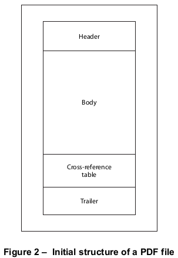

# 7.5 文件结构

**File Structure**

## 7.5.1 概述

**General**

=== "中文"

    本小节描述了如何在PDF文件中组织对象，以便进行高效的随机访问和增量更新。一个基本符合规范的PDF文件应由以下四个元素构成（见图2）：
    
    - 一行*头部(header)*，标识文件符合的PDF规范版本
    - 一个*主体(body)*，包含构成文件中文档的对象
    - 一个*交叉引用(cross-reference)*表，包含文件中间接对象的信息
    - 一个*尾部(trailer)*，给出交叉引用表和文件主体中某些特殊对象的位置
    
    这种初始结构可能会被后续更新修改，这些更新会在文件末尾附加额外元素；有关详细信息，请参阅[7.5.6](#756-增量更新)，“增量更新”。
    
    
    
    按照惯例，PDF文件中的标记被排列成行；见[7.2](./s2.md)，“词法约定”。每一行都应以一个行结束（EOL）标记结束，该标记可以是回车符（0Dh）、换行符（0Ah）或两者兼有。包含二进制数据的PDF文件可能有任意长的行。
        
    !!! note "NOTE"
    
        为了提高与处理PDF文件的兼容程序的兼容性，不属于流对象数据的行限制在不超过255个字符，有一个例外。从PDF 1.3开始，签名字典的Contents字符串（见[12.8](../c12/s8.md)，“数字签名”）不受行长度限制。
    
    这里描述的规则足以产生一个基本符合规范的PDF文件。然而，为了在网络环境中实现对文档组件的高效增量访问，还适用其他规则来组织PDF文件。这种组织形式称为线性化PDF，描述在[附录F](../a6.md)中。

=== "英文"

    This sub-clause describes how objects are organized in a PDF file for efficient random access and incremental update. A basic conforming PDF file shall be constructed of following four elements (see Figure 2):
    
    - A one-line *header* identifying the version of the PDF specification to which the file conforms
    - A *body* containing the objects that make up the document contained in the file
    - A *cross-reference* table containing information about the indirect objects in the file
    - A *trailer* giving the location of the cross-reference table and of certain special objects within the body of the file
    
    This initial structure may be modified by later updates, which append additional elements to the end of the file; see [7.5.6](#756-增量更新), "Incremental Updates," for details.
    
    
    
    As a matter of convention, the tokens in a PDF file are arranged into lines; see [7.2](./s2.md), "Lexical Conventions. Each line shall be terminated by an end-of-line (EOL) marker, which may be a CARRIAGE RETURN (0Dh),  LINE FEED (0Ah), or both. PDF files with binary data may have arbitrarily long lines.
    
    !!! note "NOTE"
    
        To increase compatibility with compliant programs that process PDF files, lines that are not part of stream object data are limited to no more than 255 characters, with one exception. Beginning with PDF 1.3, the Contents string of a signature dictionary (see [12.8](../c12/s8.md), "Digital Signatures") is not subject to the restriction on line length.
    
    The rules described here are sufficient to produce a basic conforming PDF file. However, additional rules apply to organizing a PDF file to enable efficient incremental access to a document’s components in a network environment. This form of organization, called Linearized PDF, is described in [Annex F](../a6.md).

## 7.5.2 文件头

**File Header**

=== "中文"

    PDF文件的第一行应为一个头部，由5个字符%PDF–组成，后跟形式为1.N的版本号，其中N是0到7之间的数字。
    
    一个符合规范的阅读器应接受以下任何一种头部的文件：
    
        %PDF–1.0
        %PDF–1.1
        %PDF–1.2
        %PDF–1.3
        %PDF–1.4
        %PDF–1.5
        %PDF–1.6
        %PDF–1.7
    
    从PDF 1.4开始，如果存在，文档目录字典中的**Version**条目（通过文件尾部的**Root**条目定位，如[7.5.5](./s5.md#755-文件尾部)，“文件尾部”中所述）应代替头部中指定的版本。
    
    !!! note "NOTE"
    
        这允许一个符合规范的编写器使用增量更新来更新版本（见[7.5.6](#756-增量更新)，“增量更新”）。
    
    在某些条件下，一个符合规范的阅读器可能能够处理符合它设计接受的版本之后的PDF文件。新的PDF特性通常以一种方式引入，即它们可以被不理解它们的符合规范的阅读器安全地忽略（见[I.2](../a9.md#i2-pdf-版本号)，“PDF版本号”）。
    
    ISO 32000的这一部分定义了文档目录字典中的Extensions条目。如果存在，它应识别包含在此PDF文件中的任何开发者定义的扩展。见[7.12](./s12.md)，“扩展字典”。
    
    如果PDF文件包含二进制数据，大多数文件都是这样（见[7.2](./s2.md)，“词法约定”），头部行应立即后跟至少包含四个二进制字符的注释行——即代码为128或更高的字符。这确保了文件传输应用程序在检查文件开头的数据以确定是否将文件内容视为文本或二进制时能够正确行为。


=== "英文"

    The first line of a PDF file shall be a header consisting of the 5 characters %PDF– followed by a version number of the form 1.N, where N is a digit between 0 and 7.
    
    A conforming reader shall accept files with any of the following headers:
    
        %PDF–1.0
        %PDF–1.1
        %PDF–1.2
        %PDF–1.3
        %PDF–1.4
        %PDF–1.5
        %PDF–1.6
        %PDF–1.7
    
    Beginning with PDF 1.4, the **Version** entry in the document’s catalog dictionary (located via the **Root** entry in the file’s trailer, as described in [7.5.5](./s5.md#755-文件尾部), "File Trailer"), if present, shall be used instead of the version specified in the Header.
    
    !!! note "NOTE"
    
        This allows a conforming writer to update the version using an incremental update (see [7.5.6](#756-增量更新), "Incremental Updates").
    
    Under some conditions, a conforming reader may be able to process PDF files conforming to a later version than it was designed to accept. New PDF features are often introduced in such a way that they can safely be ignored by a conforming reader that does not understand them (see [I.2](../a9.md#i2-pdf-版本号), "PDF Version Numbers").
    
    This part of ISO 32000 defines the Extensions entry in the document’s catalog dictionary. If present, it shall identify any developer-defined extensions that are contained in this PDF file. See [7.12](./s12.md), “Extensions Dictionary”.
    
    If a PDF file contains binary data, as most do (see [7.2](./s2.md), "Lexical Conventions"), the header line shall be immediately followed by a comment line containing at least four binary characters—that is, characters whose codes are 128 or greater. This ensures proper behaviour of file transfer applications that inspect data near the beginning of a file to determine whether to treat the file’s contents as text or as binary.

## 7.5.3 文件正文

**File Body**

=== "中文"
    
    PDF文件的*主体(body)*应由一系列间接对象组成，这些对象代表文档的内容。这些对象是[7.3](./s3.md)中描述的基本类型，代表文档的组成部分，如字体、页面和采样图像。从PDF 1.5开始，主体还可以包含对象流，每个对象流包含一系列间接对象；请参阅[7.5.7](#757-对象流)，“对象流”。

=== "英文"
    
    The *body* of a PDF file shall consist of a sequence of indirect objects representing the contents of a document. The objects, which are of the basic types described in [7.3](./s3.md), "Objects," represent components of the document such as fonts, pages, and sampled images. Beginning with PDF 1.5, the body can also contain object streams, each of which contains a sequence of indirect objects; see [7.5.7](#757-对象流), "Object Streams."


## 7.5.4 交叉引用表

**Cross-Reference Table**

=== "中文"

    PDF文件的交叉引用表包含信息，允许在文件中随机访问间接对象，因此不需要读取整个文件来定位特定对象。表中应为每个间接对象包含一行条目，指定该对象在文件主体中的字节偏移量。（从PDF 1.5开始，一些或全部交叉引用信息也可以包含在交叉引用流中；见[7.5.8](#758-交叉引用流)，“交叉引用流”。）
    
    !!! note "NOTE 1"
    
        交叉引用表是PDF文件中唯一具有固定格式的部分，这允许表中的条目被随机访问。
    
    该表由一个或多个交叉引用部分组成。最初，整个表由一个部分构成（如果文件是线性化的，则为两个部分；见附录F）。每次文件进行增量更新时，应添加一个额外的部分（见[7.5.6](#756-增量更新)，“增量更新”）。
    
    每个交叉引用部分应以包含关键词**xref**的行开始。在这行之后应是一个或多个交叉引用子部分，这些子部分可以按任何顺序出现。对于从未进行过增量更新的文件，交叉引用部分应只包含一个子部分，其对象编号从0开始。
    
    !!! note "NOTE 2"
    
        子部分结构对于增量更新非常有用，因为它允许向PDF文件中添加一个新的交叉引用部分，其中只包含已添加或删除的对象的条目。
    
    每个交叉引用子部分应包含一系列连续的对象编号的条目。子部分应以包含两个数字并由空格（20h）分隔的行开始，表示此子部分中第一个对象的对象编号和子部分中的条目数量。
    
    !!! note "EXAMPLE 1"
    
        以下行引入了一个包含从28到32连续编号的五个对象的子部分。
    
        28 5
    
    一个给定的对象编号在单个部分的多个子部分中不应有多个条目。
    
    在这行之后是交叉引用条目本身，每行一个。每个条目应恰好为20字节长，包括行结束标记。有两种类型的交叉引用条目：一种是用于在用的物体，另一种是用于已删除且因此是空闲的物体。这两种类型的条目具有相似的基本格式，由关键词n（用于在用条目）或f（用于空闲条目）区分。在用条目的格式应为：
    
    {==

    *nnnnnnnnnn ggggg* **n** *eol*

    ==}
    
    其中：
    
    {==
    
    *nnnnnnnnnn* 应为解码流中的10位数字字节偏移量

    *ggggg* 应为5位数字的生成号
    
    **n** 应为关键词，标识这是一个在用条目
    
    *eol* 应为2字符的行结束序列

    ==}
    
    解码流中的字节偏移量应为10位数字，如果需要则用前导零填充，给出从文件开头到对象开始的字节数。它应由单个空格与生成号隔开。生成号应为5位数字，如果需要则用前导零填充。在生成号之后应是一个单独的空格，关键词n，以及由以下之一组成的2字符行结束序列：SP CR，SP LF或CR LF。因此，条目的总长度始终恰好为20字节。

    交叉引用条目对于空闲对象的格式基本相同，只是关键词应为**f**而不是**n**，并且第一项的解释不同：
    
    {==
    
    *nnnnnnnnnn ggggg* **f** *eol*

    ==}
    
    其中：
    
    {==
    
    *nnnnnnnnnn* 应为下一个空闲对象的10位数字对象编号
    
    *ggggg* 应为5位数字的生成号
    
    **f** 应为关键词，标识这是一个空闲条目
    
    *eol* 应为2字符的行结束序列

    ==}
    
    条目可能以两种方式成为空闲条目列表的成员。使用基本机制，交叉引用表中的空闲条目可以形成链接列表，每个空闲条目包含下一个空闲对象的对象编号。表中的第一个条目（对象编号0）应始终是空闲的，并应具有65535的生成号；它应是空闲对象链接列表的头。最后一个空闲条目（链接列表的尾部）链接回对象编号0。使用第二种机制，表中可能包含其他空闲条目，这些条目链接回对象编号0并具有65535的生成号，即使这些条目本身不在链接列表中。
    
    除了对象编号0，交叉引用表中的所有对象最初都应具有0的生成号。当一个间接对象被删除时，它的交叉引用条目应被标记为空闲，并应被添加到空闲条目的链接列表中。条目的生成号应增加1，以指示下次创建具有该对象编号的对象时使用的生成号。因此，每次条目被重用时，都会给它一个新的生成号。最大生成号是65535；当交叉引用条目达到此值时，它就不应再被重用。
    
    交叉引用表（包括原始交叉引用部分和所有更新部分）应包含从0到文件中定义的最大对象编号的每个对象编号的条目，即使这个范围内的一个或多个对象编号实际上并不出现在文件中。
    
    !!! info "EXAMPLE 2"
    
        以下显示了一个包含六个条目的单个子部分的交叉引用部分：四个在用（对象编号1、2、4和5）和两个空闲（对象编号0和3）。对象编号3已被删除，创建具有该对象编号的下一个对象被赋予了7的生成号。
    
        ```text
        xref
        0 6
        0000000003 65535 f
        0000000017 00000 n
        0000000081 00000 n
        0000000000 00007 f
        0000000331 00000 n
        0000000409 00000 n
        ```
    
    !!! info "EXAMPLE 3"
    
        以下显示了一个交叉引用部分，包含四个子部分，总共包含五个条目。第一个子部分包含一个条目，为空闲的对象编号0。第二个子部分包含一个条目，为在用的对象编号3。第三个子部分包含两个条目，为在用的对象编号23和24。对象编号23已被重用，从它具有2的生成号这一事实可以看出。第四个子部分包含一个条目，为在用的对象编号30。
        
        ```text
        xref
        0 1
        0000000000 65535 f
        3 1
        0000025325 00000 n
        23 2
        0000025518 00002 n
        0000025635 00000 n
        30 1
        0000025777 00000 n
        ```
    
    请参阅[H.7](../a8.md#h7-更新示例)，“更新示例”，以获取多次更新的PDF文件结构的更广泛示例。


=== "英文"
    
    The cross-reference table contains information that permits random access to indirect objects within the file so that the entire file need not be read to locate any particular object. The table shall contain a one-line entry for each indirect object, specifying the byte offset of that object within the body of the file. (Beginning with PDF 1.5, some or all of the cross-reference information may alternatively be contained in cross-reference streams; see [7.5.8](#758-交叉引用流), "Cross-Reference Streams.")
    
    !!! note "NOTE 1"
    
        The cross-reference table is the only part of a PDF file with a fixed format, which permits entries in the table to be accessed randomly.
    
    The table comprises one or more cross-reference sections. Initially, the entire table consists of a single section (or two sections if the file is linearized; see Annex F). One additional section shall be added each time the file is incrementally updated (see [7.5.6](#756-增量更新), "Incremental Updates").
    
    Each cross-reference section shall begin with a line containing the keyword **xref**. Following this line shall be one or more cross-reference subsections, which may appear in any order. For a file that has never been incrementally updated, the cross-reference section shall contain only one subsection, whose object numbering begins at 0.
    
    !!! note "NOTE 2"
    
        The subsection structure is useful for incremental updates, since it allows a new cross-reference section to be added to the PDF file, containing entries only for objects that have been added or deleted.
    
    Each cross-reference subsection shall contain entries for a contiguous range of object numbers. The subsection shall begin with a line containing two numbers separated by a SPACE (20h), denoting the object number of the first object in this subsection and the number of entries in the subsection.
    
    !!! note "EXAMPLE 1"
    
        The following line introduces a subsection containing five objects numbered consecutively from 28 to 32.
    
        28 5
    
    A given object number shall not have an entry in more than one subsection within a single section.
    
    Following this line are the cross-reference entries themselves, one per line. Each entry shall be exactly 20 bytes long, including the end-of-line marker. There are two kinds of cross-reference entries: one for objects that are in use and another for objects that have been deleted and therefore are free. Both types of entries have similar basic formats, distinguished by the keyword n (for an in-use entry) or f (for a free entry). The format of an in-use entry shall be:
    
        *nnnnnnnnnn ggggg* **n** *eol*
    
    where:
    
        *nnnnnnnnnn* shall be a 10-digit byte offset in the decoded stream
    
        *ggggg* shall be a 5-digit generation number
        
        **n** shall be a keyword identifying this as an in-use entry
        
        *eol* shall be a 2-character end-of-line sequence
    
    The byte offset in the decoded stream shall be a 10-digit number, padded with leading zeros if necessary, giving the number of bytes from the beginning of the file to the beginning of the object. It shall be separated from the generation number by a single SPACE. The generation number shall be a 5-digit number, also padded with leading zeros if necessary. Following the generation number shall be a single SPACE, the keyword n, and a 2-character end-of-line sequence consisting of one of the following: SP CR, SP LF, or CR LF. Thus, the overall length of the entry shall always be exactly 20 bytes.
    
    The cross-reference entry for a free object has essentially the same format, except that the keyword shall be **f** instead of **n** and the interpretation of the first item is different:
    
        *nnnnnnnnnn ggggg* **f** *eol*
    
    where:
    
        *nnnnnnnnnn* shall be the 10-digit object number of the next free object
    
        *ggggg* shall be a 5-digit generation number
    
        **f** shall be a keyword identifying this as a free entry
    
        *eol* shall be a 2-character end-of-line sequence
    
    There are two ways an entry may be a member of the free entries list. Using the basic mechanism the free entries in the cross-reference table may form a linked list, with each free entry containing the object number of the next. The first entry in the table (object number 0) shall always be free and shall have a generation number of 65,535; it is shall be the head of the linked list of free objects. The last free entry (the tail of the linked list) links back to object number 0. Using the second mechanism, the table may contain other free entries that link back to object number 0 and have a generation number of 65,535, even though these entries are not in the linked list itself.
    
    Except for object number 0, all objects in the cross-reference table shall initially have generation numbers of 0. When an indirect object is deleted, its cross-reference entry shall be marked free and it shall be added to the linked list of free entries. The entry’s generation number shall be incremented by 1 to indicate the generation number to be used the next time an object with that object number is created. Thus, each time the entry is reused, it is given a new generation number. The maximum generation number is 65,535; when a cross- reference entry reaches this value, it shall never be reused.
    
    The cross-reference table (comprising the original cross-reference section and all update sections) shall contain one entry for each object number from 0 to the maximum object number defined in the file, even if one or more of the object numbers in this range do not actually occur in the file.
    
    !!! info "EXAMPLE 2"
    
        The following shows a cross-reference section consisting of a single subsection with six entries: four that are in use (objects number 1, 2, 4, and 5) and two that are free (objects number 0 and 3). Object number 3 has been deleted, and the next object created with that object number is given a generation number of 7.
    
        ```text
        xref
        0 6
        0000000003 65535 f
        0000000017 00000 n
        0000000081 00000 n
        0000000000 00007 f
        0000000331 00000 n
        0000000409 00000 n
        ```
    
    !!! info "EXAMPLE 3"
    
        The following shows a cross-reference section with four subsections, containing a total of five entries. The first subsection contains one entry, for object number 0, which is free. The second subsection contains one entry, for object number 3, which is in use. The third subsection contains two entries, for objects number 23 and 24, both of which are in use. Object number 23 has been reused, as can be seen from the fact that it has a generation number of 2. The fourth subsection contains one entry, for object number 30, which is in use.
        
        ```text
        xref
        0 1
        0000000000 65535 f
        3 1
        0000025325 00000 n
        23 2
        0000025518 00002 n
        0000025635 00000 n
        30 1
        0000025777 00000 n
        ```
    
    See [H.7](../a8.md#h7-更新示例), "Updating Example", for a more extensive example of the structure of a PDF file that has been updated several times.

## 7.5.5 文件尾部

**File Trailer**

=== "中文"

    PDF文件的*尾部(trailer)*使符合规范的阅读器能够快速找到交叉引用表和某些特殊对象。符合规范的阅读器应该从文件的末尾读取PDF文件。文件的最后一行应只包含文件结束标记**%%EOF**。紧接在前的两行应分别包含关键词**startxref**和从文件开头到上一个交叉引用部分中**xref**关键词开始的解码流中的字节偏移量。**startxref**行前面应是*尾部*字典，由关键词**trailer**后跟一系列用双尖括号(<< … >>)（使用小于号(3Ch)和大于号(3Eh)）包围的键值对组成。因此，尾部具有以下总体结构：

    ```text
    trailer
        << key1 value1
            key2 value2
            …
            keyn valuen
        >>
    startxref
    Byte_offset_of_last_cross-reference_section
    %%EOF
    ```
    
    表15列出了尾部字典的内容。
    
    <table id="table15" markdown="span">
        <caption>Table 15 – 文件尾部字典中的条目</caption>
        <thead>
            <tr>
                <th><strong>Key</strong></th>
                <th><strong>Type</strong></th>
                <th><strong>Value</strong></th>
            </tr>
        </thead>
        <tbody>
            <tr>
                <td>**Size**</td>
                <td>integer</td>
                <td>（*必需；不能是间接引用*）文件交叉引用表中的总条目数，由原始部分和所有更新部分组成。等价地，这个值应该比文件中定义的最高对象编号大1。<br/>
                任何在交叉引用部分中编号大于这个值的对象应该被忽略，并且被符合规范的阅读器定义为缺失。
                </td>
            </tr>
            <tr>
                <td>**Prev**</td>
                <td>integer</td>
                <td>（*如果文件有多个交叉引用部分，则必须存在；应为间接引用*）从文件开头到上一个交叉引用部分开始的解码流中的字节偏移量。</td>
            </tr>
            <tr>
                <td>**Root**</td>
                <td>**dictionary**</td>
                <td>(*必需；必须为间接引用*) 包含在文件中的PDF文档的目录字典（见[7.7.2](./s7.md#772-文档目录)，“文档目录”）。</td>
            </tr>
            <tr>
                <td>**Encrypt**</td>
                <td>dictionary</td>
                <td>（*如果文档被加密，则必须提供；PDF 1.1*）文档的加密字典（见[7.6](./s6.md)，“加密”）。</td>
            </tr>
            <tr>
                <td>**Info**</td>
                <td>dictionary</td>
                <td>（*可选；必须为间接引用*）文档的信息字典（见[14.3.3](../c14/s3.md#1433-文档信息字典)，“文档信息字典”）。</td>
            </tr>
            <tr>
                <td>**ID**</td>
                <td>array</td>
                <td>
    （*如果存在**Encrypt**条目，则必须提供；否则为可选；PDF 1.1*）一个由两个字节串组成的数组，构成文件的文件标识符（见[14.4](../c14/s4.md)，“文件标识符”）。如果存在**Encrypt**条目，这个数组和两个字节串应为直接对象，并且应为未加密的。
    
    !!! note "NOTE 1"
    
        因为**ID**条目没有被加密，所以可以检查**ID**键以确保正在访问正确的文件，而不需要解密文件。字符串必须是直接对象且未加密的限制确保了这是可能的。
    
    !!! note "NOTE 2"
    
        （尽管这个条目是可选的，它的缺失可能会阻止文件在一些依赖于文件唯一标识的工作流程中正常工作。）
    
    !!! note "NOTE 3"
    
        **ID** 字符串的值用作加密算法的输入。如果这些字符串是间接的，或者如果**ID**数组是间接的，这些字符串在写入时会被加密。这将导致阅读器出现循环条件：必须解密**ID**字符串才能使用它们来解密字符串，包括**ID**字符串本身。前面的限制防止了这种循环条件。
                </td>
            </tr>
        </tbody>
    </table>
    
    !!! note "Note"
    
        [表19](#table19)定义了一个额外的条目，**XRefStm**，它只出现在混合引用文件的尾部，如在[7.5.8.4](#7584-与不支持压缩参考流的应用程序的兼容性)中所述，"与不支持压缩参考流的应用程序的兼容性"。
    
    !!! info "Example"
    
        这个示例展示了一个从未更新过的文件的尾部（如尾部字典中缺少Prev条目所示）。
    
        ```text
        trailer
            << /Size 22
               /Root 2 0 R
               /Info 1 0 R
               /ID [ < 81b14aafa313db63dbd6f981e49f94f4 >
                     < 81b14aafa313db63dbd6f981e49f94f4 >
                   ]
            >>
        startxref
        18799
        %%EOF
        ```

=== "英文"

    The *trailer* of a PDF file enables a conforming reader to quickly find the cross-reference table and certain special objects. Conforming readers should read a PDF file from its end. The last line of the file shall contain only the end-of-file marker, **%%EOF**. The two preceding lines shall contain, one per line and in order, the keyword **startxref** and the byte offset in the decoded stream from the beginning of the file to the beginning of the **xref** keyword in the last cross-reference section. The **startxref** line shall be preceded by the *trailer* dictionary, consisting of the keyword **trailer** followed by a series of key-value pairs enclosed in double angle brackets (&lt;&lt; … &gt;&gt;) (using LESS-THAN SIGNs (3Ch) and GREATER-THAN SIGNs (3Eh)). Thus, the trailer has the following overall structure:
        
    ```text
    trailer
        << key1 value1
            key2 value2
            …
            keyn valuen
        >>
    startxref
    Byte_offset_of_last_cross-reference_section
    %%EOF
    ```
    
    Table 15 lists the contents of the trailer dictionary.
    
    
    <table id="table15" markdown="span">
        <caption>Table 15 – Entries in the file trailer dictionary</caption>
        <thead>
            <tr>
                <th><strong>Key</strong></th>
                <th><strong>Type</strong></th>
                <th><strong>Value</strong></th>
            </tr>
        </thead>
        <tbody>
            <tr>
                <td>**Size**</td>
                <td>integer</td>
                <td>(*Required; shall not be an indirect reference*) The total number of entries in the file’s cross-reference table, as defined by the combination of the original section and all update sections. Equivalently, this value shall be 1 greater than the highest object number defined in the file.<br/>
                Any object in a cross-reference section whose number is greater than this value shall be ignored and defined to be missing by a conforming reader.</td>
            </tr>
            <tr>
                <td>**Prev**</td>
                <td>integer</td>
                <td>(*Present only if the file has more than one cross-reference section; shall be an indirect reference*) The byte offset in the decoded stream from the beginning of the file to the beginning of the previous cross-reference section.</td>
            </tr>
            <tr>
                <td>**Root**</td>
                <td>**dictionary**</td>
                <td>(*Required; shall be an indirect reference*) The catalog dictionary for the PDF document contained in the file (see [7.7.2](./s7.md#772-文档目录), "Document Catalog").</td>
            </tr>
            <tr>
                <td>**Encrypt**</td>
                <td>dictionary</td>
                <td>(*Required if document is encrypted; PDF 1.1*) The document’s encryption dictionary (see [7.6](./s6.md), "Encryption").</td>
            </tr>
            <tr>
                <td>**Info**</td>
                <td>dictionary</td>
                <td>(*Optional; shall be an indirect reference*) The document’s information dictionary (see [14.3.3](../c14/s3.md#1433-文档信息字典), "Document Information Dictionary").</td>
            </tr>
            <tr>
                <td>**ID**</td>
                <td>array</td>
                <td>
    (*Required if an **Encrypt** entry is present; optional otherwise; PDF 1.1*) An array of two byte-strings constituting a file identifier (see [14.4](../c14/s4.md), "File Identifiers") for the file. If there is an **Encrypt** entry this array and the two byte-strings shall be direct objects and shall be unencrypted.
    
    !!! note "NOTE 1"
    
        Because the **ID** entries are not encrypted it is possible to check the **ID** key to assure that the correct file is being accessed without decrypting the file. The restrictions that the string be a direct object and not be encrypted assure that this is possible.
    
    !!! note "NOTE 2"
    
        Although this entry is optional, its absence might prevent the file from functioning in some workflows that depend on files being uniquely identified.
    
    !!! note "NOTE 3"
    
        The values of the **ID** strings are used as input to the encryption algorithm. If these strings were indirect, or if the **ID** array were indirect, these strings would be encrypted when written. This would result in a circular condition for a reader: the **ID** strings must be decrypted in order to use them to decrypt strings, including the **ID** strings themselves. The preceding restriction prevents this circular condition.
                </td>
            </tr>
        </tbody>
    </table>
    
    !!! note "Note"
    
        [Table 19](#table19) defines an additional entry, **XRefStm**, that appears only in the trailer of hybrid-reference files, described in [7.5.8.4](#7584-与不支持压缩参考流的应用程序的兼容性), "Compatibility with Applications That Do Not Support Compressed Reference Streams."
    
    !!! info "Example"
    
        This example shows a trailer for a file that has never been updated (as indicated by the absence of a Prev entry in the trailer dictionary).
    
        ```text
        trailer
            << /Size 22
               /Root 2 0 R
               /Info 1 0 R
               /ID [ < 81b14aafa313db63dbd6f981e49f94f4 >
                     < 81b14aafa313db63dbd6f981e49f94f4 >
                   ]
            >>
        startxref
        18799
        %%EOF
        ```

## 7.5.6 增量更新

**Incremental Updates**

=== "中文"

    PDF文件的内容可以通过增量方式更新，而无需重写整个文件。当以增量方式更新PDF文件时，更改应附加在文件的末尾，保留其原始内容。
    
    !!! note "NOTE 1"
    
        以这种方式更新文件的主要优点是，对大型文档的小更改可以快速保存。还有额外的优点：
    
        在某些情况下，例如在通过HTTP连接编辑文档或使用OLE嵌入（特定于Windows的技术）时，符合规范的编写器不能覆盖原始文件的内容。增量更新可用于在这些情况下保存对文档的更改。
    
    !!! note "NOTE 2"
    
        结果文件具有图3所示的结构。更新文件的完整示例显示在[H.7](../a8.md#h7-更新示例)，“更新示例”。
    
    增量更新的交叉引用部分应仅包含已更改、替换或删除的对象的条目。删除的对象应在文件中保持不变，但应通过其交叉引用条目标记为已删除。添加的尾部应包含除上一个尾部中的Prev条目（如果有）之外的所有条目，无论是否修改。此外，添加的尾部字典应包含一个**Prev**条目，给出上一个交叉引用部分的位置（见[表15](#table15)）。每个尾部都应以自己的文件结束标记（%%EOF）结束。
    
    !!! note "NOTE 3"
    
        如图3所示，经过多次更新的文件包含多个尾部。由于更新是附加到PDF文件的，文件可能包含具有相同对象标识符（对象编号和代数编号）的多个对象副本。
    
    !!! info "EXAMPLE"
    
        如果文本注释（见[12.5](../c12/s5.md)，“注释”）多次更改并在更改之间保存文件，则可能会发生多个对象副本。由于文本注释对象未被删除，它保留了与之前相同的对象编号和代数编号。对象的更新副本包含在添加到文件的新更新部分中。
    
    更新的交叉引用部分应包括对这个新对象副本的字节偏移量，覆盖原始交叉引用部分中包含的旧字节偏移量。当符合规范的阅读器读取文件时，它应以这样的方式构建其交叉引用信息，即每个对象的最新副本是从一个文件访问的。
    
    在PDF 1.4或更高版本中，符合规范的编写器可以使用文档目录字典中的**Version**条目（见[7.7.2](./s7.md#772-文档目录)，“文档目录”）来覆盖头部中指定的版本。如果更新删除或添加了开发者定义的扩展，符合规范的编写器还可能需要更新扩展字典，见[7.12](./s12.md)，“扩展字典”。
    
    !!! note "NOTE 4"
    
        版本条目使执行增量更新时可以更改版本。


=== "英文"

    The contents of a PDF file can be updated incrementally without rewriting the entire file. When updating a PDF file incrementally, changes shall be appended to the end of the file, leaving its original contents intact.
    
    !!! note "NOTE 1"
    
        The main advantage to updating a file in this way is that small changes to a large document can be saved quickly. There are additional advantages:
    
        In certain contexts, such as when editing a document across an HTTP connection or using OLE embedding (a Windows-specific technology), a conforming writer cannot overwrite the contents of the original file. Incremental updates may be used to save changes to documents in these contexts.
    
    !!! note "NOTE 2"
    
        The resulting file has the structure shown in Figure 3. A complete example of an updated file is shown in [H.7](../a8.md#h7-更新示例), "Updating Example".
    
    A cross-reference section for an incremental update shall contain entries only for objects that have been changed, replaced, or deleted. Deleted objects shall be left unchanged in the file, but shall be marked as deleted by means of their cross-reference entries. The added trailer shall contain all the entries except the Prev entry (if present) from the previous trailer, whether modified or not. In addition, the added trailer dictionary shall contain a **Prev** entry giving the location of the previous cross-reference section (see [Table 15](#table15)). Each trailer shall be terminated by its own end-of-file (%%EOF) marker.
    
    !!! note "NOTE 3"
    
    
        As shown in Figure 3, a file that has been updated several times contains several trailers. Because updates
    are appended to PDF files, a file may have several copies of an object with the same object identifier (object
    number and generation number).
    
    !!! info "EXAMPLE"
    
        Several copies of an object can occur if a text annotation (see [12.5](../c12/s5.md), "Annotations") is changed several times and the file is saved between changes. Because the text annotation object is not deleted, it retains the same object number and generation number as before. The updated copy of the object is included in the new update section added to the file.
    
    The update’s cross-reference section shall include a byte offset to this new copy of the object, overriding the old byte offset contained in the original cross-reference section. When a conforming reader reads the file, it shall build its cross-reference information in such a way that the most recent copy of each object shall be the one accessed from the file.
    
    In versions of PDF 1.4 or later a conforming writer may use the **Version** entry in the document’s catalog dictionary (see [7.7.2](./s7.md#772-文档目录), "Document Catalog") to override the version specified in the header. A conforming writer may also need to update the Extensions dictionary, see [7.12](./s12.md), “Extensions Dictionary”, if the update either deleted or added developer-defined extensions.
    
    !!! note "NOTE 4"
    
        The version entry enables the version to be altered when performing an incremental update.


## 7.5.7 对象流

**Object Streams**

=== "中文"

    对象流是一种流对象，其中可以存储一系列间接对象，作为将它们存储在最外层文件级别的替代方案。
    
    !!! note "NOTE 1"
    
        对象流最初在PDF 1.5中引入。对象流的目的是允许通过使用流压缩过滤器提供的设施，更紧凑地存储除流之外的间接对象。
    
    !!! note "NOTE 2"
    
        无论流是否实际使用压缩过滤器编码，“压缩对象”这个术语都会被使用。
    
    以下对象不得存储在对象流中：
    
    - 流对象
    - 代数号不为零的对象
    - 文档的加密字典（见[7.6](./s6.md)，“加密”）
    - 表示对象流字典中**Length**条目值的对象
    - 在线性化文件中（见[附录F](../a6.md)），文档目录、线性化字典和页面对象不应出现在对象流中。
    
    !!! note "NOTE 3"
    
        对象流内对象的间接引用使用正常语法：例如，14 0 R。访问这些对象需要以不同的方式存储交叉引用信息；见[7.5.8](#758-交叉引用流)，“交叉引用流。”使用压缩对象需要PDF 1.5符合规范的阅读器。然而，压缩对象可以以一种方式存储，使得PDF 1.4符合规范的阅读器可以忽略。
    
    除了在[表5](./s3.md#table5)中显示的常规流键之外，描述对象流的流字典包含以下条目：
    
    <table id="table16" markdown="span">
        <caption>表16 – 特定于对象流字典的附加条目</caption>
        <thead>
            <tr>
                <th><strong>键</strong></th>
                <th><strong>类型</strong></th>
                <th><strong>值</strong></th>
            </tr>
        </thead>
        <tbody>
            <tr>
                <td>**Type**</td>
                <td>名称</td>
                <td>(*必需*) 这个字典描述的PDF对象的类型；对于对象流，应为**ObjStm**。</td>
            </tr>
            <tr>
                <td>**N**</td>
                <td>整数</td>
                <td>(*必需*) 存储在流中的间接对象的数量。</td>
            </tr>
            <tr>
                <td>**First**</td>
                <td>整数</td>
                <td>(*必需*) 流中第一个压缩对象的字节偏移量。</td>
            </tr>
            <tr>
                <td>**Extends**</td>
                <td>流</td>
                <td>(*可选*) 对另一个对象流的引用，当前对象流应被视为其扩展。两个流都被认为是对象流的*集合*的一部分（见下文）。给定集合由一组**Extends**链接形成一个有向无环图。</td>
            </tr>
        </tbody>
    </table>
    
    一个符合规范的编写器会决定哪些对象（如果有的话）存储在对象流中。
    
    !!! info "EXAMPLE 1"
    
        将具有共同特征的对象存储在一起可能是有用的，例如“第1页的字体”或“草稿#3的评论”。这些对象被称为*集合*。
    
    !!! note "NOTE 4"
    
        为了避免性能下降，例如在下载和解压缩大型对象流以访问单个压缩对象时会发生的性能下降，单个对象流中的对象数量应该受到限制。这可能需要将一组对象流链接为一个集合，这可以通过对象流字典中的**Extends**条目来完成。
    
    !!! note "NOTE 5"
    
        **Extends**也可以在更新集合以包括新对象时使用。与其修改原始对象流，这可能涉及复制大部分流数据，不如将新对象存储在单独的对象流中。当向文档添加更新部分时，这一点尤其重要。
    
    对象流中的流数据应包含以下项目：
    
    - **N**对整数，由空格分隔，其中每对整数中的第一个整数应代表一个压缩对象的对象编号，第二个整数应代表该对象在解码流中的字节偏移量，相对于对象流中存储的第一个对象，即流的第一个条目的值。偏移量应按递增顺序排列。
    
    !!! note "NOTE 6"
    
        对象流中的对象顺序没有限制；特别是，对象不需要按对象编号顺序存储。
    
    - 流字典中的**First**条目的值应为解码流中第一个对象的字节偏移量。
    - **N**个对象连续存储。流中只存储对象值；不使用obj和**endobj**关键字。
    
    !!! note "NOTE 7"
    
        压缩字典或数组可能包含间接引用。
    
    对象流中的对象不应仅由对象引用组成。
    
    !!! info "EXAMPLE 2"
    
        30R
    
    在加密文件中（即，整个对象流被加密），对象流中的任何地方出现的字符串都不应分别加密。
    
    一个符合规范的编写器应在最后一个字节偏移量之后立即存储第一个对象。一个符合规范的阅读器应依赖流字典中的**First**条目来定位第一个对象。
    
    像任何流一样，对象流本身应是一个间接对象，因此应在交叉引用表或交叉引用流中有一个条目（见[7.5.8](#758-交叉引用流)，“交叉引用流”），尽管可能没有任何引用它（形式为243 0 R）。
    
    对象流和任何压缩对象的代数号应为零。如果对象流或压缩对象被删除并且对象编号被释放，那么该对象编号应仅在普通（未压缩）对象中重复使用，而不是对象流。当创建新的对象流和压缩对象时，应始终为它们分配新的对象编号，而不是从空闲列表中取出旧的编号。

    !!! info "EXAMPLE 3"
    
        下面展示了三个对象（两个字体和一个字体描述符），它们在PDF 1.4或更早版本文件中的表示方式，以及交叉引用表。
        
        ```text
        11 0 obj
            << /Type /Font
               /Subtype /TrueType
               ...other entries...
               /FontDescriptor 12 0 R
            >>
        endobj
        
        12 0 obj
            << /Type /FontDescriptor
               /Ascent 891
               ...other entries...
               /FontFile2 22 0 R
            >>
        endobj
        
        13 0 obj
            << /Type /Font
               /Subtype /Type0
               ...other entries...
               /ToUnicode 10 0 R
            >>
        endobj
        
        ...
        
        xref
        0 32
        0000000000 65535 f
        ... cross-reference entries for objects 1 through 10 ...
        0000001434 00000 n
        0000001735 00000 n
        0000002155 00000 n
        ... cross-reference entries for objects 14 and on ...
        trailer
            << /Size 32
               /Root ...
            >>
        ```
    
    !!! note "NOTE 8"
    
        为了可读性，对象流在这里未编码显示。在真实的PDF 1.5文件中，通常会使用Flate编码来获得压缩的好处。
    
    !!! info "EXAMPLE 4"

        以下展示了在PDF 1.5文件中存储在对象流中的前一个示例中的相同对象，以及一个交叉引用流。
        
        交叉引用流（见[7.5.8](#758-交叉引用流)，“交叉引用流”）包含字体（对象11和13）和描述符（对象12）的条目，它们是对象流中的压缩对象。这些条目的第一个字段是条目类型（2），第二个字段是对象流的编号（15），第三个字段是对象流中对象序列中的位置（0、1和2）。交叉引用流还包含对象流本身的类型1条目。
        
        ```tex
        15 0 obj                     % 对象流
            << /Type /ObjStm
               /Length 1856
               /N 3                  % 流中的对象数量
               /First 24             % 在解码流中，第一个对象的字节偏移量
        % 流中对象的编号和相对于第一个对象的偏移量在流的第一行显示（例如，11 0 12 547 13 665）。
        % 译注:
        % 这里，“11 0”表示第一个对象的编号为11，偏移量为0（因为它是第一个对象）。
        % “12 547”表示第二个对象的编号为12，其偏移量为547字节。
        % “13 665”表示第三个对象的编号为13，偏移量为665字节。
        % 这些偏移量是指从对象流中第一个对象的开始到每个对象开始的位置的距离。

            >>
        stream
            11 0 12 547 13 665
            << /Type /Font
               /Subtype /TrueType
               ...other keys...
               /FontDescriptor 12 0 R
            >>
            << /Type /FontDescriptor
               /Ascent 891
               ...other keys...
               /FontFile2 22 0 R
            >>
            << /Type /Font
               /Subtype /Type0
               ...other keys...
               /ToUnicode 10 0 R
            >>
        ...
        endstream
        endobj
        
        99 0 obj                          % 交叉引用流
            << /Type /XRef
               /Index [0 32]              % 这部分有一个子部分，其中包含32个对象。
               /W [1 2 2]                 % 每个条目有3个字段，分别为1字节、2字节和2字节宽
               /Filter /ASCIIHexDecode    % 为了便于阅读这个例子
               /Size 32
               ...
            >>
        stream
            00 0000 FFFF
            ... cross-references for objects 1 through 10 ...
            02 000F 0000
            02 000F 0001
            02 000F 0002
            ... cross-reference for object 14 ...
            01 BA5E 0000
            ...
        endstream
        endobj
        
        startxref
            54321
        %%EOF
        ```
    
    !!! note "NOTE 9"
    
        示例4中的数字54321是对象99 0的偏移量。

=== "英文"

    An object stream, is a stream object in which a sequence of indirect objects may be stored, as an alternative to
    their being stored at the outermost file level.
    
    !!! note "NOTE 1"
    
        Object streams are first introduced in PDF 1.5. The purpose of object streams is to allow indirect objects other than streams to be stored more compactly by using the facilities provided by stream compression filters.
    
    !!! note "NOTE 2"
    
        The term “compressed object” is used regardless of whether the stream is actually encoded with a compression filter.
    
    The following objects shall not be stored in an object stream:
    
    - Stream objects
    - Objects with a generation number other than zero
    - A document’s encryption dictionary (see [7.6](./s6.md), "Encryption")
    - An object representing the value of the **Length** entry in an object stream dictionary
    - In linearized files (see [Annex F](../a6.md)), the document catalog, the linearization dictionary, and page objects shall not appear in an object stream.
    
    !!! note "NOTE 3"
    
        Indirect references to objects inside object streams use the normal syntax: for example, 14 0 R. Access to these objects requires a different way of storing cross-reference information; see [7.5.8](#758-交叉引用流), "Cross-Reference Streams." Use of compressed objects requires a PDF 1.5 conforming reader. However, compressed objects can be stored in a manner that a PDF 1.4 conforming reader can ignore.
    
    In addition to the regular keys for streams shown in [Table 5](./s3.md#table5), the stream dictionary describing an object stream contains the following entries:
                
    <table id="table16" markdown="span">
        <caption>Table 16 – Additional entries specific to an object stream dictionary</caption>
        <thead>
            <tr>
                <th><strong>Key</strong></th>
                <th><strong>Type</strong></th>
                <th><strong>Value</strong></th>
            </tr>
        </thead>
        <tbody>
            <tr>
                <td>**Type**</td>
                <td>name</td>
                <td>(*Required*) The type of PDF object that this dictionary describes; shall be **ObjStm** for an object stream.</td>
            </tr>
            <tr>
                <td>**N**</td>
                <td>integer</td>
                <td>(*Required*) The number of indirect objects stored in the stream.</td>
            </tr>
            <tr>
                <td>**First**</td>
                <td>integer</td>
                <td>(*Required*) The byte offset in the decoded stream of the first compressed object.</td>
            </tr>
            <tr>
                <td>**Extends**</td>
                <td>stream</td>
                <td>(*Optional*) A reference to another object stream, of which the current object stream shall be considered an extension. Both streams are considered part of a *collection* of object streams (see below). A given collection consists of a set of streams whose **Extends** links form a directed acyclic graph.</td>
            </tr>
        </tbody>
    </table>
    
    A conforming writer determines which objects, if any, to store in object streams.
    
    !!! info "EXAMPLE 1"
    
        It can be useful to store objects having common characteristics together, such as “fonts on page 1,” or “Comments for draft #3.” These objects are known as a *collection*.
    
    !!! note "NOTE 4"
    
        To avoid a degradation of performance, such as would occur when downloading and decompressing a large object stream to access a single compressed object, the number of objects in an individual object stream should be limited. This may require a group of object streams to be linked as a collection, which can be done by means of the **Extends** entry in the object stream dictionary.
    
    !!! note "NOTE 5"
    
        **Extends** may also be used when a collection is being updated to include new objects. Rather than modifying the original object stream, which could entail duplicating much of the stream data, the new objects can be stored in a separate object stream. This is particularly important when adding an update section to a document.
    
    The stream data in an object stream shall contain the following items:
    
    - **N** pairs of integers separated by white space, where the first integer in each pair shall represent the object number of a compressed object and the second integer shall represent the byte offset in the decoded stream of that object, relative to the first object stored in the object stream, the value of the stream's first entry. The offsets shall be in increasing order.
    
    !!! note "NOTE 6"
    
        There is no restriction on the order of objects in the object stream; in particular, the objects need not be stored in object-number order.
    
    - The value of the **First** entry in the stream dictionary shall be the byte offset in the decoded stream of the first object.
    - The **N** objects are stored consecutively. Only the object values are stored in the stream; the obj and **endobj** keywords shall not be used.
    
    !!! note "NOTE 7"
    
        A compressed dictionary or array may contain indirect references.
    
    An object in an object stream shall not consist solely of an object reference.
    
    !!! info "EXAMPLE 2"
    
        30R
    
    In an encrypted file (i.e., entire object stream is encrypted), strings occurring anywhere in an object stream shall not be separately encrypted.
    
    A conforming writer shall store the first object immediately after the last byte offset. A conforming reader shall rely on the **First** entry in the stream dictionary to locate the first object.
    
    An object stream itself, like any stream, shall be an indirect object, and therefore, there shall be an entry for it in a cross-reference table or cross-reference stream (see [7.5.8](#758-交叉引用流), "Cross-Reference Streams"), although there might not be any references to it (of the form 243 0 R).
    
    The generation number of an object stream and of any compressed object shall be zero. If either an object stream or a compressed object is deleted and the object number is freed, that object number shall be reused only for an ordinary (uncompressed) object other than an object stream. When new object streams and compressed objects are created, they shall always be assigned new object numbers, not old ones taken from the free list.
    
    !!! info "EXAMPLE 3"
    
        The following shows three objects (two fonts and a font descriptor) as they would be represented in a PDF 1.4 or earlier file, along with a cross-reference table.
        
        ```text
        11 0 obj
            << /Type /Font
               /Subtype /TrueType
               ...other entries...
               /FontDescriptor 12 0 R
            >>
        endobj
        
        12 0 obj
            << /Type /FontDescriptor
               /Ascent 891
               ...other entries...
               /FontFile2 22 0 R
            >>
        endobj
        
        13 0 obj
            << /Type /Font
               /Subtype /Type0
               ...other entries...
               /ToUnicode 10 0 R
            >>
        endobj
        
        ...
        
        xref
        0 32
        0000000000 65535 f
        ... cross-reference entries for objects 1 through 10 ...
        0000001434 00000 n
        0000001735 00000 n
        0000002155 00000 n
        ... cross-reference entries for objects 14 and on ...
        trailer
            << /Size 32
               /Root ...
            >>
        ```
    
    !!! note "NOTE 8"
    
        For readability, the object stream has been shown unencoded. In a real PDF 1.5 file, Flate encoding would typically be used to gain the benefits of compression.
    
    
    !!! info "EXAMPLE 4"
    
        The following shows the same objects from the previous example stored in an object stream in a PDF 1.5 file, along with a cross-reference stream.
        
        The cross-reference stream (see [7.5.8](#758-交叉引用流), "Cross-Reference Streams") contains entries for the fonts (objects 11 and 13) and the descriptor (object 12), which are compressed objects in an object stream. The first field of these entries is the entry type (2), the second field is the number of the object stream (15), and the third field is the position within the sequence of objects in the object stream (0, 1, and 2). The cross- reference stream also contains a type 1 entry for the object stream itself.
        
        ```tex
        15 0 obj                     % The object stream
            << /Type /ObjStm
               /Length 1856
               /N 3                  % The number of objects in the stream
               /First 24             % The byte offset in the decoded stream of the first object
        % The object numbers and offsets of the objects, relative to the first are shown on the first line of
        % the stream (i.e., 11 0 12 547 13 665).
            >>
        stream
            11 0 12 547 13 665
            << /Type /Font
               /Subtype /TrueType
               ...other keys...
               /FontDescriptor 12 0 R
            >>
            << /Type /FontDescriptor
               /Ascent 891
               ...other keys...
               /FontFile2 22 0 R
            >>
            << /Type /Font
               /Subtype /Type0
               ...other keys...
               /ToUnicode 10 0 R
            >>
        ...
        endstream
        endobj
        
        99 0 obj                          % The cross-reference stream
            << /Type /XRef
               /Index [0 32]              % This section has one subsection with 32 objects
               /W [1 2 2]                 % Each entry has 3 fields: 1, 2 and 2 bytes in width,
                                          % respectively
               /Filter /ASCIIHexDecode    % For readability in this example
               /Size 32
               ...
            >>
        stream
            00 0000 FFFF
            ... cross-references for objects 1 through 10 ...
            02 000F 0000
            02 000F 0001
            02 000F 0002
            ... cross-reference for object 14 ...
            01 BA5E 0000
            ...
        endstream
        endobj
        
        startxref
            54321
        %%EOF
        ```
    
    !!! note "NOTE 9"
    
        The number 54321 in Example 4 is the offset for object 99 0.
    
## 7.5.8 交叉引用流

**Cross-Reference Streams**

### 7.5.8.1 概述

**General**

=== "中文"

    从PDF 1.5开始，交叉引用信息可以存储在*交叉引用流*中，而不是交叉引用表中。交叉引用流提供以下优点：
    
    - 更紧凑的交叉引用信息表示
    - 能够访问存储在对象流中的压缩对象（参见[7.5.7](#757-对象流)，"对象流"），并允许将来添加新的交叉引用条目类型
    
    交叉引用流是流对象（参见[7.3.8](./s3.md#738-流对象)，"流对象"），包含字典和数据流。每个交叉引用流包含相当于一个交叉引用部分的交叉引用表（参见[7.5.4](#754-交叉引用表)，"交叉引用表"）和文件尾部（参见[7.5.5](#755-文件尾部)，"文件尾部"）的信息。
    
    !!! info "EXAMPLE"
    
        在此例中，文件尾部字典条目存储在流字典中，交叉引用表条目存储为流数据。
    
    ```tex
    ... objects ...
    12 0 obj            % 交叉引用流
        << /Type /XRef  % 交叉引用流字典
            /Size ...
            /Root ...
        >>
    stream
        ... 包含交叉引用信息的流数据 ...
    endstream
    endobj
    
    ... more objects ...
    
    startxref
    交叉引用流的字节偏移量（指向对象12）
    %%EOF
    ```
    
    紧随**startxref**关键字之后的值应为交叉引用流的偏移量，而不是**xref**关键字。对于完全使用交叉引用流的文件（即非混合引用文件；参见[7.5.8.4](#7584-与不支持压缩参考流的应用程序的兼容性)，"与不支持压缩参考流的应用程序的兼容性"），不再使用关键字**xref**和**trailer**。因此，除了**startxref**地址、**%%EOF**段和注释之外，文件可能完全是对象序列。
    
    在线性化文件中（参见[F.3](../a6.md)，"线性化PDF文档结构"），文档目录、线性化字典和页面对象不应出现在对象流中。

=== "英文"

    Beginning with PDF 1.5, cross-reference information may be stored in a *cross-reference stream* instead of in a cross-reference table. Cross-reference streams provide the following advantages:
    
    - A more compact representation of cross-reference information
    - The ability to access compressed objects that are stored in object streams (see [7.5.7](#757-对象流), "Object Streams") and to allow new cross-reference entry types to be added in the future
    
    Cross-reference streams are stream objects (see [7.3.8](./s3.md#738-流对象), "Stream Objects"), and contain a dictionary and a data
    stream. Each cross-reference stream contains the information equivalent to the cross-reference table (see
    [7.5.4](#754-交叉引用表), "Cross-Reference Table") and trailer (see [7.5.5](#755-文件尾部), "File Trailer") for one cross-reference section.
    
    !!! info "EXAMPLE"
    
        In this example, the trailer dictionary entries are stored in the stream dictionary, and the cross-reference table entries are stored as the stream data.
    
    ```tex
    ... objects ...
    12 0 obj            % Cross-reference stream
        << /Type /XRef  % Cross-reference stream dictionary
           /Size ...
           /Root ...
        >>
    stream
        ... Stream data containing cross-reference information ...
    endstream
    endobj
    
    ... more objects ...
    
    startxref
    byte_offset_of_cross-reference_stream (points to object 12)
    %%EOF
    ```
    
    The value following the **startxref** keyword shall be the offset of the cross-reference stream rather than the **xref** keyword. For files that use cross-reference streams entirely (that is, files that are not hybrid-reference files; see [7.5.8.4](#7584-与不支持压缩参考流的应用程序的兼容性), "Compatibility with Applications That Do Not Support Compressed Reference Streams"), the keywords **xref** and **trailer** shall no longer be used. Therefore, with the exception of the **startxref** address **%%EOF** segment and comments, a file may be entirely a sequence of objects.
    
    In linearized files (see [F.3](../a6.md), "Linearized PDF Document Structure"), the document catalog, the linearization dictionary, and page objects shall not appear in an object stream.


### 7.5.8.2 交叉引用流字典

**Cross-Reference Stream Dictionary**

=== "中文"

    交叉引用流除了包含所有流共有的条目（[表5](./s3.md#table5)）和文件尾部字典（[表15](#table15)）中的条目外，还可以包含[表17](#table17)中显示的条目。由于交叉引用流中的某些信息是符合标准的阅读器构建索引以解析间接引用所需的，因此交叉引用流中的条目应遵守以下限制：
    
    - [表17](#table17)中显示的所有条目的值必须是直接对象；不允许间接引用。对于数组（**Index**和**W**条目），其所有元素也必须是直接对象。如果流被编码，[表5](./s3.md#table5)中的**Filter**和**DecodeParms**条目也必须是直接对象。
    - [表17](#table17)中未列出的其他交叉引用流条目可以是间接的；实际上，有些（如[表15](#table15)中的**Root**）必须是间接的。
    - 交叉引用流不得被加密，且出现在交叉引用流字典中的字符串不得被加密。它不应有指定**Crypt**过滤器的**Filter**条目（参见[7.4.10](./s4.md#7410-crypt-过滤器)，"Crypt过滤器"）。
    
    <table id="table17" markdown="span">
        <caption>表17 – 交叉引用流字典特定的附加条目</caption>
        <thead>
            <tr>
                <th><strong>键</strong></th>
                <th><strong>类型</strong></th>
                <th><strong>值</strong></th>
            </tr>
        </thead>
        <tbody>
            <tr>
                <td>**Type**</td>
                <td>name</td>
                <td>(*必需*) 此字典描述的PDF对象类型；对于交叉引用流，应为**XRef**。</td>
            </tr>
            <tr>
                <td>**Size**</td>
                <td>integer</td>
                <td>(*必需*) 比该部分或其任何更新部分中使用的最高对象编号大一的数值。应等同于文件尾部字典中的**Size**条目。</td>
            </tr>
            <tr>
                <td>**Index**</td>
                <td>array</td>
                <td>(*可选*) 包含此部分中每个子部分的一对整数的数组。第一个整数是子部分中的第一个对象编号；第二个整数是子部分中的条目数。<br/>数组应按对象编号升序排列。子部分不能重叠；一个对象编号在一个部分中最多只能有一个条目。<br/>默认值：[0 **Size**]。</td>
            </tr>
            <tr>
                <td>**Prev**</td>
                <td>integer</td>
                <td>(*仅当文件有多个交叉引用流时存在；在混合引用文件中没有意义；参见[7.5.8.4](#7584-与不支持压缩参考流的应用程序的兼容性)，"与不支持压缩参考流的应用程序的兼容性"*) 从文件开头到前一个交叉引用流开头的解码流中的字节偏移量。此条目的功能与文件尾部字典中的**Prev**条目相同（[表15](#table15)）。</td>
            </tr>
            <tr>
                <td>**W**</td>
                <td>array</td>
                <td>(*必需*) 表示单个交叉引用条目中字段大小的整数数组。表18描述了条目类型及其字段。对于PDF 1.5，**W**始终包含三个整数；每个整数的值应为对应字段的字节数（在解码流中）。
    
    !!! info "EXAMPLE"
    
        [1 2 1]表示字段分别为一个字节、两个字节和一个字节。
    
    **W**数组中某元素的值为零表示对应字段不应出现在流中，并且如果有默认值则应使用默认值。如果第一个元素为零，则类型字段不应出现在流中，并且默认类型应为1。<br/>这些项目的总和应为每个条目的总长度；可以与**Index**数组一起使用以确定每个子部分的起始位置。PDF文件中的不同交叉引用流可以使用不同的**W**值。</td>
            </tr>
        </tbody>
    </table>

=== "英文"

    Cross-reference streams may contain the entries shown in [Table 17](#table17) in addition to the entries common to all streams ([Table 5](./s3.md#table5)) and trailer dictionaries ([Table 15](#table15)). Since some of the information in the cross-reference stream is needed by the conforming reader to construct the index that allows indirect references to be resolved, the entries in cross-reference streams shall be subject to the following restrictions:
    
    - The values of all entries shown in [Table 17](#table17) shall be direct objects; indirect references shall not be permitted. For arrays (the **Index** and **W** entries), all of their elements shall be direct objects as well. If the stream is encoded, the **Filter** and **DecodeParms** entries in Table 5 shall also be direct objects.
    - Other cross-reference stream entries not listed in [Table 17](#table17) may be indirect; in fact, some (such as **Root** in Table 15) shall be indirect.
    - The cross-reference stream shall not be encrypted and strings appearing in the cross-reference stream dictionary shall not be encrypted. It shall not have a **Filter** entry that specifies a **Crypt** filter (see [7.4.10](./s4.md#7410-crypt-过滤器), "Crypt Filter").
    
    <table id="table17" markdown="span">
        <caption>Table 17 – Additional entries specific to a cross-reference stream dictionary</caption>
        <thead>
            <tr>
                <th><strong>Key</strong></th>
                <th><strong>Type</strong></th>
                <th><strong>Value</strong></th>
            </tr>
        </thead>
        <tbody>
            <tr>
                <td>**Type**</td>
                <td>name</td>
                <td>(*Required*) The type of PDF object that this dictionary describes; shall be **XRef** for a cross-reference stream.</td>
            </tr>
            <tr>
                <td>**Size**</td>
                <td>integer</td>
                <td>(*Required*) The number one greater than the highest object number used in this section or in any section for which this shall be an update. It shall be equivalent to the **Size** entry in a trailer dictionary.</td>
            </tr>
            <tr>
                <td>**Index**</td>
                <td>array</td>
                <td>(*Optional*) An array containing a pair of integers for each subsection in this section. The first integer shall be the first object number in the subsection; the second integer shall be the number of entries in the subsection<br/>
                The array shall be sorted in ascending order by object number. Subsections cannot overlap; an object number may have at most one entry in a section.<br/>
                Default value: [0 **Size**].</td>
            </tr>
            <tr>
                <td>**Prev**</td>
                <td>integer</td>
                <td>(*Present only if the file has more than one cross-reference stream; not meaningful in hybrid-reference files; see [7.5.8.4](#7584-与不支持压缩参考流的应用程序的兼容性), "Compatibility with Applications That Do Not Support Compressed Reference Streams"*) The byte offset in the decoded stream from the beginning of the file to the beginning of the previous cross-reference stream. This entry has the same function as the **Prev** entry in the trailer dictionary ([Table 15](#table15)).</td>
            </tr>
            <tr>
                <td>**W**</td>
                <td>array</td>
                <td>
    (*Required*) An array of integers representing the size of the fields in a single cross-reference entry. Table 18 describes the types of entries and their fields. For PDF 1.5, **W** always contains three integers; the value of each integer shall be the number of bytes (in the decoded stream) of the corresponding field.<br/>

    !!! info "EXAMPLE"
    
        [1 2 1] means that the fields are one byte, two bytes, and one byte, respectively.
    
    A value of zero for an element in the **W** array indicates that the corresponding field shall not be present in the stream, and the default value shall be used, if there is one. If the first element is zero, the type field shall not be present, and shall default to type 1.<br/>
    The sum of the items shall be the total length of each entry; it can be used with the **Index** array to determine the starting position of each subsection. Different cross-reference streams in a PDF file may use different values for *W*.</td>
            </tr>
        </tbody>
    </table>

### 7.5.8.3 交叉引用流数据

**Cross-Reference Stream Data**

=== "中文"

    交叉引用流中的每个条目应具有一个或多个字段，第一个字段指定条目的类型（见[表18](#table18)）。在PDF 1.5到PDF 1.7中，只允许使用类型0、1和2。任何其他值都应被解释为对空对象的引用，从而允许将来定义新的条目类型。
    
    字段按字段编号递增的顺序写入；每个字段的长度应由**W**条目中的相应值确定（见[表17](#table17)）。需要多个字节的字段以高字节在前的顺序存储。
    
    <table id="table18" markdown="span">
        <caption>表18 – 交叉引用流中的条目</caption>
        <thead>
            <tr>
                <th><strong>类型</strong></th>
                <th><strong>字段</strong></th>
                <th><strong>描述</strong></th>
            </tr>
        </thead>
        <tbody>
            <tr>
                <td>0</td>
                <td>1</td>
                <td>此条目的类型，应为0。类型0条目定义空闲对象的链表（对应于交叉引用表中的f条目）。</td>
            </tr>
            <tr>
                <td>&nbsp;</td>
                <td>2</td>
                <td>下一个空闲对象的对象编号。</td>
            </tr>
            <tr>
                <td>&nbsp;</td>
                <td>3</td>
                <td>如果此对象编号再次使用时应使用的生成号。</td>
            </tr>
            <tr>
                <td>1</td>
                <td>1</td>
                <td>此条目的类型，应为1。类型1条目定义正在使用但未压缩的对象（对应于交叉引用表中的n条目）。</td>
            </tr>
            <tr>
                <td>&nbsp;</td>
                <td>2</td>
                <td>对象的字节偏移量，从文件开头开始计算。</td>
            </tr>
            <tr>
                <td>&nbsp;</td>
                <td>3</td>
                <td>对象的生成号。默认值：0。</td>
            </tr>
            <tr>
                <td>2</td>
                <td>1</td>
                <td>此条目的类型，应为2。类型2条目定义压缩对象。</td>
            </tr>
            <tr>
                <td>&nbsp;</td>
                <td>2</td>
                <td>存储此对象的对象流的对象编号。（对象流的生成号隐含为0。）</td>
            </tr>
            <tr>
                <td>&nbsp;</td>
                <td>3</td>
                <td>此对象在对象流中的索引。</td>
            </tr>
        </tbody>
    </table>
    
    像任何流一样，交叉引用流应为间接对象。因此，它的条目应存在于交叉引用流中（通常是它自身）或交叉引用表中（在混合引用文件中；参见[7.5.8.4](#7584-与不支持压缩参考流的应用程序的兼容性)，"与不支持压缩参考流的应用程序的兼容性"）。

=== "英文"

    Each entry in a cross-reference stream shall have one or more fields, the first of which designates the entry’s type (see [Table 18](#table18)). In PDF 1.5 through PDF 1.7, only types 0, 1, and 2 are allowed. Any other value shall be interpreted as a reference to the null object, thus permitting new entry types to be defined in the future.
    
    The fields are written in increasing order of field number; the length of each field shall be determined by the corresponding value in the **W** entry (see [Table 17](#table17)). Fields requiring more than one byte are stored with the high-order byte first.
    
    <table id="table18" markdown="span">
        <caption>Table 18 – Entries in a cross-reference stream</caption>
        <thead>
            <tr>
                <th><strong>Type</strong></th>
                <th><strong>Field</strong></th>
                <th><strong>Description</strong></th>
            </tr>
        </thead>
        <tbody>
            <tr>
                <td>0</td>
                <td>1</td>
                <td>The type of this entry, which shall be 0. Type 0 entries define the linked list of free objects (corresponding to f entries in a cross-reference table).</td>
            </tr>
            <tr>
                <td>&nbsp;</td>
                <td>2</td>
                <td>The object number of the next free object.</td>
            </tr>
            <tr>
                <td>&nbsp;</td>
                <td>3</td>
                <td>The generation number to use if this object number is used again.</td>
            </tr>
            <tr>
                <td>1</td>
                <td>1</td>
                <td>The type of this entry, which shall be 1. Type 1 entries define objects that are in use but are not compressed (corresponding to **n** entries in a cross-reference table).</td>
            </tr>
            <tr>
                <td>&nbsp;</td>
                <td>2</td>
                <td>The byte offset of the object, starting from the beginning of the file.</td>
            </tr>
            <tr>
                <td>&nbsp;</td>
                <td>3</td>
                <td>The generation number of the object. Default value: 0.</td>
            </tr>
            <tr>
                <td>2</td>
                <td>1</td>
                <td>The type of this entry, which shall be 2. Type 2 entries define compressed objects.</td>
            </tr>
            <tr>
                <td>&nbsp;</td>
                <td>2</td>
                <td>The object number of the object stream in which this object is stored. (The generation number of the object stream shall be implicitly 0.)</td>
            </tr>
            <tr>
                <td>&nbsp;</td>
                <td>3</td>
                <td>The index of this object within the object stream.</td>
            </tr>
        </tbody>
    </table>
    
    Like any stream, a cross-reference stream shall be an indirect object. Therefore, an entry for it shall exist in either a cross-reference stream (usually itself) or in a cross-reference table (in hybrid-reference files; see [7.5.8.4](#7584-与不支持压缩参考流的应用程序的兼容性), "Compatibility with Applications That Do Not Support Compressed Reference Streams").

### 7.5.8.4 与不支持压缩参考流的应用程序的兼容性

**Compatibility with Applications That Do Not Support Compressed Reference Streams**

=== "中文"

    设计仅支持PDF 1.5之前版本的阅读器（因此不支持交叉引用流）无法访问通过交叉引用流引用的对象。如果文件仅使用交叉引用流，则这些阅读器无法打开该文件。
    
    然而，可以构建一种称为*混合引用*文件的文件，使其能够被仅支持PDF 1.5之前版本的阅读器读取。这样的文件包含由标准交叉引用表引用的对象，以及由交叉引用流引用的对象流中的对象。
    
    在这些文件中，文件尾部字典除了包含[表15](#table15)中显示的文件尾部条目外，还可以包含一个条目，如[表19](#table19)所示。仅支持PDF 1.5之前版本的阅读器可以忽略这个条目，因此无法访问此条目所引用的交叉引用流中的条目。
    
    <table id="table19" markdown="span">
        <caption>表19 – 混合引用文件的文件尾部字典中的附加条目</caption>
        <thead>
            <tr>
                <th><strong>键</strong></th>
                <th><strong>类型</strong></th>
                <th><strong>值</strong></th>
            </tr>
        </thead>
        <tbody>
            <tr>
                <td>**XRefStm**</td>
                <td>integer</td>
                <td>(*可选*) 从文件开头到交叉引用流的解码流中的字节偏移量。</td>
            </tr>
        </tbody>
    </table>
    
    文件尾部的**Size**条目应足够大以包含所有对象，包括由**XRefStm**条目引用的交叉引用流中定义的对象。然而，为了允许随机访问，主交叉引用部分应包含所有编号为0到**Size** - 1的对象的条目（参见[7.5.4](#754-交叉引用表)，"交叉引用表"）。因此，**XRefStm**条目不应在主交叉引用部分的文件尾部字典中使用，只能在更新交叉引用部分中使用。
    
    当一个符合标准的阅读器打开一个混合引用文件时，具有交叉引用流条目的对象不会被隐藏。当符合标准的阅读器搜索一个对象时，如果在任何给定的标准交叉引用部分中没有找到条目，则在查看先前的交叉引用部分（文件尾部的**Prev**条目）之前，应搜索**XRefStm**条目指定的交叉引用流。
    
    因此，隐藏的对象具有两个交叉引用条目。一个在交叉引用流中。另一个在某个先前部分中是一个空闲条目，通常是在**Prev**条目引用的部分。符合标准的阅读器应首先在交叉引用流中查找，找到对象并忽略先前部分中的空闲条目。仅支持PDF 1.5之前版本的阅读器忽略交叉引用流，并在先前部分中查找，找到空闲条目。空闲条目的下一个生成号应为65535，以便对象编号不被重新使用。
    
    在混合引用文件中隐藏对象时存在一些限制，否则这些文件在仅支持PDF 1.5之前版本的阅读器中会显示为无效文件。特别是，PDF文件的根和文档目录（见[7.7.2](./s7.md#772-文档目录)，"文档目录"）不得隐藏，根可见的任何对象也不得隐藏。这些对象可以通过从根开始递归确定：
    
    - 在任何可见的字典中，直接对象应可见。任何必需的键值对的值应可见。
    - 在任何可见的数组中，每个元素应可见。
    - 内容流中的资源字典应可见。虽然严格来说资源字典不是必需的，但假定其附属的内容流包含对资源的引用。
    
    一般来说，可以隐藏的对象是通过间接引用指定的可选对象。符合标准的阅读器可以通过处理交叉引用流来解析这些引用。在仅支持PDF 1.5之前版本的阅读器中，这些对象显示为空闲对象，这些引用应被视为对空对象的引用。
    
    !!! info "EXAMPLE 1"
    
        目录字典中的**Outlines**条目是可选的。因此，它的值可以是对隐藏对象的间接引用。仅支持PDF 1.5之前版本的阅读器将其视为对空对象的引用，这等同于完全省略该条目；符合标准的阅读器能够识别它。
    
    如果**Outlines**条目的值是对可见对象的间接引用，则整个大纲树应可见，因为大纲树中的节点包含指向其他节点的必需指针。
    
    必须可见的项目包括整个页面树、字体、字体描述符和宽度表。在混合引用文件中，可以隐藏的对象包括结构树、大纲树、文章线程、注释、目标、Web Capture信息和页面标签。
    
    !!! info "EXAMPLE 2"
    
        在这个例子中，指定了一个 **ASCIIHexDecode** 过滤器，以使交叉引用流的格式和内容可读。
        
        此示例展示了一个包含主交叉引用部分和一个更新交叉引用部分的混合引用文件，其中 **XRefStm** 条目指向交叉引用流（对象 11），该交叉引用流又引用了一个对象流（对象 2）。
        
        在这个例子中，目录（对象 1）包含一个指向结构树根的间接引用（3 0 R）。对对象的搜索从更新交叉引用表开始，该表中没有对象。搜索根据符合标准的阅读器的版本继续进行。
        
        对于仅支持PDF 1.5之前版本的阅读器来说，选择之一是通过 **Prev** 指针继续搜索主交叉引用表。该表将对象 3 定义为空闲对象，视为 **null** 对象。因此，条目被认为丢失，文档没有结构树。
        
        符合标准的阅读器的另一种选择是通过 **XRefStm** 指针继续搜索交叉引用流（对象 11）。它将对象 3 定义为压缩对象，存储在对象流中的索引 0 处（2 0 obj）。因此，文档有一个结构树。
    
    ```tex
    1 0 obj        % 文档根，偏移量为23。
        << /Type /Catalog
            /StructTreeRoot 3 0 R
            …
        >>
    endobj
    
    12 0 obj
    …
    endobj
    
    …
    99 0 obj
    …
    endobj
    
    % 主交叉引用部分，偏移量为2664，包含对象0到99的条目。
    % 对象2到11被标记为空闲，对象12、13和99被标记为使用中。
    xref
    0 100
    0000000002 65535 f
    0000000023 00000 n
    0000000003 65535 f
    0000000004 65535 f
    0000000005 65535 f
    0000000006 65535 f
    0000000007 65535 f
    0000000008 65535 f
    0000000009 65535 f
    0000000010 65535 f
    0000000011 65535 f
    0000000000 65535 f
    0000000045 00000 n
    0000000179 00000 n
    … 对象14到98的交叉引用条目 ...
    0000002201 00000 n
    trailer
        << /Size 100
            /Root 1 0 R
            /ID …
        >>
    % 主交叉引用部分从偏移量2664开始。
    startxref
    2664
    %%EOF
    
    2 0 obj             % 对象流，偏移量为3722
        << /Length ...
        /N 8            % 这个流包含8个对象。
        /First 47       % 第一个对象的流偏移量
        >>
    stream
        3 0 4 50 5 72 … 其余5个对象的数字和流偏移量，后跟字典对象3-5的定义 ...
        << /Type /StructTreeRoot
            /K 4 0 R
            /RoleMap 5 0 R
            /ClassMap 6 0 R
            /ParentTree 7 0 R
            /ParentTreeNextKey 8
        >>
        << /S /Workbook
            /P 8 0 R
            /K 9 0 R
        >>
        << /Workbook /Div
            /Worksheet /Sect
            /TextBox /Figure
            /Shape /Figure
        >>
    … 对象6到10的定义 ...
    endstream
    endobj
    
    11 0 obj                           % 交叉引用流，偏移量为4899
        << /Type /XRef
            /Index [2 10]              % 这个流包含对象2到11的条目
            /Size 100
            /W [1 2 1]                 % 每个字段的字节宽度
            /Filter /ASCIIHexDecode    % 仅为了可读性
            …
        >>
    stream
        01 0E8A 0
        02 0002 00
        02 0002 01
        02 0002 02
        02 0002 03
        02 0002 04
        02 0002 05
        02 0002 06
        02 0002 07
        01 1323 0
    endstream
    endobj
    % 上面的条目是：对象2（0x0E8A = 3722），对象3（在对象流2中，索引0处），
    % 对象4（在对象流2中，索引1处）... 对象10（在对象流2中，索引7处），
    % 对象11（0x1323 = 4899）。
    
    % 更新交叉引用部分，从偏移量5640开始。这个部分没有任何条目。
    xref
    00
    trailer
        << /Size 100
            /Prev 2664         % 上一个交叉引用部分的偏移量
            /XRefStm 4899
            /Root 1 0 R
            /ID …
        >>
    startxref
    5640
    %%EOF
    ```
    
    前面的例子说明了几个重要点：
    
    - 对象流是未编码的，交叉引用流使用ASCII十六进制编码以提高可读性。实际上，这两个流应该都应该使用Flate编码。PDF注释不应包含在交叉引用表或交叉引用流中。
    - 隐藏的对象，从2到11，编号连续。实际上，在交叉引用表中，隐藏的对象和其他空闲项不需要按升序链接到末尾。
    - 更新交叉引用表不需要包含任何条目。使用混合引用格式的符合写入器同时创建主交叉引用表、更新交叉引用表和交叉引用流。例如，对象12和13并未被压缩。它们可能在更新表中有条目。因为对象2和11，即对象流和交叉引用流，未被压缩，它们也可能在更新表中定义。然而，因为它们属于隐藏部分，定义它们在交叉引用流中是有意义的。
    - 更新交叉引用部分应出现在文件的末尾，但是对主交叉引用部分或任何对象没有其他排序要求。然而，同时使用混合引用格式和线性化格式的文件具有排序要求（见[附录F](../a6.md)）。

=== "英文"

    Readers designed only to support versions of PDF before PDF 1.5, and hence do not support cross-reference streams, cannot access objects that are referenced by cross-reference streams. If a file uses cross-reference streams exclusively, it cannot be opened by such readers.
    
    However, it is possible to construct a file called a *hybrid-reference* file that is readable by readers designed only to support versions of PDF before PDF 1.5. Such a file contains objects referenced by standard cross- reference tables in addition to objects in object streams that are referenced by cross-reference streams. 
    
    In these files, the trailer dictionary may contain, in addition to the entry for trailers shown in Table 15, an entry, as shown in Table 19. This entry may be ignored by readers designed only to support versions of PDF before PDF 1.5, which therefore have no access to entries in the cross-reference stream the entry refers to.
    
    <table id="table19" markdown="span">
        <caption>Table 19 – Additional entries in a hybrid-reference file’s trailer dictionary</caption>
        <thead>
            <tr>
                <th><strong>Key</strong></th>
                <th><strong>Type</strong></th>
                <th><strong>Value</strong></th>
            </tr>
        </thead>
        <tbody>
            <tr>
                <td>**XRefStm**</td>
                <td>integer</td>
                <td>(*Optional*) The byte offset in the decoded stream from the beginning of the file of a cross-reference stream.</td>
            </tr>
        </tbody>
    </table>
    
    The **Size** entry of the trailer shall be large enough to include all objects, including those defined in the cross-reference stream referenced by the **XRefStm** entry. However, to allow random access, a main cross-reference section shall contain entries for all objects numbered 0 through **Size** - 1 (see [7.5.4](#754-交叉引用表), "Cross-Reference Table"). Therefore, the **XRefStm** entry shall not be used in the trailer dictionary of the main cross-reference section but only in an update cross-reference section.
    
    When a conforming reader opens a hybrid-reference file, objects with entries in cross-reference streams are not hidden. When the conforming reader searches for an object, if an entry is not found in any given standard cross-reference section, the search shall proceed to a cross-reference stream specified by the **XRefStm** entry before looking in the previous cross-reference section (the **Prev** entry in the trailer).
    
    Hidden objects, therefore, have two cross-reference entries. One is in the cross-reference stream. The other is a free entry in some previous section, typically the section referenced by the **Prev** entry. A conforming reader shall look in the cross-reference stream first, shall find the object there, and shall ignore the free entry in the previous section. A reader designed only to support versions of PDF before PDF 1.5 ignores the cross- reference stream and looks in the previous section, where it finds the free entry. The free entry shall have a next-generation number of 65535 so that the object number shall not be reused.
    
    There are limitations on which objects in a hybrid-reference file can be hidden without making the file appear invalid to readers designed only to support versions of PDF before PDF 1.5. In particular, the root of the PDF file and the document catalog (see [7.7.2](./s7.md#772-文档目录), "Document Catalog") shall not be hidden, nor any object that is visible from the root. Such objects can be determined by starting from the root and working recursively:
    
    - In any dictionary that is visible, direct objects shall be visible. The value of any required key-value pair shall be visible.
    - In any array that is visible, every element shall be visible.
    - Resource dictionaries in content streams shall be visible. Although a resource dictionary is not required, strictly speaking, the content stream to which it is attached is assumed to contain references to the resources.
    
    In general, the objects that may be hidden are optional objects specified by indirect references. A conforming reader can resolve those references by processing the cross-reference streams. In a reader designed only to support versions of PDF before PDF 1.5, the objects appear to be free, and the references shall be treated as references to the null object.
    
    !!! info "EXAMPLE 1"
    
        The **Outlines** entry in the catalog dictionary is optional. Therefore, its value may be an indirect reference to a hidden object. A reader designed only to support versions of PDF before PDF 1.5 treats it as a reference to the null object, which is equivalent to having omitted the entry entirely; a conforming reader recognizes it.
    
    If the value of the **Outlines** entry is an indirect reference to a visible object, the entire outline tree shall be visible because nodes in the outline tree contain required pointers to other nodes.
    
    Items that shall be visible include the entire page tree, fonts, font descriptors, and width tables. Objects that may be hidden in a hybrid-reference file include the structure tree, the outline tree, article threads, annotations, destinations, Web Capture information, and page labels,.
    
    !!! info "EXAMPLE 2"
    
        In this example, an **ASCIIHexDecode** filter is specified to make the format and contents of the cross-reference stream readable.
        
        This example shows a hybrid-reference file containing a main cross-reference section and an updat cross-reference section with an **XRefStm** entry that points to a cross-reference stream (object 11), whic in turn has references to an object stream (object 2).
        
        In this example, the catalog (object 1) contains an indirect reference (3 0 R) to the root of the structure tree. The search for the object starts at the update cross-reference table, which has no objects in it. The search proceeds depending on the version of the conforming reader.
        
        One choice for a reader designed only to support versions of PDF before PDF 1.5 is to continue the search by following the **Prev** pointer to the main cross-reference table. That table defines object 3 as a free object, which is treated as the **null** object. Therefore, the entry is considered missing, and the document has no structure tree.
        
        Another choice for a conforming reader, is to continue the search by following the **XRefStm** pointer to the cross-reference stream (object 11). It defines object 3 as a compressed object, stored at index 0 in the object stream (2 0 obj). Therefore, the document has a structure tree.
    
    ```tex
    1 0 obj        % The document root, at offset 23.
        << /Type /Catalog
           /StructTreeRoot 3 0 R
           …
        >>
    endobj
    
    12 0 obj
    …
    endobj
    
    …
    99 0 obj
    …
    endobj
    
    % The main xref section, at offset 2664 is next with entries for objects 0-99.
    % Objects 2 through 11 are marked free and objects 12, 13 and 99 are marked in use.
    xref
    0 100
    0000000002 65535 f
    0000000023 00000 n
    0000000003 65535 f
    0000000004 65535 f
    0000000005 65535 f
    0000000006 65535 f
    0000000007 65535 f
    0000000008 65535 f
    0000000009 65535 f
    0000000010 65535 f
    0000000011 65535 f
    0000000000 65535 f
    0000000045 00000 n
    0000000179 00000 n
    … cross-reference entries for objects 14 through 98 ...
    0000002201 00000 n
    trailer
        << /Size 100
           /Root 1 0 R
           /ID …
        >>
    % The main xref section starts at offset 2664.
    startxref
    2664
    %%EOF
    
    2 0 obj             % The object stream, at offset 3722
        << /Length ...
        /N 8            % This stream contains 8 objects.
        /First 47       % The stream-offset of the first object
        >>
    stream
        3 0 4 50 5 72 … the numbers and stream-offsets of the remaining 5 objects followed by dictionary
    objects 3-5 ...
        << /Type /StructTreeRoot
           /K 4 0 R
           /RoleMap 5 0 R
           /ClassMap 6 0 R
           /ParentTree 7 0 R
           /ParentTreeNextKey 8
        >>
        << /S /Workbook
           /P 8 0 R
           /K 9 0 R
        >>
        << /Workbook /Div
           /Worksheet /Sect
           /TextBox /Figure
           /Shape /Figure
        >>
    … definitions for objects 6 through 10 ...
    endstream
    endobj
    
    11 0 obj                           % The cross-reference stream, at offset 4899
        << /Type /XRef
            /Index [2 10]              % This stream contains entries for objects 2 through 11
            /Size 100
            /W [1 2 1]                 % The byte-widths of each field
            /Filter /ASCIIHexDecode    % For readability only
            …
        >>
    stream
        01 0E8A 0
        02 0002 00
        02 0002 01
        02 0002 02
        02 0002 03
        02 0002 04
        02 0002 05
        02 0002 06
        02 0002 07
        01 1323 0
    endstream
    endobj
    % The entries above are for: object 2 (0x0E8A = 3722), object 3 (in object stream 2, index 0),
    % object 4 (in object stream 2, index 1) ... object 10 (in object stream 2, index 7),
    % object 11 (0x1323 = 4899).
    
    % The update xref section starting at offset 5640. There are no entries in this section.
    xref
    00
    trailer
        << /Size 100
           /Prev 2664         % Offset of previous xref section
           /XRefStm 4899
           /Root 1 0 R
           /ID …
        >>
    startxref
    5640
    %%EOF
    ```
    
    The previous example illustrates several other points:
    
    - The object stream is unencoded and the cross-reference stream uses an ASCII hexadecimal encoding for clarity. In practice, both streams should be Flate-encoded. PDF comments shall not be included in a cross- reference table or in cross-reference streams.
    - The hidden objects, 2 through 11, are numbered consecutively. In practice, hidden objects and other free items in a cross-reference table need not be linked in ascending order until the end.
    - The update cross-reference table need not contain any entries. A conforming writer that uses the hybrid- reference format creates the main cross-reference table, the update cross-reference table, and the cross- reference stream at the same time. Objects 12 and 13, for example, are not compressed. They might have entries in the update table. Since objects 2 and 11, the object stream and the cross-reference stream, are not compressed, they might also be defined in the update table. Since they are part of the hidden section, however, it makes sense to define them in the cross-reference stream.
    - The update cross-reference section shall appear at the end of the file, but otherwise, there are no ordering restrictions on any of the objects or on the main cross-reference section. However, a file that uses both the hybrid-reference format and the linearized format has ordering requirements (see [Annex F](../a6.md)).