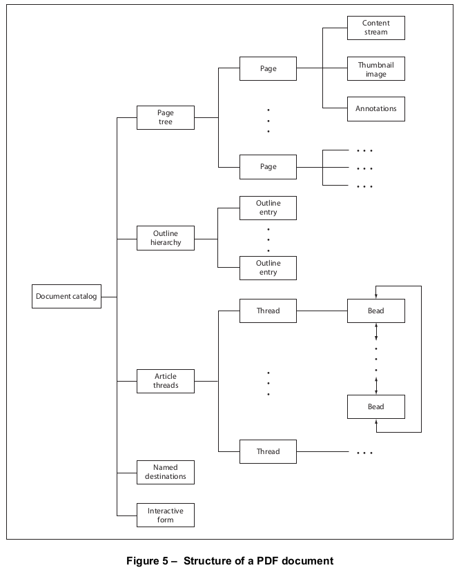
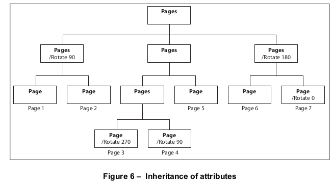

# 7.7 文档结构

**Document Structure**

## 7.7.1 概述

**General**

=== "中文"

    PDF文档可以被视为一个包含在PDF文件主体部分的对象层级结构。层级结构的根是文档的目录字典（参见[7.7.2](./s7.md#772-文档目录)，“文档目录”）。
    
    
    !!! note "Note"
        
        大多数层级结构中的对象都是字典。图5展示了对象层级结构的形态。
    
    !!! info "Example"
        
        文档的每一页都由一个页面对象表示——一个包含对页面内容和其他属性的引用的字典，例如它的缩略图（[12.3.4](../c12/s3.md#1234-缩略图)，“缩略图”）以及与之关联的任何注释（[12.5](../c12/s5.md)，“注释”）。各个页面对象被绑定在一个称为页面*树*的结构中（在[7.7.3](./s7.md#773-page树)，“页面树”中描述），该结构又通过文档目录中的间接引用被指定。层级结构中的父级、子级和兄弟关系由字典条目定义，其值是对其他字典的间接引用。
        
    本子条款中描述的数据结构，特别是**目录**和**页面**字典，结合了描述文档结构的条目和处理文档及页面详细语义的条目。所有条目都在这里列出，但许多条目的描述被推迟到后续子条款中。
    

=== "英文"

    A PDF document can be regarded as a hierarchy of objects contained in the body section of a PDF file. At the root of the hierarchy is the document’s catalog dictionary (see [7.7.2](./s7.md#772-文档目录), "Document Catalog").
    
    
    !!! note "Note"
        
        Most of the objects in the hierarchy are dictionaries. Figure 5 illustrates the structure of the object hierarchy.
    
    
    !!! info "Example"
    
        Each page of the document is represented by a page object—a dictionary that includes references to the page’s contents and other attributes, such as its thumbnail image ([12.3.4](../c12/s3.md#1234-缩略图), "Thumbnail Images") and any annotations ([12.5](../c12/s5.md), "Annotations") associated with it. The individual page objects are tied together in a structure called the page *tree* (described in [7.7.3](./s7.md#773-page树), "Page Tree"), which in turn is specified by an indirect reference in the document catalog. Parent, child, and sibling relationships within the hierarchy are defined by dictionary entries whose values are indirect references to other dictionaries.
    
    The data structures described in this sub-clause, particularly the **Catalog** and **Page** dictionaries, combine entries describing document structure with ones dealing with the detailed semantics of documents and pages. All entries are listed here, but many of their descriptions are deferred to subsequent sub-clauses.


## 7.7.2 文档目录

**Document Catalog**

=== "中文"

    文档的对象层次结构的根是目录字典，它通过PDF文件尾部的**Root**条目定位（见[7.5.5](./s5.md#755-文件尾部)，“文件尾部”）。目录包含对其他定义文档内容、大纲、文章线索、命名目的地和其他属性的对象的引用。此外，它还包含有关文档在屏幕上如何显示的信息，例如是否自动显示其大纲和缩略图页面图像，以及在打开文档时是否显示第一页以外的某个位置。[表28](#table28)显示了目录字典中的条目。

    

    <table id="table28" markdown="span">
        <caption>**Table 28 – 目录字典中的条目**</caption>
        <thead>
            <tr>
                <th><strong>Key</strong></th>
                <th><strong>Type</strong></th>
                <th><strong>Value</strong></th>
            </tr>
        </thead>
        <tbody>
            <tr>
                <td>**Type**</td>
                <td>name</td>
                <td>(*Required*) 这个字典描述的PDF对象的类型；对于**目录(catalog)**字典，应为Catalog。</td>
            </tr>
            <tr>
                <td>**Version**</td>
                <td>name</td>
                <td>(*Optional; PDF 1.4*) 文档符合的PDF规范版本（例如1.4），如果比文件头部指定的版本（见[7.5.2](./s5.md#752-文件头)，“文件头部”）更新。如果头部指定了更新的版本，或者如果这个条目不存在，则文档应符合头部指定的版本。这个条目允许符合规范的编写器使用增量更新来更新版本；见[7.5.6](./s5.md#756-增量更新)，“增量更新”。这个条目的值应该是一个名称对象，而不是数字，因此在PDF文件中写入时应该在前面加上斜杠字符(SOLIDUS (2Fh))（例如，/1.4）。</td>
            </tr>
            <tr>
                <td>**Extensions**</td>
                <td>dictionary</td>
                <td>(*Optional; ISO 32000*) 一个扩展字典，包含开发者前缀识别和文档中出现的开发者扩展的版本号。[7.12](./s12.md)，“扩展字典”，描述了这个字典以及它的使用方法。</td>
            </tr>
            <tr>
                <td>**Pages**</td>
                <td>dictionary</td>
                <td>(*Required; 应该是间接引用。*) 页面树节点，应为文档页面树的根（见[7.7.3](#773-page树)，“页面树”）。</td>
            </tr>
            <tr>
                <td>**PageLabels**</td>
                <td>number tree</td>
                <td>(*Optional; PDF 1.3*) 一个数字树（见[7.9.7](./s9.md#797-number树)，“数字树”），定义了文档的页面标记。此树中的键应为页面索引；相应的值应为页面标签字典（见[12.4.2](../c12/s4.md#1242-页面标签)，“页面标签”）。每个页面索引应表示一个标记范围中第一页，该范围应用了指定的页面标签字典。该树应包含页面索引0的值。</td>
            </tr>
            <tr>
                <td>**Names**</td>
                <td>dictionary</td>
                <td>(*Optional; PDF 1.2*) 文档的名称字典 (see [7.7.4](#774-名称字典), "Name Dictionary").</td>
            </tr>
            <tr>
                <td>**Dests**</td>
                <td>dictionary</td>
                <td>(*Optional; PDF 1.1; 应该是间接引用。*) 一个包含名称和相应目的地的字典。 (see [12.3.2.3](../c12/s3.md#12323-命名目的地), "Named Destinations").</td>
            </tr>
            <tr>
                <td>**ViewerPreferences**</td>
                <td>dictionary</td>
                <td>(*Optional; PDF 1.2*) 一个查看器首选项字典（见[12.2](../c12/s2.md)，“查看器首选项”），指定了文档在屏幕上的显示方式。如果这个条目不存在，符合规范的阅读器将使用它们自己的当前用户首选项设置。</td>
            </tr>
            <tr>
                <td>**PageLayout**</td>
                <td>name</td>
                <td>(*Optional*) 一个名称对象，指定了当文档打开时应该使用的页面布局：
                    <dl>
                        <dt>**SinglePage**</dt>
                        <dd>一次显示一页</dd>
                        <dt>**OneColumn**</dt>
                        <dd>以单列显示页面</dd>
                        <dt>**TwoColumnLeft**</dt>
                        <dd>以双列显示页面，奇数页在左侧</dd>
                        <dt>**TwoColumnRight**</dt>
                        <dd>以双列显示页面，奇数页在右侧</dd>
                        <dt>**TwoPageLeft**</dt>
                        <dd>（*PDF 1.5*）一次显示两页，奇数页在左侧</dd>
                        <dt>**TwoPageRight**</dt>
                        <dd>（*PDF 1.5*）一次显示两页，奇数页在右侧</dd>
                    </dl>
                默认值: **SinglePage**.</td>
            </tr>
            <tr>
                <td>**PageMode**</td>
                <td>name</td>
                <td>(*Optional*) 一个名称对象，指定了文档打开时应该如何显示。:
                    <dl>
                        <dt>**UseNone**</dt>
                        <dd>不显示文档大纲和缩略图图像</dd>
                        <dt>**UseOutlines**</dt>
                        <dd>显示文档大纲</dd>
                        <dt>**UseThumbs**</dt>
                        <dd>显示缩略图图像</dd>
                        <dt>**FullScreen**</dt>
                        <dd>全屏模式，不显示菜单栏、窗口控件或任何其他窗口</dd>
                        <dt>**UseOC**</dt>
                        <dd>（*PDF 1.5*）显示可选内容组面板</dd>
                        <dt>**UseAttachments**</dt>
                        <dd>（*PDF 1.5*）显示附件面板</dd>
                    </dl>
                    默认值: **UseNone**.
                </td>
            </tr>
            <tr>
                <td>**Outlines**</td>
                <td>dictionary</td>
                <td>
                (Optional; 应该是间接引用。) 目录字典(outline dictionary)，应为文档大纲层次结构的根。 (see [12.3.3](../c12/s3.md#1233-文档大纲), "Document Outline").
                </td>
            </tr>
            <tr>
                <td>**Threads**</td>
                <td>array</td>
                <td>
                (*Optional; PDF 1.1; 应该是间接引用。*) 一个线程字典数组，应代表文档的文章线索。 (see [12.4.3](../c12/s4.md#1243-文章), "Articles").
                </td>
            </tr>
            <tr>
                <td>**OpenAction**</td>
                <td>array or dictionary</td>
                <td>
                (*Optional; PDF 1.1*) 指定一个目的地的值，当文档打开时将显示该目的地，或执行一个操作。该值可以是一个定义目的地的数组（见[12.3.2](../c12/s3.md#1232-目的地)，“目的地”），或是一个表示操作的动作字典([12.6](../c12/s6.md)，“动作”)。如果这个条目不存在，文档将在默认放大因子下打开到第一页的顶部。
                </td>
            </tr>
            <tr>
                <td>**AA**</td>
                <td>dictionary</td>
                <td>
                (Optional; PDF 1.4) 一个附加动作字典，定义了对影响整个文档的各种触发事件的响应应采取的动作。 (see [12.6.3](../c12/s6.md#1263-触发事件), "Trigger Events").
                </td>
            </tr>
            <tr>
                <td>**URI**</td>
                <td>dictionary</td>
                <td>
                (*Optional; PDF 1.1*) 一个URI字典，包含用于URI（统一资源标识符）动作的文档级信息。 (see [12.6.4.7](../c12/s6.md#12647-uri-操作), "URI Actions").
                </td>
            </tr>
            <tr>
                <td>**AcroForm**</td>
                <td>dictionary</td>
                <td>
                (*Optional; PDF 1.2*) 文档的交互式表单（AcroForm）字典。 (see [12.7.2](../c12/s7.md#1272-交互式表格词典), "Interactive Form Dictionary").
                </td>
            </tr>
            <tr>
                <td>**Metadata**</td>
                <td>stream</td>
                <td>
                (*Optional; PDF 1.4; 应该是间接引用。*) 元数据流，包含文档的元数据。 (see [14.3.2](../c14/s3.md#1432-元数据流), "Metadata Streams").
                </td>
            </tr>
            <tr>
                <td>**StructTreeRoot**</td>
                <td>dictionary</td>
                <td>
                (*Optional; PDF 1.3*) 文档的结构树根字典。 (see [14.7.2](../c14/s7.md#1472-结构层次), "Structure Hierarchy").
                </td>
            </tr>
            <tr>
                <td>**MarkInfo**</td>
                <td>dictionary</td>
                <td>
                (*Optional; PDF 1.4*) 标记信息字典，包含有关文档使用标记PDF约定的信息。 (see [14.7](../c14/s7.md), "Logical Structure").
                </td>
            </tr>
            <tr>
                <td>**Lang**</td>
                <td>text string</td>
                <td>
                (*Optional; PDF 1.4*) 一个语言标识符，应指定文档中所有文本的自然语言，除非结构元素或标记内容的语言规范另有指定（见[14.9.2](../c14/s9.md#1492-自然语言规范)，“自然语言规范”）。如果这个条目缺失，则该语言应被视为未知。
                </td>
            </tr>
            <tr>
                <td>**SpiderInfo**</td>
                <td>dictionary</td>
                <td>
                (*Optional; PDF 1.3*) 一个Web捕获信息字典，其中应包含任何Web捕获扩展使用的州信息。 (see [14.10.2](../c14/s10.md#14102-网页捕获信息字典), "Web Capture Information Dictionary").
                </td>
            </tr>
            <tr>
                <td>**OutputIntents**</td>
                <td>array</td>
                <td>
                (Optional; PDF 1.4) 一个输出意图数组，其中应指定文档可能呈现的输出设备的色域特性。 (see [14.11.5](../c14/s11.md#14115-输出意图), "Output Intents").
                </td>
            </tr>
            <tr>
                <td>**PieceInfo**</td>
                <td>dictionary</td>
                <td>
                (Optional; PDF 1.4) 一个与文档关联的页面片段字典。 (see [14.5](../c14/s5.md), "Page-Piece Dictionaries").
                </td>
            </tr>
            <tr>
                <td>**OCProperties**</td>
                <td>dictionary</td>
                <td>
                (Optional; PDF 1.5; 如果文档包含可选内容，则必须提供) 文档的可选内容属性字典。 (see [8.11.4](../c8/s11.md#8114-配置可选内容), "Configuring Optional Content").
                </td>
            </tr>
            <tr>
                <td>**Perms**</td>
                <td>dictionary</td>
                <td>
                (Optional; PDF 1.5) 一个权限字典，应指定用户对文档的访问权限。[12.8.4](../c12/s8.md#1284-权限)，“权限”，描述了这个字典及其使用方法。
                </td>
            </tr>
            <tr>
                <td>**Legal**</td>
                <td>dictionary</td>
                <td>
                (Optional; PDF 1.5) 一个字典，其中应包含有关PDF文档内容的证明，因为它与数字签名的合法性相关。 (see [12.8.5](../c12/s8.md#1285-合法内容认证), "Legal Content Attestations").
                </td>
            </tr>
            <tr>
                <td>**Requirements**</td>
                <td>array</td>
                <td>
                (Optional; PDF 1.7) 一个需求数组，其中应表示文档的需求。[12.10](../c12/s10.md)，“文档需求”，描述了这个字典及其使用方法。
                </td>
            </tr>
            <tr>
                <td>**Collection**</td>
                <td>dictionary</td>
                <td>
                (Optional; PDF 1.7) 一个集合字典，符合规范的阅读器将使用它来增强PDF文档中存储的文件附件的呈现。 (see [12.3.5](../c12/s3.md#1235-收藏), "Collections").
                </td>
            </tr>
            <tr>
                <td>**NeedsRendering**</td>
                <td>boolean</td>
                <td>
                (Optional; PDF 1.7) 用于加速显示包含XFA表单的PDF文档的标志。它指定了在首次打开文档时是否应重新生成文档。 请参阅XML表单架构（XFA）规范（参考文献）。<br/> 默认值：**false**。
                </td>
            </tr>
        </tbody>
    </table>
    
    !!! info "EXAMPLE"

        以下展示了一个示例目录对象。
        
        ```tex
        1 0 obj
            << /Type /Catalog
               /Pages 2 0 R
               /PageMode /UseOutlines
               /Outlines 3 0 R
            >>
        endobj
        ```

=== "英文"

    The root of a document’s object hierarchy is the catalog dictionary, located by means of the **Root** entry in the trailer of the PDF file (see [7.5.5](./s5.md#755-文件尾部), "File Trailer"). The catalog contains references to other objects defining the document’s contents, outline, article threads, named destinations, and other attributes. In addition, it contains information about how the document shall be displayed on the screen, such as whether its outline and thumbnail page images shall be displayed automatically and whether some location other than the first page shall be shown when the document is opened. [Table 28](#table28) shows the entries in the catalog dictionary.

    


    <table id="table28" markdown="span">
        <caption>**Table 28 – Entries in the catalog dictionary**</caption>
        <thead>
            <tr>
                <th><strong>Key</strong></th>
                <th><strong>Type</strong></th>
                <th><strong>Value</strong></th>
            </tr>
        </thead>
        <tbody>
            <tr>
                <td>**Type**</td>
                <td>name</td>
                <td>(*Required*) The type of PDF object that this dictionary describes; shall be Catalog for the **catalog** dictionary.</td>
            </tr>
            <tr>
                <td>**Version**</td>
                <td>name</td>
                <td>(*Optional; PDF 1.4*) The version of the PDF specification to which the document conforms (for example, 1.4) if later than the version specified in the file’s header (see [7.5.2](./s5.md#752-文件头), "File Header"). If the header specifies a later version, or if this entry is absent, the document shall conform to the version specified in the header. This entry enables a conforming writer to update the version using an incremental update; see [7.5.6](./s5.md#756-增量更新), "Incremental Updates."<br/> The value of this entry shall be a name object, not a number, and therefore shall be preceded by a SOLIDUS (2Fh) character (/) when written in the PDF file (for example, /1.4).</td>
            </tr>
            <tr>
                <td>**Extensions**</td>
                <td>dictionary</td>
                <td>(*Optional; ISO 32000*) An extensions dictionary containing developer prefix identification and version numbers for developer extensions that occur in this document. [7.12](./s12.md), “Extensions Dictionary”, describes this dictionary and how it shall be used.</td>
            </tr>
            <tr>
                <td>**Pages**</td>
                <td>dictionary</td>
                <td>(*Required; shall be an indirect reference*) The page tree node that shall be the root of the document’s page tree (see [7.7.3](#773-page树), "Page Tree").</td>
            </tr>
            <tr>
                <td>**PageLabels**</td>
                <td>number tree</td>
                <td>(*Optional; PDF 1.3*) A number tree (see [7.9.7](./s9.md#797-number树), "Number Trees") defining the page labelling for the document. The keys in this tree shall be page indices; the corresponding values shall be page label dictionaries (see [12.4.2](../c12/s4.md#1242-页面标签), "Page Labels"). Each page index shall denote the first page in a labelling range to which the specified page label dictionary applies. The tree shall include a value for page index 0.</td>
            </tr>
            <tr>
                <td>**Names**</td>
                <td>dictionary</td>
                <td>(*Optional; PDF 1.2*) The document’s name dictionary (see [7.7.4](#774-名称字典), "Name Dictionary").</td>
            </tr>
            <tr>
                <td>**Dests**</td>
                <td>dictionary</td>
                <td>(*Optional; PDF 1.1; shall be an indirect reference*) A dictionary of names and corresponding destinations (see [12.3.2.3](../c12/s3.md#12323-命名目的地), "Named Destinations").</td>
            </tr>
            <tr>
                <td>**ViewerPreferences**</td>
                <td>dictionary</td>
                <td>(*Optional; PDF 1.2*) A viewer preferences dictionary (see [12.2](../c12/s2.md), "Viewer Preferences") specifying the way the document shall be displayed on the screen. If this entry is absent, conforming readers shall use their own current user preference settings.</td>
            </tr>
            <tr>
                <td>**PageLayout**</td>
                <td>name</td>
                <td>(*Optional*) A name object specifying the page layout shall be used when the document is opened:
                    <dl>
                        <dt>**SinglePage**</dt>
                        <dd>Display one page at a time</dd>
                        <dt>**OneColumn**</dt>
                        <dd>Display the pages in one column</dd>
                        <dt>**TwoColumnLeft**</dt>
                        <dd>Display the pages in two columns, with odd-numbered pages on the left</dd>
                        <dt>**TwoColumnRight**</dt>
                        <dd>Display the pages in two columns, with odd-numbered pages on the right</dd>
                        <dt>**TwoPageLeft**</dt>
                        <dd>(*PDF 1.5*) Display the pages two at a time, with odd-numbered pages on the left</dd>
                        <dt>**TwoPageRight**</dt>
                        <dd>(*PDF 1.5*) Display the pages two at a time, with odd-numbered pages on the right</dd>
                    </dl>
                Default value: **SinglePage**.</td>
            </tr>
            <tr>
                <td>**PageMode**</td>
                <td>name</td>
                <td>(*Optional*) A name object specifying how the document shall be displayed when opened:
                    <dl>
                        <dt>**UseNone**</dt>
                        <dd>Neither document outline nor thumbnail images visible</dd>
                        <dt>**UseOutlines**</dt>
                        <dd>Document outline visible</dd>
                        <dt>**UseThumbs**</dt>
                        <dd>Thumbnail images visible</dd>
                        <dt>**FullScreen**</dt>
                        <dd>Full-screen mode, with no menu bar, window controls, or any other window visible</dd>
                        <dt>**UseOC**</dt>
                        <dd>(*PDF 1.5*) Optional content group panel visible</dd>
                        <dt>**UseAttachments**</dt>
                        <dd>(*PDF 1.5*) Attachments panel visible</dd>
                    </dl>
                    Default value: **UseNone**.
                </td>
            </tr>
            <tr>
                <td>**Outlines**</td>
                <td>dictionary</td>
                <td>
                (Optional; shall be an indirect reference) The outline dictionary that shall be the root of the document’s outline hierarchy (see [12.3.3](../c12/s3.md#1233-文档大纲), "Document Outline").
                </td>
            </tr>
            <tr>
                <td>**Threads**</td>
                <td>array</td>
                <td>
                (*Optional; PDF 1.1; shall be an indirect reference*) An array of thread dictionaries that shall represent the document’s article threads (see [12.4.3](../c12/s4.md#1243-文章), "Articles").
                </td>
            </tr>
            <tr>
                <td>**OpenAction**</td>
                <td>array or dictionary</td>
                <td>
                (*Optional; PDF 1.1*) A value specifying a destination that shall be displayed or an action that shall be performed when the document is opened. The value shall be either an array defining a destination (see [12.3.2](../c12/s3.md#1232-目的地), "Destinations") or an action dictionary representing an action ([12.6](../c12/s6.md), "Actions"). If this entry is absent, the document shall be opened to the top of the first page at the default magnification factor.
                </td>
            </tr>
            <tr>
                <td>**AA**</td>
                <td>dictionary</td>
                <td>
                (Optional; PDF 1.4) An additional-actions dictionary defining the actions that shall be taken in response to various trigger events affecting the document as a whole (see [12.6.3](../c12/s6.md#1263-触发事件), "Trigger Events").
                </td>
            </tr>
            <tr>
                <td>**URI**</td>
                <td>dictionary</td>
                <td>
                (*Optional; PDF 1.1*) A URI dictionary containing document-level information for URI (uniform resource identifier) actions (see [12.6.4.7](../c12/s6.md#12647-uri-操作), "URI Actions").
                </td>
            </tr>
            <tr>
                <td>**AcroForm**</td>
                <td>dictionary</td>
                <td>
                (*Optional; PDF 1.2*) The document’s interactive form (AcroForm) dictionary (see [12.7.2](../c12/s7.md#1272-交互式表格词典), "Interactive Form Dictionary").
                </td>
            </tr>
            <tr>
                <td>**Metadata**</td>
                <td>stream</td>
                <td>
                (*Optional; PDF 1.4; shall be an indirect reference*) A metadata stream that shall contain metadata for the document (see [14.3.2](../c14/s3.md#1432-元数据流), "Metadata Streams").
                </td>
            </tr>
            <tr>
                <td>**StructTreeRoot**</td>
                <td>dictionary</td>
                <td>
                (*Optional; PDF 1.3*) The document’s structure tree root dictionary (see [14.7.2](../c14/s7.md#1472-结构层次), "Structure Hierarchy").
                </td>
            </tr>
            <tr>
                <td>**MarkInfo**</td>
                <td>dictionary</td>
                <td>
                (*Optional; PDF 1.4*) A mark information dictionary that shall contain information about the document’s usage of Tagged PDF conventions (see [14.7](../c14/s7.md), "Logical Structure").
                </td>
            </tr>
            <tr>
                <td>**Lang**</td>
                <td>text string</td>
                <td>
                (*Optional; PDF 1.4*) A language identifier that shall specify the natural language for all text in the document except where overridden by language specifications for structure elements or marked content (see [14.9.2](../c14/s9.md#1492-自然语言规范), "Natural Language Specification"). If this entry is absent, the language shall be considered unknown.
                </td>
            </tr>
            <tr>
                <td>**SpiderInfo**</td>
                <td>dictionary</td>
                <td>
                (*Optional; PDF 1.3*) A Web Capture information dictionary that shall contain state information used by any Web Capture extension (see [14.10.2](../c14/s10.md#14102-网页捕获信息字典), "Web Capture Information Dictionary").
                </td>
            </tr>
            <tr>
                <td>**OutputIntents**</td>
                <td>array</td>
                <td>
                (Optional; PDF 1.4) An array of output intent dictionaries that shall specify the colour characteristics of output devices on which the document might be rendered (see [14.11.5](../c14/s11.md#14115-输出意图), "Output Intents").
                </td>
            </tr>
            <tr>
                <td>**PieceInfo**</td>
                <td>dictionary</td>
                <td>
                (Optional; PDF 1.4) A page-piece dictionary associated with the document (see [14.5](../c14/s5.md), "Page-Piece Dictionaries").
                </td>
            </tr>
            <tr>
                <td>**OCProperties**</td>
                <td>dictionary</td>
                <td>
                (Optional; PDF 1.5; required if a document contains optional content) The document’s optional content properties dictionary (see [8.11.4](../c8/s11.md#8114-配置可选内容), "Configuring Optional Content").
                </td>
            </tr>
            <tr>
                <td>**Perms**</td>
                <td>dictionary</td>
                <td>
                (Optional; PDF 1.5) A permissions dictionary that shall specify user access permissions for the document. [12.8.4](../c12/s8.md#1284-权限), "Permissions", describes this dictionary and how it shall be used.
                </td>
            </tr>
            <tr>
                <td>**Legal**</td>
                <td>dictionary</td>
                <td>
                (Optional; PDF 1.5) A dictionary that shall contain attestations regarding the content of a PDF document, as it relates to the legality of digital signatures (see [12.8.5](../c12/s8.md#1285-合法内容认证), "Legal Content Attestations").
                </td>
            </tr>
            <tr>
                <td>**Requirements**</td>
                <td>array</td>
                <td>
                (Optional; PDF 1.7) An array of requirement dictionaries that shall represent requirements for the document. [12.10](../c12/s10.md), "Document Requirements", describes this dictionary and how it shall be used.
                </td>
            </tr>
            <tr>
                <td>**Collection**</td>
                <td>dictionary</td>
                <td>
                (Optional; PDF 1.7) A collection dictionary that a conforming reader shall use to enhance the presentation of file attachments stored in the PDF document. (see [12.3.5](../c12/s3.md#1235-收藏), "Collections").
                </td>
            </tr>
            <tr>
                <td>**NeedsRendering**</td>
                <td>boolean</td>
                <td>
                (Optional; PDF 1.7) A flag used to expedite the display of PDF documents containing XFA forms. It specifies whether the document shall be regenerated when the document is first opened.<br/> See the XML Forms Architecture (XFA) Specification (Bibliography).<br/> Default value: **false**.
                </td>
            </tr>
        </tbody>
    </table>
    
    !!! info "EXAMPLE"

        The following shows a sample catalog object.
        
        ```tex
        1 0 obj
            << /Type /Catalog
               /Pages 2 0 R
               /PageMode /UseOutlines
               /Outlines 3 0 R
            >>
        endobj
        ```

## 7.7.3 Page树

**Page Tree**

### 7.7.3.1 概述

**General**

=== "中文"
    
    文档的页面通过称为页面树的结构访问，该结构定义了文档中页面的顺序。使用树结构，即使内存有限，符合规范的阅读器也可以快速打开包含数千页的文档。树包含两种类型的节点——中间节点，称为页面树节点，以及叶节点，称为页面对象，其形式在后续子条款中描述。符合规范的产品应准备好处理由这些节点构建的任何树形结构。
    
    !!! note "NOTE"
    
        最简单的结构可以由一个页面树节点组成，该节点直接引用文档的所有页面对象。然而，为了优化应用程序性能，符合规范的编写器可以构建特定形式的树，称为平衡树。有关这种树的更多信息可以在《数据结构与算法》一书中找到，作者是Aho、Hopcroft和Ullman（见参考文献）。
    

=== "英文"
    
    The pages of a document are accessed through a structure known as the page tree, which defines the ordering of pages in the document. Using the tree structure, conforming readers using only limited memory, can quickly open a document containing thousands of pages. The tree contains nodes of two types—intermediate nodes, called page tree nodes, and leaf nodes, called page objects—whose form is described in the subsequent sub- clauses. Conforming products shall be prepared to handle any form of tree structure built of such nodes.
    
    !!! note "NOTE"
    
        The simplest structure can consist of a single page tree node that references all of the document’s page objects directly. However, to optimize application performance, a conforming writer can construct trees of a particular form, known as balanced trees. Further information on this form of tree can be found in Data Structures and Algorithms, by Aho, Hopcroft, and Ullman (see the Bibliography).

### 7.7.3.2 Page树节点

**Page Tree Nodes**

=== "中文"

    表29展示了页面树节点中始终必须存在的条目（必需）。
    
    <table id="table29" markdown="span">
        <caption>**Table 29 – Required entries in a page tree node**</caption>
        <thead>
            <tr>
                <th><strong>Key</strong></th>
                <th><strong>Type</strong></th>
                <th><strong>Value</strong></th>
            </tr>
        </thead>
        <tbody>
            <tr>
                <td>**Type**</td>
                <td>name</td>
                <td>(*Required*) 此字典描述的PDF对象类型；对于页面树节点，应为**Pages**。</td>
            </tr>
            <tr>
                <td>**Parent**</td>
                <td>dictionary</td>
                <td>（除根节点外必需；在根节点中禁止；必须是间接引用）直接父级页面树节点。</td>
            </tr>
            <tr>
                <td>**Kids**</td>
                <td>array</td>
                <td>(*Required*) 对本节点的直接子节点的间接引用数组。子节点只能是页面对象或其他页面树节点。</td>
            </tr>
            <tr>
                <td>**Count**</td>
                <td>integer</td>
                <td>(*Required*) 作为本节点在页面树中的后代的叶节点（页面对象）的数量。</td>
            </tr>
        </tbody>
    </table>
    
    !!! note "NOTE"
    
        页面树的结构不一定与文档的逻辑结构相关；也就是说，页面树节点并不代表章节、小节等。为此目的定义了其他数据结构；见[14.7](../c14/s7.md)，“逻辑结构”。
    
    符合规范的产品不必保留页面树的现有结构。
    
    !!! info "EXAMPLE"
    
        以下展示了一个包含三页的文档的页面树。要查看各个页面对象的内容，请参见[7.7.3.3](#7733-page对象)，“页面对象”，以及[H.5](../a8.md#h5-页面树示例)，“页面树示例”，后者展示了更长文档的页面树的更详细示例。
    
        ```tex
        2 0 obj
            << /Type /Pages
               /Kids [ 4 0 R
                       10 0 R
                       24 0 R
                     ]
               /Count 3
            >>
        endobj
    
        4 0 obj
            << /Type /Page
               … 额外条目描述了此页面的属性。 …
            >>
        endobj
    
        10 0 obj
            << /Type /Page
               … 额外条目描述了此页面的属性。 …
            >>
        endobj
        
        24 0 obj
            << /Type /Page
               … 额外条目描述了此页面的属性。 …
            >>
        endobj
        ```
    
    除了[表29](#table29)中显示的条目外，页面树节点还可能包含其他条目，用于定义其后代页面对象的继承属性（见[7.7.3.4](#7734-page属性的继承)，“页面属性的继承”）。

=== "英文"

    Table 29 shows the entries in a page tree node that shall always be present (Required).
    
    <table id="table29" markdown="span">
        <caption>**Table 29 – Required entries in a page tree node**</caption>
        <thead>
            <tr>
                <th><strong>Key</strong></th>
                <th><strong>Type</strong></th>
                <th><strong>Value</strong></th>
            </tr>
        </thead>
        <tbody>
            <tr>
                <td>**Type**</td>
                <td>name</td>
                <td>(*Required*) The type of PDF object that this dictionary describes; shall be **Pages** for a page tree node.</td>
            </tr>
            <tr>
                <td>**Parent**</td>
                <td>dictionary</td>
                <td>(*Required except in root node; prohibited in the root node; shall be an indirect reference*) The page tree node that is the immediate parent of this one.</td>
            </tr>
            <tr>
                <td>**Kids**</td>
                <td>array</td>
                <td>(*Required*) An array of indirect references to the immediate children of this node. The children shall only be page objects or other page tree nodes.</td>
            </tr>
            <tr>
                <td>**Count**</td>
                <td>integer</td>
                <td>(*Required*) The number of leaf nodes (page objects) that are descendants of this node within the page tree.</td>
            </tr>
        </tbody>
    </table>
    
    !!! note "NOTE"
    
        The structure of the page tree is not necessarily related to the logical structure of the document; that is, page tree nodes do not represent chapters, sections, and so forth. Other data structures are defined for this purpose; see [14.7](../c14/s7.md), "Logical Structure".
    
    Conforming products shall not be required to preserve the existing structure of the page tree.
    
    !!! info "EXAMPLE"
    
        The following illustrates the page tree for a document with three pages. See [7.7.3.3](#7733-page对象), "Page Objects," for the contents of the individual page objects, and [H.5](../a8.md#h5-页面树示例), "Page Tree Example", for a more extended example showing the page tree for a longer document.
    
        ```tex
        2 0 obj
            << /Type /Pages
               /Kids [ 4 0 R
                       10 0 R
                       24 0 R
                     ]
               /Count 3
            >>
        endobj
    
        4 0 obj
            << /Type /Page
               … Additional entries describing the attributes of this page …
            >>
        endobj
    
        10 0 obj
            << /Type /Page
               … Additional entries describing the attributes of this page …
            >>
        endobj
        
        24 0 obj
            << /Type /Page
               … Additional entries describing the attributes of this page …
            >>
        endobj
        ```
    
    In addition to the entries shown in [Table 29](#table29), a page tree node may contain further entries defining inherited attributes for the page objects that are its descendants (see [7.7.3.4](#7734-page属性的继承), "Inheritance of Page Attributes").

### 7.7.3.3 Page对象

**Page Objects**

=== "中文"

    页面树的叶子是页面对象，每个页面对象都是一个字典，指定了文档中单个页面的属性。表30显示了这个字典的内容。该表还识别了页面可以从页面树中的祖先节点继承哪些属性，如[7.7.3.4](#7734-页面属性的继承)节“页面属性的继承”中所述。表中未明确标识为可继承的属性不得被继承。
    
    <table id="table30" markdown="span">
        <caption>**Table 30 – Entries in a page object**</caption>
        <thead>
            <tr>
                <th><strong>Key</strong></th>
                <th><strong>Type</strong></th>
                <th><strong>Value</strong></th>
            </tr>
        </thead>
        <tbody>
            <tr>
                <td>**Type**</td>
                <td>name</td>
                <td>(*Required*) 这个字典描述的PDF对象的类型；对于页面对象，应该是"Page"。</td>
            </tr>
            <tr>
                <td>**Parent**</td>
                <td>dictionary</td>
                <td>(*Required; 这应是一个间接引用*)页面树节点，它是这个页面对象的直接父节点。</td>
            </tr>
            <tr>
                <td>**LastModified**</td>
                <td>date</td>
                <td>（*如果存在**PieceInfo**，则为必需；否则为可选；PDF 1.3*）页面内容最近一次修改的日期和时间（见[7.9.4](./s9.md#794-日期)，“日期”）。如果存在页面片段字典（**PieceInfo**），修改日期将被用来确定它包含的应用程序数据字典中哪一个对应页面的当前内容（见[14.5](../c14/s5.md)，“页面片段字典”）。</td>
            </tr>
            <tr>
                <td>**Resources**</td>
                <td>dictionary</td>
                <td>（必需；可继承）一个字典，包含页面所需的所有资源（见[7.8.3](./s8.md#783-资源字典)，“资源字典”）。如果页面不需要任何资源，这个条目的值应该是一个空字典。完全省略这个条目表示资源应从页面树中的祖先节点继承。</td>
            </tr>
            <tr>
                <td>**MediaBox**</td>
                <td>rectangle</td>
                <td>（必需；可继承）一个矩形（见[7.9.5](./s9.md#795-矩形)，“矩形”），以默认用户空间单位表示，它应定义页面显示或打印的物理介质的边界（见[14.11.2](../c14/s11.md#14112-页面边界)，“页面边界”）。</td>
            </tr>
            <tr>
                <td>**CropBox**</td>
                <td>rectangle</td>
                <td>（可选；可继承）一个矩形，以默认用户空间单位表示，它应定义默认用户空间的可见区域。当页面被显示或打印时，其内容将被裁剪到这个矩形，然后以某种实现定义的方式施加到输出介质上（见[14.11.2](../c14/s11.md#14112-页面边界)，“页面边界”）。默认值：**MediaBox**的值。</td>
            </tr>
            <tr>
                <td>**BleedBox**</td>
                <td>rectangle</td>
                <td>（可选；PDF 1.3）一个矩形，以默认用户空间单位表示，它应定义在生产环境中输出时页面内容应被裁剪的区域（见[14.11.2](../c14/s11.md#14112-页面边界)，“页面边界”）。默认值：**CropBox**的值。</td>
            </tr>
            <tr>
                <td>**TrimBox**</td>
                <td>rectangle</td>
                <td>（可选；PDF 1.3）一个矩形，以默认用户空间单位表示，它应定义修剪后完成页面的预期尺寸（见[14.11.2](../c14/s11.md#14112-页面边界)，“页面边界”）。默认值：**CropBox**的值。</td>
            </tr>
            <tr>
                <td>**ArtBox**</td>
                <td>rectangle</td>
                <td>（可选；PDF 1.3）一个矩形，以默认用户空间单位表示，它应定义页面的有意义内容（包括潜在的空白区域）的范围，正如页面创建者所预期的（见[14.11.2](../c14/s11.md#14112-页面边界)，“页面边界”）。默认值：**CropBox**的值。</td>
            </tr>
            <tr>
                <td>**BoxColorInfo**</td>
                <td>dictionary</td>
                <td>（可选；PDF 1.4）一个框颜色信息字典，应指定在屏幕上显示各种页面边界的指导线时应使用的的颜色和其他视觉特征（见[14.11.2.2](../c14/s11.md#141122-页面边界的显示)，“页面边界的显示”）。如果这个条目不存在，应用程序应使用其自己的当前默认设置。</td>
            </tr>
            <tr>
                <td>**Contents**</td>
                <td>stream or array</td>
                <td>（可选）一个内容流（见[7.8.2](./s8.md#782-内容流)，“内容流”），它应描述此页面的内容。如果这个条目不存在，页面将是空的。<br/> 值可以是单个流或流的数组。如果值是数组，效果应等同于将数组中的所有流按顺序连接起来形成一个单独的流。符合规范的编写器可以在内容流中断时创建图像对象和其他资源。流之间的划分只能发生在词法标记的边界上（见[7.2]，“词法约定”），但应与页面的逻辑内容或组织无关。消费或生成PDF文件的应用程序不需要保留**Contents**数组的现有结构。符合规范的编写器不应创建一个不包含任何元素的Contents数组。</td>
            </tr>
            <tr>
                <td>**Rotate**</td>
                <td>integer</td>
                <td>（可选；可继承）页面在显示或打印时应顺时针旋转的度数。该值应为90的倍数。默认值：0。</td>
            </tr>
            <tr>
                <td>**Group**</td>
                <td>dictionary</td>
                <td>（可选；PDF 1.4）一个组属性字典，应指定页面的页面组的属性，用于透明成像模型（见[11.4.7]，“页面组”和[11.6.6]，“透明组 XObjects”）。</td>
            </tr>
            <tr>
                <td>**Thumb**</td>
                <td>stream</td>
                <td>（可选）一个流对象，它应定义页面的缩略图（见[12.3.4]，“缩略图”）。</td>
            </tr>
            <tr>
                <td>**B**</td>
                <td>array</td>
                <td>（可选；PDF 1.1；如果页面包含文章珠，建议使用）一个数组，应包含页面上所有文章珠的间接引用（见[12.4.3]，“文章”）。这些珠应在数组中按自然阅读顺序列出。
    
    !!! note "NOTE"
    
        这个条目中的信息可以从目录中的Threads键获得的信息中创建或重新创建。</td>
            </tr>
            <tr>
                <td>**Dur**</td>
                <td>number</td>
                <td>(*Optional; PDF 1.1*) 页面的显示时长（也称为其推进时间）：在演示中页面被显示的最大时间长度，以秒为单位，在查看器应用程序自动进入下一页之前。默认情况下，查看器不会自动推进。（见[12.4.4]，"演示"）。</td>
            </tr>
            <tr>
                <td>**Trans**</td>
                <td>dictionary</td>
                <td>(*Optional; PDF 1.1*) 页面在演示期间的过渡效果：描述在演示中显示页面时应使用的过渡效果的过渡字典（见[12.4.4]，"演示"）。</td>
            </tr>
            <tr>
                <td>**Annots**</td>
                <td>array</td>
                <td>(*Optional*) 一个注释字典数组，其中应包含与页面相关联的所有注释的间接引用（见[12.5]，"注释"）。</td>
            </tr>
            <tr>
                <td>**AA**</td>
                <td>dictionary</td>
                <td>(*Optional; PDF 1.2*) 一个附加动作字典，它应该定义在打开或关闭页面时执行的动作（见[12.6.3]，"触发事件"）。<br/>（PDF 1.3）附加动作字典不可继承。</td>
            </tr>
            <tr>
                <td>**Metadata**</td>
                <td>stream</td>
                <td>(*Optional; PDF 1.4*) 页面的元数据流，其中应包含页面的元数据。 (see [14.3.2], "Metadata Streams").</td>
            </tr>
            <tr>
                <td>**PieceInfo**</td>
                <td>dictionary</td>
                <td>(*Optional; PDF 1.3*) 与页面关联的页面片段字典。 (see [14.5], "Page-Piece Dictionaries").</td>
            </tr>
            <tr>
                <td>**StructParents**</td>
                <td>integer</td>
                <td>(如果页面包含结构化内容项则 Required；PDF 1.3) 页面在结构化父树中的条目整数键。 (see [14.7.4.4], "Finding Structure Elements from Content Items").</td>
            </tr>
            <tr>
                <td>**ID**</td>
                <td>byte string</td>
                <td>(*可选；PDF 1.3；推荐使用间接引用*) 页面父Web捕获内容集的数字标识符。 (see [14.10.6], "Object Attributes Related to Web Capture").</td>
            </tr>
            <tr>
                <td>**PZ**</td>
                <td>number</td>
                <td>(*Optional; PDF 1.3*) 页面的首选“缩放”（“放大”）因子：为了达到自然显示放大倍数，页面应该被缩放的比例。 (see [14.10.6], "Object Attributes Related to Web Capture").</td>
            </tr>
            <tr>
                <td>**SeparationInfo**</td>
                <td>dictionary</td>
                <td>(Optional; PDF 1.3) 一个分离字典，其中应包含为页面生成颜色分离所需的信息。 (see [14.11.4], "Separation Dictionaries").</td>
            </tr>
            <tr>
                <td>**Tabs**</td>
                <td>name</td>
                <td>(Optional; PDF 1.5) 页面注释的选项卡顺序名称。可能的值包括 R（行顺序）、C（列顺序）和 S（结构顺序）。 See [12.5], "Annotations" for details.</td>
            </tr>
            <tr>
                <td>**TemplateInstantiated**</td>
                <td>name</td>
                <td>(如果此页面是从命名页面对象创建的则Required；PDF 1.5) 原始页面对象的名称。 (see [12.7.6], "Named Pages").</td>
            </tr>
            <tr>
                <td>**PresSteps**</td>
                <td>dictionary</td>
                <td>(*Optional; PDF 1.5*) 一个“导航节点字典”，它应该表示页面上的第一个节点。 (see [12.4.4.2], "Sub-page Navigation").</td>
            </tr>
            <tr>
                <td>**UserUnit**</td>
                <td>number</td>
                <td>(Optional; PDF 1.6) 一个正数，它应该给出默认用户空间单位的大小，以1/72英寸的倍数表示。支持的值范围应根据实现而定。<br/> 默认值：1.0（用户空间单位为1/72英寸）。</td>
            </tr>
            <tr>
                <td>**VP**</td>
                <td>dictionary</td>
                <td>(Optional; PDF 1.6) 一个*视口字典数组(viewport dictionaries)*（见[表260](../c12/s9.md#table260)），它应指定页面的矩形区域。</td>
            </tr>
        </tbody>
    </table>
    
    !!! info "EXAMPLE"
    
        以下展示了一个带有缩略图图像和两个注释的页面对象的定义。媒体框指定页面应打印在信纸大小的纸张上。此外，资源字典被指定为直接对象，并显示页面使用了三个名为F3、F5和F7的字体。
    
        ```tex
        3 0 obj
            << /Type /Page
                /Parent 4 0 R
                /MediaBox [ 0 0 612 792 ]
                /Resources << /Font << /F3 7 0 R
                                       /F5 9 0 R
                                       /F7 11 0 R
                                       >>
                              /ProcSet [ /PDF ]
                            >>
                /Contents 12 0 R
                /Thumb 14 0 R
                /Annots [ 23 0 R
                          24 0 R
                        ]
            >>
        endobj
        ```

=== "英文"

    The leaves of the page tree are page objects, each of which is a dictionary specifying the attributes of a single page of the document. Table 30 shows the contents of this dictionary. The table also identifies which attributes a page may inherit from its ancestor nodes in the page tree, as described under [7.7.3.4](#7734-page属性的继承), "Inheritance of Page Attributes." Attributes that are not explicitly identified in the table as inheritable shall not be inherited.
    
    <table id="table30" markdown="span">
        <caption>**Table 30 – Entries in a page object**</caption>
        <thead>
            <tr>
                <th><strong>Key</strong></th>
                <th><strong>Type</strong></th>
                <th><strong>Value</strong></th>
            </tr>
        </thead>
        <tbody>
            <tr>
                <td>**Type**</td>
                <td>name</td>
                <td>(*Required*) The type of PDF object that this dictionary describes; shall be Page for a page object.</td>
            </tr>
            <tr>
                <td>**Parent**</td>
                <td>dictionary</td>
                <td>(*Required; shall be an indirect reference*) The page tree node that is the immediate parent of this page object.</td>
            </tr>
            <tr>
                <td>**LastModified**</td>
                <td>date</td>
                <td>(*Required if **PieceInfo** is present; optional otherwise; PDF 1.3*) The date and time (see [7.9.4](./s9.md#794-日期), "Dates") when the page’s contents were most recently modified. If a page-piece dictionary (**PieceInfo**) is present, the modification date shall be used to ascertain which of the application data dictionaries that it contains correspond to the current content of the page (see [14.5](../c14/s5.md), "Page-Piece Dictionaries").</td>
            </tr>
            <tr>
                <td>**Resources**</td>
                <td>dictionary</td>
                <td>(Required; inheritable) A dictionary containing any resources required by the page (see [7.8.3](./s8.md#783-资源字典), "Resource Dictionaries"). If the page requires no resources, the value of this entry shall be an empty dictionary. Omitting the entry entirely indicates that the resources shall be inherited from an ancestor node in the page tree.</td>
            </tr>
            <tr>
                <td>**MediaBox**</td>
                <td>rectangle</td>
                <td>(Required; inheritable) A rectangle (see [7.9.5](./s9.md#795-矩形), "Rectangles"), expressed in default user space units, that shall define the boundaries of the physical medium on which the page shall be displayed or printed (see [14.11.2](../c14/s11.md#14112-页面边界), "Page Boundaries").</td>
            </tr>
            <tr>
                <td>**CropBox**</td>
                <td>rectangle</td>
                <td>(*Optional; inheritable*) A rectangle, expressed in default user space units, that shall define the visible region of default user space. When the page is displayed or printed, its contents shall be clipped (cropped) to this rectangle and then shall be imposed on the output medium in some implementation-defined manner (see [14.11.2](../c14/s11.md#14112-页面边界), "Page Boundaries"). Default value: the value of **MediaBox**.</td>
            </tr>
            <tr>
                <td>**BleedBox**</td>
                <td>rectangle</td>
                <td>(*Optional; PDF 1.3*) A rectangle, expressed in default user space units, that shall define the region to which the contents of the page shall be clipped when output in a production environment (see [14.11.2](../c14/s11.md#14112-页面边界), "Page Boundaries"). Default value: the value of **CropBox**.</td>
            </tr>
            <tr>
                <td>**TrimBox**</td>
                <td>rectangle</td>
                <td>(*Optional; PDF 1.3*) A rectangle, expressed in default user space units, that shall define the intended dimensions of the finished page after trimming (see [14.11.2](../c14/s11.md#14112-页面边界), "Page Boundaries"). Default value: the value of **CropBox**.</td>
            </tr>
            <tr>
                <td>**ArtBox**</td>
                <td>rectangle</td>
                <td>(*Optional; PDF 1.3*) A rectangle, expressed in default user space units, that shall define the extent of the page’s meaningful content (including potential white space) as intended by the page’s creator (see [14.11.2](../c14/s11.md#14112-页面边界), "Page Boundaries"). Default value: the value of **CropBox**.</td>
            </tr>
            <tr>
                <td>**BoxColorInfo**</td>
                <td>dictionary</td>
                <td>(*Optional; PDF 1.4*) A box colour information dictionary that shall specify the colours and other visual characteristics that should be used in displaying guidelines on the screen for the various page boundaries (see [14.11.2.2](../c14/s11.md#141122-页面边界的显示), "Display of Page Boundaries"). If this entry is absent, the application shall use its own current default settings.</td>
            </tr>
            <tr>
                <td>**Contents**</td>
                <td>stream or array</td>
                <td>(*Optional*) A content stream (see [7.8.2](./s8.md#782-内容流), "Content Streams") that shall describe the contents of this page. If this entry is absent, the page shall be empty.<br/> The value shall be either a single stream or an array of streams. If the value is an array, the effect shall be as if all of the streams in the array were concatenated, in order, to form a single stream. Conforming writers can create image objects and other resources as they occur, even though they interrupt the content stream. The division between streams may occur only at the boundaries between lexical tokens (see [7.2], "Lexical Conventions") but shall be unrelated to the page’s logical content or organization. Applications that consume or produce PDF files need not preserve the existing structure of the **Contents** array. Conforming writers shall not create a Contents array containing no elements.</td>
            </tr>
            <tr>
                <td>**Rotate**</td>
                <td>integer</td>
                <td>(*Optional; inheritable*) The number of degrees by which the page shall be rotated clockwise when displayed or printed. The value shall be a multiple of 90. Default value: 0.</td>
            </tr>
            <tr>
                <td>**Group**</td>
                <td>dictionary</td>
                <td>(*Optional; PDF 1.4*) A group attributes dictionary that shall specify the attributes of the page’s page group for use in the transparent imaging model (see [11.4.7], "Page Group" and [11.6.6], "Transparency Group XObjects").</td>
            </tr>
            <tr>
                <td>**Thumb**</td>
                <td>stream</td>
                <td>(*Optional*) A stream object that shall define the page’s thumbnail image (see [12.3.4], "Thumbnail Images").</td>
            </tr>
            <tr>
                <td>**B**</td>
                <td>array</td>
                <td>(*Optional; PDF 1.1; recommended if the page contains article beads*) An array that shall contain indirect references to all article beads appearing on the page (see [12.4.3], "Articles"). The beads shall be listed in the array in natural reading order.
    
    !!! note "NOTE"
    
        The information in this entry can be created or recreated from the information obtained from the Threads key in the Catalog.</td>
            </tr>
            <tr>
                <td>**Dur**</td>
                <td>number</td>
                <td>(*Optional; PDF 1.1*) The page’s display duration (also called its advance timing): the maximum length of time, in seconds, that the page shall be displayed during presentations before the viewer application shall automatically advance to the next page (see [12.4.4], "Presentations"). By default, the viewer shall not advance automatically.</td>
            </tr>
            <tr>
                <td>**Trans**</td>
                <td>dictionary</td>
                <td>(*Optional; PDF 1.1*) A transition dictionary describing the transition effect that shall be used when displaying the page during presentations (see [12.4.4], "Presentations").</td>
            </tr>
            <tr>
                <td>**Annots**</td>
                <td>array</td>
                <td>(*Optional*) An array of annotation dictionaries that shall contain indirect references to all annotations associated with the page (see [12.5], "Annotations").</td>
            </tr>
            <tr>
                <td>**AA**</td>
                <td>dictionary</td>
                <td>(*Optional; PDF 1.2*) An additional-actions dictionary that shall define actions to be performed when the page is opened or closed (see [12.6.3], "Trigger Events").<br/> (PDF 1.3) additional-actions dictionaries are not inheritable.</td>
            </tr>
            <tr>
                <td>**Metadata**</td>
                <td>stream</td>
                <td>(*Optional; PDF 1.4*) A metadata stream that shall contain metadata for the page (see [14.3.2], "Metadata Streams").</td>
            </tr>
            <tr>
                <td>**PieceInfo**</td>
                <td>dictionary</td>
                <td>(*Optional; PDF 1.3*) A page-piece dictionary associated with the page (see [14.5], "Page-Piece Dictionaries").</td>
            </tr>
            <tr>
                <td>**StructParents**</td>
                <td>integer</td>
                <td>(Required if the page contains structural content items; PDF 1.3) The integer key of the page’s entry in the structural parent tree (see [14.7.4.4], "Finding Structure Elements from Content Items").</td>
            </tr>
            <tr>
                <td>**ID**</td>
                <td>byte string</td>
                <td>(*Optional; PDF 1.3; indirect reference preferred*) The digital identifier of the page’s parent Web Capture content set (see [14.10.6], "Object Attributes Related to Web Capture").</td>
            </tr>
            <tr>
                <td>**PZ**</td>
                <td>number</td>
                <td>(*Optional; PDF 1.3*) The page’s preferred *zoom* (*magnification*) factor: the factor by which it shall be scaled to achieve the natural display magnification (see [14.10.6], "Object Attributes Related to Web Capture").</td>
            </tr>
            <tr>
                <td>**SeparationInfo**</td>
                <td>dictionary</td>
                <td>(Optional; PDF 1.3) A separation dictionary that shall contain information needed to generate colour separations for the page (see [14.11.4], "Separation Dictionaries").</td>
            </tr>
            <tr>
                <td>**Tabs**</td>
                <td>name</td>
                <td>(Optional; PDF 1.5) A name specifying the tab order that shall be used for annotations on the page. The possible values shall be R (row order), C (column order), and S (structure order). See [12.5], "Annotations" for details.</td>
            </tr>
            <tr>
                <td>**TemplateInstantiated**</td>
                <td>name</td>
                <td>(Required if this page was created from a named page object; PDF 1.5) The name of the originating page object (see [12.7.6], "Named Pages").</td>
            </tr>
            <tr>
                <td>**PresSteps**</td>
                <td>dictionary</td>
                <td>(*Optional; PDF 1.5*) A *navigation node dictionary* that shall represent the first node on the page (see [12.4.4.2], "Sub-page Navigation").</td>
            </tr>
            <tr>
                <td>**UserUnit**</td>
                <td>number</td>
                <td>(Optional; PDF 1.6) A positive number that shall give the size of default user space units, in multiples of 1 ⁄ 72 inch. The range of supported values shall be implementation-dependent.<br/> Default value: 1.0 (user space unit is 1 ⁄ 72 inch).</td>
            </tr>
            <tr>
                <td>**VP**</td>
                <td>dictionary</td>
                <td>(Optional; PDF 1.6) An array of *viewport dictionaries* (see [Table 260](../c12/s9.md#table260)) that shall specify rectangular regions of the page.</td>
            </tr>
        </tbody>
    </table>
    
    !!! info "EXAMPLE"
    
        The following shows the definition of a page object with a thumbnail image and two annotations. The media box specifies that the page is to be printed on letter-size paper. In addition, the resource dictionary is specified as a direct object and shows that the page makes use of three fonts named F3, F5, and F7.
    
        ```tex
        3 0 obj
            << /Type /Page
                /Parent 4 0 R
                /MediaBox [ 0 0 612 792 ]
                /Resources << /Font << /F3 7 0 R
                                       /F5 9 0 R
                                       /F7 11 0 R
                                       >>
                              /ProcSet [ /PDF ]
                            >>
                /Contents 12 0 R
                /Thumb 14 0 R
                /Annots [ 23 0 R
                          24 0 R
                        ]
            >>
        endobj
        ```

### 7.7.3.4 Page属性的继承

**Inheritance of Page Attributes**

=== "中文"

    表30中显示的一些页面属性被指定为可继承的。如果这样的属性从页面对象中省略，其值应从页面树中的祖先节点继承。如果属性是必需的，则应在祖先节点中提供值。如果属性是可选的，并且没有指定继承值，则应使用默认值。
    
    因此，可以通过在页面树的中间节点中指定属性，并安排共享该属性的页面作为该节点的后代，来为整组页面定义一次属性。
    
    !!! info "EXAMPLE"
    
        一个文档可以通过在页面树的根节点中包含一个**MediaBox**条目来为所有页面指定相同的媒体框。如果需要，单个页面对象可以通过自己的**MediaBox**条目覆盖这个继承值。
    
    在符合线性化PDF组织（见[附录F](../a6.md)）的文档中，所有页面属性应明确指定为它们所适用的页面字典中的条目；它们不应从祖先节点继承。
    
    图6说明了属性的继承。在所示的页面树中，第1、2和4页顺时针旋转90度，第3页旋转270度，第6页旋转180度，第5和7页则不旋转（0度）。
    
    
    

=== "英文"

    Some of the page attributes shown in Table 30 are designated as inheritable. If such an attribute is omitted from a page object, its value shall be inherited from an ancestor node in the page tree. If the attribute is a required one, a value shall be supplied in an ancestor node. If the attribute is optional and no inherited value is specified, the default value shall be used.
    
    An attribute can thus be defined once for a whole set of pages by specifying it in an intermediate page tree node and arranging the pages that share the attribute as descendants of that node.
    
    !!! info "EXAMPLE"
    
        A document may specify the same media box for all of its pages by including a **MediaBox** entry in the root node of the page tree. If necessary, an individual page object may override this inherited value with a **MediaBox** entry of its own.
    
    In a document conforming to the Linearized PDF organization (see [Annex F](../a6.md)), all page attributes shall be specified explicitly as entries in the page dictionaries to which they apply; they shall not be inherited from an ancestor node.
    
    Figure 6 illustrates the inheritance of attributes. In the page tree shown, pages 1, 2, and 4 are rotated clockwise by 90 degrees, page 3 by 270 degrees, page 6 by 180 degrees, and pages 5 and 7 not at all (0 degrees).
    
    

## 7.7.4 名称字典

**Name Dictionary**

=== "中文"
    
    在PDF文件中，某些类别的对象可以通过名称而不是对象引用来引用。名称和对象之间的对应关系由文档的“名称字典”（PDF 1.2）建立，通过文档目录中的**Names**条目来定位（见[7.7.2]，“文档目录”）。这个字典中的每个条目都指定了一个名称树（见[7.9.6]，“名称树”）的根，该名称树定义了特定类别对象的名称。[表31](#table31)显示了名称字典的内容。

    <table id="table31" markdown="span">
        <caption>**表31 - 名称字典中的条目**</caption>
        <thead>
            <tr>
                <th><strong>键</strong></th>
                <th><strong>类型</strong></th>
                <th><strong>值</strong></th>
            </tr>
        </thead>
        <tbody>
            <tr>
                <td>**Dests**</td>
                <td>name tree</td>
                <td>(*可选；PDF 1.2*) 一个名称树，将名称字符串映射到目标（见[12.3.2.3]，"命名目标"）。</td>
            </tr>
            <tr>
                <td>**AP**</td>
                <td>name tree</td>
                <td>(*可选；PDF 1.3*) 一个名称树，将名称字符串映射到注释外观流（见[12.5.5]，"外观流"）。</td>
            </tr>
            <tr>
                <td>**JavaScript**</td>
                <td>name tree</td>
                <td>(*可选；PDF 1.3*) 一个名称树，将名称字符串映射到文档级JavaScript动作（见[12.6.4.16]，"JavaScript动作"）。</td>
            </tr>
            <tr>
                <td>**Pages**</td>
                <td>name tree</td>
                <td>(*可选；PDF 1.3*) 一个名称树，将名称字符串映射到用于交互表单的可见页面（见[12.7.6]，"命名页面"）。</td>
            </tr>
            <tr>
                <td>**Templates**</td>
                <td>name tree</td>
                <td>(*可选；PDF 1.3*) 一个名称树，将名称字符串映射到用于交互表单的不可见（模板）页面（见[12.7.6]，"命名页面"）。</td>
            </tr>
            <tr>
                <td>**IDS**</td>
                <td>name tree</td>
                <td>(*可选；PDF 1.3*) 一个名称树，将数字标识符映射到Web捕获内容集（见[14.10.4]，"内容集"）。</td>
            </tr>
            <tr>
                <td>**URLS**</td>
                <td>name tree</td>
                <td>(*可选；PDF 1.3*) 一个名称树，将统一资源定位符（URLs）映射到Web捕获内容集（见[14.10.4]，"内容集"）。</td>
            </tr>
            <tr>
                <td>**EmbeddedFiles**</td>
                <td>name tree</td>
                <td>(*可选；PDF 1.4*) 一个名称树，将名称字符串映射到嵌入文件流的文件规范（见[7.11.4]，"嵌入文件流"）。</td>
            </tr>
            <tr>
                <td>**AlternatePresentations**</td>
                <td>name tree</td>
                <td>(*可选；PDF 1.4*) 一个名称树，将名称字符串映射到替代展示（见[13.5]，"替代展示"）。</td>
            </tr>
            <tr>
                <td>**Renditions**</td>
                <td>name tree</td>
                <td>(*可选；PDF 1.5*) 一个名称树，将名称字符串（应具有Unicode编码）映射到呈现对象（见[13.2.3]，"呈现"）。</td>
            </tr>
        </tbody>
    </table>
    

=== "英文"

    Some categories of objects in a PDF file can be referred to by name rather than by object reference. The correspondence between names and objects is established by the document’s *name dictionary* (PDF 1.2), located by means of the **Names** entry in the document’s catalog (see [7.7.2], "Document Catalog"). Each entry in this dictionary designates the root of a name tree (see [7.9.6], "Name Trees") defining names for a particular category of objects. [Table 31](#table31) shows the contents of the name dictionary.
    
    <table id="table31" markdown="span">
        <caption>**Table 31 – Entries in the name dictionary**</caption>
        <thead>
            <tr>
                <th><strong>Key</strong></th>
                <th><strong>Type</strong></th>
                <th><strong>Value</strong></th>
            </tr>
        </thead>
        <tbody>
            <tr>
                <td>**Dests**</td>
                <td>name tree</td>
                <td>(*Optional; PDF 1.2*) A name tree mapping name strings to destinations (see [12.3.2.3], "Named Destinations").</td>
            </tr>
            <tr>
                <td>**AP**</td>
                <td>name tree</td>
                <td>(*Optional; PDF 1.3*) A name tree mapping name strings to annotation appearance streams (see [12.5.5], "Appearance Streams").</td>
            </tr>
            <tr>
                <td>**JavaScript**</td>
                <td>name tree</td>
                <td>(*Optional; PDF 1.3*) A name tree mapping name strings to document-level JavaScript actions (see [12.6.4.16], "JavaScript Actions").</td>
            </tr>
            <tr>
                <td>**Pages**</td>
                <td>name tree</td>
                <td>(*Optional; PDF 1.3*) A name tree mapping name strings to visible pages for use in interactive forms (see [12.7.6], "Named Pages").</td>
            </tr>
            <tr>
                <td>**Templates**</td>
                <td>name tree</td>
                <td>(*Optional; PDF 1.3*) A name tree mapping name strings to invisible (template) pages for use in interactive forms (see [12.7.6], "Named Pages").</td>
            </tr>
            <tr>
                <td>**IDS**</td>
                <td>name tree</td>
                <td>(*Optional; PDF 1.3*) A name tree mapping digital identifiers to Web Capture content sets (see [14.10.4], "Content Sets").</td>
            </tr>
            <tr>
                <td>**URLS**</td>
                <td>name tree</td>
                <td>(*Optional; PDF 1.3*) A name tree mapping uniform resource locators (URLs) to Web Capture content sets (see [14.10.4], "Content Sets").</td>
            </tr>
            <tr>
                <td>**EmbeddedFiles**</td>
                <td>name tree</td>
                <td>(*Optional; PDF 1.4*) A name tree mapping name strings to file specifications for embedded file streams (see [7.11.4], "Embedded File Streams").</td>
            </tr>
            <tr>
                <td>**AlternatePresentations**</td>
                <td>name tree</td>
                <td>(*Optional; PDF 1.4*) A name tree mapping name strings to alternate presentations (see [13.5], "Alternate Presentations").</td>
            </tr>
            <tr>
                <td>**Renditions**</td>
                <td>name tree</td>
                <td>(*Optional; PDF 1.5*) A name tree mapping name strings (which shall have Unicode encoding) to rendition objects (see [13.2.3], "Renditions").</td>
            </tr>
        </tbody>
    </table>

[7.2]: ./s2.md
[11.4.7]: ../c11/s4.md#1147-page组
[11.6.6]: ../c11/s6.md#1166-透明度组-xobjects
[12.3.4]: ../c12/s3.md#1234-缩略图
[12.4.3]: ../c12/s4.md#1243-文章
[12.4.4]: ../c12/s4.md#1244-演示文稿
[12.5]: ../c12/s5.md#125-注解
[12.6.3]: ../c12/s6.md#1263-触发事件
[14.3.2]: ../c14/s3.md#1432-元数据流
[14.5]: ../c14/s5.md
[14.7.4.4]: ../c14/s7.md#14744-从内容项中查找结构元素
[14.10.6]: ../c14/s10.md#14106-与网页捕获相关的对象属性
[14.11.4]: ../c14/s11.md#14114-分色字典
[12.5]: ../c12/s5.md#125-注解
[12.7.6]: ../c12/s7.md#1276-命名页面
[12.4.4.2]: ../c12/s4.md#12442-子页面导航
[7.7.2]: #772-文档目录
[7.9.6]: ./s9.md#796-名称树
[12.3.2.3]: ../c12/s3.md#12323-命名目的地
[12.5.5]: ../c12/s5.md#1255-外观流
[12.6.4.16]: ../c12/s6.md#126416-javascript-动作
[12.7.6]: ../c12/s7.md#1276-命名页面
[14.10.4]: ../c14/s10.md#14104-内容集
[7.11.4]: ./s11.md#7114-嵌入式文件流
[13.5]: ../c13/s5.md
[13.2.3]: ../c13/s2.md#1323-演绎版