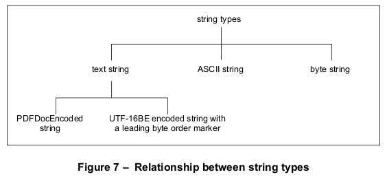

# 7.9 公共数据结构

**Common Data Structures**

## 7.9.1 概述

**General**

=== "中文"

    正如本条款开头所述，有些通用数据结构是由[7.3]中描述的基本对象类型构建的，“对象”，并且在整个PDF中有许多用途。本子条款描述了用于文本字符串、日期、矩形、名称树和数字树的数据结构。更复杂的数据结构在[7.10]，“函数”，和[7.11]，“文件规格”中描述。
    
    所有这些数据结构仅作为文档层次结构的一部分才有意义；它们可能不会出现在内容流中。特别是，解释字符串对象值的特殊约定仅适用于内容流之外的字符串。在内容流中使用字符串选择要绘制在页面上的字形序列的完全不同的约定（见第9条款，“文本”）。[表34]总结了本标准中用于描述字典条目值和其他PDF数据值的基本和高级数据类型。
    
    <table id="table34" markdown="span">
        <caption>Table 34 – PDF data types</caption>
        <thead>
            <tr>
                <th><strong>Type</strong></th>
                <th><strong>Description</strong></th>
                <th><strong>Sub-Clause</strong></th>
            </tr>
        </thead>
        <tbody>
            <tr>
                <td>**ASCII string**</td>
                <td>包含ASCII字符的字节。</td>
                <td>
                    [7.9.2]<br/>
                    [7.9.2.4]
                </td>
            </tr>
            <tr>
                <td>**array**</td>
                <td>数组对象</td>
                <td>
                    [7.3.6]
                </td>
            </tr>
            <tr>
                <td>**boolean**</td>
                <td>布尔值</td>
                <td>
                    [7.3.2]
                </td>
            </tr>
            <tr>
                <td>**byte string**</td>
                <td>一系列字节，应表示字符或其他二进制数据。如果这种类型表示字符，编码应由上下文确定。</td>
                <td>
                    [7.9.2]
                </td>
            </tr>
            <tr>
                <td>**date**</td>
                <td>日期 (ASCII 字符串)</td>
                <td>
                    [7.9.4]
                </td>
            </tr>
            <tr>
                <td>**dictionary**</td>
                <td>字典对象</td>
                <td>
                    [7.3.7]
                </td>
            </tr>
            <tr>
                <td>**file specification**</td>
                <td>文件规格（字符串或字典）。</td>
                <td>
                    [7.11]
                </td>
            </tr>
            <tr>
                <td>**function**</td>
                <td>函数 (字典或流)</td>
                <td>
                    [7.10]
                </td>
            </tr>
            <tr>
                <td>**integer**</td>
                <td>整数。</td>
                <td>
                    &nbsp;
                </td>
            </tr>
            <tr>
                <td>**name**</td>
                <td>名称对象</td>
                <td>
                    [7.3.5]
                </td>
            </tr>
            <tr>
                <td>**name tree**</td>
                <td>名称树 (字典)</td>
                <td>
                    [7.9.6]
                </td>
            </tr>
            <tr>
                <td>**null**</td>
                <td>空对象</td>
                <td>
                    [7.3.9]
                </td>
            </tr>
            <tr>
                <td>**number**</td>
                <td>数字（整数或实数）</td>
                <td>
                    &nbsp;
                </td>
            </tr>
            <tr>
                <td>**number tree**</td>
                <td>数字树(字典)</td>
                <td>
                    [7.9.7]
                </td>
            </tr>
            <tr>
                <td>**PDFDocEncoded string**</td>
                <td>包含字符串的字节，应使用 PDFDocEncoding 编码。</td>
                <td>
                    [7.9.2]
                </td>
            </tr>
            <tr>
                <td>**rectangle**</td>
                <td>矩形 (数组)</td>
                <td>
                    [7.9.5]
                </td>
            </tr>
            <tr>
                <td>**stream**</td>
                <td>流对象</td>
                <td>
                    [7.3.8]
                </td>
            </tr>
            <tr>
                <td>**string**</td>
                <td>任何不是文本字符串的字符串。 <br/>从PDF 1.7开始，这种类型进一步被限定为：PDFDocEncoded字符串、ASCII字符串和字节串。 </td>
                <td>
                    [7.9.2]
                </td>
            </tr>
            <tr>
                <td>**text string**</td>
                <td>代表字符的字节，应使用PDFDocEncoding或带有前导字节顺序标记的UTF-16BE进行编码（如第86页“文本字符串类型”中定义）。</td>
                <td>
                    [7.9.2.2]<br/>
                    [7.9.2]
                </td>
            </tr>
            <tr>
                <td>**text stream**</td>
                <td>文本流</td>
                <td>
                    [7.9.3]
                </td>
            </tr>
        </tbody>
    </table>

=== "英文"

    As mentioned at the beginning of this clause, there are some general-purpose data structures that are built from the basic object types described in [7.3], "Objects," and are used in many places throughout PDF. This sub- clause describes data structures for text strings, dates, rectangles, name trees, and number trees. More complex data structures are described in [7.10], "Functions," and [7.11], "File Specifications."
    
    All of these data structures are meaningful only as part of the document hierarchy; they may not appear within content streams. In particular, the special conventions for interpreting the values of string objects apply only to strings outside content streams. An entirely different convention is used within content streams for using strings to select sequences of glyphs to be painted on the page (see clause 9, "Text"). [Table 34](#table34) summarizes the basic and higher-level data types that are used throughout this standard to describe the values of dictionary entries and other PDF data values.
    
    <table id="table34" markdown="span">
        <caption>Table 34 – PDF data types</caption>
        <thead>
            <tr>
                <th><strong>Type</strong></th>
                <th><strong>Description</strong></th>
                <th><strong>Sub-Clause</strong></th>
            </tr>
        </thead>
        <tbody>
            <tr>
                <td>**ASCII string**</td>
                <td>Bytes containing ASCII characters</td>
                <td>
                    [7.9.2]<br/>
                    [7.9.2.4]
                </td>
            </tr>
            <tr>
                <td>**array**</td>
                <td>Array object</td>
                <td>
                    [7.3.6]
                </td>
            </tr>
            <tr>
                <td>**boolean**</td>
                <td>Boolean value</td>
                <td>
                    [7.3.2]
                </td>
            </tr>
            <tr>
                <td>**byte string**</td>
                <td>A series of bytes that shall represent characters or other binary data. If such a type represents characters, the encoding shall be determined by the context.</td>
                <td>
                    [7.9.2]
                </td>
            </tr>
            <tr>
                <td>**date**</td>
                <td>Date (ASCII string)</td>
                <td>
                    [7.9.4]
                </td>
            </tr>
            <tr>
                <td>**dictionary**</td>
                <td>Dictionary object</td>
                <td>
                    [7.3.7]
                </td>
            </tr>
            <tr>
                <td>**file specification**</td>
                <td>File specification (string or dictionary)</td>
                <td>
                    [7.11]
                </td>
            </tr>
            <tr>
                <td>**function**</td>
                <td>Function (dictionary or stream)</td>
                <td>
                    [7.10]
                </td>
            </tr>
            <tr>
                <td>**integer**</td>
                <td>Integer number</td>
                <td>
                    &nbsp;
                </td>
            </tr>
            <tr>
                <td>**name**</td>
                <td>Name object</td>
                <td>
                    [7.3.5]
                </td>
            </tr>
            <tr>
                <td>**name tree**</td>
                <td>Name tree (dictionary)</td>
                <td>
                    [7.9.6]
                </td>
            </tr>
            <tr>
                <td>**null**</td>
                <td>Null object</td>
                <td>
                    [7.3.9]
                </td>
            </tr>
            <tr>
                <td>**number**</td>
                <td>Number (integer or real)</td>
                <td>
                    &nbsp;
                </td>
            </tr>
            <tr>
                <td>**number tree**</td>
                <td>Number tree (dictionary)</td>
                <td>
                    [7.9.7]
                </td>
            </tr>
            <tr>
                <td>**PDFDocEncoded string**</td>
                <td>Bytes containing a string that shall be encoded using PDFDocEncoding</td>
                <td>
                    [7.9.2]
                </td>
            </tr>
            <tr>
                <td>**rectangle**</td>
                <td>Rectangle (array)</td>
                <td>
                    [7.9.5]
                </td>
            </tr>
            <tr>
                <td>**stream**</td>
                <td>Stream object</td>
                <td>
                    [7.3.8]
                </td>
            </tr>
            <tr>
                <td>**string**</td>
                <td>Any string that is not a text string.<br/> Beginning with PDF 1.7, this type is further qualified as the types: PDFDocEncoded string, ASCII string, and byte string.</td>
                <td>
                    [7.9.2]
                </td>
            </tr>
            <tr>
                <td>**text string**</td>
                <td>Bytes that represent characters that shall be encoded using either PDFDocEncoding or UTF-16BE with a leading byte-order marker (as defined in “Text String Type” on page 86.)</td>
                <td>
                    [7.9.2.2]<br/>
                    [7.9.2]
                </td>
            </tr>
            <tr>
                <td>**text stream**</td>
                <td>Text stream</td>
                <td>
                    [7.9.3]
                </td>
            </tr>
        </tbody>
    </table>

## 7.9.2 字符对象类型

**String Object Types**

### 7.9.2.1 概述

**General**

=== "中文"

    PDF支持一种基本的字符串对象（见[7.3.4]，“字符串对象”）。字符串对象应进一步限定为文本字符串、PDFDocEncoded字符串、ASCII字符串或字节串。这种进一步的限定反映了用于表示字符串描述的字符或字形的编码。
    
    表35总结了使用特定约定编码数据的字符串对象类型。  
        
    <table id="table35" markdown="span">
        <caption>Table 35 – String Object Types</caption>
        <thead>
            <tr>
                <th><strong>Type</strong></th>
                <th><strong>Description</strong></th>
            </tr>
        </thead>
        <tbody>
            <tr>
                <td>**text string**</td>
                <td>应用于人类可读的文本，如文本注释、书签名称、文章名称和文档信息。这些字符串应使用 PDFDocEncoding 或带有字节顺序标记（BOM）的 UTF-16BE 编码。详见[7.9.2.2](#7922-文本字符串类型)，"Text String Type"。</td>
            </tr>
            <tr>
                <td>**PDFDocEncoded string**</td>
                <td>应用于使用 PDFDocEncoding 编码的单字节字符和字形。详见[7.9.2.3](#7923-PDFDocEncoded-字符串类型)，"PDFDocEncoded String Type"。</td>
            </tr>
            <tr>
                <td>**ASCII string**</td>
                <td>应用于使用 ASCII 编码的单字节字符。</td>
            </tr>
            <tr>
                <td>**byte string**</td>
                <td>应用于表示为一系列字节的二进制数据，其中每个字节可以是 8 位表示的任何值。字符串可能表示字符但编码未知，字符串中的字节不一定代表字符。此类型用于 MD5 哈希值、签名证书和 Web 捕获标识值等数据。详见[7.9.2.4](#7924-字节字符串类型)，"Byte String Type"。</td>
            </tr>
        </tbody>
    </table>
    
    表35中描述的字符串类型指定了越来越具体的编码方案，如图7所示。
    
    

=== "英文"

    PDF supports one fundamental string object (see [7.3.4], "String Objects"). The string object shall be further qualified as a text string, a PDFDocEncoded string, ASCII string, or byte string. The further qualification reflects the encoding used to represent the characters or glyphs described by the string.
    
    Table 35 summarizes the string object types that represent data encoded using specific conventions.
    
    
    <table id="table35" markdown="span">
        <caption>Table 35 – String Object Types</caption>
        <thead>
            <tr>
                <th><strong>Type</strong></th>
                <th><strong>Description</strong></th>
            </tr>
        </thead>
        <tbody>
            <tr>
                <td>**text string**</td>
                <td>Shall be used for human-readable text, such as text annotations, bookmark names, article names, and document information. These strings shall be encoded using either PDFDocEncoding or UTF-16BE with a leading byte-order marker. <br/>
                This type is described in [7.9.2.2], "Text String Type."</td>
            </tr>
            <tr>
                <td>**PDFDocEncoded string**</td>
                <td>Shall be used for characters and glyphs that are represented in a single byte, using PDFDocEncoding. This type is described in [7.9.2.3], "PDFDocEncoded String Type."</td>
            </tr>
            <tr>
                <td>**ASCII string**</td>
                <td>Shall be used for characters that are represented in a single byte using ASCII encoding.</td>
            </tr>
            <tr>
                <td>**byte string**</td>
                <td>Shall be used for binary data represented as a series of bytes, where each byte can be any value representable in 8 bits. The string may represent characters but the encoding is not known. The bytes of the string need not represent characters. This type shall be used for data such as MD5 hash values, signature certificates, and Web Capture identification values.<br/>
                This type is described in [7.9.2.4], "Byte String Type."</td>
            </tr>
        </tbody>
    </table>
    
    The string types described in Table 35 specify increasingly specific encoding schemes, as shown in Figure 7.
    
    

### 7.9.2.2 文本字符类型

**Text String Type**

=== "中文"

    文本字符串类型应适用于包含旨在供人类读取的信息的字符字符串，例如文本注释、书签名称、文章名称、文档信息等。
    
    !!! note "NOTE 1"
    
        文本字符串类型是字符串类型的子类型，表示使用特定约定编码的数据。
    
    文本字符串类型应用于必须使用 **PDFDocEncoding** 或 UTF-16BE Unicode 字符编码方案编码的字符字符串。**PDFDocEncoding** 可以编码所有 ISO Latin 1 字符集，详见附录 D。UTF-16BE 可以编码所有 Unicode 字符。UTF-16BE 和 Unicode 字符编码由 Unicode 联盟在 *Unicode 标准* 中描述（参见[参考书目](../bibliography.md)）。
    
    !!! note "NOTE 2"
    
        **PDFDocEncoding** 不支持所有 Unicode 字符，而 UTF-16BE 支持。
    
    对于以 Unicode 编码的文本字符串，前两个字节应为 254 和 255。这两个字节表示 Unicode 字节顺序标记 U+FEFF，表示字符串按照 Unicode 标准中指定的 UTF-16BE（大端）编码方案进行编码。
    
    !!! note "NOTE 3"
    
        这种机制排除了使用 **PDFDocEncoding** 以两个字符 thorn ydieresis 开头的字符串的可能性，这不太可能是一个有意义的词语或短语的开头。
    
    处理包含 Unicode 文本字符串的 PDF 文件的符合规范的读取器应准备处理补充字符；即需要超过两个字节表示的字符。
    
    在 Unicode 文本字符串中的任何位置都可以出现转义序列，以指示后续文本将要使用的语言。
    
    !!! note "NOTE 4"
    
        当无法从文本中使用的字符代码确定语言时，这非常有用。
    
    转义序列应按顺序包括以下元素：
    
    a) Unicode 值 U+001B（即字节序列 0 和 27）。
    
    b) 2 字节的 ISO 639 语言代码。
    
    !!! info "EXAMPLE"
    
        en 表示英语或 ja 表示日语，编码为 ASCII 字符。
    
    c) （可选）2 字节的 ISO 3166 国家代码。
    
    !!! info "EXAMPLE"
    
        US 表示美国或 JP 表示日本。
    
    d) Unicode 值 U+001B。
    
    !!! note "NOTE 5"
    
        ISO 639 和 ISO 3166 定义的完整代码列表可以从国际标准化组织获得（参见[参考书目](../bibliography.md)）。

=== "英文"
    
    The text string type shall be used for character strings that contain information intended to be human-readable, such as text annotations, bookmark names, article names, document information, and so forth.
    
    !!! note "NOTE 1"
    
        Text string type is a subtype of string type and represents data encoded using specific conventions.
    
    The text string type shall be used for character strings that shall be encoded in either **PDFDocEncoding** or the UTF-16BE Unicode character encoding scheme. **PDFDocEncoding** can encode all of the ISO Latin 1 character set and is documented in Annex D. UTF-16BE can encode all Unicode characters. UTF-16BE and Unicode character encoding are described in the *Unicode Standard* by the Unicode Consortium (see the [Bibliography](../bibliography.md)).
    
    !!! note "NOTE 2"
    
        **PDFDocEncoding** does not support all Unicode characters whereas UTF-16BE does.
    
    For text strings encoded in Unicode, the first two bytes shall be 254 followed by 255. These two bytes represent the Unicode byte order marker, U+FEFF, indicating that the string is encoded in the UTF-16BE (big-endian) encoding scheme specified in the Unicode standard.
    
    !!! note "NOTE 3"
    
        This mechanism precludes beginning a string using **PDFDocEncoding** with the two characters thorn ydieresis, which is unlikely to be a meaningful beginning of a word or phrase.
    
    Conforming readers that process PDF files containing Unicode text strings shall be prepared to handle supplementary characters; that is, characters requiring more than two bytes to represent.
    
    An escape sequence may appear anywhere in a Unicode text string to indicate the language in which subsequent text shall be written.
    
    !!! note "NOTE 4"
    
        This is useful when the language cannot be determined from the character codes used in the text.
    
    The escape sequence shall consist of the following elements, in order:
    
    a) The Unicode value U+001B (that is, the byte sequence 0 followed by 27).
    
    b) A 2- byte ISO 639 language code.
    
    !!! info "EXAMPLE"
    
        en for English or ja for Japanese encoded as ASCII characters.
    
    c) (Optional) A 2-byte ISO 3166 country code.
    
    !!! info "EXAMPLE"
    
        US for the United States or JP for Japan.
    
    d) The Unicode value U+001B.
    
    !!! note "NOTE 5"
    
        The complete list of codes defined by ISO 639 and ISO 3166 can be obtained from the International Organization for Standardization (see the [Bibliography](../bibliography.md)).


### 7.9.2.3 PDFDocEncoded 字符串类型

**PDFDocEncoded String Type**

=== "中文"
    
    PDFDocEncoded 字符串是一个字符字符串，其中字符应使用 PDFDocEncoding 在单个字节中表示。
    
    !!! note "NOTE"
    
        **PDFDocEncoding** 不支持所有 Unicode 字符，而 UTF-16BE 支持。

=== "英文"

    A PDFDocEncoded string is a character string in which the characters shall be represented in a single byte using PDFDocEncoding.
    
    !!! note "NOTE"
    
        **PDFDocEncoding** does not support all Unicode characters whereas UTF-16BE does.

### 7.9.2.4 字节串类型

**Byte String Type**

=== "中文"

    字节串类型应用于表示为字节序列的二进制数据，其中每个字节可以是任何可表示为8位值的字节。字节串类型是字符串类型的一个子类型。
    
    !!! note "NOTE"
    
        该字符串可能表示字符，但编码未知。字符串的字节可能并不代表字符。


=== "英文"

    The byte string type shall be used for binary data that shall be represented as a series of bytes, where each byte may be any value representable in 8 bits. Byte string type is a subtype of string type.
    
    !!! note "NOTE"
    
        The string may represent characters but the encoding is not known. The bytes of the string may not represent characters.


## 7.9.3 文本流

**Text Streams**

=== "中文"
    
    一个*文本流*（PDF 1.5）是一个PDF流对象，其未编码的字节应满足与文本字符串相同的要求，这些要求涉及编码、字节顺序和前导字节。

=== "英文"
    
    A *text stream* (PDF 1.5) shall be a PDF stream object ([7.3.8], "Stream Objects") whose unencoded bytes shall meet the same requirements as a text string ([7.9.2.2], "Text String Type") with respect to encoding, byte order, and lead bytes.

## 7.9.4 日期

**Dates**

=== "中文"

    PDF 中使用的日期值应符合标准日期格式，该格式紧跟国际标准 ASN.1（抽象语法标记一），由 ISO/IEC 8824 定义。日期应为以下形式的文本字符串：
    
    {==
    
    \(D:YYYYMMDDHHmmSSOHH'mm\)
    
    其中：
    
    - **YYYY** 表示年份
    - **MM** 表示月份（01–12）
    - **DD** 表示日期（01–31）
    - **HH** 表示小时（00–23）
    - **mm** 表示分钟（00–59）
    - **SS** 表示秒（00–59）
    - **O** 表示当地时间与协调世界时（UT）的关系，用以下字符之一表示：加号（U+002B）(+)，减号（U+002D）(-)，或拉丁大写字母 Z（U+005A）(Z)（见下文）
    - **HH** 后跟撇号（U+0027）(') 表示与 UT 的时差（00–23）
    - **mm** 表示与 UT 的分钟差（00–59）
    
    ==}
    
    前缀 **D:** 必须存在，年份字段（YYYY）必须存在，其他字段可以存在，但只有在其前面的所有字段也存在时才可以存在。只有在 **HH** 字段存在时，HH 字段后的撇号才会存在。只有在 HH 字段后的撇号存在时，分钟偏移字段（mm）才会存在。**MM** 和 **DD** 的默认值均为 01；所有其他数字字段的默认值均为零值。**O** 字段的值为加号表示当地时间晚于 UT，减号表示当地时间早于 UT，拉丁大写字母 Z 表示当地时间等于 UT。如果未指定 UT 信息，则认为指定的时间与 UT 之间的关系为 GMT。无论是否指定时区，日期的其余部分应以当地时间表示。
    
    !!! info "EXAMPLE"
    
        例如，1998 年 12 月 23 日晚上 7:52，美国太平洋标准时间表示为字符串 D:199812231952-08'00

=== "英文"

    Date values used in a PDF shall conform to a standard date format, which closely follows that of the international standard ASN.1 (Abstract Syntax Notation One), defined in ISO/IEC 8824. A date shall be a text string of the form
    
    {== 
    
    ( D : *YYYYMMDDHHmmSSOHH*' mm )
    
    where:
    
    *YYYY* shall be the year
    
    *MM* shall be the month (01–12)
    
    *DD* shall be the day (01–31)
    
    *HH* shall be the hour (00–23)
    
    *mm* shall be the minute (00–59)
    
    *SS* shall be the second (00–59)
    
    *O* shall be the relationship of local time to Universal Time (UT), and shall be denoted by one of the characters PLUS SIGN (U+002B) (+), HYPHEN-MINUS (U+002D) (-), or LATIN CAPITAL LETTER Z (U+005A) (Z) (see below)
    
    *HH* followed by APOSTROPHE (U+0027) (') shall be the absolute value of the offset from UT in hours (00–23)
    
    *mm* shall be the absolute value of the offset from UT in minutes (00–59)
    
    ==}
    
    The prefix D: shall be present, the year field (YYYY) shall be present and all other fields may be present but only if all of their preceding fields are also present. The APOSTROPHE following the hour offset field (HH) shall only be present if the HH field is present. The minute offset field (mm) shall only be present if the APOSTROPHE following the hour offset field (HH) is present. The default values for MM and DD shall be both 01; all other numerical fields shall default to zero values. A PLUS SIGN as the value of the O field signifies that local time is later than UT, a HYPHEN-MINUS signifies that local time is earlier than UT, and the LATIN CAPITAL LETTER Z signifies that local time is equal to UT. If no UT information is specified, the relationship of the specified time to UT shall be considered to be GMT. Regardless of whether the time zone is specified, the rest of the date shall be specified in local time.
    
    !!! info "EXAMPLE"
    
        For example, December 23, 1998, at 7:52 PM, U.S. Pacific Standard Time, is represented by the string D:199812231952-08'00

## 7.9.5 矩形

**Rectangles**

=== "中文"

    矩形用于描述页面上的位置以及各种对象的边界框。矩形应写成一个由四个数字组成的数组，这些数字表示一对对角的坐标。
    
    !!! note "NOTE"
    
        尽管矩形通常由左下角和右上角指定，但指定任何一对对角是可以接受的。处理 PDF 的应用程序应在需要特定角时准备规范化这些矩形。
    
        通常，数组的形式为
        
        [ll<sub>x</sub> ll<sub>y</sub> ur<sub>x</sub> ur<sub>y</sub>]
        
        指定矩形的左下 x 坐标、左下 y 坐标、右上 x 坐标和右上 y 坐标，按此顺序排列。然后假设矩形的另两个角的坐标为 (ll<sub>x</sub> ur<sub>x</sub>) 和 (ur<sub>x</sub> ll<sub>y</sub>)。

=== "英文"

    Rectangles are used to describe locations on a page and bounding boxes for a variety of objects. A rectangle shall be written as an array of four numbers giving the coordinates of a pair of diagonally opposite corners.
    
    !!! note "NOTE"
    
        Although rectangles are conventionally specified by their lower-left and upper-right corners, it is acceptable to specify any two diagonally opposite corners. Applications that process PDF should be prepared to normalize such rectangles in situations where specific corners are required.
    
        Typically, the array takes the form
        
        [ll<sub>x</sub> ll<sub>y</sub> ur<sub>x</sub> ur<sub>y</sub>]
        
        specifying the lower-left x, lower-left y, upper-right x, and upper-right y coordinates of the rectangle, in that order. The other two corners of the rectangle are then assumed to have coordinates (ll_x, ur_y) and (ur_x, ll_y).


## 7.9.6 名称树

**Name Trees**

=== "中文"

    *名称树(name tree)*的用途与字典类似——关联键和值——但方式不同。名称树与字典有以下重要区别：
    
    - 名称树中的键是字符串，而字典中的键是名称对象。
    - 键是有序的。
    - 键关联的值可以是任何类型的对象。流对象应通过间接对象引用指定（见 [7.3.8]，"流对象"）。字典、数组和字符串对象应通过间接对象引用指定，而其他 PDF 对象（空值、数字、布尔值和名称）应指定为直接对象。
    - 数据结构可以表示任意大的键值对集合，可以高效查找，而无需从 PDF 文件中读取整个数据结构。（相对而言，字典可能受其能包含条目数量的实现限制。）
    
    名称树应由*节点*构成，每个节点应为一个字典对象。表 36 显示了节点字典中的条目。节点应有三种类型，取决于它们包含的特定条目。树始终应有且仅有一个*根节点*，该节点应包含一个条目：**Kids** 或 **Names**，但不能同时包含两者。如果根节点有一个 **Names** 条目，它应是树中的唯一节点。如果它有一个 **Kids** 条目，剩下的每个节点应是包含 **Limits** 条目和 **Kids** 条目的*中间节点*，或者是包含 **Limits** 条目和 **Names** 条目的*叶节点*。
    
    <table id="table36" markdown="span">
        <caption>**Table 36 – 名称树节点字典中的条目**</caption>
        <thead>
            <tr>
                <th><strong>Key</strong></th>
                <th><strong>Type</strong></th>
                <th><strong>Value</strong></th>
            </tr>
        </thead>
        <tbody>
            <tr>
                <td>**Kids**</td>
                <td>array</td>
                <td>(*仅根节点和中间节点；中间节点必需；根节点中仅在没有**Names**时存在*) 应为间接引用此节点的直接子节点的数组。子节点可以是中间节点或叶节点。</td>
            </tr>
            <tr>
                <td>**Names**</td>
                <td>array</td>
                <td>(*仅根节点和叶节点；叶节点必需；根节点中仅在没有**Kids**时存在*) 应为形如 <br/>
                [ key<sub>1</sub> value<sub>1</sub> key<sub>2</sub> value<sub>2</sub> … key<sub>n</sub> value<sub>n</sub>]<br/>
                    的数组，其中每个 key<sub>i</sub> 应为字符串，对应的 value<sub>i</sub> 应为与该键关联的对象。键应按字典顺序排列，如下所述。</td>
            </tr>
            <tr>
                <td>**Limits**</td>
                <td>array</td>
                <td>(*仅中间节点和叶节点；必需*) 应为包含两个字符串的数组，这两个字符串应指定叶节点**Names**数组或中间节点任何子叶节点的**Names**数组中包含的（按字典顺序）最小和最大键。</td>
            </tr>
        </tbody>
    </table>
    
    !!! info "EXAMPLE 1"
    
        以下是一个名称树的简化大纲，显示了对象编号和节点，该名称树将从锕到锆的所有化学元素的名称映射到它们的原子序数。
        
        例子名称树
                
        ```tex
        1: Root node
            2: Intermediate node: Actinium to Gold
                5: Leaf node: Actinium = 25, … , Astatine = 31
                    25: Integer: 89
                    …
                    31: Integer: 85
                …
                11: Leaf node: Gadolinium = 56, … , Gold = 59
                    56: Integer: 64
                    …
                    59: Integer: 79
            3: Intermediate node: Hafnium to Protactinium
                12: Leaf node: Hafnium = 60, … , Hydrogen = 65
                    60: Integer: 72
                    …
                    65: Integer: 1
                …
                19: Leaf node: Palladium = 92, … , Protactinium = 100
                    92: Integer: 46
                    …
                    100:Integer: 91
            4: Intermediate node: Radium to Zirconium
                20: Leaf node: Radium = 101, … , Ruthenium = 107
                    101:Integer: 89
                    …
                    107:Integer: 85
                …
                24: Leaf node: Xenon = 129, … , Zirconium = 133
                    129:Integer: 54
                    …
                    133:Integer: 40
        ```
    
    !!! info "EXAMPLE 2"
    
        以下展示了这个树在PDF文件中的表示。
    
        ```tex
        1 0 obj
            << /Kids [ 2 0 R        % Root node
                       3 0 R
                       4 0 R
                     ]
                >>
        endobj
        
        2 0 obj                    
            << /Limits [ ( Actinium ) ( Gold ) ]    % Intermediate node
                /Kids [ 5 0 R
                        6 0 R
                        7 0 R
                        8 0 R
                        9 0 R
                        10 0 R
                        11 0 R
                      ]
            >>
        endobj
        
        3 0 obj                    
            << /Limits [ ( Hafnium ) ( Protactinium ) ]   % Intermediate node
                /Kids [ 12 0 R
                        13 0 R
                        14 0 R
                        15 0 R
                        16 0 R
                        17 0 R
                        18 0 R
                        19 0 R
                      ]
            >>
        endobj
        
        4 0 obj                   
            << /Limits [ ( Radium ) ( Zirconium ) ]   % Intermediate node
               /Kids [ 20 0 R
                       21 0 R
                       22 0 R
                       23 0 R
                       24 0 R
                     ]
            >>
        endobj
        
        5 0 obj
            << /Limits [ ( Actinium ) ( Astatine ) ]    % Leaf node
               /Names [ ( Actinium ) 25 0 R
                        ( Aluminum ) 26 0 R
                        ( Americium ) 27 0 R
                        ( Antimony ) 28 0 R
                        ( Argon ) 29 0 R
                        ( Arsenic ) 30 0 R
                        ( Astatine ) 31 0 R
                      ]
            >>
        endobj
        …
        24 0 obj
            << /Limits [ ( Xenon ) ( Zirconium ) ]    % Leaf node
               /Names [ ( Xenon ) 129 0 R
                        ( Ytterbium ) 130 0 R
                        ( Yttrium ) 131 0 R
                        ( Zinc ) 132 0 R
                        ( Zirconium ) 133 0 R
                      ]
            >>
        endobj
        
        25 0 obj
            89    % Atomic number (Actinium)
        endobj
        
        
        …
        
        133 0 obj
            40    % Atomic number (Zirconium)
        endobj
        ```

=== "英文"

    A *name tree* serves a similar purpose to a dictionary—associating keys and values—but by different means. A name tree differs from a dictionary in the following important ways:
    
    - Unlike the keys in a dictionary, which are name objects, those in a name tree are strings.
    - The keys are ordered.
    - The values associated with the keys may be objects of any type. Stream objects shall be specified by indirect object references ([7.3.8], "Stream Objects"). The dictionary, array, and string objects should be specified by indirect object references, and other PDF objects (nulls, numbers, booleans, and names) should be specified as direct objects.
    - The data structure can represent an arbitrarily large collection of key-value pairs, which can be looked up efficiently without requiring the entire data structure to be read from the PDF file. (In contrast, a dictionary can be subject to an implementation limit on the number of entries it can contain.)
    
    A name tree shall be constructed of *nodes*, each of which shall be a dictionary object. Table 36 shows the entries in a node dictionary. The nodes shall be of three kinds, depending on the specific entries they contain. The tree shall always have exactly one *root node*, which shall contain a single entry: either **Kids** or **Names** but not both. If the root node has a **Names** entry, it shall be the only node in the tree. If it has a **Kids** entry, each of the remaining nodes shall be either an *intermediate node*, that shall contain a **Limits** entry and a **Kids** entry, or a *leaf node*, that shall contain a **Limits** entry and a **Names** entry.
    
    <table id="table36" markdown="span">
        <caption>**Table 36 – Entries in a name tree node dictionary**</caption>
        <thead>
            <tr>
                <th><strong>Key</strong></th>
                <th><strong>Type</strong></th>
                <th><strong>Value</strong></th>
            </tr>
        </thead>
        <tbody>
            <tr>
                <td>**Kids**</td>
                <td>array</td>
                <td>(*Root and intermediate nodes only; required in intermediate nodes; present in the root node if and only if **Names** is not present*) Shall be an array of indirect references to the immediate children of this node. The children may be intermediate or leaf nodes.</td>
            </tr>
            <tr>
                <td>**Names**</td>
                <td>array</td>
                <td>(Root and leaf nodes only; required in leaf nodes; present in the root node if and only if Kids is not present) Shall be an array of the form <br/>
                [ key<sub>1</sub> value<sub>1</sub> key<sub>2</sub> value<sub>2</sub> … key<sub>n</sub> value<sub>n</sub>]<br/>
                    where each key<sub>i</sub> shall be a string and the corresponding valuei shall be the object associated with that key. The keys shall be sorted in lexical order, as described below.</td>
            </tr>
            <tr>
                <td>**Limits**</td>
                <td>array</td>
                <td>(*Intermediate and leaf nodes only; required*) Shall be an array of two strings, that shall specify the (lexically) least and greatest keys included in the **Names** array of a leaf node or in the **Names** arrays of any leaf nodes that are descendants of an intermediate node.</td>
            </tr>
        </tbody>
    </table>
    
    The **Kids** entries in the root and intermediate nodes define the tree’s structure by identifying the immediate children of each node. The **Names** entries in the leaf (or root) nodes shall contain the tree’s keys and their associated values, arranged in key-value pairs and shall be sorted lexically in ascending order by key. Shorter keys shall appear before longer ones beginning with the same byte sequence. Any encoding of the keys may be used as long as it is self-consistent; keys shall be compared for equality on a simple byte-by-byte basis.
    
    The keys contained within the various nodes’ **Names** entries shall not overlap; each **Names** entry shall contain a single contiguous range of all the keys in the tree. In a leaf node, the **Limits** entry shall specify the least and greatest keys contained within the node’s **Names** entry. In an intermediate node, it shall specify the least and greatest keys contained within the **Names** entries of any of that node’s descendants. The value associated with a given key can thus be found by walking the tree in order, searching for the leaf node whose **Names** entry contains that key.
    
    !!! info "EXAMPLE 1"
    
        The following is an abbreviated outline, showing object numbers and nodes, of a name tree that maps the names of all the chemical elements, from actinium to zirconium, to their atomic numbers. 
        
        Example of a name tree
        
        ```tex
        1: Root node
            2: Intermediate node: Actinium to Gold
                5: Leaf node: Actinium = 25, … , Astatine = 31
                    25: Integer: 89
                    …
                    31: Integer: 85
                …
                11: Leaf node: Gadolinium = 56, … , Gold = 59
                    56: Integer: 64
                    …
                    59: Integer: 79
            3: Intermediate node: Hafnium to Protactinium
                12: Leaf node: Hafnium = 60, … , Hydrogen = 65
                    60: Integer: 72
                    …
                    65: Integer: 1
                …
                19: Leaf node: Palladium = 92, … , Protactinium = 100
                    92: Integer: 46
                    …
                    100:Integer: 91
            4: Intermediate node: Radium to Zirconium
                20: Leaf node: Radium = 101, … , Ruthenium = 107
                    101:Integer: 89
                    …
                    107:Integer: 85
                …
                24: Leaf node: Xenon = 129, … , Zirconium = 133
                    129:Integer: 54
                    …
                    133:Integer: 40
        ```
    
    !!! info "EXAMPLE 2"
    
        The following shows the representation of this tree in a PDF file
    
        ```tex
        1 0 obj
            << /Kids [ 2 0 R        % Root node
                       3 0 R
                       4 0 R
                     ]
                >>
        endobj
        
        2 0 obj                    
            << /Limits [ ( Actinium ) ( Gold ) ]    % Intermediate node
                /Kids [ 5 0 R
                        6 0 R
                        7 0 R
                        8 0 R
                        9 0 R
                        10 0 R
                        11 0 R
                      ]
            >>
        endobj
        
        3 0 obj                    
            << /Limits [ ( Hafnium ) ( Protactinium ) ]   % Intermediate node
                /Kids [ 12 0 R
                        13 0 R
                        14 0 R
                        15 0 R
                        16 0 R
                        17 0 R
                        18 0 R
                        19 0 R
                      ]
            >>
        endobj
        
        4 0 obj                   
            << /Limits [ ( Radium ) ( Zirconium ) ]   % Intermediate node
               /Kids [ 20 0 R
                       21 0 R
                       22 0 R
                       23 0 R
                       24 0 R
                     ]
            >>
        endobj
        
        5 0 obj
            << /Limits [ ( Actinium ) ( Astatine ) ]    % Leaf node
               /Names [ ( Actinium ) 25 0 R
                        ( Aluminum ) 26 0 R
                        ( Americium ) 27 0 R
                        ( Antimony ) 28 0 R
                        ( Argon ) 29 0 R
                        ( Arsenic ) 30 0 R
                        ( Astatine ) 31 0 R
                      ]
            >>
        endobj
        …
        24 0 obj
            << /Limits [ ( Xenon ) ( Zirconium ) ]    % Leaf node
               /Names [ ( Xenon ) 129 0 R
                        ( Ytterbium ) 130 0 R
                        ( Yttrium ) 131 0 R
                        ( Zinc ) 132 0 R
                        ( Zirconium ) 133 0 R
                      ]
            >>
        endobj
        
        25 0 obj
            89    % Atomic number (Actinium)
        endobj
        
        
        …
        
        133 0 obj
            40    % Atomic number (Zirconium)
        endobj
        ```


## 7.9.7 Number树

**Number Trees**

=== "中文"

    一个*数字树(number tree)*类似于名称树（见[7.9.6]，“名称树”），只不过它的键应该是整数而不是字符串，并且应该按升序数值顺序排序。在叶节点（或根节点）中包含键值对的条目应该命名为**Nums**，而不是名称树中的**Names**。[表37](#table37)显示了数字树节点字典中的条目。
        
    <table id="table37" markdown="span">
        <caption>**Table 37 – 数字树节点字典中的条目**</caption>
        <thead>
            <tr>
                <th><strong>Key</strong></th>
                <th><strong>Type</strong></th>
                <th><strong>Value</strong></th>
            </tr>
        </thead>
        <tbody>
            <tr>
                <td>**Kids**</td>
                <td>array</td>
                <td>(*仅根节点和中间节点；中间节点必需；根节点中仅在没有 **Nums** 时存在*) 应为间接引用此节点的直接子节点的数组。子节点可以是中间节点或叶节点。</td>
            </tr>
            <tr>
                <td>**Nums**</td>
                <td>array</td>
                <td>(*仅根节点和叶节点；叶节点必需；根节点中仅在没有 **Kids** 时存在*) 应为形如<br/>
                [ key<sub>1</sub> value<sub>1</sub> key<sub>2</sub> value<sub>2</sub> … key<sub>n</sub> value<sub>n</sub>]<br/>
                的数组，其中每个 key<sub>i</sub> 是整数，对应的 value<sub>i</sub> 应为与该键关联的对象。键应按数值顺序排序，类似于 [7.9.6] "名称树" 中描述的名称树中键的排列方式。
                </td>
            </tr>
            <tr>
                <td>**Limits**</td>
                <td>array</td>
                <td>(*仅中间节点和叶节点必需*) 应为包含两个整数的数组，这两个整数应指定叶节点的 **Nums** 数组或中间节点的任何子叶节点的 **Nums** 数组中包含的（数值上）最小和最大键。</td>
            </tr>
        </tbody>
    </table>

=== "英文"
    
    A *number tree* is similar to a name tree (see [7.9.6], "Name Trees"), except that its keys shall be integers instea of strings and shall be sorted in ascending numerical order. The entries in the leaf (or root) nodes containin the key-value pairs shall be named **Nums** instead of **Names** as in a name tree. [Table 37](#table37) shows the entries in  number tree’s node dictionaries.
        
    <table id="table37" markdown="span">
        <caption>**Table 37 – Entries in a number tree node dictionary**</caption>
        <thead>
            <tr>
                <th><strong>Key</strong></th>
                <th><strong>Type</strong></th>
                <th><strong>Value</strong></th>
            </tr>
        </thead>
        <tbody>
            <tr>
                <td>**Kids**</td>
                <td>array</td>
                <td>(*Root and intermediate nodes only; required in intermediate nodes; present in the root node if and only if **Nums** is not present*) Shall be an array of indirect references to the immediate children of this node. The children may be intermediate or leaf nodes.</td>
            </tr>
            <tr>
                <td>**Nums**</td>
                <td>array</td>
                <td>(*Root and leaf nodes only; shall be required in leaf nodes; present in the root node if and only if **Kids** is not present*) Shall be an array of the form<br/>
                [ key<sub>1</sub> value<sub>1</sub> key<sub>2</sub> value<sub>2</sub> … key<sub>n</sub> value<sub>n</sub>]<br/>
                where each *key*<sub>i</sub> is an integer and the corresponding valuei shall be the object associated with that key. The keys shall be sorted in numerical order, analogously to the arrangement of keys in a name tree as described in [7.9.6], "Name Trees."
                </td>
            </tr>
            <tr>
                <td>**Limits**</td>
                <td>array</td>
                <td>(*Shall be present in Intermediate and leaf nodes only*) Shall be an array of two integers, that shall specify the (numerically) least and greatest keys included in the **Nums** array of a leaf node or in the **Nums** arrays of any leaf nodes that are descendants of an intermediate node.</td>
            </tr>
        </tbody>
    </table>

[7.3]: ./s3.md
[7.10]: ./s10.md
[7.11]: ./s11.md
[7.3.2]: ./s3.md#732-布尔对象
[7.3.4]: ./s3.md#734-字符串对象
[7.3.5]: ./s3.md#735-名称对象
[7.3.6]: ./s3.md#736-数组对象
[7.3.7]: ./s3.md#737-字典对象
[7.3.8]: ./s3.md#738-流对象
[7.9.2]: ./s9.md#792-字符对象类型
[7.9.4]: ./s9.md#794-日期
[7.9.6]: ./s9.md#796-名称树
[7.3.9]: ./s3.md#739-空对象
[7.9.7]: ./s9.md#797-number树
[7.9.2]: ./s9.md#792-字符对象类型
[7.9.5]: ./s9.md#795-矩形
[7.9.2]: ./s9.md#792-字符对象类型
[7.9.3]: ./s9.md#793-文本流
[7.9.2.2]: ./s9.md#7922-文本字符类型
[7.9.2.2]: ./s9.md#7922-文本字符类型
[7.9.2.3]: ./s9.md#7923-pdfdocencoded-字符串类型
[7.9.2.4]: ./s9.md#7924-字节串类型