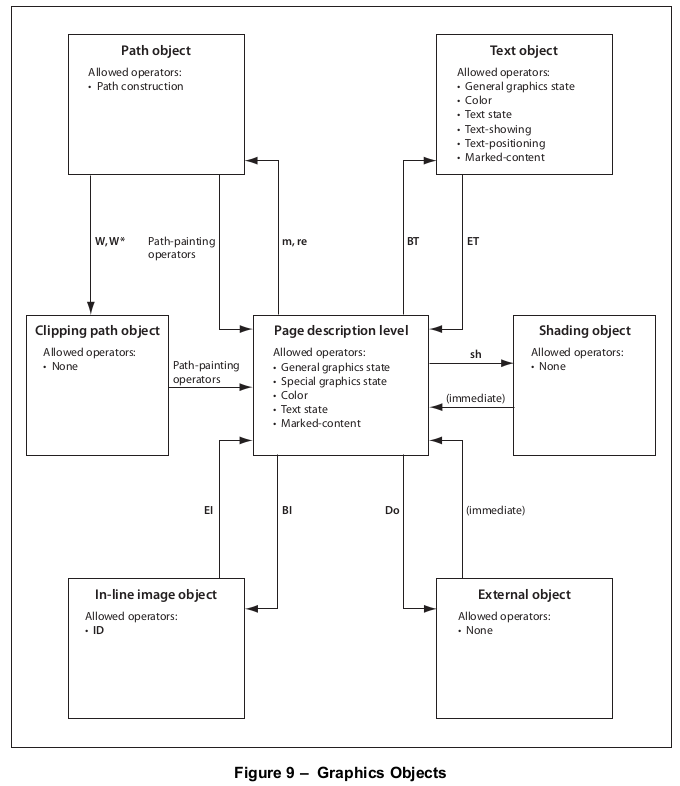

# 8.2 图形对象

**8.2 Graphics Objects**

=== "中文"
    
    在[7.8.2](../c7/s8.md#782-内容流)中讨论的“内容流”，内容流中的数据应被解释为一系列*操作符*及其操作数，根据标准PDF语法表示为基本数据对象。内容流可以描述页面的外观，或者在某些其他上下文中被视为图形元素。
    
    操作数和操作符应使用后缀表示法按顺序书写。尽管这种表示法类似于PostScript语言的顺序执行模型，但PDF内容流不是一个要解释的程序；而是一个静态描述一系列*图形对象*的序列。下面描述了用于书写描述图形对象的操作数和操作符的具体规则。
    
    PDF提供五种类型的图形对象：
    
    - **路径对象(path object)**是由直线、矩形和三次贝塞尔曲线组成的任意形状。路径可能会自交，可能有不相连的部分和孔洞。路径对象以一个或多个绘制操作符结束，这些操作符指定路径是否应该被描边、填充、用作裁剪边界，或者这些操作的某种组合。
    - **文本对象(text object)**由一个或多个字符字符串组成，这些字符串标识要绘制的字形序列。与路径一样，文本可以被描边、填充或用作裁剪边界。
    - **外部对象(external object)**（*XObject*）是在内容流之外定义的对象，并作为命名资源引用（见[7.8.3](../c7/s8.md#783-资源字典)，“资源字典”）。XObject的解释取决于其类型。*图像XObject*定义了一个要绘制的颜色样本的矩形数组；*表单XObject*是一个被视为单个图形对象的内容流。特殊类型的*表单XObject*用于将内容从一个PDF文件导入到另一个（*引用XObject*）以及将图形元素组合在一起作为一个单元用于各种目的（*组XObject*）。特别是，后者用于定义透明成像模型中使用的*透明度组*（*透明度组XObject*，在[第11条](../c11/index.md)，“透明度”中详细讨论）。还有一些PDF文件中可能出现的PostScript XObject，但PDF 1.7符合规范的写入器不应使用它。
    - **内联图像对象(inline image object)**使用特殊语法在内容流内直接表达小图像的数据。
    - **渐变对象(shading object)**描述了一个几何形状，其颜色是形状内位置的任意函数。（渐变也可以作为颜色在绘制其他图形对象时使用；在这种情况下，它不被视为单独的图形对象。）
    
    PDF 1.3及更早版本使用*不透明成像模型*，在该模型中，每个图形对象按顺序绘制，完全覆盖它可能覆盖在页面上的任何先前标记。PDF 1.4引入了*透明成像模型*，在该模型中，对象可能不是完全不透明的，允许先前绘制的标记透过显示。每个对象都以指定的*不透明度*在页面上绘制，这在对象形状内的每个点可能是恒定的，也可能从点到点变化。页面上先前存在的内容包括与新对象合成，产生根据它们各自的不透明度特征结合对象和背景颜色的结果。页面上任何给定点的所有对象*形成*一个*透明度栈*，其中堆叠顺序定义为对象应指定的顺序，底部对象首先。栈中的所有对象都可能对结果有所贡献，这取决于它们的颜色、形状和不透明度。
    
    PDF的图形参数是这样安排的，对象默认以完全不透明的方式绘制，将透明成像模型的行为简化为不透明模型。因此，除非另有明确说明，本条款中的材料适用于不透明和透明模型；透明模型在[第11条](../c11/index.md)，“透明度”中以其全部一般性描述。
    
    尽管上述描述的绘制行为通常归因于构成对象的各个操作符，但始终是整个对象被绘制。附件L中的图9显示了定义图形对象的操作的排序规则。某些操作只在某些类型的图形对象中或在图形对象之间的间隔中（在图中称为*页面描述级别*）才允许。每个内容流都从页面描述级别开始，在该级别可以更改图形状态，如颜色和文本属性，如下小节中讨论的。
    
    在附件L中的图9中，箭头指示标志着每种类型图形对象的开始或结束的操作符。一些操作符单独标识，其他操作符按一般类别标识。[表51](#table51)总结了所有PDF操作符的这些类别。
    
    <table id="table51">
        <caption>Table 51 – 操作符分类</caption>
        <thead>
            <tr>
                <th>分类</th>
                <th>操作符</th>
                <th>表格</th>
            </tr>
        </thead>
        <tbody>
            <tr>
                <td>通用图形状态</td>
                <td><strong>w, J, j, M, d, ri, i, gs</strong></td>
                <td markdown="span">[57](./s4.md#table57)</td>
            </tr>
            <tr>
                <td>特殊图形状态</td>
                <td><strong>q, Q, cm</strong></td>
                <td markdown="span">[57](./s4.md#table57)</td>
            </tr>
            <tr>
                <td>路径构造</td>
                <td><strong>m, l, c, v, y, h, re</strong></td>
                <td markdown="span">[59](./s5.md#table59)</td>
            </tr>
            <tr>
                <td>路径绘制</td>
                <td><strong>S, s, f, F, f*, B, B*, b, b*, n</strong></td>
                <td markdown="span">[60]()</td>
            </tr>
            <tr>
                <td>裁剪路径</td>
                <td><strong>W, W*</strong></td>
                <td markdown="span">[61]()</td>
            </tr>
            <tr>
                <td>文本对象</td>
                <td><strong>BT, ET</strong></td>
                <td markdown="span">[107]()</td>
            </tr>
            <tr>
                <td>文本状态</td>
                <td><strong>Tc, Tw, Tz, TL, Tf, Tr, Ts</strong></td>
                <td markdown="span"></td>
            </tr>
            <tr>
                <td>文本定位</td>
                <td><strong>Td, TD, Tm, T\*</strong></td>
                <td markdown="span">[108]()</td>
            </tr>
            <tr>
                <td>文本显示</td>
                <td><strong>Tj, TJ, ', "</strong></td>
                <td markdown="span">[109]()</td>
            </tr>
            <tr>
                <td>Type 3 字体</td>
                <td><strong>d0, d1</strong></td>
                <td markdown="span">[113]()</td>
            </tr>
            <tr>
                <td>颜色</td>
                <td><strong>CS, cs, SC, SCN, sc, scn, G, g, RG, rg, K, k</strong></td>
                <td markdown="span">[74]()</td>
            </tr>
            <tr>
                <td>渐变模式</td>
                <td><strong>sh</strong></td>
                <td markdown="span">[77]()</td>
            </tr>
            <tr>
                <td>内联图像</td>
                <td><strong>BI, ID, EI</strong></td>
                <td markdown="span">[92]()</td>
            </tr>
            <tr>
                <td>XObjects</td>
                <td><strong>Do</strong></td>
                <td markdown="span">[87]()</td>
            </tr>
            <tr>
                <td>标记内容</td>
                <td><strong>MP, DP, BMC, BDC, EMC</strong></td>
                <td markdown="span">[320]()</td>
            </tr>
            <tr>
                <td>兼容性</td>
                <td><strong>BX, EX</strong></td>
                <td markdown="span">[32]()</td>
            </tr>
        </tbody>
    </table>
    
    
    
    !!! info "EXAMPLE"

        路径构造操作符 **m** 和 **re** 表示路径对象的开始。在路径对象内部，允许使用额外的路径构造操作符，以及裁剪路径操作符 **W** 和 **W\***，但不允许使用一般图形状态操作符，如 **w** 或 **J**。路径绘制操作符，如 **S** 或 **f**，结束路径对象并返回页面描述级别。
    
    !!! note "NOTE"
    
        一个符合规范的阅读器可能会处理违反这些规则的、描述图形对象的内容流，并可能产生不可预测的行为，即使它可能正确显示和*打印*内容流。试图提取图形对象以进行编辑或其他目的的应用程序依赖于对象的正确形成。图形对象的规则对于正确解释标记内容也很重要（见 [14.6](../c14/s6.md)，“标记内容”）。
    
    图形对象还隐含地包括影响其行为的所有图形状态参数。例如，路径对象依赖于定义路径对象时当前颜色参数的值。其效果应如同该参数是路径对象定义的一部分。然而，在页面描述级别调用的设置图形状态参数的操作符不应被视为属于任何特定的图形对象。图形状态参数仅在它们改变时才应指定。一个图形对象可以依赖于早期定义的参数。
    
    同样，文本对象内的单个字符字符串隐含地包括它们所依赖的图形状态参数。这些参数中的大多数可以在文本对象内部或外部设置。其效果应如同它们为每个文本字符串单独指定。
    
    重要的是，图形状态操作符的确切排列没有语义意义。一个符合规范的PDF内容流的阅读器或写入器可以改变图形状态操作符的排列，以实现每个图形对象的相关图形状态参数的相同值。一个符合规范的阅读器或写入器不应从构成图形对象的标记排列中推断出任何更高层次的逻辑语义。一个单独的机制，*标记内容*（见 [14.6](../c14/s6.md)，“标记内容”），允许将这种更高层次的信息明确地与图形对象关联起来。

=== "英文"
    
    As discussed in [7.8.2](../c7/s8.md#782-内容流), "Content Streams", the data in a content stream shall be interpreted as a sequence of *operators* and their operands, expressed as basic data objects according to standard PDF syntax. A content stream can describe the appearance of a page, or it can be treated as a graphical element in certain other
    contexts.
    
    The operands and operators shall be written sequentially using postfix notation. Although this notation resembles the sequential execution model of the PostScript language, a PDF content stream is not a program to be interpreted; rather, it is a static description of a sequence of *graphics objects*. There are specific rules, described below, for writing the operands and operators that describe a graphics object.
    
    PDF provides five types of graphics objects:
    
    - A *path object* is an arbitrary shape made up of straight lines, rectangles, and cubic Bézier curves. A path may intersect itself and may have disconnected sections and holes. A path object ends with one or more painting operators that specify whether the path shall be stroked, filled, used as a clipping boundary, or some combination of these operations.
    - A *text object* consists of one or more character strings that identify sequences of glyphs to be painted. Like a path, text can be stroked, filled, or used as a clipping boundary.
    - An *external object* (*XObject*) is an object defined outside the content stream and referenced as a named resource (see [7.8.3](../c7/s8.md#783-资源字典), "Resource Dictionaries"). The interpretation of an XObject depends on its type. An *image XObject* defines a rectangular array of colour samples to be painted; a *form XObject* is an entire content stream to be treated as a single graphics object. Specialized types of *form XObjects* shall be used to import content from one PDF file into another (*reference XObjects*) and to group graphical elements together as a unit for various purposes (*group XObjects*). In particular, the latter are used to define *transparency groups* for use in the transparent imaging model (*transparency group XObjects*, discussed in detail in [clause 11](../c11/index.md), "Transparency"). There is also a PostScript XObject that may appear in some existing PDF files, but it should not be used by a PDF 1.7 conforming writer.
    - An *inline image object* uses a special syntax to express the data for a small image directly within the content stream.
    - A *shading object* describes a geometric shape whose colour is an arbitrary function of position within the shape. (A shading can also be treated as a colour when painting other graphics objects; it is not considered to be a separate graphics object in that case.)
    
    PDF 1.3 and earlier versions use an *opaque imaging model* in which each graphics object is painted in sequence, completely obscuring any previous marks it may overlay on the page. PDF 1.4 introduced a *transparent imaging model* in which objects can be less than fully opaque, allowing previously painted marks to show through. Each object is painted on the page with a specified *opacity*, which may be constant at every point within the object’s shape or may vary from point to point. The previously existing contents of the page form a backdrop with which the new object is composited, producing results that combine the colours of the object and backdrop according to their respective opacity characteristics. The objects at any given point on the page *forms* a *transparency stack*, where the stacking order is defined to be the order in which the objects shall be specified, bottommost object first. All objects in the stack can potentially contribute to the result, depending on their colours, shapes, and opacities.
    
    PDF’s graphics parameters are so arranged that objects shall be painted by default with full opacity, reducing the behaviour of the transparent imaging model to that of the opaque model. Accordingly, the material in this clause applies to both the opaque and transparent models except where explicitly stated otherwise; the transparent model is described in its full generality in [clause 11](../c11/index.md), "Transparency".
    
    Although the painting behaviour described above is often attributed to individual operators making up an object, it is always the object as a whole that is painted. Figure 9 in Annex L shows the ordering rules for the operations that define graphics objects. Some operations shall be permitted only in certain types of graphics objects or in the intervals between graphics objects (called the *page description level* in the figure). Every content stream begins at the page description level, where changes may be made to the graphics state, such as colours and text attributes, as discussed in the following sub-clauses.
    
    In the Figure 9 in Annex L, arrows indicate the operators that mark the beginning or end of each type of graphics object. Some operators are identified individually, others by general category. [Table 51](#table51) summarizes these categories for all PDF operators.
    
    <table id="table51">
        <caption>Table 51 – Operator Categories</caption>
        <thead>
            <tr>
                <th>Category</th>
                <th>Operators</th>
                <th>Table</th>
            </tr>
        </thead>
        <tbody>
            <tr>
                <td>General graphics state</td>
                <td><strong>w, J, j, M, d, ri, i, gs</strong></td>
                <td markdown="span">[57](./s4.md#table57)</td>
            </tr>
            <tr>
                <td>Special graphics state</td>
                <td><strong>q, Q, cm</strong></td>
                <td markdown="span">[57](./s4.md#table57)</td>
            </tr>
            <tr>
                <td>Path construction</td>
                <td><strong>m, l, c, v, y, h, re</strong></td>
                <td markdown="span">[59](./s5.md#table59)</td>
            </tr>
            <tr>
                <td>Path painting</td>
                <td><strong>S, s, f, F, f\*, B, B\*, b, b*, n</strong></td>
                <td markdown="span">[60](./s5.md#table60)</td>
            </tr>
            <tr>
                <td>Clipping paths</td>
                <td><strong>W, W*</strong></td>
                <td markdown="span">[61](./s5.md#table61)</td>
            </tr>
            <tr>
                <td>Text objects</td>
                <td><strong>BT, ET</strong></td>
                <td markdown="span">[107](../c9/s4.md#table107)</td>
            </tr>
            <tr>
                <td>Text state</td>
                <td><strong>Tc, Tw, Tz, TL, Tf, Tr, Ts</strong></td>
                <td markdown="span"></td>
            </tr>
            <tr>
                <td>Text positioning</td>
                <td><strong>Td, TD, Tm, T\*</strong></td>
                <td markdown="span">[108](../c9/s4.md#table108)</td>
            </tr>
            <tr>
                <td>Text showing</td>
                <td><strong>Tj, TJ, ', "</strong></td>
                <td markdown="span">[109](../c9/s4.md#table109)</td>
            </tr>
            <tr>
                <td>Type 3 fonts</td>
                <td><strong>d0, d1</strong></td>
                <td markdown="span">[113](../c9/s6.md#table113)</td>
            </tr>
            <tr>
                <td>Color</td>
                <td><strong>CS, cs, SC, SCN, sc, scn, G, g, RG, rg, K, k</strong></td>
                <td markdown="span">[74](./s4.md#table74)</td>
            </tr>
            <tr>
                <td>Shading patterns</td>
                <td><strong>sh</strong></td>
                <td markdown="span">[77](./s7.md#table77)</td>
            </tr>
            <tr>
                <td>Inline images</td>
                <td><strong>BI, ID, EI</strong></td>
                <td markdown="span">[92](./s9.md#table92)</td>
            </tr>
            <tr>
                <td>XObjects</td>
                <td><strong>Do</strong></td>
                <td markdown="span">[87](./s8.md#table87)</td>
            </tr>
            <tr>
                <td>Marked content</td>
                <td><strong>MP, DP, BMC, BDC, EMC</strong></td>
                <td markdown="span">[320](../c14/s6.md#table320)</td>
            </tr>
            <tr>
                <td>Compatibility</td>
                <td><strong>BX, EX</strong></td>
                <td markdown="span">[32](../c7/s8.md#table32)</td>
            </tr>
        </tbody>
    </table>
    
    
    
    !!! info "EXAMPLE"
    
    The path construction operators **m** and **re** signal the beginning of a path object. Inside the path object, additional path construction operators are permitted, as are the clipping path operators **W** and **W\***, but not general graphics state operators such as **w** or **J**. A path-painting operator, such as **S** or **f**, ends the path object and returns to the page description level.
    
    !!! note "NOTE"
    
        A conforming reader may process a content stream whose operations violate these rules for describing graphics objects and can produce unpredictable behaviour, even though it may display and *print* the stream correctly. Applications that attempt to extract graphics objects for editing or other purposes depend on the objects’ being well formed. The rules for graphics objects are also important for the proper interpretation of marked content (see [14.6](../c14/s6.md), "Marked Content").
    
    A graphics object also implicitly includes all graphics state parameters that affect its behaviour. For instance, a path object depends on the value of the current colour parameter at the moment the path object is defined. The effect shall be as if this parameter were specified as part of the definition of the path object. However, the operators that are invoked at the page description level to set graphics state parameters shall not be considered to belong to any particular graphics object. Graphics state parameters should be specified only when they change. A graphics object can depend on parameters that were defined much earlier.
    
    Similarly, the individual character strings within a text object implicitly include the graphics state parameters on which they depend. Most of these parameters may be set inside or outside the text object. The effect is as if they were separately specified for each text string.
    
    The important point is that there is no semantic significance to the exact arrangement of graphics state operators. A conforming reader or writer of a PDF content stream may change an arrangement of graphics state operators to any other arrangement that achieves the same values of the relevant graphics state parameters for each graphics object. A conforming reader or writer shall not infer any higher-level logical semantics from the arrangement of tokens constituting a graphics object. A separate mechanism, *marked content* (see [14.6](../c14/s6.md), "Marked Content"), allows such higher-level information to be explicitly associated with the graphics objects.