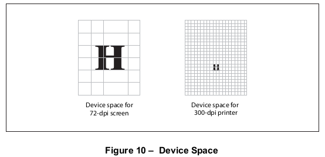
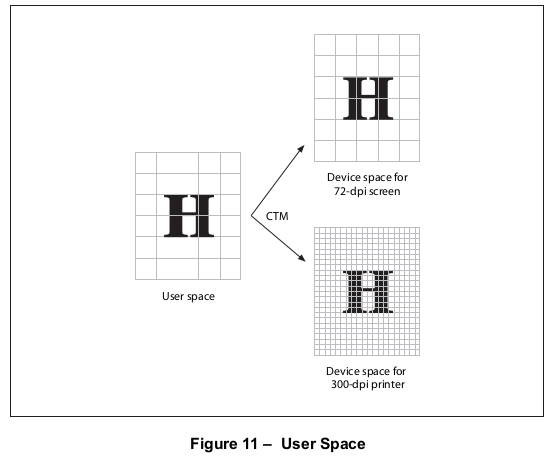
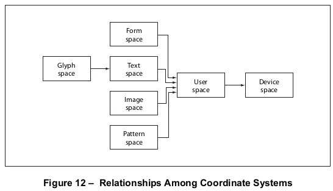
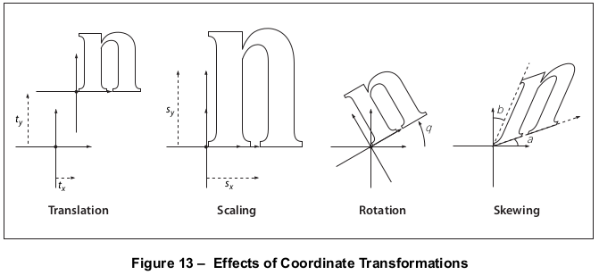
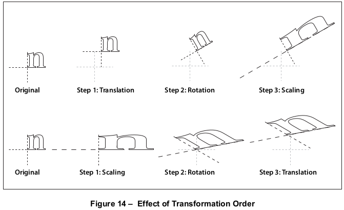

# 8.3 坐标系统

**8.3 Coordinate Systems**

## 8.3.1 概述

**8.3.1 General**

=== "中文"

    坐标系统定义了所有绘图发生的画布。它们决定了页面上文本、图形和图像的位置、方向和大小。本小节描述了PDF中使用的各种坐标系统，它们之间的关系，以及它们之间的转换是如何指定的。
    
    !!! note "NOTE"
    
        本小节讨论的坐标系统适用于二维图形。PDF 1.6引入了显示3D艺术作品的能力，在这种情况下，对象是在三维坐标系统中描述的，如[13.6.5]中所述，"3D的坐标系统"。

=== "英文"

    Coordinate systems define the canvas on which all painting occurs. They determine the position, orientation, and size of the text, graphics, and images that appear on a page. This sub-clause describes each of the coordinate systems used in PDF, how they are related, and how transformations among them are specified.
    
    !!! note "NOTE"
    
        The coordinate systems discussed in this sub-clause apply to two-dimensional graphics. PDF 1.6 introduced the ability to display 3D artwork, in which objects are described in a three-dimensional coordinate system, as described in [13.6.5], "Coordinate Systems for 3D".

## 8.3.2 坐标空间

**8.3.2 Coordinate Spaces**

### 8.3.2.1 概述

**8.3.2.1 General**

=== "中文"
    
    路径和位置应以笛卡尔平面上的坐标对来定义。坐标对是实数x和y的一对，它们在二维坐标空间内水平和垂直地定位一个点。坐标空间由以下属性确定，与当前页面有关：
    
    - 原点的*位置*
    - *x*轴和*y*轴的*方向*
    - 每个轴上单位的长度
    
    PDF定义了几个坐标空间，在这些坐标空间中，指定图形对象的坐标将被解释。以下小节描述了这些空间以及它们之间的关系。
    
    坐标空间之间的转换应由*变换矩阵*定义，它可以指定任何二维坐标的线性映射，包括平移、缩放、旋转、反射和倾斜。变换矩阵在[8.3.3]，“常见变换”和[8.3.4]，“变换矩阵”中进行了讨论。
    

=== "英文"

    Paths and positions shall be defined in terms of pairs of *coordinates* on the Cartesian plane. A coordinate pair is a pair of real numbers x and y that locate a point horizontally and vertically within a two-dimensional *coordinate space*. A coordinate space is determined by the following properties with respect to the current page:
    
    - The *location* of the origin
    - The orientation of the *x* and *y* axes
    - The lengths of the units along each axis
    
    PDF defines several coordinate spaces in which the coordinates specifying graphics objects shall be interpreted. The following sub-clauses describe these spaces and the relationships among them.
    
    Transformations among coordinate spaces shall be defined by *transformation matrices*, which can specify any linear mapping of two-dimensional coordinates, including translation, scaling, rotation, reflection, and skewing. Transformation matrices are discussed in [8.3.3], "Common Transformations" and [8.3.4], "Transformation Matrices".

### 8.3.2.2 设备空间

**8.3.2.2 Device Space**

=== "中文"
    
    页面的内容最终会出现在光栅输出设备上，比如显示器或打印机。这些设备在用于在可打印区域内定位像素的内置坐标系统上有很大的差异。特定设备的坐标系统被称为其设备空间。不同设备上的设备空间原点可能落在输出页面的不同位置；在显示器上，原点的位置可能会根据窗口系统而变化。由于纸张或其他输出介质在不同的打印机和成像设备中以不同的方向移动，它们的设备空间的轴可能有不同的方向。例如，在某些设备上，垂直（y）坐标可能从页面的顶部增加到底部，在其他设备上则从底部增加到顶部。最后，不同的设备有不同的分辨率；有些甚至在水平和垂直方向上的分辨率也不同。
    
    !!! note "NOTE"
    
        如果PDF文件中的坐标以设备空间指定，那么该文件将依赖于设备，并且在不同的设备上看起来会不同。
    
    !!! info "EXAMPLE"
    
        在典型的设备空间中指定的图像，比如72像素每英寸的显示器和600点每英寸的打印机，大小会相差超过8倍；显示器上的8英寸线段在打印机上看起来会少于1英寸长。附录L中的图10展示了相同的图形对象，如果以设备空间指定，在不同的输出设备上渲染时可能会有截然不同的外观。

    
    

=== "英文"

    The contents of a page ultimately appear on a raster output device such as a display or a printer. Such devices vary greatly in the built-in coordinate systems they use to address pixels within their imageable areas. A particular device’s coordinate system is called its device space. The origin of the device space on different devices can fall in different places on the output page; on displays, the origin can vary depending on the window system. Because the paper or other output medium moves through different printers and imagesetters in different directions, the axes of their device spaces may be oriented differently. For instance, vertical (y) coordinates may increase from the top of the page to the bottom on some devices and from bottom to top on others. Finally, different devices have different resolutions; some even have resolutions that differ in the horizontal and vertical directions.
    
    !!! note "NOTE"
    
        If coordinates in a PDF file were specified in device space, the file would be device-dependent and would appear differently on different devices.
    
    !!! info "EXAMPLE"
    
        Images specified in the typical device spaces of a 72-pixel-per-inch display and a 600-dot-per-inch printer would differ in size by more than a factor of 8; an 8-inch line segment on the display would appear less than 1 inch long on the printer. Figure 10 in Annex L shows how the same graphics object, specified in device space, can appear drastically different when rendered on different output devices.
    
    
    
### 8.3.2.3 用户空间

**8.3.2.3 User Space**

=== "中文"

    为了避免在设备空间中指定对象时产生的设备依赖效应，PDF定义了一个与输出设备无关的坐标系统，该系统与当前页面始终具有相同的关系，无论打印或显示发生在哪种输出设备上。这个与设备无关的坐标系统称为用户空间。
    
    用户空间坐标系统应为文档的每一页初始化为默认状态。页面字典中的**CropBox**条目应指定与预期输出介质（显示窗口或打印页面）的可见区域相对应的用户空间矩形。正x轴水平向右延伸，正y轴垂直向上，如标准数学实践（但可能会被页面字典中的**Rotate**条目改变）。x轴和y轴上单位的长度由页面字典中的**UserUnit**条目（*PDF 1.6*）设置（见[表30](../c7/s7.md#table30)）。如果该条目不存在或不受支持，则使用默认值1/72英寸。这个坐标系统称为默认用户空间。
    
    !!! note "NOTE 1"
    
        在PostScript中，默认用户空间的原点始终对应于输出介质的左下角。虽然这种惯例在PDF文档中也很常见，但并非必需；页面字典的**CropBox**条目可以指定任何默认用户空间矩形以在介质上可见。
    
    !!! note "NOTE 2"
    
        默认用户空间中单位的大小（1/72英寸）大约与印刷行业中广泛使用的点相同。然而，它们并不完全相同；点没有普遍的定义。
    
    概念上，用户空间是一个无限的平面。这个平面的一小部分对应于输出设备的可打印区域：由页面字典中的**CropBox**条目定义的矩形区域。默认用户空间的查看或打印区域对于每一页可能不同，并在[14.11.2]中描述，"页面边界"。
    
    用户空间中的坐标（如任何其他坐标空间中的坐标）可以指定为整数或实数，并且默认用户空间中的单位大小不限制位置到任何任意网格。用户空间中坐标的分辨率与设备空间中像素的分辨率没有任何关系。
    
    从用户空间到设备空间的转换由*当前变换矩阵*（CTM）定义，这是PDF图形状态的一个元素（见[8.4]，"图形状态"）。符合标准的阅读器可以调整CTM以适应特定输出设备的原生分辨率，保持PDF页面描述的设备独立性。附录L中的图11展示了这如何允许在用户空间中指定的对象无论在哪种设备上渲染都看起来相同。
    
    !!! note "NOTE 3"
    
        默认用户空间为PDF页面描述提供了一个一致、可靠的起点，无论使用哪种输出设备。如果需要，PDF内容流可以通过应用*坐标变换操作符*，**cm**（见[8.4.4]，"图形状态操作符"）来修改用户空间，使其更适合其需求。因此，在内容流中看似绝对坐标的坐标并不是相对于当前页面的绝对坐标，因为它们是在一个可能会滑动、缩小或扩展的坐标系统中表达的。坐标系统变换不仅增强了设备独立性，而且本身就是一个有用的工具。
    
    !!! info "EXAMPLE"
    
        最初设计为占据整个页面的内容流可以通过缩小其绘制的坐标系统而不做任何更改地作为另一个页面的元素被纳入。
    
    

=== "英文"

    To avoid the device-dependent effects of specifying objects in device space, PDF defines a device-independent coordinate system that always bears the same relationship to the current page, regardless of the output device on which printing or displaying occurs. This device-independent coordinate system is called user space.
    
    The user space coordinate system shall be initialized to a default state for each page of a document. The **CropBox** entry in the page dictionary shall specify the rectangle of user space corresponding to the visible area of the intended output medium (display window or printed page). The positive x axis extends horizontally to the right and the positive y axis vertically upward, as in standard mathematical practice (subject to alteration by the **Rotate** entry in the page dictionary). The length of a unit along both the x and y axes is set by the **UserUnit** entry (*PDF 1.6*) in the page dictionary (see [Table 30](../c7/s7.md#table30)). If that entry is not present or supported, the default value of 1 ⁄ 72 inch is used. This coordinate system is called default user space.
    
    !!! note "NOTE 1"
    
        In PostScript, the origin of default user space always corresponds to the lower-left corner of the output medium. While this convention is common in PDF documents as well, it is not required; the page dictionary’s **CropBox** entry can specify any rectangle of default user space to be made visible on the medium.
    
    !!! note "NOTE 2"
    
        The default for the size of the unit in default user space (1 ⁄ 72 inch) is approximately the same as a point, a unit widely used in the printing industry. It is not exactly the same, however; there is no universal definition of a point.
    
    Conceptually, user space is an infinite plane. Only a small portion of this plane corresponds to the imageable area of the output device: a rectangular region defined by the **CropBox** entry in the page dictionary. The region of default user space that is viewed or printed can be different for each page and is described in [14.11.2], "Page Boundaries".
    
    Coordinates in user space (as in any other coordinate space) may be specified as either integers or real numbers, and the unit size in default user space does not constrain positions to any arbitrary grid. The resolution of coordinates in user space is not related in any way to the resolution of pixels in device space.
    
    The transformation from user space to device space is defined by the *current transformation matrix* (CTM), an element of the PDF graphics state (see [8.4], "Graphics State"). A conforming reader can adjust the CTM for the native resolution of a particular output device, maintaining the device-independence of the PDF page description. Figure 11 in Annex L shows how this allows an object specified in user space to appear the same regardless of the device on which it is rendered.
    
    !!! note "NOTE 3"
    
        The default user space provides a consistent, dependable starting place for PDF page descriptions regardless of the output device used. If necessary, a PDF content stream may modify user space to be more suitable to its needs by applying the *coordinate transformation operator*, **cm** (see [8.4.4], "Graphics State Operators"). Thus, what may appear to be absolute coordinates in a content stream are not absolute with respect to the current page because they are expressed in a coordinate system that may slide around and shrink or expand. Coordinate system transformation not only enhances device-independence but is a useful tool in its own right.
    
    !!! info "EXAMPLE"
    
        A content stream originally composed to occupy an entire page can be incorporated without change as an element of another page by shrinking the coordinate system in which it is drawn.
    
    

### 8.3.2.4 其他坐标空间

**8.3.2.4 Other Coordinate Spaces**

=== "中文"

    除了设备空间和用户空间，PDF还使用其他各种坐标空间用于特殊目的：
    
    - 文本的坐标应以文本空间来指定。从文本空间到用户空间的转换应由图形状态中的*文本矩阵*以及几个与文本相关的参数来定义（见[9.4.2]，"文本定位操作符"）。
    - 字体中的字符字形应以字形空间来定义（见[9.2.4]，"字形定位和度量"）。从字形空间到文本空间的转换应由*字体矩阵*来定义。对于大多数类型的字体，此矩阵应预设为将字形空间的1000个单位映射到文本空间的1个单位；对于Type 3字体，字体矩阵应在字体字典中明确给出（见[9.6.5]，"Type 3 字体"）。
    - 所有采样图像应以*图像空间*来定义。从图像空间到用户空间的转换应是预设的，且不可更改。所有图像在用户空间中应为1单位宽和1单位高，无论图像中有多少样本。要绘制图像，应通过暂时改变CTM将其映射到页面的某个区域。
    - 表单XObject（在[8.10]中讨论，"表单XObject"）是一个自包含的内容流，可以作为另一个内容流中的图形元素。它定义的空间称为表单空间。从表单空间到用户空间的转换应由表单XObject中包含的表单矩阵来指定。
    - PDF 1.2定义了一种称为模式的颜色类型，在[8.7]中讨论，"模式"。模式应通过一个内容流来定义，该内容流将被重复调用以平铺一个区域，或通过一个其颜色是位置函数的渐变。模式定义的空间称为模式空间。从模式空间到用户空间的转换应由模式中包含的模式矩阵来指定。
    - PDF 1.6嵌入了3D艺术作品，其以三维坐标来描述（见[13.6.5]，"3D的坐标系统"），这些坐标被投影到注释的目标坐标系统（见13.6.2，"3D注释"）。

=== "英文"

    In addition to device space and user space, PDF uses a variety of other coordinate spaces for specialized purposes:
    
    - The coordinates of text shall be specified in text space. The transformation from text space to user space shall be defined by a *text matrix* in combination with several text-related parameters in the graphics state (see [9.4.2], "Text-Positioning Operators").
    - Character glyphs in a font shall be defined in glyph space (see [9.2.4], "Glyph Positioning and Metrics"). The transformation from glyph space to text space shall be defined by the *font matrix*. For most types of fonts, this matrix shall be predefined to map 1000 units of glyph space to 1 unit of text space; for Type 3 fonts, the font matrix shall be given explicitly in the font dictionary (see [9.6.5], "Type 3 Fonts").
    - All sampled images shall be defined in *image space*. The transformation from image space to user space shall be predefined and cannot be changed. All images shall be 1 unit wide by 1 unit high in user space,  regardless of the number of samples in the image. To be painted, an image shall be mapped to a region of the page by temporarily altering the CTM.
    - A form XObject (discussed in [8.10], "Form XObjects") is a self-contained content stream that can be treated as a graphical element within another content stream. The space in which it is defined is called form space. The transformation from form space to user space shall be specified by a form matrix contained in the form XObject.
    - PDF 1.2 defined a type of colour known as a pattern, discussed in [8.7], "Patterns". A pattern shall be defined either by a content stream that shall be invoked repeatedly to tile an area or by a shading whose colour is a function of position. The space in which a pattern is defined is called pattern space. The transformation from pattern space to user space shall be specified by a pattern matrix contained in the pattern.
    - PDF 1.6 embedded 3D artwork, which is described in three-dimensional coordinates (see [13.6.5], "Coordinate Systems for 3D") that are projected into an annotation’s target coordinate system (see 13.6.2, "3D Annotations").

### 8.3.2.5 坐标空间之间的关系

**8.3.2.5 Relationships among Coordinate Spaces**

=== "中文"

    图12在[附录L](../a12.md)中展示了上述坐标空间之间的关系。图中的每个箭头都表示从一个坐标空间到另一个坐标空间的转换。PDF允许对许多这些转换进行修改。
    
    由于PDF坐标空间是相互定义的，对一个转换所做的更改可能会影响在几个坐标空间中定义的对象的外观。
    
    !!! info "EXAMPLE"
    
        CTM的变化，它定义了从用户空间到设备空间的转换，会影响表单、文本、图像和模式，因为它们都在用户空间的上游。

=== "英文"

    Figure 12 in [Annex L](../a12.md) shows the relationships among the coordinate spaces described above. Each arrow in the figure represents a transformation from one coordinate space to another. PDF allows modifications to many of these transformations.
    
    Because PDF coordinate spaces are defined relative to one another, changes made to one transformation can affect the appearance of objects defined in several coordinate spaces.
    
    !!! info "EXAMPLE"
    
        A change in the CTM, which defines the transformation from user space to device space, affects forms, text, images, and patterns, since they are all upstream from user space.

## 8.3.3 常见变换

**8.3.3 Common Transformations**

=== "中文"

    变换矩阵指定了两个坐标空间之间的关系。通过修改变换矩阵，可以对对象进行缩放、旋转、平移或以其他方式进行变换。
    
    
    
    PDF中的变换矩阵应由六个数字指定，通常以包含六个元素的数组形式出现。在其最一般的形式中，此数组表示为 [a b c d e f]；它可以表示从一个坐标系到另一个坐标系的任何线性变换。本小节列出了指定最常见变换的数组；[8.3.4]，“变换矩阵”，讨论了变换的更多数学细节，包括指定这里列出的变换组合的信息：
    
    - 平移应指定为 $[1 \space 0 \space 0 \space 1 \space t_x \space t_y]$，其中 tx 和 ty 分别是沿水平和垂直维度平移坐标系原点的距离。
    - 缩放应通过 $[s_x \space 0 \space 0 \space s_y \space 0 \space 0]$ 获得。这会缩放坐标，使得新坐标系的水平和垂直维度的1单位分别与前一个坐标系中的 \(s_x\) 和 \(s_y\) 单位大小相同。
    - 旋转应通过 $[ \cos q \space \sin q \space -\sin q \space \cos q \space 0 \space 0 ]$ 产生，它的效果是将坐标系轴逆时针旋转角度 q。
    - 倾斜应通过 $[1 \space \tan a \space \tan b \space 1 \space 0 \space 0]$ 指定，它将 x 轴倾斜角度 a，y 轴倾斜角度 b。
    
    附录L中的图13展示了每种变换的例子。图中显示的平移、旋转和倾斜的方向对应于数组元素的正值。
    
    
    
    !!! note "NOTE"
    
        如果组合了几个变换，应用它们的顺序是重要的。例如，先缩放然后沿 x 轴平移与先沿 x 轴平移然后缩放不是同一回事。通常，为了获得预期的结果，应按以下顺序进行变换：平移、旋转、缩放或倾斜。
    
        附录L中的图14展示了应用变换顺序的效果。图中显示了两个变换序列应用于坐标系。每次连续变换后，都会绘制字母 n 的轮廓。
    
    
    
    !!! note "NOTE"
    
        图中显示了以下变换：沿 x 轴平移 10 单位，沿 y 轴平移 20 单位；旋转 30 度；沿 x 轴缩放 3 倍
    
        图中的轴以具有 2 单位虚线和 2 单位间隔的虚线模式显示。此外，为了参考，原始（未变换）轴以较浅的颜色显示。请注意，缩放-旋转-平移的顺序导致坐标系的扭曲，使得 x 和 y 轴不再垂直；推荐的平移-旋转-缩放的顺序不会导致扭曲。

=== "英文"

    A *transformation matrix* specifies the relationship between two coordinate spaces. By modifying a transformation matrix, objects can be scaled, rotated, translated, or transformed in other ways.
    
    
    
    A transformation matrix in PDF shall be specified by six numbers, usually in the form of an array containing six elements. In its most general form, this array is denoted [ a b c d e f ]; it can represent any linear transformation from one coordinate system to another. This sub-clause lists the arrays that specify the most common transformations; [8.3.4], "Transformation Matrices", discusses more mathematical details of transformations, including information on specifying transformations that are combinations of those listed here:
    
    - Translations shall be specified as $[1 \space 0 \space 0 \space 1 \space t_x \space t_y]$, where tx and ty shall be the distances to translate the origin of the coordinate system in the horizontal and vertical dimensions, respectively.
    - Scaling shall be obtained by $[s_x \space 0 \space 0 \space s_y \space 0 \space 0]$. This scales the coordinates so that 1 unit in the horizonta and vertical dimensions of the new coordinate system is the same size as $s_x$ and $s_y$ units, respectively, i the previous coordinate system.
    - Rotations shall be produced by $[ \cos q \space \sin q \space -\sin q \space \cos q \space 0 \space 0 ]$, which has the effect of rotating the coordinate system axes by an angle q counter clockwise.
    - Skew shall be specified by $[1 \space \tan a \space \tan b \space 1 \space 0 \space 0]$, which skews the x axis by an angle a and the y axis by an angle b.
    
    Figure 13 in Annex L shows examples of each transformation. The directions of translation, rotation, and skew shown in the figure correspond to positive values of the array elements.
    
    
    
    !!! note "NOTE"
    
        If several transformations are combined, the order in which they are applied is significant. For example, first scaling and then translating the *x* axis is not the same as first translating and then scaling it. In general, to obtain the expected results, transformations should be done in the following order: Translate, Rotate, Scale or skew.
    
        Figure 14 in [Annex L](../a12.md) shows the effect of the order in which transformations are applied. The figure shows two sequences of transformations applied to a coordinate system. After each successive transformation, an outline of the letter n is drawn.
    
    
    
    !!! note "NOTE"
    
        The following transformations are shown in the figure: a translation of 10 units in the x direction and 20 units in the y direction; a rotation of 30 degrees; a scaling by a factor of 3 in the x direction
        
        In the figure, the axes are shown with a dash pattern having a 2-unit dash and a 2-unit gap. In addition, the original (untransformed) axes are shown in a lighter colour for reference. Notice that the scale-rotate-translate ordering results in a distortion of the coordinate system, leaving the x and y axes no longer perpendicular; the recommended translate-rotate-scale ordering results in no distortion.

## 8.3.4 变换矩阵

**8.3.4 Transformation Matrices**

=== "中文"

    要理解PDF中坐标变换的数学原理，重要的是要记住两点：
    
    - **变换改变的是坐标系统，而不是图形对象**。在应用变换之前绘制的所有对象都不会受到变换的影响。在变换应用后绘制的对象将在变换后的坐标系统中解释。
    - **变换矩阵指定了从新的（变换后的）坐标系统到原始的（未变换的）坐标系统的变换**。变换后使用的所有坐标都应以变换后的坐标系统来表示。PDF应用变换矩阵来找到未变换坐标系统中的等效坐标。
    
    !!! note "NOTE 1"
    
        许多计算机图形学教科书考虑的是图形对象的变换，而不是坐标系统的变换。尽管两种方法都是正确的并且是自洽的，但根据采取的观点，一些计算的细节会有所不同。
    
    PDF在二维空间中表示坐标。这样的空间中的点（x，y）可以以向量形式表示为 [x y 1]。这个向量的常数第三个元素（1）是必需的，以便在下面的计算中使用3x3矩阵。
    
    两个坐标系统之间的变换可以通过如下所示的3x3变换矩阵来表示：
    
    $$\begin{bmatrix}  a & b & 0 \\  c & d & 0 \\ e & f & 1 \end{bmatrix}$$
    
    因为变换矩阵只有六个可以改变的元素，所以在大多数PDF情况下，它应被指定为六个元素的数组 [a b c d e f]。
    
    坐标变换应表示为矩阵乘法：
    
    $$[x' \space y' \space 1 ] = [x \space y \space 1 ] \times \begin{bmatrix}  a & b & 0 \\  c & d & 0 \\ e & f & 1 \end{bmatrix}$$
    
    由于PDF变换矩阵指定了从变换后的坐标系统到原始的（未变换的）坐标系统的转换，因此在该方程中，x' 和 y' 应是未变换坐标系统中的坐标，而 x 和 y 应是变换后的系统中的坐标。乘法如下执行：
    
    $$\begin{align} x' = a \times x + c \times y + e \\ y' = b \times x + d \times y + f \end{align}$$
    
    如果进行一系列变换，代表每个单独变换的矩阵可以相乘，以产生一个单一的等效矩阵，代表复合变换。

    !!! note "NOTE 2"

        矩阵乘法不是交换的——矩阵相乘的顺序是重要的。考虑两个变换的序列：先对用户空间坐标系统应用缩放变换，然后从得到的缩放用户空间转换到设备空间。设 $M_S$ 是指定缩放的矩阵，$M_C$ 是当前变换矩阵，它将用户空间变换到设备空间。记住坐标总是在变换后的空间中指定，正确的变换顺序首先将缩放的坐标转换为默认用户空间，然后将默认用户空间的坐标转换为设备空间。这可以表示为：
        
        $$X_D = X_U \times M_C = (X_S \times M_S) \times M_C = X_S \times (M_S \times M_C)$$
        
        其中
        
        - $X_D$ 表示设备空间中的坐标
        - $X_U$ 表示默认用户空间中的坐标
        - $X_S$ 表示缩放用户空间中的坐标
        
        这意味着，当你将缩放变换应用于用户空间时，你应该先应用缩放矩阵 $M_S$，然后将结果与当前变换矩阵 $M_C$ 相乘，以得到设备空间中的坐标。这个过程强调了变换顺序对最终结果的影响。

    这表明当一个新的变换与现有的变换连接时，表示它的矩阵应该在现有变换矩阵之前（*预乘(premultiplied)*）相乘。
    
    这个结果在PDF中通常是正确的：当执行一系列变换时，表示组合变换的矩阵（$M¢$）是通过将表示额外变换的矩阵（$M_T$）与表示所有先前存在的变换的矩阵（*M*）预乘来计算的：
    
    $$M' = M_T \times M$$
    
    !!! 注意 "NOTE 3"
    
        在渲染图形对象时，有时需要符合标准的阅读器执行变换的逆运算——即找到与给定设备空间坐标对相对应的用户空间坐标。然而，并非所有变换都是可逆的。例如，如果一个矩阵包含的a、b、c和d元素都为零，则所有用户坐标映射到相同的设备坐标，并且没有唯一的逆变换。这种不可逆的变换不是很有用，通常是由无意的操作引起的，比如通过0进行缩放。在使用非可逆矩阵绘制图形对象时可能会导致不可预测的行为。

=== "英文"

    This sub-clause discusses the mathematics of transformation matrices.
    
    To understand the mathematics of coordinate transformations in PDF, it is vital to remember two points:
    
    - *Transformations alter coordinate systems, not graphics objects*. All objects painted before a transformation is applied shall be unaffected by the transformation. Objects painted after the transformation is applied shall be interpreted in the transformed coordinate system.
    - *Transformation matrices specify the transformation from the new (transformed) coordinate system to the original (untransformed) coordinate system*. All coordinates used after the transformation shall be expressed in the transformed coordinate system. PDF applies the transformation matrix to find the equivalent coordinates in the untransformed coordinate system.
    
    !!! note "NOTE 1"
    
        Many computer graphics textbooks consider transformations of graphics objects rather than of coordinate systems. Although either approach is correct and self-consistent, some details of the calculations differ depending on which point of view is taken.
    
    PDF represents coordinates in a two-dimensional space. The point (x, y) in such a space can be expressed in vector form as [x y 1]. The constant third element of this vector (1) is needed so that the vector can be used with 3-by-3 matrices in the calculations described below.
    
    The transformation between two coordinate systems can be represented by a 3-by-3 transformation matrix written as follows:
    
    $$\begin{bmatrix}  a & b & 0 \\  c & d & 0 \\ e & f & 1 \end{bmatrix}$$
    
    Because a transformation matrix has only six elements that can be changed, in most cases in PDF it shall be specified as the six-element array [a b c d e f].
    
    Coordinate transformations shall be expressed as matrix multiplications:
    
    $$[x' \space y' \space 1 ] = [x \space y \space 1 ] \times \begin{bmatrix}  a & b & 0 \\  c & d & 0 \\ e & f & 1 \end{bmatrix}$$
    
    Because PDF transformation matrices specify the conversion from the transformed coordinate system to the original (untransformed) coordinate system, x¢ and y¢ in this equation shall be the coordinates in the untransformed coordinate system, and x and y shall be the coordinates in the transformed system. The multiplication is carried out as follows:
    
    $$\begin{align} x' = a \times x + c \times y + e \\ y' = b \times x + d \times y + f \end{align}$$
    
    If a series of transformations is carried out, the matrices representing each of the individual transformations can be multiplied together to produce a single equivalent matrix representing the composite transformation.
    
    !!! note "NOTE 2"
    
        Matrix multiplication is not commutative—the order in which matrices are multiplied is significant. Consider a sequence of two transformations: a scaling transformation applied to the user space coordinate system, followed by a conversion from the resulting scaled user space to device space. Let $M_S$ be the matrix specifying the scaling and $M_C$ the current transformation matrix, which transforms user space to device space. Recalling that coordinates are always specified in the transformed space, the correct order of transformations first converts the scaled coordinates to default user space and then converts the default user space coordinates to device space. This can be expressed as
    
        $$X_D = X_U \times M_C = (X_S \times M_S) \times M_C = X_S \times (M_S \times M_C)$$
        
        where
        
        $X_D$ denotes the coordinates in device space
        
        $X_U$ denotes the coordinates in default user space
        
        $X_S$ denotes the coordinates in scaled user space
    
    This shows that when a new transformation is concatenated with an existing one, the matrix representing it shall be multiplied before (*premultiplied* with) the existing transformation matrix.
    
    This result is true in general for PDF: when a sequence of transformations is carried out, the matrix representing the combined transformation ($M¢$) is calculated by premultiplying the matrix representing the additional transformation ($M_T$) with the one representing all previously existing transformations (*M*):
    
    $$M' = M_T \times M$$
    
    !!! note "NOTE 3"
        
        When rendering graphics objects, it is sometimes necessary for a conforming reader to perform the inverse of a transformation—that is, to find the user space coordinates that correspond to a given pair of device space coordinates. Not all transformations are invertible, however. For example, if a matrix contains a, b, c, and d elements that are all zero, all user coordinates map to the same device coordinates and there is no unique inverse transformation. Such noninvertible transformations are not very useful and generally arise from unintended operations, such as scaling by 0. Use of a noninvertible matrix when painting graphics objects can result in unpredictable behaviour.

[8.4]: ./s4.md
[8.7]: ./s7.md
[8.10]: ./s10.md
[8.4.4]: ./s4.md#844-图形状态操作符
[8.3.3]: ./s3.md#833-常见变换
[8.3.4]: ./s3.md#834-变换矩阵
[9.2.4]: ../c9/s2.md#924-字形定位和规格
[9.4.2]: ../c9/s4.md#942-文本位置操作
[9.6.5]: ../c9/s6.md#965-type-3-字体
[13.6.2]: ../c13/s6.md#1362-3d-注释
[13.6.5]: ../c13/s6.md#1365-3d坐标系统
[14.11.2]: ../c14/s11.md#14112-页面边界