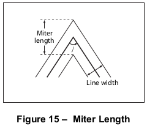
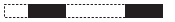
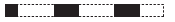

# 8.4 图形状态

**Graphics State**

## 8.4.1 概述

**General**

=== "中文"

    一个符合标准的阅读器应该维护一个称为*图形状态*的内部数据结构，该结构保存当前的图形控制参数。这些参数定义了图形操作符执行的全局框架。
    
    !!! info "EXAMPLE 1"
    
        **f**（填充）操作符隐式地使用当前的颜色参数，而**S**（描边）操作符还额外使用图形状态中的当前线宽参数。
    
    一个符合标准的阅读器应该在每页开始时使用[表52](#table52)和[表53](#table53)中指定的值初始化图形状态。[表52](#table52)列出了那些与设备无关且适合在页面描述中指定的图形状态参数。[表53](#table53)中列出的参数控制渲染（扫描转换）过程的细节，这些是与设备相关的；一个旨在与设备无关的页面描述不应该被写入以修改这些参数。
        
    <table id="table52" markdown="span">
        <caption>**表52 – 设备无关图形状态参数**</caption>
        <thead>
            <tr>
                <th>**参数**</th>
                <th>**类型**</th>
                <th>**值**</th>
            </tr>
        </thead>
        <tbody>
            <tr>
                <td>CTM</td>
                <td>array</td>
                <td>*当前变换矩阵*，用于将位置从用户坐标系映射到设备坐标系（参见[8.3]，“坐标系统”）。此矩阵通过每次应用坐标变换操作符**cm**进行修改。初始值：将默认用户坐标转换为设备坐标的矩阵。</td>
            </tr>
            <tr>
                <td>clipping path</td>
                <td>(internal)</td>
                <td>*当前剪裁路径*，定义所有输出将被裁剪的边界（参见[8.5.4]，“剪裁路径操作符”）。初始值：输出页面的整个可成像部分的边界。</td>
            </tr>
            <tr>
                <td>color space</td>
                <td>name or array</td>
                <td>当前用于解释颜色值的*颜色空间*（参见[8.6]，“颜色空间”）。有两个独立的颜色空间参数：一个用于描边，另一个用于所有其他绘画操作。初始值：**DeviceGray**。</td>
            </tr>
            <tr>
                <td>color</td>
                <td>(various)</td>
                <td>绘画操作中使用的*当前颜色*（参见[8.6]，“颜色空间”）。此参数的类型和解释取决于当前颜色空间；对于大多数颜色空间，颜色值由一到四个数字组成。有两个独立的颜色参数：一个用于描边，另一个用于所有其他绘画操作。初始值：黑色。</td>
            </tr>
            <tr>
                <td>text state</td>
                <td>(various)</td>
                <td>仅与绘制文本相关的一组九个图形状态参数。这些参数包括选择字体、将字形缩放到适当大小以及实现其他效果的参数。文本状态参数在[9.3]，“文本状态参数和操作符”中描述。</td>
            </tr>
            <tr>
                <td>line width</td>
                <td>number</td>
                <td>要描边的路径的厚度，以用户空间单位表示（参见[8.4.3.2]，“线宽”）。初始值：1.0。</td>
            </tr>
            <tr>
                <td>line cap</td>
                <td>integer</td>
                <td>指定任何被描边的开放路径的端点形状的代码（参见[8.4.3.3]，“线帽样式”）。初始值：0，表示方形平端帽。</td>
            </tr>
            <tr>
                <td>line join</td>
                <td>integer</td>
                <td>指定被描边路径的连接段之间的接合形状的代码（参见[8.4.3.4]，“线接合样式”）。初始值：0，表示斜接合。</td>
            </tr>
            <tr>
                <td>miter limit</td>
                <td>number</td>
                <td>描边路径的斜接线接合的最大长度（参见[8.4.3.5]，“斜接限制”）。此参数限制了在锐角连接时产生的“尖峰”的长度。初始值：10.0，表示斜接角度小于约11.5度的截止值。</td>
            </tr>
            <tr>
                <td>dash pattern</td>
                <td>array and number</td>
                <td>描边路径时使用的虚线图案的描述（参见[8.4.3.6]，“线虚线图案”）。初始值：实线。</td>
            </tr>
            <tr>
                <td>rendering intent</td>
                <td>name</td>
                <td>将CIE基础颜色转换为设备颜色时使用的渲染意图（参见[8.6.5.8]，“渲染意图”）。初始值：**RelativeColorimetric**。</td>
            </tr>
            <tr>
                <td>stroke adjustment</td>
                <td>boolean</td>
                <td>(*PDF 1.2*) 指定在使用相对于输出设备像素分辨率较小的线宽描边路径时是否补偿可能的栅格化效果的标志（参见[10.6.5]，“自动描边调整”）。<br>
    
    !!! note "NOTE"
    
        这是一个被认为是设备无关的参数，尽管其效果的细节依赖于设备。
    
    初始值：**false**。</td>
            </tr>
            <tr>
                <td>blend mode</td>
                <td>name or array</td>
                <td>(PDF 1.4) 用于透明成像模型的当前混合模式（参见[11.3.5]，“混合模式”和[11.6.3]，“指定混合颜色空间和混合模式”）。一个符合要求的阅读器应在执行透明组XObject（参见[11.6.6]，“透明组XObject”）开始时隐式重置此参数为其初始值。<br/>
                初始值：**Normal**。</td>
            </tr>
            <tr>
                <td>soft mask</td>
                <td>dictionary or name</td>
                <td>(PDF 1.4) 软蒙版字典（参见[11.6.5.2]，“软蒙版字典”），指定透明成像模型中使用的蒙版形状或蒙版不透明度值（参见[11.3.7.2]，“源形状和不透明度”和[11.6.4.3]，“蒙版形状和不透明度”），或名称**None**，如果没有指定蒙版。一个符合要求的阅读器应在执行透明组XObject（参见[11.6.6]，“透明组XObject”）开始时隐式重置此参数为其初始值。初始值：**None**。</td>
            </tr>
            <tr>
                <td>alpha constant</td>
                <td>number</td>
                <td>(PDF 1.4) 透明成像模型中使用的常数形状或常数不透明度值（参见[11.3.7.2]，“源形状和不透明度”和[11.6.4.4]，“常数形状和不透明度”）。有两个独立的alpha常数参数：一个用于描边，另一个用于所有其他绘画操作。一个符合要求的阅读器应在执行透明组XObject（参见[11.6.6]，“透明组XObject”）开始时隐式重置此参数为其初始值。初始值：1.0。</td>
            </tr>
            <tr>
                <td>alpha source</td>
                <td>boolean</td>
                <td>(PDF 1.4) 一个标志，指定当前软蒙版和alpha常数参数应解释为形状值（**true**）还是不透明度值（**false**）。此标志还控制图像字典中SMask条目的解释（如果有）（参见[8.9.5]，“图像字典”）。初始值：**false**。</td>
            </tr>
        </tbody>
    </table>
        
    <table id="table53" markdown="span">
        <caption>**表53 – 设备相关图形状态参数**</caption>
        <thead>
            <tr>
                <th>**参数**</th>
                <th>**类型**</th>
                <th>**值**</th>
            </tr>
        </thead>
        <tbody>
            <tr>
                <td>overprint</td>
                <td>boolean</td>
                <td>(PDF 1.2) 指定（在支持叠印控制功能的输出设备上）在一组颜色上绘制时，是否应该擦除其他颜色的相应区域（**false**）或保持不变（**true**）；参见[8.6.7]，“叠印控制”。在PDF 1.3中，有两个独立的叠印参数：一个用于描边，另一个用于所有其他绘画操作。初始值：**false**。</td>
            </tr>
            <tr>
                <td>overprint mode</td>
                <td>number</td>
                <td>(PDF 1.3) 指定在**DeviceCMYK**颜色空间中，颜色分量值为0时，是否应在叠印时擦除该分量（0）或保持不变（1）的代码（参见[8.6.7]，“叠印控制”）。初始值：0。</td>
            </tr>
            <tr>
                <td>black generation</td>
                <td>function or name</td>
                <td>(PDF 1.2) 转换*RGB*颜色为CMYK时计算黑色颜色分量水平的函数（参见[10.3.4]，“从DeviceRGB到DeviceCMYK的转换”）。初始值：符合要求的阅读器应将其初始化为合适的设备相关值。</td>
            </tr>
            <tr>
                <td>undercolor removal</td>
                <td>function or name</td>
                <td>(PDF 1.2) 计算减少青色、品红色和黄色颜色分量水平以补偿黑色生成所增加的黑色量的函数（参见[10.3.4]，“从DeviceRGB到DeviceCMYK的转换”）。初始值：符合要求的阅读器应将其初始化为合适的设备相关值。</td>
            </tr>
            <tr>
                <td>transfer</td>
                <td>function, array, or name</td>
                <td>(PDF 1.2) 调整设备灰色或颜色分量水平以补偿特定输出设备的非线性响应的函数（参见[10.4]，“传递函数”）。初始值：符合要求的阅读器应将其初始化为合适的设备相关值。</td>
            </tr>
            <tr>
                <td>halftone</td>
                <td>dictionary, stream, or name</td>
                <td>(PDF 1.2) 灰色和颜色渲染的半色调屏幕，指定为半色调字典或流（参见[10.5]，“半色调”）。初始值：符合要求的阅读器应将其初始化为合适的设备相关值。</td>
            </tr>
            <tr>
                <td>flatness</td>
                <td>number</td>
                <td>曲线在输出设备上呈现的精度（参见[10.6.2]，“平坦度容差”）。此参数的值（正数）给出最大误差容差，以输出设备像素为单位；较小的值在计算和内存使用上消耗更多，但曲线更平滑。初始值：1.0。</td>
            </tr>
            <tr>
                <td>smoothness</td>
                <td>number</td>
                <td>(PDF 1.3) 颜色渐变在输出设备上的呈现精度（参见[10.6.3]，“平滑度容差”）。此参数的值（0到1.0）给出最大误差容差，表示为每个颜色分量范围的一部分；较小的值在计算和内存使用上消耗更多，但颜色过渡更平滑。初始值：符合要求的阅读器应将其初始化为合适的设备相关值。</td>
            </tr>
        </tbody>
    </table>

    !!! note "NOTE 1"
    
        一些图形状态参数是通过特定的PDF操作符设置的，有些是通过在图形状态参数字典中包含特定条目来设置的，还有一些可以通过任一方式指定。
    
    !!! info "EXAMPLE 2"
    
        当前线宽既可以使用 **w** 操作符设置，也可以（在PDF 1.3中）使用图形状态参数字典中的 **LW** 条目设置，而当前颜色仅通过特定操作符设置，当前半色调仅通过图形状态参数字典设置。
    
    通常，符合标准的阅读器在解释设置图形状态参数的操作符时，应简单地将它们不变地存储起来，以便以后在解释绘画操作符时使用。然而，一些参数具有特殊属性或需要的行为，符合标准的阅读器应处理：
    
    - 大多数参数应为正确类型或具有在某个范围内的值。
    - 参数为数值类型，如当前颜色、线宽和斜接限制，必要时应强制进入有效范围。但是，它们不应调整以反映光栅输出设备的能力，如分辨率或可区分颜色的数量。绘画操作符执行此类调整，但调整后的值不应存储回图形状态。
    - 路径应为内部对象，不应直接在PDF中表示。
    
    !!! note "NOTE 2"
    
        如表52和表53所示，一些参数——颜色空间、颜色和过印——有两个值，一个用于描边（路径和文本对象），一个用于所有其他绘画操作。两个参数值可以独立设置，允许使用不同颜色组合填充和描边相同的路径等操作。除非另有说明，诸如*当前颜色*之类的术语应解释为适用于正在执行的操作的颜色参数。在必要时，个别颜色参数明确区分为*描边颜色*和*非描边颜色*。

=== "英文"

    A conforming reader shall maintain an internal data structure called the *graphics state* that holds current graphics control parameters. These parameters define the global framework within which the graphics operators execute.
    
    !!! info "EXAMPLE 1"
    
        The **f** (fill) operator implicitly uses the current colour parameter, and the **S** (stroke) operator additionally uses the current line width parameter from the graphics state.
    
    A conforming reader shall initialize the graphic state at the beginning of each page with the values specified in [Table 52](#table52) and [Table 53](#table53). [Table 52](#table52) lists those graphics state parameters that are device-independent and are appropriate to specify in page descriptions. The parameters listed in [Table 53](#table53) control details of the rendering (scan conversion) process and are device-dependent; a page description that is intended to be device-independent should not be written to modify these parameters.
        
    <table id="table52" markdown="span">
        <caption>**Table 52 – Device-Independent Graphics State Parameters**</caption>
        <thead>
            <tr>
                <th>**Parameter**</th>
                <th>**Type**</th>
                <th>**Value**</th>
            </tr>
        </thead>
        <tbody>
            <tr>
                <td>CTM</td>
                <td>array</td>
                <td>The *current transformation matrix*, which maps positions from user coordinates to device coordinates (see [8.3], "Coordinate Systems"). This matrix is modified by each application of the coordinate transformation operator, **cm**. Initial value: a matrix that transforms default user coordinates to device coordinates.</td>
            </tr>
            <tr>
                <td>clipping path</td>
                <td>(internal)</td>
                <td>The *current clipping path*, which defines the boundary against which all output shall be cropped (see [8.5.4], "Clipping Path Operators"). Initial value: the boundary of the entire imageable portion of the output page.</td>
            </tr>
            <tr>
                <td>color space</td>
                <td>name or array</td>
                <td>The *current colour space* in which colour values shall be interpreted (see [8.6], "Colour Spaces"). There are two separate colour space parameters: one for stroking and one for all other painting operations. Initial value: **DeviceGray**.</td>
            </tr>
            <tr>
                <td>color</td>
                <td>(various)</td>
                <td>The *current colour* to be used during painting operations (see [8.6], "Colour Spaces"). The type and interpretation of this parameter depend on the current colour space; for most colour spaces, a colour value consists of one to four numbers. There are two separate colour parameters: one for stroking and one for all other painting operations. Initial value: black.</td>
            </tr>
            <tr>
                <td>text state</td>
                <td>(various)</td>
                <td>A set of nine graphics state parameters that pertain only to the painting of text. These include parameters that select the font, scale the glyphs to an appropriate size, and accomplish other effects. The text state parameters are described in [9.3], "Text State Parameters and Operators".</td>
            </tr>
            <tr>
                <td>line width</td>
                <td>number</td>
                <td>The thickness, in user space units, of paths to be stroked (see [8.4.3.2], "Line Width"). Initial value: 1.0.</td>
            </tr>
            <tr>
                <td>line cap</td>
                <td>integer</td>
                <td>A code specifying the shape of the endpoints for any open path that is stroked (see [8.4.3.3], "Line Cap Style"). Initial value: 0, for square butt caps.</td>
            </tr>
            <tr>
                <td>line join</td>
                <td>integer</td>
                <td>A code specifying the shape of joints between connected segments of a stroked path (see [8.4.3.4], "Line Join Style"). Initial value: 0, for mitered joins.</td>
            </tr>
            <tr>
                <td>miter limit</td>
                <td>number</td>
                <td>The maximum length of mitered line joins for stroked paths (see [8.4.3.5], "Miter Limit"). This parameter limits the length of “spikes” produced when line segments join at sharp angles. Initial value: 10.0, for a miter cutoff below approximately 11.5 degrees.</td>
            </tr>
            <tr>
                <td>dash pattern</td>
                <td>array and number</td>
                <td>A description of the dash pattern to be used when paths are stroked (see [8.4.3.6], "Line Dash Pattern"). Initial value: a solid line.</td>
            </tr>
            <tr>
                <td>rendering intent</td>
                <td>name</td>
                <td>The rendering intent to be used when converting CIE-based colours to device colours (see [8.6.5.8], "Rendering Intents"). Initial value: **RelativeColorimetric**.</td>
            </tr>
            <tr>
                <td>stroke adjustment</td>
                <td>boolean</td>
                <td>(*PDF 1.2*) A flag specifying whether to compensate for possible rasterization effects when stroking a path with a line width that is small relative to the pixel resolution of the output device (see [10.6.5], "Automatic Stroke Adjustment").
    
    !!! note "NOTE"
    
        This is considered a device-independent parameter, even though the details of its effects are device-dependent.
    
    Initial value: **false**.</td>
            </tr>
            <tr>
                <td>blend mode</td>
                <td>name or array</td>
                <td>(PDF 1.4) The current blend mode to be used in the transparent imaging model (see [11.3.5], "Blend Mode" and [11.6.3], "Specifying Blending Colour Space and Blend Mode"). A conforming reader shall implicitly reset this parameter to its initial value at the beginning of execution of a transparency group XObject (see [11.6.6], "Transparency Group XObjects").<br/>
                Initial value: **Normal**.</td>
            </tr>
            <tr>
                <td>soft mask</td>
                <td>dictionary or name</td>
                <td>(PDF 1.4) A soft-mask dictionary (see [11.6.5.2], "Soft-Mask Dictionaries") specifying the mask shape or mask opacity values to be used in the transparent imaging model (see [11.3.7.2], "Source Shape and Opacity" and [11.6.4.3], "Mask Shape and Opacity"), or the name **None** if no such mask is specified. A conforming reader shall implicitly reset this parameter implicitly reset to its initial value at the beginning of execution of a transparency group XObject (see [11.6.6], "Transparency Group XObjects"). Initial value: **None**.</td>
            </tr>
            <tr>
                <td>alpha constant</td>
                <td>number</td>
                <td>(PDF 1.4) The constant shape or constant opacity value to be used in the transparent imaging model (see [11.3.7.2], "Source Shape and Opacity" and [11.6.4.4], "Constant Shape and Opacity"). There are two separate alpha constant parameters: one for stroking and one for all other painting operations. A conforming reader shall implicitly reset this parameter to its initial value at the beginning of execution of a transparency group XObject (see [11.6.6], "Transparency Group XObjects"). Initial value: 1.0.</td>
            </tr>
            <tr>
                <td>alpha source</td>
                <td>boolean</td>
                <td>(PDF 1.4) A flag specifying whether the current soft mask and alpha constant parameters shall be interpreted as shape values (**true**) or opacity values (**false**). This flag also governs the interpretation of the SMask entry, if any, in an image dictionary (see [8.9.5], "Image Dictionaries"). Initial value: **false**.</td>
            </tr>
        </tbody>
    </table>
        
    <table id="table53" markdown="span">
        <caption>**Table 53 – Device-Dependent Graphics State Parameters**</caption>
        <thead>
            <tr>
                <th>**Parameter**</th>
                <th>**Type**</th>
                <th>**Value**</th>
            </tr>
        </thead>
        <tbody>
            <tr>
                <td>overprint</td>
                <td>boolean</td>
                <td>(PDF 1.2) A flag specifying (on output devices that support the overprint control feature) whether painting in one set of colorants should cause the corresponding areas of other colorants to be erased (**false**) or left unchanged (**true**); see [8.6.7], "Overprint Control". In PDF 1.3, there are two separate overprint parameters: one for stroking and one for all other painting operations. Initial value: **false**.
                </td>
            </tr>
            <tr>
                <td>overprint mode</td>
                <td>number</td>
                <td>(PDF 1.3) A code specifying whether a colour component value of 0 in a **DeviceCMYK** colour space should erase that component (0) or leave it unchanged (1) when overprinting (see [8.6.7], "Overprint Control"). Initial value: 0.
                </td>
            </tr>
            <tr>
                <td>black generation</td>
                <td>function or name</td>
                <td>(PDF 1.2) A function that calculates the level of the black colour component to use when converting *RGB* colours to CMYK (see [10.3.4], "Conversion from DeviceRGB to DeviceCMYK"). Initial value: a conforming reader shall initialize this to a suitable device dependent value.
                </td>
            </tr>
            <tr>
                <td>undercolor removal</td>
                <td>function or name</td>
                <td>(PDF 1.2) A function that calculates the reduction in the levels of the cyan, magenta, and yellow colour components to compensate for the amount of black added by black generation (see [10.3.4], "Conversion from DeviceRGB to DeviceCMYK"). Initial value: a conforming reader shall initialize this to a suitable device dependent value.
                </td>
            </tr>
            <tr>
                <td>transfer</td>
                <td>function, array, or name</td>
                <td>(PDF 1.2) A function that adjusts device gray or colour component levels to compensate for nonlinear response in a particular output device (see [10.4], “Transfer Functions“). Initial value: a conforming reader shall initialize this to a suitable device dependent value.
                </td>
            </tr>
            <tr>
                <td>halftone</td>
                <td>dictionary, stream, or name</td>
                <td>(PDF 1.2) A halftone screen for gray and colour rendering, specified as a halftone dictionary or stream (see [10.5], "Halftones"). Initial value: a conforming reader shall initialize this to a suitable device dependent value.
                </td>
            </tr>
            <tr>
                <td>flatness</td>
                <td>number</td>
                <td>The precision with which curves shall be rendered on the output device (see [10.6.2], "Flatness Tolerance"). The value of this parameter (positive number) gives the maximum error tolerance, measured in output device pixels; smaller numbers give smoother curves at the expense of more computation and memory use. Initial value: 1.0.
                </td>
            </tr>
            <tr>
                <td>smoothness</td>
                <td>number</td>
                <td>(PDF 1.3) The precision with which colour gradients are to be rendered on the output device (see [10.6.3], "Smoothness Tolerance"). The value of this parameter (0 to 1.0) gives the maximum error tolerance, expressed as a fraction of the range of each colour component; smaller numbers give smoother colour transitions at the expense of more computation and memory use. Initial value: a conforming reader shall initialize this to a suitable device dependent value.
                </td>
            </tr>
        </tbody>
    </table>
    
    !!! note "NOTE 1"
    
        Some graphics state parameters are set with specific PDF operators, some are set by including a particular entry in a graphics state parameter dictionary, and some can be specified either way.
    
    !!! note "EXAMPLE 2"
    
        The current line width can be set either with the **w** operator or (in PDF 1.3) with the **LW** entry in a graphics state parameter dictionary, whereas the current colour is set only with specific operators, and the current halftone is set only with a graphics state parameter dictionary.
    
    In general, a conforming reader, when interpreting the operators that set graphics state parameters, shall simply store them unchanged for later use when interpreting the painting operators.However, some parameters have special properties or call for behaviour that a conforming reader shall handle:
    
    - Most parameters shall be of the correct type or have values that fall within a certain range.
    - Parameters that are numeric values, such as the current colour, line width, and miter limit, shall be forced into valid range, if necessary. However, they shall not be adjusted to reflect capabilities of the raster output device, such as resolution or number of distinguishable colours. Painting operators perform such adjustments, but the adjusted values shall not be stored back into the graphics state.
    - Paths shall be internal objects that shall not be directly represented in PDF.
    
    !!! note "NOTE 2"
    
        As indicated in Table 52 and Table 53, some of the parameters—color space, color, and overprint—have two values, one used for stroking (of paths and text objects) and one for all other painting operations. The two parameter values can be set independently, allowing for operations such as combined filling and stroking of the same path with different colours. Except where noted, a term such as *current colour* should be interpreted to refer to whichever colour parameter applies to the operation being performed. When necessary, the individual colour parameters are distinguished explicitly as the *stroking colour* and the *nonstroking colour*.

## 8.4.2 图形状态栈

**8.4.2 Graphics State Stack**

=== "中文"

    PDF文档通常包含许多彼此独立的图形元素，并且这些元素被嵌套到多个层级。*图形状态栈*允许这些元素对图形状态进行局部更改，而不会干扰周围环境的图形状态。该栈是一个后进先出（LIFO）数据结构，可以使用以下操作符保存和稍后恢复图形状态的内容：
    
    - **q** 操作符应将整个图形状态的副本推入栈中。
    - **Q** 操作符应通过从栈中弹出来恢复整个图形状态到其先前的值。
    
    !!! note "NOTE"
    
        这些操作符可以用来封装一个图形元素，使其可以修改图形状态的参数，然后再将它们恢复到先前的值。
    
    在给定的内容流中（或在页面字典的**Contents**数组中指定的流序列中），**q**和**Q**操作符的出现次数应该保持平衡。


=== "英文"

    A PDF document typically contains many graphical elements that are independent of each other and nested to multiple levels. The *graphics state stack* allows these elements to make local changes to the graphics state without disturbing the graphics state of the surrounding environment. The stack is a LIFO (last in, first out) data structure in which the contents of the graphics state may be saved and later restored using the following operators:
    
    - The **q** operator shall push a copy of the entire graphics state onto the stack.
    - The **Q** operator shall restore the entire graphics state to its former value by popping it from the stack.
    
    NOTE
    
    These operators can be used to encapsulate a graphical element so that it can modify parameters of the graphics state and later restore them to their previous values.
    
    Occurrences of the **q** and **Q** operators shall be balanced within a given content stream (or within the sequence of streams specified in a page dictionary’s **Contents** array).

## 8.4.3 图形状态参数详情

**8.4.3 Details of Graphics State Parameters**

### 8.4.3.1 概述

**8.4.3.1 General**

=== "中文"
    
    本小节将详细介绍[表52](#table52)中列出的一些与设备无关的图形状态参数的细节。    

=== "英文"

    This sub-clause gives details of several of the device-independent graphics state parameters listed in [Table 52](#table52).

### 8.4.3.2 线宽

**8.4.3.2 Line Width**

=== "中文"
    
    线宽参数指定用于描边路径的线条厚度。它应该是一个非负数，以用户空间单位表示；描边路径意味着绘制所有在用户空间中与路径垂直距离小于或等于线宽一半的点。在设备空间中产生的效果取决于描边路径时当前变换矩阵（CTM）。如果CTM指定在水平和垂直方向上按不同比例缩放，则设备空间中描边线条的厚度应根据其方向变化。实际达到的线宽可能与请求的宽度相差多达2个设备像素，这取决于线条相对于像素网格的位置。可以使用自动描边调整来确保统一的线宽；见[10.6.5]，“自动描边调整”。
    
    线宽为0应表示在设备分辨率下可以渲染的最细线条：1个设备像素宽。然而，一些设备无法重现1像素的线条，在高分辨率设备上，它们几乎不可见。由于渲染这种零宽度线条的结果与设备相关，因此不应使用。    

=== "英文"
    
    The *line width* parameter specifies the thickness of the line used to stroke a path. It shall be a non-negative number expressed in user space units; stroking a path shall entail painting all points whose perpendicular distance from the path in user space is less than or equal to half the line width. The effect produced in device space depends on the current transformation matrix (CTM) in effect at the time the path is stroked. If the CTM specifies scaling by different factors in the horizontal and vertical dimensions, the thickness of stroked lines in device space shall vary according to their orientation. The actual line width achieved can differ from the requested width by as much as 2 device pixels, depending on the positions of lines with respect to the pixel grid. Automatic stroke adjustment may be used to ensure uniform line width; see [10.6.5], "Automatic Stroke Adjustment".
    
    A line width of 0 shall denote the thinnest line that can be rendered at device resolution: 1 device pixel wide. However, some devices cannot reproduce 1-pixel lines, and on high-resolution devices, they are nearly invisible. Since the results of rendering such zero-width lines are device-dependent, they should not be used.


### 8.4.3.3 线帽样式

**8.4.3.3 Line Cap Style**

=== "中文"
    
    线头样式参数指定在描边时用于开放子路径端点（以及虚线，如果有的话）的形状。[表54](#table54)显示了可能的值。
            
    <table id="table54" markdown="span">
        <caption>**Table 54 – Line Cap Styles**</caption>
        <thead>
            <tr>
                <th>**Style**</th>
                <th>**Appearance**</th>
                <th>**Description**</th>
            </tr>
        </thead>
        <tbody>
            <tr>
                <td>0</td>
                <td></td>
                <td>*平头*。描边应在路径端点处被截平。不应有超出路径末端的投影。
                </td>
            </tr>
            <tr>
                <td>1</td>
                <td></td>
                <td>*圆头*。应绘制一个直径等于线宽的半圆形弧，并将其填充。
                </td>
            </tr>
            <tr>
                <td>2</td>
                <td></td>
                <td>*延长平头*。描边应超过路径末端，延伸的距离等于线宽的一半，并被截平。
                </td>
            </tr>
        </tbody>
    </table>

=== "英文"

    The *line cap style* shall specify the shape that shall be used at the ends of open subpaths (and dashes, if any) when they are stroked. [Table 54](#table54) shows the possible values.
            
    <table id="table54" markdown="span">
        <caption>**Table 54 – Line Cap Styles**</caption>
        <thead>
            <tr>
                <th>**Style**</th>
                <th>**Appearance**</th>
                <th>**Description**</th>
            </tr>
        </thead>
        <tbody>
            <tr>
                <td>0</td>
                <td></td>
                <td>*Butt cap*. The stroke shall be squared off at the endpoint of the path. There shall be no projection beyond the end of the path.
                </td>
            </tr>
            <tr>
                <td>1</td>
                <td></td>
                <td>*Round cap*. A semicircular arc with a diameter equal to the line width shall be drawn around the endpoint and shall be filled in.
                </td>
            </tr>
            <tr>
                <td>2</td>
                <td></td>
                <td>*Projecting square cap*. The stroke shall continue beyond the endpoint of the path for a distance equal to half the line width and shall be squared off.
                </td>
            </tr>
        </tbody>
    </table>

### 8.4.3.4 线连接样式

**8.4.3.4 Line Join Style**

=== "中文"

    线接样式参数指定在描边路径的角上使用的形状。[表55](#table55)显示了可能的值。线接样式仅在路径的连续段以角度连接的点上才有意义；偶然相遇或相交的段将不进行特殊处理。
            
    <table id="table55" markdown="span">
        <caption>**Table 55 – Line Join Styles**</caption>
        <thead>
            <tr>
                <th>**Style**</th>
                <th>**Appearance**</th>
                <th>**Description**</th>
            </tr>
        </thead>
        <tbody>
            <tr>
                <td>0</td>
                <td></td>
                <td>*斜接*。两个段的描边的外边缘应延伸，直到它们以一个角度相遇，就像在画框中一样。如果段以过于尖锐的角度相遇（由斜接限制参数定义——见[8.4.3.5]，"斜接限制"），则应使用斜面接代替。
                </td>
            </tr>
            <tr>
                <td>1</td>
                <td></td>
                <td>*圆接*。应绘制一个直径等于线宽的圆弧，围绕两个段相遇的点，连接两个段的描边的外边缘。这个扇形图形将被填充，产生一个圆角。
                </td>
            </tr>
            <tr>
                <td>2</td>
                <td></td>
                <td>*斜面接*。两个段应以平头（见[8.4.3.3]，"线头样式"）结束，并且由段的末端产生的缺口应被一个三角形填充。
                </td>
            </tr>
        </tbody>
    </table>

=== "英文"

    The *line join style* shall specify the shape to be used at the corners of paths that are stroked. Table 55 shows the possible values. Join styles shall be significant only at points where consecutive segments of a path connect at an angle; segments that meet or intersect fortuitously shall receive no special treatment.
            
    <table id="table55" markdown="span">
        <caption>**Table 55 – Line Join Styles**</caption>
        <thead>
            <tr>
                <th>**Style**</th>
                <th>**Appearance**</th>
                <th>**Description**</th>
            </tr>
        </thead>
        <tbody>
            <tr>
                <td>0</td>
                <td></td>
                <td>*Miter join*. The outer edges of the strokes for the two segments shall be extended until they meet at an angle, as in a picture frame. If the segments meet at too sharp an angle (as defined by the miter limit parameter—see [8.4.3.5], "Miter Limit"), a bevel join shall be used instead.
                </td>
            </tr>
            <tr>
                <td>1</td>
                <td></td>
                <td>*Round join*. An arc of a circle with a diameter equal to the line width shall be drawn around the point where the two segments meet, connecting the outer edges of the strokes for the two segments. This pieslice-shaped figure shall be filled in, producing a rounded corner.
                </td>
            </tr>
            <tr>
                <td>2</td>
                <td></td>
                <td>*Bevel join*. The two segments shall be finished with butt caps (see [8.4.3.3], "Line Cap Style") and the resulting notch beyond the ends of the segments shall be filled with a triangle.
                </td>
            </tr>
        </tbody>
    </table>


### 8.4.3.5 斜接限制

**8.4.3.5 Miter Limit**

=== "中文"

    当两条线段以锐角相交，并且指定了斜接连接作为线连接样式时，斜接可能会延伸到超过路径描边线宽的长度。斜接限制将对斜接长度与线宽的比率施加最大值（见[附录 L](../a12.md)中的图15）。当超出限制时，连接将从斜接转换为斜切。
    
    斜接长度与线宽的比率与用户空间中线段之间的角度 $\varphi$ 直接相关，其公式如下：
    
    $$\frac{miterLength}{lineWidth} = \frac{1}{\sin\left ( \frac{\varphi }{2} \right ) }$$
    
    !!! info "EXAMPLE"
    
        斜接限制为1.414时，对于 j 小于90度的角，会将斜接转换为斜切；限制为2.0时，对于 j 小于60度的角，会进行转换；限制为10.0时，对于 j 小于大约11.5度的角，会进行转换。
    
        

=== "英文"

    When two line segments meet at a sharp angle and mitered joins have been specified as the line join style, it is possible for the miter to extend far beyond the thickness of the line stroking the path. The miter limit shall impose a maximum on the ratio of the miter length to the line width (see Figure 15 in [Annex L](../a12.md)). When the limit is exceeded, the join is converted from a miter to a bevel.
    
    The ratio of miter length to line width is directly related to the angle j between the segments in user space by the following formula:
    
    $$\frac{miterLength}{lineWidth} = \frac{1}{\sin\left ( \frac{\varphi }{2} \right ) }$$
    
    !!! info "EXAMPLE"
    
        A miter limit of 1.414 converts miters to bevels for j less than 90 degrees, a limit of 2.0 converts them for j less than 60 degrees, and a limit of 10.0 converts them for j less than approximately 11.5 degrees.
    
        

### 8.4.3.6 虚线样式

**8.4.3.6 Line Dash Pattern**

=== "中文"

    *虚线模式*应控制用于描边路径的虚线和间隙的模式。它应由一个*虚线数组*和一个*虚线相位*来指定。虚线数组的元素应为数字，这些数字指定交替虚线和间隙的长度；这些数字应非负且不全部为零。虚线相位应指定从虚线模式的哪个距离开始虚线。虚线数组和虚线相位的元素都应以用户空间单位表示。
    
    在开始描边路径之前，应循环遍历虚线数组，累加虚线和间隙的长度。当累积长度等于由虚线相位指定的值时，应开始描边路径，并从该点开始循环使用虚线数组。表56显示了虚线模式的示例。从表中可以看出，空的虚线数组和零相位可以用来将虚线模式恢复为实线。

    <table id="table56" markdown="span">
        <caption>**Table 56 – 虚线模式(图案)示例**</caption>
        <thead>
            <tr>
                <th>**Dash Array and Phase**</th>
                <th>**Appearance**</th>
                <th>**Description**</th>
            </tr>
        </thead>
        <tbody>
            <tr>
                <td>[] 0</td>
                <td></td>
                <td>No dash; solid, unbroken lines
                </td>
            </tr>
            <tr>
                <td>[3] 0</td>
                <td></td>
                <td>3 units on, 3 units off, …
                </td>
            </tr>
            <tr>
                <td>[2] 1</td>
                <td></td>
                <td>1 on, 2 off, 2 on, 2 off, …
                </td>
            </tr>
            <tr>
                <td>[2 1] 0</td>
                <td></td>
                <td>2 on, 1 off, 2 on, 1 off, …
                </td>
            </tr>
            <tr>
                <td>[3 5] 6</td>
                <td></td>
                <td>2 off, 3 on, 5 off, 3 on, 5 off, …
                </td>
            </tr>
            <tr>
                <td>[2 3] 11</td>
                <td></td>
                <td>1 on, 3 off, 2 on, 3 off, 2 on, …
                </td>
            </tr>
        </tbody>
    </table>
    
    虚线应该像实线一样沿着曲线和角落包裹。每个虚线段的末端应按照当前的线帽样式处理，虚线内的角落应按照当前的线连接样式处理。描边操作不会采取措施将虚线模式与路径的特征协调起来；它只是简单地沿着路径按照虚线数组定义的模式分配虚线和间隙。
    
    当描边一个由多个子路径组成的路径时，每个子路径应独立处理——即，在每个子路径的开始处重新启动虚线模式，并重新应用虚线相位。
    

=== "英文"

    The *line dash pattern* shall control the pattern of dashes and gaps used to stroke paths. It shall be specified by a *dash array* and a *dash phase*. The dash array’s elements shall be numbers that specify the lengths of alternating dashes and gaps; the numbers shall be nonnegative and not all zero. The dash phase shall specify the distance into the dash pattern at which to start the dash. The elements of both the dash array and the dash phase shall be expressed in user space units.
    
    Before beginning to stroke a path, the dash array shall be cycled through, adding up the lengths of dashes and gaps. When the accumulated length equals the value specified by the dash phase, stroking of the path shall begin, and the dash array shall be used cyclically from that point onward. Table 56 shows examples of line dash patterns. As can be seen from the table, an empty dash array and zero phase can be used to restore the dash pattern to a solid line.
            
    <table id="table56" markdown="span">
        <caption>**Table 56 – Examples of Line Dash Patterns**</caption>
        <thead>
            <tr>
                <th>**Dash Array and Phase**</th>
                <th>**Appearance**</th>
                <th>**Description**</th>
            </tr>
        </thead>
        <tbody>
            <tr>
                <td>[] 0</td>
                <td></td>
                <td>No dash; solid, unbroken lines
                </td>
            </tr>
            <tr>
                <td>[3] 0</td>
                <td></td>
                <td>3 units on, 3 units off, …
                </td>
            </tr>
            <tr>
                <td>[2] 1</td>
                <td></td>
                <td>1 on, 2 off, 2 on, 2 off, …
                </td>
            </tr>
            <tr>
                <td>[2 1] 0</td>
                <td></td>
                <td>2 on, 1 off, 2 on, 1 off, …
                </td>
            </tr>
            <tr>
                <td>[3 5] 6</td>
                <td></td>
                <td>2 off, 3 on, 5 off, 3 on, 5 off, …
                </td>
            </tr>
            <tr>
                <td>[2 3] 11</td>
                <td></td>
                <td>1 on, 3 off, 2 on, 3 off, 2 on, …
                </td>
            </tr>
        </tbody>
    </table>
    
    Dashed lines shall wrap around curves and corners just as solid stroked lines do. The ends of each dash shall be treated with the current line cap style, and corners within dashes shall be treated with the current line join style. A stroking operation shall take no measures to coordinate the dash pattern with features of the path; it simply shall dispense dashes and gaps along the path in the pattern defined by the dash array.
    
    When a path consisting of several subpaths is stroked, each subpath shall be treated independently—that is, the dash pattern shall be restarted and the dash phase shall be reapplied to it at the beginning of each subpath.

## 8.4.4 图形状态操作符

**8.4.4 Graphics State Operators**

=== "中文"
    
    [表57](#table57) 显示了设置图形状态中参数值的操作符。（另见表74中列出的颜色操作符和[表105](../c9/s3.md#table105)中的文本状态操作符。）
                
    <table id="table57" markdown="span">
        <caption>**Table 57 – 图形状态参数的操作符**</caption>
        <thead>
            <tr>
                <th>**Operands**</th>
                <th>**Operator**</th>
                <th>**Description**</th>
            </tr>
        </thead>
        <tbody>
            <tr>
                <td>—</td>
                <td>**q**</td>
                <td>将当前图形状态保存到图形状态栈上（见[8.4.2]，“图形状态栈”）。
                </td>
            </tr>
            <tr>
                <td>—</td>
                <td>**Q**</td>
                <td>通过从栈中移除最近保存的状态并使其成为当前状态来恢复图形状态（见[8.4.2]，“图形状态栈”）。
                </td>
            </tr>
            <tr>
                <td>a b c d e f</td>
                <td>**cm**</td>
                <td>通过串联指定的矩阵来修改当前变换矩阵（CTM）（见[8.3.2]，“坐标空间”）。尽管操作数指定了一个矩阵，但它们应作为六个独立的数字书写，而不是作为数组。
                </td>
            </tr>
            <tr>
                <td>lineWidth</td>
                <td>**w**</td>
                <td>在图形状态中设置线宽（见[8.4.3.2]，“线宽”）。
                </td>
            </tr>
            <tr>
                <td>lineCap</td>
                <td>**J**</td>
                <td>在图形状态中设置线帽样式（见[8.4.3.3]，“线帽样式”）。
                </td>
            </tr>
            <tr>
                <td>lineJoin</td>
                <td>**j**</td>
                <td>在图形状态中设置线连接样式（见[8.4.3.4]，“线连接样式”）。
                </td>
            </tr>
            <tr>
                <td>miterLimit</td>
                <td>**M**</td>
                <td>在图形状态中设置斜接限制（见[8.4.3.5]，“斜接限制”）。
                </td>
            </tr>
            <tr>
                <td>dashArray dashPhase</td>
                <td>**d**</td>
                <td>在图形状态中设置虚线模式（见[8.4.3.6]，“虚线模式”）。
                </td>
            </tr>
            <tr>
                <td>intent</td>
                <td>**ri**</td>
                <td>(PDF 1.1) 在图形状态中设置颜色渲染意图（见[8.6.5.8]，“渲染意图”）。
                </td>
            </tr>
            <tr>
                <td>flatness</td>
                <td>**i**</td>
                <td>设置图形状态中的平坦容差（见[10.6.2]，“平坦容差”）。*flatness*是一个0到100范围内的数字；值为0应指定输出设备的默认平坦容差。
                </td>
            </tr>
            <tr>
                <td>dictName</td>
                <td>**gs**</td>
                <td>(PDF 1.2) 在图形状态中设置指定的参数。*dictName*应是当前资源字典中**ExtGState**子字典的图形状态参数字典的名称（见下一个子条款）。
                </td>
            </tr>
        </tbody>
    </table>

=== "英文"
    
    [Table 57](#table57) shows the operators that set the values of parameters in the graphics state. (See also the colour operators listed in Table 74 and the text state operators in [Table 105](../c9/s3.md#table105).)
                
    <table id="table57" markdown="span">
        <caption>**Table 57 – Graphics State Operators**</caption>
        <thead>
            <tr>
                <th>**Operands**</th>
                <th>**Operator**</th>
                <th>**Description**</th>
            </tr>
        </thead>
        <tbody>
            <tr>
                <td>—</td>
                <td>**q**</td>
                <td>Save the current graphics state on the graphics state stack (see [8.4.2], "Graphics State Stack").
                </td>
            </tr>
            <tr>
                <td>—</td>
                <td>**Q**</td>
                <td>Restore the graphics state by removing the most recently saved state from the stack and making it the current state (see [8.4.2], "Graphics State Stack").
                </td>
            </tr>
            <tr>
                <td>a b c d e f</td>
                <td>**cm**</td>
                <td>Modify the current transformation matrix (CTM) by concatenating the specified matrix (see [8.3.2], "Coordinate Spaces"). Although the operands specify a matrix, they shall be written as six separate numbers, not as an array.
                </td>
            </tr>
            <tr>
                <td>lineWidth</td>
                <td>**w**</td>
                <td>Set the line width in the graphics state (see [8.4.3.2], "Line Width").
                </td>
            </tr>
            <tr>
                <td>lineCap</td>
                <td>**J**</td>
                <td>Set the line cap style in the graphics state (see [8.4.3.3], "Line Cap Style").
                </td>
            </tr>
            <tr>
                <td>lineJoin</td>
                <td>**j**</td>
                <td>Set the line join style in the graphics state (see [8.4.3.4], "Line Join Style").
                </td>
            </tr>
            <tr>
                <td>miterLimit</td>
                <td>**M**</td>
                <td>Set the miter limit in the graphics state (see [8.4.3.5], "Miter Limit").
                </td>
            </tr>
            <tr>
                <td>dashArray dashPhase</td>
                <td>**d**</td>
                <td>Set the line dash pattern in the graphics state (see [8.4.3.6], "Line Dash Pattern").
                </td>
            </tr>
            <tr>
                <td>intent</td>
                <td>**ri**</td>
                <td>(PDF 1.1) Set the colour rendering intent in the graphics state (see [8.6.5.8], "Rendering Intents").
                </td>
            </tr>
            <tr>
                <td>flatness</td>
                <td>**i**</td>
                <td>Set the flatness tolerance in the graphics state (see [10.6.2], "Flatness Tolerance"). *flatness* is a number in the range 0 to 100; a value of 0 shall specify the output device’s default flatness tolerance.
                </td>
            </tr>
            <tr>
                <td>dictName</td>
                <td>**gs**</td>
                <td>(PDF 1.2) Set the specified parameters in the graphics state. *dictName* shall be the name of a graphics state parameter dictionary in the **ExtGState** subdictionary of the current resource dictionary (see the next sub-clause).
                </td>
            </tr>
        </tbody>
    </table>

## 8.4.5 图形状态参数字典

**8.4.5 Graphics State Parameter Dictionaries**

=== "中文"

    虽然图形状态中的一些参数可以通过表57中显示的单独操作符设置，但其他一些参数则不能。后者只能通过通用图形状态操作符 **gs** (PDF 1.2) 来设置。提供给此操作符的操作数应是 *图形状态参数字典* 的名称，其内容指定了一个或多个图形状态参数的值。该名称应在当前资源字典的 **ExtGState** 子字典中查找。
    
    图形状态参数字典也由类型2图案使用，这些图案没有内容流，无法在其中调用图形状态操作符（见[8.7.4]，“着色图案”）。
    
    参数字典中的每个条目都应指定单个图形状态参数的值，如[表58](#table58)所示。并非每次调用 **gs** 操作符时都需要所有条目；所提供的参数字典可以包括任何组合的参数条目。**gs** 的结果将是累积的；在之前的调用中建立的参数值将持续有效，直到被明确覆盖。
    
    !!! note "NOTE"
    
        请注意，一些参数同时出现在[表57](#table57)和[表58](#table58)中；这些参数既可以使用单独的图形状态操作符设置，也可以使用 **gs** 设置。预计对图形状态的任何未来扩展将通过向图形状态参数字典添加新条目来实现，而不是通过引入新的图形状态操作符。
                    
    <table id="table58" markdown="span">
        <caption>**Table 58 – 图形状态参数字典中的条目**</caption>
        <thead>
            <tr>
                <th>**Key**</th>
                <th>**Type**</th>
                <th>**Description**</th>
            </tr>
        </thead>
        <tbody>
            <tr>
                <td>**Type**</td>
                <td>name</td>
                <td> （可选）此字典描述的PDF对象的类型；对于图形状态参数字典，应为**ExtGState**。</td>
            </tr>
            <tr>
                <td>**LW**</td>
                <td>number</td>
                <td>（可选；PDF 1.3）线宽（见[8.4.3.2]，“线宽”）。
                </td>
            </tr>
            <tr>
                <td>**LC**</td>
                <td>integer</td>
                <td>（可选；PDF 1.3）线帽样式（见[8.4.3.3]，“线帽样式”）。
                </td>
            </tr>
            <tr>
                <td>**LJ**</td>
                <td>integer</td>
                <td>（可选；PDF 1.3）线连接样式（见[8.4.3.4]，“线连接样式”）。
                </td>
            </tr>
            <tr>
                <td>**ML**</td>
                <td>number</td>
                <td>（可选；PDF 1.3）斜接限制（见[8.4.3.5]，“斜接限制”）。
                </td>
            </tr>
            <tr>
                <td>**D**</td>
                <td>array</td>
                <td>（可选；PDF 1.3）虚线模式，表示为形式为[*dashArray* *dashPhase*]的数组，其中**dashArray**本身应为数组，*dashPhase*应为整数（见[8.4.3.6]，“虚线模式”）。
                </td>
            </tr>
            <tr>
                <td>**RI**</td>
                <td>name</td>
                <td>（可选；PDF 1.3）渲染意图的名称（见[8.6.5.8]，“渲染意图”）。
                </td>
            </tr>
            <tr>
                <td>**OP**</td>
                <td>boolean</td>
                <td>（可选）指定是否应用过印（见[8.6.7]，“过印控制”）。在PDF 1.2及更早版本中，有一个单一的过印参数适用于所有绘画操作。从PDF 1.3开始，应有两个单独的过印参数：一个用于描边，另一个用于所有其他绘画操作。指定**OP**条目将设置这两个参数，除非在同一图形状态参数字典中也有一个**op**条目，在这种情况下，**OP**条目将只设置描边的过印参数。
                </td>
            </tr>
            <tr>
                <td>**op**</td>
                <td>boolean</td>
                <td>（可选；PDF 1.3）指定是否对描边之外的其他绘画操作应用过印（见[8.6.7]，“过印控制”）。如果此条目不存在，则**OP**条目（如果有）也将设置此参数。 
                </td>
            </tr>
            <tr>
                <td>**OPM**</td>
                <td>integer</td>
                <td>（可选；PDF 1.3）过印模式（见[8.6.7]，“过印控制”）。
                </td>
            </tr>
            <tr>
                <td>**Font**</td>
                <td>array</td>
                <td>（可选；PDF 1.3）形式为[*font* *size*]的数组，其中*font*应是对字体字典的间接引用，*size*应是以文本空间单位表示的数字。这两个对象对应于**Tf**操作符的操作数（见[9.3]，“文本状态参数和操作符”）；但是，第一个操作数应是间接对象引用，而不是资源名称。
                </td>
            </tr>
            <tr>
                <td>**BG**</td>
                <td>function</td>
                <td>（可选）黑生成函数，将区间[0.0 1.0]映射到区间[0.0 1.0]（见[10.3.4]，“从DeviceRGB转换到DeviceCMYK”）。
                </td>
            </tr>
            <tr>
                <td>**BG2**</td>
                <td>function or name</td>
                <td>（可选；PDF 1.3）与**BG**相同，但值也可以是名称Default，表示页面开始时生效的黑生成函数。如果在同一图形状态参数字典中同时存在**BG**和**BG2**，则**BG2**优先。
                </td>
            </tr>
            <tr>
                <td>**UCR**</td>
                <td>function</td>
                <td>（可选）底色去除函数，将区间[0.0 1.0]映射到区间[−1.0 1.0]（见[10.3.4]，“从DeviceRGB转换到DeviceCMYK”）。
                </td>
            </tr>
            <tr>
                <td>**UCR2**</td>
                <td>function or name</td>
                <td>（可选；PDF 1.3）与**UCR**相同，但值也可以是名称Default，表示页面开始时生效的底色去除函数。如果在同一图形状态参数字典中同时存在**UCR**和**UCR2**，则**UCR2**优先。
                </td>
            </tr>
            <tr>
                <td>**TR**</td>
                <td>function, array, or name</td>
                <td>（可选）传递函数，将区间[0.0 1.0]映射到区间[0.0 1.0]（见[[10.4]]，“传递函数”）。值应是单个函数（适用于所有工艺色料）或四个函数的数组（分别适用于各个工艺色料）。名称**Identity**可用于表示恒等函数。
                </td>
            </tr>
            <tr>
                <td>**TR2**</td>
                <td>function, array, or name</td>
                <td>（可选；PDF 1.3）与**TR**相同，但值也可以是名称Default，表示页面开始时生效的传递函数。如果在同一图形状态参数字典中同时存在**TR**和**TR2**，则**TR2**优先。
                </td>
            </tr>
            <tr>
                <td>**HT**</td>
                <td>dictionary, stream, or name</td>
                <td>（可选）半色调字典或流（见[10.5]，“半色调”）或名称Default，表示页面开始时生效的半色调。
                </td>
            </tr>
            <tr>
                <td>**FL**</td>
                <td>number</td>
                <td>（可选；PDF 1.3）平坦容差（见[10.6.2]，“平坦容差”）。 
                </td>
            </tr>
            <tr>
                <td>**SM**</td>
                <td>number</td>
                <td>（可选；PDF 1.3）平滑容差（见[10.6.3]，“平滑容差”）。
                </td>
            </tr>
            <tr>
                <td>**SA**</td>
                <td>boolean</td>
                <td>（可选）指定是否应用自动描边调整（见[10.6.5]，“自动描边调整”）。
                </td>
            </tr>
            <tr>
                <td>**BM**</td>
                <td>name or array</td>
                <td>（可选；PDF 1.4）在透明成像模型中使用的当前混合模式（见[11.3.5]，“混合模式”和[11.6.3]，“指定混合颜色空间和混合模式”）。
                </td>
            </tr>
            <tr>
                <td>**SMask**</td>
                <td>dictionary or name</td>
                <td>（可选；PDF 1.4）当前软遮罩，指定在透明成像模型中使用的遮罩形状或遮罩不透明度值（见[11.3.7.2]，“源形状和不透明度”和[11.6.4.3]，“遮罩形状和不透明度”）。<br/>尽管当前软遮罩有时被称为“软剪辑”，但使用**gs**操作符更改它将完全用新值替换旧值，而不是像当前剪辑路径参数那样将两个相交（见[8.5.4]，“剪辑路径操作符”）。
                </td>
            </tr>
            <tr>
                <td>**CA**</td>
                <td>number</td>
                <td>（可选；PDF 1.4）当前描边的alpha常数，指定在透明成像模型中用于描边操作的常数形状或常数不透明度值（见[11.3.7.2]，“源形状和不透明度”和[11.6.4.4]，“常数形状和不透明度”）。
                </td>
            </tr>
            <tr>
                <td>**ca**</td>
                <td>number</td>
                <td>（可选；PDF 1.4）与**CA**相同，但用于非描边操作。 
                </td>
            </tr>
            <tr>
                <td>**AIS**</td>
                <td>boolean</td>
                <td>（可选；PDF 1.4）alpha源标志（“alpha是形状”），指定当前软遮罩和alpha常数是否被解释为形状值（**true**）或不透明度值（**false**）。
                </td>
            </tr>
            <tr>
                <td>**TK**</td>
                <td>boolean</td>
                <td>（可选；PDF 1.4）文本击穿标志，将确定透明成像模型中文本对象内重叠字形的行为（见[9.3.8]，“文本击穿”）。
                </td>
            </tr>
        </tbody>
    </table>
    
    !!! info "EXAMPLE"

        以下是两个图形状态参数字典的示例。在第一个字典中，开启了自动描边调整，并包含了一个反转其值的传递函数，$f(x) = 1 - x$。在第二个字典中，关闭了过印功能，并包含了一个抛物线传递函数，$f(x) = (2x - 1)^2$，以及21个样本值。传递函数的定义域，[0.0 1.0]，被映射到[0 20]，样本值的范围，[0 255]，被映射到传递函数的范围，[0.0 1.0]。
    
        ```tex
        10 0 obj              % Page object
            << /Type /Page
               /Parent 5 0 R
               /Resources 20 0 R
               /Contents 40 0 R
            >>
        endobj 
        
        20 0 obj              % Resource dictionary for page 
            << /ProcSet [ /PDF /Text ]
               /Font << /F1 25 0 R >>
                        /ExtGState << /GS1 30 0 R
                        /GS2 35 0 R
               >>
            >>
        endobj
    
        30 0 obj            % First graphics state parameter dictionary
            << /Type /ExtGState
               /SA true
               /TR 31 0 R
            >>
        endobj
        
        31 0 obj            % First transfer function
            << /FunctionType 0
               /Domain [ 0.0 1.0 ]
               /Range [ 0.0 1.0 ]
               /Size 2
               /BitsPerSample 8
               /Length 7
               /Filter /ASCIIHexDecode
            >>
        
        stream
        01 00 >
        endstream
        endobj
    
        35 0 obj            % Second graphics state parameter dictionary
            << /Type /ExtGState
               /OP false
               /TR 36 0 R
            >>
        endobj
    
        36 0 obj            % Second transfer function
            << /FunctionType 0
               /Domain [ 0.0 1.0 ]
               /Range [ 0.0 1.0 ]
               /Size 21
               /BitsPerSample 8
               /Length 63
               /Filter /ASCIIHexDecode
            >>
        stream
        FF CE A3 7C 5B 3F 28 16 0A 02 00 02 0A 16 28 3F 5B 7C A3 CE FF >
        endstream
        endobj
        ```

=== "英文"

    While some parameters in the graphics state may be set with individual operators, as shown in Table 57, others may not. The latter may only be set with the generic graphics state operator **gs** (PDF 1.2). The operand supplied to this operator shall be the name of a *graphics state parameter dictionary* whose contents specify the values of one or more graphics state parameters. This name shall be looked up in the **ExtGState** subdictionary of the current resource dictionary.
    
    The graphics state parameter dictionary is also used by type 2 patterns, which do not have a content stream in which the graphics state operators could be invoked (see [8.7.4], "Shading Patterns").
    
    Each entry in the parameter dictionary shall specify the value of an individual graphics state parameter, as shown in [Table 58](#table58). All entries need not be present for every invocation of the **gs** operator; the supplied parameter dictionary may include any combination of parameter entries. The results of **gs** shall be cumulative; parameter values established in previous invocations persist until explicitly overridden.
    
    !!! note "NOTE"
    
        Note that some parameters appear in both [Table 57](#table57) and [Table 58](#table58); these parameters can be set either with individual graphics state operators or with **gs**. It is expected that any future extensions to the graphics state will be implemented by adding new entries to the graphics state parameter dictionary rather than by introducing new graphics state operators.
                    
    <table id="table58" markdown="span">
        <caption>**Table 58 – Entries in a Graphics State Parameter Dictionary**</caption>
        <thead>
            <tr>
                <th>**Key**</th>
                <th>**Type**</th>
                <th>**Description**</th>
            </tr>
        </thead>
        <tbody>
            <tr>
                <td>**Type**</td>
                <td>name</td>
                <td>(*Optional*) The type of PDF object that this dictionary describes; shall be **ExtGState** for a graphics state parameter dictionary.
                </td>
            </tr>
            <tr>
                <td>**LW**</td>
                <td>number</td>
                <td>(Optional; PDF 1.3) The line width (see [8.4.3.2], "Line Width").
                </td>
            </tr>
            <tr>
                <td>**LC**</td>
                <td>integer</td>
                <td>(Optional; PDF 1.3) The line cap style (see [8.4.3.3], "Line Cap Style").
                </td>
            </tr>
            <tr>
                <td>**LJ**</td>
                <td>integer</td>
                <td>(Optional; PDF 1.3) The line join style (see [8.4.3.4], "Line Join Style").
                </td>
            </tr>
            <tr>
                <td>**ML**</td>
                <td>number</td>
                <td>(Optional; PDF 1.3) The miter limit (see [8.4.3.5], "Miter Limit").
                </td>
            </tr>
            <tr>
                <td>**D**</td>
                <td>array</td>
                <td>(Optional; PDF 1.3) The line dash pattern, expressed as an array of the form [*dashArray* *dashPhase*], where **dashArray shall** be itself an array and dashPhase shall be an integer (see [8.4.3.6], "Line Dash Pattern").
                </td>
            </tr>
            <tr>
                <td>**RI**</td>
                <td>name</td>
                <td>(Optional; PDF 1.3) The name of the rendering intent (see [8.6.5.8], "Rendering Intents").
                </td>
            </tr>
            <tr>
                <td>**OP**</td>
                <td>boolean</td>
                <td>(Optional) A flag specifying whether to apply overprint (see [8.6.7], "Overprint Control"). In PDF 1.2 and earlier, there is a single overprint parameter that applies to all painting operations. Beginning with PDF 1.3, there shall be two separate overprint parameters: one for stroking and one for all other painting operations. Specifying an **OP** entry shall set both parameters unless there is also an **op** entry in the same graphics state parameter dictionary, in which case the **OP** entry shall set only the overprint parameter for stroking.
                </td>
            </tr>
            <tr>
                <td>**op**</td>
                <td>boolean</td>
                <td>(Optional; PDF 1.3) A flag specifying whether to apply overprint (see [8.6.7], "Overprint Control") for painting operations other than stroking. If this entry is absent, the OP entry, if any, shall also set this parameter.
                </td>
            </tr>
            <tr>
                <td>**OPM**</td>
                <td>integer</td>
                <td>(Optional; PDF 1.3) The overprint mode (see [8.6.7], "Overprint Control").
                </td>
            </tr>
            <tr>
                <td>**Font**</td>
                <td>array</td>
                <td>(Optional; PDF 1.3) An array of the form [*font* *size*], where font shall be an indirect reference to a font dictionary and *size* shall be a number expressed in text space units. These two objects correspond to the operands of the **Tf** operator (see [9.3], "Text State Parameters and Operators"); however, the first operand shall be an indirect object reference instead of a resource name.
                </td>
            </tr>
            <tr>
                <td>**BG**</td>
                <td>function</td>
                <td>(*Optional*) The black-generation function, which maps the interval [0.0 1.0] to the interval [0.0 1.0] (see [10.3.4], "Conversion from DeviceRGB to DeviceCMYK").
                </td>
            </tr>
            <tr>
                <td>**BG2**</td>
                <td>function or name</td>
                <td>(*Optional; PDF 1.3*) Same as **BG** except that the value may also be the name Default, denoting the black-generation function that was in effect at the start of the page. If both **BG** and **BG2** are present in the same graphics state parameter dictionary, **BG2** shall take precedence.
                </td>
            </tr>
            <tr>
                <td>**UCR**</td>
                <td>function</td>
                <td>(Optional) The undercolor-removal function, which maps the interval [0.0 1.0] to the interval [−1.0 1.0] (see [10.3.4], "Conversion from DeviceRGB to DeviceCMYK").
                </td>
            </tr>
            <tr>
                <td>**UCR2**</td>
                <td>function or name</td>
                <td>(*Optional; PDF 1.3*) Same as **UCR** except that the value may also be the name Default, denoting the undercolor-removal function that was in effect at the start of the page. If both **UCR** and **UCR2** are present in the same graphics state parameter dictionary, **UCR2** shall take precedence.
                </td>
            </tr>
            <tr>
                <td>**TR**</td>
                <td>function, array, or name</td>
                <td>(*Optional*) The transfer function, which maps the interval [0.0 1.0 ] to the interval [0.0 1.0] (see [[10.4]], "Transfer Functions"). The value shall be either a single function (which applies to all process colorants) or an array of four functions (which apply to the process colorants individually). The name **Identity** may be used to represent the identity function.
                </td>
            </tr>
            <tr>
                <td>**TR2**</td>
                <td>function, array, or name</td>
                <td>(*Optional; PDF 1.3*) Same as **TR** except that the value may also be the name Default, denoting the transfer function that was in effect at the start of the page. If both **TR** and **TR2** are present in the same graphics state parameter dictionary, **TR2** shall take precedence.
                </td>
            </tr>
            <tr>
                <td>**HT**</td>
                <td>dictionary, stream, or name</td>
                <td>(*Optional*) The halftone dictionary or stream (see [10.5], "Halftones") or the name Default, denoting the halftone that was in effect at the start of the page.
                </td>
            </tr>
            <tr>
                <td>**FL**</td>
                <td>number</td>
                <td>(*Optional; PDF 1.3*) The flatness tolerance (see [10.6.2], "Flatness Tolerance").
                </td>
            </tr>
            <tr>
                <td>**SM**</td>
                <td>number</td>
                <td>(Optional; PDF 1.3) The smoothness tolerance (see [10.6.3], "Smoothness Tolerance").
                </td>
            </tr>
            <tr>
                <td>**SA**</td>
                <td>boolean</td>
                <td>(Optional) A flag specifying whether to apply automatic stroke adjustment (see [10.6.5], "Automatic Stroke Adjustment").
                </td>
            </tr>
            <tr>
                <td>**BM**</td>
                <td>name or array</td>
                <td>(Optional; PDF 1.4) The current blend mode to be used in the transparent imaging model (see [11.3.5], "Blend Mode" and [11.6.3], "Specifying Blending Colour Space and Blend Mode").
                </td>
            </tr>
            <tr>
                <td>**SMask**</td>
                <td>dictionary or name</td>
                <td>(Optional; PDF 1.4) The current soft mask, specifying the mask shape or mask opacity values that shall be used in the transparent imaging model (see [11.3.7.2], "Source Shape and Opacity" and [11.6.4.3], "Mask Shape and Opacity").<br/>
                    Although the current soft mask is sometimes referred to as a “soft clip,” altering it with the **gs** operator completely replaces the old value with the new one, rather than intersecting the two as is done with the current clipping path parameter (see [8.5.4], "Clipping Path Operators").
                </td>
            </tr>
            <tr>
                <td>**CA**</td>
                <td>number</td>
                <td>(Optional; PDF 1.4) The current stroking alpha constant, specifying the constant shape or constant opacity value that shall be used for stroking operations in the transparent imaging model (see [11.3.7.2], "Source Shape and Opacity" and [11.6.4.4], "Constant Shape and Opacity").
                </td>
            </tr>
            <tr>
                <td>**ca**</td>
                <td>number</td>
                <td>(Optional; PDF 1.4) Same as **CA**, but for nonstroking operations.
                </td>
            </tr>
            <tr>
                <td>**AIS**</td>
                <td>boolean</td>
                <td>(Optional; PDF 1.4) The alpha source flag (“alpha is shape”), specifying whether the current soft mask and alpha constant shall be interpreted as shape values (**true**) or opacity values (**false**).
                </td>
            </tr>
            <tr>
                <td>**TK**</td>
                <td>boolean</td>
                <td>(Optional; PDF 1.4) The text knockout flag, shall determine the behaviour of overlapping glyphs within a text object in the transparent imaging model (see [9.3.8], "Text Knockout").
                </td>
            </tr>
        </tbody>
    </table>
    
    !!! info "EXAMPLE"
    
        The following shows two graphics state parameter dictionaries. In the first, automatic stroke adjustment is turned on, and the dictionary includes a transfer function that inverts its value, $f(x) = 1 - x$. In the second, overprint is turned off, and the dictionary includes a parabolic transfer function, $f(x) = (2x - 1)^2$, with a sample of 21 values. The domain of the transfer function, [0.0 1.0], is mapped to [0 20], and the range of the sample values, [0 255], is mapped to the range of the transfer function, [0.0 1.0].
    
        ```tex
        10 0 obj              % Page object
            << /Type /Page
               /Parent 5 0 R
               /Resources 20 0 R
               /Contents 40 0 R
            >>
        endobj 
        
        20 0 obj              % Resource dictionary for page 
            << /ProcSet [ /PDF /Text ]
               /Font << /F1 25 0 R >>
                        /ExtGState << /GS1 30 0 R
                        /GS2 35 0 R
               >>
            >>
        endobj
    
        30 0 obj            % First graphics state parameter dictionary
            << /Type /ExtGState
               /SA true
               /TR 31 0 R
            >>
        endobj
        
        31 0 obj            % First transfer function
            << /FunctionType 0
               /Domain [ 0.0 1.0 ]
               /Range [ 0.0 1.0 ]
               /Size 2
               /BitsPerSample 8
               /Length 7
               /Filter /ASCIIHexDecode
            >>
        
        stream
        01 00 >
        endstream
        endobj
    
        35 0 obj            % Second graphics state parameter dictionary
            << /Type /ExtGState
               /OP false
               /TR 36 0 R
            >>
        endobj
    
        36 0 obj            % Second transfer function
            << /FunctionType 0
               /Domain [ 0.0 1.0 ]
               /Range [ 0.0 1.0 ]
               /Size 21
               /BitsPerSample 8
               /Length 63
               /Filter /ASCIIHexDecode
            >>
        stream
        FF CE A3 7C 5B 3F 28 16 0A 02 00 02 0A 16 28 3F 5B 7C A3 CE FF >
        endstream
        endobj
        ```

[8.3]: ./s3.md
[8.6]: ./s6.md
[9.3]: ../c9/s3.md
[10.4]: ../c10/s4.md
[10.5]: ../c10/s5.md
[8.3.2]: ./s3.md#832-坐标空间
[8.4.2]: ./s4.md#842-图形状态栈
[8.5.4]: ./s5.md#854-剪切路径操作符
[8.6.7]: ./s6.md#867-套印控制
[8.7.4]: ./s7.md#874-底纹图案
[8.9.5]: ./s9.md#895-图片字典
[9.3.8]: ../c9/s3.md#938-文本镂空切割
[10.3.4]: ../c10/s3.md#1034-从-devicergb-到-devicecmyk-的转换
[10.6.2]: ../c10/s6.md#1062-平整度公差
[10.6.3]: ../c10/s6.md#1063-平滑度公差
[10.6.5]: ../c10/s6.md#1065-自动描边调整
[11.6.3]: ../c11/s6.md#1163-指定混合色彩空间和混合模式
[11.6.6]: ../c11/s6.md#1166-透明度组-xobjects
[11.3.5]: ../c11/s3.md#1135-混合模式
[8.4.3.2]: #8432-线宽
[8.4.3.3]: #8433-线帽样式
[8.4.3.4]: #8434-线连接样式
[8.4.3.5]: #8435-斜接限制
[8.4.3.6]: #8436-虚线样式
[8.6.5.8]: ./s6.md#8658-渲染目标
[11.6.5.2]: ../c11/s6.md#11652-软掩码词典
[11.3.7.2]: ../c11/s3.md#11372-源形状和不透明度
[11.6.4.3]: ../c11/s6.md#11643-蒙版形状和不透明度
[11.6.4.4]: ../c11/s6.md#11644-恒定形状和不透明度