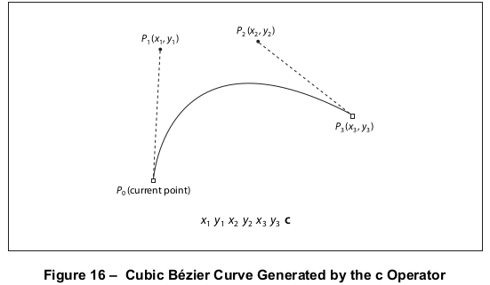
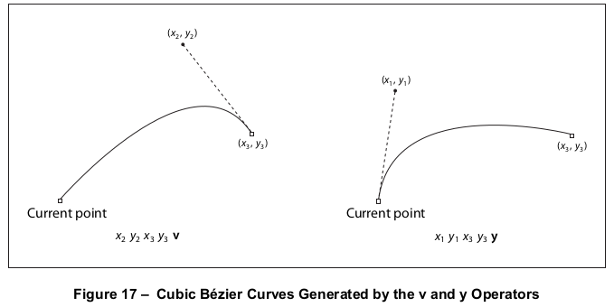
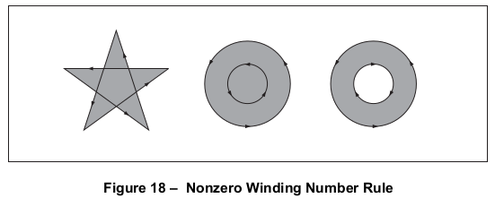
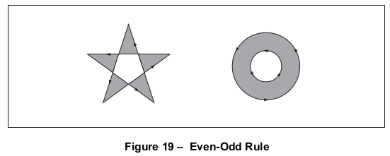

# 8.5 路径构建与绘制

**Path Construction and Painting**

## 8.5.1 概述

**General**

=== "中文"

    路径定义了各种形状、轨迹和区域。它们被用来绘制线条、定义填充区域的形状，并指定裁剪其他图形的边界。图形状态应包括当前的剪贴路径，该路径定义了当前页面的剪贴边界。在每个页面开始时，剪贴路径将被初始化为包括整个页面。
    
    路径由直线段和曲线段组成，它们可以相互连接，也可以是断开的。只有当两个线段连续定义，第二个线段从第一个线段结束的地方开始时，我们才说它们是“连接”的。因此，定义路径中线段的顺序是重要的。非连续线段偶然相遇或相交，不应被视为连接。
    
    !!! note "NOTE"
    
        路径由一个或多个断开的子路径组成，每个子路径包括一系列连接的线段。路径的拓扑结构不受限制：它可以是凹形或凸形，可能包含多个表示不相连区域的子路径，并且可以任意方式自相交。
    
    **h** 操作符明确地将子路径的末端连接回其起始点；这样的子路径被称为“封闭”的。没有明确封闭的子路径被称为“开放”的。
    
    如[8.2]节“图形对象”中所讨论的，路径对象由一系列构造路径的操作符定义，后跟一个或多个绘制路径或将其用作剪贴边界的操作符。PDF路径操作符分为三类：
    
    - 路径构造操作符([8.5.2]，“路径构造操作符”)定义路径的几何形状。通过顺序应用一个或多个这些操作符来构建路径。
    - 路径绘制操作符([8.5.3]，“路径绘制操作符”)结束路径对象，通常会导致对象以多种方式之一在当前页面上绘制。
    - 剪贴路径操作符([8.5.4]，“剪贴路径操作符”)，在路径绘制操作符之前立即调用，导致路径对象也用于裁剪后续的图形对象。

=== "英文"

    *Paths* define shapes, trajectories, and regions of all sorts. They shall be used to draw lines, define the shapes of filled areas, and specify boundaries for clipping other graphics. The graphics state shall include a current *clipping path* that shall define the clipping boundary for the current page. At the beginning of each page, the clipping path shall be initialized to include the entire page.
    
    A path shall be composed of straight and curved line segments, which may connect to one another or may be disconnected. A pair of segments shall be said to *connect* only if they are defined consecutively, with the second segment starting where the first one ends. Thus, the order in which the segments of a path are defined shall be significant. Nonconsecutive segments that meet or intersect fortuitously shall not be considered to connect.
    
    !!! note "NOTE"
    
        A path is made up of one or more disconnected *subpaths*, each comprising a sequence of connected segments. The topology of the path is unrestricted: it may be concave or convex, may contain multiple subpaths representing disjoint areas, and may intersect itself in arbitrary ways.
    
    The **h** operator explicitly shall connect the end of a subpath back to its starting point; such a subpath is said to
    be *closed*. A subpath that has not been explicitly closed is said to be *open*.
    
    As discussed in [8.2], "Graphics Objects", a path object is defined by a sequence of operators to construct the path, followed by one or more operators to paint the path or to use it as a clipping boundary. PDF path operators fall into three categories:
    
    - *Path construction operators* ([8.5.2], "Path Construction Operators") define the geometry of a path. A path is constructed by sequentially applying one or more of these operators.
    - *Path-painting operators* ([8.5.3], "Path-Painting Operators") end a path object, usually causing the object to be painted on the current page in any of a variety of ways.
    - *Clipping path operators* ([8.5.4], "Clipping Path Operators"), invoked immediately before a path-painting operator, cause the path object also to be used for clipping of subsequent graphics objects.

## 8.5.2 路径构造运算符

**Path Construction Operators**

### 8.5.2.1 概述

**General**

=== "中文"

    页面描述应以空路径开始，并通过调用一个或多个路径构造操作符来添加线段，从而构建其定义。路径构造操作符可以按任何顺序调用，但调用的第一个操作符应为 **m** 或 **re** 以开始一个新的子路径。路径定义可以通过应用路径绘制操作符如 **S**、**f** 或 **b**（见[8.5.3]，“路径绘制操作符”）来结束；这个操作符前面可以选择性地加上剪贴路径操作符 **W** 或 **W**（见[8.5.4]，“剪贴路径操作符”）。
    
    !!! note "NOTE"
    
        请注意，路径构造操作符不会在页面上放置任何标记；只有绘制操作符才会这样做。直到应用了路径绘制操作符，路径定义才算完成。
    
    当前正在构建的路径称为*当前路径*。在PDF中（与PostScript不同），当前路径*不是*图形状态的一部分，也不会随着其他图形状态参数一起保存和恢复。PDF路径应是严格内部对象，没有显式表示。当前路径被绘制后，它就不再被定义了；直到使用 **m** 或 **re** 操作符开始一个新的路径之前，都没有当前路径。
    
    最近添加到当前路径的线段的尾端点称为当前点。如果当前路径为空，则当前点未定义。大多数添加线段到当前路径的操作符都从当前点开始；如果当前点未定义，将产生错误。
    
    [表59](#table59) 显示了路径构造操作符。所有操作数都应为表示用户空间中坐标的数字。

    <table id="table59" markdown="span">
        <caption>**Table 59 – 路径构造操作符**</caption>
        <thead>
            <tr>
                <th>**Operands**</th>
                <th>**Operator**</th>
                <th>**Description**</th>
            </tr>
        </thead>
        <tbody>
            <tr>
                <td>*x y*</td>
                <td>**m**</td>
                <td>通过将当前点移动到坐标*(x, y)*来开始一个新的子路径，不绘制任何连接线段。如果当前路径中的上一个路径构造操作符也是**m**，则新的**m**将覆盖它；先前的**m**操作在路径中不会留下任何痕迹。
                </td>
            </tr>
            <tr>
                <td>*x y*</td>
                <td>**l** (lowercase **L**)</td>
                <td>从当前点到点(*x, y*)绘制一条直线段，并将其附加到当前路径。新的当前点将是(*x, y*)。
                </td>
            </tr>
            <tr>
                <td>$x_1 y_1 x_2 y_2 x_3 y_3$</td>
                <td>**c**</td>
                <td>将一条三次贝塞尔曲线附加到当前路径。该曲线从当前点延伸到点$(x_3 , y_3)$，使用$(x_1 , y_1)$和$(x_2 , y_2)$作为贝塞尔控制点（见[8.5.2.2]，“三次贝塞尔曲线”）。新的当前点将是$(x_3 , y_3)$。
                </td>
            </tr>
            <tr>
                <td>$x_2 y_2 x_3 y_3$</td>
                <td>**v**</td>
                <td>将一条三次贝塞尔曲线附加到当前路径。该曲线从当前点延伸到点$(x_3 , y_3)$，使用当前点和$(x_2 , y_2)$作为贝塞尔控制点（见[8.5.2.2]，“三次贝塞尔曲线”）。新的当前点将是$(x_3 , y_3)$。
                </td>
            </tr>
            <tr>
                <td>$x_1 y_1 x_3 y_3$</td>
                <td>**y**</td>
                <td>将一条三次贝塞尔曲线附加到当前路径。该曲线从当前点延伸到点$(x_3 , y_3)$，使用$(x_1 , y_1)$和$(x_3 , y_3)$作为贝塞尔控制点（见[8.5.2.2]，“三次贝塞尔曲线”）。新的当前点将是$(x_3 , y_3)$。
                </td>
            </tr>
            <tr>
                <td>—</td>
                <td>**h**</td>
                <td>通过从当前点到子路径起始点绘制一条直线段来关闭当前子路径。如果当前子路径已经关闭，**h**将不执行任何操作。  此操作符终止当前子路径。向当前路径附加另一个线段将开始一个新的子路径，即使新线段从**h**操作达到的端点开始。
                </td>
            </tr>
            <tr>
                <td>*x y width height*</td>
                <td>*re*</td>
                <td>将一个矩形作为完整的子路径附加到当前路径，其左下角为(x, y)，尺寸为用户空间中的宽度和*height*。操作   
                *x y width height re*   
                等同于   
                *x y m* 
                *( x + width ) y |*  
                *( x + width ) ( y + height ) |*  
                *x ( y + height ) |*  
                *h*
                </td>
            </tr>
        </tbody>
    </table>

=== "英文"

    A page description shall begin with an empty path and shall build up its definition by invoking one or more path construction operators to add segments to it. The path construction operators may be invoked in any sequence, but the first one invoked shall be **m** or **re** to begin a new subpath. The path definition may conclude with the application of a path-painting operator such as **S**, **f**, or **b** (see [8.5.3], "Path-Painting Operators"); this operator may optionally be preceded by one of the clipping path operators **W** or **W\*** ([8.5.4], "Clipping Path Operators").
    
    !!! note "NOTE"
    
        Note that the path construction operators do not place any marks on the page; only the painting operators do that. A path definition is not complete until a path-painting operator has been applied to it.
    
    The path currently under construction is called the *current path*. In PDF (unlike PostScript), the current path is *not* part of the graphics state and is not saved and restored along with the other graphics state parameters. PDF paths shall be strictly internal objects with no explicit representation. After the current path has been painted, it shall become no longer defined; there is then no current path until a new one is begun with the **m** or **re** operator.
    
    The trailing endpoint of the segment most recently added to the current path is referred to as the current point. If the current path is empty, the current point shall be undefined. Most operators that add a segment to the current path start at the current point; if the current point is undefined, an error shall be generated.
    
    [Table 59](#table59) shows the path construction operators. All operands shall be numbers denoting coordinates in user space.
        
    <table id="table59" markdown="span">
        <caption>**Table 59 – Path Construction Operators**</caption>
        <thead>
            <tr>
                <th>**Operands**</th>
                <th>**Operator**</th>
                <th>**Description**</th>
            </tr>
        </thead>
        <tbody>
            <tr>
                <td>*x y*</td>
                <td>**m**</td>
                <td>Begin a new subpath by moving the current point to coordinates *(x, y)*, omitting any connecting line segment. If the previous path construction operator in the current path was also **m**, the new **m** overrides it; no vestige of the previous **m** operation remains in the path.
                </td>
            </tr>
            <tr>
                <td>*x y*</td>
                <td>**l** (lowercase **L**)</td>
                <td>Append a straight line segment from the current point to the point (*x, y*). The new current point shall be (*x, y*).
                </td>
            </tr>
            <tr>
                <td>$x_1 y_1 x_2 y_2 x_3 y_3$</td>
                <td>**c**</td>
                <td>Append a cubic Bézier curve to the current path. The curve shall extend from the current point to the point $(x_3 , y_3)$, using $(x_1 , y_1)$ and $(x_2 , y_2)$ as the Bézier control points (see [8.5.2.2], "Cubic Bézier Curves"). The new current point shall be $(x_3 , y_3)$.
                </td>
            </tr>
            <tr>
                <td>$x_2 y_2 x_3 y_3$</td>
                <td>**v**</td>
                <td>Append a cubic Bézier curve to the current path. The curve shall extend from the current point to the point $(x_3 , y_3)$, using the current point and $(x_2 , y_2)$ as the Bézier control points (see [8.5.2.2], "Cubic Bézier Curves"). The new current point shall be $(x_3 , y_3)$.
                </td>
            </tr>
            <tr>
                <td>$x_1 y_1 x_3 y_3$</td>
                <td>**y**</td>
                <td>Append a cubic Bézier curve to the current path. The curve shall extend from the current point to the point $(x_3 , y_3)$, using $(x_1 , y_1)$ and $(x_3 , y_3)$ as the Bézier control points (see [8.5.2.2], "Cubic Bézier Curves"). The new current point shall be $(x_3 , y_3)$.
                </td>
            </tr>
            <tr>
                <td>—</td>
                <td>**h**</td>
                <td>Close the current subpath by appending a straight line segment from the current point to the starting point of the subpath. If the current subpath is already closed, **h** shall do nothing.  
                    This operator terminates the current subpath. Appending another segment to the current path shall begin a new subpath, even if the new segment begins at the endpoint reached by the **h** operation.
                </td>
            </tr>
            <tr>
                <td>*x y width height*</td>
                <td>*re*</td>
                <td>Append a rectangle to the current path as a complete subpath, with lower-left corner (x, y) and dimensions width and *height* in user space. The operation   
                *x y width height re*   
                is equivalent to   
                *x y m* 
                *( x + width ) y |*  
                *( x + width ) ( y + height ) |*  
                *x ( y + height ) |*  
                *h*
                </td>
            </tr>
        </tbody>
    </table>

### 8.5.2.2 三次贝塞尔曲线

**8.5.2.2 Cubic Bézier Curves**

=== "中文"

    曲线路径段应被指定为三次贝塞尔曲线。这些曲线由四个点定义：两个端点（当前点 $P_0$ 和最终点 $P_3$）以及两个控制点 $P_1$ 和 $P_2$。给定这四个点的坐标，曲线将通过在以下方程中变化参数 *t* 从 0.0 到 1.0 来生成：
    
    $$R(t) = (1 - t )^3P_0 + 3t(1-t)^2P_1 + 3t^2(1-t)P_2 + t^3P_3$$
    
    当 t = 0.0 时，函数 R(t) 的值与当前点 $P_0$ 重合；当 $t = 1.0$ 时，R(t) 与最终点 $P_3$ 重合。中间值的 t 沿着曲线生成中间点。曲线通常不通过两个控制点 $P_1$ 和 $P_2$。
    
    !!! note "NOTE 1"
    
        三次贝塞尔曲线有两个有用的属性：
        
        - 曲线可以非常快速地分割成较小的片段以进行快速渲染。
        - 曲线被包含在定义曲线的四个点的凸包内，最容易被想象为通过拉伸橡皮筋围绕在四个点的外侧得到的多边形。这个属性允许快速测试曲线是否完全位于可见区域之外，因此不需要渲染。
    
    !!! note "NOTE 2"
    
        参考文献列出了多本更深入描述三次贝塞尔曲线的书籍。
    
    最通用的 PDF 操作符用于构建曲线路径段是 **c** 操作符，它明确指定了点 $P_1$ , $P_2$ 和 $P_3$ 的坐标，如图 16 在 [附录 L](../a12.md) 中所示。（起始点 $P_0$ 由当前点隐式定义。）
    
    
    
    还有两个操作符 **v** 和 **y**，每个都隐式地指定了一个控制点（见图 17 在 [附录 L](../a12.md)）。在这两种情况下，应该提供曲线的一个控制点和最终点作为操作数；另一个控制点将被隐含：
    
    - 对于 **v** 操作符，第一个控制点将与曲线的初始点重合。
    - 对于 **y** 操作符，第二个控制点将与曲线的最终点重合。
    
    

=== "英文"

    Curved path segments shall be specified as cubic Bézier curves. Such curves shall be defined by four points: the two endpoints (the current point $P_0$ and the final point $P_3$ ) and two *control points* $P_1$ and $P_2$ . Given the coordinates of the four points, the curve shall be generated by varying the parameter *t* from 0.0 to 1.0 in the following equation:
    
    $$R(t) = (1 - t )^3P_0 + 3t(1-t)^2P_1 + 3t^2(1-t)P_2 + t^3P_3$$
    
    When t = 0.0, the value of the function R (t) coincides with the current point $P_0$ ; when *t* = 1.0, R(*t*) coincides with the final point $P_3$ . Intermediate values of *t* generate intermediate points along the curve. The curve does not, in general, pass through the two control points $P_1$ and $P_2$ .
    
    !!! note "NOTE 1"
        
        Cubic Bézier curves have two useful properties:
        
        The curve can be very quickly split into smaller pieces for rapid rendering.
        
        The curve is contained within the convex hull of the four points defining the curve, most easily visualized as the polygon obtained by stretching a rubber band around the outside of the four points. This property allows rapid testing of whether the curve lies completely outside the visible region, and hence does not have to be rendered.
    
    !!! note "NOTE 2"
    
        The Bibliography lists several books that describe cubic Bézier curves in more depth.
    
    The most general PDF operator for constructing curved path segments is the **c** operator, which specifies the coordinates of points $P_1$ , $P_2$ , and $P_3$ explicitly, as shown in Figure 16 in [Annex L](../a12.md). (The starting point, $P_0$ , is defined implicitly by the current point.)
    
    
    
    Two more operators, **v** and **y**, each specify one of the two control points implicitly (see Figure 17 in [Annex L](../a12.md)). In both of these cases, one control point and the final point of the curve shall be supplied as operands; the other control point shall be implied:
    
    - For the v operator, the first control point shall coincide with initial point of the curve.
    - For the y operator, the second control point shall coincide with final point of the curve.
    
    

## 8.5.3 路径绘制运算符

**8.5.3 Path-Painting Operators**

### 8.5.3.1 概述

**8.5.3.1 General**

=== "中文"
    
    路径绘制操作符结束了一个路径对象，并按照操作符指定的方式在当前页面上进行绘制。主要的路径绘制操作符是 **S**（描边）和 **f**（填充）。这些操作符的变体将描边和填充结合在单一操作中，或应用不同的规则来确定要填充的区域。表60列出了所有的路径绘制操作符。    
            
    <table id="table60" markdown="span">
        <caption>**Table 60 – 路径绘制操作符**</caption>
        <thead>
            <tr>
                <th>**Operands**</th>
                <th>**Operator**</th>
                <th>**Description**</th>
            </tr>
        </thead>
        <tbody>
            <tr>
                <td>—</td>
                <td>**s**</td>
                <td>关闭并描边路径。此操作符应与序列 h S 具有相同效果。
                </td>
            </tr>
            <tr>
                <td>—</td>
                <td>**f**</td>
                <td>使用非零绕组数规则填充路径（见[8.5.3.3.2]，“非零绕组数规则”）。所有开放的子路径将在填充前隐式关闭。
                </td>
            </tr>
            <tr>
                <td>—</td>
                <td>**F**</td>
                <td>与**f**等效；仅包含兼容性。尽管PDF阅读器应用程序应能够接受此操作符，但PDF编写器应用程序应使用**f**。
                </td>
            </tr>
            <tr>
                <td>—</td>
                <td>**f\***</td>
                <td>使用偶数-奇数规则填充路径（见[8.5.3.3.3]，“偶数-奇数规则”）。 
                </td>
            </tr>
            <tr>
                <td>—</td>
                <td>**B**</td>
                <td>使用非零绕组数规则确定要填充的区域，填充并描边路径。此操作符应产生与构造两个相同的路径对象，第一个用**f**绘制，第二个用**S**绘制相同的结果。
    
    !!! note "NOTE"
    
        操作的填充和描边部分参考了几个图形状态参数的不同值，例如当前颜色。另见[11.7.4.4]，“特殊路径绘制考虑”。
                </td>
            </tr>
            <tr>
                <td>—</td>
                <td>**B\***</td>
                <td>使用偶数-奇数规则确定要填充的区域，填充并描边路径。此操作符应产生与**B**相同的结果，除了路径是用**f***代替**f**填充的。另见[11.7.4.4]，“特殊路径绘制考虑”。
                </td>
            </tr>
            <tr>
                <td>—</td>
                <td>**b**</td>
                <td>使用非零绕组数规则确定要填充的区域，关闭、填充并描边路径。此操作符应与序列h B具有相同效果。另见[11.7.4.4]，“特殊路径绘制考虑”。
                </td>
            </tr>
            <tr>
                <td>—</td>
                <td>**b\***</td>
                <td>使用偶数-奇数规则确定要填充的区域，关闭、填充并描边路径。此操作符应与序列 h B* 具有相同效果。另见[11.7.4.4]，“特殊路径绘制考虑”。
                </td>
            </tr>
            <tr>
                <td>—</td>
                <td>**n**</td>
                <td>结束路径对象，不填充也不描边。此操作符应是路径绘制无操作，主要用于更改当前剪贴路径的副作用（见[8.5.4]，“剪贴路径操作符”）。
                </td>
            </tr>
        </tbody>
    </table>

=== "英文"
    
    The path-painting operators end a path object, causing it to be painted on the current page in the manner that the operator specifies. The principal path-painting operators shall be **S** (*for stroking*) and **f** (*for filling*). Variants of these operators combine stroking and filling in a single operation or apply different rules for determining the area to be filled. Table 60 lists all the path-painting operators.
    
            
    <table id="table60" markdown="span">
        <caption>**Table 60 – Path-Painting Operators**</caption>
        <thead>
            <tr>
                <th>**Operands**</th>
                <th>**Operator**</th>
                <th>**Description**</th>
            </tr>
        </thead>
        <tbody>
            <tr>
                <td>—</td>
                <td>**s**</td>
                <td>Close and stroke the path. This operator shall have the same effect as the sequence h S.
                </td>
            </tr>
            <tr>
                <td>—</td>
                <td>**f**</td>
                <td>Fill the path, using the nonzero winding number rule to determine the region to fill (see [8.5.3.3.2], "Nonzero Winding Number Rule"). Any subpaths that are open shall be implicitly closed before being filled.
                </td>
            </tr>
            <tr>
                <td>—</td>
                <td>**F**</td>
                <td>Equivalent to **f**; included only for compatibility. Although PDF reader applications shall be able to accept this operator, PDF writer applications should use **f** instead.
                </td>
            </tr>
            <tr>
                <td>—</td>
                <td>**f\***</td>
                <td>Fill the path, using the even-odd rule to determine the region to fill (see [8.5.3.3.3], "Even-Odd Rule").
                </td>
            </tr>
            <tr>
                <td>—</td>
                <td>**B**</td>
                <td>Fill and then stroke the path, using the nonzero winding number rule to determine the region to fill. This operator shall produce the same result as constructing two identical path objects, painting the first with **f** and the second with **S**.
    
    !!! note "NOTE"
    
        The filling and stroking portions of the operation consult different values of several graphics state parameters, such as the current colour. See also [11.7.4.4], "Special Path-Painting Considerations".
                </td>
            </tr>
            <tr>
                <td>—</td>
                <td>**B\***</td>
                <td>Fill and then stroke the path, using the even-odd rule to determine the region to fill. This operator shall produce the same result as **B**, except that the path is filled as if with **f\*** instead of **f**. See also [11.7.4.4], "Special Path-Painting Considerations".
                </td>
            </tr>
            <tr>
                <td>—</td>
                <td>**b**</td>
                <td>Close, fill, and then stroke the path, using the nonzero winding number rule to determine the region to fill. This operator shall have the same effect as the sequence h B. See also [11.7.4.4], "Special Path-Painting Considerations".
                </td>
            </tr>
            <tr>
                <td>—</td>
                <td>**b\***</td>
                <td>Close, fill, and then stroke the path, using the even-odd rule to determine the region to fill. This operator shall have the same effect as the sequence h B*. See also [11.7.4.4], "Special Path-Painting Considerations".
                </td>
            </tr>
            <tr>
                <td>—</td>
                <td>**n**</td>
                <td>End the path object without filling or stroking it. This operator shall be a path- painting no-op, used primarily for the side effect of changing the current clipping path (see [8.5.4], "Clipping Path Operators").
                </td>
            </tr>
        </tbody>
    </table>

### 8.5.3.2 描边

**8.5.3.2 Stroking**

=== "中文"

    **S** 操作符将沿着当前路径绘制线条。描边的线条将跟随路径中的每条直线或曲线段，在段的中心，两侧与之平行。路径的每个子路径都将被单独处理。
    
    **S** 操作符的结果将取决于图形状态中各种参数的当前设置（有关这些参数的更多信息，请参见[8.4]，“图形状态”）：
    
    - 描边线条的宽度由当前线宽参数确定（[8.4.3.2]，“线宽”）。
    - 线条的颜色或图案由当前描边操作的颜色和颜色空间决定。
    - 线条可以实心绘制，也可以按照当前虚线模式绘制，该模式可以是点状、短划线或虚线（见[8.4.3.6]，“虚线模式”）。
    - 如果子路径是开放的，未连接的端点将根据当前线帽样式进行处理，该样式可以是平头、圆头或方头（见[8.4.3.3]，“线帽样式”）。
    - 每当两个连续的线段连接在一起时，它们之间的连接处将根据当前线连接样式进行处理，该样式可以是斜接、圆接或斜切（见[8.4.3.4]，“线连接样式”）。斜接将受到当前斜接限制的约束（见[8.4.3.5]，“斜接限制”）。
    
    未连接的线段在相遇或相交的点上不会接受特殊处理。特别是，使用显式的l操作符来呈现关闭子路径的外观，而不是使用**h**，可能会导致一个凌乱的角落，因为应用了线帽而不是线连接。
    
    - “描边调整”参数（PDF 1.2）指定坐标和线宽应自动调整，以产生均匀厚度的描边，尽管存在光栅化效果（见[10.6.5]，“自动描边调整”）。
    
    如果子路径是退化的（由单个点的闭路径或两个或多个坐标相同的点组成），则只有当指定了圆线帽时，**S** 操作符才会绘制它，产生一个以单点为中心的实心圆。如果指定了平头或伸出方头线帽，**S** 将不产生输出，因为线帽的方向将是不确定的。这条规则仅适用于正在描边的路径中的零长度子路径，不适用于虚线模式中的零长度虚线。在后一种情况下，线帽总是被绘制，因为它们的方向由底层路径的方向决定。由尾随**m**操作符指定的单点开放子路径将不产生输出。
    
=== "英文"

    The **S** operator shall paint a line along the current path. The stroked line shall follow each straight or curved segment in the path, centred on the segment with sides parallel to it. Each of the path’s subpaths shall be treated separately.
    
    The results of the **S** operator shall depend on the current settings of various parameters in the graphics state (see [8.4], "Graphics State", for further information on these parameters):
    
    - The width of the stroked line shall be determined by the current line width parameter ([8.4.3.2], "Line Width").
    - The colour or pattern of the line shall be determined by the current colour and colour space for stroking operations.
    - The line may be painted either solid or with a dash pattern, as specified by the current line dash pattern (see [8.4.3.6], "Line Dash Pattern").
    - If a subpath is open, the unconnected ends shall be treated according to the current line cap style, which may be butt, rounded, or square (see [8.4.3.3], "Line Cap Style").
    - Wherever two consecutive segments are connected, the joint between them shall be treated according to the current line join style, which may be mitered, rounded, or beveled (see [8.4.3.4], "Line Join Style"). Mitered joins shall be subject to the current miter limit (see [8.4.3.5], "Miter Limit").
    
    Points at which unconnected segments happen to meet or intersect receive no special treatment. In particular, using an explicit l operator to give the appearance of closing a subpath, rather than using **h**, may result in a messy corner, because line caps are applied instead of a line join.
    
    - The *stroke adjustment* parameter (PDF 1.2) specifies that coordinates and line widths be adjusted automatically to produce strokes of uniform thickness despite rasterization effects (see [10.6.5], "Automatic Stroke Adjustment").
    
    If a subpath is degenerate (consists of a single-point closed path or of two or more points at the same coordinates), the **S** operator shall paint it only if round line caps have been specified, producing a filled circle centered at the single point. If butt or projecting square line caps have been specified, **S** shall produce no output, because the orientation of the caps would be indeterminate. This rule shall apply only to zero-length subpaths of the path being stroked, and not to zero-length dashes in a dash pattern. In the latter case, the line caps shall always be painted, since their orientation is determined by the direction of the underlying path. A single-point open subpath (specified by a trailing **m** operator) shall produce no output.

### 8.5.3.3 填充

**8.5.3.3 Filling**

#### 8.5.3.3.1 概述

**8.5.3.3.1 General**

=== "中文"

    The **f** operator shall use the current nonstroking colour to paint the entire region enclosed by the current path. If the path consists of several disconnected subpaths, **f** shall paint the insides of all subpaths, considered together. Any subpaths that are open shall be implicitly closed before being filled.
    
    If a subpath is degenerate (consists of a single-point closed path or of two or more points at the same coordinates), **f** shall paint the single device pixel lying under that point; the result is device-dependent and not generally useful. A single-point open subpath (specified by a trailing m operator) shall produce no output.
    
    For a simple path, it is intuitively clear what region lies inside. However, for a more complex path, it is not always obvious which points lie inside the path. For more detailed information, see [10.6.4], “Scan Conversion Rules“.
    
    !!! info **EXAMPLE**
    
        A path that intersects itself or has one subpath that encloses another.
    
    The path machinery shall use one of two rules for determining which points lie inside a path: the nonzero winding number rule and the even-odd rule, both discussed in detail below. The nonzero winding number rule is more versatile than the even-odd rule and shall be the standard rule the **f** operator uses. Similarly, the **W** operator shall use this rule to determine the inside of the current clipping path. The even-odd rule is occasionally useful for special effects or for compatibility with other graphics systems; the **f\*** and **W\*** operators invoke this rule.

=== "英文"

    The **f** operator shall use the current nonstroking colour to paint the entire region enclosed by the current path. If the path consists of several disconnected subpaths, **f** shall paint the insides of all subpaths, considered together. Any subpaths that are open shall be implicitly closed before being filled.
    
    If a subpath is degenerate (consists of a single-point closed path or of two or more points at the same coordinates), **f** shall paint the single device pixel lying under that point; the result is device-dependent and not generally useful. A single-point open subpath (specified by a trailing m operator) shall produce no output.
    
    For a simple path, it is intuitively clear what region lies inside. However, for a more complex path, it is not always obvious which points lie inside the path. For more detailed information, see [10.6.4], “Scan Conversion Rules“.
    
    !!! info **EXAMPLE**
    
        A path that intersects itself or has one subpath that encloses another.
    
    The path machinery shall use one of two rules for determining which points lie inside a path: the nonzero winding number rule and the even-odd rule, both discussed in detail below. The nonzero winding number rule is more versatile than the even-odd rule and shall be the standard rule the **f** operator uses. Similarly, the **W** operator shall use this rule to determine the inside of the current clipping path. The even-odd rule is occasionally useful for special effects or for compatibility with other graphics systems; the **f\*** and **W\*** operators invoke this rule.

#### 8.5.3.3.2 非零缠绕数规则

**8.5.3.3.2 Nonzero Winding Number Rule**

=== "中文"

    The *nonzero winding number rule* determines whether a given point is inside a path by conceptually drawing a ray from that point to infinity in any direction and then examining the places where a segment of the path crosses the ray. Starting with a count of 0, the rule adds 1 each time a path segment crosses the ray from left to right and subtracts 1 each time a segment crosses from right to left. After counting all the crossings, if the result is 0, the point is outside the path; otherwise, it is inside.
    
    The method just described does not specify what to do if a path segment coincides with or is tangent to th chosen ray. Since the direction of the ray is arbitrary, the rule simply chooses a ray that does not encounte such problem intersections.
    
    For simple convex paths, the nonzero winding number rule defines the inside and outside as one would intuitively expect. The more interesting cases are those involving complex or self-intersecting paths like the ones shown in Figure 18 in [Annex L](../a12.md). For a path consisting of a five-pointed star, drawn with five connected straight line segments intersecting each other, the rule considers the inside to be the entire area enclosed by the star, including the pentagon in the centre. For a path composed of two concentric circles, the areas enclosed by both circles are considered to be inside, provided that both are drawn in the same direction. If the circles are drawn in opposite directions, only the doughnut shape between them is inside, according to the rule; the doughnut hole is outside.
    
    

=== "英文"

    The *nonzero winding number rule* determines whether a given point is inside a path by conceptually drawing a ray from that point to infinity in any direction and then examining the places where a segment of the path crosses the ray. Starting with a count of 0, the rule adds 1 each time a path segment crosses the ray from left to right and subtracts 1 each time a segment crosses from right to left. After counting all the crossings, if the result is 0, the point is outside the path; otherwise, it is inside.
    
    The method just described does not specify what to do if a path segment coincides with or is tangent to th chosen ray. Since the direction of the ray is arbitrary, the rule simply chooses a ray that does not encounte such problem intersections.
    
    For simple convex paths, the nonzero winding number rule defines the inside and outside as one would intuitively expect. The more interesting cases are those involving complex or self-intersecting paths like the ones shown in Figure 18 in [Annex L](../a12.md). For a path consisting of a five-pointed star, drawn with five connected straight line segments intersecting each other, the rule considers the inside to be the entire area enclosed by the star, including the pentagon in the centre. For a path composed of two concentric circles, the areas enclosed by both circles are considered to be inside, provided that both are drawn in the same direction. If the circles are drawn in opposite directions, only the doughnut shape between them is inside, according to the rule; the doughnut hole is outside.
    
    

#### 8.5.3.3.3 奇偶规则

**8.5.3.3.3 Even-Odd Rule**

=== "中文"

    An alternative to the nonzero winding number rule is the *even-odd rule*. This rule determines whether a point is inside a path by drawing a ray from that point in any direction and simply counting the number of path segments that cross the ray, regardless of direction. If this number is odd, the point is inside; if even, the point is outside. This yields the same results as the nonzero winding number rule for paths with simple shapes, but produces different results for more complex shapes.
    
    Figure 19 shows the effects of applying the even-odd rule to complex paths. For the five-pointed star, the rule considers the triangular points to be inside the path, but not the pentagon in the centre. For the two concentric circles, only the doughnut shape between the two circles is considered inside, regardless of the directions in which the circles are drawn.
    
    

=== "英文"

    An alternative to the nonzero winding number rule is the *even-odd rule*. This rule determines whether a point is inside a path by drawing a ray from that point in any direction and simply counting the number of path segments that cross the ray, regardless of direction. If this number is odd, the point is inside; if even, the point is outside. This yields the same results as the nonzero winding number rule for paths with simple shapes, but produces different results for more complex shapes.
    
    Figure 19 shows the effects of applying the even-odd rule to complex paths. For the five-pointed star, the rule considers the triangular points to be inside the path, but not the pentagon in the centre. For the two concentric circles, only the doughnut shape between the two circles is considered inside, regardless of the directions in which the circles are drawn.
    
    

## 8.5.4 剪切路径操作符

**8.5.4 Clipping Path Operators**

=== "中文"

    图形状态应包含一个“当前剪贴路径”，它限制了绘画操作符影响页面的区域。这条路径的封闭子路径定义了可以绘制的区域。落在这个区域内的标记将被应用到页面上；落在区域外的则不会。子条款[8.5.3.3]，“填充”详细讨论了什么被认为是路径内部。
    
    在透明成像模型（PDF 1.4）的上下文中，当前剪贴路径限制了对象的形状（见[11.2]，“透明度概述”）。有效形状是对象固有形状与剪贴路径的交集；源形状值在此交外界线之外应为0.0。同样，透明度组的形状（定义为其组成对象形状的联合）将受到在绘制每个对象时生效的剪贴路径的影响，以及在组的结果被绘制到其背景上时生效的剪贴路径的影响。
    
    初始剪贴路径应包括整个页面。剪贴路径操作符（**W** 或 **W**，在[表61](#table61)中显示）可能出现在最后一个路径构造操作符之后和终止路径对象的路径绘制操作符之前。尽管剪贴路径操作符出现在绘制操作符之前，但它在出现的地方不会改变剪贴路径。相反，它将修改后续绘制操作符的效果。在路径被绘制之后，图形状态中的剪贴路径应设置为当前剪贴路径与新构建路径的交集。
                
    <table id="table61" markdown="span">
        <caption>**Table 61 – 剪贴路径操作符**</caption>
        <thead>
            <tr>
                <th>**操作数**</th>
                <th>**操作符**</th>
                <th>**描述**</th>
            </tr>
        </thead>
        <tbody>
            <tr>
                <td>—</td>
                <td>**W**</td>
                <td>通过使用非零绕组数规则确定哪些区域位于剪贴路径内，将当前剪贴路径与当前路径相交，从而修改当前剪贴路径。
                </td>
            </tr>
            <tr>
                <td>—</td>
                <td>**W\***</td>
                <td>通过使用偶数-奇数规则确定哪些区域位于剪贴路径内，将当前剪贴路径与当前路径相交，从而修改当前剪贴路径。
                </td>
            </tr>
        </tbody>
    </table>
    
    !!! note "NOTE 1"
    
        除了路径对象外，文本对象也可以用于剪贴；见[9.3.6]，“文本渲染模式”。
    
    **n** 操作符（见[表60](#table60)）是一个无效的路径绘制操作符；它不会导致在页面上放置任何标记，但可以与剪贴路径操作符一起使用来建立一个新的剪贴路径。也就是说，在构建路径之后，W n序列将该路径与当前剪贴路径相交，并建立一个新的剪贴路径。
    
    !!! note "NOTE 2"
    
        没有办法扩大当前剪贴路径或设置一个不参考当前剪贴路径的新剪贴路径。然而，由于剪贴路径是图形状态的一部分，其效果可以通过在一对**q**和**Q**操作符（见[8.4.2]，“图形状态栈”）之间包围剪贴路径的修改和这些对象的绘制来限定到特定的图形对象。执行**Q**操作符会导致剪贴路径恢复到在剪贴路径被修改之前由**q**操作符保存的值。

=== "英文"

    The graphics state shall contain a *current clipping path* that limits the regions of the page affected by painting operators. The closed subpaths of this path shall define the area that can be painted. Marks falling inside this area shall be applied to the page; those falling outside it shall not be. Sub-clause [8.5.3.3], "Filling" discusses precisely what shall be considered to be inside a path.
    
    In the context of the transparent imaging model (PDF 1.4), the current clipping path constrains an object’s shape (see [11.2], "Overview of Transparency"). The effective shape is the intersection of the object’s intrinsic shape with the clipping path; the source shape value shall be 0.0 outside this intersection. Similarly, the shape of a transparency group (defined as the union of the shapes of its constituent objects) shall be influenced both by the clipping path in effect when each of the objects is painted and by the one in effect at the time the group’s results are painted onto its backdrop.
    
    The initial clipping path shall include the entire page. A clipping path operator (**W** or **W\***, shown in [Table 61](#table61)) may appear after the last path construction operator and before the path-painting operator that terminates a path object. Although the clipping path operator appears before the painting operator, it shall not alter the clipping path at the point where it appears. Rather, it shall modify the effect of the succeeding painting operator. *After* the path has been painted, the clipping path in the graphics state shall be set to the intersection of the current clipping path and the newly constructed path.
            
    <table id="table61" markdown="span">
        <caption>**Table 61 – Clipping Path Operators**</caption>
        <thead>
            <tr>
                <th>**Operands**</th>
                <th>**Operator**</th>
                <th>**Description**</th>
            </tr>
        </thead>
        <tbody>
            <tr>
                <td>—</td>
                <td>**W**</td>
                <td>Modify the current clipping path by intersecting it with the current path, using the nonzero winding number rule to determine which regions lie inside the clipping path.
                </td>
            </tr>
            <tr>
                <td>—</td>
                <td>**W\***</td>
                <td>Modify the current clipping path by intersecting it with the current path, using the even-odd rule to determine which regions lie inside the clipping path.
                </td>
            </tr>
        </tbody>
    </table>
    
    !!! note "NOTE 1"
    
        In addition to path objects, text objects may also be used for clipping; see [9.3.6], "Text Rendering Mode".
    
    The **n** operator (see [Table 60](#table60)) is a no-op path-painting operator; it shall cause no marks to be placed on the page, but can be used with a clipping path operator to establish a new clipping path. That is, after a path has been constructed, the sequence W n shall intersect that path with the current clipping path and shall establish a new clipping path.
    
    !!! note "NOTE 2"
    
        There is no way to enlarge the current clipping path or to set a new clipping path without reference to the current one. However, since the clipping path is part of the graphics state, its effect can be localized to specific graphics objects by enclosing the modification of the clipping path and the painting of those objects between a pair of **q** and **Q** operators (see [8.4.2], "Graphics State Stack"). Execution of the **Q** operator causes the clipping path to revert to the value that was saved by the **q** operator before the clipping path was modified.

[8.2]: ./s2.md
[8.4]: ./s4.md
[11.2]: ../c11/s2.md
[8.4.2]: ./s4.md#842-图形状态栈
[8.5.2]: ./s5.md#852-路径构造运算符
[8.5.3]: ./s5.md#853-路径绘制运算符
[8.5.4]: ./s5.md#854-剪切路径操作符
[9.3.6]: ../c9/s3.md#936-文本渲染模式
[10.6.4]: ../c10/s6.md#1064-扫描转换规则
[10.6.5]: ../c10/s6.md#1065-自动描边调整
[8.4.3.3]: ./s4.md#8433-线帽样式
[8.4.3.4]: ./s4.md#8434-线连接样式
[8.4.3.5]: ./s4.md#8435-斜接限制
[8.4.3.6]: ./s4.md#8436-虚线样式
[8.4.3.2]: ./s4.md#8432-线宽
[8.5.2.2]: #8522-三次贝塞尔曲线
[11.7.4.4]: ../c11/s7.md#11744-特殊路径绘制注意事项
[8.5.3.3.2]: #85332-非零缠绕数规则
[8.5.3.3.3]: #85333-奇偶规则