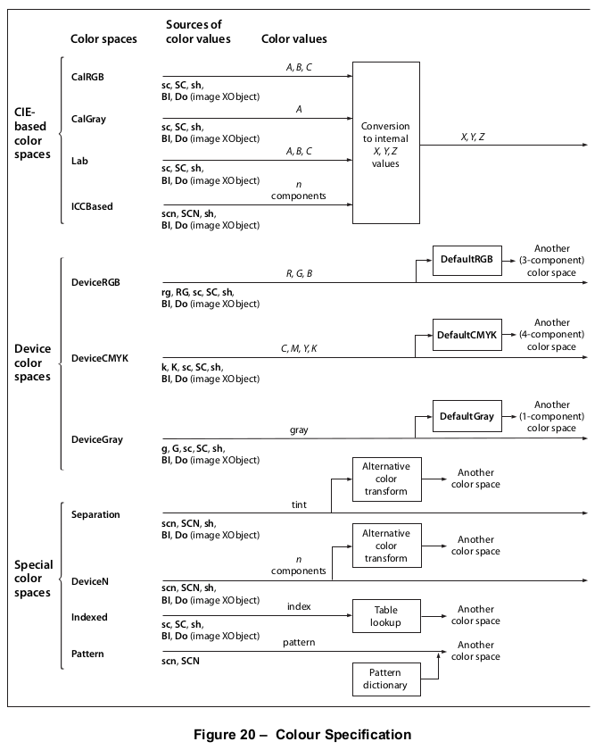
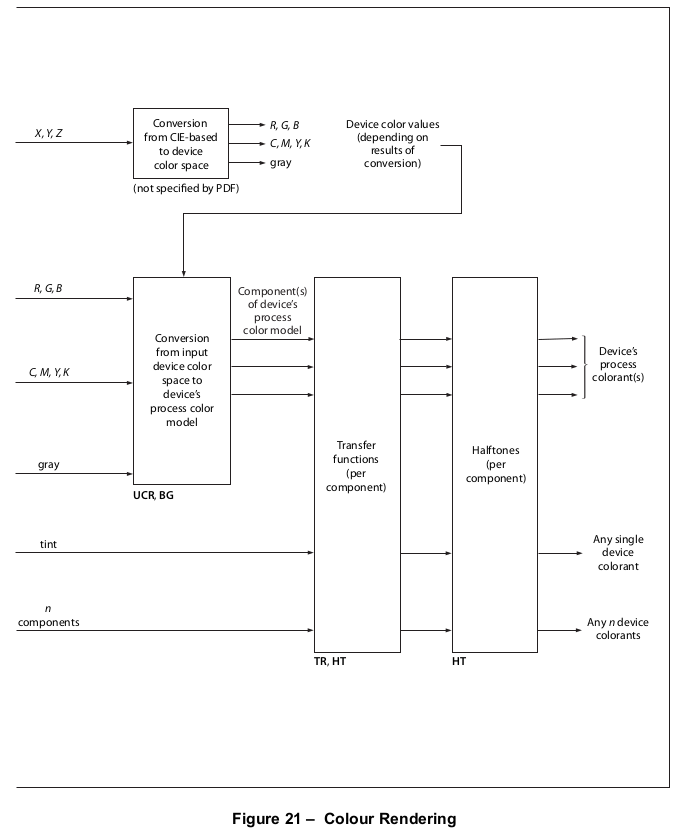
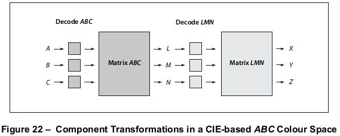
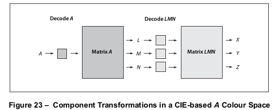

# 8.6 色彩空间

**Colour Spaces**

## 8.6.1 概述

**General**

=== "中文"

    PDF 提供了指定当前页面上要绘制的图形对象颜色的功能。颜色功能分为两个部分：
    
    - **颜色规范**。一个符合标准的编写器可以以设备无关的方式抽象指定颜色。颜色可以在各种颜色系统或颜色空间中描述。有些颜色空间与设备颜色表示相关（灰度、*RGB*、*CMYK*），其他则与人类视觉感知相关（基于CIE的）。某些特殊特性也作为颜色空间被模拟：图案、颜色映射、分色以及高保真和多色调颜色。
    
    - **颜色呈现**。一个符合标准的阅读器应通过一个多步骤过程来重现光栅输出设备上的颜色，该过程包括颜色转换、伽马校正、半色调处理和扫描转换的某种组合。这个过程的某些方面使用在PDF中指定的信息。然而，与颜色规范设施不同，颜色呈现设施是依赖于设备的，不应包含在页面描述中。
    
    图20和图21展示了PDF的（与设备无关的）颜色规范和（与设备相关的）颜色呈现设施之间的划分。本子条款描述了颜色规范特性，涵盖了PDF文档需要指定颜色的所有内容。控制颜色呈现的设施在[第10条款](../c10/index.md)，“渲染”中描述；一个符合标准的编写器应仅使用这些设施来配置或校准输出设备或实现特殊的设备依赖效果。

=== "英文"

    PDF includes facilities for specifying the colours of graphics objects to be painted on the current page. The colour facilities are divided into two parts:
    
    - *Colour specification*. A conforming writer may specify abstract colours in a device-independent way. Colours may be described in any of a variety of colour systems, or colour spaces. Some colour spaces are related to device colour representation (grayscale, *RGB*, *CMYK*), others to human visual perception (CIE- based). Certain special features are also modelled as colour spaces: patterns, colour mapping, separations, and high-fidelity and multitone colour.
    - *Colour rendering*. A conforming reader shall reproduce colours on the raster output device by a multiple- step process that includes some combination of colour conversion, gamma correction, halftoning, and scan conversion. Some aspects of this process use information that is specified in PDF. However, unlike the facilities for colour specification, the colour-rendering facilities are device-dependent and should not be included in a page description.
    
    Figure 20 and Figure 21 illustrate the division between PDF’s (device-independent) colour specification and (device-dependent) colour-rendering facilities. This sub-clause describes the colour specification features, covering everything that PDF documents need to specify colours. The facilities for controlling colour rendering are described in [clause 10](../c10/index.md), "Rendering"; a conforming writer should use these facilities only to configure or calibrate an output device or to achieve special device-dependent effects.


## 8.6.2 颜色值

**Colour Values**

=== "中文"

    如[8.5.3]“路径绘制操作符”中所述，由**f**和**S**等操作符放置在页面上的标记，其颜色应由图形状态的当前颜色参数决定。颜色值由一个或多个*颜色组件*组成，这些组件通常是数字。灰度级别由一个介于0.0（黑色）到1.0（白色）之间的数字指定。全色值可以通过多种方式指定；一种常见的方法是使用三个数值分别指定红色、绿色和蓝色组件。
    
    颜色值应根据*当前颜色空间*进行解释，这是图形状态的另一个参数。PDF内容流首先通过调用**CS**操作符（用于描边颜色）或**cs**操作符（用于非描边颜色）选择颜色空间。然后在该颜色空间内使用**SC**操作符（描边）或**sc**操作符（非描边）选择颜色值。还有一些方便的操作符——**G, g, RG, rg, K**和**k**——可以在一个步骤中同时选择颜色空间及其内的颜色值。[表74](#table74)列出了所有颜色设置操作符。
    
    采样图像（见[8.9]“图像”）根据图像对象本身指定的颜色空间来指定各个样本的颜色值。虽然这些值独立于图形状态中的当前颜色空间和颜色参数，但颜色处理的所有后续阶段应以与使用**SC**或**sc**操作符指定的颜色值完全相同的方式处理它们。

=== "英文"

    As described in [8.5.3], "Path-Painting Operators", marks placed on the page by operators such as **f** and **S** shall have a colour that is determined by the current colour parameter of the graphics state. A colour value consists of one or more *colour components*, which are usually numbers. A gray level shall be specified by a single number ranging from 0.0 (black) to 1.0 (white). Full colour values may be specified in any of several ways; a common method uses three numeric values to specify red, green, and blue components.
    
    Colour values shall be interpreted according to the *current colour space*, another parameter of the graphics state. A PDF content stream first selects a colour space by invoking the **CS** operator (for the stroking colour) or the **cs** operator (for the nonstroking colour). It then selects colour values within that colour space with the **SC** operator (stroking) or the **sc** operator (nonstroking). There are also convenience operators—**G, g, RG, rg, K**, and **k**—that select both a colour space and a colour value within it in a single step. [Table 74](#table74) lists all the colour- setting operators.
    
    Sampled images (see [8.9], "Images") specify the colour values of individual samples with respect to a colour space designated by the image object itself. While these values are independent of the current colour space and colour parameters in the graphics state, all later stages of colour processing shall treat them in exactly the same way as colour values specified with the **SC** or **sc** operator.


## 8.6.3 色彩空间系列

**Colour Space Families**

=== "中文"

    颜色空间被分类为不同的*颜色空间家族*。同一家族内的空间共享相同的一般特性；它们通过在指定空间时提供的参数值来区分。这些家族分为三个大类：
    
    - *设备颜色空间*直接指定输出设备应产生的的颜色或灰度。它们提供了多种颜色规范方法，包括灰度、*RGB*（红-绿-蓝）和*CMYK*（青-品红-黄-黑），对应于颜色空间家族**DeviceGray**、**DeviceRGB**和**DeviceCMYK**。由于这些家族中每一个都只包含一个无需额外参数的颜色空间，它们可以分别被称为**DeviceGray**、**DeviceRGB**和**DeviceCMYK**颜色空间。
    - *基于CIE的颜色空间*基于国际照明委员会（Commission Internationale de l’Éclairage）创建的国际颜色规范标准。这些空间以一种独立于任何特定输出设备特性的方式规范颜色。这一类别的色空间家族包括**CalGray**、**CalRGB**、**Lab**和**ICCBased**。这些家族中的个别颜色空间应通过包含定义空间所需参数值的字典来指定。
    - *特殊颜色空间*在底层颜色空间上增加特性或属性。它们包括用于图案、颜色映射、分色以及高保真和多色调颜色的设施。相应的颜色空间家族是**Pattern**、**Indexed**、**Separation**和**DeviceN**。这些家族中的个别颜色空间应通过额外的参数来指定。
    
    [表62](#table62)总结了PDF中的颜色空间家族。
    
    <table id="table62" markdown="span">
        <caption>**Table 62 – 色彩空间家族**</caption>
        <thead>
            <tr>
                <th>**设备**</th>
                <th>**基于CIE的**</th>
                <th>**特殊的**</th>
            </tr>
        </thead>
        <tbody>
            <tr>
                <td>**DeviceGray** (PDF 1.1)</td>
                <td>**CalGray** (PDF 1.1)</td>
                <td>**Indexed** (PDF 1.1)</td>
            </tr>
            <tr>
                <td>**DeviceRGB** (PDF 1.1)</td>
                <td>**CalRGB** (PDF 1.1)</td>
                <td>**Pattern** (PDF 1.2)</td>
            </tr>
            <tr>
                <td>**DeviceCMYK** (PDF 1.1)</td>
                <td>**Lab** (PDF 1.1)</td>
                <td>**Separation** (PDF 1.2)</td>
            </tr>
            <tr>
                <td>&nbsp;</td>
                <td>**ICCBased** (PDF 1.3)</td>
                <td>**DeviceN** (PDF 1.3)</td>
            </tr>
        </tbody>
    </table>
    
    颜色空间由一个数组对象定义，该数组的第一个元素是一个名称对象，用于识别颜色空间家族。其余的数组元素（如果有）是进一步表征颜色空间的参数；它们的数量和类型根据特定的家族而变化。对于不需要参数的家族，颜色空间可以简单地通过家族名称本身而不是数组来指定。
    
    颜色空间可以通过以下两种方式之一来指定：
    
    - 在内容流中，**CS**或**cs**操作符在图形状态中建立当前颜色空间参数。操作数始终是一个名称对象，它要么识别一个不需要额外参数的颜色空间（**DeviceGray**、**DeviceRGB**、**DeviceCMYK**或某些情况下的**Pattern**），要么用作当前资源字典中**ColorSpace**子字典的键（见[7.8.3]，“资源字典”）。在后一种情况下，字典条目的值又是一个颜色空间数组或名称。颜色空间数组永远不应在内容流中内联。
    - 在内容流外，某些对象，如图像XObjects，应指定一个颜色空间作为显式参数，通常与键**ColorSpace**关联。在这种情况下，颜色空间数组或名称应始终直接定义为PDF对象，而不是通过**ColorSpace**资源子字典的条目。当颜色空间以其他颜色空间的术语定义时，也采用这种惯例。
    
    以下操作符将在图形状态中设置当前颜色空间和当前颜色参数：
    
    - **CS**将设置描边颜色空间；**cs**将设置非描边颜色空间。
    - **SC**和**SCN**将设置描边颜色；**sc**和**scn**将设置非描边颜色。根据颜色空间的不同，这些操作符将具有一个或多个操作数，每个操作数指定颜色值的一个分量。
    - **G**、**RG**和**K**将隐式设置描边颜色空间和由操作数指定的描边颜色；**g**、**rg**和**k**对非描边颜色空间和颜色做同样的设置。

=== "英文"

    Colour spaces are classified into *colour space families*. Spaces within a family share the same general characteristics; they shall be distinguished by parameter values supplied at the time the space is specified. The families fall into three broad categories:
    
    - *Device colour spaces* directly specify colours or shades of gray that the output device shall produce. They provide a variety of colour specification methods, including grayscale, *RGB* (red-green-blue), and *CMYK* (cyan-magenta-yellow-black), corresponding to the colour space families **DeviceGray**, **DeviceRGB**, and **DeviceCMYK**. Since each of these families consists of just a single colour space with no parameters, they may be referred to as the **DeviceGray**, **DeviceRGB**, and **DeviceCMYK** colour spaces.
    - *CIE-based colour spaces* shall be based on an international standard for colour specification created by the Commission Internationale de l’Éclairage (International Commission on Illumination). These spaces specify colours in a way that is independent of the characteristics of any particular output device. Colour space families in this category include **CalGray**, **CalRGB**, **Lab**, and **ICCBased**. Individual colour spaces within these families shall be specified by means of dictionaries containing the parameter values needed to define the space.
    - *Special colour spaces* add features or properties to an underlying colour space. They include facilities for patterns, colour mapping, separations, and high-fidelity and multitone colour. The corresponding colour space families are **Pattern**, **Indexed**, **Separation**, and **DeviceN**. Individual colour spaces within these families shall be specified by means of additional parameters.
    
    [Table 62](#table62) summarizes the colour space families in PDF.
    
    <table id="table62" markdown="span">
        <caption>**Table 62 – Colour Space Families**</caption>
        <thead>
            <tr>
                <th>**Device**</th>
                <th>**CIE-based**</th>
                <th>**Special**</th>
            </tr>
        </thead>
        <tbody>
            <tr>
                <td>**DeviceGray** (PDF 1.1)</td>
                <td>**CalGray** (PDF 1.1)</td>
                <td>**Indexed** (PDF 1.1)</td>
            </tr>
            <tr>
                <td>**DeviceRGB** (PDF 1.1)</td>
                <td>**CalRGB** (PDF 1.1)</td>
                <td>**Pattern** (PDF 1.2)</td>
            </tr>
            <tr>
                <td>**DeviceCMYK** (PDF 1.1)</td>
                <td>**Lab** (PDF 1.1)</td>
                <td>**Separation** (PDF 1.2)</td>
            </tr>
            <tr>
                <td>&nbsp;</td>
                <td>**ICCBased** (PDF 1.3)</td>
                <td>**DeviceN** (PDF 1.3)</td>
            </tr>
        </tbody>
    </table>
    
     
    
    A colour space shall be defined by an array object whose first element is a name object identifying the colour space family. The remaining array elements, if any, are parameters that further characterize the colour space; their number and types vary according to the particular family. For families that do not require parameters, the colour space may be specified simply by the family name itself instead of an array.
    
    A colour space shall be specified in one of two ways:
    
    - Within a content stream, the **CS** or **cs** operator establishes the current colour space parameter in the graphics state. The operand shall always be name object, which either identifies one of the colour spaces that need no additional parameters (**DeviceGray**, **DeviceRGB**, **DeviceCMYK**, or some cases of **Pattern**) or shall be used as a key in the **ColorSpace** subdictionary of the current resource dictionary (see [7.8.3], "Resource Dictionaries"). In the latter case, the value of the dictionary entry in turn shall be a colour space array or name. A colour space array shall never be inline within a content stream.
    - Outside a content stream, certain objects, such as image XObjects, shall specify a colour space as an explicit parameter, often associated with the key **ColorSpace**. In this case, the colour space array or name shall always be defined directly as a PDF object, not by an entry in the **ColorSpace** resource subdictionary. This convention also applies when colour spaces are defined in terms of other colour spaces.
    
    The following operators shall set the current colour space and current colour parameters in the graphics state:
    
    - **CS** shall set the stroking colour space; **cs** shall set the nonstroking colour space.
    - **SC** and **SCN** shall set the stroking colour; **sc** and **scn** shall set the nonstroking colour. Depending on the colour space, these operators shall have one or more operands, each specifying one component of the colour value.
    - **G**, **RG**, and **K** shall set the stroking colour space implicitly and the stroking colour as specified by the operands; **g**, **rg**, and **k** do the same for the nonstroking colour space and colour.

## 8.6.4 设备颜色空间

**8.6.4 Device Colour Spaces**

### 8.6.4.1 概述

**8.6.4.1 General**

=== "中文"

    The device colour spaces enable a page description to specify colour values that are directly related to their representation on an output device. Colour values in these spaces map directly (or by simple conversions) to the application of device colorants, such as quantities of ink or intensities of display phosphors. This enables a conforming writer to control colours precisely for a particular device, but the results might not be consistent from one device to another.
    
    Output devices form colours either by adding light sources together or by subtracting light from an illuminating source. Computer displays and film recorders typically add colours; printing inks typically subtract them. These two ways of forming colours give rise to two complementary methods of colour specification, called additive and *subtractive* colour (see Figure L.1 in [Annex L](../a12.md)). The most widely used forms of these two types of colour specification are known as *RGB* and *CMYK*, respectively, for the names of the primary colours on which they are based. They correspond to the following device colour spaces:
    
    - **DeviceGray** controls the intensity of achromatic light, on a scale from black to white.
    - **DeviceRGB** controls the intensities of red, green, and blue light, the three additive primary colours used in displays.
    - **DeviceCMYK** controls the concentrations of cyan, magenta, yellow, and black inks, the four subtractive process colours used in printing.
    
    !!! note "NOTE"
    
        Although the notion of explicit colour spaces is a PDF 1.1 feature, the operators for specifying colours in the device colour spaces—**G**, **g**, **RG**, **rg**, **K**, and k—are available in all versions of PDF. Beginning with PDF 1.2, colours specified in device colour spaces can optionally be remapped systematically into other colour spaces; see [8.6.5.6], "Default Colour Spaces".
    
    In the transparent imaging model (PDF 1.4), the use of device colour spaces is subject to special treatment within a transparency group whose group colour space is CIE-based (see [11.4], "Transparency Groups" and [11.6.6], "Transparency Group XObjects"). In particular, the device colour space operators should be used only if device colour spaces have been remapped to CIE-based spaces by means of the default colour space mechanism. Otherwise, the results are implementation-dependent and unpredictable.

=== "英文"

    The device colour spaces enable a page description to specify colour values that are directly related to their representation on an output device. Colour values in these spaces map directly (or by simple conversions) to the application of device colorants, such as quantities of ink or intensities of display phosphors. This enables a conforming writer to control colours precisely for a particular device, but the results might not be consistent from one device to another.
    
    Output devices form colours either by adding light sources together or by subtracting light from an illuminating source. Computer displays and film recorders typically add colours; printing inks typically subtract them. These two ways of forming colours give rise to two complementary methods of colour specification, called additive and *subtractive* colour (see Figure L.1 in [Annex L](../a12.md)). The most widely used forms of these two types of colour specification are known as *RGB* and *CMYK*, respectively, for the names of the primary colours on which they are based. They correspond to the following device colour spaces:
    
    - **DeviceGray** controls the intensity of achromatic light, on a scale from black to white.
    - **DeviceRGB** controls the intensities of red, green, and blue light, the three additive primary colours used in displays.
    - **DeviceCMYK** controls the concentrations of cyan, magenta, yellow, and black inks, the four subtractive process colours used in printing.
    
    !!! note "NOTE"
    
        Although the notion of explicit colour spaces is a PDF 1.1 feature, the operators for specifying colours in the device colour spaces—**G**, **g**, **RG**, **rg**, **K**, and k—are available in all versions of PDF. Beginning with PDF 1.2, colours specified in device colour spaces can optionally be remapped systematically into other colour spaces; see [8.6.5.6], "Default Colour Spaces".
    
    In the transparent imaging model (PDF 1.4), the use of device colour spaces is subject to special treatment within a transparency group whose group colour space is CIE-based (see [11.4], "Transparency Groups" and [11.6.6], "Transparency Group XObjects"). In particular, the device colour space operators should be used only if device colour spaces have been remapped to CIE-based spaces by means of the default colour space mechanism. Otherwise, the results are implementation-dependent and unpredictable.

### 8.6.4.2 设备灰色色彩空间

**8.6.4.2 DeviceGray Colour Space**

=== "中文"

    Black, white, and intermediate shades of gray are special cases of full colour. A grayscale value shall be represented by a single number in the range 0.0 to 1.0, where 0.0 corresponds to black, 1.0 to white, and intermediate values to different gray levels.
    
    !!! info "EXAMPLE"
    
        This example shows alternative ways to select the **DeviceGray** colour space and a specific gray level within that space for stroking operations.
        
        ```tex
        /DeviceGray CS     % Set DeviceGray colour space
        gray SC            % Set gray level
        gray G             % Set both in one operation
        ```
    
    The **CS** and **SC** operators shall select the current stroking colour space and current stroking colour separately; **G** shall set them in combination. (The **cs**, **sc**, and **g** operators shall perform the same functions for nonstroking operations.) Setting either current colour space to **DeviceGray** shall initialize the corresponding current colour to 0.0.

=== "英文"

    Black, white, and intermediate shades of gray are special cases of full colour. A grayscale value shall be represented by a single number in the range 0.0 to 1.0, where 0.0 corresponds to black, 1.0 to white, and intermediate values to different gray levels.
    
    !!! info "EXAMPLE"
    
        This example shows alternative ways to select the **DeviceGray** colour space and a specific gray level within that space for stroking operations.
        
        ```tex
        /DeviceGray CS     % Set DeviceGray colour space
        gray SC            % Set gray level
        gray G             % Set both in one operation
        ```
    
    The **CS** and **SC** operators shall select the current stroking colour space and current stroking colour separately; **G** shall set them in combination. (The **cs**, **sc**, and **g** operators shall perform the same functions for nonstroking operations.) Setting either current colour space to **DeviceGray** shall initialize the corresponding current colour to 0.0.

### 8.6.4.3 设备RGB色彩空间

**8.6.4.3 DeviceRGB Colour Space**

=== "中文"

    Colours in the **DeviceRGB** colour space shall be specified according to the additive *RGB* (red-green-blue) colour model, in which colour values shall be defined by three components representing the intensities of the additive primary colorants red, green, and blue. Each component shall be specified by a number in the range 0.0 to 1.0, where 0.0 shall denote the complete absence of a primary component and 1.0 shall denote maximum intensity.
    
    !!! info "EXAMPLE"
    
        This example shows alternative ways to select the **DeviceRGB** colour space and a specific colour within that space for stroking operations.
    
    ```tex
    /DeviceRGB CS            % Set DeviceRGB colour space
    red green blue SC        % Set colour
    red green blue RG        % Set both in one operation
    ```
    
    The **CS** and **SC** operators shall select the current stroking colour space and current stroking colour separately; **RG** shall set them in combination. The **cs**, **sc**, and **rg** operators shall perform the same functions for nonstroking operations. Setting either current colour space to **DeviceRGB** shall initialize the red, green, and blue components of the corresponding current colour to 0.0.

=== "英文"

    Colours in the **DeviceRGB** colour space shall be specified according to the additive *RGB* (red-green-blue) colour model, in which colour values shall be defined by three components representing the intensities of the additive primary colorants red, green, and blue. Each component shall be specified by a number in the range 0.0 to 1.0, where 0.0 shall denote the complete absence of a primary component and 1.0 shall denote maximum intensity.
    
    !!! info "EXAMPLE"
    
        This example shows alternative ways to select the **DeviceRGB** colour space and a specific colour within that space for stroking operations.
    
    ```tex
    /DeviceRGB CS            % Set DeviceRGB colour space
    red green blue SC        % Set colour
    red green blue RG        % Set both in one operation
    ```
    
    The **CS** and **SC** operators shall select the current stroking colour space and current stroking colour separately; **RG** shall set them in combination. The **cs**, **sc**, and **rg** operators shall perform the same functions for nonstroking operations. Setting either current colour space to **DeviceRGB** shall initialize the red, green, and blue components of the corresponding current colour to 0.0.


### 8.6.4.4 设备CMYK 颜色空间

**8.6.4.4 DeviceCMYK Colour Space**

=== "中文"    
    
    **DeviceCMYK** 颜色空间允许根据打印机和其他基于纸张的输出设备典型的减色 *CMYK*（青色-品红色-黄色-黑色）模型来指定颜色。**DeviceCMYK** 颜色值中的四个分量将代表这些工艺色料的浓度。每个分量都应该是 0.0 到 1.0 范围内的数字，其中 0.0 表示完全没有工艺色料，1.0 表示最大浓度（吸收尽可能多的加性原色）。
    
    !!! note "NOTE"
    
        与反射颜色（CMYK）随着墨水值增加反射减少，辐射颜色（RGB）随着值增加颜色强度增加相反，这些值的工作方式是相反的。
    
    !!! info "EXAMPLE"
    
        以下是选择 DeviceCMYK 颜色空间以及在该空间内选择特定颜色用于描边操作的不同方法。
    
        ```tex
        /DeviceCMYK CS                 % 设置 DeviceCMYK 颜色空间
        cyan magenta yellow black SC    % 设置颜色
        cyan magenta yellow black K     % 合并设置颜色空间和颜色
        ```
    
    **CS** 和 **SC** 操作符应分别选择当前描边颜色空间和当前描边颜色；**K** 应将它们组合设置。**cs**、**sc** 和 **k** 操作符应对非描边操作执行相同功能。将任一当前颜色空间设置为 **DeviceCMYK** 应将相应当前颜色的青色、品红色和黄色分量初始化为 0.0，并将黑色分量初始化为 1.0。


=== "英文"

    The **DeviceCMYK** colour space allows colours to be specified according to the subtractive *CMYK* (cyan-magenta-yellow-black) model typical of printers and other paper-based output devices. The four components in a **DeviceCMYK** colour value shall represent the concentrations of these process colorants. Each component shall be a number in the range 0.0 to 1.0, where 0.0 shall denote the complete absence of a process colorant and 1.0 shall denote maximum concentration (absorbs as much as possible of the additive primary).
    
    !!! note "NOTE"
    
        As much as the reflective colours (CMYK) decrease reflection with increased ink values and radiant colours (RGB) increases the intensity of colours with increased values the values work in an opposite manner.
    
    !!! info "EXAMPLE"
    
        The following shows alternative ways to select the DeviceCMYK colour space and a specific colour within that space for stroking operations.
    
        ```tex
        /DeviceCMYK CS                 % Set DeviceCMYK colour space
        cyan magenta yellow black SC   % Set colour
        cyan magenta yellow black K    % Set both in one operation
        ```
    
    The **CS** and **SC** operators shall select the current stroking colour space and current stroking colour separately; **K** shall set them in combination. The **cs**, **sc**, and **k** operators shall perform the same functions for nonstroking operations. Setting either current colour space to **DeviceCMYK** shall initialize the cyan, magenta, and yellow components of the corresponding current colour to 0.0 and the black component to 1.0.

## 8.6.5 基于 CIE 的色彩空间

**8.6.5 CIE-Based Colour Spaces**

### 8.6.5.1 概述

**8.6.5.1 General**

=== "中文"

    PDF 中的校准颜色是以国际标准为基础定义的，该标准在图形艺术、电视和印刷行业中使用。基于CIE的颜色空间允许页面描述以与人类视觉感知相关的方式来指定颜色值。目标是相同的颜色规范在不同输出设备上产生一致的结果，前提是每个设备的局限性；附录L中的图L.2说明了使用未校准颜色在不同设备上可能导致的颜色再现变化。
    
    PDF 1.1支持三个基于CIE的颜色空间家族，分别命名为**CalGray**、**CalRGB**和**Lab**；PDF 1.3增加了第四个，命名为**ICCBased**。
    
    !!! note "NOTE 1"
    
        在PDF 1.1中，部分定义了一个名为***CalCMYK***的颜色空间家族，期望其定义将在未来版本中完成。然而，此功能已被弃用。PDF 1.3及更高版本通过ICC配置文件支持校准的四分量颜色空间（见[8.6.5.5]，“基于ICC的颜色空间”）。符合标准的阅读器应忽略***CalCMYK***颜色空间属性，并将在此家族中指定的颜色渲染为如果它们是使用***DeviceCMYK***指定的。
    
    !!! note "NOTE 2"
    
        CIE颜色测量系统的详细信息及其理论基础超出了本规范的范围；参见参考文献以获取更多信息。基于CIE的颜色空间的语义是根据空间分量与CIE 1931 XYZ空间的三色刺激值X、Y和Z之间的关系来定义的。**CalRGB**和**Lab**颜色空间（PDF 1.1）是三分量基于CIE的颜色空间的特殊情况，称为基于CIE的ABC颜色空间。这些空间是根据CIE 1931 XYZ空间的两阶段非线性变换来定义的。这种颜色空间的制定模型了一个简单的颜色视觉的*区域理论*，由一个非线性三色第一阶段和一个非线性对手颜色第二阶段组成。这种制定允许以最小的保真度损失对颜色进行数字化，这是采样图像中的一个重要考虑因素。
    
    基于CIE的ABC颜色空间的颜色值应具有三个分量，任意命名为*A*、*B*和*C*。第一阶段将通过首先将它们的值强制到指定范围，然后应用*解码函数*，然后将结果乘以一个3x3矩阵，产生三个中间分量，任意命名为*L*、*M*和*N*。第二阶段将以类似的方式转换这些中间分量，产生CIE 1931 XYZ空间的最终*X*、*Y*和*Z*分量（见图22）。
    
    
    
    基于CIE家族的颜色空间应由一个数组定义
    
    ```text
    [name dictionary]
    ```
    
    其中*name*是家族的名称，*dictionary*是一个包含进一步表征空间的参数的字典。此字典中的条目具有特定解释，这些解释取决于颜色空间；一些条目是必需的，一些是可选的。有关详细信息，请参见特定颜色空间家族的子条款。
    
    将当前描边或非描边颜色空间设置为任何基于CIE的颜色空间应将相应当前颜色的所有分量初始化为0.0（除非给定分量的有效值范围不包括0.0，在这种情况下，将替换为最接近的有效值）。
    
    !!! note "NOTE 3"
    
        这里使用的模型和术语—基于CIE的ABC（上述）和基于CIE的A（下述）—源自PostScript语言，该语言以它们的完全一般性支持这些颜色空间家族。PDF支持基于CIE的ABC和基于CIE的A空间的特定有用情况；大多数其他情况可以表示为***ICCBased***空间。

=== "英文"

    Calibrated colour in PDF shall be defined in terms of an international standard used in the graphic arts, television, and printing industries. *CIE-based* colour spaces enable a page description to specify colour values in a way that is related to human visual perception. The goal is for the same colour specification to produce consistent results on different output devices, within the limitations of each device; Figure L.2 in [Annex L](../a12.md) illustrates the kind of variation in colour reproduction that can result from the use of uncalibrated colour on different devices. PDF 1.1 supports three CIE-based colour space families, named **CalGray**, **CalRGB**, and **Lab**; PDF 1.3 added a fourth, named **ICCBased**.
    
    !!! note "NOTE 1"
    
        In PDF 1.1, a colour space family named ***CalCMYK*** was partially defined, with the expectation that its definition would be completed in a future version. However, this feature has been deprecated. PDF 1.3 and later versions support calibrated four-component colour spaces by means of ICC profiles (see [8.6.5.5], "ICCBased Colour Spaces"). A conforming reader should ignore ***CalCMYK*** colour space attributes and render colours specified in this family as if they had been specified using ***DeviceCMYK***.
    
    !!! note "NOTE 2"
    
        The details of the CIE colourimetric system and the theory on which it is based are beyond the scope of this specification; see the Bibliography for sources of further information. The semantics of CIE-based colour spaces are defined in terms of the relationship between the space’s components and the tristimulus values X, Y, and Z of the CIE 1931 XYZ space. The **CalRGB** and **Lab** colour spaces (PDF 1.1) are special cases of three-component CIE-based colour spaces, known as *CIE-based* ABC colour spaces. These spaces are defined in terms of a two-stage, nonlinear transformation of the CIE 1931 *XYZ* space. The formulation of such colour spaces models a simple *zone theory* of colour vision, consisting of a nonlinear trichromatic first stage combined with a nonlinear opponent-colour second stage. This formulation allows colours to be digitized with minimum loss of fidelity, an important consideration in sampled images.
    
    Colour values in a CIE-based ABC colour space shall have three components, arbitrarily named *A*, *B*, and *C*. The first stage shall transform these components by first forcing their values to a specified range, then applying *decoding functions*, and then multiplying the results by a 3-by-3 matrix, producing three intermediate components arbitrarily named *L*, *M*, and *N*. The second stage shall transform these intermediate components in a similar fashion, producing the final *X*, *Y*, and *Z* components of the CIE 1931 *XYZ* space (see Figure 22).
    
    
    
    Colour spaces in the CIE-based families shall be defined by an array
    
    ```text
    [name dictionary]
    ```
    
    where *name* is the name of the family and *dictionary* is a dictionary containing parameters that further characterize the space. The entries in this dictionary have specific interpretations that depend on the colour space; some entries are required and some are optional. See the sub-clauses on specific colour space families for details.
    
    Setting the current stroking or nonstroking colour space to any CIE-based colour space shall initialize all components of the corresponding current colour to 0.0 (unless the range of valid values for a given component does not include 0.0, in which case the nearest valid value shall be substituted.)
    
    !!! note "NOTE 3"
    
        The model and terminology used here—*CIE-based ABC* (above) and *CIE-based A* (below)—are derived from the PostScript language, which supports these colour space families in their full generality. PDF supports specific useful cases of CIE-based ABC and CIE-based A spaces; most others can be represented as ***ICCBased*** spaces.

### 8.6.5.2 卡尔加里色彩空间

**8.6.5.2 CalGray Colour Spaces**

=== "中文"

    **CalGray** 颜色空间（PDF 1.1）是单分量基于CIE的颜色空间的特殊情况，称为基于CIE的A颜色空间。这种空间是一维（通常也是无色彩）的基于CIE的ABC空间的类比。基于CIE的A空间的颜色值应具有单一分量，任意命名为A。图23展示了A分量到CIE 1931 XYZ空间的X、Y和Z分量的转换。
    
    
    
    **CalGray** 颜色空间应是一个基于CIE的A颜色空间，只有一个转换阶段而不是两个。在这种空间中，A代表校准灰度空间的灰度分量。该分量应位于0.0到1.0的范围内。解码函数（在图23中称为“Decode A”）是一个伽马函数，其系数应由颜色空间字典中的**Gamma**条目指定（见表63）。图中称为“Matrix A”的转换矩阵是从字典的**WhitePoint**条目导出的，如下所述。由于没有第二阶段，"Decode LMN"和"Matrix LMN"应隐式地被视为恒等变换。
      
    <table id="table63" markdown="span">
        <caption>**Table 63 – CalGray 色彩空间字典中的条目**</caption>
        <thead>
            <tr>
                <th>**Key**</th>
                <th>**Type**</th>
                <th>**Value**</th>
            </tr>
        </thead>
        <tbody>
            <tr>
                <td>**WhitePoint**</td>
                <td>array</td>
                <td>（必需）一个包含三个数字的数组 $[X_W Y_W Z_W]$，指定CIE 1931 XYZ空间中漫反射白点的三色刺激值；见[8.6.5.3]，“CalRGB颜色空间”，以获取进一步讨论。数字 $X_W$ 和 $Z_W$ 应为正数，$Y_W$ 应等于1.0。</td>
            </tr>
            <tr>
                <td>**BlackPoint**</td>
                <td>array</td>
                <td>（可选）一个包含三个数字的数组 $[X_B Y_B Z_B]$，指定CIE 1931 XYZ空间中漫反射黑点的三色刺激值；见[8.6.5.3]，“CalRGB颜色空间”，以获取进一步讨论。这三个数字都应非负。默认值：[0.0 0.0 0.0]。</td>
            </tr>
            <tr>
                <td>**Gamma**</td>
                <td>number</td>
                <td>（可选）一个数字G，定义灰度（A）分量的伽马值。G应为正数，通常大于或等于1。默认值：1。</td>
            </tr>
        </tbody>
    </table>
    
    由**Gamma**和**WhitePoint**条目定义的转换为：
    
    $$\begin{align}X = L = X_W \times A^G \\ Y = M = Y_W \times A^G \\ Z = N = Z_W \times A^G\end{align}$$
    
    换句话说，A分量首先通过伽马函数解码，然后结果乘以白点的分量以获得中间表示的L、M和N分量。由于没有第二阶段，L、M和N分量也应是最终表示的X、Y和Z分量。
    
    !!! info "EXAMPLE 1"
    
        本子条款中的示例说明了**CalGray**空间的有趣和有用的特殊情况。此示例建立了一个由CIE 1931 XYZ空间的Y维度组成的空间，使用CCIR XA/11推荐的D65白点。
    
        ```tex
        [ /CalGray
            << /WhitePoint [ 0.9505 1.0000 1.0890 ] >>
        ]
        ```
    
    !!! info "EXAMPLE 2"
    
        此示例建立了一个带有CCIR XA/11推荐的D65白点和光电子传输函数的校准灰度空间。
    
        ```tex
        [ /CalGray
            << /WhitePoint [ 0.9505 1.0000 1.0890 ]
                /Gamma 2.222
            >>
        ]
        ```

=== "英文"

    A **CalGray** colour space (PDF 1.1) is a special case of a single-component CIE-based colour space, known as a *CIE-based* A colour space. This type of space is the one-dimensional (and usually achromatic) analog of CIE- based ABC spaces. Colour values in a CIE-based A space shall have a single component, arbitrarily named A. Figure 23 illustrates the transformations of the A component to *X*, *Y*, and *Z* components of the CIE 1931 XYZ space.
    
    
    
    A **CalGray** colour space shall be a CIE-based A colour space with only one transformation stage instead of two. In this type of space, A represents the gray component of a calibrated gray space. This component shall be in the range 0.0 to 1.0. The decoding function (denoted by “Decode A” in Figure 23) is a gamma function whose coefficient shall be specified by the **Gamma** entry in the colour space dictionary (see Table 63). The transformation matrix denoted by “Matrix A” in the figure is derived from the dictionary’s **WhitePoint** entry, as described below. Since there is no second transformation stage, “Decode LMN” and “Matrix LMN” shall be implicitly taken to be identity transformations.
        
    <table id="table63" markdown="span">
        <caption>**Table 63 – Entries in a CalGray Colour Space Dictionary**</caption>
        <thead>
            <tr>
                <th>**Key**</th>
                <th>**Type**</th>
                <th>**Value**</th>
            </tr>
        </thead>
        <tbody>
            <tr>
                <td>**WhitePoint**</td>
                <td>array</td>
                <td>(*Required*) An array of three numbers $[X_W Y_W Z_W]$ specifying the tristimulus value, in the CIE 1931 *XYZ* space, of the diffuse white point; see [8.6.5.3], "CalRGB Colour Spaces", for further discussion. The numbers $X_W$ and $Z_W$ shall be positive, and $Y_W$ shall be equal to 1.0.</td>
            </tr>
            <tr>
                <td>**BlackPoint**</td>
                <td>array</td>
                <td>(*Optional*) An array of three numbers $[X_B Y_B Z_B]$ specifying the tristimulus value, in the CIE 1931 XYZ space, of the diffuse black point; see [8.6.5.3], "CalRGB Colour Spaces", for further discussion. All three of these numbers shall be non-negative. Default value: [0.0 0.0 0.0].</td>
            </tr>
            <tr>
                <td>**Gamma**</td>
                <td>number</td>
                <td>(*Optional*) A number G defining the gamma for the gray (A) component. G shall be positive and is generally greater than or equal to 1. Default value: 1.</td>
            </tr>
        </tbody>
    </table>
    
    The transformation defined by the **Gamma** and **WhitePoint** entries is
    
    $$\begin{align}X = L = X_W \times A^G \\ Y = M = Y_W \times A^G \\ Z = N = Z_W \times A^G\end{align}$$
    
    In other words, the *A* component shall be first decoded by the gamma function, and the result shall be multiplied by the components of the white point to obtain the *L*, *M*, and *N* components of the intermediate representation. Since there is no second stage, the *L*, *M*, and *N* components shall also be the *X*, *Y*, and *Z* components of the final representation.
    
    !!! info "EXAMPLE 1"
    
        The examples in this sub-clause illustrate interesting and useful special cases of **CalGray** spaces. This example establishes a space consisting of the Y dimension of the CIE 1931 XYZ space with the CCIR XA/ 11–recommended D65 white point.
    
        ```tex
        [ /CalGray
            << /WhitePoint [ 0.9505 1.0000 1.0890 ] >>
        ]
        ```
    
    !!! info "EXAMPLE 2"
    
        This example establishes a calibrated gray space with the CCIR XA/11–recommended D65 white point and opto-electronic transfer function.
    
        ```tex
        [ /CalGray
            << /WhitePoint [ 0.9505 1.0000 1.0890 ]
               /Gamma 2.222
            >>
        ]
        ```

### 8.6.5.3 CalRGB 色彩空间

**8.6.5.3 CalRGB Colour Spaces**

=== "中文"

    **CalRGB** 颜色空间是一种基于CIE的ABC颜色空间，它只有一个转换阶段，而不是两个。在这种空间中，A、B和C分别代表校准后的红色、绿色和蓝色颜色值。这三个颜色分量应在0.0到1.0的范围内；超出该范围的分量值将在不显示错误指示的情况下调整到最近的有效值。解码函数（在图22中称为“Decode ABC”）是伽马函数，其系数应由颜色空间字典中的**Gamma**条目指定（见[表64](#table64)）。图22中的“Matrix ABC”转换矩阵应由字典的**Matrix**条目定义。由于没有第二个转换阶段，“Decode LMN”和“Matrix LMN”应隐式地被视为恒等变换。
    
    <table id="table64" markdown="span">
        <caption>**表 64 – CalRGB 颜色空间字典中的条目**</caption>
        <thead>
            <tr>
                <th>**键**</th>
                <th>**类型**</th>
                <th>**值**</th>
            </tr>
        </thead>
        <tbody>
            <tr>
                <td>**WhitePoint**</td>
                <td>array</td>
                <td>(*必需*) 一个包含三个数字 $[X_W Y_W Z_W]$ 的数组，指定了在 CIE 1931 *XYZ* 空间中漫反射白点的三刺激值；详见下文讨论。数字 $X_W$ 和 $Z_W$ 应为正数，且 $Y_W$ 应等于 1.0。</td>
            </tr>
            <tr>
                <td>**BlackPoint**</td>
                <td>array</td>
                <td>(*可选*) 一个包含三个数字 $[X_B Y_B Z_B]$ 的数组，指定了在 CIE 1931 XYZ 空间中漫反射黑点的三刺激值；详见下文讨论。这三个数字均应为非负数。默认值: [0.0 0.0 0.0]。</td>
            </tr>
            <tr>
                <td>**Gamma**</td>
                <td>array</td>
                <td>(*可选*) 一个包含三个数字 $[G_R G_G G_B]$ 的数组，指定了颜色空间中红、绿、蓝 (A, B, 和 C) 分量的伽马值。默认值: [1.0 1.0 1.0]。</td>
            </tr>
            <tr>
                <td>**Matrix**</td>
                <td>array</td>
                <td>(*可选*) 一个包含九个数字 $[X_A Y_A Z_A X_B Y_\textbf{B} Z_B X_C Y_C Z_C]$ 的数组，指定了解码后的 A, B 和 C 颜色空间分量相对于最终 *XYZ* 表示的线性解释。默认值: 单位矩阵 [1 0 0 0 1 0 0 0 1]。</td>
            </tr>
        </tbody>
    </table>

    **CalRGB** 颜色空间字典中的 **WhitePoint** 和 **BlackPoint** 条目将控制子条款[10.2](../c10/s2.md)中描述的基于CIE的色彩空间映射函数的总体效果，"基于CIE的颜色到设备颜色"。通常，由 **WhitePoint** 和 **BlackPoint** 指定的颜色将被映射到输出设备能够以保留色彩外观和视觉对比度的方式渲染的最浅和最深的几近无色彩的颜色。
    
    **WhitePoint** 代表漫反射的无色彩高光，而不是镜面高光。镜面高光，无论是有色彩还是无色彩，通常比漫反射高光再现得更亮。**BlackPoint** 代表漫反射的无色彩阴影；它的值受到输入设备的动态范围的限制。在摄影系统产生的图像中，**WhitePoint** 和 **BlackPoint** 的值随曝光、系统响应和艺术意图而变化；因此，它们的值是依赖于图像的。
    
    由 **CalRGB** 颜色空间字典中的 **Gamma** 和 **Matrix** 条目定义的转换为：
    
    $$\begin{align}X = L = X_A \times A^{G_R} + X_B \times B^{G_G} + X_C \times C^G \\ Y = M = Y_A \times A^{G_R} + Y_B \times B^{G_G} + Y_C \times C^G \\  Z = N = Z_A \times A^{G_R} + Z_B \times B^{G_G} + Z_C \times C^{G_E} \end{align}$$
    
    *A*、*B* 和 *C* 分量首先由伽马函数分别解码。结果被视为一个三元素向量，并与 **Matrix**（一个3x3矩阵）相乘，以获得中间表示的 *L*、*M* 和 *N* 分量。由于没有第二阶段，这些也应是最终表示的 *X*、*Y* 和 *Z* 分量。
    
    !!! info "EXAMPLE"
    
        以下是一个使用CCIR XA/11推荐的D65白点、1.8伽马值和索尼Trinitron荧光体色度的CalRGB颜色空间的示例：
        
        ```tex
        [ /CalRGB
            << /WhitePoint [ 0.9505 1.0000 1.0890 ]
               /Gamma [ 1.8000 1.8000 1.8 000]
               /Matrix [ 0.4497 0.2446 0.0252
                         0.3163 0.6720 0.1412
                         0.1845 0.0833 0.9227
                       ]
            >>
        ]
        ```
    
    **CalRGB** 颜色空间的参数可以根据红色、绿色和蓝色荧光体的 CIE 1931 色度坐标 \( (x_R, y_R), (x_G, y_G), (x_B, y_B) \) 分别指定，以及对应于线性 RGB 值 (R, G, B) 的漫反射白点的色度 \( (x_W, y_W) \)，其中 R、G 和 B 都应该等于 1.0。标准的 CIE 表示法使用小写字母指定色度坐标，使用大写字母指定三色刺激值。给定这些信息，**Matrix** 和 **WhitePoint** 应按以下方式计算：
    
    $$
    \begin{align} 
    z &= y_{_W} \times ((x_{_G} - x_{_B}) \times y_{_R} - (x_{_R} - x_{_B}) \times y_{_G} + (x_{_R} - x_{_G}) \times y_{_E}) \\
    Y_{_A} &= \frac{y_{_R}}{R} \times \frac{(x_{_G}-x_{_B}) \times y_{_W} - (x_{_W} - x_{_B}) \times y_{_G} + (x_{_W} - x_{_G}) \times y}{z} \\
    x_{_A} &= Y_{_A} \times \frac{x_{_R}}{y_{_R}} \qquad \qquad \qquad \qquad \qquad Z_{_A} = Y_{_A} \times \left ( \frac{1-x_{_R}}{y_{_R}} - 1 \right ) \\
    Y_{_B} &= - \frac{y_{_G}}{G} \times \frac{(x_{_R} - x_{_B}) \times y_{_W} - (x_{_W} - x_{_B}) \times y_{_R} + (x_{W} - x_{_R}) \times y}{z}\\
    x_{_B} &= Y_{_B} \times \frac{x_{_G}}{y_{_G}} \qquad \qquad \qquad \qquad \qquad z_{_B} = Y_{_B} \times \left ( \frac{1-x_{_G}}{y_{_G}} - 1  \right ) \\
    Y_{_C} &= \frac{y_{_B}}{B} \times \frac{(x_{_R} - x_{_G} \times y_{_W}) - (x_{_W} - x_{_G}) \times y_{_R} + (x_{_W} - x_{_R}) \times y}{z} \\
    X_{_W} &= X_{_A} \times R + X_{_B} \times G + X_{_C} \times B \\
    Y_{_W} &= Y_{_A} \times R + Y_{_B} \times G + Y_{_C} \times B \\
    Z_{_W} &= Z_{_A} \times R + Z_{_B} \times G + Z_{_C} \times B \\
    \end{align}
    $$

=== "英文"

    A **CalRGB** colour space is a CIE-based ABC colour space with only one transformation stage instead of two. In this type of space, A, B, and C represent calibrated red, green, and blue colour values. These three colour components shall be in the range 0.0 to 1.0; component values falling outside that range shall be adjusted to the nearest valid value without error indication. The decoding functions (denoted by “Decode ABC” in Figure 22) are gamma functions whose coefficients shall be specified by the **Gamma** entry in the colour space dictionary (see [Table 64](#table64)). The transformation matrix denoted by “Matrix ABC” in Figure 22 shall be defined by the dictionary’s **Matrix** entry. Since there is no second transformation stage, “Decode LMN” and “Matrix LMN” shall be implicitly taken to be identity transformations.
            
    <table id="table64" markdown="span">
        <caption>**Table 64 – Entries in a CalRGB Colour Space Dictionary**</caption>
        <thead>
            <tr>
                <th>**Key**</th>
                <th>**Type**</th>
                <th>**Value**</th>
            </tr>
        </thead>
        <tbody>
            <tr>
                <td>**WhitePoint**</td>
                <td>array</td>
                <td>(*Required*) An array of three numbers $[X_W Y_W Z_W]$ specifying the tristimulus value, in the CIE 1931 *XYZ* space, of the diffuse white point; see below for further discussion. The numbers $X_W$ and $Z_W$ shall be positive, and $Y_W$ shall be equal to 1.0.</td>
            </tr>
            <tr>
                <td>**BlackPoint**</td>
                <td>array</td>
                <td>(*Optional*) An array of three numbers $[X_B Y_B Z_B]$ specifying the tristimulus value, in the CIE 1931 XYZ space, of the diffuse black point; see below for further discussion. All three of these numbers shall be non-negative. Default value: [0.0 0.0 0.0].</td>
            </tr>
            <tr>
                <td>**Gamma**</td>
                <td>array</td>
                <td>(*Optional*) An array of three numbers $[G_R G_G G_B]$ specifying the gamma for the red, green, and blue (A, B, and C) components of the colour space. Default value: [1.0 1.0 1.0].</td>
            </tr>
            <tr>
                <td>**Matrix**</td>
                <td>array</td>
                <td>(*Optional*) An array of nine numbers $[X_A Y_A Z_A X_B Y_\textbf{B} Z_B X_C Y_C Z_C]$ specifying the linear interpretation of the decoded A, B, and C components of the colour space with respect to the final *XYZ* representation. Default value: the identity matrix [1 0 0 0 1 0 0 0 1].</td>
            </tr>
        </tbody>
    </table>
    
    The **WhitePoint** and **BlackPoint** entries in the colour space dictionary shall control the overall effect of the CIE-based gamut mapping function described in sub-clause [10.2](../c10/s2.md), "CIE-Based Colour to Device Colour". Typically, the colours specified by **WhitePoint** and **BlackPoint** shall be mapped to the nearly lightest and nearly darkest achromatic colours that the output device is capable of rendering in a way that preserves colour appearance and visual contrast.
    
    **WhitePoint** represents the diffuse achromatic highlight, not a specular highlight. Specular highlights, achromatic or otherwise, are often reproduced lighter than the diffuse highlight. **BlackPoint** represents the diffuse achromatic shadow; its value is limited by the dynamic range of the input device. In images produced by a photographic system, the values of **WhitePoint** and **BlackPoint** vary with exposure, system response, and artistic intent; hence, their values are image-dependent.
    
    The transformation defined by the **Gamma** and **Matrix** entries in the **CalRGB** colour space dictionary shall be
    
    $$\begin{align}X = L = X_A \times A^{G_R} + X_B \times B^{G_G} + X_C \times C^G \\ Y = M = Y_A \times A^{G_R} + Y_B \times B^{G_G} + Y_C \times C^G \\  Z = N = Z_A \times A^{G_R} + Z_B \times B^{G_G} + Z_C \times C^{G_E} \end{align}$$
    
    The *A*, *B*, and *C* components shall first be decoded individually by the gamma functions. The results shall be treated as a three-element vector and multiplied by **Matrix** (a 3-by-3 matrix) to obtain the *L*, *M*, and *N* components of the intermediate representation. Since there is no second stage, these shall also be the *X*, *Y*, and *Z* components of the final representation.
    
    !!! info "EXAMPLE"
    
        The following shows an example of a **CalRGB** colour space for the CCIR XA/11–recommended D65 white point with 1.8 gammas and Sony Trinitron phosphor chromaticities.
        
        ```tex
        [ /CalRGB
            << /WhitePoint [ 0.9505 1.0000 1.0890 ]
               /Gamma [ 1.8000 1.8000 1.8 000]
               /Matrix [ 0.4497 0.2446 0.0252
                         0.3163 0.6720 0.1412
                         0.1845 0.0833 0.9227
                       ]
            >>
        ]
        ```
    
    The parameters of a **CalRGB** colour space may be specified in terms of the CIE 1931 chromaticity coordinates $(x_R , y_R), (x_G, y_G), (x_B , y_B)$ of the red, green, and blue phosphors, respectively, and the chromaticity $(x_W , y_W)$ of the diffuse white point corresponding to a linear RGB value (R, G, B), where R, G, and B should all equal 1.0. The standard CIE notation uses lowercase letters to specify chromaticity coordinates and uppercase letters to specify tristimulus values. Given this information, **Matrix** and **WhitePoint** shall be calculated as follows:
    
    $$
    \begin{align} 
    z &= y_{_W} \times ((x_{_G} - x_{_B}) \times y_{_R} - (x_{_R} - x_{_B}) \times y_{_G} + (x_{_R} - x_{_G}) \times y_{_E}) \\
    Y_{_A} &= \frac{y_{_R}}{R} \times \frac{(x_{_G}-x_{_B}) \times y_{_W} - (x_{_W} - x_{_B}) \times y_{_G} + (x_{_W} - x_{_G}) \times y}{z} \\
    x_{_A} &= Y_{_A} \times \frac{x_{_R}}{y_{_R}} \qquad \qquad \qquad \qquad \qquad Z_{_A} = Y_{_A} \times \left ( \frac{1-x_{_R}}{y_{_R}} - 1 \right ) \\
    Y_{_B} &= - \frac{y_{_G}}{G} \times \frac{(x_{_R} - x_{_B}) \times y_{_W} - (x_{_W} - x_{_B}) \times y_{_R} + (x_{W} - x_{_R}) \times y}{z}\\
    x_{_B} &= Y_{_B} \times \frac{x_{_G}}{y_{_G}} \qquad \qquad \qquad \qquad \qquad z_{_B} = Y_{_B} \times \left ( \frac{1-x_{_G}}{y_{_G}} - 1  \right ) \\
    Y_{_C} &= \frac{y_{_B}}{B} \times \frac{(x_{_R} - x_{_G} \times y_{_W}) - (x_{_W} - x_{_G}) \times y_{_R} + (x_{_W} - x_{_R}) \times y}{z} \\
    X_{_W} &= X_{_A} \times R + X_{_B} \times G + X_{_C} \times B \\
    Y_{_W} &= Y_{_A} \times R + Y_{_B} \times G + Y_{_C} \times B \\
    Z_{_W} &= Z_{_A} \times R + Z_{_B} \times G + Z_{_C} \times B \\
    \end{align}
    $$

### 8.6.5.4 实验室色彩空间

**8.6.5.4 Lab Colour Spaces**

=== "中文"

    **Lab** 颜色空间是一种基于CIE的ABC颜色空间，具有两个转换阶段（见图22）。在这种空间中，A、B和C分别代表CIE 1976 *L*a*b*颜色空间的*L*、a和b分量。第一个（*L*）分量的范围应为0到100；第二个和第三个（a和b）分量的范围应由颜色空间字典中的**Range**条目定义（见[表65](#table65)）。
    
    附录L中的图L.3说明了典型**Lab**颜色空间的坐标；[附录L](../a12.md)中的图L.4比较了`L*a*b*`、RGB和CMYK空间的色域（可表示颜色的范围）。

    <table id="table65" markdown="span">
        <caption>**表 65 – Lab 颜色空间字典中的条目**</caption>
        <thead>
            <tr>
                <th>**键**</th>
                <th>**类型**</th>
                <th>**值**</th>
            </tr>
        </thead>
        <tbody>
            <tr>
                <td>**WhitePoint**</td>
                <td>array</td>
                <td>(*必需*) 一个包含三个数字 $[X_{_W} Y_{_W} Z_{_W}]$ 的数组，指定了在 CIE 1931 *XYZ* 空间中漫反射白点的三刺激值；详见 [8.6.5.3]，“CalRGB 颜色空间”中的进一步讨论。数字 $X_{_W}$ 和 $Z_{_W}$ 应为正数，且 $Y_{_W}$ 应等于 1.0。</td>
            </tr>
            <tr>
                <td>**BlackPoint**</td>
                <td>array</td>
                <td>(*可选*) 一个包含三个数字 $[X_{_B} Y_{_B} Z_{_B}]$ 的数组，指定了在 CIE 1931 *XYZ* 空间中漫反射黑点的三刺激值；详见 [8.6.5.3]，“CalRGB 颜色空间”中的进一步讨论。这三个数字均应为非负数。默认值: [0.0 0.0 0.0]。</td>
            </tr>
            <tr>
                <td>**Range**</td>
                <td>array</td>
                <td>(*可选*) 一个包含四个数字 $[a_{min} a_{max} b_{min} b_{max}]$ 的数组，指定了颜色空间中 *a\** 和 *b\** (B 和 C) 分量的有效值范围，即：<br/>
                $a_{min} ≤ a^* ≤ a_{max}$<br/>
                和<br/>
                $b_{min} ≤ b^* ≤ b_{max}$<br/>
                落在指定范围之外的分量值应调整为最接近的有效值而不表示错误。<br/>
                默认值: [−100 100 −100 100]。</td>
            </tr>
        </tbody>
    </table>

    **Lab** 颜色空间在从 `L*a*b*` 空间转换到 *XYZ* 空间的过程中，不会为两个阶段指定显式的解码函数或矩阵系数（在图22中表示为“Decode ABC,” “Matrix ABC,” “Decode LMN,” 和 “Matrix LMN”）。相反，这些参数将具有恒定的隐式值。第一阶段的转换由以下方程定义：
    
    $$
    \begin{align}
    L = \frac{L^* + 16}{116} + \frac{a^*}{500}   \\ 
    M = \frac{L^* + 16}{116} \\ 
    N = \frac{L^* + 16}{116} - \frac{b^*}{200}  
    \end{align}
    $$
    
    第二阶段的转换为：
    
    $$
    \begin{align}
    X = X_{_W} \times g(L) \\ 
    Y = Y_{_W} \times g(M) \\ 
    Z = Z_{_W} \times g(N) 
    \end{align}
    $$
    
    其中函数 \( g(x) \) 定义为：
    
    $$
    \begin{align}
    g(x) = x^3 \qquad \qquad \qquad if \space x \ge \frac{6}{29}  \\ 
    g(x) = \frac{108}{841} \times \left ( x - \frac{4}{29}  \right )  \qquad \qquad \qquad otherwise
    \end{align}
    $$
    
    !!! info "EXAMPLE"
    
        以下定义了使用CCIR XA/11推荐的D65白点的CIE 1976 `L*a*b*` 空间。尽管理论上a*和b*分量没有界限，但它们被定义在有用的范围内-128到+127。
    
        ```tex
        [ /Lab
            << /WhitePoint [ 0.9505 1.0000 1.0890 ]
                /Range [ -128 127 -128 127 ]
            >>
        ]
        ```

=== "英文"

    A **Lab** colour space is a CIE-based ABC colour space with two transformation stages (see Figure 22). In this type of space, A, B, and C represent the *L\*, a\**, and *b\** components of a CIE 1976 *L\*a\*b\** space. The range of the first (*L\**) component shall be 0 to 100; the ranges of the second and third (*a\** and *b\**) components shall be defined by the **Range** entry in the colour space dictionary (see [Table 65](#table65)).
    
    Figure L.3 in Annex L illustrates the coordinates of a typical **Lab** colour space; Figure L.4 in [Annex L](../a12.md) compares the gamuts (ranges of representable colours) for `L*a*b*`, RGB, and *CMYK* spaces.
            
    <table id="table65" markdown="span">
        <caption>**Table 65 – Entries in a Lab Colour Space Dictionary**</caption>
        <thead>
            <tr>
                <th>**Key**</th>
                <th>**Type**</th>
                <th>**Value**</th>
            </tr>
        </thead>
        <tbody>
            <tr>
                <td>**WhitePoint**</td>
                <td>array</td>
                <td>(*Required*) An array of three numbers $[X_{_W} Y_{_W} Z_{_W}]$ that shall specify the tristimulus value, in the CIE 1931 *XYZ* space, of the diffuse white point; see [8.6.5.3], "CalRGB Colour Spaces" for further discussion. The numbers $X_{_W}$ and $Z_{_W}$ shall be positive, and $Y_{_W}$ shall be 1.0.</td>
            </tr>
            <tr>
                <td>**BlackPoint**</td>
                <td>array</td>
                <td>(*Optional*) An array of three numbers $[X_{_B} Y_{_B} Z_{_B}]$ that shall specify the tristimulus value, in the CIE 1931 *XYZ* space, of the diffuse black point; see [8.6.5.3], "CalRGB Colour Spaces" for further discussion. All three of these numbers shall be non-negative. Default value: [0.0 0.0 0.0].</td>
            </tr>
            <tr>
                <td>**Range**</td>
                <td>array</td>
                <td>(*Optional*) An array of four numbers $[a_{min} a_{max} b_{min} b_{max}]$ that shall specify the range of valid values for the *a\** and *b\** (B and C) components of the colour space—that is,<br/>
                $a_{min} ≤ a^* ≤ a_{max}$<br/>
                and<br/>
                $b_{min} ≤ b^* ≤ b_{max}$<br/>
                Component values falling outside the specified range shall be adjusted to the nearest valid value without error indication. <br/>
                Default value: [−100 100 −100 100].</td>
            </tr>
        </tbody>
    </table>
    
    A **Lab** colour space shall not specify explicit decoding functions or matrix coefficients for either stage of the transformation from `L*a*b*` space to *XYZ* space (denoted by “Decode *ABC*,” “Matrix *ABC*,” “Decode *LMN*,” and “Matrix *LMN*” in Figure 22). Instead, these parameters shall have constant implicit values. The first transformation stage shall be defined by the equations
    
    $$
    \begin{align}
    L = \frac{L^* + 16}{116} + \frac{a^*}{500}   \\ 
    M = \frac{L^* + 16}{116} \\ 
    N = \frac{L^* + 16}{116} - \frac{b^*}{200}  
    \end{align}
    $$
    
    The second transformation stage shall be
    
    $$
    \begin{align}
    X = X_{_W} \times g(L) \\ 
    Y = Y_{_W} \times g(M) \\ 
    Z = Z_{_W} \times g(N) 
    \end{align}
    $$
    
    where the function *g(x)* shall be defined as
    
    $$
    \begin{align}
    g(x) = x^3 \qquad \qquad \qquad if \space x \ge \frac{6}{29}  \\ 
    g(x) = \frac{108}{841} \times \left ( x - \frac{4}{29}  \right )  \qquad \qquad \qquad otherwise
    \end{align}
    $$
    
    !!! info "EXAMPLE"
    
    The following defines the CIE 1976 `L*a*b*` space with the CCIR XA/11–recommended D65 white point. The a\* and b\* components, although theoretically unbounded, are defined to lie in the useful range -128 to +127.
    
    ```tex
    [ /Lab
        << /WhitePoint [ 0.9505 1.0000 1.0890 ]
           /Range [ -128 127 -128 127 ]
        >>
    ]
    ```

### 8.6.5.5 基于 ICC 的色彩空间

**8.6.5.5 ICCBased Colour Spaces**

=== "中文"

    **ICCBased** 颜色空间 (PDF 1.3) 应基于由国际色彩联盟 (ICC) 定义的跨平台色彩配置文件（详见 [“参考文献](../bibliography.md)“）。与通过颜色空间字典中的条目来描述的 **CalGray**、**CalRGB** 和 **Lab** 颜色空间不同，**ICCBased** 颜色空间应通过标准格式的字节序列来描述。配置文件格式的详细信息可在 ICC 规范中找到（详见 [“参考文献](../bibliography.md)“）。
    
    **ICCBased** 颜色空间应为一个数组：
    
    ```text
    [/ICCBased stream]
    ```
    
    该流应包含 ICC 配置文件。除了所有流通用的常规条目（见 [表 5](../c7/s3.md#table5)），配置文件流应具有 [表 66](#table66) 中列出的附加条目。
    
    <table id="table66" markdown="span">
        <caption>**表 66 – ICC 配置文件流字典特有的附加条目**</caption>
        <thead>
            <tr>
                <th>**键**</th>
                <th>**类型**</th>
                <th>**值**</th>
            </tr>
        </thead>
        <tbody>
            <tr>
                <td>**N**</td>
                <td>integer</td>
                <td>(*必需*) ICC 配置文件数据描述的颜色空间中的颜色分量数量。此数量应与 ICC 配置文件中实际的分量数量相匹配。**N** 应为 1、3 或 4。</td>
            </tr>
            <tr>
                <td>**Alternate**</td>
                <td>array or name</td>
                <td>(*可选*) 当流数据中指定的颜色空间不受支持时应使用的备用颜色空间。非一致性读取器可使用此颜色空间。备用空间可以是任何有效的颜色空间（**Pattern** 颜色空间除外），只要它具有 **N** 指定的分量数量。如果省略此条目且一致性读取器无法理解 ICC 配置文件数据，应使用 **DeviceGray**、**DeviceRGB** 或 **DeviceCMYK** 颜色空间，具体取决于 **N** 的值是 1、3 还是 4。<br/>
                使用备用颜色空间时，不应进行颜色值的转换，例如色调转换。**ICCBased** 颜色空间范围内的颜色值可能不在备用颜色空间的范围内。在这种情况下，应替换为备用空间范围内的最接近值。</td>
            </tr>
            <tr>
                <td>**Range**</td>
                <td>array</td>
                <td>(*可选*) 一个包含 2 × **N** 个数字 $[min_0 max_0 min_1 max_1 …]$ 的数组，指定相应颜色分量的最小值和最大值。这些值应与 ICC 配置文件中的信息匹配。<br/>
                默认值: [0.0 1.0 0.0 1.0 …]。</td>
            </tr>
            <tr>
                <td>**Metadata**</td>
                <td>stream</td>
                <td>(*可选; PDF 1.4*) 一个元数据流，包含颜色空间的元数据（见 [14.3.2]，“元数据流”）。</td>
            </tr>
        </tbody>
    </table>
    
    ICC规范是一个不断发展的标准。表67显示了ICC规范的版本，这些版本是PDF版本1.3及更高版本使用的**ICCBased**颜色空间的基础。（也支持早期版本的ICC规范。）
    
    <table id="table67" markdown="span">
        <caption>**Table 67 – ICC规范版本支持的ICC基于颜色空间**</caption>
        <thead>
            <tr>
                <th>**PDF版本**</th>
                <th>**ICC规范版本**</th>
            </tr>
        </thead>
        <tbody>
            <tr>
                <td>1.3</td>
                <td>3.3</td>
            </tr>
            <tr>
                <td>1.4</td>
                <td>ICC.1:1998-09 及其增编 ICC.1A:1999-04</td>
            </tr>
            <tr>
                <td>1.5</td>
                <td>ICC.1:2001-12</td>
            </tr>
            <tr>
                <td>1.6</td>
                <td>ICC.1:2003-09</td>
            </tr>
            <tr>
                <td>1.7</td>
                <td>ICC.1:2004-10 (ISO 15076-1:2005)</td>
            </tr>
        </tbody>
    </table>
    
    符合标准的编写器和阅读器应遵循以下指南：
    
    - 符合标准的阅读器应支持PDF 1.7所要求的ICC.1:2004:10，这将使其能够正确渲染所有嵌入的ICC配置文件，无论PDF版本如何。
    - 符合标准的阅读器应始终根据上表67所示的处理PDF的相应版本来处理嵌入的ICC配置文件；在这些情况下，它不应替换备用颜色空间。
    - 符合标准的编写器应使用ICC 1:2004-10配置文件。它可能嵌入符合更高ICC版本的配置文件。符合标准的阅读器应根据表67处理这些配置文件；如果不可能，它应替换备用颜色空间。
    - 符合标准的编写器在指定图形对象着色的校准颜色空间时，只能使用表68中显示的配置文件类型。表中指示的每个字段都应具有表第二列中列出的值之一。配置文件必须满足表中显示的*两个*标准。术语取自ICC规范。
    
    !!! note "NOTE 1"
    
        请注意，XYZ和16位`L*a*b*`配置文件没有列出。
    
    <table id="table68" markdown="span">
        <caption>**Table 68 – ICC Profile Types**</caption>
        <thead>
            <tr>
                <th>**标题字段**</th>
                <th>**必需值**</th>
            </tr>
        </thead>
        <tbody>
            <tr>
                <td>**deviceClass**</td>
                <td>
                    icSigInputClass('scnr') <br/>
                    icSigDisplayClass('mntr') <br/>
                    icSigOutputClass('prtr') <br/>
                    icSigColorSpaceClass('spac') <br/>
                </td>
            </tr>
            <tr>
                <td>**colorSpace**</td>
                <td>
                    icSigGrayData('GRAY')<br/>
                    icSigRgbData('RGB ')<br/>
                    icSigCmykData('CMYK')<br/>
                    icSigLabData('Lab ')
                </td>
            </tr>
        </tbody>
    </table>
    
    PDF颜色空间和ICC颜色配置文件中使用的术语相似，但有时相同的术语具有不同的含义。**ICCBased**颜色空间中每个分量的默认值为0。每种颜色分量的范围是配置文件指定的颜色空间的函数，并在ICC规范中指出。几种ICC颜色空间的范围显示在[表69](#table69)中。
    
    <table id="table69" markdown="span">
        <caption>**Table 69 – Ranges for Typical ICC Colour Spaces**</caption>
        <thead>
            <tr>
                <th>**ICC Colour Space**</th>
                <th>**Component Ranges**</th>
            </tr>
        </thead>
        <tbody>
            <tr>
                <td>**Gray**</td>
                <td>
                    [0.0 1.0]
                </td>
            </tr>
            <tr>
                <td>**RGB**</td>
                <td>
                    [0.0 1.0]
                </td>
            </tr>
            <tr>
                <td>**CMYK**</td>
                <td>
                    [0.0 1.0]
                </td>
            </tr>
            <tr>
                <td>**L\*a\*b\***</td>
                <td>
                    L\*: [ 0 100 ]; a\* and b\*: [ −128 127 ]
                </td>
            </tr>
        </tbody>
    </table>

    **ICCBased** 颜色空间被用作源颜色空间时，只应使用“转换到CIE”的配置文件信息（ICC术语中的 *AToB*）；如果存在“从CIE”（*BToA*）信息，则应忽略。ICC配置文件还可能指定一个*呈现意图*，但符合标准的阅读器应忽略此信息；呈现意图应通过PDF中的一个单独参数指定（见[8.6.5.8]，“呈现意图”）。
    
    上述要求适用于用于指定图形对象源颜色的**ICCBased**颜色空间。当这样的空间被用作透明成像模型中透明度组的混合颜色空间时（见[11.3.4]，“混合颜色空间”；[11.4]，“透明度组”；和[11.6.6]，“透明度组XObjects”），它应具有“转换到CIE”（*AToB*）和“从CIE”（*BToA*）信息。这是因为组颜色空间将被用作组内绘制对象的目的地和组结果的源。ICC配置文件还可用于指定PDF文档的*输出意图*，以匹配目标输出设备或生产环境的颜色特性。当在此上下文中使用时，它们将受到“转换到CIE”和“从CIE”信息的其他约束；详情见[14.11.5]，“输出意图”。
    
    **ICCBased**颜色空间的表示比**CalGray**、**CalRGB**和**Lab**更不紧凑，但可以表示更广泛的颜色空间范围。
    
    !!! note "NOTE 2"
    
        一种特定的颜色空间是“标准RGB”或*sRGB*，在国际电工委员会（IEC）文件“多媒体系统和设备中的颜色测量和管理”中定义（见，“[参考文献](../bibliography.md)”）。在PDF中，sRGB颜色空间只能作为**ICCBased**空间表达，尽管它可以被**CalRGB**空间近似。
    
    !!! info "EXAMPLE"
    
        以下展示了一个典型三分量RGB空间的**ICCBased**颜色空间。配置文件数据已经用十六进制表示进行了编码，以提高可读性；在实际实践中，应使用无损解压缩过滤器，如**FlateDecode**。

        ```tex
        10 0 obj        % Colour space
            [/ICCBased 15 0 R ]
        endobj
        
        15 0 obj        % ICC profile stream
            << /N 3
               /Alternate /DeviceRGB
               /Length 1605
               /Filter /ASCIIHexDecode
            >>
        
        stream
        00 00 02 0C 61 70 70 6C 02 00 00 00 6D 6E 74 72
        52 47 42 20 58 59 5A 20 07 CB 00 02 00 16 00 0E
        00 22 00 2C 61 63 73 70 41 50 50 4C 00 00 00 00
        61 70 70 6C 00 00 04 01 00 00 00 00 00 00 00 02
        00 00 00 00 00 00 F6 D4 00 01 00 00 00 00 D3 2B
        00 00 00 00 00 00 00 00 00 00 00 00 00 00 00 00
        00 00 00 00 00 00 00 00 00 00 00 00 00 00 00 00
        00 00 00 00 00 00 00 00 00 00 00 00 00 00 00 00
        00 00 00 09 64 65 73 63 00 00 00 F0 00 00 00 71
        72 58 59 5A 00 00 01 64 00 00 00 14 67 58 59 5A
        00 00 01 78 00 00 00 14 62 58 59 5A 00 00 01 8C
        00 00 00 14 72 54 52 43 00 00 01 A0 00 00 00 0E
        67 54 52 43 00 00 01 B0 00 00 00 0E 62 54 52 43
        00 00 01 C0 00 00 00 0E 77 74 70 74 00 00 01 D0
        00 00 00 14 63 70 72 74 00 00 01 E4 00 00 00 27
        64 65 73 63 00 00 00 00 00 00 00 17 41 70 70 6C
        65 20 31 33 22 20 52 47 42 20 53 74 61 6E 64 61
        72 64 00 00 00 00 00 00 00 00 00 00 00 17 41 70
        70 6C 65 20 31 33 22 20 52 47 42 20 53 74 61 6E
        64 61 72 64 00 00 00 00 00 00 00 00 00 00 00 00
        00 00 00 00 00 00 00 00 00 00 00 00 00 00 00 00
        00 00 00 00 00 00 00 00 00 00 00 00 00 00 00 00
        00 58 59 5A 58 59 5A 20 00 00 00 00 00 00 63 0A
        00 00 35 0F 00 00 03 30 58 59 5A 20 00 00 00 00
        00 00 53 3D 00 00 AE 37 00 00 15 76 58 59 5A 20
        00 00 00 00 00 00 40 89 00 00 1C AF 00 00 BA 82
        63 75 72 76 00 00 00 00 00 00 00 01 01 CC 63 75
        63 75 72 76 00 00 00 00 00 00 00 01 01 CC 63 75
        63 75 72 76 00 00 00 00 00 00 00 01 01 CC 58 59
        58 59 5A 20 00 00 00 00 00 00 F3 1B 00 01 00 00
        00 01 67 E7 74 65 78 74 00 00 00 00 20 43 6F 70
        79 72 69 67 68 74 20 41 70 70 6C 65 20 43 6F 6D
        70 75 74 65 72 73 20 31 39 39 34 00 >
        endstream
        endobj
        ```

=== "英文"

    **ICCBased** colour spaces (PDF 1.3) shall be based on a cross-platform colour profile as defined by the International Color Consortium (ICC) (see, [“Bibliography](../bibliography.md)“). Unlike the **CalGray**, **CalRGB**, and **Lab** colour spaces, which are characterized by entries in the colour space dictionary, an **ICCBased** colour space shall be characterized by a sequence of bytes in a standard format. Details of the profile format can be found in the ICC specification (see, “[Bibliography](../bibliography.md)“).
    
    An **ICCBased** colour space shall be an array:
    
    ```text
    [/ICCBased stream]
    ```
    
    The stream shall contain the ICC profile. Besides the usual entries common to all streams (see [Table 5](../c7/s3.md#table5)), the profile stream shall have the additional entries listed in [Table 66](#table66).
    
    <table id="table66" markdown="span">
        <caption>**Table 66 – Additional Entries Specific to an ICC Profile Stream Dictionary**</caption>
        <thead>
            <tr>
                <th>**Key**</th>
                <th>**Type**</th>
                <th>**Value**</th>
            </tr>
        </thead>
        <tbody>
            <tr>
                <td>**N**</td>
                <td>integer</td>
                <td>(*Required*) The number of colour components in the colour space described by the ICC profile data. This number shall match the number of components actually in the ICC profile. **N** shall be 1, 3, or 4.</td>
            </tr>
            <tr>
                <td>**Alternate**</td>
                <td>array or name</td>
                <td>(*Optional*) An alternate colour space that shall be used in case the one specified in the stream data is not supported. Non-conforming readers may use this colour space. The alternate space may be any valid colour space (except a **Pattern** colour space) that has the number of components specified by **N**. If this entry is omitted and the conforming reader does not understand the ICC profile data, the colour space that shall be used is **DeviceGray**, **DeviceRGB**, or **DeviceCMYK**, depending on whether the value of **N** is 1, 3, or 4, respectively.<br/>
                There shall not be conversion of source colour values, such as a tint transformation, when using the alternate colour space. Colour values within the range of the **ICCBased** colour space might not be within the range of the alternate colour space. In this case, the nearest values within the range of the alternate space shall be substituted.</td>
            </tr>
            <tr>
                <td>**Range**</td>
                <td>array</td>
                <td>(*Optional*) An array of 2 × **N** numbers $[min_0 max_0 min_1 max_1 …]$ that shall specify the minimum and maximum valid values of the corresponding colour components. These values shall match the information in the ICC profile. <br/>
                Default value: [0.0 1.0 0.0 1.0 …].</td>
            </tr>
            <tr>
                <td>**Metadata**</td>
                <td>stream</td>
                <td>(*Optional; PDF 1.4*) A metadata stream that shall contain metadata for the colour space (see [14.3.2], "Metadata Streams").</td>
            </tr>
        </tbody>
    </table>
    
    The ICC specification is an evolving standard. Table 67 shows the versions of the ICC specification on which the **ICCBased** colour spaces that PDF versions 1.3 and later shall use. (Earlier versions of the ICC specification shall also be supported.)
    
    <table id="table67" markdown="span">
        <caption>**Table 67 – ICC Specification Versions Supported by ICC Based Colour Spaces**</caption>
        <thead>
            <tr>
                <th>**PDF Version**</th>
                <th>**ICC Specification Version**</th>
            </tr>
        </thead>
        <tbody>
            <tr>
                <td>1.3</td>
                <td>3.3</td>
            </tr>
            <tr>
                <td>1.4</td>
                <td>ICC.1:1998-09 and its addendum ICC.1A:1999-04</td>
            </tr>
            <tr>
                <td>1.5</td>
                <td>ICC.1:2001-12</td>
            </tr>
            <tr>
                <td>1.6</td>
                <td>ICC.1:2003-09</td>
            </tr>
            <tr>
                <td>1.7</td>
                <td>ICC.1:2004-10 (ISO 15076-1:2005)</td>
            </tr>
        </tbody>
    </table>
    
    Conforming writers and readers should follow these guidelines:
    
    - A conforming reader shall support ICC.1:2004:10 as required by PDF 1.7, which will enable it to properly render all embedded ICC profiles regardless of the PDF version.
    - A conforming reader shall always process an embedded ICC profile according to the corresponding version of the PDF being processed as shown in Table 67 above; it shall not substitute the Alternate colour space in these cases.
    - A conforming writer should use ICC 1:2004-10 profiles. It may embed profiles conforming to a later ICC version. The conforming reader should process such profiles according to Table 67; if that is not possible, it shall substitute the Alternate colour space.
    - Conforming writers shall only use the profile types shown in Table 68 for specifying calibrated colour spaces for colouring graphic objects. Each of the indicated fields shall have one of the values listed for that field in the second column of the table. Profiles shall satisfy *both* the criteria shown in the table. The terminology is taken from the ICC specifications.
    
    !!! note "NOTE 1"
    
        XYZ and 16-bit `L*a*b*` profiles are not listed.
    
    <table id="table68" markdown="span">
        <caption>**Table 68 – ICC Profile Types**</caption>
        <thead>
            <tr>
                <th>**Header Field**</th>
                <th>**Required Value**</th>
            </tr>
        </thead>
        <tbody>
            <tr>
                <td>**deviceClass**</td>
                <td>
                    icSigInputClass('scnr') <br/>
                    icSigDisplayClass('mntr') <br/>
                    icSigOutputClass('prtr') <br/>
                    icSigColorSpaceClass('spac') <br/>
                </td>
            </tr>
            <tr>
                <td>**colorSpace**</td>
                <td>
                    icSigGrayData('GRAY')<br/>
                    icSigRgbData('RGB ')<br/>
                    icSigCmykData('CMYK')<br/>
                    icSigLabData('Lab ')
                </td>
            </tr>
        </tbody>
    </table>
    
    The terminology used in PDF colour spaces and ICC colour profiles is similar, but sometimes the same terms are used with different meanings. The default value for each component in an **ICCBased** colour space is 0. The range of each colour component is a function of the colour space specified by the profile and is indicated in the ICC specification. The ranges for several ICC colour spaces are shown in [Table 69](#table69).
    
    <table id="table69" markdown="span">
        <caption>**Table 69 – Ranges for Typical ICC Colour Spaces**</caption>
        <thead>
            <tr>
                <th>**ICC Colour Space**</th>
                <th>**Component Ranges**</th>
            </tr>
        </thead>
        <tbody>
            <tr>
                <td>**Gray**</td>
                <td>
                    [0.0 1.0]
                </td>
            </tr>
            <tr>
                <td>**RGB**</td>
                <td>
                    [0.0 1.0]
                </td>
            </tr>
            <tr>
                <td>**CMYK**</td>
                <td>
                    [0.0 1.0]
                </td>
            </tr>
            <tr>
                <td>**L\*a\*b\***</td>
                <td>
                    L\*: [ 0 100 ]; a\* and b\*: [ −128 127 ]
                </td>
            </tr>
        </tbody>
    </table>
    
    Since the **ICCBased** colour space is being used as a source colour space, only the “to CIE” profile information (*AToB* in ICC terminology) shall be used; the “from CIE” (*BToA*) information shall be ignored when present. An ICC profile may also specify a *rendering intent*, but a conforming reader shall ignore this information; the rendering intent shall be specified in PDF by a separate parameter (see [8.6.5.8], "Rendering Intents").
    
    The requirements stated above apply to an **ICCBased** colour space that is used to specify the source colours of graphics objects. When such a space is used as the blending colour space for a transparency group in the transparent imaging model (see [11.3.4], "Blending Colour Space"; [11.4], "Transparency Groups"; and [11.6.6], "Transparency Group XObjects"), it shall have both “to CIE” (*AToB*) and “from CIE” (*BToA*) information. This is because the group colour space shall be used as both the destination for objects being painted within the group and the source for the group’s results. ICC profiles shall also be used in specifying *output intents* for matching the colour characteristics of a PDF document with those of a target output device or production environment. When used in this context, they shall be subject to still other constraints on the “to CIE” and “from CIE” information; see [14.11.5], "Output Intents", for details.
    
    The representations of **ICCBased** colour spaces are less compact than **CalGray**, **CalRGB**, and **Lab**, but can represent a wider range of colour spaces.
    
    !!! note "NOTE 2"
    
        One particular colour space is the “standard RGB” or *sRGB*, defined in the International Electrotechnical Commission (IEC) document *Color Measurement and Management in Multimedia Systems and Equipment* (see, “[Bibliography](../bibliography.md)“). In PDF, the sRGB colour space can only be expressed as an **ICCBased** space, although it can be approximated by a **CalRGB** space.
    
    !!! info "EXAMPLE"
    
        The following shows an **ICCBased** colour space for a typical three-component RGB space. The profile’s data has been encoded in hexadecimal representation for readability; in actual practice, a lossless decompression filter such as **FlateDecode** should be used.
    
        ```tex
        10 0 obj        % Colour space
            [/ICCBased 15 0 R ]
        endobj
        
        15 0 obj        % ICC profile stream
            << /N 3
               /Alternate /DeviceRGB
               /Length 1605
               /Filter /ASCIIHexDecode
            >>
        
        stream
        00 00 02 0C 61 70 70 6C 02 00 00 00 6D 6E 74 72
        52 47 42 20 58 59 5A 20 07 CB 00 02 00 16 00 0E
        00 22 00 2C 61 63 73 70 41 50 50 4C 00 00 00 00
        61 70 70 6C 00 00 04 01 00 00 00 00 00 00 00 02
        00 00 00 00 00 00 F6 D4 00 01 00 00 00 00 D3 2B
        00 00 00 00 00 00 00 00 00 00 00 00 00 00 00 00
        00 00 00 00 00 00 00 00 00 00 00 00 00 00 00 00
        00 00 00 00 00 00 00 00 00 00 00 00 00 00 00 00
        00 00 00 09 64 65 73 63 00 00 00 F0 00 00 00 71
        72 58 59 5A 00 00 01 64 00 00 00 14 67 58 59 5A
        00 00 01 78 00 00 00 14 62 58 59 5A 00 00 01 8C
        00 00 00 14 72 54 52 43 00 00 01 A0 00 00 00 0E
        67 54 52 43 00 00 01 B0 00 00 00 0E 62 54 52 43
        00 00 01 C0 00 00 00 0E 77 74 70 74 00 00 01 D0
        00 00 00 14 63 70 72 74 00 00 01 E4 00 00 00 27
        64 65 73 63 00 00 00 00 00 00 00 17 41 70 70 6C
        65 20 31 33 22 20 52 47 42 20 53 74 61 6E 64 61
        72 64 00 00 00 00 00 00 00 00 00 00 00 17 41 70
        70 6C 65 20 31 33 22 20 52 47 42 20 53 74 61 6E
        64 61 72 64 00 00 00 00 00 00 00 00 00 00 00 00
        00 00 00 00 00 00 00 00 00 00 00 00 00 00 00 00
        00 00 00 00 00 00 00 00 00 00 00 00 00 00 00 00
        00 58 59 5A 58 59 5A 20 00 00 00 00 00 00 63 0A
        00 00 35 0F 00 00 03 30 58 59 5A 20 00 00 00 00
        00 00 53 3D 00 00 AE 37 00 00 15 76 58 59 5A 20
        00 00 00 00 00 00 40 89 00 00 1C AF 00 00 BA 82
        63 75 72 76 00 00 00 00 00 00 00 01 01 CC 63 75
        63 75 72 76 00 00 00 00 00 00 00 01 01 CC 63 75
        63 75 72 76 00 00 00 00 00 00 00 01 01 CC 58 59
        58 59 5A 20 00 00 00 00 00 00 F3 1B 00 01 00 00
        00 01 67 E7 74 65 78 74 00 00 00 00 20 43 6F 70
        79 72 69 67 68 74 20 41 70 70 6C 65 20 43 6F 6D
        70 75 74 65 72 73 20 31 39 39 34 00 >
        endstream
        endobj
        ```

### 8.6.5.6 默认颜色空间

**8.6.5.6 Default Colour Spaces**

=== "中文"

    在PDF中，使用设备颜色空间（**DeviceGray**、**DeviceRGB**或**DeviceCMYK**）指定的颜色是依赖于设备的。通过设置*默认颜色空间*（PDF 1.1），符合标准的编写器可以请求将这些颜色系统地转换（*重新映射*）为设备无关的基于CIE的颜色空间。这种功能在以下情况下非常有用：
    
    - 一个文档原本打算用于一个输出设备，但被重定向到不同的设备。
    - 一个文档旨在与不符合标准的阅读器兼容，因此不能直接指定基于CIE的颜色。
    - 需要对设备颜色应用颜色校正或呈现意图（见[8.6.5.8]，“呈现意图”）。
    
    为每个图形对象选择一个颜色空间。这可以是图形状态中的当前颜色空间参数，也可以是图像XObject、内联图像或着色字典中的条目中给出的颜色空间。无论颜色空间如何指定，它都将按照下文描述的方式进行重新映射。
    
    当选择了一个设备颜色空间时，会检查当前资源字典中的**ColorSpace**子字典（见[7.8.3]，“资源字典”），以查找指定相应默认颜色空间（分别对应**DeviceGray**、**DeviceRGB**或**DeviceCMYK**的**DefaultGray**、**DefaultRGB**或**DefaultCMYK**）的条目。如果存在这样的条目，其值将被用作当前正在执行的操作的颜色空间。
    
    原始设备颜色空间中的颜色值将不变地传递到默认颜色空间，后者应具有与原始空间相同数量的分量。应选择默认颜色空间与原始空间兼容，考虑到分量的范围以及分量是加性的还是减性的。如果颜色值超出了默认颜色空间的范围，它将被调整到最接近的有效值。
    
    除了**Lab**、**Indexed**或**Pattern**颜色空间之外的任何颜色空间都可以用作默认颜色空间，并且应与上文描述的原始设备颜色空间兼容。
    
    如果选定的空间是基于基础设备颜色空间的特殊颜色空间，则应使用默认颜色空间替换基础空间。这适用于以下颜色空间：
    
    - **Pattern**颜色空间的基础颜色空间
    - **Indexed**颜色空间的基色颜色空间
    - **Separation**或**DeviceN**颜色空间的备用颜色空间（但仅当实际选择了备用颜色空间时）
    
    有关这些颜色空间的详细信息，见[8.6.6]，“特殊颜色空间”。
    
    在使用默认颜色空间时，不会进行颜色值的转换，例如色调转换。在设备颜色空间范围内的颜色值可能不在默认颜色空间的范围内（特别是如果默认是**ICCBased**颜色空间）。在这种情况下，使用默认空间范围内最接近的值。因此，**Lab**颜色空间不应用作**DefaultRGB**颜色空间。

=== "英文"

    Colours that are specified in a device colour space (**DeviceGray**, **DeviceRGB**, or **DeviceCMYK**) are device-dependent. By setting *default colour spaces* (PDF 1.1), a conforming writer can request that such colours shall be systematically transformed (*remapped*) into device-independent CIE-based colour spaces. This capability can be useful in a variety of circumstances:
    
    - A document originally intended for one output device is redirected to a different device.
    - A document is intended to be compatible with non-compliant readers and thus cannot specify CIE-based colours directly.
    - Colour corrections or rendering intents need to be applied to device colours (see [8.6.5.8], "Rendering Intents").
    
    A colour space is selected for painting each graphics object. This is either the current colour space parameter in the graphics state or a colour space given as an entry in an image XObject, inline image, or shading dictionary. Regardless of how the colour space is specified, it shall be subject to remapping as described below.
    
    When a device colour space is selected, the **ColorSpace** subdictionary of the current resource dictionary (see [7.8.3], "Resource Dictionaries") is checked for the presence of an entry designating a corresponding default colour space (**DefaultGray**, **DefaultRGB**, or **DefaultCMYK**, corresponding to **DeviceGray**, **DeviceRGB**, or **DeviceCMYK**, respectively). If such an entry is present, its value shall be used as the colour space for the operation currently being performed.
    
    Colour values in the original device colour space shall be passed unchanged to the default colour space, which shall have the same number of components as the original space. The default colour space should be chosen to be compatible with the original, taking into account the components’ ranges and whether the components are additive or subtractive. If a colour value lies outside the range of the default colour space, it shall be adjusted to the nearest valid value.
    
    Any colour space other than a **Lab**, **Indexed**, or **Pattern** colour space may be used as a default colour space and it should be compatible with the original device colour space as described above.
    
    If the selected space is a special colour space based on an underlying device colour space, the default colour space shall be used in place of the underlying space. This shall apply to the following colour spaces:
    
    - The underlying colour space of a **Pattern** colour space
    - The base colour space of an **Indexed** colour space
    - The alternate colour space of a **Separation** or **DeviceN** colour space (but only if the alternate colour space is actually selected)
    
    See [8.6.6], "Special Colour Spaces", for details on these colour spaces.
    
    There is no conversion of colour values, such as a tint transformation, when using the default colour space. Colour values that are within the range of the device colour space might not be within the range of the default colour space (particularly if the default is an **ICCBased** colour space). In this case, the nearest values within the range of the default space are used. For this reason, a **Lab** colour space shall not be used as the **DefaultRGB** colour space.

### 8.6.5.7 基于 CIE 的颜色空间的隐式转换

**8.6.5.7 Implicit Conversion of CIE-Based Colour Spaces**

=== "中文"

    当源颜色空间准确地表示正在使用的特定输出设备时，符合标准的阅读器应避免转换组件颜色值，而应直接使用源值作为输出值。这避免了任何不必要的计算错误，并且在4分量颜色空间的情况下，避免了从4个分量转换到3个分量，然后再转换回4个分量的过程，这个过程会丢失关键的颜色信息。
    
    !!! note "NOTE 1"
    
        在PDF文档预期在特定目标输出设备（例如具有特定油墨和介质的印刷机）上进行渲染的工作流程中，通常将文档对象的源颜色指定为与预期设备的校准相匹配的基于CIE的颜色空间是有用的。生成的文档虽然针对目标设备的特定特性进行了定制，但仍然保持设备独立性，并且如果在重新定位到不同的输出设备时，将产生合理的结果。然而，如果文档在预期的目标设备上打印，那么在与设备校准相匹配的颜色空间中指定的源颜色将不经过更改直接通过，无需转换到和从中间的CIE 1931 XYZ空间，如图22所示。
    
    !!! note "NOTE 2"
    
        特别是，当用于*CMYK*输出设备的*ICCBased*颜色空间中指定的颜色与匹配的*CMYK*打印配置文件相匹配时，将这些颜色从四个分量转换为三个分量，然后再转换回是不必要的，并且会导致黑色分量的保真度损失。在这种情况下，符合标准的阅读器可以为用户提供指定用于打印、校样或预览的特定校准的能力。然后，这种校准被视为预期输出设备的本机颜色空间的校准（通常是**DeviceCMYK**），并且在与之匹配的基于CIE的源颜色空间中表达的颜色可以被视为直接在设备的本机颜色空间中指定。
    
    !!! note "NOTE 3"
    
        由于PDF中没有任何内容描述输出设备的校准（尽管如果存在，输出意图字典可能暗示这种校准；见[14.11.5]，“输出意图”），因此无法在PDF中指定进行这种隐式转换的条件。转换完全由符合标准的阅读器隐藏，并且在解释PDF颜色空间时不起作用。
    
    当进行这种类型的隐式转换时，设备颜色空间的所有语义也应适用，即使它们通常不适用于基于CIE的空间。特别是：
    
    - 非零过印模式（见[8.6.7]，“过印控制”）将决定空间中颜色分量值的解释。
    - 如果该空间被用作透明成像模型中透明度组的混合颜色空间（见[11.3.4]，“混合颜色空间”；[11.4]，“透明度组”；和[11.6.6]，“透明度组XObjects”），空间的分量，如**青色**，可能在组内使用的分离或DeviceN颜色空间中被选择（见[8.6.6.4]，“分离颜色空间”和[8.6.6.5]，“DeviceN颜色空间”）。
    - 同样，在这样一个透明度组内使用设备颜色空间的对象对于组颜色空间有明确定义的转换。
    
    !!! note "NOTE 4"
    
        源颜色空间可以直接指定（例如，使用**ICCBased**颜色空间），也可以间接使用默认颜色空间机制指定（例如，**DefaultCMYK**；见[8.6.5.6]，“默认颜色空间”）。基于CIE的颜色空间隐式转换为设备空间的过程不应取决于基于CIE的空间是直接指定还是间接指定。


=== "英文"

    In cases where a source colour space accurately represents the particular output device being used, a conforming reader should avoid converting the component colour values but use the source values directly as output values. This avoids any unwanted computational error and in the case of 4 component colour spaces avoids the conversion from 4 components to 3 and back to 4, a process that loses critical colour information.
    
    !!! note "NOTE 1"
    
        In workflows in which PDF documents are intended for rendering on a specific target output device (such as a printing press with particular inks and media), it is often useful to specify the source colours for some or all of a document’s objects in a CIE-based colour space that matches the calibration of the intended device. The resulting document, although tailored to the specific characteristics of the target device, remains device- independent and will produce reasonable results if retargeted to a different output device. However, the expectation is that if the document is printed on the intended target device, source colours that have been specified in a colour space matching the calibration of the device will pass through unchanged, without conversion to and from the intermediate CIE 1931 XYZ space as depicted in Figure 22.
    
    !!! note "NOTE 2"
    
        In particular, when colours intended for a *CMYK* output device are specified in an **ICCBased** colour space using a matching *CMYK* printing profile, converting such colours from four components to three and back is unnecessary and results in a loss of fidelity in the black component. In such cases, a conforming reader may provide the ability for the user to specify a particular calibration to use for printing, proofing, or previewing. This calibration is then considered to be that of the native colour space of the intended output device (typically **DeviceCMYK**), and colours expressed in a CIE-based source colour space matching it can be treated as if they were specified directly in the device’s native colour space.
    
    !!! note "NOTE 3"
    
        The conditions under which such implicit conversion is done cannot be specified in PDF, since nothing in PDF describes the calibration of the output device (although an output intent dictionary, if present, may suggest such a calibration; see [14.11.5], "Output Intents"). The conversion is completely hidden by the conforming reader and plays no part in the interpretation of PDF colour spaces.
    
    When this type of implicit conversion is done, all of the semantics of the device colour space shall also apply, even though they do not apply to CIE-based spaces in general. In particular:
    
    - The nonzero overprint mode (see [8.6.7], "Overprint Control") shall determine the interpretation of colour component values in the space.
    - If the space is used as the blending colour space for a transparency group in the transparent imaging model (see [11.3.4], "Blending Colour Space"; [11.4], "Transparency Groups"; and [11.6.6], "Transparency Group XObjects"), components of the space, such as **Cyan**, may be selected in a Separation or DeviceN colour space used within the group (see [8.6.6.4], "Separation Colour Spaces" and [8.6.6.5], "DeviceN Colour Spaces").
    - Likewise, any uses of device colour spaces for objects within such a transparency group have well-defined conversions to the group colour space.
    
    !!! note "NOTE 4"
    
        A source colour space can be specified directly (for example, with an **ICCBased** colour space) or indirectly using the default colour space mechanism (for example, **DefaultCMYK**; see [8.6.5.6], "Default Colour Spaces"). The implicit conversion of a CIE-based colour space to a device space should not depend on whether the CIE- based space is specified directly or indirectly.

### 8.6.5.8 渲染目标

**8.6.5.8 Rendering Intents**

=== "中文"

    尽管基于CIE的颜色规范在理论上是设备无关的，但它们受到输出设备颜色再现能力的实际情况的限制。这些限制有时可能需要在给定设备呈现颜色时对颜色规范的各种属性之间进行权衡。指定一个*呈现意图*（PDF 1.1）允许符合标准的编写器设置优先级，决定哪些属性要保留，哪些要牺牲。
    
    !!! info "EXAMPLE"
    
        符合标准的编写器可能要求在输出设备的色域内（它能再现的颜色范围）的颜色被精确呈现，同时牺牲色域外颜色的准确性，或者以牺牲严格的色度准确性为代价，以感知上令人愉悦的方式呈现扫描图像，例如照片。
    
    呈现意图应使用ri操作符（见[8.4.4]，“图形状态操作符”）、图形状态参数字典中的**RI**条目（见[8.4.5]，“图形状态参数字典”）或图像字典中的**Intent**条目（见[8.9.5]，“图像字典”）来指定。值是一个名称，用于标识呈现意图。[表70](#table70)列出了应被识别的标准呈现意图。附录L中的图L.5说明了它们的效果。这些意图被选择以对应于国际色彩联盟（ICC）定义的那些，ICC是一个为设备无关颜色制定标准的行业组织。如果符合标准的阅读器无法识别指定的名称，它将默认使用**RelativeColorimetric**意图。
    
    !!! note "NOTE"
    
        但是，请注意，支持的呈现意图的确切集合可能因一个输出设备而异；特定设备可能不支持所有可能的意图，或者可能支持超出表中列出的附加意图。
    
    见[11.7.5]，“渲染参数和透明度”，特别是[11.7.5.3]，“呈现意图和颜色转换”，以获取有关透明成像模型中呈现意图角色的进一步讨论。

    <table id="table70" markdown="span">
        <caption>**Table 70 – 渲染目标**</caption>
        <thead>
            <tr>
                <th>**Name**</th>
                <th>**Description**</th>
            </tr>
        </thead>
        <tbody>
            <tr>
                <td>**AbsoluteColorimetric**</td>
                <td>
                颜色的表示应仅考虑光源；对于输出介质的白点（例如未打印纸张的颜色）不进行校正。因此，例如，与打印机纸张相比，监视器的白点带有蓝色调，将会带有蓝色调再现。在色域内的颜色应被精确再现；色域外的颜色应被映射到可再现色域中最接近的值。 <br/>
    
    !!! note "NOTE 1"
    
        这种再现风格的优点是能够在不同的输出介质之间提供精确的颜色匹配。它的缺点是导致Y值在介质的白点和1.0之间的颜色超出色域。典型用途可能是用于需要在不同介质上精确再现的徽标和纯色。
                </td>
            </tr>
            <tr>
                <td>**RelativeColorimetric**</td>
                <td>
                颜色应考虑光源和输出介质的白点（例如未打印纸张的颜色）来表示。因此，可以通过简单地让纸张保持未标记状态，忽略两种介质之间的颜色差异，来在打印机上再现监视器的白点。在色域内的颜色应被精确再现；色域外的颜色应被映射到可再现色域中最接近的值。<br/>
    
    !!! note "NOTE 2"
    
        这种再现风格的优点是能够适应不同输出介质的不同白点。它的缺点是不能够提供从一个介质到另一个介质的精确颜色匹配。典型用途可能是用于矢量图形。
                </td>
            </tr>
            <tr>
                <td>**Saturation**</td>
                <td>
                颜色将以保留或强调饱和度的方式表示。在色域内颜色的再现可能在色度学上准确，也可能不准确。<br/>
    
    !!! note "NOTE 3"
    
        典型用途可能是用于商业图形设计，其中饱和度是颜色最重要的属性。
                </td>
            </tr>
            <tr>
                <td>**Perceptual**</td>
                <td>这种再现风格的优点是能够提供一种令人愉悦的感知效果。为了保持颜色关系，无论是在色域内还是色域外的颜色，通常都会从它们精确的色度值进行调整。<br/>
    
    !!! note "NOTE 4"
    
        典型用途可能是用于扫描图像。</td>
            </tr>
        </tbody>
    </table>

=== "英文"

    Although CIE-based colour specifications are theoretically device-independent, they are subject to practical limitations in the colour reproduction capabilities of the output device. Such limitations may sometimes require compromises to be made among various properties of a colour specification when rendering colours for a given device. Specifying a *rendering intent* (PDF 1.1) allows a conforming writer to set priorities regarding which of these properties to preserve and which to sacrifice.
    
    !!! info "EXAMPLE"
    
        The conforming writer might request that colours falling within the output device’s gamut (the range of colours it can reproduce) be rendered exactly while sacrificing the accuracy of out-of-gamut colours, or that a scanned image such as a photograph be rendered in a perceptually pleasing manner at the cost of strict colourimetric accuracy.
    
    Rendering intents shall be specified with the ri operator (see [8.4.4], "Graphics State Operators"), the **RI** entry in a graphics state parameter dictionary (see [8.4.5], "Graphics State Parameter Dictionaries"), or with the **Intent** entry in image dictionaries (see [8.9.5], "Image Dictionaries"). The value shall be a name identifying the rendering intent. [Table 70](#table70) lists the standard rendering intents that shall be recognized. Figure L.5 in [Annex L](../a12.md) illustrates their effects. These intents have been chosen to correspond to those defined by the International Color Consortium (ICC), an industry organization that has developed standards for device-independent colour. If a conforming reader does not recognize the specified name, it shall use the **RelativeColorimetric** intent by default.
    
    !!! note "NOTE"
    
        Note, however, that the exact set of rendering intents supported may vary from one output device to another; a particular device may not support all possible intents or may support additional ones beyond those listed in the table.
    
    See [11.7.5], "Rendering Parameters and Transparency", and in particular [11.7.5.3], "Rendering Intent and Colour Conversions", for further discussion of the role of rendering intents in the transparent imaging model.
    
    <table id="table70" markdown="span">
        <caption>**Table 70 – Rendering Intents**</caption>
        <thead>
            <tr>
                <th>**Name**</th>
                <th>**Description**</th>
            </tr>
        </thead>
        <tbody>
            <tr>
                <td>**AbsoluteColorimetric**</td>
                <td>
                Colours shall be represented solely with respect to the light source; no correction shall be made for the output medium’s white point (such as the colour of unprinted paper). Thus, for example, a monitor’s white point, which is bluish compared to that of a printer’s paper, would be reproduced with a blue cast. In-gamut colours shall be reproduced exactly; out-of-gamut colours shall be mapped to the nearest value within the reproducible gamut. <br/>
    
    !!! note "NOTE 1"
    
        This style of reproduction has the advantage of providing exact colour matches from one output medium to another. It has the disadvantage of causing colours with Y values between the medium’s white point and 1.0 to be out of gamut. A typical use might be for logos and solid colours that require exact reproduction across different media.
                </td>
            </tr>
            <tr>
                <td>**RelativeColorimetric**</td>
                <td>
                Colours shall be represented with respect to the combination of the light source and the output medium’s white point (such as the colour of unprinted paper). Thus, a monitor’s white point can be reproduced on a printer by simply leaving the paper unmarked, ignoring colour differences between the two media. In-gamut colours shall be reproduced exactly; out-of-gamut colours shall be mapped to the nearest value within the reproducible gamut.<br/>
    
    !!! note "NOTE 2"
    
        This style of reproduction has the advantage of adapting for the varying white points of different output media. It has the disadvantage of not providing exact colour matches from one medium to another. A typical use might be for vector graphics.
                </td>
            </tr>
            <tr>
                <td>**Saturation**</td>
                <td>
                Colours shall be represented in a manner that preserves or emphasizes saturation. Reproduction of in-gamut colours may or may not be colourimetrically accurate.<br/>
    
    !!! note "NOTE 3"
    
        A typical use might be for business graphics, where saturation is the most important attribute of the colour.
                </td>
            </tr>
            <tr>
                <td>**Perceptual**</td>
                <td>Colours shall be represented in a manner that provides a pleasing perceptual appearance. To preserve colour relationships, both in-gamut and out-of-gamut colours shall be generally modified from their precise colourimetric values.<br/>
    
    !!! note "NOTE 4"
    
        A typical use might be for scanned images.</td>
            </tr>
        </tbody>
    </table>

## 8.6.6 特殊色彩空间

**8.6.6 Special Colour Spaces**

### 8.6.6.1 概述

**8.6.6.1 General**

=== "中文"

    特殊颜色空间在基础颜色空间上增加了特性或属性。有四种特殊颜色空间家族：**Pattern**、**Indexed**、**Separation**和**DeviceN**。

=== "英文"

    Special colour spaces add features or properties to an underlying colour space. There are four special colour space families: **Pattern**, **Indexed**, **Separation**, and **DeviceN**.

### 8.6.6.2 图案色彩空间

**8.6.6.2 Pattern Colour Spaces**

=== "中文"

    **Pattern** 颜色空间（PDF 1.2）指定了一个区域应该用图案而不是单一颜色来绘制。图案可以是平铺图案（类型1）或着色图案（类型2）。[8.7]节，“图案”，详细讨论了图案。

=== "英文"

    A **Pattern** colour space (PDF 1.2) specifies that an area is to be painted with a pattern rather than a single colour. The pattern shall be either a tiling pattern (type 1) or a shading pattern (type 2). [8.7], "Patterns", discusses patterns in detail.

### 8.6.6.3 索引颜色空间

**8.6.6.3 Indexed Colour Spaces**

=== "中文"

    **Indexed** 颜色空间通过使用颜色映射表或颜色表来指定一个区域的绘制，该表包含在另一个颜色空间中的任意颜色。符合标准的阅读器应将每个样本值视为颜色表中的索引，并使用那里找到的颜色值。这种技术可以显著减少表示采样图像所需的数据量。
    
    **Indexed** 颜色空间应由一个四元素数组定义：
    
    ```text
    [/Indexed base hival lookup]
    ```
    
    第一个元素应是颜色空间家族名称 **Indexed**。其余元素是 **Indexed** 颜色空间所需的参数；它们的含义将在下面讨论。将当前描边或非描边颜色空间设置为 **Indexed** 颜色空间应将相应的当前颜色初始化为 0。
    
    base 参数应是一个数组或名称，用于识别颜色表中值的 *基础颜色空间*。它可以是任何设备或基于CIE的颜色空间，或者（PDF 1.3）是 **Separation** 或 **DeviceN** 空间，但不能是 **Pattern** 空间或另一个 **Indexed** 空间。如果基础颜色空间是 **DeviceRGB**，则颜色表中的值应被解释为红色、绿色和蓝色分量；如果基础颜色空间是一个基于CIE的ABC空间，如 **CalRGB** 或 **Lab** 空间，则值应被解释为 A、B 和 C 分量。
    
    *hival* 参数应是一个整数，指定最大有效索引值。颜色表将由范围在 0 到 *hival* 的整数索引。*hival* 应不大于 255，这是使用8位索引值索引表所需的整数。
    
    颜色表由 *lookup* 参数定义，它可以是流或（PDF 1.2）一个字节字符串。它提供了索引值和基础颜色空间中相应颜色之间的映射。
    
    颜色表数据应长 *m* ¥ (*hival* + 1) 字节，其中 m 是基础颜色空间中颜色分量的数量。每个字节都应是一个范围在 0 到 255 的无符号整数，应将其缩放到基础颜色空间中相应颜色分量的范围；也就是说，0 对应该分量范围的最小值，255 对应最大值。
    
    表中每个条目的颜色分量应连续出现在字符串或流中。
    
    !!! info "EXAMPLE 1"
    
        如果基础颜色空间是 **DeviceRGB**，并且索引颜色空间包含两种颜色，那么字符串或流中的字节顺序是 R<sub>0</sub> G<sub>0</sub> B<sub>0</sub> R<sub>1</sub> G<sub>1</sub> B<sub>1</sub>，其中字母表示颜色分量，数字下标表示表项。
    
    !!! info EXAMPLE 1
    
        以下是对指定的Indexed颜色空间的翻译：
        
        ```tex
        [ /Indexed
            /DeviceRGB
            255
            < 000000 FF0000 00FF00 0000FF B57342 … >
        ]
        ```
        
        示例仅显示了查找字符串中的前五个颜色值；总共应该有256个颜色值，该字符串应该是768字节长。建立了这个颜色空间后，程序现在可以将颜色指定为范围在0到255的单分量值。例如，颜色值4选择了一个RGB颜色，其分量被编码为十六进制整数B5、73和42。将这些值除以255并将结果缩放到0.0到1.0的范围，得到一个红色、绿色和蓝色分量分别为0.710、0.451和0.259的颜色。

    **Indexed** 颜色空间虽然主要用于图像，但索引值也可以与颜色选择操作符 **SC**、**SCN**、**sc** 和 **scn** 一起使用。
    
    !!! info "EXAMPLE 2"
    
        以下操作选择了与图像样本值 123 相同的颜色。
        
        123 sc
    
    索引值应该是一个在 0 到 *hival* 范围内的整数。如果该值是一个实数，它应该被四舍五入到最近的整数；如果它超出了 0 到 *hival* 的范围，它应该被调整到该范围内最近的值。

=== "英文"

    An **Indexed** colour space specifies that an area is to be painted using a *colour map* or *colour table* of arbitrary colours in some other space. A conforming reader shall treat each sample value as an index into the colour table and shall use the colour value it finds there. This technique can considerably reduce the amount of data required to represent a sampled image.
    
    An **Indexed** colour space shall be defined by a four-element array:
    
    ```text
    [/Indexed base hival lookup]
    ```
    
    The first element shall be the colour space family name **Indexed**. The remaining elements shall be parameters that an **Indexed** colour space requires; their meanings are discussed below. Setting the current stroking or nonstroking colour space to an **Indexed** colour space shall initialize the corresponding current colour to 0.
    
    The base parameter shall be an array or name that identifies the *base colour space* in which the values in the colour table are to be interpreted. It shall be any device or CIE-based colour space or (PDF 1.3) a **Separation** or **DeviceN** space, but shall not be a **Pattern** space or another **Indexed** space. If the base colour space is **DeviceRGB**, the values in the colour table shall be interpreted as red, green, and blue components; if the base colour space is a CIE-based ABC space such as a **CalRGB** or **Lab** space, the values shall be interpreted as A, B, and C components.
    
    The *hival* parameter shall be an integer that specifies the maximum valid index value. The colour table shall be indexed by integers in the range 0 to *hival*. *hival* shall be no greater than 255, which is the integer required to index a table with 8-bit index values.
    
    The colour table shall be defined by the *lookup* parameter, which may be either a stream or (PDF 1.2) a byte string. It shall provide the mapping between index values and the corresponding colours in the base colour space.
    
    The colour table data shall be *m* ¥ (*hival* + 1) bytes long, where m is the number of colour components in the base colour space. Each byte shall be an unsigned integer in the range 0 to 255 that shall be scaled to the range of the corresponding colour component in the base colour space; that is, 0 corresponds to the minimum value in the range for that component, and 255 corresponds to the maximum.
    
    The colour components for each entry in the table shall appear consecutively in the string or stream.
    
    !!! info "EXAMPLE 1"
    
        If the base colour space is **DeviceRGB** and the indexed colour space contains two colours, the order of bytes in the string or stream is R<sub>0</sub> G<sub>0</sub> B<sub>0</sub> R<sub>1</sub> G<sub>1</sub> B<sub>1</sub> , where letters denote the colour component and numeric subscripts denote the table entry.
    
    !!! info EXAMPLE 1
    
        The following illustrates the specification of an Indexed colour space that maps 8-bit index values to three-component colour values in the **DeviceRGB** colour space.
    
        ```tex
        [ /Indexed
          /DeviceRGB
          255
          < 000000 FF0000 00FF00 0000FF B57342 … >
        ]
        ```
        
        The example shows only the first five colour values in the *lookup* string; in all, there should be 256 colour values and the string should be 768 bytes long. Having established this colour space, the program can now specify colours as single-component values in the range 0 to 255. For example, a colour value of 4 selects an RGB colour whose components are coded as the hexadecimal integers B5, 73, and 42. Dividing these by 255 and scaling the results to the range 0.0 to 1.0 yields a colour with red, green, and blue components of 0.710, 0.451, and 0.259, respectively.
    
    Although an **Indexed** colour space is useful mainly for images, index values can also be used with the colour selection operators **SC**, **SCN**, **sc**, and **scn**.
    
    !!! info "EXAMPLE 2"
    
        The following selects the same colour as does an image sample value of 123.
        
        123 sc
    
    The index value should be an integer in the range 0 to *hival*. If the value is a real number, it shall be rounded to the nearest integer; if it is outside the range 0 to *hival*, it shall be adjusted to the nearest value within that range.

### 8.6.6.4 分离色彩空间

**8.6.6.4 Separation Colour Spaces**

=== "中文"

    **Separation** 颜色空间（PDF 1.2）提供了一种方法，用于为减色设备指定使用额外的色料或隔离设备颜色空间中个别颜色分量的控制。当这样的空间是当前颜色空间时，当前颜色应为单一分量值，称为 *tint*，它仅控制给定色料或颜色分量的应用。
    
    !!! note "NOTE 1"
    
        颜色输出设备通过以不同数量组合 *primary* 或 *process colorants* 来产生全色。在加色设备如显示器上，主要色料由红色、绿色和蓝色荧光体组成；在减色设备如打印机上，它们通常由青色、品红色、黄色以及有时是黑色墨水组成。此外，一些设备可以施加特殊色料，通常称为 *spot colorants*，以产生单独使用标准工艺色料无法实现的效果。示例包括金属和荧光颜色以及特殊质感。
    
    !!! note "NOTE 2"
    
        在打印页面时，大多数设备会在一个 *composite* 页面上产生所有工艺色料（和任何 *spot colorants*）的组合。然而，有些设备，如图像设置器，会为每种色料产生单独的单色页面呈现，称为 *separation*。当这些分色稍后被组合——例如在印刷机上——并且适当的墨水或其他色料被施加到它们上面时，结果就是全色页面。
    
    !!! note "NOTE 3"
    
        *separation* 一词经常被误用为个别设备色料的同义词。在本讨论的背景下，生成分色的打印系统为每种色料生成单独的物理介质（通常是胶片）。正是这些物理介质片正确地被称为分色。只有当设备生成物理分色时，特定的色料才真正构成分色，其中之一对应于给定的色料。**Separation** 颜色空间之所以得名，是出于历史原因，但它已经发展到更广泛的目的，即通常控制个别色料的应用，无论它们是否真的实现为物理分色。
    
    !!! note "NOTE 4"
    
        *Separation* 颜色空间的操作本身与任何特定输出设备的特性无关。根据设备的不同，该空间可能或可能不对应于真正的物理分色或实际的色料。例如，*Separation* 颜色空间可以用来控制复合设备上单一工艺色料（如青色）的应用，该设备不产生物理分色，或者可以表示设备上不存在特定色料的颜色（如橙色）。即使在无法直接生成请求颜色的设备上，*Separation* 颜色空间也提供了一致的、可预测的行为。

    **Separation** 颜色空间定义如下：
    
    ```tex
    [/Separation name alternateSpace tintTransform]
    ```
    
    它应是一个四元素数组，第一个元素是颜色空间家族名称 **Separation**。其余元素是 **Separation** 颜色空间所需的参数；它们的含义将在下文讨论。
    
    **Separation** 颜色空间中的颜色值应由单一色度分量组成，范围在 0.0 到 1.0 之间。值 0.0 表示可以施加的最小色料量；1.0 表示最大。色度始终被视为 *减色*，即使设备通过加色方法为指定分量产生输出。因此，色度值 0.0 表示用给定色料可以实现的最浅颜色，而 1.0 是最深。图形状态中描边和非描边颜色的初始值都应为 1.0。**SCN** 和 **scn** 操作符分别将当前描边和非描边颜色设置为色度值。单分量样本的采样图像也可以用作色度值的来源。
    
    !!! note "NOTE 5"
    
        这个约定与 **DeviceCMYK** 颜色分量相同，但与 **DeviceGray** 和 **DeviceRGB** 的相反。
    
    *名称* 参数是一个名称对象，应指定此 **Separation** 颜色空间旨在表示的色料名称（或特殊名称 **All** 或 **None**；见下文）。这些色料名称是任意的，并且可以有任意数量，但受实现限制。
    
    特殊的色料名称 **All** 应集体指代输出设备上所有可用的色料，包括标准工艺色料。当当前颜色空间是带有此色料名称的 **Separation** 空间时，绘制操作符应一次性将色度值应用于所有可用色料。
    
    !!! note "NOTE 6"
    
        这对于在每个分色上用相同位置绘制注册标记等目的非常有用。这些标记通常作为组成页面的最后步骤绘制，以确保它们不会被后续的绘制操作覆盖。
    
    特殊的色料名称 **None** 不会产生任何可见输出。带有此色料名称的 **Separation** 空间中的绘制操作对当前页面没有影响。

    符合标准的阅读器应在所有设备上支持具有色料名称 **All** 和 **None** 的 **Separation** 颜色空间，即使这些设备无法支持其他任何颜色空间。在处理具有这些色料名称的 **Separation** 空间时，符合标准的阅读器应忽略 *alternateSpace* 和 *tintTransform* 参数（下文讨论），尽管仍需提供有效的值。
    
    当颜色空间设置为 **Separation** 空间时，符合标准的阅读器应确定设备是否有可用的与所请求空间名称相对应的色料。如果有，符合标准的阅读器应忽略 *alternateSpace* 和 *tintTransform* 参数；空间内的后续绘制操作应根据提供的色度值直接应用指定的色料。
    
    前面的段落仅适用于打印机和图像设置器等减色输出设备。对于计算机显示器等加色设备，**Separation** 颜色空间永远不会直接应用工艺色料；它总是退回到下文描述的备用颜色空间。这是因为在加色设备上独立应用工艺色料的模型并不像预期的那样工作。
    
    !!! info "EXAMPLE 1"
    
        在白色背景上绘制红色分量的色度会产生从白色到青色不等的结果。
    
    这个例外仅适用于加色设备的色料，不适用于特定的名称 **Red**、**Green** 和 **Blue**。相比之下，打印机可能有名为 **Red** 的（减色）墨水，它应该像任何其他受支持的色料一样作为 **Separation** 颜色空间正常工作。
    
    如果与 **Separation** 颜色空间相关联的色料名称在设备上没有对应的色料，符合标准的阅读器应安排在 *备用颜色空间* 中执行后续的绘制操作。预期的颜色可以通过设备或基于CIE的颜色空间中的颜色来近似，然后使用通常的主要或工艺色料进行渲染：
    
    - *alternateSpace* 参数应是一个数组或名称对象，用于识别备用颜色空间，
        它可以是任何设备或基于CIE的颜色空间，但不能是另一个特殊颜色空间
        （**Pattern**、**Indexed**、**Separation** 或 **DeviceN**）。
    - *tintTransform* 参数应是一个函数（见 [7.10]，"函数"）。在后续的绘制操作中，符合标准的阅读器调用此函数将色度值转换为备用颜色空间中的颜色分量值。该函数应使用色度值调用，并应返回相应的颜色分量值。也就是说，组件的数量和它们的值的解释应取决于备用颜色空间。
    
    !!! note "NOTE 7"
    
        在备选颜色空间中绘画，当只绘制不透明物体时，可能会产生预期颜色的良好近似。然而，当物体以透明方式绘制，或者启用了（见[8.6.7]，“过印控制”）时，它并不能正确表示物体与其背景之间的相互作用。
    
    !!! note "EXAMPLE 2"
    
        以下是分离颜色空间（对象5）的**规范**，旨在产生一种名为LogoGreen的颜色。如果输出设备没有对应这种颜色的颜色剂，则使用**DeviceCMYK**作为备选颜色空间，并且色调转换函数（对象12）将色调值线性映射到近似LogoGreen颜色的CMYK颜色值的阴影中。
    
        ```tex
        5 0 obj                % Colour space
            [ /Separation
                  /LogoGreen
                  /DeviceCMYK
                  12 0 R
            ]
        endobj
        
        12 0 obj              % Tint transformation function
            << /FunctionType 4
               /Domain [ 0.0 1.0 ]
               /Range [ 0.0 1.0 0.0 1.0 0.0 1.0 0.0 1.0 ]
               /Length 62
            >>
            
        stream
            { dup 0.84 mul
            exch 0.00 exch dup 0.44 mul
            exch 0.21 mul
            }
        endstream
        endobj
        ```
    
    请参阅[11.7.3]，“专色和透明度”，以进一步讨论**分离**颜色空间在透明成像模型中的作用。

=== "英文"

    A **Separation** colour space (PDF 1.2) provides a means for specifying the use of additional colorants or for isolating the control of individual colour components of a device colour space for a subtractive device. When such a space is the current colour space, the current colour shall be a single-component value, called a *tint*, that controls the application of the given colorant or colour components only.
    
    !!! note "NOTE 1"
    
        Colour output devices produce full colour by combining *primary* or *process colorants* in varying amounts. On an additive colour device such as a display, the primary colorants consist of red, green, and blue phosphors; on a subtractive device such as a printer, they typically consist of cyan, magenta, yellow, and sometimes black inks. In addition, some devices can apply special colorants, often called *spot colorants*, to produce effects that cannot be achieved with the standard process colorants alone. Examples include metallic and fluorescent colours and special textures.
    
    !!! note "NOTE 2"
    
        When printing a page, most devices produce a single *composite* page on which all process colorants (and spot colorants, if any) are combined. However, some devices, such as imagesetters, produce a separate, monochromatic rendition of the page, called a *separation*, for each colorant. When the separations are later combined—on a printing press, for example—and the proper inks or other colorants are applied to them, the result is a full-colour page.
    
    !!! note "NOTE 3"
    
        The term *separation* is often misused as a synonym for an individual device colorant. In the context of this discussion, a printing system that produces separations generates a separate piece of physical medium (generally film) for each colorant. It is these pieces of physical medium that are correctly referred to as separations. A particular colorant properly constitutes a separation only if the device is generating physical separations, one of which corresponds to the given colorant. The **Separation** colour space is so named for historical reasons, but it has evolved to the broader purpose of controlling the application of individual colorants in general, regardless of whether they are actually realized as physical separations.
    
    !!! note "NOTE 4"
    
        The operation of a ***Separation*** colour space itself is independent of the characteristics of any particular output device. Depending on the device, the space may or may not correspond to a true, physical separation or to an actual colorant. For example, a ***Separation*** colour space could be used to control the application of a single process colorant (such as cyan) on a composite device that does not produce physical separations, or could represent a colour (such as orange) for which no specific colorant exists on the device. A ***Separation*** colour space provides consistent, predictable behaviour, even on devices that cannot directly generate the requested colour.
    
    A **Separation** colour space is defined as follows:
    
    ```tex
    [/Separation name alternateSpace tintTransform]
    ```
    
    It shall be a four-element array whose first element shall be the colour space family name **Separation**. The remaining elements are parameters that a **Separation** colour space requires; their meanings are discussed below.
    
    A colour value in a **Separation** colour space shall consist of a single tint component in the range 0.0 to 1.0. The value 0.0 shall represent the minimum amount of colorant that can be applied; 1.0 shall represent the maximum. Tints shall always be treated as *subtractive* colours, even if the device produces output for the designated component by an additive method. Thus, a tint value of 0.0 denotes the lightest colour that can be achieved with the given colorant, and 1.0 is the darkest. The initial value for both the stroking and nonstroking colour in the graphics state shall be 1.0. The **SCN** and **scn** operators respectively shall set the current stroking and nonstroking colour to a tint value. A sampled image with single-component samples may also be used as a source of tint values.
    
    !!! note "NOTE 5"
    
        This convention is the same as for **DeviceCMYK** colour components but opposite to the one for **DeviceGray** and **DeviceRGB**.
    
    The *name* parameter is a name object that shall specify the name of the colorant that this **Separation** colour space is intended to represent (or one of the special names **All** or **None**; see below). Such colorant names are arbitrary, and there may be any number of them, subject to implementation limits.
    
    The special colorant name **All** shall refer collectively to all colorants available on an output device, including those for the standard process colorants. When a **Separation** space with this colorant name is the current colour space, painting operators shall apply tint values to all available colorants at once.
    
    !!! note "NOTE 6"
    
        This is useful for purposes such as painting registration targets in the same place on every separation. Such marks are typically painted as the last step in composing a page to ensure that they are not overwritten by subsequent painting operations.
    
    The special colorant name **None** shall not produce any visible output. Painting operations in a **Separation** space with this colorant name shall have no effect on the current page.
    
    A conforming reader shall support **Separation** colour spaces with the colorant names **All** and **None** on all devices, even if the devices are not capable of supporting any others. When processing **Separation** spaces with either of these colorant names conforming readers shall ignore the *alternateSpace* and *tintTransform* parameters (discussed below), although valid values shall still be provided.
    
    At the moment the colour space is set to a **Separation** space, the conforming reader shall determine whether the device has an available colorant corresponding to the name of the requested space. If so, the conforming reader shall ignore the *alternateSpace* and *tintTransform* parameters; subsequent painting operations within the space shall apply the designated colorant directly, according to the tint values supplied.
    
    The preceding paragraph applies only to subtractive output devices such as printers and imagesetters. For an additive device such as a computer display, a **Separation** colour space never applies a process colorant directly; it always reverts to the alternate colour space as described below. This is because the model of applying process colorants independently does not work as intended on an additive device.
    
    !!! info "EXAMPLE 1"
    
        Painting tints of the Red component on a white background produces a result that varies from white to cyan.
    
    This exception applies only to colorants for additive devices, not to the specific names **Red**, **Green**, and **Blue**. In contrast, a printer might have a (subtractive) ink named **Red**, which should work as a **Separation** colour space just the same as any other supported colorant.
    
    If the colorant name associated with a **Separation** colour space does not correspond to a colorant available on the device, the conforming reader shall arrange for subsequent painting operations to be performed in an *alternate colour space*. The intended colours may be approximated by colours in a device or CIE-based colour space, which shall then be rendered with the usual primary or process colorants:
    
    - The *alternateSpace* parameter shall be an array or name object that identifies the alternate colour space,
    which may be any device or CIE-based colour space but may not be another special colour space
    (**Pattern**, **Indexed**, **Separation**, or **DeviceN**).
    - The *tintTransform* parameter shall be a function (see [7.10], "Functions"). During subsequent painting operations, a conforming reader calls this function to transform a tint value into colour component values in the alternate colour space. The function shall be called with the tint value and shall return the corresponding colour component values. That is, the number of components and the interpretation of their values shall depend on the alternate colour space.
    
    !!! note "NOTE 7"
    
        Painting in the alternate colour space may produce a good approximation of the intended colour when only opaque objects are painted. However, it does not correctly represent the interactions between an object and its backdrop when the object is painted with transparency or when overprinting (see [8.6.7], "Overprint Control") is enabled.
    
    !!! note "EXAMPLE 2"
    
        The following illustrates the **specification** of a Separation colour space (object 5) that is intended to produce a colour named LogoGreen. If the output device has no colorant corresponding to this colour, **DeviceCMYK** is used as the alternate colour space, and the tint transformation function (object 12) maps tint values linearly into shades of a CMYK colour value approximating the LogoGreen colour.
    
        ```tex
        5 0 obj                % Colour space
            [ /Separation
                  /LogoGreen
                  /DeviceCMYK
                  12 0 R
            ]
        endobj
        
        12 0 obj              % Tint transformation function
            << /FunctionType 4
               /Domain [ 0.0 1.0 ]
               /Range [ 0.0 1.0 0.0 1.0 0.0 1.0 0.0 1.0 ]
               /Length 62
            >>
            
        stream
            { dup 0.84 mul
            exch 0.00 exch dup 0.44 mul
            exch 0.21 mul
            }
        endstream
        endobj
        ```
    
    See [11.7.3], "Spot Colours and Transparency", for further discussion of the role of **Separation** colour spaces in the transparent imaging model.

### 8.6.6.5 DeviceN 色彩空间

**8.6.6.5 DeviceN Colour Spaces**

=== "中文"

    **DeviceN** 颜色空间（*PDF 1.3*）可以包含任意数量的颜色组件。
    
    !!! note "NOTE 1"
    
        它们比标准设备颜色空间（如 **DeviceCMYK**）或单独的 **Separation** 颜色空间提供了更大的灵活性。
    
    !!! info "EXAMPLE 1"
    
        可以创建一个仅包含青色、品红色和黄色颜色组件的 **DeviceN** 颜色空间，不包含黑色组件。
    
    !!! note "NOTE 2"
    
        **DeviceN** 颜色空间在以下应用中使用：
        
        高保真颜色是使用超过标准 CMYK 工艺颜色的颜色，以产生扩展的色域或颜色范围。一个流行的示例是 PANTONE Hexachrome 系统，它使用六种颜色剂：通常的青色、品红、黄色和黑色，再加上橙色和绿色。
        
        多色调颜色系统使用单组分图像来指定多个颜色组件。例如，在双色调中，单组分图像可以用来指定黑色组件和专色组件。不同的组件通常具有不同的色调再现。例如，黑色组件可能使用来自单组分图像的确切样本数据进行绘制；专色组件可能是以一种强调阴影的非线性函数生成的图像数据。[附录 L] 中的图 L.6 显示了一个使用黑色和品红色组件的示例。在 [附录 L] 的图 L.7 中，一个单组分灰度图像被用来生成一个使用四种颜色剂的四色调结果：黑色和三种 PANTONE 专色。请参阅此子句中的 EXAMPLE 5，了解用于生成此图像的代码。
    
    **DeviceN** 应用于表示包含多个组件的颜色空间，这些组件对应于某个目标设备的颜色剂。与 **Separation** 颜色空间一样，符合规范的阅读器能够在当前输出设备上不可用时，例如显示设备，近似这些颜色剂。为此，颜色空间定义提供了一个色调转换函数，该函数用于将所有组件转换为备选颜色空间。
    
    PDF 1.6 扩展了 **DeviceN** 的含义，包括称为 **NChannel** 颜色空间的颜色空间。这样的颜色空间可能包含任意数量的专色和工艺组件，这些组件可能或可能不对应于特定的设备颜色剂（工艺组件应来自单一工艺颜色空间）。它们提供了有关每个组件的信息，允许符合规范的阅读器在转换颜色时具有更大的灵活性。这些颜色空间应通过属性字典的 **Subtype** 条目的 **NChannel** 值来标识（见 [表 71](#table71)）。**Subtype** 条目的 **DeviceN** 值，或没有值，应意味着只支持以前的功能。不支持 PDF 1.6 的符合规范的阅读器应将这些颜色空间视为正常的 **DeviceN** 颜色空间，并适当使用色调转换函数。使用 **NChannel** 功能的符合规范的编写器应遵循此子句中指出的某些指南，以实现良好的向后兼容性。
    
    !!! info "EXAMPLE 2"

        他们可能会使用自己的混合算法进行屏幕查看和合成打印，而不是被要求使用指定的色调转换函数。
    
    **DeviceN** 颜色空间应以类似于 **Separation** 颜色空间的方式定义——实际上，**Separation** 颜色空间可以定义为只有一个组件的 **DeviceN** 颜色空间。
    
    **DeviceN** 颜色空间应按以下方式指定：
    
    [/DeviceN names alternateSpace tintTransform]
    
    或
    
    [/DeviceN names alternateSpace tintTransform attributes]
    
    它是一个四元素或五元素数组，其第一个元素应为颜色空间家族名称 **DeviceN**。其余元素应为 **DeviceN** 颜色空间所需的参数。
    
    *名称* 参数应为名称对象数组，指定各个颜色组件。数组的长度将决定 **DeviceN** 颜色空间中的组件数量，这受到实现限制；见附录 C。组件名称应彼此不同，除了名称 **None**，它可能如本子句后面所述重复使用。特殊名称 **All**，由 **Separation** 颜色空间使用，不应使用。

    颜色值应为在0.0到1.0范围内的色调分量：
    
    - 对于没有 **NChannel** 子类型的 **DeviceN** 颜色空间，0.0应代表最少的颜色剂量；1.0应代表最多。色调应始终被视为减色，即使设备通过加色方法为指定组件产生输出。因此，色调值为0.0应表示使用给定颜色剂可以实现的最浅颜色，而1.0则表示最深颜色。
    
        !!! note "NOTE 3"
        
            这种惯例与 **DeviceCMYK** 颜色组件相同，但与 **DeviceGray** 和 **DeviceRGB** 相反。
    
    - 对于 **NChannel** 颜色空间，加色工艺颜色（如RGB）的值应以其自然形式指定，其中1.0应代表颜色的最大强度。
    
    当此空间被设置为当前颜色空间（使用 **CS** 或 **cs** 操作符）时，每个组件应被赋予初始值1.0。**SCN** 和 **scn** 操作符分别应设置当前的描边和非描边颜色。提供给 **SCN** 或 **scn** 的操作数值应被解释为颜色分量值，按照 *names* 数组中给出的颜色顺序，以及使用 **DeviceN** 颜色空间的采样图像中的值。
    
    *alternateSpace* 参数应为数组或名称对象，可以是任何设备或基于CIE的颜色空间，但不应是另一个特殊颜色空间（**Pattern**、**Indexed**、**Separation** 或 **DeviceN**）。当颜色空间被设置为 **DeviceN** 空间时，如果颜色空间中的任何组件名称不对应于设备上可用的颜色剂，则符合规范的阅读器应在由此参数指定的备选颜色空间中执行后续绘制操作。
    
    对于 **NChannel** 颜色空间，组件应单独评估；也就是说，只有那些不在输出设备上的组件才应使用备选颜色空间。
    
    *tintTransform* 参数应指定一个函数（见 [7.10]，"函数"），用于将色调值转换为备选颜色空间。它应被调用带有n个色调值，并返回 *m* 个颜色分量值，其中n是指定 **DeviceN** 颜色空间中颜色所需的组件数量，m是备选颜色空间所需的数量。

    !!! note "NOTE 4"
    
        在备选颜色空间中绘画可能在只绘制不透明物体时产生预期颜色的良好近似。然而，当物体以透明方式绘制或启用过印（见[8.6.7]，“过印控制”）时，它并不能正确表示物体与其背景之间的相互作用。

    颜色分量名称 **None**，可能只存在于没有 **NChannel** 子类型的 **DeviceN** 颜色空间中，表示相应的颜色分量永远不应在页面上绘制，就像 **Separation** 颜色空间中的 **None** 色剂一样。当 **DeviceN** 颜色空间直接绘制命名的设备色剂时，对应于 **None** 色剂的颜色分量应被丢弃。然而，当 **DeviceN** 颜色空间退回到其备选颜色空间时，这些分量应传递给色调转换函数，该函数可能会按需要使用它们。
    
    如果 **DeviceN** 颜色空间的组分色剂名称全部为 **None**，则应始终丢弃其输出，就像 **Separation** 颜色空间对 **None** 一样；它永远不应退回到备选颜色空间。只有在至少指定了一个（除 **None** 之外的）颜色分量且该分量在设备上不可用时，才会发生退回到备选颜色空间。
    
    可选的 *attributes* 参数应是一个字典（见 [表 71](#table71)），包含颜色空间组件的额外信息，符合规范的阅读器可能会使用这些信息。符合规范的阅读器不需要使用 *alternateSpace* 和 *tintTransform* 参数，而可以使用自定义混合算法，以及如果存在，则使用属性字典中提供的其他信息。（如果属性字典中 **Subtype** 条目的值是 **NChannel**，则应存在这些信息。）然而，*alternateSpace* 和 *tintTransform* 应始终提供给想要使用它们或不支持 PDF 1.6 的符合规范的阅读器。
    
    <table id="table71" markdown="span">
        <caption>**Table 71 – DeviceN 颜色空间属性字典中的条目**</caption>
        <thead>
            <tr>
                <th>**Key**</th>
                <th>**Type**</th>
                <th>**Value**</th>
            </tr>
        </thead>
        <tbody>
            <tr>
                <td>**Subtype**</td>
                <td>name</td>
                <td>(*Optional; PDF 1.6*) 指定颜色空间的首选处理方式的名称。值应为 **DeviceN** 或 **NChannel**。默认值：**DeviceN**。</td>
            </tr>
            <tr>
                <td>**Colorants**</td>
                <td>dictionary</td>
                <td>（*如果**Subtype**是**NChannel**且颜色空间包含专色色剂(spot colorants)，则为必需；否则为可选*）一个字典，描述在**DeviceN**颜色空间中应使用的各个色剂。对于此字典中的每个条目，键应为色剂名称，值应为定义该色剂的**Separation**颜色空间的数组（见[8.6.6.4]，"专色颜色空间"）。键应与该颜色空间中给定的色剂名称匹配。<br/>
                此字典提供了有关各个色剂的信息，这些信息可能对某些符合规范的阅读器有用。特别是，**Separation**颜色空间的备选颜色空间和色调转换函数描述了该色剂单独的外观，而**DeviceN**颜色空间的则仅描述其色剂组合的外观。<br/>
                如果**Subtype**是**NChannel**，则此字典应包含此颜色空间中所有专色色剂的条目。此字典还可能包括此颜色空间未使用的其他色剂。</td>
            </tr>
            <tr>
                <td>**Process**</td>
                <td>dictionary</td>
                <td>(*如果**Subtype**是**NChannel**并且颜色空间包括了工艺颜色空间的组件，否则是可选的；PDF 1.6*) 一个字典（见[表 72](#table72)），它描述了包含在此颜色空间中的工艺颜色空间的组件。</td>
            </tr>
            <tr>
                <td>**MixingHints**</td>
                <td>dictionary</td>
                <td>(*Optional; PDF 1.6*) 一个字典（见[表 73](#table73)），它指定了在混合计算中使用的油墨的可选属性，当它作为色调转换函数的替代品时使用。</td>
            </tr>
        </tbody>
    </table>
    
    **NChannel** 作为属性字典中 **Subtype** 条目的值表明，该字典中的一些其他条目是必需的，而不是可选的。**Colorants** 条目指定了一个 *色剂字典*，其中包含颜色空间中所有专色色剂的条目；它们应使用单独的 **Separation** 颜色空间来定义。**Process** 条目指定了一个 *工艺字典*（见 [表 72](#table72)），它识别了此颜色空间所使用的工艺颜色空间及其组件的名称。如果 **Subtype** 是 **NChannel** 并且颜色空间具有工艺颜色组件，则必须存在该条目。**NChannel** 颜色空间应最多包含来自一个工艺颜色空间的组件。
    
    对于属性字典中 **Subtype** 条目具有 **NChannel** 值的颜色空间（见 [表 71](#table71)），以下限制适用于工艺颜色：
    
    - 最多只能有一个工艺颜色空间的颜色组件，它可以是任何设备或基于CIE的颜色空间。
    - 对于 *非CMYK* 颜色空间，工艺组件的名称应按正常颜色空间顺序在名称数组中连续出现（例如，**Red**、**Green** 和 **Blue**）。然而，名称数组中的名称不必与实际颜色空间名称匹配（例如，**Red** 组件不必命名为 **Red**）。名称的映射在工艺字典中指定（见表 72 和下面的讨论），它必须存在。
    - 工艺色剂的定义不应出现在色剂字典中。如果色剂也在工艺字典中，则应忽略色剂字典中的任何此类定义。工艺字典中未指定的任何组件都应被视为专色色剂。
    - 对于 *CMYK* 颜色空间，可能会出现组件的子集，并且它们可以在 *名称* 数组中以任何顺序出现。保留名称 **Cyan**、**Magenta**、**Yellow** 和 **Black** 始终应被视为工艺颜色，它们不一定对应于特定设备的色剂；它们不必在工艺字典中有条目。
    - 与工艺组件相关的值应以其自然形式存储（即，*CMYK* 的减色值和 *RGB* 的加色值），因为它们将被使用工艺字典的消费者直接解释为工艺值。（对于加色颜色空间，这与上面在名称参数讨论中描述的 **DeviceN** 颜色值的指定方式相反。）
    
    属性字典中的 **MixingHints** 条目指定了一个 *混合提示字典*（见 [表 73](#table73)），它提供了有关色剂特征的信息，这些信息可能在混合计算中使用，当实际色剂在目标设备上不可用时。符合规范的阅读器不需要使用这些信息。    
                
    <table id="table72" markdown="span">
        <caption>**Table 72 – DeviceN 工艺字典中的条目**</caption>
        <thead>
            <tr>
                <th>**Key**</th>
                <th>**Type**</th>
                <th>**Value**</th>
            </tr>
        </thead>
        <tbody>
            <tr>
                <td>**ColorSpace**</td>
                <td>name or array</td>
                <td>(*Required*) 一个名称或数组，用于识别工艺颜色空间，它可以是任何设备或基于CIE的颜色空间。如果指定了 **ICCBased** 颜色空间，则应提供适用于 **DeviceN** 颜色空间的名称数组中指定的工艺颜色组件的校准信息。</td>
            </tr>
            <tr>
                <td>**Components**</td>
                <td>array</td>
                <td>(*Required*) 一个数组，包含按顺序对应于 **ColorSpace** 中指定的工艺颜色空间组件的名称。例如，RGB 颜色空间应有三个名称，分别对应红色、绿色和蓝色。这些名称可以是任意的（即，不必与颜色空间组件的标准名称相同），并且必须与 **DeviceN** 颜色空间的 *names* 数组中指定的名称相匹配，即使名称数组中并非所有组件都存在。</td>
            </tr>
        </tbody>
    </table>
                
    <table id="table73" markdown="span">
        <caption>**Table 73 – DeviceN 混合提示字典中的条目**</caption>
        <thead>
            <tr>
                <th>**Key**</th>
                <th>**Type**</th>
                <th>**Value**</th>
            </tr>
        </thead>
        <tbody>
            <tr>
                <td>**Solidities**</td>
                <td>dictionary</td>
                <td>(*Optional*) 一个字典，用于指定在混合计算中使用的油墨的不透明度，当它作为色调转换函数的替代品时使用。对于每个条目，键应为色剂名称，值应为0.0到1.0之间的数字。此字典无需包含此颜色空间中使用的所有色剂的条目；它还可能包括此颜色空间未使用的其他色剂。<br/>
                1.0 的值模拟了完全覆盖下层油墨的油墨；0.0 的值模拟了完全透明，完全显露下层油墨的油墨。具有 **Default** 键的条目指定了一个值，该值将被所有在相关 **DeviceN** 颜色空间中未明确提供不透明度值的组件使用。如果未存在 **Default**，则未指定色剂的默认值应为 0.0；符合规范的阅读器可以选择使用其他值。<br/>
                如果存在此条目，则也必须存在 PrintingOrder 条目。</td>
            </tr>
            <tr>
                <td>**PrintingOrder**</td>
                <td>array</td>
                <td>(*Required if **Solidities** is present*) 一个色剂名称数组，指定了油墨被施加的顺序。**DeviceN** 颜色空间的 *names* 数组中的每个组件都应在此数组中出现（尽管顺序与名称数组中指定的顺序无关）。此条目还可能列出此特定的 **DeviceN** 实例未使用的色剂。</td>
            </tr>
            <tr>
                <td>**DotGain**</td>
                <td>dictionary</td>
                <td>(Optional) 一个字典，用于指定在混合计算中使用的油墨的网点增大（或减小），当它作为色调转换函数的替代品时使用。网点增大（或减小）表示印刷机的半色调网点在油墨扩散并被纸张吸收时变化的程度。<br/>
                在 **DeviceN** 混合提示字典中，每个条目的键应为色剂名称，值应为一个函数，该函数将范围在0到1之间的值映射到范围同样在0到1之间的值。此字典可能列出此特定的 **DeviceN** 实例未使用的色剂，并且不必列出所有色剂。具有 **Default** 键的条目将指定一个函数，供所有未明确指定网点增大函数的色剂使用。<br/>
                符合规范的阅读器在有其他网点增大信息来源时，例如与工艺颜色空间相关联的 ICC 配置文件或与个别色剂相关联的色调转换函数，可能会忽略此字典中的值。</td>
            </tr>
        </tbody>
    </table>

    混合提示字典中的每个条目都引用了色剂名称，包括由 **Colorants** 字典引用的专色色剂。在某些情况下，当 **DeviceCMYK** 被指定为工艺字典中的工艺颜色空间时，它们也可能指一个或多个单独的工艺组分，称为 **Cyan**、**Magenta**、**Yellow** 或 **Black**。然而，如果应用程序能够从 ICC 配置文件中获取信息，它们应忽略这些工艺组分条目。
    
    !!! note "NOTE 5"
    
        混合提示子字典（以及色剂字典）可能指定了在任何给定的 **DeviceN** 颜色空间实例中未使用的色剂。这允许它们被多个 **DeviceN** 颜色空间引用，这可以产生更小的文件大小以及跨实例的一致颜色定义。
    
    为了保持颜色的一致性，符合规范的阅读器应遵循以下指南：
    
    - 符合规范的阅读器应对文档中的所有 **DeviceN** 实例应用指定的色调转换函数或调用相同的替代混合算法。
        
    !!! note "NOTE 6"
    
        当使用色调转换函数时，符合规范的编写器有责任确保为所有 **DeviceN** 实例选择的各个函数定义在整份文档中产生相似的颜色外观。
    
    - 混合算法应在颜色作为分离颜色或作为 **DeviceN** 颜色空间的组成部分时，产生相似的外观。
    
    !!! info "EXAMPLE 3"

        这个示例展示了一个由三个颜色组分组成的 **DeviceN** 颜色空间，分别命名为 **Orange**、**Green** 和 **None**。在这个示例中，对象 30 的 **DeviceN** 颜色空间有一个属性字典，其 **Colorants** 条目是对对象 45 的间接引用（这也可能被其他 **DeviceN** 颜色空间的属性字典引用）。未显示定义的 *tintTransform1* 将三个颜色组分（色剂 **Orange**、**Green** 和 **None** 的色调）映射到备选颜色空间 **DeviceCMYK** 中的四个颜色组分。*tintTransform2* 将单一颜色组分（橙色调）映射到 **DeviceCMYK** 中的四个组分。同样，*tintTransform3* 将绿色调映射到 **DeviceCMYK**，而 *tintTransform4* 将 PANTONE 131 的色调映射到 **DeviceCMYK**。

        ```tex
        30 0 obj                    % Colour space
            [ /DeviceN
                [ /Orange /Green /None ]
                /DeviceCMYK
                tintTransform1
                << /Colorants 45 0 R >>
            ]
        endobj
        ```
    
    !!! info "EXAMPLE 4"
    
        ```tex
        45 0 obj        % Colorants dictionary
            << /Orange [   /Separation
                           /Orange
                           /DeviceCMYK
                           tintTransform2
                       ]
                /Green [ /Separation
                         /Green
                         /DeviceCMYK
                         tintTransform3
                ]
                /PANTONE#20131 [ /Separation
                                 /PANTONE#20131
                                 /DeviceCMYK
                                 tintTransform4
                ]
            >>
        endobj
        ```
    
    !!! note "NOTE 7"
    
        EXAMPLE 5 至 EXAMPLE 8 展示了 **NChannel** 颜色空间的使用。
    
    !!! info "EXAMPLE 5"
    
        这个示例展示了使用经过校准的 *CMYK* 工艺颜色组件。示例 6 展示了使用 **Lab** 工艺颜色组件。
        
        ```tex
        10 0 obj                                              % Colour space
            [ /DeviceN
                [/Magenta /Spot1 /Yellow /Spot2]
                alternateSpace
                tintTransform1
                <<                                            % Attributes dictionary
                    /Subtype /NChannel
                    /Process
                        << /ColorSpace [/ICCBased CMYK_ICC profile ]
                           /Components [/Cyan /Magenta /Yellow /Black]
                        >>
                    /Colorants
                        << /Spot1 [/Separation /Spot1 alternateSpace tintTransform2]
                           /Spot2 [/Separation /Spot2 alternateSpace tintTransform3]
                        >>
                >>
            ]
        endobj
        ```
    
    !!! info "EXAMPLE 6"
    
        ```tex
        10 0 obj                    %Colour space
            [ /DeviceN
                [/L /a /b /Spot1 /Spot2]
                alternateSpace
                tintTransform1
                <<                           % Attributes dictionary
                    /Subtype /NChannel
                    /Process
                        << /ColorSpace [ /Lab << /WhitePoint ... /Range ... >> ]
                           /Components [/L /a /b]
                        >>
                    /Colorants
                        << /Spot1 [/Separation /Spot1 alternateSpace tintTransform2 ]
                           /Spot2 [/Separation /Spot2 alternateSpace tintTransform3]
                        >>
            >>
            ]
        ```
    
    !!! info "EXAMPLE 7"
    
        这个示例展示了处理专色色剂和工艺颜色组件具有相同名称情况的推荐约定。由于名称数组可能没有重复的名称，工艺颜色应赋予不同的名称，这些名称在工艺字典的 **Components** 条目中映射到工艺组件。在这种情况下，**Red** 指代一个专色色剂；**ProcessRed**、**ProcessGreen** 和 **ProcessBlue** 映射到一个 *RGB* 颜色空间的组件。
    
        ```tex
        10 0 obj                                              % Colour space
        [ /DeviceN
            [/ProcessRed /ProcessGreen /ProcessBlue /Red]
            alternateSpace
            tintTransform1
            <<                                                % Attributes dictionary
                /Subtype /NChannel
                /Process
                << /ColorSpace [ /ICCBased RGB_ICC profile ]
                   /Components [/ProcessRed /ProcessGreen /ProcessBlue]
                >>
                /Colorants
                    << /Red [/Separation /Red alternateSpace tintTransform2 ] >>
            >>
        ]
        ```
    
    !!! info "EXAMPLE 8"
    
        这个示例展示了混合提示字典的使用。
    
        ```tex
        10 0 obj                             % Colour space
            [/DeviceN
                [/Magenta /Spot1 /Yellow /Spot2]
                alternateSpace
                tintTransform1
                <<
                    /Subtype /NChannel
                    /Process
                        << /ColorSpace [ /ICCBased CMYK_ICC profile ]
                           /Components [/Cyan /Magenta /Yellow /Black]
                        >>
                    /Colorants
                        << /Spot1 [/Separation /Spot1 alternateSpace tintTransform2 ]
                           /Spot2 [/Separation /Spot2 alternateSpace tintTransform2 ]
                        >>
                    /MixingHints
                    <<
                        /Solidities
                            << /Spot1 1.0
                               /Spot2 0.0
                            >>
                        /DotGain
                            << /Spot1 function1
                               /Spot2 function2
                               /Magenta function3
                               /Yellow function4
                            >>
                        /PrintingOrder [/Magenta /Yellow /Spot1 /Spot2]
                    >>
            >>
            ]
        ```
    
    请参阅[11.7.3]，“专色和透明度”，以进一步讨论**DeviceN**颜色空间在透明成像模型中的作用。

=== "英文"

    **DeviceN** colour spaces (*PDF 1.3*) may contain an arbitrary number of colour components.
    
    !!! note "NOTE 1"
    
        They provide greater flexibility than is possible with standard device colour spaces such as **DeviceCMYK** or with individual **Separation** colour spaces.
    
    !!! info "EXAMPLE 1"
    
        It is possible to create a **DeviceN** colour space consisting of only the cyan, magenta, and yellow colour components, with the black component excluded.
    
    !!! note "NOTE 2"
    
        **DeviceN** colour spaces are used in applications such as these:
        
        High-fidelity colour is the use of more than the standard CMYK process colorants to produce an extended gamut, or range of colours. A popular example is the PANTONE Hexachrome system, which uses six colorants: the usual cyan, magenta, yellow, and black, plus orange and green.
        
        Multitone colour systems use a single-component image to specify multiple colour components. In a duotone, for example, a single-component image can be used to specify both the black component and a spot colour component. The tone reproduction is generally different for the different components. For example, the black component might be painted with the exact sample data from the single-component image; the spot colour component might be generated as a nonlinear function of the image data in a manner that emphasizes the shadows. Figure L.6 in [Annex L] shows an example that uses black and magenta colour components. In Figure L.7 in [Annex L], a single-component grayscale image is used to generate a quadtone result that uses four colorants: black and three PANTONE spot colours. See EXAMPLE 5 in this sub-clause for the code used to generate this image.
    
    **DeviceN** shall be used to represent colour spaces containing multiple components that correspond to colorants of some target device. As with **Separation** colour spaces, conforming readers shall be able to approximate the colorants if they are not available on the current output device, such as a display. To accomplish this, the colour space definition provides a tint transformation function that shall be used to convert all the components to an alternate colour space.
    
    PDF 1.6 extended the meaning of **DeviceN** to include colour spaces that are referred to as **NChannel** colour spaces. Such colour spaces may contain an arbitrary number of spot and process components, which may or may not correspond to specific device colorants (the process components shall be from a single process colour space). They provide information about each component that allows conforming readers more flexibility in converting colours. These colour spaces shall be identified by a value of **NChannel** for the **Subtype** entry of the attributes dictionary (see [Table 71](#table71)). A value of **DeviceN** for the **Subtype** entry, or no value, shall mean that only the previous features shall be supported. Conforming readers that do not support PDF 1.6 shall treat these colour spaces as normal **DeviceN** colour spaces and shall use the tint transformation function as appropriate. Conforming writers using the **NChannel** features should follow certain guidelines, as noted throughout this sub-clause, to achieve good backward compatibility.
    
    !!! info "EXAMPLE 2"
    
        They may use their own blending algorithms for on-screen viewing and composite printing, rather than being required to use a specified tint transformation function.
    
    **DeviceN** colour spaces shall be defined in a similar way to **Separation** colour spaces—in fact, a **Separation** colour space can be defined as a **DeviceN** colour space with only one component.
    
    A **DeviceN** colour space shall be specified as follows:
    
    [/DeviceN names alternateSpace tintTransform]
    
    or
    
    [/DeviceN names alternateSpace tintTransform attributes]
    
    It is a four- or five-element array whose first element shall be the colour space family name **DeviceN**. The remaining elements shall be parameters that a **DeviceN** colour space requires.
    
    The *names* parameter shall be an array of name objects specifying the individual colour components. The length of the array shall determine the number of components in the **DeviceN** colour space, which is subject to an implementation limit; see Annex C.The component names shall all be different from one another, except for the name **None**, which may be repeated as described later in this sub-clause. The special name **All**, used by **Separation** colour spaces, shall not be used.
    
    Colour values shall be tint components in the range 0.0 to 1.0:
    
    - For **DeviceN** colour spaces that do not have a subtype of **NChannel**, 0.0 shall represent the minimum amount of colorant; 1.0 shall represent the maximum. Tints shall always be treated as subtractive colours, even if the device produces output for the designated component by an additive method. Thus, a tint value of 0.0 shall denote the lightest colour that can be achieved with the given colorant, and 1.0 the darkest.
    
        !!! note "NOTE 3"
        
            This convention is the same one as for **DeviceCMYK** colour components but opposite to the one for **DeviceGray** and **DeviceRGB**.
    
    - For **NChannel** colour spaces, values for additive process colours (such as RGB) shall be specified in their natural form, where 1.0 shall represent maximum intensity of colour.
    
    When this space is set to the current colour space (using the **CS** or **cs** operators), each component shall be given an initial value of 1.0. The **SCN** and **scn** operators respectively shall set the current stroking and nonstroking colour. Operand values supplied to **SCN** or **scn** shall be interpreted as colour component values in the order in which the colours are given in the *names* array, as are the values in a sampled image that uses a **DeviceN** colour space.
    
    The *alternateSpace* parameter shall be an array or name object that can be any device or CIE-based colour space but shall not be another special colour space (**Pattern**, **Indexed**, **Separation**, or **DeviceN**). When the colour space is set to a **DeviceN** space, if any of the component names in the colour space do not correspond to a colorant available on the device, the conforming reader shall perform subsequent painting operations in the alternate colour space specified by this parameter.
    
    For **NChannel** colour spaces, the components shall be evaluated individually; that is, only the ones not present on the output device shall use the alternate colour space.
    
    The *tintTransform* parameter shall specify a function (see [7.10], "Functions") that is used to transform the tint values into the alternate colour space. It shall be called with n tint values and returns *m* colour component values, where n is the number of components needed to specify a colour in the **DeviceN** colour space and m is the number required by the alternate colour space.
    
    !!! note "NOTE 4"
    
        Painting in the alternate colour space may produce a good approximation of the intended colour when only opaque objects are painted. However, it does not correctly represent the interactions between an object and its backdrop when the object is painted with transparency or when overprinting (see [8.6.7], "Overprint Control") is enabled.
    
    The colour component name **None**, which may be present only for **DeviceN** colour spaces that do not have the **NChannel** subtype, indicates that the corresponding colour component shall never be painted on the page, as in a **Separation** colour space for the **None** colorant. When a **DeviceN** colour space is painting the named device colorants directly, colour components corresponding to **None** colorants shall be discarded. However, when the **DeviceN** colour space reverts to its alternate colour space, those components shall be passed to the tint transformation function, which may use them as desired.
    
    A **DeviceN** colour space whose component colorant names are all **None** shall always discard its output, just the same as a **Separation** colour space for **None**; it shall never revert to the alternate colour space. Reversion shall occur only if at least one colour component (other than **None**) is specified and is not available on the device.
    
    The optional *attributes* parameter shall be a dictionary (see [Table 71](#table71)) containing additional information about the components of colour space that conforming readers may use. Conforming readers need not use the alternateSpace and *tintTransform* parameters, and may instead use custom blending algorithms, along with other information provided in the attributes dictionary if present. (If the value of the **Subtype** entry in the attributes dictionary is **NChannel**, such information shall be present.) However, *alternateSpace* and *tintTransform* shall always be provided for conforming readers that want to use them or do not support PDF 1.6.
                
    <table id="table71" markdown="span">
        <caption>**Table 71 – Entries in a DeviceN Colour Space Attributes Dictionary**</caption>
        <thead>
            <tr>
                <th>**Key**</th>
                <th>**Type**</th>
                <th>**Value**</th>
            </tr>
        </thead>
        <tbody>
            <tr>
                <td>**Subtype**</td>
                <td>name</td>
                <td>(*Optional; PDF 1.6*) A name specifying the preferred treatment for the colour space. Values shall be **DeviceN** or **NChannel**. Default value: **DeviceN**.</td>
            </tr>
            <tr>
                <td>**Colorants**</td>
                <td>dictionary</td>
                <td>(*Required if **Subtype** is **NChannel** and the colour space includes spot colorants; otherwise optional*) A dictionary describing the individual colorants that shall be used in the **DeviceN** colour space. For each entry in this dictionary, the key shall be a colorant name and the value shall be an array defining a **Separation** colour space for that colorant (see [8.6.6.4], "Separation Colour Spaces"). The key shall match the colorant name given in that colour space.<br/>
                This dictionary provides information about the individual colorants that may be useful to some conforming readers. In particular, the alternate colour space and tint transformation function of a **Separation** colour space describe the appearance of that colorant alone, whereas those of a **DeviceN** colour space describe only the appearance of its colorants in combination.<br/>
                If **Subtype** is **NChannel**, this dictionary shall have entries for all spot colorants in this colour space. This dictionary may also include additional colorants not used by this colour space.</td>
            </tr>
            <tr>
                <td>**Process**</td>
                <td>dictionary</td>
                <td>(*Required if **Subtype** is **NChannel** and the colour space includes components of a process colour space, otherwise optional; PDF 1.6*) A dictionary (see [Table 72](#table72)) that describes the process colour space whose components are included in this colour space.</td>
            </tr>
            <tr>
                <td>**MixingHints**</td>
                <td>dictionary</td>
                <td>(*Optional; PDF 1.6*) A dictionary (see [Table 73](#table73)) that specifies optional attributes of the inks that shall be used in blending calculations when used as an alternative to the tint transformation function.</td>
            </tr>
        </tbody>
    </table>
    
    A value of **NChannel** for the **Subtype** entry indicates that some of the other entries in this dictionary are required rather than optional. The **Colorants** entry specifies a *colorants dictionary* that contains entries for all the spot colorants in the colour space; they shall be defined using individual **Separation** colour spaces. The **Process** entry specifies a *process dictionary* (see [Table 72](#table72)) that identifies the process colour space that is used by this colour space and the names of its components. It shall be present if **Subtype** is **NChannel** and the colour space has process colour components. An **NChannel** colour space shall contain components from at most one process colour space.
    
    For colour spaces that have a value of **NChannel** for the **Subtype** entry in the attributes dictionary (see [Table 71](#table71)), the following restrictions apply to process colours:
    
    - There may be colour components from at most one process colour space, which may be any device or CIE-based colour space.
    - For a *non-CMYK* colour space, the names of the process components shall appear sequentially in the names array, in the normal colour space order (for example, **Red**, **Green**, and **Blue**). However, the names in the names array need not match the actual colour space names (for example, a **Red** component need not be named **Red**).The mapping of names is specified in the process dictionary (see Table 72 and discussion below), which shall be present.
    - Definitions for process colorants should not appear in the colorants dictionary. Any such definition shall be ignored if the colorant is also present in the process dictionary. Any component not specified in the process dictionary shall be considered to be a spot colorant.
    - For a *CMYK* colour space, a subset of the components may be present, and they may appear in any order in the *names* array. The reserved names **Cyan**, **Magenta**, **Yellow**, and **Black** shall always be considered to be process colours, which do not necessarily correspond to the colorants of a specific device; they need not have entries in the process dictionary.
    - The values associated with the process components shall be stored in their natural form (that is, subtractive colour values for *CMYK* and additive colour values for *RGB*), since they shall be interpreted directly as process values by consumers making use of the process dictionary. (For additive colour spaces, this is the reverse of how colour values are specified for **DeviceN**, as described above in the discussion of he names parameter.)
    
    The **MixingHints** entry in the attributes dictionary specifies a *mixing hints dictionary* (see [Table 73](#table73)) that provides information about the characteristics of colorants that may be used in blending calculations when the actual colorants are not available on the target device. Conforming readers need not use this information.
                
    <table id="table72" markdown="span">
        <caption>**Table 72 – Entries in a DeviceN Process Dictionary**</caption>
        <thead>
            <tr>
                <th>**Key**</th>
                <th>**Type**</th>
                <th>**Value**</th>
            </tr>
        </thead>
        <tbody>
            <tr>
                <td>**ColorSpace**</td>
                <td>name or array</td>
                <td>(*Required*) A name or array identifying the process colour space, which may be any device or CIE-based colour space. If an **ICCBased** colour space is specified, it shall provide calibration information appropriate for the process colour components specified in the names array of the **DeviceN** colour space.</td>
            </tr>
            <tr>
                <td>**Components**</td>
                <td>array</td>
                <td>(*Required*) An array of component names that correspond, in order, to the components of the process colour space specified in **ColorSpace**. For example, an RGB colour space shall have three names corresponding to red, green, and blue. The names may be arbitrary (that is, not the same as the standard names for the colour space components) and shall match those specified in the *names* array of the **DeviceN** colour space, even if all components are not present in the names array.</td>
            </tr>
        </tbody>
    </table>
                
    <table id="table73" markdown="span">
        <caption>**Table 73 – Entries in a DeviceN Mixing Hints Dictionary**</caption>
        <thead>
            <tr>
                <th>**Key**</th>
                <th>**Type**</th>
                <th>**Value**</th>
            </tr>
        </thead>
        <tbody>
            <tr>
                <td>**Solidities**</td>
                <td>dictionary</td>
                <td>(*Optional*) A dictionary specifying the solidity of inks that shall be used in blending calculations when used as an alternative to the tint transformation function. For each entry, the key shall be a colorant name, and the value shall be a number between 0.0 and 1.0. This dictionary need not contain entries for all colorants used in this colour space; it may also include additional colorants not used by this colour space.<br/>
                A value of 1.0 simulates an ink that completely covers the inks beneath; a value of 0.0 simulates a transparent ink that completely reveals the inks beneath. An entry with a key of **Default** specifies a value that shall be used by all components in the associated **DeviceN** colour space for which a solidity value is not explicitly provided. If **Default** is not present, the default value for unspecified colorants shall be 0.0; conforming readers may choose to use other values.<br/>
                If this entry is present, PrintingOrder shall also be present.</td>
            </tr>
            <tr>
                <td>**PrintingOrder**</td>
                <td>array</td>
                <td>(*Required if **Solidities** is present*) An array of colorant names, specifying the order in which inks shall be laid down. Each component in the *names* array of the **DeviceN** colour space shall appear in this array (although the order is unrelated to the order specified in the names array). This entry may also list colorants unused by this specific **DeviceN** instance.</td>
            </tr>
            <tr>
                <td>**DotGain**</td>
                <td>dictionary</td>
                <td>(Optional) A dictionary specifying the dot gain of inks that shall be used in blending calculations when used as an alternative to the tint transformation function. Dot gain (or loss) represents the amount by which a printer’s halftone dots change as the ink spreads and is absorbed by paper.<br/>
                For each entry, the key shall be a colorant name, and the value shall be a function that maps values in the range 0 to 1 to values in the range 0 to 1. The dictionary may list colorants unused by this specific **DeviceN** instance and need not list all colorants. An entry with a key of **Default** shall specify a function to be used by all colorants for which a dot gain function is not explicitly specified.<br/>
                Conforming readers may ignore values in this dictionary when other sources of dot gain information are available, such as ICC profiles associated with the process colour space or tint transformation functions associated with individual colorants.</td>
            </tr>
        </tbody>
    </table>
    
    Each entry in the mixing hints dictionary refers to colorant names, which include spot colorants referenced by the **Colorants** dictionary. Under some circumstances, they may also refer to one or more individual process components called **Cyan**, **Magenta**, **Yellow**, or **Black** when **DeviceCMYK** is specified as the process colour space in the process dictionary. However, applications shall ignore these process component entries if they can obtain the information from an ICC profile.
    
    !!! note "NOTE 5"
    
        The mixing hints subdictionaries (as well as the colorants dictionary) may specify colorants that are not used in any given instance of a **DeviceN** colour space. This allows them to be referenced from multiple ***DeviceN*** colour spaces, which can produce smaller file sizes as well as consistent colour definitions across instances.
    
    For consistency of colour, conforming readers should follow these guidelines:
    
    - The conforming reader shall apply either the specified tint transformation function or invoke the same alternative blending algorithm for all **DeviceN** instances in the document.
    
    !!! note "NOTE 6"
    
        When the tint transformation function is used, the burden is on the conforming writer to guarantee that the individual function definitions chosen for all **DeviceN** instances produce similar colour appearances throughout the document.
    
    - Blending algorithms should produce a similar appearance for colours when they are used as separation colours or as a component of a **DeviceN** colour space.
    
    !!! info "EXAMPLE 3"
    
        This example shows a **DeviceN** colour space consisting of three colour components named **Orange**, **Green**, and **None**. In this example, the **DeviceN** colour space, object 30, has an attributes dictionary whose **Colorants** entry is an indirect reference to object 45 (which might also be referenced by attributes dictionaries of other **DeviceN** colour spaces). *tintTransform1*, whose definition is not shown, maps three colour components (tints of the colorants **Orange**, **Green**, and **None**) to four colour components in the alternate colour space, **DeviceCMYK**. *tintTransform2* maps a single colour component (an orange tint) to four components in **DeviceCMYK**. Likewise, *tintTransform3* maps a green tint to **DeviceCMYK**, and *tintTransform4* maps a tint of PANTONE 131 to **DeviceCMYK**.
    
        ```tex
        30 0 obj                    % Colour space
            [ /DeviceN
                [ /Orange /Green /None ]
                /DeviceCMYK
                tintTransform1
                << /Colorants 45 0 R >>
            ]
        endobj
        ```
    
    !!! info "EXAMPLE 4"
    
        ```tex
        45 0 obj        % Colorants dictionary
            << /Orange [   /Separation
                           /Orange
                           /DeviceCMYK
                           tintTransform2
                       ]
                /Green [ /Separation
                         /Green
                         /DeviceCMYK
                         tintTransform3
                ]
                /PANTONE#20131 [ /Separation
                                 /PANTONE#20131
                                 /DeviceCMYK
                                 tintTransform4
                ]
            >>
        endobj
        ```
    
    !!! note "NOTE 7"
    
        EXAMPLE 5 through EXAMPLE 8 show the use of **NChannel** colour spaces.
    
    !!! info "EXAMPLE 5"
    
        This example shows the use of calibrated *CMYK* process components. EXAMPLE 6 shows the use of **Lab** process components.
        
        ```tex
        10 0 obj                                              % Colour space
            [ /DeviceN
                [/Magenta /Spot1 /Yellow /Spot2]
                alternateSpace
                tintTransform1
                <<                                            % Attributes dictionary
                    /Subtype /NChannel
                    /Process
                        << /ColorSpace [/ICCBased CMYK_ICC profile ]
                           /Components [/Cyan /Magenta /Yellow /Black]
                        >>
                    /Colorants
                        << /Spot1 [/Separation /Spot1 alternateSpace tintTransform2]
                           /Spot2 [/Separation /Spot2 alternateSpace tintTransform3]
                        >>
                >>
            ]
        endobj
        ```
    
    !!! info "EXAMPLE 6"
    
        ```tex
        10 0 obj                    %Colour space
            [ /DeviceN
                [/L /a /b /Spot1 /Spot2]
                alternateSpace
                tintTransform1
                <<                           % Attributes dictionary
                    /Subtype /NChannel
                    /Process
                        << /ColorSpace [ /Lab << /WhitePoint ... /Range ... >> ]
                           /Components [/L /a /b]
                        >>
                    /Colorants
                        << /Spot1 [/Separation /Spot1 alternateSpace tintTransform2 ]
                           /Spot2 [/Separation /Spot2 alternateSpace tintTransform3]
                        >>
            >>
            ]
        ```
    
    !!! info "EXAMPLE 7"
    
        This example shows the recommended convention for dealing with situations where a spot colorant and a process colour component have the same name. Since the names array may not have duplicate names, the process colours should be given different names, which are mapped to process components in the **Components** entry of the process dictionary. In this case, **Red** refers to a spot colorant; **ProcessRed**, **ProcessGreen**, and **ProcessBlue** are mapped to the components of an *RGB* colour space.
    
        ```tex
        10 0 obj                                              % Colour space
        [ /DeviceN
            [/ProcessRed /ProcessGreen /ProcessBlue /Red]
            alternateSpace
            tintTransform1
            <<                                                % Attributes dictionary
                /Subtype /NChannel
                /Process
                << /ColorSpace [ /ICCBased RGB_ICC profile ]
                   /Components [/ProcessRed /ProcessGreen /ProcessBlue]
                >>
                /Colorants
                    << /Red [/Separation /Red alternateSpace tintTransform2 ] >>
            >>
        ]
        ```
    
    !!! info "EXAMPLE 8"
    
        This example shows the use of a mixing hints dictionary.
    
        ```tex
        10 0 obj                             % Colour space
            [/DeviceN
                [/Magenta /Spot1 /Yellow /Spot2]
                alternateSpace
                tintTransform1
                <<
                    /Subtype /NChannel
                    /Process
                        << /ColorSpace [ /ICCBased CMYK_ICC profile ]
                           /Components [/Cyan /Magenta /Yellow /Black]
                        >>
                    /Colorants
                        << /Spot1 [/Separation /Spot1 alternateSpace tintTransform2 ]
                           /Spot2 [/Separation /Spot2 alternateSpace tintTransform2 ]
                        >>
                    /MixingHints
                    <<
                        /Solidities
                            << /Spot1 1.0
                               /Spot2 0.0
                            >>
                        /DotGain
                            << /Spot1 function1
                               /Spot2 function2
                               /Magenta function3
                               /Yellow function4
                            >>
                        /PrintingOrder [/Magenta /Yellow /Spot1 /Spot2]
                    >>
            >>
            ]
        ```
    
    See [11.7.3], "Spot Colours and Transparency", for further discussion of the role of **DeviceN** colour spaces in the transparent imaging model.

### 8.6.6.6 示例

**8.6.6.6 Multitone Examples**

=== "中文"

    !!! note "NOTE 1"
    
        以下示例说明了使用**Indexed**和**DeviceN**颜色空间组合产生多色调颜色的各种有趣和有用的特殊情况。
    
    !!! note "NOTE 2"
    
        示例 1 和 示例 2 在本子句中展示了如何使用 **DeviceN** 创建双色调颜色空间。
    
    !!! info "EXAMPLE 1"
    
        在这个示例中，一个 **Indexed** 颜色空间将索引值从 0 到 255 映射到青色和黑色组成的双色调 **DeviceN** 空间。实际上，索引值被处理得就像它们是双色调空间的色调值，然后这些色调值被映射到两种底层色剂的色调中。这里只展示了 **Indexed** 颜色空间查找表字符串的开始部分；完整的表将包含 256 个两字节的条目，每个条目指定青色和黑色的色调值，总共 512 字节。如果选择了 **DeviceN** 空间的备选颜色空间，色调转换函数（示例中的 15 号对象）通过为其他两个分量提供零值，将青色和黑色的两个色调分量映射到 **DeviceCMYK** 颜色空间的四个分量。
    
        ```tex
        10 0 obj                            %Colour space
            [ /Indexed
                [ /DeviceN
                    [ /Cyan /Black ]
                    /DeviceCMYK
                    15 0 R
                ]
            
                255
                < 6605 6806 6907 6B09 6C0A … >
            ]
        endobj
        
        15 0 obj                            % Tint transformation function
            << /FunctionType 4
               /Domain [ 0.0 1.0 0.0 1.0 ]
               /Range [ 0.0 1.0 0.0 1.0 0.0 1.0 0.0 1.0 ]
               /Length 16
            >>
        
        stream
            { 0 0 3 -1 roll }
        endstream
        endobj
        ```
    
    !!! info "EXAMPLE 2"
    
        这个示例展示了另一种双色调颜色空间的定义，这次使用的是黑色和金色色剂（其中金色是专色色剂），并使用 **CalRGB** 空间作为备选颜色空间。这可以按照前面示例的方式定义，使用一个色调转换函数，将两个色调分量转换为备选 **CalRGB** 颜色空间中的颜色。
        
        ```tex
        30 0 obj                                    % Colour space
            [ /Indexed
                [ /DeviceN
                    [ /Black /Gold ]
                    [ /CalRGB
                        << /WhitePoint [ 1.0 1.0 1.0 ]
                           /Gamma [ 2.2 2.2 2.2 ]
                        >>
                    ]
                    35 0 R                          % Tint transformation function
                ]
        
                255
                … Lookup table …
            ]
        endobj
        ```
    
    !!! note "NOTE 3"
    
        给定一个将任意组合的黑色和金色色调转换为校准后的 RGB 的公式，可以使用 2 输入、3 输出类型的 4 型（PostScript 计算器）函数作为色调转换。或者，可以使用 0 型（采样）函数，但这将需要大量的样本点来准确地表示该函数；例如，如果在 0.0 到 1.0 之间的每个输入变量上采样 256 个色调值，则需要 256<sup>2</sup> = 65,536 个样本。但由于 **DeviceN** 颜色空间被用作 **Indexed** 颜色空间的基础，实际上只有 256 种可能的黑色和金色色调值组合。
    
    !!! info "EXAMPLE 3"
    
        这个示例展示了一种更简洁的方式来表示这些信息，即将备选颜色值直接放入查找表中，与 **DeviceN** 颜色值并列。
        
        ```tex
        10 0 obj                            % Colour space
            [ /Indexed
                [ /DeviceN
                    [ /Black /Gold /None /None /None ]
                    [ /CalRGB
                        << /WhitePoint [ 1.0 1.0 1.0 ]
                           /Gamma [ 2.2 2.2 2.2 ]
                        >>
                    ]
                    20 0 R                     % Tint transformation function
                ]
        
                255
                … Lookup table …
            ]
        endobj
        ```
    
    !!! note "NOTE 4"
    
        在本子句的示例 3 中，查找表中的每个条目具有 *五个* 组件：两个用于黑色和金色色剂，另外三个（指定为 **None**）用于等效的 **CalRGB** 颜色组件。如果输出设备上有黑色和金色色剂，则忽略 **None** 组件；如果黑色和金色不可用，则使用色调转换函数将五分量颜色转换为备选 **CalRGB** 颜色空间中的三分量等效颜色。但由于根据构造，第三、第四和第五个组件是 **CalRGB** 组件，色调转换函数可以简单地丢弃前两个组件并返回最后三个。这可以很容易地用 4 型（PostScript 计算器）函数来表达（见本子句的示例 4）。
    
    !!! note "EXAMPLE 4"
    
        这个示例展示了一个类型 4（PostScript 计算器）函数。
    
        ```tex
        20 0 obj                                         % Tint transformation function
            << /FunctionType 4
               /Domain [ 0.0 1.0 0.0 1.0 0.0 1.0 0.0 1.0 0.0 1.0 ]
               /Range [ 0.0 1.0 0.0 1.0 0.0 1.0 ]
               /Length 27
            >>
        
        stream
            { 5 3 roll pop pop }
        endstream
        endobj
        ```
    
    !!! note "EXAMPLE 5"
    
        这个示例使用了上述描述的技术的扩展，以产生 [附录 L](../a12.md) 中图 L.7 所示的四色调（四组分）图像。
    
        ```tex
        5 0 obj                                    /* 图像 X 对象 */
            << /Type /XObject
                /Subtype /Image
                /Width 288
                /Height 288
                /ColorSpace 10 0 R
                /BitsPerComponent 8
                /Length 105278
                /Filter /ASCII85Decode
            >>
        
        stream
        … 用于灰度图像的数据 …
        endstream
        endobj
        
        10 0 obj                                    /* 索引颜色空间 */
            [ /Indexed
                15 0 R                              /* 基础颜色空间 */
                255                                 /* 表有 256 个条目 */
                30 0 R                              /* 查找表 */
            ]
        endobj
        
        15 0 obj                                    /* 索引空间的基础颜色空间（DeviceN） */
            [ /DeviceN
                [ /Black                            /* 四种色剂（黑色加三种专色） */
                /PANTONE#20216#20CVC
                /PANTONE#20409#20CVC
                /PANTONE#202985#20CVC
                /None                              /* 备选空间的三个组件 */
                /None
                /None
                ]
                16 0 R                              /* 备选颜色空间 */
                20 0 R                              /* 色调转换函数 */
            ]
        endobj
        
        16 0 obj                                    /* DeviceN 空间的备选颜色空间 */
            [ /CalRGB
                << /WhitePoint [ 1.0 1.0 1.0 ] >>
            ]
        endobj
        
        20 0 obj                                    /* DeviceN 空间的色调转换函数 */
            << /FunctionType 4
                /Domain [ 0.0 1.0 0.0 1.0 0.0 1.0 0.0 1.0 0.0 1.0 0.0 1.0 0.0 1.0 ]
                /Range [ 0.0 1.0 0.0 1.0 0.0 1.0 ]
                /Length 44
            >>
        
        stream
            { 7 3 roll                             % 只丢弃前四个值
            pop pop pop pop
            }
        endstream
        endobj
        
        30 0 obj                                    /* 索引颜色空间的查找表 */
            << /Length 1975
                /Filter [ /ASCII85Decode /FlateDecode ]
            >>
        
        stream
        8;T1BB2"M7*!"psYBt1k\gY1T<D&tO]r*F7Hga*
        … 额外数据（每个表项七个组件） …
        endstream
        endobj
        ```
    
    !!! note "NOTE 5"
    
        正如前面的示例所示，基于 **DeviceN** 空间的 **Indexed** 颜色空间被用来绘制版面上用四种色剂显示的灰度图像：黑色和三种 PANTONE 专色。备选颜色空间是一个简单的校准 *RGB*。因此，**DeviceN** 颜色空间有七个组件：四种所需的色剂加上备选空间的三个组件。示例显示了表示四色调图像的图像 X 对象（见 [8.9.5]，"图像字典"），然后是用于解释图像数据的颜色空间。

=== "英文"

    !!! note "NOTE 1"
    
        The following examples illustrate various interesting and useful special cases of the use of **Indexed** and **DeviceN** colour spaces in combination to produce multitone colours.
    
    !!! note "NOTE 2"
    
        EXAMPLE 1 and EXAMPLE 2 in this sub-clause illustrate the use of **DeviceN** to create duotone colour spaces.
    
    !!! info "EXAMPLE 1"
    
        In this example, an **Indexed** colour space maps index values in the range 0 to 255 to a duotone **DeviceN** space in cyan and black. In effect, the index values are treated as if they were tints of the duotone space, which are then mapped into tints of the two underlying colorants. Only the beginning of the lookup table string for the **Indexed** colour space is shown; the full table would contain 256 two-byte entries, each specifying a tint value for cyan and black, for a total of 512 bytes. If the alternate colour space of the **DeviceN** space is selected, the tint transformation function (object 15 in the example) maps the two tint components for cyan and black to the four components for a **DeviceCMYK** colour space by supplying zero values for the other two components.
    
        ```tex
        10 0 obj                            %Colour space
            [ /Indexed
                [ /DeviceN
                    [ /Cyan /Black ]
                    /DeviceCMYK
                    15 0 R
                ]
            
                255
                < 6605 6806 6907 6B09 6C0A … >
            ]
        endobj
        
        15 0 obj                            % Tint transformation function
            << /FunctionType 4
               /Domain [ 0.0 1.0 0.0 1.0 ]
               /Range [ 0.0 1.0 0.0 1.0 0.0 1.0 0.0 1.0 ]
               /Length 16
            >>
        
        stream
            { 0 0 3 -1 roll }
        endstream
        endobj
        ```
    
    !!! info "EXAMPLE 2"
    
        This example shows the definition of another duotone colour space, this time using black and gold colorants (where gold is a spot colorant) and using a **CalRGB** space as the alternate colour space. This could be defined in the same way as in the preceding example, with a tint transformation function that converts from the two tint components to colours in the alternate **CalRGB** colour space.
        
        ```tex
        30 0 obj                                    % Colour space
            [ /Indexed
                [ /DeviceN
                    [ /Black /Gold ]
                    [ /CalRGB
                        << /WhitePoint [ 1.0 1.0 1.0 ]
                           /Gamma [ 2.2 2.2 2.2 ]
                        >>
                    ]
                    35 0 R                          % Tint transformation function
                ]
        
                255
                … Lookup table …
            ]
        endobj
        ```
    
    !!! note "NOTE 3"
    
        Given a formula for converting any combination of black and gold tints to calibrated RGB, a 2-in, 3-out type 4 (PostScript calculator) function could be used for the tint transformation. Alternatively, a type 0 (sampled) function could be used, but this would require a large number of sample points to represent the function accurately; for example, sampling each input variable for 256 tint values between 0.0 and 1.0 would require 256<sup>2</sup>  = 65,536 samples. But since the **DeviceN** colour space is being used as the base of an **Indexed** colour space, there are actually only 256 possible combinations of black and gold tint values.
    
    !!! info "EXAMPLE 3"
    
        This example shows a more compact way to represent this information is to put the alternate colour values directly into the lookup table alongside the **DeviceN** colour values.
        
        ```tex
        10 0 obj                            % Colour space
            [ /Indexed
                [ /DeviceN
                    [ /Black /Gold /None /None /None ]
                    [ /CalRGB
                        << /WhitePoint [ 1.0 1.0 1.0 ]
                           /Gamma [ 2.2 2.2 2.2 ]
                        >>
                    ]
                    20 0 R                     % Tint transformation function
                ]
        
                255
                … Lookup table …
            ]
        endobj
        ```
    
    !!! note "NOTE 4"
    
        In EXAMPLE 3 in this sub-clause, each entry in the lookup table has *five* components: two for the black and gold colorants and three more (specified as **None**) for the equivalent **CalRGB** colour components. If the black and gold colorants are available on the output device, the **None** components are ignored; if black and gold are not available, the tint transformation function is used to convert a five-component colour into a three- component equivalent in the alternate **CalRGB** colour space. But because, by construction, the third, fourth, and fifth components are the **CalRGB** components, the tint transformation function can merely discard the first two components and return the last three. This can be readily expressed with a type 4 (PostScript calculator) function (see EXAMPLE 4 in this sub-clause).
    
    !!! note "EXAMPLE 4"
    
        This example shows a type 4 (PostScript calculator) function.
    
        ```tex
        20 0 obj                                         % Tint transformation function
            << /FunctionType 4
               /Domain [ 0.0 1.0 0.0 1.0 0.0 1.0 0.0 1.0 0.0 1.0 ]
               /Range [ 0.0 1.0 0.0 1.0 0.0 1.0 ]
               /Length 27
            >>
        
        stream
            { 5 3 roll pop pop }
        endstream
        endobj
        ```
    
    !!! note "EXAMPLE 5"
    
        This example uses an extension of the techniques described above to produce the quadtone (four-component) image shown in Figure L.7 in [Annex L](../a12.md).
    
        ```tex
        5 0 obj                                    % Image XObject
            << /Type /XObject
               /Subtype /Image
               /Width 288
               /Height 288
               /ColorSpace 10 0 R
               /BitsPerComponent 8
               /Length 105278
               /Filter /ASCII85Decode
            >>
        
        stream
        … Data for grayscale image …
        endstream
        endobj
        
        10 0 obj                                    % Indexed colour space for image
            [ /Indexed
                15 0 R                              % Base colour space
                255                                 % Table has 256 entries
                30 0 R                              % Lookup table
            ]
        endobj
        
        15 0 obj                                    % Base colour space ( DeviceN ) for Indexed space
            [ /DeviceN
                [ /Black                            % Four colorants (black plus three spot colours)
                /PANTONE#20216#20CVC
                /PANTONE#20409#20CVC
                /PANTONE#202985#20CVC
                /None                               % Three components for alternate space
                /None
                /None
                ]
                16 0 R                              % Alternate colour space
                20 0 R                              % Tint transformation function
            ]
        endobj
        
        16 0 obj                                    % Alternate colour space for DeviceN space
            [ /CalRGB
                << /WhitePoint [ 1.0 1.0 1.0 ] >>
            ]
        endobj
        
        20 0 obj                                    % Tint transformation function for DeviceN space
            << /FunctionType 4
               /Domain [ 0.0 1.0 0.0 1.0 0.0 1.0 0.0 1.0 0.0 1.0 0.0 1.0 0.0 1.0 ]
               /Range [ 0.0 1.0 0.0 1.0 0.0 1.0 ]
               /Length 44
            >>
        
        stream
            { 7 3 roll                             % Just discard first four values
            pop pop pop pop
            }
        endstream
        endobj
        
        30 0 obj                                   % Lookup table for Indexed colour space
            << /Length 1975
               /Filter [ /ASCII85Decode /FlateDecode ]
            >>
        
        stream
        8;T1BB2"M7*!"psYBt1k\gY1T<D&tO]r*F7Hga*
        … Additional data ( seven components for each table entry ) …
        endstream
        endobj
        ```
    
    !!! note "NOTE 5"
    
        As in the preceding examples, an **Indexed** colour space based on a **DeviceN** space is used to paint the grayscale image shown on the left in the plate with four colorants: black and three PANTONE spot colours. The alternate colour space is a simple calibrated *RGB*. Thus, the **DeviceN** colour space has seven components: the four desired colorants plus the three components of the alternate space. The example shows the image XObject (see [8.9.5], "Image Dictionaries") representing the quadtone image, followed by the colour space used to interpret the image data.

## 8.6.7 套印控制

**8.6.7 Overprint Control**

=== "中文"

    图形状态包含一个*过印参数*，由图形状态参数字典中的 **OP** 和 **op** 条目控制。过印控制主要在产生真实物理分色的设备上很有用，但它也可以在一些合成设备上使用。尽管这个参数的操作依赖于设备，但它在这里描述，而不是在颜色渲染子句中，因为它涉及到在设备颜色空间中绘画的一个重要方面，这对许多应用程序都很重要。
    
    任何绘画操作都会标记一些特定的设备色剂，这取决于绘画发生的颜色空间。在 **Separation** 或 **DeviceN** 颜色空间中，要标记的色剂应明确指定；在设备或基于CIE的颜色空间中，它们应由输出设备的工艺颜色模型暗示（见[第10条](../c10/index.md)，“渲染”）。过印参数是一个布尔标志，它决定了绘画操作如何影响当前颜色空间明确或隐含指定的色剂之外的色剂。
    
    如果过印参数是 **false**（默认值），在任何颜色空间中绘制颜色将导致未指定色剂的相应区域被擦除（用色调值为0.0绘制）。效果是页面上任何位置的颜色都是最后在那里绘制的颜色，这与不透明成像模型的正常绘画行为一致。
    
    如果过印参数是 **true** 并且输出设备支持过印，则不应执行擦除操作；在其他色剂上先前绘制的任何内容都保持原样。因此，页面上某个位置的颜色可能是在不同色剂中进行几次绘画操作的组合结果。这种过印产生的效应取决于设备，这里没有定义。
    
    !!! note "NOTE 1"
    
        并非所有设备都支持过印。此外，许多 PostScript 打印机仅在生成分色时支持它，而不是针对合成输出。
    
    如果不支持过印，则过印参数的值将被忽略。
    
    一个额外的图形状态参数，*过印模式*（PDF 1.3），将影响在启用过印时 **DeviceCMYK** 颜色空间中颜色分量的 0.0 色调值的解释。此参数由图形状态参数字典中的 **OPM** 条目控制；它仅在过印参数是 **true** 时，如上所述，才会有效。
    
    当颜色以 **DeviceCMYK** 颜色空间指定，并且输出设备的原生颜色空间也是 **DeviceCMYK** 时，每个源颜色分量直接控制相应的设备色剂。通常，每个源颜色分量值都会替换先前为相应设备色剂绘制的值，不管新值是什么；这是默认行为，由过印模式 0 指定。
    
    当过印模式为 1（也称为*非零过印模式*）时，源颜色分量的 0.0 色调值应保持先前绘制颜色的相应分量不变。效果等同于在只包括值为非零的分量的 **DeviceN** 颜色空间中绘画。

    !!! info "EXAMPLE"
    
        如果过印参数为 true 并且过印模式为 1，操作
        
        ```tex
        1. 2 0. 3 0.0 1.0 k
        ```
        
        等同于
        
        ```tex
        2. 2 0. 3 1.0 scn
        ```
        
        在本示例所示的颜色空间中。
        
        ```tex
        10 0 obj                    %颜色空间
            [ /DeviceN
                [ /Cyan /Magenta /Black ]
                /DeviceCMYK
                15 0 R
            ]
        endobj
        
        15 0 obj                    % 色调转换函数
            << /FunctionType 4
                /Domain [ 0.0 1.0 0.0 1.0 0.0 1.0 ]
                /Range [ 0.0 1.0 0.0 1.0 0.0 1.0 0.0 1.0 ]
                /Length 13
            >>
        
            stream
            { 0 exch }
            endstream
            endobj
        ```
    
    非零过印模式仅适用于在图形状态中使用当前颜色的绘画操作，当当前颜色空间为 **DeviceCMYK**（或隐式转换为 **DeviceCMYK**；见 [8.6.5.7]，"基于CIE的颜色空间的隐式转换"）。它不适用于图像的绘制或任何由计算得出的颜色，例如渐变图案中的颜色或从其他颜色空间转换而来的颜色。如果设备的原生颜色空间不是 **DeviceCMYK**，它也不适用；在这种情况下，源颜色将转换为设备的原生颜色空间，所有组件都将参与转换，无论它们的值是多少。
    
    !!! note "NOTE 2"
    
        这在 **DeviceN** 颜色空间的备选颜色空间和色调转换函数中得到了明确的展示（见 [8.6.6] 中的示例 3，“特殊颜色空间”）。
    
    请参阅 [11.7.4]，“过印和透明度”，以进一步讨论过印在透明成像模型中的作用。

=== "英文"

    The graphics state contains an *overprint parameter*, controlled by the **OP** and **op** entries in a graphics state parameter dictionary. Overprint control is useful mainly on devices that produce true physical separations, but it is available on some composite devices as well. Although the operation of this parameter is device-dependent, it is described here rather than in the sub-clause on colour rendering, because it pertains to an aspect of painting in device colour spaces that is important to many applications.
    
    Any painting operation marks some specific set of device colorants, depending on the colour space in which the painting takes place. In a **Separation** or **DeviceN** colour space, the colorants to be marked shall be specified explicitly; in a device or CIE-based colour space, they shall be implied by the process colour model of the output device (see [clause 10](../c10/index.md), "Rendering"). The overprint parameter is a boolean flag that determines how painting operations affect colorants other than those explicitly or implicitly specified by the current colour space.
    
    If the overprint parameter is **false** (the default value), painting a colour in any colour space shall cause the corresponding areas of unspecified colorants to be erased (painted with a tint value of 0.0). The effect is that the colour at any position on the page is whatever was painted there last, which is consistent with the normal painting behaviour of the opaque imaging model.
    
    If the overprint parameter is **true** and the output device supports overprinting, erasing actions shall not be performed; anything previously painted in other colorants is left undisturbed. Consequently, the colour at a given position on the page may be a combined result of several painting operations in different colorants. The effect produced by such overprinting is device-dependent and is not defined here.
    
    !!! note "NOTE 1"
    
        Not all devices support overprinting. Furthermore, many PostScript printers support it only when separations are being produced, and not for composite output.
    
    If overprinting is not supported, the value of the overprint parameter shall be ignored.
    
    An additional graphics state parameter, the *overprint mode* (PDF 1.3), shall affect the interpretation of a tint value of 0.0 for a colour component in a **DeviceCMYK** colour space when overprinting is enabled. This parameter is controlled by the **OPM** entry in a graphics state parameter dictionary; it shall have an effect only when the overprint parameter is **true**, as described above.
    
    When colours are specified in a **DeviceCMYK** colour space and the native colour space of the output device is also **DeviceCMYK**, each of the source colour components controls the corresponding device colorant directly. Ordinarily, each source colour component value replaces the value previously painted for the corresponding device colorant, no matter what the new value is; this is the default behaviour, specified by overprint mode 0.
    
    When the overprint mode is 1 (also called *nonzero overprint mode*), a tint value of 0.0 for a source colour component shall leave the corresponding component of the previously painted colour unchanged. The effect is equivalent to painting in a **DeviceN** colour space that includes only those components whose values are nonzero.
    
    !!! info "EXAMPLE"
    
        If the overprint parameter is true and the overprint mode is 1, the operation
    
        ```tex
        1. 2 0. 3 0.0 1.0 k
        ```
        
        is equivalent to
        
        ```tex
        2. 2 0. 3 1.0 scn
        ```
        
        in the colour space shown in this example.
    
        ```tex
        10 0 obj                    %Colour space
            [ /DeviceN
                [ /Cyan /Magenta /Black ]
                /DeviceCMYK
                15 0 R
            ]
        endobj
        
        15 0 obj                    % Tint transformation function
            << /FunctionType 4
               /Domain [ 0.0 1.0 0.0 1.0 0.0 1.0 ]
               /Range [ 0.0 1.0 0.0 1.0 0.0 1.0 0.0 1.0 ]
               /Length 13
            >>
        
            stream
            { 0 exch }
            endstream
            endobj
        ```
    
    Nonzero overprint mode shall apply only to painting operations that use the current colour in the graphics state when the current colour space is **DeviceCMYK** (or is implicitly converted to **DeviceCMYK**; see [8.6.5.7], "Implicit Conversion of CIE-Based Colour Spaces"). It shall not apply to the painting of images or to any colours that are the result of a computation, such as those in a shading pattern or conversions from some other colour space. It also shall not apply if the device’s native colour space is not **DeviceCMYK**; in that case, source colours shall be converted to the device’s native colour space, and all components participate in the conversion, whatever their values.
    
    !!! note "NOTE 2"
    
        This is shown explicitly in the alternate colour space and tint transformation function of the DeviceN colour space (see EXAMPLE 3 in [8.6.6], "Special Colour Spaces").
    
    See [11.7.4], "Overprinting and Transparency", for further discussion of the role of overprinting in the transparent imaging model.

## 8.6.8 颜色操作

**8.6.8 Colour Operators**

=== "中文"

    [Table 74](#table74) 列出了控制颜色空间和颜色值的 PDF 操作符。同样与颜色相关的是图形状态操作符 **ri**，在 [Table 57](./s4.md#table57) 中列出，并在 [8.6.5.8] 下讨论，“渲染意图”。颜色操作符可能出现在页面描述级别或文本对象内部（见 [附录 L] 中的图 9）。

    <table id="table74" markdown="span">
        <caption>**表 74 – 颜色操作符**</caption>
        <thead>
            <tr>
                <th>**操作数**</th>
                <th>**操作符**</th>
                <th>**描述**</th>
            </tr>
        </thead>
        <tbody>
            <tr>
                <td>*name*</td>
                <td>**CS**</td>
                <td>(*PDF 1.1*) 设置当前用于描边操作的颜色空间。操作数 name 应为名称对象。如果颜色空间是可以用名称指定且不需要额外参数的颜色空间（**DeviceGray**、**DeviceRGB**、**DeviceCMYK**，以及某些情况下的 **Pattern**），则可以直接指定名称。否则，它应是当前资源字典的 ColorSpace 子字典中定义的名称（见 [7.8.3]，"资源字典"）；关联的值应为描述颜色空间的数组（见 [8.6.3]，"颜色空间家族"）。<br/> 名称 ***DeviceGray***、***DeviceRGB***、***DeviceCMYK*** 和 ***Pattern*** 始终直接标识相应的颜色空间；它们从不引用 ColorSpace 子字典中的资源。<br/> CS 操作符还应将当前描边颜色设置为其初始值，这取决于颜色空间：<br/> 在 ***DeviceGray***、***DeviceRGB***、***CalGray*** 或 ***CalRGB*** 颜色空间中，初始颜色应为所有组件均为 0.0。<br/> 在 **DeviceCMYK** 颜色空间中，初始颜色应为 [ 0.0 0.0 0.0 1.0 ]。<br/> 在 **Lab** 或 **ICCBased** 颜色空间中，初始颜色应为所有组件均为 0.0，除非该值超出空间的 **Range** 条目指定的区间，在这种情况下应替换为最近的有效值。<br/> 在 **Indexed** 颜色空间中，初始颜色值应为 0。<br/> 在 **Separation** 或 **DeviceN** 颜色空间中，初始色调值应为所有着色剂均为 1.0。<br/> 在 **Pattern** 颜色空间中，初始颜色应为导致不绘制任何内容的模式对象。</td>
            </tr>
            <tr>
                <td>*name*</td>
                <td>**cs**</td>
                <td>(*PDF 1.1*) 同 **CS**，但用于非描边操作。</td>
            </tr>
            <tr>
                <td>$c_1 … c_n$</td>
                <td>**SC**</td>
                <td>(PDF 1.1) 设置在设备、基于 CIE（除 **ICCBased** 外）或 **Indexed** 颜色空间中用于描边操作的颜色。所需操作数的数量及其解释取决于当前描边颜色空间：<br/> 对于 **DeviceGray**、**CalGray** 和 **Indexed** 颜色空间，需要一个操作数 (n = 1)。<br/> 对于 **DeviceRGB**、**CalRGB** 和 **Lab** 颜色空间，需要三个操作数 (n = 3)。<br/> 对于 **DeviceCMYK**，需要四个操作数 (n = 4)。</td>
            </tr>
            <tr>
                <td>$c_1 … c_n$<br/>$c_1 … c_n$ *name*</td>
                <td>**SCN**<br/>**SCN**</td>
                <td>(PDF 1.2) 同 **SC**，但也支持 **Pattern**、**Separation**、**DeviceN** 和 **ICCBased** 颜色空间。<br/> 如果当前描边颜色空间是 **Separation**、**DeviceN** 或 **ICCBased** 颜色空间，操作数 $c_1 … c_n$ 应为数字。操作数的数量及其解释取决于颜色空间。如果当前描边颜色空间是 **Pattern** 颜色空间，name 应为当前资源字典中 Pattern 子字典中的一个条目的名称（见 [7.8.3]，"资源字典"）。对于未着色的平铺模式（**PatternType** = 1 且 **PaintType** = 2），$c_1 … c_n$ 应为指定模式底层颜色空间中的颜色的组件值。对于其他类型的模式，不应指定这些操作数。</td>
            </tr>
            <tr>
                <td>$c_1 … c_n$</td>
                <td>**sc**</td>
                <td>(PDF 1.1) 同 **SC**，但用于非描边操作。</td>
            </tr>
            <tr>
                <td>$c_1 … c_n$<br/>$c_1 … c_n$ *name*</td>
                <td>**scn**<br/>**scn**</td>
                <td>(PDF 1.2) 同 **SCN**，但用于非描边操作。</td>
            </tr>
            <tr>
                <td>*gray*</td>
                <td>**G**</td>
                <td>将描边颜色空间设置为 **DeviceGray**（或 **DefaultGray** 颜色空间；见 [8.6.5.6]，"默认颜色空间"），并设置用于描边操作的灰度级别。gray 应为介于 0.0（黑色）和 1.0（白色）之间的数字。</td>
            </tr>
            <tr>
                <td>*gray*</td>
                <td>**g**</td>
                <td>同 **G**，但用于非描边操作。</td>
            </tr>
            <tr>
                <td>*r g b*</td>
                <td>**RG**</td>
                <td>将描边颜色空间设置为 **DeviceRGB**（或 **DefaultRGB** 颜色空间；见 [8.6.5.6]，"默认颜色空间"），并设置用于描边操作的颜色。每个操作数应为介于 0.0（最低强度）和 1.0（最高强度）之间的数字。</td>
            </tr>
            <tr>
                <td>*r g b*</td>
                <td>**rg**</td>
                <td>同 **RG**，但用于非描边操作。</td>
            </tr>
            <tr>
                <td>*c m y k*</td>
                <td>**K**</td>
                <td>将描边颜色空间设置为 **DeviceCMYK**（或 **DefaultCMYK** 颜色空间；见 [8.6.5.6]，"默认颜色空间"），并设置用于描边操作的颜色。每个操作数应为介于 0.0（零浓度）和 1.0（最高浓度）之间的数字。此操作符的行为受叠印模式的影响（见 [8.6.7]，"叠印控制"）。</td>
            </tr>
            <tr>
                <td>*c m y k*</td>
                <td>**k**</td>
                <td>同 **K**，但用于非描边操作。</td>
            </tr>
        </tbody>
    </table>
    
    调用在图形状态中指定颜色或其他颜色相关参数的操作符在某些情况下是受限制的。这种限制发生在定义图形对象时，这些图形对象的颜色必须在每次使用时分别指定。具体来说，这种限制适用于以下情况：
    
    - 在使用 **d1** 操作符的任何字形描述中（参见 [9.6.5]，"Type 3 字体"）
    - 在未着色平铺模式的内容流中（参见 [8.7.3.3]，"未着色平铺模式"）
    
    在这些情况下，以下操作会导致错误：
    
    - 调用以下任何一个操作符：
    
        **CS** **scn** **K**
    
        **cs** **G** **k**
    
        **SC** **g**  **ri**
    
        **SCN** **RG**  **sh**
    
        **sc**  **rg**
    
    - 使用图形状态参数字典中包含以下条目的 **gs** 操作符：
        
        **TR**  **BG**  **UCR**
        
        **TR2**  **BG2**  **UCR2**
        
        **HT**
    
    - 绘制图像。然而，绘制 *图像掩码*（参见 [8.9.6.2]，"模板掩码"）是允许的，因为它不指定颜色；相反，它指定了当前颜色将被绘制的位置。

=== "英文"

    [Table 74](#table74) lists the PDF operators that control colour spaces and colour values. Also colour-related is the graphics state operator **ri**, listed in [Table 57](./s4.md#table57) and discussed under [8.6.5.8], "Rendering Intents". Colour operators may appear at the page description level or inside text objects (see Figure 9 in [Annex L]).
    
    <table id="table74" markdown="span">
        <caption>**Table 74 – Colour Operators**</caption>
        <thead>
            <tr>
                <th>**Operands**</th>
                <th>**Operator**</th>
                <th>**Description**</th>
            </tr>
        </thead>
        <tbody>
            <tr>
                <td>*name*</td>
                <td>**CS**</td>
                <td>(*PDF 1.1*) Set the current colour space to use for stroking operations. The operand name shall be a name object. If the colour space is one that can be specified by a name and no additional parameters (**DeviceGray**, **DeviceRGB**, **DeviceCMYK**, and certain cases of **Pattern**), the name may be specified directly. Otherwise, it shall be a name defined in the ColorSpace subdictionary of the current resource dictionary (see [7.8.3], "Resource Dictionaries"); the associated value shall be an array describing the colour space (see [8.6.3], "Colour Space Families").<br/> The names ***DeviceGray***, ***DeviceRGB***, ***DeviceCMYK***, and ***Pattern*** always identify the corresponding colour spaces directly; they never refer to resources in the ***ColorSpace*** subdictionary.<br/> The CS operator shall also set the current stroking colour to its initial value, which depends on the colour space:<br/> In a ***DeviceGray***, ***DeviceRGB***, ***CalGray***, or ***CalRGB*** colour space, the initial colour shall have all components equal to 0.0.<br/> In a **DeviceCMYK** colour space, the initial colour shall be [ 0.0 0.0 0.0 1.0 ].<br/> In a **Lab** or **ICCBased** colour space, the initial colour shall have all components equal to 0.0 unless that falls outside the intervals specified by the space’s **Range** entry, in which case the nearest valid value shall be substituted.<br/> In an **Indexed** colour space, the initial colour value shall be 0.<br/> In a **Separation** or **DeviceN** colour space, the initial tint value shall be 1.0 for all colorants.<br/> In a **Pattern** colour space, the initial colour shall be a pattern object that causes nothing to be painted.</td>
            </tr>
            <tr>
                <td>*name*</td>
                <td>**cs**</td>
                <td>(*PDF 1.1*) Same as **CS** but used for nonstroking operations.</td>
            </tr>
            <tr>
                <td>$c_1 … c_n$</td>
                <td>**SC**</td>
                <td>(PDF 1.1) Set the colour to use for stroking operations in a device, CIE- based (other than **ICCBased**), or **Indexed** colour space. The number of operands required and their interpretation depends on the current stroking colour space:<br/> For **DeviceGray**, **CalGray**, and **Indexed** colour spaces, one operand shall be required (n = 1).<br/> For **DeviceRGB**, **CalRGB**, and **Lab** colour spaces, three operands shall be required (n = 3).<br/> For **DeviceCMYK**, four operands shall be required (n = 4).</td>
            </tr>
            <tr>
                <td>$c_1 … c_n$<br/>$c_1 … c_n$ *name*</td>
                <td>**SCN**<br/>**SCN**</td>
                <td>(PDF 1.2) Same as **SC** but also supports **Pattern**, **Separation**, **DeviceN** and **ICCBased** colour spaces. <br/> If the current stroking colour space is a **Separation**, **DeviceN**, or **ICCBased** colour space, the operands $c_1 … c_n$ shall be numbers. The number of operands and their interpretation depends on the colour space. If the current stroking colour space is a **Pattern** colour space, name shall be the name of an entry in the **Pattern** subdictionary of the current resource dictionary (see [7.8.3], "Resource Dictionaries"). For an uncoloured tiling pattern (**PatternType** = 1 and **PaintType** = 2), $c_1 … c_n$ shall be component values specifying a colour in the pattern’s underlying colour space. For other types of patterns, these operands shall not be specified.</td>
            </tr>
            <tr>
                <td>$c_1 … c_n$</td>
                <td>**sc**</td>
                <td>(PDF 1.1) Same as **SC** but used for nonstroking operations.</td>
            </tr>
            <tr>
                <td>$c_1 … c_n$<br/>$c_1 … c_n$ *name*</td>
                <td>**scn**<br/>**scn**</td>
                <td>(PDF 1.2) Same as **SCN** but used for nonstroking operations.</td>
            </tr>
            <tr>
                <td>*gray*</td>
                <td>**G**</td>
                <td>Set the stroking colour space to **DeviceGray** (or the **DefaultGray** colour space; see [8.6.5.6], "Default Colour Spaces") and set the gray level to use for stroking operations. gray shall be a number between 0.0 (black) and 1.0 (white).</td>
            </tr>
            <tr>
                <td>*gray*</td>
                <td>**g**</td>
                <td>Same as **G** but used for nonstroking operations.</td>
            </tr>
            <tr>
                <td>*r g b*</td>
                <td>**RG**</td>
                <td>Set the stroking colour space to **DeviceRGB** (or the **DefaultRGB** colour space; see [8.6.5.6], "Default Colour Spaces") and set the colour to use for stroking operations. Each operand shall be a number between 0.0 (minimum intensity) and 1.0 (maximum intensity).</td>
            </tr>
            <tr>
                <td>*r g b*</td>
                <td>**rg**</td>
                <td>Same as **RG** but used for nonstroking operations.</td>
            </tr>
            <tr>
                <td>*c m y k*</td>
                <td>**K**</td>
                <td>Set the stroking colour space to **DeviceCMYK** (or the **DefaultCMYK** colour space; see [8.6.5.6], "Default Colour Spaces") and set the colour to use for stroking operations. Each operand shall be a number between 0.0 (zero concentration) and 1.0 (maximum concentration). The behaviour of this operator is affected by the overprint mode (see [8.6.7], "Overprint Control").</td>
            </tr>
            <tr>
                <td>*c m y k*</td>
                <td>**k**</td>
                <td>Same as **K** but used for nonstroking operations.</td>
            </tr>
        </tbody>
    </table>
    
    Invoking operators that specify colours or other colour-related parameters in the graphics state is restricted in certain circumstances. This restriction occurs when defining graphical figures whose colours shall be specified separately each time they are used. Specifically, the restriction applies in these circumstances:
    
    - In any glyph description that uses the **d1** operator (see [9.6.5], "Type 3 Fonts")
    - In the content stream of an uncoloured tiling pattern (see [8.7.3.3], "Uncoloured Tiling Patterns")
    
    In these circumstances, the following actions cause an error:
    
    - Invoking any of the following operators:
    
        **CS** **scn** **K**
    
        **cs** **G** **k**
    
        **SC** **g**  **ri**
    
        **SCN** **RG**  **sh**
    
        **sc**  **rg**
    
    - Invoking the **gs** operator with any of the following entries in the graphics state parameter dictionary:
        
        **TR**  **BG**  **UCR**
        
        **TR2**  **BG2**  **UCR2**
        
        **HT**
    
    - Painting an image. However, painting an *image mask* (see [8.9.6.2], "Stencil Masking") shall be permitted because it does not specify colours; instead, it designates places where the current colour shall be painted.

[7.10]: ../c7/s10.md
[8.7]: ../c8/s7.md
[8.9]: ./s9.md
[11.4]: ../c11/s4.md
[8.4.4]: ./s4.md#844-图形状态操作符
[8.4.5]: ./s4.md#845-图形状态参数字典
[8.6.6]: ./s6.md#866-特殊色彩空间
[7.8.3]: ../c7/s8.md#783-资源字典
[8.5.3]: ./s5.md#853-路径绘制运算符
[8.6.3]: ./s6.md#863-色彩空间系列
[8.6.7]: ./s6.md#867-套印控制
[8.9.5]: ./s9.md#895-图片字典
[9.6.5]: ../c9/s6.md#965-type-3-字体
[11.7.3]: ../c11/s7.md#1173-专色和透明度
[11.7.5]: ../c11/s7.md#1175-渲染参数和透明度
[11.3.4]: ../c11/s3.md#1134-混合色彩空间
[14.3.2]: ../c14/s3.md#1432-元数据流
[11.7.4]: ../c11/s7.md#1174-套印和透明度
[14.11.5]: ../c14/s11.md#14115-输出意图
[11.6.6]: ../c11/s6.md#1166-透明度组-xobjects
[8.9.6.2]: ../c8/s9.md#8962-模板蒙板
[8.7.3.3]: ../c8/s7.md#8733-无色平铺图案
[11.7.5.3]: ../c11/s7.md#11753-渲染意图和颜色转换
[8.6.6.4]: ./s6.md#8664-分离色彩空间
[8.6.6.5]: ./s6.md#8665-devicen-色彩空间
[8.6.5.6]: ./s6.md#8656-默认颜色空间
[8.6.5.8]: ./s6.md#8658-渲染目标
[8.6.5.7]: ./s6.md#8657-基于-cie-的颜色空间的隐式转换
[Annex L]: ../a12.md