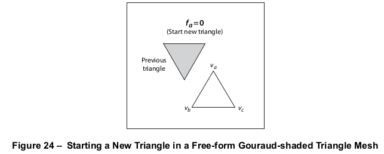
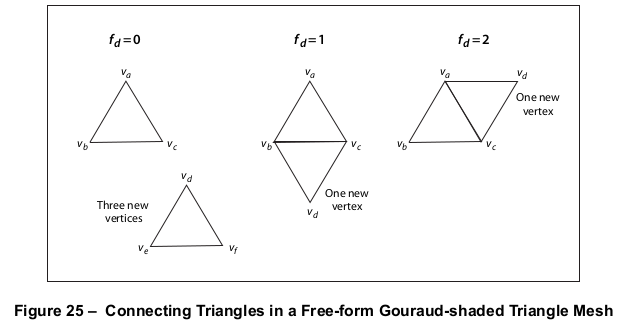
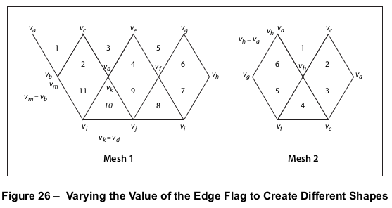
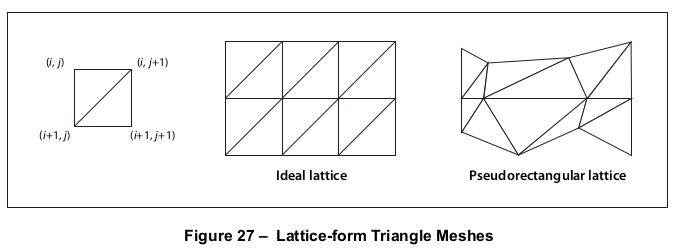
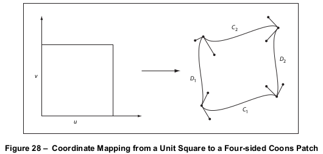
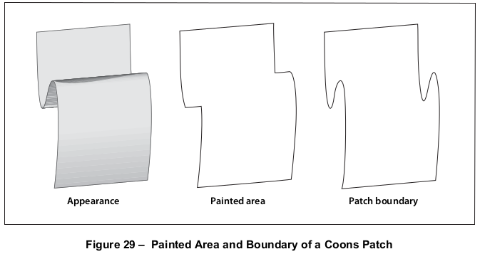
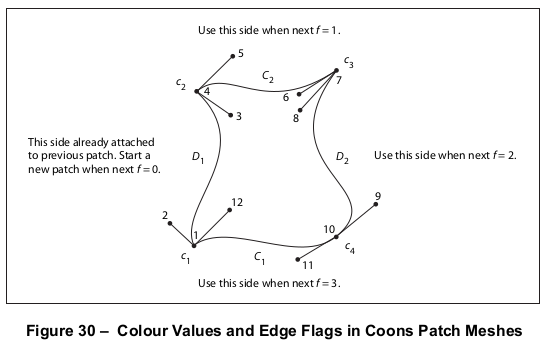
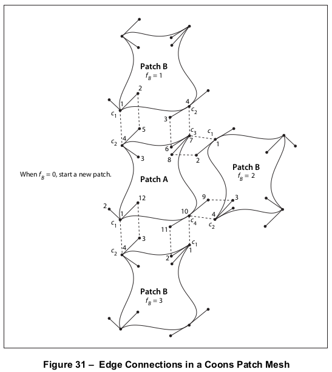
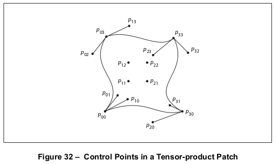

# 8.7 图案

**Patterns**

## 8.7.1 概述

**General**

=== "中文"

    图案有两种类型：
    
    - *平铺图案* 由一个小型图形图形（称为 *图案单元* ）组成，该图形以固定的水平和垂直间隔复制以填充要绘制的区域。用于平铺的图形对象应由内容流描述。
    - 渐变图案定义了一个渐变填充，可在区域内产生颜色之间的平滑过渡。应使用各种方法之一，根据位置指定要使用的颜色。
    
    !!! note "NOTE 1"
    
        当操作符如 **S**（描边）、**f**（填充）和 **Tj**（显示文本）用当前颜色绘制页面区域时，它们通常应用一种单一颜色，均匀覆盖该区域。然而，也可以应用由重复的图形图形或平滑变化的颜色渐变组成的“涂料”，而不是简单的颜色。这种重复的图形或平滑的渐变称为图案。图案非常通用，并且有许多用途；例如，它们可以用来创建各种图形纹理，如编织物、砖墙、旭日形图案以及类似的几何和色彩效果。
    
    !!! note "NOTE 2"
    
        不应使用旧技术，例如通过在特殊字体中使用字符字形，并使用 **Tj** 操作符重复绘制它们来定义图案。另一种技术，将图案定义为半色调屏幕，也不应使用，因为产生的效果是设备依赖的。
    
    图案应在名为 **Pattern** 的特殊颜色空间系列中指定。这些空间应使用 *图案对象* 作为颜色值的等价物，而不是其他空间使用的数值分量值。图案对象可以是字典或流，具体取决于图案类型；在本子句中，*图案字典* 一词通常用来指代字典对象或流对象的字典部分。（那些是流的图案对象在特定图案类型的描述中特别被识别为如此；除非另有说明，否则它们被理解为简单的字典。）本子句描述了 **Pattern** 颜色空间以及其中颜色值的指定。
    
    !!! note "NOTE 3"
    
        见 [8.6](./s6.md)，“颜色空间”，了解有关颜色空间和颜色值的一般信息，以及 [11.6.7]，“图案和透明度”，进一步讨论图案在透明成像模型中的处理。

=== "英文"

    Patterns come in two varieties:
    
    - *Tiling patterns* consist of a small graphical figure (called a *pattern cell*) that is replicated at fixed horizontal and vertical intervals to fill the area to be painted. The graphics objects to use for tiling shall be described by a content stream.
    - Shading patterns define a gradient fill that produces a smooth transition between colours across the area. The colour to use shall be specified as a function of position using any of a variety of methods.
    
    !!! note "NOTE 1"
    
        When operators such as **S** (stroke), **f** (fill), and **Tj** (show text) paint an area of the page with the current colour, they ordinarily apply a single colour that covers the area uniformly. However, it is also possible to apply “paint” that consists of a repeating graphical figure or a smoothly varying colour gradient instead of a simple colour. Such a repeating figure or smooth gradient is called a pattern. Patterns are quite general, and have many uses; for example, they can be used to create various graphical textures, such as weaves, brick walls, sunbursts, and similar geometrical and chromatic effects.
    
    !!! note "NOTE 2"
    
        Older techniques such as defining a pattern by using character glyphs in a special font and painting them repeatedly with the **Tj** operator should not be used. Another technique, defining patterns as halftone screens, should not be used because the effects produced are device-dependent.
    
    Patterns shall be specified in a special family of colour spaces named **Pattern**. These spaces shall use *pattern objects* as the equivalent of colour values instead of the numeric component values used with other spaces. A pattern object shall be a dictionary or a stream, depending on the type of pattern; the term *pattern dictionary* is used generically throughout this sub-clause to refer to either a dictionary object or the dictionary portion of a stream object. (Those pattern objects that are streams are specifically identified as such in the descriptions of particular pattern types; unless otherwise stated, they are understood to be simple dictionaries instead.) This sub-clause describes **Pattern** colour spaces and the specification of colour values within them.
    
    !!! note "NOTE 3"
    
        See [8.6](./s6.md), "Colour Spaces", for information about colour spaces and colour values in general and [11.6.7], "Patterns and Transparency", for further discussion of the treatment of patterns in the transparent imaging model.

## 8.7.2 图案的一般属性

**General Properties of Patterns**

=== "中文"

    图案字典包含定义图案外观和属性的描述信息。所有图案字典都应包含一个名为 **PatternType** 的条目，其值标识字典描述的图案类型：平铺图案为类型 1，渐变图案为类型 2。字典的其余内容取决于图案类型，并在各个图案类型的子句中详细说明。
    
    所有图案都应被视为颜色；**Pattern** 颜色空间应使用 **CS** 或 **cs** 操作符建立，就像其他颜色空间一样，特定的图案应使用 **SCN** 或 **scn** 操作符安装为当前颜色（见 [表 74](./s6.md#table74)）。
    
    图案的外观是相对于其自己的内部坐标系统描述的。每个图案都有一个 *图案矩阵*，这是一个变换矩阵，将图案的内部坐标系统映射到图案的 *父内容流*（定义图案为资源的内容流）的默认坐标系统。图案矩阵与父内容流的矩阵的连接建立了 *图案坐标空间*，在该空间内解释图案中的所有图形对象。
    
    !!! note "NOTE 1"
    
        如果图案在页面上使用，图案出现在该页面资源字典的 **Pattern** 子字典中，图案矩阵将图案空间映射到页面的默认（初始）坐标空间。在页面内容流中发生的页面变换矩阵的变化，如旋转和缩放，对图案没有影响；无论在页面上的何处使用，它都保持与页面的原始关系。同样，如果图案在表单 X 对象中使用（见 [8.10]，"表单 X 对象"），图案矩阵将图案空间映射到表单的默认用户空间（即，使用 **Do** 操作符绘制表单时的表单坐标空间）。图案可以在另一个图案内使用；内部图案的矩阵定义了它与外部图案图案空间的关系。
    
    !!! note "NOTE 2"
    
        PostScript 允许在一种上下文中定义图案，但在另一种上下文中使用。例如，图案可能在页面上定义（即，其图案矩阵将图案坐标空间映射到页面的用户空间），但可能在该页面的表单中使用，因此它与页面的关系独立于表单的每个单独放置。PDF 不支持此功能；在 PDF 中，所有图案都应局部于它们定义的上下文。

=== "英文"

    A pattern dictionary contains descriptive information defining the appearance and properties of a pattern. All pattern dictionaries shall contain an entry named **PatternType**, whose value identifies the kind of pattern the dictionary describes: type 1 for a tiling pattern or type 2 for a shading pattern. The remaining contents of the dictionary depend on the pattern type and are detailed in the sub-clauses on individual pattern types.
    
    All patterns shall be treated as colours; a **Pattern** colour space shall be established with the **CS** or **cs** operator just like other colour spaces, and a particular pattern shall be installed as the current colour with the **SCN** or **scn** operator (see [Table 74](./s6.md#table74)).
    
    A pattern’s appearance is described with respect to its own internal coordinate system. Every pattern has a *pattern matrix*, a transformation matrix that maps the pattern’s internal coordinate system to the default coordinate system of the pattern’s *parent content stream* (the content stream in which the pattern is defined as a resource). The concatenation of the pattern matrix with that of the parent content stream establishes the *pattern coordinate space*, within which all graphics objects in the pattern shall be interpreted.
    
    !!! note "NOTE 1"
    
        If a pattern is used on a page, the pattern appears in the **Pattern** subdictionary of that page’s resource dictionary, and the pattern matrix maps pattern space to the default (initial) coordinate space of the page. Changes to the page’s transformation matrix that occur within the page’s content stream, such as rotation and scaling, have no effect on the pattern; it maintains its original relationship to the page no matter where on the page it is used. Similarly, if a pattern is used within a form XObject (see [8.10], "Form XObjects"), the pattern matrix maps pattern space to the form’s default user space (that is, the form coordinate space at the time the form is painted with the **Do** operator). A pattern may be used within another pattern; the inner pattern’s matrix defines its relationship to the pattern space of the outer pattern.
    
    !!! note "NOTE 2"
    
        PostScript allows a pattern to be defined in one context but used in another. For example, a pattern might be defined on a page (that is, its pattern matrix maps the pattern coordinate space to the user space of the page) but be used in a form on that page, so that its relationship to the page is independent of each individual placement of the form. PDF does not support this feature; in PDF, all patterns shall be local to the context in which they are defined.

## 8.7.3 平铺图案

**Tiling Patterns**

### 8.7.3.1 概述

**General**

=== "中文"

    平铺图案由一个小型图形图形组成，称为图案单元。使用图案进行绘制会在固定的水平和垂直间隔复制单元格以填充一个区域。效果就像图形被绘制在透明玻璃瓦的表面，然后这些玻璃瓦的相同副本以阵列形式铺满整个区域，并修剪到其边界。这个过程称为平铺区域。
    
    图案单元可以包括图形元素，如填充区域、文本和采样图像。它的形状不一定是矩形，瓦片的间距也可以与单元格本身的尺寸不同。在执行绘制操作（如描边 **S** 或填充 **f**）时，符合规范的阅读器应将单元格绘制在当前页面上，以尽可能多的次数填充一个区域。单个瓦片（单元格的实例）被绘制的顺序是未指定的，也是不可预测的；相邻瓦片上的图形不应重叠。
    
    图案单元的外观应由一个内容流定义，该内容流包含绘制单元格一个实例所需的绘制操作符。除了所有流都通用的常规条目（见 [表 5](../c7/s3.md#table5)），这个流的字典可能包含在 [表 75](#table75) 中列出的附加条目。

    <table id="table75" markdown="span">
        <caption>**Table 75 – 类型 1 图案字典的特定条目**</caption>
        <thead>
            <tr>
                <th>**Key**</th>
                <th>**Type**</th>
                <th>**Value**</th>
            </tr>
        </thead>
        <tbody>
            <tr>
                <td>**Type**</td>
                <td>name</td>
                <td>（可选）描述此字典的 PDF 对象类型；如果存在，应为图案字典的 **Pattern**。</td>
            </tr>
            <tr>
                <td>**PatternType**</td>
                <td>integer</td>
                <td>（必需）识别此字典描述的图案类型的代码；对于平铺图案应为 1。  </td>
            </tr>
            <tr>
                <td>**PaintType**</td>
                <td>integer</td>
                <td>（必需）一个代码，确定图案单元的颜色如何指定：颜色平铺图案。图案的内容流应指定用于绘制图案单元的颜色。当内容流开始执行时，当前颜色是图案父内容流中最初生效的颜色。这类似于图案矩阵的定义；见 [8.7.2]，"图案的一般属性"。无色平铺图案。图案的内容流不应指定任何颜色信息。相反，每次使用图案时，整个图案单元都用单独指定的颜色绘制。本质上，内容流描述了一个模板，通过它倒入当前颜色。内容流不应调用指定颜色或图形状态中其他颜色相关参数的操作符；否则会发生错误（见 [8.6.8]，"颜色操作符"）。不过，内容流可以绘制图像掩模，因为它不指定任何颜色信息（见 [8.9.6.2]，"模板蒙版"）。</td>
            </tr>
            <tr>
                <td>**TilingType**</td>
                <td>integer</td>
                <td>（必需）一个代码，控制相对于设备像素网格调整瓦片间距：恒定间距。图案单元的间距应一致 — 即，为设备像素的倍数。为了实现这一点，符合规范的阅读器可能需要通过对 **XStep**、**YStep** 和变换矩阵进行小的调整，轻微扭曲图案单元。扭曲量不应超过 1 个设备像素。不变形。图案单元不应扭曲，但图案单元之间的间距在绘制图案时可能会水平和垂直变化多达 1 个设备像素。这在平均上实现了 **XStep** 和 **YStep** 请求的间距，但不一定对每个单独的图案单元都如此。恒定间距和更快的平铺。图案单元的间距应像平铺类型 1 一样一致，但允许额外扭曲以实现更有效的实现。</td>
            </tr>
            <tr>
                <td>**BBox**</td>
                <td>rectangle</td>
                <td>（必需）一个包含四个数字的数组，在图案坐标系统中分别给出图案单元包围盒的左边、底边、右边和顶边的坐标。这些边界将用于裁剪图案单元。</td>
            </tr>
            <tr>
                <td>**XStep**</td>
                <td>number</td>
                <td>（必需）在图案坐标系统中测量的图案单元之间期望的水平间距。</td>
            </tr>
            <tr>
                <td>**YStep**</td>
                <td>number</td>
                <td>（必需）在图案坐标系统中测量的图案单元之间的期望垂直间距。
    
    !!! note "NOTE"
    
        **XStep** 和 **YStep** 可能与 **BBox** 条目所暗示的图案单元的尺寸不同。这允许使用形状不规则的图形进行平铺。
    
        **XStep** 和 **YStep** 可以是正数或负数，但不应为零。</td>
            </tr>
            <tr>
                <td>**Resources**</td>
                <td>dictionary</td>
                <td>（必需）一个资源字典，应包含图案内容流所需的所有命名资源（见 [7.8.3]，"资源字典"）。</td>
            </tr>
            <tr>
                <td>**Matrix**</td>
                <td>array</td>
                <td>（可选）一个包含六个数字的数组，指定图案矩阵（见 [8.7.2]，"图案的一般属性"）。默认值：单位矩阵 [1 0 0 1 0 0]。</td>
            </tr>
        </tbody>
    </table>

    图案字典的 **BBox**、**XStep** 和 **YStep** 值应在图案坐标系统中解释，图案内容流中的图形对象也应相对于该坐标系统定义。平铺中图案单元的放置基于一个关键图案单元的位置，然后通过 **XStep** 和 **YStep** 的倍数来位移复制图案。关键图案单元的原点与图案坐标系统的原点重合。平铺的相位可以通过图案字典中 **Matrix** 条目的平移分量来控制。
    
    在用平铺图案绘制之前，符合规范的编写器应在图形状态中将图案设置为当前颜色。随后的绘制操作将用图案内容流描述的图案单元平铺绘制区域。为了获得图案单元，符合规范的阅读器应执行以下步骤：
    
    a) 保存当前图形状态（就像调用 **q** 操作符一样）
    
    b) 安装在图案父内容流开始时生效的图形状态，当前变换矩阵通过图案矩阵进行调整，如 [8.7.2] 中 "图案的一般属性" 所述
    
    c) 绘制图案内容流中指定的图形对象
    
    d) 恢复保存的图形状态（就像调用 **Q** 操作符一样）
    
    !!! note "NOTE"
    
        图案的内容流不应设置图形状态中的任何设备依赖参数（见 [表 53](./s4.md#table53)），因为这可能导致不正确的输出。

=== "英文"

    A *tiling pattern* consists of a small graphical figure called a *pattern cell*. Painting with the pattern replicates the cell at fixed horizontal and vertical intervals to fill an area. The effect is as if the figure were painted on the surface of a clear glass tile, identical copies of which were then laid down in an array covering the area and trimmed to its boundaries. This process is called *tiling* the area.
    
    The pattern cell can include graphical elements such as filled areas, text, and sampled images. Its shape need not be rectangular, and the spacing of tiles can differ from the dimensions of the cell itself. When performing painting operations such as **S** (stroke) or **f** (fill), the conforming reader shall paint the cell on the current page as many times as necessary to fill an area. The order in which individual tiles (instances of the cell) are painted is unspecified and unpredictable; figures on adjacent tiles should not overlap.
    
    The appearance of the pattern cell shall be defined by a content stream containing the painting operators needed to paint one instance of the cell. Besides the usual entries common to all streams (see [Table 5](../c7/s3.md#table5)), this stream’s dictionary may contain the additional entries listed in [Table 75](#table75).
                    
    <table id="table75" markdown="span">
        <caption>**Table 75 – Additional Entries Specific to a Type 1 Pattern Dictionary**</caption>
        <thead>
            <tr>
                <th>**Key**</th>
                <th>**Type**</th>
                <th>**Value**</th>
            </tr>
        </thead>
        <tbody>
            <tr>
                <td>**Type**</td>
                <td>name</td>
                <td>(*Optional*) The type of PDF object that this dictionary describes; if present, shall be **Pattern** for a pattern dictionary.</td>
            </tr>
            <tr>
                <td>**PatternType**</td>
                <td>integer</td>
                <td>(*Required*) A code identifying the type of pattern that this dictionary describes; shall be 1 for a tiling pattern.</td>
            </tr>
            <tr>
                <td>**PaintType**</td>
                <td>integer</td>
                <td>(*Required*) A code that determines how the colour of the pattern cell shall be specified:<br/> a) *Coloured tiling pattern*. The pattern’s content stream shall specify the colours used to paint the pattern cell. When the content stream begins execution, the current colour is the one that was initially in effect in the pattern’s parent content stream. This is similar to the definition of the pattern matrix; see [8.7.2], "General Properties of Patterns". <br/> b) *Uncoloured tiling pattern*. The pattern’s content stream shall not specify any colour information. Instead, the entire pattern cell is painted with a separately specified colour each time the pattern is used. Essentially, the content stream describes a stencil through which the current colour shall be poured. The content stream shall not invoke operators that specify colours or other colour- related parameters in the graphics state; otherwise, an error occurs (see [8.6.8], "Colour Operators"). The content stream may paint an image mask, however, since it does not specify any colour information (see [8.9.6.2], "Stencil Masking").</td>
            </tr>
            <tr>
                <td>**TilingType**</td>
                <td>integer</td>
                <td>(*Required*) A code that controls adjustments to the spacing of tiles relative to the device pixel grid:<br/>
                a) *Constant spacing*. Pattern cells shall be spaced consistently—that is, by a multiple of a device pixel. To achieve this, the conforming reader may need to distort the pattern cell slightly by making small adjustments to **XStep**, **YStep**, and the transformation matrix. The amount of distortion shall not exceed 1 device pixel.<br/> b) *No distortion*. The pattern cell shall not be distorted, but the spacing between pattern cells may vary by as much as 1 device pixel, both horizontally and vertically, when the pattern is painted. This achieves the spacing requested by **XStep** and **YStep** on average but not necessarily for each individual pattern cell.<br/> c) *Constant spacing and faster tiling*. Pattern cells shall be spaced consistently as in tiling type 1 but with additional distortion permitted to enable a more efficient implementation.</td>
            </tr>
            <tr>
                <td>**BBox**</td>
                <td>rectangle</td>
                <td>(*Required*) An array of four numbers in the pattern coordinate system giving the coordinates of the left, bottom, right, and top edges, respectively, of the pattern cell’s bounding box. These boundaries shall be used to clip the pattern cell.</td>
            </tr>
            <tr>
                <td>**XStep**</td>
                <td>number</td>
                <td>(*Required*) The desired horizontal spacing between pattern cells, measured in the pattern coordinate system.</td>
            </tr>
            <tr>
                <td>**YStep**</td>
                <td>number</td>
                <td>(*Required*) The desired vertical spacing between pattern cells, measured in the pattern coordinate system.
    
    !!! note "NOTE"
    
        **XStep** and **YStep** may differ from the dimensions of the pattern cell implied by the **BBox** entry. This allows tiling with irregularly shaped figures.
    
        **XStep** and **YStep** may be either positive or negative but shall not be zero.</td>
            </tr>
            <tr>
                <td>**Resources**</td>
                <td>dictionary</td>
                <td>(*Required*) A resource dictionary that shall contain all of the named resources required by the pattern’s content stream (see [7.8.3], "Resource Dictionaries").</td>
            </tr>
            <tr>
                <td>**Matrix**</td>
                <td>array</td>
                <td>(*Optional*) An array of six numbers specifying the pattern matrix (see [8.7.2], "General Properties of Patterns"). Default value: the identity matrix [1 0 0 1 0 0].</td>
            </tr>
        </tbody>
    </table>
    
    The pattern dictionary’s **BBox**, **XStep**, and **YStep** values shall be interpreted in the pattern coordinate system, and the graphics objects in the pattern’s content stream shall be defined with respect to that coordinate system. The placement of pattern cells in the tiling is based on the location of one key pattern cell, which is then displaced by multiples of **XStep** and **YStep** to replicate the pattern. The origin of the key pattern cell coincides with the origin of the pattern coordinate system. The phase of the tiling can be controlled by the translation components of the **Matrix** entry in the pattern dictionary.
    
    Prior to painting with a tiling pattern, the conforming writer shall establish the pattern as the current colour in the graphics state. Subsequent painting operations tile the painted areas with the pattern cell described by the pattern’s content stream. To obtain the pattern cell, the conforming reader shall perform these steps:
    
    a) Saves the current graphics state (as if by invoking the **q** operator)
    
    b) Installs the graphics state that was in effect at the beginning of the pattern’s parent content stream, with the current transformation matrix altered by the pattern matrix as described in [8.7.2], "General Properties of Patterns"
    
    c) Paints the graphics objects specified in the pattern’s content stream
    
    d) Restores the saved graphics state (as if by invoking the **Q** operator)
    
    !!! note "NOTE"
    
        The pattern’s content stream should not set any of the device-dependent parameters in the graphics state (see [Table 53](./s4.md#table53)) because it may result in incorrect output.

### 8.7.3.2 彩色平铺图案

**Coloured Tiling Patterns**

=== "中文"

    彩色平铺图案是一种颜色自包含的图案。在绘制图案单元的过程中，图案的内容流显式设置它绘制的每个图形元素的颜色。一个图案单元可能包含以不同颜色绘制的元素；它还可能包含采样的灰度或彩色图像。这种类型的图案在图案字典中通过图案类型为 1 和绘制类型为 1 来标识。
    
    当当前颜色空间是 **Pattern** 空间时，应通过将名称作为单一操作数提供给 **SCN** 或 **scn** 操作符来选择彩色平铺图案作为当前颜色。此名称应为当前资源字典中 **Pattern** 子字典的条目键（见 [7.8.3]，"资源字典"），其值应为表示图案的流对象。由于图案定义了自己的颜色信息，因此不应向 **SCN** 或 **scn** 指定表示颜色分量的额外操作数。
    
    !!! info "EXAMPLE 1"
    
        如果 P1 是当前资源字典中图案资源的名称，则以下代码将其设置为当前非描边颜色：
    
        ```tex
        /Pattern cs
        /P1 scn
        ```
    
    !!! note "NOTE 1"
    
        随后的非描边绘制操作符的执行，如 **f**（填充）、**Tj**（显示文本）或带图像掩模的 **Do**（绘制外部对象），使用指定的图案来平铺要绘制的区域。
    
    !!! note "NOTE 2"
    
        以下定义了一个页面（对象 5），它使用彩色平铺图案（对象 15）在黄色背景上绘制了三个圆和一个三角形。图案由四色扑克牌花色符号（黑桃、红心、方块和梅花）组成，这些是从 ZapfDingbats 字体中取出的字符字形（见 [D.6](../a4.md#d6-zapfdingbats-集和编码)，"ZapfDingbats 集合和编码"）；图案的内容流指定了每个字形的颜色。[附录 L](../a12.md) 中的图 L.8 显示了结果。
    
    !!! info "EXAMPLE 2"
    
        以下是PDF文档中定义页面和使用彩色平铺图案的示例的翻译：
        
        ```tex
        5 0 obj                        % 页面对象
            << /Type /Page
                /Parent 2 0 R
                /Resources 10 0 R
                /Contents 30 0 R
                /CropBox [ 0 0 225 225 ]
            >>
        endobj
        
        10 0 obj                       % 页面资源字典
        << /Pattern << /P1 15 0 R >>
            >>
        endobj
        
        15 0 obj                         % 图案定义
            << /Type /Pattern
                /PatternType 1            % 平铺图案
                /PaintType 1              % 彩色
                /TilingType 2
                /BBox [ 0 0 100 100 ]
                /XStep 100
                /YStep 100
                /Resources 16 0 R
                /Matrix [ 0.4 0.0 0.0 0.4 0.0 0.0 ]
                /Length 183
            >>
        
        stream
        BT                                        % 开始文本对象
            /F1 1 Tf                              % 设置文本字体和大小
            64 0 0 64 7.1771 2.4414 Tm            % 设置文本矩阵 
            0 Tc                                  % 设置字符间距
            0 Tw                                  % 设置单词间距
            
            1.0 0.0 0.0 rg                        % 设置非描边颜色为红色
            ( \001 ) Tj                           % 显示黑桃字形
            
            0.7478 -0.007 TD                      % 移动文本位置
            0.0 1.0 0.0 rg                        % 设置非描边颜色为绿色
            ( \002 ) Tj                           % 显示红心字形
            
            -0.7323 0.7813 TD                     % 移动文本位置
            0.0 0.0 1.0 rg                        % 设置非描边颜色为蓝色
            ( \003 ) Tj                           % 显示方块字形
            
            0.6913 0.007 TD                       % 移动文本位置
            0.0 0.0 0.0 rg                        % 设置非描边颜色为黑色
            ( \004 ) Tj                           % 显示梅花字形
        
        ET                                        % 结束文本对象
        endstream
        endobj
        
        16 0 obj                                  % 图案资源字典
            << /Font << /F1 20 0 R >>
            >>
        endobj
        
        20 0 obj                                  % 图案字体
            << /Type /Font
                /Subtype /Type1
                /Encoding 21 0 R
                /BaseFont /ZapfDingbats
            >>
        endobj
        
        21 0 obj                                  % 字体编码
            << /Type /Encoding
                /Differences [ 1 /a109 /a110 /a111 /a112 ]
            >>
        endobj
        
        30 0 obj                                  % 页面内容
            << /Length 1252 >>
        stream
            0.0 G                                 % 设置描边颜色为黑色
        
            1.0 1.0 0.0 rg                            % 设置非描边颜色为黄色
            25 175 175 -150 re                        % 构造矩形路径
            f                                         % 填充路径
            
            /Pattern cs                               % 设置图案颜色空间
            /P1 scn                                   % 设置图案为非描边颜色
            
            99.92 49.92 m                             % 开始新路径
            99.92 77.52 77.52 99.92 49.92 99.92 c     % 构造左下圆
            22.32 99.92 -0.08 77.52 -0.08 49.92 c
            -0.08 22.32 22.32 -0.08 49.92 -0.08 c
            77.52 -0.08 99.92 22.32 99.92 49.92 c
            B                                         % 填充并描边路径
            
            224.96 49.92 m                            % 开始新路径
            224.96 77.52 202.56 99.92 174.96 99.92 c  % 构造右下圆
            147.36 99.92 124.96 77.52 124.96 49.92 c
            124.96 22.32 147.36 -0.08 174.96 -0.08 c
            202.56 -0.08 224.96 22.32 224.96 49.92 c
            B                                         % 填充并描边路径
            
            87.56 201.70 m                            % 开始新路径
            63.66 187.90 55.46 157.32 69.26 133.40 c  % 构造上圆
            83.06 109.50 113.66 101.30 137.56 115.10 c
            161.46 128.90 169.66 159.50 155.86 183.40 c
            142.06 207.30 111.46 215.50 87.56 201.70 c
            B                                         % 开始新路径
            
            50 50 m                                   % 开始新路径
            175 50 l                                  % 构造三角形路径
            112.5 158.253 l
            b                                         % 关闭、填充并描边路径
        endstream
        endobj
        ```
        
    
    !!! note "NOTE 3"
    
        本子句中示例 2 的几个特点值得注意：
        
        三个圆和三角形使用相同的图案绘制。即使圆和三角形与图案单元不对齐，图案单元仍然对齐。例如，蓝色方块的位置相对于三个圆不同。
        
        图案单元没有完全覆盖瓦片：它留下了字形之间的空间未绘制。当平铺图案用作颜色时，现有的背景（黄色矩形）会透过这些未绘制的区域显示出来。

=== "英文"

    A *coloured tiling pattern* is a pattern whose colour is self-contained. In the course of painting the pattern cell, the pattern’s content stream explicitly sets the colour of each graphical element it paints. A single pattern cell may contain elements that are painted different colours; it may also contain sampled grayscale or colour images. This type of pattern is identified by a pattern type of 1 and a paint type of 1 in the pattern dictionary.
    
    When the current colour space is a **Pattern** space, a coloured tiling pattern shall be selected as the current colour by supplying its name as the single operand to the **SCN** or **scn** operator. This name shall be the key of an entry in the **Pattern** subdictionary of the current resource dictionary (see [7.8.3], "Resource Dictionaries"), whose value shall be the stream object representing the pattern. Since the pattern defines its own colour information, no additional operands representing colour components shall be specified to **SCN** or **scn**.
    
    !!! info "EXAMPLE 1"
    
        If P1 is the name of a pattern resource in the current resource dictionary, the following code establishes it as the current nonstroking colour:
    
        ```tex
        /Pattern cs
        /P1 scn
        ```
    
    !!! note "NOTE 1"
    
        Subsequent executions of nonstroking painting operators, such as **f** (fill), **Tj** (show text), or **Do** (paint external object) with an image mask, use the designated pattern to tile the areas to be painted.
    
    !!! note "NOTE 2"
    
        The following defines a page (object 5) that paints three circles and a triangle using a coloured tiling pattern (object 15) over a yellow background. The pattern consists of the symbols for the four suits of playing cards (spades, hearts, diamonds, and clubs), which are character glyphs taken from the ZapfDingbats font (see [D.6](../a4.md#d6-zapfdingbats-集和编码), "ZapfDingbats Set and Encoding"); the pattern’s content stream specifies the colour of each glyph. Figure L.8 in [Annex L](../a12.md) shows the results.
    
    !!! info "EXAMPLE 2"
    
        ```tex
        5 0 obj                        % Page object
            << /Type /Page
               /Parent 2 0 R
               /Resources 10 0 R
               /Contents 30 0 R
               /CropBox [ 0 0 225 225 ]
            >>
        endobj
    
        10 0 obj                       % Resource dictionary for page
        << /Pattern << /P1 15 0 R >>
            >>
        endobj
    
        15 0 obj                         % Pattern definition
            << /Type /Pattern
               /PatternType 1            % Tiling pattern
               /PaintType 1              % Coloured
               /TilingType 2
               /BBox [ 0 0 100 100 ]
               /XStep 100
               /YStep 100
               /Resources 16 0 R
               /Matrix [ 0.4 0.0 0.0 0.4 0.0 0.0 ]
               /Length 183
            >>
    
        stream
        BT                                        % Begin text object
            /F1 1 Tf                              % Set text font and size
            64 0 0 64 7.1771 2.4414 Tm            % Set text matrix 
            0 Tc                                  % Set character spacing
            0 Tw                                  % Set word spacing
            
            1.0 0.0 0.0 rg                        % Set nonstroking colour to red
            ( \001 ) Tj                           % Show spade glyph
            
            0.7478 -0.007 TD                      % Move text position
            0.0 1.0 0.0 rg                        % Set nonstroking colour to green
            ( \002 ) Tj                           % Show heart glyph
            
            -0.7323 0.7813 TD                     % Move text position
            0.0 0.0 1.0 rg                        % Set nonstroking colour to blue
            ( \003 ) Tj                           % Show diamond glyph
            
            0.6913 0.007 TD                       % Move text position
            0.0 0.0 0.0 rg                        % Set nonstroking colour to black
            ( \004 ) Tj                           % Show club glyph
    
        ET                                        % End text object
        endstream
        endobj
    
        16 0 obj                                  % Resource dictionary for pattern
            << /Font << /F1 20 0 R >>
            >>
        endobj
    
        20 0 obj                                  % Font for pattern
            << /Type /Font
               /Subtype /Type1
               /Encoding 21 0 R
               /BaseFont /ZapfDingbats
            >>
        endobj
    
        21 0 obj                                  % Font encoding
            << /Type /Encoding
               /Differences [ 1 /a109 /a110 /a111 /a112 ]
            >>
        endobj
    
        30 0 obj                                  % Contents of page
            << /Length 1252 >>
        stream
            0.0 G                                 % Set stroking colour to black
    
            1.0 1.0 0.0 rg                            % Set nonstroking colour to yellow
            25 175 175 -150 re                        % Construct rectangular path
            f                                         % Fill path
            
            /Pattern cs                               % Set pattern colour space
            /P1 scn                                   % Set pattern as nonstroking colour
            
            99.92 49.92 m                             % Start new path
            99.92 77.52 77.52 99.92 49.92 99.92 c     % Construct lower-left circle
            22.32 99.92 -0.08 77.52 -0.08 49.92 c
            -0.08 22.32 22.32 -0.08 49.92 -0.08 c
            77.52 -0.08 99.92 22.32 99.92 49.92 c
            B                                         % Fill and stroke path
            
            224.96 49.92 m                            % Start new path
            224.96 77.52 202.56 99.92 174.96 99.92 c  % Construct lower-right circle
            147.36 99.92 124.96 77.52 124.96 49.92 c
            124.96 22.32 147.36 -0.08 174.96 -0.08 c
            202.56 -0.08 224.96 22.32 224.96 49.92 c
            B                                         % Fill and stroke path
            
            87.56 201.70 m                            % Start new path
            63.66 187.90 55.46 157.32 69.26 133.40 c  % Construct upper circle
            83.06 109.50 113.66 101.30 137.56 115.10 c
            161.46 128.90 169.66 159.50 155.86 183.40 c
            142.06 207.30 111.46 215.50 87.56 201.70 c
            B                                         % Start new path
            
            50 50 m                                   % Start new path
            175 50 l                                  % Construct triangular path
            112.5 158.253 l
            b                                         % Close, fill, and stroke path
        endstream
        endobj
        ```
    
    !!! note "NOTE 3"
    
        Several features of EXAMPLE 2 in this sub-clause are noteworthy:
    
        The three circles and the triangle are painted with the same pattern. The pattern cells align, even though the circles and triangle are not aligned with respect to the pattern cell. For example, the position of the blue diamonds varies relative to the three circles.
    
        The pattern cell does not completely cover the tile: it leaves the spaces between the glyphs unpainted. When the tiling pattern is used as a colour, the existing background (the yellow rectangle) shows through these unpainted areas.

### 8.7.3.3 无色平铺图案

**Uncoloured Tiling Patterns**

=== "中文"

    无色平铺图案是一种没有固有颜色的图案：每当使用该图案时，颜色必须单独指定。它提供了一种方法，可以使用具有相同形状但颜色不同的图案单元来平铺页面的不同区域。这种类型的图案在图案字典中通过图案类型为 1 和绘制类型为 2 来标识。图案的内容流不应当显式指定任何颜色；它可以绘制图像掩模（见 [8.9.6.2]，"模板蒙版"），但不允许绘制其他类型的图像。
    
    代表无色平铺图案的 **Pattern** 颜色空间应有一个参数：一个对象，标识实际图案颜色将被指定的 *底层颜色空间*。底层颜色空间应作为定义 **Pattern** 颜色空间的数组的第二个元素给出。
    
    !!! info "EXAMPLE 1"
            
        数组
        
        [/Pattern /DeviceRGB]
        
        定义了一个 **Pattern** 颜色空间，其底层颜色空间为 **DeviceRGB**。

    !!! note "NOTE"
    
        底层颜色空间不能是另一种 **Pattern** 颜色空间。
    
    在这种情况下，向 **SCN** 或 **scn** 操作符提供的参数应包括在底层颜色空间中的一个颜色值，该值由一个或多个数值颜色分量指定，以及表示无色平铺图案的图案对象的名称。
    
    !!! info "EXAMPLE 2"
    
    如果当前资源字典（见 [7.8.3]，"资源字典"）定义了 Cs3 作为 **ColorSpace** 资源的名称，其值是上面展示的 **Pattern** 颜色空间，并且 P2 是一个表示无色平铺图案的 **Pattern** 资源，那么代码
    
    ```text
    /Cs3 cs
    0.30 0.75 0.21 /P2 scn
    ```
    
    将 Cs3 设定为当前的非描边颜色空间，并将 P2 设定为当前的非描边颜色，使用 **DeviceRGB** 颜色空间中指定分量的颜色进行绘制。随后执行的非描边绘制操作符，例如 **f**（填充）、**Tj**（显示文本）以及带图像掩模的 **Do**（绘制外部对象），将使用指定的图案和颜色来平铺要绘制的区域。每次都可以使用相同的图案，但每次可以使用不同的颜色。
    
    !!! info "EXAMPLE 3"
    
        这个示例与 [8.7.3.2] 中的示例 2 类似，只是它使用了一个无色平铺图案来绘制三个圆和三角形，每个都用不同的颜色（见 [附录 L](../a12.md) 中的图 L.9）。为此，每次调用 scn 操作符时，它提供了四个操作数：三个数字表示底层 **DeviceRGB** 颜色空间中的颜色分量，以及图案的名称。
    
        ```tex
        5 0 obj                        % 页面对象
            << /Type /Page
                /Parent 2 0 R
                /Resources 10 0 R
                /Contents 30 0 R
                /CropBox [ 0 0 225 225 ]
            >>
        endobj
        
        10 0 obj                       % 页面资源字典
            << /ColorSpace << /Cs12 12 0 R >>
                /Pattern << /P1 15 0 R >>
            >>
        endobj
        
        12 0 obj                       % 颜色空间
            [ /Pattern /DeviceRGB ]
        endobj
        
        15 0 obj                       % 图案定义
            << /Type /Pattern
                /PatternType 1          % 平铺图案
                /PaintType 2            % 无色
                /TilingType 2
                /BBox [ 0 0 100 100 ]
                /XStep 100
                /YStep 100
                /Resources 16 0 R
                /Matrix [ 0.4 0.0 0.0 0.4 0.0 0.0 ]
                /Length 127
            >>
        
        stream
            BT                              % 开始文本对象
                /F1 1 Tf                    % 设置文本字体和大小       
                64 0 0 64 7.1771 2.4414 Tm  % 设置文本矩阵
                0 Tc                        % 设置字符间距
                0 Tw                        % 设置单词间距
                
                ( \001 ) Tj                 % 显示黑桃符号
                0.7478 -0.007 TD            % 移动文本位置
                ( \002 ) Tj                 % 显示红心符号
                
                -0.7323 0.7813 TD           % 移动文本位置
                ( \003 ) Tj                 % 显示方块符号
                
                0.6913 0.007 TD             % 移动文本位置
                ( \004 ) Tj                 % 显示梅花符号
            ET                              % 结束文本对象
        endstream
        endobj
        
        16 0 obj                            % 图案资源字典
            << /Font << /F1 20 0 R >>
            >>
        endobj
        
        20 0 obj                            % 图案字体
            << /Type /Font
                /Subtype /Type1
                /Encoding 21 0 R
                /BaseFont /ZapfDingbats
            >>
        endobj
        
        21 0 obj                            % 字体编码
            << /Type /Encoding
                /Differences [ 1 /a109 /a110 /a111 /a112 ]
            >>
        endobj
        
        30 0 obj                            % 页面内容
            << /Length 1316 >>
        stream
            0.0 G                            % 设置描边颜色为黑色
            1.0 1.0 0.0 rg                   % 设置非描边颜色为黄色
            25 175 175 -150 re               % 构造矩形路径
            f                                % 填充路径
        
            /Cs12 cs                         % 设置图案颜色空间
            0.77 0.20 0.00 /P1 scn           % 设置非描边颜色和图案
            99.92 49.92 m                    % 开始新路径
            99.92 77.52 77.52 99.92 49.92 99.92 c        % 构造左下圆
            22.32 99.92 -0.08 77.52 -0.08 49.92 c
            -0.08 22.32 22.32 -0.08 49.92 -0.08 c
            77.52 -0.08 99.92 22.32 99.92 49.92 c
        
            B                                % 填充并描边路径
        
            0.2 0.8 0.4 /P1 scn              % 更改非描边颜色
            224.96 49.92 m                   % 开始新路径
            224.96 77.52 202.56 99.92 174.96 99.92 c    % 构造右下圆
            147.36 99.92 124.96 77.52 124.96 49.92 c
            124.96 22.32 147.36 -0.08 174.96 -0.08 c
            202.56 -0.08 224.96 22.32 224.96 49.92 c
            B                                % 填充并描边路径
        
            0.3 0.7 1.0 /P1 scn              % 更改非描边颜色
            87.56 201.70 m                   % 开始新路径
            63.66 187.90 55.46 157.30 69.26 133.40 c    % 构造上圆
            83.06 109.50 113.66 101.30 137.56 115.10 c
            161.46 128.90 169.66 159.50 155.86 183.40 c
            142.06 207.30 111.46 215.50 87.56 201.70 c
            B                                % 填充并描边路径
        
            0.5 0.2 1.0 /P1 scn              % 更改非描边颜色
            50 50 m                          % 开始新路径 
            175 50 l                         % 构造三角形路径
            112.5 158.253 l                  % 关闭、填充并描边路径
            b
        ```

=== "英文"

    An *uncoloured tiling pattern* is a pattern that has no inherent colour: the colour shall be specified separately whenever the pattern is used. It provides a way to tile different regions of the page with pattern cells having the same shape but different colours. This type of pattern shall be identified by a pattern type of 1 and a paint type of 2 in the pattern dictionary. The pattern’s content stream shall not explicitly specify any colours; it may paint an image mask (see [8.9.6.2], "Stencil Masking") but no other kind of image.
    
    A **Pattern** colour space representing an uncoloured tiling pattern shall have a parameter: an object identifying the *underlying colour space* in which the actual colour of the pattern shall be specified. The underlying colour space shall be given as the second element of the array that defines the **Pattern** colour space.
    
    !!! info "EXAMPLE 1"
    
        The array
    
        [/Pattern /DeviceRGB]
    
        defines a **Pattern** colour space with **DeviceRGB** as its underlying colour space.
    
    !!! note "NOTE"
    
        The underlying colour space cannot be another ***Pattern*** colour space.
    
    Operands supplied to the **SCN** or **scn** operator in such a colour space shall include a colour value in the underlying colour space, specified by one or more numeric colour components, as well as the name of a pattern object representing an uncoloured tiling pattern.
    
    !!! info "EXAMPLE 2"
    
        If the current resource dictionary (see [7.8.3], "Resource Dictionaries") defines Cs3 as the name of a **ColorSpace** resource whose value is the **Pattern** colour space shown above and P2 as a **Pattern** resource denoting an uncoloured tiling pattern, the code
        
        ```text
        /Cs3 cs
        0.30 0.75 0.21 /P2 scn
        ```
        
        establishes Cs3 as the current nonstroking colour space and P2 as the current nonstroking colour, to be painted in the colour represented by the specified components in the **DeviceRGB** colour space. Subsequent executions of nonstroking painting operators, such as **f** (fill), **Tj** (show text), and **Do** (paint external object) with an image mask, use the designated pattern and colour to tile the areas to be painted. The same pattern can be used repeatedly with a different colour each time.
    
    !!! info "EXAMPLE 3"
    
        This example is similar to EXAMPLE 2 in [8.7.3.2], except that it uses an uncoloured tiling pattern to paint the three circles and the triangle, each in a different colour (see Figure L.9 in [Annex L](../a12.md)). To do so, it supplies four operands each time it invokes the scn operator: three numbers denoting the colour components in the underlying **DeviceRGB** colour space, along with the name of the pattern.
    
    ```tex
    5 0 obj                        % Page object
        << /Type /Page
           /Parent 2 0 R
           /Resources 10 0 R
           /Contents 30 0 R
           /CropBox [ 0 0 225 225 ]
        >>
    endobj
    
    10 0 obj                       % Resource dictionary for page
        << /ColorSpace << /Cs12 12 0 R >>
           /Pattern << /P1 15 0 R >>
        >>
    endobj
    
    12 0 obj                       %Colour space
        [ /Pattern /DeviceRGB ]
    endobj
    
    15 0 obj                       % Pattern definition
        << /Type /Pattern
           /PatternType 1          % Tiling pattern
           /PaintType 2            % Uncoloured
           /TilingType 2
           /BBox [ 0 0 100 100 ]
           /XStep 100
           /YStep 100
           /Resources 16 0 R
           /Matrix [ 0.4 0.0 0.0 0.4 0.0 0.0 ]
           /Length 127
        >>
    
    stream
        BT                              % Begin text object
            /F1 1 Tf                    % Set text font and size       
            64 0 0 64 7.1771 2.4414 Tm  % Set text matrix
            0 Tc                        % Set character spacing
            0 Tw                        % Set word spacing
            
            ( \001 ) Tj                 % Show spade glyph
            0.7478 -0.007 TD            % Move text position
            ( \002 ) Tj                 % Show heart glyph
            
            -0.7323 0.7813 TD           % Move text position
            ( \003 ) Tj                 % Show diamond glyph
            
            0.6913 0.007 TD             % Move text position
            ( \004 ) Tj                 % Show club glyph
        ET                              % End text object
    endstream
    endobj
    
    16 0 obj                            % Resource dictionary for pattern
        << /Font << /F1 20 0 R >>
        >>
    endobj
    
    20 0 obj                            % Font for pattern
        << /Type /Font
           /Subtype /Type1
           /Encoding 21 0 R
           /BaseFont /ZapfDingbats
        >>
    endobj
    
    21 0 obj                            % Font encoding
        << /Type /Encoding
           /Differences [ 1 /a109 /a110 /a111 /a112 ]
        >>
    endobj
    
    30 0 obj                            % Contents of page
        << /Length 1316 >>
    stream
        0.0 G                            % Set stroking colour to black
        1.0 1.0 0.0 rg                   % Set nonstroking colour to yellow
        25 175 175 -150 re               % Construct rectangular path
        f                                % Fill path
    
        /Cs12 cs                         % Set pattern colour space
        0.77 0.20 0.00 /P1 scn           % Set nonstroking colour and pattern
        99.92 49.92 m                    % Start new path
        99.92 77.52 77.52 99.92 49.92 99.92 c        % Construct lower-left circle
        22.32 99.92 -0.08 77.52 -0.08 49.92 c
        -0.08 22.32 22.32 -0.08 49.92 -0.08 c
        77.52 -0.08 99.92 22.32 99.92 49.92 c
    
        B                                % Fill and stroke path
    
        0.2 0.8 0.4 /P1 scn              % Change nonstroking colour
        224.96 49.92 m                   % Start new path
        224.96 77.52 202.56 99.92 174.96 99.92 c    % Construct lower-right circle
        147.36 99.92 124.96 77.52 124.96 49.92 c
        124.96 22.32 147.36 -0.08 174.96 -0.08 c
        202.56 -0.08 224.96 22.32 224.96 49.92 c
        B                                % Fill and stroke path
    
        0.3 0.7 1.0 /P1 scn              % Change nonstroking colour
        87.56 201.70 m                   % Start new path
        63.66 187.90 55.46 157.30 69.26 133.40 c    % Construct upper circle
        83.06 109.50 113.66 101.30 137.56 115.10 c
        161.46 128.90 169.66 159.50 155.86 183.40 c
        142.06 207.30 111.46 215.50 87.56 201.70 c
        B                                % Fill and stroke path
    
        0.5 0.2 1.0 /P1 scn              % Change nonstroking colour
        50 50 m                          % Start new path 
        175 50 l                         % Construct triangular path
        112.5 158.253 l                  % Close, fill, and stroke path
        b
    ```

## 8.7.4 底纹图案

**Shading Patterns**

### 8.7.4.1 概述

**General**

=== "中文"

    *渐变图案*（*PDF 1.3*）在需要绘制的区域内提供颜色之间的平滑过渡，这与任何特定输出设备的分辨率无关，并且不需要指定颜色过渡中的步数。这种类型的图案应通过具有图案类型为2的图案字典来描述。[表76](#table76)显示了这种类型字典的内容。
    
    <table id="table76" markdown="span">
        <caption>**表76 – 2型图案字典中的条目**</caption>
        <thead>
            <tr>
                <th>**键**</th>
                <th>**类型**</th>
                <th>**值**</th>
            </tr>
        </thead>
        <tbody>
            <tr>
                <td>**Type**</td>
                <td>名称</td>
                <td>（*可选*）这个字典描述的PDF对象的类型；如果存在，对于图案字典来说应该是**Pattern**。</td>
            </tr>
            <tr>
                <td>**PatternType**</td>
                <td>整数</td>
                <td>（*必需*）一个代码，用于识别这个字典描述的图案类型；对于渐变图案来说应该是2。</td>
            </tr>
            <tr>
                <td>**Shading**</td>
                <td>字典或流</td>
                <td>（*必需*）一个渐变对象（见下文），定义了渐变图案的渐变填充。该字典的内容应包括[表78](#table78)中的条目和[表79](#table79)至[表84](#table84)中的一个。</td>
            </tr>
            <tr>
                <td>**Matrix**</td>
                <td>数组</td>
                <td>（*可选*）一个包含六个数字的数组，指定图案矩阵（见[8.7.2]，"图案的一般属性"）。默认值：单位矩阵[1 0 0 1 0 0]。</td>
            </tr>
            <tr>
                <td>**ExtGState**</td>
                <td>字典</td>
                <td>（*可选*）一个图形状态参数字典（见[8.4.5]，"图形状态参数字典"），包含在绘制渐变图案时暂时生效的图形状态参数。任何这样指定的参数都应从定义图案为资源的内容流开始时有效的图形状态中继承。</td>
            </tr>
        </tbody>
    </table>
    
    最重要的条目是 **Shading**，其值应该是一个定义了渐变填充属性的渐变对象。这是一种复杂的“涂漆”，它决定了渐变图案在绘制到一个区域时产生的色过渡类型。渐变对象应该是一个字典或流，这取决于渐变的类型；在本子条款中，“渐变字典”一词通常用来指代一个字典对象或流对象的字典部分。（那些是流的渐变对象在特定渐变类型的描述中特别被识别为这样；除非另有说明，否则它们被理解为简单的字典。）
    
    通过在图形状态中设置一个渐变图案作为当前颜色，PDF内容流可以使用它与绘图操作符，例如 **f**（填充）、**S**（描边）、**Tj**（显示文本）或带有图像掩模的 **Do**（绘制外部对象）来绘制路径、字符字形或掩模，以平滑的颜色过渡。当以这种方式使用渐变时，渐变填充的几何形状与被绘制对象的几何形状是独立的。

=== "英文"

    *Shading patterns* (*PDF 1.3*) provide a smooth transition between colours across an area to be painted, independent of the resolution of any particular output device and without specifying the number of steps in the colour transition. Patterns of this type shall be described by pattern dictionaries with a pattern type of 2. [Table 76](#table76) shows the contents of this type of dictionary.
    
    <table id="table76" markdown="span">
        <caption>**Table 76 – Entries in a Type 2 Pattern Dictionary**</caption>
        <thead>
            <tr>
                <th>**Key**</th>
                <th>**Type**</th>
                <th>**Value**</th>
            </tr>
        </thead>
        <tbody>
            <tr>
                <td>**Type**</td>
                <td>name</td>
                <td>(*Optional*) The type of PDF object that this dictionary describes; if present, shall be **Pattern** for a pattern dictionary.</td>
            </tr>
            <tr>
                <td>**PatternType**</td>
                <td>integer</td>
                <td>(*Required*) A code identifying the type of pattern that this dictionary describes; shall be 2 for a shading pattern.</td>
            </tr>
            <tr>
                <td>**Shading**</td>
                <td>dictionary or stream</td>
                <td>(*Required*) A shading object (see below) defining the shading pattern’s gradient fill. The contents of the dictionary shall consist of the entries in [Table 78](#table78) and those in one of [Tables 79](#table79) to [84](#table84).</td>
            </tr>
            <tr>
                <td>**Matrix**</td>
                <td>array</td>
                <td>(*Optional*) An array of six numbers specifying the pattern matrix (see [8.7.2], "General Properties of Patterns"). Default value: the identity matrix [1 0 0 1 0 0].</td>
            </tr>
            <tr>
                <td>**ExtGState**</td>
                <td>dictionary</td>
                <td>(*Optional*) A graphics state parameter dictionary (see [8.4.5], "Graphics State Parameter Dictionaries") containing graphics state parameters to be put into effect temporarily while the shading pattern is painted. Any parameters that are so specified shall be inherited from the graphics state that was in effect at the beginning of the content stream in which the pattern is defined as a resource.</td>
            </tr>
        </tbody>
    </table>
    
    The most significant entry is **Shading**, whose value shall be a shading object defining the properties of the shading pattern’s *gradient fill*. This is a complex “paint” that determines the type of colour transition the shading pattern produces when painted across an area. A shading object shall be a dictionary or a stream, depending on the type of shading; the term *shading dictionary* is used generically throughout this sub-clause to refer to either a dictionary object or the dictionary portion of a stream object. (Those shading objects that are streams are specifically identified as such in the descriptions of particular shading types; unless otherwise stated, they are understood to be simple dictionaries instead.)
    
    By setting a shading pattern as the current colour in the graphics state, a PDF content stream may use it with painting operators such as **f** (fill), **S** (stroke), **Tj** (show text), or **Do** (paint external object) with an image mask to paint a path, character glyph, or mask with a smooth colour transition. When a shading is used in this way, the geometry of the gradient fill is independent of that of the object being painted.


### 8.7.4.2 底纹操作

**Shading Operator**

=== "中文"

    当需要绘制的区域是一个相对简单的形状，并且其几何形状与渐变填充本身的几何形状相同时，可以使用 **sh** 操作符代替通常的绘图操作符。**sh** 接受一个渐变字典作为操作数，并将相应的渐变填充直接应用于当前用户空间。此操作符不需要创建图案字典或路径，并且不依赖于图形状态中的当前颜色。[表77](#table77) 描述了 **sh** 操作符。
    
    !!! note "NOTE"
    
        由2型图案字典定义的图案不进行平铺。要创建包含渐变填充的平铺图案，请在1型（平铺）图案的内容流中调用 ***sh*** 操作符。
        
    <table id="table77" markdown="span">
        <caption>**Table 77 – Shading Operator**</caption>
        <thead>
            <tr>
                <th>**Operands**</th>
                <th>**Operator**</th>
                <th>**Description**</th>
            </tr>
        </thead>
        <tbody>
            <tr>
                <td>*name*</td>
                <td>**sh**</td>
                <td>(*PDF 1.3*) 使用渐变字典描述的形状和颜色渐变进行绘制，受当前裁剪路径的限制。图形状态中的当前颜色既不会被使用也不会被改变。这种效果与使用当前颜色作为渐变图案绘制路径的效果不同。name 是当前资源字典中 **Shading** 子字典的渐变字典资源的名称（见 [7.8.3]，“资源字典”）。渐变字典中的所有坐标都是相对于当前用户空间进行解释的（相比之下，当渐变字典在2型图案中使用时，坐标是以图案空间来表达的）。所有颜色都是在渐变字典的 **ColorSpace** 条目识别的颜色空间中进行解释的（见[表78](#table78)）。如果存在 **Background** 条目，则会被忽略。<br/>
                    此操作符应该只应用于有界或几何定义的渐变。如果应用于无界渐变，它会在整个裁剪区域上绘制渐变填充，这可能是耗时的。</td>
            </tr>
        </tbody>
    </table>

=== "英文"

    When the area to be painted is a relatively simple shape whose geometry is the same as that of the gradient fill itself, the **sh** operator may be used instead of the usual painting operators. **sh** accepts a shading dictionary as an operand and applies the corresponding gradient fill directly to current user space. This operator does not require the creation of a pattern dictionary or a path and works without reference to the current colour in the graphics state. [Table 77](#table77) describes the **sh** operator.
    
    !!! note "NOTE"
    
        Patterns defined by type 2 pattern dictionaries do not tile. To create a tiling pattern containing a gradient fill, invoke the ***sh*** operator from within the content stream of a type 1 (tiling) pattern.
        
    <table id="table77" markdown="span">
        <caption>**Table 77 – Shading Operator**</caption>
        <thead>
            <tr>
                <th>**Operands**</th>
                <th>**Operator**</th>
                <th>**Description**</th>
            </tr>
        </thead>
        <tbody>
            <tr>
                <td>*name*</td>
                <td>**sh**</td>
                <td>(*PDF 1.3*) Paint the shape and colour shading described by a shading dictionary, subject to the current clipping path. The current colour in the graphics state is neither used nor altered. The effect is different from that of painting a path using a shading pattern as the current colour.<br/> name is the name of a shading dictionary resource in the **Shading** subdictionary of the current resource dictionary (see 7.8.3, "Resource Dictionaries"). All coordinates in the shading dictionary are interpreted relative to the current user space. (By contrast, when a shading dictionary is used in a type 2 pattern, the coordinates are expressed in pattern space.) All colours are interpreted in the colour space identified by the shading dictionary’s **ColorSpace** entry (see Table 78). The **Background** entry, if present, is ignored.<br/> This operator should be applied only to bounded or geometrically defined shadings. If applied to an unbounded shading, it paints the shading’s gradient fill across the entire clipping region, which may be time-consuming.</td>
            </tr>
        </tbody>
    </table>

### 8.7.4.3 底纹字典

**Shading Dictionaries**

=== "中文"

    渐变字典指定了特定渐变填充的详细信息，包括要使用的渐变类型、要着色的区域的几何形状以及渐变填充的几何形状。根据字典的 **ShadingType** 条目的值，有多种渐变类型可用：
    
    - 基于函数的渐变（类型 1）使用数学函数定义域中每个点的颜色（不一定是平滑或连续的）。
    - 轴向渐变（类型 2）在两个点之间的线上定义颜色混合，可以选择通过延续边界颜色来扩展到边界点之外。
    - 径向渐变（类型 3）定义两个圆之间的混合，可以选择通过延续边界颜色来扩展到边界圆之外。这种类型的渐变通常用于表示三维球体和圆锥体。
    - 自由形式的高拉德着色三角形网格（类型 4）定义了许多三维应用程序用来表示复杂彩色和着色形状的常见结构。顶点以自由形式几何形状指定。
    - 格子形式的高拉德着色三角形网格（类型 5）基于与类型 4相同的几何结构，但是顶点以伪矩形格子的形式指定。
    - Coons 补丁网格（类型 6）从一个个颜色补丁构造渐变，每个补丁由四条立方贝塞尔曲线界定。
    - 张量积补丁网格（类型 7）与类型 6 类似，但是每个补丁中有额外的控制点，可以更好地控制颜色映射。
    
    !!! note "NOTE 1"
    
        [表78](#table78) 显示了所有渐变字典共有的条目；特定于特定渐变类型的条目在相关子条款中描述。
    
    !!! note "NOTE 2"
    
        在许多以下描述中使用的术语 *目标坐标空间*，指的是渐变绘制的坐标空间。对于与2型图案字典一起使用的渐变，这是图案坐标空间，在 [8.7.2]，"图案的一般属性" 中讨论。对于直接使用 ***sh*** 操作符的渐变，它是当前用户空间。
        
    <table id="table78" markdown="span">
        <caption>**Table 78 – 所有渐变字典共有的条目**</caption>
        <thead>
            <tr>
                <th>**Key**</th>
                <th>**Type**</th>
                <th>**Value**</th>
            </tr>
        </thead>
        <tbody>
            <tr>
                <td>**ShadingType**</td>
                <td>integer</td>
                <td>（*必需*）渐变类型：<br/>
                    1 &nbsp;基于函数的渐变<br/>
                    2 &nbsp;轴向渐变<br/>
                    3 &nbsp;径向渐变<br/>
                    4 &nbsp;自由形式的高拉德着色三角形网格<br/>
                    5 &nbsp;格子形式的高拉德着色三角形网格<br/>
                    6 &nbsp;Coons 补丁网格<br/>
                    7 &nbsp;张量积补丁网格
                </td>
            </tr>
            <tr>
                <td>**ColorSpace**</td>
                <td>name or array</td>
                <td>（*必需*）表达颜色值的颜色空间。这可以是任何设备、基于CIE或特殊颜色空间，除了**Pattern**空间。更多信息见[8.7.4.4]，"颜色空间：特别考虑"。
                </td>
            </tr>
            <tr>
                <td>**Background**</td>
                <td>array</td>
                <td>（*可选*）一个颜色分量数组，适用于颜色空间，指定单一的背景颜色值。如果存在，此颜色将在涉及渐变的任何绘制操作之前使用，填充那些位于渐变对象边界之外的待绘制区域。<br/>
    
    !!! note "NOTE"
    
        透明度成像模型中，效果就像绘制操作执行了两次：首先是背景颜色，然后是渐变。
    
    !!! note "NOTE"
    
        当渐变作为渐变图案的一部分使用时，才应用背景颜色，而不是直接用 ***sh*** 操作符绘制时。
                </td>
            </tr>
            <tr>
                <td>**BBox**</td>
                <td>rectangle</td>
                <td>（*可选*）一个包含四个数字的数组，分别给出渐变的边界框的左、底、右和上坐标。这些坐标应在渐变的目标坐标空间中解释。如果存在，绘制渐变时，此边界框将作为临时裁剪边界应用，除了当前裁剪路径和当时有效的任何其他裁剪边界。 
                </td>
            </tr>
            <tr>
                <td>**AntiAlias**</td>
                <td>boolean</td>
                <td>（*可选*）一个标志，指示是否过滤渐变函数以防止混叠伪影。
    
    !!! note "NOTE"
    
        渐变操作符以由输出设备分辨率决定的速率采样渐变函数。如果函数不平滑——即，如果它相对于采样率具有高空间频率，就可能发生混叠。抗混叠可能在计算上很昂贵，通常不必要，因为大多数渐变函数足够平滑或以足够高的频率采样以避免混叠效应。在某些输出设备上可能没有实现抗混叠，在这种情况下，将忽略此标志。
    
    默认值：false。
                </td>
            </tr>
        </tbody>
    </table>

    渐变类型4至7应通过包含描述性数据的流来定义，这些数据描述了渐变填充的特性。在这些情况下，渐变字典也是一个流字典，并且可以包含所有流共有的标准条目（见[表5](../c7/s3.md#table5)）。特别是，应包括一个**Length**条目。
    
    此外，一些渐变字典还包含一个**Function**条目，其值应为一个函数对象（字典或流），定义了在要着色的区域内颜色如何变化。在这种情况下，渐变字典通常定义了渐变的几何形状，而函数定义了该几何形状上的颜色过渡。对于某些类型的渐变，函数是必需的，对于其他类型则是可选的。函数在[7.10](../c7/s10.md)，“函数”中详细描述。

    !!! note "NOTE 3"
    
        不连续的颜色过渡，或者那些具有高空间频率的颜色过渡，在低有效分辨率下绘制时可能会表现出混叠效应。

=== "英文"

    A shading dictionary specifies details of a particular gradient fill, including the type of shading to be used, the geometry of the area to be shaded, and the geometry of the gradient fill. Various shading types are available, depending on the value of the dictionary’s **ShadingType** entry:
    
    - Function-based shadings (type 1) define the colour of every point in the domain using a mathematical function (not necessarily smooth or continuous).
    - Axial shadings (type 2) define a colour blend along a line between two points, optionally extended beyond the boundary points by continuing the boundary colours.
    - Radial shadings (type 3) define a blend between two circles, optionally extended beyond the boundary circles by continuing the boundary colours. This type of shading is commonly used to represent three-dimensional spheres and cones.
    - Free-form Gouraud-shaded triangle meshes (type 4) define a common construct used by many three-dimensional applications to represent complex coloured and shaded shapes. Vertices are specified in free-form geometry.
    - Lattice-form Gouraud-shaded triangle meshes (type 5) are based on the same geometrical construct as type 4 but with vertices specified as a pseudorectangular lattice.
    - Coons patch meshes (type 6) construct a shading from one or more colour patches, each bounded by four cubic Bézier curves.
    - Tensor-product patch meshes (type 7) are similar to type 6 but with additional control points in each patch, affording greater control over colour mapping.
    
    !!! note "NOTE 1"
    
        [Table 78](#table78) shows the entries that all shading dictionaries share in common; entries specific to particular shading types are described in the relevant sub-clause.
    
    !!! note "NOTE 2"
    
        The term *target coordinate space*, used in many of the following descriptions, refers to the coordinate space into which a shading is painted. For shadings used with a type 2 pattern dictionary, this is the pattern coordinate space, discussed in [8.7.2], "General Properties of Patterns". For shadings used directly with the ***sh*** operator, it is the current user space.
            
    <table id="table78" markdown="span">
        <caption>**Table 78 – Entries Common to All Shading Dictionaries**</caption>
        <thead>
            <tr>
                <th>**Key**</th>
                <th>**Type**</th>
                <th>**Value**</th>
            </tr>
        </thead>
        <tbody>
            <tr>
                <td>**ShadingType**</td>
                <td>integer</td>
                <td>(*Required*) The shading type:<br/>
                    1 &nbsp;Function-based shading<br/>
                    2 &nbsp;Axial shading<br/>
                    3 &nbsp;Radial shading<br/>
                    4 &nbsp;Free-form Gouraud-shaded triangle mesh<br/>
                    5 &nbsp;Lattice-form Gouraud-shaded triangle mesh<br/>
                    6 &nbsp;Coons patch mesh<br/>
                    7 &nbsp;Tensor-product patch mesh
                </td>
            </tr>
            <tr>
                <td>**ColorSpace**</td>
                <td>name or array</td>
                <td>(*Required*) The colour space in which colour values shall be expressed. This may be any device, CIE-based, or special colour space except a **Pattern** space. See [8.7.4.4], "Colour Space: Special Considerations" for further information.
                </td>
            </tr>
            <tr>
                <td>**Background**</td>
                <td>array</td>
                <td>(*Optional*) An array of colour components appropriate to the colour space, specifying a single background colour value. If present, this colour shall be used, before any painting operation involving the shading, to fill those portions of the area to be painted that lie outside the bounds of the shading object. <br/>
    
    !!! note "NOTE"
    
        In the opaque imaging model, the effect is as if the painting operation were performed twice: first with the background colour and then with the shading.
    
    !!! note "NOTE"
    
        The background colour is applied only when the shading is used as part of a shading pattern, not when it is painted directly with the ***sh*** operator.
                </td>
            </tr>
            <tr>
                <td>**BBox**</td>
                <td>rectangle</td>
                <td>(*Optional*) An array of four numbers giving the left, bottom, right, and top coordinates, respectively, of the shading’s bounding box. The coordinates shall be interpreted in the shading’s target coordinate space. If present, this bounding box shall be applied as a temporary clipping boundary when the shading is painted, in addition to the current clipping path and any other clipping boundaries in effect at that time.
                </td>
            </tr>
            <tr>
                <td>**AntiAlias**</td>
                <td>boolean</td>
                <td>(Optional) A flag indicating whether to filter the shading function to prevent aliasing artifacts.
    
    !!! note "NOTE"
    
        The shading operators sample shading functions at a rate determined by the resolution of the output device. Aliasing can occur if the function is not smooth—that is, if it has a high spatial frequency relative to the sampling rate. Anti-aliasing can be computationally expensive and is usually unnecessary, since most shading functions are smooth enough or are sampled at a high enough frequency to avoid aliasing effects. Anti-aliasing may not be implemented on some output devices, in which case this flag is ignored.
    
    Default value: false.
                </td>
            </tr>
        </tbody>
    </table>
    
    Shading types 4 to 7 shall be defined by a stream containing descriptive data characterizing the shading’s gradient fill. In these cases, the shading dictionary is also a stream dictionary and may contain any of the standard entries common to all streams (see [Table 5](../c7/s3.md#table5)). In particular, shall include a **Length** entry.
    
    In addition, some shading dictionaries also include a **Function** entry whose value shall be a function object (dictionary or stream) defining how colours vary across the area to be shaded. In such cases, the shading dictionary usually defines the geometry of the shading, and the function defines the colour transitions across that geometry. The function is required for some types of shading and optional for others. Functions are described in detail in [7.10](../c7/s10.md), "Functions".
    
    !!! note "NOTE 3"
    
        Discontinuous colour transitions, or those with high spatial frequency, may exhibit aliasing effects when painted at low effective resolutions.

### 8.7.4.4 色彩空间：特殊考虑

**Colour Space: Special Considerations**

#### 8.7.4.4.1 概述

**General**

=== "中文"

    从概念上讲，渐变为要绘制的区域内的每个单独点确定一个颜色值。然而在实践中，渐变实际上可能只用于计算目标区域内某些点的子集的颜色值，而中间点的颜色则通过插值来确定。只要插值的颜色值在图形状态中指定的平滑度容差范围内近似于渐变所定义的颜色值，符合要求的阅读器可以自由使用这种策略（见[10.6.3]，"平滑度容差"）。所有渐变字典共有的 **ColorSpace** 条目不仅定义了渐变指定其颜色值的颜色空间，而且还决定了进行颜色插值的颜色空间。
    
    !!! note "NOTE 1"
    
        某些类型的渐变（4至7）对作为输入提供给渐变颜色函数的参数值进行插值，如相关子条款中所述。这种插值在概念上与此处描述的插值不同，后者作用于颜色函数产生的*输出*颜色值，并在渐变的目标颜色空间内进行。

    大多数渐变定义的颜色之间的渐变填充可能使用各种插值算法实现，这些算法可能对颜色空间的特性敏感。
    
    !!! note "NOTE 2"
    
        线性插值在不同的颜色空间中可能会产生明显不同的结果。例如，在 **DeviceCMYK** 颜色空间中应用线性插值可能与在 **Lab** 颜色空间中应用时产生不同的结果，即使起始颜色和结束颜色在感知上是相同的。这种差异之所以出现，是因为这两种颜色空间彼此之间不是线性的。
    
    渐变应按照以下规则进行渲染：
    
    - 如果 **ColorSpace** 是与输出设备的原生颜色空间不同的设备颜色空间，则渐变中的颜色值应使用[10.3]中描述的标准转换公式转换为原生颜色空间。为了优化性能，这些转换可以在任何时候（在渐变中的颜色值进行任何插值之前或之后）进行。因此，使用设备颜色空间定义的渐变可能具有不太准确且有些依赖于设备的颜色渐变填充。（这不适用于轴向和径向渐变——渐变类型2和3——因为这些渐变类型在转换为参数颜色之前对单一变量执行渐变填充计算。）
    - 如果 **ColorSpace** 是基于CIE的颜色空间，则应在该空间中执行所有渐变填充计算。只有在完成所有插值计算后，才将颜色转换为设备颜色。因此，对于每个点生成的颜色，颜色渐变是与设备无关的。
    - 如果 **ColorSpace** 是 **Separation** 或 **DeviceN** 颜色空间，则只有在指定的着色剂之一不受设备支持时，才会发生颜色转换（到替代颜色空间）。在这种情况下，在转换到替代空间之前，应在指定的 **Separation** 或 **DeviceN** 颜色空间中执行渐变填充计算。因此，应适应非线性色调转换函数，以尽可能最好地表示渐变。
    - 如果 **ColorSpace** 是 **Indexed** 颜色空间，则渐变中指定的所有颜色值应立即转换为基础颜色空间。根据基础颜色空间是设备还是基于CIE的空间，应如上所述执行渐变填充计算。插值永远不应在 **Indexed** 颜色空间中发生，因为它是量化的，因此不适合假设颜色范围连续的计算。出于类似的原因，**Indexed** 颜色空间也不应用于任何由函数生成颜色值的渐变中；此规则适用于任何包含 **Function** 条目的渐变字典。

=== "英文"

    Conceptually, a shading determines a colour value for each individual point within the area to be painted. In practice, however, the shading may actually be used to compute colour values only for some subset of the points in the target area, with the colours of the intervening points determined by interpolation between the ones computed. Conforming readers are free to use this strategy as long as the interpolated colour values approximate those defined by the shading to within the smoothness tolerance specified in the graphics state (see [10.6.3], "Smoothness Tolerance"). The **ColorSpace** entry common to all shading dictionaries not only defines the colour space in which the shading specifies its colour values but also determines the colour space in which colour interpolation is performed.
    
    !!! note "NOTE 1"
    
        Some types of shading (4 to 7) perform interpolation on a parametric value supplied as input to the shading’s colour function, as described in the relevant sub-clause. This form of interpolation is conceptually distinct from the interpolation described here, which operates on the *output* colour values produced by the colour function and takes place within the shading’s target colour space.
    
    Gradient fills between colours defined by most shadings may be implemented using a variety of interpolation algorithms, and these algorithms may be sensitive to the characteristics of the colour space.
    
    !!! note "NOTE 2"
    
        Linear interpolation, for example, may have observably different results when applied in a **DeviceCMYK** colour space than in a **Lab** colour space, even if the starting and ending colours are perceptually identical. The difference arises because the two colour spaces are not linear relative to each other.
    
    Shadings shall be rendered according to the following rules:
    
    - If **ColorSpace** is a device colour space different from the native colour space of the output device, colour values in the shading shall be converted to the native colour space using the standard conversion formulas described in [10.3], "Conversions among Device Colour Spaces". To optimize performance, these conversions may take place at any time (before or after any interpolation on the colour values in the shading). Thus, shadings defined with device colour spaces may have colour gradient fills that are less accurate and somewhat device-dependent. (This does not apply to axial and radial shadings—shading types 2 and 3—because those shading types perform gradient fill calculations on a single variable and then convert to parametric colours.)
    - If **ColorSpace** is a CIE-based colour space, all gradient fill calculations shall be performed in that space. Conversion to device colours shall occur only after all interpolation calculations have been performed. Thus, the colour gradients are device-independent for the colours generated at each point.
    - If **ColorSpace** is a **Separation** or **DeviceN** colour space, a colour conversion (to the alternate colour space) occurs only if one or more of the specified colorants is not supported by the device. In that case, gradient fill calculations shall be performed in the designated **Separation** or **DeviceN** colour space before conversion to the alternate space. Thus, nonlinear tint transformation functions shall be accommodated for the best possible representation of the shading.
    - If **ColorSpace** is an **Indexed** colour space, all colour values specified in the shading shall be immediately converted to the base colour space. Depending on whether the base colour space is a device or CIE- based space, gradient fill calculations shall be performed as stated above. Interpolation shall never occur in an **Indexed** colour space, which is quantized and therefore inappropriate for calculations that assume a continuous range of colours. For similar reasons, an **Indexed** colour space shall not be used in any shading whose colour values are generated by a function; this rule applies to any shading dictionary that contains a **Function** entry.

### 8.7.4.5 底纹类型

**Shading Types**

#### 8.7.4.5.1 概述

**General**

=== "中文"
    
    除了[表78](#table78)中列出的条目外，所有渐变字典还具有特定于它们所代表的渐变类型的条目，如它们的 **ShadingType** 条目的值所示。以下子条款描述了可用的渐变类型以及特定于每种类型的字典条目。

=== "英文"
    
    In addition to the entries listed in [Table 78](#table78), all shading dictionaries have entries specific to the type of shading they represent, as indicated by the value of their **ShadingType** entry. The following sub-clauses describe the available shading types and the dictionary entries specific to each.

#### 8.7.4.5.2 Type 1 (基于函数) 底纹

**Type 1 (Function-Based) Shadings**

=== "中文"

    在类型1（基于函数的）渐变中，定义域内每一点的颜色都由一个指定的数学函数确定。该函数不必平滑或连续。这种类型是最通用的渐变类型，适用于无法用其他任何类型充分描述的渐变。表79显示了特定于此类型渐变的渐变字典条目，除了所有渐变字典共有的条目（见[表78](#table78)）。
    
    这种类型的渐变不应与**Indexed**颜色空间一起使用。
    
    <table id="table79" markdown="span">
        <caption>**Table 79 – 特定于类型1渐变字典的其他条目**</caption>
        <thead>
            <tr>
                <th>**操作数**</th>
                <th>**操作符**</th>
                <th>**描述**</th>
            </tr>
        </thead>
        <tbody>
            <tr>
                <td>**Domain**</td>
                <td>array</td>
                <td>（*可选*）一个包含四个数字 $[x_{\text{min}} \space x_{\text{max}} \space y_{\text{min}} \space y_{\text{max}}]$ 的数组，指定颜色函数定义的矩形坐标域。默认值：[0.0 1.0 0.0 1.0]。</td>
            </tr>
            <tr>
                <td>**Matrix**</td>
                <td>array</td>
                <td>（*可选*）一个包含六个数字的数组，指定一个变换矩阵，将**Domain**条目指定的坐标空间映射到渐变的目标坐标空间。
    
    !!! note "NOTE"
    
        若要将域矩形 [0.0 1.0 0.0 1.0] 映射到默认用户空间中左下角坐标为(100, 100)的1英寸正方形，则**Matrix**值将是 [72 0 0 72 100 100]。
    
    默认值：单位矩阵 [1 0 0 1 0 0]。</td>
            </tr>
            <tr>
                <td>**Function**</td>
                <td>function</td>
                <td>（*必需*）一个2输入、n输出的函数或 *n* 个2输入、1输出的函数数组（其中 *n* 是渐变字典颜色空间中颜色分量的数量）。每个函数的定义域应是渐变字典定义域的超集。如果函数对于给定颜色分量返回的值超出范围，应将其调整到最接近的有效值。 </td>
            </tr>
        </tbody>
    </table>

    域矩形（**Domain**）为渐变建立了一个内部坐标空间，该空间独立于其将被绘制的目标坐标空间。颜色函数（**Function**）指定了域矩形内每一点的颜色。变换矩阵（**Matrix**）随后将域矩形映射到目标坐标空间中的相应矩形或平行四边形。在渐变的边界框（**BBox**）内但落在变换域矩形之外的点应使用渐变的背景颜色（**Background**）进行绘制；如果渐变字典没有**Background**条目，则这些点应保持未绘制状态。如果在声明的域矩形内的任何点函数未定义，则可能会发生错误，即使相应的变换点落在渐变的边界框之外。

=== "英文"

    In Type 1 (function-based) shadings, the colour at every point in the domain is defined by a specified mathematical function. The function need not be smooth or continuous. This type is the most general of the available shading types and is useful for shadings that cannot be adequately described with any of the other types. Table 79 shows the shading dictionary entries specific to this type of shading, in addition to those common to all shading dictionaries (see [Table 78](#table78)).
    
    This type of shading shall not be used with an **Indexed** colour space.
            
    <table id="table79" markdown="span">
        <caption>**Table 79 – Additional Entries Specific to a Type 1 Shading Dictionary**</caption>
        <thead>
            <tr>
                <th>**Operands**</th>
                <th>**Operator**</th>
                <th>**Description**</th>
            </tr>
        </thead>
        <tbody>
            <tr>
                <td>**Domain**</td>
                <td>array</td>
                <td>(*Optional*) An array of four numbers $[x_min \space x_max \space y_min \space y_max]$ specifying the rectangular domain of coordinates over which the colour function(s) are defined. Default value: [ 0.0 1.0 0.0 1.0 ].</td>
            </tr>
            <tr>
                <td>**Matrix**</td>
                <td>array</td>
                <td>(*Optional*) An array of six numbers specifying a transformation matrix mapping the coordinate space specified by the **Domain** entry into the shading’s target coordinate space.
    
    !!! note "NOTE"
    
        To map the domain rectangle [ 0.0 1.0 0.0 1.0 ] to a 1-inch square with lower-left corner at coordinates (100, 100) in default user space, the **Matrix** value would be [72 0 0 72 100 100].
    
    Default value: the identity matrix [1 0 0 1 0 0].</td>
            </tr>
            <tr>
                <td>**Function**</td>
                <td>function</td>
                <td>(*Required*) A 2-in, n-out function or an array of *n* 2-in, 1-out functions (where *n* is the number of colour components in the shading dictionary’s colour space). Each function’s domain shall be a superset of that of the shading dictionary. If the value returned by the function for a given colour component is out of range, it shall be adjusted to the nearest valid value.</td>
            </tr>
        </tbody>
    </table>
    
    The domain rectangle (**Domain**) establishes an internal coordinate space for the shading that is independent of the target coordinate space in which it shall be painted. The colour function(s) (**Function**) specify the colour of the shading at each point within this domain rectangle. The transformation matrix (**Matrix**) then maps the domain rectangle into a corresponding rectangle or parallelogram in the target coordinate space. Points within the shading’s bounding box (**BBox**) that fall outside this transformed domain rectangle shall be painted with the shading’s background colour (**Background**); if the shading dictionary has no **Background** entry, such points shall be left unpainted. If the function is undefined at any point within the declared domain rectangle, an error may occur, even if the corresponding transformed point falls outside the shading’s bounding box.

#### 8.7.4.5.3 Type 2 (轴向) 底纹

**Type 2 (Axial) Shadings**

=== "中文"

    类型2（轴向）渐变定义了一种颜色混合，这种混合沿着两个端点之间的线性轴变化，并垂直于该轴无限延伸。渐变可以选择性地通过无限延伸边界颜色来扩展到任一或两个端点之外。[表80](#table80)显示了特定于此类型渐变的渐变字典条目，除了所有渐变字典共有的条目（见[表78](#table78)）。
    
    这种类型的渐变不应与**Indexed**颜色空间一起使用。
                
    <table id="table80" markdown="span">
        <caption>**Table 80 – 特定于类型2渐变字典的其他条目**</caption>
        <thead>
            <tr>
                <th>**Key**</th>
                <th>**Type**</th>
                <th>**Value**</th>
            </tr>
        </thead>
        <tbody>
            <tr>
                <td>**Coords**</td>
                <td>array</td>
                <td>（*必需*）一个包含四个数字 $[x_0 \space y_0 \space x_1 \space y_1]$ 的数组，指定轴的起始和终止坐标，以渐变的目标坐标空间表示。</td>
            </tr>
            <tr>
                <td>**Domain**</td>
                <td>array</td>
                <td>（*可选*）一个包含两个数字 $[ t_0 \space t_1 ]$ 的数组，指定参数变量 t 的限制值。该变量在颜色渐变在轴的起始和终止点之间变化时，被认为在这两个值之间线性变化。变量 t 成为颜色函数（**Function**）的输入参数。默认值：[0.0 1.0]。</td>
            </tr>
            <tr>
                <td>**Function**</td>
                <td>function</td>
                <td>（*必需*）一个1输入、n输出的函数或 n 个1输入、1输出的函数数组（其中 n 是渐变字典颜色空间中颜色分量的数量）。函数应使用由 **Domain** 条目定义的域中的参数变量 t 的值调用。每个函数的定义域应是渐变字典定义域的超集。如果函数对于给定颜色分量返回的值超出范围，应将其调整到最接近的有效值。</td>
            </tr>
            <tr>
                <td>**Extend**</td>
                <td>array</td>
                <td>（*可选*）一个包含两个布尔值的数组，分别指定是否要将渐变扩展到轴的起始点和终止点之外。默认值：[**false** **false**]。</td>
            </tr>
        </tbody>
    </table>
    
    颜色混合应通过线性映射轴线上端点 (x<sub>0</sub>, y<sub>0</sub>) 和 (x<sub>1</sub>, y<sub>1</sub>) 之间的每个点 (x, y) 到由阴影字典的 **Domain** 条目指定的域中的相应点来完成。域中的点 (0, 0) 和 (1, 0) 分别对应于轴上的 (x<sub>0</sub>, y<sub>0</sub>) 和 (x<sub>1</sub>, y<sub>1</sub>)。由于域空间中沿从 (0, 0) 到 (1, 0) 的线垂直线的所有点颜色相同，因此只需要计算 x 的新值：
    
    $$
    x' = \frac{(x_1 - x_0) \times (x - x_0) + (y_1 - y_0) x (y - y_0)}{(x_1 - x_0)^2 + (y_1 - y_0)^2}
    $$

    参数变量 t 的值是根据 x' 确定的，具体如下：
    
    - 对于 0 ≤ x' ≤ 1，$t = t_0 + (t_1 - t_0) \times x'$。
    - 对于 x' < 0，如果 **Extend** 数组的第一个元素是 **true**，则 $t = t_0$；否则，t 未定义，该点应保持未绘制状态。
    - 对于 x' > 1，如果 **Extend** 数组的第二个元素是 **true**，则 $t = t_1$；否则，t 未定义，该点应保持未绘制状态。
    
    计算出的 t 值将作为输入传递给渐变字典的 **Function** 条目定义的函数（们），从而得到用于绘制点 (x, y) 的颜色分量值。
    
    !!! note "Note"
    
        [附录 L] 中的图 L.10 展示了使用轴向渐变填充矩形和显示文本的三个例子。要填充的区域扩展到了渐变的边界框之外。所有三个案例中的渐变都是相同的，除了渐变字典中 **Background** 和 **Extend** 条目的值不同。在第一个例子中，渐变在两端都不延伸，并且没有指定背景颜色；因此，渐变在两端都被限制在其边界框内。第二个例子仍然没有指定背景颜色，但是渐变在两端都延伸；结果是用渐变末端定义的颜色填充了填充区域的剩余部分。在第三个例子中，渐变在两端都延伸，并且指定了背景颜色；因此，背景颜色用于填充区域超出渐变末端的部分。

=== "英文"

    Type 2 (axial) shadings define a colour blend that varies along a linear axis between two endpoints and extends indefinitely perpendicular to that axis. The shading may optionally be extended beyond either or both endpoints by continuing the boundary colours indefinitely. [Table 80](#table80) shows the shading dictionary entries specific to this type of shading, in addition to those common to all shading dictionaries (see [Table 78](#table78)).
    
    This type of shading shall not be used with an **Indexed** colour space.
                
    <table id="table80" markdown="span">
        <caption>**Table 80 – Additional Entries Specific to a Type 2 Shading Dictionary**</caption>
        <thead>
            <tr>
                <th>**Key**</th>
                <th>**Type**</th>
                <th>**Value**</th>
            </tr>
        </thead>
        <tbody>
            <tr>
                <td>**Coords**</td>
                <td>array</td>
                <td>(*Required*) An array of four numbers $[x_0 \space y_0 \space x_1 \space y_1]$ specifying the starting and ending coordinates of the axis, expressed in the shading’s target coordinate space.</td>
            </tr>
            <tr>
                <td>**Domain**</td>
                <td>array</td>
                <td>(Optional) An array of two numbers $[ t_0 \space t_1 ]$ specifying the limiting values of a parametric variable t. The variable is considered to vary linearly between these two values as the colour gradient varies between the starting and ending points of the axis. The variable t becomes the input argument to the colour function(s). Default value: [ 0.0 1.0 ].</td>
            </tr>
            <tr>
                <td>**Function**</td>
                <td>function</td>
                <td>(*Required*) A 1-in, n-out function or an array of n 1-in, 1-out functions (where n is the number of colour components in the shading dictionary’s colour space). The function(s) shall be called with values of the parametric variable t in the domain defined by the **Domain** entry. Each function’s domain shall be a superset of that of the shading dictionary. If the value returned by the function for a given colour component is out of range, it shall be adjusted to the nearest valid value.</td>
            </tr>
            <tr>
                <td>**Extend**</td>
                <td>array</td>
                <td>(*Optional*) An array of two boolean values specifying whether to extend the shading beyond the starting and ending points of the axis, respectively. Default value: [**false** **false** ].</td>
            </tr>
        </tbody>
    </table>
    
    The colour blend shall be accomplished by linearly mapping each point (x, y) along the axis between the endpoints (x<sub>0</sub> , y<sub>0</sub> ) and (x<sub>1</sub> , y<sub>1</sub> ) to a corresponding point in the domain specified by the shading dictionary’s **Domain** entry. The points (0, 0) and (1, 0) in the domain correspond respectively to (x<sub>0</sub> , y<sub>0</sub> ) and (x<sub>1</sub> , y<sub>1</sub> ) on the axis. Since all points along a line in domain space perpendicular to the line from (0, 0) to (1, 0) have the same colour, only the new value of x needs to be computed:
    
    $$
    x' = \frac{(x_1 - x_0) \times (x - x_0) + (y_1 - y_0) x (y - y_0)}{(x_1 - x_0)^2 + (y_1 - y_0)^2}
    $$
    
    The value of the parametric variable t is then determined from x ¢ as follows:
    
    - For 0 £ x ¢ £ 1, $t = t_0 + (t_1 - t_0) ¥ x ¢$.
    - For x ¢ &lt; 0, if the first element of the **Extend** array is **true**, then $t = t_0$ ; otherwise, *t* is undefined and the point shall be left unpainted.
    - For x ¢ &gt; 1, if the second element of the **Extend** array is **true**, then $t = t_1$ ; otherwise, *t* is undefined and the point shall be left unpainted.
    
    The resulting value of t shall be passed as input to the function(s) defined by the shading dictionary’s **Function** entry, yielding the component values of the colour with which to paint the point (x, y).
    
    !!! note "Note"
    
        Figure L.10 in [Annex L] shows three examples of the use of an axial shading to fill a rectangle and display text. The area to be filled extends beyond the shading’s bounding box. The shading is the same in all three cases, except for the values of the **Background** and **Extend** entries in the shading dictionary. In the first example, the shading is not extended at either end and no background colour is specified; therefore, the shading is clipped to its bounding box at both ends. The second example still has no background colour specified, but the shading is extended at both ends; the result is to fill the remaining portions of the filled area with the colours defined at the ends of the shading. In the third example, the shading is extended at both ends and a background colour is specified; therefore, the background colour is used for the portions of the filled area beyond the ends of the shading.

#### 8.7.4.5.4 Type 3 (径向) 底纹

**Type 3 (Radial) Shadings**

=== "中文"

    类型3（径向）渐变定义了一种颜色混合，这种混合在两个圆之间变化。这种类型的渐变通常用于描绘三维球体和圆锥体。此类渐变的渐变字典包含表81所示的条目，以及所有渐变字典共有的条目（见[表78](#table78)）。
    
    这种类型的渐变不应与**Indexed**颜色空间一起使用。
                    
    <table id="table81" markdown="span">
        <caption>**Table 81 – 特定于类型3渐变字典的其他条目**</caption>
        <thead>
            <tr>
                <th>**Key**</th>
                <th>**Type**</th>
                <th>**Value**</th>
            </tr>
        </thead>
        <tbody>
            <tr>
                <td>**Coords**</td>
                <td>array</td>
                <td>（*必需*）一个包含六个数字 $[x_0 \space y_0 \space r_0 \space x_1 \space y_1 \space r_1]$ 的数组，指定起始圆和终止圆的中心点和半径，以渐变的目标坐标空间表示。半径 $r_0$ 和 $r_1$ 都应大于或等于 0。如果一个半径为 0，则相应的圆应被视为点；如果两个半径都为 0，则不绘制任何内容。</td>
            </tr>
            <tr>
                <td>**Domain**</td>
                <td>array</td>
                <td>（*可选*）一个包含两个数字 $[ t_0 \space t_1 ]$ 的数组，指定参数变量 t 的限制值。该变量在颜色渐变在起始圆和终止圆之间变化时，被认为在这两个值之间线性变化。变量 t 成为颜色函数（**Function**）的输入参数。默认值：[0.0 1.0]。 </td>
            </tr>
            <tr>
                <td>**Function**</td>
                <td>function</td>
                <td>（*必需*）一个1输入、n输出的函数或 n 个1输入、1输出的函数数组（其中 n 是渐变字典颜色空间中颜色分量的数量）。函数应使用由渐变字典的 **Domain** 条目定义的域中的参数变量 t 的值调用。每个函数的定义域应是渐变字典定义域的超集。如果函数对于给定颜色分量返回的值超出范围，应将其调整到最接近的有效值。</td>
            </tr>
            <tr>
                <td>**Extend**</td>
                <td>array</td>
                <td>（*可选*）一个包含两个布尔值的数组，分别指定是否要将渐变扩展到起始圆和终止圆之外。默认值：[**false** **false**]。</td>
            </tr>
        </tbody>
    </table>

    颜色混合基于渐变字典的 **Coords** 条目定义的起始圆和终止圆之间的一系列混合圆。这些混合圆应根据辅助参数变量 s 来定义，其定义如下：
    
    $$s = \frac{t - t_0}{t_1 - t_0}$$
    
    当 t 在由字典的 **Domain** 条目指定的域内从 $t_0$ 变化到 $t_1$ 时，s 在 0.0 和 1.0 之间线性变化。每个混合圆的中心和半径应由以下参数方程给出：
    
    $$
    \begin{align} 
        x_c(s) &= x_0 + s \times (x_1 - x_0) \\
        y_c(s) &= y_0 + s \times (y_1 - y_0) \\
        r(s) &= r_0 + s \times (r_1 - r_0)
    \end{align}
    $$
    
    每个 s 值在 0.0 和 1.0 之间确定了一个相应的 t 值，该值作为输入参数传递给渐变字典的 **Function** 条目定义的函数。这产生了用于填充相应混合圆的颜色分量值。对于不在 0.0 和 1.0 之间的 s 值，渐变字典的 **Extend** 数组的布尔元素决定了渐变是否以及如何扩展。如果两个元素中的第一个是 **true**，则渐变应扩展到定义的起始圆之外，到 s 小于 0.0 的值；如果第二个元素是 **true**，则渐变应扩展到定义的终止圆之外，到 s 大于 1.0 的值。
    
    !!! note "NOTE 1"
        
        径向渐变允许起始圆和终止圆中的任意一个更大。如果渐变在较小的一端被扩展，混合圆的族系将一直延伸到半径 r(s) = 0 的 s 值。如果渐变在较大的一端被扩展，混合圆将继续延伸到 r(s) 足够大以覆盖渐变的整个边界框（**BBox**）的 s 值。因此，扩展渐变可能会导致绘制超出两个圆本身定义的区域。在[附录 L]中的图 L.11 的最右列中，两个示例分别展示了在较小和较大端扩展渐变的结果。        
    
    概念上，所有混合圆应按 s 值递增的顺序进行绘制，从小到大。扩展到起始圆之外的混合圆应使用渐变字典的 **Function** 条目为起始圆定义的颜色进行绘制 $(t = t_0, s = 0.0)$。扩展到终止圆之外的混合圆应使用为终止圆定义的颜色进行绘制 $(t = t_1, s = 1.0)$。绘制是不透明的，每个圆的颜色完全覆盖其前面的圆。因此，如果一个点位于多个混合圆内，其最终颜色将是最后一个被绘制的包含圆的颜色，对应于最大的 s 值。
    
    !!! note "NOTE 2"
    
        如果起始圆和终止圆中的一个完全包含另一个，则渐变描绘了一个球体，如[附录 L]中的图 L.12和图 L.13所示。在[附录 L]的图 L.12中，内圆的半径为零；它是左侧图中的起始圆，也是右侧图中的终止圆。两种渐变都没有在较小或较大端进行扩展。在[附录 L]的图 L.13中，两个图中的内圆都有非零半径，并且在较大端进行了扩展。在每个图中，右侧的图形指定了背景颜色，但左侧的图形没有。
    
    !!! note "NOTE 3"
    
        如果两个圆都不包含对方，则渐变描绘了一个圆锥体。如果起始圆较大，则圆锥体看起来像是从页面中指向外。如果终止圆较大，则圆锥体看起来像是指向页面内部（见[附录 L]中的图 L.11）。
    
    !!! note "EXAMPLE 1"
    
        这个例子绘制了[附录 L]中的图 L.14所展示的覆盖着叶子的树枝。每片叶子都填充了相同的径向渐变（对象编号5）。颜色函数（对象10）是一个拼接函数（在[7.10.4]中描述，"类型3（拼接）函数"），其两个子函数（对象11和12）都是指数插值函数（见[7.10.3]，"类型2（指数插值）函数"）。
    
        ```tex
        5 0 obj                                        % 渐变字典
            << /ShadingType 3
                /ColorSpace /DeviceCMYK
                /Coords [ 0.0 0.0 0.096 0.0 0.0 1.0 00]    % 同心圆
                /Function 10 0 R
                /Extend [ true true ]
            >>
        endobj
        
        10 0 obj                                        % 颜色函数
            << /FunctionType 3
                /Domain [ 0.0 1.0 ]
                /Functions [ 11 0 R 12 0 R ]
                /Bounds [ 0.708 ]
                /Encode [ 1.0 0.0 0.0 1.0 ]
            >>
        endobj
        
        11 0 obj
            << /FunctionType 2                         % 第一个子函数
                /Domain [ 0.0 1.0 ]
                /C0 [ 0.929 0.357 1.000 0.298 ]
                /C1 [ 0.631 0.278 1.000 0.027 ]
                /N 1.048
            >>
        endobj
            
        12 0 obj                                        % 第二个子函数
            << /FunctionType 2
                /Domain [ 0.0 1.0 ]
                /C0 [ 0.929 0.357 1.000 0.298 ]
                /C1 [ 0.941 0.400 1.000 0.102 ]
                /N 1.374
            >>    
        endobj
        ```
        
    
    !!! info "EXAMPLE 2"
    
        这个例子展示了如何绘制[附录 L]中的图 L.14所示的每一片叶子，将其作为路径绘制，然后用渐变填充（其中名称 "Sh1" 与当前资源字典的 **Shading** 子字典中的对象5相关联；见[7.8.3]，"资源字典"）。
        
        ```tex
        316.789 140.311 m                                        % 移动到叶子的起始点
        303.222 146.388 282.966 136.518 279.122 121.983 c        % 曲线段
        277.322 120.182 l                                        % 直线
        285.125 122.688 291.441 121.716 298.156 119.386 c        % 曲线段
        336.448 119.386 l                                        % 直线
        331.072 128.643 323.346 137.376 316.789 140.311 c        % 曲线段
        W n                                                      % 设置裁剪路径
        q                                                        % 保存图形状态
        27.7843 0.0000 0.0000 -27.7843 310.2461 121.1521 cm      % 设置矩阵
        /Sh1 sh                                                  % 绘制渐变
        Q                                                        % 恢复图形状态
        ```

=== "英文"

    Type 3 (radial) shadings define a colour blend that varies between two circles. Shadings of this type are commonly used to depict three-dimensional spheres and cones. Shading dictionaries for this type of shading contain the entries shown in Table 81, as well as those common to all shading dictionaries (see [Table 78](#table78)).
    
    This type of shading shall not be used with an ***Indexed*** colour space.
                    
    <table id="table81" markdown="span">
        <caption>**Table 81 – Additional Entries Specific to a Type 3 Shading Dictionary**</caption>
        <thead>
            <tr>
                <th>**Key**</th>
                <th>**Type**</th>
                <th>**Value**</th>
            </tr>
        </thead>
        <tbody>
            <tr>
                <td>**Coords**</td>
                <td>array</td>
                <td>(*Required*) An array of six numbers [x_0 \space y_0 \space r_0 \space x_1 \space y_1 \space r_1] specifying the centres and radii of the starting and ending circles, expressed in the shading’s target coordinate space. The radii $r_0$ and $r_1$ shall both be greater than or equal to 0. If one radius is 0, the corresponding circle shall be treated as a point; if both are 0, nothing shall be painted.</td>
            </tr>
            <tr>
                <td>**Domain**</td>
                <td>array</td>
                <td>(*Optional*) An array of two numbers $[ t_0 \space t_1 ]$ specifying the limiting values of a parametric variable t. The variable is considered to vary linearly between these two values as the colour gradient varies between the starting and ending circles. The variable t becomes the input argument to the colour function(s). Default value: [ 0.0 1.0 ].</td>
            </tr>
            <tr>
                <td>**Function**</td>
                <td>function</td>
                <td>(*Required*) A 1-in, n-out function or an array of n 1-in, 1-out functions (where *n* is the number of colour components in the shading dictionary’s colour space). The function(s) shall be called with values of the parametric variable t in the domain defined by the shading dictionary’s **Domain** entry. Each function’s domain shall be a superset of that of the shading dictionary. If the value returned by the function for a given colour component is out of range, it shall be adjusted to the nearest valid value.</td>
            </tr>
            <tr>
                <td>**Extend**</td>
                <td>array</td>
                <td>(*Optional*) An array of two boolean values specifying whether to extend the shading beyond the starting and ending circles, respectively. Default value: [**false** **false** ].</td>
            </tr>
        </tbody>
    </table>
    
    The colour blend is based on a family of blend circles interpolated between the starting and ending circles that shall be defined by the shading dictionary’s **Coords** entry. The blend circles shall be defined in terms of a subsidiary parametric variable
    
    $$s = \frac{t - t_0}{t_1 - t_0}$$
    
    which varies linearly between 0.0 and 1.0 as t varies across the domain from $t_0$ to $t_1$ , as specified by the dictionary’s **Domain** entry. The centre and radius of each blend circle shall be given by the following parametric equations:
    
    $$
    \begin{align} 
      x_c(s) = x_0 + s \times (x_1 - x_0) \\
      y_c(s) = y_0 + s \times (y_1 - y_0) \\
      r(s) = r_0 + s \times (r_1 - r_0)
    \end{align}
    $$
    
    Each value of s between 0.0 and 1.0 determines a corresponding value of t, which is passed as the input argument to the function(s) defined by the shading dictionary’s **Function** entry. This yields the component values of the colour with which to fill the corresponding blend circle. For values of s not lying between 0.0 and 1.0, the boolean elements of the shading dictionary’s **Extend** array determine whether and how the shading is extended. If the first of the two elements is **true**, the shading shall be extended beyond the defined starting circle to values of s less than 0.0; if the second element is **true**, the shading shall be extended beyond the defined ending circle to s values greater than 1.0.
    
    !!! note "NOTE 1"
    
        Either of the starting and ending circles may be larger than the other. If the shading is extended at the smaller end, the family of blend circles continues as far as that value of s for which the radius of the blend circle r (s) = 0. If the shading is extended at the larger end, the blend circles continue as far as that s value for which r (s) is large enough to encompass the shading’s entire bounding box (**BBox**). Extending the shading can thus cause painting to extend beyond the areas defined by the two circles themselves. The two examples in the rightmost column of Figure L.11 in [Annex L] depict the results of extending the shading at the smaller and larger ends, respectively.
    
    Conceptually, all of the blend circles shall be painted in order of increasing values of s, from smallest to largest. Blend circles extending beyond the starting circle shall be painted in the same colour defined by the shading dictionary’s **Function** entry for the starting circle $(t = t_0 , s = 0.0)$. Blend circles extending beyond the ending circle shall be painted in the colour defined for the ending circle $(t = t_1 , s = 1.0)$. The painting is opaque, with the colour of each circle completely overlaying those preceding it. Therefore, if a point lies within more than one blend circle, its final colour shall be that of the last of the enclosing circles to be painted, corresponding to the greatest value of *s*.
    
    !!! note "NOTE 2"
    
        If one of the starting and ending circles entirely contains the other, the shading depicts a sphere, as in Figure L.12 and Figure L.13 in [Annex L]. In Figure L.12 in [Annex L], the inner circle has zero radius; it is the starting circle in the figure on the left and the ending circle in the figure on the right. Neither shading is extended at either the smaller or larger end. In Figure L.13 in [Annex L], the inner circle in both figures has a nonzero radius and the shading is extended at the larger end. In each plate, a background colour is specified for the figure on the right but not for the figure on the left.
    
    !!! note "NOTE 3"
    
        If neither circle contains the other, the shading depicts a cone. If the starting circle is larger, the cone appears to point out of the page. If the ending circle is larger, the cone appears to point into the page (see Figure L.11 in [Annex L]).
    
    !!! note "EXAMPLE 1"
    
        This example paints the leaf-covered branch shown in Figure L.14 in [Annex L]. Each leaf is filled with the same radial shading (object number 5). The colour function (object 10) is a stitching function (described in [7.10.4], "Type 3 (Stitching) Functions") whose two subfunctions (objects 11 and 12) are both exponential interpolation functions (see [7.10.3], "Type 2 (Exponential Interpolation) Functions").
    
        ```tex
        5 0 obj                                        % Shading dictionary
            << /ShadingType 3
               /ColorSpace /DeviceCMYK
               /Coords [ 0.0 0.0 0.096 0.0 0.0 1.0 00]    % Concentric circles
               /Function 10 0 R
               /Extend [ true true ]
            >>
        endobj
        
        10 0 obj                                        %Colour function
            << /FunctionType 3
               /Domain [ 0.0 1.0 ]
               /Functions [ 11 0 R 12 0 R ]
               /Bounds [ 0.708 ]
               /Encode [ 1.0 0.0 0.0 1.0 ]
            >>
        endobj
        
        11 0 obj
            << /FunctionType 2                         % First subfunction
               /Domain [ 0.0 1.0 ]
               /C0 [ 0.929 0.357 1.000 0.298 ]
               /C1 [ 0.631 0.278 1.000 0.027 ]
               /N 1.048
            >>
        endobj
            
        12 0 obj                                        % Second subfunction
            << /FunctionType 2
               /Domain [ 0.0 1.0 ]
               /C0 [ 0.929 0.357 1.000 0.298 ]
               /C1 [ 0.941 0.400 1.000 0.102 ]
               /N 1.374
            >>    
        endobj
        ```
    
    !!! info "EXAMPLE 2"
    
        This example shows how each leaf shown in Figure L.14 in [Annex L] is drawn as a path and then filled with the shading (where the name Sh1 is associated with object 5 by the **Shading** subdictionary of the current resource dictionary; see [7.8.3], "Resource Dictionaries").
    
        ```tex
        316.789 140.311 m                                        % Move to start of leaf
        303.222 146.388 282.966 136.518 279.122 121.983 c        % Curved segment
        277.322 120.182 l                                        % Straight line
        285.125 122.688 291.441 121.716 298.156 119.386 c        % Curved segment
        336.448 119.386 l                                        % Straight line
        331.072 128.643 323.346 137.376 316.789 140.311 c        % Curved segment
        W n                                                      % Set clipping path
        q                                                        % Save graphics state
        27.7843 0.0000 0.0000 -27.7843 310.2461 121.1521 cm      % Set matrix
        /Sh1 sh                                                  % Paint shading
        Q                                                        % Restore graphics state
        ```

#### 8.7.4.5.5 Type 4 底纹 (自由形式的 Gouraud 阴影三角形网格)

**Type 4 Shadings (Free-Form Gouraud-Shaded Triangle Meshes)**

=== "中文"

    类型4渐变（自由形式的高拉德着色三角形网格）通常用于表示复杂的彩色和着色三维形状。要着色的区域由完全由三角形组成的路径定义。三角形的每个顶点的颜色都被指定了，并且使用了一种称为高拉德*插值*的技术来着色内部。定义渐变的插值函数可以是线性的或非线性的。表82显示了特定于此类型渐变字典的条目，除了所有渐变字典共有的条目（见[表78](#table78)）和流字典（见[表5](../c7/s3.md#table5)）的条目。
                        
    <table id="table82" markdown="span">
        <caption>**Table 82 – 类型4渐变字典的其他特定条目**</caption>
        <thead>
            <tr>
                <th>**Key**</th>
                <th>**Type**</th>
                <th>**Value**</th>
            </tr>
        </thead>
        <tbody>
            <tr>
                <td>**BitsPerCoordinate**</td>
                <td>integer</td>
                <td>（*必需*）用于表示每个顶点坐标的位数。该值应为 1、2、4、8、12、16、24 或 32。   </td>
            </tr>
            <tr>
                <td>**BitsPerComponent**</td>
                <td>integer</td>
                <td>（*必需*）用于表示每个颜色分量的位数。该值应为 1、2、4、8、12 或 16。    </td>
            </tr>
            <tr>
                <td>**BitsPerFlag**</td>
                <td>integer</td>
                <td>（*必需*）用于表示每个顶点的边标志的位数（见下文）。**BitsPerFlag** 的值应为 2、4 或 8，但每个标志值中只有最低的 2 位被使用。边标志的值应为 0、1 或 2。</td>
            </tr>
            <tr>
                <td>**Decode**</td>
                <td>array</td>
                <td> （*必需*）一个数字数组，指定如何将顶点坐标和颜色分量映射到适当的值范围。解码方法类似于图像字典中使用的（见[8.9.5.2]，"Decode 数组"）。范围应如下指定：<br/> $[x_{\text{min}} \space x_{\text{max}} \space y_{\text{min}} \space y_{\text{max}} \space c_{1,\text{min}} \space c_{1,\text{max}} \space … c_{n,\text{min}} \space c_{n,\text{max}}]$ <br/> 如果存在 **Function** 条目，则只需指定一对 c 值。</td>
            </tr>
            <tr>
                <td>**Function**</td>
                <td>function</td>
                <td>（*可选*）1输入、n输出的函数或 n 个1输入、1输出的函数数组（其中 n 是渐变字典颜色空间中颜色分量的数量）。如果存在此条目，则每个顶点的颜色数据应由单个参数变量而不是 n 个单独的颜色分量指定。指定的函数应使用每个插值的参数变量值来确定每个点的实际颜色。每个输入值应被强制进入渐变字典的 **Decode** 数组中指定的相应颜色分量的范围区间。每个函数的定义域应是该区间的超集。如果函数对于给定颜色分量返回的值超出范围，应将其调整到最接近的有效值。<br/>此条目不应与 **Indexed** 颜色空间一起使用。</td>
            </tr>
        </tbody>
    </table>

    与1至3类型不同，4至7类型的渐变应以流的形式表示。每个流包含定义三角形网格的顶点坐标和颜色数据序列。在类型4的渐变中，每个顶点按以下顺序指定值：
    
    $$f \space x \space y \space c_1...c_n $$
    
    其中：
    
    - *f* 是顶点的边标志（下文讨论）。
    - *x* 和 *y* 是其水平和垂直坐标。
    - $c_1 … c_n$ 是其颜色分量。
    
    所有顶点坐标应以渐变的目标坐标空间表示。如果渐变字典包含 **Function** 条目，则应为每个顶点指定单个参数值 t，代替颜色分量 $c_1 … c_n$。
    
    与每个顶点关联的*边标志*决定了它如何连接到三角形网格的其他顶点。边标志值为 $f_a = 0$ 的顶点 $v_a$ 开始一个新的三角形，不与任何其他三角形相连。至少需要提供另外两个顶点 $v_b$ 和 $v_c$ ），但它们的边标志将被忽略。这三个顶点定义了三角形 $(v_a , v_b , v_c)$，如图24所示。
    
    
    
    后续三角形由一个新顶点与前一个三角形的两个顶点定义。给定三角形 $(v_a , v_b , v_c)$，其中顶点 $v_a$ 在数据流中先于顶点 $v_b$，且 $v_b$ 先于 $v_c$，新顶点 $v_d$ 可以在边 $v_{bc}$ 或边 $v_{ac}$ 形成新三角形，如图25所示。（假设边 $v_{ab}$ 与前一个三角形共享，因此不可用于继续网格。）如果边标志是 $f_d = 1$（边 $v_{bc}$），下一个顶点形成三角形 $(v_b, v_c, v_d)$；如果边标志是 $f_d = 2$（边 $v_{ac}$），下一个顶点形成三角形 $(v_a , v_c , v_d)$。边标志 $f_d = 0$ 则开始一个新的三角形，如上所述。
    
    
    
    通过使用边标志控制后续三角形的形成，可以创建复杂形状。
    
    !!! info "EXAMPLE"
    
        图26展示了两个简单的例子。网格1以三角形1开始，并使用以下边标志来绘制每个后续的三角形:
    
        $$
        \begin{align} 
          1\space (f_a = f_b = f_c = 0) \qquad 7\space (f_i = 2) \\
          2\space (f_d = 1) \qquad \qquad \qquad \space 8\space (f_j = 2) \\
          3\space (f_e = 1) \qquad \qquad \qquad \space 9\space (f_k = 2) \\
          4\space (f_f = 1) \qquad \qquad \qquad 10\space (f_l = 2) \\
          5\space (f_g = 1) \qquad \qquad \qquad 11\space (f_m = 2) \\
          6\space (f_h = 1)
        \end{align}
        $$
    
        网格2再次以三角形1开始，并使用以下边标志:
    
        $$
        \begin{align} 
          1\space (f_a = f_b = f_c = 0) \qquad 4\space (f_f = 2) \\
          2\space (f_d = 1) \qquad \qquad \qquad \space 5\space (f_g = 2) \\
          3\space (f_e = 2) \qquad \qquad \qquad \space 6\space (f_h = 2)
        \end{align}
        $$

    流应该为整数个三角形提供顶点数据和适当的边标志；否则会发生错误。
    
    每个顶点的数据由以下项目组成，按从高位到低位的顺序读取：
    
    - 一个边标志，用 **BitsPerFlag** 位表示
    - 一对水平和垂直坐标，每个用 **BitsPerCoordinate** 位表示
    - 一组 *n* 个颜色分量（其中 *n* 是渐变颜色空间中的分量数量），每个用 **BitsPerComponent** 位表示，按照 **sc** 操作符预期的顺序
    
    每组顶点数据应占用整数个字节。如果所需的总位数不能被8整除，则每个顶点数据的最后一个字节在末尾填充额外的位，这些位将被忽略。坐标和颜色值应按照图像字典中的 **Decode** 数组进行解码（见[8.9.5.2]，"Decode 数组"）。
    
    如果渐变字典包含 **Function** 条目，则每个顶点的颜色数据应由单个参数值 *t* 而不是 *n* 个单独的颜色分量指定。三角形网格内的所有线性插值应使用 *t* 值完成。插值后，结果应传递给 **Function** 条目中指定的函数，以确定每个点的颜色。

=== "英文"

    Type 4 shadings (free-form Gouraud-shaded triangle meshes) are commonly used to represent complex coloured and shaded three-dimensional shapes. The area to be shaded is defined by a path composed entirely of triangles. The colour at each vertex of the triangles is specified, and a technique known as Gouraud *interpolation* is used to colour the interiors. The interpolation functions defining the shading may be linear or nonlinear. Table 82 shows the entries specific to this type of shading dictionary, in addition to those common to all shading dictionaries (see [Table 78](#table78)) and stream dictionaries (see [Table 5](../c7/s3.md#table5)).
                        
    <table id="table82" markdown="span">
        <caption>**Table 82 – Additional Entries Specific to a Type 4 Shading Dictionary**</caption>
        <thead>
            <tr>
                <th>**Key**</th>
                <th>**Type**</th>
                <th>**Value**</th>
            </tr>
        </thead>
        <tbody>
            <tr>
                <td>**BitsPerCoordinate**</td>
                <td>integer</td>
                <td>(*Required*) The number of bits used to represent each vertex coordinate. The value shall be 1, 2, 4, 8, 12, 16, 24, or 32.</td>
            </tr>
            <tr>
                <td>**BitsPerComponent**</td>
                <td>integer</td>
                <td>(*Required*) The number of bits used to represent each colour component. The value shall be 1, 2, 4, 8, 12, or 16.</td>
            </tr>
            <tr>
                <td>**BitsPerFlag**</td>
                <td>integer</td>
                <td>(*Required*) The number of bits used to represent the edge flag for each vertex (see below). The value of **BitsPerFlag** shall be 2, 4, or 8, but only the least significant 2 bits in each flag value shall be used. The value for the edge flag shall be 0, 1, or 2.</td>
            </tr>
            <tr>
                <td>**Decode**</td>
                <td>array</td>
                <td>(Required) An array of numbers specifying how to map vertex coordinates and colour components into the appropriate ranges of values. The decoding method is similar to that used in image dictionaries (see [8.9.5.2], "Decode Arrays"). The ranges shall be specified as follows:<br/> $[x_{min} \space x_{max} \space y_{min} \space y_{max} \space c{1,min} \space c_{1,max} \space … c{n,min} \space c_{n,max}]$ <br/> Only one pair of c values shall be specified if a **Function** entry is present.</td>
            </tr>
            <tr>
                <td>**Function**</td>
                <td>function</td>
                <td>(*Optional*) A 1-in, n-out function or an array of n 1-in, 1-out functions (where *n* is the number of colour components in the shading dictionary’s colour space). If this entry is present, the colour data for each vertex shall be specified by a single parametric variable rather than by *n* separate colour components. The designated function(s) shall be called with each interpolated value of the parametric variable to determine the actual colour at each point. Each input value shall be forced into the range interval specified for the corresponding colour component in the shading dictionary’s **Decode** array. Each function’s domain shall be a superset of that interval. If the value returned by the function for a given colour component is out of range, it shall be adjusted to the nearest valid value.<br/> This entry shall not be used with an **Indexed** colour space.</td>
            </tr>
        </tbody>
    </table>
    
    Unlike shading types 1 to 3, types 4 to 7 shall be represented as streams. Each stream contains a sequence of vertex coordinates and colour data that defines the triangle mesh. In a type 4 shading, each vertex is specified by the following values, in the order shown:
    
    $$f \space x \space y \space c_1...c_n $$
    
    where
    
    *f* is the vertex’s edge flag (discussed below)
    
    *x* and y are its horizontal and vertical coordinates
    
    $c_1 … c_n$ are its colour components
    
    All vertex coordinates shall be expressed in the shading’s target coordinate space. If the shading dictionary includes a **Function** entry, only a single parametric value, t, shall be specified for each vertex in place of the colour components $c_1 … c_n$.
    
    The *edge flag* associated with each vertex determines the way it connects to the other vertices of the triangle mesh. A vertex $v_a$ with an edge flag value $f_a = 0$ begins a new triangle, unconnected to any other. At least two more vertices ($v_b$ and $v_c$ ) shall be provided, but their edge flags shall be ignored. These three vertices define a triangle $(v_a , v_b , v_c)$, as shown in Figure 24.
    
    
    
    Subsequent triangles shall be defined by a single new vertex combined with two vertices of the preceding triangle. Given triangle $(v_a , v_b , v_c)$, where vertex $v_a$ precedes vertex $v_b$ in the data stream and $v_b$ precedes $v_c$ , a new vertex $v_d$ can form a new triangle on side $v_{bc}$ or side $v_{ac}$ , as shown in Figure 25. (Side $v_{ab}$ is assumed to be shared with a preceding triangle and therefore is not available for continuing the mesh.) If the edge flag is $f_d = 1$ (side $v_{bc}$ ), the next vertex forms the triangle $(v_b, v_c, v_d)$; if the edge flag is $f_d = 2$ (side $v_{ac}$ ), the next vertex forms the triangle $(v_a , v_c , v_d)$. An edge flag of $f_d = 0$ starts a new triangle, as described above.
    
    
    
    Complex shapes can be created by using the edge flags to control the edge on which subsequent triangles are formed.
    
    !!! info "EXAMPLE"
    
        Figure 26 shows two simple examples. Mesh 1 begins with triangle 1 and uses the following edge flags to draw each succeeding triangle:
    
        $$
        \begin{align} 
          1\space (f_a = f_b = f_c = 0) \qquad 7\space (f_i = 2) \\
          2\space (f_d = 1) \qquad \qquad \qquad \space 8\space (f_j = 2) \\
          3\space (f_e = 1) \qquad \qquad \qquad \space 9\space (f_k = 2) \\
          4\space (f_f = 1) \qquad \qquad \qquad 10\space (f_l = 2) \\
          5\space (f_g = 1) \qquad \qquad \qquad 11\space (f_m = 2) \\
          6\space (f_h = 1)
        \end{align}
        $$
    
        Mesh 2 again begins with triangle 1 and uses the following edge flags:
    
        $$
        \begin{align} 
          1\space (f_a = f_b = f_c = 0) \qquad 4\space (f_f = 2) \\
          2\space (f_d = 1) \qquad \qquad \qquad \space 5\space (f_g = 2) \\
          3\space (f_e = 2) \qquad \qquad \qquad \space 6\space (f_h = 2)
        \end{align}
        $$
    
    The stream shall provide vertex data for a whole number of triangles with appropriate edge flags; otherwise, an error occurs.
    
    
    
    The data for each vertex consists of the following items, reading in sequence from higher-order to lower-order bit positions:
    
    - An edge flag, expressed in **BitsPerFlag** bits
    - A pair of horizontal and vertical coordinates, expressed in **BitsPerCoordinate** bits each
    - A set of *n* colour components (where *n* is the number of components in the shading’s colour space), expressed in **BitsPerComponent** bits each, in the order expected by the **sc** operator
    
    Each set of vertex data shall occupy a whole number of bytes. If the total number of bits required is not divisible by 8, the last data byte for each vertex is padded at the end with extra bits, which shall be ignored. The coordinates and colour values shall be decoded according to the **Decode** array in the same way as in an image dictionary (see [8.9.5.2], "Decode Arrays").
    
    If the shading dictionary contains a **Function** entry, the colour data for each vertex shall be specified by a single parametric value *t* rather than by n separate colour components. All linear interpolation within the triangle mesh shall be done using the *t* values. After interpolation, the results shall be passed to the function(s) specified in the **Function** entry to determine the colour at each point.

#### 8.7.4.5.6 Type 5 底纹 (格点形式 Gouraud 阴影三角形网格)

**Type 5 Shadings (Lattice-Form Gouraud-Shaded Triangle Meshes)**

=== "中文"

    类型5渐变（格子形式的高拉德着色三角形网格）与类型4类似，但它们的顶点不是使用自由形式的几何形状，而是排列在*伪矩形格子*中，这在拓扑上等同于矩形网格。顶点被组织成行，这些行在几何上不必是直线（见图27）。
    
    
    
    [表83](#table83)显示了特定于此类型渐变的渐变字典条目，除了所有渐变字典共有的条目（见[表78](#table78)）和流字典（见[表5](../c7/s3.md#table5)）的条目。
    
    类型5渐变的数据流格式与类型4相同，只是类型5不使用边标志来定义三角形网格的几何形状。因此，每个顶点的数据由以下值组成，顺序如下：
    
    $x \space y \space c_1...c_n$
    
    其中：
    
    - *x* 和 *y* 应为顶点的水平和垂直坐标。
    - $c_1...c_n$ 应为其颜色分量。
           
    <table id="table83" markdown="span">
        <caption>**Table 83 – 类型5渐变字典的其他特定条目**</caption>
        <thead>
            <tr>
                <th>**Key**</th>
                <th>**Type**</th>
                <th>**Value**</th>
            </tr>
        </thead>
        <tbody>
            <tr>
                <td>**BitsPerCoordinate**</td>
                <td>integer</td>
                <td>（*必需*）用于表示每个顶点坐标的位数。该值应为 1、2、4、8、12、16、24 或 32。  </td>
            </tr>
            <tr>
                <td>**BitsPerComponent**</td>
                <td>integer</td>
                <td>（*必需*）用于表示每个颜色分量的位数。该值应为 1、2、4、8、12 或 16。 </td>
            </tr>
            <tr>
                <td>**VerticesPerRow**</td>
                <td>integer</td>
                <td>（*必需*）格子中每行的顶点数；该值应大于或等于 2。不必指定行数。  </td>
            </tr>
            <tr>
                <td>**Decode**</td>
                <td>array</td>
                <td>（*必需*）一个数字数组，指定如何将顶点坐标和颜色分量映射到适当的值范围。解码方法类似于图像字典中使用的（见[8.9.5.2]，"Decode 数组"）。范围应如下指定：<br/> $[x_{\text{min}} \space x_{\text{max}} \space y_{\text{min}} \space y_{\text{max}} \space c_{1,\text{min}} \space c_{1,\text{max}} \space … c_{n,\text{min}} \space c_{n,\text{max}}]$ <br/> 如果存在 **Function** 条目，则只需指定一对 c 值。</td>
            </tr>
            <tr>
                <td>**Function**</td>
                <td>function</td>
                <td>（*可选*）1输入、n输出的函数或 n 个1输入、1输出的函数数组（其中 n 是渐变字典颜色空间中颜色分量的数量）。如果存在此条目，则每个顶点的颜色数据应由单个参数变量而不是 n 个单独的颜色分量指定。指定的函数应使用每个插值的参数变量值来确定每个点的实际颜色。每个输入值应被强制进入渐变字典的 **Decode** 数组中指定的相应颜色分量的范围区间。每个函数的定义域应是该区间的超集。如果函数对于给定颜色分量返回的值超出范围，应将其调整到最接近的有效值。<br/>此条目不应与 **Indexed** 颜色空间一起使用。</td>
            </tr>
        </tbody>
    </table>
    
    所有顶点坐标都应以渐变的目标坐标空间表示。如果渐变字典中包含 **Function** 条目，则每个顶点只需指定单一参数值 t，代替颜色分量 $c_1...c_n$。
    
    渐变字典中的 **VerticesPerRow** 条目给出了格子中每行的顶点数。所有行中的顶点应按顺序指定，先指定一行的所有顶点，然后是下一行的顶点。假设有 m 行，每行有 k 个顶点，网格的三角形应使用以下三元组顶点构建，如图27所示：
    
    $$
    \begin{align}
        &(V_{i,j}, \space V_{i,j+1}, \space V_{i+1,j}) \qquad \qquad \qquad for \space  0 \le i \le m-2, 0 \le j \le k-2 \\
        &(V_{i,j+1}， \space V_{i+1,j},  \space  V_{i+1,j+1})
    \end{align}
    $$
    
    有关顶点数据格式的更多详细信息，请参阅[8.7.4.5.5]，"类型4渐变（自由形式的高拉德着色三角形网格）"。

=== "英文"
    
    Type 5 shadings (lattice-form Gouraud-shaded triangle meshes) are similar to type 4, but instead of using free-form geometry, their vertices are arranged in a *pseudorectangular lattice*, which is topologically equivalent to a rectangular grid. The vertices are organized into rows, which need not be geometrically linear (see Figure 27).
    
    
    
    [Table 83](#table83) shows the shading dictionary entries specific to this type of shading, in addition to those common to all shading dictionaries (see [Table 78](#table78)) and stream dictionaries (see [Table 5](../c7/s3.md#table5)).
    
    The data stream for a type 5 shading has the same format as for type 4, except that type 5 does not use edge flags to define the geometry of the triangle mesh. The data for each vertex thus consists of the following values, in the order shown:
    
    $x \space y \space c_1...c_n$
    
    where
    
    *x* and *y* shall be the vertex’s horizontal and vertical coordinates
    
    $c_1...c_n$ shall be its colour components
                            
    <table id="table83" markdown="span">
        <caption>**Table 83 – Additional Entries Specific to a Type 5 Shading Dictionary**</caption>
        <thead>
            <tr>
                <th>**Key**</th>
                <th>**Type**</th>
                <th>**Value**</th>
            </tr>
        </thead>
        <tbody>
            <tr>
                <td>**BitsPerCoordinate**</td>
                <td>integer</td>
                <td>(*Required*) The number of bits used to represent each vertex coordinate. The value shall be 1, 2, 4, 8, 12, 16, 24, or 32.</td>
            </tr>
            <tr>
                <td>**BitsPerComponent**</td>
                <td>integer</td>
                <td>(*Required*) The number of bits used to represent each colour component. The value shall be 1, 2, 4, 8, 12, or 16.</td>
            </tr>
            <tr>
                <td>**VerticesPerRow**</td>
                <td>integer</td>
                <td>((Required)) The number of vertices in each row of the lattice; the value shall be greater than or equal to 2. The number of rows need not be specified.</td>
            </tr>
            <tr>
                <td>**Decode**</td>
                <td>array</td>
                <td>(Required) An array of numbers specifying how to map vertex coordinates and colour components into the appropriate ranges of values. The decoding method is similar to that used in image dictionaries (see [8.9.5.2], "Decode Arrays"). The ranges shall be specified as follows:<br/> $[x_{min} \space x_{max} \space y_{min} \space y_{max} \space c{1,min} \space c_{1,max} \space … c{n,min} \space c_{n,max}]$ <br/> Only one pair of c values shall be specified if a **Function** entry is present.</td>
            </tr>
            <tr>
                <td>**Function**</td>
                <td>function</td>
                <td>(*Optional*) A 1-in, n-out function or an array of n 1-in, 1-out functions (where n is the number of colour components in the shading dictionary’s colour space). If this entry is present, the colour data for each vertex shall be specified by a single parametric variable rather than by n separate colour components. The designated function(s) shall be called with each interpolated value of the parametric variable to determine the actual colour at each point. Each input value shall be forced into the range interval specified for the corresponding colour component in the shading dictionary’s **Decode** array. Each function’s domain shall be a superset of that interval. If the value returned by the function for a given colour component is out of range, it shall be adjusted to the nearest valid value.<br/> This entry shall not be used with an **Indexed** colour space.</td>
            </tr>
        </tbody>
    </table>
    
    All vertex coordinates are expressed in the shading’s target coordinate space. If the shading dictionary includes a **Function** entry, only a single parametric value, t, shall be present for each vertex in place of the colour components $c_1...c_n$ .
    
    The **VerticesPerRow** entry in the shading dictionary gives the number of vertices in each row of the lattice. All of the vertices in a row shall be specified sequentially, followed by those for the next row. Given m rows of k vertices each, the triangles of the mesh shall be constructed using the following triplets of vertices, as shown in Figure 27:
    
    $$
    \begin{align}
      &(V_{i,j}, \space V_{i,j+1}, \space V_{i+1,j}) \qquad \qquad \qquad for \space  0 \le i \le m-2, 0 \le j \le k-2 \\
      &(V_{i,j+1}， \space V_{i+1,j},  \space  V_{i+1,j+1})
    \end{align}
    $$
    
    See [8.7.4.5.5], "Type 4 Shadings (Free-Form Gouraud-Shaded Triangle Meshes)" for further details on the format of the vertex data.

#### 8.7.4.5.7 Type 6 底纹 (Coons 补丁网格)

**Type 6 Shadings (Coons Patch Meshes)**

=== "中文"

    类型6渐变（Coons 补丁网格）由一个或多个“颜色补丁”构成，每个补丁由四条立方贝塞尔曲线界定。允许退化的贝塞尔曲线，并且它们对某些图形效果很有用。至少需要指定一个完整的补丁。
    
    Coons 补丁通常有两个独立方面：
    
    - 为单位正方形的每个角落指定颜色，并使用双线性插值在整个单位正方形上填充颜色（见[附录 L]中的图 L.15的上半部分）。
    - 坐标从单位正方形映射到一个四边形补丁，其边不一定是线性的（见[附录 L]中的图 L.15的下半部分）。映射是连续的：单位正方形的角落映射到补丁的角落，单位正方形的边映射到补丁的边，如图28所示。
    
    补丁的边由四条立方贝塞尔曲线 \( C_1 \)、\( C_2 \)、\( D_1 \) 和 \( D_2 \) 给出，这些曲线由两个参数变量 u 和 v 定义，它们分别在单位正方形上水平和垂直变化。Coons 补丁的四个角满足以下方程：
    
    $$
    \begin{align}
        &C_1(0) = D_1(0) \\
        &C_1(1) = D_2(0) \\
        &C_2(0) = D_1(1) \\
        &C_2(1) = D_2(1) \\
    \end{align}
    $$

    
    
    可以描述两个表面，它们是边界曲线之间的线性插值。沿着 u 轴，表面 $S_{_C}$ 由下式定义：
    
    $$S_C(u,v) = (1 - v) \times C_1(u) + v \times C_2(u)$$
    
    沿着 v 轴，表面 $S_{_D}$ 由下式给出：
    
    $$S_D(u,v) = (1 - u) \times D_1(u) + u \times D_2(u)$$
    
    第三个表面是对四个角进行双线性插值：
    
    $$
    \begin{align}
        S_{_B}(u, v) = (1 &- v) \times [(1-u) \times C_1(0) + u \times C_1(1)] \\
                &+v \space \times [(1-u) \times C_2(0) + u \times C_2(1)]
    \end{align}
    $$
    
    渐变的坐标映射由表面 S 给出，定义为：
    
    $$S = S_{_C} + S_{_D} - S_{_E}$$
    
    这定义了每个补丁的几何形状。补丁网格由一个或多个这样的彩色补丁序列构成。
    
    有时补丁可能看起来会折向自身——例如，如果边界曲线与自身相交。当参数空间中的参数 u 或 v 的值增加时，设备空间中相应像素的位置可能会改变方向，以便新的像素被映射到已经映射过的先前像素上。如果参数空间中有多个点 (u, v) 被映射到设备空间中的同一点，则应选择具有最大 v 值的点。如果多个点具有相同的 v，则应选择具有最大 u 值的点。如果一个补丁与另一个补丁重叠，则在数据流中出现得更晚的补丁将覆盖先前的补丁。

    !!! note "NOTE"
    
        补丁是一个控制表面，而不是绘画几何体。如果补丁像图29所示那样折叠在自身上，投影正方形的轮廓（即绘制区域）可能与补丁边界不同。
    
    
    
    以下是针对类型6渐变（Coons补丁网格）的渐变字典条目，除了所有渐变字典共有的条目（见[表78](#table78)）和流字典（见[表5](../c7/s3.md#table5)）

    <table id="table84" markdown="span">
        <caption>**Table 84 – 类型6渐变字典的其他特定条目**</caption>
        <thead>
            <tr>
                <th>**Key**</th>
                <th>**Type**</th>
                <th>**Value**</th>
            </tr>
        </thead>
        <tbody>
            <tr>
                <td>**BitsPerCoordinate**</td>
                <td>integer</td>
                <td>（*必需*）用于表示每个几何坐标的位数。该值应为 1、2、4、8、12、16、24 或 32。  </td>
            </tr>
            <tr>
                <td>**BitsPerComponent**</td>
                <td>integer</td>
                <td>（*必需*）用于表示每个颜色分量的位数。该值应为 1、2、4、8、12 或 16。 </td>
            </tr>
            <tr>
                <td>**BitsPerFlag**</td>
                <td>integer</td>
                <td>（*必需*）用于表示每个补丁的边标志的位数（见下文）。该值应为 2、4 或 8，但每个标志值中只有最低的 2 位被使用。边标志的有效值应为 0、1、2 和 3。</td>
            </tr>
            <tr>
                <td>**Decode**</td>
                <td>array</td>
                <td>（*必需*）一个数字数组，指定如何将坐标和颜色分量映射到适当的值范围。解码方法类似于图像字典中使用的（见[8.9.5.2]，"Decode 数组"）。范围应如下指定：<br/> $[x_{\text{min}} \space x_{\text{max}} \space y_{\text{min}} \space y_{\text{max}} \space c_{1,\text{min}} \space c_{1,\text{max}} \space … c_{n,\text{min}} \space c_{n,\text{max}}]$ <br/> 如果存在 **Function** 条目，则只需指定一对 c 值。</td>
            </tr>
            <tr>
                <td>**Function**</td>
                <td>function</td>
                <td>（*可选*）1输入、n输出的函数或 n 个1输入、1输出的函数数组（其中 n 是渐变字典颜色空间中颜色分量的数量）。如果存在此条目，则每个顶点的颜色数据应由单个参数变量而不是 n 个单独的颜色分量指定。指定的函数应使用每个插值的参数变量值来确定每个点的实际颜色。每个输入值应被强制进入渐变字典的 **Decode** 数组中指定的相应颜色分量的范围区间。每个函数的定义域应是该区间的超集。如果函数对于给定颜色分量返回的值超出范围，应将其调整到最接近的有效值。<br/>此条目不应与 **Indexed** 颜色空间一起使用。</td>
            </tr>
        </tbody>
    </table>

    数据流提供了定义每个补丁形状和颜色的贝塞尔控制点和颜色值的序列。所有补丁的控制点首先给出，然后是其角落的颜色值。这与三角形网格（渐变类型4和5）不同，在三角形网格中，每个顶点的坐标和颜色是一起给出的。所有控制点坐标都以渐变的目标坐标空间表示。有关数据格式的更多详细信息，请参阅[8.7.4.5.5]，"类型4渐变（自由形式的高拉德着色三角形网格）"。
    
    与自由形式的三角形网格（类型4）一样，每个补丁都有一个*边标志*，指示它是否与前一个补丁共享某个边缘。边标志为0开始一个新的补丁，不与任何其他补丁相连。这将由12对坐标 $x_1$ $y_1$ $x_2$ $y_2$ … $x_12$ $y_12$ 跟随，这些坐标指定了定义四个边界曲线的贝塞尔控制点。图30显示了这些控制点如何对应于图28中识别的立方贝塞尔曲线 $C_1$、$C_2$、$D_1$ 和 $D_2$。应按与控制点相对应的顺序为补丁的四个角落给出颜色值。因此，$c_1$ 是坐标 $(x_1 , y_1)$ 处的颜色，$c_2$ 在 $(x_4 , y_4)$，$c_3$ 在 $(x_7 , y_7)$，$c_4$ 在 $(x_10 , y_10)$，如图中所示。
    
    
    
    图30还显示了非零边标志值（f = 1、2 或 3）如何将新补丁连接到前一个补丁的边缘之一。在这种情况下，一些前一个补丁的控制点隐式地也作为新补丁的控制点（见图31），因此不应在数据流中显式重复。[表85](#table85)总结了边标志的各种值所需的数据值。
    
    
    
    如果渐变字典包含 **Function** 条目，则每个补丁角落的颜色数据应由单个参数值 *t* 而不是 *n* 个单独的颜色分量 $c_1 … c_n$ 指定。网格内的所有线性插值应使用 t 值完成。插值后，结果应传递给 **Function** 条目中指定的函数，以确定每个点的颜色。

    <table id="table85" markdown="span">
        <caption>**Table 85 – 在 Coons Patch 网格中的数据值**</caption>
        <thead>
            <tr>
                <th>**边缘标志**</th>
                <th>**下一组数据值**</th>
            </tr>
        </thead>
        <tbody>
            <tr>
                <td>*f = 0*</td>
                <td>
                $x_1 \space y_1 \space x_2 \space y_2 \space x_3 \space y_3 \space x_4 \space y_4 \space x_5 \space y_5 \space x_6 \space y_6$<br/>
                $x_7 \space y_7 \space x_8 \space y_8 \space x_9 \space y_9 \space x_{10} \space y_{10} \space x_{11} \space y_{11} \space x_{12} \space y_{12}$<br/>
                $c_1 \space c_2 \space c_3 \space c_4$<br/>
                新补丁；无隐含值
                </td>
            </tr>
            <tr>
                <td>*f = 1*</td>
                <td>
                $x_5 \space y_5 \space x_6 \space y_6 \space x_7 \space y_7 \space x_8 \space y_8 \space x_9 \space y_9 \space x_{10} \space y_{10} \space x_{11} \space y_{11} \space x_{12} \space y_{12}$<br/>
                $c_3 \space c_4$<br/>
                隐含值:<br/>
                $\begin{align}   &(x_1, y_1) = (x_4, y_4)\space \text{previous} \qquad \qquad c_1=c_2 \space \text{previous} \\   &(x_2, y_2) = (x_5, y_5)\space \text{previous} \qquad \qquad c_2=c_3 \space \text{previous} \\   &(x_3, y_3) = (x_6, y_6)\space \text{previous} \\   &(x_4, y_4) = (x_7, y_7)\space \text{previous}  \end{align}$
                </td>
            </tr>
            <tr>
                <td>*f = 2*</td>
                <td>
                $x_5 \space y_5 \space x_6 \space y_6 \space x_7 \space y_7 \space x_8 \space y_8 \space x_9 \space y_9 \space x_{10} \space y_{10} \space x_{11} \space y_{11} \space x_{12} \space y_{12}$<br/>
                $c_3 \space c_4$<br/>
                隐含值:<br/>
                $\begin{align}   &(x_1, y_1) = (x_7, y_7)\space \text{previous} \qquad \qquad c_1=c_3 \space \text{previous} \\   &(x_2, y_2) = (x_8, y_8)\space \text{previous} \qquad \qquad c_2=c_4 \space \text{previous} \\   &(x_3, y_3) = (x_9, y_9)\space \text{previous} \\   &(x_4, y_4) = (x_{10}, y_{10})\space \text{previous}  \end{align}$
                </td>
            </tr>
            <tr>
                <td>*f = 3*</td>
                <td>
                $x_1 \space y_1 \space x_2 \space y_2 \space x_3 \space y_3 \space x_4 \space y_4 \space x_5 \space y_5 \space x_6 \space y_6$<br/>
                $x_7 \space y_7 \space x_8 \space y_8 \space x_9 \space y_9 \space x_{10} \space y_{10} \space x_{11} \space y_{11} \space x_{12} \space y_{12}$<br/>
                $c_1 \space c_2 \space c_3 \space c_4$<br/>
                隐含值:<br/>
                $\begin{align}   &(x_1, y_1) = (x_{10}, y_{10})\space \text{previous} \qquad \qquad c_1=c_4 \space \text{previous} \\   &(x_2, y_2) = (x_{11}, y_{11})\space \text{previous} \qquad \qquad c_2=c_1 \space \text{previous} \\   &(x_3, y_3) = (x_{12}, y_{12})\space \text{previous} \\   &(x_4, y_4) = (x_1, y_1)\space \text{previous}  \end{align}$
                </td>
            </tr>
        </tbody>
    </table>

=== "英文"

    Type 6 shadings (Coons patch meshes) are constructed from one or more *colour patches*, each bounded by four cubic Bézier curves. Degenerate Bézier curves are allowed and are useful for certain graphical effects. At least one complete patch shall be specified.
    
    A Coons patch generally has two independent aspects:
    
    - Colours are specified for each corner of the unit square, and bilinear interpolation is used to fill in colours over the entire unit square (see the upper figure in Figure L.15 in [Annex L]).
    - Coordinates are mapped from the unit square into a four-sided patch whose sides are not necessarily linear (see the lower figure in Figure L.15 in [Annex L]). The mapping is continuous: the corners of the unit square map to corners of the patch and the sides of the unit square map to sides of the patch, as shown in Figure 28.
    
    The sides of the patch are given by four cubic Bézier curves, $C_1$ , $C_2$ , $D_1$ , and $D_2$ , defined over a pair of parametric variables, u and v, that vary horizontally and vertically across the unit square. The four corners of the Coons patch satisfy the following equations:
    
    $$
    \begin{align}
      &C_1(0) = D_1(0) \\
      &C_1(1) = D_2(0) \\
      &C_2(0) = D_1(1) \\
      &C_2(1) = D_2(1) \\
    \end{align}
    $$
    
    
    
    Two surfaces can be described that are linear interpolations between the boundary curves. Along the u axis, the surface $S_{_C}$ is defined by
    
    $$S_C(u,v) = (1 - v) \times C_1(u) + v \times C_2(u)$$
    
    Along the *v* axis, the surface $S_{_D}$ is given by
    
    $$S_D(u,v) = (1 - u) \times D_1(u) + u \times D_2(u)$$
    
    A third surface is the bilinear interpolation of the four corners:
    
    $$
    \begin{align}
      S_{_B}(u, v) = (1 &- v) \times [(1-u) \times C_1(0) + u \times C_1(1)] \\
              &+v \space \times [(1-u) \times C_2(0) + u \times C_2(1)]
    \end{align}
    $$
    
    The coordinate mapping for the shading is given by the surface S, defined as
    
    $$S = S_{_C} + S_{_D} - S_{_E}$$
    
    This defines the geometry of each patch. A patch mesh is constructed from a sequence of one or more such coloured patches.
    
    Patches can sometimes appear to fold over on themselves—for example, if a boundary curve intersects itself. As the value of parameter *u* or *v* increases in parameter space, the location of the corresponding pixels in device space may change direction so that new pixels are mapped onto previous pixels already mapped. If more than one point (*u*, *v*) in parameter space is mapped to the same point in device space, the point selected shall be the one with the largest value of *v*. If multiple points have the same *v*, the one with the largest value of *u* shall be selected. If one patch overlaps another, the patch that appears later in the data stream shall paint over the earlier one.
    
    !!! note "NOTE"
    
        The patch is a control surface rather than a painting geometry. The outline of a projected square (that is, the painted area) might not be the same as the patch boundary if, for example, the patch folds over on itself, as shown in Figure 29.
    
    
    
    [Table 84](#table84) shows the shading dictionary entries specific to this type of shading, in addition to those common to all shading dictionaries (see [Table 78](#table78)) and stream dictionaries (see [Table 5](../c7/s3.md#table5)).
    
    <table id="table84" markdown="span">
        <caption>**Table 84 – Additional Entries Specific to a Type 6 Shading Dictionary**</caption>
        <thead>
            <tr>
                <th>**Key**</th>
                <th>**Type**</th>
                <th>**Value**</th>
            </tr>
        </thead>
        <tbody>
            <tr>
                <td>**BitsPerCoordinate**</td>
                <td>integer</td>
                <td>(*Required*) The number of bits used to represent each geometric coordinate. The value shall be 1, 2, 4, 8, 12, 16, 24, or 32.</td>
            </tr>
            <tr>
                <td>**BitsPerComponent**</td>
                <td>integer</td>
                <td>(*Required*) The number of bits used to represent each colour component. The value shall be 1, 2, 4, 8, 12, or 16.</td>
            </tr>
            <tr>
                <td>**BitsPerFlag**</td>
                <td>integer</td>
                <td>(*Required*) The number of bits used to represent the edge flag for each patch (see below). The value shall be 2, 4, or 8, but only the least significant 2 bits in each flag value shall be used. Valid values for the edge flag shall be 0, 1, 2, and 3.</td>
            </tr>
            <tr>
                <td>**Decode**</td>
                <td>array</td>
                <td>(*Required*) An array of numbers specifying how to map coordinates and colour components into the appropriate ranges of values. The decoding method is similar to that used in image dictionaries (see [8.9.5.2], "Decode Arrays"). The ranges shall be specified as follows:<br/> $[x_{min} \space x_{max} \space y_{min} \space y_{max} \space c_{1,min} \space c_{1,max} \space … c_{n,min} \space c_{n,max}]$ <br/> Only one pair of c values shall be specified if a **Function** entry is present.</td>
            </tr>
            <tr>
                <td>**Function**</td>
                <td>function</td>
                <td>(*Optional*) A 1-in, n-out function or an array of *n* 1-in, 1-out functions (where *n* is the number of colour components in the shading dictionary’s colour space). If this entry is present, the colour data for each vertex shall be specified by a single parametric variable rather than by n separate colour components. The designated function(s) shall be called with each interpolated value of the parametric variable to determine the actual colour at each point. Each input value shall be forced into the range interval specified for the corresponding colour component in the shading dictionary’s **Decode** array. Each function’s domain shall be a superset of that interval. If the value returned by the function for a given colour component is out of range, it shall be adjusted to the nearest valid value.<br/> This entry shall not be used with an Indexed colour space.</td>
            </tr>
        </tbody>
    </table>
    
    The data stream provides a sequence of Bézier control points and colour values that define the shape and colours of each patch. All of a patch’s control points are given first, followed by the colour values for its corners. This differs from a triangle mesh (shading types 4 and 5), in which the coordinates and colour of each vertex are given together. All control point coordinates are expressed in the shading’s target coordinate space. See [8.7.4.5.5], "Type 4 Shadings (Free-Form Gouraud-Shaded Triangle Meshes)" for further details on the format of the data.
    
    As in free-form triangle meshes (type 4), each patch has an *edge flag* that indicates which edge, if any, it shares with the previous patch. An edge flag of 0 begins a new patch, unconnected to any other. This shall be followed by 12 pairs of coordinates, $x_1$ $y_1$ $x_2$ $y_2$ … $x_12$ $y_12$ , which specify the Bézier control points that define the four boundary curves. Figure 30 shows how these control points correspond to the cubic Bézier curves $C_1$ , $C_2$ , $D_1$ , and $D_2$ identified in Figure 28. Colour values shall be given for the four corners of the patch, in the same order as the control points corresponding to the corners. Thus, $c_1$ is the colour at coordinates $(x_1 , y_1)$, $c_2$ at $(x_4 , y_4)$, $c_3$ at $(x_7 , y_7)$, and $c_4$ at $(x_10 , y_10)$, as shown in the figure.
    
    
    
    Figure 30 also shows how nonzero values of the edge flag (f = 1, 2, or 3) connect a new patch to one of the edges of the previous patch. In this case, some of the previous patch’s control points serve implicitly as control points for the new patch as well (see Figure 31), and therefore shall not be explicitly repeated in the data stream. [Table 85](#table85) summarizes the required data values for various values of the edge flag.
    
    
    
    If the shading dictionary contains a **Function** entry, the colour data for each corner of a patch shall be specified by a single parametric value *t* rather than by n separate colour components $c_1 … c_n$ . All linear interpolation within the mesh shall be done using the t values. After interpolation, the results shall be passed to the function(s) specified in the **Function** entry to determine the colour at each point.
    
    <table id="table85" markdown="span">
        <caption>**Table 85 – Data Values in a Coons Patch Mesh**</caption>
        <thead>
            <tr>
                <th>**Edge Flag**</th>
                <th>**Next Set of Data Values**</th>
            </tr>
        </thead>
        <tbody>
            <tr>
                <td>*f = 0*</td>
                <td>
                $x_1 \space y_1 \space x_2 \space y_2 \space x_3 \space y_3 \space x_4 \space y_4 \space x_5 \space y_5 \space x_6 \space y_6$<br/>
                $x_7 \space y_7 \space x_8 \space y_8 \space x_9 \space y_9 \space x_{10} \space y_{10} \space x_{11} \space y_{11} \space x_{12} \space y_{12}$<br/>
                $c_1 \space c_2 \space c_3 \space c_4$<br/>
                New patch; no implicit values
                </td>
            </tr>
            <tr>
                <td>*f = 1*</td>
                <td>
                $x_5 \space y_5 \space x_6 \space y_6 \space x_7 \space y_7 \space x_8 \space y_8 \space x_9 \space y_9 \space x_{10} \space y_{10} \space x_{11} \space y_{11} \space x_{12} \space y_{12}$<br/>
                $c_3 \space c_4$<br/>
                Implicit values:<br/>
                $\begin{align}   &(x_1, y_1) = (x_4, y_4)\space \text{previous} \qquad \qquad c_1=c_2 \space \text{previous} \\   &(x_2, y_2) = (x_5, y_5)\space \text{previous} \qquad \qquad c_2=c_3 \space \text{previous} \\   &(x_3, y_3) = (x_6, y_6)\space \text{previous} \\   &(x_4, y_4) = (x_7, y_7)\space \text{previous}  \end{align}$
                </td>
            </tr>
            <tr>
                <td>*f = 2*</td>
                <td>
                $x_5 \space y_5 \space x_6 \space y_6 \space x_7 \space y_7 \space x_8 \space y_8 \space x_9 \space y_9 \space x_{10} \space y_{10} \space x_{11} \space y_{11} \space x_{12} \space y_{12}$<br/>
                $c_3 \space c_4$<br/>
                Implicit values:<br/>
                $\begin{align}   &(x_1, y_1) = (x_7, y_7)\space \text{previous} \qquad \qquad c_1=c_3 \space \text{previous} \\   &(x_2, y_2) = (x_8, y_8)\space \text{previous} \qquad \qquad c_2=c_4 \space \text{previous} \\   &(x_3, y_3) = (x_9, y_9)\space \text{previous} \\   &(x_4, y_4) = (x_{10}, y_{10})\space \text{previous}  \end{align}$
                </td>
            </tr>
            <tr>
                <td>*f = 3*</td>
                <td>
                $x_1 \space y_1 \space x_2 \space y_2 \space x_3 \space y_3 \space x_4 \space y_4 \space x_5 \space y_5 \space x_6 \space y_6$<br/>
                $x_7 \space y_7 \space x_8 \space y_8 \space x_9 \space y_9 \space x_{10} \space y_{10} \space x_{11} \space y_{11} \space x_{12} \space y_{12}$<br/>
                $c_1 \space c_2 \space c_3 \space c_4$<br/>
                Implicit values:<br/>
                $\begin{align}   &(x_1, y_1) = (x_{10}, y_{10})\space \text{previous} \qquad \qquad c_1=c_4 \space \text{previous} \\   &(x_2, y_2) = (x_{11}, y_{11})\space \text{previous} \qquad \qquad c_2=c_1 \space \text{previous} \\   &(x_3, y_3) = (x_{12}, y_{12})\space \text{previous} \\   &(x_4, y_4) = (x_1, y_1)\space \text{previous}  \end{align}$
                </td>
            </tr>
        </tbody>
    </table>

#### 8.7.4.5.8 Type 7 底纹 (张量积面片网格)

**Type 7 Shadings (Tensor-Product Patch Meshes)**

=== "中文"

    7型渐变（张量积补丁网格）与6型渐变相同，只是它们基于由16个控制点定义的双三次张量积补丁，而不是定义Coons补丁的12个控制点。表示两种补丁类型的渐变字典只在**ShadingType**条目的值和数据流中每个补丁指定的控制点数量上有所不同。
    
    !!! note "NOTE"
    
        尽管Coons补丁更加简洁易用，但张量积补丁在颜色映射上提供了更大的控制力。
    
    与Coons补丁映射一样，张量积补丁映射由标记补丁边界的四条立方贝塞尔曲线的位置和形状控制。然而，张量积补丁有四个额外的“内部”控制点来调整映射。16个控制点可以按行和列索引排列成4x4的数组，如下所示（见图32）：
    
    $$
    \begin{align}
      &p_{03} \space p_{13} \space p_{23} \space p_{33}\\
      &p_{02} \space p_{12} \space p_{22} \space p_{32}\\
      &p_{01} \space p_{11} \space p_{21} \space p_{31}\\
      &p_{00} \space p_{10} \space p_{20} \space p_{30}\\
    \end{align}
    $$
    
    

    在 Coons 补丁网格中，张量积补丁的几何形状通过在参数变量 *u* 和 *v* 上定义的曲面来描述，这些变量在单位正方形上水平和垂直变化。曲面由以下方程定义：
    
    $$
    \begin{align}
        S(u, v) = \sum_{i=0}^{3}\space \sum_{j=0}^{3}p_{{_i}{_j}} \times B_i(u) \times B_j(v) 
    \end{align}
    $$
    
    其中 $p_{{_i}{_j}}$ 是张量中第 *i* 列和第 *j* 行的控制点，$B_i$ 和 $B_j$ 是 *Bernstein 多项式*：
    
    $$
    \begin{align}
        &B_0(t) = (1-t)^3\\ \\
        &B_1(t) = 3t \times (1-t)^2 \\ \\
        &B_2(t) = 3t^2 \times (1-t) \\ \\
        &B_3(t) = t^3
    \end{align}
    $$
    
    由于每个点 $p_{{_i}{_j}}$ 实际上是一个坐标对 $(x_{ij} , y_{ij})$，曲面也可以表示为：
    
    $$
    \begin{align}
        x(u, v) = \sum_{i=0}^{3}\space \sum_{j=0}^{3}x_{{_i}{_j}} \times B_i(u) \times B_j(v) \\
        y(u, v) = \sum_{i=0}^{3}\space \sum_{j=0}^{3}y_{{_i}{_j}} \times B_i(u) \times B_j(v) 
    \end{align}
    $$
    
    张量积补丁的几何可以通过一条从补丁的底边移动到顶边的三次贝塞尔曲线来可视化。在底边和顶边，这条曲线的控制点分别与补丁底边 $(p_{00} … p_{30})$ 和顶边 $(p_03 … p_33)$ 的控制点重合。当曲线从补丁的底边移动到顶边时，它的每个四个控制点中的每一个都沿着一个轨迹移动，这个轨迹又是由数组中对应列的四个控制点定义的三次贝塞尔曲线。也就是说，移动曲线的起始点沿着由控制点 $p_{00} … p_{03}$ 定义的轨迹移动，结束点的轨迹由点 $p_{30} … p_{33}$ 定义，而两个中间控制点的轨迹则由 $p_{10} … p_{13}$ 和 $p_{20} … p_{23}$ 定义。同样地，可以认为补丁是由一条从左边移动到右边的三次贝塞尔曲线描绘的，其控制点沿着坐标数组的行而不是列定义的轨迹移动。

    Coons 补丁（类型 6）实际上是张量积补丁（类型 7）的一种特殊情况，其中四个内部控制点 $(p_{11} , p_{12} , p_{21} , p_{22})$ 由边界曲线隐式定义。这些内部控制点的值由以下方程给出：
    
    $$
    \begin{align}
        p_11 = &1/9 \times \\
                &[-4 \times p_{00} + 6 \times (p_{01} + p_{10}) - 2 \times (p_{03} + p_{30}) + 3 \times (p_{31} + p_{13}) - 1 \times p_{33}] \\ \\
        p_12 = &1/9 \times \\
                &[-4 \times p_{03} + 6 \times (p_{03} + p_{13}) - 2 \times (p_{00} + p_{33}) + 3 \times (p_{32} + p_{10}) - 1 \times p_{30}] \\ \\
        p_21 = &1/9 \times \\
                &[-4 \times p_{30} + 6 \times (p_{30} + p_{20}) - 2 \times (p_{33} + p_{00}) + 3 \times (p_{01} + p_{23}) - 1 \times p_{03}] \\ \\
        p_22 = &1/9 \times \\
                &[-4 \times p_{33} + 6 \times (p_{32} + p_{23}) - 2 \times (p_{30} + p_{03}) + 3 \times (p_{02} + p_{20}) - 1 \times p_{00}]
    \end{align}
    $$
    
    在更一般的张量积补丁中，这四个点的值不受限制。
    
    张量积补丁中的控制点坐标应按以下顺序在阴影的数据流中指定：
    
    $$
    \begin{align}
        &4 \qquad \space \space 5 \qquad \space \space 6 \qquad \space \space 7 \\
        &3 \qquad 14 \qquad 15 \qquad \space \space 8 \\
        &2 \qquad 13 \qquad 16 \qquad \space \space 9 \\
        &1 \qquad 12 \qquad 11 \qquad 10
    \end{align}
    $$
    
    所有控制点坐标应以阴影的目标坐标空间表示。接下来是补丁四个角的颜色值，顺序与角点本身相同。如果补丁的边缘标志 *f* 为 0，则数据流中应明确指定所有 16 个控制点和四个角的颜色。如果 *f* 为 1、2 或 3，则补丁共享边缘的控制点和颜色被隐式理解为与前一个补丁的指定边相同，不应在数据流中重复。表 86 总结了边缘标志 *f* 不同值的数据值，表示为图 32 中使用的行和列索引。有关数据格式的进一步详细信息，请参见 [8.7.4.5.5]，“类型 4 阴影（自由形式 Gouraud 着色三角网格）”。
    
    <table id="table86" markdown="span">
        <caption>**Table 86 – 在张量积补丁网格中的数据值**</caption>
        <thead>
            <tr>
                <th>**Edge Flag**</th>
                <th>**Next Set of Data Values**</th>
            </tr>
        </thead>
        <tbody>
            <tr>
                <td>*f = 0*</td>
                <td>
                $x_{00} \space y_{00} \space x_{01} \space y_{01} \space x_{02} \space y_{02} \space x_{03} \space y_{03} \space x_{13} \space y_{13} \space x_{23} \space y_{23} \space x_{33} \space y_{33} \space x_{32} \space y_{32}$<br/>
                $x_{31} \space y_{31} \space x_{30} \space y_{30} \space x_{20} \space y_{20} \space x_{10} \space y_{10} \space x_{11} \space y_{11} \space x_{12} \space y_{12} \space x_{22} \space y_{22} \space x_{21} \space y_{21}$<br/>
                $c_{00} \space c_{03} \space c_{33} \space c_{30}$<br/>
                新补丁；无隐含值。
                </td>
            </tr>
            <tr>
                <td>*f = 1*</td>
                <td>
                $x_{13} \space y_{13} \space x_{23} \space y_{23} \space x_{33} \space y_{33} \space x_{32} \space y_{32} \space x_{31} \space y_{31} \space x_{30} \space y_{30}$<br/>
                $x_{20} \space y_{20} \space x_{10} \space y_{10} \space x_{11} \space y_{11} \space x_{12} \space y_{12} \space x_{22} \space y_{22} \space x_{21} \space y_{21}$<br/>
                $c_{33} \space c_{30}$<br/>
                隐含值:<br/>
                $\begin{align} &(x_{00}, y_{00}) = (x_{03}, y_{03})\space \text{previous} \qquad \qquad c_{00}=c_{03} \space \text{previous} \\ &(x_{01}, y_{01}) = (x_{13}, y_{13})\space \text{previous} \qquad \qquad c_{03}=c_{33} \space \text{previous} \\ &(x_{02}, y_{02}) = (x_{23}, y_{23})\space \text{previous} \\ &(x_{03}, y_{03}) = (x_{33}, y_{33})\space \text{previous}   \end{align}$
                </td>
            </tr>
            <tr>
                <td>*f = 2*</td>
                <td>
                $x_{13} \space y_{13} \space x_{23} \space y_{23} \space x_{33} \space y_{33} \space x_{32} \space y_{32} \space x_{31} \space y_{31} \space x_{30} \space y_{30}$<br/>
                $x_{20} \space y_{20} \space x_{10} \space y_{10} \space x_{11} \space y_{11} \space x_{12} \space y_{12} \space x_{22} \space y_{22} \space x_{21} \space y_{21}$<br/>
                $c_{33} \space c_{30}$<br/>
                隐含值:<br/>
                $\begin{align} &(x_{00}, y_{00}) = (x_{33}, y_{33})\space \text{previous} \qquad \qquad c_{00}=c_{33} \space \text{previous} \\ &(x_{01}, y_{01}) = (x_{32}, y_{32})\space \text{previous} \qquad \qquad c_{03}=c_{30} \space \text{previous} \\ &(x_{02}, y_{02}) = (x_{31}, y_{31})\space \text{previous} \\ &(x_{03}, y_{03}) = (x_{30}, y_{30})\space \text{previous}   \end{align}$
                </td>
            </tr>
            <tr>
                <td>*f = 3*</td>
                <td>
                $x_{13} \space y_{13} \space x_{23} \space y_{23} \space x_{33} \space y_{33} \space x_{32} \space y_{32} \space x_{31} \space y_{31} \space x_{30} \space y_{30}$<br/>
                $x_{20} \space y_{20} \space x_{10} \space y_{10} \space x_{11} \space y_{11} \space x_{12} \space y_{12} \space x_{22} \space y_{22} \space x_{21} \space y_{21}$<br/>
                $c_{33} \space c_{30}$<br/>
                隐含值:<br/>
                $\begin{align} &(x_{00}, y_{00}) = (x_{30}, y_{30})\space \text{previous} \qquad \qquad c_{00}=c_{30} \space \text{previous} \\ &(x_{01}, y_{01}) = (x_{20}, y_{20})\space \text{previous} \qquad \qquad c_{03}=c_{00} \space \text{previous} \\ &(x_{02}, y_{02}) = (x_{10}, y_{10})\space \text{previous} \\ &(x_{03}, y_{03}) = (x_{00}, y_{00})\space \text{previous}   \end{align}$
                </td>
            </tr>
        </tbody>
    </table>

=== "英文"

    Type 7 shadings (tensor-product patch meshes) are identical to type 6, except that they are based on a bicubic tensor-product patch defined by 16 control points instead of the 12 control points that define a Coons patch. The shading dictionaries representing the two patch types differ only in the value of the **ShadingType** entry and in the number of control points specified for each patch in the data stream.
    
    !!! note "NOTE"
    
        Although the Coons patch is more concise and easier to use, the tensor-product patch affords greater control over colour mapping.
    
    Like the Coons patch mapping, the tensor-product patch mapping is controlled by the location and shape of four cubic Bézier curves marking the boundaries of the patch. However, the tensor-product patch has four additional, “internal” control points to adjust the mapping. The 16 control points can be arranged in a 4-by-4 array indexed by row and column, as follows (see Figure 32):
    
    $$
    \begin{align}
      &p_{03} \space p_{13} \space p_{23} \space p_{33}\\
      &p_{02} \space p_{12} \space p_{22} \space p_{32}\\
      &p_{01} \space p_{11} \space p_{21} \space p_{31}\\
      &p_{00} \space p_{10} \space p_{20} \space p_{30}\\
    \end{align}
    $$
    
    
    
    As in a Coons patch mesh, the geometry of the tensor-product patch is described by a surface defined over a pair of parametric variables, *u* and *v*, which vary horizontally and vertically across the unit square. The surface is defined by the equation
    
    $$
    \begin{align}
      S(u, v) = \sum_{i=0}^{3}\space \sum_{j=0}^{3}p_{{_i}{_j}} \times B_i(u) \times B_j(v) 
    \end{align}
    $$
    
    where $p_{{_i}{_j}}$ is the control point in column *i* and row *j* of the tensor, and $B_i$ and $B_j$ are the *Bernstein polynomials*
    
    $$
    \begin{align}
      &B_0(t) = (1-t)^3\\ \\
      &B_1(t) = 3t \times (1-t)^2 \\ \\
      &B_2(t) = 3t^2 \times (1-t) \\ \\
      &B_3(t) = t^3
    \end{align}
    $$
    
    Since each point $p_{{_i}{_j}}$ is actually a pair of coordinates $(x_{ij} , y_{ij})$, the surface can also be expressed as
    
    $$
    \begin{align}
      x(u, v) = \sum_{i=0}^{3}\space \sum_{j=0}^{3}x_{{_i}{_j}} \times B_i(u) \times B_j(v) \\
      y(u, v) = \sum_{i=0}^{3}\space \sum_{j=0}^{3}y_{{_i}{_j}} \times B_i(u) \times B_j(v) 
    \end{align}
    $$
    
    The geometry of the tensor-product patch can be visualized in terms of a cubic Bézier curve moving from the bottom boundary of the patch to the top. At the bottom and top, the control points of this curve coincide with those of the patch’s bottom $(p_{00} … p_{30})$ and top $(p_03 … p_33)$ boundary curves, respectively. As the curve moves from the bottom edge of the patch to the top, each of its four control points follows a trajectory that is in turn a cubic Bézier curve defined by the four control points in the corresponding column of the array. That is, the starting point of the moving curve follows the trajectory defined by control points $p_00 … p_03$ , the trajectory of the ending point is defined by points $p_30 … p_33$ , and those of the two intermediate control points by $p_10 … p_13$ and $p_20 … p_23$. Equivalently, the patch can be considered to be traced by a cubic Bézier curve moving from the left edge to the right, with its control points following the trajectories defined by the rows of the coordinate array instead of the columns.
    
    The Coons patch (type 6) is actually a special case of the tensor-product patch (type 7) in which the four internal control points $(p_11 , p_12 , p_21 , p_22)$ are implicitly defined by the boundary curves. The values of the internal control points are given by these equations:
    
    $$
    \begin{align}
      p_11 = &1/9 \times \\
             &[-4 \times p_{00} + 6 \times (p_{01} + p_{10}) - 2 \times (p_{03} + p_{30}) + 3 \times (p_{31} + p_{13}) - 1 \times p_{33}] \\ \\
      p_12 = &1/9 \times \\
             &[-4 \times p_{03} + 6 \times (p_{03} + p_{13}) - 2 \times (p_{00} + p_{33}) + 3 \times (p_{32} + p_{10}) - 1 \times p_{30}] \\ \\
      p_21 = &1/9 \times \\
             &[-4 \times p_{30} + 6 \times (p_{30} + p_{20}) - 2 \times (p_{33} + p_{00}) + 3 \times (p_{01} + p_{23}) - 1 \times p_{03}] \\ \\
      p_22 = &1/9 \times \\
             &[-4 \times p_{33} + 6 \times (p_{32} + p_{23}) - 2 \times (p_{30} + p_{03}) + 3 \times (p_{02} + p_{20}) - 1 \times p_{00}]
    \end{align}
    $$
    
    In the more general tensor-product patch, the values of these four points are unrestricted.
    
    The coordinates of the control points in a tensor-product patch shall be specified in the shading’s data stream in the following order:
    
    $$
    \begin{align}
      &4 \qquad \space \space 5 \qquad \space \space 6 \qquad \space \space 7 \\
      &3 \qquad 14 \qquad 15 \qquad \space \space 8 \\
      &2 \qquad 13 \qquad 16 \qquad \space \space 9 \\
      &1 \qquad 12 \qquad 11 \qquad 10
    \end{align}
    $$
    
    All control point coordinates shall be expressed in the shading’s target coordinate space. These shall be followed by the colour values for the four corners of the patch, in the same order as the corners themselves. If the patch’s edge flag *f* is 0, all 16 control points and four corner colours shall be explicitly specified in the data stream. If *f* is 1, 2, or 3, the control points and colours for the patch’s shared edge are implicitly understood to be the same as those along the specified edge of the previous patch and shall not be repeated in the data stream. Table 86 summarizes the data values for various values of the edge flag *f*, expressed in terms of the row and column indices used in Figure 32. See [8.7.4.5.5], "Type 4 Shadings (Free-Form Gouraud-Shaded Triangle Meshes)" for further details on the format of the data.
    
    <table id="table86" markdown="span">
        <caption>**Table 86 – Data values in a tensor-product patch mesh**</caption>
        <thead>
            <tr>
                <th>**Edge Flag**</th>
                <th>**Next Set of Data Values**</th>
            </tr>
        </thead>
        <tbody>
            <tr>
                <td>*f = 0*</td>
                <td>
                $x_{00} \space y_{00} \space x_{01} \space y_{01} \space x_{02} \space y_{02} \space x_{03} \space y_{03} \space x_{13} \space y_{13} \space x_{23} \space y_{23} \space x_{33} \space y_{33} \space x_{32} \space y_{32}$<br/>
                $x_{31} \space y_{31} \space x_{30} \space y_{30} \space x_{20} \space y_{20} \space x_{10} \space y_{10} \space x_{11} \space y_{11} \space x_{12} \space y_{12} \space x_{22} \space y_{22} \space x_{21} \space y_{21}$<br/>
                $c_{00} \space c_{03} \space c_{33} \space c_{30}$<br/>
                New patch; no implicit values
                </td>
            </tr>
            <tr>
                <td>*f = 1*</td>
                <td>
                $x_{13} \space y_{13} \space x_{23} \space y_{23} \space x_{33} \space y_{33} \space x_{32} \space y_{32} \space x_{31} \space y_{31} \space x_{30} \space y_{30}$<br/>
                $x_{20} \space y_{20} \space x_{10} \space y_{10} \space x_{11} \space y_{11} \space x_{12} \space y_{12} \space x_{22} \space y_{22} \space x_{21} \space y_{21}$<br/>
                $c_{33} \space c_{30}$<br/>
                Implicit values:<br/>
                $\begin{align} &(x_{00}, y_{00}) = (x_{03}, y_{03})\space \text{previous} \qquad \qquad c_{00}=c_{03} \space \text{previous} \\ &(x_{01}, y_{01}) = (x_{13}, y_{13})\space \text{previous} \qquad \qquad c_{03}=c_{33} \space \text{previous} \\ &(x_{02}, y_{02}) = (x_{23}, y_{23})\space \text{previous} \\ &(x_{03}, y_{03}) = (x_{33}, y_{33})\space \text{previous}   \end{align}$
                </td>
            </tr>
            <tr>
                <td>*f = 2*</td>
                <td>
                $x_{13} \space y_{13} \space x_{23} \space y_{23} \space x_{33} \space y_{33} \space x_{32} \space y_{32} \space x_{31} \space y_{31} \space x_{30} \space y_{30}$<br/>
                $x_{20} \space y_{20} \space x_{10} \space y_{10} \space x_{11} \space y_{11} \space x_{12} \space y_{12} \space x_{22} \space y_{22} \space x_{21} \space y_{21}$<br/>
                $c_{33} \space c_{30}$<br/>
                Implicit values:<br/>
                $\begin{align} &(x_{00}, y_{00}) = (x_{33}, y_{33})\space \text{previous} \qquad \qquad c_{00}=c_{33} \space \text{previous} \\ &(x_{01}, y_{01}) = (x_{32}, y_{32})\space \text{previous} \qquad \qquad c_{03}=c_{30} \space \text{previous} \\ &(x_{02}, y_{02}) = (x_{31}, y_{31})\space \text{previous} \\ &(x_{03}, y_{03}) = (x_{30}, y_{30})\space \text{previous}   \end{align}$
                </td>
            </tr>
            <tr>
                <td>*f = 3*</td>
                <td>
                $x_{13} \space y_{13} \space x_{23} \space y_{23} \space x_{33} \space y_{33} \space x_{32} \space y_{32} \space x_{31} \space y_{31} \space x_{30} \space y_{30}$<br/>
                $x_{20} \space y_{20} \space x_{10} \space y_{10} \space x_{11} \space y_{11} \space x_{12} \space y_{12} \space x_{22} \space y_{22} \space x_{21} \space y_{21}$<br/>
                $c_{33} \space c_{30}$<br/>
                Implicit values:<br/>
                $\begin{align} &(x_{00}, y_{00}) = (x_{30}, y_{30})\space \text{previous} \qquad \qquad c_{00}=c_{30} \space \text{previous} \\ &(x_{01}, y_{01}) = (x_{20}, y_{20})\space \text{previous} \qquad \qquad c_{03}=c_{00} \space \text{previous} \\ &(x_{02}, y_{02}) = (x_{10}, y_{10})\space \text{previous} \\ &(x_{03}, y_{03}) = (x_{00}, y_{00})\space \text{previous}   \end{align}$
                </td>
            </tr>
        </tbody>
    </table>

[10.3]: ../c10/s3.md
[8.10]: ../c8/s10.md
[7.8.3]: ../c7/s8.md
[7.10.3]: ../c7/s10.md#7103-type-2-指数插值-函数
[7.10.4]: ../c7/s10.md#7104-type-3-缝合-函数
[8.6.8]: ./s6.md#868-颜色操作
[8.7.2]: ./s7.md#872-图案的一般属性
[8.4.5]: ./s4.md#845-图形状态参数字典
[11.6.7]: ../c11/s6.md#1167-图案和透明度
[10.6.3]: ../c10/s6.md#1063-平滑度公差
[8.7.4.4]: ./s7.md#8744-色彩空间特殊考虑
[8.9.6.2]: ./s9.md#8962-模板蒙板
[8.7.3.2]: ./s7.md#8732-彩色平铺图案
[8.9.5.2]: ./s9.md#8952-解码数组
[8.7.4.5.5]: ./s7.md#87455-type-4-底纹-自由形式的-gouraud-阴影三角形网格
[Annex L]: ./a12.md