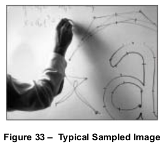
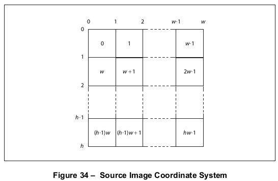
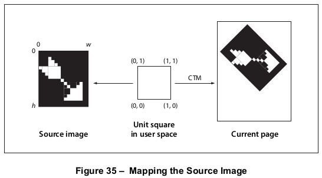

# 8.9 图片

**Images**

## 8.9.1 概述

**General**

=== "中文"

    PDF 的绘制操作符包括处理采样图像的通用设施。*采样图像*（或简称为 *图像*）是 *样本值* 的矩形数组，每个样本值代表一种颜色。图像可能近似于通过输入扫描仪或摄像机获得的自然场景的外观，也可能是合成生成的。
    
    
    
    !!! note "NOTE 1"
    
        图像由扫描图像数组时按行或列顺序获得的样本序列定义。数组中的每个样本包含其指定颜色空间所需的颜色分量数量——例如，**DeviceGray** 一个分量，**DeviceRGB** 三个分量，**DeviceCMYK** 四个分量，或者特定 DeviceN 空间所需的任何数量。每个分量是一个 1、2、4、8 或（PDF 1.5）16 位整数，允许每个分量表示 2、4、16、256 或（PDF 1.5）65536 个不同的值。当使用 JPXDecode 过滤器时，可以容纳其他组件大小；见 [7.4.9]，“JPXDecode 过滤器”。
    
    !!! note "NOTE 2"
    
        PDF 提供了两种指定图像的方法：
    
        *图像 XObject*（在 [8.9.5]，“图像字典”中描述）是一个流对象，其字典指定了图像的属性，其数据包含图像样本。像所有外部对象一样，它通过在内容流中调用 **Do** 操作符在页面上绘制（见 [8.8]，“外部对象”）。图像 XObject 还有其他用途，例如用于替代图像（见 [8.9.5.4]，“替代图像”）、图像蒙版（[8.9.6]，“蒙版图像”）和缩略图图像（[12.3.4]，“缩略图图像”）。
        
        *内联图像* 是一个完全定义在内容流内的小型图像——包括属性和数据。可以用这种方式表示的图像类型是有限的；见 [8.9.7]，“内联图像”了解详细信息。

=== "英文"

    PDF’s painting operators include general facilities for dealing with sampled images. A *sampled image* (or just *image* for short) is a rectangular array of *sample values*, each representing a colour. The image may approximate the appearance of some natural scene obtained through an input scanner or a video camera, or it may be generated synthetically.
    
    
    
    !!! note "NOTE 1"
    
        An image is defined by a sequence of samples obtained by scanning the image array in row or column order. Each sample in the array consists of as many colour components as are needed for the colour space in which they are specified—for example, one component for **DeviceGray**, three for **DeviceRGB**, four for **DeviceCMYK**, or whatever number is required by a particular DeviceN space. Each component is a 1-, 2-, 4-, 8-, or (PDF 1.5) 16-bit integer, permitting the representation of 2, 4, 16, 256, or (PDF 1.5) 65536 distinct values for each component. Other component sizes can be accommodated when a JPXDecode filter is used; see [7.4.9], "JPXDecode Filter".
    
    !!! note "NOTE 2"
    
        PDF provides two means for specifying images:
    
        An *image XObject* (described in [8.9.5], "Image Dictionaries") is a stream object whose dictionary specifies attributes of the image and whose data contains the image samples. Like all external objects, it is painted on the page by invoking the **Do** operator in a content stream (see [8.8], "External Objects"). Image XObjects have other uses as well, such as for alternate images (see [8.9.5.4], "Alternate Images"), image masks ([8.9.6], "Masked Images"), and thumbnail images ([12.3.4], "Thumbnail Images").
        
        An *inline image* is a small image that is completely defined—both attributes and data—directly inline within a content stream. The kinds of images that can be represented in this way are limited; see [8.9.7], "Inline Images" for details.

## 8.9.2 图片参数

**Image Parameters**

=== "中文"

    图像的属性——分辨率、方向、扫描顺序等——完全独立于将要渲染图像的光栅输出设备的特性。一个符合规范的阅读器通常通过一种采样技术来渲染图像，这种技术试图尽可能准确地近似源颜色值。实际达到的准确性取决于输出设备的分辨率和其他属性。
    
    要绘制图像，需要指定四个相互关联的项目：
    
    - 图像的格式：列数（宽度）、行数（高度）、每个样本的颜色分量数以及每个颜色分量的位数
    - 构成图像视觉内容的样本数据
    - 用户空间坐标与图像自身内部坐标空间坐标之间的对应关系，定义了将接收图像的用户空间区域
    - 从图像数据中的颜色分量值到图像颜色空间中分量值的映射
    
    所有这些项目都应由图像 XObject 或内联图像明确或隐含地指定。
    
    !!! note "NOTE"
    
        为了方便起见，以下小节一致地将定义图像的对象称为 *图像字典*。尽管这个术语严格来说只适用于代表图像 XObject 的流对象的字典部分，但应理解为同样适用于流的数据部分或内联图像的参数和数据。

=== "英文"

    The properties of an image—resolution, orientation, scanning order, and so forth—are entirely independent of the characteristics of the raster output device on which the image is to be rendered. A conforming reader usually renders images by a sampling technique that attempts to approximate the colour values of the source as accurately as possible. The actual accuracy achieved depends on the resolution and other properties of the output device.
    
    To paint an image, four interrelated items shall be specified:
    
    - The format of the image: number of columns (width), number of rows (height), number of colour components per sample, and number of bits per colour component
    - The sample data constituting the image’s visual content
    - The correspondence between coordinates in user space and those in the image’s own internal coordinate space, defining the region of user space that will receive the image
    - The mapping from colour component values in the image data to component values in the image’s colour space
    
    All of these items shall be specified explicitly or implicitly by an image XObject or an inline image.
    
    !!! note "NOTE"
    
        For convenience, the following sub-clauses refer consistently to the object defining an image as an *image dictionary*. Although this term properly refers only to the dictionary portion of the stream object representing an image XObject, it should be understood to apply equally to the stream’s data portion or to the parameters and data of an inline image.

## 8.9.3 样例

**Sample Representation**

=== "中文"

    图像的源格式应由四个参数描述：
    
    - 图像的样本宽度
    - 图像的样本高度
    - 每个样本的颜色分量数
    - 每个颜色分量的位数
    
    图像字典应明确指定宽度、高度和每个分量的位数。颜色分量数应从字典中指定的颜色空间推断出来。
    
    !!! note "NOTE"
    
        对于使用 JPXDecode 过滤器的图像（见 [7.4.9]，“JPXDecode 过滤器”），每个分量的位数是从图像数据中确定的，而不是在图像字典中指定的。颜色空间可能在字典中指定，也可能不在字典中指定。
    
    样本数据应表示为字节流，解释为 8 位无符号整数，范围在 0 到 255 之间。这些字节构成一个连续的比特流，每个字节的最高位首先出现。这个比特流又分为每个 *n* 比特的单元，其中 n 是每个分量的位数。每个单元编码一个颜色分量值，最高位首先给出；16 位的单元应以最高有效字节首先给出。字节边界应被忽略，除非样本数据的每一行都从字节边界开始。如果每行的数据位数不是 8 的倍数，则行的末尾用额外的比特填充最后一个字节。一个符合规范的阅读器应忽略这些填充比特。
    
    比特流中的每个 n 位单元应解释为范围在 0 到 \(2^n - 1\) 之间的无符号整数，最高位首先给出。图像字典的 **Decode** 条目将这个整数映射到一个颜色分量值，相当于可以使用颜色操作符如 **sc** 或 **g**。颜色分量应交错样本进行解释；例如，在三分量 *RGB* 图像中，一个样本的红色、绿色和蓝色分量后面跟着下一个样本的红色、绿色和蓝色分量。
    
    如果图像字典的 **ImageMask** 条目为 **false** 或不存在，则图像中的颜色样本应根据图像字典中指定的颜色空间进行解释（见 [8.6]，“颜色空间”），而不参考图形状态中的颜色参数。然而，如果图像字典的 **ImageMask** 条目为真，则样本数据应被解释为应用图形状态的非描边颜色参数的模板掩码（见 [8.9.6.2]，“模板掩码”）。

=== "英文"

    The source format for an image shall be described by four parameters:
    
    - The width of the image in samples
    - The height of the image in samples
    - The number of colour components per sample
    - The number of bits per colour component
    
    The image dictionary shall specify the width, height, and number of bits per component explicitly. The number of colour components shall be inferred from the colour space specified in the dictionary.
    
    !!! note "NOTE"
    
        For images using the JPXDecode filter (see [7.4.9], "JPXDecode Filter"), the number of bits per component is determined from the image data and not specified in the image dictionary. The colour space may or may not be specified in the dictionary.
    
    Sample data shall be represented as a stream of bytes, interpreted as 8-bit unsigned integers in the range 0 to 255. The bytes constitute a continuous bit stream, with the high-order bit of each byte first. This bit stream, in turn, is divided into units of *n* bits each, where n is the number of bits per component. Each unit encodes a colour component value, given with high-order bit first; units of 16 bits shall be given with the most significant byte first. Byte boundaries shall be ignored, except that each row of sample data shall begin on a byte boundary. If the number of data bits per row is not a multiple of 8, the end of the row is padded with extra bits to fill out the last byte. A conforming reader shall ignore these padding bits.
    
    Each n-bit unit within the bit stream shall be interpreted as an unsigned integer in the range 0 to $2^n- 1$, with the high-order bit first. The image dictionary’s **Decode** entry maps this integer to a colour component value, equivalent to what could be used with colour operators such as **sc** or **g**. Colour components shall be interleaved sample by sample; for example, in a three-component *RGB* image, the red, green, and blue components for one sample are followed by the red, green, and blue components for the next.
    
    If the image dictionary's **ImageMask** entry is **false** or absent, the colour samples in an image shall be interpreted according to the colour space specified in the image dictionary (see [8.6], "Colour Spaces"), without reference to the colour parameters in the graphics state. However, if the image dictionary’s **ImageMask** entry is true, the sample data shall be interpreted as a stencil mask for applying the graphics state’s nonstroking colour parameters (see [8.9.6.2], "Stencil Masking").

## 8.9.4 图片坐标系统

**Image Coordinate System**

=== "中文"

    每张图像都有自己的内部坐标系统，或称为*图像空间*。图像占据图像空间中宽度为 *w* 单位、高度为 *h* 单位的矩形，其中 *w* 和 *h* 分别是图像的样本宽度和高度。每个样本占据一个正方形单位。坐标原点 (0, 0) 位于图像的左上角，坐标范围从 0 到 *w* 水平方向和从 0 到 *h* 垂直方向。
    
    图像的样本数据按行顺序排列，水平坐标变化最快。这在图 34 中显示，其中正方形内的数字表示样本的顺序，从 0 开始计数。第一行第一个样本的左上角坐标是 (0, 0)，第二个样本在 (1, 0)，以此类推，直到第一行最后一个样本，其左上角坐标是 (w - 1, 0)，右上角坐标是 (w, 0)。之后的样本坐标是 (0, 1)，(1, 1)，以此类推，直到图像的最后一个样本，其左上角坐标是 (w - 1, h - 1)，右下角坐标是 (w, h)。
    
    !!! note "NOTE"
    
        PDF 所施加的图像坐标系统和扫描顺序并不排斥在实际图像中使用不同的惯例。坐标变换可以用来将其他惯例映射到 PDF 惯例。
    
    图像空间和用户空间之间的对应关系是恒定的：用户空间的单位正方形，由用户坐标 (0, 0) 和 (1, 1) 界定，对应于图像空间中图像的边界（见图 35）。按照用户空间的正常惯例，坐标 (0, 0) 位于该正方形的左下角，对应于图像空间中的坐标 (0, h)。如果显式指定从图像空间到用户空间的隐式变换，将由矩阵 [ 1 ⁄ w 0 0 -1 ⁄ h 0 1 ] 描述。
    
    
    
    
    
    可以通过使用 **cm** 操作符修改当前变换矩阵（CTM），将用户空间的单位正方形映射到图像将要绘制的矩形或平行四边形中的任何位置、方向和大小。通常，这是在一对 **q** 和 **Q** 操作符内部完成的，以隔离变换的效果，其中可以包括平移、旋转、反射和倾斜（见 [8.3]，"坐标系统"）。
    
    !!! info "EXAMPLE"
    
        如果当前资源字典的 **XObject** 子字典定义了名称 Image1 来表示图像 XObject，那么示例中显示的代码将在坐标 (100, 200) 的左下角绘制图像，该图像逆时针旋转 45 度，并且宽度为 150 单位，高度为 80 单位。
    
        ```tex
        q                                            % 保存图形状态
        1 0 0 1 100 200 cm                           % 平移
        1. 7071 0. 7071 -0. 7071 0. 7071 0 0 cm      % 旋转
        150 0 0 80 0 0 cm                            % 缩放
        /Image1 Do                                   % 绘制图像
        Q                                            % 恢复图形状态
        ```
        
        如 [8.3.4] 中讨论的 "变换矩阵"，这三个变换可以合并为一个。当然，如果这个示例中原始图像的纵横比（宽度与高度）与 150:80 不同，结果将会变形。

=== "英文"

    Each image has its own internal coordinate system, or *image space*. The image occupies a rectangle in image space *w* units wide and *h* units high, where *w* and *h* are the width and height of the image in samples. Each sample occupies one square unit. The coordinate origin (0, 0) is at the upper-left corner of the image, with coordinates ranging from 0 to *w* horizontally and 0 to *h* vertically.
    
    The image’s sample data is ordered by row, with the horizontal coordinate varying most rapidly. This is shown in Figure 34, where the numbers inside the squares indicate the order of the samples, counting from 0. The upper-left corner of the first sample is at coordinates (0, 0), the second at (1, 0), and so on through the last sample of the first row, whose upper-left corner is at (w - 1, 0) and whose upper-right corner is at (w, 0). The next samples after that are at coordinates (0, 1), (1, 1), and so on to the final sample of the image, whose upper-left corner is at (w - 1, h - 1) and whose lower-right corner is at (w, h).
    
    !!! note "NOTE"
    
        The image coordinate system and scanning order imposed by PDF do not preclude using different conventions in the actual image. Coordinate transformations can be used to map from other conventions to the PDF convention.
    
    The correspondence between image space and user space is constant: the unit square of user space, bounded by user coordinates (0, 0) and (1, 1), corresponds to the boundary of the image in image space (see Figure 35). Following the normal convention for user space, the coordinate (0, 0) is at the lower-left corner of this square, corresponding to coordinates (0, h) in image space. The implicit transformation from image space to user space, if specified explicitly, would be described by the matrix [ 1 ⁄ w 0 0 -1 ⁄ h 0 1 ].
    
    
    
    
    
    An image can be placed on the output page in any position, orientation, and size by using the **cm** operator to modify the current transformation matrix (CTM) so as to map the unit square of user space to the rectangle or parallelogram in which the image shall be painted. Typically, this is done within a pair of **q** and **Q** operators to isolate the effect of the transformation, which can include translation, rotation, reflection, and skew (see [8.3], "Coordinate Systems").
    
    !!! info "EXAMPLE"
    
        If the **XObject** subdictionary of the current resource dictionary defines the name Image1 to denote an image XObject, the code shown in this example paints the image in a rectangle whose lower-left corner is at coordinates (100, 200), that is rotated 45 degrees counter clockwise, and that is 150 units wide and 80 units high.
    
        ```tex
        q                                            % Save graphics state
        1 0 0 1 100 200 cm                           % Translate
        0. 7071 0. 7071 -0. 7071 0. 7071 0 0 cm      % Rotate
        150 0 0 80 0 0 cm                            % Scale
        /Image1 Do                                   % Paint image
        Q                                            % Restore graphics state
        ```
        
        As discussed in [8.3.4], "Transformation Matrices", these three transformations could be combined into one. Of course, if the aspect ratio (width to height) of the original image in this example is different from 150:80, the result will be distorted.

## 8.9.5 图片字典

**Image Dictionaries**

### 8.9.5.1 概述

**General**

=== "中文"

    图像字典——即代表图像 XObject 的流的字典部分——除了所有流共有的常规条目（见 [表 5](../c7/s3.md#table5)）外，还可能包含 [表 89](#table89) 中列出的条目。这些条目之间有许多关系，当前颜色空间可能限制其中一些条目的选择。尝试使用条目彼此不一致或与当前颜色空间不一致的图像字典将导致错误。
    
    这里描述的条目适用于 *基础图像*——直接用 **Do** 操作符调用的图像。有些条目不应用于以其他方式使用的图像，例如替代图像（见 [8.9.5.4]，"替代图像"）、图像蒙版（见 8.9.6，"蒙版图像"）或缩略图图像（见 [12.3.4]，"缩略图图像"）。除非另有说明，否则这些不相关的条目会被一个符合规范的阅读器忽略。
    
    <table id="table89" markdown="span">
        <caption>**表 89 – 图像字典的附加条目**</caption>
        <thead>
            <tr>
                <th>**键**</th>
                <th>**类型**</th>
                <th>**值**</th>
            </tr>
        </thead>
        <tbody>
            <tr>
                <td>**Type**</td>
                <td>name</td>
                <td>(*可选*) 此字典描述的 PDF 对象类型；如果存在，对于图像 XObject 应为 **XObject**。</td>
            </tr>
            <tr>
                <td>**Subtype**</td>
                <td>name</td>
                <td>(*必需*) 此字典描述的 XObject 类型；对于图像 XObject，应为 **Image**。</td>
            </tr>
            <tr>
                <td>**Width**</td>
                <td>integer</td>
                <td>(*必需*) 图像的宽度，以采样点为单位。</td>
            </tr>
            <tr>
                <td>**Height**</td>
                <td>integer</td>
                <td>(*必需*) 图像的高度，以采样点为单位。</td>
            </tr>
            <tr>
                <td>**ColorSpace**</td>
                <td>name or array</td>
                <td>(*对使用 **JPXDecode** 过滤器的图像是可选的；对图像遮罩是禁止的*) 图像采样点所在的颜色空间；可以是除 **Pattern** 之外的任何类型的颜色空间。<br/>
                如果图像使用 **JPXDecode** 过滤器，此条目可以存在：<br/>
                <ul>
                <li>如果存在 **ColorSpace**，则忽略 JPEG2000 数据中的任何颜色空间规范。</li>
                <li>如果 **ColorSpace** 缺失，则使用 JPEG2000 数据中的颜色空间规范。除非 **ImageMask** 为 **true**，否则忽略 **Decode** 数组。</li>
                </ul>
                </td>
            </tr>
            <tr>
                <td>**BitsPerComponent**</td>
                <td>integer</td>
                <td>(*对图像遮罩和使用 **JPXDecode** 过滤器的图像是可选的*) 表示每个颜色分量使用的位数。只能指定一个值；所有颜色分量的位数应相同。值可以是 1、2、4、8 或 (在 PDF 1.5 中) 16。如果 **ImageMask** 为 **true**，此条目是可选的，但如果指定，其值应为 1。<br/> 如果图像流使用过滤器，则 **BitsPerComponent** 的值应与过滤器传送的数据样本大小一致。特别地，**CCITTFaxDecode** 或 **JBIG2Decode** 过滤器应始终传送 1 位样本，**RunLengthDecode** 或 **DCTDecode** 过滤器应始终传送 8 位样本，而 **LZWDecode** 或 **FlateDecode** 过滤器应在使用预测函数时传送指定大小的样本。<br/> 如果图像流使用 **JPXDecode** 过滤器，此条目是可选的，如果存在则应被忽略。位深度由合规阅读器在解码 JPEG2000 图像过程中确定。</td>
            </tr>
            <tr>
                <td>**Intent**</td>
                <td>name</td>
                <td>(*可选；PDF 1.1*) 渲染图像时使用的颜色渲染意图的名称（见 [8.6.5.8]，“渲染意图”）。默认值：图形状态中的当前渲染意图。</td>
            </tr>
            <tr>
                <td>**ImageMask**</td>
                <td>boolean</td>
                <td>(可选) 指示图像是否应被视为图像遮罩的标志（见 [8.9.6]，“遮罩图像”）。如果此标志为 **true**，则 **BitsPerComponent** 的值应为 1，且不应指定 **Mask** 和 **ColorSpace**；未遮罩的区域应使用当前非描边颜色进行绘制。默认值：**false**。</td>
            </tr>
            <tr>
                <td>**Mask**</td>
                <td>stream or array</td>
                <td>(*对图像遮罩是可选的；对图像遮罩是禁止的；PDF 1.3*) 定义应用于此图像的图像遮罩的图像 XObject（见 [8.9.6.3]，“显式遮罩”），或指定应用于它的颜色键遮罩的颜色范围数组（见 [8.9.6.4]，“颜色键遮罩”）。如果 **ImageMask** 为 **true**，则此条目不应存在。</td>
            </tr>
            <tr>
                <td>**Decode**</td>
                <td>array</td>
                <td>(可选) 描述如何将图像样本映射到适合图像颜色空间的值范围的数字数组（见 [8.9.5.2]，“解码数组”）。如果 **ImageMask** 为 **true**，则数组应为 [ 0 1 ] 或 [ 1 0 ] 之一；否则，其长度应为 **ColorSpace** 所需颜色分量数量的两倍。如果图像使用 **JPXDecode** 过滤器且 **ImageMask** 为 **false**，合规阅读器应忽略 **Decode**。默认值：见 [8.9.5.2]，“解码数组”。</td>
            </tr>
            <tr>
                <td>**Interpolate**</td>
                <td>boolean</td>
                <td>(可选) 指示合规阅读器是否应执行图像插值的标志（见 [8.9.5.3]，“图像插值”）。默认值：**false**。</td>
            </tr>
            <tr>
                <td>**Alternates**</td>
                <td>array</td>
                <td>(*可选；PDF 1.3*) 此图像的备用图像字典数组（见 [8.9.5.4]，“备用图像”）。数组中的元素顺序无意义。此条目不应存在于本身为备用图像的图像 XObject 中。</td>
            </tr>
            <tr>
                <td>**SMask**</td>
                <td>stream</td>
                <td>(*可选；PDF 1.4*) 一个附属图像 XObject，定义一个软遮罩图像（见 [11.6.5.3]，“软遮罩图像”），用于在透明成像模型中用作遮罩形状或遮罩不透明度值的来源。图形状态中的 alpha 源参数决定了遮罩值应被解释为形状还是不透明度。<br/> 如果存在，此条目应覆盖图形状态中的当前软遮罩，以及图像的 **Mask** 条目（如果有）。然而，其他与透明度相关的图形状态参数——混合模式和 alpha 常量——应保持有效。如果 **SMask** 缺失，图像不应有相关的软遮罩（尽管图形状态中的当前软遮罩可能仍然适用）。</td>
            </tr>
            <tr>
                <td>**SMaskInData**</td>
                <td>integer</td>
                <td>(*对使用 **JPXDecode** 过滤器的图像是可选的，否则无意义；PDF 1.5*) 一个代码，指定与图像样本一起编码的软遮罩信息（见 [11.6.5.3]，“软遮罩图像”）应如何使用：<br/> 0 &nbsp;如果存在，忽略编码的软遮罩图像信息。<br/> 1 &nbsp;图像的数据流包含编码的软遮罩值。合规阅读器可以从信息中创建一个软遮罩图像，用作透明成像模型中的遮罩形状或不透明度的来源。<br/> 2 &nbsp;图像的数据流包含已与背景预混合的颜色通道；图像数据还包含一个不透明度通道。合规阅读器可以从不透明度通道信息中创建一个具有 **Matte** 条目的软遮罩图像，用作透明成像模型中的遮罩形状或不透明度的来源。<br/> 如果此条目具有非零值，则不应指定 **SMask**。另见 [7.4.9]，“JPXDecode 过滤器”。<br/> 默认值：0。</td>
            </tr>
            <tr>
                <td>**Name**</td>
                <td>name</td>
                <td>(*在 PDF 1.0 中 必需；在其他版本中可选*) 在当前资源字典的 **XObject** 子字典中引用此图像 XObject 的名称（见 [7.8.3]，“资源字典”）。<br/> 此条目已过时，不应再使用。</td>
            </tr>
            <tr>
                <td>**StructParent**</td>
                <td>integer</td>
                <td>(*如果图像是结构化内容项则必需；PDF 1.3*) 图像在结构父树中的条目的整数键（见 [14.7.4.4]，“从内容项找到结构元素”）。</td>
            </tr>
            <tr>
                <td>**ID**</td>
                <td>byte string</td>
                <td>(*可选；PDF 1.3；建议使用间接引用*) 图像的父 Web 捕获内容集的数字标识符（见 [14.10.6]，“与 Web 捕获相关的对象属性”）。</td>
            </tr>
            <tr>
                <td>**OPI**</td>
                <td>dictionary</td>
                <td>(可选；PDF 1.2) 图像的 OPI 版本字典；见 [14.11.7]，“开放预压接口（OPI）”。如果 **ImageMask** 为 **true**，则忽略此条目。</td>
            </tr>
            <tr>
                <td>**Metadata**</td>
                <td>stream</td>
                <td>(*可选；PDF 1.4*) 包含图像元数据的元数据流（见 [14.3.2]，“元数据流”）。</td>
            </tr>
            <tr>
                <td>**OC**</td>
                <td>dictionary</td>
                <td>(*可选；PDF 1.5*) 一个可选内容组或可选内容成员资格字典（见 [8.11]，“可选内容”），指定此图像 XObject 的可选内容属性。在合规阅读器处理图像之前，应基于此条目确定其可见性。如果确定为不可见，则应跳过整个图像，就像没有 **Do** 操作符来调用它一样。</td>
            </tr>
        </tbody>
    </table>
    
    !!! info "EXAMPLE"
    
        这个示例定义了一个图像，宽度为 256 个样本，高度为 256 个样本，在 DeviceGray 颜色空间中每个样本有 8 位。它将图像绘制在页面上，其左下角定位在当前用户空间坐标 (45, 140)，并缩放到用户空间单位宽度和高度为 132。
        
        ```tex
        20 0 obj                            % 页面对象
            << /Type /Page
                /Parent 1 0 R
                /Resources 21 0 R
                /MediaBox [ 0 0 612 792 ]
                /Contents 23 0 R
            >>
        endobj
        
        21 0 obj                            % 页面的资源字典
            << /ProcSet [ /PDF /ImageB ]
                /XObject << /Im1 22 0 R >>
            >>
        endobj
        
        22 0 obj                            % 图像 XObject
            << /Type /XObject
                /Subtype /Image
                /Width 256
                /Height 256
                /ColorSpace /DeviceGray
                /BitsPerComponent 8
                /Length 83183
                /Filter /ASCII85Decode
            >>
        
        stream
        9LhZI9h\GY9i+bb;,p:e;G9SP92/)X9MJ>^:f14d;,U(X8P;cO;G9e];c$=k9Mn\]
        … 代表 65,536 个样本的图像数据 …
        8P;cO;G9e];c$=k9Mn\]~>
        endstream
        endobj
        
        23 0 obj                            % 页面内容
            << /Length 56 >>
        stream
            q                                % 保存图形状态
                132 0 0 132 45 140 cm        % 移动到 (45,140) 并按 132 缩放
                /Im1 Do                      % 绘制图像
            Q                                % 恢复图形状态
        endstream
        endobj
        ```
        

=== "英文"

    An image dictionary—that is, the dictionary portion of a stream representing an image XObject—may contain the entries listed in [Table 89](#table89) in addition to the usual entries common to all streams (see [Table 5](../c7/s3.md#table5)). There are many relationships among these entries, and the current colour space may limit the choices for some of them. Attempting to use an image dictionary whose entries are inconsistent with each other or with the current colour space shall cause an error.
    
    The entries described here are appropriate for a *base image*—one that is invoked directly with the **Do** operator. Some of the entries should not be used for images used in other ways, such as for alternate images (see [8.9.5.4], "Alternate Images"), image masks (see 8.9.6, "Masked Images"), or thumbnail images (see [12.3.4], "Thumbnail Images"). Except as noted, such irrelevant entries are simply ignored by a conforming reader
    
    <table id="table89" markdown="span">
        <caption>**Table 89 – Additional Entries Specific to an Image Dictionary**</caption>
        <thead>
            <tr>
                <th>**Key**</th>
                <th>**Type**</th>
                <th>**Value**</th>
            </tr>
        </thead>
        <tbody>
            <tr>
                <td>**Type**</td>
                <td>name</td>
                <td>(*Optional*) The type of PDF object that this dictionary describes; if present, shall be **XObject** for an image XObject.</td>
            </tr>
            <tr>
                <td>**Subtype**</td>
                <td>name</td>
                <td>(*Required*) The type of XObject that this dictionary describes; shall be **Image** for an image XObject.</td>
            </tr>
            <tr>
                <td>**Width**</td>
                <td>integer</td>
                <td>(*Required*) The width of the image, in samples.</td>
            </tr>
            <tr>
                <td>**Height**</td>
                <td>integer</td>
                <td>(*Required*) The height of the image, in samples.</td>
            </tr>
            <tr>
                <td>**ColorSpace**</td>
                <td>name or array</td>
                <td>(*Required for images, except those that use the **JPXDecode** filter; not allowed forbidden for image masks*) The colour space in which image samples shall be specified; it can be any type of colour space except **Pattern**.<br/>
                If the image uses the **JPXDecode** filter, this entry may be present:<br/>
                <ul>
                <li>If **ColorSpace** is present, any colour space specifications in the JPEG2000 data shall be ignored.</li>
                <li>If **ColorSpace** is absent, the colour space specifications in the JPEG2000 data shall be used. The **Decode** array shall also be ignored unless **ImageMask** is **true**.</li>
                </ul>
                </td>
            </tr>
            <tr>
                <td>**BitsPerComponent**</td>
                <td>integer</td>
                <td>(*Required except for image masks and images that use the **JPXDecode** filter*) The number of bits used to represent each colour component. Only a single value shall be specified; the number of bits shall be the same for all colour components. The value shall be 1, 2, 4, 8, or (in PDF 1.5) 16. If **ImageMask** is **true**, this entry is optional, but if specified, its value shall be 1. <br/> If the image stream uses a filter, the value of **BitsPerComponent** shall be consistent with the size of the data samples that the filter delivers. In particular, a **CCITTFaxDecode** or **JBIG2Decode** filter shall always deliver 1-bit samples, a **RunLengthDecode** or **DCTDecode** filter shall always deliver 8-bit samples, and an **LZWDecode** or **FlateDecode** filter shall deliver samples of a specified size if a predictor function is used.<br/> If the image stream uses the **JPXDecode** filter, this entry is optional and shall be ignored if present. The bit depth is determined by the conforming reader in the process of decoding the JPEG2000 image.</td>
            </tr>
            <tr>
                <td>**Intent**</td>
                <td>name</td>
                <td>(*Optional; PDF 1.1*) The name of a colour rendering intent to be used in rendering the image (see [8.6.5.8], "Rendering Intents"). Default value: the current rendering intent in the graphics state.</td>
            </tr>
            <tr>
                <td>**ImageMask**</td>
                <td>boolean</td>
                <td>(Optional) A flag indicating whether the image shall be treated as an image mask (see [8.9.6], "Masked Images"). If this flag is **true**, the value of **BitsPerComponent** shall be 1 and **Mask** and **ColorSpace** shall not be specified; unmasked areas shall be painted using the current nonstroking colour. Default value: **false**.</td>
            </tr>
            <tr>
                <td>**Mask**</td>
                <td>stream or array</td>
                <td>(*Optional except for image masks; not allowed for image masks; PDF 1.3*) An image XObject defining an image mask to be applied to this image (see [8.9.6.3], "Explicit Masking"), or an array specifying a range of colours to be applied to it as a colour key mask (see [8.9.6.4], "Colour Key Masking"). If **ImageMask** is **true**, this entry shall not be present.</td>
            </tr>
            <tr>
                <td>**Decode**</td>
                <td>array</td>
                <td>(Optional) An array of numbers describing how to map image samples into the range of values appropriate for the image’s colour space (see [8.9.5.2], "Decode Arrays"). If **ImageMask** is **true**, the array shall be either [ 0 1 ] or [ 1 0 ]; otherwise, its length shall be twice the number of colour components required by ColorSpace. If the image uses the **JPXDecode** filter and **ImageMask** is **false**, **Decode** shall be ignored by a conforming reader. Default value: see [8.9.5.2], "Decode Arrays".</td>
            </tr>
            <tr>
                <td>**Interpolate**</td>
                <td>boolean</td>
                <td>(Optional) A flag indicating whether image interpolation shall be performed by a conforming reader (see [8.9.5.3], "Image Interpolation"). Default value: **false**.</td>
            </tr>
            <tr>
                <td>**Alternates**</td>
                <td>array</td>
                <td>(*Optional; PDF 1.3*) An array of alternate image dictionaries for this image (see [8.9.5.4], "Alternate Images"). The order of elements within the array shall have no significance. This entry shall not be present in an image XObject that is itself an alternate image.</td>
            </tr>
            <tr>
                <td>**SMask**</td>
                <td>stream</td>
                <td>(*Optional; PDF 1.4*) A subsidiary image XObject defining a soft- *mask image* (see [11.6.5.3], "Soft-Mask Images") that shall be used as a source of mask shape or mask opacity values in the transparent imaging model. The alpha source parameter in the graphics state determines whether the mask values shall be interpreted as shape or opacity.<br/> If present, this entry shall override the current soft mask in the graphics state, as well as the image’s **Mask** entry, if any. However, the other transparency-related graphics state parameters—blend mode and alpha constant—shall remain in effect. If **SMask** is absent, the image shall have no associated soft mask (although the current soft mask in the graphics state may still apply).</td>
            </tr>
            <tr>
                <td>**SMaskInData**</td>
                <td>integer</td>
                <td>(*Optional for images that use the **JPXDecode** filter, meaningless otherwise; PDF 1.5*) A code specifying how soft-mask information (see [11.6.5.3], "Soft-Mask Images") encoded with image samples shall be used:<br/> 0 &nbsp;If present, encoded soft-mask image information shall be ignored.<br/> 1 &nbsp;The image’s data stream includes encoded soft-mask values. A conforming reader may create a soft-mask image from the information to be used as a source of mask shape or mask opacity in the transparency imaging model.<br/> 2 &nbsp;The image’s data stream includes colour channels that have been preblended with a background; the image data also includes an opacity channel. A conforming reader may create a soft-mask image with a **Matte** entry from the opacity channel information to be used as a source of mask shape or mask opacity in the transparency model.<br/> If this entry has a nonzero value, **SMask** shall not be specified. See also [7.4.9], "JPXDecode Filter".<br/> Default value: 0.</td>
            </tr>
            <tr>
                <td>**Name**</td>
                <td>name</td>
                <td>(*Required in PDF 1.0; optional otherwise*) The name by which this image XObject is referenced in the **XObject** subdictionary of the current resource dictionary (see [7.8.3], "Resource Dictionaries").<br/> This entry is obsolescent and shall no longer be used.</td>
            </tr>
            <tr>
                <td>**StructParent**</td>
                <td>integer</td>
                <td>(*Required if the image is a structural content item; PDF 1.3*) The integer key of the image’s entry in the structural parent tree (see [14.7.4.4], "Finding Structure Elements from Content Items").</td>
            </tr>
            <tr>
                <td>**ID**</td>
                <td>byte string</td>
                <td>(*Optional; PDF 1.3; indirect reference preferred*) The digital identifier of the image’s parent Web Capture content set (see [14.10.6], "Object Attributes Related to Web Capture").</td>
            </tr>
            <tr>
                <td>**OPI**</td>
                <td>dictionary</td>
                <td>(Optional; PDF 1.2) An OPI version dictionary for the image; see [14.11.7], "Open Prepress Interface (OPI)". If **ImageMask** is **true**, this entry shall be ignored.</td>
            </tr>
            <tr>
                <td>**Metadata**</td>
                <td>stream</td>
                <td>(*Optional; PDF 1.4*) A metadata stream containing metadata for the image (see [14.3.2], "Metadata Streams").</td>
            </tr>
            <tr>
                <td>**OC**</td>
                <td>dictionary</td>
                <td>(*Optional; PDF 1.5*) An optional content group or optional content membership dictionary (see [8.11], "Optional Content"), specifying the optional content properties for this image XObject. Before the image is processed by a conforming reader, its visibility shall be determined based on this entry. If it is determined to be invisible, the entire image shall be skipped, as if there were no **Do** operator to invoke it.</td>
            </tr>
        </tbody>
    </table>
    
    !!! info "EXAMPLE"
    
        This example defines an image 256 samples wide by 256 high, with 8 bits per sample in the DeviceGray colour space. It paints the image on a page with its lower-left corner positioned at coordinates (45, 140) in current user space and scaled to a width and height of 132 user space units.
    
        ```tex
        20 0 obj                            % Page object
            << /Type /Page
               /Parent 1 0 R
               /Resources 21 0 R
               /MediaBox [ 0 0 612 792 ]
               /Contents 23 0 R
            >>
        endobj
    
        21 0 obj                            % Resource dictionary for page
            << /ProcSet [ /PDF /ImageB ]
               /XObject << /Im1 22 0 R >>
            >>
        endobj
    
        22 0 obj                            % Image XObject
            << /Type /XObject
               /Subtype /Image
               /Width 256
               /Height 256
               /ColorSpace /DeviceGray
               /BitsPerComponent 8
               /Length 83183
               /Filter /ASCII85Decode
            >>
    
        stream
        9LhZI9h\GY9i+bb;,p:e;G9SP92/)X9MJ>^:f14d;,U(X8P;cO;G9e];c$=k9Mn\]
        … Image data representing 65,536 samples …
        8P;cO;G9e];c$=k9Mn\]~>
        endstream
        endobj
    
        23 0 obj                            % Contents of page
            << /Length 56 >>
        stream
            q                                % Save graphics state
                132 0 0 132 45 140 cm        % Translate to (45,140) and scale by 132
                /Im1 Do                      % Paint image
            Q                                % Restore graphics state
        endstream
        endobj
        ```

### 8.9.5.2 解码数组

**Decode Arrays**

=== "中文"

    图像的数据流最初被分解为 0 到 $2^n - 1$ 范围内的整数，其中 n 是图像字典的 **BitsPerComponent** 项的值。图像的 **Decode** 数组指定了每个整数分量值到图像颜色空间中适合作为分量值的数字的线性映射。
    
    **Decode** 数组中的每对数字指定了图像中样本值域被映射到的下限值和上限值。**Decode** 数组应包含一个数字对，针对图像 **ColorSpace** 项指定的颜色空间中的每个分量。合规阅读器应对每个颜色分量进行线性变换映射，即应使用以下公式进行线性插值：
    
    $$
    \begin{align}
        y &= \text{Interpolate}(x, x_{min}, x_{max}, y_{min}, y_{max}) \\
            &= y_{min} + \left ( (x - x_{min}) \times \frac{y_{max} - y_{min}}{x_{max} - x_{min}}  \right ) 
    \end{align}
    $$
    
    该公式用于将介于 $x_{min}$ 和 $x_{max}$ 之间的值 *x* 转换为介于 $y_{min}$ 和 $y_{max}$ 之间的相应值 *y*，沿由点 $(x_{min} , y_{min})$ 和 $(x_{max} , y_{max})$ 定义的线进行投影。
    
    !!! note "注释 1"
    
        虽然该公式适用于域 $x_{min}$ 到 $x_{max}$ 之外的值，并且不要求 $x_{min} < x_{max}$，但用于颜色转换（如 **Decode** 数组）的插值确实要求 $x_{min} < x_{max}$ 并将 *x* 值限制在此域内，因此对于所有 $x \le x_{min}$，$y = y_{min}$，对于所有 $x \ge x_{max}$，$y = y_{max}$。
    
    对于形如 [ Dmin Dmax ] 的 **Decode** 数组，可以写成：
    
    $$
    \begin{align}
        y &= \text{Interpolate}(x, 0, 2^n-1, D_{min}, D_{max}) \\
            &= D_{min} + \left ( x \times \frac{D_{max} - D_{min}}{2^n - 1}  \right ) 
    \end{align}
    $$
    
    其中
    
    *n* 是 BitsPerComponent 的值
    
    *x* 是输入值，范围为 0 到 $2^n - 1$
    
    $D_{min}$ 和 $D_{max}$ 是 **Decode** 数组中指定的值
    
    *y* 是输出值，应在图像的颜色空间中解释
    
    值为 0 的样本应被映射到 $D_{min}$，值为 $2^n - 1$ 的样本应被映射到 $D_{max}$，中间值应在 $D_{min}$ 和 $D_{max}$ 之间线性映射。[表 90](#table90) 列出了合规阅读器应在各种颜色空间中使用的默认 **Decode** 数组。
    
    !!! note "NOTE 2"
    
        对于大多数颜色空间，表中列出的 **Decode** 数组映射到允许的分量值的完整范围。对于 **Indexed** 颜色空间，默认的 **Decode** 数组确保索引颜色表的分量值不变地传递。
    
    <table id="table90" markdown="span">
        <caption>**Table 90 – 默认 Decode 数组**</caption>
        <thead>
            <tr>
                <th>**Colour Space**</th>
                <th>**Decode Array**</th>
            </tr>
        </thead>
        <tbody>
            <tr>
                <td>**DeviceGray**</td>
                <td>[0.0 1.0]</td>
            </tr>
            <tr>
                <td>**DeviceRGB**</td>
                <td>[0.0 1.0 0.0 1.0 0.0 1.0]</td>
            </tr>
            <tr>
                <td>**DeviceCMYK**</td>
                <td>[0.0 1.0 0.0 1.0 0.0 1.0 0.0 1.0]</td>
            </tr>
            <tr>
                <td>**CalGray**</td>
                <td>[0.0 1.0]</td>
            </tr>
            <tr>
                <td>**CalRGB**</td>
                <td>[0.0 1.0 0.0 1.0 0.0 1.0]</td>
            </tr>
            <tr>
                <td>**Lab**</td>
                <td>$[0 \space 100 \space a_{min} \space a_{max} \space b_{min} \space b_{max}]$ 其中 $a_{min}$ , $a_{max}$ , $b_{min}$ , 和 $b_{max}$ 对应于图像颜色空间中 **Range** 数组的值</td>
            </tr>
            <tr>
                <td>**ICCBased**</td>
                <td>与图像颜色空间的 ICC 配置文件中的 **Range** 值相同</td>
            </tr>
            <tr>
                <td>**Indexed**</td>
                <td>[0 N], 其中 $N = 2^n − 1$</td>
            </tr>
            <tr>
                <td>**Pattern**</td>
                <td>(不允许与图像一起使用)</td>
            </tr>
            <tr>
                <td>**Separation**</td>
                <td>[0.0 1.0]</td>
            </tr>
            <tr>
                <td>**DeviceN**</td>
                <td>[0.0 1.0 0.0 1.0 … 0.0 1.0] (每个颜色分量一对元素)</td>
            </tr>
        </tbody>
    </table>
    
    !!! note "NOTE 3"

        可以指定一个映射，通过设置 $D_{\text{min}}$ 值大于 $D_{\text{max}}$ 来反转样本颜色强度。例如，如果图像的颜色空间是 **DeviceGray** 并且 **Decode** 数组是 [1.0 0.0]，输入值为 0 映射到 1.0（白色）；输入值为 $2^n - 1$ 映射到 0.0（黑色）。

    对于颜色分量的 $D_{\text{min}}$ 和 $D_{\text{max}}$ 参数，它们不需要落在该分量允许值的范围内。

    
    !!! note "NOTE 4"

        例如，如果某个应用程序使用6位数字作为其原生图像采样格式，则它可以以8位形式在PDF中表示这些采样值，将每个采样值的两个高阶未使用位设置为0。然后，图像字典应指定一个 **Decode** 数组为 [0.00000 4.04762]，该数组将输入值从0到63映射到0.0到1.0的范围（4.04762大约等于255的63次方的三分之一）。
    
    如果输出值超出了组件允许的范围，则应自动调整到最接近的允许值。

=== "英文"

    An image’s data stream is initially decomposed into integers in the domain 0 to $2^n -1$, where n is the value of the image dictionary’s **BitsPerComponent** entry. The image’s **Decode** array specifies a linear mapping of each integer component value to a number that would be appropriate as a component value in the image’s colour space.
    
    Each pair of numbers in a **Decode** array specifies the lower and upper values to which the domain of sample values in the image is mapped. A **Decode** array shall contain one pair of numbers for each component in the colour space specified by the image’s **ColorSpace** entry. The mapping for each colour component, by a conforming reader shall be a linear transformation; that is, it shall use the following formula for linear interpolation:
    
    $$
    \begin{align}
       y &= \text{Interpolate}(x, x_{min}, x_{max}, y_{min}, y_{max}) \\
         &= y_{min} + \left ( (x - x_{min}) \times \frac{y_{max} - y_{min}}{x_{max} - x_{min}}  \right ) 
    \end{align}
    $$
    
    This formula is used to convert a value *x* between $x_{min}$ and $x_{max}$ to a corresponding value *y* between $y_{min}$  and $y_{max}$ , projecting along the line defined by the points $(x_{min} , y_{min})$ and $(x_{max} , y_{max})$.
    
    !!! note "NOTE 1"
    
        While this formula applies to values outside the domain $x_{min}$ to $x_{max}$ and does not require that $x_{min} < x_{max}$ , note that interpolation used for colour conversion, such as the **Decode** array, does require that $x_{min} < x_{max}$ and clips *x* values to this domain so that $y = y_{min}$ for all $x £ x_{min}$ , and $y = y_{max]$ for all $x Š x_{max}$ .
    
    For a **Decode** array of the form [ Dmin Dmax ], this can be written as
    
    $$
    \begin{align}
       y &= \text{Interpolate}(x, 0, 2^n-1,D_{min},D_{max}) \\
         &= D_{min} + \left ( x \times \frac{D_{max} - D_{min}}{2^n - 1}  \right ) 
    \end{align}
    $$
    
    where
    
    *n* shall be the value of BitsPerComponent
    
    *x* shall be the input value, in the domain 0 to $2^n - 1$
    
    $D_{min}$ and Dmax shall be the values specified in the **Decode** array
    
    *y* is the output value, which shall be interpreted in the image’s colour space
    
    Samples with a value of 0 shall be mapped to $D_{min}$ , those with a value of $2^n - 1$ shall be mapped to $D_{max}$ , and those with intermediate values shall be mapped linearly between $D_{min}$ and $D_{max}$. [Table 90](#table90) lists the default **Decode** arrays which shall be used with the various colour spaces by a conforming reader.
    
    !!! note "NOTE 2"
    
        For most colour spaces, the **Decode** arrays listed in the table map into the full range of allowed component values. For an **Indexed** colour space, the default **Decode** array ensures that component values that index a colour table are passed through unchanged.
    
    <table id="table90" markdown="span">
        <caption>**Table 90 – Default Decode Arrays**</caption>
        <thead>
            <tr>
                <th>**Colour Space**</th>
                <th>**Decode Array**</th>
            </tr>
        </thead>
        <tbody>
            <tr>
                <td>**DeviceGray**</td>
                <td>[0.0 1.0]</td>
            </tr>
            <tr>
                <td>**DeviceRGB**</td>
                <td>[0.0 1.0 0.0 1.0 0.0 1.0]</td>
            </tr>
            <tr>
                <td>**DeviceCMYK**</td>
                <td>[0.0 1.0 0.0 1.0 0.0 1.0 0.0 1.0]</td>
            </tr>
            <tr>
                <td>**CalGray**</td>
                <td>[0.0 1.0]</td>
            </tr>
            <tr>
                <td>**CalRGB**</td>
                <td>[0.0 1.0 0.0 1.0 0.0 1.0]</td>
            </tr>
            <tr>
                <td>**Lab**</td>
                <td>$[0 \space 100 \space a_{min} \space a_{max} \space b_{min} \space b_{max}]$ where $a_{min}$ , $a_{max}$ , $b_{min}$ , and $b_{max}$ correspond to the values in the **Range** array of the image’s colour space</td>
            </tr>
            <tr>
                <td>**ICCBased**</td>
                <td>Same as the value of **Range** in the ICC profile of the image’s colour space</td>
            </tr>
            <tr>
                <td>**Indexed**</td>
                <td>[0 N], where $N = 2^n − 1$</td>
            </tr>
            <tr>
                <td>**Pattern**</td>
                <td>(Not permitted with images)</td>
            </tr>
            <tr>
                <td>**Separation**</td>
                <td>[0.0 1.0]</td>
            </tr>
            <tr>
                <td>**DeviceN**</td>
                <td>[0.0 1.0 0.0 1.0 … 0.0 1.0] (one pair of elements for each colour component)</td>
            </tr>
        </tbody>
    </table>
    
    !!! note "NOTE 3"
    
        It is possible to specify a mapping that inverts sample colour intensities by specifying a $D_{min}$ value greater than $D_{max}$ . For example, if the image’s colour space is **DeviceGray** and the **Decode** array is [1.0 0.0], an input value of 0 is mapped to 1.0 (white); an input value of $2^n - 1$ is mapped to 0.0 (black).
    
    The $D_{min}$ and $D_{max}$ parameters for a colour component need not fall within the range of values allowed for that component.
    
    !!! note "NOTE 4"
    
        For instance, if an application uses 6-bit numbers as its native image sample format, it can represent those samples in PDF in 8-bit form, setting the two unused high-order bits of each sample to 0. The image dictionary should then specify a **Decode** array of [0.00000 4.04762 ], which maps input values from 0 to 63 into the range 0.0 to 1.0 (4.04762 being approximately equal to 255<sup>3<sup> 63).
    
    If an output value falls outside the range allowed for a component, it shall be automatically adjusted to the nearest allowed value.

### 8.9.5.3 图片插值

**Image Interpolation**

=== "中文"

    当源图像的分辨率显著低于输出设备的分辨率时，每个源样本会覆盖多个设备像素。因此，图像可能会出现锯齿状或块状。通过在渲染期间应用图像插值算法，可以减少这些视觉伪影。图像插值不是将所有被源样本覆盖的像素都涂上相同的颜色，而是试图在相邻样本值之间产生平滑的过渡。

    通过将图像字典中的 **Interpolate** 条目设置为 **true**，可以启用图像插值。默认情况下应该禁用它，因为它可能会增加渲染图像所需的时间。
    
    !!! note "NOTE"
    
        一个符合规范的阅读器可以选择不实现PDF的此功能，或者可以使用它希望的任何特定插值实现。

=== "英文"

    When the resolution of a source image is significantly lower than that of the output device, each source sample covers many device pixels. As a result, images can appear jaggy or blocky. These visual artifacts can be reduced by applying an *image interpolation* algorithm during rendering. Instead of painting all pixels covered by a source sample with the same colour, image interpolation attempts to produce a smooth transition between adjacent sample values.
    
    Image interpolation is enabled by setting the **Interpolate** entry in the image dictionary to **true**. It shall be disabled by default because it may increase the time required to render the image.
    
    !!! note "NOTE"
    
        A conforming Reader may choose to not implement this feature of PDF, or may use any specific implementation of interpolation that it wishes.

### 8.9.5.4 替代图片

**Alternate Images**

=== "中文"

    *替代图像(Alternate images)*（PDF 1.3）为在PDF文件中包含多个图像版本提供了一种直接且向后兼容的方式，用于不同的目的。这些图像的变体表示可能在分辨率或颜色空间等方面有所不同。主要目标是减少为低分辨率屏幕查看和高分辨率打印维护单独版本的PDF文档的需求。
    
    *基础图像(base image)*（即在资源字典中引用的图像XObject）可以包含一个 **Alternates** 条目。此条目的值应为一个数组，包含指定基础图像的变体表示的*替代图像字典*。每个替代图像字典应包含一个图像XObject，用于表示一个变体，并应指定其属性。表91显示了替代图像字典的内容。

    <table id="table91" markdown="span">
        <caption>**表 91 – 替代图像字典中的条目**</caption>
        <thead>
            <tr>
                <th>**键**</th>
                <th>**类型**</th>
                <th>**值**</th>
            </tr>
        </thead>
        <tbody>
            <tr>
                <td>**Image**</td>
                <td>stream</td>
                <td>(*必需*) 替代图像的图像 XObject。</td>
            </tr>
            <tr>
                <td>**DefaultForPrinting**</td>
                <td>boolean</td>
                <td>(*可选*) 指示此替代图像是否应为默认打印版本的标志。对于给定的基本图像，至多只有一个替代图像可以被指定为默认打印版本。如果没有替代图像的此条目设置为 **true**，则符合标准的阅读器将在打印时使用基本图像。</td>
            </tr>
            <tr>
                <td>**OC**</td>
                <td>dictionary</td>
                <td>(*可选；PDF 1.5*) 一个可选内容组（见 [8.11.2]，“可选内容组”）或可选内容成员字典（见 [8.11.2.2]，“可选内容成员字典”），用于促进选择使用哪个替代图像。</td>
            </tr>
        </tbody>
    </table>

    !!! info "EXAMPLE"

        以下显示了一个具有单个替代图像的图像。基本图像是灰度图像，替代图像是存储在 Web 服务器上的高分辨率 RGB 图像。
        
        ```tex
        10 0 obj                    % 图像 XObject
            << /Type /XObject
                /Subtype /Image
                /Width 100
                /Height 200
                /ColorSpace /DeviceGray
                /BitsPerComponent 8
                /Alternates 15 0 R
                /Length 2167
                /Filter /DCTDecode
            >>
        
        stream
        … 图像数据 …
        endstream
        endobj
        
        15 0 obj                    % 替代图像数组
            [ << /Image 16 0 R
                    /DefaultForPrinting true
            >>
            ]
        endobj
        
        16 0 obj                    % 替代图像
            << /Type /XObject
                /Subtype /Image
                /Width 1000
                /Height 2000
                /ColorSpace /DeviceRGB
                /BitsPerComponent 8
                /Length 0            % 这是一个外部流
        
                /F << /FS /URL
                        /F ( http://www.myserver.mycorp.com/images/exttest.jpg)
                    >>
                /FFilter /DCTDecode
            >>
        
        stream
        endstream
        endobj
        ```
        
    在 PDF 1.5 中（见 [8.11]，“可选内容”），可以使用可选内容来促进在替代图像之间的选择。如果图像 XObject 包含 **Alternates** 条目和 **OC** 条目，则应按以下方式确定使用哪张图像：
    
    a) 如果图像的 **OC** 条目指定了基本图像是可见的，则显示该图像。
    
    b) 否则，检查由 **Alternates** 条目指定的替代图像列表，显示第一个包含 **OC** 条目并指定其内容应为可见的替代图像。（没有 **OC** 条目的替代图像将不被显示。）

=== "英文"

    *Alternate images* (PDF 1.3) provide a straightforward and backward-compatible way to include multiple versions of an image in a PDF file for different purposes. These variant representations of the image may differ, for example, in resolution or in colour space. The primary goal is to reduce the need to maintain separate versions of a PDF document for low-resolution on-screen viewing and high-resolution printing.
    
    A *base image* (that is, the image XObject referred to in a resource dictionary) may contain an **Alternates** entry. The value of this entry shall be an array of *alternate image dictionaries* specifying variant representations of the base image. Each alternate image dictionary shall contain an image XObject for one variant and shall specify its properties. Table 91 shows the contents of an alternate image dictionary.
    
    <table id="table91" markdown="span">
        <caption>**Table 91 – Entries in an Alternate Image Dictionary**</caption>
        <thead>
            <tr>
                <th>**Key**</th>
                <th>**Type**</th>
                <th>**Value**</th>
            </tr>
        </thead>
        <tbody>
            <tr>
                <td>**Image**</td>
                <td>stream</td>
                <td>(*Required*) The image XObject for the alternate image.</td>
            </tr>
            <tr>
                <td>**DefaultForPrinting**</td>
                <td>boolean</td>
                <td>(*Optional*) A flag indicating whether this alternate image shall be the default version to be used for printing. At most one alternate for a given base image shall be so designated. If no alternate has this entry set to **true**, the base image shall be used for printing by a conforming reader.</td>
            </tr>
            <tr>
                <td>**OC**</td>
                <td>dictionary</td>
                <td>(Optional; PDF 1.5) An optional content group (see [8.11.2], "Optional Content Groups") or optional content membership dictionary (see [8.11.2.2], "Optional Content Membership Dictionaries") that facilitates the selection of which alternate image to use.</td>
            </tr>
        </tbody>
    </table>

    !!! info "EXAMPLE"

        The following shows an image with a single alternate. The base image is a grayscale image, and the alternate is a high-resolution RGB image stored on a Web server.

        ```tex
        10 0 obj                    % Image XObject
            << /Type /XObject
               /Subtype /Image
               /Width 100
               /Height 200
               /ColorSpace /DeviceGray
               /BitsPerComponent 8
               /Alternates 15 0 R
               /Length 2167
               /Filter /DCTDecode
            >>

        stream
        … Image data …
        endstream
        endobj

        15 0 obj                    % Alternate images array
            [ << /Image 16 0 R
                 /DefaultForPrinting true
            >>
            ]
        endobj

        16 0 obj                    % Alternate image
            << /Type /XObject
               /Subtype /Image
               /Width 1000
               /Height 2000
               /ColorSpace /DeviceRGB
               /BitsPerComponent 8
               /Length 0            % This is an external stream

               /F << /FS /URL
                     /F ( http://www.myserver.mycorp.com/images/exttest.jpg)
                  >>
                /FFilter /DCTDecode
            >>
        
        stream
        endstream
        endobj
        ```
    In PDF 1.5, optional content (see [8.11], "Optional Content") may be used to facilitate selection between alternate images. If an image XObject contains both an **Alternates** entry and an **OC** entry, the choice of which image to use shall be determined as follows:
    
    a) If the image’s **OC** entry specifies that the base image is visible, that image shall be displayed.
    
    b) Otherwise, the list of alternates specified by the **Alternates** entry is examined, and the first alternate containing an **OC** entry specifying that its content should be visible shall be shown. (Alternate images that have no **OC** entry shall not be shown.)

## 8.9.6 蒙版图片

**Masked Images**

### 8.9.6.1 概述

**General**

=== "中文"

    通常，在不透明的成像模型中，图像会将它们占据的所有区域标记为像用不透明颜料一样。这些图像的所有部分，无论是黑色、白色、灰色还是彩色，都会完全遮蔽之前可能在页面上同一位置存在的任何标记。然而，在图形艺术行业和页面布局应用中，常常会裁剪或遮罩图像的背景，然后将遮罩后的图像放置在不同的背景上，以便现有的背景能透过遮罩区域显示出来。为了实现这样的遮罩效果，PDF 提供了多种功能：
    
    - **ImageMask** 条目在图像字典中，指定图像数据应作为当前颜色的 *模板遮罩* 使用。
    - **Mask** 条目在图像字典中（PDF 1.3），指定一个单独的图像 XObject，该 XObject 将作为 *显式遮罩* 使用，指定图像的哪些区域应被绘制，哪些区域应被遮罩。
    - 另一种方式是 **Mask** 条目（PDF 1.3）指定一个颜色范围，在图像中出现的这些颜色将被遮罩。这种技术被称为 *颜色键遮罩*。
    
    !!! note "NOTE 5"
    
        早期版本的 PDF 常常通过定义一个仅包含要绘制的图像样本的裁剪路径来模拟遮罩。然而，如果裁剪路径非常复杂（或有多个裁剪路径），并非所有符合规范的阅读器都会以相同的方式呈现结果。另一种实现显式遮罩效果的方法是将被裁剪的图像定义为图案，将其设为当前颜色，然后将显式遮罩绘制为一个其 **ImageMask** 条目为 **true** 的图像。
    
    在透明成像模型中，第四种遮罩效果类型，*软遮罩*，可通过图像字典中的 **SMask** 条目（PDF 1.4）或 **SMaskInData** 条目（PDF 1.5）实现；有关详细讨论，请参见 [11.6.5]，“指定软遮罩”。

=== "英文"

    Ordinarily, in the opaque imaging model, images mark all areas they occupy on the page as if with opaque paint. All portions of the image, whether black, white, gray, or colour, completely obscure any marks that may previously have existed in the same place on the page. In the graphic arts industry and page layout applications, however, it is common to crop or mask out the background of an image and then place the masked image on a different background so that the existing background shows through the masked areas. A number of PDF features are available for achieving such masking effects:
    
    - The **ImageMask** entry in the image dictionary, specifies that the image data shall be used as a *stencil mask* for painting in the current colour.
    - The **Mask** entry in the image dictionary (PDF 1.3) specifies a separate image XObject which shall be used as an *explicit mask* specifying which areas of the image to paint and which to mask out.
    - Alternatively, the **Mask** entry (PDF 1.3) specifies a range of colours which shall be masked out wherever they occur within the image. This technique is known as *colour key masking*.
    
    !!! note "NOTE 5"
    
        Earlier versions of PDF commonly simulated masking by defining a clipping path enclosing only those of an image’s samples that are to be painted. However, if the clipping path is very complex (or if there is more than one clipping path) not all conforming Readers will render the results in the same way. An alternative way to achieve the effect of an explicit mask is to define the image being clipped as a pattern, make it the current colour, and then paint the explicit mask as an image whose **ImageMask** entry is **true**.
    
    In the transparent imaging model, a fourth type of masking effect, *soft masking*, is available through the **SMask** entry (PDF 1.4) or the **SMaskInData** entry (PDF 1.5) in the image dictionary; see [11.6.5], "Specifying Soft Masks", for further discussion.

### 8.9.6.2 模板蒙板

**Stencil Masking**

=== "中文"

    *图像遮罩*（一个 **ImageMask** 条目为 **true** 的图像 XObject）是一个单色图像，其中每个样本由一个比特指定。然而，图像遮罩并不是用不透明的黑白色绘制的，而是被视为一个 *模板遮罩*，其部分不透明和部分透明。图像中的样本值并不表示黑色和白色像素；相反，它们指定了页面上应该用当前颜色标记的地方或应该被遮罩的地方（完全不标记）。被遮罩的区域保留其原有内容。其效果类似于通过一个切割的模板应用当前颜色的油漆，这样油漆在某些地方可以到达页面，而在其他地方则被遮罩掉。
    
    图像遮罩与普通图像的主要区别如下：
    
    - 图像字典中不应包含 **ColorSpace** 条目，因为样本值表示遮罩属性（每个样本 1 比特），而不是颜色。
    - **BitsPerComponent** 条目的值应为 1。
    - **Decode** 条目决定了源样本的解释方式。如果 **Decode** 数组为 [0 1]（这是图像遮罩的默认值），则样本值 0 应用当前颜色标记页面，1 则保持之前的内容不变。如果 Decode 数组为 [1 0]，则这些含义会被颠倒。
    
    !!! note "NOTE 6"
    
        模板遮罩的重要用途之一是用于绘制表示为位图的字符字形。使用这样的字形作为模板遮罩仅将其“黑色”位传递到页面上，而将“白色”位（实际上只是背景）保持不变。由于 [9.6.5]，“Type 3 字体”中讨论的原因，应始终使用图像遮罩而不是图像来绘制字形位图。
    
    如果在模板遮罩过程中请求图像插值（参见 [8.9.5.3]，“图像插值”），效果应是平滑遮罩的边缘，而不是插值绘制的颜色值。这种效果可以最小化低分辨率模板遮罩的锯齿状外观。

=== "英文"

    An *image mask* (an image XObject whose **ImageMask** entry is **true**) is a monochrome image in which each sample is specified by a single bit. However, instead of being painted in opaque black and white, the image mask is treated as a *stencil mask* that is partly opaque and partly transparent. Sample values in the image do not represent black and white pixels; rather, they designate places on the page that should either be marked with the current colour or masked out (not marked at all). Areas that are masked out retain their former contents. The effect is like applying paint in the current colour through a cut-out stencil, which lets the paint reach the page in some places and masks it out in others.
    
    An image mask differs from an ordinary image in the following significant ways:
    
    - The image dictionary shall not contain a **ColorSpace** entry because sample values represent masking properties (1 bit per sample) rather than colours.
    - The value of the **BitsPerComponent** entry shall be 1.
    - The **Decode** entry determines how the source samples shall be interpreted. If the **Decode** array is [0 1] (the default for an image mask), a sample value of 0 shall mark the page with the current colour, and a 1 shall leave the previous contents unchanged. If the Decode array is [ 1 0 ], these meanings shall be reversed.
    
    !!! note "NOTE 6"
    
        One of the most important uses of stencil masking is for painting character glyphs represented as bitmaps. Using such a glyph as a stencil mask transfers only its “black” bits to the page, leaving the “white” bits (which are really just background) unchanged. For reasons discussed in [9.6.5], "Type 3 Fonts", an image mask, rather than an image, should almost always be used to paint glyph bitmaps.
    
    If image interpolation (see [8.9.5.3], "Image Interpolation") is requested during stencil masking, the effect shall be to smooth the edges of the mask, not to interpolate the painted colour values. This effect can minimize the jaggy appearance of a low-resolution stencil mask.

### 8.9.6.3 显式掩蔽

**Explicit Masking**

=== "中文"

    在 PDF 1.3 中，图像字典中的 **Mask** 条目可以是一个图像遮罩，如子条款 [8.9.6.2]，“模板遮罩” 中所描述的，这作为主要（基准）图像的 *显式遮罩*。基准图像和图像遮罩不需要具有相同的分辨率（**Width** 和 **Height** 值），但由于所有图像都应在用户空间的单位正方形上定义，它们在页面上的边界将重合；即，它们会相互覆盖。图像遮罩指示了页面上哪些地方应被绘制，哪些地方应被遮罩（保持不变）。未被遮罩的区域应使用基准图像的对应部分进行绘制；而被遮罩的区域则不会。

=== "英文"

    In PDF 1.3, the **Mask** entry in an image dictionary may be an image mask, as described in sub-clause [8.9.6.2], "Stencil Masking", which serves as an *explicit mask* for the primary (base) image. The base image and the image mask need not have the same resolution (**Width** and **Height** values), but since all images shall be defined on the unit square in user space, their boundaries on the page will coincide; that is, they will overlay each other. The image mask indicates which places on the page shall be painted and which shall be masked out (left unchanged). Unmasked areas shall be painted with the corresponding portions of the base image; masked areas shall not be.

### 8.9.6.4 色彩键遮罩

**Colour Key Masking**

=== "中文"

    在 PDF 1.3 中，图像字典中的 **Mask** 条目可以是一个指定颜色范围的数组，用于遮罩。图像中落在该范围内的样本将不会被绘制，从而允许现有背景透过显示。

    !!! note "NOTE 1"
    
        这种效果类似于视频技术中称为色度键（chroma-key）的技术。
    
    对于颜色键遮罩，**Mask** 条目的值应为一个包含 \(2 \times n\) 个整数的数组，即 $[min_1 \space max_1 \space … \space min_n \space max_n]$，其中 n 是图像颜色空间中的颜色组件数。每个整数应在 0 到 $2^{BitsPerComponent} - 1$ 的范围内，表示解码前的颜色值。如果图像样本的所有颜色组件在解码前 $c_1 \space … \space c_n$ 都落在指定的范围内（即，对于所有 1 ≤ *i* ≤ *n*，都有 $min_i \leq c_i \leq max_i$），则该样本将被遮罩（即不被绘制）。
    
    当指定颜色键遮罩时，使用 **DCTDecode** 或有损的 **JPXDecode** 过滤器进行流处理可能会产生意外的结果。
    
    !!! note "NOTE 2"
    
        **DCTDecode** 总是一个有损过滤器，而 **JPXDecode** 具有有损过滤器选项。使用有损过滤器意味着输出仅为原始输入数据的近似值。因此，使用这种过滤器可能会导致图像样本的颜色值发生轻微变化，从而可能导致本应被遮罩的样本意外地被绘制，并且颜色可能与遮罩颜色略有不同。

=== "英文"

    In PDF 1.3, the **Mask** entry in an image dictionary may be an array specifying a range of colours to be masked out. Samples in the image that fall within this range shall not be painted, allowing the existing background to show through.
    
    !!! note "NOTE 1"
    
        The effect is similar to that of the video technique known as chroma-key.
    
    For colour key masking, the value of the **Mask** entry shall be an array of 2 ¥ n integers, $[min_1 \space max_1 \space … \space min_n \space max_n]$, where n is the number of colour components in the image’s colour space. Each integer shall be in the range 0 to $2^{BitsPerComponent} - 1$, representing colour values before decoding with the **Decode** array. An image sample shall be masked (not painted) if all of its colour components before decoding, $c_1 \space … \space c_n$, fall within the specified ranges (that is, if $min_i £ c_i £ max_i$ for all 1 £ *i* £ *n*).
    
    When colour key masking is specified, the use of a **DCTDecode** or lossy **JPXDecode** filter for the stream can
    produce unexpected results.
    
    !!! note "NOTE 2"
    
        **DCTDecode** is always a lossy filter while **JPXDecode** has a lossy filter option. The use of a lossy filter mean that the output is only an approximation of the original input data. Therefore, the use of this filter may lead to slight changes in the colour values of image samples, possibly causing samples that were intended to be masked to be unexpectedly painted instead, in colours slightly different from the mask colour.

## 8.9.7 内联图像

**Inline Images**

=== "中文"

    作为 [8.9.5] 节中描述的图像 XObject 的替代方案，采样图像可以以 *内联图像* 的形式指定。这种类型的图像直接在其将被绘制的内容流中定义，而不是作为单独的对象。由于内联格式在管理图像数据方面提供的灵活性较少，因此仅应在图像较小（4 KB 或更小）的情况下使用。
    
    内联图像对象应在内容流中由操作符 **BI**（开始图像）、**ID**（图像数据）和 **EI**（结束图像）分隔。这些操作符的概述见表 92。**BI** 和 **ID** 应夹在指定图像特性（如尺寸和颜色空间）的键值对系列之间；图像数据应位于 **ID** 和 **EI** 操作符之间。因此，其格式类似于图像 XObject 这样的流对象：
    
    **BI**<br/>
    *… 键值对 …*<br/>
    **ID**<br/>
    *… 图像数据 …*<br/>
    **EI**
    
    <table id="table92" markdown="span">
        <caption>**表 92 – 内联图像操作符**</caption>
        <thead>
            <tr>
                <th>**操作数**</th>
                <th>**操作符**</th>
                <th>**描述**</th>
            </tr>
        </thead>
        <tbody>
            <tr>
                <td>**—**</td>
                <td>**BI**</td>
                <td>开始一个内联图像对象。</td>
            </tr>
            <tr>
                <td>**—**</td>
                <td>**ID**</td>
                <td>开始内联图像对象的图像数据。</td>
            </tr>
            <tr>
                <td>**—**</td>
                <td>**EI**</td>
                <td>结束一个内联图像对象。</td>
            </tr>
        </tbody>
    </table>
    
    内联图像对象不能嵌套；即，不允许两个 **BI** 操作符出现而没有中间的 **EI** 来关闭第一个对象。同样，**ID** 操作符只能出现在 **BI** 和其配对 **EI** 之间。除非图像使用 **ASCIIHexDecode** 或 **ASCII85Decode** 作为其过滤器之一，否则 **ID** 操作符后应跟一个空格字符，接下来的字符将被解释为图像数据的第一个字节。
    
    在 **BI** 和 **ID** 操作符之间出现的键值对类似于图像 XObject 字典部分中的那些（尽管语法不同）。[表 93](#table93) 显示了内联图像有效的条目，这些条目在流字典（见 [表 5](../c7/s3.md#table5)）或图像字典（见 [表 89](#table89)）中的含义相同。其他未列出的条目将被忽略；特别是，流或图像字典中通常存在的 **Type**、**Subtype** 和 **Length** 条目是不必要的。为了方便，可以使用表中显示的缩写代替完整的键名。表 94 显示了可以用于颜色空间和过滤器名称的额外缩写。
    
    这些缩写仅在内联图像中有效；在图像 XObjects 中不得使用。**JBIG2Decode** 和 **JPXDecode** 不在 [表 94](#table94) 中列出，因为这些过滤器不能与内联图像一起使用。
    
    <table id="table93" markdown="span">
        <caption>**Table 93 – 内联图像中的条目**</caption>
        <thead>
            <tr>
                <th>**全称**</th>
                <th>**缩写**</th>
            </tr>
        </thead>
        <tbody>
            <tr>
                <td>**BitsPerComponent**</td>
                <td>**BPC**</td>
            </tr>
            <tr>
                <td>**ColorSpace**</td>
                <td>**CS**</td>
            </tr>
            <tr>
                <td>**Decode**</td>
                <td>**D**</td>
            </tr>
            <tr>
                <td>**DecodeParms**</td>
                <td>**DP**</td>
            </tr>
            <tr>
                <td>**Filter**</td>
                <td>**F**</td>
            </tr>
            <tr>
                <td>**Height**</td>
                <td>**H**</td>
            </tr>
            <tr>
                <td>**ImageMask**</td>
                <td>**IM**</td>
            </tr>
            <tr>
                <td>**Intent**(PDF 1.1)</td>
                <td>No abbreviation</td>
            </tr>
            <tr>
                <td>**Interpolate**</td>
                <td>**I**(uppercase I)</td>
            </tr>
            <tr>
                <td>**Width**</td>
                <td>**W**</td>
            </tr>
        </tbody>
    </table>
    
    <table id="table94" markdown="span">
        <caption>**Table 94 – 在内联图像对象中的附加缩写**</caption>
        <thead>
            <tr>
                <th>**全称**</th>
                <th>**缩写**</th>
            </tr>
        </thead>
        <tbody>
            <tr>
                <td>**DeviceGray**</td>
                <td>**G**</td>
            </tr>
            <tr>
                <td>**DeviceRGB**</td>
                <td>**RGB**</td>
            </tr>
            <tr>
                <td>**DeviceCMYK**</td>
                <td>**CMYK**</td>
            </tr>
            <tr>
                <td>**Indexed**</td>
                <td>**I**(uppercase I)</td>
            </tr>
            <tr>
                <td>**ASCIIHexDecode**</td>
                <td>**AHx**</td>
            </tr>
            <tr>
                <td>**ASCII85Decode**</td>
                <td>**A85**</td>
            </tr>
            <tr>
                <td>**LZWDecode**</td>
                <td>**LZW**</td>
            </tr>
            <tr>
                <td>**FlateDecode**(PDF 1.2)</td>
                <td>**Fl**(uppercase F, lowercase L)</td>
            </tr>
            <tr>
                <td>**RunLengthDecode**</td>
                <td>**RL**</td>
            </tr>
            <tr>
                <td>**CCITTFaxDecode**</td>
                <td>**CCF**</td>
            </tr>
            <tr>
                <td>**DCTDecode**</td>
                <td>**DCT**</td>
            </tr>
        </tbody>
    </table>

    **颜色空间**指定的 **ColorSpace**（或 **CS**）条目应为标准设备颜色空间之一（**DeviceGray**、**DeviceRGB** 或 **DeviceCMYK**）。它不得是基于 CIE 的颜色空间或特殊颜色空间，唯一的例外是 **Indexed** 颜色空间的有限形式，其基本颜色空间为设备空间且其颜色表由字节字符串指定（见 [8.6.6.3]，"Indexed Colour Spaces"）。从 PDF 1.2 开始，**ColorSpace** 条目的值还可以是当前资源字典的 **ColorSpace** 子字典中的颜色空间名称（见 [7.8.3]，"Resource Dictionaries"）。在这种情况下，名称可以指定任何可以与图像 XObject 一起使用的颜色空间。
    
    !!! note "NOTE 1"
    
        名称 **DeviceGray**、**DeviceRGB** 和 **DeviceCMYK**（以及其缩写 **G**、**RGB** 和 **CMYK**）始终直接标识相应的颜色空间；它们从不引用 **ColorSpace** 子字典中的资源。
    
    内联图像中的图像数据可以使用任何标准 PDF 过滤器进行编码，但 **JPXDecode** 和 **JBIG2Decode** 除外。在 **ID** 和 **EI** 操作符之间的字节应与流对象的数据相同（见 [7.3.8]，"Stream Objects"），即使它们不遵循标准流语法。
    
    !!! note "NOTE 2"
    
        这是对内容流中数据应根据标准 PDF 对象语法进行解释的通常规则的一个例外。
    
    !!! info "EXAMPLE"
    
        以下示例展示了一个宽 17 像素、高 17 像素、每个组件 8 位的 **DeviceRGB** 颜色空间的内联图像。图像已使用 LZW 和 ASCII 基 85 编码进行编码。使用 **cm** 操作符将其缩放到用户空间中宽度和高度为 17 个单位，并将其放置在坐标 (298, 388) 上。**q** 和 **Q** 操作符将 **cm** 操作封装起来，以将其效果限制在图像的调整大小上。
    
        ```tex
        q                                            % 保存图形状态
        17 0 0 17 298 388 cm                         % 缩放和转换坐标空间
        
        BI                                           % 开始内联图像对象
        /W 17                                        % 以样本为单位的宽度
        /H 17                                        % 以样本为单位的高度
        /CS /RGB                                     % 颜色空间
        /BPC 8                                       % 每个组件的位数
        /F [ /A85 /LZW ]                             % 过滤器
        
        ID                                           % 开始图像数据
        J1/gKA>.]AN&J?]-<HW]aRVcg*bb.\eKAdVV%/PcZ
        … 省略数据 …
        R.s(4KE3&d&7hb*7[%Ct2HCqC~>
        EI                                           % 结束内联图像对象
        Q                                            % 恢复图形状态
        ```

=== "英文"

    As an alternative to the image XObjects described in [8.9.5], "Image Dictionaries", a sampled image may be specified in the form of an *inline image*. This type of image shall be defined directly within the content stream in which it will be painted rather than as a separate object. Because the inline format gives the reader less flexibility in managing the image data, it shall be used only for small images (4 KB or less).
    
    An inline image object shall be delimited in the content stream by the operators **BI** (begin image), **ID** (image data), and **EI** (end image). These operators are summarized in Table 92. **BI** and **ID** shall bracket a series of key-value pairs specifying the characteristics of the image, such as its dimensions and colour space; the image data shall follow between the **ID** and **EI** operators. The format is thus analogous to that of a stream object such as an image XObject:
    
    **BI**<br/>
    *… Key-value pairs …*<br/>
    **ID**<br/>
    *… Image data …*<br/>
    **EI**
    
    
    <table id="table92" markdown="span">
        <caption>**Table 92 – Inline Image Operators**</caption>
        <thead>
            <tr>
                <th>**Operands**</th>
                <th>**Operator**</th>
                <th>**Description**</th>
            </tr>
        </thead>
        <tbody>
            <tr>
                <td>**—**</td>
                <td>**BI**</td>
                <td>Begin an inline image object.</td>
            </tr>
            <tr>
                <td>**—**</td>
                <td>**ID**</td>
                <td>Begin the image data for an inline image object.</td>
            </tr>
            <tr>
                <td>**—**</td>
                <td>**EI**</td>
                <td>End an inline image object.</td>
            </tr>
        </tbody>
    </table>
    
    Inline image objects shall not be nested; that is, two **BI** operators shall not appear without an intervening **EI** to close the first object. Similarly, an **ID** operator shall only appear between a **BI** and its balancing **EI**. Unless the image uses **ASCIIHexDecode** or **ASCII85Decode** as one of its filters, the **ID** operator shall be followed by a single white-space character, and the next character shall be interpreted as the first byte of image data.
    
    The key-value pairs appearing between the **BI** and **ID** operators are analogous to those in the dictionary portion of an image XObject (though the syntax is different). [Table 93](#table93) shows the entries that are valid for an inline image, all of which shall have the same meanings as in a stream dictionary (see [Table 5](../c7/s3.md#table5)) or an image dictionary (see [Table 89](#table89)). Entries other than those listed shall be ignored; in particular, the **Type**, **Subtype**, and **Length** entries normally found in a stream or image dictionary are unnecessary. For convenience, the abbreviations shown in the table may be used in place of the fully spelled-out keys. Table 94 shows additional abbreviations that can be used for the names of colour spaces and filters.
    
    These abbreviations are valid only in inline images; they shall not be used in image XObjects. **JBIG2Decode** and **JPXDecode** are not listed in [Table 94](#table94) because those filters shall not be used with inline images.
    
    <table id="table93" markdown="span">
        <caption>**Table 93 – Entries in an Inline Image Object**</caption>
        <thead>
            <tr>
                <th>**Full Name**</th>
                <th>**Abbreviation**</th>
            </tr>
        </thead>
        <tbody>
            <tr>
                <td>**BitsPerComponent**</td>
                <td>**BPC**</td>
            </tr>
            <tr>
                <td>**ColorSpace**</td>
                <td>**CS**</td>
            </tr>
            <tr>
                <td>**Decode**</td>
                <td>**D**</td>
            </tr>
            <tr>
                <td>**DecodeParms**</td>
                <td>**DP**</td>
            </tr>
            <tr>
                <td>**Filter**</td>
                <td>**F**</td>
            </tr>
            <tr>
                <td>**Height**</td>
                <td>**H**</td>
            </tr>
            <tr>
                <td>**ImageMask**</td>
                <td>**IM**</td>
            </tr>
            <tr>
                <td>**Intent**(PDF 1.1)</td>
                <td>No abbreviation</td>
            </tr>
            <tr>
                <td>**Interpolate**</td>
                <td>**I**(uppercase I)</td>
            </tr>
            <tr>
                <td>**Width**</td>
                <td>**W**</td>
            </tr>
        </tbody>
    </table>
    
    <table id="table94" markdown="span">
        <caption>**Table 94 – Additional Abbreviations in an Inline Image Object**</caption>
        <thead>
            <tr>
                <th>**Full Name**</th>
                <th>**Abbreviation**</th>
            </tr>
        </thead>
        <tbody>
            <tr>
                <td>**DeviceGray**</td>
                <td>**G**</td>
            </tr>
            <tr>
                <td>**DeviceRGB**</td>
                <td>**RGB**</td>
            </tr>
            <tr>
                <td>**DeviceCMYK**</td>
                <td>**CMYK**</td>
            </tr>
            <tr>
                <td>**Indexed**</td>
                <td>**I**(uppercase I)</td>
            </tr>
            <tr>
                <td>**ASCIIHexDecode**</td>
                <td>**AHx**</td>
            </tr>
            <tr>
                <td>**ASCII85Decode**</td>
                <td>**A85**</td>
            </tr>
            <tr>
                <td>**LZWDecode**</td>
                <td>**LZW**</td>
            </tr>
            <tr>
                <td>**FlateDecode**(PDF 1.2)</td>
                <td>**Fl**(uppercase F, lowercase L)</td>
            </tr>
            <tr>
                <td>**RunLengthDecode**</td>
                <td>**RL**</td>
            </tr>
            <tr>
                <td>**CCITTFaxDecode**</td>
                <td>**CCF**</td>
            </tr>
            <tr>
                <td>**DCTDecode**</td>
                <td>**DCT**</td>
            </tr>
        </tbody>
    </table>
    
    The colour space specified by the **ColorSpace** (or **CS**) entry shall be one of the standard device colour spaces (**DeviceGray**, **DeviceRGB**, or **DeviceCMYK**). It shall not be a CIE-based colour space or a special colour space, with the exception of a limited form of **Indexed** colour space whose base colour space is a device space and whose colour table is specified by a byte string (see [8.6.6.3], "Indexed Colour Spaces"). Beginning with PDF 1.2, the value of the **ColorSpace** entry may also be the name of a colour space in the **ColorSpace** subdictionary of the current resource dictionary (see [7.8.3], "Resource Dictionaries"). In this case, the name may designate any colour space that can be used with an image XObject.
    
    !!! note "NOTE 1"
    
        The names **DeviceGray**, **DeviceRGB**, and **DeviceCMYK** (as well as their abbreviations **G**, **RGB**, and **CMYK**) always identify the corresponding colour spaces directly; they never refer to resources in the **ColorSpace** subdictionary.
    
    The image data in an inline image may be encoded by using any of the standard PDF filters except JPXDecode
    and JBIG2Decode. The bytes between the **ID** and **EI** operators shall be treated the same as a stream object’s
    data (see [7.3.8], "Stream Objects"), even though they do not follow the standard stream syntax.
    
    !!! note "NOTE 2"
    
        This is an exception to the usual rule that the data in a content stream shall be interpreted according to the
    standard PDF syntax for objects.
    
    !!! info "EXAMPLE"
        
        This example shows an inline image 17 samples wide by 17 high with 8 bits per component in the **DeviceRGB** colour space. The image has been encoded using LZW and ASCII base-85 encoding. The **cm** operator is used to scale it to a width and height of 17 units in user space and position it at coordinates (298, 388). The **q** and **Q** operators encapsulate the **cm** operation to limit its effect to resizing the image.
    
    ```tex
    q                                            % Save graphics state
    17 0 0 17 298 388 cm                         % Scale and translate coordinate space
    
    BI                                           % Begin inline image object
    /W 17                                        % Width in samples
    /H 17                                        % Height in samples
    /CS /RGB                                     % Colour space
    /BPC 8                                       % Bits per component
    /F [ /A85 /LZW ]                             % Filters
    
    ID                                           % Begin image data
    J1/gKA>.]AN&J?]-<HW]aRVcg*bb.\eKAdVV%/PcZ
    … Omitted data …
    R.s(4KE3&d&7hb*7[%Ct2HCqC~>
    EI                                           % End inline image object
    Q                                            % Restore graphics state
    ```

[8.3]: ./s3.md
[8.6]: ./s6.md
[8.8]: ./s8.md
[8.11]: ./s11.md

[8.3.4]: ./s3.md#834-变换矩阵
[7.3.8]: ../c7/s3.md#738-流对象
[7.4.9]: ../c7/s4.md#749-jpxdecode-过滤器
[7.8.3]: ../c7/s8.md#783-资源字典
[8.9.5]: ../c8/s9.md#895-图片字典
[8.9.6]: ./s9.md#896-蒙版图片
[8.9.7]: ./s9.md#897-内联图像
[9.6.5]: ../c9/s6.md#965-type-3-字体
[8.11.2]: ./s11.md#8112-可选内容组
[12.3.4]: ../c12/s3.md#1234-缩略图
[14.10.6]: ../c14/s10.md#14106-与网页捕获相关的对象属性
[14.11.7]: ../c14/s11.md#14117-开放印前接口-opi
[14.3.2]: ../c14/s3.md#1432-元数据流

[8.9.5.2]: ./s9.md#8952-解码数组
[8.9.5.3]: ./s9.md#8953-图片插值
[8.9.5.4]: ./s9.md#8954-替代图片
[8.6.5.8]: ./s6.md#8658-渲染目标
[8.9.6.2]: ./s9.md#8962-模板蒙板
[8.9.6.3]: ./s9.md#8963-显式掩蔽
[8.9.6.4]: ./s9.md#8964-色彩键遮罩
[8.6.6.3]: ./s6.md#8663-索引颜色空间
[8.11.2.2]: ./s11.md#81122可选内容会员词典
[11.6.5.3]: ../c11/s6.md#11653-软蒙版图像
[14.7.4.4]: ../c14/s7.md#14744-从内容项中查找结构元素
