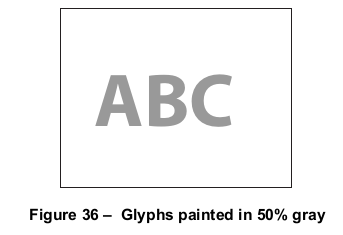
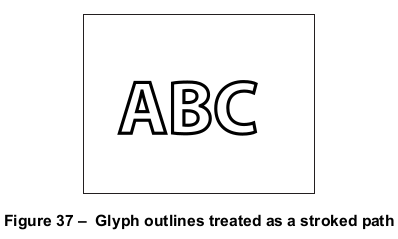
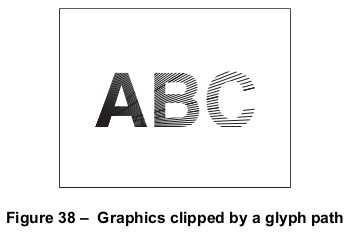
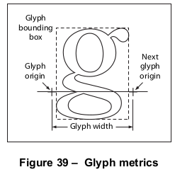
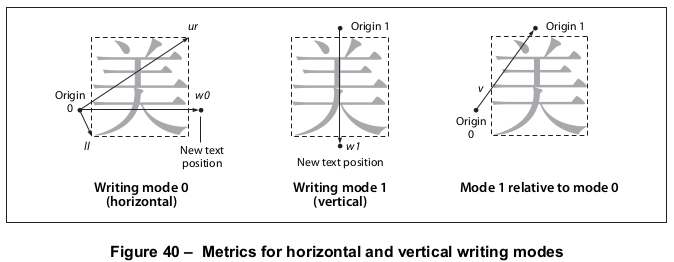

# 9.2 字体的组织和使用

**Organization and Use of Fonts**

## 9.2.1 概述

**General**

=== "中文"

    一个 *字符(character)* 是一个抽象的符号，而一个 *字形(glyph)* 是字符的具体图形呈现。
    
    !!! info "EXAMPLE 1"
    
        字形 A、**A** 和 *A* 是抽象的“A”字符的不同呈现方式。
    
    !!! note "NOTE 1"
    
        历史上这两个术语在计算机排版中经常互换使用（从一些PDF字典键和PostScript操作员的名称中可以看出），但在这个领域的进步使得区分变得更加有意义。因此，本标准区分了字符和字形，尽管一些残存的名称并不一致。
    
    字形被组织进字体中。一种字体为特定的字符集定义字形。
    
    !!! info "EXAMPLE 2"
    
        Helvetica 和 Times 字体为一组标准拉丁字符定义了字形。
    
    用于符合规范的阅读器的字体是以程序的形式准备的。这样的字体程序应该用一种特殊用途的语言编写，比如 *Type 1*、*TrueType* 或 *OpenType* 字体格式，这些语言是由专门的字体解释器所理解的。
    
    在PDF中，术语 *字体(font)* 指的是 *字体字典(font dictionary)*，这是一个PDF对象，它识别字体程序并包含有关它的额外信息。有几种不同类型的字体，由字体字典的 **Subtype** 条目标识。
    
    对于大多数字体类型，字体程序应该在一个单独的 *字体文件(font file)* 中定义，该文件可以嵌入在PDF流对象中或从外部来源获取。字体程序包含生成字形的字形描述。
    
    内容流通过指定字体字典和字符串对象在页面上绘制字形，该字符串对象应解释为一个或多个字符代码序列，这些代码标识字体中的字形。这个操作被称为 *显示(showing)* 文本字符串；以这种方式绘制的文本字符串称为 *显示字符串(show strings)*。字形描述由一系列图形操作符组成，这些操作符产生了该字符在这种字体中的具体形状。为了渲染字形，符合规范的阅读器执行字形描述。
    
    !!! note "NOTE 2"
    
        有经验的程序员可能会对一般形状扫描转换的计算量感到担忧，这似乎是字形描述所暗示的。然而，这只是字形描述和字体程序的抽象行为，而不是它们的实现方式。实际上，通过仔细的缓存和重用以前渲染过的字形，可以实现高效的实现。

=== "英文"

    A *character* is an abstract symbol, whereas a *glyph* is a specific graphical rendering of a character.
    
    !!! info "EXAMPLE 1"
    
        The glyphs A, **A**, and *A* are renderings of the abstract “A” character.
    
    !!! note "NOTE 1"
    
        Historically these two terms have often been used interchangeably in computer typography (as evidenced by
    the names chosen for some PDF dictionary keys and PostScript operators), but advances in this area have
    made the distinction more meaningful. Consequently, this standard distinguishes between characters and
    glyphs, though with some residual names that are inconsistent.
    
    Glyphs are organized into fonts. A font defines glyphs for a particular character set.
    
    !!! info "EXAMPLE 2"
    
        The Helvetica and Times fonts define glyphs for a set of standard Latin characters.
    
    A font for use with a conforming reader is prepared in the form of a program. Such a font program shall be written in a special-purpose language, such as the *Type 1*, *TrueType*, or *OpenType* font format, that is understood by a specialized font interpreter.
    
    In PDF, the term *font* refers to a *font dictionary*, a PDF object that identifies the font program and contains additional information about it. There are several different font types, identified by the **Subtype** entry of the font dictionary.
    
    For most font types, the font program shall be defined in a separate *font file*, which may be either embedded in a PDF stream object or obtained from an external source. The font program contains glyph descriptions that generate glyphs.
    
    A content stream paints glyphs on the page by specifying a font dictionary and a string object that shall be interpreted as a sequence of one or more character codes identifying glyphs in the font. This operation is called *showing* the text string; the text strings drawn in this way are called *show strings*. The glyph description consists of a sequence of graphics operators that produce the specific shape for that character in this font. To render a glyph, the conforming reader executes the glyph description.

    !!! note "NOTE 2"

        Programmers who have experience with scan conversion of general shapes may be concerned about the amount of computation that this description seems to imply. However, this is only the abstract behaviour of glyph descriptions and font programs, not how they are implemented. In fact, an efficient implementation can be achieved through careful caching and reuse of previously rendered glyphs.


## 9.2.2 显示文本的基础知识

**Basics of Showing Text**

=== "中文"

    !!! info "EXAMPLE 1"
    
        这个示例展示了最直接使用字体的方法。文本 "ABC" 被放置在页面底部上方 10 英寸和左边界 4 英寸的位置，使用 12 号点的 Helvetica 字体。
        
        ```tex
        BT
            /F13 12 Tf
            288 720 Td
            ( ABC ) Tj
        ET
        ```
        
        这个示例的五行执行了以下步骤：
        
        **a)** 开始一个文本对象。
        
        **b)** 设置要使用的字体和字号大小，将它们作为参数安装在文本状态中。在本例中，由名称 F13 标识的字体资源指定了外部已知的 Helvetica 字体。
        
        **c)** 指定页面上的起始位置，设置文本对象中的参数。
        
        **d)** 在该位置绘制一串字符的字形。
        
        **e)** 结束文本对象。
        
    这些段落更详细地解释了这些操作。
    
    要绘制字形，内容流首先需要确定要使用的字体。**Tf** 操作符将指定一个字体资源的名称，即当前资源字典中**Font**子字典的一个条目。该条目的值是一个字体字典。字体字典将识别字体的外部已知名称，例如Helvetica，并且将提供一些符合规范的阅读器需要的信息，以便绘制该字体的字形。字体字典可能提供字体程序本身的定义。
    
    !!! note "NOTE 1"
    
        提供给 Tf 操作符的字体资源名称是任意的，就像所有类型的资源名称一样。它与实际的字体名称（如 Helvetica）没有关系。
    
    !!! info "EXAMPLE 2"
    
        这个示例展示了当前页面资源字典的一个摘录，它定义了作为 F13 引用的字体字典（见本子条款中的示例 1）。
    
        ```tex
        /Resources
            << /Font << /F13 23 0 R >>
            >>
        
        23 0 obj
            << /Type /Font
               /Subtype /Type1
               /BaseFont /Helvetica
            >>
        endobj
        ```
    
    一个字体定义了字形的一个标准尺寸。这个标准是这样安排的，紧密排列的文字行的名义高度是1单位。在默认的用户坐标系统中，这意味着标准字形大小在用户空间中是1单位，或者1/72英寸。从PDF 1.6开始，这个单位的大小可以通过页面字典的 **UserUnit** 条目指定为大于1/72英寸；见表30。然后，标准大小的字体将被缩放以供使用。缩放因子作为 **Tf** 操作符的第二个操作数指定，从而设置图形状态中的 *文本字体大小* 参数。本子条款中的示例1以图形状态中的12单位大小建立了Helvetica字体。
    
    一旦选择了字体并进行了缩放，就可以使用它来绘制字形。**Td** 操作符将调整文本矩阵的平移分量，如 [9.4.2]，“文本定位操作符”中所述。当在 **BT** 之后首次执行时，**Td** 将确立当前用户坐标系统中的文本位置。这决定了在页面上开始绘制字形的位置。
    
    **Tj** 操作符将接受一个字符串操作数，并绘制相应的字形，使用当前的字体和图形状态中其他与文本相关的参数。
    
    
    !!! note "NOTE 2"
    
        **Tj** 操作符将字符串中的每个元素（0到255范围内的整数）视为字符代码（见本子条款中的示例 1）。
    
    每个字节将选择字体中的一个字形描述，并且执行该字形描述以在页面上绘制该字形。这是 **Tj** 对于简单字体的行为，例如普通的拉丁文本字体。对于复合字体，字符串作为字符代码序列的解释更为复杂，如9.7节 "复合字体" 中所述。
    
    这些步骤在页面上产生的不是12-*点*字形，而是12-*单位*字形，其中单位大小应该是在字形呈现在页面上时文本空间的大小。字形的实际大小将由文本对象中的文本矩阵 ($T_m$)、几个文本状态参数以及图形状态中的当前变换矩阵（CTM）决定；见 [9.4.4]，"文本空间细节"。
    
    !!! info "EXAMPLE 3"
    
        如果文本空间随后被缩放，使得单位大小为1厘米，那么从相同的12单位字体绘制字形将产生高度为12厘米的结果。

=== "英文"

    !!! info "EXAMPLE 1"
    
        This example illustrates the most straightforward use of a font. The text ABC is placed 10 inches from the bottom of the page and 4 inches from the left edge, using 12-point Helvetica.
    
        ```tex
        BT
            /F13 12 Tf
            288 720 Td
            ( ABC ) Tj
        ET
        ```
    
        The five lines of this example perform these steps:
    
        **a)** Begin a text object.
    
        **b)** Set the font and font size to use, installing them as parameters in the text state. In this case, the font resource identified by the name F13 specifies the font externally known as Helvetica.
    
        **c)** Specify a starting position on the page, setting parameters in the text object.
    
        **d)** Paint the glyphs for a string of characters at that position.
    
        **e)** End the text object.
    
    These paragraphs explain these operations in more detail.
    
    To paint glyphs, a content stream shall first identify the font to be used. The **Tf** operator shall specify the name of a font resource—that is, an entry in the **Font** subdictionary of the current resource dictionary. The value of that entry shall be a font dictionary. The font dictionary shall identify the font’s externally known name, such as Helvetica, and shall supply some additional information that the conforming reader needs to paint glyphs from that font. The font dictionary may provide the definition of the font program itself.
    
    !!! note "NOTE 1"
    
        The font resource name presented to the Tf operator is arbitrary, as are the names for all kinds of resources. It bears no relationship to an actual font name, such as Helvetica.
    
    !!! info "EXAMPLE 2"
    
        This Example illustrates an excerpt from the current page’s resource dictionary, which defines the font dictionary that is referenced as F13 (see EXAMPLE 1 in this sub-clause).
    
        ```tex
        /Resources
            << /Font << /F13 23 0 R >>
            >>
        
        23 0 obj
            << /Type /Font
               /Subtype /Type1
               /BaseFont /Helvetica
            >>
        endobj
        ```
    
    A font defines the glyphs at one standard size. This standard is arranged so that the nominal height of tightly spaced lines of text is 1 unit. In the default user coordinate system, this means the standard glyph size is 1 unit in user space, or 1 ⁄ 72 inch. Starting with PDF 1.6, the size of this unit may be specified as greater than 1 ⁄ 72 inch by means of the **UserUnit** entry of the page dictionary; see Table 30. The standard-size font shall then be scaled to be usable. The scale factor is specified as the second operand of the **Tf** operator, thereby setting the *text font size* parameter in the graphics state. EXAMPLE 1 in this sub-clause establishes the Helvetica font with a 12-unit size in the graphics state.
    
    Once the font has been selected and scaled, it may be used to paint glyphs. The **Td** operator shall adjust the translation components of the text matrix, as described in [9.4.2], "Text-Positioning Operators". When executed for the first time after **BT**, **Td** shall establish the text position in the current user coordinate system. This determines the position on the page at which to begin painting glyphs.
    
    The **Tj** operator shall take a string operand and shall paint the corresponding glyphs, using the current font and other text-related parameters in the graphics state.
    
    !!! note "NOTE 2"
    
        The **Tj** operator treats each element of the string (an integer in the range 0 to 255) as a character code (see EXAMPLE 1 in this sub-clause).
    
    Each byte shall select a glyph description in the font, and the glyph description shall be executed to paint that glyph on the page. This is the behaviour of **Tj** for simple fonts, such as ordinary Latin text fonts. Interpretation of the string as a sequence of character codes is more complex for composite fonts, described in 9.7, "Composite Fonts".
    
    What these steps produce on the page is not a 12-*point* glyph, but rather a 12-*unit* glyph, where the unit size shall be that of the text space at the time the glyphs are rendered on the page. The actual size of the glyph shall be determined by the text matrix ($T_m$) in the text object, several text state parameters, and the current transformation matrix (CTM) in the graphics state; see [9.4.4], "Text Space Details".
    
    !!! info "EXAMPLE 3"
    
        If the text space is later scaled to make the unit size 1 centimeter, painting glyphs from the same 12-unit font generates results that are 12 centimeters high.

## 9.2.3 实现特殊图形效果

**Achieving Special Graphical Effects**

=== "中文"

    **Tj** 和其他绘制字形的操作符的正常使用会导致绘制黑色填充的字形。通过将字体操作符与一般图形操作符结合使用，可以获得其他效果。
    
    绘制字形所使用的颜色应为图形状态中的当前颜色：根据文本渲染模式（见 [9.3.6]，“文本渲染模式”），可以是描边颜色、非描边颜色（或两者），默认颜色为黑色（在 DeviceGray 中），但通过执行适当的颜色设置操作符或操作符（见 [8.6.8]，“颜色操作符”）可以在绘制字形之前获得其他颜色。
    
    !!! info "EXAMPLE 1"
    
        这个示例使用文本渲染模式 0 和 g 操作符以填充 50% 灰色的字形，如图 36 所示。
    
        ```text
        BT
            /F13 48 Tf
            20 40 Td
            0 Tr
            0.5 g
            ( ABC ) Tj
        ET
        ```
        
        
    
    其他图形效果可以通过将字形轮廓视为路径而不是填充它来实现。图形状态中的 *文本渲染模式* 参数指定是否应填充字形轮廓、描边、用作裁剪边界，或这些效果的某种组合。只有部分可能的渲染模式适用于 Type 3 字体。
    
    !!! info "EXAMPLE 2"
    
        这个例子将字形轮廓视为要描边的路径。Tr 操作员将文本渲染模式设置为 1（描边）。w 操作员将线宽设置为用户空间中的 2 个单位。在这些图形状态参数下，Tj 操作员用 2 点厚的线描边字形轮廓（见图 37）。
    
        ```text
        BT
            /F13 48 Tf
            20 38 Td
            1 Tr
            2 w
            ( ABC ) Tj
        ET
        ```
        
        
    
    !!! info "EXAMPLE 3"
    
        这个例子说明了如何使用字形轮廓作为裁剪边界。**Tr** 操作符将文本渲染模式设置为 7（裁剪），这导致随后的 **Tj** 操作符将字形轮廓设置为当前的裁剪路径。所有随后的绘图操作只有在这条路径内才会在页面上留下标记，如图 38 所示。这种状态会持续，直到 **Q** 操作符重新启用了早期的裁剪路径。
    
        ```text
        BT
            /F13 48 Tf
            20 38 Td
            7 Tr
            ( ABC ) Tj
        ET
        … Graphics operators to draw a starburst …
        ```
        
        

=== "英文"

    Normal uses of **Tj** and other glyph-painting operators cause black-filled glyphs to be painted. Other effects may be obtained by combining font operators with general graphics operators.
    
    The colour used for painting glyphs shall be the current colour in the graphics state: either the nonstroking colour or the stroking colour (or both), depending on the text rendering mode (see [9.3.6], "Text Rendering Mode"). The default colour shall be black (in DeviceGray), but other colours may be obtained by executing an appropriate colour-setting operator or operators (see [8.6.8], "Colour Operators") before painting the glyphs.
    
    !!! info "EXAMPLE 1"
    
        This example uses text rendering mode 0 and the g operator to fill glyphs in 50 percent gray, as shown in Figure 36.
    
        ```text
        BT
            /F13 48 Tf
            20 40 Td
            0 Tr
            0.5 g
            ( ABC ) Tj
        ET
        ```
        
        
    
    Other graphical effects may be achieved by treating the glyph outline as a path instead of filling it. The *text rendering mode* parameter in the graphics state specifies whether glyph outlines shall be filled, stroked, used as a clipping boundary, or some combination of these effects. Only a subset of the possible rendering modes apply to Type 3 fonts.
    
    !!! info "EXAMPLE 2"
    
        This example treats glyph outlines as a path to be stroked. The Tr operator sets the text rendering mode to 1 (stroke). The w operator sets the line width to 2 units in user space. Given those graphics state parameters, the Tj operator strokes the glyph outlines with a line 2 points thick (see Figure 37).
    
        ```text
        BT
            /F13 48 Tf
            20 38 Td
            1 Tr
            2 w
            ( ABC ) Tj
        ET
        ```
        
        
    
    !!! info "EXAMPLE 3"
    
        This example illustrates how the glyphs’ outlines may be used as a clipping boundary. The **Tr** operator sets the text rendering mode to 7 (clip), causing the subsequent **Tj** operator to impose the glyph outlines as the current clipping path. All subsequent painting operations mark the page only within this path, as illustrated in Figure 38. This state persists until an earlier clipping path is reinstated by the **Q** operator.
    
        ```text
        BT
            /F13 48 Tf
            20 38 Td
            7 Tr
            ( ABC ) Tj
        ET
        … Graphics operators to draw a starburst …
        ```
        
        

## 9.2.4 字形定位和规格

**Glyph Positioning and Metrics**

=== "中文"

    一个字形的“宽度(width)”——正式地说，它的“水平位移(horizontal displacement)”——是它在水平书写的文本基线上所占据的空间量。换句话说，当绘制字形时，当前文本位置应移动的距离（通过平移文本空间）。
    
    !!! note "NOTE 1"
    
        宽度与字形轮廓的尺寸不同。
    
    在某些字体中，宽度是恒定的；它不会因字形而异。这样的字体被称为“等宽(fixed-pitch)”或“单间距(monospaced)”。它们主要用于打字机风格的打印。然而，大多数用于高质量排版的字体为每个字形关联了不同的宽度。这样的字体被称为“比例(proportional)”或“可变间距(variable-pitch)”字体。在这两种情况下，**Tj** 操作符应根据它们的宽度定位字符串中的连续字形。
    
    每个字形的宽度信息应同时存储在字体字典和字体程序本身中。这两组宽度应该是相同的。
    
    !!! note "NOTE 2"
    
        尽管在字体字典中存储此信息是多余的，但它使符合标准的阅读器能够在不必查看字体程序内部的情况下确定字形定位。
    
    !!! note "NOTE 3"
    
        显示文本的操作符设计假设字形通常根据它们标准宽度定位。但是，提供了一些有限的方法来变化定位。例如，TJ 操作符可以调整文本位置，在文本字符串中的任何连续字符对之间。还有图形状态参数可以系统地调整字符和单词间距。
    
    除了宽度，字形还有几个其他度量，影响字形定位和绘制。对于大多数字体类型，这些信息主要是字体程序内部的，并没有在 PDF 字体字典中明确指定。然而，在 Type 3 字体中，所有度量都是明确指定的（见 [9.6.5]，“Type 3 字体”）。
    
    *字形坐标系统(glyph coordinate system)*是定义单个字符字形的空间。所有路径坐标和度量应以字形空间解释。对于除 Type 3 之外的所有字体类型，字形空间的单位是文本空间单位的千分之一；对于 Type 3 字体，字形空间到文本空间的转换应由字体字典中明确的 **FontMatrix** 条目中指定的 *字体矩阵* 定义。图 39 显示了一个典型的字形轮廓及其度量。
    
    

    *字形原点(glyph origin)* 是字形坐标系统中的点 (0, 0)。**Tj** 和其他显示文本的操作符应将第一个要绘制的字形的原点定位在文本空间的原点。
    
    !!! info "EXAMPLE 1"
    
        这段代码将文本空间的原点调整到用户坐标系统中的 (40, 50)，然后将 A 字形的原点放置在该点：
    
        ```tex
        BT
            40 50 Td
            ( ABC ) Tj
        ET
        ```
    
    *字形位移(glyph displacement)* 是从字形的原点到绘制一行文本中连续字形时，*下一个(next)* 字形的原点通常应该放置的点之间的距离。这个距离是一个向量（称为*位移向量(displacement vector)*），在字形坐标系统中；它具有水平和垂直分量。
    
    !!! note "NOTE 4"
    
        大多数西方书写系统，包括基于拉丁字母的系统，具有正的水平位移和零垂直位移。一些亚洲书写系统具有非零垂直位移。在所有情况下，显示文本的操作符将位移向量转换为文本空间，然后按该量平移文本空间。
    
    *字形边界框(glyph bounding box)* 应是最小的矩形（与字形坐标系的轴对齐），刚好包含整个字形形状。边界框应以其相对于字形坐标系统中的字形原点的左、下、右和上坐标来表示。
    
    在某些书写系统中，文本经常以两个不同的方向对齐。
    
    !!! note "NOTE 5"
    
        常见的做法是将日文和中文字形水平或垂直书写。
    
    为了处理这一点，字体可能包含每个字形的第二组度量。应根据*书写模式*选择使用哪组度量，其中 0 指定水平书写，1 指定垂直书写。此功能仅适用于复合字体，在 [9.7]，“复合字体”中讨论。
    
    当一个字形有两组度量时，每组度量应指定该书写模式的字形原点和位移向量。在垂直书写中，字形位置应由从用于水平书写的原点（原点 0）到用于垂直书写的原点（原点 1）的*位置向量(position vector)*来描述。图 40 说明了两种书写模式的度量：
    
    - 左侧图示显示了与书写模式 0 相关联的字形度量，水平书写。坐标 *ll* 和 *ur* 指定了相对于原点 0 的字形边界框。*w0* 是在书写模式 0 中绘制字形后文本位置应如何改变的位移向量；其垂直分量应为 0。
    - 中间图示显示了书写模式 1，垂直书写。w1 应为书写模式 1 的位移向量；其水平分量应为 0。
    - 在右侧图中，v 是定义原点 1 相对于原点 0 位置的位置向量。

    

=== "英文"

    A glyph’s *width*—formally, its *horizontal displacement*—is the amount of space it occupies along the baseline of a line of text that is written horizontally. In other words, it is the distance the current text position shall move (by translating text space) when the glyph is painted.
    
    !!! note "NOTE 1"
        
        The width is distinct from the dimensions of the glyph outline.
    
    In some fonts, the width is constant; it does not vary from glyph to glyph. Such fonts are called *fixed-pitch* or *monospaced*. They are used mainly for typewriter-style printing. However, most fonts used for high-quality typography associate a different width with each glyph. Such fonts are called *proportional* or *variable-pitch* fonts. In either case, the **Tj** operator shall position the consecutive glyphs of a string according to their widths.
    
    The width information for each glyph shall be stored both in the font dictionary and in the font program itself. The two sets of widths shall be identical.
    
    !!! note "NOTE 2"
    
        Storing this information in the font dictionary, although redundant, enables a conforming reader to determine glyph positioning without having to look inside the font program.
    
    !!! note "NOTE 3"
    
        The operators for showing text are designed on the assumption that glyphs are ordinarily positioned according to their standard widths. However, means are provided to vary the positioning in certain limited ways. For example, the TJ operator enables the text position to be adjusted between any consecutive pair of glyphs corresponding to characters in a text string. There are graphics state parameters to adjust character and word spacing systematically.
    
    In addition to width, a glyph has several other metrics that influence glyph positioning and painting. For most font types, this information is largely internal to the font program and is not specified explicitly in the PDF font dictionary. However, in a Type 3 font, all metrics are specified explicitly (see [9.6.5], "Type 3 Fonts").
    
    The *glyph coordinate system* is the space in which an individual character’s glyph is defined. All path coordinates and metrics shall be interpreted in glyph space. For all font types except Type 3, the units of glyph space are one-thousandth of a unit of text space; for a Type 3 font, the transformation from glyph space to text space shall be defined by a *font matrix* specified in an explicit **FontMatrix** entry in the font. Figure 39 shows a typical glyph outline and its metrics.
    
    
    
    The *glyph origin* is the point (0, 0) in the glyph coordinate system. **Tj** and other text-showing operators shall position the origin of the first glyph to be painted at the origin of text space.
    
    !!! info "EXAMPLE 1"
    
        This code adjusts the origin of text space to (40, 50) in the user coordinate system and then places the origin of the A glyph at that point:
    
        ```tex
        BT
            40 50 Td
            ( ABC ) Tj
        ET
        ```
    
    The *glyph displacement* is the distance from the glyph’s origin to the point at which the origin of the *next* glyph should normally be placed when painting the consecutive glyphs of a line of text. This distance is a vector (called the *displacement vector*) in the glyph coordinate system; it has horizontal and vertical components.
    
    !!! note "NOTE 4"
    
        Most Western writing systems, including those based on the Latin alphabet, have a positive horizontal displacement and a zero vertical displacement. Some Asian writing systems have a nonzero vertical displacement. In all cases, the text-showing operators transform the displacement vector into text space and then translate text space by that amount.
    
    The *glyph bounding box* shall be the smallest rectangle (oriented with the axes of the glyph coordinate system) that just encloses the entire glyph shape. The bounding box shall be expressed in terms of its left, bottom, right, and top coordinates relative to the glyph origin in the glyph coordinate system.
    
    In some writing systems, text is frequently aligned in two different directions.
    
    !!! note "NOTE 5"
    
        It is common to write Japanese and Chinese glyphs either horizontally or vertically.
    
    To handle this, a font may contain a second set of metrics for each glyph. Which set of metrics to use shall be selected according to a *writing mode*, where 0 shall specify horizontal writing and 1 shall specify vertical writing. This feature is available only for composite fonts, discussed in [9.7], "Composite Fonts".
    
    When a glyph has two sets of metrics, each set shall specify a glyph origin and a displacement vector for that writing mode. In vertical writing, the glyph position shall be described by a *position vector* from the origin used for horizontal writing (origin 0) to the origin used for vertical writing (origin 1). Figure 40 illustrates the metrics for the two writing modes:
    
    - The left diagram illustrates the glyph metrics associated with writing mode 0, horizontal writing. The coordinates *ll* and *ur* specify the bounding box of the glyph relative to origin 0. *w0* is the displacement vector that specifies how the text position shall be changed after the glyph is painted in writing mode 0; its vertical component shall be 0.
    - The center diagram illustrates writing mode 1, vertical writing. w1 shall be the displacement vector for writing mode 1; its horizontal component shall be 0.
    - In the right diagram, v is a position vector defining the position of origin 1 relative to origin 0.
    
    

[9.7]: ./s7.md

[9.4.2]: ./s4.md#942-文本位置操作
[9.4.4]: ./s4.md#944-文本空间详情

[8.6.8]: ../c8/s6.md#868-颜色操作
[9.3.6]: ../c9/s3.md#936-文本渲染模式
[9.6.5]: ./s6.md#965-type-3-字体