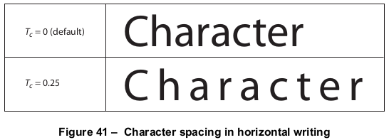
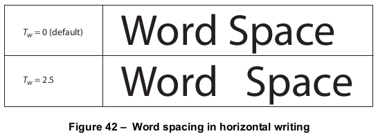
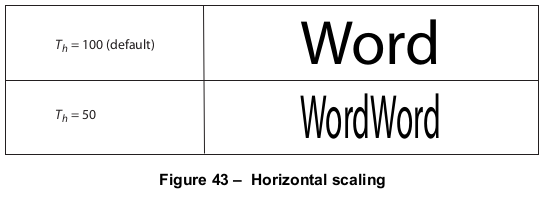
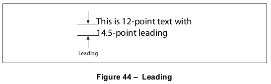
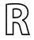
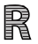
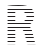
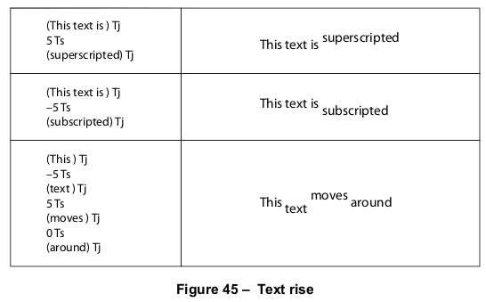

# 9.3 文本状态参数和操作

**Text State Parameters and Operators**

## 9.3.1 概述

**General**

=== "中文"

    *文本状态(text state)* 包括那些只影响文本的图形状态参数。文本状态中有九个参数（见表104）。

          
    <table id="table104" markdown="span">
        <caption>**Table 104 – 文本状态参数**</caption>
        <thead>
            <tr>
                <th>**参数**</th>
                <th>**描述**</th>
            </tr>
        </thead>
        <tbody>
            <tr>
                <td>$T_c$</td>
                <td>字符间距(Character spacing)
                </td>
            </tr>
            <tr>
                <td>$T_w$</td>
                <td>字间距(Word spacing)
                </td>
            </tr>
            <tr>
                <td>$T_h$</td>
                <td>水平缩放(Horizontal scaling)
                </td>
            </tr>
            <tr>
                <td>$T_l$</td>
                <td>行距(Leading)
                </td>
            </tr>
            <tr>
                <td>$T_f$</td>
                <td>字体(Text font)
                </td>
            </tr>
            <tr>
                <td>$T_{fs}$</td>
                <td>字体大小(Text font size)
                </td>
            </tr>
            <tr>
                <td>$T_{mode}$</td>
                <td>渲染模式(Text rendering mode)
                </td>
            </tr>
            <tr>
                <td>$T_{rise}$</td>
                <td>文本提升(Text rise)
                </td>
            </tr>
            <tr>
                <td>$T_k$</td>
                <td>文本击穿(Text knockout)
                </td>
            </tr>
        </tbody>
    </table>

    除了前面描述的$T_f$和$T_{fs}$，这些参数将在后续子条款中进一步讨论。（如[9.4]节“文本对象”中所述，还有三个与文本相关的额外参数只能在文本对象内使用：$T_m$，文本矩阵；$T_{lm}$，文本行矩阵；以及$T_{rm}$，文本渲染矩阵。）在定位和显示文本时（使用[9.4.2]节“文本定位操作符”和[9.4.3]节“文本显示操作符”中描述的操作符），应咨询文本状态参数的值。特别是，间距和缩放参数应在[9.4.4]节“文本空间细节”中描述的计算中使用。可以使用[表105](#table105)中列出的操作符设置文本状态参数的值。
    
    文本击穿参数$T_k$应通过使用**gs**操作符（见[8.4.5]节“图形状态参数字典”）在图形状态参数字典中的***TK***条目来设置。没有专门设置此参数的操作符。
    
    文本状态操作符可能出现在文本对象之外，它们设置的值在单个内容流中的文本对象之间保留。像其他图形状态参数一样，这些参数应在每页开始时初始化为其默认值。

    <table id="table105" markdown="span">
        <caption>**Table 105 – 文本状态操作符**</caption>
        <thead>
            <tr>
                <th>**Operands**</th>
                <th>**Operator**</th>
                <th>**Description**</th>
            </tr>
        </thead>
        <tbody>
            <tr>
                <td>charSpace</td>
                <td>**Tc**</td>
                <td>设置字符间距 $T_c$ 为 charSpace，它应该是一个未缩放文本空间单位的数字。字符间距将由 **Tj**、**TJ** 和 **'** 操作符使用。初始值：0。
                </td>
            </tr>
            <tr>
                <td>wordSpace</td>
                <td>**Tw**</td>
                <td>设置单词间距 $T_w$ 为 wordSpace，它应该是一个未缩放文本空间单位的数字。单词间距将由 **Tj**、**TJ** 和 **'** 操作符使用。初始值：0。
                </td>
            </tr>
            <tr>
                <td>scale</td>
                <td>**Tz**</td>
                <td>设置水平缩放 $T_h$ 为 (*scale* ÷ 100)。*scale* 应该是一个数字，指定正常宽度的百分比。初始值：100（正常宽度）。
                </td>
            </tr>
            <tr>
                <td>leading</td>
                <td>**TL**</td>
                <td>设置文本行距 $T_l$ 为 *leading* ，它应该是一个未缩放文本空间单位的数字。文本行距仅由 **T\***, **'**, 和 **"** 操作符使用。初始值：0。
                </td>
            </tr>
            <tr>
                <td>font size</td>
                <td>**Tf**</td>
                <td>设置文本字体 $T_f$ 为 font，文本字体大小 $T_{fs}$ 为 *size* 。font 应该是当前资源字典的 **Font** 子字典中字体资源的名称；size 应该是一个数字，代表一个缩放因子。对于 font 或 size，没有初始值；在使用 **Tf** 之前，它们必须明确指定，以便显示任何文本。
                </td>
            </tr>
            <tr>
                <td>render</td>
                <td>**Tr**</td>
                <td>设置文本渲染模式 $T_{mode}$ 为 *render* ，它应该是一个整数。初始值：0。
                </td>
            </tr>
            <tr>
                <td>rise</td>
                <td>**Ts**</td>
                <td>设置文本提升 $T_{rise}$ 为 *rise* ，它应该是一个未缩放文本空间单位的数字。初始值：0。
                </td>
            </tr>
        </tbody>
    </table>

    这些参数中的一些是用*未缩放(unscaled)*的文本空间单位来表示的。这意味着它们应该在一个坐标系中指定，这个坐标系由文本矩阵 $T_m$ 定义，但不应通过字体大小参数 $T_{fs}$ 进行缩放。

=== "英文"

    The *text state* comprises those graphics state parameters that only affect text. There are nine parameters in the text state (see Table 104).
    
                
    <table id="table104" markdown="span">
        <caption>**Table 104 – Text state parameters**</caption>
        <thead>
            <tr>
                <th>**Parameter**</th>
                <th>**Description**</th>
            </tr>
        </thead>
        <tbody>
            <tr>
                <td>$T_c$</td>
                <td>Character spacing
                </td>
            </tr>
            <tr>
                <td>$T_w$</td>
                <td>Word spacing
                </td>
            </tr>
            <tr>
                <td>$T_h$</td>
                <td>Horizontal scaling
                </td>
            </tr>
            <tr>
                <td>$T_l$</td>
                <td>Leading
                </td>
            </tr>
            <tr>
                <td>$T_f$</td>
                <td>Text font
                </td>
            </tr>
            <tr>
                <td>$T_{fs}$</td>
                <td>Text font size
                </td>
            </tr>
            <tr>
                <td>$T_{mode}$</td>
                <td>Text rendering mode
                </td>
            </tr>
            <tr>
                <td>$T_{rise}$</td>
                <td>Text rise
                </td>
            </tr>
            <tr>
                <td>$T_k$</td>
                <td>Text knockout
                </td>
            </tr>
        </tbody>
    </table>
    
    Except for the previously described $T_f$ and $T_{fs}$ , these parameters are discussed further in subsequent sub- clauses. (As described in [9.4], "Text Objects", three additional text-related parameters may occur only within a text object: $T_m$ , the text matrix; $T_{lm}$ , the text line matrix; and $T_{rm}$ , the text rendering matrix.) The values of the text state parameters shall be consulted when text is positioned and shown (using the operators described in [9.4.2], "Text-Positioning Operators" and [9.4.3], "Text-Showing Operators"). In particular, the spacing and scaling parameters shall be used in a computation described in [9.4.4], "Text Space Details". The text state parameters may be set using the operators listed in [Table 105](#table105).
    
    The text knockout parameter, $T_k$ , shall be set through the ***TK*** entry in a graphics state parameter dictionary by using the **gs** operator (see [8.4.5], "Graphics State Parameter Dictionaries"). There is no specific operator for setting this parameter.
    
    The text state operators may appear outside text objects, and the values they set are retained across text objects in a single content stream. Like other graphics state parameters, these parameters shall be initialized to their default values at the beginning of each page.
           
    <table id="table105" markdown="span">
        <caption>**Table 105 – Text state operators**</caption>
        <thead>
            <tr>
                <th>**Operands**</th>
                <th>**Operator**</th>
                <th>**Description**</th>
            </tr>
        </thead>
        <tbody>
            <tr>
                <td>charSpace</td>
                <td>**Tc**</td>
                <td>Set the character spacing, $T_c$ , to *charSpace*, which shall be a number expressed in unscaled text space units. Character spacing shall be used by the **Tj**, **TJ**, and **'** operators. Initial value: 0.
                </td>
            </tr>
            <tr>
                <td>wordSpace</td>
                <td>**Tw**</td>
                <td>Set the word spacing, $T_w$, to *wordSpace*, which shall be a number expressed in unscaled text space units. Word spacing shall be used by the **Tj**, **TJ**, and **'** operators. Initial value: 0.
                </td>
            </tr>
            <tr>
                <td>scale</td>
                <td>**Tz**</td>
                <td>Set the horizontal scaling, $T_h$ , to (*scale* ÷ 100). *scale* shall be a number specifying the percentage of the normal width. Initial value: 100 (normal width).
                </td>
            </tr>
            <tr>
                <td>leading</td>
                <td>**TL**</td>
                <td>Set the text leading, $T_l$ , to *leading*, which shall be a number expressed in unscaled text space units. Text leading shall be used only by the **T\***, **'**, and **"** operators. Initial value: 0.
                </td>
            </tr>
            <tr>
                <td>font size</td>
                <td>**Tf**</td>
                <td>Set the text font, $T_f$ , to font and the text font size, $T_{fs}$ , to *size*. font shall be the name of a font resource in the **Font** subdictionary of the current resource dictionary; size shall be a number representing a scale factor. There is no initial value for either font or size; they shall be specified explicitly by using **Tf** before any text is shown.
                </td>
            </tr>
            <tr>
                <td>render</td>
                <td>**Tr**</td>
                <td>Set the text rendering mode, $T_{mode}$ , to *render*, which shall be an integer. Initial value: 0.
                </td>
            </tr>
            <tr>
                <td>rise</td>
                <td>**Ts**</td>
                <td>Set the text rise, $T_{rise}$ , to *rise*, which shall be a number expressed in unscaled text space units. Initial value: 0.
                </td>
            </tr>
        </tbody>
    </table>
    
    Some of these parameters are expressed in *unscaled* text space units. This means that they shall be specified in a coordinate system that shall be defined by the text matrix, $T_m$ but shall not be scaled by the font size parameter, $T_{fs}$ .

## 9.3.2 字符间距

**Character Spacing**

=== "中文"

    字符间距参数 $T_c$ 应该是一个用未缩放文本空间单位指定的数字（尽管如果书写模式是水平的，它将受到 $T_h$ 参数的缩放影响）。当字符串中每个字符的字形被渲染时，根据书写模式，$T_c$ 将被加到字形的水平或垂直偏移分量上。字形偏移的讨论请参见[9.2.4]节，“字形定位和度量”。在默认坐标系统中，水平坐标从左到右增加，垂直坐标从下到上增加。因此，对于水平书写，$T_c$ 的正值会扩大字形之间的距离（见图41），而对于垂直书写，$T_c$ 的负值则有此效果。

    
    

=== "英文"

    The character-spacing parameter, $T_c$ , shall be a number specified in unscaled text space units (although it shall be subject to scaling by the $T_h$ parameter if the writing mode is horizontal). When the glyph for each character in the string is rendered, $T_c$ shall be added to the horizontal or vertical component of the glyph’s displacement, depending on the writing mode. See [9.2.4], "Glyph Positioning and Metrics", for a discussion of glyph displacements. In the default coordinate system, horizontal coordinates increase from left to right and vertical coordinates from bottom to top. Therefore, for horizontal writing, a positive value of $T_c$ has the effect of expanding the distance between glyphs (see Figure 41), whereas for vertical writing, a negative value of $T_c$ has this effect.
    
    

## 9.3.3 字间距

**Word Spacing**

=== "中文"

    单词间距的工作原理与字符间距相同，但仅适用于ASCII空格字符（20h）。单词间距参数 $T_w$ 将被加到字形的水平或垂直偏移上（取决于书写模式）。对于水平书写，$T_w$ 的正值会增加单词之间的间距。对于垂直书写，$T_w$ 的正值会减少单词之间的间距（负值则会增加它），因为垂直坐标是从下到上增加的。图42展示了水平书写中单词间距的效果。

    

    单词间距应用于字符串中每个单字节字符代码32（即空格字符）的实例，当使用简单字体或复合字体且该字体将代码32定义为单字节代码时。它不应用于多字节代码中字节值32的出现。

=== "英文"

    Word spacing works the same way as character spacing but shall apply only to the ASCII SPACE character (20h). The word-spacing parameter, $T_w$, shall be added to the glyph’s horizontal or vertical displacement (depending on the writing mode). For horizontal writing, a positive value for $T_w$ has the effect of increasing the spacing between words. For vertical writing, a positive value for $T_w$ decreases the spacing between words (and a negative value increases it), since vertical coordinates increase from bottom to top. Figure 42 illustrates the effect of word spacing in horizontal writing.
    
    

    Word spacing shall be applied to every occurrence of the single-byte character code 32 in a string when using a simple font or a composite font that defines code 32 as a single-byte code. It shall not apply to occurrences of the byte value 32 in multiple-byte codes.

## 9.3.4 水平扩展

**Horizontal Scaling**

=== "中文"

    水平缩放参数 $T_h$ 通过在水平方向拉伸或压缩字形来调整字形的宽度。它的值应该以百分比的形式指定，表示字形正常宽度的百分比，其中100代表正常宽度。缩放应用于文本空间中的水平坐标，与书写模式无关。它将影响字形的形状以及其水平偏移量（即，它的偏移向量）。如果书写模式是水平的，它还会影响间距参数 $T_c$ 和 $T_w$，以及由 **TJ** 操作符执行的任何定位调整。图43显示了水平缩放的效果。

    
    

=== "英文"

    The horizontal scaling parameter, $T_h$ , adjusts the width of glyphs by stretching or compressing them in the horizontal direction. Its value shall be specified as a percentage of the normal width of the glyphs, with 100 being the normal width. The scaling shall apply to the horizontal coordinate in text space, independently of the writing mode. It shall affect both the glyph’s shape and its horizontal displacement (that is, its displacement vector). If the writing mode is horizontal, it shall also effect the spacing parameters $T_c$ and $T_w$ , as well as any positioning adjustments performed by the **TJ** operator. Figure 43 shows the effect of horizontal scaling.
    
    

## 9.3.5 引导

**Leading**

=== "中文"
    
    行距参数 $T_l$ 应该用未缩放的文本空间单位来指定。它指定了相邻文本行基线之间的垂直距离，如图44所示。
    
    

    行距参数由 **TD**, **T\***, **'**, 和 **"** 操作符使用；其效果的精确描述请见[表108](./s4.md#table108)。此参数应用于文本空间中的垂直坐标，与书写模式无关。

=== "英文"

    The leading parameter, $T_l$ , shall be specified in unscaled text space units . It specifies the vertical distance between the baselines of adjacent lines of text, as shown in Figure 44.
    
    
    
    The leading parameter shall be used by the **TD**, **T\***, **'**, and **"** operators; see [Table 108](./s4.md#table108) for a precise description of its effects. This parameter shall apply to the vertical coordinate in text space, independently of the writing mode.

## 9.3.6 文本渲染模式

**Text Rendering Mode**

=== "中文"

    文本渲染模式 \( T_{\text{mode}} \) 确定了显示文本时字形轮廓是被描边、填充、用作裁剪边界，还是上述操作的组合。对于文本对象，描边、填充和裁剪的效果与路径对象相同（参见 [8.5.3]，“路径绘制操作符” 和 [8.5.4]，“裁剪路径操作符”），尽管它们的指定方式完全不同。影响这些操作的图形状态参数（如线宽）应在**用户空间**中解释，而不是在**文本空间**中。

    !!! note "注意"

        文本渲染模式见[表 106](#table106)。在示例中，描边颜色为黑色，填充颜色为浅灰色。对于裁剪模式（4 到 7），在字形上绘制了一系列线条，以显示裁剪发生的位置。

    对于 Type 3 字体中显示的文本，仅当文本渲染模式的值为 3 时才会产生影响（参见 [9.6.5]，“Type 3 字体”）。

    如果文本渲染模式要求填充，则应使用图形状态中的当前非描边颜色；如果要求描边，则应使用当前描边颜色。在既进行填充又进行描边的模式下，其效果应当如同每个字形轮廓先填充再描边，各自独立执行。如果某些字形重叠，效果应等同于逐个填充和描边，呈现为堆叠的不透明字形，而不是所有字形先填充后再整体描边。在透明成像模型中，这些填充和描边的组合模式还需要进一步考虑，详见 [11.7.4.4]，“特殊路径绘制注意事项”。

    裁剪模式的行为需要进一步说明。如果在文本渲染模式设置为裁剪模式的情况下执行 **BT** 操作符，或在文本对象内将其设置为裁剪模式，则字形轮廓将开始累积。字形会一直累积，直到文本对象由 **ET** 操作符结束；在此之前，不得将文本渲染模式更改回非裁剪模式。

    <table id="table106" markdown="span">
        <caption>****表 106 – 文本渲染模式****</caption>
        <thead>
            <tr>
                <th>模式</th>
                <th>示例</th>
                <th>描述</th>
            </tr>
        </thead>
        <tbody>
            <tr>
                <td>0</td>
                <td></td>
                <td>填充文本。</td>
            </tr>
            <tr>
                <td>1</td>
                <td></td>
                <td>描边文本。</td>
            </tr>
            <tr>
                <td>2</td>
                <td></td>
                <td>先填充，再描边文本。</td>
            </tr>
            <tr>
                <td>3</td>
                <td>&nbsp;</td>
                <td>既不填充也不描边文本（不可见）。</td>
            </tr>
            <tr>
                <td>4</td>
                <td></td>
                <td>填充文本并添加到路径进行裁剪（参见 [9.3.6]，“文本渲染模式”）。</td>
            </tr>
            <tr>
                <td>5</td>
                <td></td>
                <td>描边文本并添加到路径进行裁剪。</td>
            </tr>
            <tr>
                <td>6</td>
                <td></td>
                <td>先填充，再描边文本，并添加到路径进行裁剪。</td>
            </tr>
            <tr>
                <td>7</td>
                <td></td>
                <td>将文本添加到路径进行裁剪。</td>
            </tr>
        </tbody>
    </table>

    ---

    在文本对象结束时，所有累积的字形轮廓（如果有）应合并为**单一路径**，将各个字形轮廓视为该路径的子路径，并应用**非零环绕数规则**（参见 [8.5.3.3.2]，“非零环绕数规则”）。图形状态中的当前裁剪路径应设置为该路径与先前裁剪路径的交集。与路径对象类似，此裁剪操作应在文本对象的所有填充和描边操作完成之后执行，并保持有效，直到通过 **Q** 操作符恢复先前的裁剪路径。

    如果未显示任何字形，或显示的唯一字形没有轮廓（例如 ASCII 空格字符（20h）），则不会发生裁剪。

=== "英文"

    The text rendering mode, $T_{mode}$ , determines whether showing text shall cause glyph outlines to be stroked, filled, used as a clipping boundary, or some combination of the three. Stroking, filling, and clipping shall have the same effects for a text object as they do for a path object (see [8.5.3], "Path-Painting Operators" and [8.5.4], "Clipping Path Operators"), although they are specified in an entirely different way. The graphics state parameters affecting those operations, such as line width, shall be interpreted in user space rather than in text space.
    
    !!!  note "NOTE"
    
        The text rendering modes are shown in [Table 106](#table106). In the examples, a stroke colour of black and a fill colour of light gray are used. For the clipping modes (4 to 7), a series of lines has been drawn through the glyphs to show where the clipping occurs.
    
    Only a value of 3 for text rendering mode shall have any effect on text displayed in a Type 3 font (see [9.6.5], "Type 3 Fonts").
    
    If the text rendering mode calls for filling, the current nonstroking colour in the graphics state shall be used; if it calls for stroking, the current stroking colour shall be used. In modes that perform both filling and stroking, the effect shall be as if each glyph outline were filled and then stroked in separate operations. If any of the glyphs overlap, the result shall be equivalent to filling and stroking them one at a time, producing the appearance of stacked opaque glyphs, rather than first filling and then stroking them all at once. In the transparent imaging model, these combined filling and stroking modes shall be subject to further considerations; see [11.7.4.4], "Special Path-Painting Considerations".
    
    The behaviour of the clipping modes requires further explanation. Glyph outlines shall begin accumulating if a **BT** operator is executed while the text rendering mode is set to a clipping mode or if it is set to a clipping mode within a text object. Glyphs shall accumulate until the text object is ended by an **ET** operator; the text rendering mode shall not be changed back to a nonclipping mode before that point.
               
    <table id="table106" markdown="span">
        <caption>**Table 106 – Text rendering modes**</caption>
        <thead>
            <tr>
                <th>**Mode**</th>
                <th>**Example**</th>
                <th>**Description**</th>
            </tr>
        </thead>
        <tbody>
            <tr>
                <td>0</td>
                <td></td>
                <td>Fill text.
                </td>
            </tr>
            <tr>
                <td>1</td>
                <td></td>
                <td>Stroke text.
                </td>
            </tr>
            <tr>
                <td>2</td>
                <td></td>
                <td>Fill, then stroke text.
                </td>
            </tr>
            <tr>
                <td>3</td>
                <td>&nbsp;</td>
                <td>Neither fill nor stroke text (invisible).
                </td>
            </tr>
            <tr>
                <td>4</td>
                <td></td>
                <td>Fill text and add to path for clipping (see [9.3.6], "Text Rendering Mode,").
                </td>
            </tr>
            <tr>
                <td>5</td>
                <td></td>
                <td>Stroke text and add to path for clipping.
                </td>
            </tr>
            <tr>
                <td>6</td>
                <td></td>
                <td>Fill, then stroke text and add to path for clipping.
                </td>
            </tr>
            <tr>
                <td>7</td>
                <td></td>
                <td>Add text to path for clipping.
                </td>
            </tr>
        </tbody>
    </table>
    
    At the end of the text object, the accumulated glyph outlines, if any, shall be combined into a single path, treating the individual outlines as subpaths of that path and applying the nonzero winding number rule (see [8.5.3.3.2], "Nonzero Winding Number Rule"). The current clipping path in the graphics state shall be set to the intersection of this path with the previous clipping path. As is the case for path objects, this clipping shall occur after all filling and stroking operations for the text object have occurred. It remains in effect until a previous clipping path is restored by an invocation of the **Q** operator.
    
    If no glyphs are shown or if the only glyphs shown have no outlines (for example, if they are ASCII SPACE characters (20h)), no clipping shall occur.

## 9.3.7 文本升降

**Text Rise**

=== "中文"

    文本升降 \( T_{\text{rise}} \) 指定基线相对于默认位置**上下移动**的距离，单位为**未缩放的文本空间单位**。正值的文本升降会**上移**基线。图 45 说明了文本升降的效果。无论书写模式如何，文本升降始终作用于**文本空间的垂直坐标**。

    !!! note "注意"

        调整基线位置对于绘制**上标**或**下标**非常有用。将文本升降设为 **0** 可恢复基线的默认位置。
    
    

=== "英文"

    Text rise, $T_{rise}$ , shall specify the distance, in unscaled text space units, to move the baseline up or down from its default location. Positive values of text rise shall move the baseline up. Figure 45 illustrates the effect of the text rise. Text rise shall apply to the vertical coordinate in text space, regardless of the writing mode.
    
    !!! note "NOTE"
    
        Adjustments to the baseline are useful for drawing superscripts or subscripts. The default location of the baseline can be restored by setting the text rise to 0.
    
    

## 9.3.8 文本镂空(切割)

**Text Knockout**

=== "中文"

    **文本敲除参数**  

    文本敲除参数 ( $T_k$ )（PDF 1.4）是一个**布尔值**，用于确定在透明成像模型的颜色合成过程中，哪些文本元素应被视为**基本对象**。与其他文本状态参数不同，此参数没有专门的操作符进行设置，而只能通过**图形状态参数字典**中的 **TK** 条目，并使用 **gs** 操作符进行设置（参见 [8.4.5]，“图形状态参数字典”）。文本敲除参数仅适用于**整个文本对象**，不能在定义文本对象的 **BT** 和 **ET** 操作符之间进行设置。其初始值为 **true**。  

    如果该参数为 **false**，则文本对象中的每个字形都会被视为**独立的基本对象**；当字形重叠时，它们会相互**混合**。 
     
    如果该参数为 **true**，则文本对象中的所有字形会被**整体**视为一个**单一的基本对象**；当字形重叠时，后面的字形会**覆盖**（“敲除”）前面的字形。此行为等效于将整个文本对象视为**非隔离敲除透明组**（参见 [11.4.6]，“敲除组”）。透明度参数将**单独应用**于每个字形，而不是应用于整个隐式透明组：  

    - **图形状态参数**（包括透明度参数）将继承自文本对象所在的上下文，且不会被**保存和恢复**。透明度参数不会在透明组的开始处被重置（如同显式调用透明组 XObject 时那样）。在文本对象内部修改的图形状态参数将在文本对象结束后**继续生效**。  
    - 在文本对象的**隐式透明组**完全计算完毕后，该组的最终结果将使用**Normal** 混合模式，并采用 **1.0** 的 Alpha 和软蒙版值，与背景进行合成。

=== "英文"

    The text knockout parameter, $T_k$ (PDF 1.4), shall be a boolean value that determines what text elements shall be considered elementary objects for purposes of colour compositing in the transparent imaging model. Unlike other text state parameters, there is no specific operator for setting this parameter; it may be set only through the **TK** entry in a graphics state parameter dictionary by using the **gs** operator (see [8.4.5], "Graphics State Parameter Dictionaries"). The text knockout parameter shall apply only to entire text objects; it shall not be set between the **BT** and **ET** operators delimiting a text object. Its initial value shall be **true**.
    
    If the parameter is **false**, each glyph in a text object shall be treated as a separate elementary object; when glyphs overlap, they shall composite with one another.
    
    If the parameter is **true**, all glyphs in the text object shall be treated together as a single elementary object; when glyphs overlap, later glyphs shall overwrite (“knock out”) earlier ones in the area of overlap. This behaviour is equivalent to treating the entire text object as if it were a non-isolated knockout transparency group; see [11.4.6], "Knockout Groups". Transparency parameters shall be applied to the glyphs individually rather than to the implicit transparency group as a whole:
    
    - Graphics state parameters, including transparency parameters, shall be inherited from the context in which the text object appears. They shall not be saved and restored. The transparency parameters shall not be reset at the beginning of the transparency group (as they are when a transparency group XObject is explicitly invoked). Changes made to graphics state parameters within the text object shall persist beyond the end of the text object.
    - After the implicit transparency group for the text object has been completely evaluated, the group results shall be composited with the backdrop, using the Normal blend mode and alpha and soft mask values of 1.0.

[9.4]: ./s4.md

[8.5.3]: ../c8/s5.md#853-路径绘制运算符
[8.5.4]: ../c8/s5.md#854-剪切路径操作符
[9.2.4]: ./s2.md#924-字形定位和规格
[9.3.6]: ./s3.md#936-文本渲染模式
[9.4.2]: ./s4.md#942-文本位置操作
[9.4.3]: ./s4.md#943-文本显示操作符
[9.4.4]: ./s4.md#944-文本空间与坐标变换
[8.4.5]: ../c8/s4.md#845-图形状态参数字典
[9.6.5]: ./s6.md#965-type-3-字体
[11.4.6]: ../c11/s4.md#1146-knockout-组

[11.7.4.4]: ../c11/s7.md#11744-特殊路径绘制注意事项

[8.5.3.3.2]: ../c8/s5.md#85332-非零缠绕数规则