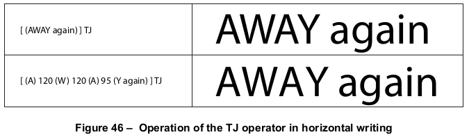

# 9.4 文本对象

**Text Objects**

## 9.4.1 概述

**General**

=== "中文"

    PDF **文本对象** (*text object*) 由一组操作符组成，这些操作符可用于**显示文本字符串**、**移动文本位置**，以及**设置文本状态**和**某些其他参数**。此外，有三个参数只能在文本对象内部指定，且不会在不同的文本对象之间**持续**生效：  

    - \( T_m \) ：**文本矩阵** (*text matrix*)  
    - \( T_{lm} \) ：**文本行矩阵** (*text line matrix*)  
    - \( T_{rm} \) ：**文本渲染矩阵** (*text rendering matrix*)，它实际上只是一个**中间计算结果**，用于结合文本状态参数、文本矩阵 (\( T_m \)) 以及当前变换矩阵的影响  

    文本对象由 **BT** 操作符开始，以 **ET** 操作符结束，如下示例所示，并在[表 107](#table107)中进行了描述。  

    !!! info "示例"

        ```  
        BT  
        … *零个或多个文本操作符或其他允许的操作符* …  
        ET  
        ```  

    <table id="table107" markdown="span">
        <caption>**表 107 – 文本对象操作符**</caption>
        <thead>
            <tr>
                <th>**操作数**</th>
                <th>**操作符**</th>
                <th>**描述**</th>
            </tr>
        </thead>
        <tbody>
            <tr>
                <td>—</td>
                <td>**BT**</td>
                <td>开始一个文本对象，将文本矩阵 \( T_m \) 和文本行矩阵 \( T_{lm} \) 初始化为**单位矩阵**。文本对象**不允许嵌套**；在 **ET** 之前不得出现第二个 **BT**。
                </td>
            </tr>
            <tr>
                <td>—</td>
                <td>**ET**</td>
                <td>结束文本对象，并**丢弃**文本矩阵。
                </td>
            </tr>
        </tbody>
    </table>

    **文本对象中允许的操作符**  

    文本对象中可以包含以下几类**文本相关**的操作符：  

    - **文本状态操作符** (*Text state operators*)，详见 [9.3] “文本状态参数和操作符”  
    - **文本定位操作符** (*Text-positioning operators*)，详见 [9.4.2] “文本定位操作符”  
    - **文本显示操作符** (*Text-showing operators*)，详见 [9.4.3] “文本显示操作符”  

    上述 **[9.4.2]** 和 **[9.4.3]** 章节还进一步提供了**文本对象参数**的详细信息。  
    此外，文本对象中还可包含**一般图形状态、颜色、标记内容**相关的操作符，具体内容可参考 **图 9**。  

    如果**内容流**不包含任何文本，则可以**省略** ***Text*** 过程集（参见 [14.2] “过程集”）。在这种情况下，内容流中不应包含任何文本操作符（包括仅用于设置文本状态的操作符），因为这些操作符都是在相同的过程集中定义的。  

    !!! note "注意"  

        尽管文本对象**不能静态嵌套**，但仍然可以使用 **Type 3 字体** 来显示文本，而 **Type 3 字体** 的字形描述可能包含**任何图形对象**，包括**另一个文本对象**。同样，当前颜色也可能是一个**平铺模式**，而该模式单元格可能包含一个文本对象。

=== "英文"

    A PDF *text object* consists of operators that may show text strings, move the text position, and set text state and certain other parameters. In addition, three parameters may be specified only within a text object and shall not persist from one text object to the next:
    
    - $T_{m}$ , the *text matrix*
    - $T_{lm}$ , the *text line matrix*
    - $T_{rm}$ , the *text rendering matrix*, which is actually just an intermediate result that combines the effects of text state parameters, the text matrix ($T_m$ ), and the current transformation matrix
    
    A text object begins with the **BT** operator and ends with the **ET** operator, as shown in the Example, and
    described in [Table 107](#table107).
    
    !!! info "EXAMPLE"
    
        **BT**
        … *Zero or more text operators or other allowed operators* …
        **ET**
                   
    <table id="table107" markdown="span">
        <caption>**Table 107 – Text object operators**</caption>
        <thead>
            <tr>
                <th>**Operands**</th>
                <th>**Operator**</th>
                <th>**Description**</th>
            </tr>
        </thead>
        <tbody>
            <tr>
                <td>—</td>
                <td>**BT**</td>
                <td>Begin a text object, initializing the text matrix, $T_m$ , and the text line matrix, $T_{lm}$ , to the identity matrix. Text objects shall not be nested; a second **BT** shall not appear before an **ET**.
                </td>
            </tr>
            <tr>
                <td>—</td>
                <td>**ET**</td>
                <td>End a text object, discarding the text matrix.
                </td>
            </tr>
        </tbody>
    </table>
    
    These specific categories of text-related operators may appear in a text object:
    
    - *Text state operators*, described in [9.3], "Text State Parameters and Operators"
    - *Text-positioning operators*, described in [9.4.2], "Text-Positioning Operators"
    - *Text-showing operators*, described in [9.4.3], "Text-Showing Operators"
    
    The latter two sub-clauses also provide further details about these text object parameters. The other operators that may appear in a text object are those related to the general graphics state, colour, and marked content, as shown in Figure 9.
    
    If a content stream does not contain any text, the ***Text*** procedure set may be omitted (see [14.2], "Procedure Sets"). In those circumstances, no text operators (including operators that merely set the text state) shall be present in the content stream, since those operators are defined in the same procedure set.
    
    !!! note "NOTE"
    
        Although text objects cannot be statically nested, text might be shown using a Type 3 font whose glyph descriptions include any graphics objects, including another text object. Likewise, the current colour might be a tiling pattern whose pattern cell includes a text object.

## 9.4.2 文本位置操作

**Text-Positioning Operators**

=== "中文"

    文本空间（*text space*）是用于显示文本的坐标系统。它由**文本矩阵** $T_m$ 以及**文本状态参数** $T_fs$、$T_h$ 和 $T_{rise}$ 共同定义，这些参数共同决定了从**文本空间到用户空间**的变换关系。

    具体来说，**文本显示操作符**绘制的第一个字形的**原点**将放置在**文本空间**的原点上。如果文本空间发生**平移、缩放或旋转**，则字形在**用户空间**中的**位置、大小或方向**将相应调整。

    **文本定位操作符**只能在**文本对象**内部出现。

    ---
    
    <table id="table108" markdown="span">
        <caption>**表 108 – 文本定位操作符**</caption>
        <thead>
            <tr>
                <th>**操作数**</th>
                <th>**操作符**</th>
                <th>**描述**</th>
            </tr>
        </thead>
        <tbody>
            <tr>
                <td>$t_x \space t_y$</td>
                <td>**Td**</td>
                <td>
                    移动到**下一行**的起始位置，相对于当前行的起始点偏移 $(t_x , t_y)$。$t_x$ 和 $t_y$ 以**未缩放的文本空间单位**表示。更具体地，该操作符执行如下赋值：<br/>
                    $ T_m = T_{lm} = \begin{bmatrix}  1 & 0 & 0 \\  0 & 1 & 0 \\  t_x & t_y & 1 \end{bmatrix} \times T_{lm}$
                </td>
            </tr>
            <tr>
                <td>$t_x \space t_y$</td>
                <td>**TD**</td>
                <td>
                    移动到**下一行**的起始位置，相对于当前行的起始点偏移 $(t_x , t_y)$。此外，该操作符**同时设置**文本状态中的**行距参数**。此操作等效于执行以下代码：<br/>
                    $-t_y \qquad TL$<br/>
                    $t_x \qquad t_y \qquad Td$
                </td>
            </tr>
            <tr>
                <td>*a b c d e f*</td>
                <td>**Tm**</td>
                <td>
                    设置**文本矩阵** $T_m$ 以及**文本行矩阵** $T_{lm}$ ：<br/>
                    $T_m = T_{lm} = \begin{bmatrix} a & b & 0\\ c & d & 0\\ e & f & 1\end{bmatrix}$<br/>
                    其中，所有操作数均为**数值**。$T_m$ 和 $T_{lm}$ 的**初始值**为**单位矩阵** \([1 0 0 1 0 0]\)。虽然操作数指定的是一个矩阵，但在调用 **Tm** 时，它们应作为**六个独立数值**传递，而**非数组**。<br/>
                    该矩阵**不会与当前文本矩阵进行连接运算**，而是**直接替换**当前文本矩阵。
                </td>
            </tr>
            <tr>
                <td>—</td>
                <td>**T\***</td>
                <td>
                    移动到**下一行**的起始位置。此操作等效于执行以下代码：<br/>
                    $0 \qquad -T_l \qquad Td$ <br/>
                    其中，$T_l$ 为**文本状态**中的当前**行距参数**。<br/>
                    **注意**：这里使用 $-T_l$ 是因为 $T_l$ 作为**正数**表示**文本行距**，而移动到**下一行**意味着**减少 y 坐标值**。
                </td>
            </tr>
        </tbody>
    </table>

    ---

    文本矩阵的初始状态和变化

    在**文本对象的起始**，文本矩阵 $T_m$ 设为**单位矩阵**，因此**文本空间的原点**最初与**用户空间的原点**相同。

    **文本定位操作符**（详见[表 108](#table108)）会**修改** $T_m$ ，从而控制后续**字形的放置**。此外，**文本显示操作符**（详见[表 109](#table109)）会更新 $T_m$（**修改其 *e* 和 *f* 平移分量**），以反映：

    - 每个绘制的字形的**水平或垂直位移**
    - 文本状态中的**字符间距**和**单词间距**参数

    ---

    文本行矩阵的作用

    此外，在**文本对象**内部，符合标准的解析器还应**追踪**一个**文本行矩阵** $T_{lm}$ ，它**记录了文本行起始时的 $T_m$ 值**。

    **文本定位操作符**和**文本显示操作符**会在**特定情况下**读取和修改 $T_{lm}$，具体见 **表 108 和表 109**。

    !!! note "注意"
    
        这种机制可以用于**紧凑地表示等间距的文本行**。
    

=== "英文"

    Text space is the coordinate system in which text is shown. It shall be defined by the text matrix, $T_m$ , and the text state parameters $T_fs$ , $T_h$ , and $T_{rise}$ , which together shall determine the transformation from text space to user space. Specifically, the origin of the first glyph shown by a text-showing operator shall be placed at the origin of text space. If text space has been translated, scaled, or rotated, then the position, size, or orientation of the glyph in user space shall be correspondingly altered.
    
    The text-positioning operators shall only appear within text objects.
                       
    <table id="table108" markdown="span">
        <caption>**Table 108 – Text-positioning operators**</caption>
        <thead>
            <tr>
                <th>**Operands**</th>
                <th>**Operator**</th>
                <th>**Description**</th>
            </tr>
        </thead>
        <tbody>
            <tr>
                <td>$t_x \space t_y$</td>
                <td>**Td**</td>
                <td>Move to the start of the next line, offset from the start of the current line by $(t_x , t_y)$. $t_x$ and $t_y$ shall denote numbers expressed in unscaled text space units. More precisely, this operator shall perform these assignments:<br/>
                $ T_m = T_{lm} = \begin{bmatrix}  1 & 0 & 0 \\  0 & 1 & 0 \\  t_x & t_y & 1 \end{bmatrix} \times T_{lm}$
                </td>
            </tr>
            <tr>
                <td>$t_x \space t_y$</td>
                <td>**TD**</td>
                <td>Move to the start of the next line, offset from the start of the current line by $(t_x , t_y)$. As a side effect, this operator shall set the leading parameter in the text state. This operator shall have the same effect as this code: <br/>
                $-t_y \qquad TL$<br/>
                $t_x \qquad t_y \qquad Td$
                </td>
            </tr>
            <tr>
                <td>*a b c d e f*</td>
                <td>**Tm**</td>
                <td>Set the text matrix, $T_m$ , and the text line matrix, $T_{lm}$ :<br/>
                $T_m = T_{lm} = \begin{bmatrix} a & b & 0\\ c & d & 0\\ e & f & 1\end{bmatrix}$<br/>
                The operands shall all be numbers, and the initial value for $T_m$ and $T_{lm}$ shall be the identity matrix, [1 0 0 1 0 0]. Although the operands specify a matrix, they shall be passed to **Tm** as six separate numbers, not as an array.<br/>
                The matrix specified by the operands shall not be concatenated onto the current text matrix, but shall replace it.
                </td>
            </tr>
            <tr>
                <td>——</td>
                <td>**T\***</td>
                <td>Move to the start of the next line. This operator has the same effect as the code <br/>
                $0 \qquad -T_l \qquad Td$ <br/>
                where $T_l$ denotes the current leading parameter in the text state. The negative of $T_l$ is used here because $T_l$ is the text leading expressed as a positive number. Going to the next line entails decreasing the y coordinate.
                </td>
            </tr>
        </tbody>
    </table>
    
    At the beginning of a text object, $T_m$ shall be the identity matrix; therefore, the origin of text space shall be initially the same as that of user space. The text-positioning operators, described in [Table 108](#table108), alter Tm and thereby control the placement of glyphs that are subsequently painted. Also, the text-showing operators, described in [Table 109](#table109), update $T_m$ (by altering its *e* and *f* translation components) to take into account the horizontal or vertical displacement of each glyph painted as well as any character or word-spacing parameters in the text state.
    
    Additionally, within a text object, a conforming reader shall keep track of a text line matrix, *T*lm , which captures the value of $T_m$ at the beginning of a line of text. The text-positioning and text-showing operators shall read and set Tlm on specific occasions mentioned in Tables 108 and 109.
    
    !!! note "NOTE"
    
        This can be used to compactly represent evenly spaced lines of text.

## 9.4.3 文本显示操作符

**Text-Showing Operators**

=== "中文"

    **文本显示操作符**（见[表 109](#table108)）用于在页面上显示文本，并在此过程中**重新定位文本空间**。所有文本显示操作符都会**解析文本字符串**，并按照**表 109** 的描述应用文本状态参数。

    **文本显示操作符**只能在**文本对象**内部出现。

    <table id="table108" markdown="span">
        <caption>**表 109 – 文本显示操作符**</caption>
        <thead>
            <tr>
                <th>**操作数**</th>
                <th>**操作符**</th>
                <th>**描述**</th>
            </tr>
        </thead>
        <tbody>
            <tr>
                <td>*string*</td>
                <td>**Tj**</td>
                <td>显示一个文本字符串。</td>
            </tr>
            <tr>
                <td>*string*</td>
                <td>**'**</td>
                <td>移动到**下一行**并显示一个文本字符串。该操作等效于以下代码：<br/>
                    T*<br/>
                    *string Tj*
                </td>
            </tr>
            <tr>
                <td>$a_w$ $a_c$ string</td>
                <td>**"**</td>
                <td>移动到**下一行**并显示文本字符串，同时使用 $a_w$ 作为**单词间距**，$a_c$ 作为**字符间距**（即设置文本状态中的相应参数）。$a_w$ 和 $a_c$ 以**未缩放的文本空间单位**表示。该操作等效于以下代码：<br/>
                    $a_w Tw$<br/>
                    $a_c Tc$<br/>
                    string, '
                </td>
            </tr>
            <tr>
                <td>array</td>
                <td>**TJ**</td>
                <td>显示一个或多个文本字符串，并允许**单独控制字形的位置**。*array* 的每个元素可以是**字符串**或**数值**：
                    - 若元素为**字符串**，则操作符直接显示该字符串。
                    - 若元素为**数值**，则操作符会**调整文本位置**，即**平移文本矩阵** $T_m$ 。该数值以**文本空间单位的千分之一**表示（详见 [9.4.4] “文本空间细节”）。<br/>
                    该数值会**从当前水平或垂直坐标中减去**，具体取决于**书写模式**。在默认坐标系统中，**正值**会使下一个绘制的字形向**左**或**向下**偏移相应的量。下图（图 46）展示了 **TJ** 传递偏移量的效果：
                </td>
            </tr>
        </tbody>
    </table>

    

    ---

    文本字符串的解释规则

    **文本显示操作符**的**字符串参数**被解释为**字符代码序列**，用于标识要绘制的字形。

    - **简单字体**（*simple font*）：字符串的**每个字节**被视为**独立的字符代码**，然后在**字体编码表**（见 [9.6.6] “字符编码”）中查找对应的字形。
    - **复合字体**（*composite font*，PDF 1.2）：支持**多字节字符代码**，即一个或多个连续字节组成一个字符代码。其代码长度及**字符代码到字形的映射**由数据结构 **CMap**（详见 [9.7] “复合字体”）定义。

    字符串对象必须符合**字符串语法**，即：

    - 当字符串以**括号 ()** 包裹时：
    - 若字节值等于 ASCII **左括号 (28h)**、**右括号 (29h)** 或 **反斜杠 (5Ch, \\)**，则需要**在前面添加反斜杠**（\）。
    - 其他字节值（范围 0 ~ 255）可直接使用。

    这些规则适用于字符串对象中的**每个独立字节**，无论字符串被文本显示操作符解释为**单字节**还是**多字节字符代码**。

    ---

    文本字符串的组织方式

    文本显示操作符的字符串参数可以是**任意长度**，甚至可以是**单个字符代码**，并且它们可以**按任意顺序放置在页面上**。<br/>
    字形如何分组为字符串**不会影响文本的显示**。

    使用 **Tj** 操作符**一次显示多个字形**，与**分别调用 **Tj** 显示每个字形**的效果是**相同的**。

    !!! note "注意 6"

        **文本搜索（以及其他文本提取操作）**的性能在**字符串尽可能长且按自然阅读顺序排列**时会显著提高。

    !!! note "注意 7"
    
        在某些情况下，提取的文本可能会**因字形的分组方式不同而有所变化**。例如，详见 [14.8.2.3.3] “反序显示字符串”。

=== "英文"

    The *text-showing operators* (Table 109) shall show text on the page, repositioning text space as they do so. All of the operators shall interpret the text string and apply the text state parameters as described in Table 109.
    
    The text-showing operators shall only appear within text objects.
                        
    <table id="table108" markdown="span">
        <caption>**Table 108 – Text-positioning operators**</caption>
        <thead>
            <tr>
                <th>**Operands**</th>
                <th>**Operator**</th>
                <th>**Description**</th>
            </tr>
        </thead>
        <tbody>
            <tr>
                <td>*string*</td>
                <td>**Tj**</td>
                <td>Show a text string.
                </td>
            </tr>
            <tr>
                <td>*string*</td>
                <td>**'**</td>
                <td>Move to the next line and show a text string. This operator shall have the same effect as the code<br/>
                T*<br/>
                *string Tj*
                </td>
            </tr>
            <tr>
                <td>$a_w$ $a_c$ string</td>
                <td>**"**</td>
                <td>Move to the next line and show a text string, using $a_w$ as the word spacing and $a_c$ as the character spacing (setting the corresponding parameters in the text state). $a_w$ and $a_c$ shall be numbers expressed in unscaled text space units. This operator shall have the same effect as this code:<br/>
                $a_w Tw$<br/>
                $a_c Tc$<br/>
                string, '
                </td>
            </tr>
            <tr>
                <td>array</td>
                <td>**TJ**</td>
                <td>Show one or more text strings, allowing individual glyph positioning. Each element of *array* shall be either a string or a number. If the element is a string, this operator shall show the string. If it is a number, the operator shall adjust the text position by that amount; that is, it shall translate the text matrix, $T_m$ . The number shall be expressed in thousandths of a unit of text space (see [9.4.4], "Text Space Details"). This amount shall be subtracted from the current horizontal or vertical coordinate, depending on the writing mode. In the default coordinate system, a positive adjustment has the effect of moving the next glyph painted either to the left or down by the given amount. Figure 46 shows an example of the effect of passing offsets to **TJ**.
                </td>
            </tr>
        </tbody>
    </table>
    
    
    
    A string operand of a text-showing operator shall be interpreted as a sequence of character codes identifying the glyphs to be painted.
    
    With a simple font, each byte of the string shall be treated as a separate character code. The character code shall then be looked up in the font’s encoding to select the glyph, as described in [9.6.6], "Character Encoding".
    
    With a composite font (PDF 1.2), multiple-byte codes may be used to select glyphs. In this instance, one or more consecutive bytes of the string shall be treated as a single character code. The code lengths and the mappings from codes to glyphs are defined in a data structure called a *CMap*, described in [9.7], "Composite Fonts".
    
    The strings shall conform to the syntax for string objects. When a string is written by enclosing the data in parentheses, bytes whose values are equal to those of the ASCII characters LEFT PARENTHESIS (28h), RIGHT PARENTHESIS (29h), and REVERSE SOLIDUS (5Ch) (backslash) shall be preceded by a REVERSE SOLIDUS) character. All other byte values between 0 and 255 may be used in a string object. These rules apply to each individual byte in a string object, whether the string is interpreted by the text-showing operators as single-byte or multiple-byte character codes.
    
    Strings presented to the text-showing operators may be of any length—even a single character code per string—and may be placed on the page in any order. The grouping of glyphs into strings has no significance for the display of text. Showing multiple glyphs with one invocation of a text-showing operator such as **Tj** shall produce the same results as showing them with a separate invocation for each glyph.
    
    !!! note "NOTE 6"
    
        The performance of text searching (and other text extraction operations) is significantly better if the text strings are as long as possible and are shown in natural reading order.
    
    !!! note "NOTE 7"
    
        In some cases, the text that is extracted can vary depending on the grouping of glyphs into strings. See, for example, [14.8.2.3.3], "Reverse-Order Show Strings".

## 9.4.4 文本空间与坐标变换

**Text Space Details**

=== "中文"

    如 [9.4.2] “文本定位操作符” 所述，文本应显示在**文本空间**中，该空间由**文本矩阵** $T_m$ 及**文本状态参数** $T_{fs}$、$T_h$ 和 $T_{rise}$ 共同定义。这些参数决定了**文本坐标如何转换为用户空间**。<br/>
    字形的**形状**和**位移**（水平或垂直）均在文本空间中进行解释。

    !!! note "注意 1"
        字形实际定义在**字形空间**中，其具体定义取决于**字体类型**（详见 [9.2.4] “字形定位与度量”）。在应用**注意 2** 中描述的变换之前，字形坐标首先从**字形空间转换到文本空间**。

    !!! note "注意 2"
        在概念上，**整个从文本空间到设备空间的变换**可以表示为**文本渲染矩阵**（$T_{rm}$）：

        $$
        T_{rm} = \begin{bmatrix}
            T_{fs} \times T_h & 0 & 0\\
            0 & T_{fs} & 0\\
            0 & T_{rise} & 1
        \end{bmatrix} \times T_m \times CTM
        $$

        **$T_{rm}$ 是一个临时矩阵**，在**文本显示操作符绘制每个字形之前**都会重新计算该矩阵。

    ---

    文本矩阵的更新

    在绘制完**字形**后，**文本矩阵** $T_m$ 需要根据**字形位移**及适用的**间距参数**进行更新。首先，计算合并位移 $t_x$（适用于**水平书写模式**）或 $t_y$（适用于**垂直书写模式**）。对于非当前书写模式的变量，应设为 0：

    $$
    \begin{align} 
        t_x &= \left( \left(w0 - \frac{T_j}{1000} \right) \times T_{fs} + T_c + T_w \right ) \times T_h \\
        t_y &= \left( w1 - \frac{t_j}{1000} \right) \times T_{fs} + T_c + T_w
    \end{align}
    $$

    其中：

    - **$w0$ 和 $w1$**：字形的**水平**和**垂直位移**
    - **$T_j$**：若 **TJ** 数组中存在该数值，则用于指定**位置调整**
    - **$T_{fs}$ 和 $T_h$**：当前**字体大小**和**水平缩放比例**（由图形状态控制）
    - **$T_c$ 和 $T_w$**：当前的**字符间距**和**单词间距**（若适用）

    然后，更新**文本矩阵**如下：

    $$
    T_m = \begin{bmatrix}
        1 & 0 & 0\\
        0 & 1 & 0\\
        t_x & t_y & 1
    \end{bmatrix} \times T_m
    $$
    ```

=== "英文"

    As stated in [9.4.2], "Text-Positioning Operators", text shall be shown in text space, defined by the combination of the text matrix, $T_m$ , and the text state parameters $T_{fs}$ , $T_h$ , and $T_{rise}$ . This determines how text coordinates are transformed into user space. Both the glyph’s shape and its displacement (horizontal or vertical) shall be interpreted in text space.
    
    !!! note "NOTE 1"
    
        Glyphs are actually defined in glyph space, whose definition varies according to the font type as discussed in [9.2.4], "Glyph Positioning and Metrics". Glyph coordinates are first transformed from glyph space to text space before being subjected to the transformations described in Note 2.
    
    !!! note "NOTE 2"
    
        Conceptually, the entire transformation from text space to device space may be represented by a *text rendering matrix, Trm* :
    
        $$
        T_{rm} = \begin{bmatrix}
         T_{fs} \times T_h & 0 & 0\\
         0 & T_{fs} & 0\\
         0 & T_{rise} & 1
        \end{bmatrix} \times T_m \times CTM
        $$
    
        *Trm* is a temporary matrix; conceptually, it is recomputed before each glyph is painted during a text-showing operation.
    
    After the glyph is painted, the text matrix shall be updated according to the glyph displacement and any spacing parameters that apply. First, a combined displacement shall be computed, denoted by $t_x$ in horizontal writing mode or $t_y$ in vertical writing mode (the variable corresponding to the other writing mode shall be set to 0):
    
    $$
    \begin{align} 
      t_x &= \left( \left(w0 - \frac{T_j}{1000} \right) \times T_{fs} + T_c + T_w \right ) \times T_h \\
      t_y &= \left( w1 - \frac{t_j}{1000} \right) \times T_{fs} + T_c + T_w
    \end{align}
    $$
    
    where
    
    - $w0$ and $w1$ denote the glyph’s horizontal and vertical displacements
    - $T_j$ denotes a number in a **TJ** array, if any, which specifies a position adjustment
    - $T_{fs}$ and $T_h$ denote the current text font size and horizontal scaling parameters in the graphics state
    - $T_c$ and $T_w$ denote the current character- and word-spacing parameters in the graphics state, if applicable
    
    The text matrix shall then be then updated as follows:
    
    $$
    T_m = \begin{bmatrix}
     1 & 0 & 0\\
     0 & 1 & 0\\
     t_x & t_y & 1
    \end{bmatrix} \times T_m
    $$

[9.3]: ./s3.md
[9.7]: ./s7.md
[14.2]: ../c14/s2.md

[9.4.2]: ./s4.md#942-文本位置操作
[9.4.3]: ./s4.md#943-文本显示操作符
[9.4.4]: ./s4.md#944-文本空间与坐标变换
[9.6.6]: ./s6.md#966-字符编码

[14.8.2.3.3]: ../c14/s8.md#148233-逆序显示字符串