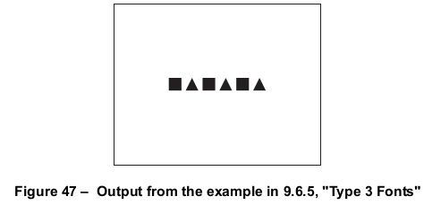

# 9.6 简单字体

**Simple Fonts**

## 9.6.1 概述

**General**

=== "中文"

    简单字体（simple fonts）有几种类型，所有类型都具有以下特性：

    - **字形选择**：

      字体中的字形应通过**单字节字符代码**进行选择，这些代码来自文本显示操作符所显示的字符串。从逻辑上讲，这些代码索引到一个包含 **256 个字形**的表中。代码到字形的映射称为**字体的编码**（encoding）。在某些情况下，可以使用 [9.6.6] “字符编码” 中描述的方法来更改编码。  

    - **字形度量**：

      每个字形应具有一组**唯一的度量信息**，其中包括**水平位移或宽度**（详见 [9.2.4] “字形定位与度量”）。也就是说，简单字体仅支持**水平书写模式**。  

    - **字体描述符**：

      除 Type 0 字体、非标记 PDF（non-Tagged PDF）中的 Type 3 字体，以及某些标准 Type 1 字体外，每个**字体字典**都应包含一个**子字典**——**字体描述符**（font descriptor）。该描述符包含字体的整体度量信息及其他属性（详见 [9.8] “字体描述符”）。其中包括一个**可选的字体文件流**，该流包含**字体程序**。

=== "英文"

    There are several types of simple fonts, all of which have these properties:
    
    - Glyphs in the font shall be selected by single-byte character codes obtained from a string that is shown by the text-showing operators. Logically, these codes index into a table of 256 glyphs; the mapping from codes to glyphs is called the font’s encoding. Under some circumstances, the encoding may be altered by means described in [9.6.6], "Character Encoding".
    - Each glyph shall have a single set of metrics, including a horizontal displacement or width, as described in [9.2.4], "Glyph Positioning and Metrics"; that is, simple fonts support only horizontal writing mode.
    - Except for Type 0 fonts, Type 3 fonts in non-Tagged PDF documents, and certain standard Type 1 fonts, every font dictionary shall contain a subsidiary dictionary, the font descriptor, containing font-wide metrics and other attributes of the font; see [9.8], "Font Descriptors". Among those attributes is an optional font file stream containing the font program.

## 9.6.2 Type 1 字体

**Type 1 Fonts**

### 9.6.2.1 概述

**General**

=== "中文"

    Type 1 字体程序是一个风格化的 PostScript 程序，用于描述字形的形状。它使用紧凑的编码方式来表示字形描述，并包含提示信息，使得即使在小尺寸和低分辨率下也能高质量地渲染字形。

    !!! note "NOTE 1"

        该格式的详细信息在单独的规范《Adobe Type 1 Font Format》中提供。Type 1 字体程序的一种替代、更紧凑但功能等效的表示法记录在 Adobe 技术说明书 #5176，《Compact Font Format Specification》中。

    !!! note "NOTE 2"

        尽管 Type 1 字体程序使用 PostScript 语言语法，但使用它并不需要完整的 PostScript 解释器；只需一个专门的 Type 1 字体解释器即可。

    Type 1 字体字典可以包含 [Table 111](#table111) 中列出的条目。某些条目对于 [9.6.2.2] 中列出的标准 14 字体是可选的，但在其他情况下是必需的。

    <table id="table111" markdown="span">
        <caption>**Table 111 – Type 1 字体字典中的条目**</caption>
        <thead>
            <tr>
                <th>**键**</th>
                <th>**类型**</th>
                <th>**值**</th>
            </tr>
        </thead>
        <tbody>
            <tr>
                <td>**Type**</td>
                <td>name</td>
                <td>(必需) 该字典描述的 PDF 对象类型；对于字体字典，应为 **Font**。
                </td>
            </tr>
            <tr>
                <td>**Subtype**</td>
                <td>name</td>
                <td>(必需) 字体类型；对于 Type 1 字体，应为 **Type1**。
                </td>
            </tr>
            <tr>
                <td>**Name**</td>
                <td>name</td>
                <td>(*PDF 1.0 中必需；否则可选*) 该字体在当前资源字典的 **Font** 子字典中的引用名称。<br/>
                此条目已过时，不应使用。
                </td>
            </tr>
            <tr>
                <td>**BaseFont**</td>
                <td>name</td>
                <td>(必需) 字体的 PostScript 名称。对于 Type 1 字体，这始终是字体程序中的 **FontName** 条目的值；有关更多信息，请参见《PostScript 语言参考》第三版的第 5.2 节。字体的 PostScript 名称可用于在符合要求的阅读器或其环境中查找字体程序。它也是打印到 PostScript 输出设备时使用的名称。
                </td>
            </tr>
            <tr>
                <td>**FirstChar**</td>
                <td>integer</td>
                <td>(*除标准 14 字体外，必需*) 字体 **Widths** 数组中定义的第一个字符代码。<br/>
                    从 PDF 1.5 开始，对标准 14 字体的特殊处理已被弃用。符合要求的写入者应使用完整的字体描述符表示所有字体。为了向后兼容，符合要求的阅读器仍应提供针对标准 14 字体的特殊处理。
                </td>
            </tr>
            <tr>
                <td>**LastChar**</td>
                <td>integer</td>
                <td>(除标准 14 字体外，必需) 字体 **Widths** 数组中定义的最后一个字符代码。<br/>
                    从 PDF 1.5 开始，对标准 14 字体的特殊处理已被弃用。符合要求的写入者应使用完整的字体描述符表示所有字体。为了向后兼容，符合要求的阅读器仍应提供针对标准 14 字体的特殊处理。
                </td>
            </tr>
            <tr>
                <td>**Widths**</td>
                <td>array</td>
                <td>(除标准 14 字体外，必需；建议使用间接引用) 一个数组，包含 (**LastChar − FirstChar + 1**) 个宽度，每个元素是与字符代码 **FirstChar** 加上数组索引相等的字形宽度。对于字符代码超出 **FirstChar** 到 **LastChar** 范围的情况，应使用 **FontDescriptor** 条目中 **MissingWidth** 的值。字形宽度应以文本空间单位度量，其中 1000 单位对应于文本空间中的 1 单位。字形宽度应与字体程序中给出的实际宽度一致。有关字形宽度和其他字形度量的信息，请参见 [9.2.4] "字形定位与度量"。<br/>
                    从 PDF 1.5 开始，对标准 14 字体的特殊处理已被弃用。符合要求的写入者应使用完整的字体描述符表示所有字体。为了向后兼容，符合要求的阅读器仍应提供针对标准 14 字体的特殊处理。
                </td>
            </tr>
            <tr>
                <td>**FontDescriptor**</td>
                <td>dictionary</td>
                <td>(除标准 14 字体外，必需；应为间接引用) 描述字体度量的字典，除字形宽度外的其他度量（见 [9.8] "字体描述符"）。<br/>
                    对于标准 14 字体，条目 ***FirstChar***、***LastChar***、***Widths*** 和 ***FontDescriptor*** 应该全部存在或全部缺失。通常情况下，这些字典键可能不存在；指定它们可以覆盖标准字体；参见 [9.6.2.2] "标准 Type 1 字体（标准 14 字体）"。<br/>
                    从 PDF 1.5 开始，对标准 14 字体的特殊处理已被弃用。符合要求的写入者应使用完整的字体描述符表示所有字体。为了向后兼容，符合要求的阅读器仍应提供针对标准 14 字体的特殊处理。
                </td>
            </tr>
            <tr>
                <td>**Encoding**</td>
                <td>name 或 dictionary</td>
                <td>(可选) 如果字体的字符编码不同于内建编码，则指定该字体的字符编码。**Encoding** 的值应为预定义编码的名称（**MacRomanEncoding**、**MacExpertEncoding** 或 **WinAnsiEncoding**，如附录 D 中所述），或者一个编码字典，字典应指定与字体内建编码或指定的预定义编码之间的差异（见 [9.6.6] "字符编码"）。
                </td>
            </tr>
            <tr>
                <td>**ToUnicode**</td>
                <td>stream</td>
                <td>(可选；PDF 1.2) 包含一个 CMap 文件的流，该文件将字符代码映射到 Unicode 值（见 [9.10] "提取文本内容"）。
                </td>
            </tr>
        </tbody>
    </table>

    !!! info "EXAMPLE"

        此示例显示了 Adobe Garamond® Semibold 字体的字体字典。该字体具有一个编码字典（对象 25），尽管示例中未显示编码字典或字体描述符（对象 7）。
    
        ```tex
        14 0 obj
            << /Type /Font
               /Subtype /Type1
               /BaseFont /AGaramond−Semibold
               /FirstChar 0
               /LastChar 255
               /Widths 21 0 R
               /FontDescriptor 7 0 R
               /Encoding 25 0 R
            >>
        endobj
        
        
        21 0 obj
            [ 255 255 255 255 255 255 255 255 255 255 255 255 255 255 255 255
              255 255 255 255 255 255 255 255 255 255 255 255 255 255 255 255
              255 280 438 510 510 868 834 248 320 320 420 510 255 320 255 347
              510 510 510 510 510 510 510 510 510 510 255 255 510 510 510 330
              781 627 627 694 784 580 533 743 812 354 354 684 560 921 780 792
              588 792 656 504 682 744 650 968 648 590 638 320 329 320 510 500
              380 420 510 400 513 409 301 464 522 268 259 484 258 798 533 492
              516 503 349 346 321 520 434 684 439 448 390 320 255 320 510 255
              627 627 694 580 780 792 744 420 420 420 420 420 420 402 409 409
              409 409 268 268 268 268 533 492 492 492 492 492 520 520 520 520
              486 400 510 510 506 398 520 555 800 800 1044 360 380 549 846 792
              713 510 549 549 510 522 494 713 823 549 274 354 387 768 615 496
              330 280 510 549 510 549 612 421 421 1000 255 627 627 792 1016 730
              500 1000 438 438 248 248 510 494 448 590 100 510 256 256 539 539
              486 255 248 438 1174 627 580 627 580 580 354 354 354 354 792 792
              790 792 744 744 744 268 380 380 380 380 380 380 380 380 380 380
            ]
        endobj
        ```

=== "英文"

    A Type 1 font program is a stylized PostScript program that describes glyph shapes. It uses a compact encoding for the glyph descriptions, and it includes hint information that enables high-quality rendering even at small sizes and low resolutions.
    
    !!! note "NOTE 1"
    
        Details on this format are provided in a separate specification, Adobe Type 1 Font Format. An alternative, more compact but functionally equivalent representation of a Type 1 font program is documented in Adobe Technical Note #5176, *The Compact Font Format Specification*.
    
    !!! note "NOTE 2"
    
        Although a Type 1 font program uses PostScript language syntax, using it does not require a full PostScript interpreter; a specialized Type 1 font interpreter suffices.
    
    A Type 1 font dictionary may contain the entries listed in [Table 111](#table111). Some entries are optional for the standar 14 fonts listed under [9.6.2.2], "Standard Type 1 Fonts (Standard 14 Fonts)", but are required otherwise.
                                
    <table id="table111" markdown="span">
        <caption>**Table 111 – Entries in a Type 1 font dictionary**</caption>
        <thead>
            <tr>
                <th>**Key**</th>
                <th>**Type**</th>
                <th>**Value**</th>
            </tr>
        </thead>
        <tbody>
            <tr>
                <td>**Type**</td>
                <td>name</td>
                <td>(Required) The type of PDF object that this dictionary describes; shall be **Font** for a font dictionary.
                </td>
            </tr>
            <tr>
                <td>**Subtype**</td>
                <td>name</td>
                <td>(Required) The type of font; shall be **Type1** for a Type 1 font.
                </td>
            </tr>
            <tr>
                <td>**Name**</td>
                <td>name</td>
                <td>(*Required in PDF 1.0; optional otherwise*) The name by which this font is referenced in the **Font** subdictionary of the current resource dictionary.<br/>
                This entry is obsolete and should not be used.
                </td>
            </tr>
            <tr>
                <td>**BaseFont**</td>
                <td>name</td>
                <td>(Required) The PostScript name of the font. For Type 1 fonts, this is always the value of the **FontName** entry in the font program; for more information, see Section 5.2 of the *PostScript Language* Reference, Third Edition. The PostScript name of the font may be used to find the font program in the conforming reader or its environment. It is also the name that is used when printing to a PostScript output device.
                </td>
            </tr>
            <tr>
                <td>**FirstChar**</td>
                <td>integer</td>
                <td>(*Required except for the standard 14 fonts*) The first character code defined in the font’s **Widths** array.<br/>
                    Beginning with PDF 1.5, the special treatment given to the standard 14 fonts is deprecated. Conforming writers should represent all fonts using a complete font descriptor. For backwards capability, conforming readers shall still provide the special treatment identified for the standard 14 fonts.
                </td>
            </tr>
            <tr>
                <td>**LastChar**</td>
                <td>integer</td>
                <td>(Required except for the standard 14 fonts) The last character code defined in the font’s **Widths** array.<br/>
                    Beginning with PDF 1.5, the special treatment given to the standard 14 fonts is deprecated. Conforming writers should represent all fonts using a complete font descriptor. For backwards capability, conforming readers shall still provide the special treatment identified for the standard 14 fonts.
                </td>
            </tr>
            <tr>
                <td>**Widths**</td>
                <td>array</td>
                <td>(Required except for the standard 14 fonts; indirect reference preferred) An array of (**LastChar − FirstChar + 1**) widths, each element being the glyph width for the character code that equals **FirstChar** plus the array index. For character codes outside the range **FirstChar** to **LastChar**, the value of **MissingWidth** from the **FontDescriptor** entry for this font shall be used. The glyph widths shall be measured in units in which 1000 units correspond to 1 unit in text space. These widths shall be consistent with the actual widths given in the font program. For more information on glyph widths and other glyph metrics, see [9.2.4], "Glyph Positioning and Metrics". <br/>
                    Beginning with PDF 1.5, the special treatment given to the standard 14 fonts is deprecated. Conforming writers should represent all fonts using a complete font descriptor. For backwards capability, conforming readers shall still provide the special treatment identified for the standard 14 fonts.
                </td>
            </tr>
            <tr>
                <td>**FontDescriptor**</td>
                <td>dictionary</td>
                <td>(Required except for the standard 14 fonts; shall be an indirect reference) A font descriptor describing the font’s metrics other than its glyph widths (see [9.8], "Font Descriptors"”\). <br/>
                    For the standard 14 fonts, the entries ***FirstChar***, ***LastChar***, ***Widths***, and ***FontDescriptor*** shall either all be present or all be absent. Ordinarily, these dictionary keys may be absent; specifying them enables a standard font to be overridden; see [9.6.2.2], "Standard Type 1 Fonts (Standard 14 Fonts)". <br/>
                    Beginning with PDF 1.5, the special treatment given to the standard 14 fonts is deprecated. Conforming writers should represent all fonts using a complete font descriptor. For backwards capability, conforming readers shall still provide the special treatment identified for the standard 14 fonts.
                </td>
            </tr>
            <tr>
                <td>**Encoding**</td>
                <td>name or dictionary</td>
                <td>(Optional) A specification of the font’s character encoding if different from its built-in encoding. The value of **Encoding** shall be either the name of a predefined encoding (**MacRomanEncoding**, **MacExpertEncoding**, or **WinAnsiEncoding**, as described in Annex D) or an encoding dictionary that shall specify differences from the font’s built-in encoding or from a specified predefined encoding (see [9.6.6], "Character Encoding").
                </td>
            </tr>
            <tr>
                <td>**ToUnicode**</td>
                <td>stream</td>
                <td>(Optional; PDF 1.2) A stream containing a CMap file that maps character codes to Unicode values (see [9.10], "Extraction of Text Content").
                </td>
            </tr>
        </tbody>
    </table>
    
    
    !!! info "EXAMPLE"
    
        This example shows the font dictionary for the Adobe Garamond® Semibold font. The font has an encoding dictionary (object 25), although neither the encoding dictionary nor the font descriptor (object 7) is shown in the example.
    
        ```tex
        14 0 obj
            << /Type /Font
               /Subtype /Type1
               /BaseFont /AGaramond−Semibold
               /FirstChar 0
               /LastChar 255
               /Widths 21 0 R
               /FontDescriptor 7 0 R
               /Encoding 25 0 R
            >>
        endobj
        
        
        21 0 obj
            [ 255 255 255 255 255 255 255 255 255 255 255 255 255 255 255 255
              255 255 255 255 255 255 255 255 255 255 255 255 255 255 255 255
              255 280 438 510 510 868 834 248 320 320 420 510 255 320 255 347
              510 510 510 510 510 510 510 510 510 510 255 255 510 510 510 330
              781 627 627 694 784 580 533 743 812 354 354 684 560 921 780 792
              588 792 656 504 682 744 650 968 648 590 638 320 329 320 510 500
              380 420 510 400 513 409 301 464 522 268 259 484 258 798 533 492
              516 503 349 346 321 520 434 684 439 448 390 320 255 320 510 255
              627 627 694 580 780 792 744 420 420 420 420 420 420 402 409 409
              409 409 268 268 268 268 533 492 492 492 492 492 520 520 520 520
              486 400 510 510 506 398 520 555 800 800 1044 360 380 549 846 792
              713 510 549 549 510 522 494 713 823 549 274 354 387 768 615 496
              330 280 510 549 510 549 612 421 421 1000 255 627 627 792 1016 730
              500 1000 438 438 248 248 510 494 448 590 100 510 256 256 539 539
              486 255 248 438 1174 627 580 627 580 580 354 354 354 354 792 792
              790 792 744 744 744 268 380 380 380 380 380 380 380 380 380 380
            ]
        endobj
        ```


### 9.6.2.2 标准 Type 1 字体 (标准 14 字体)

**Standard Type 1 Fonts (Standard 14 Fonts)**

=== "中文"

    14 种 Type 1 字体的 PostScript 名称，称为 *标准 14 字体*，如下所示：Times-Roman、Helvetica、Courier、Symbol、Times-Bold、Helvetica-Bold、Courier-Bold、ZapfDingbats、Times-Italic、Helvetica-Oblique、Courier-Oblique、Times-BoldItalic、Helvetica-BoldOblique、Courier-BoldOblique。

    这些字体，或它们的字体度量和适当的替代字体，应该对符合要求的阅读器可用。

    !!! note "NOTE"

        这些字体的字符集和编码列在附录 D 中。标准 14 字体的字体度量文件可以从 ASN 网站获取（见 [参考文献](../bibliography.md)）。有关字体度量的更多信息，请参阅 Adobe 技术说明书 #5004，《Adobe 字体度量文件格式规范》。

=== "英文"

    The PostScript names of 14 Type 1 fonts, known as the *standard 14 fonts*, are as follows: Times-Roman, Helvetica, Courier, Symbol, Times-Bold, Helvetica-Bold, Courier-Bold, ZapfDingbats, Times-Italic, Helvetica- Oblique, Courier-Oblique, Times-BoldItalic, Helvetica-BoldOblique, Courier-BoldOblique
    
    These fonts, or their font metrics and suitable substitution fonts, shall be available to the conforming reader.
    
    !!! note "NOTE"
    
        The character sets and encodings for these fonts are listed in Annex D. The font metrics files for the standard 14 fonts are available from the ASN Web site (see the [Bibliography](../bibliography.md)). For more information on font metrics, see Adobe Technical Note #5004, Adobe Font Metrics File Format Specification.


### 9.6.2.3 多重主控字体

**Multiple Master Fonts**

=== "中文"

    *多重主字体*格式是 Type 1 字体格式的扩展，允许从一个字体程序生成多种类型的字体样式。这是通过在字体中引入各种设计维度来实现的。

    !!! info "EXAMPLE 1"

        设计维度的示例包括字重（从轻到特粗）和宽度（从紧凑到扩展）。

    沿着这些设计维度的坐标（如粗细程度）通过数字指定。特定的数字选择会选择多重主字体的一个实例。PDF 文件可以包含多个多重主字体实例。

    !!! note "NOTE"

        Adobe 技术说明书 #5015，《Type 1 字体格式补充说明》，详细描述了多重主字体。

    多重主字体实例的字体字典可以包含与 Type 1 字体字典相同的条目（见 [表 111](#table111)），但有以下不同之处：

    - **Subtype** 的值应为 **MMType1**。
    - 如果实例的 PostScript 名称包含空格（20h），则应在 **BaseFont** 的值中将空格替换为下划线（5Fh）。例如，如此例所示，名称“MinionMM 366 465 11 ”（以空格字符结尾）变为 /MinionMM_366_465_11_。

    !!! info "EXAMPLE 2"

        ```tex
        7 0 obj
            << /Type /Font
                /Subtype /MMType1
                /BaseFont /MinionMM_366_465_11_
                /FirstChar 32
                /LastChar 255
                /Widths 19 0 R
                /FontDescriptor 6 0 R
                /Encoding 5 0 R
            >>
        endobj
        
        19 0 obj
            [ 187 235 317 430 427 717 607 168 326 326 421 619 219 317 219 282 427
                … 省略的数据 …
                569 0 569 607 607 607 239 400 400 400 400 253 400 400 400 400 400
            ]
        endobj
        ```

        此示例说明了一种将设计坐标的数值作为实例的 **BaseFont** 名称一部分的约定。这种约定通常用于从外部源访问多重主字体实例，以便在符合要求的阅读器环境中使用；该约定在 Adobe 技术说明书 #5088，《字体命名问题》中有文档记录。然而，这个约定并不是 PDF 规范的一部分。

    如果多重主字体实例的字体程序嵌入在 PDF 文件中，则它应是普通的 Type 1 字体程序，而非多重主字体程序。此字体程序被称为多重主字体实例的 *快照*，它包含所选的设计坐标的值。

=== "英文"

    The *multiple master* font format is an extension of the Type 1 font format that allows the generation of a wide variety of typeface styles from a single font program. This is accomplished through the presence of various design dimensions in the font.
    
    !!! info "EXAMPLE 1"
    
        Examples of design dimensions are weight (light to extra-bold) and width (condensed to expanded).
    
    Coordinates along these design dimensions (such as the degree of boldness) are specified by numbers. A particular choice of numbers selects an instance of the multiple master font. PDFs can contain multiple master instances.
    
    !!! note "NOTE"
    
        Adobe Technical Note #5015, Type 1 Font Format Supplement, describes multiple master fonts in detail.
    
    The font dictionary for a multiple master font instance may contain the same entries as a Type 1 font dictionary (see [Table 111](#table111)), with these differences:
    
    - The value of **Subtype** shall be **MMType1**.
    - If the PostScript name of the instance contains SPACEs (20h), the SPACEs shall be replaced by LOW LINEs (underscores) (5Fh) in the value of **BaseFont**. For instance, as illustrated in this example, the name “MinionMM 366 465 11 ” (which ends with a SPACE character) becomes /MinionMM_366_465_11_.
    
    !!! info "EXAMPLE2"
    
        ```tex
        7 0 obj
            << /Type /Font
               /Subtype /MMType1
               /BaseFont /MinionMM_366_465_11_
               /FirstChar 32
               /LastChar 255
               /Widths 19 0 R
               /FontDescriptor 6 0 R
               /Encoding 5 0 R
            >>
        endobj
        
        19 0 obj
            [ 187 235 317 430 427 717 607 168 326 326 421 619 219 317 219 282 427
              … Omitted data …
              569 0 569 607 607 607 239 400 400 400 400 253 400 400 400 400 400
            ]
        endobj
        ```
        
        This example illustrates a convention for including the numeric values of the design coordinates as part of the instance’s **BaseFont** name. This convention is commonly used for accessing multiple master font instances from an external source in the conforming reader’s environment; it is documented in Adobe Technical Note #5088, *Font Naming Issues*. However, this convention is not prescribed as part of the PDF specification.
    
    If the font program for a multiple master font instance is embedded in the PDF file, it shall be an ordinary Type 1 font program, not a multiple master font program. This font program is called a *snapshot* of the multiple master font instance that incorporates the chosen values of the design coordinates.

## 9.6.3 TrueType 字体

**TrueType Fonts**

=== "中文"

    TrueType 字体字典可能包含与 Type 1 字体字典相同的条目（见 [表 111](#table111)），但有以下不同之处：

    - **Subtype** 的值应为 **TrueType**。
    - **Encoding** 的值受限于 9.6.6 节《字符编码》中所描述的限制。
    - **BaseFont** 的值推导方式不同。

    **BaseFont** 的 PostScript 名称可以通过以下两种方式之一确定：

    - 如果 TrueType 字体程序的 “name” 表包含一个 PostScript 名称，则使用该名称。
    - 如果 “name” 表中没有该条目，则从字体在主操作系统中所知的名称推导 PostScript 名称。在 Windows 系统中，名称应基于 LOGFONT 结构中的 lfFaceName 字段；在 Mac OS 中，应基于 FOND 资源的名称。如果名称中包含空格，则应去除空格。

    !!! note "NOTE 1"

        *TrueType* 字体格式由 Apple Computer, Inc. 开发，并已被作为 Microsoft Windows 操作系统的标准字体格式采用。TrueType 字体文件格式的规格可以在 Apple 的 *TrueType 参考手册* 和 Microsoft 的 *TrueType 1.0 字体文件技术规格* 中找到（见 [参考文献](../bibliography.md)）。

    !!! note "NOTE 2"

        TrueType 字体程序可以作为流对象直接嵌入 PDF 文件中。

    !!! note "NOTE 3"

        为 PostScript 定义的 Type 42 字体格式不适用于 PDF。

    !!! note "NOTE 4"

        对于 CJK（中文、日文和韩文）字体，主机字体系统的字体名称通常使用主机操作系统的字符集进行编码。例如，日文字体的名称可能是用某种（未标识的）日文编码书写的。因此，TrueType 字体名称可能包含多个字节的字符编码，每个字符编码需要多个字符在 PDF 名称对象中表示（使用 # 表示法来引用特殊字符）。

=== "英文"

    A TrueType font dictionary may contain the same entries as a Type 1 font dictionary (see [Table 111](#table111)), with these differences:
    
    - The value of **Subtype** shall be **TrueType**.
    - The value of **Encoding** is subject to limitations that are described in 9.6.6, "Character Encoding".
    - The value of **BaseFont** is derived differently.
    
    The PostScript name for the value of **BaseFont** may be determined in one of two ways:
    
    - If the TrueType font program's “name” table contains a PostScript name, it shall be used.
    - In the absence of such an entry in the “name” table, a PostScript name shall be derived from the name by which the font is known in the host operating system. On a Windows system, the name shall be based on the lfFaceName field in a LOGFONT structure; in the Mac OS, it shall be based on the name of the FOND resource. If the name contains any SPACEs, the SPACEs shall be removed.
    
    !!! note "NOTE 1"
    
        The *TrueType* font format was developed by Apple Computer, Inc., and has been adopted as a standard font format for the Microsoft Windows operating system. Specifications for the TrueType font file format are available in Apple’s *TrueType Reference Manual* and Microsoft’s *TrueType 1.0 Font Files Technical Specification (see [Bibliography](../bibliography.md)).*
    
    !!! note "NOTE 2"
    
        A TrueType font program may be embedded directly in a PDF file as a stream object.
    
    !!! note "NOTE 3"
    
        The Type 42 font format that is defined for PostScript does not apply to PDF.
    
    !!! note "NOTE 4"
    
        For CJK (Chinese, Japanese, and Korean) fonts, the host font system’s font name is often encoded in the host operating system’s script. For instance, a Japanese font may have a name that is written in Japanese using some (unidentified) Japanese encoding. Thus, TrueType font names may contain multiple-byte character codes, each of which requires multiple characters to represent in a PDF name object (using the # notation to quote special characters as needed).

## 9.6.4 字体子集

**Font Subsets**

=== "中文"

    PDF 文档可以包含 Type 1 和 TrueType 字体的子集。描述字体子集的字体和字体描述符与普通字体有所不同。这些差异使得符合规范的阅读器能够识别字体子集，并将包含同一字体不同子集的文档合并。（有关字体描述符的更多信息，参见 [9.8]，《字体描述符》）

    对于字体子集，字体的 PostScript 名称——字体的 **BaseFont** 条目的值和字体描述符的 **FontName** 条目的值——应以一个标签开始，后跟加号（+）。该标签应由恰好六个大写字母组成；字母的选择是任意的，但同一 PDF 文件中的不同子集应具有不同的标签。

    !!! info "EXAMPLE"

        EOODIA+Poetica 是 Poetica® 字体的一个子集的名称，Poetica® 是一种 Type 1 字体。

=== "英文"

    PDF documents may include subsets of Type 1 and TrueType fonts. The font and font descriptor that describe a font subset are slightly different from those of ordinary fonts. These differences allow a conforming reader to recognize font subsets and to merge documents containing different subsets of the same font. (For more information on font descriptors, see [9.8], "Font Descriptors".)
    
    For a font subset, the PostScript name of the font—the value of the font’s **BaseFont** entry and the font descriptor’s **FontName** entry— shall begin with a tag followed by a plus sign (+). The tag shall consist of exactly six uppercase letters; the choice of letters is arbitrary, but different subsets in the same PDF file shall have different tags.
    
    !!! info "EXAMPLE"
    
        EOODIA+Poetica is the name of a subset of Poetica®, a Type 1 font.


## 9.6.5 Type 3 字体

**Type 3 Fonts**

=== "中文"
    
    Type 3 字体与 PDF 支持的其他字体有所不同。Type 3 字体字典定义了字体；其他字体的字体字典仅包含关于字体的信息，并引用单独的字体程序以获取实际的字形描述。在 Type 3 字体中，字形应通过 PDF 图形操作符流来定义。这些流应与字形名称相关联。一个单独的编码条目应将字符代码映射到适当的字形名称。

    !!! note "NOTE 1"

        Type 3 字体比 Type 1 字体更灵活，因为字形描述可以包含任意的 PDF 图形操作符。然而，Type 3 字体没有用于改善小尺寸或低分辨率输出的提示机制。

    Type 3 字体字典可能包含 [表 112](#table112) 中列出的条目。

    <table id="table112" markdown="span">
        <caption>**表 112 – Type 3 字体字典中的条目**</caption>
        <thead>
            <tr>
                <th>**键**</th>
                <th>**类型**</th>
                <th>**值**</th>
            </tr>
        </thead>
        <tbody>
            <tr>
                <td>**Type**</td>
                <td>name</td>
                <td>(必需) 该字典描述的 PDF 对象类型；对于字体字典，应为 **Font**。</td>
            </tr>
            <tr>
                <td>**Subtype**</td>
                <td>name</td>
                <td>(必需) 字体类型；对于 Type 3 字体，应为 **Type3**。</td>
            </tr>
            <tr>
                <td>**Name**</td>
                <td>name</td>
                <td>(PDF 1.0 必需；否则可选) 参见 [表 111](#table111)。</td>
            </tr>
            <tr>
                <td>**FontBBox**</td>
                <td>rectangle</td>
                <td>(必需) 用字形坐标系统表示的矩形（参见 [7.9.5]，《矩形》），指定字体边界框。这是一个包含字体所有字形形状的最小矩形，如果将所有字形的原点重合并填充所有字形，则会得到该矩形。<br/>如果矩形的四个元素均为零，符合规范的阅读器不得根据字体边界框假定字形的大小。如果任何元素非零，则字体边界框应为准确值。如果任何字形的标记超出了此边界框，可能会导致不正确的行为。</td>
            </tr>
            <tr>
                <td>**FontMatrix**</td>
                <td>array</td>
                <td>(必需) 一个包含六个数字的数组，指定字体矩阵，将字形空间映射到文本空间（参见 [9.2.4]，《字形定位和度量》）。

    !!! note "NOTE"

        常见做法是将字形定义为 1000 单位字形坐标系统，在这种情况下，字体矩阵为 [ 0.001 0 0 0.001 0 0 ]。
                </td>
            </tr>
            <tr>
                <td>**CharProcs**</td>
                <td>dictionary</td>
                <td>(必需) 一个字典，其中每个键应是字形名称，与该键关联的值应是构建并绘制该字符字形的内容流。该流的第一个操作符应是 **d0** 或 **d1**，后跟描述一个或多个图形对象的操作符，这些图形对象可以包括路径、文本或图像对象。有关 Type 3 字形描述的更多细节，请参见下文。</td>
            </tr>
            <tr>
                <td>**Encoding**</td>
                <td>name or dictionary</td>
                <td>(必需) 一个编码字典，其 **Differences** 数组应指定该字体的完整字符编码（参见 [9.6.6]，《字符编码》）。</td>
            </tr>
            <tr>
                <td>**FirstChar**</td>
                <td>integer</td>
                <td>(必需) 在字体的 **Widths** 数组中定义的第一个字符代码。</td>
            </tr>
            <tr>
                <td>**LastChar**</td>
                <td>integer</td>
                <td>(必需) 在字体的 **Widths** 数组中定义的最后一个字符代码。</td>
            </tr>
            <tr>
                <td>**Widths**</td>
                <td>array</td>
                <td>(必需；应为间接引用) 一个包含 (**LastChar** − **FirstChar** + 1) 宽度的数组，每个元素是等于 **FirstChar** 加上数组索引的字符代码的字形宽度。对于字符代码超出 **FirstChar** 到 **LastChar** 范围的字符，宽度应为 0。这些宽度应按 **FontMatrix** 中指定的字形空间解释（与 Type 1 字体的宽度不同，后者是文本空间单位的千分之一）。<br/>如果 ***FontMatrix*** 指定了旋转，则只应使用变换宽度的 *水平* 组件。也就是说，得到的位移应在文本空间中是水平的，正如所有简单字体的情况一样。</td>
            </tr>
            <tr>
                <td>**FontDescriptor**</td>
                <td>dictionary</td>
                <td>(在标记 PDF 文档中必需；应为间接引用) 描述字体默认度量的字体描述符，不包括字形宽度（参见 [9.8]，《字体描述符》）。</td>
            </tr>
            <tr>
                <td>**Resources**</td>
                <td>dictionary</td>
                <td>(可选，但应使用；PDF 1.2) 一个字典，列出该字体字形描述中所需的命名资源，例如字体和图像（参见 [7.8.3]，《资源字典》）。如果任何字形描述引用了命名资源，但此字典缺失，则应在使用该字体的页面的资源字典中查找这些名称。</td>
            </tr>
            <tr>
                <td>**ToUnicode**</td>
                <td>stream</td>
                <td>(可选；PDF 1.2) 一个包含 CMap 文件的流，CMap 文件将字符代码映射到 Unicode 值（参见 [9.10]，《提取文本内容》）。</td>
            </tr>
        </tbody>
    </table>
    
    对于每个由使用 Type 3 字体的文本显示操作符显示的字符代码，符合规范的阅读器应：

    a) 在字体的 **Encoding** 条目中查找字符代码，如 [9.6.6]《字符编码》中所描述，获取字形名称。

    b) 在字体的 **CharProcs** 字典中查找字形名称，获取包含字形描述的流对象。如果 **CharProcs** 中没有该名称作为键，则不应绘制该字形。

    c) 调用字形描述。在调用之前，图形状态应被保存，并且在调用之后应恢复；因此，字形描述对图形状态的任何更改在其完成后不会持续。

    当字形描述开始执行时，当前变换矩阵（CTM）应为字体矩阵（当前字体字典中的 **FontMatrix**）和文本显示操作符调用时有效的文本空间的连接（参见 [9.4.4]《文本空间详细信息》）。这意味着在字形坐标系统中描述的形状会被转换为用户坐标系统，并以适当的大小和方向显示在页面上。字形描述应通过字形坐标系统中的绝对坐标来描述字形，将字形原点置于该空间的 (0, 0) 位置。它不应对初始文本位置做出任何假设。

    除了 CTM，图形状态应从导致字形描述被调用的文本显示操作符的环境中继承。为了确保可预测的结果，字形描述应初始化其依赖的任何图形状态参数。特别地，如果它调用 **S**（描边）操作符，则应显式设置线宽、线连接、线帽和虚线模式为适当的值。

    !!! note "NOTE 2"

        通常情况下，不需要也不应初始化当前颜色参数，因为文本显示操作符设计为使用当前颜色绘制字形。

    字形描述应执行 [表 113](#table113) 中描述的操作符之一，以将宽度和边界框信息传递给字体机制。这应在执行任何描述字形的路径构建或路径绘制操作符之前。

    !!! note "NOTE 3"

        PDF 中的 Type 3 字体与 PostScript 中的非常相似。虽然 Type 3 字体字典和字形描述中提供的某些信息看似冗余或不必要，但对于符合规范的阅读器正确打印到 PostScript 输出设备时，这些信息仍然是必需的。这尤其适用于 ***d0*** 和 ***d1*** 操作符的操作数，它们等同于 PostScript 中的 ***setcharwidth*** 和 ***setcachedevice***。有关进一步的解释，请参见 PostScript 语言参考（第三版）第 5.7 节。

    <table id="table113" markdown="span">
        <caption>**表 113 – Type 3 字体操作符**</caption>
        <thead>
            <tr>
                <th>**操作数**</th>
                <th>**操作符**</th>
                <th>**描述**</th>
            </tr>
        </thead>
        <tbody>
            <tr>
                <td>$w_x \qquad w_y$</td>
                <td>**d0**</td>
                <td>设置字形的宽度信息，并声明字形描述同时指定其形状和颜色。

    !!! note "NOTE"

        此操作符的名称以数字 **0** 结尾。

    $w_x$ 表示字形坐标系统中的水平位移；应与字体的 **Widths** 数组中的相应宽度一致。$w_y$ 应为 0（参见 [9.2.4]，《字形定位和度量》）。<br/>
    此操作符仅允许出现在 Type 3 字体的 **CharProcs** 字典中的内容流中。通常只有在字形描述执行操作符显式设置颜色时，才会使用此操作符。
                </td>
            </tr>
            <tr>
                <td>$w_x \qquad w_y \qquad ll_x \qquad ll_y \qquad ur_x \qquad ur_y$</td>
                <td>**d1**</td>
                <td>设置字形的宽度和边界框信息，并声明字形描述仅指定形状，而不指定颜色。

    !!! note "NOTE"

        此操作符的名称以数字 **1** 结尾。

    $w_x$ 表示字形坐标系统中的水平位移；应与字体的 **Widths** 数组中的相应宽度一致。$w_y$ 应为 0（参见 [9.2.4]，《字形定位和度量》）。<br/>
    $ll_x$ 和 $ll_y$ 表示字形边界框的左下角坐标，$ur_x$ 和 $ur_y$ 表示右上角坐标。字形边界框是一个最小矩形，沿着字形坐标系统的轴线定向，完全包围执行字形描述后在页面上放置的所有标记。声明的边界框应是正确的——也就是说，足够大以完全包围整个字形。如果任何标记超出了此边界框，结果是不可预测的。<br/>
    以 **d1** 操作符开头的字形描述不应执行任何设置颜色（或其他与颜色相关的参数）的操作符；任何此类操作符的使用应被忽略。字形描述的执行仅用于确定字形的形状。它的颜色应由每次文本显示操作符绘制该字形时生效的图形状态决定。出于同样的原因，字形描述不应包含图像；然而，图像遮罩是可以接受的，因为它仅定义了一个区域，该区域将在当前颜色下绘制在页面上。<br/>
    此操作符仅应在 Type 3 字体的 **CharProcs** 字典中的内容流中使用。
                </td>
            </tr>
        </tbody>
    </table>
    
    !!! info "EXAMPLE"
    
        此示例显示了一个仅包含两个字形的 Type 3 字体的定义——一个填充的方形和一个填充的三角形，通过字符代码 a 和 b 进行选择。图 47 显示了使用该字体显示字符串 ( ababab ) 的结果。
        
        
    
        ```tex
        4 0 obj
            << /Type /Font
               /Subtype /Type3
               /FontBBox [ 0 0 750 750 ]
               /FontMatrix [ 0.001 0 0 0.001 0 0 ]
               /CharProcs 10 0 R
               /Encoding 9 0 R
               /FirstChar 97
               /LastChar 98
               /Widths [ 1000 1000 ]
            >>
        endobj
    
        9 0 obj
            << /Type /Encoding
               /Differences [ 97 /square /triangle ]
            >>
        endobj
    
        10 0 obj
            << /square 11 0 R
               /triangle 12 0 R
            >>
        endobj
    
        11 0 obj
            << /Length 39 >>
        stream
            1000 0 0 0 750 750 d1
            0 0 750 750 re
            f
        endstream
        endobj
        
        12 0 obj
            << /Length 48 >>
        stream
            1000 0 0 0 750 750 d1
            0 0 m
            375 750 l
            750 0 l
            f
        endstream
        endobj
        ```

=== "英文"
    
    Type 3 fonts differ from the other fonts supported by PDF. A Type 3 font dictionary defines the font; font dictionaries for other fonts simply contain information about the font and refer to a separate font program for the actual glyph descriptions. In Type 3 fonts, glyphs shall be defined by streams of PDF graphics operators. These streams shall be associated with glyph names. A separate encoding entry shall map character codes to the appropriate glyph names for the glyphs.
    
    !!! note "NOTE 1"
    
        Type 3 fonts are more flexible than Type 1 fonts because the glyph descriptions may contain arbitrary PDF graphics operators. However, Type 3 fonts have no hinting mechanism for improving output at small sizes or low resolutions.
    
    A Type 3 font dictionary may contain the entries listed in Table 112.
    
    <table id="table112" markdown="span">
        <caption>**Table 112 – Entries in a Type 3 font dictionary**</caption>
        <thead>
            <tr>
                <th>**Key**</th>
                <th>**Type**</th>
                <th>**Value**</th>
            </tr>
        </thead>
        <tbody>
            <tr>
                <td>**Type**</td>
                <td>name</td>
                <td>(Required) The type of PDF object that this dictionary describes; shall be **Font** for a font dictionary.
                </td>
            </tr>
            <tr>
                <td>**Subtype**</td>
                <td>name</td>
                <td>(Required) The type of font; shall be **Type3** for a Type 3 font.
                </td>
            </tr>
            <tr>
                <td>**Name**</td>
                <td>name</td>
                <td>(Required in PDF 1.0; optional otherwise) See [Table 111](#table111).
                </td>
            </tr>
            <tr>
                <td>**FontBBox**</td>
                <td>rectangle</td>
                <td>(Required) A rectangle (see [7.9.5], "Rectangles") expressed in the glyph coordinate system, specifying the font bounding box. This is the smallest rectangle enclosing the shape that would result if all of the glyphs of the font were placed with their origins coincident and then filled.<br/>
                    If all four elements of the rectangle are zero, a conforming reader shall make no assumptions about glyph sizes based on the font bounding box. If any element is nonzero, the font bounding box shall be accurate. If any glyph’s marks fall outside this bounding box, incorrect behavior may result.
                </td>
            </tr>
            <tr>
                <td>**FontMatrix**</td>
                <td>array</td>
                <td>(Required) An array of six numbers specifying the font matrix, mapping glyph space to text space (see [9.2.4], "Glyph Positioning and Metrics").
    
    !!! note "NOTE"
    
        A common practice is to define glyphs in terms of a 1000-unit glyph coordinate system, in which case the font matrix is [ 0.001 0 0 0.001 0 0 ].
                </td>
            </tr>
            <tr>
                <td>**CharProcs**</td>
                <td>dictionary</td>
                <td>(Required) A dictionary in which each key shall be a glyph name and the value associated with that key shall be a content stream that constructs and paints the glyph for that character. The stream shall include as its first operator either **d0** or **d1**, followed by operators describing one or more graphics objects, which may include path, text, or image objects. See below for more details about Type 3 glyph descriptions.
                </td>
            </tr>
            <tr>
                <td>**Encoding**</td>
                <td>name or dictionary</td>
                <td>(Required) An encoding dictionary whose **Differences** array shall specify the complete character encoding for this font (see [9.6.6], "Character Encoding").
                </td>
            </tr>
            <tr>
                <td>**FirstChar**</td>
                <td>integer</td>
                <td>(Required) The first character code defined in the font’s **Widths** array.
                </td>
            </tr>
            <tr>
                <td>**LastChar**</td>
                <td>integer</td>
                <td>(Required) The last character code defined in the font’s **Widths** array.
                </td>
            </tr>
            <tr>
                <td>**Widths**</td>
                <td>array</td>
                <td>(Required; should be an indirect reference) An array of (**LastChar** − **FirstChar** + 1) widths, each element being the glyph width for the character code that equals **FirstChar** plus the array index. For character codes outside the range **FirstChar** to **LastChar**, the width shall be 0. These widths shall be interpreted in glyph space as specified by **FontMatrix** (unlike the widths of a Type 1 font, which are in thousandths of a unit of text space).<br/>
                If ***FontMatrix*** specifies a rotation, only the *horizontal* component of the transformed width shall be used. That is, the resulting displacement shall be horizontal in text space, as is the case for all simple fonts.
                </td>
            </tr>
            <tr>
                <td>**FontDescriptor**</td>
                <td>dictionary</td>
                <td>(Required in Tagged PDF documents; shall be an indirect reference) A font descriptor describing the font’s default metrics other than its glyph widths (see [9.8], "Font Descriptors").
                </td>
            </tr>
            <tr>
                <td>**Resources**</td>
                <td>dictionary</td>
                <td>(Optional but should be used; PDF 1.2) A list of the named resources, such as fonts and images, required by the glyph descriptions in this font (see [7.8.3], "Resource Dictionaries"). If any glyph descriptions refer to named resources but this dictionary is absent, the names shall be looked up in the resource dictionary of the page on which the font is used.
                </td>
            </tr>
            <tr>
                <td>**ToUnicode**</td>
                <td>stream</td>
                <td>(Optional; PDF 1.2) A stream containing a CMap file that maps character codes to Unicode values (see [9.10], "Extraction of Text Content").
                </td>
            </tr>
        </tbody>
    </table>
    
    For each character code shown by a text-showing operator that uses a Type 3 font, the conforming reader shall:
    
    a) Look up the character code in the font’s **Encoding** entry, as described in [9.6.6], "Character Encoding," to obtain a glyph name.
    
    b) Look up the glyph name in the font’s **CharProcs** dictionary to obtain a stream object containing a glyph description. If the name is not present as a key in **CharProcs**, no glyph shall be painted.
    
    c) Invoke the glyph description. The graphics state shall be saved before this invocation and shall be restored afterward; therefore, any changes the glyph description makes to the graphics state do not persist after it finishes.
    
    When the glyph description begins execution, the current transformation matrix (CTM) shall be the concatenation of the font matrix (**FontMatrix** in the current font dictionary) and the text space that was in effect at the time the text-showing operator was invoked (see [9.4.4], "Text Space Details"). This means that shapes described in the glyph coordinate system are transformed into the user coordinate system and appear in the appropriate size and orientation on the page. The glyph description shall describe the glyph in terms of absolute coordinates in the glyph coordinate system, placing the glyph origin at (0, 0) in this space. It shall make no assumptions about the initial text position.
    
    Aside from the CTM, the graphics state shall be inherited from the environment of the text-showing operator that caused the glyph description to be invoked. To ensure predictable results, the glyph description shall initialize any graphics state parameters on which it depends. In particular, if it invokes the **S** (stroke) operator, it shall explicitly set the line width, line join, line cap, and dash pattern to appropriate values.
    
    !!! note "NOTE 2"
    
        Normally, it is unnecessary and undesirable to initialize the current colour parameter because the text-showing operators are designed to paint glyphs with the current colour.
    
    The glyph description shall execute one of the operators described in [Table 113](#table113) to pass width and bounding box information to the font machinery. This shall precede the execution of any path construction or path- painting operators describing the glyph.
    
    !!! note "NOTE 3"
    
        Type 3 fonts in PDF are very similar to those in PostScript. Some of the information provided in Type 3 font dictionaries and glyph descriptions, while seemingly redundant or unnecessary, is nevertheless required for correct results when a conforming reader prints to a PostScript output device. This applies particularly to the operands of the ***d0*** and ***d1*** operators, are the equivalent of PostScript's ***setcharwidth*** and ***setcachedevice***. For further explanation, see Section 5.7 of the PostScript Language Reference, Third Edition.
    
    <table id="table113" markdown="span">
        <caption>**Table 113 – Type 3 font operators**</caption>
        <thead>
            <tr>
                <th>**Operands**</th>
                <th>**Operator**</th>
                <th>**Description**</th>
            </tr>
        </thead>
        <tbody>
            <tr>
                <td>$w_x \qquad w_y$</td>
                <td>**d0**</td>
                <td>Set width information for the glyph and declare that the glyph description specifies both its shape and its colour.
    
    !!! note "NOTE"
    
        This operator name ends in the digit **0**.
    
    wx denotes the horizontal displacement in the glyph coordinate system; it shall be consistent with the corresponding width in the font’s **Widths** array. wy shall be 0 (see [9.2.4], "Glyph Positioning and Metrics").<br/>
    This operator shall only be permitted in a content stream appearing in a Type 3 font’s **CharProcs** dictionary. It is typically used only if the glyph description executes operators to set the colour explicitly.
                </td>
            </tr>
            <tr>
                <td>$w_x \qquad w_y \qquad ll_x \qquad ll_y \qquad ur_x \qquad ur_y$</td>
                <td>**d1**</td>
                <td>Set width and bounding box information for the glyph and declare that the glyph description specifies only shape, not colour.
    
    !!! note "NOTE"
    
        This operator name ends in the digit **1**.
    
    $w_x$ denotes the horizontal displacement in the glyph coordinate system; it shall be consistent with the corresponding width in the font’s **Widths** array. $w_y$ shall be 0 (see [9.2.4], "Glyph Positioning and Metrics").<br/>
    $ll_x$ and $ll_y$ denote the coordinates of the lower-left corner, and $ur_x$ and $ur_y$ denote the upper-right corner, of the glyph bounding box. The glyph bounding box is the smallest rectangle, oriented with the axes of the glyph coordinate system, that completely encloses all marks placed on the page as a result of executing the glyph’s description. The declared bounding box shall be correct—in other words, sufficiently large to enclose the entire glyph. If any marks fall outside this bounding box, the result is unpredictable.<br/>
    A glyph description that begins with the **d1** operator should not execute any operators that set the colour (or other colour-related parameters) in the graphics state; any use of such operators shall be ignored. The glyph description is executed solely to determine the glyph’s shape. Its colour shall be determined by the graphics state in effect each time this glyph is painted by a text-showing operator. For the same reason, the glyph description shall not include an image; however, an image mask is acceptable, since it merely defines a region of the page to be painted with the current colour.<br/>
    This operator shall be used only in a content stream appearing in a Type 3 font’s **CharProcs** dictionary.
                </td>
            </tr>
        </tbody>
    </table>
    
    !!! info "EXAMPLE"
    
        This example shows the definition of a Type 3 font with only two glyphs—a filled square and a filled triangle, selected by the character codes a and b. Figure 47 shows the result of showing the string ( ababab ) using this font.
        
        
    
        ```tex
        4 0 obj
            << /Type /Font
               /Subtype /Type3
               /FontBBox [ 0 0 750 750 ]
               /FontMatrix [ 0.001 0 0 0.001 0 0 ]
               /CharProcs 10 0 R
               /Encoding 9 0 R
               /FirstChar 97
               /LastChar 98
               /Widths [ 1000 1000 ]
            >>
        endobj
    
        9 0 obj
            << /Type /Encoding
               /Differences [ 97 /square /triangle ]
            >>
        endobj
    
        10 0 obj
            << /square 11 0 R
               /triangle 12 0 R
            >>
        endobj
    
        11 0 obj
            << /Length 39 >>
        stream
            1000 0 0 0 750 750 d1
            0 0 750 750 re
            f
        endstream
        endobj
        
        12 0 obj
            << /Length 48 >>
        stream
            1000 0 0 0 750 750 d1
            0 0 m
            375 750 l
            750 0 l
            f
        endstream
        endobj
        ```

## 9.6.6 字符编码

**Character Encoding**

### 9.6.6.1 概述

**General**

=== "中文"

    字体的 *编码* 是字符代码（从显示的文本字符串中获取）与字形描述之间的关联。本小节描述了与简单 PDF 字体一起使用的字符编码方案。复合字体（Type 0）使用不同的字符映射算法，如[9.7]《复合字体》中所讨论的那样。

    除 Type 3 字体外，每个字体程序都应有内置的编码。在某些情况下，PDF 字体字典可能会更改与字体程序一起使用的编码，以匹配符合要求的作者生成的显示文本。

    !!! note "注释"

        字符编码的灵活性有两个重要的原因：
        
        它允许根据各种现有的约定来显示文本。例如，Microsoft Windows 和 Apple Mac OS 操作系统对拉丁文本使用不同的标准编码，许多符合要求的作者使用自己的专用编码。
        
        它允许符合要求的作者指定如何对从大字符集选出的字符进行编码。

    一些字符集包含超过 256 个字符，包括连字、带重音符的字符和其他符号，这些符号对高质量排版或非拉丁书写系统是必需的。不同的编码可能会选择相同字符集的不同子集。

    一种常用的拉丁文本字体程序编码通常被称为 **StandardEncoding** 或有时称为 Adobe 标准编码。**StandardEncoding** 在 PDF 中没有特殊含义，但这种编码确实充当了默认编码（如[表 114](#table114)所示）。在 Mac OS 和 Windows 系统上使用的常规编码分别命名为 **MacRomanEncoding** 和 **WinAnsiEncoding**。编码 **MacExpertEncoding** 可用于包含额外字符的“专家”字体，这些字符对于复杂的排版非常有用。有关这些编码的完整细节以及典型字体中字符的详细信息，参见[附录 D]。

    在 PDF 中，字体根据其所有字符是否属于标准拉丁字符集而被分类为 *非符号字体* 或 *符号字体*；参见[D.2]《拉丁字符集和编码》。这应通过字体描述符中的标志进行指示；参见[9.8.2]《字体描述符标志》。符号字体包含其他字符集，对于这些字符集，前面提到的编码通常不适用。此类字体程序具有内置编码，通常是每个字体独特的。标准 14 种字体中包括两种符号字体，Symbol 和 ZapfDingbats，它们的编码和字符集在[附录 D]中有文档说明。

    字体程序的内置编码可以通过在 PDF 字体字典中包含 **Encoding** 项进行覆盖。编码修改的可能性取决于字体类型。**Encoding** 项的值可以是命名的编码（即预定义的编码 **MacRomanEncoding**、**MacExpertEncoding** 或 **WinAnsiEncoding** 的名称），也可以是 *编码字典*。编码字典包含[表 114](#table114)中列出的项。

    <table id="table114" markdown="span">
        <caption>**表 114 – 编码字典中的项**</caption>
        <thead>
            <tr>
                <th>**键**</th>
                <th>**类型**</th>
                <th>**值**</th>
            </tr>
        </thead>
        <tbody>
            <tr>
                <td>**Type**</td>
                <td>name</td>
                <td>(可选) 该字典描述的 PDF 对象类型；如果存在，应为 **Encoding**，表示编码字典。
                </td>
            </tr>
            <tr>
                <td>**BaseEncoding**</td>
                <td>name</td>
                <td>(可选) 基本编码——即 **Differences** 项（如果存在）描述差异的编码——应为预定义编码之一 **MacRomanEncoding**、**MacExpertEncoding** 或 **WinAnsiEncoding**（参见[附录 D]）。<br/>
                    如果此项不存在，**Differences** 项应描述与隐式基本编码的差异。对于嵌入 PDF 文件中的字体程序，隐式基本编码应为该字体程序的内置编码，如[9.6.6]《字符编码》所述，并在具体字体类型的小节中进一步阐述。否则，对于非符号字体，应为 **StandardEncoding**，而对于符号字体，应为该字体的内置编码。
                </td>
            </tr>
            <tr>
                <td>**Differences**</td>
                <td>array</td>
                <td>(可选；不应与 TrueType 字体一起使用) 一个数组，描述与由 **BaseEncoding** 指定的编码的差异，或者如果 **BaseEncoding** 缺失，则描述与隐式基本编码的差异。**Differences** 数组将在后续的小节中描述。
                </td>
            </tr>
        </tbody>
    </table>

    **Differences** 项的值应为一个字符代码和字符名称的数组，组织方式如下：

    $$
    \begin{align} 
        &code_1 \qquad name_{1,1} \qquad name_{1,2} \qquad … \\
        &code_2 \qquad name_{2,1} \qquad name_{2,2} \qquad … \\
        &... \\
        &code_n \qquad name_{n,1} \qquad name_{n,2} \qquad … \\
    \end{align}
    $$

    每个代码应为一个要更改的字符代码序列中的第一个索引。该代码之后的第一个字符名称变为该代码对应的名称。后续的名称将替换连续的代码索引，直到数组中出现下一个代码或数组结束。这些序列可以按任何顺序指定，但不得重叠。

    !!! info "示例"

        在这个编码字典示例中，字符名称 quotesingle ( ' ) 与字符代码 39 相关联，Adieresis (Ä) 与代码 128 相关联，Aring (Å) 与代码 129 相关联，商标符号 (™) 与代码 170 相关联。
    
        ```tex
        25 0 obj
            << /Type /Encoding
               /Differences
                 [
                     39 /quotesingle
                     96 /grave
                    128 /Adieresis /Aring /Ccedilla /Eacute /Ntilde /Odieresis /Udieresis
                        /aacute /agrave /acircumflex /adieresis /atilde /aring /ccedilla
                        /eacute /egrave /ecircumflex /edieresis /iacute /igrave /icircumflex
                        /idieresis /ntilde /oacute /ograve /ocircumflex /odieresis /otilde
                        /uacute /ugrave /ucircumflex /udieresis /dagger /degree /cent
                        /sterling /section /bullet /paragraph /germandbls /registered
                        /copyright /trademark /acute /dieresis
                    174 /AE /Oslash
                    177 /plusminus
                    180 /yen /mu
                    187 /ordfeminine /ordmasculine
                    190 /ae /oslash /questiondown /exclamdown /logicalnot
                    196 /florin
                    199 /guillemotleft /guillemotright /ellipsis
                    203 /Agrave /Atilde /Otilde /OE /oe /endash /emdash /quotedblleft
                        /quotedblright /quoteleft /quoteright /divide
                    216 /ydieresis /Ydieresis /fraction /currency /guilsinglleft /guilsinglright
                        /fi /fl /daggerdbl /periodcentered /quotesinglbase /quotedblbase
                        /perthousand /Acircumflex /Ecircumflex /Aacute /Edieresis /Egrave
                        /Iacute /Icircumflex /Idieresis /Igrave /Oacute /Ocircumflex
                    241 /Ograve /Uacute /Ucircumflex /Ugrave /dotlessi /circumflex /tilde
                        /macron /breve /dotaccent /ring /cedilla /hungarumlaut /ogonek
                        /caron
                 ]
            >>
        endobj
        ```

=== "英文"

    A font’s *encoding* is the association between character codes (obtained from text strings that are shown) and glyph descriptions. This sub-clause describes the character encoding scheme used with simple PDF fonts. Composite fonts (Type 0) use a different character mapping algorithm, as discussed in [9.7], "Composite Fonts".
    
    Except for Type 3 fonts, every font program shall have a built-in encoding. Under certain circumstances, a PDF font dictionary may change the encoding used with the font program to match the requirements of the conforming writer generating the text being shown.
    
    !!! note "NOTE"
    
        This flexibility in character encoding is valuable for two reasons:
        
        It permits showing text that is encoded according to any of the various existing conventions. For example, the Microsoft Windows and Apple Mac OS operating systems use different standard encodings for Latin text, and many conforming writers use their own special-purpose encodings.
        
        It permits conforming writers to specify how characters selected from a large character set are to be encoded.
    
    Some character sets consist of more than 256 characters, including ligatures, accented characters, and other symbols required for high-quality typography or non-Latin writing systems. Different encodings may select different subsets of the same character set.
    
    One commonly used font encoding for Latin-text font programs is often referred to as **StandardEncoding** or sometimes as the Adobe standard encoding. The name **StandardEncoding** shall have no special meaning in PDF, but this encoding does play a role as a default encoding (as shown in [Table 114](#table114)). The regular encodings used for Latin-text fonts on Mac OS and Windows systems shall be named **MacRomanEncoding** and **WinAnsiEncoding**, respectively. An encoding named **MacExpertEncoding** may be used with “expert” fonts that contain additional characters useful for sophisticated typography. Complete details of these encodings and of the characters present in typical fonts are provided in [Annex D].
    
    In PDF, a font is classified as either *nonsymbolic* or *symbolic* according to whether all of its characters are members of the standard Latin character set; see [D.2], “Latin Character Set and Encodings”. This shall be indicated by flags in the font descriptor; see [9.8.2], "Font Descriptor Flags". Symbolic fonts contain other character sets, to which the encodings mentioned previously ordinarily do not apply. Such font programs have built-in encodings that are usually unique to each font. The standard 14 fonts include two symbolic fonts, Symbol and ZapfDingbats, whose encodings and character sets are documented in [Annex D].
    
    A font program’s built-in encoding may be overridden by including an **Encoding** entry in the PDF font dictionary. The possible encoding modifications depend on the font type. The value of the **Encoding** entry shall be either a named encoding (the name of one of the predefined encodings **MacRomanEncoding**, **MacExpertEncoding**, or **WinAnsiEncoding**) or an *encoding dictionary*. An encoding dictionary contains the entries listed in Table 114.
        
    <table id="table114" markdown="span">
        <caption>**Table 114 – Entries in an encoding dictionary**</caption>
        <thead>
            <tr>
                <th>**Key**</th>
                <th>**Type**</th>
                <th>**Value**</th>
            </tr>
        </thead>
        <tbody>
            <tr>
                <td>**Type**</td>
                <td>name</td>
                <td>(Optional) The type of PDF object that this dictionary describes; if present, shall be **Encoding** for an encoding dictionary.
                </td>
            </tr>
            <tr>
                <td>**BaseEncoding**</td>
                <td>name</td>
                <td>(Optional) The base encoding—that is, the encoding from which the **Differences** entry (if present) describes differences— shall be the name of one of the predefined encodings **MacRomanEncoding**, **MacExpertEncoding**, or **WinAnsiEncoding** (see [Annex D]).<br/>
                    If this entry is absent, the **Differences** entry shall describe differences from an implicit base encoding. For a font program that is embedded in the PDF file, the implicit base encoding shall be the font program’s built-in encoding, as described in [9.6.6], "Character Encoding" and further elaborated in the sub-clauses on specific font types. Otherwise, for a nonsymbolic font, it shall be **StandardEncoding**, and for a symbolic font, it shall be the font’s built-in encoding.
                </td>
            </tr>
            <tr>
                <td>**Differences**</td>
                <td>array</td>
                <td>(Optional; should not be used with TrueType fonts) An array describing the differences from the encoding specified by **BaseEncoding** or, if **BaseEncoding** is absent, from an implicit base encoding. The **Differences** array is described in subsequent sub-clauses.
                </td>
            </tr>
        </tbody>
    </table>
    
    The value of the **Differences** entry shall be an array of character codes and character names organized as follows:
    
    $$
    \begin{align} 
      &code_1 \qquad name_{1,1} \qquad name_{1,2} \qquad … \\
      &code_2 \qquad name_{2,1} \qquad name_{2,2} \qquad … \\
      &... \\
      &code_n \qquad name_{n,1} \qquad name_{n,2} \qquad … \\
    \end{align}
    $$
    
    Each code shall be the first index in a sequence of character codes to be changed. The first character name
    after the code becomes the name corresponding to that code. Subsequent names replace consecutive code
    indices until the next code appears in the array or the array ends. These sequences may be specified in any
    order but shall not overlap.
    
    !!! info "EXAMPLE"
    
        In the encoding dictionary in this example, the name quotesingle ( ' ) is associated with character code 39, Adieresis (Ä) with code 128, Aring (Å) with 129, and trademark (™) with 170.
    
        ```tex
        25 0 obj
            << /Type /Encoding
               /Differences
                 [
                     39 /quotesingle
                     96 /grave
                    128 /Adieresis /Aring /Ccedilla /Eacute /Ntilde /Odieresis /Udieresis
                        /aacute /agrave /acircumflex /adieresis /atilde /aring /ccedilla
                        /eacute /egrave /ecircumflex /edieresis /iacute /igrave /icircumflex
                        /idieresis /ntilde /oacute /ograve /ocircumflex /odieresis /otilde
                        /uacute /ugrave /ucircumflex /udieresis /dagger /degree /cent
                        /sterling /section /bullet /paragraph /germandbls /registered
                        /copyright /trademark /acute /dieresis
                    174 /AE /Oslash
                    177 /plusminus
                    180 /yen /mu
                    187 /ordfeminine /ordmasculine
                    190 /ae /oslash /questiondown /exclamdown /logicalnot
                    196 /florin
                    199 /guillemotleft /guillemotright /ellipsis
                    203 /Agrave /Atilde /Otilde /OE /oe /endash /emdash /quotedblleft
                        /quotedblright /quoteleft /quoteright /divide
                    216 /ydieresis /Ydieresis /fraction /currency /guilsinglleft /guilsinglright
                        /fi /fl /daggerdbl /periodcentered /quotesinglbase /quotedblbase
                        /perthousand /Acircumflex /Ecircumflex /Aacute /Edieresis /Egrave
                        /Iacute /Icircumflex /Idieresis /Igrave /Oacute /Ocircumflex
                    241 /Ograve /Uacute /Ucircumflex /Ugrave /dotlessi /circumflex /tilde
                        /macron /breve /dotaccent /ring /cedilla /hungarumlaut /ogonek
                        /caron
                 ]
            >>
        endobj
        ```

### 9.6.6.2 Type 1 字体的编码

**Encodings for Type 1 Fonts**

=== "中文"

    Type 1 字体程序的字形描述是通过字形名称键入的，而不是通过字符代码。字形名称是普通的 PDF 名称对象。拉丁字母字符的描述通常与由单个字母组成的名称关联，如 **A** 或 **a**。其他字符则与由单词组成的名称关联，如 three、ampersand 或 parenleft。Type 1 字体的内置编码应通过一个 **Encoding** 数组来定义，该数组是字体程序的一部分，不应与 PDF 字体字典中的 **Encoding** 项混淆。

    **Encoding** 项可以覆盖 Type 1 字体从字符代码到字符名称的映射。**Differences** 数组可以将一个代码映射到字体程序中存在的任何字形描述的名称，无论该字形是否由字体的内置编码或 **BaseEncoding** 项中指定的编码引用。

    所有 Type 1 字体程序应包含一个名为 .notdef 的实际字形。显示 .notdef 字形所产生的效果由字体设计师自行决定。如果编码映射到一个在 Type 1 字体程序中不存在的字符名称，则应使用 .notdef 字形进行替代。

=== "英文"

    A Type 1 font program’s glyph descriptions are keyed by glyph names, not by character codes. Glyph names are ordinary PDF name objects. Descriptions of Latin alphabetic characters are normally associated with names consisting of single letters, such as **A** or **a**. Other characters are associated with names composed of words, such as three, ampersand, or parenleft. A Type 1 font’s built-in encoding shall be defined by an **Encoding** array that is part of the font program, not to be confused with the **Encoding** entry in the PDF font dictionary.
    
    An **Encoding** entry may override a Type 1 font’s mapping from character codes to character names. The **Differences** array may map a code to the name of any glyph description that exists in the font program, regardless of whether that glyph is referenced by the font’s built-in encoding or by the encoding specified in the **BaseEncoding** entry.
    
    All Type 1 font programs shall contain an actual glyph named .notdef. The effect produced by showing the .notdef glyph is at the discretion of the font designer. If an encoding maps to a character name that does not exist in the Type 1 font program, the .notdef glyph shall be substituted.


### 9.6.6.3 Type 3 字体的编码

**Encodings for Type 3 Fonts**

=== "中文"

    像 Type 1 字体一样，Type 3 字体包含由字形名称键入的字形描述；在这种情况下，它们作为显式键出现在字体的 **CharProcs** 字典中。Type 3 字体从字符代码到字形名称的映射应完全由其 **Encoding** 项定义，在这种情况下该项是必需的。

=== "英文"

    A Type 3 font, like a Type 1 font, contains glyph descriptions that are keyed by glyph names; in this case, they appear as explicit keys in the font’s **CharProcs** dictionary. A Type 3 font’s mapping from character codes to glyph names shall be entirely defined by its **Encoding** entry, which is required in this case.

### 9.6.6.4 TrueType 字体的编码

**Encodings for TrueType Fonts**

=== "中文"

    TrueType 字体程序的内建编码通过一个内部数据结构“cmap”直接从字符代码映射到字形描述（不要与 [9.7.5] 节中描述的 CMap 混淆）。本小节描述了如何在 PDF 字体字典的 **Encoding** 条目与“cmap”配合使用，从字符串中的字符代码映射到 TrueType 字体程序中的字形描述。

    “cmap”表可能包含一个或多个子表，这些子表表示用于不同平台（如 Mac OS 和 Windows）上的多个编码。每个子表应由两个数字标识，如 (3, 1)，分别表示 *平台 ID* 和 *平台特定编码 ID* 的组合。

    TrueType 字体中不要求使用字形名称，尽管一些字体程序具有可选的“post”表，列出了字形的字形名称。如果符合要求的读取器需要通过名称选择字形描述，则会在字体程序的“cmap”表中从字形名称转换为代码。当“cmap”中没有与字形名称对应的字符代码时，应使用“post”表直接从字形名称选择字形描述。

    由于某些方面的 TrueType 字形选择依赖于符合要求的读取器或操作系统，使用 TrueType 字体的 PDF 文件应遵循一些指南，以确保在所有符合要求的读取器中表现一致：

    - 字体程序应嵌入。
    - 非符号字体应指定 **MacRomanEncoding** 或 **WinAnsiEncoding** 作为其 **Encoding** 条目的值，并且不应有 **Differences** 数组。
    - 用于显示不使用 **MacRomanEncoding** 或 **WinAnsiEncoding** 的字形的字体不应指定 **Encoding** 条目。字体描述符的 Symbolic 标志（见 [Table 123](./s8.md#table123)）应设置，并且其字体程序的“cmap”表应包含 (1, 0) 子表。它也可能包含 (3, 0) 子表；如果存在，此子表应通过将 (1, 0) 子表中的单字节代码前加 0xF0 来映射从 0xF000 到 0xF0FF 范围内的字符代码，并映射到相应的字形描述。

    !!! note "NOTE 1"

        一些流行的 TrueType 字体程序包含不正确的编码信息。TrueType 字体解释器的实现已经演变出用于处理此类问题的启发式方法；这些启发式方法在此未作描述。为了最大限度地提高可移植性，应仅使用结构良好的 TrueType 字体程序在 PDF 文件中。因此，PDF 文件中的 TrueType 字体程序可能需要进行修改以符合这些指南。

    以下段落描述了从 PDF 1.3 开始对 TrueType 字体编码的处理。

    如果字体具有名为 **Encoding** 的条目，值为 **MacRomanEncoding** 或 **WinAnsiEncoding**，或者如果字体描述符的 Nonsymbolic 标志（见 Table 123）已设置，则符合要求的读取器应创建一个从字符代码到字形名称的映射表：

    - 如果 **Encoding** 条目的值是 **MacRomanEncoding** 或 **WinAnsiEncoding**，则该表应初始化为 [Annex D] 中描述的映射。
    - 如果 **Encoding** 条目是字典，则该表应初始化为字典的 **BaseEncoding** 条目（见 Table 114）中的条目。**Differences** 数组中的任何条目应用于更新该表。最后，表中的任何未定义条目应使用 **StandardEncoding** 填充。

    如果存在 (3, 1) “cmap”子表（Microsoft Unicode）：

    - 首先，使用上述表将字符代码映射到字形名称。
    - 然后，通过查询 *Adobe Glyph List*（见 [Bibliography](../bibliography.md)），将字形名称映射到 Unicode 值。
    - 最后，根据 (3, 1) 子表将 Unicode 值映射到字形描述。

    如果不存在 (3, 1) 子表，但存在 (1, 0) 子表（Macintosh Roman）：

    - 首先，使用上述表将字符代码映射到字形名称。
    - 然后，根据 Mac OS 上使用的标准罗马编码，将字形名称映射回字符代码。
    - 最后，根据 (1, 0) 子表将该代码映射到字形描述。

    在这些情况下，如果字形名称无法按照规定进行映射，则应在字体程序的“post”表中查找字形名称（如果存在），并使用相关联的字形描述。

    在 Mac OS 上使用的标准罗马编码与 [Annex D] 中描述的 ***MacRomanEncoding*** 相同，增加了 15 个条目，并将货币符号替换为欧元符号，如 [Table 115](#table115) 所示。
                                    
    <table id="table115" markdown="span">
        <caption>**Table 115 – MacRomanEncoding 和 Mac OS 罗马编码之间的差异**</caption>
        <thead>
            <tr>
                <th>**名称**</th>
                <th>**代码（八进制）**</th>
                <th>**代码（十进制）**</th>
            </tr>
        </thead>
        <tbody>
            <tr>
                <td>notequal</td>
                <td>255</td>
                <td>173</td>
            </tr>
            <tr>
                <td>infinity</td>
                <td>260</td>
                <td>176</td>
            </tr>
            <tr>
                <td>lessequal</td>
                <td>262</td>
                <td>178</td>
            </tr>
            <tr>
                <td>greaterequal</td>
                <td>263</td>
                <td>179</td>
            </tr>
            <tr>
                <td>partialdiff</td>
                <td>266</td>
                <td>182</td>
            </tr>
            <tr>
                <td>summation</td>
                <td>267</td>
                <td>183</td>
            </tr>
            <tr>
                <td>product</td>
                <td>270</td>
                <td>184</td>
            </tr>
            <tr>
                <td>pi</td>
                <td>271</td>
                <td>185</td>
            </tr>
            <tr>
                <td>integral</td>
                <td>272</td>
                <td>186</td>
            </tr>
            <tr>
                <td>Omega</td>
                <td>275</td>
                <td>189</td>
            </tr>
            <tr>
                <td>radical</td>
                <td>303</td>
                <td>195</td>
            </tr>
            <tr>
                <td>approxequal</td>
                <td>305</td>
                <td>197</td>
            </tr>
            <tr>
                <td>Delta</td>
                <td>306</td>
                <td>198</td>
            </tr>
            <tr>
                <td>lozenge</td>
                <td>327</td>
                <td>215</td>
            </tr>
            <tr>
                <td>Euro</td>
                <td>333</td>
                <td>219</td>
            </tr>
            <tr>
                <td>apple</td>
                <td>360</td>
                <td>240</td>
            </tr>
        </tbody>
    </table>

    当字体没有 **Encoding** 条目，或字体描述符的 Symbolic 标志已设置（在这种情况下 **Encoding** 条目被忽略）时，应发生以下情况：

    - 如果字体包含 (3, 0) 子表，则字符代码范围应为以下之一：0x0000 - 0x00FF、0xF000 - 0xF0FF、0xF100 - 0xF1FF 或 0xF200 - 0xF2FF。根据代码范围，字符串中的每个字节应前加范围的高字节，以形成一个双字节字符，该字符将用于从子表中选择相关联的字形描述。
    - 否则，如果字体包含 (1, 0) 子表，则应使用字符串中的单字节从子表中查找相关联的字形描述。

    如果字符无法按照之前描述的任何方式进行映射，则符合要求的读取器可以提供其选择的映射。

=== "英文"

    A TrueType font program’s built-in encoding maps directly from character codes to glyph descriptions by means of an internal data structure called a “cmap” (not to be confused with the CMap described in [9.7.5], "CMaps"). This sub-clause describes how the PDF font dictionary’s **Encoding** entry shall be used in conjunction with a “cmap” to map from a character code in a string to a glyph description in a TrueType font program.
    
    A “cmap” table may contain one or more subtables that represent multiple encodings intended for use on different platforms (such as Mac OS and Windows). Each subtable shall be identified by the two numbers, such as (3, 1), that represent a combination of a *platform ID* and a *platform-specific encoding ID*, respectively.
    
    Glyph names are not required in TrueType fonts, although some font programs have an optional “post” table listing glyph names for the glyphs. If the conforming reader needs to select glyph descriptions by name, it translates from glyph names to codes in one of the encodings given in the font program’s “cmap” table. When there is no character code in the “cmap” that corresponds to a glyph name, the “post” table shall be used to select a glyph description directly from the glyph name.
    
    Because some aspects of TrueType glyph selection are dependent on the conforming reader or the operating system, PDF files that use TrueType fonts should follow certain guidelines to ensure predictable behaviour across all conforming readers:
    
    - The font program should be embedded.
    - A nonsymbolic font should specify **MacRomanEncoding** or **WinAnsiEncoding** as the value of its **Encoding** entry, with no **Differences** array.
    - A font that is used to display glyphs that do not use **MacRomanEncoding** or **WinAnsiEncoding** should not specify an **Encoding** entry. The font descriptor’s Symbolic flag (see [Table 123](./s8.md#table123)) should be set, and its font program’s “cmap” table should contain a (1, 0) subtable. It may also contain a (3, 0) subtable; if present, this subtable should map from character codes in the range 0xF000 to 0xF0FF by prepending the single-byte codes in the (1, 0) subtable with 0xF0 and mapping to the corresponding glyph descriptions.
    
    !!! note "NOTE 1"
    
        Some popular TrueType font programs contain incorrect encoding information. Implementations of TrueType font interpreters have evolved heuristics for dealing with such problems; those heuristics are not described here. For maximum portability, only well-formed TrueType font programs should be used in PDF files. Therefore, a TrueType font program in a PDF file may need to be modified to conform to these guidelines.
    
    The following paragraphs describe the treatment of TrueType font encodings beginning with PDF 1.3.
    
    If the font has a named **Encoding** entry of either **MacRomanEncoding** or **WinAnsiEncoding**, or if the font descriptor’s Nonsymbolic flag (see Table 123) is set, the conforming reader shall create a table that maps from character codes to glyph names:
    
    - If the **Encoding** entry is one of the names **MacRomanEncoding** or **WinAnsiEncoding**, the table shall be initialized with the mappings described in [Annex D].
    - If the **Encoding** entry is a dictionary, the table shall be initialized with the entries from the dictionary’s **BaseEncoding** entry (see Table 114). Any entries in the **Differences** array shall be used to update the table. Finally, any undefined entries in the table shall be filled using **StandardEncoding**.
    
    If a (3, 1) “cmap” subtable (Microsoft Unicode) is present:
    
    •A character code shall be first mapped to a glyph name using the table described above.
    •The glyph name shall then be mapped to a Unicode value by consulting the *Adobe Glyph List* (see the [Bibliography](../bibliography.md)).
    •Finally, the Unicode value shall be mapped to a glyph description according to the (3, 1) subtable.
    
    If no (3, 1) subtable is present but a (1, 0) subtable (Macintosh Roman) is present:
    
    •A character code shall be first mapped to a glyph name using the table described above.
    •The glyph name shall then be mapped back to a character code according to the standard Roman
    encoding used on Mac OS.
    •Finally, the code shall be mapped to a glyph description according to the (1, 0) subtable.
    
    In any of these cases, if the glyph name cannot be mapped as specified, the glyph name shall be looked up in the font program’s “post” table (if one is present) and the associated glyph description shall be used.
    
    The standard Roman encoding that is used on Mac OS is the same as the ***MacRomanEncoding*** described in [Annex D], with the addition of 15 entries and the replacement of the currency glyph with the Euro glyph, as shown in [Table 115](#table115).
                                    
    <table id="table115" markdown="span">
        <caption>**Table 115 – Differences between MacRomanEncoding and Mac OS Roman encoding**</caption>
        <thead>
            <tr>
                <th>**Name**</th>
                <th>**Code (Octal)**</th>
                <th>**Code (DEcimal)**</th>
            </tr>
        </thead>
        <tbody>
            <tr>
                <td>notequal</td>
                <td>255</td>
                <td>173</td>
            </tr>
            <tr>
                <td>infinity</td>
                <td>260</td>
                <td>176</td>
            </tr>
            <tr>
                <td>lessequal</td>
                <td>262</td>
                <td>178</td>
            </tr>
            <tr>
                <td>greaterequal</td>
                <td>263</td>
                <td>179</td>
            </tr>
            <tr>
                <td>partialdiff</td>
                <td>266</td>
                <td>182</td>
            </tr>
            <tr>
                <td>summation</td>
                <td>267</td>
                <td>183</td>
            </tr>
            <tr>
                <td>product</td>
                <td>270</td>
                <td>184</td>
            </tr>
            <tr>
                <td>pi</td>
                <td>271</td>
                <td>185</td>
            </tr>
            <tr>
                <td>integral</td>
                <td>272</td>
                <td>186</td>
            </tr>
            <tr>
                <td>Omega</td>
                <td>275</td>
                <td>189</td>
            </tr>
            <tr>
                <td>radical</td>
                <td>303</td>
                <td>195</td>
            </tr>
            <tr>
                <td>approxequal</td>
                <td>305</td>
                <td>197</td>
            </tr>
            <tr>
                <td>Delta</td>
                <td>306</td>
                <td>198</td>
            </tr>
            <tr>
                <td>lozenge</td>
                <td>327</td>
                <td>215</td>
            </tr>
            <tr>
                <td>Euro</td>
                <td>333</td>
                <td>219</td>
            </tr>
            <tr>
                <td>apple</td>
                <td>360</td>
                <td>240</td>
            </tr>
        </tbody>
    </table>
    
    When the font has no **Encoding** entry, or the font descriptor’s Symbolic flag is set (in which case the Encoding entry is ignored), this shall occur:
    
    - If the font contains a (3, 0) subtable, the range of character codes shall be one of these: 0x0000 - 0x00FF, 0xF000 - 0xF0FF, 0xF100 - 0xF1FF, or 0xF200 - 0xF2FF. Depending on the range of codes, each byte from the string shall be prepended with the high byte of the range, to form a two-byte character, which shall be used to select the associated glyph description from the subtable.
    - Otherwise, if the font contains a (1, 0) subtable, single bytes from the string shall be used to look up the associated glyph descriptions from the subtable.
    
    If a character cannot be mapped in any of the ways described previously, a conforming reader may supply a mapping of its choosing.

[9.7]: ./s7.md
[9.8]: ./s8.md
[9.10]: ./s10.md
[D.2]: ../a4.md#d2-拉丁字符集和编码
[Annex D]: ../a4.md

[9.4.4]: ./s4.md#944-文本空间与坐标变换
[9.6.6]: ./s6.md#966-字符编码
[9.2.4]: ./s2.md#924-字形定位和规格
[7.9.5]: ../c7/s9.md#795-矩形
[7.8.3]: ../c7/s8.md#783-资源字典
[9.8.2]: ./s8.md#982-字体描述符标志
[9.7.5]: ./s7.md#975-cmaps

[9.6.2.2]: ./s6.md#9622-标准-type-1-字体-标准-14-字体