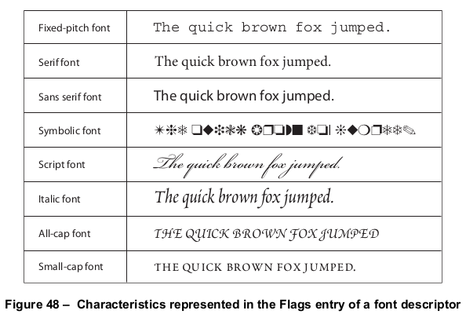

# 9.8 字体描述符

**Font Descriptors**

## 9.8.1 概述

**General**

=== "中文"

    A *font descriptor* specifies metrics and other attributes of a simple font or a CIDFont as a whole, as distinct from the metrics of individual glyphs. These font metrics provide information that enables a conforming reader to synthesize a substitute font or select a similar font when the font program is unavailable. The font descriptor may also be used to embed the font program in the PDF file.
    
    Font descriptors shall not be used with Type 0 fonts. Beginning with PDF 1.5, font descriptors may be used with Type 3 fonts.
    
    A font descriptor is a dictionary whose entries specify various font attributes. The entries common to all font descriptors—for both simple fonts and CIDFonts—are listed in Table 122. Additional entries in the font descriptor for a CIDFont are described in [9.8.3], "Font Descriptors for CIDFonts". All integer values shall be units in glyph space. The conversion from glyph space to text space is described in [9.2.4], "Glyph Positioning and Metrics".
    
    <table id="table122" markdown="span">
        <caption><strong>Table 122 – Entries common to all font descriptors</strong></caption>
        <thead>
            <tr>
                <th><strong>Key</strong></th>
                <th><strong>Type</strong></th>
                <th><strong>Value</strong></th>
            </tr>
        </thead>
        <tbody>
            <tr>
                <td>**Type**</td>
                <td>name</td>
                <td>(*Required*) The type of PDF object that this dictionary describes; shall be **FontDescriptor** for a font descriptor.</td>
            </tr>
            <tr>
                <td>**FontName**</td>
                <td>name</td>
                <td>(*Required*) The PostScript name of the font. This name shall be the same as the value of **BaseFont** in the font or CIDFont dictionary that refers to this font descriptor.</td>
            </tr>
            <tr>
                <td>**FontFamily**</td>
                <td>byte string</td>
                <td>(*Optional; PDF 1.5; should be used for Type 3 fonts in Tagged PDF documents*) A byte string specifying the preferred font family name.
    
    !!! info "EXAMPLE 1"
    
        For the font Times Bold Italic, the **FontFamily** is Times.
    </td>
            </tr>
            <tr>
                <td>**FontStretch**</td>
                <td>name</td>
                <td>(*Optional; PDF 1.5; should be used for Type 3 fonts in Tagged PDF documents*) The font stretch value. It shall be one of these names (ordered from narrowest to widest): UltraCondensed, ExtraCondensed, Condensed, SemiCondensed, Normal, SemiExpanded, Expanded, ExtraExpanded or UltraExpanded.<br/>
                    The specific interpretation of these values varies from font to font.<br/>
    
    !!! info "EXAMPLE 2"
    
        ***Condensed*** in one font may appear most similar to ***Normal*** in another.
    </td>
            </tr>
            <tr>
                <td>**FontWeight**</td>
                <td>number</td>
                <td>(*Optional; PDF 1.5; should be used for Type 3 fonts in Tagged PDF documents*) The weight (thickness) component of the fully-qualified font name or font specifier. The possible values shall be 100, 200, 300, 400, 500, 600, 700, 800, or 900, where each number indicates a weight that is at least as dark as its predecessor. A value of 400 shall indicate a normal weight; 700 shall indicate bold.
    
    The specific interpretation of these values varies from font to font.
    
    !!! info "EXAMPLE 3"
    
        300 in one font may appear most similar to 500 in another.
    </td>
            </tr>
            <tr>
                <td>**Flags**</td>
                <td>integer</td>
                <td>(*Required*) A collection of flags defining various characteristics of the font (see [9.8.2], "Font Descriptor Flags").</td>
            </tr>
            <tr>
                <td>**FontBBox**</td>
                <td>rectangle</td>
                <td>(*Required, except for Type 3 fonts*) A rectangle (see [7.9.5], "Rectangles"), expressed in the glyph coordinate system, that shall specify the font bounding box. This should be the smallest rectangle enclosing the shape that would result if all of the glyphs of the font were placed with their origins coincident and then filled.</td>
            </tr>
            <tr>
                <td>**ItalicAngle**</td>
                <td>number</td>
                <td>(*Required*) The angle, expressed in degrees counterclockwise from the vertical, of the dominant vertical strokes of the font.
    
    !!! info "EXAMPLE 4"
    
        The 9-o’clock position is 90 degrees, and the 3-o’clock position is –90 degrees.
    
    The value shall be negative for fonts that slope to the right, as almost all italic fonts do.
    </td>
            </tr>
            <tr>
                <td>**Ascent**</td>
                <td>number</td>
                <td>(*Required, except for Type 3 fonts*) The maximum height above the baseline reached by glyphs in this font. The height of glyphs for accented characters shall be excluded.</td>
            </tr>
            <tr>
                <td>**Descent**</td>
                <td>number</td>
                <td>(*Required, except for Type 3 fonts*) The maximum depth below the baseline reached by glyphs in this font. The value shall be a negative number.</td>
            </tr>
            <tr>
                <td>**Leading**</td>
                <td>number</td>
                <td>(*Optional*) The spacing between baselines of consecutive lines of text. Default value: 0.</td>
            </tr>
            <tr>
                <td>**CapHeight**</td>
                <td>number</td>
                <td>(*Required for fonts that have Latin characters, except for Type 3 fonts*) The vertical coordinate of the top of flat capital letters, measured from the baseline.</td>
            </tr>
            <tr>
                <td>**XHeight**</td>
                <td>number</td>
                <td>(*Optional*) The font’s x height: the vertical coordinate of the top of flat nonascending lowercase letters (like the letter x), measured from the baseline, in fonts that have Latin characters. Default value: 0.</td>
            </tr>
            <tr>
                <td>**StemV**</td>
                <td>number</td>
                <td>(*Required, except for Type 3 fonts*) The thickness, measured horizontally, of the dominant vertical stems of glyphs in the font.</td>
            </tr>
            <tr>
                <td>**StemH**</td>
                <td>number</td>
                <td>(*Optional*) The thickness, measured vertically, of the dominant horizontal stems of glyphs in the font. Default value: 0.</td>
            </tr>
            <tr>
                <td>**AvgWidth**</td>
                <td>number</td>
                <td>(*Optional*) The average width of glyphs in the font. Default value: 0.</td>
            </tr>
            <tr>
                <td>**MaxWidth**</td>
                <td>number</td>
                <td>(*Optional*) The maximum width of glyphs in the font. Default value: 0.</td>
            </tr>
            <tr>
                <td>**MissingWidth**</td>
                <td>number</td>
                <td>(*Optional*) The width to use for character codes whose widths are not specified in a font dictionary’s **Widths** array. This shall have a predictable effect only if all such codes map to glyphs whose actual widths are the same as the value of the **MissingWidth** entry. Default value: 0.</td>
            </tr>
            <tr>
                <td>**FontFile**</td>
                <td>stream</td>
                <td>(*Optional*) A stream containing a Type 1 font program (see [9.9], "Embedded Font Programs").</td>
            </tr>
            <tr>
                <td>**FontFile2**</td>
                <td>stream</td>
                <td>(*Optional; PDF 1.1*) A stream containing a TrueType font program (see [9.9], "Embedded Font Programs").</td>
            </tr>
            <tr>
                <td>**FontFile3**</td>
                <td>stream</td>
                <td>(*Optional; PDF 1.2*) A stream containing a font program whose format is specified by the **Subtype** entry in the stream dictionary (see [Table 126](./s9.md#table126)).</td>
            </tr>
            <tr>
                <td>**ToUnicode**</td>
                <td>ASCII string or byte string</td>
                <td>(*Optional; meaningful only in Type 1 fonts; PDF 1.1*) A string listing the character names defined in a font subset. The names in this string shall be in PDF syntax—that is, each name preceded by a slash (/). The names may appear in any order. The name . notdef shall be omitted; it shall exist in the font subset. If this entry is absent, the only indication of a font subset shall be the subset tag in the **FontName** entry (see [9.6.4], "Font Subsets").</td>
            </tr>
        </tbody>
    </table>
    
    At most, only one of the FontFile, FontFile2, and FontFile3 entries shall be present.

=== "英文"

    A *font descriptor* specifies metrics and other attributes of a simple font or a CIDFont as a whole, as distinct from the metrics of individual glyphs. These font metrics provide information that enables a conforming reader to synthesize a substitute font or select a similar font when the font program is unavailable. The font descriptor may also be used to embed the font program in the PDF file.
    
    Font descriptors shall not be used with Type 0 fonts. Beginning with PDF 1.5, font descriptors may be used with Type 3 fonts.
    
    A font descriptor is a dictionary whose entries specify various font attributes. The entries common to all font descriptors—for both simple fonts and CIDFonts—are listed in Table 122. Additional entries in the font descriptor for a CIDFont are described in [9.8.3], "Font Descriptors for CIDFonts". All integer values shall be units in glyph space. The conversion from glyph space to text space is described in [9.2.4], "Glyph Positioning and Metrics".
    
    <table id="table122" markdown="span">
        <caption><strong>Table 122 – Entries common to all font descriptors</strong></caption>
        <thead>
            <tr>
                <th><strong>Key</strong></th>
                <th><strong>Type</strong></th>
                <th><strong>Value</strong></th>
            </tr>
        </thead>
        <tbody>
            <tr>
                <td>**Type**</td>
                <td>name</td>
                <td>(*Required*) The type of PDF object that this dictionary describes; shall be **FontDescriptor** for a font descriptor.</td>
            </tr>
            <tr>
                <td>**FontName**</td>
                <td>name</td>
                <td>(*Required*) The PostScript name of the font. This name shall be the same as the value of **BaseFont** in the font or CIDFont dictionary that refers to this font descriptor.</td>
            </tr>
            <tr>
                <td>**FontFamily**</td>
                <td>byte string</td>
                <td>(*Optional; PDF 1.5; should be used for Type 3 fonts in Tagged PDF documents*) A byte string specifying the preferred font family name.
    
    !!! info "EXAMPLE 1"
    
        For the font Times Bold Italic, the **FontFamily** is Times.
    </td>
            </tr>
            <tr>
                <td>**FontStretch**</td>
                <td>name</td>
                <td>(*Optional; PDF 1.5; should be used for Type 3 fonts in Tagged PDF documents*) The font stretch value. It shall be one of these names (ordered from narrowest to widest): UltraCondensed, ExtraCondensed, Condensed, SemiCondensed, Normal, SemiExpanded, Expanded, ExtraExpanded or UltraExpanded.<br/>
                    The specific interpretation of these values varies from font to font.<br/>
    
    !!! info "EXAMPLE 2"
    
        ***Condensed*** in one font may appear most similar to ***Normal*** in another.
    </td>
            </tr>
            <tr>
                <td>**FontWeight**</td>
                <td>number</td>
                <td>(*Optional; PDF 1.5; should be used for Type 3 fonts in Tagged PDF documents*) The weight (thickness) component of the fully-qualified font name or font specifier. The possible values shall be 100, 200, 300, 400, 500, 600, 700, 800, or 900, where each number indicates a weight that is at least as dark as its predecessor. A value of 400 shall indicate a normal weight; 700 shall indicate bold.
    
    The specific interpretation of these values varies from font to font.
    
    !!! info "EXAMPLE 3"
    
        300 in one font may appear most similar to 500 in another.
    </td>
            </tr>
            <tr>
                <td>**Flags**</td>
                <td>integer</td>
                <td>(*Required*) A collection of flags defining various characteristics of the font (see [9.8.2], "Font Descriptor Flags").</td>
            </tr>
            <tr>
                <td>**FontBBox**</td>
                <td>rectangle</td>
                <td>(*Required, except for Type 3 fonts*) A rectangle (see [7.9.5], "Rectangles"), expressed in the glyph coordinate system, that shall specify the font bounding box. This should be the smallest rectangle enclosing the shape that would result if all of the glyphs of the font were placed with their origins coincident and then filled.</td>
            </tr>
            <tr>
                <td>**ItalicAngle**</td>
                <td>number</td>
                <td>(*Required*) The angle, expressed in degrees counterclockwise from the vertical, of the dominant vertical strokes of the font.
    
    !!! info "EXAMPLE 4"
    
        The 9-o’clock position is 90 degrees, and the 3-o’clock position is –90 degrees.
    
    The value shall be negative for fonts that slope to the right, as almost all italic fonts do.
    </td>
            </tr>
            <tr>
                <td>**Ascent**</td>
                <td>number</td>
                <td>(*Required, except for Type 3 fonts*) The maximum height above the baseline reached by glyphs in this font. The height of glyphs for accented characters shall be excluded.</td>
            </tr>
            <tr>
                <td>**Descent**</td>
                <td>number</td>
                <td>(*Required, except for Type 3 fonts*) The maximum depth below the baseline reached by glyphs in this font. The value shall be a negative number.</td>
            </tr>
            <tr>
                <td>**Leading**</td>
                <td>number</td>
                <td>(*Optional*) The spacing between baselines of consecutive lines of text. Default value: 0.</td>
            </tr>
            <tr>
                <td>**CapHeight**</td>
                <td>number</td>
                <td>(*Required for fonts that have Latin characters, except for Type 3 fonts*) The vertical coordinate of the top of flat capital letters, measured from the baseline.</td>
            </tr>
            <tr>
                <td>**XHeight**</td>
                <td>number</td>
                <td>(*Optional*) The font’s x height: the vertical coordinate of the top of flat nonascending lowercase letters (like the letter x), measured from the baseline, in fonts that have Latin characters. Default value: 0.</td>
            </tr>
            <tr>
                <td>**StemV**</td>
                <td>number</td>
                <td>(*Required, except for Type 3 fonts*) The thickness, measured horizontally, of the dominant vertical stems of glyphs in the font.</td>
            </tr>
            <tr>
                <td>**StemH**</td>
                <td>number</td>
                <td>(*Optional*) The thickness, measured vertically, of the dominant horizontal stems of glyphs in the font. Default value: 0.</td>
            </tr>
            <tr>
                <td>**AvgWidth**</td>
                <td>number</td>
                <td>(*Optional*) The average width of glyphs in the font. Default value: 0.</td>
            </tr>
            <tr>
                <td>**MaxWidth**</td>
                <td>number</td>
                <td>(*Optional*) The maximum width of glyphs in the font. Default value: 0.</td>
            </tr>
            <tr>
                <td>**MissingWidth**</td>
                <td>number</td>
                <td>(*Optional*) The width to use for character codes whose widths are not specified in a font dictionary’s **Widths** array. This shall have a predictable effect only if all such codes map to glyphs whose actual widths are the same as the value of the **MissingWidth** entry. Default value: 0.</td>
            </tr>
            <tr>
                <td>**FontFile**</td>
                <td>stream</td>
                <td>(*Optional*) A stream containing a Type 1 font program (see [9.9], "Embedded Font Programs").</td>
            </tr>
            <tr>
                <td>**FontFile2**</td>
                <td>stream</td>
                <td>(*Optional; PDF 1.1*) A stream containing a TrueType font program (see [9.9], "Embedded Font Programs").</td>
            </tr>
            <tr>
                <td>**FontFile3**</td>
                <td>stream</td>
                <td>(*Optional; PDF 1.2*) A stream containing a font program whose format is specified by the **Subtype** entry in the stream dictionary (see [Table 126](./s9.md#table126)).</td>
            </tr>
            <tr>
                <td>**ToUnicode**</td>
                <td>ASCII string or byte string</td>
                <td>(*Optional; meaningful only in Type 1 fonts; PDF 1.1*) A string listing the character names defined in a font subset. The names in this string shall be in PDF syntax—that is, each name preceded by a slash (/). The names may appear in any order. The name . notdef shall be omitted; it shall exist in the font subset. If this entry is absent, the only indication of a font subset shall be the subset tag in the **FontName** entry (see [9.6.4], "Font Subsets").</td>
            </tr>
        </tbody>
    </table>
    
    At most, only one of the FontFile, FontFile2, and FontFile3 entries shall be present.

## 9.8.2 字体描述符标志

**Font Descriptor Flags**

=== "中文"

    The value of the **Flags** entry in a font descriptor shall be an unsigned 32-bit integer containing flags specifying various characteristics of the font. Bit positions within the flag word are numbered from 1 (low-order) to 32 (high-order). Table 123 shows the meanings of the flags; all undefined flag bits are reserved and shall be set to 0 by conforming writers. Figure 48 shows examples of fonts with these characteristics.
        
    <table id="table123" markdown="span">
        <caption><strong>Table 123 – Font flags</strong></caption>
        <thead>
            <tr>
                <th><strong>Bit position</strong></th>
                <th><strong>Name</strong></th>
                <th><strong>Meaning</strong></th>
            </tr>
        </thead>
        <tbody>
            <tr>
                <td>1</td>
                <td>FixedPitch</td>
                <td>All glyphs have the same width (as opposed to proportional or variable-pitch fonts, which have different widths).</td>
            </tr>
            <tr>
                <td>2</td>
                <td>Serif</td>
                <td>Glyphs have serifs, which are short strokes drawn at an angle on the top and bottom of glyph stems. (*Sans serif* fonts do not have serifs.)</td>
            </tr>
            <tr>
                <td>3</td>
                <td>Symbolic</td>
                <td>Font contains glyphs outside the Adobe standard Latin character set. This flag and the Nonsymbolic flag shall not both be set or both be clear.</td>
            </tr>
            <tr>
                <td>4</td>
                <td>Script</td>
                <td>Glyphs resemble cursive handwriting.</td>
            </tr>
            <tr>
                <td>6</td>
                <td>Nonsymbolic</td>
                <td>Font uses the Adobe standard Latin character set or a subset of it.</td>
            </tr>
            <tr>
                <td>7</td>
                <td>Italic</td>
                <td>Glyphs have dominant vertical strokes that are slanted.</td>
            </tr>
            <tr>
                <td>17</td>
                <td>AllCap</td>
                <td>Font contains no lowercase letters; typically used for display purposes, such as for titles or headlines.</td>
            </tr>
            <tr>
                <td>18</td>
                <td>SmallCap</td>
                <td>Font contains both uppercase and lowercase letters. The uppercase letters are similar to those in the regular version of the same typeface family. The glyphs for the lowercase letters have the same shapes as the corresponding uppercase letters, but they are sized and their proportions adjusted so that they have the same size and stroke weight as lowercase glyphs in the same typeface family.</td>
            </tr>
            <tr>
                <td>19</td>
                <td>ForceBold</td>
                <td>See description after Note 1 in this sub-clause.</td>
            </tr>
        </tbody>
    </table>
    
    The Nonsymbolic flag (bit 6 in the **Flags** entry) indicates that the font’s character set is the Adobe standard Latin character set (or a subset of it) and that it uses the standard names for those glyphs. This character set is shown in [D.2](../a4.md#d2-拉丁字符集和编码), "Latin Character Set and Encodings". If the font contains any glyphs outside this set, the Symbolic flag shall be set and the Nonsymbolic flag shall be clear. In other words, any font whose character set is not a subset of the Adobe standard character set shall be considered to be symbolic. This influences the font’s implicit base encoding and may affect a conforming reader’s font substitution strategies.
    
    
    
    !!! note "NOTE 1"
    
        This classification of nonsymbolic and symbolic fonts is peculiar to PDF. A font may contain additional characters that are used in Latin writing systems but are outside the Adobe standard Latin character set; PDF considers such a font to be symbolic. The use of two flags to represent a single binary choice is a historical accident.
    
    The ForceBold flag (bit 19) shall determine whether bold glyphs shall be painted with extra pixels even at very small text sizes by a conforming reader. If the ForceBold flag is set, features of bold glyphs may be thickened at small text sizes.
    
    !!! note "NOTE 2"
    
        Typically, when glyphs are painted at small sizes on very low-resolution devices such as display screens, features of bold glyphs may appear only 1 pixel wide. Because this is the minimum feature width on a pixel- based device, ordinary (nonbold) glyphs also appear with 1-pixel-wide features and therefore cannot be distinguished from bold glyphs.
    
    !!! info "EXAMPLE"
    
        This code sample illustrates a font descriptor whose Flags entry has the Serif, Nonsymbolic, and ForceBold flags (bits 2, 6, and 19) set.
    
        ```tex
        7 0 obj
            << /Type /FontDescriptor
               /FontName /AGaramond-Semibold
               /Flags 262178                        % Bits 2, 6, and 19
               /FontBBox [ −177 −269 1123 866 ]
               /MissingWidth 255
               /StemV 105
               /StemH 45
               /CapHeight 660
               /XHeight 394
               /Ascent 720
               /Descent −270
               /Leading 83
               /MaxWidth 1212
               /AvgWidth 478
               /ItalicAngle 0
            >>
        endobj
        ```

=== "英文"

    The value of the **Flags** entry in a font descriptor shall be an unsigned 32-bit integer containing flags specifying various characteristics of the font. Bit positions within the flag word are numbered from 1 (low-order) to 32 (high-order). Table 123 shows the meanings of the flags; all undefined flag bits are reserved and shall be set to 0 by conforming writers. Figure 48 shows examples of fonts with these characteristics.
        
    <table id="table123" markdown="span">
        <caption><strong>Table 123 – Font flags</strong></caption>
        <thead>
            <tr>
                <th><strong>Bit position</strong></th>
                <th><strong>Name</strong></th>
                <th><strong>Meaning</strong></th>
            </tr>
        </thead>
        <tbody>
            <tr>
                <td>1</td>
                <td>FixedPitch</td>
                <td>All glyphs have the same width (as opposed to proportional or variable-pitch fonts, which have different widths).</td>
            </tr>
            <tr>
                <td>2</td>
                <td>Serif</td>
                <td>Glyphs have serifs, which are short strokes drawn at an angle on the top and bottom of glyph stems. (*Sans serif* fonts do not have serifs.)</td>
            </tr>
            <tr>
                <td>3</td>
                <td>Symbolic</td>
                <td>Font contains glyphs outside the Adobe standard Latin character set. This flag and the Nonsymbolic flag shall not both be set or both be clear.</td>
            </tr>
            <tr>
                <td>4</td>
                <td>Script</td>
                <td>Glyphs resemble cursive handwriting.</td>
            </tr>
            <tr>
                <td>6</td>
                <td>Nonsymbolic</td>
                <td>Font uses the Adobe standard Latin character set or a subset of it.</td>
            </tr>
            <tr>
                <td>7</td>
                <td>Italic</td>
                <td>Glyphs have dominant vertical strokes that are slanted.</td>
            </tr>
            <tr>
                <td>17</td>
                <td>AllCap</td>
                <td>Font contains no lowercase letters; typically used for display purposes, such as for titles or headlines.</td>
            </tr>
            <tr>
                <td>18</td>
                <td>SmallCap</td>
                <td>Font contains both uppercase and lowercase letters. The uppercase letters are similar to those in the regular version of the same typeface family. The glyphs for the lowercase letters have the same shapes as the corresponding uppercase letters, but they are sized and their proportions adjusted so that they have the same size and stroke weight as lowercase glyphs in the same typeface family.</td>
            </tr>
            <tr>
                <td>19</td>
                <td>ForceBold</td>
                <td>See description after Note 1 in this sub-clause.</td>
            </tr>
        </tbody>
    </table>
    
    The Nonsymbolic flag (bit 6 in the **Flags** entry) indicates that the font’s character set is the Adobe standard Latin character set (or a subset of it) and that it uses the standard names for those glyphs. This character set is shown in [D.2](../a4.md#d2-拉丁字符集和编码), "Latin Character Set and Encodings". If the font contains any glyphs outside this set, the Symbolic flag shall be set and the Nonsymbolic flag shall be clear. In other words, any font whose character set is not a subset of the Adobe standard character set shall be considered to be symbolic. This influences the font’s implicit base encoding and may affect a conforming reader’s font substitution strategies.
    
    
    
    !!! note "NOTE 1"
    
        This classification of nonsymbolic and symbolic fonts is peculiar to PDF. A font may contain additional characters that are used in Latin writing systems but are outside the Adobe standard Latin character set; PDF considers such a font to be symbolic. The use of two flags to represent a single binary choice is a historical accident.
    
    The ForceBold flag (bit 19) shall determine whether bold glyphs shall be painted with extra pixels even at very small text sizes by a conforming reader. If the ForceBold flag is set, features of bold glyphs may be thickened at small text sizes.
    
    !!! note "NOTE 2"
    
        Typically, when glyphs are painted at small sizes on very low-resolution devices such as display screens, features of bold glyphs may appear only 1 pixel wide. Because this is the minimum feature width on a pixel- based device, ordinary (nonbold) glyphs also appear with 1-pixel-wide features and therefore cannot be distinguished from bold glyphs.
    
    !!! info "EXAMPLE"
    
        This code sample illustrates a font descriptor whose Flags entry has the Serif, Nonsymbolic, and ForceBold flags (bits 2, 6, and 19) set.
    
        ```tex
        7 0 obj
            << /Type /FontDescriptor
               /FontName /AGaramond-Semibold
               /Flags 262178                        % Bits 2, 6, and 19
               /FontBBox [ −177 −269 1123 866 ]
               /MissingWidth 255
               /StemV 105
               /StemH 45
               /CapHeight 660
               /XHeight 394
               /Ascent 720
               /Descent −270
               /Leading 83
               /MaxWidth 1212
               /AvgWidth 478
               /ItalicAngle 0
            >>
        endobj
        ```

## 9.8.3 CIDFonts 的字体描述符

**Font Descriptors for CIDFonts**

### 9.8.3.1 概述

**General**

=== "中文"

    In addition to the entries in [Table 122](#table122), the **FontDescriptor** dictionaries of CIDFonts may contain the entries listed in Table 124.
            
    <table id="table124" markdown="span">
        <caption><strong>Table 124 – Additional font descriptor entries for CIDFonts</strong></caption>
        <thead>
            <tr>
                <th><strong>Bit position</strong></th>
                <th><strong>Name</strong></th>
                <th><strong>Meaning</strong></th>
            </tr>
        </thead>
        <tbody>
            <tr>
                <td>**Style**</td>
                <td>dictionary</td>
                <td>(Optional) A dictionary containing entries that describe the style of the glyphs in the font (see [9.8.3.2], "Style").</td>
            </tr>
            <tr>
                <td>**Lang**</td>
                <td>name</td>
                <td>(Optional; PDF 1.5) A name specifying the language of the font, which may be used for encodings where the language is not implied by the encoding itself. The value shall be one of the codes defined by Internet RFC 3066, *Tags for the Identification of Languages or (PDF 1.0) 2*-character language codes defined by ISO 639 (see the Bibliography). If this entry is absent, the language shall be considered to be unknown.</td>
            </tr>
            <tr>
                <td>**FD**</td>
                <td>dictionary</td>
                <td>(Optional) A dictionary whose keys identify a class of glyphs in a CIDFont. Each value shall be a dictionary containing entries that shall override the corresponding values in the main font descriptor dictionary for that class of glyphs (see [9.8.3.3], "FD").</td>
            </tr>
            <tr>
                <td>**CIDSet**</td>
                <td>stream</td>
                <td>(Optional) A stream identifying which CIDs are present in the CIDFont file. If this entry is present, the CIDFont shall contain only a subset of the glyphs in the character collection defined by the **CIDSystemInfo** dictionary. If it is absent, the only indication of a CIDFont subset shall be the subset tag in the **FontName** entry (see [9.6.4], "Font Subsets").<br/>
                    The stream’s data shall be organized as a table of bits indexed by CID. The bits shall be stored in bytes with the high-order bit first. Each bit shall correspond to a CID. The most significant bit of the first byte shall correspond to CID 0, the next bit to CID 1, and so on.</td>
            </tr>
        </tbody>
    </table>

=== "英文"

    In addition to the entries in [Table 122](#table122), the **FontDescriptor** dictionaries of CIDFonts may contain the entries listed in Table 124.
            
    <table id="table124" markdown="span">
        <caption><strong>Table 124 – Additional font descriptor entries for CIDFonts</strong></caption>
        <thead>
            <tr>
                <th><strong>Bit position</strong></th>
                <th><strong>Name</strong></th>
                <th><strong>Meaning</strong></th>
            </tr>
        </thead>
        <tbody>
            <tr>
                <td>**Style**</td>
                <td>dictionary</td>
                <td>(Optional) A dictionary containing entries that describe the style of the glyphs in the font (see [9.8.3.2], "Style").</td>
            </tr>
            <tr>
                <td>**Lang**</td>
                <td>name</td>
                <td>(Optional; PDF 1.5) A name specifying the language of the font, which may be used for encodings where the language is not implied by the encoding itself. The value shall be one of the codes defined by Internet RFC 3066, *Tags for the Identification of Languages or (PDF 1.0) 2*-character language codes defined by ISO 639 (see the Bibliography). If this entry is absent, the language shall be considered to be unknown.</td>
            </tr>
            <tr>
                <td>**FD**</td>
                <td>dictionary</td>
                <td>(Optional) A dictionary whose keys identify a class of glyphs in a CIDFont. Each value shall be a dictionary containing entries that shall override the corresponding values in the main font descriptor dictionary for that class of glyphs (see [9.8.3.3], "FD").</td>
            </tr>
            <tr>
                <td>**CIDSet**</td>
                <td>stream</td>
                <td>(Optional) A stream identifying which CIDs are present in the CIDFont file. If this entry is present, the CIDFont shall contain only a subset of the glyphs in the character collection defined by the **CIDSystemInfo** dictionary. If it is absent, the only indication of a CIDFont subset shall be the subset tag in the **FontName** entry (see [9.6.4], "Font Subsets").<br/>
                    The stream’s data shall be organized as a table of bits indexed by CID. The bits shall be stored in bytes with the high-order bit first. Each bit shall correspond to a CID. The most significant bit of the first byte shall correspond to CID 0, the next bit to CID 1, and so on.</td>
            </tr>
        </tbody>
    </table>

### 9.8.3.2 样式

**Style**

=== "中文"

    The **Style** dictionary contains entries that define style attributes and values for the CIDFont. Only the **Panose** entry is defined. The value of **Panose** shall be a 12-byte string consisting of these elements:
    
    - The font family class and subclass ID bytes, given in the sFamilyClass field of the “OS/2” table in a TrueType font. This field is documented in Microsoft’s *TrueType 1.0* Font Files Technical Specification.
    - Ten bytes for the PANOSE classification number for the font. The PANOSE classification system is documented in Hewlett-Packard Company’s *PANOSE Classification Metrics Guide*.
    
    See the Bibliography for more information about these documents.
    
    !!! info "EXAMPLE"
    
        This is an example of a **Style** entry in the font descriptor:
        
        ```tex
        /Style << /Panose < 01 05 02 02 03 00 00 00 00 00 00 00 > >>
        ```

=== "英文"

    The **Style** dictionary contains entries that define style attributes and values for the CIDFont. Only the **Panose** entry is defined. The value of **Panose** shall be a 12-byte string consisting of these elements:
    
    - The font family class and subclass ID bytes, given in the sFamilyClass field of the “OS/2” table in a TrueType font. This field is documented in Microsoft’s *TrueType 1.0* Font Files Technical Specification.
    - Ten bytes for the PANOSE classification number for the font. The PANOSE classification system is documented in Hewlett-Packard Company’s *PANOSE Classification Metrics Guide*.
    
    See the Bibliography for more information about these documents.
    
    !!! info "EXAMPLE"
    
        This is an example of a **Style** entry in the font descriptor:
        
        ```tex
        /Style << /Panose < 01 05 02 02 03 00 00 00 00 00 00 00 > >>
        ```

### 9.8.3.3 FD

**FD**

=== "中文"

    A CIDFont may be made up of different classes of glyphs, each class requiring different sets of the font-wide attributes that appear in font descriptors.
    
    !!! info "EXAMPLE 1"
    
        Latin glyphs, for example, may require different attributes than kanji glyphs.
    
    The font descriptor shall define a set of default attributes that apply to all glyphs in the CIDFont. The **FD** entry in the font descriptor shall contain exceptions to these defaults.
    
    The key for each entry in an **FD** dictionary shall be the name of a class of glyphs—that is, a particular subset of the CIDFont’s character collection. The entry’s value shall be a font descriptor whose contents shall override the font-wide attributes for that class only. This font descriptor shall contain entries for metric information only; it shall not include **FontFile**, **FontFile2**, **FontFile3**, or any of the entries listed in [Table 122](#table122).
    
    The **FD** dictionary should contain at least the metrics for the proportional Latin glyphs. With the information for these glyphs, a more accurate substitution font can be created.
    
    The names of the glyph classes depend on the character collection, as identified by the **Registry**, **Ordering**, and **Supplement** entries in the **CIDSystemInfo** dictionary. Table 125 lists the valid keys for the Adobe-GB1, Adobe-CNS1, Adobe-Japan1, Adobe-Japan2, and Adobe-Korea1 character collections.
    
    <table id="table125" markdown="span">
        <caption><strong>Table 125 – Glyph classes in CJK fonts</strong></caption>
        <thead>
            <tr>
                <th><strong>Character Collection</strong></th>
                <th><strong>Class</strong></th>
                <th><strong>Glyphs in Class</strong></th>
            </tr>
        </thead>
        <tbody>
            <tr>
                <td>Adobe-GB1</td>
                <td>
                    **Alphabetic**<br/>
                    **Dingbats**<br/>
                    **Generic**<br/>
                    **Hanzi**<br/>
                    **HRoman**<br/>
                    **HRomanRot**<br/>
                    **Kana**<br/>
                    **Proportional**<br/>
                    **ProportionalRot**<br/>
                </td>
                <td>
                    Full-width Latin, Greek, and Cyrillic glyphs<br/>
                    Special symbols<br/>
                    Typeface-independent glyphs, such as line-drawing<br/>
                    Full-width hanzi (Chinese) glyphs<br/>
                    Half-width Latin glyphs<br/>
                    Same as HRoman but rotated for use in vertical writing<br/>
                    Japanese kana (katakana and hiragana) glyphs<br/>
                    Proportional Latin glyphs<br/>
                    Same as Proportional but rotated for use in vertical writing<br/>
                </td>
            </tr>
            <tr>
                <td>Adobe-CNS1</td>
                <td>
                    **Alphabetic**<br/>
                    **Dingbats**<br/>
                    **Generic**<br/>
                    **Hanzi**<br/>
                    **HRoman**<br/>
                    **HRomanRot**<br/>
                    **Kana**<br/>
                    **Proportional**<br/>
                    **ProportionalRot**<br/>
                </td>
                <td>
                    Full-width Latin, Greek, and Cyrillic glyphs<br/>
                    Special symbols<br/>
                    Typeface-independent glyphs, such as line-drawing<br/>
                    Full-width hanzi (Chinese) glyphs<br/>
                    Half-width Latin glyphs<br/>
                    Same as **HRoman** but rotated for use in vertical writing<br/>
                    Japanese kana (katakana and hiragana) glyphs<br/>
                    Proportional Latin glyphs<br/>
                    Same as **Proportional** but rotated for use in vertical writing<br/>
                </td>
            </tr>
            <tr>
                <td>Adobe-Japan1</td>
                <td>
                    **Alphabetic**<br/>
                    **AlphaNum**<br/>
                    **Dingbats**<br/>
                    **DingbatsRot**<br/>
                    **Generic**<br/>
                    **GenericRot**<br/>
                    **HKana**<br/>
                    **HKanaRot**<br/>
                    **HRoman**<br/>
                    **HRomanRot**<br/>
                    **Kana**<br/>
                    **Kanji**<br/>
                    **Proportional**<br/>
                    **ProportionalRot**<br/>
                    **Ruby**<br/>
                </td>
                <td>
                    Full-width Latin, Greek, and Cyrillic glyphs<br/>
                    Numeric glyphs<br/>
                    Special symbols<br/>
                    Same as Dingbats but rotated for use in vertical writing<br/>
                    Typeface-independent glyphs, such as line-drawing<br/>
                    Same as Generic but rotated for use in vertical writing<br/>
                    Half-width kana (katakana and hiragana) glyphs<br/>
                    Same as HKana but rotated for use in vertical writing<br/>
                    Half-width Latin glyphs<br/>
                    Same as HRoman but rotated for use in vertical writing<br/>
                    Full-width kana (katakana and hiragana) glyphs<br/>
                    Full-width kanji (Chinese) glyphs<br/>
                    Proportional Latin glyphs<br/>
                    Same as Proportional but rotated for use in vertical writing<br/>
                    Glyphs used for setting ruby (small glyphs that serve to<br/>
                    annotate other glyphs with meanings or readings)<br/>
                </td>
            </tr>
            <tr>
                <td>Adobe-Japan2</td>
                <td>
                    **Alphabetic**<br/>
                    **Dingbats**<br/>
                    **HojoKanji**<br/>
                </td>
                <td>
                    ull-width Latin, Greek, and Cyrillic glyphs<br/>
                    pecial symbols<br/>
                    ull-width kanji glyphs<br/>
                </td>
            </tr>
            <tr>
                <td>Adobe-Korea1</td>
                <td>
                    **Alphabetic**<br/>
                    **Dingbats**<br/>
                    **Generic**<br/>
                    **Hangul**<br/>
                    **Hanja**<br/>
                    **HRoman**<br/>
                    **HRomanRot**<br/>
                    **Kana**<br/>
                    **Proportional**<br/>
                    **ProportionalRot**<br/>
                </td>
                <td>
                Full-width Latin, Greek, and Cyrillic glyphs<br/>
                Special symbols<br/>
                Typeface-independent glyphs, such as line-drawing<br/>
                Hangul and jamo glyphs<br/>
                Full-width hanja (Chinese) glyphs<br/>
                Half-width Latin glyphs<br/>
                Same as **HRoman** but rotated for use in vertical writing<br/>
                Japanese kana (katakana and hiragana) glyphs<br/>
                Proportional Latin glyphs<br/>
                Same as **Proportional** but rotated for use in vertical writing<br/>
                </td>
            </tr>
        </tbody>
    </table>
    
    !!! info "EXAMPLE 2"
    
        This example illustrates an FD dictionary containing two entries.
    
        ```tex
        /FD << /Proportional 25 0 R
               /HKana 26 0 R
            >>
    
        25 0 obj
            << /Type /FontDescriptor
               /FontName /HeiseiMin-W3-Proportional
               /Flags 2
               /AvgWidth 478
               /MaxWidth 1212
               /MissingWidth 250
               /StemV 105
               /StemH 45
               /CapHeight 660
               /XHeight 394
               /Ascent 720
               /Descent −270
               /Leading 83
            >>
        endobj
    
        26 0 obj
            << /Type /FontDescriptor
               /FontName /HeiseiMin-W3-HKana
               /Flags 3
               /AvgWidth 500
               /MaxWidth 500
               /MissingWidth 500
               /StemV 50
               /StemH 75
               /Ascent 720
               /Descent 0
               /Leading 83
            >>
        endobj
        ```

=== "英文"

    A CIDFont may be made up of different classes of glyphs, each class requiring different sets of the font-wide attributes that appear in font descriptors.
    
    !!! info "EXAMPLE 1"
    
        Latin glyphs, for example, may require different attributes than kanji glyphs.
    
    The font descriptor shall define a set of default attributes that apply to all glyphs in the CIDFont. The **FD** entry in the font descriptor shall contain exceptions to these defaults.
    
    The key for each entry in an **FD** dictionary shall be the name of a class of glyphs—that is, a particular subset of the CIDFont’s character collection. The entry’s value shall be a font descriptor whose contents shall override the font-wide attributes for that class only. This font descriptor shall contain entries for metric information only; it shall not include **FontFile**, **FontFile2**, **FontFile3**, or any of the entries listed in [Table 122](#table122).
    
    The **FD** dictionary should contain at least the metrics for the proportional Latin glyphs. With the information for these glyphs, a more accurate substitution font can be created.
    
    The names of the glyph classes depend on the character collection, as identified by the **Registry**, **Ordering**, and **Supplement** entries in the **CIDSystemInfo** dictionary. Table 125 lists the valid keys for the Adobe-GB1, Adobe-CNS1, Adobe-Japan1, Adobe-Japan2, and Adobe-Korea1 character collections.
    
    <table id="table125" markdown="span">
        <caption><strong>Table 125 – Glyph classes in CJK fonts</strong></caption>
        <thead>
            <tr>
                <th><strong>Character Collection</strong></th>
                <th><strong>Class</strong></th>
                <th><strong>Glyphs in Class</strong></th>
            </tr>
        </thead>
        <tbody>
            <tr>
                <td>Adobe-GB1</td>
                <td>
                    **Alphabetic**<br/>
                    **Dingbats**<br/>
                    **Generic**<br/>
                    **Hanzi**<br/>
                    **HRoman**<br/>
                    **HRomanRot**<br/>
                    **Kana**<br/>
                    **Proportional**<br/>
                    **ProportionalRot**<br/>
                </td>
                <td>
                    Full-width Latin, Greek, and Cyrillic glyphs<br/>
                    Special symbols<br/>
                    Typeface-independent glyphs, such as line-drawing<br/>
                    Full-width hanzi (Chinese) glyphs<br/>
                    Half-width Latin glyphs<br/>
                    Same as HRoman but rotated for use in vertical writing<br/>
                    Japanese kana (katakana and hiragana) glyphs<br/>
                    Proportional Latin glyphs<br/>
                    Same as Proportional but rotated for use in vertical writing<br/>
                </td>
            </tr>
            <tr>
                <td>Adobe-CNS1</td>
                <td>
                    **Alphabetic**<br/>
                    **Dingbats**<br/>
                    **Generic**<br/>
                    **Hanzi**<br/>
                    **HRoman**<br/>
                    **HRomanRot**<br/>
                    **Kana**<br/>
                    **Proportional**<br/>
                    **ProportionalRot**<br/>
                </td>
                <td>
                    Full-width Latin, Greek, and Cyrillic glyphs<br/>
                    Special symbols<br/>
                    Typeface-independent glyphs, such as line-drawing<br/>
                    Full-width hanzi (Chinese) glyphs<br/>
                    Half-width Latin glyphs<br/>
                    Same as **HRoman** but rotated for use in vertical writing<br/>
                    Japanese kana (katakana and hiragana) glyphs<br/>
                    Proportional Latin glyphs<br/>
                    Same as **Proportional** but rotated for use in vertical writing<br/>
                </td>
            </tr>
            <tr>
                <td>Adobe-Japan1</td>
                <td>
                    **Alphabetic**<br/>
                    **AlphaNum**<br/>
                    **Dingbats**<br/>
                    **DingbatsRot**<br/>
                    **Generic**<br/>
                    **GenericRot**<br/>
                    **HKana**<br/>
                    **HKanaRot**<br/>
                    **HRoman**<br/>
                    **HRomanRot**<br/>
                    **Kana**<br/>
                    **Kanji**<br/>
                    **Proportional**<br/>
                    **ProportionalRot**<br/>
                    **Ruby**<br/>
                </td>
                <td>
                    Full-width Latin, Greek, and Cyrillic glyphs<br/>
                    Numeric glyphs<br/>
                    Special symbols<br/>
                    Same as Dingbats but rotated for use in vertical writing<br/>
                    Typeface-independent glyphs, such as line-drawing<br/>
                    Same as Generic but rotated for use in vertical writing<br/>
                    Half-width kana (katakana and hiragana) glyphs<br/>
                    Same as HKana but rotated for use in vertical writing<br/>
                    Half-width Latin glyphs<br/>
                    Same as HRoman but rotated for use in vertical writing<br/>
                    Full-width kana (katakana and hiragana) glyphs<br/>
                    Full-width kanji (Chinese) glyphs<br/>
                    Proportional Latin glyphs<br/>
                    Same as Proportional but rotated for use in vertical writing<br/>
                    Glyphs used for setting ruby (small glyphs that serve to<br/>
                    annotate other glyphs with meanings or readings)<br/>
                </td>
            </tr>
            <tr>
                <td>Adobe-Japan2</td>
                <td>
                    **Alphabetic**<br/>
                    **Dingbats**<br/>
                    **HojoKanji**<br/>
                </td>
                <td>
                    ull-width Latin, Greek, and Cyrillic glyphs<br/>
                    pecial symbols<br/>
                    ull-width kanji glyphs<br/>
                </td>
            </tr>
            <tr>
                <td>Adobe-Korea1</td>
                <td>
                    **Alphabetic**<br/>
                    **Dingbats**<br/>
                    **Generic**<br/>
                    **Hangul**<br/>
                    **Hanja**<br/>
                    **HRoman**<br/>
                    **HRomanRot**<br/>
                    **Kana**<br/>
                    **Proportional**<br/>
                    **ProportionalRot**<br/>
                </td>
                <td>
                Full-width Latin, Greek, and Cyrillic glyphs<br/>
                Special symbols<br/>
                Typeface-independent glyphs, such as line-drawing<br/>
                Hangul and jamo glyphs<br/>
                Full-width hanja (Chinese) glyphs<br/>
                Half-width Latin glyphs<br/>
                Same as **HRoman** but rotated for use in vertical writing<br/>
                Japanese kana (katakana and hiragana) glyphs<br/>
                Proportional Latin glyphs<br/>
                Same as **Proportional** but rotated for use in vertical writing<br/>
                </td>
            </tr>
        </tbody>
    </table>
    
    !!! info "EXAMPLE 2"
    
        This example illustrates an FD dictionary containing two entries.
    
        ```tex
        /FD << /Proportional 25 0 R
               /HKana 26 0 R
            >>
    
        25 0 obj
            << /Type /FontDescriptor
               /FontName /HeiseiMin-W3-Proportional
               /Flags 2
               /AvgWidth 478
               /MaxWidth 1212
               /MissingWidth 250
               /StemV 105
               /StemH 45
               /CapHeight 660
               /XHeight 394
               /Ascent 720
               /Descent −270
               /Leading 83
            >>
        endobj
    
        26 0 obj
            << /Type /FontDescriptor
               /FontName /HeiseiMin-W3-HKana
               /Flags 3
               /AvgWidth 500
               /MaxWidth 500
               /MissingWidth 500
               /StemV 50
               /StemH 75
               /Ascent 720
               /Descent 0
               /Leading 83
            >>
        endobj
        ```

[9.9]: ./s9.md

[9.6.4]: ./s6.md#964-字体子集
[9.8.2]: ./s8.md#982-字体描述符标志
[9.8.3]: ./s8.md#983-cidfonts-的字体描述符
[9.2.4]: ./s2.md#924-字形定位和规格
[7.9.5]: ../c7/s9.md#795-矩形

[9.8.3.2]: #9832-样式
[9.8.3.3]: #9833-fd